# Aspectos básicos: Datos, datos, en todas partes

## Bienvenido al certificado de Google Data Analytics

### Empezar

#### Bienvenido al curso de Google Data Analytics

¿Qué tienen en común las empresas de comercio electrónico, entretenimiento, atención médica, fabricación, marketing, finanzas, tecnología y cientos de otras industrias? Adivinaste: todas utilizan datos. Las organizaciones de todo tipo necesitan analistas de datos para mejorar sus procesos, identificar oportunidades y tendencias, lanzar nuevos productos, proporcionar un excelente servicio al cliente y tomar decisiones bien pensadas. Hola, soy Tony, gerente de programa de Google y analista de datos. Me gustaría darte la bienvenida al certificado de Google Data Analytics. Ahora bien, hay muchas y buenas razones para obtener este certificado. Quizá estés pensando en empezar una carrera en el emocionante mundo del análisis computacional de datos, o tal vez estés fascinado por el poder de los datos como yo. No importa lo que te haya traído aquí, estás en el lugar correcto para iniciar una carrera y aprender las habilidades propias de la industria del análisis de datos. Pero primero, ¿qué son exactamente los datos? Bueno, los datos son una colección de hechos. Esta colección puede incluir números, imágenes, videos, palabras, mediciones, observaciones y más. Una vez que tienes los datos, se los analiza mediante el análisis. El análisis de datos es la recopilación, transformación y organización de los datos para sacar conclusiones, hacer predicciones e impulsar una toma de decisiones fundamentada. Y eso no es todo. Los datos evolucionan con el tiempo, lo que significa que este análisis o la analítica, como lo llamamos, puede darnos nueva información a lo largo de todo el ciclo de vida de los datos. Los datos están en todas partes. Usas y creas datos todos los días. ¿Alguna vez has leído las reseñas de un producto antes de decidir si comprarlo o no? Eso es el análisis de datos. O tal vez monitorees tu actividad física para contar tus pasos a fin de mantenerte activo durante todo el día. Eso es el análisis de datos. Pero no solo usas datos. También creas enormes cantidades de datos todos los días. Cada vez que usas el teléfono, buscas algo en línea, haces streaming de música, compras con tarjeta de crédito, publicas en redes sociales o usas el GPS para mapear una ruta, estás creando datos. Nuestro mundo digital y los millones de dispositivos inteligentes que hay allí hacen que la cantidad de datos disponible realmente sea alucinante. Aquí, en Google, procesamos más de 40,000 búsquedas por segundo. Eso equivale a 3,500 millones de búsquedas al día y a 1,200 billones de búsquedas al año. Esta es otra forma de pensarlo. YouTube tiene casi dos mil millones de usuarios. Si los usuarios de YouTube fueran un país, sería el más grande del mundo. Todos esos datos están transformando el mundo que nos rodea. La publicación The Economist recientemente llamó a los datos «el recurso más valioso del mundo». Es fácil ver por qué los analistas de datos son tan valorados por sus organizaciones. ¿Qué hace exactamente un analista de datos? En pocas palabras, un analista de datos es alguien que colecciona, transforma y organiza datos con el fin de ayudar a tomar decisiones fundamentadas. Además de su rol en sí, una de las partes más emocionantes de ser analista de datos es la cantidad de oportunidades disponibles. La demanda de analistas de datos es mayor que la cantidad de personas calificadas para ocupar estas vacantes de empleo. Este programa de certificados es un gran primer paso en tu viaje hacia la búsqueda de un trabajo que te encante. Los analistas de datos tienen distintos antecedentes y todo tipo de experiencias de vida. No necesitas décadas de experiencia laboral ni una educación costosa para empezar. Muchos analistas de datos aprendieron solos las habilidades que necesitaban para conseguir su primer trabajo, como tú estás haciendo ahora. Ahora hablemos más sobre lo que vas a aprender. El certificado Google Data Analytics se divide en cursos basados en diferentes procesos para el análisis de datos. Se trata de preguntar, preparar, procesar, analizar, compartir y actuar. Mira estos videos en orden. Cada uno trata de un tema nuevo, y cada tema se basa en lo que has aprendido antes, lo que hace que sea fácil hacer un seguimiento de tu avance. Tú tienes el control. Aunque veas todo organizado por semanas, puedes completarlo a tu propio ritmo. Así que tú decides cuánto hacer cada día. Al final del programa, te llevarás todo lo que hayas aprendido; conviértelo en un proyecto que puedas usar para mostrar tus habilidades y sorprender a los gerentes de contratación en tus entrevistas de trabajo. También es posible que escuches hablar de «Googlers». Así llamamos a las personas que trabajan aquí en Google. Ellos podrán darte una visión interna de lo que es trabajar en nuestra industria y compartir historias personales de cómo ingresaron en este campo. También te darán excelentes consejos sobre cómo conseguir el trabajo de tus sueños. Mantente atento. Algunos de ellos van a presentarse ahora. Soy Angie. Soy gerente del programa de ingeniería en Google. Realmente creo que la limpieza de los datos es el corazón de los datos. Así es como logras conocer los datos, sus peculiaridades, sus defectos, sus misterios. Me encanta un buen misterio. Me parece casi un superpoder. Me sentía como un detective que había resuelto algo. Hola, soy Alex. Soy científico investigador en Google. Investigo los diferentes impactos de la inteligencia artificial en la sociedad y nuestros usuarios. Me llamo Lilah Jones. Soy parte del equipo de la nube. Tengo la oportunidad de dirigir un equipo de personas increíbles centradas en ayudar a los clientes a llegar a la nube. Hola, soy Evan. Soy gerente de portfolio de aprendizaje en Google. Tengo uno de los trabajos más geniales del mundo donde veo todas las diferentes tecnologías que afectan el big data y luego las incluyo en cursos de capacitación como este para que los estudiantes los hagan. Seré tu instructor del primero curso. Te guiaré en cada módulo, que tratará un tema específico de varias formas distintas. Tendrás videos, material de lectura, cuestionarios, actividades prácticas y temas de discusión para chatear con otros estudiantes en un foro en línea. Estoy muy emocionado de guiarte en este curso, pero en especial porque has elegido esta aventura. El aprendizaje permanente es algo que me apasiona mucho. Cuando crecí, miraba a mi alrededor y a menudo no veía muchas opciones disponibles para mí. No fue hasta que empecé a pensar en serio acerca de mi educación que me di cuenta de que tenía el control de generar mis propias oportunidades, y la educación era la clave que abriría esas puertas. Cuanto más aprendía y cuanto más trabajaba, más posibilidades se abrían. Si no hubiera ido tras ese conocimiento y continuado con desafíos, quizá hoy no estaría donde estoy. Aprender me permitió crecer personalmente, tener éxito, visitar lugares que nunca habría visto, y conocer gente que nunca habría conocido. Ahora voy a presentar a algunas de esas grandes personas. Hola, soy Ximena, analista financiera. Te ayudaré a aprender a preguntar correctamente sobre los datos, el proyecto en el que trabajas y los problemas que estás tratando de resolver. Hola, me llamo Hallie, directora de analítica. Estoy muy emocionada de mostrarte cómo preparar tus datos para que estén listos para su análisis. Hola, soy Sally, directora de analítica y mediciones. Juntos analizaremos cómo procesar y limpiar los datos. Para limpiar los datos, no es necesario agua y jabón. Me refiero a asegurarse de que los datos estén completos, correctos y sean relevantes para el problema que estás tratando de resolver. Hola, soy Ayanna, gerente de información global. Vamos a profundizar en el análisis. Aprenderás a recopilar, transformar, y organizar los datos para que puedas usarlos y descubrir información útil, sacar conclusiones y tomar excelentes decisiones. Me llamo Kevin y con mi experiencia como director de análisis en Google, te guiaré por lo que creo que es la parte más emocionante del proceso de análisis de datos: planificar, crear y presentar visualizaciones de datos eficaces y convincentes. Hola, me llamo Carrie. Estoy ansiosa por contarte sobre todas las cosas emocionantes que puedes hacer con la programación en R. ¿Estás listo? Hola, soy Rishie, gerente del plan de estudios de habilidades analíticas globales. Te voy a ayudar a reunir todo lo aprendido durante este programa mediante la creación de un caso práctico que dejará perplejo a cualquier gerente de contratación. Al igual que el toque final de un gran edificio muestra a todos que está completo, tu caso práctico hará alusión a tu gran logro de obtener un certificado de Google en análisis de datos. ¿Te entusiasma la posibilidad de convertirte en analista de datos? Hay tantas cosas que hacer con los datos. Estás a punto de entrar a un mundo completamente nuevo. ¿Listo? ¡Vamos!
¿Qué tienen en común las empresas de comercio electrónico, entretenimiento, atención médica, fabricación, marketing, finanzas, tecnología y cientos de otras industrias? Adivinaste: todas utilizan datos. Las organizaciones de todo tipo necesitan analistas de datos para mejorar sus procesos, identificar oportunidades y tendencias, lanzar nuevos productos, proporcionar un excelente servicio al cliente y tomar decisiones bien pensadas. Hola, soy Tony, gerente de programa de Google y analista de datos. Me gustaría darte la bienvenida al certificado de Google Data Analytics. Ahora bien, hay muchas y buenas razones para obtener este certificado. Quizá : agregado a la selección Presiona [CTRL + S] para guardar como nota.
es

#### Introducción al curso

«Datos. Datos. Datos. No puedo hacer ladrillos sin arcilla». ¿Alguna idea de quién lo dijo? Te daré una pista. No fue un director ejecutivo tecnológico famoso ni un analista de datos. La persona que dijo esto vivió mucho antes de que nacieran las empresas de tecnología. Pero apuesto a que has oído de él. Lo dijo Sherlock Holmes, el famoso detective creado por Sir Arthur Conan Doyle. Lo que Doyle quiso decir es que Holmes no podría haber llegado a ninguna conclusión, que serían los ladrillos que menciona, sin datos, es decir, arcilla. Probablemente no estés aquí para convertirte en un detective famoso, pero los datos serán los cimientos que usarás para todo lo que hagas en tu nueva carrera de analista de datos. Sherlock Holmes estaría de acuerdo. Al iniciar este programa, has demostrado que tú y Sherlock Holmes tienen algo en común: ambos tienen interés en aprender más. Es una de las cualidades más importantes que los analistas de datos pueden tener. Ahora, hay un montón de formas diferentes de explorar los datos, pero una de las grandes cosas acerca del análisis de datos es que a menudo puedes aprender como quieras, cuando quieras. Eso puede significar hacer tu propia investigación, hablar con gente de la industria o hacer cursos en línea. Dicho esto, bienvenido al primer curso. Esta es una introducción al maravilloso mundo del análisis computacional de datos. Dado que el análisis computacional de datos es la ciencia de los datos, usarás este curso para empezar a aprender todo sobre los datos. Los datos son básicamente una recopilación de hechos o información y, mediante el análisis, aprenderás a usarlos para sacar conclusiones, hacer predicciones y tomar decisiones. Personalmente, no ahondé en el campo del análisis computacional de datos. Pensé que el análisis de datos era para ingenieros informáticos. En cambio, empecé a soñar con trabajar en finanzas. Una vez hice una pasantía, y me di cuenta de que no era el camino profesional que quería tomar. Empecé a interiorizarme en la planificación y el análisis financiero, y en todo el trabajo que los analistas financieros hacían con los datos. Me di cuenta de que los analistas financieros son realmente analistas de datos que trabajan en un departamento de finanzas. Estos analistas ayudan a guiar las decisiones empresariales al saber cómo usar los datos. Fue entonces que me di cuenta de cuán potentes son los datos, y empecé a usarlos. Pronto, me di cuenta de que podía hacer este análisis de datos yo mismo. El análisis computacional de datos es un gran mundo lleno de oportunidades. Hay tantas áreas en las que las habilidades de análisis pueden aplicarse y todas de formas diferentes. Si eres nuevo en este mundo, aprenderás a identificar qué camino e industria podría adaptarse mejor a tus habilidades, y a tus intereses. Para aquellos que ya tienen algo de experiencia, te ayudaremos a abrir puertas a nuevas y emocionantes oportunidades. Una de las habilidades que adquirirás del programa es cómo seguir las mejores prácticas que los analistas usan para ayudar a tomar decisiones basadas en datos. Las computadoras son una parte del proceso, pero los analistas son esenciales para tomar decisiones. Es por eso que aprender cómo pensar analíticamente, y usar tus otras habilidades y rasgos en el trabajo hará tu trabajo más fácil. Sé que ya sabes cómo tomar buenas decisiones; decidiste estar aquí después de todo. En este primer curso, aprenderás más acerca de cada fase del proceso de análisis de datos. Pregunta, prepárate, procesa, analiza, comparte y actúa. Como analista de datos, seguirás estos pasos a medida que uses los datos para informar tus decisiones. Eventualmente, verás cómo este programa en sí es, en cierto modo, su propia versión de este proceso. Si bien sé que disfrutarás viendo estos videos, tu recorrido por el primer curso incluirá mucho más. Otros videos vendrán en forma de viñetas, donde aprenderás de los profesionales de análisis de datos que ya están afianzados en sus carreras. Ofrecerán palabras de sabiduría, así como historias de su propia experiencia de cuando comenzaron en su trayectoria profesional. Comenzarás tu propio diario de datos que te ayudará a hacer un seguimiento de lo que hayas aprendido durante todo el curso. También añadirás tus propios pensamientos sobre lo que aprendas durante el programa. Leerás sobre cómo navegar por este programa en el mundo del análisis computacional de datos. Completarás actividades, incluidas algunas que te ayudarán a adentrarte en la mentalidad de un analista de datos. En el camino, tendrás la oportunidad de conectarte con tus compañeros de aprendizaje. Las indicaciones de debate te darán la oportunidad de compartir tus pensamientos, y al mismo tiempo averiguar lo que piensan tus compañeros de todo lo que estás aprendiendo. Estas indicaciones te ayudarán a crear un sistema de apoyo comunitario para usar en todo el programa. Basta de hablar: demos comienzo a este apasionante camino. Tu próximo paso te espera.

### Transformación de datos en conocimiento

#### Análisis de datos en la vida cotidiana

¡Bienvenido nuevamente! A esta altura, ya te han presentado al mundo del análisis computacional de datos y lo que hacen los analistas de datos. También has aprendido cómo este curso te preparará para una carrera exitosa como analista. En el futuro, aprenderás todas las formas en que se pueden usar los datos, y descubrirás por qué hay una demanda tan alta de analistas de datos. No estoy exagerando cuando digo que cada objetivo y éxito que mi equipo y yo hemos conseguido no se podría haber logrado sin datos. Aquí, en Google, todos nuestros productos se basan en datos y en la toma de decisiones basada en datos. Desde el concepto hasta el desarrollo y el lanzamiento, usamos datos para averiguar el mejor camino a seguir. Y no estamos solos. También hay innumerables organizaciones que ven el increíble valor de los datos y, por supuesto, los analistas de datos que las ayudan a usarlos. Así que sabemos que los datos abren muchas oportunidades. Pero para ayudarte a entender todas las formas en que puedes usar los datos, repasemos unos cuantos ejemplos de la vida cotidiana. Puede que no te des cuenta, pero las personas analizan datos todo el tiempo. Por ejemplo, soy una persona matutina. Hace mucho tiempo, me di cuenta de que soy más feliz y más productivo si me acuesto temprano y me despierto temprano. Llegué a esta conclusión después de notar un patrón en mis experiencias cotidianas. Cuando duermo siete horas y me despierto a las 6:30, me va mejor. Así que pensé en la relación entre este patrón y mi vida cotidiana, y predije que acostarme temprano y levantarme temprano es lo mejor para mí. Y sin duda mi mejor versión es cuando me despierto a primera hora. Apuesto a que has identificado patrones y relaciones en tu vida, también. Quizás sobre tu propio ciclo de sueño o cómo te sientes después de comer ciertos alimentos, o a qué hora del día te gusta hacer ejercicio. Todos estos son excelentes ejemplos de patrones y relaciones de la vida real que puedes usar para hacer predicciones sobre las acciones correctas a tomar, y tienen mucho que ver con el análisis de datos. Ahora, vamos a poner este proceso en un contexto empresarial. Es posible que recuerdes de un video anterior que hay un montón de datos en ese ámbito. Y cada minuto de cada hora de cada día se crean más datos. Las empresas necesitan una forma de controlar todos esos datos para usarlos a fin de mejorar los procesos, identificar oportunidades y tendencias, lanzar nuevos productos, servir a los clientes, y tomar decisiones bien pensadas. A fin de que las empresas estén a la altura para competir, tienen que estar al día con sus datos. Es por eso que estas empresas contratan analistas para controlar las oleadas de datos que recopilan todos los días, les den sentido y luego saquen conclusiones o hagan predicciones. Este es el proceso de convertir datos en ideas, y así es como los analistas ayudan a las empresas a hacer buen uso de todos sus datos. En realidad, esta es una buena forma de pensar en el análisis: convertir los datos en ideas. Como recordatorio, la definición más detallada que aprendiste antes es que el análisis de datos es la recopilación, transformación, y organización de los datos para sacar conclusiones, hacer predicciones e impulsar una toma de decisiones informada. Así que, después de que los analistas generan ideas a partir de los datos, ¿qué sucede? Bueno, mucho. Esas ideas se comparten con otros, se toman decisiones y las empresas toman medidas. Y aquí es donde se pone muy emocionante. El análisis computacional de datos puede ayudar a las organizaciones a repensar por completo lo que hacen o dirigirlas hacia una dirección totalmente nueva. Por ejemplo, tal vez los datos las lleven a un nuevo producto o a un servicio único, o tal vez las ayuden a encontrar una nueva forma de ofrecer una experiencia de cliente increíble. Son este tipo de momentos en los que puedes ayudar a las empresas a alcanzar otro nivel, y eso hace que los analistas de datos sean vitales para cualquier negocio. Ahora que sabes más acerca de las increíbles formas en que se usan los datos todos los días, puedes ver por qué hay una demanda tan alta de analistas de datos. Seguiremos analizando cómo los analistas pueden transformar los datos en ideas que conduzcan a la acción. Y antes de que te des cuenta, estarás listo para ayudar a cualquier organización a encontrar nuevas y emocionantes formas de transformar sus datos.

#### Caso práctico: Nuevas perspectivas de datos

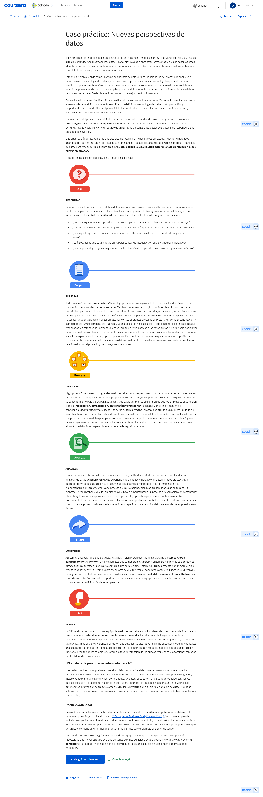

#### Cassie: Dimensiones de la analítica de datos

Hola. Soy Cassie, y dirijo el sector de Inteligencia de decisiones de Google Cloud. La inteligencia de decisiones es una combinación de ciencia de datos aplicada y ciencias sociales y gerenciales. Se trata de aprovechar el poder y la belleza de los datos. Ayudo a Google Cloud y a sus clientes a que sus datos tengan impacto y a que sus negocios y el mundo sean mejores. Un analista de datos es un explorador, un detective y un artista, todo en uno. El análisis es la búsqueda de inspiración. No sabes qué va a inspirarte antes de explorar, antes de echar un vistazo. Cuando empiezas, no tienes idea de qué vas a encontrar y si incluso vas a encontrar algo. Tienes que sumergirte valientemente en lo desconocido y descubrir lo que hay en tus datos. Existe un mito generalizado de que alguien que trabaja en datos debería saber todo sobre ellos. Creo que eso es poco útil porque el universo de los datos se ha expandido. Se ha expandido tanto, que la especialización se vuelve importante. Es muy, muy difícil para una persona conocer y dominarlo todo en materia de datos. Es por eso que necesitamos estas diferentes funciones. El consejo que doy a quienes están empezando es que elijan una especialización en función del gusto, del tipo de impacto que mejor se adapta a su personalidad. Ahora, la ciencia de datos, la disciplina de hacer útiles los datos, es un término general que abarca tres disciplinas: aprendizaje automático, estadísticas y análisis. Estas están separadas por cuántas decisiones sabes que quieres tomar antes de empezar con ellas. Si quieres tomar unas cuantas decisiones importantes con incertidumbre, eso es estadística. Si quieres automatizar, en otras palabras, tomar muchas, muchas, muchas decisiones con incertidumbre, eso es aprendizaje automático e IA. Pero ¿qué sucede si no sabes cuántas decisiones quieres tomar antes de empezar? ¿Qué pasa si lo que estás buscando es inspiración? Quieres encontrar tus incógnitas desconocidas. Quieres entender tu mundo. Eso es análisis. Cuando consideras la ciencia de datos y eliges en qué área especializarte, recomiendo aceptar tu personalidad. ¿Cuál de las tres excelencias en ciencia de datos parecería ajustarse mejor a ti? La excelencia de la estadística es exactitud. Los estadísticos son esencialmente filósofos, epistemólogos. Son muy, muy cuidadosos en proteger a los responsables de la toma de decisiones para que no lleguen a una conclusión equivocada. Si ese cuidado y rigor es lo que te apasiona, recomiendo la estadística. El rendimiento es la excelencia del aprendizaje automático y el ingeniero de IA. Sabes que es lo tuyo cuando alguien te dice «Apuesto a que no podías construir un sistema de automatización que lleve a cabo esta tarea con un 99,99999 por ciento de precisión» y tu respuesta es «Mírame». ¿Qué hay de los análisis? La excelencia de un analista es la velocidad. ¿Qué tan rápido puedes ahondar en grandes cantidades de datos y explorarlos y descubrir algo interesante, el hermoso potencial de la información que vale la pena conocer y llevar a los responsables de la toma de decisiones? ¿Te emociona la ambigüedad de la exploración? ¿Te entusiasma la idea de trabajar con muchas cosas diferentes, observar un montón de fuentes de datos diferentes y pensar en vastas cantidades de información, y a la vez prometer no pasar por alto información que pueda ser importante? ¿Te parece bien que te digan «Aquí hay muchos datos. Nadie los ha mirado antes. Ve a buscar algo interesante»? ¿Prosperas en proyectos abiertos y creativos? Si es así, entonces los análisis sean probablemente la mejor opción para ti. Un consejo que tengo para los analistas que recién empiezan es que quizá sea bastante aterrador explorar lo desconocido. Pero sugiero que dejes ir un poco cualquier tentación hacia el perfeccionismo y, en cambio, te diviertas y disfrutes de la exploración. No te preocupes por las respuestas correctas. Ve lo rápido que puedes desenvolver este regalo y averigua si hay algo divertido. Es como tu cumpleaños, desenvuelves un montón de cosas. Algunas de ellas te gustan. Otras no. Pero ¿no es divertido averiguar qué hay?

### Comprender el ecosistema de datos

#### ¿Qué es el ecosistema de datos?

Hola de nuevo. Ya has aprendido acerca de la función de un analista de datos y cómo este programa te ayudará a prepararte para tu futura carrera. Ahora, es momento de explorar el ecosistema de datos, descubrir dónde encaja el análisis computacional de datos en ese sistema, y repasar algunas ideas erróneas que podrías encontrar en el campo del análisis computacional de datos. En pocas palabras, un ecosistema es un grupo de elementos que interactúan uno con el otro. Los ecosistemas pueden ser grandes, como la jungla en una selva tropical o el desierto australiano. O diminutos, como renacuajos en un charco, o bacterias en la piel. Y, al igual que los canguros y osos koala en el desierto australiano, los datos también viven dentro de su propio ecosistema. Los ecosistemas de datos se componen de varios elementos que interactúan entre sí para producir, gestionar, almacenar, organizar, analizar y compartir datos. Estos elementos incluyen hardware y herramientas de software y las personas que los usan. Personas como tú. Los datos también se pueden encontrar en algo llamado nube. La nube es un lugar para mantener los datos en línea, en lugar de en el disco duro de una computadora. Así que en lugar de almacenar datos en algún lugar dentro de la red de tu organización, a los datos se accede a través de Internet. La nube es solo un término que usamos para describir la ubicación virtual. La nube desempeña un papel importante en el ecosistema de datos y, como analista de datos, es tu trabajo aprovechar el poder de este ecosistema, buscar la información correcta, y proporcionar análisis al equipo que los ayude a tomar decisiones inteligentes. Por ejemplo, podrías aprovechar la base de datos de tu tienda minorista, que es un ecosistema de nombres de clientes, direcciones, compras anteriores y opiniones de clientes. Como analista de datos, podrías usar esta información para predecir lo que estos clientes comprarán en el futuro, y asegurarte de que la tienda tenga los productos y existencias cuando se necesiten. Como otro ejemplo, pensemos en el ecosistema de un departamento de recursos humanos. Este ecosistema incluiría información como publicaciones de sitios web de trabajo, estadísticas sobre el mercado laboral actual, tasas de empleo y datos en las redes sobre los posibles empleados. Un analista de datos podría usar esta información para ayudar a su equipo a contratar nuevos trabajadores y mejorar el compromiso de los empleados y las tasas de retención. Pero los ecosistemas de datos no son solo para tiendas y oficinas. También funcionan en granjas. Las empresas agrícolas regularmente usan ecosistemas de datos que incluyen información tal como los patrones geológicos en los movimientos climáticos. Los analistas de datos pueden usar estos datos para ayudar a los agricultores a predecir el rendimiento de los cultivos. Algunos analistas de datos incluso usan ecosistemas de datos para proteger los ecosistemas ambientales reales. En Scripps Institution of Oceanography, los arrecifes de coral de todas partes del mundo se supervisan digitalmente, por lo que puedes ver cómo cambian los organismos con el tiempo, realizar un seguimiento de su crecimiento y medir cualquier aumento o disminución en las colonias individuales. Las posibilidades son infinitas. Ahora vamos a hablar de algunas ideas erróneas frecuentes que podrías encontrar. En primer lugar, es la diferencia entre científicos de datos y analistas de datos. Es fácil confundirlos, pero lo que hacen en realidad es muy diferente. La ciencia de datos se define como crear nuevas formas de modelar y entender lo desconocido mediante el uso de datos sin procesar. He aquí una buena forma de pensarlo. Los científicos de datos crean nuevas preguntas con los datos, mientras que los analistas encuentran respuestas a las preguntas existentes y crean información a partir de las fuentes de datos. También hay muchas palabras y frases que escucharás a lo largo de este curso, que son fáciles de confundir. Por ejemplo, análisis de datos y análisis computacional de datos suenan igual, pero en realidad son muy diferentes. Comencemos con el análisis de datos. Ya has aprendido que el análisis de datos es la recopilación, transformación y organización de los datos para sacar conclusiones, hacer predicciones e impulsar una toma de decisiones informada. El análisis computacional de datos, en los términos más sencillos, es la ciencia de los datos. Es un concepto muy amplio que abarca todo, desde el trabajo de gestión y el uso de los datos hasta las herramientas y los métodos que los trabajadores de datos usan todos los días. Así que, cuando pienses en datos, análisis de datos y el ecosistema de datos, es importante entender que todo esto encaja en la definición de análisis computacional de datos. Muy bien, ahora que sabes un poco más sobre el ecosistema de datos y las diferencias entre el análisis de datos y el análisis computacional de datos, estás listo para analizar cómo se usan los datos a fin de tomar decisiones eficaces. Podrás ver la toma de decisiones basada en datos en acción.

#### Cómo los datos informan mejores decisiones

Hasta ahora, has descubierto que hay muchas formas diferentes de usar los datos. En nuestra vida cotidiana, usamos datos cuando monitoreamos nuestra actividad física o leemos reseñas de productos para tomar una decisión de compra. Y, en los negocios, usamos datos para obtener más información sobre nuestros clientes, optimizar los procesos y ayudar a los empleados a realizar mejor su trabajo. Pero esto es solo la punta del iceberg. Una de las formas más poderosas de usar los datos es al momento de tomar decisiones basadas en ellos. Este proceso se define como el uso de datos para guiar la estrategia empresarial. Las organizaciones de distintas industrias tienen el poder de tomar mejores decisiones basadas en datos gracias al trabajo de los analistas de datos. El primer paso de este proceso es descubrir la necesidad del negocio. Por lo general, suele ser un problema que hay que resolver. Por ejemplo, puede que una nueva empresa necesite establecer un mejor reconocimiento de marca para competir con otras empresas más grandes y conocidas. O tal vez una organización quiera mejorar un producto y necesite averiguar cómo obtener las piezas de una forma más sostenible o de un proveedor éticamente responsable. O bien, podría tratarse de un negocio que intenta resolver el problema de empleados descontentos, bajos niveles de compromiso, satisfacción y retención. Cualquiera sea el problema, una vez definido, un analista de datos encuentra datos, los analiza y los usa para descubrir tendencias, patrones y relaciones. A veces, la estrategia basada en datos se sustenta en lo que ha funcionado en el pasado. Otras veces, sirve para guiar un negocio a fin de que se ramifique en una dirección totalmente nueva. Veamos un ejemplo del mundo real. Piensa en un servicio de streaming de música o películas. ¿Cómo saben estas empresas lo que las personas quieren ver o escuchar, y cómo lo proporcionan? Bueno, recurren a la toma de decisiones basada en datos. Recopilan información sobre lo que los clientes escuchan actualmente, la analizan y, luego, la usan para hacer sugerencias de lo que las personas podrían disfrutar más en el futuro. Esto mantiene contentos a los clientes, que vuelven por más, lo que a su vez significa más ingresos para la empresa. Otro ejemplo de toma de decisiones basada en datos puede verse en el auge del comercio electrónico. No hace mucho tiempo la mayoría de las compras se hacían en una tienda física, pero los datos muestran que las preferencias cambiaron. Así que muchas empresas crearon nuevos modelos de negocio que eliminan la tienda física y permiten realizar las compras directamente desde una computadora o un teléfono móvil, y la entrega se realiza directamente en la puerta. De hecho, la toma de decisiones basada en datos puede ser tan poderosa hasta el punto de lograr que todos los métodos comerciales se vuelvan obsoletos. Por ejemplo, los datos ayudaron a las empresas a alejarse completamente de los teléfonos con cable y a reemplazarlos por teléfonos móviles. Al asegurarse de que los datos se compilen en cada estrategia empresarial, los analistas de datos desempeñan un papel fundamental en el éxito de sus empresas, pero es importante tener en cuenta que no importa cuán valiosa sea la toma de decisiones basada en datos, los datos por sí solos nunca serán tan poderosos como cuando se los combina con la experiencia humana, la observación y, a veces, incluso la intuición. Para sacar el máximo provecho de la toma de decisiones basada en datos es importante incluir información de personas que estén familiarizadas con el problema empresarial. A estas personas se las llama expertos en la materia, y tienen la capacidad de observar los resultados del análisis de datos e identificar cualquier incoherencia, dar sentido a las zonas grises y eventualmente validar las decisiones que se tomen. Las organizaciones que trabajan de esta manera ponen los datos en el centro de todas las estrategias empresariales, pero también se benefician de la percepción de su gente. Todos ganan. Como analista de datos, desempeñas un papel clave al empoderar a estas organizaciones para que tomen decisiones basadas en datos, razón por la cual es tan importante que comprendas cómo juegan los datos en el proceso de toma de decisiones.

#### Datos e instinto

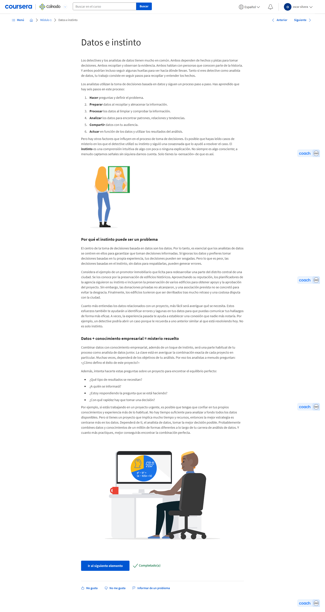

#### Orígenes del proceso de análisis de datos

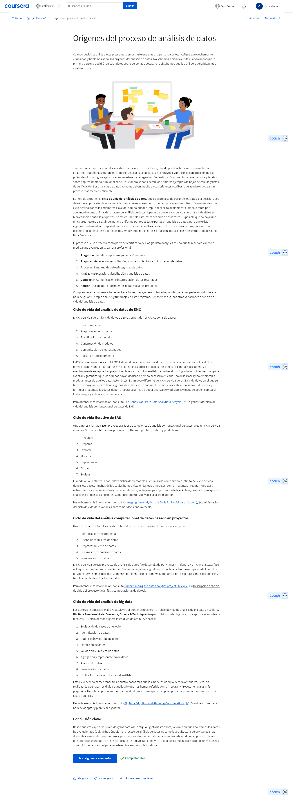

<https://infocus.delltechnologies.com/david_dietrich/the-genesis-of-emcs-data-analytics-lifecycle/>

<https://www.sas.com/content/dam/SAS/en_us/doc/whitepaper1/manage-analytical-life-cycle-continuous-innovation-106179.pdf>

<http://pingax.com/understanding-data-analytics-project-life-cycle/>

<https://www.informit.com/articles/article.aspx?p=2473128&seqNum=11&ranMID=24808>

## Todo acerca del pensamiento analítico

### Aprovechar tus destrezas de analista de datos

#### Descubrimiento de las destrezas relacionadas con los datos

Bienvenido. Ahora que tienes una base sólida sobre los conceptos básicos de los datos, es hora de centrarse en algunas destrezas y características concretas que serán fundamentales para tu futura carrera como analista de datos. Comenzaremos con cinco destrezas clave, pasaremos a las características del pensamiento analítico y luego aprenderemos cómo los analistas de datos equilibran sus funciones y responsabilidades. Sobre la marcha, también descubrirás cómo aprovechar tus propias habilidades naturales con relación a la estrategia, la experiencia técnica y el diseño de datos. Estas destrezas son increíblemente útiles y aprenderás a potenciarlas aún más. Por último, conocerás algunos fascinantes ejemplos del mundo real sobre cómo los datos influyen en la vida de las personas en todo el mundo. Muy bien. ¡Comencemos!

#### Destrezas clave del analista de datos

Antes, te dije que ya cuentas con destrezas analíticas. Aunque aún no lo sepas. Al aprender cosas nuevas, a veces las personas pasan por alto sus propias destrezas, pero es importante que te tomes el tiempo para reconocerlas, especialmente porque estas destrezas te van a ayudar como analista de datos. De hecho, es probable que estés más preparado de lo que piensas. ¿No me crees? Déjame demostrarlo. Comencemos por definir de qué estoy hablando. Las destrezas analíticas son cualidades y características asociadas con la resolución de problemas usando hechos. Hay mucho que decir de las destrezas analíticas, pero nos centraremos en cinco puntos esenciales. Curiosidad, comprensión del contexto, mentalidad técnica, diseño de datos y estrategia de datos. Puedes estar pensando, "No tengo estos tipos de destrezas", o "Solo tengo un par de ellas". Pero escúchame, y apuesto que cambiarás de opinión. Empecemos por la curiosidad. La curiosidad se trata de querer aprender algo. Las personas curiosas suelen buscar nuevos desafíos y experiencias. Esto conduce al conocimiento. El hecho de que estés aquí conmigo ahora mismo ya demuestra que tienes curiosidad. Esa fue una fácil. Ahora piensa en la comprensión del contexto. El contexto es la situación en la que algo existe o sucede. Esto puede ser una estructura o un entorno. Una forma sencilla de comprender el contexto es contando hasta 5. Uno, dos, tres, cuatro, cinco. Esos números existen en el contexto del uno al cinco. Pero, ¿y si un amigo tuyo te dijera, uno, dos, cuatro, cinco, tres? Entonces el tres estará fuera de contexto. Simple, ¿verdad? Pero puede volverse un poco complicado. Es bastante probable que ni siquiera te des cuenta de que el tres está fuera de contexto si no estás prestando suficiente atención. Es por eso que escuchar y tratar de entender todo el panorama es fundamental. En tu propia vida, pones las cosas en contexto todo el tiempo. Por ejemplo, pensemos en la lista de las compras. Si agrupas los artículos como harina, azúcar y levadura, eso es agregar contexto a lo que compras. Esto te ahorra tiempo cuando estás en el pasillo de artículos de repostería en el supermercado. Veamos otro ejemplo. ¿Alguna vez has mezclado una baraja de cartas y has visto un comodín? Si estás jugando a un juego que no incluye comodines, identificar esa carta significa que entiendes que está fuera de contexto. Quítala y es mucho más probable que juegues de forma exitosa. Ahora sabemos que tienes tanto curiosidad, como la capacidad de comprender el contexto. Veamos la tercera destreza, la mentalidad técnica. Una mentalidad técnica implica la capacidad de dividir las cosas en pasos o piezas más pequeños y trabajar con ellos de forma ordenada y lógica. Por ejemplo, cuando pagas tus cuentas, probablemente ya hayas dividido el proceso en pasos más pequeños. Tal vez comiences por ordenarlas por la fecha de vencimiento. Luego, puedes sumarlas y comparar ese monto con el saldo en tu cuenta bancaria. Esto te servirá para ver si puedes pagarlas ahora, o si debes esperar hasta el próximo cheque de pago. Finalmente, las pagarás. Cuando tomas algo que parece ser una sola tarea, como pagar las cuentas, y lo divides en pasos más pequeños con un proceso ordenado, eso es utilizar una mentalidad técnica. Ahora veamos la cuarta parte de las destrezas analíticas, el diseño de datos. El diseño de datos es la forma de organizar la información. Como analista de datos, el diseño normalmente tiene que ver con una base de datos real. Pero insisto, las mismas destrezas se aplican a la vida cotidiana. Por ejemplo, piensa en la forma en que organizas los contactos en tu teléfono. Eso es en realidad un tipo de diseño de datos. Tal vez los ordenes por nombre en lugar de apellido, o tal vez usas el correo electrónico en lugar de los nombres. Lo que realmente haces es diseñar una lista clara y lógica que te permite llamar o enviarles un mensaje de texto de forma rápida y sencilla. El último, pero definitivamente no menos importante, el quinto y último elemento de las destrezas analíticas, es la estrategia de datos. La estrategia de datos es la gestión de las personas, procesos y herramientas que se usan en el análisis de datos. Desglosemos eso. Gestionas personas asegurándote de que saben cómo utilizar los datos correctos para resolver el problema en el que estás trabajando. En cuanto a los procesos, se trata de asegurarte que el camino hacia la solución sea claro y accesible. Para las herramientas, te aseguras de que se utiliza la tecnología adecuada para el trabajo. Tal vez estés dudando de mi capacidad para darte un ejemplo de la vida real que demuestre la estrategia de datos. Pero escucha esto. Imagina que vas a cortar el césped. El paso 1 es leer el manual de la cortadora. Eso es asegurarte de que los involucrados, o tú, en este ejemplo, sepan cómo utilizar los datos disponibles. El manual te indica que te pongas gafas protectoras y zapatos cerrados. Luego, el paso 2: hacer que el proceso, el camino, sea claro y accesible. Para esto caminarás por el césped, y juntarás palos grandes o piedras que podrían ser un obstáculo. Finalmente, para el paso 3, revisas la cortadora de césped, tu herramienta, para asegurarte de que tiene suficiente gasolina y aceite y que se encuentra en buenas condiciones, para poder cortar el césped de forma segura. Ahí tienes. Ahora ya conoces las cinco destrezas esenciales de un analista de datos. Curiosidad, comprensión del contexto, tener una mentalidad técnica, el diseño de datos y la estrategia de datos. Te dije que ya eres un pensador analítico. Ahora puedes practicar activamente estas destrezas a medida que avanzas en el resto del curso. ¿Tienes curiosidad por saber qué sigue? Pasa al siguiente video.

### Pensar en el pensamiento analítico

#### Todo acerca de cómo pensar analíticamente

Ahora que ya conoces las cinco destrezas esenciales de un analista de datos, estás listo para aprender más sobre lo que significa tener un pensamiento analítico. La gente no suele pensar en el pensamiento. Pensar es algo que hacemos con total naturalidad. Ocurre automáticamente, pero en realidad hay muchas formas diferentes de pensar. Algunas personas piensan con creatividad, otras lo hacen de manera crítica, mientras que algunas piensan de manera abstracta. Hablemos del pensamiento analítico. El pensamiento analítico consiste en identificar y definir un problema, y luego resolverlo mediante el uso de datos de manera organizada y paso a paso. Como analistas de datos, ¿cómo pensamos analíticamente? Pues bien, para responder a esa pregunta, ahora hablaremos de otro conjunto de cinco habilidades. Los cinco aspectos clave del pensamiento analítico son: la visualización, la estrategia, la orientación hacia los problemas, la correlación y, por último, el pensamiento con perspectiva global y orientado hacia los detalles. Comencemos con la visualización. En el análisis (computacional) de datos, la visualización es la representación gráfica de la información. Algunos ejemplos son los gráficos, los mapas u otros elementos de diseño. La visualización es importante porque los elementos visuales pueden ayudar a los analistas de datos a entender y explicar la información de manera más eficaz. Piénsalo así. Si quieres explicarle a alguien cómo es el Gran Cañón, usar palabras sería mucho más difícil que mostrarle una imagen. Una visualización del Gran Cañón te ayudaría a exponer tu punto de vista mucho más rápido. Ahora vamos a hablar de la segunda parte del pensamiento analítico: ser estratégico. Con tantos datos disponibles, tener una mentalidad estratégica es fundamental para permanecer centrado y mantener el rumbo. La elaboración de estrategias ayuda a los analistas de datos a ver lo que quieren conseguir con los datos y cómo pueden lograrlo. La estrategia también ayuda a mejorar la calidad y utilidad de los datos que recopilamos. Mediante la elaboración de estrategias, sabemos que todos nuestros datos son valiosos y pueden ayudarnos a alcanzar nuestros objetivos. El siguiente paso en la lista de verificación del pensamiento analítico es estar orientado hacia los problemas. Los analistas de datos utilizan un enfoque orientado hacia los problemas para identificarlos, describirlos y resolverlos. Se trata de mantener el problema en mente a lo largo de todo el proyecto. Por ejemplo, supongamos que a un analista de datos se le plantea el problema de que un almacén se queda constantemente sin suministros. Seguiría adelante con diferentes estrategias y procesos. Pero el principal objetivo sería siempre resolver el problema de mantener el inventario en las estanterías. Los analistas de datos también hacen muchas preguntas. Esto ayuda a mejorar la comunicación y permite ahorrar tiempo mientras se busca una solución. Un ejemplo de ello sería encuestar a los clientes sobre sus experiencias al utilizar un producto, así como obtener información a partir de esas preguntas para mejorar su producto. Esto nos lleva a la cuarta cualidad del pensamiento analítico: ser capaz de identificar una correlación entre dos o más datos. Una correlación es como una relación. Se pueden encontrar todo tipo de correlaciones en los datos. Una de ellas podría ser la relación entre la longitud de tu cabello y la cantidad de champú que necesitas. O bien, es posible que notes una correlación entre una temporada más lluviosa que da lugar a una cantidad elevada en la venta de paraguas. Pero cuando comienzas a identificar correlaciones en los datos, hay algo que siempre debes tener en cuenta: la correlación no equivale a la causalidad. En otras palabras, el hecho de que la tendencia de dos datos sea en la misma dirección, no necesariamente significa que están relacionados. Aprenderemos más al respecto más tarde. Ahora, la última pieza del rompecabezas del pensamiento analítico: el pensamiento con perspectiva global. Esto significa ser capaz de ver el panorama general, así como los detalles. Un rompecabezas nos ayuda a pensar en esto. El pensamiento con perspectiva global es como mirar un rompecabezas completo. Puedes disfrutar de la imagen completa sin detenerte en cada una de las pequeñas piezas que lo componen. Si solo te centras en las piezas individuales, no podrás ver más allá; por ese motivo es tan importante el pensamiento con perspectiva global. Te ayuda a ampliar la visión, así como a ver las posibilidades y oportunidades. Esto conduce a nuevas ideas o innovaciones interesantes. Por otra parte, el pensamiento orientado hacia los detalles consiste en averiguar todos los aspectos que te ayudarán a ejecutar un plan. Es decir, las piezas que componen tu rompecabezas. En el mundo de los negocios hay todo tipo de problemas que pueden beneficiarse de los empleados que tienen tanto un pensamiento con perspectiva global como un pensamiento orientado hacia los detalles. La mayoría de nosotros somos naturalmente mejores en uno u otro pensamiento. Pero siempre se pueden desarrollar las habilidades para encajar ambas piezas. Ahora que ya conoces los cinco aspectos del pensamiento analítico (la visualización, la estrategia, la orientación hacia los problemas, la correlación y el pensamiento con perspectiva global y orientado hacia los detalles) puedes ponerlos en práctica cuando trabajes con datos. A medida que avances en este curso, aprenderás cómo hacerlo.

#### Exploración de las destrezas analíticas básicas

Recapitulemos lo que hemos aprendido hasta ahora sobre el pensamiento analítico. Los 5 aspectos clave son: la visualización, la estrategia, la orientación hacia los problemas, la correlación y el pensamiento con perspectiva global y orientado hacia los detalles. Hemos visto cómo ya los utilizas en tu vida cotidiana. También hemos hablado de cómo las diferentes personas utilizan naturalmente determinados tipos de pensamiento, pero que sin dudas se pueden aumentar y desarrollar las destrezas que tal vez no te resulten tan fáciles. Esto significa que puedes convertirte en un pensador versátil, lo que constituye una parte muy importante del análisis de datos. Es posible que seas naturalmente un pensador analítico, pero puedes aprender a pensar con creatividad y de manera crítica, y ser muy bueno en los tres tipos de pensamiento. Cuantas más formas de pensar tengas, más fácil será que pienses con originalidad y tengas nuevas ideas. Pero, ¿por qué es importante pensar de diferentes maneras? Pues porque en el análisis de datos, las soluciones casi nunca están delante de ti. Es necesario pensar de manera crítica para saber qué preguntas hacer. Pero también es necesario pensar de manera creativa para obtener respuestas nuevas e inesperadas. Hablemos de algunas de las preguntas que los analistas de datos hacen cuando están en busca de una solución. Esta es una que surgirá a menudo: ¿Qué es la causa raíz de un problema? Una causa raíz es la razón por la que se produce un problema. Si podemos identificar y eliminar una causa raíz, podemos evitar que ese problema se repita. Una forma sencilla de entender las causas raíces es mediante el proceso llamado los Cinco porqués. En el proceso de los Cinco porqués, se pregunta “por qué” cinco veces para revelar la causa raíz. La quinta y última respuesta debería proporcionar algunas ideas útiles y, a veces, sorprendentes. Este es un ejemplo de los Cinco porqués en acción. Supongamos que quieres preparar un pastel de arándanos, pero no consigues arándanos. Has intentado resolver el problema preguntándote: ¿por qué no puedo preparar un pastel de arándanos? La respuesta es que no hay arándanos en la tienda. Ese es el Porqué número 1. Entonces te preguntas: ¿por qué no hay arándanos en la tienda? Luego descubres que los arbustos de arándanos no tienen suficientes frutas esta temporada. Ese es el Porqué número 2. A continuación, te preguntarías: ¿por qué no había suficientes frutas? Esto conduciría al hecho de que los pájaros se estaban comiendo todas las bayas. De este modo, te preguntaste y respondiste el Porqué número 3. Ahora llegamos al Porqué número 4. Pregunta por qué una cuarta vez y la respuesta sería que, aunque los pájaros normalmente prefieren las moras y no comen arándanos, la morera no produjo frutos esta temporada, por lo que los pájaros están comiendo arándanos. Por último, llegamos al Porqué número 5, que debería revelar la causa raíz. Una helada tardía dañó las moreras, por lo que no produjeron frutas. No puedes preparar un pastel de arándanos debido a la helada tardía que tuvo lugar hace unos meses. Descubre cómo los Cinco porqués pueden revelar algunas causas raíces muy sorprendentes. Este es un gran truco para conocer, y puede ser un proceso muy útil en el análisis de datos. Otra pregunta que suelen hacerse los analistas de datos es: ¿en qué punto de nuestro proceso se encuentran los déficits? Para ello, muchas personas recurrirán a lo que se denomina análisis de déficits. El análisis de déficits permite examinar y evaluar el funcionamiento actual de un proceso para llegar a donde se quiere estar en el futuro. Las empresas realizan análisis de déficits para hacer todo tipo de cosas, como mejorar un producto o ser más eficientes. El enfoque general del análisis de déficits consiste en comprender dónde estás ahora en comparación con el lugar donde quieres estar. A continuación, puedes identificar los déficits que existen entre el estado actual y el futuro, y determinar cómo salvarlos. Una tercera pregunta que se hacen mucho los analistas de datos es: ¿Qué no hemos tenido en cuenta antes? Esta es una excelente manera de pensar en qué información o procedimiento puede faltar en un proceso, para poder identificar formas de tomar mejores decisiones y elaborar estrategias de cara al futuro. Estos son solo algunos ejemplos del tipo de preguntas que los analistas de datos utilizan en su trabajo cada día. Tengo la certeza de que cuando empieces tu carrera, se te ocurrirán muchas más. La forma en que los analistas de datos piensan y hacen preguntas desempeña un papel importante en la toma de decisiones de las empresas. Por eso el pensamiento analítico y la comprensión de cómo hacer las preguntas correctas pueden tener un impacto tan grande en el éxito general de una empresa. Más tarde, hablaremos de cómo las decisiones basadas en datos pueden conducir a resultados exitosos.

#### Registro de aprendizaje: Reflexiona sobre tus destrezas y expectativas

### Pensar en los resultados

#### Utilizar los datos para obtener resultados satisfactorios

En un video anterior, aprendiste cuáles son las cinco destrezas analíticas esenciales. A modo de recordatorio, son estas: la curiosidad, la comprensión del contexto, la mentalidad técnica, el diseño de estructuras/bases de datos y la estrategia de análisis de datos. En los próximos videos, exploraremos cómo estas habilidades forman parte de la toma de decisiones basada en datos. Pero primero, analicemos el concepto de la toma de decisiones basada en datos y por qué es más probable produzca resultados exitosos. Tal vez recuerdes que la toma de decisiones basada en datos implica el uso de hechos para guiar la estrategia empresarial. Los analistas de datos pueden aprovechar el poder de los datos para hacer todo tipo de cosas asombrosas. Gracias a los datos, pueden obtener información valiosa, verificar sus teorías o suposiciones, comprender mejor las oportunidades y los desafíos, apoyar un objetivo, ayudar a elaborar un plan y mucho más. En el mundo de los negocios, la toma de decisiones basada en datos puede mejorar los resultados de muchas formas diferentes. Por ejemplo, supongamos que un productor lechero quiere empezar a elaborar y vender helados. Podría adivinar qué sabores les gustan a los clientes, pero hay una mejor forma de obtener la información. El productor podría encuestar a las personas y preguntarles qué sabores prefieren. De este modo, el productor obtiene los datos necesarios para elegir los sabores de helado le gusta a la gente. Aquí se presenta otro ejemplo. Supongamos que la presidenta de una organización tiene curiosidad por saber qué ventajas valoran más los empleados. Consultó al director de Recursos Humanos, que dice que el personal valora el código de vestimenta informal. Según el director de RR. HH., es un presentimiento basado en que ha observado que muchos empleados usan pantalones vaqueros y camisetas. Sin embargo, ¿qué pasaría si esta empresa utilizara un proceso de retroalimentación de los empleados más estructurado, como una encuesta? Podría revelar que, en realidad, los empleados prefieren las tarjetas de transporte público gratuito. El director de Recursos Humanos no se dio cuenta de esto porque va a trabajar en coche. Estos son solo algunos de los beneficios de la toma de decisiones basada en datos. Proporciona una mayor confianza en la elección y en las habilidades para abordar los desafíos empresariales. Te ayuda ser más proactivo cuando se presenta una oportunidad y te permite ahorrar tiempo y esfuerzo a la hora de trabajar para alcanzar un objetivo. Ahora vamos a aprender más sobre cómo estas cinco destrezas te ayudan a aprovechar todo el potencial de la toma de decisiones basada en datos. En primer lugar, piensa en la curiosidad y el contexto. Cuanto más aprendas sobre el poder de los datos, más curioso serás. Empezarás a observar patrones y relaciones en la vida cotidiana, tanto al leer las noticias, al mirar una película o al ir una cita al otro lado de la ciudad. Los analistas llevan su pensamiento un paso más allá usando el contexto para hacer predicciones, buscar respuestas y, finalmente, sacar conclusiones sobre lo que han descubierto. Este proceso natural es un gran primer paso para orientarse más hacia los datos. El siguiente paso es tener una mentalidad técnica. Todos tenemos instintos o, como en el caso del ejemplo del director de Recursos Humanos, presentimientos. Los analistas de datos no son diferentes. También tienen presentimientos, pero se han capacitado para basarse en esas sensaciones y utilizar un enfoque más técnico para explorarlas. Para ello, buscan siempre los hechos, los ponen en práctica a través del análisis y utilizan los conocimientos que obtienen para tomar decisiones informadas. A continuación, pasamos al diseño de datos, que tiene una fuerte conexión con la toma de decisiones basada en datos. En pocas palabras, diseñar los datos para organizarlos de forma lógica hace que sea más fácil para los analista de datos acceder, comprender y aprovechar al máximo la información disponible. Y es importante tener en cuenta que el diseño de datos no solo se aplica a las bases de datos. Este tipo de pensamiento también puede ser útil con todo tipo de situaciones de la vida real. La idea básica es la siguiente: si se toman decisiones informadas por los datos, es más probable que se tomen decisiones más informadas y eficaces. La última habilidad es la estrategia de datos, que incorpora a las personas, los procesos y las herramientas utilizadas para resolver un problema. Es importante tenerla en cuenta porque ofrece una visión de alto nivel del camino que se debe seguir para alcanzar los objetivos. Además, la toma de decisiones basada en datos no es un trabajo de una sola persona. Es mucho más probable que sea exitosa si todos participan y están en sintonía, por lo que es importante asegurarse de que se hayan implementado los procedimientos específicos y que la tecnología utilizada esté alineada con la estrategia basada en datos. Ahora ya sabes cómo funcionan estas cinco destrezas analíticas esenciales para tomar mejores decisiones basadas en datos. Hasta ahora, muchos de los ejemplos que has escuchado son hipotéticos. Eso significa que podrían ser ciertos en teoría, pero no son casos concretos del mundo real. A continuación, veremos algunos ejemplos reales. Estoy impaciente por compartir cómo los analistas de datos ponen en práctica los datos para obtener resultados asombrosos.

#### La magia de los datos en el mundo real

En este video, voy a compartir algunos estudios de caso que destacan el increíble trabajo que hacen los analistas de datos. Cada uno de estos escenarios muestra el poder de la toma de decisiones basada en datos de formas inesperadas. La primera historia es sobre Google. Como mencioné hace poco, en Google, nuestra misión es organizar la información del mundo y lograr que sea universalmente accesible y útil. Todos nuestros productos, desde la idea hasta el desarrollo y el lanzamiento, se basan en datos y en la toma de decisiones basada en datos. Aquí en Google, hay muchísimos ejemplos de personas que utilizan hechos para crear una estrategia empresarial. Aunque uno de los más famosos tiene que ver con el sector de Recursos Humanos de Google. Pasó lo siguiente. El Departamento de RR: HH. quería saber si valía la pena tener gerentes. ¿Sus contribuciones valen la pena? ¿O sería más eficaz que todos fueran colaboradores individuales? Para responder a esa pregunta, el equipo de Análisis de Personas de Google analizó revisiones de desempeño y encuestas anteriores a empleados. Los datos que encontraron fueron plasmados en un gráfico porque, como ya viste, las imágenes son extremadamente útiles para comprender un problema o un concepto. En el gráfico reveló que los empleados de Google tenían sentimientos positivos hacia sus gerentes, pero los datos eran bastante generales y el equipo quería obtener más información. Por lo que profundizaron en esto y dividieron los datos en cuartiles. Un cuartil divide los puntos de datos en cuatro partes iguales o cuartos. Aquí empezaron a suceder cosas muy interesantes. Los analistas de datos descubrieron que había una gran diferencia entre los cuartiles superior e inferior. Al final, resultó que, los equipos con los mejores gerentes estaban mucho más felices, eran más productivos y tenían más probabilidades de querer seguir trabajando en Google. Con esto, se confirmó que los gerentes eran valorados y hacen una gran diferencia. Por lo tanto, la idea de tener solamente colaboradores individuales no se implementó. Sin embargo, aún quedaba más trabajo por hacer. El solo hecho de saber que los buenos gerentes producen buenos resultados no genera conocimientos prácticos. Es necesario identificar qué caracteriza a un buen gerente, así que el equipo ejecutó dos pasos adicionales para recopilar más datos. Primero, lanzaron un programa de premios en el que los empleados podían nominar a sus gerentes favoritos. Para cada propuesta, se debían proporcionar ejemplos o datos sobre qué hace que ese gerente sea excelente. El segundo paso consistió en entrevistar a los gerentes que fueron graficados en los cuartiles superior e inferior. De esta manera, el equipo de Análisis pudo ver las diferencias entre los comportamientos satisfactorios y y los menos satisfactorios. Los mejores comportamientos se identificaron como las razones más comunes por las que un gerente necesita mejorar. El paso final fue compartir estas ideas y poner un procedimiento en práctica para evaluar a los gerentes con estas cualidades en mente. Esta decisión basada en datos continúa creando una cultura empresarial excepcional para mis colegas y para mí. Gracias, datos. Otro ejemplo interesante lo encontramos en el sector sin fines de lucro. Las organizaciones sin fines de lucro se dedican a promover una causa social o defender una iniciativa en particular, como la seguridad alimentaria, la educación o las artes. En este caso, analistas de datos investigaron la manera en que los periodistas pueden generar un impacto más significativo en las organizaciones sin fines de lucro sobre las que escriben. Los periodistas publican en periódicos, revistas y otros medios de comunicación, por lo que pueden ayudar a las organizaciones sin fines de lucro a llegar a lectores como tú y como yo, quienes luego actúan para ayudar a estas organizaciones a alcanzar sus metas. Por ejemplo, digamos que leíste sobre el problema del cambio climático en una revista en línea. Si el artículo es efectivo, conocerás más sobre la causa e, incluso, podrías sentir el impulso de tomar decisiones más ecológicas en tu día a día, querer ser voluntario de una organización sin fines de lucro o hacer una donación. Ese es un ejemplo de la labor del periodista y cómo genera concientización, comprensión y compromiso. Ahora volvamos a la historia. Los analistas de datos utilizaron un rastreador para monitorear los temas, los clics, el tráfico web, los comentarios, lo que se comparte y más. Luego, evaluaron la información para hacer recomendaciones sobre la forma en que los periodistas podrían hacer aún mejor su trabajo. Al final, se les ocurrieron algunas ideas geniales sobre cómo las organizaciones sin fines de lucro y los periodistas pueden motivar a la gente en todas partes para trabajar juntos y hacer del mundo un lugar mejor. Realmente, no hay límites para lo que puedes hacer como analista de datos. A medida que avances en este programa, descubrirás aún más posibilidades. Hiciste un buen trabajo siguiendo los temas de estos últimos videos. Aprendiste todo sobre las destrezas analíticas y las cinco características clave de los analistas de datos. Probablemente, incluso te diste cuenta de que ya eres un conocedor de la mayoría de ellas. Después, descubriste qué significa pensar analíticamente y las destrezas específicas que los analistas de datos desarrollan para lograrlo. Exploraste las herramientas y los procesos que permiten a los analistas de datos encontrar un problema y formular las preguntas adecuadas para resolverlo. Finalmente, algunos ejemplos del mundo real ayudaron a ilustrar por qué la toma de decisiones basada en datos suele ser más eficaz que otros métodos. Estás sentando una base excelente para tu carrera como analista de datos. Con cada video, tus habilidades continuarán expandiéndose y tu comprensión de los conceptos clave del análisis de datos solo se volverá más sólida. Pronto, tendrás la oportunidad de probar todo lo que aprendiste. Es una oportunidad muy útil para verificar tu comprensión de todos los conceptos que hemos discutido; si llegas a tener alguna duda sobre una pregunta, puedes revisar los videos y lecturas para encontrar la respuesta. Esta es otra buena manera de practicar la recopilación de datos. ¡Buen trabajo, sigue así!

#### Cuadro de aviso de la discusión: Más sobre ti

¿cuál de tus destrezas o formas de pensar crees que te convertirá en un analista de datos exitoso?

## El maravilloso mundo de los datos

### Seguir el ciclo de vida de los datos

#### Aprender sobre las herramientas y las fases de los datos

¡Hola! Es genial tenerte de vuelta. Hemos hablado un poco sobre el proceso de análisis de datos. Para repasar rápidamente, las fases del proceso de análisis de datos son preguntar, preparar, procesar, analizar, compartir y actuar. Tal vez recuerdes cuando dije antes que todo este programa se basa en estos pasos. Ahora, profundizaremos y exploraremos cómo funciona cada una de estas fases en conjunto. Pero me estoy adelantando un poco. Primero, dediquemos un poco de tiempo a entender el ciclo de vida de los datos. No, los datos no están realmente vivos; pero tienen un ciclo de vida. ¿Cómo hacen los analistas de datos para dar vida a los datos? Bueno, se empieza con la herramienta de análisis de datos correcta. Estos incluyen hojas de cálculo, bases de datos, lenguajes de consulta y software de visualización. No te preocupes si no sabes cómo funcionan o, incluso, lo que son. En un momento, todos los analistas de datos estuvieron en el mismo lugar donde te encuentras ahora y, probablemente, tenían muchas de las mismas preguntas. Recuerdo cuando empecé a aprender sobre hojas de cálculo. Era un joven pasante, y la compañía en la que trabajaba estaba en medio de un gran cambio de sistemas. Eso implicó trasladar muchos informes del sistema anterior al nuevo. Después de algunas semanas, noté que incluso las personas que estaban más avanzadas en sus carreras profesionales no estaban tan capacitados técnicamente como yo. Esa fue una gran oportunidad para mí a fin de agregar valor. Mi momento revelador en cuanto a hojas de cálculo apareció cuando empecé a investigar los atajos que podría usar para trabajar con las hojas de cálculo más eficientemente. Esto, realmente, agilizaría el proceso de lograr que esos informes se trasladen al nuevo sistema. Una vez que todo empezó a fluir, recuerdo recibir correos electrónicos de otros analistas financieros de la compañía. Estaban tan agradecidos que alguien vino y solucionó un problema que nadie más había podido. Eso me inspiró a seguir avanzando y aprender a usar las hojas de cálculo de muchas formas increíbles. A medida que avances en el curso, estoy seguro de que te impresionarás tanto como yo. Y, antes de que te des cuenta, tú también darás vida a los datos. Empecemos.

#### Etapas del ciclo de vida de los datos

Tengo una pregunta para ti. Cuando piensas en un ciclo de vida, ¿qué es lo primero que se te ocurre? No leo la mente, pero sé que lo que piensas es correcto. En realidad, no hay una respuesta equivocada porque todo tiene un ciclo de vida. Uno de los ejemplos más conocidos de un ciclo de vida es una mariposa. Al principio, las mariposas salen del huevo, eclosionan en orugas y, luego, se convierten en crisálidas. Ahí es donde ocurre la verdadera magia. Los datos también tienen un ciclo de vida propio. En este video, hablaremos de cada una de las etapas de ese ciclo de vida para ayudarte a entender cada fase por la que pasan los datos. El ciclo de vida de los datos consiste en planificar, capturar, gestionar, analizar, archivar y destruir. Empecemos por la primera fase: planificación. En realidad, esto sucede mucho antes de iniciar un proyecto de análisis. Durante la planificación, una empresa decide qué tipo de datos necesita, cómo se gestionarán a lo largo de su ciclo de vida, quién será responsable de ellos y cuáles son los resultados óptimos. Por ejemplo, supongamos que un proveedor de electricidad desea adquirir nuevas perspectivas sobre cómo ahorrar energía. En la fase de planificación, podría decidir capturar información sobre cuánta electricidad consumen sus clientes por año, qué tipos de edificios se están suministrando eléctricamente y qué tipos de dispositivos se suministran dentro de ellos. La empresa eléctrica también decidiría qué miembros del equipo serían responsables de recopilar, almacenar y compartir esos datos. Estas decisiones se toman durante la planificación y ayudan a configurar el resto del proyecto. La siguiente fase es cuando se capturan los datos. En esta fase, se recopilan datos de diversas fuentes y se incorporan en la organización. Debido a que se crean tantos datos por día, los métodos de recopilación son infinitos. Un método común es obtener datos de recursos externos. Por ejemplo, si hicieras un análisis de datos sobre patrones meteorológicos, probablemente, obtendrías datos de un conjunto de datos disponible para el público, como el Centro Nacional de Datos Climáticos. Otra forma de obtener datos es a partir de documentos y archivos propios de una empresa, que, normalmente, se almacenan en una base de datos. Si bien ya hemos mencionado las bases de datos, no proporcionamos muchos detalles sobre lo que realmente son. Una base de datos es un conjunto de datos almacenados en un sistema informático. En el caso de nuestro proveedor de electricidad, la empresa, probablemente, mediría el uso de los datos entre sus clientes dentro de una base de datos propia. Como nota rápida, cuando tienes una base de datos con información de los clientes, debes preocuparte por garantizar la integridad, la credibilidad y la privacidad de esos datos. Aprenderás mucho más sobre eso más adelante. Ahora que hemos capturado nuestros datos, pasaremos a la siguiente fase del ciclo de vida de los datos: la gestión. Aquí hablamos de cómo cuidamos nuestros datos, cómo y dónde los almacenamos, qué herramientas usamos para protegerlos y mantenerlos seguros, y qué medidas adoptamos para asegurarnos de que se conserven correctamente. Esta fase es muy importante para la limpieza de los datos, de la cual hablaremos más adelante. A continuación, llegó el momento de analizar tus datos. Aquí es donde realmente se destacan los analistas de datos. En esta fase, los datos se usan para resolver problemas, tomar decisiones importantes y respaldar los objetivos empresariales. Por ejemplo, uno de los objetivos de nuestra empresa eléctrica podría ser encontrar nuevas maneras de ayudar a los clientes a ahorrar energía. Mientras seguimos avanzando por el ciclo de vida de los datos, ahora entramos en la fase de archivo. Archivar significa almacenar datos en un lugar donde todavía están disponibles, pero es poco probable que se vuelvan a usar. Durante el análisis, los analistas manejan grandes cantidades de datos. ¿Te imaginas si tuviéramos que clasificar todos los datos disponibles que están a nuestro alcance, aunque ya no fueran útiles ni relevantes para nuestro trabajo? Tiene mucho más sentido archivarlos que mantenerlos a mano. Y, finalmente, el último paso del ciclo de vida de los datos: la fase de destrucción. Sí, suena desalentador; pero la destrucción de los datos no duele. Así que volvamos a nuestro ejemplo del proveedor de electricidad. Tendría datos almacenados en varios discos duros. Para destruirlos, la compañía usaría un software de destrucción de datos seguro. En caso de haber archivos impresos, se triturarían. Esto es importante para proteger la información privada de una empresa, así como los datos privados sobre sus clientes. Y ahí lo tienes, el ciclo de vida de los datos. Ahora que entiendes las distintas fases por las que pasan los datos durante su ciclo de vida, tendrás una mejor idea de cómo abordar el proceso de análisis de datos, del cual hablaremos pronto.

#### Variaciones del ciclo de vida de los datos

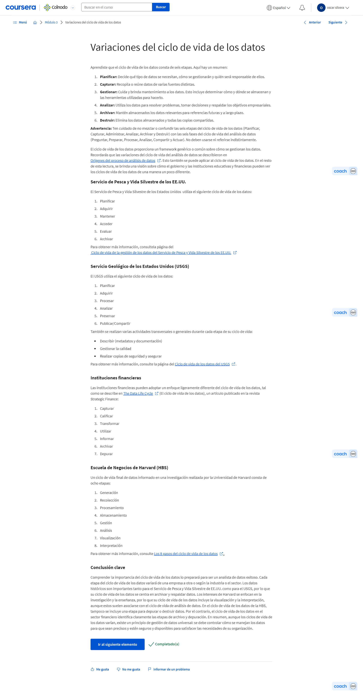

<https://www.coursera.org/learn/aspectos-basicos-datos-datos-en-todas-partes/supplement/WWlrt/origenes-del-proceso-de-analisis-de-datos>

<https://www.fws.gov/data/life-cycle>

<https://www.usgs.gov/products/data-and-tools/data-management/data-lifecycle>

<https://sfmagazine.com/post-entry/july-2018-the-data-life-cycle/>

<https://online.hbs.edu/blog/post/data-life-cycle>

#### Cuestionario práctico: Autorreflexión: recopilación de datos

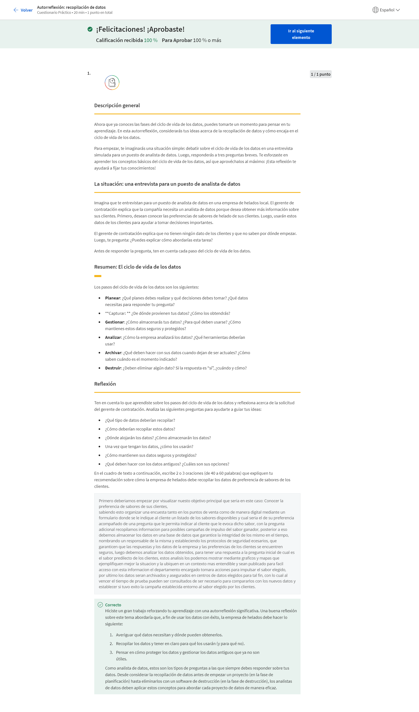

#### Cuestionario práctico: Pon a prueba tus conocimientos sobre el ciclo de vida de los datos

### Esbozar el proceso de análisis de datos

#### Las seis fases del análisis de datos

Ya has comprendido todas las fases del ciclo de vida de los datos, así que es momento de pasar a la fases del análisis de datos. Parecen similares, pero son dos cosas distintas. El análisis de datos no es un ciclo de vida. Es el proceso de analizar datos. Próximamente, vamos a revisar cada paso del proceso de análisis de datos y cómo se relacionará con tu trabajo como analista de datos. Incluso este programa está diseñado para seguir estos pasos. Entender estas conexiones te ayudarán a orientar tu propio análisis y tu trabajo en este programa. Ya aprendiste que este programa está diseñado en función de las etapas del proceso de análisis de datos. Este programa está dividido en cursos; de estos, seis se basan en los pasos del análisis de datos: preguntar, preparar, procesar, analizar, compartir y actuar. Comencemos con el primer paso del análisis de datos: preguntar. En esta fase, hacemos dos cosas. Definimos el problema que se pretende resolver y nos aseguramos de que entendemos plenamente las expectativas de los interesados. Los interesados tienen una participación en el proyecto. Son personas que han dedicado tiempo y recursos a un proyecto, y están interesadas en el resultado. Analicemos esto. En primer lugar, definir un problema significa que observas el estado actual e identificas cómo difiere del estado ideal. Normalmente, hay un obstáculo que debemos eliminar o un error que tenemos que corregir. Por ejemplo, un estadio deportivo que quiere reducir el tiempo que los fanáticos pasan esperando en la fila. El obstáculo es definir cómo lograr que los clientes lleguen rápido a sus asientos. Otra parte importante de la fase de preguntar es entender las expectativas de los interesados. En este punto, el primer paso es determinar quiénes son los interesados. Podría incluir al gerente, un patrocinador ejecutivo o tus socios de ventas. Puede haber muchos interesados. Sin embargo, lo que todos tienen en común es que ayudan a tomar decisiones, influyen en las acciones y estrategias, y tienen objetivos específicos por cumplir. También les importa el proyecto y, por eso, es tan importante entender sus expectativas. Por ejemplo, si el gerente te asigna un proyecto de análisis de datos relacionados con el riesgo empresarial, sería conveniente confirmar si quieren incluir todo tipo de riesgos que podrían afectar a la empresa, o tan solo los riesgos relacionados con el clima, como los huracanes y tornados. Comunicarse con los interesados es clave para mantener el nivel de compromiso y la concentración en todo momento durante el proyecto. Como analista de datos, establecer estrategias de comunicación sólidas es muy importante. Este aspecto de preguntar te ayuda a enfocarte en el problema y no solo en los síntomas. Como ya aprendiste antes, los cinco porqués son extremadamente útiles en este punto. En un próximo curso, aprenderás a formular preguntas eficaces y definir el problema trabajando con los interesados. También se tratarán las estrategias que te pueden ayudar a compartir tus hallazgos de una manera que mantenga a las personas interesadas. Después de eso, continuaremos con el paso de preparación del proceso de análisis de datos. En este punto, los analistas de datos recopilan y almacenan datos que usarán para el próximo proceso de análisis. Aprenderás más sobre los diferentes tipos de datos y cómo identificar qué tipos de datos son los más útiles para resolver un problema en particular. También descubrirás por qué es tan importante que tus datos y resultados sean objetivos e imparciales. En otras palabras, cualquier decisión que tomes a partir de tu análisis siempre debe basarse en hechos y ser justa e imparcial. A continuación, viene el paso del proceso. En este, los analistas de datos encuentran y eliminan cualquier error e inexactitud que puedan interferir con los resultados. Esto suele implicar la limpieza de los datos, su conversión a un formato más útil, combinar dos o más conjuntos de datos para lograr que la información sea más completa y eliminar los valores atípicos, que son puntos de datos que podrían sesgar la información. Después de eso, aprenderás cómo revisar los datos que prepares para asegurarte de que sean completos y correctos. En esta fase, el propósito es que los detalles sean correctos. Así que también corregirás errores tipográficos, incoherencias o datos inexactos o faltantes. Para finalizar, aprenderás estrategias para verificar y compartir la limpieza de datos con los interesados. Luego, será el momento del análisis. Analizar los datos recopilados implica el uso de herramientas para transformar y organizar esa información a fin de poder extraer conclusiones útiles, hacer predicciones e impulsar una toma de decisiones fundamentada. Hay muchas herramientas potentes que los analistas de datos usan en su trabajo, y en este curso aprenderás sobre dos de ellas: las hojas de cálculo y el lenguaje de consulta estructurado, o SQL, que se suele pronunciar “sícuel”, como en inglés. El próximo curso trata sobre la fase de compartir. Aprenderás la manera en que los analistas de datos interpretan resultados y los comparten para ayudar a los interesados a tomar decisiones efectivas basadas en datos. En la etapa de compartir, la visualización es el mejor amigo del analista de datos. Así que este curso destacará por qué la visualización es esencial para conseguir que otras personas comprendan qué te dicen tus datos. Con las imágenes adecuadas, los hechos y las cifras se convierten en algo mucho más fácil de analizar, y los conceptos complejos son más fáciles de entender. Exploraremos diferentes tipos de elementos visuales y algunas herramientas geniales de visualización de datos. También vas a practicar tus habilidades de presentador al crear presentaciones convincentes y aprender cómo estar bien preparado para responder preguntas. Luego, descansaremos un poco del proceso de análisis de datos para mostrarte todas las cosas geniales que puedes hacer con el lenguaje de programación R. No necesitas conocer R o los lenguajes de programación en general. Lo que debes saber es que R es una herramienta popular para manipular, calcular, y visualizar datos. Como fase final del análisis de datos, está el paso de actuar. Llegó ese emocionante momento en que la empresa toma toda la información que tú, el analista de datos, has proporcionado y la pone a trabajar para resolver el problema inicial del negocio y actuar según lo que tú aprendiste durante este programa. En este punto, te preparas para buscar un trabajo y tener la posibilidad de realizar un proyecto de caso práctico. Es una gran oportunidad para integrar todo lo que has hecho durante este curso. Además, sumar un caso práctico a tu portafolio te ayudará a sobresalir del resto de candidatos cuando realices entrevistas para tu primer trabajo de analista de datos. Ahora conoces los diferentes pasos del proceso de análisis de datos y cómo lo plasma nuestro curso. Tienes todo lo que necesitas para entender cómo funciona el curso, y mis queridos googlers y yo estaremos disponibles para guiarte en todo el recorrido.

#### El proceso de análisis de datos y este programa

1. Preguntar: Haz preguntas efectivas, define el problema, aplica el pensamiento estructural, comunícate con otras personas 

2. Preparar: Comprende cómo se generan y recopilan los datos; identifica y usa diferentes formatos, tipos y estructuras de datos; asegúrate de que los datos sean imparciales y creíbles, y organiza y protege los datos 

3. Procesar: Crea y transforma datos, mantén la integridad de los datos, prueba los datos, limpia los datos y verifica e informa sobre los resultados de la limpieza

4. Analizar: Usa herramientas para formatear y transformar datos, ordena y filtra los datos, identifica patrones y saca conclusiones, haz predicciones y recomendaciones, y toma decisiones basadas en los datos

5. Compartir: Comprende la visualización, crea imágenes efectivas, da vida a los datos, usa los datos para contar historias y comunícate para ayudar a otras personas a comprender los resultados 

6. Actuar: Aplica tus ideas, resuelve problemas, toma decisiones y crea algo nuevo

#### Molly: ejemplo del proceso de datos

Independientemente de qué tipo de análisis de datos estés realizando, el proceso suele ser el mismo. El ejemplo que voy a explicar es el de nuestra encuesta del compromiso de los empleados, pero puedes hacerte a la idea de que este proceso se aplica a casi cualquier análisis de datos que vas a realizar como analista. Lo primero que tienes que hacer es preguntar. Debes formular todas las preguntas correctas en la etapa inicial del proyecto para poder entender mejor lo que tus líderes y los interesados necesitan obtener de este análisis. Los tipos de preguntas que generalmente hago son: ¿Cuál es el problema que estamos tratando de resolver? ¿Cuál es el propósito de este análisis? ¿Qué queremos aprender de él? Después de haber hecho todas las preguntas correctas y tras haber comprendido el alcance del análisis que debes realizar, el siguiente paso es la preparación. Debemos pensar qué tipo de datos necesitamos para responder esas preguntas clave. Podría ser cualquier cosa, datos cuantitativos o datos cualitativos. Podría ser algo transversal o puntos en el tiempo versus longitudinal durante un largo período. Debemos reflexionar sobre el tipo de datos que necesitamos para responder a las preguntas que nos hemos propuesto responder en función de lo que aprendimos cuando hicimos las preguntas correctas. También tenemos que pensar en cómo vamos a recopilar esos datos o si necesitamos recopilarlos. Puede darse el caso de que tengamos que recopilar los datos desde cero. Así que tenemos que pensar sobre qué tipo de datos vamos a recopilar y cómo. En el caso de nuestra encuesta del compromiso de los empleados, lo hacemos a través de una encuesta con preguntas cuantitativas y cualitativas. O, en realidad, puede ocurrir que, para muchos análisis, los datos que buscas ya existan. En ese caso, solo tienes que trabajar con los propietarios de esos datos para confirmar que puedes hacer uso de ellos y utilizarlos de forma responsable. Después de haber hecho todo el trabajo difícil para recopilar los datos, tienes que procesar la información. Esto comienza con la limpieza. Para mí, es la parte más divertida del proceso de análisis de datos. Podemos pensar en ello como la introducción o el apretón de manos, el saludo a tus datos. Es la oportunidad de comprender su estructura, sus peculiaridades, sus matices, y realmente puedes entender en profundidad con qué tipo de datos vas a trabajar, así como comprender qué potencial tienen para responder a todas tus preguntas. Esto es muy importante también, porque es cuando se ejecutan todos nuestros controles de calidad. Por ejemplo, ¿tenemos todos los datos que pensamos que tendríamos? ¿Nos faltan datos aleatorios o faltan de una forma sistemática que nos hace pensar que tal vez hubo errores en nuestro trabajo de recopilación de datos? Si fuera necesario, ¿codificamos todos los datos de la manera correcta? ¿Hay algún valor atípico que debamos tratar de otra forma? Esta es la parte en la que dedicamos mucho tiempo a profundizar en la estructura y el matiz de los datos para asegurarnos de que se puedan analizar de forma apropiada y responsable. Después de limpiar los datos y de ejecutar todos nuestros controles de calidad, llega el punto en que analizamos los datos, y nos aseguramos de ser lo más objetivos e imparciales posible. Para esto, la primera cosa que hacemos es ejecutar una serie de análisis que ya hemos planificado con anticipación en función de las preguntas que ya sabemos que queremos responder desde los inicios del proceso. Hay una cosa que, tal vez, es lo más difícil de este proceso en particular, lo más difícil de analizar datos, es que nosotros, los analistas, estamos entrenados para detectar patrones. Con el tiempo, a medida que nos volvemos mejores en este trabajo, nos daremos cuenta de que podemos empezar a intuir lo que podríamos encontrar en los datos. Podríamos tener una sospecha oculta sobre lo que los datos nos van a revelar. Este es el punto en que tenemos que retroceder y dejar que los datos hablen por sí mismos. Los analistas de datos somos narradores de historias, pero también tenemos que recordar que la historia que contamos no es nuestra. Esa historia le pertenece a los datos, y nuestro trabajo como analistas es amplificar y contar esa historia de la manera más imparcial y objetiva posible. El siguiente paso es compartir todos los datos e información que hayas generado a partir de tus análisis. Habitualmente, en una encuesta del compromiso de los empleados, comenzamos por compartir las conclusiones de alto nivel con nuestro equipo ejecutivo. Queremos que tengan una vista amplia de lo que se siente en la organización y asegurarnos de que no habrá sorpresas a medida que indaguen más profundamente en los datos para entender qué sienten los equipos y qué sienten los empleados. Todo este trabajo, desde hacer las preguntas correctas o recopilar los datos, hasta analizar y compartir, no significa nada si no actuamos en función de lo que aprendimos. Para mí, esta es la parte esencial, en especial, en nuestra encuesta del compromiso de los empleados. Me gusta decir que la encuesta es, de hecho, la parte fácil, y actuar en función de los resultados es el punto en el que comienza el trabajo real. Aquí es donde usamos todos esos conocimientos basados en datos para decidir qué tipos de intervenciones queremos introducir, no solo a nivel de la organización, sino también en el equipo. Podríamos detectar, por ejemplo, que la organización está trabajando en algunas intervenciones para ayudar a mejorar parte de la experiencia del empleado, mientras que los equipos individuales tienen funciones adicionales, responsabilidades que desempeñar, para reforzar algunos de esos esfuerzos o introducir otros nuevos a fin de conocer mejor a su equipo: en donde están las fortalezas y las áreas de oportunidad. El proceso de análisis de datos es riguroso y toma tiempo. Puedo comprender plenamente que los analistas de datos nos emocionemos con tan solo sumergirnos directamente en los datos y hacer lo que mejor sabemos hacer. Lo desafiante es que, si no completamos todos los pasos del proceso, si intentamos saltarnos alguno, no podremos generar todo el conocimiento que buscamos. Me encanta mi trabajo. Tengo un gran aprecio por los datos y lo que te permiten hacer, y qué tipo de conocimiento podemos obtener de ellos.

#### Registro de aprendizaje: organizar los datos en una tabla

#### Cuadro de aviso de la discusión: Etapas importantes del proceso

Has estado aprendiendo sobre las seis fases del proceso de análisis de datos: preguntar, preparar, procesar, analizar, compartir y actuar. Según lo que aprendiste, ¿crees que los analistas de datos consideran que algún paso es más importante que otros? Si es así, ¿cuál? ¿Por qué lo crees?

### El kit de herramientas del análisis de datos

#### Exploración de las herramientas del analista de datos

Ansío presentarte algunas de las herramientas que los analista de datos usan todos los días. Existen muchísimas opciones. Las más comunes usadas por los analistas son las hojas de cálculo, los lenguajes de consulta y las herramientas de visualización. En este video, podrás echarle un vistazo a estas herramientas y a cómo las usan los analistas de datos todos los días. Por increíble que parezca, dediqué varios años a mi carrera de contabilidad y finanzas antes de ver todas estas herramientas trabajando juntas. En ese momento, tenía mucha experiencia con las hojas de cálculo y había trabajado con grandes conjuntos de datos con algunos de los programas de bases de datos tradicionales. Tenía las habilidades básicas para utilizar los lenguajes de consulta y había incursionado en las visualizaciones, pero nunca los había visto juntos en acción. Luego me contrataron en Google. Y resultó tan revelador entrar en un lugar como este, con una abundancia de información dondequiera que mires. Como analista en Google, el verdadero poder de estas herramientas se volvió mucho más claro para mí. Me centré en maximizar realmente todo lo que estas herramientas podían hacer: agilizar mis informes y, en pocas palabras, simplificar mi trabajo. De repente, tuve mucho más tiempo y espacio para dedicarme a identificar nuevos problemas para resolver e impulsar la toma de decisiones. Sin duda, una vez que conoces el poder de estas herramientas, estarás bien encaminado a convertirte en el mejor analista de datos que puedas ser. Muy bien; espero que esta historia te haya motivado un poco más para hacer este curso. Comencemos con las hojas de cálculo. Lo repito: hay muchas soluciones de hojas de cálculo, pero las dos opciones más populares son Microsoft Excel y Google Sheets. En pocas palabras, una hoja de cálculo es una hoja de trabajo digital. Almacena, organiza y ordena los datos. Esto es importante porque la utilidad de tus datos depende de qué tan bien estructurados estén. Cuando colocas tus datos en una hoja de cálculo, puedes detectar patrones, agrupar información y encontrar fácilmente la información que necesitas. Las hojas de cálculo también tienen algunas características muy útiles llamadas fórmulas y funciones. Una fórmula es un conjunto de instrucciones que realiza un cálculo específico con los datos de una hoja de cálculo. Las fórmulas pueden hacer cosas básicas como sumar, restar, multiplicar y dividir, pero eso no es todo. También puedes usar fórmulas para encontrar el promedio de un conjunto de números, buscar un valor determinado, encontrar la suma de un conjunto de valores que cumplen con una regla en particular y mucho más. Una función es un comando preestablecido que realiza automáticamente un proceso o tarea específicos con los datos de una hoja de cálculo. Sé que esto parece bastante técnico, así que vamos a analizarlo. Piensa en una función como una forma más simple y más eficiente de hacer algo que normalmente te tomaría mucho tiempo. En otras palabras, las funciones pueden ayudarte a ser más eficiente. Esos son los conceptos básicos de las hojas de cálculo. Más adelante, los verás en acción y comenzarás a trabajar con ellas por ti mismo. La siguiente herramienta de análisis de datos se denomina lenguaje de consulta. Un lenguaje de consulta es un idioma de programación informático que te permite encontrar y manipular datos en una base de datos. Aprenderás sobre algo llamado lenguaje de consulta estructurado, mayormente conocido como SQL. El SQL es un lenguaje que permite que los analistas de datos se comuniquen con una base de datos. Una base de datos es una colección de datos almacenados en un sistema informático. El SQL es el lenguaje de consulta estructurado más utilizado por dos razones: es fácil de entender y funciona muy bien con todo tipo de bases de datos. Con el SQL, los analistas de datos pueden acceder a los datos que necesitan al realizar una consulta. Aunque "consulta" significa “pregunta”, me gusta pensarlo más como una solicitud. Es así que le solicitas a la base de datos que haga algo por ti. Puedes pedirle que haga muchas cosas diferentes, como insertar, eliminar, seleccionar o actualizar datos. Bien. Esa es una definición de alto nivel del SQL. En un video posterior, la exploraremos más a fondo y usaremos el SQL para hacer cosas muy geniales con datos. Por último, hablemos de la visualización de datos. Has aprendido que la visualización de datos es la representación gráfica de la información. Algunos ejemplos incluyen gráficos, mapas y tablas. La mayoría de las personas procesan las imágenes con mayor facilidad que las palabras solas. Por eso, las visualizaciones son tan importantes. Ayudan a los analistas de datos a comunicar su conocimiento a los demás de una manera efectiva y convincente. Cuando piensas en el proceso de análisis de datos, después de que los datos se preparan, procesan y analizan, el conocimiento se visualiza de una manera que se pueda entender y compartir. Esto hace que sea más fácil para los interesados sacar conclusiones, tomar decisiones e idear estrategias. Algunas herramientas de visualización populares son Tableau y Looker. A los analistas de datos les gusta usar Tableau porque les ayuda a crear elementos visuales muy fáciles de entender. Esto significa que incluso los usuarios sin conocimientos técnicos pueden obtener la información que necesitan. Looker también es popular entre los analistas de datos porque les proporciona una manera fácil de crear imágenes basadas en los resultados de una consulta. Con Looker, puedes darles a los interesados una imagen completa de tu trabajo, con los datos de visualización y los datos reales relacionados con ella. Todas las herramientas de visualización tienen excelentes funciones que son útiles en diferentes situaciones. Pronto aprenderás a decidir cuál herramienta usar en un trabajo en particular. Eso es todo lo que necesitas conocer del ciclo de vida de los datos y del proceso de análisis de datos. Podrás poner a prueba lo que sabes para sentirte cómodo para seguir avanzando en el curso. Dedícale un momento a volver a familiarizarte con los conceptos y, cuando estés listo, haz tu mejor intento. Si en algún momento, no estás seguro de una respuesta, podrás volver atrás para revisar los videos y las lecturas. Luego, estarás listo para pasar al siguiente conjunto de videos, en los que seguiremos explorando las herramientas de análisis de datos que ya revisamos. Adquirirás conocimientos fascinantes sobre cómo funcionan exactamente. En poco tiempo, tendrás el conocimiento y la confianza para comenzar a usarlas tú mismo. Mantente atento.

#### Herramientas clave del analista de datos

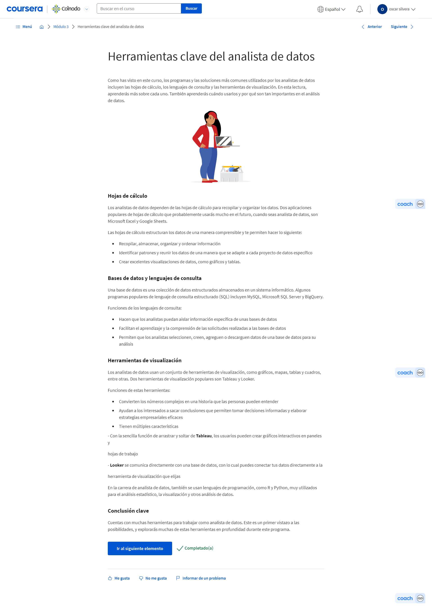

#### Elegir la herramienta adecuada para la tarea

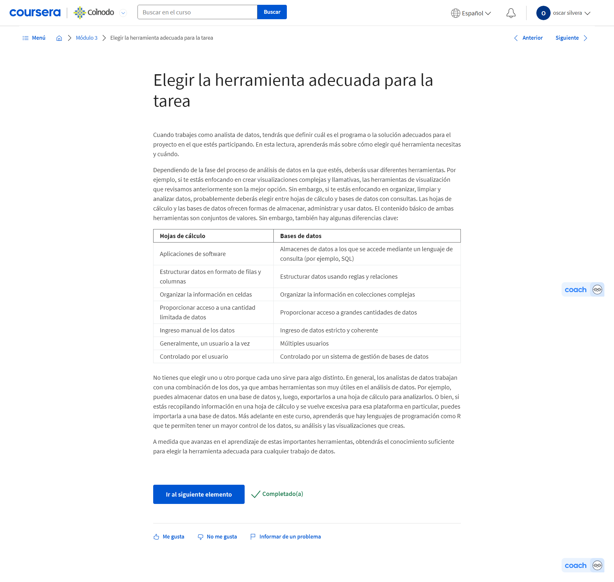

#### Cuestionario práctico: Autorreflexión: revisión de conceptos pasados

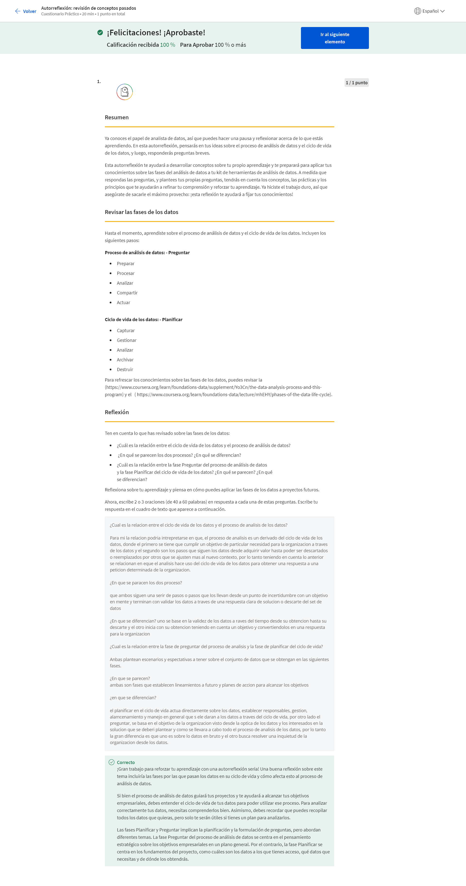

## Configura tu caja de herramientas

### Dominio de los conceptos básicos de la hoja de cálculo

#### Los pormenores de las herramientas de datos centrales

¡Bienvenido nuevamente! En los próximos videos, continuarás explorando las herramientas de análisis de datos que discutimos anteriormente y tendrás la oportunidad de verlas un poco en acción. Esto te dará una idea más clara de cómo utilizar estas herramientas. El resto del programa se basará en lo que aprendas aquí. Comenzaremos con un análisis más detallado de las hojas de cálculo. Desglosaremos las hojas de cálculo desde sus conceptos básicos para comprender mejor algunas de sus características y funciones. También aprenderás cómo puedes utilizarlas en tu trabajo como analista de datos. Por ejemplo, ¿cómo clasificas los datos para facilitar su uso? Vamos a averiguarlo. A continuación, veremos a SQL en acción. Los analistas de datos utilizan SQL en su trabajo todo el tiempo. Como cuando necesitan una gran cantidad de datos en segundos para ayudar a responder una pregunta empresarial rápida. Lo más probable es que no estés familiarizado con SQL. Está bien. Aprenderás que usar SQL es como pedir comida en un restaurante súper rápido. Es posible que tu consulta SQL no sea tan deliciosa, pero no tendrás que esperar mucho para recibir tu pedido. Hablando de comida, ¿qué mejor tema que el postre? Puedes pensar en la visualización de datos como el postre de la comida del análisis de datos. Se sirve al final de tu análisis después de que hayas hecho lo que necesitas para obtener los datos correctos para una pregunta o tarea. Ya hemos visto que las visualizaciones vienen de muchas maneras, como gráficos o tablas. Al igual que los postres, son un placer a la vista. Aprenderás más sobre estas representaciones visuales y verás otros ejemplos de cómo podrían verse. Luego, podrás hablar sobre visualizaciones con otros futuros analistas de datos como tú. Terminaremos con una evaluación, pero tendrás tiempo de revisar lo que has aprendido antes. Bien, sigamos adelante. Por cierto, ¿alguien más tiene hambre ahora?

#### Columnas, filas y celdas, Dios mío

Las hojas de cálculo son una parte importante del análisis de datos. Cuanto antes te hagas amigo de las hojas de cálculo, mejor. Confía en mí, te ahorrarán mucho tiempo como analista de datos y facilitarán tu trabajo. Esta hoja de cálculo es un ejemplo de cómo podría verse una hoja de cálculo organizada. En este video, demostraremos algunos de los conceptos básicos de la hoja de cálculo para quienes son nuevos en este mundo. Esta podría ser una revisión para algunos de ustedes, en cuanto a los colegas más experimentados, nunca está de más practicar lo que sabes. Además, es posible que aún aprendas uno o dos trucos. Te mostré esta imagen anteriormente. Vamos a explorarla aún más porque es un gran ejemplo de las tres características principales de una hoja de cálculo: celdas, filas y columnas. Formarán parte de casi todo lo que haces en una hoja de cálculo desde confeccionar una lista de compras simple hasta analizar un conjunto de datos complejo. Utilizo hojas de cálculo para administrar todo, desde mis propias finanzas personales hasta la fiesta anual de bienvenida que mis amigos y yo celebramos todos los años. Soy el planificador, así que uso una hoja de cálculo para mantener las cosas en orden, asegurándome de que tengamos todo lo que necesitamos. Hablando de mantener las cosas en orden, las columnas están organizadas verticalmente en una hoja de cálculo y están ordenadas por letra. Las filas están organizadas horizontalmente y ordenadas por número. Cuando se habla de una celda específica, se le asigna un nombre combinando la letra de la columna y el número de fila donde se encuentra la celda. Por ejemplo, en esta hoja de cálculo, la fila de texto está en la celda D3. Comencemos en una hoja de cálculo real. Puedes completar todos los pasos en casi cualquier programa de hoja de cálculo. Conozcamos tu hoja de cálculo un poco mejor ahora. Empezaremos con algunas operaciones básicas. Ten en cuenta que, como analista, no siempre crearás tu propio conjunto de datos. Pero por ahora, hagamos precisamente eso. Haré clic en la celda A2 y escribiré mi nombre así. Luego haré clic en la celda B2 y escribiré mi apellido.
No te preocupes si tu nombre no cabe en la celda, siempre puedes hacer columnas más anchas si es necesario. Todo lo que tienes que hacer es hacer clic y arrastrar el borde derecho de la columna hasta que tu nombre encaje. O puedes usar la función de ajuste de texto, que configurará las celdas para que cambien automáticamente su altura para permitir que el texto de la celda se ajuste. Para usar esta función, selecciona las celdas, columnas o filas con texto, luego utiliza el menú de formato para ver las opciones de ajuste de texto. Se configura automáticamente para permitir que el texto se desborde fuera de la celda. Pero puedes ajustar el texto en su lugar para que todo el texto sea visible. La opción de clip cortará el texto en la celda para que solo el texto que se ajuste sea visible. Listo. Hemos agregado datos. Ahora vamos a etiquetarlos. Esto es importante para la organización. Agregar etiquetas en la parte superior de las columnas facilitará la consulta y la búsqueda de datos posteriormente cuando realices un análisis. Estas etiquetas de columna generalmente se llaman atributos. Un atributo es una característica o calidad de los datos que se utilizan para etiquetar una columna en una tabla. Más frecuentemente, los atributos se denominan nombres de columna, etiquetas de columna, encabezados o fila de encabezado. Agreguemos algunos encabezados a nuestra tabla. Haré clic en la celda A1 y escribiré la palabra nombre.
En la celda B1 escribiré apellido. A estos atributos les pondremos negrita para que destaquen más. Las hojas de cálculo pueden ser realmente grandes, por lo que debes asegurarte de que tus datos estén claramente etiquetados y sean fáciles de definir. Puedo usar el cursor para seleccionar las celdas con los atributos. Luego haré clic en el ícono del barco para ponerlos en negrita. Luce bien hasta ahora. ¿Listo para agregar más datos? Empecemos con algunos atributos nuevos. Primero, agregaré una columna para la cantidad de hermanos escribiendo hermanos en la celda C1.
Luego agregaré dos atributos más en las siguientes dos columnas. Vayamos con el color favorito y el postre favorito. También les pondré negrita. Para ajustar las etiquetas en las celdas, ajustaré el tamaño de las columnas como antes.
Ahora, ten en cuenta, que hay otras maneras de ajustar el tamaño de las columnas y filas. Si tienes preguntas sobre el uso de las hojas de cálculo, una búsqueda rápida en línea generalmente te ayudará a encontrar lo que necesitas. También hemos incluido una lectura con más consejos e información sobre las hojas de cálculo. Volvamos al tema. Ahora puedo agregar mis propios datos al conjunto de datos. Escribiré cuántos hermanos tengo y mi color y postre favoritos en las celdas correspondientes.
A continuación, agregaré datos para dos personas más.
Ahora tenemos tres filas de datos. En un conjunto de datos, una fila también se llama observación. Una observación incluye todos los atributos de algo contenido en una fila de una tabla de datos. En este caso, la fila 3 es una observación de Willa Stein porque vemos todos sus atributos en esta fila. Ahora sabemos que las hojas de cálculo como tú hacen muchas cosas con los datos. Puedes almacenar y organizar datos como lo hemos hecho en esta hoja de cálculo. Pero puedes ir aún más lejos y reconocer los datos existentes. Aquí, te mostraré cómo. Digamos que queremos organizar nuestros datos según la cantidad de hermanos que tiene cada persona. Hay una manera sencilla de hacerlo. Primero, necesitaremos seleccionar todas nuestras columnas con datos para que todos se reorganicen juntos. Luego podemos ir a nuestro menú de datos. Aquí tenemos algunas opciones. Seleccionemos el rango de clasificación. Esto nos permitirá elegir cómo organizar la columna.
A continuación, elegiremos de la A a la Z, lo cual organizará nuestros números en orden de menor a mayor. Ahora, queremos tener cuidado con la fila del encabezado, que es la palabra hermanos, el atributo de esta columna. Marcaremos esta casilla. Esto asegura que la palabra hermanos se quede en su lugar. Ahora estamos listos para ordenar. Voila, acabamos de reorganizar nuestros datos clasificándolos desde la cantidad más pequeña hasta la más grande. A medida que avanzamos, descubrirás muchas otras maneras de trabajar con datos en una hoja de cálculo, incluidas las funciones y fórmulas. Terminemos con un rápido ejemplo de una fórmula. Puedes pensar en las fórmulas como una manera de manipular los datos en una hoja de cálculo. Las fórmulas son como una calculadora, pero más potente. Una fórmula es un conjunto de instrucciones que realiza una acción específica utilizando los datos de una hoja de cálculo. Para ello, la fórmula utiliza referencias de celda para los valores que está calculando. Déjame mostrarte. ¡Aquí vamos! Haremos clic en la siguiente celda en la columna hermanos. Luego escribiremos un signo igual. Todas las fórmulas empiezan con este símbolo. A continuación, escribiremos las celdas que queremos sumar. En este caso, escribiremos C2 más C3 más C4. Ahora podemos pulsar "Enter". Listo. La fórmula nos ha dado la cantidad total de hermanos representados en este conjunto de datos. Acabamos de analizar algunos datos. Vamos a querer almacenar los datos para su posterior uso. En las hojas de cálculo de Google, una hoja de cálculo se guarda automáticamente en tu Google Drive. Las hojas de cálculo de Excel y otros programas las guardarás como un archivo. Ahora conoces algunos conceptos básicos para usar hojas de cálculo. Una vez que te hayas acostumbrado a estos conceptos, podrás aprender aún más sobre las herramientas de las hojas de cálculo. Siéntete libre de volver a ver este video y practicar por tu cuenta. Incluso puedes crear tu propia versión de la hoja de cálculo con tus propios datos. Hasta pronto.

#### Cuadro de aviso de la discusión: Hojas de cálculo en la vida diaria

#### Más recursos de hojas de cálculo

En esta lección, aprendiste sobre los conceptos básicos de las hojas de cálculo y las formas prácticas en que pueden ayudarte a organizar los datos. ¿Cómo puedes usar una hoja de cálculo en tu vida diaria para simplificar una tarea o resolver un problema?

#### Cuestionario práctico: Actividades prácticas: Genera un diagrama a partir de una hoja de cálculo

<https://support.google.com/a/users/answer/9282959?visit_id=637361702049227170-1815413770&rd=1>

Aprende otras maneras de mover, almacenar y analizar tus datos con la página de Capacitación y ayuda de Google Sheets, que está en el Centro de aprendizaje de Google Workspace. Este centro ofrece una lista ampliada de consejos para los niveles desde principiante hasta avanzado, junto con hojas de referencia, plantillas, guías y tutoriales. 

<https://support.google.com/a/users/answer/9300022>

¿Deseas obtener más información sobre Google Sheets? En este artículo de ayuda en línea, se proporciona una breve lista de las funciones más importantes que usarás, incluidas filas, columnas, celdas y funciones. 

<https://support.microsoft.com/en-us/office/excel-for-windows-training-9bc05390-e94c-46af-a5b3-d7c22f6990bb>

Si deseas saber un poco más sobre las hojas de cálculo de Excel, visita este centro de capacitación en línea gratuito. Encontrarás todo lo que necesitas saber en un solo lugar; desde una guía de inicio rápida e introducción hasta tutoriales y plantillas.

#### Cuadro de aviso de la discusión: Comparte tu diagrama

En la medida en que continúes trabajando con datos, observarás que los comentarios de otros pueden ayudarte a obtener una nueva perspectiva y reforzar tus descubrimientos. En una lección anterior, ingresaste tus propios datos en una hoja de cálculo para generar un diagrama. Ahora, es momento de usar ese diagrama para recibir comentarios valiosos. Para este debate, envía lo siguiente:

El diagrama generado a partir de tus datos (para asegurarte de que otros accedan fácilmente al diagrama, toma una captura de pantalla y adjúntala en forma de imagen)

Una descripción de un párrafo (de 50 a 100 palabras) acerca de qué se trata tu diagrama

Un resumen de un párrafo (de 50 a 100 palabras) de los cambios que harías en tus actividades habituales en función de la información que obtuviste del diagrama

#### Cuestionario práctico: Pon a prueba tus conocimientos sobre los conceptos básicos de las hojas de cálculo

### Lenguaje de consulta estructurado (SQL)

#### SQL en acción

Como recordarás, anteriormente hablamos del lenguaje de consulta SQL. En este video, verás a SQL en acción y aprenderás lo que puedes hacer con él, con algunos ejemplos de consultas específicas. Supongo que puedes llamar a esto la secuela de SQL. Intentaremos hacer este incluso mejor que el original. Recuerda, SQL puede hacer con los datos varias de las cosas que hacen las hojas de cálculo. Puedes usarlo para almacenar, organizar y analizar tus datos, entre otras cosas. Pero como cualquier buen SQL, es, a mayor escala, más grande y con más acción. Piensa en SQL como hojas de cálculo de gran tamaño. Por ejemplo, es posible que quieras considerar una hoja de cálculo cuando tengas un conjunto de datos más pequeño, como uno con solo 100 filas. Pero si tu conjunto de datos parece no terminar más y tienes dificultades para mantener al día tu hoja de cálculo, SQL sería el camino por seguir. Cuando usas SQL, necesitas un lugar que entienda el lenguaje SQL. Si alguna vez has ido a algún lugar y no sabes el idioma, comunicarse puede ser un desafío. Tal vez pienses que estás pidiendo una cosa y obtienes algo completamente diferente. Bueno, SQL conoce esa sensación. SQL necesita una base de datos que entienda su lenguaje. Hablemos. Existen varias bases de datos que utilizan SQL. Puedes usar varias de ellas mientras trabajas como analista de datos. Pero esta es la cuestión, no importa qué base de datos utilices, SQL básicamente funciona para lo mismo en cada una. Por ejemplo, en SQL, las consultas son universales. Hemos hablado acerca de las consultas anteriormente, pero nunca está de más hacer un repaso. Una consulta es una solicitud de datos o información proveniente de una base de datos. Esta es la estructura de una consulta básica. Puedes ver que con esta consulta podemos seleccionar datos específicos de una tabla agregando dónde podemos filtrar los datos en función de ciertas condiciones. ¡Empecemos! Abriremos nuestra base de datos y veremos cómo SQL puede comunicarse con ella para realizar una tarea de datos simple. En primer lugar, vamos a seleccionar nuestro conjunto de datos. Usaremos un asterisco para seleccionar todos los datos de la tabla. Con esa consulta simple, la base de datos llama a la tabla que necesitamos.
Reproduce el video desde :2:40 y sigue la transcripción2:40
Magia. Vamos a agregar Dónde a nuestra consulta para mostrar cómo cambian los datos que obtenemos.
Reproduce el video desde :2:56 y sigue la transcripción2:56
Puedes ver que los datos ahora solo muestran películas que están en el género de acción. Eso es todo, una consulta básica en SQL. Bastante bien. Pronto aprenderás a crear consultas más complejas. Por ahora, sin embargo, podemos celebrar que aprendiste sobre la estructura de una consulta SQL básica, seleccionar, desde y dónde. A medida que continúes con el programa, tendrás la oportunidad de utilizar SQL tú mismo. Espero que este video sea un adelanto útil de lo que vendrá más adelante.

#### Guía de SQL: Primeros pasos

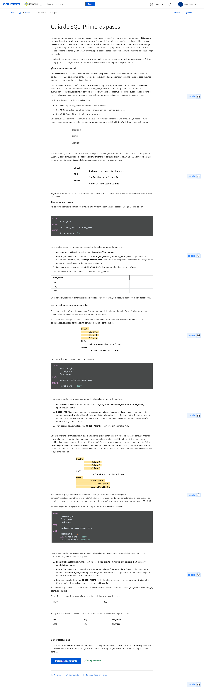

#### Angie: La lucha cotidiana al aprender nuevas habilidades

Soy Angie, gerente de programas de Ingeniería en Google. Actualmente estoy trabajando en el certificado de análisis de datos. Antes fui investigadora en análisis de personas. También fui lo que llamo una mercenaria analítica que trabajaba para varias empresas diferentes para ayudarlas a dar sentido a sus datos. Cada vez que aprendo una nueva habilidad, siento que estoy aprendiendo a hablar de nuevo. Recuerdo la primera vez que aprendí SQL; estaba tan frustrada porque sentía que todos los que estaban a mi alrededor trabajaban con fluidez, sabían exactamente lo que estaban haciendo. Recuerdo haber luchado con las cosas más básicas, como sacar los datos de la tabla. Recuerdo que alguien me pidió que encontrara un promedio de algo y seguía obteniendo un error. Realmente se siente como si estuvieras aprendiendo un nuevo idioma, y estás en el nivel de un niño pequeño, y todos los que te rodean pueden hacerlo con fluidez. Mis padres emigraron a este país cuando tenían 30 años. Después aprendieron otro idioma y tuvieron que empezar de nuevo y aprender inglés. Recuerdo que cuando era una niña los veía luchar todos los días para aprender un nuevo idioma, para hacer cosas realmente básicas, como pedir ayuda en la tienda de comestibles. Recuerdo que llamé a la compañía de cable cuando tenía seis años y les hice preguntas sobre la factura porque mis padres no podían. Recuerdo lo duro que trabajaron para aprender este nuevo idioma y ser fluidos, y cada vez que estoy aprendiendo un nuevo lenguaje de datos, como SQL, pienso en lo difícil que debe haber sido. Creo que si ellos pudieron hacer aquello, yo puedo aprender SQL. Si ellos pudieron pedir ayuda para las cosas más básicas, puedo preguntarles a los analistas de datos que están a mi lado cómo escribir una declaración SQL y cómo obtener los datos de una tabla. Eso realmente me ayudó; es simplemente tener esa mentalidad y saber que puedo pedir ayuda.

#### Las posibilidades de SQL son infinitas

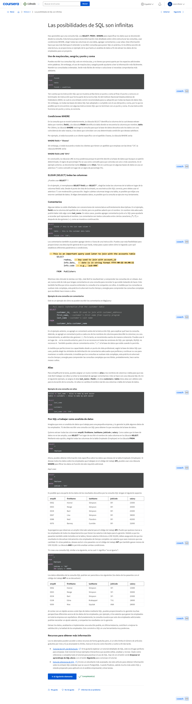

<https://www.w3schools.com/sql/default.asp>

<https://www.sqltutorial.org/sql-cheat-sheet/>

#### Cuestionario práctico: Pon a prueba tus conocimientos sobre SQL

### Visualización de datos

#### Conviértete en un experto en visualización de datos

Tu caja de herramientas de análisis de datos se está llenando. Aprender tanto sobre las hojas de cálculo como sobre SQL te llevará lejos en el mundo del análisis de datos. Hay más que aprender, por supuesto, y muchas más herramientas que podrás usar, pero tu futuro se ve brillante. Y está a punto de verse aún más brillante porque estamos aquí para hablar más sobre la visualización de datos. Te contaré un poco más sobre el papel de las herramientas de visualización de datos y el análisis de datos y te daré la oportunidad de ver esas herramientas en acción más adelante en este video. Quizás recuerdes que la visualización de datos es la representación gráfica de cierta información. Para muchos analistas de datos, es la parte más emocionante de su trabajo porque ven que su esfuerzo se ve recompensado con algo interesante. Sin mencionar que la visualización de datos es hermosa y útil. Me quedé anonadado cuando llegué a Google y comencé a recibir un informe de datos trimestral en mi correo electrónico y tenía una gran plataforma de diapositivas donde la gente contribuía con sus visualizaciones. Definitivamente fue una luz en el camino cuando comencé a generar mis propias visualizaciones. Si no te impresiona mi historia, déjame contarte sobre Florence Nightingale. ¿Te suena ese nombre? Es responsable de gran parte de la filosofía de la enfermería moderna y, lo creas o no, también fue analista de datos. Durante la Guerra de Crimea, en la década de 1850, miles de soldados morían todos los días, Nightingale quería encontrar una manera de reducir la cantidad de muertes. Después de examinar los datos, descubrió que la mayoría de los soldados morían a causa de afecciones evitables. Para convencer a los administradores del hospital de que debían concentrarse en estas afecciones, creó un gráfico que mostraba la cantidad de muertes durante varios meses. Las secciones azules mucho más grandes en la visualización representan las muertes evitables. Su trabajo condujo directamente a cambios importantes en la atención al paciente. Ella hizo todo esto hace más de 150 años sin una computadora. Una de las principales razones por las que Nightingale creó esta visualización fue para que los datos fueran más fáciles de entender para su audiencia. Sintió que tendría más éxito en convencer a los interesados utilizando imágenes en lugar de solo palabras y números. Tenía razón. Las tablas llenas de datos, si bien son necesarias para el análisis, simplemente no pueden mostrar tendencias y patrones tan rápida y claramente como las visualizaciones. Imagínate que recibes una tarea que debe completarse el mismo día. Si recopilas los datos que necesitas en una tabla, ¿podrías explicar resultados usando la tabla? Sí, probablemente podrías, pero una mejor idea sería utilizar una visualización como este gráfico de barras. Algo como esto hace que sea mucho más fácil para ti explicarlo rápidamente, y tienes el beneficio de un gráfico genial para respaldar tu análisis. Como analista de datos, te conviene crear visualizaciones que hagan que los datos sean fáciles de entender e interesantes de ver, así que lúcete. Es posible que los interesados no tengan mucho tiempo para dedicarle a los datos. Tu trabajo será hacer que su tiempo valga la pena. Volvamos a la tabla de datos que creamos anteriormente en el curso. Si has creado la tuya para practicar, puedes abrirla ahora o probarla más tarde. Estos son los datos que agregamos antes. Vamos a crear una visualización de los datos insertando un gráfico, un gráfico de barras. Puedes ver que la hoja de cálculo visualizó los datos de nuestra tabla de la manera que tenía más sentido. Creó un gráfico de barras o un gráfico de columnas para comparar las edades de cada persona por nombre, pero es posible que ya lo hayas descubierto. Esa es la belleza de la visualización: muestra el análisis de datos de manera rápida y clara. Podemos usar el editor de gráficos para ajustarlo. Los diferentes programas de hojas de cálculo pueden tener diferentes formas de hacer esto, pero todos tienen funciones de visualización y maneras de editar esas visualizaciones. Por ahora, echemos un vistazo a los gráficos sugeridos. Podemos hacer que las barras vayan horizontalmente usando un gráfico de barras. Eso se ve muy bien, así que vamos a cerrar el editor de gráficos. Hay muchas opciones que tener en cuenta, pero lo mantendremos a un nivel básico por ahora. Siéntete libre de probar otras visualizaciones si practicas más tarde. Ahora, podemos ajustar nuestro gráfico para que toda nuestra hoja de cálculo se vea limpia y profesional. ¡Excelente! Espero que aprendas a amar las visualizaciones de datos tanto como yo. Tal vez te conviertas en un pionero de la visualización de datos, al igual que Florence Nightingale. Como analista de datos novato, empezaste a llenar tu cinturón de trabajo con herramientas valiosas que utilizarás durante el resto del programa. Tener conocimientos sobre hojas de cálculo, SQL y visualización de datos te ayudará a convertirte en un detective de datos excelente. Podrás utilizar estas herramientas durante todo el proceso de análisis de datos a medida que avances. A continuación, completa algunas actividades para concluir esta parte del programa. También completarás una evaluación para verificar tu comprensión de todo lo que aprendiste. Esta es una gran oportunidad para pensar en algunas de las áreas que continuarás explorando en este curso y en tu carrera. Como siempre, eres libre de revisar los videos y los textos para ayudarte a recordar ciertos temas e ideas, incluso si ya te sientes preparado. Estás a solo unos pasos del próximo curso; eso es un gran progreso. Sigue así.

#### Planificar una visualización de datos

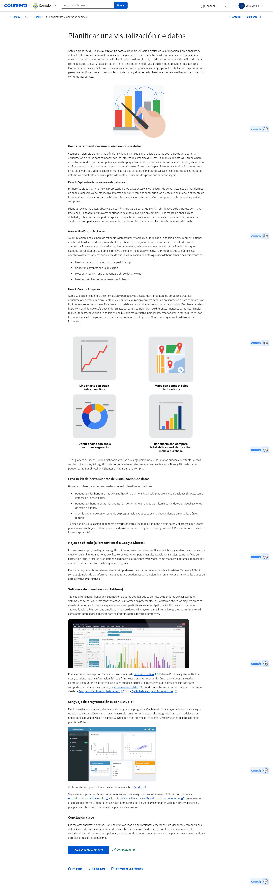

#### Lilah: El poder de una visualización

Me llamo Lilah Jones y formo parte de nuestro equipo en la nube. Tengo la oportunidad de liderar un equipo de personas increíbles que se focalizan en ayudar a los clientes a llegar a la nube. Visualizaciones de datos, una expresión larga que también puede hacer que tus ojos se irriten. Pero me pregunto si, cuando eras pequeño y estabas con tus padres, tal vez tenías una rutina para ir a dormir o, si tienes hijos, quizás tengas una rutina para que ellos se vayan a dormir. Sería muy raro que te acerques a esos niños con un montón de hechos y cifras antes de que se vayan a la cama. Pero apuesto que probablemente les estás contando una historia, les estás mostrando fotos. Sé que siempre me han gustado los cómics; las imágenes cuentan una historia. Las visualizaciones de datos son imágenes, son una manera maravillosa de tomar ideas muy básicas sobre datos y puntos de datos y hacer que cobren vida. Puedes hacer diferentes tipos de combinaciones de visualizaciones, pero las que son interactivas, vaya, son espectaculares. ¿Te imaginas ser ejecutivo de una organización y tratar de decidir si abres otro centro en Bangkok? ¿Tiene sentido? Ser capaces de decir que sabemos la razón por la que nos sirve tener excelentes visualizaciones de datos: para respaldar todos nuestros puntos de vista; es una obviedad. Curiosamente, recuerdo la primera vez que me encontré con una visualización superasombrosa; fue en mi vida personal. Cambié mi software de presupuestos de un proveedor a otro, y el proveedor al que cambié estaba realmente enfocado en que cada dólar contara y en asegurarse de que estuviera presupuestando cada dólar. Había visualizaciones que cambiaban según qué datos agregabas, y realmente cambió toda mi perspectiva, por completo. Entonces, tener los datos es como tener la hoja de respuestas de un examen; realmente te permite saber que vas a tomar buenas decisiones porque estás respaldado por los datos.

#### Cuadro de aviso de la discusión: Visualizaciones en la vida diaria

La visualización de datos hace que los datos sean más fáciles de entender y revela patrones y tendencias. Ahora es el momento de aplicar estos conocimientos en tu vida diaria. Si lo haces, será más fácil para ti que pienses como un analista de datos.

Para este tema de debate, ten en cuenta lo siguiente:

¿Qué datos usas todos los días? ¿Cómo se presentan esos datos? Por ejemplo, si viajas en tren de mañana y de noche, el horario de tránsito y el mapa del tren constituyen visualizaciones de datos que usas todos los días.

Antes de empezar este programa, ¿qué pensabas de la visualización de datos? ¿Qué significaba para ti? ¿Qué piensas de la visualización de datos en la actualidad?

#### Cuestionario práctico: Pon a prueba tus conocimientos sobre la visualización de datos

## Posibilidades profesionales infinitas

### Oportunidades de trabajo como analista de datos

#### Vídeo: VídeoPongamos manos a la obra

Hola, es genial tenerte de vuelta. Ahora es el momento de poner manos a la obra. Vamos a empezar a hablar sobre las formas prácticas en que las empresas utilizan los datos, y las oportunidades que esto puede crear para ti. Hasta ahora, has aprendido muchas habilidades prácticas para el análisis de datos. Con los próximos videos, vamos a cambiar un poco y vamos hablar sobre por qué estás aprendiendo estas habilidades. Con suerte, esto te dará más perspectiva acerca de los tipos de oportunidades que existen para ti. A continuación, hablaremos más sobre los tipos de funciones que los analistas de datos desempeñan en diferentes industrias. La tarea que requerían estas funciones y la importancia de la equidad y de evitar sesgos y analizar los datos para las tareas empresariales. También hablaremos sobre las oportunidades que puedes aprovechar y cómo este programa influye en tu éxito futuro y en la función de analista de datos. Entonces, con todo eso en mente, comencemos.

#### El trabajo de un analista de datos

Anteriormente, aprendimos sobre lo que hace un analista de datos y por qué ese trabajo es tan valioso. Ahora, veamos dónde los analistas de datos realmente hacen su trabajo. Aprenderás mucho más sobre las industrias en las que podrías trabajar como analista de datos. Y cómo las empresas en estos campos ya están utilizando el análisis de datos para hacer cosas realmente interesantes. Hay muchas empresas que tienen una gran necesidad de las habilidades que estás aprendiendo en este momento. En industrias como tecnología, marketing, finanzas, atención médica y muchas más. Las empresas reales ya están utilizando el análisis de datos para mantenerse a la vanguardia. Y cuanto más utilizan los datos en sus empresas, más comprenden lo importante que es un analista de datos como tú para su éxito. Veamos un ejemplo de la vida real de una marca que probablemente reconozcas: Coca-Cola. Los datos están cambiando la forma en que Coca-Cola encara sus estrategias de marketing. Coca-Cola utiliza datos recopilados de los comentarios de los consumidores para crear publicidad que se dirija directamente a diferentes audiencias con diferentes intereses. ¿Cómo funciona esto? ¿Conoces esas máquinas expendedoras de Coca-Cola de alta tecnología que ves a veces en el cine? Siempre es divertido preparar tus propios sabores. Bueno, esas máquinas tienen inteligencia artificial incorporada y herramientas de análisis de datos. Esto ayuda a Coca-Cola a ver los diferentes tipos de combinaciones de sabores que se le ocurren a la gente, que luego la empresa puede usar como inspiración para nuevos productos. ¿No es eso genial? ¿Alguna vez te preguntaste cómo Google tiene la respuesta correcta a cualquier pregunta en solo segundos? Eso también funciona con datos. Usamos todo tipo de datos para determinar la confiabilidad y precisión de un sitio web para asegurarnos de obtener los resultados más útiles en cualquier búsqueda que realices. Pero, ¿solo las grandes empresas como Coca-Cola y Google utilizan datos? Las pequeñas empresas de todo el mundo también están empezando a aprovechar los conocimientos basados en datos para mejorar sus operaciones y tomar mejores decisiones. Las pequeñas empresas pueden usar datos para hacer todo tipo de cosas. Pueden utilizar el análisis de datos para comprender mejor los hábitos de compra de sus clientes, crear mensajes más efectivos en las redes sociales, o, en el caso de un zoológico y acuario de una ciudad, predecir la cantidad de visitantes diarios en función de los datos del clima local. El zoológico y el acuario de la ciudad se dieron cuenta de que, en los días de lluvia había una gran disminución en la asistencia, pero no tenían manera de predecir con precisión cuándo llegarían esos días de lluvia. Esto hizo que la dotación de personal fuera un verdadero desafío. Algunos días tenían exceso de personal, otros días no estaban preparados para la avalancha de visitantes. Para lidiar con esto, al analista de datos tomó años de registros meteorológicos del zoológico y utilizó esos datos para predecir con precisión los patrones climáticos futuros. Esto le facilitó al zoológico saber cuánto personal necesitaría y cuándo. Debido a que el zoológico pudo predecir y administrar sus necesidades de personal con mayor precisión, pudo brindar una mejor experiencia a los visitantes y también dedicar más recursos para crear una mejor experiencia para los animales. Vemos algo similar en la industria de la salud. Sus analistas de datos analizan los datos de asistencia clínica para ayudar a los hospitales y consultorios médicos a predecir cuáles serán las horas pico para que puedan estar preparados. El hospital local de tu ciudad es un gran ejemplo. Digamos que han recibido reclamos sobre los largos tiempos de espera. A veces, una hora o más, lo que dificultaba que algunos pacientes recibieran la atención que necesitaban. Por lo tanto, los analistas de datos utilizan datos sobre el tráfico peatonal diario de los hospitales para ayudarlos a tomar decisiones más fundadas sobre cuántos médicos necesitan disponibles en un momento dado. Esto ayudó a reducir los tiempos de espera, mejorar la experiencia de sus pacientes y también hacer un mejor uso del tiempo del trabajador de la salud. Como dije, hay muchas formas en que las empresas de diferentes industrias utilizan los datos, pero solo pueden hacerlo si tienen un analista de datos en quien confiar. Entonces, tal vez te preguntes, ¿cómo encajo en la ecuación? Bueno, tienes muchas opciones, pero no tienes que decidir en qué industria quieres trabajar. Por cierto, habrá mucho tiempo para pensar en eso a medida que avanzas en este programa. Cuando termines este programa, tendrás las habilidades básicas que te harán valioso para cualquier industria que tome decisiones basadas en datos, que, como sabemos, es la mayoría de las industrias, incluso los zoológicos. A continuación, revisaremos la tarea empresarial en la que los datos pueden ser útiles. Y exploraremos aún más cómo los analistas de datos están empoderando a las empresas a través de los datos. Nos vemos luego.

#### Vídeo: VídeoJoey: El camino para convertirse en analista de datos

Hola, soy Joey y trabajo como gerente de programas de análisis en REWS. Ahora REWS es sinónimo de servicios inmobiliarios y laborales, y mi trabajo es gestionar los datos y analizarlos para la toma de decisiones aquí, especialmente en lo que respecta a la creación de un entorno de trabajo seguro y divertido. Mi viaje hacia el análisis fue un poco diferente en el sentido de que no tenía un plan o realmente no me veía trabajando donde estoy ahora. Afortunadamente, empecé en un programa rotativo llamado programa HRA dentro de operaciones de personal, lo que me permitió desempeñar básicamente tres funciones diferentes. Estuve en la función de generalista como especialista y analista, y realmente encontré amor y pasión por el trabajo analítico. Empecé en el equipo de inteligencia empresarial, cuyo trabajo consistía en proporcionar informes basados en SQL a la empresa. Me di cuenta de que el análisis era la trayectoria profesional adecuada para mí cuando me encontré disfrutando de venir a trabajar y hacer mi trabajo. Y creo que puedo conectar eso con mis dos pasiones. La primera es la resolución de problemas. Me encanta encarar un problema complejo, un misterio, un acertijo y poder encontrar las respuestas y llegar a la solución. Y luego, lo segundo es poder trabajar con personas y ayudar a la gente. En el análisis, siento que la clave del éxito es poder combinar la parte personal con la parte técnica. Al inicio de mi carrera, me focalicé un poco más sobre las piezas técnicas y quería asegurarme de tener los conocimientos técnicos adecuados para poder responder las preguntas. Pero lo que descubrí es que, con el tiempo, necesitaba hacer crecer de igual modo ese otro lado. Y creo que mi carrera me ha brindado las oportunidades para trabajar cada una de esas facetas, la parte de interacción humana y la parte técnica para asegurarme de que ambas hayan crecido al final del día.

#### Cuestionario práctico: Autorreflexión: Uso empresarial de los datos

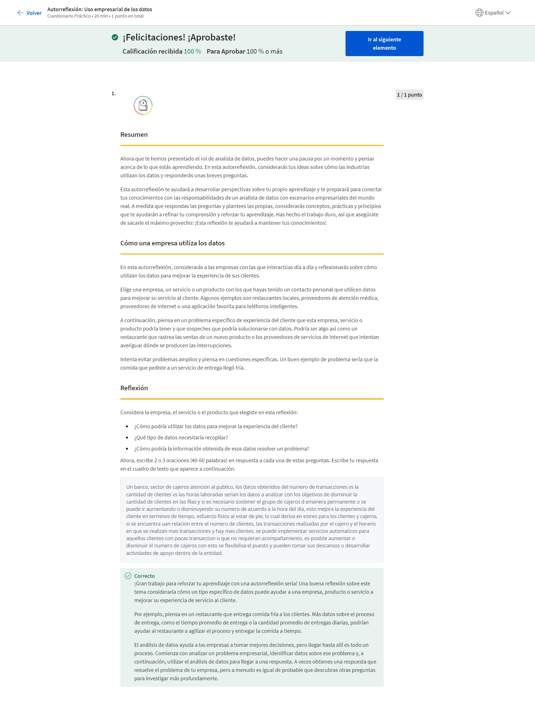

#### Vídeo: VídeoTony: Respaldo a las carreras de Análisis de Datos

Para cualquier analista, para cualquier persona que se encuentre realmente en las primeras etapas de su carrera, comprender los datos, respetarlos y saber cómo trabajar con datos es increíblemente importante porque, mi visión es que cada función de alguna manera involucrará datos y su uso. Aprender cómo extraer conocimientos de ellos será el núcleo de cualquier función crítica en cualquier organización empresarial. Por lo general, en esos dos primeros años, estás desarrollando las habilidades básicas que te convierten en un generalista fantástico, y luego, en los próximos 2 a 5 años, estás aprendiendo sobre algo muy específico en lo que respecta a tu trabajo. Ya sea en el área donde das soporte o tal vez en un componente muy técnico. Digamos que quieres convertirte en un experto en SQL para poder manipular grandes conjuntos de datos con fines de análisis financiero. Del mismo modo, incluso si ingresas a las finanzas como analista de datos, puedes salir de las finanzas e ingresar a lo que a mucha gente le gusta llamar el negocio, que generalmente son tus funciones de operaciones, y convertirte en analista de negocios o analista de datos. Hay tantos diferentes caminos que puedes tomar desde el punto de partida que realmente no puedes predecir el final. Me apasiona mucho trabajar y apoyar a los jóvenes y darles un impulso a sus carreras. Honestamente, esto se debe a mi propia experiencia personal, donde, en los primeros dos años de mi carrera, no tuve prácticamente ningún apoyo de mi gerente ni de mi cadena de gerencia directa. Al pasar por esa experiencia en mis primeros años, me di cuenta y sentí cómo eso puede frenarte, y, especialmente, cuando eres alguien que tiene mucho potencial y mucha habilidad. Quieres estar en un entorno que fomente esa habilidad y realmente quiera verte crecer. Creo que es increíblemente importante tener programas como estos, que derriben todas las barreras, que eliminen cualquier obstáculo que impida que las personas puedan descubrir lo que necesitan para estar en una industria como esta, para tener éxito en una función como analista de datos, para que ellos mismos puedan soñar hasta dónde pueden llegar en su carrera. Mi nombre es Tony. Soy gerente de programa de finanzas en Google.

#### Registro de aprendizaje: Reflexionar sobre el proceso de análisis de datos

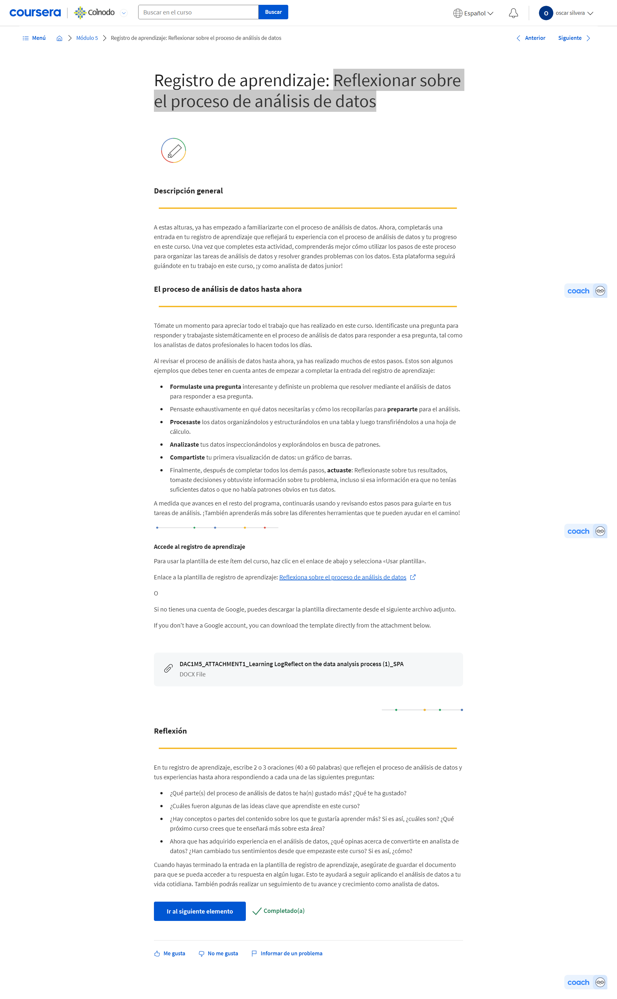

### La importancia de tomar decisiones empresariales justas

#### El poder de los datos en la empresa

Como analista de datos, abordarás tareas empresariales que ayudarán a las empresas a utilizar los datos. A continuación, hablaremos más sobre lo que es realmente una tarea empresarial y algunos ejemplos de cómo podrían verse en trabajos de analista de datos reales. Tomemos un segundo para pensar en los ejemplos reales de empresas que utilizan el análisis de datos y su operación que hemos visto antes. Es posible que hayas notado un tema recurrente en todos los ejemplos. Todos tienen inconvenientes que explorar, preguntas que responder o problemas que resolver. Es fácil que estos elementos se mezclen. Aquí hay una manera de aclararlos cuando hablamos de ellos en el análisis de datos. Un problema es un asunto o tema para investigar. Una pregunta está diseñada para descubrir información y un problema es un obstáculo o complicación que es necesario resolver. Coca-Cola tenía una pregunta sobre nuevos productos. El análisis de datos les dio información sobre los nuevos sabores que ya les gustan a los clientes. El zoológico y el acuario de la ciudad tenían un problema con el personal. Los datos, les ayudaron a descubrir la mejor estrategia de dotación de personal. Estas preguntas y problemas se convierten en la base de todo tipo de tareas empresariales, que ayudarás a resolver como analista de datos. Una tarea empresarial es la pregunta o el problema que el análisis de datos responde para las empresas. Aquí es donde concentras muchos de tus esfuerzos, en el trabajo que harás para futuros empleadores. Sigamos con nuestro ejemplo del zoológico y veamos si podemos imaginar cómo sería una tarea empresarial para un zoológico. Conocemos el problema, el clima impredecible dificultaba que el zoológico anticipara las necesidades de personal. Quizás la tarea empresarial podría ser algo así como analizar los datos meteorológicos de la última década para identificar patrones predecibles. Luego, los analistas de datos podrían planificar la mejor manera de recopilar, analizar y presentar los datos necesarios para resolver esta tarea y cumplir con los objetivos de los zoológicos. Luego, utilizando datos, el zoológico podría tomar decisiones informadas sobre su personal diariamente. Hablamos un poco sobre la toma de decisiones basada en datos en videos anteriores. Pero por si necesitas un repaso, aquí está. La toma de decisiones basada en datos es cuando los hechos que se han descubierto a través del análisis de datos se utilizan para guiar la estrategia empresarial. La forma más sencilla de pensar en la toma de decisiones es elegir entre las consecuencias, buenas, malas o una combinación de ambas. En nuestro ejemplo del zoológico, el zoológico tenía los datos necesarios para tomar una decisión informada que resolviera su problema. Pero, ¿y si hubieran tomado esta decisión sin datos? Digamos que solo confiaban en la observación y la memoria para rastrear el clima y generar cronogramas para el personal. Bueno, ya sabemos que eso no habría resuelto su problema a largo plazo. El análisis de datos les brindó la información necesaria para encontrar la mejor solución posible para su problema. Ese es el poder de los datos. La observación y la intuición son herramientas poderosas para la toma de decisiones, pero solo pueden llevarnos tan lejos cuando tomamos decisiones basadas solo en la observación y en las percepciones viscerales, solo vemos una parte del panorama. Los datos nos ayudan a ver todo el panorama. Con los datos tenemos un panorama completo del problema y sus causas, lo que nos permite encontrar nuevas y sorprendentes soluciones que nunca antes hubiéramos podido ver. El análisis de datos ayuda a las empresas a tomar mejores decisiones. Todo empieza con una tarea empresarial y la pregunta que intenta responder. Con las habilidades que aprenderás a lo largo de este programa, podrás hacer las preguntas correctas, planificar la mejor manera de recopilar y analizar datos, y luego presentarlos visualmente para armar tu equipo de modo que puedan tomar una decisión informada, basada en datos. Eso te hace crítico para para el éxito de cualquier empresa para la que trabajes. Los datos son una herramienta poderosa. Con el gran poder viene, bueno, ya sabes el resto. Y estás haciendo un gran trabajo al asimilar toda esta información. A continuación, hablaremos sobre tu responsabilidad como analista de datos de garantizar que estás recopilando, analizando y presentando datos de una manera que sea equitativa para las personas representadas por esos datos.

#### Rachel: Detectives de datos

Hola, me llamo Rachel y soy líder de sistemas y análisis empresariales en Verily. Hay muchos tipos diferentes de problemas que un analista de datos puede resolver. A lo largo de mi carrera he tenido la suerte de ver muchos de ellos y de recibir muchos tipos de datos muy diferentes y de ayudar a convertirlos en respuestas significativas. Creo que una de las cosas más importantes para recordar sobre el análisis de datos es que los datos son datos. Soy analista de datos financieros, por lo que mi función en Verily es tomar toda nuestra información financiera, toda la información del dinero que gastamos y el dinero que generamos, y convertirlo en informes y opiniones para que nuestros clientes potenciales puedan entender lo que estamos haciendo. Una de las cosas más importantes que he hecho en Verily recientemente fue ayudar a crear lo que se llama balance de pérdidas y ganancias para cada una de nuestras unidades de negocio. Esto significa que, en tiempo real, nuestros equipos pueden ver cuál es su presupuesto y cómo están invirtiendo ese presupuesto. Lo que hace es ayudar a nuestros equipos a mantener ese presupuesto ya sea aumentando sus flujos de ingresos para que tengan más dinero para usar o reduciendo sus gastos para que puedan mantenerse dentro de ese presupuesto. Todo eso realmente nos ayuda a mantenernos encaminados como empresa para asegurarnos de que estamos alcanzando nuestros objetivos. Descubrí que los datos actúan como una cosa que vive y respira. Cuando tienes un montón de puntos de datos, puede ser abrumador cuando te sientas por primera vez para darle sentido. Tienes toneladas de columnas, toneladas de registros, toneladas de diferentes tipos de datos, y encontrar una manera de darle sentido es realmente difícil y ahí es donde entra en juego la experiencia de un analista de datos. Han sido algunos de los momentos más frustrantes de mi carrera, pero también algunos de los trabajos más gratificantes que he hecho cuando finalmente cobra sentido. El mejor consejo que tengo para cualquier analista de datos que está empezando es perseverar. Si el ángulo que estás tomando no funciona, intenta encontrar otro. Intenta abordarlo de una manera diferente, intenta hacer una pregunta diferente y, finalmente, los datos cederán y obtendrás la información que estás buscando.

#### Comprender los datos y la equidad

Hasta ahora, hemos cubierto las diferentes funciones que desempeñan los analistas de datos en los entornos empresariales y las pruebas que incluyen esas funciones. Pero los analistas de datos tienen otra responsabilidad importante, asegurarse de que sus análisis sean equitativos. Ahora, sé lo que probablemente estás pensando, los datos se basan en hechos recopilados, ¿cómo no ser equitativo? Bueno, esa es una buena pregunta. Aprendamos qué significa equidad cuando hablamos de análisis de datos y por qué es importante que, como analista, lo tengas en cuenta. Equidad significa asegurarse de que tu análisis no introduzca ni refuerce sesgos. En otras palabras, como analista de datos, deseas ayudar a crear sistemas que sean equitativos e inclusivos para todos. ¿Suena bastante simple? Bueno, aquí está la parte difícil de la equidad en el análisis de datos. No hay una definición estándar para esto, pero es de esperar que la forma en que lo acabamos de describir pueda brindarte una forma de pensar en la equidad por ahora, pero está a punto de volverse un poco más complicado. A veces, las conclusiones basadas en datos pueden ser verdaderas e inequitativas. ¿Qué puedes hacer entonces? Bueno, averigüémoslo con un ejemplo. Digamos que tenemos una empresa que se destaca por ser un club de hombres. No hay mucha representación de otros géneros. Esta empresa quiere ver qué empleados están haciendo un buen trabajo, por lo que comienzan a recopilar datos sobre el desempeño de los empleados y su propia cultura empresarial. Los datos muestran que los hombres son las únicas personas que tienen éxito en esta empresa. Su conclusión es que deberían contratar más hombres, después de todo, están haciendo muy buen trabajo aquí. Pero esa no es una conclusión equitativa por varias razones. En primer lugar, ni siquiera considera todos los datos disponibles sobre la cultura de la empresa, por lo que presenta una imagen incompleta. En segundo lugar, no piensa en los otros factores circundantes que afectan los datos o, en otras palabras, la conclusión no considera las dificultades que tienen las personas de diferentes identidades de género al tratar de desempeñarse en un entorno laboral tóxico. Si la empresa solo mira esta conclusión, querrán reconocer y abordar cuán dañina es su cultura y no entenderán por qué ciertas personas están preparadas para fallar dentro de ella. Por eso es importante tener en cuenta la equidad al analizar los datos. La conclusión de que solo los hombres tienen éxito en esta empresa es cierta, pero ignora otros factores sistemáticos que contribuyen a este problema. Pero no te preocupes, hay una manera de llegar a una conclusión justa aquí. Un analista de datos ético puede mirar los datos recopilados y concluir que la cultura de la empresa está impidiendo que algunos empleados tengan éxito, y la empresa debe abordar esos problemas para mejorar el rendimiento. Mira cómo esta conclusión pinta una imagen mucho más completa y justa. Reconoce el hecho de que a algunas personas no les está yendo tan bien en esta empresa, de hecho, eso podría dar lugar a la discriminación contra una gran cantidad de solicitantes en el futuro. Como analista de datos, es tu responsabilidad garantizar que tu análisis sea equitativo y que los hechos se encuentren en el complicado contexto social que podría generar sesgos en tus conclusiones. Es importante pensar en la equidad desde el momento en que empiezas a recopilar datos para una prueba empresarial hasta el momento en que presentas tus conclusiones a las partes interesadas. Aprenderemos más sobre el sesgo en el proceso de análisis de datos más adelante en otro curso. Por ahora, veamos un ejemplo de un análisis de datos que hace un buen trabajo al considerar la equidad en su conclusión. Un equipo de científicos de datos de Harvard estaba desarrollando una plataforma móvil para rastrear pacientes con riesgo de enfermedad cardiovascular en un área de los Estados Unidos, llamada Stroke Belt. Es importante señalar que había una variedad de razones por las que las personas que viven en esta área podrían tener un mayor riesgo. Con eso en mente, estos científicos de datos reconocen que la equidad debe ser una prioridad para este proyecto, por lo que incorporaron la equidad en sus modelos. El equipo tomó varias medidas de equidad para asegurarse de que eran lo más equitativos posible al examinar datos sensibles y potencialmente sesgados. Primero, formaron un equipo de analistas y científicos sociales que pudiera brindar información sobre los sesgos humanos y el contexto social que los provocó. También recopilaron datos autoinformados en un sistema separado para evitar un posible sesgo racial, que podría sesgar los resultados de su estudio y representar inequitativamente a los pacientes. Para asegurarse de que esta población de muestra fuera representativa, sobremuestrearon los grupos no dominantes para asegurarse de que el modelo los incluyera. Está claro que el equipo hizo de la equidad una prioridad máxima a cada paso del camino. Esto les ayudó a recopilar datos y a crear conclusiones que no afectaron negativamente a las comunidades que estaban estudiando. Esperamos que estos ejemplos te hayan dado una mejor idea de lo que significa la equidad en el análisis de datos. Pero vamos a seguir construyendo sobre nuestra comprensión de la equidad a lo largo de este programa y podrás practicar con algunas actividades.

#### Cuestionario práctico: Autorreflexión: Casos de empresas

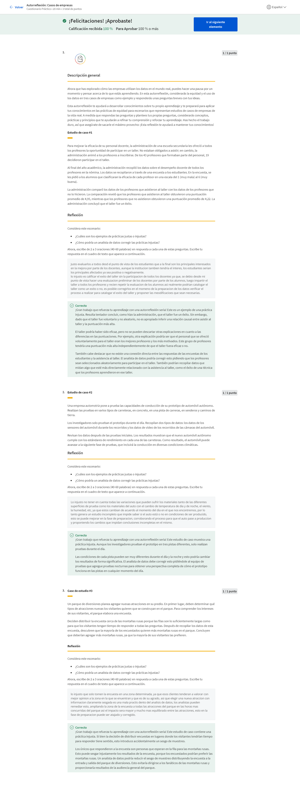

#### Cuadro de aviso de la discusión: Opinión del caso

Recientemente, se te presentaron casos sobre análisis de datos en el mundo real. Un caso se refería a una conclusión injusta sobre el desempeño de las mujeres que trabajaban en una empresa. Se demostró que los datos a veces pueden ser verdaderos pero injustos. Además, se destacó la importancia de preguntar «¿Por qué?» al revisar los resultados del análisis de datos.

Otro ejemplo se refería a los analistas de datos que priorizaron la equidad y se desviaron de su camino para garantizar que sus datos fueran lo más justos posible. Debido a que trabajaban con datos de salud sensibles y potencialmente sesgados, decidieron colaborar con científicos sociales para comprender mejor el contexto social detrás de esos datos.

Si es necesario, vuelve al video para recordar los ejemplos antes de continuar. Luego, analiza el primer caso y cómo los analistas de esa empresa podrían mejorar su proceso:

¿Qué podrían haber hecho de otra manera para ser más justos en su análisis? 

¿Qué podrían haber hecho para que su conclusión fuera menos sesgada? 

#### Alex: Decisiones de datos justas y éticas

Hola, soy Alex. Soy científico investigador en Google. Mi equipo se llama equipo de Inteligencia Artificial ética, somos un grupo de personas realmente preocupadas no solo por cómo funciona la tecnología de Inteligencia Artificial, sino también por cómo interactúa con la sociedad y cómo podría ayudar o dañar a las comunidades marginadas. Cuando hablamos de ética de datos, ¿pensamos en la forma correcta e incorrecta de usar los datos? ¿Cuáles serán las formas en que los usos de los datos serán beneficiosos para las personas? En cuanto a la ética de datos, no se trata solo de minimizar el daño, sino que, en realidad, lo que importa es el concepto de beneficio. ¿Cómo mejoramos realmente las vidas de las personas mediante el uso de datos? Cuando pensamos en la ética de datos, estamos pensando, ¿quién recopila los datos? ¿Por qué los recopilan? ¿Cómo los están recopilando y con qué propósito? Debido a la forma en que las organizaciones tienen la obligación de ganar dinero o informar a alguien o proporcionar algún análisis, también debemos tener muy en cuenta cómo esto realmente beneficiará a las personas al final del día. ¿Las personas representadas en estos datos se beneficiarán de esto? Creo que eso es lo que nunca querrás perder de vista como científico de datos o analista de datos. Creo que los aspirantes a analistas de datos deben tener en cuenta que muchos de los datos que van a encontrar son datos que provienen de personas, por lo que al final del día, los datos son personas. Quieres tener una responsabilidad con aquellas personas que están representadas en esos datos. En segundo lugar, deben pensar acerca de cómo mantener los aspectos de privacidad y protección de sus datos. No queremos atravesar nuestra práctica pensando en las instancias de datos como algo que simplemente podemos lanzar a la web. No, es necesario tener en cuenta cómo conservar esa información y similares, como sus imágenes, sus voces o sus textos. ¿Cómo podemos mantenerlos en privado? También debemos pensar en cómo podemos contar con mecanismos para brindarles a los usuarios y consumidores más control sobre sus datos. No será suficiente solo con decir, recopilamos todos estos datos y confíennos todos estos datos. Debemos asegurarnos de que haya formas viables mediante las cuales las personas puedan dar su consentimiento al proporcionar esos datos y formas en las que puedan solicitar que se revoquen o eliminen. Los datos siguen creciendo y, al mismo tiempo, necesitamos capacitar a las personas para que tengan control sobre sus propios datos. El futuro es que los datos siempre están creciendo, no hemos visto ninguna evidencia de que los datos en realidad se estén reduciendo. Con el conocimiento de que los datos están creciendo, estos problemas se vuelven cada vez más sensibles, y es cada vez más importante pensar en ellos.
Hola, soy Alex. Soy científico investigador en Google. Mi equipo se llama equipo de Inteligencia Artificial ética, somos un grupo de personas realmente preocupadas no solo por cómo funciona la tecnología de Inteligencia Artificial, sino también por cómo interactúa con la sociedad y cómo podría ayudar o dañar a las comunidades marginadas. Cuando hablamos de ética de datos, ¿pensamos en la forma correcta e incorrecta de usar los datos? ¿Cuáles serán las formas en que los usos de los datos serán beneficiosos para las personas? En cuanto a la ética de datos, no se trata solo de minimizar el daño, sino que, en realidad, lo que importa es el concepto de : agregado a la selección Presiona [CTRL + S] para guardar como nota.
es

#### Cuestionario práctico: Pon a prueba tus conocimientos sobre cómo tomar decisiones empresariales justas

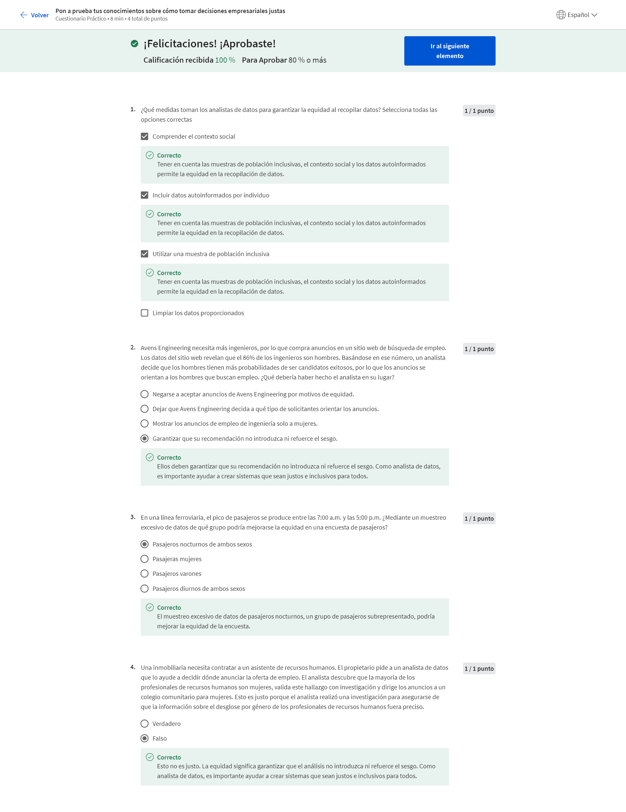

### Opcional: Explora tu próximo trabajo

#### Analistas de datos en diferentes industrias

Ahora ya sabemos que hay todo tipo de trabajos disponibles en diferentes industrias para los analistas de datos. Sin embargo, ahora es momento de pensar en algo igual de importante, ¿cómo puedes saber si un trabajo es adecuado para ti y tus objetivos profesionales? Es una pregunta difícil. No te preocupes. Eso es exactamente lo que trataremos en este video. Hay muchos factores importantes en los que pensar cuando buscas el trabajo de tus sueños. Hablemos primero de algunos de los factores más frecuentes: la industria, las herramientas, la ubicación, los viajes y la cultura. Ya se utilizan datos en innumerables industrias de diferentes tipos, tecnología, marketing, finanzas, atención médica y más. Pero algo que es importante tener en cuenta es que cada industria tiene necesidades específicas de datos que sus analistas de datos deben abordar de manera diferente. Los mismos datos de ingresos pueden utilizarse de tres maneras diferentes por los analistas de datos en tres industrias distintas, servicios financieros, telecomunicaciones y tecnología. Por ejemplo, un analista financiero de un banco publica datos de ingresos de la empresa de telecomunicaciones X con el objetivo de crear un pronóstico que prediga dónde estarán los ingresos en el futuro para recomendar el precio de las acciones. El analista de negocios de la empresa de telecomunicaciones X utiliza esos mismos datos para asesorar al equipo de ventas. Luego, el analista de datos de la empresa que creó una herramienta de gestión de clientes para la empresa de telecomunicaciones X utilizará dichos datos de ingresos para determinar qué tan eficientemente funciona el software. Las finanzas, las telecomunicaciones y la tecnología usan los datos de manera diferente, por lo que necesitan analistas que tengan diferentes habilidades. Todo se reduce a cuáles son las necesidades de la industria. Esas necesidades determinarán la tarea que se te asignará, las preguntas que responderás e, incluso, la forma en la que abordarás la búsqueda de empleo. Si recién estás empezando, una excelente manera de guiar tu búsqueda es pensar primero en lo que te interesa. ¿Te parece significativo ayudar a las personas a estar más saludables? Quizás quieras centrarte en usar datos para mejorar las admisiones de un hospital. ¿Qué hay de ayudar a las personas a ahorrar para una jubilación feliz? Es posible que desees un trabajo que utilice datos para determinar los factores de riesgo en las inversiones financieras. O tal vez te interese ayudar a que el periodismo crezca en tu ciudad. Un trabajo que use datos para ayudar a un sitio web de noticias local a encontrar más suscriptores podría ser la función perfecta para ti. La clave es pensar en tus intereses al iniciar tu búsqueda de empleo. Eso te llevará hacia la dirección correcta y también te ayudará en las entrevistas. Los potenciales empleadores querrán saber por qué estás interesado en su empresa y cómo puedes abordar sus necesidades, por lo que si puedes hablar sobre tu motivación para trabajar en análisis de datos durante las entrevistas, te destacarás de una manera excelente. Tendrás opciones relacionadas con dónde trabajar y para quién. Pero recuerda, deseas disfrutar de lo que haces, por lo que es una buena idea pensar en cómo deseas utilizar tus habilidades. Luego, busca empleos que te permitan hacer eso. Lo siguiente en la lista de cosas en las que pensar es la ubicación y los viajes. Cuando empieces tu búsqueda de empleo, debes tomar algunas decisiones en cuanto a dónde deseas vivir, por lo que es útil que te hagas algunas preguntas. ¿Tu industria preferida tiene oportunidades en tu área? ¿Quieras quedarte en tu comunidad o te gustaría mudarte? ¿Cuánto tiempo estás dispuesto a viajar al trabajo todos los días? ¿Conducirás al trabajo, caminarás o usarás el transporte público? ¿Es posible eso durante todo el año? ¿Qué te parece trabajar de forma remota? ¿Trabajar desde casa te emociona o te aburre? Por supuesto, querrás considerar el costo de vida y si deseas o no la comodidad de la vida en la ciudad o una casa tranquila en los suburbios, y no se trata solo de dónde estarás ubicado. Algunos trabajos pueden pedirte que viajes, lo que podría ser una oportunidad emocionante para explorar el mundo o un factor decisivo. Todo depende de lo que quieras de este empleo, así que empieza a hacerte algunas de estas preguntas. Averiguar las respuestas te puede ayudar a acotar tu búsqueda aún más, de modo que solo buscarás empleos que realmente puedas aceptar. Una vez que hayas respondido suficientes preguntas, podrás identificar algunas empresas específicas que se adapten a tus necesidades. Este es un buen momento para pensar en tus valores y en la cultura empresarial que mejor se adapta a tus necesidades. ¿Estás listo? Aquí vienen algunas preguntas más. ¿Trabajas mejor en equipo o solo? ¿Te gusta tener una rutina fija o disfrutas encarar un nuevo proyecto y probar cosas nuevas? ¿Tus valores coinciden con los valores de la empresa? Deberás prestar atención a estas cosas durante tu búsqueda de empleo y el proceso de entrevistas, para que puedas estar completamente seguro de que invertiste en la empresa para la que deseas trabajar. Esa es la mejor manera de comenzar a construir una carrera emocionante y satisfactoria. Este programa te ayudará a aprender las habilidades básicas para los análisis de datos en cualquier entorno, depende de ti hacia dónde quieras llevarlas, ya sea que eso signifique comenzar en una industria completamente nueva o pasar a un puesto de analista en una industria en la que ya tienes experiencia. Esperamos que lo que hemos tratado aquí te haya ayudado a encaminarte hacia tu futura búsqueda de empleo. Después de esto, debes llevar a cabo algunas actividades y luego podrás pasar a la siguiente parte de este curso. Hemos aprendido mucho hasta ahora, como las oportunidades que existen para los analistas de datos en diferentes industrias. Cómo los analistas de datos ayudan a las empresas a tomar mejores decisiones. La importancia de la equidad y los análisis de datos, y las posibles preguntas que puedes empezar a hacerte antes de tu futura búsqueda de empleo. Siempre puedes volver a estas lecciones si deseas revisarlas. En un próximo curso, veremos las habilidades que tienen todos los analistas de datos exitosos y aprenderás cómo puedes empezar a practicarlas también. Pero antes de eso, tendrás una evaluación. ¡Mucha suerte! Te veo pronto.

#### Funciones y descripciones del puesto del analista de datos

<https://www.ibm.com/downloads/cas/3RL3VXGA>

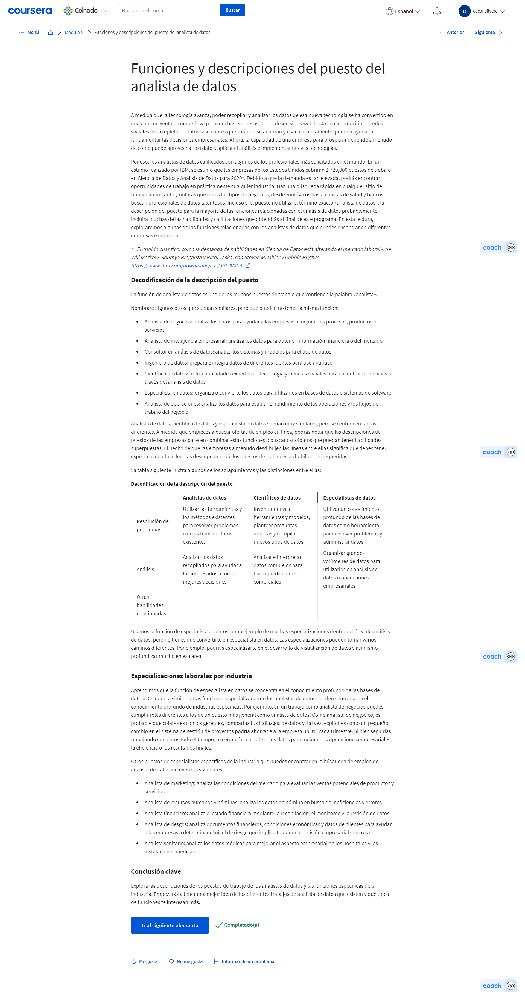

#### Samah: Buenas prácticas para entrevistas

Mi nombre es Samah Moid y soy reclutador aquí en Google para el gran equipo de ventas al cliente. Básicamente, contrato talentos para el equipo de ventas aquí. Incluso en el espacio de reclutamiento de ventas, recluto específicamente para los principales puestos analíticos aquí en Google. Quiero que el candidato se sienta lo más cómodo posible. Como reclutador también soy su defensor. Si encajan bien con el equipo, me gustaría presentarlos de la mejor manera. Como reclutador, le daría algunos consejos al analista de datos que está empezando a buscar empleo. Piensa en un momento en el que hayas utilizado datos para resolver un problema, ya sea en tus proyectos profesionales o personales. Otro consejo, que le daría a un analista de datos que está buscando un nuevo empleo es que aumente su red profesional. Hay muchas maneras de aumentar tu red profesional. Una de ellas es aumentar tu presencia en línea, comunicarte con otros analistas en LinkedIn, unirte a reuniones locales con otros científicos de datos. A veces, cuando estamos buscando un conjunto de habilidades únicas, los reclutadores vamos a sitios web como LinkedIn y GitHub, y tratamos de encontrar ese talento nosotros mismos. Es realmente importante que tengas un perfil actualizado en LinkedIn y también en sitios web como GitHub, donde puedes mostrar una gran cantidad de proyectos que hayas hecho como analista de datos. Otro consejo, que daría para una entrevista en persona es preparar preguntas para el entrevistador. Asegúrate de que no sean preguntas abiertas. Deben ser preguntas que te ayuden a comprender mejor el equipo y el trabajo. Si en una entrevista te dan un estudio de caso, debes esperar que te presenten un problema empresarial junto con el conjunto de datos de muestra. Entonces se te pedirá que tomes ese conjunto de datos de muestra, lo analices, y propongas una solución. Una de las cosas que puedes hacer para prepararte para esto es asegurarte de analizar los datos y encontrar una solución que se relacione con esos datos. A veces no hay una respuesta correcta y muchas veces los entrevistadores buscan ver tu línea de pensamiento y la forma en la que llegas a la solución. Te recomiendo que, si encuentras un puesto que te interesa, no solo te postules, sino que vayas al siguiente nivel. Busca al reclutador. Busca al gerente de contratación en línea. Ve si puedes comunicarte con ellos y organizar una charla de café o enviarles tu currículum directamente. Las solicitudes en línea podrían ser un gran agujero negro del que nunca recibas noticias del reclutador o del equipo. Cuando te comunicas directamente con un gerente de contratación o un reclutador, realmente muestras tu entusiasmo e interés por el puesto. Incluso si en algún momento no obtienes una respuesta al comunicarte, nunca se sabe, debes intentarlo varias veces. Esa única vez que recibas la respuesta de un reclutador o gerente de contratación, podría ser el momento en el que obtengasel empleo que realmente deseabas.

#### Más allá de los números: El camino de un analista de datos

<https://www.youtube.com/watch?v=t2oOFs4WgI0>

<https://www.ted.com/talks/anna_leach_building_authentic_relationships>

#### Desafío semanal 5

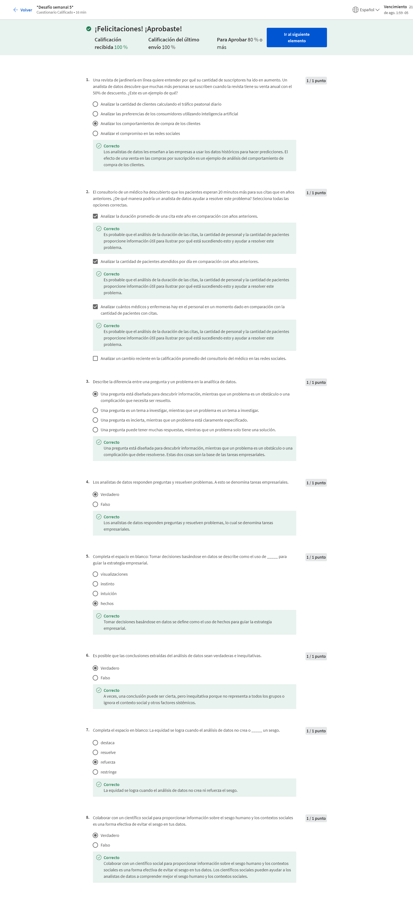

## Desafío del curso

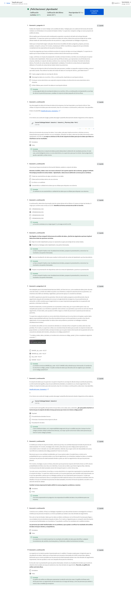
