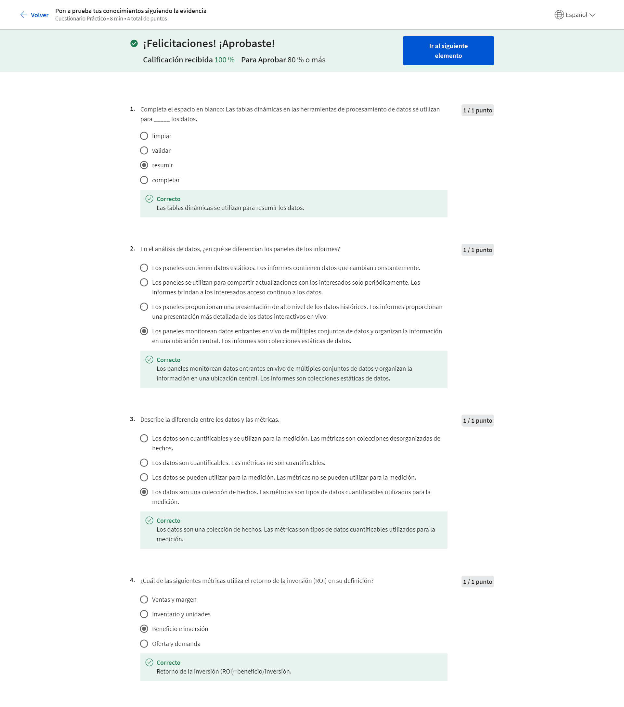
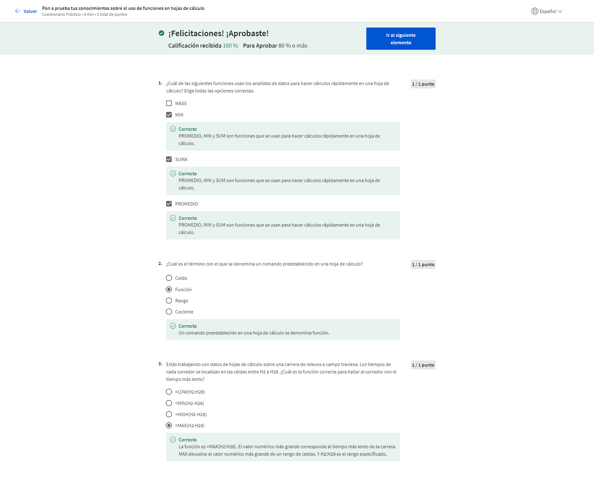

# Formula preguntas para tomar decisiones basadas en datos

## Preguntas efectivas

### Resolución de problemas y preguntas efectivas

#### Introducción a la resolución de problemas y las preguntas efectivas

¡Bienvenido al segundo curso del Certificado de análisis de datos de Google! Si completaste el primer curso, nos conocimos brevemente al principio, pero para los que acaban de unirse a nosotros, mi nombre es Ximena y soy analista de datos de Google Finance. Creo que es realmente maravilloso que estén aquí conmigo aprendiendo sobre el fascinante campo del análisis de datos. El aprendizaje y la educación siempre han sido muy importantes para mí. Cuando era joven, mi madre siempre decía: "No puedo dejarte una herencia, pero puedo darte una educación que te abrirá puertas". Eso siempre me impulsó a seguir aprendiendo, y esa educación me dio la confianza para postularme en Google. Ahora puedo hacer un trabajo realmente significativo todos los días. Hace poco trabajé como analista en un equipo llamado Verily Life Sciences. Allí ayudábamos a obtener suministros médicos a quienes más los necesitan. Para ello, pronosticábamos qué cosas los médicos iban a necesitar tener a mano y luego compartíamos esa información en las redes. La información que mi equipo proporcionaba ayudó a tomar decisiones basadas en datos que realmente salvaron vidas. Estoy encantada de ser tu instructora en este curso. Vamos a hablar de la diferencia entre preguntas efectivas e inefectivas, y a aprender a hacer muy buenas preguntas que conduzcan a ideas que puedan ayudarte a resolver problemas empresariales. Descubrirás que las preguntas efectivas te ayudan a aprovechar al máximo todas las fases del análisis de datos. Tal vez recuerdes que estas fases incluyen preguntar, preparar, procesar, analizar, compartir y actuar. En el paso preguntar, definimos el problema que estamos resolviendo y nos aseguramos de que entendemos las expectativas de los interesados. Esto te ayudará a mantenerte centrado en el problema real, lo que lleva a resultados más exitosos. Así que comenzaremos este curso hablando de la resolución de problemas y de algunos de los tipos comunes de problemas empresariales que los analistas resolvemos. Y como este curso se centra en la fase preguntar, aprenderás a crear preguntas efectivas para recopilar los datos adecuados para resolver esos problemas. A continuación, hablaremos de los diferentes tipos de datos. Aprenderás cómo y cuándo cada uno de ellos es el más útil. También podrás explorar en detalle las hojas de cálculo y descubrir cómo pueden ayudarte a que tus análisis de datos sean aún más efectivos. Y luego empezaremos a aprender sobre el pensamiento estructurado. El pensamiento estructurado es el proceso de reconocer el problema o situación actuales, organizar la información disponible, revelar déficits y oportunidades, e identificar las opciones. En este proceso, abordas un problema complejo e impreciso, y lo divides en pasos más pequeños, y luego esos pasos te llevan a una solución lógica. Trabajaremos juntos para asegurarnos de que entiendes cómo usar el análisis de datos y el pensamiento estructurado. Finalmente, veremos algunas estrategias probadas de comunicación efectiva. No puedo esperar para compartir más de mi pasión por el análisis de datos contigo, así que empecemos.

#### Registro de aprendizaje: considera lo que significan los datos para ti

#### Cuadro de aviso de la discusión: Queremos conocerte

Ximena habló un poco sobre por qué es importante que los analistas de datos hagan preguntas efectivas. Señaló que las preguntas efectivas conducen a excelentes perspectivas, descubrimientos y soluciones, incluso para los problemas empresariales más desafiantes. Cuando comiences a aprender sobre la fase de preguntas del proceso de análisis de datos, piensa en cómo hacer las preguntas correctas puede ayudarte a convertirte en un detective de datos experto.

#### Cuestionario práctico: Opcional: ¿conoces el análisis computacional de datos? Realiza nuestro cuestionario de diagnóstico

### Actúa con los datos

#### Datos en acción

En este video, voy a compartir un interesante caso práctico de análisis de datos, que ilustrará cómo la resolución de problemas se relaciona con cada fase del proceso de análisis de datos y mostrará cómo estas fases funcionan en el mundo real. Se trata de una pequeña empresa que utilizó datos para resolver un problema al que se enfrentaba. El negocio se llama Anywhere Gaming Repair. Es un proveedor de servicios a domicilio para reparar sistemas de videojuegos o accesorios rotos. El propietario quería ampliar su negocio. Sabía que la publicidad es una forma comprobada de obtener más clientes, pero no estaba seguro por dónde empezar. Hay todo tipo de estrategias publicitarias, como la prensa escrita, las vallas publicitarias, la televisión, el transporte público, los pódcast y la radio. Una de las cosas clave que debes pensar cuando eliges un método de publicidad es tu público objetivo, en otras palabras, las personas específicas que tratas de alcanzar. Por ejemplo, si un fabricante de equipos médicos quisiera llegar a los médicos, colocar un anuncio en una revista de salud sería una elección inteligente. O si una empresa de cáterin quisiera buscar nuevos cocineros, podría publicitarse con un póster en una parada de autobús cerca de una escuela de cocina. Ambas son excelentes maneras de hacer que el público objetivo vea el anuncio. Lo segundo que hay que tener en cuenta es el presupuesto y cuánto costarán los diferentes métodos publicitarios. Por ejemplo, es probable que un anuncio de televisión sea más caro que un anuncio de radio. Una valla publicitaria de gran tamaño probablemente costará más que un pequeño póster en la parte trasera de un autobús. El dueño de la empresa le pidió a una analista de datos, María, que hiciera una recomendación. Ella comenzó con el primer paso del proceso de análisis de datos: preguntar. María comenzó definiendo el problema que había que resolver. Para esto, primero tuvo que dar un paso atrás y observar toda la situación en contexto. Así ella podría estar segura de que se estaba centrando en el verdadero problema y no solo en los síntomas. Esto nos lleva a otra parte importante del proceso de resolución de problemas: colaborar con los interesados y comprender sus necesidades. Para Anywhere Gaming Repair, los interesados incluían el propietario, el vicepresidente de comunicaciones y el director de marketing y finanzas. Trabajando juntos, María y los interesados se pusieron de acuerdo sobre el problema: que desconocían el tipo de publicidad preferido del público objetivo. El siguiente paso fue la fase preparar, donde María recopiló datos para el proceso de análisis que estaba por realizar. Sin embargo, primero tenía que entender mejor al público objetivo de la empresa, las personas con sistemas de videojuegos. Después de eso, María recopiló datos sobre los diferentes métodos publicitarios. De este modo, podría determinar cuál era el método más popular para el público objetivo de la empresa. Luego, siguió con el paso procesar. Aquí María limpió los datos para eliminar cualquier error o inexactitud que pudiera interferir con el resultado. Como hemos aprendido, al limpiar los datos, los transformas en un formato más útil, creas información más completa y eliminas los valores atípicos. Luego, llegó la hora de analizar. En este paso, María quería averiguar dos cosas. Primero, ¿quién es probable que tenga un sistema de videojuegos? Segundo, ¿dónde es más probable que estas personas vean un anuncio? María descubrió que las personas de entre 18 y 34 años son las que tienen la mayor probabilidad de hacer compras relacionadas con los videojuegos. Pudo confirmar que el público objetivo de Anywhere Gaming Repair eran las personas de 18 a 34 años. Ellos eran a los que deberían tratar de alcanzar. Teniendo en cuenta esto, María luego descubrió que tanto los comerciales de TV como los pódcast son muy populares para las personas del público objetivo. Como María sabía que Anywhere Gaming Repair tenía un presupuesto limitado, y debido al alto costo de los anuncios de televisión, su recomendación fue hacer anuncios en pódcast porque son más rentables. Ahora que tenía el análisis, era hora de que María compartiera su recomendación para que la empresa pudiera tomar una decisión basada en datos. Resumió los resultados con imágenes del análisis claras y convincentes. Esto ayudó a los interesados a comprender la solución del problema original. Finalmente, Anywhere Gaming Repair se decidió a actuar y trabajó con una empresa local de producción de pódcast para crear un anuncio de 30 segundos sobre sus servicios. El anuncio apareció en pódcast durante un mes, y funcionó. Observaron un aumento de la cantidad de clientes después de la primera semana. Para el final de la semana 4, tenían 85 clientes nuevos. Ahí lo tienes. Una resolución efectiva de problemas con las fases del análisis de datos en acción. Ahora has visto cómo las seis fases del análisis de datos se pueden aplicar a la resolución de problemas y cómo puedes usarlas para resolver problemas del mundo real.

#### Del problema a la acción: las seis fases del análisis de datos

#### Nikki: el proceso de datos funciona

Soy Nikki, la directora del equipo de educación, evaluación, asesoría e investigación. Mi parte favorita del proceso del análisis de datos es buscar el problema más difícil, hacer un millón de preguntas al respecto y ver si es posible obtener una respuesta. Uno de los problemas que hemos abordado aquí en Google es el programa de incorporación Noogler, que es cómo incorporamos a los nuevos empleados. Una de las cosas que hicimos fue preguntarnos cómo sabemos si los Nooglers se incorporan más rápidamente a través del nuevo programa de incorporación que con el programa antiguo, en el que solíamos capacitarlos. Trabajamos muy de cerca con los proveedores de contenido para entender exactamente qué significa incorporar a alguien más rápido. Una vez que hicimos todas las preguntas, lo que hicimos fue preparar los datos en función de cuál era la población de los nuevos empleados que analizamos. Para preparar los datos, revisamos y entendimos quiénes eran las poblaciones, entendimos cuál era el conjunto de muestra, cuál era el grupo de control, cuál era el grupo experimental y dónde estaban las fuentes de datos, y nos aseguramos de que el formato del conjunto fuera limpio y digerible para que podamos escribir los guiones adecuados. Así que el siguiente paso para nosotros fue procesar los datos para asegurarnos de que estuvieran en un formato que se pueda analizar en SQL, que estuvieran en el formato correcto, en las columnas correctas y en las tablas correctas para nosotros. Para analizar los datos, escribimos scripts en SQL y R para correlacionar los datos con el grupo de control o el grupo experimental, e interpretar los datos para entender si hubo algún cambio en los indicadores de comportamiento observados. Una vez que analizamos todos los datos, queremos informarlos de una manera que los interesados puedan comprender. En función de quiénes eran los interesados, preparamos informes, paneles y presentaciones, y compartimos esa información. Una vez que todos los informes estaban listos, vimos resultados muy positivos y decidimos actuar a partir de eso, y continuar con el programa de incorporación basado en proyectos. Fue realmente satisfactorio saber que tenemos los datos para respaldarlo y que realmente funcionó muy bien. Y no solo contábamos con los datos, sino que sabíamos que los estudiantes estaban aprendiendo, eran más productivos y se incorporaban más rápido a sus puestos de trabajo.

#### Cuestionario práctico: Pon a prueba tus conocimientos sobre cómo actuar con datos

### Resolver problemas con datos

#### Tipos de problemas comunes

En un video anterior, compartí cómo el análisis de datos ayudó a una empresa a determinar dónde anunciar sus servicios. Una parte importante de este proceso fue tener habilidades sólidas para resolver problemas. Como analista de datos, aprenderás que los problemas están en el centro de lo que haces todos los días, pero eso está bien. Los problemas son oportunidades para practicar tus habilidades y buscar soluciones creativas y perspicaces. Los problemas pueden ser pequeños o grandes, simples o complejos. Ningún problema es como otro y todos requieren un enfoque ligeramente diferente, pero el primer paso es siempre el mismo: entender qué tipo de problema tratas de resolver, y de eso vamos a hablar ahora. Los analistas de datos trabajan con una variedad de problemas. En este video, nos centraremos en seis tipos comunes. Estos incluyen hacer predicciones, categorizar cosas, detectar algo inusual, identificar temas, descubrir conexiones y buscar patrones. Definamos cada uno de ellos. Primero, hacer predicciones. Este tipo de problema implica el usar datos para tomar una decisión informada sobre cómo pueden ser las cosas en el futuro. Por ejemplo, un sistema hospitalario podría usar un monitoreo remoto de los pacientes para predecir eventos de salud para pacientes con afecciones crónicas. Los pacientes medirían sus signos vitales en casa todos los días, y esa información combinada con datos sobre su edad, sus factores de riesgo y otros detalles importantes podría permitir que el algoritmo del hospital prediga futuros problemas de salud e incluso reduzca futuras hospitalizaciones. El siguiente tipo de problema es categorizar cosas. Esto significa asignar información a diferentes grupos según sus características comunes. Un ejemplo de este tipo de problema es un fabricante que revisa datos sobre el desempeño de los empleados de la planta. Un analista puede crear grupos para los empleados que son los más y los menos eficaces en ingeniería, grupos para los empleados que son los más y los menos eficaces en reparación y mantenimiento, los más y los menos eficaces en el montaje, y muchos más grupos. Luego, tenemos detectar algo inusual. En este tipo de problema, los analistas de datos identifican datos que son diferente de lo normal. Un ejemplo de detectar algo inusual en el mundo real es un sistema escolar que tiene un aumento repentino del número de matriculados, tal vez tan grande como un aumento del 30% del número de estudiantes. Un analista de datos podría investigar este incremento y descubrir que varios nuevos complejos de apartamentos se construyeron en el distrito escolar a principios de ese año. Podría usar este análisis para asegurarse de que la escuela tenga los recursos suficientes para los estudiantes adicionales. Identificar temas es el siguiente tipo de problema. Identificar temas toma la categorización y va un paso más allá agrupando los datos en conceptos más amplios. Volvamos al ejemplo del fabricante que acaba de revisar los datos sobre los empleados de la planta. Primero, estas personas están agrupadas por tipos y tareas. Sin embargo, ahora un analista de datos podría tomar esas categorías y agruparlas en el concepto más amplio de baja productividad y alta productividad. Esto haría posible que la empresa vea quién es el más y el menos productivo, para recompensar a los mejores y ofrecer apoyo adicional a los trabajadores que necesiten más formación. Ahora bien, el tipo de problema de descubrir conexiones permite a los analistas de datos encontrar desafíos similares enfrentados por entidades diferentes y luego combinar datos e información para abordarlos. Esto es lo que quiero decir: digamos que una empresa de escúteres está experimentando un problema con las ruedas que obtiene de su proveedor. Esa empresa tendría que detener la producción hasta que pueda tener ruedas seguras y de calidad nuevamente almacenadas. Pero, mientras tanto, las empresas de ruedas que tienen un problema con la goma que usan para hacer las ruedas, resulta que su proveedor de caucho tampoco pudo encontrar los materiales adecuados. Si todas estas entidades pudieran hablar de los problemas que enfrentan y compartir datos abiertamente, encontrarían una gran cantidad de desafíos similares y, mejor aún, podrían colaborar para encontrar una solución. El último tipo de problema es buscar patrones. Los analistas de datos usan datos para buscar patrones mediante datos históricos para entender lo que pasó en el pasado y que, por lo tanto, es probable que vuelva a suceder. Las empresas de comercio electrónico usan datos para buscar patrones todo el tiempo. Los analistas de datos observan las transacciones para entender los hábitos de compra de los clientes en determinados momentos a lo largo del año. Pueden encontrar que los clientes compran más productos enlatados justo antes de un huracán o que compran menos accesorios para climas fríos, como gorros y guantes, durante los meses más cálidos. Las empresas de comercio electrónico pueden usar estos conocimientos para asegurarse de que almacenan la cantidad correcta de productos en estos momentos clave. Muy bien, ahora aprendiste seis tipos básicos de problemas que los analistas de datos suelen afrontar. Como futuro analista de datos, esto será un conocimiento valioso para tu carrera. A continuación, hablaremos un poco más sobre estos tipos de problemas y proporcionaremos aún más ejemplos de cómo los resuelven los analistas de datos. A mí, personalmente, me encantan los ejemplos del mundo real. Me ayudan a comprender mejor los conceptos nuevos. No puedo esperar a compartir más casos reales contigo. Nos vemos ahí.

#### Lectura: LecturaSeis tipos de problemas

#### Problemas del mundo real

Aprendiste sobre seis tipos comunes de problemas para los analistas de datos: hacer predicciones, categorizar cosas, detectar algo inusual, identificar temas, descubrir conexiones y buscar patrones. Pensemos nuevamente en el ejemplo del mundo real de un video anterior. En ese ejemplo, Anywhere Gaming Repair quería descubrir cómo atraer a nuevos clientes. Así que el problema era cómo determinar el mejor método publicitario para el público objetivo de Anywhere Gaming Repair. Para ayudar a resolver este problema, la empresa usó datos para visualizar qué pasaría si publicitara en diferentes lugares. Nadie puede ver el futuro, pero los datos los ayudaron a tomar una decisión informada sobre cómo serían, probablemente, las cosas. Así que ese tipo de problema era hacer predicciones. Ahora, pensemos en el segundo tipo de problema: categorizar cosas. Aquí tenemos un ejemplo de un problema relacionado con la categorización. Digamos que una empresa desea mejorar sus niveles de satisfacción del cliente. Los analistas de datos podrían revisar los registros de llamadas al departamento de atención al cliente y evaluar los niveles de satisfacción de las personas que llaman. Podrían identificar ciertas palabras o frases clave que surgen durante las llamadas telefónicas y asignarlas a categorías tales como cortesía, satisfacción, insatisfacción, empatía, etc. Categorizar estas palabras clave nos brinda datos que permiten a la empresa identificar a los representantes de servicio de atención al cliente con mejor desempeño y a los que necesitan más capacitación. Esto lleva a clientes más satisfechos y puntuaciones más altas de atención al cliente. Ahora vamos a hablar de un problema que implica detectar algo inusual. En mi reloj inteligente, mi aplicación favorita es la del seguimiento de la salud. Estas aplicaciones recopilan datos tales como la frecuencia cardíaca, los patrones de sueño, la rutina de ejercicios y mucho más. Hay muchas historias por ahí sobre aplicaciones de salud que realmente salvaron la vida de algunas personas. Una trata sobre una mujer que era joven, atlética y no tenía problemas médicos previos. Una noche escuchó un pitido en su reloj inteligente, una notificación decía que su frecuencia cardíaca había subido. Ahora, en este ejemplo, piensa en el reloj como un analista de datos. El reloj recolectaba y analizaba datos de salud. Así que cuando el ritmo cardíaco subió de repente a 120 latidos por minuto, el reloj detectó algo inusual porque, según sus datos, el ritmo cardíaco en reposo se situaba normalmente cerca de 70. Gracias a los datos que le dio su reloj inteligente, la mujer fue al hospital y descubrió que tenía una afección que podría haber tenido complicaciones fatales si no hubiera recibido asistencia médica urgente. Ahora pasemos al siguiente tipo de problema: identificar temas. Vemos muchos ejemplos de esto en el campo de la experiencia del usuario. Los diseñadores de experiencia del usuario estudian y trabajan para mejorar las interacciones de personas con los productos. Digamos que un diseñador de experiencia del usuario desea ver qué opinan los clientes sobre la cafetera que fabrica su empresa. Este negocio recopila datos anónimos de encuestas de usuarios que pueden usarse para responder esta pregunta. Pero, primero, para darle sentido a todo, deberá encontrar temas que representen los datos más valiosos, sobre todo la información que puede usar para mejorar la experiencia del usuario. Así que el problema que afronta la empresa del diseñador de experiencia del usuario es cómo mejorar la experiencia del usuario con sus cafeteras. Este proceso es similar a buscar categorías para palabras y frases clave, y conversaciones del servicio de atención al cliente. Pero identificar temas va más allá agrupando cada conocimiento útil en un tema más amplio. Entonces el diseñador puede precisar los temas que más se repiten. En este caso, aprendió que los usuarios a menudo no sabían si la cafetera estaba encendida o apagada. Entonces, optimizó el diseño con una mejora en la ubicación e iluminación del botón de encendido, lo que mejoró el producto e hizo más felices a los usuarios. Ahora llegamos al problema de descubrir conexiones. Este ejemplo es de la industria del transporte y usa algo llamado logística de terceros. Los socios logísticos externos ayudan a las empresas a enviar productos cuando no tienen camiones, aviones o barcos propios. Un problema común que tienen estos socios es reducir el tiempo de espera. El tiempo de espera ocurre cuando una camionera del proveedor logístico externo llega para recoger un envío pero el envío no está listo. Así que tiene que esperar. Eso le cuesta tiempo y dinero a ambas empresas, e impide que los camiones sigan trabajando para hacer más entregas. Entonces, ¿cómo pueden resolver esto? Al compartir datos, las empresas asociadas pueden ver los plazos de la otra parte y ver qué causa que se atrasen los envíos. Entonces pueden averiguar cómo evitar esos problemas en el futuro para que el problema de una empresa no cause un efecto negativo en la otra. Por ejemplo, si los envíos se retrasan porque una empresa solo entrega los lunes, miércoles y viernes, y la otra empresa solo entrega los martes y jueves, entonces las empresas pueden elegir entregar el mismo día para reducir el tiempo de espera para los clientes. Muy bien, hemos llegado al último tipo de problema: buscar patrones. Las empresas de petróleo y gas trabajan constantemente para que sus máquinas funcionen correctamente. Así que el problema es cómo evitar que las máquinas se averíen. Una forma en que los analistas de datos pueden hacer esto es buscar patrones en los datos históricos de la empresa. Por ejemplo, podrían investigar cómo y cuándo una máquina en particular se descompuso en el pasado y luego generar ideas sobre qué produjo la rotura. En este caso, surgió un patrón que indicaba que las máquinas se averiaban con más frecuencia cuando el servicio de mantenimiento no se realizaba en ciclos de 15 días. Ahora pueden hacer un seguimiento de las condiciones actuales e intervenir si alguno de estos problemas vuelve a ocurrir. Suena genial, ¿verdad? Siempre me gusta oír hablar de cómo los datos ayudan a las personas y a las empresas reales a realizar cambios significativos. Espero que a ti también te guste. Nos vemos pronto.

#### Anmol: de la hipótesis al resultado

Hola, soy Anmol. Soy el Director de Análisis de Marketing para Grandes Anunciantes dentro del Equipo de Marketing de Google. En esencia, mi trabajo se trata de conectar al usuario adecuado con el mensaje adecuado, en el momento adecuado. El primer paso es realmente tener una idea general de un cierto patrón que está ocurriendo. Así, por ejemplo, sabemos que este segmento en particular de los usuarios es más receptivo a este tipo de contenido. Una vez que somos capaces de ver esta hipótesis a través de los datos, hacemos pruebas para garantizar que la hipótesis sea realmente correcta. Así, por ejemplo, podríamos probar denviando estos contenidos a este segmento de usuarios y verificar en realidad dentro de un entorno controlado si esa tasa de respuesta es más alta para ese tipo de contenido o si no lo es. Una vez que somos capaces de verificar esa hipótesis, volvemos a los interesados, en este caso, nuestros comercializadores y les diremos que hemos demostrado dentro de un alto grado de certeza que este segmento en particular responde más a este tipo de contenido y por eso les recomendamos que produzcan más de este tipo de contenido. Nuestros interesados en verdad llegar a ver la evolución completa, de hipótesis al concepto probado, y pueden acompañarnos a demostrar estas hipótesis y luego, finalmente, convertirlas en estrategias y recomendaciones para el negocio. El resultado en este caso fue que pudimos cambiar la manera en que todo el equipo de marketing trabajaba para hacerla mucho más centrada en el usuario. En lugar de crear contenido que, desde nuestra perspectiva, creemos que los usuarios necesitan, vamos en la dirección opuesta, averiguamos primero qué cosa necesitan, demostramos que necesitan ciertas cosas o que no las necesitan, y luego usamos esa información volviendo a los comercializadores y creando contenido que satisfaga sus necesidades. Así que realmente cambió la dirección de cómo producimos las cosas.

#### Cuestionario práctico: Pon a prueba tus conocimientos sobre la resolución de problemas con datos

### Elabora preguntas efectivas

#### Preguntas SMART

Ahora que hemos hablado de seis tipos de problemas básicos, es hora de empezar a resolverlos. Para hacer eso, los analistas de datos primero hacen las preguntas correctas. En este video, aprenderemos a hacer preguntas efectivas que conducen a conocimientos clave para resolver todo tipo de problemas. Como analista de datos, hago preguntas constantemente. Es una gran parte del trabajo. Si alguien me pide que trabaje en un proyecto, hago preguntas para asegurarme de estar de acuerdo sobre el plan y los objetivos. Y cuando obtengo un resultado, lo cuestiono. ¿Los datos me muestran algo superficialmente? ¿Hay algún conflicto en algún lugar que deba resolverse? Cuantas más preguntas hagas, más aprenderás sobre los datos y más poderosos serán tus conocimientos al final del día. Algunas preguntas son más efectivas que otras. Digamos que estás almorzando con un amigo y te dice: "Estos son los mejores sándwiches del mundo, ¿no es así?" Esa pregunta realmente no te da la oportunidad de compartir tu propia opinión, en especial si no estás de acuerdo y no te gustó mucho el sándwich. Esa es una pregunta sugestiva, porque te lleva a responder de una manera en particular. O, tal vez, estás trabajando con un proyecto y decides entrevistar a un familiar. Digamos que le preguntas a tu tío, ¿te gustó crecer en Malasia? Él puede responder: "Sí". Pero no has aprendido mucho sobre sus experiencias allí. Tu pregunta fue cerrada. Eso significa que se puede responder con un sí o un no. Este tipo de preguntas rara vez conducen a conocimientos valiosos. Ahora, si alguien te pregunta ¿prefieres chocolate o vainilla? ¿De qué está hablando específicamente? ¿Helado, pudín, saborizante de café o alguna otra cosa? ¿Qué pasa si te gusta el helado de chocolate pero la vainilla en el café? ¿Y si no te gusta ninguno de los dos sabores? Ese es el problema con esta pregunta. Es demasiado imprecisa y carece de contexto. Conocer la diferencia entre preguntas efectivas e inefectivas es esencial para tu futura carrera como analista de datos. Después de todo, el proceso del analista de datos comienza con las preguntas. Por eso, es importante que hagamos las preguntas correctas. Las preguntas efectivas siguen la metodología SMART. Son específicas, medibles, orientadas a la acción, relevantes y con plazos determinados. Desglosemos eso. Las preguntas específicas son simples y significativas, y se centran en un solo tema o en algunas ideas estrechamente relacionadas. Esto nos ayuda a recopilar información relevante para la investigación. Si una pregunta es demasiado general, trata de acotarla enfocándote en un solo elemento. Por ejemplo, en lugar de hacer una pregunta cerrada, como ¿los niños realizan suficientes actividades físicas en estos días? Pregunta ¿qué porcentaje de niños hacen lo recomendado, 60 minutos de actividad física, al menos cinco días a la semana? Esa pregunta es mucho más específica y puede brindarte información más útil. Ahora, hablemos de las preguntas medibles. Las preguntas medibles se pueden cuantificar y evaluar. Un ejemplo de una pregunta no medible sería: ¿por qué un video se volvió viral? En su lugar, puedes preguntar ¿cuántas veces se compartió el video en las redes la primera semana que se publicó? Esa pregunta es medible porque nos permite contar cuántas veces se compartió y llegar a un número concreto. Muy bien, ahora llegamos a las preguntas orientadas a la acción. Las preguntas orientadas a la acción fomentan el cambio. Quizás recuerdes que la resolución de problemas consiste en ver el estado actual y averiguar cómo transformarlo en el estado futuro ideal. Bueno, las preguntas orientadas a la acción te ayudarán a conseguirlo. Entonces, en lugar de preguntar ¿cómo podemos conseguir que los clientes reciclen el embalaje de nuestro producto? Preguntarías, ¿Qué detalles harán que el embalaje sea más fácil de reciclar? Esto te brinda respuestas sobre las que puedes actuar. Muy bien, pasemos a las preguntas relevantes. Las preguntas relevantes importan y son cruciales para el problema que tratas de resolver. Digamos que trabajas en un problema de una especie de rana amenazada. Y tú preguntaste: ¿por qué es importante que las ranas hayan comenzado a desaparecer? Esta es una pregunta irrelevante, porque la respuesta no nos ayudará a encontrar cómo evitar que estas ranas se extingan. Más relevante sería: ¿Qué factores ambientales cambiaron en Durham, Carolina del Norte entre 1983 y 2004 que podrían causar que las ranas desaparecieran de las regiones de Sandhills? Esta pregunta nos daría respuestas para resolver nuestro problema. Y, por último, tenemos las preguntas con plazos determinados. Las preguntas con plazos determinados especifican el tiempo que se estudia. El período de tiempo que queremos estudiar es de 1983 a 2004. Esto limita el rango de posibilidades y permite al analista de datos centrarse en datos relevantes. Bien, ahora que tienes una idea general de las preguntas SMART, hay algo mas que es muy importante tener en cuenta al formular preguntas: la equidad. Ya hemos hablado antes de la equidad, pero como recordatorio rápido, equidad significa garantizar que las preguntas no creen ni refuercen el sesgo. Para hablar de esto, volvamos a nuestro ejemplo del sándwich. Allí tuvimos una pregunta injusta porque estaba redactada para llevarte hacia una respuesta en particular. Esto hizo que fuera difícil responder honestamente si no te gustaba la calidad del sándwich. Otro ejemplo común de una pregunta injusta es la que hace suposiciones. Por ejemplo, digamos que se les da una encuesta de satisfacción a quienes visitan un museo. Si la encuesta pregunta: ¿qué es lo que más le gusta de nuestras exposiciones? Esto supone que al cliente le encantan las exposiciones, pero puede no ser así. La equidad también significa formular preguntas con sentido para todos. Es importante que las preguntas sean claras y tengan una redacción sencilla que cualquiera pueda entender fácilmente. Las preguntas injustas también pueden dificultar tu trabajo como analista de datos. Dan lugar a una retroalimentación poco fiable y oportunidades perdidas de obtener información realmente valiosa. Has aprendido mucho sobre cómo elaborar preguntas efectivas, como cómo usar el framework SMART mientras creas tus preguntas y cómo asegurarte de que las preguntas sean justas y objetivas. A partir de ahora, explorarás diferentes tipos de datos y aprenderás cómo se utiliza cada uno para guiar las decisiones empresariales. También aprenderás más sobre las visualizaciones y cómo las métricas o las medidas pueden ayudar a crear el éxito. ¡Va a ser genial!

#### Más información sobre las preguntas SMART

#### Cuestionario práctico: Autorreflexión: escenarios de analistas de datos

#### Evan: los datos abren puertas

Hola, soy Evan. Soy gerente del portfolio de aprendizaje de Google y tengo uno de los trabajos más geniales del mundo, donde puedo ver todas las diferentes tecnologías que afectan los macrodatos e incorporarlas en cursos de capacitación como este para los estudiantes. Desearía haber realizado un curso como este cuando recién salí de la universidad o la escuela secundaria. Un curso de analista de datos que está orientado cómo este, si ya pudiste ver algunos de los videos, es lo que realmente te prepara para hacer lo que quieras. Te ayudará a abrir todas las puertas que quieras para cualquiera de esos roles que forman parte del plan de estudios de datos. ¿Cuáles son algunos de esos roles? Hay tantas carreras profesionales diferentes para los interesados en los datos. Por lo general, si eres como yo, comenzarás como analista de datos, tal vez trabajando con hojas de cálculo, tal vez trabajando con bases de datos pequeñas, medianas y grandes, pero todo lo que tienes que recordar son los tres roles principales diferentes. Hay muchas especialidades dentro de cada una de estas diferentes carreras, pero estos tres roles son el analista de datos, que generalmente es alguien que trabaja con SQL, hojas de cálculo, bases de datos y podría formar parte de un equipo de inteligencia empresarial creando paneles. Ahora bien, ¿de dónde provienen todos esos datos? Generalmente, un analista de datos trabajará con un ingeniero de datos para convertir los datos sin procesar en procesos viables. Así que tienes analistas de datos, ingenieros de datos y, por último, es probable que haya científicos de datos que dicen que los ingenieros de datos construyeron estos hermosos procesos. A veces, el analista también hace eso. Los analistas nos proporcionan datos limpios y viables. Entonces, los científicos de datos trabajan para convertirlos en modelos de aprendizaje automático realmente geniales o inferencias estadísticas que están mucho más allá de todo lo que podrías haber imaginado. Compartiremos muchos recursos en enlaces para que puedas entusiasmarte con cada uno de estos diferentes roles. Y la mejor parte es que si eres como yo que, cuando entré a la universidad, no sabía lo que quería hacer, no es necesario que sepas desde el principio qué camino quieres seguir. Pruébalos todos. Prueba lo que realmente te gusta. Es algo muy personal. Convertirse en analista de datos es muy emocionante. ¿Por qué? Porque no es solo un medio para lograr un objetivo. Es una profesión que muchas personas brillantes han recorrido antes y han hecho que las herramientas sean mucho más fáciles para nosotros hoy. Por ejemplo, cuando empecé a aprender el SQL, o lenguaje de consulta estructurada, que aprenderás como parte de este curso, lo hacía en mi portátil local y cada una de las consultas tomaba como 20 o 30 minutos para ejecutarse, y era muy difícil para mí realizar un seguimiento de las diferentes sentencias SQL que escribía o compartirlas con alguien más. Eso fue hace unos 10 o 15 años. Ahora, con todas las diferentes empresas y las diferentes herramientas que hacen que las herramientas de análisis y las tecnologías sean más fáciles para ti, te divertirás mucho creando estos conocimientos con muchas menos complicaciones que cuando yo empecé. Así que estoy muy entusiasmado con escuchar lo que piensas y ver cuál será tu experiencia.

#### Cuestionario práctico: Autorreflexión: haz tus propias preguntas SMART

#### Cuadro de aviso de la discusión: Lo que revelaron tus preguntas

Recientemente creaste preguntas SMART para ayudarte a aprender cómo un amigo o familiar usa los datos en su carrera o vida personal. Ten en cuenta las preguntas que hiciste:

¿Qué preguntas proporcionaron las respuestas más útiles e interesantes? ¿Por qué tuvieron éxito? 

¿Qué preguntas llevaron a respuestas menos perspicaces?  ¿Por qué crees que fue? 

#### Cuestionario práctico: Pon a prueba tus conocimientos sobre la elaboración de preguntas efectivas

### Desafío semanal 1

## Decisiones basadas en datos

### Comprender el poder de los datos

#### Datos y decisiones

¡Hola de nuevo! Este es el momento de ir aún más lejos y aprovechar lo que aprendiste sobre la resolución de problemas en el análisis de datos y la elaboración de preguntas efectivas. Próximamente, abordaremos una amplia gama de temas. Aprenderás sobre cómo los datos pueden potenciar nuestras decisiones, grandes y pequeñas; la diferencia entre el análisis cuantitativo y cualitativo, y cuándo usarlos; los pros y los contras de las diferentes herramientas de visualización de datos; qué son las métricas y cómo las usan los analistas, y cómo usar las matemáticas para conectar los puntos. Para ser honesta, sigo aprendiendo cada vez más sobre estas cosas todos los días, ¡y tú también lo harás! Por ejemplo, cómo los datos cuantitativos y cualitativos pueden funcionar juntos. En mi función en finanzas, la mayor parte de mi trabajo es cuantitativo, pero recientemente estuve trabajando en un proyecto que se enfocaba mucho en la empatía y la confianza, lo cual era realmente nuevo para mí. Sin embargo, tomamos en cuenta aquellas cosas más cualitativas durante el análisis, y eso realmente me ayudó a comprender cómo los datos cuantitativos y cualitativos pueden unirse para ayudarnos a tomar buenas decisiones. Ahora estás en camino de crear tu propio kit de herramientas de análisis de datos. Antes de que te des cuenta, estarás analizando todo tipo de datos y aprendiendo nuevas cosas al mismo tiempo. Pero primero, empecemos poco a poco con el poder de la observación.

#### Cómo los datos potencian las decisiones

Hemos hablado mucho sobre qué son los datos y cómo influyen en la toma de decisiones. ¿Qué sabemos hasta ahora? Bueno, sabemos que los datos son una colección de hechos. También sabemos que el análisis de datos revela importantes patrones y conocimientos sobre dichos datos. Por último, sabemos que el análisis de datos nos puede ayudar a tomar decisiones más informadas. Ahora, veremos cuál es la función de los datos en el proceso de toma de decisiones y echaremos un vistazo rápido a las diferencias entre las decisiones basadas en datos y las decisiones inspiradas en datos. Veamos un ejemplo de la vida real. Piensa en la última vez que buscaste "restaurantes cercanos" y ordenaste los resultados por calificación para ayudarte a decidir cuál era el mejor. Fue una decisión que tomaste usando datos. Las empresas y otras organizaciones utilizan datos para tomar mejores decisiones todo el tiempo. Existen dos formas para hacer esto: con la toma de decisiones basada en datos o la toma de decisiones inspirada en datos. Hablaremos más sobre la toma de decisiones inspirada en datos luego, pero aquí tenemos una definición rápida por ahora. La toma de decisiones inspirada en datos explora diferentes fuentes de datos para averiguar qué tienen en común. Aquí, en Google, usamos datos todos los días, de formas muy sorprendentes también. Por ejemplo, usamos datos para ayudar a reducir la cantidad de energía gastada para refrigerar tus centros de datos. Después de analizar años de datos recopilados con inteligencia artificial, pudimos tomar decisiones que ayudan a reducir la energía que usamos para refrigerar nuestros centros de datos por encima del 40%. El equipo de Operaciones de personal de Google también usa datos para mejorar la manera en que contratamos nuevos Googlers y en que hacemos que empiecen con el pie derecho. Queríamos asegurarnos de que no estábamos pasando por alto a ningún candidato talentoso y que hacíamos lo más fluida posible la transición hacia sus nuevas funciones. Después de analizar los datos sobre las solicitudes, las entrevistas y los nuevos procesos de orientación en contrataciones, empezamos a usar un algoritmo. Un algoritmo es un proceso o un conjunto de reglas que se deben seguir para una tarea específica. Con este algoritmo, revisamos a los solicitantes que no pasaron el proceso de selección inicial para encontrar buenos candidatos. Los datos también nos ayudaron a determinar la cantidad ideal de entrevistas para tomar las mejores decisiones de contratación posibles. Hemos creado nuevas agendas de incorporación para ayudar a los nuevos empleados a comenzar en sus nuevos trabajos. Hay datos en todas partes. Hoy en día, creamos tantos datos que los científicos estiman que el 90% de los datos de todo el mundo se crearon solo en los últimos años. Piensa en el potencial que hay aquí. Cuantos más datos tengamos, podremos resolver problemas más grandes y crear mejores soluciones. Sin embargo, recopilar datos de manera responsable es solo una parte del proceso. También tenemos que convertir los datos en conocimiento que nos ayude a crear mejores soluciones. Voy a dejar que mi compañero Googler, Ed, hable más sobre eso. Tener toneladas de datos no es suficiente. Tenemos que hacer algo significativo con esto. Los datos en sí no proporcionan mucho valor. Jack Dorsey, el fundador de Twitter y Square, dijo "Cada acción que hacemos en este mundo desencadena una cierta cantidad de datos, y la mayoría de esos datos no tienen sentido hasta que alguien agrega alguna interpretación de ellos o alguien agrega una narrativa en torno a ellos". Los datos son sencillos, son hechos recopilados en un conjunto, son valores que describen algo. Cada punto de datos se vuelve más útil cuando se recopila y estructura, pero aun así carece de sentido por sí mismo. Debemos interpretar los datos para convertirlos en información. Por ejemplo, el tiempo de Michael Phelps en una carrera de natación individual de 200 metros, 1 minuto, 54 segundos, no nos dice mucho. Sin embargo, cuando lo comparamos con los tiempos de su competidor en la carrera, podemos ver que Michael llegó en primer lugar y ganó la medalla de oro. En este caso, nuestro análisis tomó datos de una lista de las carreras y los tiempos de Michael y los convirtió en información comparándolos con otros datos. El contexto es importante. Necesitábamos saber que esta carrera fue una final olímpica y no una carrera cualquiera para determinar que se trataba de una medalla de oro, pero esto sigue sin ser conocimiento. En el momento en el que consumimos, entendemos y aplicamos información, los datos son más útiles. En otras palabras, Michael Phelps es un nadador veloz. Es genial cómo podemos convertir los datos en conocimiento que nos ayuda de todas las formas posibles, ya sea para encontrar el restaurante perfecto o hacer cambios amigables con el medio ambiente. Ahora, ten en cuenta que existen limitaciones para el análisis de datos. A veces no tenemos acceso a todos los datos que necesitamos, o los datos se miden diferente en distintos programas, lo que puede dificultar la búsqueda de ejemplos concretos. Luego los abordaremos con más detalle, pero es importante que empieces a pensar en ellos ahora. Ahora que sabes cómo los datos impulsan la toma de decisiones, sabes cuán valiosa es tu función como analista de datos para el negocio. Los datos son una herramienta poderosa para la toma de decisiones, y puedes ayudar a brindar a las empresas la información que necesitan para resolver problemas y tomar nuevas decisiones, pero antes de eso, deberás aprender un poco más sobre los tipos de datos con los que trabajarás y cómo los manejarás.

#### Pruebas de datos y triunfos

<https://www.thinkwithgoogle.com/future-of-marketing/digital-transformation/crate-and-barrel-digital-customer-experiences/>

<https://www.thinkwithgoogle.com/marketing-strategies/data-and-measurement/pepsi-digital-transformation/>

#### Cuadro de aviso de la discusión: Uso de datos en la vida cotidiana

El adulto promedio toma miles de decisiones conscientes cada día. Piensa en cuántas de esas son decisiones basadas en datos, como las que has estado aprendiendo. Los datos rodean tus actividades cotidianas. El informe meteorológico diario contiene datos, al igual que un letrero con los horarios de tu tienda local. Si lo piensas, basas tus decisiones en los datos disponibles todo el tiempo, ya sea que estés revisando el informe meteorológico para decidir qué ponerte o buscando los horarios de la tienda para saber a qué hora comprar. 

Para cada tarea que se enumera a continuación, ¿qué datos están disponibles para ayudar a tomar decisiones relacionadas con la tarea? Por ejemplo, los precios de los artículos son datos disponibles para decidir cómo gastar el dinero.

Cuándo despertarse 

Si salir a comer o no

En qué gastar dinero

Qué escuchar en la radio

A quién llamar por teléfono

#### Datos cualitativos y cuantitativos

¡Hola de nuevo! Cuando se trata de la toma de decisiones, los datos son clave. Sin embargo, también aprendimos que hay muchos tipos de preguntas diferentes que los datos podrían ayudarnos a responder, y estas preguntas diferentes crean distintos tipos de datos. Hay dos tipos de datos de los que hablaremos en este video: cuantitativos y cualitativos. Los datos cuantitativos son las medidas específicas y objetivas de hechos numéricos. A menudo, eso puede ser cuál es el problema, cuántas veces se repite y qué frecuencia tiene. En otras palabras, cosas que puedes medir, como cuántos viajeros toman el tren para ir a trabajar cada semana. Como analista financiera, trabajo con muchos datos cuantitativos. Amo la certeza y la precisión de los números. Por otra parte, los datos cualitativos describen medidas subjetivas o explicativas de cualidades y características, o cosas que no se pueden medir con datos numéricos, como el color de tu cabello. Los datos cualitativos son geniales ya que nos ayudan a responder las preguntas de "por qué". Por ejemplo, por qué a la gente le puede gustar cierta celebridad o cierto bocadillo más que otros. Con los datos cuantitativos, podemos ver los números representados en cuadros o gráficos. Los datos cualitativos pueden brindarnos un entendimiento de más alto nivel de por qué los números son como son. Esto es muy importante, porque nos ayuda a agregarle contexto a un problema. Como analista de datos, usarás ambos: el análisis cuantitativo y el análisis cualitativo, dependiendo de tu tarea empresarial. Las reseñas son un gran ejemplo de esto. Piensa en un momento en el que usaste reseñas para decidir si querías comprar algo o ir a algún lugar. Es probable que estas reseñas te hayan dicho a cuántas personas no les gusta tal cosa y por qué. Las empresas también leen estas reseñas, pero usan los datos de formas diferentes. Veamos un ejemplo de una empresa que usa datos provenientes de reseñas de los clientes para ver los datos cualitativos y cuantitativos en acción. Ahora, supongamos que una heladería local ha empezado a usar sus reseñas en línea para interactuar con sus clientes y construir su marca. Estas reseñas le dan a la heladería información sobre las experiencias de sus clientes, las cuales pueden usar para informar su toma de decisiones. El propietario nota que su calificación bajó. Descubre que últimamente su heladería recibió más reseñas negativas. Quiere saber por qué. Entonces, empieza a hacer preguntas. Primero, están las preguntas mensurables. ¿Cuántas reseñas negativas hay? ¿Cuál es la calificación promedio? ¿Cuántas de estas reseñas usan las mismas palabras claves? Estas preguntas generan datos cuantitativos, resultados numéricos que ayudan a confirmar que sus clientes no están satisfechos. Estos datos pueden llevarlos a hacer diferentes preguntas. ¿Por qué los clientes no están satisfechos? ¿Cómo podemos mejorar su experiencia? Estas son las preguntas que conducen a datos cualitativos. Después de analizar las reseñas, el dueño de la heladería ve un patrón: 17 reseñas negativas usan la palabra "frustrado". Este es un dato cuantitativo. Ahora podemos empezar a recopilar datos cualitativos preguntando por qué se repite esta palabra. Descubre que los clientes se sienten frustrados porque la heladería se queda sin los sabores populares antes de terminar el día. Sabiendo esto, la heladería puede cambiar su orden semanal para garantizar que haya suficiente de lo que quieren los clientes. Gracias a los datos tanto cuantitativos como cualitativos, el dueño de la heladería pudo darse cuenta de que sus clientes estaban descontentos y comprender por qué. Tener ambos tipos de datos hizo que él pudiera hacer los cambios correctos y mejorar su negocio. Ahora que conoces la diferencia entre los datos cuantitativos y los datos cualitativos, sabes cómo conseguir diferentes tipos de datos haciendo diferentes preguntas. Como detective de datos, tu trabajo es saber qué preguntas hacer para encontrar la solución adecuada. Entonces, puedes empezar a pensar en maneras interesantes y creativas para ayudar a los interesados a comprender mejor los datos. Por ejemplo, paneles interactivos, de los cuales hablaremos pronto.

#### Datos cualitativos y cuantitativos en los negocios

#### Registro de aprendizaje: haz preguntas INTELIGENTES sobre las fuentes de datos de la vida real

#### Cuestionario práctico: Pon a prueba tus conocimientos sobre el poder de los datos

### Sigue la evidencia

#### La gran revelación: compartir tus hallazgos

Los datos son geniales, pero si no podemos contar la historia de los datos, no son útiles para nadie. Necesitamos maneras de organizar los datos que nos ayuden a convertirlos en información. Existen todo tipo de herramientas para ayudarte a visualizar y compartir tus análisis de datos con los interesados. A continuación, hablaremos de dos herramientas de presentación de datos: informes y paneles. Tanto los informes como los paneles son útiles para la visualización de datos, pero cada uno tiene sus pros y sus contras. Un informe es una recopilación estática de datos que se entrega periódicamente a los interesados. Un panel, por otro lado, monitorea los datos entrantes en vivo. Hablemos primero de los informes. Los informes son excelentes para brindar imágenes de los datos históricos de alto nivel para una organización. Por ejemplo, las ventas mensuales de una empresa financiera. Los informes también tienen muchos beneficios. Se pueden diseñar y enviar periódicamente, a menudo de forma semanal o mensual, como información organizada y de fácil referencia. Son rápidos de diseñar y fáciles de usar siempre que los mantengas continuamente. Por último, debido a que los informes usan datos estáticos o datos que no cambian una vez registrados, reflejan datos que ya se han limpiado y ordenado. También existen algunas desventajas a tener en cuenta. Los informes necesitan un mantenimiento regular y no son visualmente atractivos. Dado que no son automáticos ni dinámicos, los informes no muestran datos en vivo ni en evolución. Para obtener una reflexión en vivo de los datos entrantes, deberás diseñar un panel. Los paneles son geniales por muchas razones: le dan a tu equipo más acceso a la información registrada, puedes interactuar a través de los datos jugando con los filtros y, debido a que son dinámicos, tienen un valor a largo plazo. Si los interesados necesitan acceder continuamente a la información, un panel puede ser más eficiente que tener que generar informes una y otra vez, lo cual hace que ahorres mucho tiempo. Por último, pero no menos importante, son agradables a la vista. Sin embargo, los paneles también tienen algunos contras. Por un lado, se requiere mucho tiempo para diseñarlos y, de hecho, pueden ser menos eficientes que los informes si no se usan con mucha frecuencia. Si la tabla base se rompe en algún momento, necesita mucho mantenimiento para volver a funcionar. En ocasiones, los paneles también pueden abrumar a las personas con información. Si no sueles buscar datos en un panel, es posible que te pierdas en él. Como analista de datos, necesitas decidir la mejor manera de comunicar la información a tus interesados. Por ejemplo, ¿qué pasa si tus interesados quieren que la empresa participe en las redes sociales? ¿Sería útil un informe mensual que les diga la cantidad de nuevos seguidores de su página? ¿O un panel que monitorea la participación en vivo en las redes sociales en varias plataformas? Más adelante, crearás tus propios informes y paneles para practicar usar estas herramientas. Pero, por ahora, quiero mostrarte cómo se verían un informe y un panel. Comenzaremos usando una herramienta con la que ya estamos familiarizados: las hojas de cálculo. Veamos una manera de visualizar los datos de una hoja de cálculo en un informe. Esta hoja de cálculo tiene un conjunto de datos con los detalles del pedido de una empresa mayorista. Eso es mucha información. Desde los encabezados, podemos ver diferentes cosas registradas aquí, como la fecha del pedido, el vendedor, el precio unitario y los ingresos para cada transacción registrada. Todo es información útil, pero un poco difícil de entender. Queremos un informe, ya que es más fácil de leer. Digamos que tus interesados quieren un vistazo rápido de los ingresos por vendedor. Usando los datos, puedes generar una tabla dinámica con un gráfico que muestre esa información. Una tabla dinámica es una herramienta de resumen de datos utilizada en el procesamiento de datos. Las tablas dinámicas se usan para resumir, ordenar, reorganizar, agrupar, contabilizar, totalizar o promediar los datos almacenados en una base de datos. Permite que los usuarios transformen las columnas en filas y las filas en columnas. De hecho, aprenderemos más sobre las tablas dinámicas luego. Pero te mostraré una muy rápida. Seleccionaremos el menú Datos y haremos clic en el botón Tabla dinámica. Eso te permite extraer los datos de esta tabla. Podemos simplemente presionar Crear, lo cual generará una nueva hoja de cálculo. Aquí, nos muestra los campos de la tabla dinámica que podemos elegir. Haremos clic en seleccionar, vendedor e ingresos. Así de simple, hizo un gráfico para nosotros. En este momento, puedes jugar con el aspecto del gráfico, pero toda la información está ahí. Pasemos a los paneles. Si necesitas una manera más dinámica de compartir información con tus interesados, los paneles te serán útiles. Podrías crear algo como este panel de Tableau, que tiene gráficos interactivos que muestran varias vistas de los datos. Con esto, los usuarios pueden cambiar la ubicación, el período o cualquier otro aspecto de los datos que están viendo haciendo clic en los diferentes elementos del panel. Suena genial, ¿verdad? Más adelante en este programa, veremos cómo puedes crear tus propias visualizaciones de datos. Tenemos mucho que aprender antes de llegar a eso. Espero que esto haya sido un emocionante primer vistazo a las diferentes herramientas de visualización que utilizarás como analista de datos.

#### Datos versus métricas

En el último video, aprendimos cómo puedes visualizar tus datos mediante informes y paneles para mostrar tus hallazgos de formas interesantes. En uno de nuestros ejemplos, la empresa quería ver los ingresos por ventas de cada vendedor. Esa medición específica de datos se realiza usando métricas. Ahora, quiero contarte un poco más sobre la diferencia entre los datos y las métricas. Y cómo se pueden usar las métricas para convertir los datos en información útil.
Una métrica es un tipo único y cuantificable de datos que pueden utilizarse para la medición. Piénsalo de esta manera. Los datos empiezan como una colección de hechos sin procesar, hasta que los organizamos en métricas individuales que representan un único tipo de datos.
Las métricas también se pueden combinar en fórmulas en las que puedes conectar tus datos numéricos. En nuestro ejemplo anterior de ingresos por ventas, todos esos datos no significan mucho a menos que usemos una métrica específica para organizarlos. Por lo tanto, usemos los ingresos por cada vendedor como nuestra métrica. Ahora podemos ver de quién son las ventas que generaron los mayores ingresos. Las métricas suelen implicar matemáticas simples. Por ejemplo, los ingresos son la cantidad de ventas multiplicadas por el precio de venta. Elegir la métrica correcta es clave.
Los datos contienen muchos detalles sin procesar sobre el problema que exploramos. Sin embargo, necesitamos las métricas correctas para obtener las respuestas que buscamos. Las diferentes industrias usarán todo tipo de métricas para medir las cosas de un conjunto de datos. Veamos algunas formas más en las que las empresas de diferentes industrias utilizan las métricas para que puedes ver cómo podrías aplicar las métricas a tus datos recopilados.
¿Has oído hablar del ROI?
Las empresas utilizan esta métrica todo el tiempo. El ROI, o el retorno de la inversión, es esencialmente una fórmula diseñada usando métricas que permiten que una empresa sepa qué tan bien funciona una inversión. El ROI se compone de dos métricas: el beneficio neto durante un período de tiempo y el costo de la inversión. Al comparar estas dos métricas, beneficio y costo de la inversión, la empresa puede analizar los datos que tiene para ver qué tan bien funciona su inversión. Esto puede ayudarles a decidir cómo invertir en el futuro y qué inversiones priorizar. Vemos que las métricas también se utilizan en marketing. Por ejemplo, las métricas se pueden usar para ayudar a calcular las tasas de retención de los clientes o la capacidad de una empresa para mantener a sus clientes a lo largo del tiempo. Las tasas de retención de los clientes pueden ayudar a la empresa a comparar la cantidad de clientes al principio y al final de un período para ver sus tasas de retención. De esta manera, la empresa sabe qué tan exitosas son sus estrategias de marketing y si necesita investigar nuevos enfoques para atraer a más clientes habituales.
Las diferentes industrias usan todo tipo de métricas diferentes, pero hay una cosa que todas tienen en común: todas intentan alcanzar un objetivo específico midiendo datos.
Este objetivo métrico es un conjunto de objetivos medibles establecido por una empresa y evaluado mediante métricas. Y así como existen muchas métricas posibles, también existen muchos objetivos posibles.
Tal vez una organización quiera alcanzar una cierta cantidad de ventas mensuales o quizás un cierto porcentaje de clientes habituales.
Al usar las métricas para enfocarte en cada aspecto de tus datos, puedes empezar a ver la historia que tus datos cuentan. Las fórmulas y los objetivos de las métricas son excelentes formas de medir y comprender los datos, pero no son las únicas. Hablaremos más sobre cómo interpretar y comprender los datos a lo largo de este curso.

#### Diseñar paneles atractivos

<https://www.tableau.com/learn/articles/business-intelligence-dashboards-examples>

<https://s3.amazonaws.com/looker-elearning-resources/Requirements+Gathering+Worksheet.pdf>

<https://cloud.google.com/looker/docs/creating-visualizations>

<https://www.tableau.com/solutions/gallery>

<https://public.tableau.com/en-us/gallery/?tab=viz-of-the-day&type=viz-of-the-day>

<https://help.tableau.com/current/pro/desktop/en-us/actions_filter.htm>

#### Cuestionario práctico: Autorreflexión: sumérgete en los paneles

#### Cuestionario práctico: Pon a prueba tus conocimientos siguiendo la evidencia

### Conecta los puntos de datos

#### Pensamiento matemático

Hasta ahora, aprendiste mucho sobre cómo pensar como un analista de datos. Exploramos algunas formas diferentes de pensar. Y ahora, quiero dar un paso más al utilizar un enfoque matemático para la resolución de problemas. El pensamiento matemático es una habilidad poderosa que puedes usar para ayudarte a resolver problemas y crear nuevas soluciones. Entonces, tomémonos un tiempo para hablar sobre qué es el pensamiento matemático y cómo puedes empezar a usarlo. Usar un enfoque matemático no significa que de repente tengas que convertirte en un genio de las matemáticas. Significa mirar un problema y desglosarlo lógicamente paso a paso, para que puedas ver la relación de los patrones en tus datos y usar eso para analizar tu problema. Este tipo de pensamiento también puede ayudarte a encontrar las mejores herramientas para el análisis porque nos permite ver los diferentes aspectos de un problema y elegir el mejor enfoque lógico. Hay muchos factores que debes considerar al momento de elegir la herramienta más útil para tu análisis. Una forma de decidir qué herramienta usar es según el tamaño de tu conjunto de datos. Cuando trabajes con datos, encontrarás que hay datos grandes y pequeños. Los datos pequeños pueden ser realmente pequeños. Estos tipos de datos tienden a estar compuestos por conjuntos de datos relacionados con métricas específicas durante un período de tiempo corto y bien definido, tal como la cantidad de agua que bebes al día. Los datos pequeños pueden ser útiles para tomar decisiones diarias, como decidir beber más agua. Sin embargo, no tienen una gran repercusión en frameworks más grandes como las operaciones empresariales. Puedes utilizar hojas de cálculo para organizar y analizar conjuntos de datos más pequeños cuando recién comiences. Por otro lado, los macrodatos tienen conjuntos de datos menos específicos que abarcan un período de tiempo más largo. Por lo general, es necesario desglosarlos para analizarlos. Los macrodatos son útiles para analizar cuestiones y problemas a gran escala, y ayudan a las empresas a tomar decisiones importantes. Cuando trabajas con datos a mayor escala, puedes cambiar a SQL. Veamos un ejemplo de cómo un analista de datos que trabaja en un hospital podría usar el pensamiento matemático para resolver un problema con las herramientas adecuadas. Es probable que el hospital descubra que tienen un problema con el uso excesivo o insuficiente de sus camas. Basándose en eso, el hospital podría hacer que la optimización de camas sea un objetivo. Quieren asegurarse de que las camas estén disponibles para los pacientes que las necesitan, pero sin desperdiciar recursos hospitalarios como espacio o dinero en el mantenimiento de las camas vacías. Usando el pensamiento matemático, puedes dividir este problema en un proceso paso a paso para ayudarte a encontrar patrones en tus datos. Hay muchas variables en este caso. Pero, por ahora, mantengamos las cosas simples y concentrémonos solo en algunas de las claves. Hay métricas relacionadas con este problema que pueden mostrarnos patrones en los datos: por ejemplo, tal vez la cantidad de camas vacías y la cantidad de camas ocupadas durante un período de tiempo. De hecho, ya existe una fórmula para esto. Se llama tasa de ocupación de camas y se calcula usando la cantidad total de días de internación y la cantidad total de camas disponibles durante un período de tiempo determinado. Lo que queremos hacer ahora es tomar nuestras variables claves y ver cómo la relación entre ellas puede mostrarnos los patrones que pueden ayudar al hospital a tomar una decisión. Para hacer eso, tenemos que elegir una herramienta que sea útil para esta tarea. Los hospitales generan una gran cantidad de datos de pacientes durante un largo período de tiempo. Entonces, lógicamente, una herramienta que sea capaz de manejar grandes conjuntos de datos es imprescindible. SQL es una gran elección. En este caso, descubres que el hospital siempre tiene camas sin usar. Sabiendo eso, pueden optar por deshacerse de algunas camas, lo que hace que ahorren espacio y dinero que pueden usar para comprar y almacenar equipos de protección. Al considerar lógicamente cada parte de este problema, el pensamiento matemático nos ayudó a ver nuevas perspectivas que nos llevaron a una solución. Muy bien, eso es todo por ahora. ¡Buen trabajo! Ya has cubierto mucho material. Aprendiste cuánto poder pueden otorgar los datos otorgar los datos en la toma decisiones, la diferencia entre el análisis cuantitativo y cualitativo, el uso de informes y paneles para la visualización de datos, las métricas y el uso de un enfoque matemático para la resolución de problemas. A continuación, abordaremos los conceptos básicos de las hojas de cálculo. Podrás poner en práctica lo que aprendiste y aprender a usar una nueva herramienta que te ayudará a lo largo del proceso de análisis de datos. Nos vemos pronto.

#### Macrodatos y microdatos

#### Cuestionario práctico: Pon a prueba tus conocimientos sobre la conexión de los puntos de datos

### Desafío semanal 2

## Más conceptos básicos sobre hojas de cálculo

### Trabajar con hojas de cálculo

#### La increíble hoja de cálculo

¡Hola de nuevo! Me alegra que hayas vuelto. En esta parte del programa, revisaremos la hoja de cálculo. Las hojas de cálculo son una herramienta poderosa y versátil, por lo que son una gran parte de casi todo lo que hacemos como analistas de datos. Existe una buena posibilidad de que una hoja de cálculo sea la primera herramienta a la que recurras cuando intentes responder preguntas basadas en datos. Una vez que hayas definido lo que debes hacer con los datos, recurrirás a las hojas de cálculo para ayudar a generar evidencia que luego podrás visualizar y utilizar para respaldar tus hallazgos. Las hojas de cálculo suelen ser los héroes olvidados del mundo de los datos. No siempre obtienen el reconocimiento que se merecen, pero como detective de datos, definitivamente las querrás en tu kit de recolección de evidencia. Sé que las hojas de cálculo me han salvado más de una vez. Agregué datos para órdenes de compra en una hoja, configuré fórmulas en una pestaña y las mismas fórmulas hicieron el trabajo por mí en otras pestañas. Esto me da tiempo para trabajar en otras cosas durante el día. No me puedo imaginar sin usar hojas de cálculo. Las matemáticas son una parte fundamental del trabajo de todo analista de datos, pero no todos los analistas lo disfrutan. Afortunadamente, las hojas de cálculo pueden hacer que los cálculos sean más agradables y, con eso, me refiero a que sean más fáciles. Veamos cómo. Las hojas de cálculo pueden realizar cálculos básicos y complejos de forma automática. Esto no solo te ayuda a trabajar de manera más eficiente, sino que también te permite ver los resultados y comprender cómo los obtuviste. Aquí hay un vistazo rápido de algunas de las funciones que utilizarás al realizar cálculos. También se pueden utilizar muchas funciones como parte de una fórmula matemática. Las funciones y fórmulas también tienen otros usos, y también las veremos. Llevaremos las cosas un paso más allá con ejercicios que utilizan datos reales de bases de datos. Esta es tu oportunidad de reorganizar una hoja de cálculo, realizar análisis de datos reales y divertirte con los datos.

#### Comenzar a trabajar con hojas de cálculo

Los analistas de datos pasan mucho tiempo organizando datos y realizando cálculos. Afortunadamente, hay muchas herramientas diferentes para ayudarlos a hacer precisamente eso, incluidas las hojas de cálculo. En este video, veremos algunas de las formas en que los analistas de datos usan hojas de cálculo para ayudarlos con sus responsabilidades diarias. Más adelante, podrás probar algunas de estas cosas tu mismo, pero por ahora, comencemos con un vistazo rápido a cómo los analistas de datos usan las hojas de cálculo para hacer su trabajo. Esto cambiará según el trabajo que necesites llevar a cabo. Pero aquí hay una descripción general de algunas de las tareas principales. Imagina que trabajas para una empresa de construcción. Tu empresa necesita tus habilidades con las hojas de cálculo para analizar algunos datos sobre sus gastos, por lo que puedes acceder a los datos apropiados y agregarlos a tu hoja de cálculo. No cubriremos todos los detalles de este proyecto por el momento, pero tendrás la oportunidad de ver muchas características de la hoja de cálculo de cerca y de manera personal a medida que avancemos. ¿Qué haces con los datos ahora que están en tu hoja de cálculo? Nuevamente, esto será diferente para cada trabajo, pero puedes empezar organizando tus datos con la tarea que se te ha asignado. Por ejemplo, puedes colocar los datos en una tabla dinámica. Hemos hablado acerca de las tablas dinámicas antes. En este curso las cubriremos con más detalle más adelante, pero por ahora, solo piensa en ellas como tablas bien organizadas y muy útiles. A continuación, puedes filtrar los datos de la tabla dinámica. Ordenar y filtrar los datos es una parte frecuente de la mayoría de los trabajos. Esto te permite concentrarte solo en los datos que necesitarás para tu análisis. En nuestro ejemplo, tal vez solo necesites los gastos para un período de tiempo determinado, como los últimos tres meses después de filtrar tus datos. Podrías realizar algunos cálculos para obtener más información al respecto. Tal vez necesites averiguar qué proyectos de construcción terminaron costando más dinero. Aquí es donde las fórmulas y funciones son realmente útiles. Hablaremos de ellas en un momento, pero las fórmulas y funciones son excelentes para hacer cálculos rápidos, especialmente cuando te quedas sin dedos de las manos y de los pies con los que contar. Ahora has visto algunas de las formas en que los analistas de datos utilizan las hojas de cálculo en su trabajo diario para muchas tareas diferentes, incluida la organización de sus datos y la realización de cálculos. Antes de que te des cuenta, estarás trabajando en tus propias hojas de cálculo.

#### Hojas de cálculo y el ciclo de vida de los datos

#### Cuestionario práctico: Actividad práctica: Introducción a Google Sheets

#### Guía paso a paso en hojas de cálculo

Hemos hablado sobre cómo las hojas de cálculo son excelentes para organizar datos y realizar cálculos. Ahora es el momento de poner manos a la obra y empezar a crear una hoja de cálculo real. En este video, voy a demostrar algunas tareas básicas para las que los analistas de datos usan hojas de cálculo, incluida el ingreso y la organización de datos. Empezaremos con un proceso paso a paso para mostrarte algunas herramientas para organizar tus datos en una hoja de cálculo. Considera estos pasos como lo básico. No siempre tendrás que usarlos cuando trabajes con un conjunto de datos, pero si tus datos están un poco desordenados cuando los obtienes, estos pasos pueden ayudarte a prepararlos para el análisis. Empecemos por abrir una nueva hoja de cálculo. Como analista de datos, es posible que no empieces con una hoja de cálculo en blanco, pero es bueno saber cómo hacerlo, por si acaso. Empieza abriendo Excel, Google Sheets o cualquier software de hojas de cálculo que estés usando, luego selecciona un nuevo archivo en blanco. Lo primero que harás cuando abras una nueva hoja de cálculo es darle un título. Aquí tienes un consejo profesional. Haz que su título sea breve, claro y que indique exactamente de qué se tratan los datos en la hoja de cálculo. Confía en mí, harás que la búsqueda sea mucho más fácil. Crear una carpeta en tu computadora específicamente para hojas de cálculo y archivos relacionados también puede facilitar su búsqueda. Esta hoja de cálculo, ya está guardada en nuestra unidad. Entonces abriremos nuestro menú de Archivo para hacer clic en Mover.
Reproduce el video desde :1:26 y sigue la transcripción1:26
Luego crearemos una nueva carpeta que llamaremos "Datos de población"
Reproduce el video desde :1:36 y sigue la transcripción1:36
y trasladaremos la hoja de cálculo allí.
Reproduce el video desde :1:41 y sigue la transcripción1:41
Nuestra hoja de cálculo ahora tiene una nueva ubicación. Esto te ahorrará muchos clics innecesarios y dolores de cabeza al buscar este archivo. Hay algunas formas diferentes en las que los analistas de datos obtienen los datos con los que trabajan. Dependiendo del trabajo, puedes utilizar datos provenientes de una fuente abierta; es posible que se te proporcionen los datos con los cuales trabajar o que se te pida que busques tus propios datos. Experimentarás todo esto más adelante en el programa. Hay muchas fuentes de datos abiertas en línea, donde los datos se ponen a disposición del público. Por ejemplo, usaremos datos de worldbank.org, que ya están en hojas de cálculo. Los datos muestran la población de los países de América Latina y del Caribe de 2010 a 2019. Abramos esta hoja de cálculo. Es hora de obtener los datos listos para el análisis. Empezaremos por seleccionar toda la hoja y ensanchar nuestras columnas arrastrando el límite de una de las columnas.
Reproduce el video desde :2:37 y sigue la transcripción2:37
Esto nos ayudará a ver los datos con claridad, luego podremos ajustar las columnas individuales que lo necesiten. También puedes hacer que las columnas sean más anchas de otras formas, pero esto funcionará por ahora. La primera fila de la hoja de cálculo es para los atributos o las variables de datos. Básicamente es etiquetar el tipo de datos en cada columna. Hagamos que los atributos se destaquen del resto de las filas seleccionándolos y llenándolos de color. También haremos que las etiquetas estén en negrita.
Reproduce el video desde :3:10 y sigue la transcripción3:10
Si queremos agregar otro atributo de datos entre dos de los otros atributos, siempre podemos agregar una nueva columna. Simplemente haz clic en cualquier celda dentro de una columna y usa el menú de Insertar para agregar una nueva.
Reproduce el video desde :3:29 y sigue la transcripción3:29
Aparecerá junto a la columna en la que hiciste clic originalmente, bastante simple. Eliminar una columna es igual de simple. Para eliminar, haz clic con el botón derecho en una de las celdas de la columna que deseas eliminar. Los pasos que mostramos pueden ser diferentes según el programa de hoja de cálculo que estés utilizando, pero deberían ser bastante similares. Agreguemos una cosa más a nuestra tabla de datos: bordes. Esto puede ayudarte a ver cada dato con mayor claridad. Para agregar bordes, empieza haciendo clic en el botón Seleccionar todo en la esquina superior izquierda de tu hoja de cálculo. Es como un botón mágico porque puedes hacer clic en él siempre que necesites realizar cambios en cada celda de tu hoja de cálculo. Luego, haz clic en el botón Borde en el menú y elige el tipo de borde que desees. Para mantener nuestras hojas de cálculo uniformes, elegiremos bordes para todas las celdas. Así de simple, hemos pasado de crudo a refinado. Ahora nuestra hoja de cálculo está llena de datos y también es agradable de ver. El uso de estas herramientas de organización antes de analizar puede ayudarte a concentrarte en los datos una vez que empieces tu análisis. Ahora que hemos repasado algunas formas en las que se pueden usar las hojas de cálculo para organizar los datos, estás listo para empezar a trabajar en ellas tu mismo. Más adelante, aprenderás más sobre las hojas de cálculo, incluidos algunos errores frecuentes y cómo solucionarlos.

#### Más información sobre los conceptos básicos de las hojas de cálculo

<https://support.microsoft.com/en-us/office/office-quick-starts-25f909da-3e76-443d-94f4-6cdf7dedc51e#ID0EAADAAA=At_work_or_school>

<https://support.microsoft.com/en-us/office/create-a-new-workbook-ae99f19b-cecb-4aa0-92c8-7126d6212a83?wt.mc_id=otc_excel>

<https://support.microsoft.com/en-us/office/excel-for-windows-training-9bc05390-e94c-46af-a5b3-d7c22f6990bb?wt.mc_id=otc_home>

<https://support.microsoft.com/en-us/office/sort-data-in-a-range-or-table-62d0b95d-2a90-4610-a6ae-2e545c4a4654>

<https://support.microsoft.com/en-us/office/filter-data-in-a-range-or-table-01832226-31b5-4568-8806-38c37dcc180e>

<https://support.microsoft.com/en-us/office/quick-start-format-a-worksheet-d70f75a2-23e6-4c92-83d6-2f219e4ad42e>

<https://support.microsoft.com/en-us/office/guidelines-for-organizing-and-formatting-data-on-a-worksheet-90895cad-6c85-4e02-90d3-8798660166e3>

<https://support.google.com/a/users/answer/9300022>

<https://support.google.com/a/users/answer/9300311?hl=en&ref_topic=9296423>

<https://support.google.com/a/users/answer/9300311?hl=en&ref_topic=9296423>

<https://support.google.com/docs/answer/3540681?co=GENIE.Platform%3DDesktop&hl=en>

<https://support.google.com/docs/answer/46973?co=GENIE.Platform%3DDesktop&hl=en&oco=0>

#### Cuestionario práctico: Pon a prueba tus conocimientos sobre cómo trabajar con hojas de cálculo

### Fórmulas en hojas de cálculo

#### Vídeo: VídeoFórmulas para el éxito

Hasta ahora hemos cubierto cómo empezar una nueva hoja de cálculo, ingresar datos y hacer que parezca refinada y esté lista para un análisis serio. Ahora aprenderemos cómo realizar cálculos en tu hoja de cálculo. Es posible que debas calcular todo, desde sumas y promedios, hasta encontrar cantidades mínimas y máximas. Utilizarás cálculos para muchos tipos diferentes de tareas. En este video, nos enfocaremos en el aprendizaje de los conceptos básicos y luego harás un poco de matemáticas con algunos datos de ventas para practicar. Hablemos primero de las fórmulas. Quizás recuerdes que una fórmula es un conjunto de instrucciones que realizan un cálculo específico. Básicamente, las fórmulas pueden hacer los cálculos por ti. Ahora, no solo hacen matemáticas, pueden hacer mucho más. Pronto aprenderás diferentes formas en que puedes usarlas a lo largo de los procesos del análisis de datos. Las fórmulas se basan en operadores que son símbolos que nombran el tipo de operación o cálculo a realizar. Por ejemplo, el signo más es un operador común. Las fórmulas que utilizas como analista de datos generalmente incluirán al menos un operador. Ahora, hablemos de las expresiones o ecuaciones matemáticas. Estas pueden tomar varias formas diferentes, pero es posible que ya estés familiarizado con ellas. 3 menos 1, 15 más 8 dividido entre 2, 846 veces 513. Todos estos son ejemplos de expresiones. ¿Esto te trae recuerdos de la escuela primaria? Bueno, en la clase de matemáticas, probablemente aprendiste a completar una expresión al incluir un signo igual y la solución. Con las hojas de cálculo es ligeramente diferente. Cuando creas una fórmula usando una expresión en una hoja de cálculo, empieza la fórmula con un signo igual. Por ejemplo, si queremos restar, escribimos un signo igual seguido de la expresión resta sin espacios en la fórmula. Ahora probemos con una expresión que sea un poco más desafiante. Escribiremos 31982, luego un guión para el signo menos, luego 17795. Para calcular, pulsamos "Enter". Lo más probable es que uses fórmulas de esta forma cuando trabajes con números grandes o expresiones con varios pasos. Estos son los operadores que usarás para completar las fórmulas. El signo más para la suma, el menos o el guión para la resta, el asterisco para la multiplicación y la barra inclinada para la división. Los símbolos de división y multiplicación pueden ser diferentes a los que estás acostumbrado. Pequeños cambios, pero importantes a tener en cuenta. Si ya tiene datos en tu hoja de cálculo, puedes usar referencias de celda en tus fórmulas. Una referencia de celda es una celda única o un rango de celdas en una hoja de trabajo que se puede usar en una fórmula. Las referencias de celda contienen la letra de la columna y el número de la fila donde están los datos. Un rango de celdas es una colección de dos o más celdas. Un rango puede incluir celdas de la misma fila o columna, o de diferentes columnas y filas juntas. Te mostraremos un ejemplo en un próximo video. Ahora apliquemos lo que acabamos de aprender a algunos datos de ventas. Si queremos agregar estas cifras para conocer las ventas totales de la primera fila de datos, puedes hacer clic en la "celda F2". A partir de ahí, empezaremos con un signo igual y usaremos las referencias de celda para ingresar valores en tu expresión. Empezamos con la celda B2 porque el año en A2 no es un valor que queramos agregar al total.
Reproduce el video desde :3:38 y sigue la transcripción3:38
Luego, presiona "Enter". Así, las ventas totales se calcularon para ti, pero ¿qué pasa si te das cuenta de que uno de los valores en tus datos es incorrecto? No hay problema. Puedes cambiar el valor en cualquier celda utilizando la fórmula y el total se actualizará automáticamente.
Reproduce el video desde :4:3 y sigue la transcripción4:03
Lo mejor de usar referencias de celda es que también se actualizan automáticamente cuando se copia una fórmula en una nueva celda. Esto hace que ahorres tiempo. En lugar de ingresar la misma fórmula nuevamente para cada nuevo conjunto de referencias de celda, simplemente copia la fórmula usando el menú o un atajo de teclado como Control + C.
Reproduce el video desde :4:26 y sigue la transcripción4:26
Luego pega la fórmula donde quieras aplicarla usando Control + V. ¡Y listo! La fórmula actualiza correctamente todas las nuevas celdas y los valores. Ahora digamos que tú también quieres buscar el promedio de ventas. Para ello, creas una nueva fórmula en una celda diferente.
Reproduce el video desde :4:57 y sigue la transcripción4:57
Para agrupar valores en una fórmula, usas el paréntesis. Esto permite que tu hoja de cálculo sepa qué valores calcular juntos y el orden de las operaciones a realizar. Por ejemplo, abre paréntesis, luego B2 + C2 + D2 + E2, y cierra los paréntesis, luego divide el valor de todo esto escribiendo barra inclinada cuatro. Estás sumando los valores en las cuatro celdas juntas y luego usando la barra inclinada para dividir el total entre cuatro, y tal como la última vez, podemos copiar y pegar la fórmula. Aquí hay otra fórmula que puedes usar si deseas encontrar el cambio porcentual en las ventas entre junio y julio.
Reproduce el video desde :5:56 y sigue la transcripción5:56
Una vez que una fórmula calcula el valor, puedes usar el botón de porcentaje para cambiar el valor a porcentaje. Al aplicar la fórmula a las otras filas, tanto la fórmula como el porcentaje se actualizarán automáticamente. Esa no parece la respuesta correcta. Parece que tenemos un error. No te preocupes. Los errores pueden ocurrir en cualquier etapa del análisis de datos, y eso incluye cuando usas las hojas de cálculo. Una fórmula tiene que ser hermética. Si hay algo incorrecto con una de las referencias de celda, no funcionará. Entonces, ¿cuál es nuestro error? Bueno, podemos ver que falta el valor en la celda D4. Podría tomar un poco de tiempo e investigación de tu parte para encontrar el valor correcto, pero vale la pena. Deseas que tu análisis sea lo más preciso posible. Cuando agregas el valor, la fórmula se encarga del resto.
Reproduce el video desde :6:49 y sigue la transcripción6:49
Eso fue suficiente por ahora. Gracias por quedarte conmigo. Podrás aplicar lo que aprendiste aquí sobre fórmulas y más adelante en el programa harás que tu análisis y tu trabajo sean más eficientes, un poco más fáciles, y pronto trabajarás en tu propia hoja de cálculo. ¡Feliz confección de hojas de cálculo!

#### Lectura: LecturaReferencia rápida: Fórmulas en hojas de cálculo

#### Vídeo: VídeoErrores y correcciones de hojas de cálculo

¡Hola y bienvenido nuevamente! Recientemente hemos estado aprendiendo sobre fórmulas. A veces, los analistas de datos encontramos un problema con nuestras fórmulas y obtenemos un error. Todos hemos estado allí y puede ser frustrante. Pero existen soluciones y eso es lo que vamos a explorar en este video. Un error que puedes encontrar es el error DIV. El error DIV ocurre cuando una fórmula intenta dividir un valor en una celda por cero o por una celda vacía. En esta hoja de cálculo, los valores de porcentaje Completos en la columna C se calculan al dividir los valores en la columna Tareas completadas por los valores en la columna Tareas requeridas. Observa que la columna C ya tiene el formato de porcentaje. El error DIV está en la celda C4 porque estamos dividiendo por cero el valor en la celda A4. Para evitar este problema, podemos hacer que esta hoja de cálculo ingrese automáticamente no aplicable siempre que una celda en la columna A contenga un cero, lo cual causaría el error. Para ello, usaremos la función SI.ERROR. Si encuentra un error DIV causado por una celda que contiene cero, se insertará la frase "No aplicable".
Reproduce el video desde :1:17 y sigue la transcripción1:17
También podemos copiar la fórmula al resto de las celdas de la columna C para que compruebe si alguna otra celda contiene cero. Ahora pasemos a ERROR. En Google Sheets, ERROR nos dice que la fórmula no se puede interpretar tal como se ingresa. Esto también se conoce como un error de análisis. Digamos que queremos contar la cantidad total de tareas en las columnas B y C, usamos la función SUMA, pero la fórmula igual suma B2 a B6, C2 a C6 causa un error. Al examinar esto más de cerca, vemos que falta una coma entre los rangos de las celdas B2 a B6 y C2 a C6. Podemos solucionar esto si insertamos una coma entre los rangos de celdas para indicar el final de cada ítem de datos. Esto se denomina delimitador, del cual pronto aprenderás más. Ahora, la fórmula puede calcular correctamente la cantidad total de tareas como 25. Otro tipo de error es N/A. El error N/A te indica que la hoja de cálculo no puede encontrar los datos de tu fórmula. Generalmente, esto significa que los datos no existen. Este error ocurre con mayor frecuencia cuando se utilizan funciones como BUSCARV, que busca un determinado valor en una columna para devolver la información correspondiente. Aquí, vemos una lista maestra de frutos secos y sus precios. Con BUSCARV, la hoja de cálculo busca precios en la lista y luego calcula los precios para cada tienda mediante el margen asignado. Pero tenemos un error N/A en las celdas B49 y C49. La fórmula de BUSCARV es correcta, entonces, ¿qué está pasando? Bueno, si miramos con atención el nombre de la nuez, "almendra", no tiene coincidencias en la tabla de búsqueda, donde, en cambio, se usa el plural "almendras". Así que cambiamos almendra por almendras, y con ese error tipográfico corregido, se completan los precios correctos. Ya que hablamos de errores tipográficos, a veces, un error tipográfico puede causar el error NOMBRE. Un error NOMBRE puede ocurrir cuando el nombre de una fórmula no se reconoce o no se entiende. Supongamos que vemos un error NOMBRE en la hoja de cálculo de precios de nueces. Si miramos con atención, la función BUSCARV en la celda B21 está mal escrita, tiene una O adicional; esto provoca un error NOMBRE tanto para el precio como para el cálculo del margen de beneficio resultante para la tienda. Para corregir este error, podemos eliminar la O adicional en BUSCARV.
Reproduce el video desde :4:7 y sigue la transcripción4:07
Perfecto. A veces, un error se debe a datos inconsistentes o incorrectos. Por ejemplo, el error NUM nos dice que el cálculo de una fórmula no se puede realizar según lo especificado por los datos. Los datos no tienen sentido para ese cálculo. Esto es lo que quiero decir. Supongamos que estamos trabajando en un gran proyecto de construcción y usamos una hoja de cálculo para realizar un seguimiento de cuántos meses se necesitan para alcanzar hitos clave. Podemos usar la función SIFECHA para calcular la cantidad de meses entre las fechas de inicio y finalización. La función requiere que la fecha de inicio esté en la primera celda a la que se hace referencia y que la fecha de finalización esté en la segunda celda a la que se hace referencia. En nuestro caso, las celdas B2 y C2 respectivamente. La M representa meses, ya que queremos que esta hoja de cálculo calcule la cantidad de meses entre nuestras fechas de inicio y finalización. Pero obtenemos un error NUM en la celda D6. Notamos que la fecha de finalización es anterior a la fecha de inicio, por lo que la función SIFECHA no puede calcular la cantidad de meses entre ellas. Es probable que las fechas de inicio y finalización se hayan intercambiado por accidente. Podemos solicitar la verificación de los datos para estar seguros. Mientras tanto, vamos a invertir el orden de las celdas en la fórmula para evitar temporalmente el error. Ahora, el resultado es nueve meses. ¿Qué pasa si el nombre del cliente se insertó accidentalmente en la fecha de inicio en la hoja de cálculo? Lo has adivinado, obtenemos un error. El error VALOR puede indicar un problema con una fórmula o con las celdas a las que se hace referencia. A menudo, no está claro cuál es el problema inmediatamente, por lo que este error puede requerir un poco más de esfuerzo para solucionarlo. En este caso, se ingresó John Welty como la fecha de inicio, lo que imposibilitó el cálculo para la función SIFECHA en la celda D6. Simplemente reemplazamos el texto, John Welty, con la fecha de inicio correcta que es 1 de septiembre de 2016.
Reproduce el video desde :6:18 y sigue la transcripción6:18
El último es el error REF, que a menudo aparece cuando las celdas a las que se hace referencia en una fórmula se han eliminado, lo que hace que la fórmula no pueda realizar el cálculo. Aquí hay una hoja de cálculo que se usa para calcular la cantidad de asientos disponibles para un almuerzo empresarial. Digamos que la empresa decidió no habilitar el segundo piso, por lo que eliminamos la fila 4. Esto da como resultado un error REF al calcular el total de asientos disponibles en la celda B5. Para solucionar esto, podemos cambiar la fórmula para agregar los valores en las celdas B2 y B3. Además, en este caso, podríamos haber evitado el error REF con la función SUMA y un rango de celdas en lugar de agregar el valor de la celda por referencia directa. Ahora, si eliminamos la fila 10, la función SUMA calcula el total de asientos disponibles. Ahí lo tienes. Ahora hemos corregido algunos de los errores más frecuentes de las hojas de cálculo. Cuando los vuelvas a ver, sabrás lo que significan. La resolución de problemas es una parte importante del análisis de datos, por lo que poder encontrar soluciones es una habilidad clave para los analistas de datos.

#### Más información sobre errores y correcciones de hojas de cálculo

<https://support.microsoft.com/en-us/office/how-to-correct-a-value-error-15e1b616-fbf2-4147-9c0b-0a11a20e409e>

<https://www.coursera.org/learn/ask-questions-make-decisions/lecture/lpuHf/step-by-step-in-spreadsheets>

<https://support.microsoft.com/en-us/office/formulas-and-functions-294d9486-b332-48ed-b489-abe7d0f9eda9?ui=en-US&rs=en-US&ad=US#id0eaabaaa=errors>

<https://www.benlcollins.com/spreadsheets/formula-parse-error/>

<https://www.benlcollins.com/spreadsheets/formula-parse-error/>

#### Cuestionario práctico: Pon a prueba tus conocimientos sobre el uso de fórmulas en hojas de cálculo

### Funciones en hojas de cálculo

#### Funciones básicas

Las fórmulas son una excelente manera de ser más eficiente al usar hojas de cálculo, especialmente cuando agregas atajos como copiar y pegar, en la mezcla. A medida que progreses como analista de datos, lo más probable es que aprendas más atajos que te ayudarán en tu proceso. Pero ahora es el momento de pasar a las funciones. Si bien están estrechamente relacionadas con las fórmulas, no son exactamente iguales. Al final de este video, comprenderás la diferencia y sabrás cuándo usar ambas. En el mundo de las hojas de cálculo, una función es un comando preestablecido que realiza automáticamente un proceso o tarea específicos usando datos. Quizás recuerdes algunos de los atajos que aprendimos que se pueden usar con fórmulas. Piensa en las funciones como los atajos más útiles. La buena noticia es que muchas funciones de la hoja de cálculo tienen nombres que te indican lo que hacen. Existen infinidad de funciones disponibles. A medida que continúes trabajando con hojas de cálculo, descubrirás que a algunas de ellas las usas mucho, y otras, rara vez o nada. Por ahora, echemos un vistazo a algunas de las funciones que podemos aplicar a nuestros datos de ventas del video anterior. Empezaremos con las ventas totales. Para ello, usemos la función SUMA en la celda F2. Los primeros pasos son bastante similares a los que hicimos en el último video. Primero, seleccionaremos la celda donde queremos que aparezca el cálculo. Escribe el signo igual, luego agrega la palabra SUMA como nuestra función. Una de las mejores cosas de las funciones es que no siempre necesitan operadores, como un signo más para sumar. En este caso, después de abrir paréntesis, puedes continuar y seleccionar el rango de celdas que estás sumando. El signo de dos puntos entre las referencias de celda muestra que estás usando un rango. En este caso, el rango incluye celdas de la misma fila. Después de cerrar paréntesis, presionamos Enter. Así, aparece nuestra cantidad total de ventas. Al igual que la fórmula que usamos antes, las funciones se pueden copiar y pegar en otras celdas de la misma columna.
Reproduce el video desde :2:7 y sigue la transcripción2:07
Pero deshagamos ese paso para que puedas ver otra forma de copiar una función o fórmula. Las hojas de cálculo tienen algo llamado controlador de relleno. Es una pequeña caja que aparece en la esquina inferior derecha cuando haces clic en una celda. Si apoyas el cursor en la caja, puedes arrastrar el controlador de relleno a las otras cajas de la misma fila o columna. Cualquier fórmula o función en esa celda se agregará automáticamente a las celdas que llenaste y, además, el controlador de relleno actualizará la fórmula para que las referencias de celda coincidan con la fila de las columnas de las celdas que completaste.
Reproduce el video desde :2:52 y sigue la transcripción2:52
Esto significa que la fórmula se calcula en función de los datos de cada fila o columna por separado. El llenado no funcionará en todas las situaciones, pero sigue siendo un truco bastante bueno. Ahora averigüemos la venta promedio para cada mes usando la función PROMEDIO.
Reproduce el video desde :3:20 y sigue la transcripción3:20
Diferentes funciones realizan diferentes cálculos, pero funcionan de la misma manera. Ten en cuenta que no todos los cálculos con los que te encuentres tienen su propia función para ayudarte. Por ejemplo, para buscar el cambio porcentual en las ventas entre junio y julio, deberías usar la misma fórmula que usaste en el video anterior.
Reproduce el video desde :3:47 y sigue la transcripción3:47
Supongamos que se te pide que averigües las ventas mensuales más bajas en este conjunto de datos. Existe una función para eso. Se llama función MIN, que significa mínimo. Así es como funciona. Supongamos que necesitas buscar las ventas mensuales más bajas para todo el conjunto.
Reproduce el video desde :4:8 y sigue la transcripción4:08
Todo lo que tienes que hacer es configurar la función. Luego, después de abrir paréntesis, selecciona los valores de las tres filas.
Reproduce el video desde :4:21 y sigue la transcripción4:21
Esta podría ser información importante para tus partes interesadas. Agreguemos color a la celda con ese valor, en su conjunto de datos para que se destaque. En este caso, haz clic en la celda D2 y luego completa el ícono de relleno de color, que parece una lata de pintura, luego elige un color. Usaré amarillo aquí. Puedes seguir los mismos pasos para las ventas más altas utilizando la función MAX.
Reproduce el video desde :5:1 y sigue la transcripción5:01
Parece que tenemos un mensaje de error. ¿Qué podría estar mal? Olvidamos abrir un paréntesis después de la función. No te preocupes, hay una solución rápida.
Reproduce el video desde :5:19 y sigue la transcripción5:19
Pero este es un buen recordatorio para verificar continuamente el formato de tus funciones y fórmulas a medida que las usas. Más adelante aprenderemos más sobre los mensajes de Error y cómo trabajar con ellos. Eso está mejor. Ahora también le agregaremos color a la celda con las ventas más altas.
Reproduce el video desde :5:37 y sigue la transcripción5:37
Esta es solo una forma de resaltar los datos clave. Descubrirás algunas otras más adelante. Ahora has echado un vistazo a algunas formas de agregar y organizar los datos en una hoja de cálculo. También has visto lo poderosas que pueden ser las fórmulas y funciones cuando se aplican a los datos del mundo real. Como analista de datos, este es solo el comienzo de tu experiencia con las hojas de cálculo. Pronto descubrirás cuánto más pueden ofrecer las hojas de cálculo. Mientras tanto, puedes practicar algunas de estas fórmulas, funciones y otros procesos por tu cuenta. Puede ser divertido experimentar y ver todo lo que pueden hacer las hojas de cálculo. Pronto, pasarás de las hojas de cálculo al pensamiento estructurado. Las piezas del análisis de datos están empezando a encajar. Se avecinan cosas emocionantes. Así que quedate cerca.

#### Referencia rápida: Funciones en hojas de cálculo

<https://support.microsoft.com/en-us/office/countif-function-e0de10c6-f885-4e71-abb4-1f464816df34>

<https://support.google.com/docs/answer/3093480?hl=en>

<https://docs.google.com/spreadsheets/d/1PYoKCYZAkWSaMBsiTyvxZzCCt2WQ-QKOC763RWHMB7c/template/preview>

#### Cuestionario práctico: Actividades prácticas: crear una tabla de datos personalizada

#### Cuestionario práctico: Pon a prueba tus conocimientos sobre el uso de funciones en hojas de cálculo

### Ahorra tiempo con el pensamiento estructurado

#### Antes de resolver un problema, entiéndelo

Albert Einstein dijo una vez: "Si me dieran una hora para salvar el planeta, dedicaría 59 minutos a definir el problema y un minuto a resolverlo". Ahora, eso puede parecer extremo pero nos muestra lo importante que es definir los problemas antes de intentar resolverlos. Muchas veces, los equipos se lanzan directamente al análisis de datos antes de darse cuenta, después de unos meses, de que están resolviendo el problema incorrecto o de que no tienen los datos correctos. En este video, aprenderemos cómo desarrollar un enfoque estructurado para definir el dominio del problema. Esto es importante porque si defines el problema claramente desde el principio, será más fácil de resolver, lo que ahorra mucho tiempo, dinero y recursos. En el mundo de los datos, llamamos a esta primera pieza el dominio del problema: el área específica de análisis que abarca todas las actividades que afectan o se ven afectadas por el problema. Antes de hacer cualquier otra cosa, necesitamos comprender el dominio del problema y todas sus partes y relaciones para poder descubrir la historia completa. En realidad, llamarlo la primera pieza me hace pensar en un rompecabezas. Digamos que tienes un rompecabezas. Pensemos en ese rompecabezas como nuestro dominio del problema. Tienes las 500 piezas pero perdiste la caja. Entonces no sabes qué imagen revelará el rompecabezas. ¿Será un animal? ¿Una cascada? ¿Un cuenco con naranjas? Sea lo que sea, será difícil intentar armarlo sin una imagen de referencia. Incluso el mayor experto en rompecabezas de la galaxia necesitaría un nuevo proceso y mucho tiempo para completar ese rompecabezas. Los analistas de datos también enfrentan los mismos desafíos. Quizás recuerdes que a los analistas de datos no siempre se les entrega la imagen completa al inicio de un proyecto. Una gran parte de su trabajo consiste en desarrollar un enfoque estructurado y utilizar el pensamiento crítico para encontrar la mejor solución. Eso empieza con la comprensión del dominio del problema. Aquí es donde entra en juego el pensamiento estructurado. Para resolver con éxito un problema como analista de datos, necesitas entrenar tu cerebro para pensar de manera estructurada. Eso es exactamente lo que aprenderás a continuación. ¡Nos vemos ahí!

#### Alcance del trabajo y pensamiento estructurado

Anteriormente te dije que definir cuidadosamente un problema empresarial puede, en última instancia, ahorrar tiempo, dinero y recursos. Todo esto se logra mediante un pensamiento estructurado. El pensamiento estructurado es el proceso de reconocer el problema o la situación actual, organizar la información disponible, revelar las brechas y oportunidades e identificar las opciones. En otras palabras, es una forma de estar súper preparado. Es tener una lista clara de dónde se espera que entregues, un cronograma para las principales tareas y actividades, y puntos de control para que el equipo sepa que estás progresando. En este video, veremos cómo el pensamiento estructurado nos ayuda a ahorrar tiempo y esfuerzo, pero también facilita nuestro trabajo como analistas de datos porque nos permite comprender mejor el trabajo que estamos haciendo. En el mundo empresarial, es frecuente que los equipos dediquen horas de tiempo valioso a tratar de resolver un problema importante, solo para terminar donde empezaron. No solo no resuelven el problema inicial, sino que han pasado horas sin resolverlo. Este resultado te afecta negativamente a ti, a tu equipo y a la organización en su conjunto. Pero, por lo general, se puede prevenir. Muchas veces la situación es el resultado de no comprender completamente el problema. El pensamiento estructurado te ayudará a comprender los problemas a un alto nivel para que puedas identificar las áreas que necesitan una investigación y comprensión más profundas. El punto de partida para el pensamiento estructurado es el dominio del problema, que quizás lo tengas presente de antes. Una vez que conozcas el área específica de análisis, puedes establecer tu base y plantear todos tus requisitos e hipótesis antes de empezar a investigar. Con una base sólida establecida, estarás listo para enfrentar cualquier obstáculo que surja. ¿Qué tipo de obstáculos? Bueno, digamos que te piden que predigas el valor futuro de un edificio de departamentos en función de un conjunto de datos determinado. Tienes cientos de variables y cada una es crucial para tu análisis. Pero, ¿qué pasa si una variable se omite accidentalmente, como los pies cuadrados, por ejemplo? Tendrías que volver atrás y rehacer todo el arduo trabajo. Eso es porque las variables faltantes pueden conducir a conclusiones inexactas. Otra forma en que puedes practicar el pensamiento estructurado y evitar errores es utilizando un alcance del trabajo. Un alcance del trabajo o SOW es un esquema acordado del trabajo que vas a realizar en un proyecto. Para muchas empresas, esto incluye cosas como detalles del trabajo, cronogramas e informes que el cliente puede necesitar. Ahora, como analista de datos, tu alcance del trabajo será un poco más técnico e incluirá los ítems básicos que acabamos de mencionar, pero también se enfocará en cosas como la preparación de datos, la validación, el análisis de conjuntos de datos cuantitativos y cualitativos, los resultados iniciales, y tal vez incluso algunas imágenes para que realmente se entienda el punto. Hagamos realidad un alcance del trabajo con un ejemplo sencillo. Digamos que una pareja ha contratado a una organizadora de bodas. Nos centraremos en una sola tarea: las invitaciones de boda. Esto es lo que podría estar en el alcance del trabajo: entregables, cronograma, hitos e informes. Vamos a desglosar solo uno de estos, entregables. La planificadora de bodas y la pareja deberán decidir sobre la invitación, hacer una lista de personas a invitar, recopilar sus direcciones, imprimir las invitaciones, dirigir los sobres, colocarles estampillas y enviarlos por correo. Ahora vamos a verificar las líneas de tiempo. Notarás que las fechas y los hitos nos mantienen en el camino correcto. Por último, tenemos los informes, que le dan a nuestra pareja un poco de tranquilidad diciéndoles cuándo se completó cada paso. Un alcance del trabajo puede ser una herramienta sencilla pero potente. Con un alcance del trabajo sólido, podrás abordar cualquier confusión, contradicción o pregunta sobre los datos desde el principio y asegurarte de que estos contratiempos sorpresivos no se interpongan en tu camino. Este es un ejemplo sencillo de cómo se vería un alcance del trabajo. Pero más tarde, podrás practicar cómo construir el tuyo propio. A continuación en nuestro alcance, analizaremos los contratiempos desde un ángulo diferente al aprender la importancia de contextualizar los datos y evitar sesgos. Espero poder compartir contigo algunas ideas interesantes.

#### Cuestionario práctico: Actividades prácticas: Crear un alcance del trabajo

#### Mantener la objetividad

¡Hola de nuevo! En este video, exploraremos la importancia de contextualizar los datos y reconocer el sesgo de los datos. ¡Empecemos! Los datos no residen en un vacío, necesitan un contexto. Anteriormente, aprendimos que el contexto es la condición en la que algo existe o sucede. Las acciones pueden ser apropiadas en algunos contextos, pero inapropiadas en otros, por ejemplo, gritar para que alguien se mueva, es de mala educación en un contexto, si tu amigo está parado frente al televisor, pero es completamente apropiado en otro, si ese amigo está a punto de ser golpeado por un niño en un triciclo. ¿Ves la diferencia? En el mundo de los datos, los números no significan mucho sin contexto. Dejaré que mi colega Googler Ed, te cuente un poco más sobre eso a medida que tengamos más y más datos disponibles para nosotros. Podemos aprovechar esos datos de formas cada vez más sofisticadas y generar información más poderosa a partir de ellos. Usamos datos en muchos niveles diferentes. A veces nuestros datos son descriptivos y responden preguntas como: ¿cuánto gastamos en viajes el mes pasado? Los datos se vuelven más valiosos a medida que generamos conocimientos de diagnóstico y predictivos, como comprender por qué el gasto en viajes aumentó el mes pasado. Sin embargo, los datos son más valiosos cuando podemos generar conocimientos prescriptivos. Por ejemplo, ¿cómo podemos aprovechar los datos para incentivar viajes más eficientes? Averiguar qué significan los datos es tan importante como recopilarlos. Como analista de datos, gran parte de tu trabajo es poner los datos en contexto. También depende de ti ser objetivo y reconocer todas las facetas de un argumento antes de sacar conclusiones. Lo que pasa con el contexto, es que es muy personal. Si dos personas crean el mismo conjunto de datos, y siguen las mismas instrucciones, existe la posibilidad de que obtengan resultados diferentes. ¿Por qué? Porque no existe un conjunto universal de interpretaciones contextuales. Cada uno aborda los datos a su manera. Incluso si el proceso de recopilación de datos es correcto, el análisis puede malinterpretarse. Las conclusiones pueden verse influenciadas por tus propios prejuicios conscientes y subconscientes, que se basan en normas culturales, sociales y de mercado. Por ejemplo, si le preguntas a un residente de Boston qué equipo de béisbol es el mejor, lo más probable es que responda Boston Red Sox. Lo que nos lleva a una gran limitación del análisis de datos. Si el análisis no es objetivo, las conclusiones pueden ser engañosas. Para comprender realmente de qué se tratan los datos, debes pensar en quién, qué, dónde, cuándo, cómo y por qué. Es bueno hacerse preguntas como: ¿Quién recopiló los datos? ¿Y de qué se tratan? ¿Qué representan los datos en el mundo y cómo se relacionan con otros datos? ¿Cuándo se recopilaron los datos? Los datos fueron recopilados hace un tiempo. Tenemos ciertas limitaciones, dada la situación actual. Por ejemplo, si recopilamos números de teléfono durante el siglo pasado, en algún momento, se habrían introducido los teléfonos móviles, lo que habría llevado a la necesidad de un campo adicional para los números de teléfono. También deberías pensar, ¿dónde se recopilaron los datos? Muchas cosas pueden cambiar de una ciudad a otra, de un estado a otro y de un país país a otro en cómo se recopilaron. Una encuesta puede no ser tan efectiva como una entrevista en persona, por ejemplo. Por supuesto, ahí está el por qué. El por qué puede tener una relación particularmente fuerte con el sesgo. ¿Por qué? Porque a veces, los datos se recopilan, o incluso se inventan, para cumplir con una agenda. Lo mejor que puedes hacer por la equidad y precisión de tus datos es asegurarte de empezar con una representación precisa de la población y recopilar los datos de la manera más apropiada y objetiva. Luego, tendrás los hechos y podrás transmitirlos a tu equipo. Espero que ahora entiendas la importancia de los datos justos y objetivos, y lo importante que es un contexto, cuando se trata de comprenderlos e interpretarlos. A continuación, descubriremos cómo podemos darles vida.

#### La importancia del contexto

#### Registro de aprendizaje: Definir problemas y hacer preguntas con datos

#### Cuestionario práctico: Pon a prueba tus conocimientos sobre el pensamiento estructurado

### Desafío semanal 3

## Recuerda siempre a los interesados
