# Preparar datos para la exploración

## Tipos y estructuras de datos

### Exploración de datos

#### Introducción a la exploración de datos

Imagínate esto: Te encuentras trabajando en un proyecto. Ya has formulado todas las preguntas correctas, has aplicado el pensamiento estructurado y te encuentras en completa sincronización con los interesados. Estás listo para un gran comienzo. Pero existe otro paso en el proceso: preparar los datos correctamente. Aquí es donde hay que comprender los diferentes tipos de datos y las estructuras de datos. Al conocer esto, puedes imaginar qué tipo de datos son correctos para la pregunta que estás respondiendo. Además, adquirirás habilidades prácticas sobre cómo extraer, utilizar organizar y proteger los datos. Hola, mi nombre es Hallie y soy directora de análisis de datos en Google. Trabajo con empresas de la industria del cuidado de la salud. Es un gran gusto darte la bienvenida a este curso. Han estado trabajando en sus habilidades para el análisis de datos en diversas formas hasta ahora. Han aprendido cómo formular las preguntas correctas, definir el problema y presentar su análisis de modo tal que coincida con las necesidades de los interesados. En otras palabras, han aprendido a contar una historia utilizando datos.
Reproduce el video desde ::52 y sigue la transcripción0:52
Ahora van a aprender más acerca de los datos que necesitan para contar la mejor historia posible. Pero antes de eso, quiero contarles mi historia. Utilizo el análisis computacional de datos para ayudar a las empresas de salud a desarrollar soluciones de marketing digital que robustezcan a las empresas y a sus marcas comerciales. Mi equipo y yo buscamos empresas y oportunidades en los medios de comunicación basadas en las informaciones más recientes de la industria y los datos. He trabajado en el área de salud por unos cinco años y es maravilloso. Realmente disfruto de poder utilizar los datos para iniciar un cambio en una industria tan importante. Como descubrirás en este curso, los datos pueden ser el personaje principal en una historia muy poderosa. Realmente amo utilizar el análisis para contar la historia de un modo convincente e informativo.
Reproduce el video desde :1:33 y sigue la transcripción1:33
Aquí tenemos un ejemplo de la vida real sobre cómo he utilizado los datos para contar una historia. En mi trabajo, analizamos los datos de afiliación a Medicare a través del tiempo y realizamos conexiones sobre cómo las personas buscan los planes de Medicare en Google. Las personas de 65 años de edad o más se convierten en decisores informados en cuanto a su salud, entonces yo utilizo los datos para saber si existe un incremento en las afiliaciones a Medicare y qué rol juegan las búsquedas en Google si hay un incremento en la demanda. Es muy importante que me asegure de que los datos sean importantes y válidos. También hay que prestar atención a las preguntas acerca del acceso y equidad mientras se respeta la privacidad de los que realizan las búsquedas. El final feliz de mi historia es que los datos en mis hallazgos son útiles para los profesionales médicos y sus pacientes. Existen muchos datos útiles disponibles y estás desarrollando las habilidades necesarias para encontrar y utilizar los datos correctos de la mejor forma posible. En este curso, continuarás afinando esas habilidades. De modo que ya escuchaste mucho acerca de los pasos del proceso del análisis de datos: preguntar, preparar, procesar, analizar, compartir y actuar. Ahora, es momento de aprender cómo preparar los datos. Aprenderás a identificar cómo se generan y se recolectan los datos y explorarás diferentes formatos, tipos y estructuras de datos. Nos aseguraremos de que sepas cómo elegir y utilizar los datos que te ayudarán a comprender y responder a un problema empresarial. Y como no todos los datos satisfacen cada necesidad, aprenderás cómo analizar los datos para buscar el sesgo y la credibilidad. También exploraremos qué significa datos limpios. Pero espera, hay más. También tendrás un acercamiento personal a las bases de datos. Hablaremos sobre qué son y cómo las utilizan los analistas. Hasta podrás extraer tus propios datos de una base de datos utilizando un par de herramientas con las que ya estás familiarizado: hojas de cálculo y SQL.
Reproduce el video desde :3:7 y sigue la transcripción3:07
La clave aquí es la paciencia. Como todo lo que vale la pena hacer, esto toma tiempo y práctica. Y estaré contigo en cada paso del camino. ¿Me sigues? Excelente. Las últimas pocas cosas de las que hablaremos son las bases de la organización de datos y el proceso de protección de datos. Los datos funcionan mejor cuando están organizados. Y si estás organizando tus datos, querrás protegerlos. Te mostraré cómo hacer ambas cosas y aplicarlo a tu propio análisis. Me complace mucho ayudarte a escribir tu propia historia personal a medida que continuamos explorando el mundo del análisis computacional de datos. Así que, manos a la obra.

#### Hallie: Datos fascinantes

El cuidado de la salud es un área fascinante en los Estados Unidos. Es una industria realmente increíble para trabajar porque es tan tradicional históricamente y las empresas de salud, a diferencia de otras empresas de tecnología, no han utilizado realmente los datos para tomar decisiones basadas en la información. Cuando estaba en la universidad, tenía un profesor que no quería que tuviéramos libros de texto porque decía que la industria del cuidado de la salud cambiaba muy rápidamente y, por lo tanto, un libro de texto no tenía sentido ya que solo se trata de un texto estático mientras las cosas se encuentran en constante evolución. Así que diría que el cuidado de la salud, los datos y ambos juntos forman un concepto más novedoso utilizando macrodatos, utilizando aprendizaje automático e inteligencia artificial para ayudar a las industrias del cuidado de la salud. Comencé a analizar grandes cantidades de datos de pacientes. Fue la primera vez que realmente trabajé con conjuntos de datos tan enormes y encontré realmente fascinante que podamos tomar todos esos conjuntos de datos y sintetizarlos para realmente permitirnos obtener algunas informaciones y tendencias interesantes para nuestros sistemas hospitalarios. Fue la primera vez que comencé a pensar en el análisis de datos el análisis computacional de datos, como una posible carrera para mí. Ello fue lo que realmente me trajo hasta este puesto de directora del análisis de datos en Google donde pude aplicar mis conocimientos y conjunto de habilidades para analizar los conjuntos de datos a diario, de manera que cada conversación que mantuviera con el cliente fuera una conversación basada en datos concretos. Trabajo dentro de la vertical del cuidado de la salud. Tenemos empresas que utilizan comercialmente nuestras plataformas, tales como Google Search y YouTube. Las ayudamos a comprender la industria del cuidado de la salud, de modo que puedan llegar mejor, comercialmente hablando, al público que están intentando alcanzar. Cuando eres un asegurador de la industria de la salud o si eres un proveedor de servicios de salud, puede ser un sistema hospitalario, las necesidades son diferentes respecto de cómo llegar al público utilizando las plataformas de Google. Los ayudamos a optimizar su gasto en marketing, pero también realizamos mucha investigación en la industria del cuidado de la salud. Algo de investigación sobre el usuario, algo de comprensión sobre cómo realmente los usuarios están buscando en Google para darles un sondeo de lo que realmente está ocurriendo en la industria y cómo pueden ser más eficientes comercialmente. Diría que mis habilidades técnicas con el análisis computacional de datos se desarrolló con el tiempo. La habilidad más importante que encontré, que también llegó con el tiempo y fue creciendo conmigo, es justamente el lado creativo del análisis de datos. Quiero decir, se puede aprender realmente mucho de las habilidades de SQL y R y sé que algo de esto se incluye en el curso. Pero realmente, el lado creativo es algo que solo se consigue con la experiencia. Cuando observamos un conjunto de datos, podemos mirarlos de una manera y analizarlos de una manera y luego lo mira otra persona, o lo volvemos a mirar una semana después, y de pronto esa tendencia que estábamos observando es completamente diferente. Hay que tomar todas esas piezas de información, esos bocaditos, como me gusta llamarlos, y unirlos para formar una hermosa narración utilizando los datos. Esa habilidad es algo que he aprendido cuando trabajaba en consultoría. y, la he trasladado a Google, donde realmente pude pulir muchas de esas habilidades y algunas otras habilidades más técnicas. El costado técnico y creativo es el que he llegado a amar. Mi nombre es Hallie. Soy directora de análisis de datos en Google y trabajo específicamente con la vertical del sistema de salud.

#### Cuadro de aviso de la discusión: Queremos conocerte curso 3

Para esta sesión, considera las siguientes preguntas:

¿Qué tipo de detective de datos eres? 

¿Tiendes a plantear primero una gran pregunta? 

¿Prefieres hacer pequeñas preguntas y dejar que te lleven a la gran pregunta?

#### Cuestionario práctico: ¿Conoces el análisis computacional de datos?

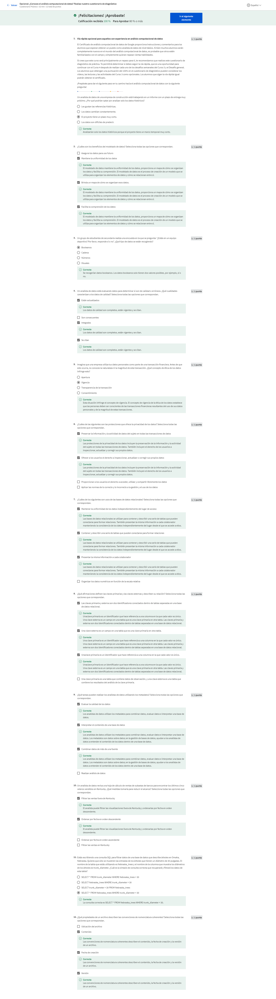

### Recopilar datos

#### Recopilar datos en nuestro mundo

Justo ahora se están generando datos en todo el mundo y hablamos de toneladas de datos. Cada minuto de cada día millones de textos son enviados y cientos de millones de correos electrónicos. Además de eso, se realizan millones de búsquedas en línea y se miran millones de videos y esos números van en aumento. Son muchos datos. Aprendamos más acerca de cómo se hacen y se utilizan. En este video, hablaremos sobre las formas en que los datos pueden generarse y cómo las industrias recopilan datos por su propia cuenta. Cada pieza de información es un dato. Todos los datos se generan usualmente como resultado de nuestra actividad en el mundo. Hoy en día, pasamos mucho tiempo en línea. Con las redes sociales y los dispositivos móviles millones y millones de personas están agregando enormes cantidades de datos todos y cada uno de los días. Piénsalo así. Cada foto digital en línea es una pieza de información. Cada foto en sí misma contiene todavía más datos, desde la cantidad de píxeles hasta los colores que contiene cada uno de esos píxeles. Pero ese no es el único modo en que se generan los datos. También se pueden generar datos al recolectar información. Esta generación de datos y su recolección traen aparejadas algunas cosas más en que pensar. Necesita ser realizado teniendo en cuenta la ética, de modo de mantener los derechos y la privacidad de las personas. Aprenderemos más al respecto más adelante. Por ahora, veamos un ejemplo del mundo real. La Oficina del Censo de los Estados Unidos utiliza formularios para recolectar datos acerca de la población del país. Estos datos son utilizados por distintas razones, como financiar escuelas, hospitales y cuarteles de bomberos. La Oficina también recolecta información sobre otras cosas como las empresas estadounidenses, y crean sus propios datos en el proceso. Lo mejor acerca de esto es que otros pueden utilizar los datos para sus propias necesidades, incluyendo el análisis. La encuesta anual de empresas se utiliza para conocer las necesidades de las empresas y cómo brindarles los recursos necesarios para ayudarlas a tener éxito. En realidad, yo genero datos en el análisis computacional de datos que realizo para la industria de cuidado de la salud. Realizamos muchas encuestas para conocer cómo los pacientes se sienten acerca de ciertas cosas relacionadas con el cuidado de su salud. Por ejemplo, una encuesta les preguntó a los pacientes cómo se sentían acerca de la telemedicina comparada con las visitas en persona al médico. Los datos recolectados ayudaron a las empresas con las que trabajamos a que mejorasen el cuidado que reciben los pacientes. Los datos de la encuesta son solo un ejemplo. Existen todo tipos de datos que se generan todo el tiempo, y existen muchos modos diferentes de recolectarlos. Incluso algo tan simple como una entrevista puede ayudar a alguien a recolectar datos. Imagínate que estás en una entrevista de trabajo. Para impresionar al gerente de contrataciones, quieres compartir información acerca de ti mismo. El gerente de contrataciones recolecta los datos y los analiza para que lo ayuden a decidir si te contratará o no. Es un camino de ida y vuelta. Tú también recolectas tus propios datos acerca de la empresa para que te ayude a decidir si es la empresa que mejor se adapta a tus necesidades. O puedes utilizar los datos recolectados para pensar preguntas más profundas que desees hacerle al entrevistador. Los científicos también generan datos. Utilizan muchas observaciones en su trabajo. Por ejemplo, pueden recolectar datos al estudiar el comportamiento animal u observando bacterias bajo el microscopio. Antes hablamos de los formularios que la Oficina del Censo de los Estados Unidos utiliza para recolectar datos. Formularios, cuestionarios y encuestas son formas usuales de recolectar y generar datos. Una cosa para destacar: los datos que son generados en línea no siempre ocurren directamente. ¿Alguna vez se han preguntado por qué algunos avisos en línea parecen realizar sugerencias realmente precisas o cómo algunos sitios web recuerdan tus preferencias? Esto se realiza utilizando cookies, que son pequeños archivos guardados en computadoras que contienen información de los usuarios. Las cookies pueden ayudar a informar a los publicitarios acerca de sus intereses personales y sus hábitos basándose en la navegación en línea, sin identificarlos personalmente. Como analista del mundo real, tienes todo tipo de datos justo en la punta de los dedos y son realmente abundantes. Saber cómo se han generado puede ayudar a agregar contexto a los datos, y saber cómo recopilarlos puede hacer que el proceso de análisis de datos sea más eficiente. A continuación, aprenderás cómo decidir qué datos recolectar para tu análisis. Mantente atento.

#### Determinar qué datos recoger

Es bueno verte de nuevo. Hemos hablado mucho acerca de los datos que existen en el mundo. Pero como analista de datos, deberás decidir qué tipos de datos recolectar y utilizar para cada proyecto. Con casi una cantidad infinita de datos disponibles, esto puede ser un dilema de datos, pero hay buenas noticias. En este video aprenderás qué factores considerar al recolectar datos. Usualmente, tendrás una ventaja al buscar los datos correctos para el trabajo porque los datos que necesitas te serán dados o tu problema o tarea empresarial hará que tus opciones se reduzcan. Comencemos con una pregunta como ¿qué está causando mayor caudal de vehículos en la hora pico en tu ciudad? Primero, debes saber cómo se recolectan los datos. Debes utilizar sus observaciones acerca de los patrones de tráfico para contar la cantidad de autos en las calles de la ciudad durante horas determinadas. Notas que los automóviles se quedan atascados en una calle específica. Esto nos lleva al origen de los datos. En nuestro ejemplo sobre el tráfico, tus observaciones pueden ser datos de primera fuente. Estos datos son recolectados por una persona o por un grupo por medio de sus propios recursos. Recopilar datos de primera fuente es típicamente el método de preferencia porque sabes exactamente de dónde provienen. También puede haber datos de segunda fuente, que son datos recolectados por un grupo directamente de su público y que, luego, se venden. En nuestro ejemplo, si no puedes recopilar tus propios datos, puedes comprarlos de alguna organización que haya realizado estudios de patrones de tráfico en tu ciudad. Estos datos no comenzaron contigo, pero aun así son confiables porque provienen de una fuente que tiene experiencia en análisis de tráfico. No se puede decir siempre eso de datos de terceros o datos recolectados de fuentes externas que no los recopilaron directamente. Estos datos pueden provenir de un amplio número de fuentes diferentes antes de que los investigues. Pueden no ser tan confiables, pero no quiere decir que no puedan ser útiles. Quieres asegurarte de controlar su su precisión, sesgo y credibilidad. En realidad, no importa qué tipo de datos utilices, deben ser controlados respecto de la precisión y confiabilidad. Aprenderemos más sobre este proceso más tarde. Por ahora, solo recuerda que los datos que elijas deben aplicarse a tus necesidades y deben estar aprobados para su uso. Como analista de datos, es tu trabajo decidir qué datos utilizar y eso significa elegir los datos que puedan ayudarte a encontrar las respuestas que buscas y resolver los problemas sin distraerte con otros datos. En nuestro ejemplo sobre el tráfico, los datos financieros probablemente no serían tan útiles, pero los datos existentes acerca de los horarios de alto volumen de tráfico pueden serlo. Muy bien. Ahora hablemos acerca de cuántos datos hay que recopilar. En el análisis computacional de datos, una población se refiere a todos los valores de datos posibles en un cierto conjunto de datos. Si estás analizando datos acerca del tráfico vehicular en una ciudad, tu población sería todos los automóviles en esa área. Pero recopilar datos de toda la población puede ser un gran desafío. Por eso una muestra puede ser útil. Una muestra es una parte de la población que es representativa de la población. Puedes recopilar una muestra de datos acerca de un lugar en la ciudad y analizar el tráfico en ese lugar, o puedes extraer una muestra al azar de todos los datos existentes en la población. La forma de elegir la muestra dependerá de tu proyecto. Cuando recopiles los datos, también querrás asegurarte de elegir el tipo correcto de datos. Para los datos sobre tráfico, el tipo de datos adecuados podrían ser los datos de registro de tráfico archivados en formato de fecha. Las fechas te pueden ayudar a ver qué días de la semana hay más posibilidades de un mayor volumen de tráfico en el futuro. Exploraremos este tema en mayor detalle pronto. Para finalizar, debes determinar lo siguiente: el marco temporal para la recopilación de datos. En nuestro ejemplo, si necesitas una respuesta inmediata, debes utilizar los datos históricos, es decir datos preexistentes. Pero digamos que debes rastrear los patrones de tráfico en un período de tiempo extenso. Esto puede afectar las otras decisiones que tomes durante la recolección de datos. Ahora sabes más sobre las diferentes consideraciones sobre la recopilación de datos que utilizarás como analistas de datos, Debido a ello, podrás encontrar los datos correctos cuando comiences a recopilarlos por ti mismo. Y todavía hay más para aprender acerca de la recopilación de datos, así que mantente en sintonía.

#### Seleccionar los datos adecuados

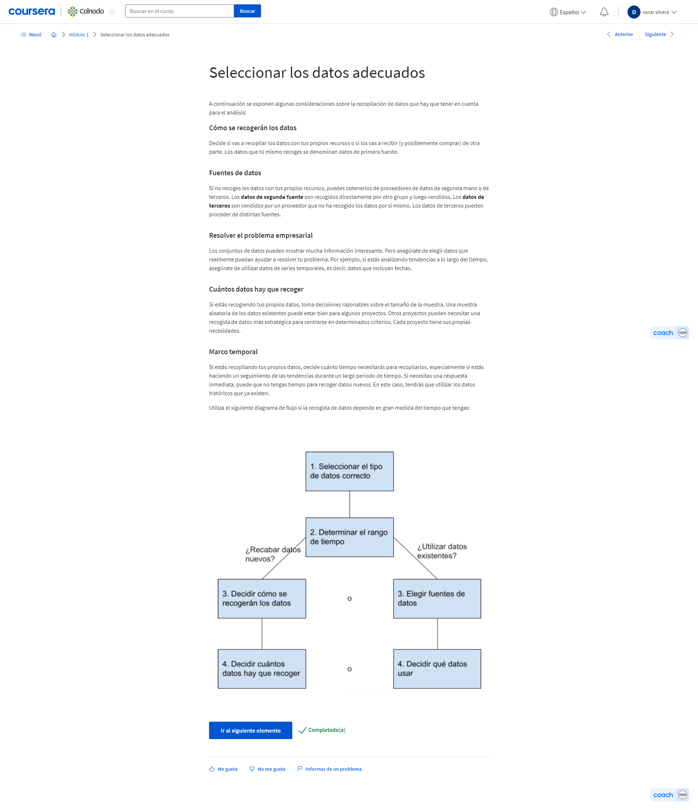

#### Cuestionario práctico: Pon a prueba tus conocimientos sobre la recopilación de datos

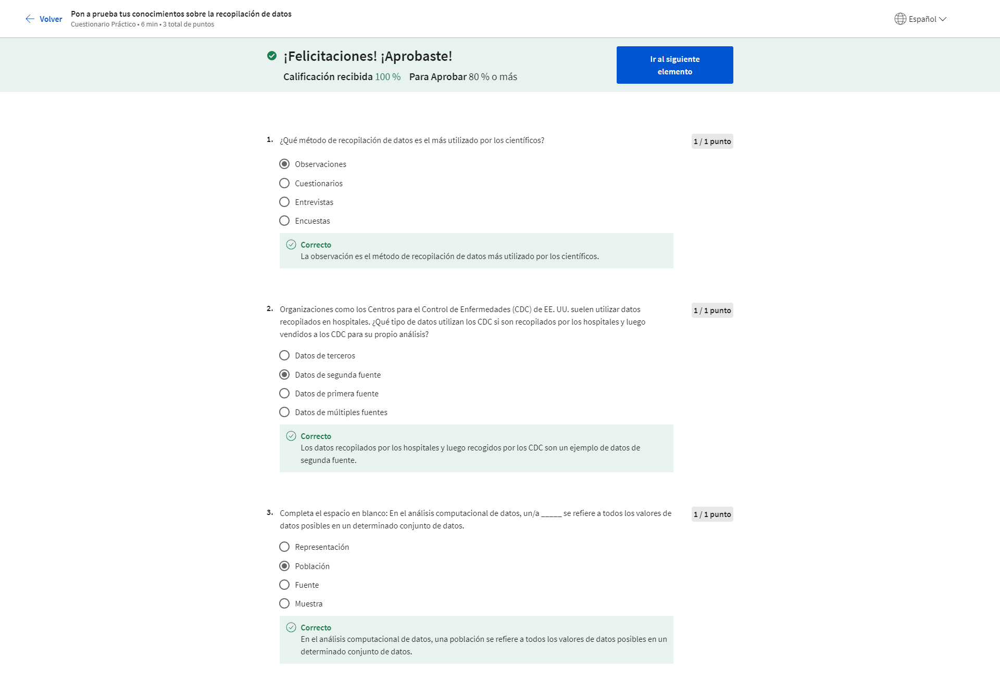

### Diferenciar entre formatos y estructuras de datos

#### Descubrir los formatos de datos

No sé qué te sucede a ti, pero cuando estoy eligiendo una película para ver, algunas veces me quedo frenada entre un par de películas posibles. Si estoy de humor para emoción o suspenso puede ser que elija una de misterio y suspenso, pero si me quiero reír con ganas, elegiré una comedia. Cuando no puedo decidirme entre dos películas, hasta puedo utilizar algunas de mis habilidades de análisis de datos y así compararlas o contrastarlas. Piensa en ello, que realmente necesitamos más películas sobre analistas de datos. La miraría, pero como no disponemos de películas acerca de los datos, al menos no todavía, haremos algo mucho mejor: ¡miraremos los datos acerca de las películas! Vamos a observar esta hoja de cálculo con datos sobre películas. Sabemos que podemos comparar diferentes películas y géneros. Y resulta que podemos hacer lo mismo con datos y formatos de datos. Usemos la hoja de cálculo con datos de películas para comprender cómo funciona. Comenzaremos con los datos tanto cuantitativos como cualitativos, Si miramos la columna A, encontraremos los títulos de las películas. Estos datos son cualitativos porque se pueden contar, medir o expresarse fácilmente con números. Los datos cualitativos son colocados normalmente en listados como un nombre, una categoría o una descripción. En nuestra hoja de cálculo, los títulos de las películas y los miembros del elenco son datos cualitativos. A continuación vemos los datos cuantitativos, que pueden medirse o contarse y luego expresarse como un número. Este dato cuenta con una cierta cantidad, monto o rango. En nuestra hoja de cálculo aquí, las dos últimas columnas muestran el presupuesto de las películas y la recaudación de taquilla. Los datos en estas columnas se expresan en dólares, que pueden contarse, de modo que sabemos que es un dato cuantitativo. Podemos profundizar en los datos cuantitativos y desglosarlos en datos discretos o continuos. Veamos primero los datos discretos. Estos son datos que se cuentan y tienen una cantidad de valores limitada. Volviendo a la hoja de cálculo, veremos el presupuesto de cada película y la recaudación de taquilla en las columnas M y N. Estos son dos ejemplos de que los datos discretos pueden ser contados y tienen una cantidad de valores limitada. Por ejemplo, la cantidad de dinero que puede recaudar una película puede ser solo representada con exactamente dos dígitos después del decimal para representar los centavos. No puede haber nada entre uno y dos centavos. Los datos continuos pueden medirse utilizando un cronómetro y su valor se puede mostrar como un decimal con varias posiciones. Imaginemos una película sobre analistas de datos de la que seré la protagonista definitivamente algún día. Podemos expresar que la película dura 110.0356 minutos. Hasta se podrían agregar datos fraccionarios luego de la coma del decimal de ser necesario. También existen datos nominales y ordinales. Los datos nominales son un tipo de datos cualitativos que se categorizan sin ningún orden establecido. En otras palabras, estos datos no tienen una secuencia. Aquí va un ejemplo rápido. Digamos que estás reuniendo datos sobre películas. Le preguntas a la gente si han visto una determinada película. Sus respuestas irían en el formulario de datos nominales. Pueden responder "sí", "no" o "no estoy seguro". Estas opciones no tienen un orden en particular. Por otro lado, los datos ordinales son un conjunto de datos cualitativos con un orden o escala preestablecidos. Si le preguntan a un grupo de gente que califiquen la película del 1 a 5 algunos la calificarán con 2, otros con 4 y así. Estas calificaciones indican cuánto le gustó la película a cada persona. Ahora, hablemos de los datos internos. que son los datos que viven dentro de los propios sistemas de una empresa. Por ejemplo, si un estudio cinematográfico ha compilado todos los datos en la hoja de cálculo utilizando su propio método de recolección, entonces serían sus datos internos. Lo importante de los datos internos es que por lo general son más confiables y fáciles de recolectar, pero en esta hoja de cálculo hay más posibilidades de que el estudio cinematográfico deba utilizar datos propios o compartidos por otros estudios y fuentes porque incluyen películas que ellos no han filmado. Esto significa que estarían recolectando datos externos. Los datos externos son, ya lo adivinaron, datos alojados y generados fuera de una organización. Los datos externos se tornan especialmente valiosos cuando tus análisis dependen de todas las fuentes disponibles posibles. Algo importante acerca de estos datos es que son estructurados. Los datos estructurados son datos que se organizan en un formato determinado, como filas y columnas. Las hojas de cálculo y las bases de datos relacionales son dos ejemplos de software que pueden almacenar datos de modo estructurado. Podrás recordar nuestra exploración anterior sobre el pensamiento estructurado, que colabora sumando un framework al problema de modo que puede resolverse de modo organizado y lógico. Puedes pensar en los datos estructurados del mismo modo. Con un framework para los datos, los datos son fácilmente rastreables y están más preparados para el análisis. Como analista de datos, trabajarás con muchos datos estructurados, que usualmente vendrán en forma de tabla, hoja de cálculo o base de datos relacional, pero a veces te encontrarás con datos no estructurados. Estos datos no están organizados de una forma fácilmente identificable. Los archivos de audio y video son ejemplos de datos no estructurados porque no hay un modo claro para identificar y organizar el contenido. Los datos no estructurados pueden contar con una estructura interna, pero los datos no se ubican prolijamente en filas y columnas como los datos estructurados. ¡Ahí lo tienes! Espero que ahora estés más familiarizado con los formatos de datos y cómo puedes usarlos en tu trabajo. En breve, continuarás explorando los datos estructurados y aprenderás aún más de los datos que utilizarás más frecuentemente como analista. Próximamente en el cine más cercano a ti.

#### Los formatos de datos en la práctica

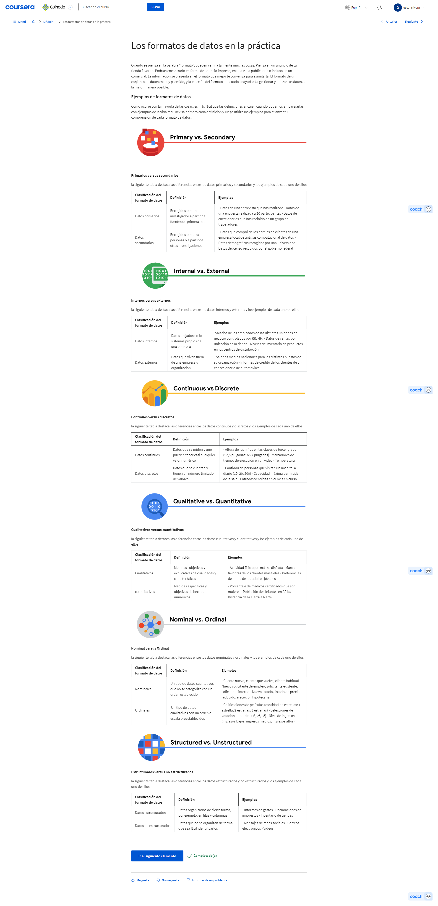

#### Cuestionario práctico: Autorreflexionar: Datos no estructurados

<https://quickdraw.withgoogle.com/data/cloud>

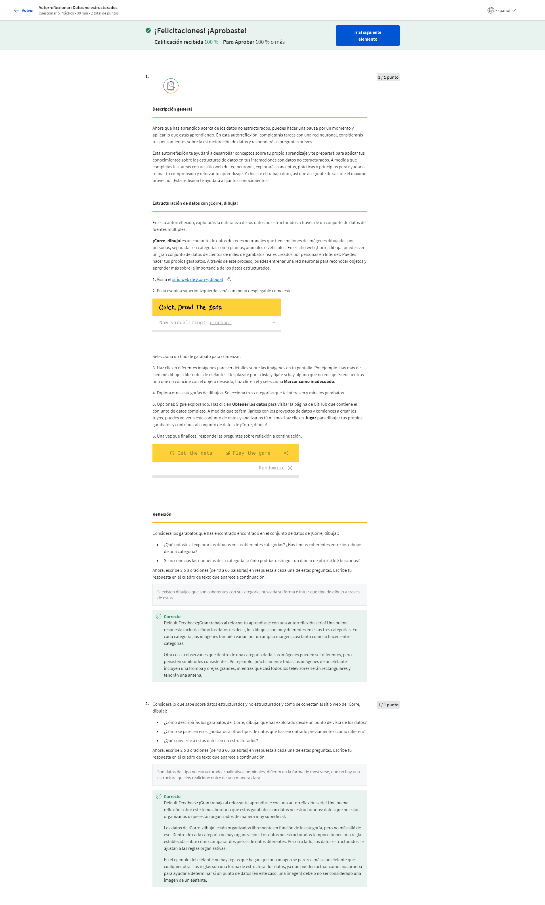

#### Entender los datos estructurados

¡Qué bueno volver a verte! Anteriormente, comparamos algunos formatos de datos, incluyendo datos estructurados y datos no estructurados. La mayoría de los datos que se están generando ahora mismo son en realidad no estructurados. Archivos de audio, video, correos electrónicos, fotografías y redes sociales son todos ejemplos de datos no estructurados. Esto puede ser difícil de analizar en su formato no estructurado. Pero hay buenas noticias: vas a trabajar con datos estructurados la mayor parte del tiempo. Por ejemplo, si necesitas analizar datos de los datos no estructurados en correos electrónicos, fotografías y sitios de redes sociales, estarán seguramente estructurados para su análisis aun antes de que llegues a ellos. Debido a eso, quisiera explorar un poco más los datos estructurados. Como un repaso rápido, los datos estructurados son datos organizados en un formato de filas y columnas. Pero definitivamente no se limitan a eso. Los datos estructurados trabajan muy bien dentro de un modelo de datos, que es un modelo utilizado para organizar los elementos de datos y la forma en que se relacionan entre ellos. ¿Qué son los elementos de datos? Son piezas de información, tales como nombres de personas, números de cuentas y direcciones. Los modelos de datos contribuyen a mantener la coherencia de los datos y brindan un mapa de cómo se organizan esos datos. Esto hace que sea más fácil para los analistas y otros interesados encontrar sentido a sus datos y utilizarlos con propósitos empresariales. Además de trabajar bien con modelos de datos, los datos estructurados también son útiles para las bases de datos. Esto facilita la tarea de los analistas de ingresar, consultar y analizar los datos dondequiera que lo necesiten. También contribuye a la visualización de los datos en forma más sencilla, ya que los datos estructurados pueden aplicarse directamente a las tablas, los gráficos, mapas térmicos, paneles y la mayoría de las representaciones visuales de los datos. Entonces bien, sabemos que las hojas de cálculo y las bases de datos que almacenan los conjuntos de datos son fuentes frecuentes de datos estructurados. Luego de explorar otras estructuras de datos, observarás más tipos de datos utilizando una hoja de cálculo. ¡La aventura continúa!

#### La estructura de los datos

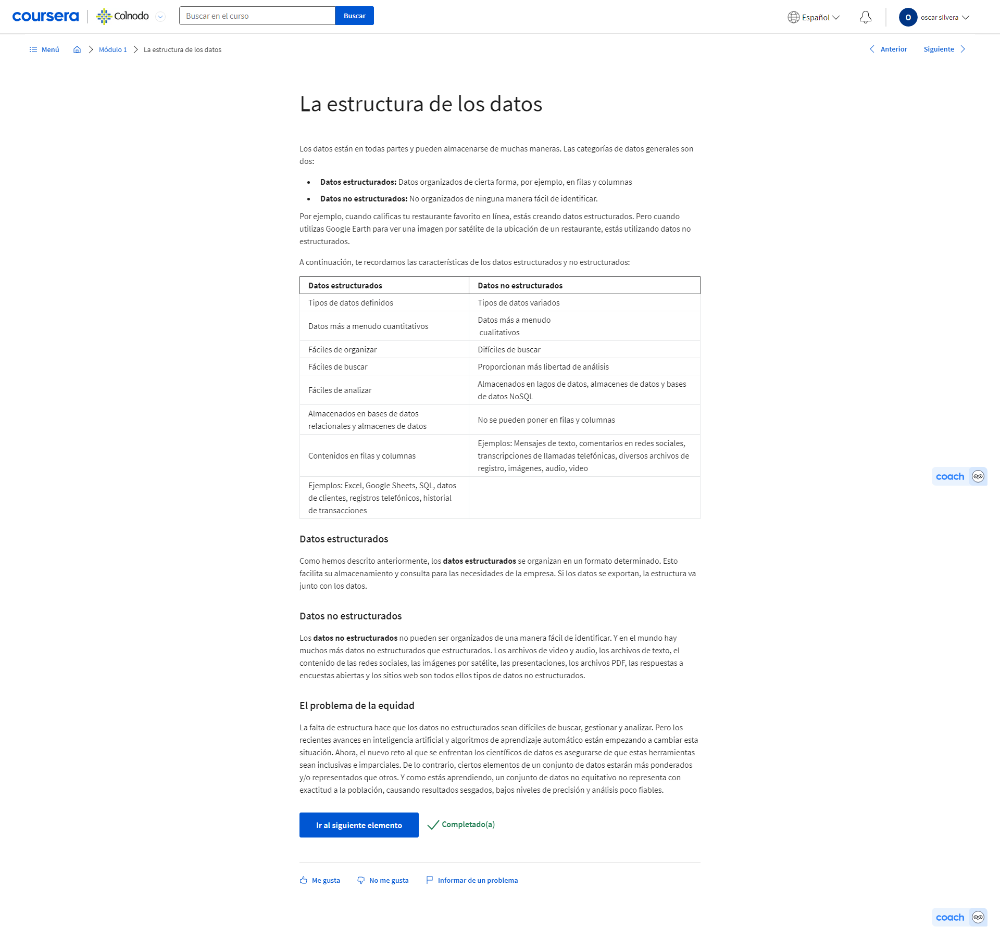

#### Niveles y técnicas de modelado de datos

<https://www.1keydata.com/datawarehousing/data-modeling-levels.html>

<https://dataedo.com/blog/basic-data-modeling-techniques>

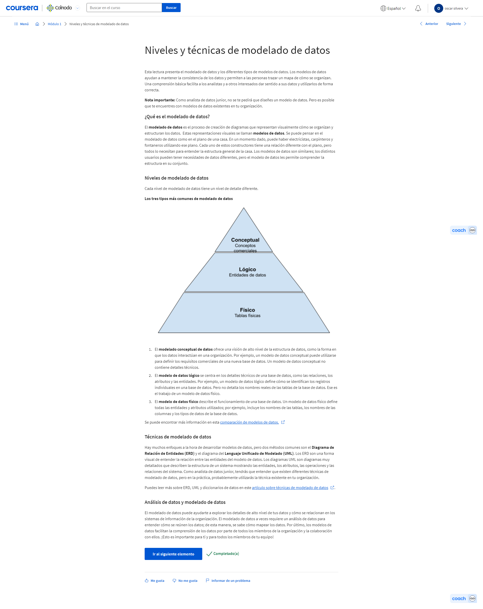

#### Cuestionario práctico: Poner a prueba tus conocimientos sobre formatos y estructuras de datos

### Explorar los tipos de datos, campos y valores

#### Conocer el tipo de datos con el que trabajas

Hasta ahora han aprendido mucho acerca de los datos. Desde datos generados, pasando por datos recopilados hasta formato de datos, es bueno saber todo lo posible acerca de los datos que utilizarás para el análisis. En este video, hablaremos sobre otro modo en que se pueden describir los datos: el tipo de dato. Un tipo de dato es una clase específica de atributo de datos que nos dice qué tipo de valor tiene ese dato. En otras palabras, un tipo de datos te indica con qué clase de datos estás trabajando. Los tipos de datos pueden ser diferentes dependiendo del lenguaje de consulta que estás utilizando. Por ejemplo, SQL permite tipos diferentes de datos dependiendo de la base de datos que utilices. Sin embargo, por ahora nos concentraremos en los tipos de datos que utilizarás en las hojas de cálculo. Para ayudarnos, utilizaremos una hoja de cálculo que ya esté completa con datos. La llamaremos "Interés mundial en los dulces a través de las búsquedas en Google". Bien, un tipo de dato en una hoja de cálculo puede ser una de tres cosas: un número, un texto o cadena o datos booleanos. Podrán encontrar programas para hojas de cálculo que los clasifica de forma algo diferente o incluye otros tipos, pero esos tipos de valores cubren casi todos los datos que encontrarán en una hoja de cálculo. Veremos todo esto en un momento. Si miramos las columnas B, D y F encontraremos tipos de datos numéricos. Cada número representa el interés en la búsqueda del término "pastelillo", "helado" y "caramelo" para una semana específica. Cuanto más cerca está un número de 100, más popular fue ese término de búsqueda durante esa semana. Cien representa el pico de popularidad. Recuerden que en este caso, 100 es un valor relativo, no la cantidad real de búsquedas. Representa el número máximo de búsquedas durante un cierto tiempo. Piensa en ello como un porcentaje en una prueba. Todas las otras búsquedas se valúan también respecto de 100. Puedes notar esto en otros conjuntos de datos también. ¡Estrella de oro para el 100! Si es necesario, puedes cambiar los números a porcentajes y otros formatos, como moneda. Todos estos son ejemplos de tipos de datos numéricos. En la columna H, los datos muestran la delicia más popular para cada semana, según los datos de búsqueda. Así es como encontraremos que en la celda H4 para la semana que comienza el 28 de julio de 2019, la delicia más popular fue el helado. Esto es un ejemplo de un tipo de dato de texto, o un tipo de datos en cadena, que es una secuencia de caracteres y puntuación que contiene información textual. En este ejemplo, esa información serían las delicias y los nombres de las personas. También se pueden incluir números como números telefónicos o números en las direcciones. Pero esos números no se utilizarían para los cálculos. En este caso, se tratan como texto y no como número. En las columnas C, E y G, parece que tenemos algo de texto. Pero el texto aquí no es un tipo de dato de texto o cadena. Por el contrario, es un tipo de dato booleano. Un tipo de dato booleano es un tipo de datos con solo dos valores posibles, verdadero o falso. Las columnas C, E y G muestran datos booleanos por si el interés de búsqueda para cada semana es menor a 50 de 100. Así es como funciona. Para obtener estos datos, hemos creado una fórmula que calcula si el dato de interés de búsqueda en las columnas B, D y F es 50 o mayor. En la celda B4, el interés de búsqueda es 14. En la celda C4, encontramos la palabra falso porque, para esta semana de datos, el interés de búsqueda es menor a 50. Para cada celda en las columnas C, E, y G, los dos únicos valores posibles son verdadero o falso. Podríamos cambiar la fórmula de manera que aparezcan otras palabras en esas celdas, pero aun así serían datos booleanos. Podrás leer más sobre datos booleanos muy pronto. Hablemos de un tema común que la gente encuentra en las hojas de cálculo: confundir tipos de datos con valores de celdas. Por ejemplo, en la celda B57, podemos crear una fórmula para calcular datos en otras celdas. Esto nos dará un promedio de los intereses de búsqueda en pastelillos en todas las semanas del conjunto de datos, que es aproximadamente 15. La fórmula funciona porque hemos calculado usando un tipo de dato numérico. Pero si tratáramos con un tipo de dato de texto o cadena, como el dato en la columna C, nos daría error. Los valores de error ocurren normalmente si el error se da cuando se ingresan los valores en las celdas. Cuanto más sepas de tus tipos de datos y cuáles utilizar, se reducirán los errores. Así es, hay un tipo de dato para cada uno. Pero aún no hemos terminado. A continuación, profundizarás en la relación entre tipos de datos, campos y valores. Nos vemos pronto.

#### Entender la lógica booleana

<https://www.maa.org/press/periodicals/convergence/origins-of-boolean-algebra-in-the-logic-of-classes-george-boole-john-venn-and-c-s-peirce>

<https://libguides.mit.edu/c.php?g=175963&p=1158594>

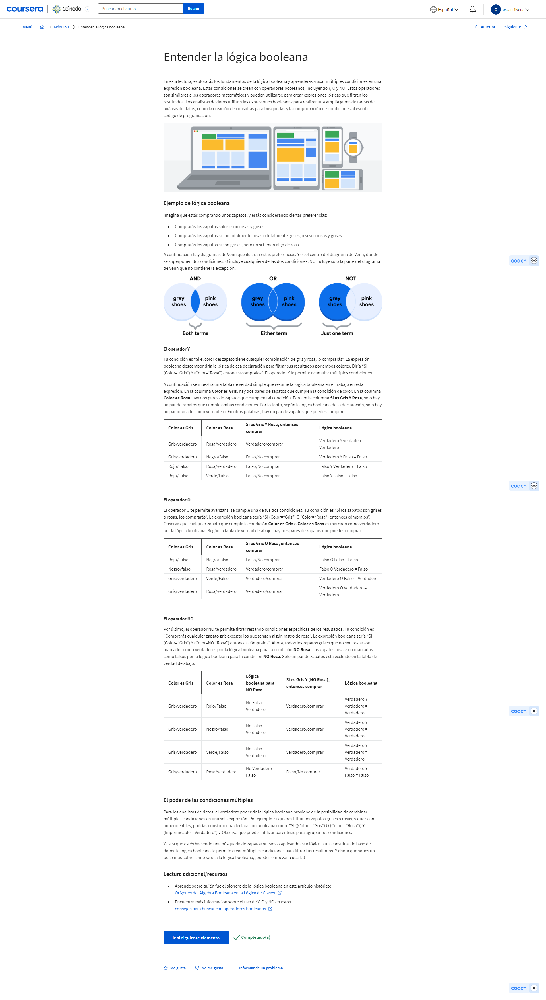

#### Componentes de la tabla de datos

Te traigo un acertijo. ¿Qué tienen en común una lista de reproducción, un calendario y una bandeja de entrada de correo electrónico? Te daré una pista. No se trata de una sesión semanal de improvisación. La respuesta es que todo viene organizado en tablas. Ve y compruébalo en tu casilla de correo o una lista de reproducción favorita o mira tu agenda calendario. ¡Hay tablas en cada uno! Una tabla de datos, o datos tabulares, tiene una estructura muy simple. Está organizada en filas y columnas. Puedes llamar a las filas "registros" y a las columnas "campos". Básicamente quieren decir lo mismo, pero los registros y campos se pueden usar para cualquier tipo de tabla de datos, mientras que las filas y las columnas se reservan usualmente para las hojas de cálculo. Cuando hablamos de bases de datos estructuradas, las personas que realizan análisis computacional de datos suelen usar "registros" y "campos". Algunas veces, un campo también se puede referir a un solo dato, como el valor en una celda. En todo caso, escucharás las dos versiones de esos términos en todo este programa y en tu trabajo. Volvamos al ejemplo de la lista de reproducción. Utilizaremos los términos nuevos que acabamos de mencionar. De modo que cada canción es un registro. Cada registro tiene los mismos campos que los otros registros y en el mismo orden. En otras palabras, la lista de reproducción tiene la misma información acerca de cada canción.
Reproduce el video desde :1:10 y sigue la transcripción1:10
Cada característica de la canción, como el título y el artista, es un campo. Cada campo por separado tiene el mismo tipo de dato, pero diferentes campos pueden tener diferentes tipos. Te mostraré a qué me refiero. Para la lista de canciones, los títulos de las canciones son un tipo de texto o cadena, mientras que la duración de la canción puede ser de tipo numérico si lo estás utilizando para tus cálculos. O puede ser del tipo fecha y hora. La columna de favoritos es booleana, ya que tiene dos posibles valores: favorita o no favorita. Podemos ver las hojas de cálculo del mismo modo. Los registros en una hoja de cálculo pueden ser acerca de todo tipo de cosas: clientes, productos, facturas o cualquier otra cosa. Cada registro tiene varios campos que revelan más acerca de los productos o facturas de los clientes. El valor en cada celda contiene un dato específico, como la dirección de un cliente o el valor en dólares de una factura. Como analista de datos, muchos datos te llegarán y los registros, campos y valores en las tablas de datos te ayudarán a navegar por el análisis. Comprender las estructuras de las tablas con las que estás trabajando es una parte de ello. Y esperemos que mientras trabajas duro en tu análisis y esas tablas, puedas divertirte un poco con una tabla de datos diferente: ¡la que tiene tu lista de reproducción favorita!

#### Cuestionario práctico: Actividad práctica: Aplicación de una función

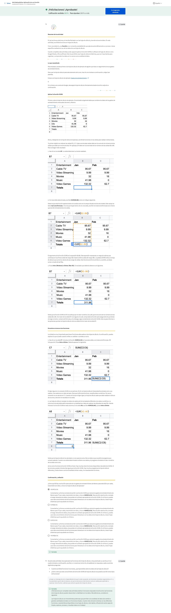

#### Conocer los datos en formato ancho y largo

Probablemente utilizas las palabras "ancho" y "largo" todo el tiempo. Utilizarías la palabra "ancho" para describir el tamaño de algo de lado a lado, como un río ancho. Pero un río también puede viajar grandes distancias, de modo que también se lo puede llamar "largo". ¡Espera! Antes de detener el vídeo, te aseguro que no pulsaste accidentalmente en el curso equivocado. No estoy acá para enseñarte palabras que ya conoces. Pero las palabras "ancho" y "largo" se pueden utilizar para describir datos también. Así que estoy aquí para ayudarte a entender los datos en formato ancho y los datos en formato largo. Hasta ahora has tratado con datos organizados en su mayoría en un formato ancho. Con los datos en formato ancho, cada interesado tiene una fila sola con múltiples columnas para albergar los valores de varios atributos del interesado. Existen datos en formato ancho en una hoja de cálculo. Recordarás que hablamos de estos datos acerca de la población de países latinos y del Caribe anteriormente. Para este conjunto de datos, cada fila brinda toda la información de la población de un país. Cada columna muestra la población para un año diferente.
Reproduce el video desde ::57 y sigue la transcripción0:57
Los datos anchos permiten una fácil identificación y una rápida comparación de las diferentes columnas. En nuestro ejemplo, los datos están organizados alfabéticamente por país, de modo que se pueden comparar las poblaciones anuales de Antigua y Barbuda, Aruba y las Bahamas solo controlando los valores en cada columna. Los datos en formato ancho también simplifican la búsqueda y comparación de las poblaciones de los países en períodos diferentes de tiempo. Por ejemplo, al ordenar los datos descubrimos que Brasil tenía la mayor población de todos los países en 2010 y que la Islas Vírgenes Británicas tenían la menor población de todos los países en 2013. Bien, exploremos ahora estos datos en formato largo. Aquí los datos ya no están organizados en columnas por año. Todos los años están ahora en una columna con cada país, como Argentina, que aparece en filas múltiples, una para cada año de datos. Así se ven normalmente los datos en formato largo. Los datos en formato largo en cada fila representan un punto de tiempo único por interesado, de modo que cada interesado tendrá datos en filas múltiples. Nuestra hoja de cálculo se formatea para mostrar cada año de datos de la población.
Reproduce el video desde :2:1 y sigue la transcripción2:01
Aquí vemos a Antigua y Barbuda primero. Los datos en formato largo son una buena manera de almacenar datos organizados con variables múltiples para cada sujeto en cada punto de tiempo que queremos observar. Con estos datos en formato largo, podemos almacenar y analizar todos estos datos utilizando menos columnas. Además, si agregamos una nueva variable, como el promedio de edad de una población, solo necesitamos una nueva columna. Si hubiéramos utilizado los datos en formato ancho, en cambio, deberíamos haber agregado 10 columnas, una para cada año. Los datos en formato largo mantienen todo prolijo y compacto. Si te preguntas qué formato utilizar, la respuesta simple es: "depende".
Reproduce el video desde :2:37 y sigue la transcripción2:37
Algunas veces, debes transformar datos en formato ancho en datos en formato largo o viceversa, en otras ocasiones. Probablemente, trabajarás con ambos formatos en tu trabajo. Y definitivamente reconsiderarás ambos formatos otra vez más tarde en este programa. Esto me recuerda: antes definimos los datos como una recopilación de hechos. Como descubriste en los últimos videos, esa recopilación de hechos puede tomar diferentes formatos, estructuras, tipos y más.
Reproduce el video desde :3:3 y sigue la transcripción3:03
Aprender acerca de los modos en que pueden presentarse los datos te será de gran ayuda a lo largo de los procesos del análisis de datos. Cuanto más trabajes con datos en todas sus formas, más rápido empezarás a reconocer qué datos utilizar y cuándo utilizarlos.
Reproduce el video desde :3:16 y sigue la transcripción3:16
Y en breve, utilizarás todos los datos almacenados en tu cerebro para ayudarte a realizar una evaluación. Luego, aprenderás cómo identificar y evitar el sesgo en los datos y cómo aprovechar la credibilidad, la integridad y la ética. La aventura de los datos avanza. ¡Y me alegra avanzar con ellos!

#### Transformación de datos

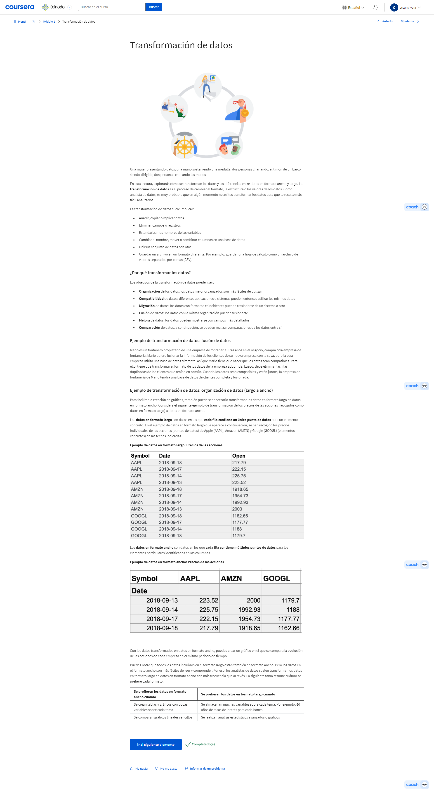

#### Cuestionario práctico: Actividad práctica: Introducción a Kaggle

<https://www.youtube.com/watch?v=TNzDMOg_zsw>

<http://www.kaggle.com/>

<https://www.kaggle.com/jessemostipak>

<https://www.kaggle.com/mrisdal/gganimate>

<https://www.kaggle.com/mrisdal/space-is-the-place>

<https://www.kaggle.com/rtatman/getting-started-in-r-first-steps>

<https://www.kaggle.com/anasofiauzsoy/writing-hamilton-lyrics-with-tensorflow-r>

<https://www.kaggle.com/jessemostipak/dive-into-dplyr-tutorial-1>

<https://www.kaggle.com/jessemostipak/dive-into-dplyr-tutorial-1>

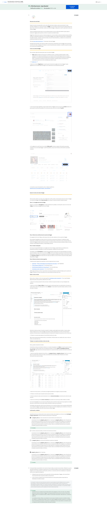

#### Cuestionario práctico: Pon a prueba tus conocimientos sobre tipos de datos, campos y valores

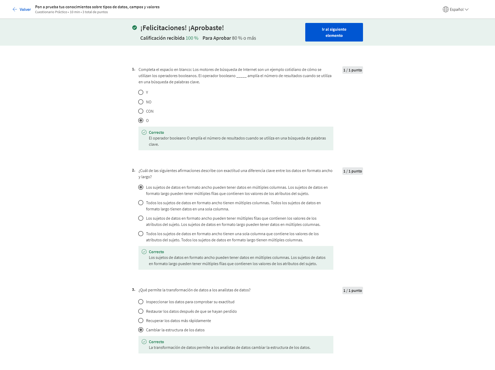

### Desafío semanal 1 curso 3

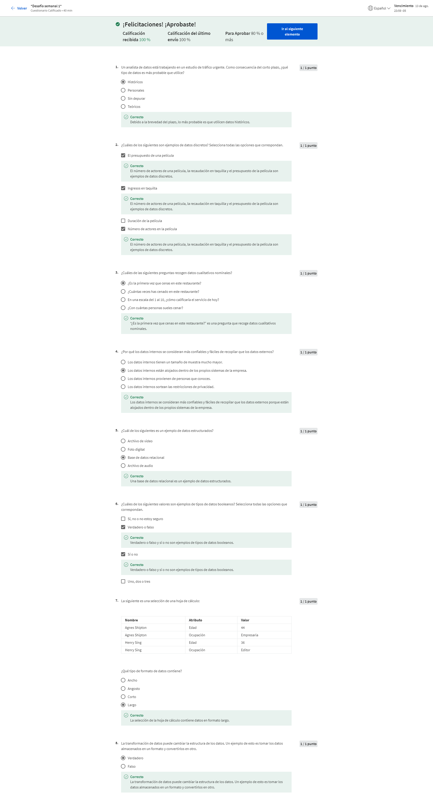

## Sesgo, credibilidad, privacidad, ética y acceso

### Datos imparciales y objetivos

#### Garantizar la integridad de los datos

¡Bienvenido nuevamente! En un curso anterior, hablamos sobre cómo preparar los datos de manera que te ayuden a transmitir un mensaje significativo. Ahora averigüemos qué sigue. Como todas las buenas historias, la historia de tus datos tendrá personajes, preguntas, desafíos, conflictos y esperemos que una resolución. La clave es evitar el conflicto, superar los obstáculos y responder las preguntas. De eso trata este curso. Así es como lo haremos. Primero, aprenderás cómo analizar los datos respecto de los sesgos y la credibilidad. Esto es muy importante porque aún los datos más sólidos pueden ser sesgados o malinterpretados. Luego aprenderemos sobre la importancia de los datos correctos e incorrectos. Sí, como cuando éramos niños. Pero en este caso, exploraremos las fuentes de datos correctos y aprenderemos cómo alejarnos de su némesis, los datos incorrectos. Después, aprenderemos más sobre el mundo de la ética y la privacidad de los datos y cómo acceder a estos. A medida que crece la disponibilidad de los datos, y los algoritmos que creamos para utilizar estos datos se tornan cada vez más complejos y sofisticados, siguen surgiendo los problemas. Tenemos que hacernos preguntas como ¿quién es el dueño de estos datos? ¿Cuánto control tenemos sobre la privacidad de los datos? ¿Podemos usar y reutilizar los datos como queramos? Como analista de datos, es importante comprender la ética y la privacidad de los datos porque en tu trabajo, tomarás un montón de decisiones basadas en el criterio sobre el uso correcto y la aplicación de los datos. Me entusiasma que repasemos juntos algunas preguntas, respuestas, recompensas y riesgos involucrados. Empecemos el primer capítulo de esta historia de datos, en nuestro próximo video.

#### Sesgo: De preguntas a conclusiones

Empecemos por hacer un viaje en el tiempo, bueno, en nuestras mentes al menos. Mi verdadera máquina del tiempo está en el taller. Imagina que regresas a la escuela secundaria y has entregado un proyecto en la feria de ciencias. Trabajaste mucho durante semanas enteras para perfeccionar cada detalle y están por anunciar a los ganadores. Cierras los ojos, respiras profundo, y escuchas que mencionan tu nombre como ganador del segundo lugar. ¡Qué mal!, realmente querías el trofeo del primer lugar, pero oye, te llevarás la cinta de reconocimiento. Al día siguiente te enteras que el juez era el tío de la ganadora. ¡Eso no es justo! ¿Se puede esperar realmente que elija a un ganador de forma justa cuando un miembro de su propia familia es uno de los concursantes? Es muy probable que no sea objetivo. Tal vez su sobrina merecía ganar o quizás no. Pero la cuestión es que resulta muy fácil plantear un caso de sesgo en ese escenario. Este es un ejemplo muy sencillo, pero la verdad es que nos encontramos con el sesgo todo el tiempo en la vida cotidiana. Nuestros cerebros están diseñados biológicamente para agilizar el pensamiento y hacer juicios rápidos. El sesgo ha evolucionado hasta convertirse en una preferencia a favor o en contra de una persona, grupo de personas o elementos. Puede ser consciente o subconsciente. La buena noticia es que una vez que sabemos y aceptamos que tenemos sesgos, podemos empezar a reconocer nuestros propios patrones de pensamiento y aprender a manejarlos. Es importante que sepas que los sesgos también pueden filtrarse en el mundo de los datos. El sesgo de datos es un tipo de error que sistemáticamente orienta los resultados en una determinada dirección. Quizás las preguntas de la encuesta hayan tenido un sesgo en particular para influenciar las respuestas, o tal vez el grupo de la muestra no era realmente representativo de la población que se analizaba. Por ejemplo, si vas a tomar la edad promedio de la población de pacientes de los Estados Unidos que tienen seguro de salud, no usarías solo una muestra de los pacientes de Medicare que tienen 65 años o más. El sesgo también puede ocurrir si el grupo de una muestra carece de inclusividad. Por ejemplo, las personas con discapacidades tienden a ser subidentificadas, subrepresentadas o excluidas en la investigación de salud general. La forma en que obtienes los datos también puede sesgar un conjunto de datos. Por ejemplo, si les das a las personas poco tiempo para responder preguntas, sus respuestas serán apresuradas. Cuando estamos apurados, cometemos más errores, lo cual puede afectar la calidad de nuestros datos y crear resultados sesgados. Como analista de datos, tienes que pensar en el sesgo y la equidad desde el momento en que empiezas a recopilar datos hasta el momento en que presentas tus conclusiones. Después de todo, esas conclusiones pueden tener serias consecuencias. Piensa en esto: es sabido que los estudios clínicos de la salud cardíaca tienden a incluir muchos más hombres que mujeres. Eso ha llevado a que las mujeres no logren reconocer síntomas y, en última instancia, hace que sus afecciones cardíacas no se detecten ni se traten. Esta es solo una de las formas en que los sesgos pueden tener un impacto muy real. Si bien hemos avanzado mucho en el reconocimiento de los sesgos, aun así te condujeron a perder contra la sobrina del juez en ese concurso de ciencias. Siguen influenciando las decisiones empresariales, las opciones y el acceso al cuidado de la salud, el accionar gubernamental y muchas cosas más. Así que tenemos que seguir trabajando este tema. Próximamente te mostraremos cómo identificar los sesgos en los datos propiamente dichos, y explorar algunos escenarios en los que realmente puedes beneficiarte por ello.

#### Datos sesgados e imparciales

Hola de nuevo. Hasta ahora aprendimos que los sesgos que tenemos como personas pueden terminar creando datos sesgados. Somos influenciados por los sesgos cuando nuestras preferencias se basan en nuestras propias nociones preconcebidas o incluso subconscientes. Cuando los datos son sesgados, pueden orientar sistemáticamente los resultados en una determinada dirección que los torna poco confiables. Ya hablamos de este tema cuando usamos el sesgo del muestreo como ejemplo. El sesgo del muestreo ocurre cuando una muestra no es representativa de la población en su conjunto. Puedes evitar esto si te aseguras de elegir la muestra de forma aleatoria, para que todas las partes de la población tengan las mismas posibilidades de ser incluidas. Si no usas el muestreo aleatorio durante la recopilación de datos, terminas favoreciendo un resultado. Aquí mostramos una manera sencilla de hacerlo. Supongamos que hay 50 alumnos en una clase, y quieres saber si la mayoría de la clase prefiere el frío o el calor. Decides encuestar a los primeros 10 alumnos que encuentras, y en función de sus respuestas, determinas que toda la clase prefiere el calor. Pero espera, hay un sesgo ahí. Esas 10 primeras personas eran todas mujeres, así que en la encuesta solo se incluyeron mujeres. Tu encuesta no fue una fiel representación de toda la clase porque no incluyó otros identificadores en todo el espectro del género. Si hubieras usado una muestra más aleatorizada de la población que incluyera a todos los géneros, hubieras obtenido una muestra sin sesgos. Los muestreos sin sesgos generan una muestra que es representativa de la población que se mide. Otra muy buena forma de detectar si estás trabajando con datos no influenciados por sesgos es dar vida a los resultados mediante visualizaciones. En el ejemplo de la clase, que acabamos de ver, podrías visualizar la cantidad de alumnos de toda la clase, y sus identidades de género con un gráfico de barras. Después podrías comparar eso con un gráfico de barras similar que muestre a los alumnos que encuestaste. Esto te ayudará a identificar con facilidad cualquier desajuste con tu muestra. Muy bien, ahora que sabemos cómo se manifiesta el sesgo desde una perspectiva de muestreo, exploremos algunos otros tipos de sesgo, y cómo reconocerlos.

#### Cuadro de aviso de la discusión: Explicación del sesgo

El sesgo es una preferencia consciente o subconsciente a favor o en contra de una persona, un grupo de personas o un elemento. Has aprendido que los sesgos pueden afectar el criterio de las personas y sesgar los datos. La buena noticia es que una vez que las personas saben y aceptan que tienen parcialidades (sesgos), pueden empezar a reconocer sus propios patrones de pensamiento y aprender cómo mejorar. 

En función de lo que has aprendido hasta ahora, ¿crees que es importante considerar al sesgo en tu vida cotidiana? ¿Por qué o por qué no? 

#### Comprender el sesgo en los datos

Puede ser que sea prejuicioso, pero creo que aprender sobre las características buenas y malas de los datos es algo atrapante. A continuación, descubriremos que hay muchos tipos diferentes de sesgos de datos, además del sesgo de muestreo que tratamos antes.
Reproduce el video desde ::13 y sigue la transcripción0:13
Hagamos un repaso rápido, sesgo del muestro es cuando una muestra no es representativa de la población en su conjunto. Por ejemplo, si estás haciendo una investigación sobre cómo se trasladan las personas a su trabajo, y solo encuestas a las personas que caminan por la acera, te perderás la opinión de las personas que van en bicicleta, conducen vehículos o viajan en subterráneo. Necesitas todas las perspectivas de la historia para evitar el sesgo del muestreo. En este video, analizaremos otros tres tipos más de sesgo del muestreo: sesgo del observador, sesgo de interpretación y sesgo de confirmación, y aprenderemos cómo evitarlos. Empecemos por el sesgo del observador, al que a veces se llama sesgo del investigador o sesgo de investigación. Básicamente, es la tendencia de distintas personas a observar las cosas de forma diferente. Como recordarás, aprendimos que los científicos usan mucho las observaciones en su trabajo, como cuando observan una bacteria en el microscopio para recabar datos. Aunque dos científicos que miren en el mismo microscopio podrían ver cosas diferentes, eso es sesgo del observador. Otra situación en la que puede producirse el sesgo del observador es durante las mediciones de la presión arterial. Como el tensiómetro es tan sensible, los trabajadores de la salud a menudo obtienen resultados bastante diferentes. En general, suelen redondear al número entero más cercano para compensar el margen de error. Pero si los médicos redondean sistemáticamente hacia arriba o hacia abajo las mediciones de la presión arterial de sus pacientes, ciertas afecciones podrían pasar desapercibidas, y los estudios de sus pacientes no tendrían datos precisos y exactos. Otro tipo común de sesgo de los datos es el sesgo de interpretación. La tendencia a interpretar siempre las situaciones ambiguas de manera positiva o negativa. Aquí hay un ejemplo. Digamos que estás almorzando con un amigo y recibes un correo de voz de tu jefa, que te pide que le devuelvas la llamada. Dejas el teléfono, enfadado, seguro que está enojada y estás en la cuerda floja por algo. Pero cuando le reproduces el mensaje a tu amigo, él no percibe el enojo en absoluto, en realidad, piensa que ella suena tranquila y directa. El sesgo de interpretación puede hacer que dos personas vean o escuchen lo mismo de manera diferente, y lo interpreten de distintas maneras, porque provienen de entornos diferentes, con experiencias distintas. La anécdota de tu jefa te hizo interpretar la llamada de una manera, pero tu amigo la interpretó de otra manera porque ellos no se conocen. Traslada estas interpretaciones al análisis de datos, y es probable que obtengas resultados sesgados. El último tipo de sesgo que analizaremos, me recuerda el dicho "la gente ve lo que quiere ver." Eso resume muy bien el sesgo de confirmación. El sesgo de confirmación es la tendencia a buscar o interpretar la información de una manera que confirma las creencias preexistentes. Alguien podría estar tan ansioso por confirmar un sentimiento visceral, que solo nota cosas que lo confirman, e ignora todas las demás señales. Esto ocurre todo el tiempo en la vida cotidiana. Es probable que obtengamos las noticias de un determinado sitio web porque los escritores comparten nuestras creencias, o que socialicemos con determinadas personas porque sabemos que comparten visiones similares. Después de todo, otros puntos de vistas diferentes podrían hacernos cuestionar nuestra visión del mundo, lo que puede llevarnos a cambiar todo nuestro sistema de creencias, y seamos sinceros, el cambio nos cuesta. Pero, ¿sabes qué es aún peor? Hacer un buen trabajo cuando tienes datos incorrectos; por eso, es importante mantener el sesgo alejado. Los cuatro tipos de sesgo de datos que analizamos: sesgo del muestreo, sesgo del observador, sesgo de interpretación y sesgo de confirmación son todos únicos, pero tienen algo en común. Cada uno de ellos afecta la forma en que recopilamos y damos sentido a los datos. Por desgracia, son también una pequeña muestra, un juego de palabras, de los tipos de sesgos que puedes encontrar en tu carrera como analista de datos. Pero la buena noticia es que una vez que conoces algunos, estarás constantemente en guardia para detectar cualquier forma de sesgo. También es importante recordar que no importa qué tipo de datos utilices, todos deben ser inspeccionados para verificar su precisión y confiabilidad. Pronto hablaremos más sobre este tema cuando empecemos a explorar los datos incorrectos. Hasta pronto.

#### Cuestionario práctico: Pon a prueba tu conocimiento sobre datos imparciales y objetivos

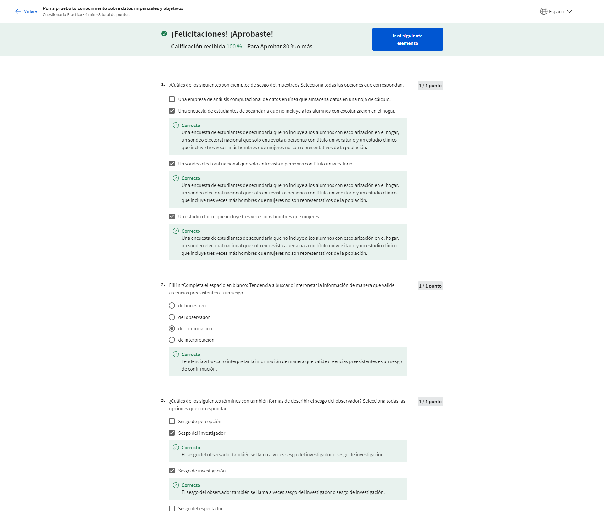

### Explorar la credibilidad de los datos

#### Identificar fuentes de datos correctos

Hola, ¿qué es bueno o correcto? No, en serio, quiero saber: ¿Qué es bueno o correcto? Por ejemplo, si te pido que nombres una buena canción, quizás a mí no me guste. Eso es porque “bueno” es algo subjetivo. Lo que yo pienso que es bueno o correcto y lo que tú crees que es bueno o correcto puede variar. Entonces, ¿qué pasa con las fuentes de datos correctos? ¿También son subjetivos? En cierta forma lo son, pero afortunadamente, aplicar algunas mejores prácticas te ayudará a medir la confiabilidad de los conjuntos de datos, antes de usarlos. Eso es lo que veremos en este video. Creo que todos coincidiremos en que todos queremos datos correctos. Cuanto mayor sea la calidad de los datos que tenemos, mayor confianza tendremos en nuestras decisiones. Aprendamos cómo podemos descubrir e identificar fuentes de datos correctos. Primero lo primero, necesitamos aprender a identificarlos. Me gusta llamar a este proceso ROCCC, R-O-C-C-C. Muy bien. Acabo de inventarlo, pero creo que los acrónimos son una muy buena forma de grabar información nueva en el cerebro. Empecemos por la “R” de “Reliable” (confiable). Como ocurre con los buenos amigos, las fuentes de datos correctos son confiables. Con estos datos puedes confiar en que obtendrás información precisa, completa y objetiva que ha sido verificada, probada y es apta para usar. Muy bien. Pasemos a la “O” de “Original”. Es muy probable que descubras datos a través de una segunda fuente o una fuente de terceros. Para corroborar que estás manejando datos correctos, asegúrate de validarlos con la fuente original. Llegamos a la “C” de “Comprehensive” (integral). Las mejores fuentes de datos contienen toda la información crítica que se necesita para responder una pregunta o encontrar una solución. Piénsalo así. No te gustaría trabajar para una empresa solo porque encontraste una gran reseña en línea sobre la empresa. Investigarás cada aspecto de la organización para asegurarte de que sea la opción adecuada. Es importante hacer lo mismo con tus análisis de datos. La siguiente es “C” de “Current” (actual). La utilidad de los datos disminuye a medida que pasa el tiempo. Si quieres invitar a todos los clientes actuales a un evento empresarial, no usarás una lista de clientes de hace diez años. Lo mismo ocurre con los datos. Las mejores fuentes de datos son actuales y apropiadas para la tarea en cuestión. La última “C” es por “Cited” (citado). Si alguna vez le comentaste a un amigo que se estaba por estrenar una nueva parte de una película, habrás citado la fuente. Citar la fuente hace que la información que estás proporcionando sea más confiable. Cuando elijas una fuente de datos, piensa tres cosas: ¿Quién creó el conjunto de datos? ¿Forma parte de una organización creíble? ¿Cuándo fue la última actualización del conjunto de datos? Si obtienes datos originales de una organización confiable, y esos datos son integrales, actuales y citados, ¡ROCCCean! Hay muchos lugares que son conocidos por tener datos correctos. Tu mejor opción es recurrir a los conjuntos de datos públicos, documentos académicos, datos financieros y datos de entidades gubernamentales, que sean verificados. Ahora que ya sabes cómo detectar a los datos correctos, que ROCCCean (funcionan), estás listo para aprender sobre la montaña de datos incorrectos y cómo evitarlos. Manos a la obra.

#### ¿Qué son los datos incorrectos?

¡Bienvenido nuevamente! La última vez que nos encontramos, aprendimos cómo identificar y encontrar fuentes de datos correctos. Proceso que decidí llamar ROCCC. Descubrimos que si el conjunto de datos es confiable, original integral, actual y citado, “ROCCCea” (o dicho con seriedad: es bueno) Espero que esto refresque tu memoria. Ahora es momento de aprovechar todo lo que aprendimos sobre datos correctos y aplicarlo en la lección de hoy: fuentes de datos incorrectos que no son ROCCC. No son confiables, originales, integrales, actuales o citados. Y lo que es peor, pueden ser totalmente inexactos o estar plagados de errores humanos. Empecemos nuevamente por la “R”. “R” de la palabra inglesa “Reliable” (confiable). No se puede confiar en los datos incorrectos porque son imprecisos, incompletos o sesgados. Podrían ser datos con selección de muestra sesgada porque no refleja la población total. O podrían ser visualizaciones de datos y gráficos que son simplemente engañosos. Veamos estos dos gráficos de barras, por ejemplo. El de la izquierda usa un eje Y que comienza con el valor 3.14%. Y el de la derecha, usa 0. Esto hace que parezca que las tasas de interés se han disparado en un período de cuatro años, cuando en realidad se mantuvieron bastante bajas. Muy bien, en la “O”. No es Original. Si no puedes ubicar la fuente de datos original y solo confías en información de segundas fuentes o de terceros, esto indica que necesitarás tomar recaudos extra para interpretar tus datos.
Reproduce el video desde :1:22 y sigue la transcripción1:22
Ahora “C” de la palabra inglesa “Comprehensive” (integral). Las fuentes de datos incorrectos carecen de la información necesaria para responder una pregunta o encontrar una solución. Y aún peor, pueden contener también errores humanos.
Reproduce el video desde :1:34 y sigue la transcripción1:34
La siguiente es “C” de la palabra inglesa “Current” (actual). Las fuentes de datos incorrectos están desactualizadas y son irrelevantes. Muchas fuentes respetadas actualizan sus datos habitualmente y esto nos da la seguridad de que es la información disponible más actualizada. Por ejemplo, siempre puedes confiar en Data.gov, que es la página principal de datos abiertos del gobierno de los Estados Unidos. La última “C” es de la palabra inglesa “Cited” (citado). Si tu fuente no ha sido citada o verificada, es peligrosa. En resumen, los datos correctos deben ser datos originales, integrales, actuales y citados provenientes de una organización confiable. ¡Deben “ROCCCear”! De lo contrato, son datos incorrectos. Si necesitas una gran fuente de datos confiable, consulta la página de la Oficina de Censos de los Estados Unidos, que actualiza frecuentemente su información. Es importante que los analistas de datos entiendan y estén atentos a los datos incorrectos porque pueden tener consecuencias graves y duraderas. Ya sea una conclusión incorrecta que lleve a una mala decisión empresarial, o información inexacta que obstaculice los procesos y ponga en riesgo a la población, toda buena solución implica evitar los datos incorrectos. Para obtener datos correctos, hay que limitarse a los conjuntos de datos públicos, documentos académicos, datos financieros y de organismos gubernamentales, verificados. Y con esto, hemos llegado al final de nuestra aventura de sesgo y credibilidad. Después de unos pocos ejercicios más, estarás listo para lo que viene. Deseo ver tus avances.

#### Cuestionario práctico: Pon a prueba tus conocimientos sobre la credibilidad de los datos

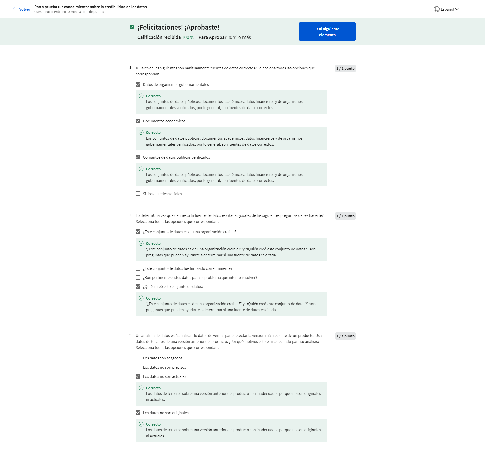

### Ética y privacidad de los datos

#### Introducción a la ética de datos

#### Repaso opcional: Alex: La importancia de la ética de datos

#### Introducción a la privacidad de datos

#### Anonimización de datos

#### Andrew: El uso ético de los datos

#### Cuestionario práctico: Pon a prueba tus conocimientos sobre la ética y la privacidad de los datos

### Comprensión de los datos abiertos

### Desafío semanal 2 curso 3

## Bases de datos: Donde se alojan los datos

## Organizar y proteger tus datos

## Opcional: Participar en la comunidad de datos

## Desafío del curso curso 3
