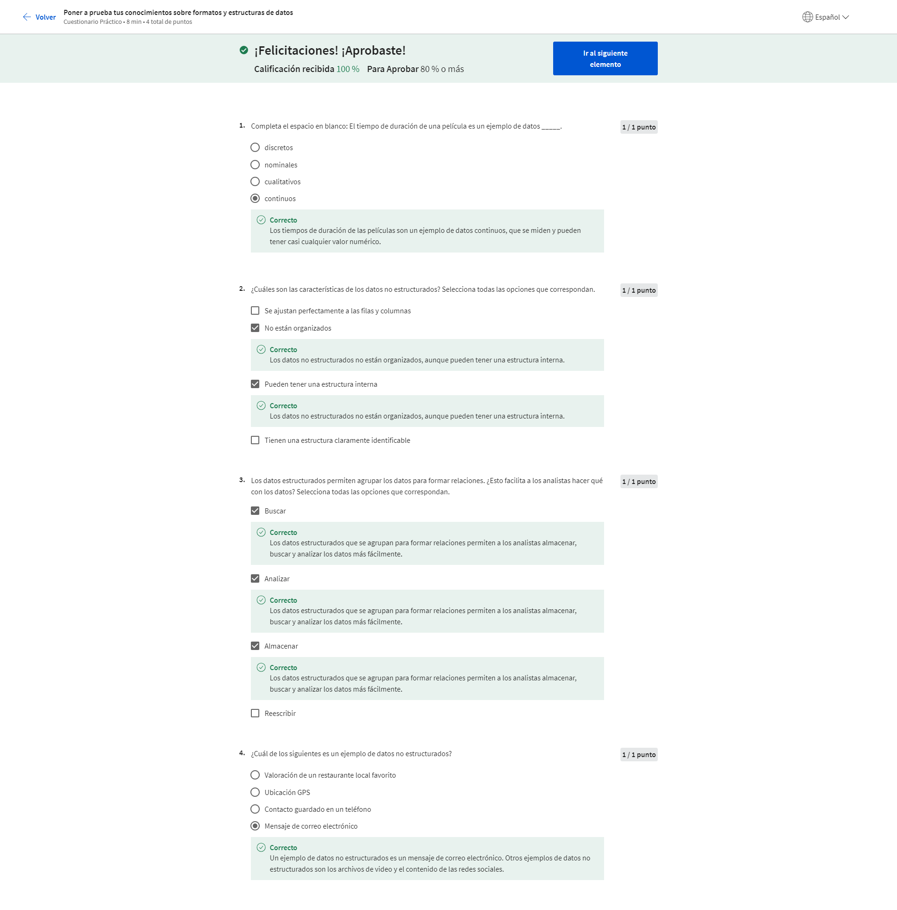

# Preparar datos para la exploración

## Tipos y estructuras de datos

### Exploración de datos

#### Introducción a la exploración de datos

Imagínate esto: Te encuentras trabajando en un proyecto. Ya has formulado todas las preguntas correctas, has aplicado el pensamiento estructurado y te encuentras en completa sincronización con los interesados. Estás listo para un gran comienzo. Pero existe otro paso en el proceso: preparar los datos correctamente. Aquí es donde hay que comprender los diferentes tipos de datos y las estructuras de datos. Al conocer esto, puedes imaginar qué tipo de datos son correctos para la pregunta que estás respondiendo. Además, adquirirás habilidades prácticas sobre cómo extraer, utilizar organizar y proteger los datos. Hola, mi nombre es Hallie y soy directora de análisis de datos en Google. Trabajo con empresas de la industria del cuidado de la salud. Es un gran gusto darte la bienvenida a este curso. Han estado trabajando en sus habilidades para el análisis de datos en diversas formas hasta ahora. Han aprendido cómo formular las preguntas correctas, definir el problema y presentar su análisis de modo tal que coincida con las necesidades de los interesados. En otras palabras, han aprendido a contar una historia utilizando datos.
Reproduce el video desde ::52 y sigue la transcripción0:52
Ahora van a aprender más acerca de los datos que necesitan para contar la mejor historia posible. Pero antes de eso, quiero contarles mi historia. Utilizo el análisis computacional de datos para ayudar a las empresas de salud a desarrollar soluciones de marketing digital que robustezcan a las empresas y a sus marcas comerciales. Mi equipo y yo buscamos empresas y oportunidades en los medios de comunicación basadas en las informaciones más recientes de la industria y los datos. He trabajado en el área de salud por unos cinco años y es maravilloso. Realmente disfruto de poder utilizar los datos para iniciar un cambio en una industria tan importante. Como descubrirás en este curso, los datos pueden ser el personaje principal en una historia muy poderosa. Realmente amo utilizar el análisis para contar la historia de un modo convincente e informativo.
Reproduce el video desde :1:33 y sigue la transcripción1:33
Aquí tenemos un ejemplo de la vida real sobre cómo he utilizado los datos para contar una historia. En mi trabajo, analizamos los datos de afiliación a Medicare a través del tiempo y realizamos conexiones sobre cómo las personas buscan los planes de Medicare en Google. Las personas de 65 años de edad o más se convierten en decisores informados en cuanto a su salud, entonces yo utilizo los datos para saber si existe un incremento en las afiliaciones a Medicare y qué rol juegan las búsquedas en Google si hay un incremento en la demanda. Es muy importante que me asegure de que los datos sean importantes y válidos. También hay que prestar atención a las preguntas acerca del acceso y equidad mientras se respeta la privacidad de los que realizan las búsquedas. El final feliz de mi historia es que los datos en mis hallazgos son útiles para los profesionales médicos y sus pacientes. Existen muchos datos útiles disponibles y estás desarrollando las habilidades necesarias para encontrar y utilizar los datos correctos de la mejor forma posible. En este curso, continuarás afinando esas habilidades. De modo que ya escuchaste mucho acerca de los pasos del proceso del análisis de datos: preguntar, preparar, procesar, analizar, compartir y actuar. Ahora, es momento de aprender cómo preparar los datos. Aprenderás a identificar cómo se generan y se recolectan los datos y explorarás diferentes formatos, tipos y estructuras de datos. Nos aseguraremos de que sepas cómo elegir y utilizar los datos que te ayudarán a comprender y responder a un problema empresarial. Y como no todos los datos satisfacen cada necesidad, aprenderás cómo analizar los datos para buscar el sesgo y la credibilidad. También exploraremos qué significa datos limpios. Pero espera, hay más. También tendrás un acercamiento personal a las bases de datos. Hablaremos sobre qué son y cómo las utilizan los analistas. Hasta podrás extraer tus propios datos de una base de datos utilizando un par de herramientas con las que ya estás familiarizado: hojas de cálculo y SQL.
Reproduce el video desde :3:7 y sigue la transcripción3:07
La clave aquí es la paciencia. Como todo lo que vale la pena hacer, esto toma tiempo y práctica. Y estaré contigo en cada paso del camino. ¿Me sigues? Excelente. Las últimas pocas cosas de las que hablaremos son las bases de la organización de datos y el proceso de protección de datos. Los datos funcionan mejor cuando están organizados. Y si estás organizando tus datos, querrás protegerlos. Te mostraré cómo hacer ambas cosas y aplicarlo a tu propio análisis. Me complace mucho ayudarte a escribir tu propia historia personal a medida que continuamos explorando el mundo del análisis computacional de datos. Así que, manos a la obra.

#### Hallie: Datos fascinantes

El cuidado de la salud es un área fascinante en los Estados Unidos. Es una industria realmente increíble para trabajar porque es tan tradicional históricamente y las empresas de salud, a diferencia de otras empresas de tecnología, no han utilizado realmente los datos para tomar decisiones basadas en la información. Cuando estaba en la universidad, tenía un profesor que no quería que tuviéramos libros de texto porque decía que la industria del cuidado de la salud cambiaba muy rápidamente y, por lo tanto, un libro de texto no tenía sentido ya que solo se trata de un texto estático mientras las cosas se encuentran en constante evolución. Así que diría que el cuidado de la salud, los datos y ambos juntos forman un concepto más novedoso utilizando macrodatos, utilizando aprendizaje automático e inteligencia artificial para ayudar a las industrias del cuidado de la salud. Comencé a analizar grandes cantidades de datos de pacientes. Fue la primera vez que realmente trabajé con conjuntos de datos tan enormes y encontré realmente fascinante que podamos tomar todos esos conjuntos de datos y sintetizarlos para realmente permitirnos obtener algunas informaciones y tendencias interesantes para nuestros sistemas hospitalarios. Fue la primera vez que comencé a pensar en el análisis de datos el análisis computacional de datos, como una posible carrera para mí. Ello fue lo que realmente me trajo hasta este puesto de directora del análisis de datos en Google donde pude aplicar mis conocimientos y conjunto de habilidades para analizar los conjuntos de datos a diario, de manera que cada conversación que mantuviera con el cliente fuera una conversación basada en datos concretos. Trabajo dentro de la vertical del cuidado de la salud. Tenemos empresas que utilizan comercialmente nuestras plataformas, tales como Google Search y YouTube. Las ayudamos a comprender la industria del cuidado de la salud, de modo que puedan llegar mejor, comercialmente hablando, al público que están intentando alcanzar. Cuando eres un asegurador de la industria de la salud o si eres un proveedor de servicios de salud, puede ser un sistema hospitalario, las necesidades son diferentes respecto de cómo llegar al público utilizando las plataformas de Google. Los ayudamos a optimizar su gasto en marketing, pero también realizamos mucha investigación en la industria del cuidado de la salud. Algo de investigación sobre el usuario, algo de comprensión sobre cómo realmente los usuarios están buscando en Google para darles un sondeo de lo que realmente está ocurriendo en la industria y cómo pueden ser más eficientes comercialmente. Diría que mis habilidades técnicas con el análisis computacional de datos se desarrolló con el tiempo. La habilidad más importante que encontré, que también llegó con el tiempo y fue creciendo conmigo, es justamente el lado creativo del análisis de datos. Quiero decir, se puede aprender realmente mucho de las habilidades de SQL y R y sé que algo de esto se incluye en el curso. Pero realmente, el lado creativo es algo que solo se consigue con la experiencia. Cuando observamos un conjunto de datos, podemos mirarlos de una manera y analizarlos de una manera y luego lo mira otra persona, o lo volvemos a mirar una semana después, y de pronto esa tendencia que estábamos observando es completamente diferente. Hay que tomar todas esas piezas de información, esos bocaditos, como me gusta llamarlos, y unirlos para formar una hermosa narración utilizando los datos. Esa habilidad es algo que he aprendido cuando trabajaba en consultoría. y, la he trasladado a Google, donde realmente pude pulir muchas de esas habilidades y algunas otras habilidades más técnicas. El costado técnico y creativo es el que he llegado a amar. Mi nombre es Hallie. Soy directora de análisis de datos en Google y trabajo específicamente con la vertical del sistema de salud.

#### Cuadro de aviso de la discusión: Queremos conocerte curso 3

Para esta sesión, considera las siguientes preguntas:

¿Qué tipo de detective de datos eres? 

¿Tiendes a plantear primero una gran pregunta? 

¿Prefieres hacer pequeñas preguntas y dejar que te lleven a la gran pregunta?

#### Cuestionario práctico: ¿Conoces el análisis computacional de datos?

### Recopilar datos

#### Recopilar datos en nuestro mundo

Justo ahora se están generando datos en todo el mundo y hablamos de toneladas de datos. Cada minuto de cada día millones de textos son enviados y cientos de millones de correos electrónicos. Además de eso, se realizan millones de búsquedas en línea y se miran millones de videos y esos números van en aumento. Son muchos datos. Aprendamos más acerca de cómo se hacen y se utilizan. En este video, hablaremos sobre las formas en que los datos pueden generarse y cómo las industrias recopilan datos por su propia cuenta. Cada pieza de información es un dato. Todos los datos se generan usualmente como resultado de nuestra actividad en el mundo. Hoy en día, pasamos mucho tiempo en línea. Con las redes sociales y los dispositivos móviles millones y millones de personas están agregando enormes cantidades de datos todos y cada uno de los días. Piénsalo así. Cada foto digital en línea es una pieza de información. Cada foto en sí misma contiene todavía más datos, desde la cantidad de píxeles hasta los colores que contiene cada uno de esos píxeles. Pero ese no es el único modo en que se generan los datos. También se pueden generar datos al recolectar información. Esta generación de datos y su recolección traen aparejadas algunas cosas más en que pensar. Necesita ser realizado teniendo en cuenta la ética, de modo de mantener los derechos y la privacidad de las personas. Aprenderemos más al respecto más adelante. Por ahora, veamos un ejemplo del mundo real. La Oficina del Censo de los Estados Unidos utiliza formularios para recolectar datos acerca de la población del país. Estos datos son utilizados por distintas razones, como financiar escuelas, hospitales y cuarteles de bomberos. La Oficina también recolecta información sobre otras cosas como las empresas estadounidenses, y crean sus propios datos en el proceso. Lo mejor acerca de esto es que otros pueden utilizar los datos para sus propias necesidades, incluyendo el análisis. La encuesta anual de empresas se utiliza para conocer las necesidades de las empresas y cómo brindarles los recursos necesarios para ayudarlas a tener éxito. En realidad, yo genero datos en el análisis computacional de datos que realizo para la industria de cuidado de la salud. Realizamos muchas encuestas para conocer cómo los pacientes se sienten acerca de ciertas cosas relacionadas con el cuidado de su salud. Por ejemplo, una encuesta les preguntó a los pacientes cómo se sentían acerca de la telemedicina comparada con las visitas en persona al médico. Los datos recolectados ayudaron a las empresas con las que trabajamos a que mejorasen el cuidado que reciben los pacientes. Los datos de la encuesta son solo un ejemplo. Existen todo tipos de datos que se generan todo el tiempo, y existen muchos modos diferentes de recolectarlos. Incluso algo tan simple como una entrevista puede ayudar a alguien a recolectar datos. Imagínate que estás en una entrevista de trabajo. Para impresionar al gerente de contrataciones, quieres compartir información acerca de ti mismo. El gerente de contrataciones recolecta los datos y los analiza para que lo ayuden a decidir si te contratará o no. Es un camino de ida y vuelta. Tú también recolectas tus propios datos acerca de la empresa para que te ayude a decidir si es la empresa que mejor se adapta a tus necesidades. O puedes utilizar los datos recolectados para pensar preguntas más profundas que desees hacerle al entrevistador. Los científicos también generan datos. Utilizan muchas observaciones en su trabajo. Por ejemplo, pueden recolectar datos al estudiar el comportamiento animal u observando bacterias bajo el microscopio. Antes hablamos de los formularios que la Oficina del Censo de los Estados Unidos utiliza para recolectar datos. Formularios, cuestionarios y encuestas son formas usuales de recolectar y generar datos. Una cosa para destacar: los datos que son generados en línea no siempre ocurren directamente. ¿Alguna vez se han preguntado por qué algunos avisos en línea parecen realizar sugerencias realmente precisas o cómo algunos sitios web recuerdan tus preferencias? Esto se realiza utilizando cookies, que son pequeños archivos guardados en computadoras que contienen información de los usuarios. Las cookies pueden ayudar a informar a los publicitarios acerca de sus intereses personales y sus hábitos basándose en la navegación en línea, sin identificarlos personalmente. Como analista del mundo real, tienes todo tipo de datos justo en la punta de los dedos y son realmente abundantes. Saber cómo se han generado puede ayudar a agregar contexto a los datos, y saber cómo recopilarlos puede hacer que el proceso de análisis de datos sea más eficiente. A continuación, aprenderás cómo decidir qué datos recolectar para tu análisis. Mantente atento.

#### Determinar qué datos recoger

Es bueno verte de nuevo. Hemos hablado mucho acerca de los datos que existen en el mundo. Pero como analista de datos, deberás decidir qué tipos de datos recolectar y utilizar para cada proyecto. Con casi una cantidad infinita de datos disponibles, esto puede ser un dilema de datos, pero hay buenas noticias. En este video aprenderás qué factores considerar al recolectar datos. Usualmente, tendrás una ventaja al buscar los datos correctos para el trabajo porque los datos que necesitas te serán dados o tu problema o tarea empresarial hará que tus opciones se reduzcan. Comencemos con una pregunta como ¿qué está causando mayor caudal de vehículos en la hora pico en tu ciudad? Primero, debes saber cómo se recolectan los datos. Debes utilizar sus observaciones acerca de los patrones de tráfico para contar la cantidad de autos en las calles de la ciudad durante horas determinadas. Notas que los automóviles se quedan atascados en una calle específica. Esto nos lleva al origen de los datos. En nuestro ejemplo sobre el tráfico, tus observaciones pueden ser datos de primera fuente. Estos datos son recolectados por una persona o por un grupo por medio de sus propios recursos. Recopilar datos de primera fuente es típicamente el método de preferencia porque sabes exactamente de dónde provienen. También puede haber datos de segunda fuente, que son datos recolectados por un grupo directamente de su público y que, luego, se venden. En nuestro ejemplo, si no puedes recopilar tus propios datos, puedes comprarlos de alguna organización que haya realizado estudios de patrones de tráfico en tu ciudad. Estos datos no comenzaron contigo, pero aun así son confiables porque provienen de una fuente que tiene experiencia en análisis de tráfico. No se puede decir siempre eso de datos de terceros o datos recolectados de fuentes externas que no los recopilaron directamente. Estos datos pueden provenir de un amplio número de fuentes diferentes antes de que los investigues. Pueden no ser tan confiables, pero no quiere decir que no puedan ser útiles. Quieres asegurarte de controlar su su precisión, sesgo y credibilidad. En realidad, no importa qué tipo de datos utilices, deben ser controlados respecto de la precisión y confiabilidad. Aprenderemos más sobre este proceso más tarde. Por ahora, solo recuerda que los datos que elijas deben aplicarse a tus necesidades y deben estar aprobados para su uso. Como analista de datos, es tu trabajo decidir qué datos utilizar y eso significa elegir los datos que puedan ayudarte a encontrar las respuestas que buscas y resolver los problemas sin distraerte con otros datos. En nuestro ejemplo sobre el tráfico, los datos financieros probablemente no serían tan útiles, pero los datos existentes acerca de los horarios de alto volumen de tráfico pueden serlo. Muy bien. Ahora hablemos acerca de cuántos datos hay que recopilar. En el análisis computacional de datos, una población se refiere a todos los valores de datos posibles en un cierto conjunto de datos. Si estás analizando datos acerca del tráfico vehicular en una ciudad, tu población sería todos los automóviles en esa área. Pero recopilar datos de toda la población puede ser un gran desafío. Por eso una muestra puede ser útil. Una muestra es una parte de la población que es representativa de la población. Puedes recopilar una muestra de datos acerca de un lugar en la ciudad y analizar el tráfico en ese lugar, o puedes extraer una muestra al azar de todos los datos existentes en la población. La forma de elegir la muestra dependerá de tu proyecto. Cuando recopiles los datos, también querrás asegurarte de elegir el tipo correcto de datos. Para los datos sobre tráfico, el tipo de datos adecuados podrían ser los datos de registro de tráfico archivados en formato de fecha. Las fechas te pueden ayudar a ver qué días de la semana hay más posibilidades de un mayor volumen de tráfico en el futuro. Exploraremos este tema en mayor detalle pronto. Para finalizar, debes determinar lo siguiente: el marco temporal para la recopilación de datos. En nuestro ejemplo, si necesitas una respuesta inmediata, debes utilizar los datos históricos, es decir datos preexistentes. Pero digamos que debes rastrear los patrones de tráfico en un período de tiempo extenso. Esto puede afectar las otras decisiones que tomes durante la recolección de datos. Ahora sabes más sobre las diferentes consideraciones sobre la recopilación de datos que utilizarás como analistas de datos, Debido a ello, podrás encontrar los datos correctos cuando comiences a recopilarlos por ti mismo. Y todavía hay más para aprender acerca de la recopilación de datos, así que mantente en sintonía.

#### Seleccionar los datos adecuados

#### Cuestionario práctico: Pon a prueba tus conocimientos sobre la recopilación de datos

### Diferenciar entre formatos y estructuras de datos

#### Descubrir los formatos de datos

No sé qué te sucede a ti, pero cuando estoy eligiendo una película para ver, algunas veces me quedo frenada entre un par de películas posibles. Si estoy de humor para emoción o suspenso puede ser que elija una de misterio y suspenso, pero si me quiero reír con ganas, elegiré una comedia. Cuando no puedo decidirme entre dos películas, hasta puedo utilizar algunas de mis habilidades de análisis de datos y así compararlas o contrastarlas. Piensa en ello, que realmente necesitamos más películas sobre analistas de datos. La miraría, pero como no disponemos de películas acerca de los datos, al menos no todavía, haremos algo mucho mejor: ¡miraremos los datos acerca de las películas! Vamos a observar esta hoja de cálculo con datos sobre películas. Sabemos que podemos comparar diferentes películas y géneros. Y resulta que podemos hacer lo mismo con datos y formatos de datos. Usemos la hoja de cálculo con datos de películas para comprender cómo funciona. Comenzaremos con los datos tanto cuantitativos como cualitativos, Si miramos la columna A, encontraremos los títulos de las películas. Estos datos son cualitativos porque se pueden contar, medir o expresarse fácilmente con números. Los datos cualitativos son colocados normalmente en listados como un nombre, una categoría o una descripción. En nuestra hoja de cálculo, los títulos de las películas y los miembros del elenco son datos cualitativos. A continuación vemos los datos cuantitativos, que pueden medirse o contarse y luego expresarse como un número. Este dato cuenta con una cierta cantidad, monto o rango. En nuestra hoja de cálculo aquí, las dos últimas columnas muestran el presupuesto de las películas y la recaudación de taquilla. Los datos en estas columnas se expresan en dólares, que pueden contarse, de modo que sabemos que es un dato cuantitativo. Podemos profundizar en los datos cuantitativos y desglosarlos en datos discretos o continuos. Veamos primero los datos discretos. Estos son datos que se cuentan y tienen una cantidad de valores limitada. Volviendo a la hoja de cálculo, veremos el presupuesto de cada película y la recaudación de taquilla en las columnas M y N. Estos son dos ejemplos de que los datos discretos pueden ser contados y tienen una cantidad de valores limitada. Por ejemplo, la cantidad de dinero que puede recaudar una película puede ser solo representada con exactamente dos dígitos después del decimal para representar los centavos. No puede haber nada entre uno y dos centavos. Los datos continuos pueden medirse utilizando un cronómetro y su valor se puede mostrar como un decimal con varias posiciones. Imaginemos una película sobre analistas de datos de la que seré la protagonista definitivamente algún día. Podemos expresar que la película dura 110.0356 minutos. Hasta se podrían agregar datos fraccionarios luego de la coma del decimal de ser necesario. También existen datos nominales y ordinales. Los datos nominales son un tipo de datos cualitativos que se categorizan sin ningún orden establecido. En otras palabras, estos datos no tienen una secuencia. Aquí va un ejemplo rápido. Digamos que estás reuniendo datos sobre películas. Le preguntas a la gente si han visto una determinada película. Sus respuestas irían en el formulario de datos nominales. Pueden responder "sí", "no" o "no estoy seguro". Estas opciones no tienen un orden en particular. Por otro lado, los datos ordinales son un conjunto de datos cualitativos con un orden o escala preestablecidos. Si le preguntan a un grupo de gente que califiquen la película del 1 a 5 algunos la calificarán con 2, otros con 4 y así. Estas calificaciones indican cuánto le gustó la película a cada persona. Ahora, hablemos de los datos internos. que son los datos que viven dentro de los propios sistemas de una empresa. Por ejemplo, si un estudio cinematográfico ha compilado todos los datos en la hoja de cálculo utilizando su propio método de recolección, entonces serían sus datos internos. Lo importante de los datos internos es que por lo general son más confiables y fáciles de recolectar, pero en esta hoja de cálculo hay más posibilidades de que el estudio cinematográfico deba utilizar datos propios o compartidos por otros estudios y fuentes porque incluyen películas que ellos no han filmado. Esto significa que estarían recolectando datos externos. Los datos externos son, ya lo adivinaron, datos alojados y generados fuera de una organización. Los datos externos se tornan especialmente valiosos cuando tus análisis dependen de todas las fuentes disponibles posibles. Algo importante acerca de estos datos es que son estructurados. Los datos estructurados son datos que se organizan en un formato determinado, como filas y columnas. Las hojas de cálculo y las bases de datos relacionales son dos ejemplos de software que pueden almacenar datos de modo estructurado. Podrás recordar nuestra exploración anterior sobre el pensamiento estructurado, que colabora sumando un framework al problema de modo que puede resolverse de modo organizado y lógico. Puedes pensar en los datos estructurados del mismo modo. Con un framework para los datos, los datos son fácilmente rastreables y están más preparados para el análisis. Como analista de datos, trabajarás con muchos datos estructurados, que usualmente vendrán en forma de tabla, hoja de cálculo o base de datos relacional, pero a veces te encontrarás con datos no estructurados. Estos datos no están organizados de una forma fácilmente identificable. Los archivos de audio y video son ejemplos de datos no estructurados porque no hay un modo claro para identificar y organizar el contenido. Los datos no estructurados pueden contar con una estructura interna, pero los datos no se ubican prolijamente en filas y columnas como los datos estructurados. ¡Ahí lo tienes! Espero que ahora estés más familiarizado con los formatos de datos y cómo puedes usarlos en tu trabajo. En breve, continuarás explorando los datos estructurados y aprenderás aún más de los datos que utilizarás más frecuentemente como analista. Próximamente en el cine más cercano a ti.

#### Los formatos de datos en la práctica

#### Cuestionario práctico: Autorreflexionar: Datos no estructurados

<https://quickdraw.withgoogle.com/data/cloud>

#### Entender los datos estructurados

¡Qué bueno volver a verte! Anteriormente, comparamos algunos formatos de datos, incluyendo datos estructurados y datos no estructurados. La mayoría de los datos que se están generando ahora mismo son en realidad no estructurados. Archivos de audio, video, correos electrónicos, fotografías y redes sociales son todos ejemplos de datos no estructurados. Esto puede ser difícil de analizar en su formato no estructurado. Pero hay buenas noticias: vas a trabajar con datos estructurados la mayor parte del tiempo. Por ejemplo, si necesitas analizar datos de los datos no estructurados en correos electrónicos, fotografías y sitios de redes sociales, estarán seguramente estructurados para su análisis aun antes de que llegues a ellos. Debido a eso, quisiera explorar un poco más los datos estructurados. Como un repaso rápido, los datos estructurados son datos organizados en un formato de filas y columnas. Pero definitivamente no se limitan a eso. Los datos estructurados trabajan muy bien dentro de un modelo de datos, que es un modelo utilizado para organizar los elementos de datos y la forma en que se relacionan entre ellos. ¿Qué son los elementos de datos? Son piezas de información, tales como nombres de personas, números de cuentas y direcciones. Los modelos de datos contribuyen a mantener la coherencia de los datos y brindan un mapa de cómo se organizan esos datos. Esto hace que sea más fácil para los analistas y otros interesados encontrar sentido a sus datos y utilizarlos con propósitos empresariales. Además de trabajar bien con modelos de datos, los datos estructurados también son útiles para las bases de datos. Esto facilita la tarea de los analistas de ingresar, consultar y analizar los datos dondequiera que lo necesiten. También contribuye a la visualización de los datos en forma más sencilla, ya que los datos estructurados pueden aplicarse directamente a las tablas, los gráficos, mapas térmicos, paneles y la mayoría de las representaciones visuales de los datos. Entonces bien, sabemos que las hojas de cálculo y las bases de datos que almacenan los conjuntos de datos son fuentes frecuentes de datos estructurados. Luego de explorar otras estructuras de datos, observarás más tipos de datos utilizando una hoja de cálculo. ¡La aventura continúa!

#### La estructura de los datos

#### Niveles y técnicas de modelado de datos

<https://www.1keydata.com/datawarehousing/data-modeling-levels.html>

<https://dataedo.com/blog/basic-data-modeling-techniques>

#### Cuestionario práctico: Poner a prueba tus conocimientos sobre formatos y estructuras de datos

### Explorar los tipos de datos, campos y valores

Vídeo: VídeoConocer el tipo de datos con el que trabajas
Lectura: LecturaEntender la lógica booleana
Vídeo: VídeoComponentes de la tabla de datos
Cuestionario práctico: Actividad práctica: Aplicación de una función
Vídeo: VídeoConocer los datos en formato ancho y largo
Lectura: LecturaTransformación de datos
Cuestionario práctico: Actividad práctica: Introducción a Kaggle
Cuestionario práctico: Pon a prueba tus conocimientos sobre tipos de datos, campos y valores

### Desafío semanal 1 curso 3

## Sesgo, credibilidad, privacidad, ética y acceso

## Bases de datos: Donde se alojan los datos

## Organizar y proteger tus datos

## Opcional: Participar en la comunidad de datos

## Desafío del curso curso 3
