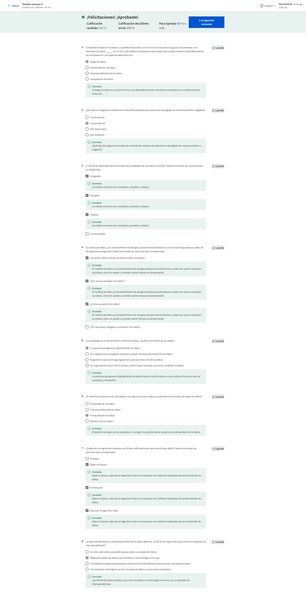
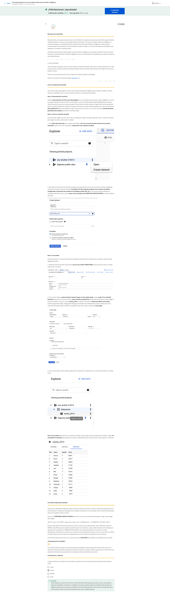
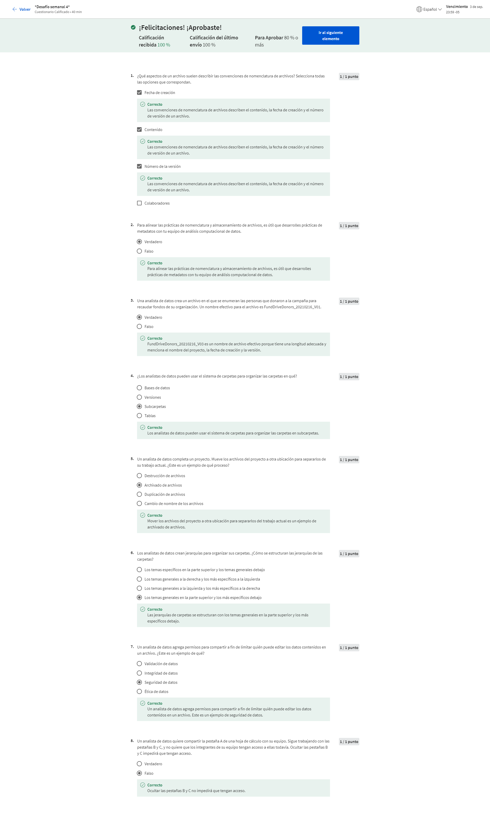

# Preparar datos para la exploración

## Tipos y estructuras de datos

### Exploración de datos

#### Introducción a la exploración de datos

Imagínate esto: Te encuentras trabajando en un proyecto. Ya has formulado todas las preguntas correctas, has aplicado el pensamiento estructurado y te encuentras en completa sincronización con los interesados. Estás listo para un gran comienzo. Pero existe otro paso en el proceso: preparar los datos correctamente. Aquí es donde hay que comprender los diferentes tipos de datos y las estructuras de datos. Al conocer esto, puedes imaginar qué tipo de datos son correctos para la pregunta que estás respondiendo. Además, adquirirás habilidades prácticas sobre cómo extraer, utilizar organizar y proteger los datos. Hola, mi nombre es Hallie y soy directora de análisis de datos en Google. Trabajo con empresas de la industria del cuidado de la salud. Es un gran gusto darte la bienvenida a este curso. Han estado trabajando en sus habilidades para el análisis de datos en diversas formas hasta ahora. Han aprendido cómo formular las preguntas correctas, definir el problema y presentar su análisis de modo tal que coincida con las necesidades de los interesados. En otras palabras, han aprendido a contar una historia utilizando datos.
Reproduce el video desde ::52 y sigue la transcripción0:52
Ahora van a aprender más acerca de los datos que necesitan para contar la mejor historia posible. Pero antes de eso, quiero contarles mi historia. Utilizo el análisis computacional de datos para ayudar a las empresas de salud a desarrollar soluciones de marketing digital que robustezcan a las empresas y a sus marcas comerciales. Mi equipo y yo buscamos empresas y oportunidades en los medios de comunicación basadas en las informaciones más recientes de la industria y los datos. He trabajado en el área de salud por unos cinco años y es maravilloso. Realmente disfruto de poder utilizar los datos para iniciar un cambio en una industria tan importante. Como descubrirás en este curso, los datos pueden ser el personaje principal en una historia muy poderosa. Realmente amo utilizar el análisis para contar la historia de un modo convincente e informativo.
Reproduce el video desde :1:33 y sigue la transcripción1:33
Aquí tenemos un ejemplo de la vida real sobre cómo he utilizado los datos para contar una historia. En mi trabajo, analizamos los datos de afiliación a Medicare a través del tiempo y realizamos conexiones sobre cómo las personas buscan los planes de Medicare en Google. Las personas de 65 años de edad o más se convierten en decisores informados en cuanto a su salud, entonces yo utilizo los datos para saber si existe un incremento en las afiliaciones a Medicare y qué rol juegan las búsquedas en Google si hay un incremento en la demanda. Es muy importante que me asegure de que los datos sean importantes y válidos. También hay que prestar atención a las preguntas acerca del acceso y equidad mientras se respeta la privacidad de los que realizan las búsquedas. El final feliz de mi historia es que los datos en mis hallazgos son útiles para los profesionales médicos y sus pacientes. Existen muchos datos útiles disponibles y estás desarrollando las habilidades necesarias para encontrar y utilizar los datos correctos de la mejor forma posible. En este curso, continuarás afinando esas habilidades. De modo que ya escuchaste mucho acerca de los pasos del proceso del análisis de datos: preguntar, preparar, procesar, analizar, compartir y actuar. Ahora, es momento de aprender cómo preparar los datos. Aprenderás a identificar cómo se generan y se recolectan los datos y explorarás diferentes formatos, tipos y estructuras de datos. Nos aseguraremos de que sepas cómo elegir y utilizar los datos que te ayudarán a comprender y responder a un problema empresarial. Y como no todos los datos satisfacen cada necesidad, aprenderás cómo analizar los datos para buscar el sesgo y la credibilidad. También exploraremos qué significa datos limpios. Pero espera, hay más. También tendrás un acercamiento personal a las bases de datos. Hablaremos sobre qué son y cómo las utilizan los analistas. Hasta podrás extraer tus propios datos de una base de datos utilizando un par de herramientas con las que ya estás familiarizado: hojas de cálculo y SQL.
Reproduce el video desde :3:7 y sigue la transcripción3:07
La clave aquí es la paciencia. Como todo lo que vale la pena hacer, esto toma tiempo y práctica. Y estaré contigo en cada paso del camino. ¿Me sigues? Excelente. Las últimas pocas cosas de las que hablaremos son las bases de la organización de datos y el proceso de protección de datos. Los datos funcionan mejor cuando están organizados. Y si estás organizando tus datos, querrás protegerlos. Te mostraré cómo hacer ambas cosas y aplicarlo a tu propio análisis. Me complace mucho ayudarte a escribir tu propia historia personal a medida que continuamos explorando el mundo del análisis computacional de datos. Así que, manos a la obra.

#### Hallie: Datos fascinantes

El cuidado de la salud es un área fascinante en los Estados Unidos. Es una industria realmente increíble para trabajar porque es tan tradicional históricamente y las empresas de salud, a diferencia de otras empresas de tecnología, no han utilizado realmente los datos para tomar decisiones basadas en la información. Cuando estaba en la universidad, tenía un profesor que no quería que tuviéramos libros de texto porque decía que la industria del cuidado de la salud cambiaba muy rápidamente y, por lo tanto, un libro de texto no tenía sentido ya que solo se trata de un texto estático mientras las cosas se encuentran en constante evolución. Así que diría que el cuidado de la salud, los datos y ambos juntos forman un concepto más novedoso utilizando macrodatos, utilizando aprendizaje automático e inteligencia artificial para ayudar a las industrias del cuidado de la salud. Comencé a analizar grandes cantidades de datos de pacientes. Fue la primera vez que realmente trabajé con conjuntos de datos tan enormes y encontré realmente fascinante que podamos tomar todos esos conjuntos de datos y sintetizarlos para realmente permitirnos obtener algunas informaciones y tendencias interesantes para nuestros sistemas hospitalarios. Fue la primera vez que comencé a pensar en el análisis de datos el análisis computacional de datos, como una posible carrera para mí. Ello fue lo que realmente me trajo hasta este puesto de directora del análisis de datos en Google donde pude aplicar mis conocimientos y conjunto de habilidades para analizar los conjuntos de datos a diario, de manera que cada conversación que mantuviera con el cliente fuera una conversación basada en datos concretos. Trabajo dentro de la vertical del cuidado de la salud. Tenemos empresas que utilizan comercialmente nuestras plataformas, tales como Google Search y YouTube. Las ayudamos a comprender la industria del cuidado de la salud, de modo que puedan llegar mejor, comercialmente hablando, al público que están intentando alcanzar. Cuando eres un asegurador de la industria de la salud o si eres un proveedor de servicios de salud, puede ser un sistema hospitalario, las necesidades son diferentes respecto de cómo llegar al público utilizando las plataformas de Google. Los ayudamos a optimizar su gasto en marketing, pero también realizamos mucha investigación en la industria del cuidado de la salud. Algo de investigación sobre el usuario, algo de comprensión sobre cómo realmente los usuarios están buscando en Google para darles un sondeo de lo que realmente está ocurriendo en la industria y cómo pueden ser más eficientes comercialmente. Diría que mis habilidades técnicas con el análisis computacional de datos se desarrolló con el tiempo. La habilidad más importante que encontré, que también llegó con el tiempo y fue creciendo conmigo, es justamente el lado creativo del análisis de datos. Quiero decir, se puede aprender realmente mucho de las habilidades de SQL y R y sé que algo de esto se incluye en el curso. Pero realmente, el lado creativo es algo que solo se consigue con la experiencia. Cuando observamos un conjunto de datos, podemos mirarlos de una manera y analizarlos de una manera y luego lo mira otra persona, o lo volvemos a mirar una semana después, y de pronto esa tendencia que estábamos observando es completamente diferente. Hay que tomar todas esas piezas de información, esos bocaditos, como me gusta llamarlos, y unirlos para formar una hermosa narración utilizando los datos. Esa habilidad es algo que he aprendido cuando trabajaba en consultoría. y, la he trasladado a Google, donde realmente pude pulir muchas de esas habilidades y algunas otras habilidades más técnicas. El costado técnico y creativo es el que he llegado a amar. Mi nombre es Hallie. Soy directora de análisis de datos en Google y trabajo específicamente con la vertical del sistema de salud.

#### Cuadro de aviso de la discusión: Queremos conocerte curso 3

Para esta sesión, considera las siguientes preguntas:

¿Qué tipo de detective de datos eres? 

¿Tiendes a plantear primero una gran pregunta? 

¿Prefieres hacer pequeñas preguntas y dejar que te lleven a la gran pregunta?

#### Cuestionario práctico: ¿Conoces el análisis computacional de datos?

### Recopilar datos

#### Recopilar datos en nuestro mundo

Justo ahora se están generando datos en todo el mundo y hablamos de toneladas de datos. Cada minuto de cada día millones de textos son enviados y cientos de millones de correos electrónicos. Además de eso, se realizan millones de búsquedas en línea y se miran millones de videos y esos números van en aumento. Son muchos datos. Aprendamos más acerca de cómo se hacen y se utilizan. En este video, hablaremos sobre las formas en que los datos pueden generarse y cómo las industrias recopilan datos por su propia cuenta. Cada pieza de información es un dato. Todos los datos se generan usualmente como resultado de nuestra actividad en el mundo. Hoy en día, pasamos mucho tiempo en línea. Con las redes sociales y los dispositivos móviles millones y millones de personas están agregando enormes cantidades de datos todos y cada uno de los días. Piénsalo así. Cada foto digital en línea es una pieza de información. Cada foto en sí misma contiene todavía más datos, desde la cantidad de píxeles hasta los colores que contiene cada uno de esos píxeles. Pero ese no es el único modo en que se generan los datos. También se pueden generar datos al recolectar información. Esta generación de datos y su recolección traen aparejadas algunas cosas más en que pensar. Necesita ser realizado teniendo en cuenta la ética, de modo de mantener los derechos y la privacidad de las personas. Aprenderemos más al respecto más adelante. Por ahora, veamos un ejemplo del mundo real. La Oficina del Censo de los Estados Unidos utiliza formularios para recolectar datos acerca de la población del país. Estos datos son utilizados por distintas razones, como financiar escuelas, hospitales y cuarteles de bomberos. La Oficina también recolecta información sobre otras cosas como las empresas estadounidenses, y crean sus propios datos en el proceso. Lo mejor acerca de esto es que otros pueden utilizar los datos para sus propias necesidades, incluyendo el análisis. La encuesta anual de empresas se utiliza para conocer las necesidades de las empresas y cómo brindarles los recursos necesarios para ayudarlas a tener éxito. En realidad, yo genero datos en el análisis computacional de datos que realizo para la industria de cuidado de la salud. Realizamos muchas encuestas para conocer cómo los pacientes se sienten acerca de ciertas cosas relacionadas con el cuidado de su salud. Por ejemplo, una encuesta les preguntó a los pacientes cómo se sentían acerca de la telemedicina comparada con las visitas en persona al médico. Los datos recolectados ayudaron a las empresas con las que trabajamos a que mejorasen el cuidado que reciben los pacientes. Los datos de la encuesta son solo un ejemplo. Existen todo tipos de datos que se generan todo el tiempo, y existen muchos modos diferentes de recolectarlos. Incluso algo tan simple como una entrevista puede ayudar a alguien a recolectar datos. Imagínate que estás en una entrevista de trabajo. Para impresionar al gerente de contrataciones, quieres compartir información acerca de ti mismo. El gerente de contrataciones recolecta los datos y los analiza para que lo ayuden a decidir si te contratará o no. Es un camino de ida y vuelta. Tú también recolectas tus propios datos acerca de la empresa para que te ayude a decidir si es la empresa que mejor se adapta a tus necesidades. O puedes utilizar los datos recolectados para pensar preguntas más profundas que desees hacerle al entrevistador. Los científicos también generan datos. Utilizan muchas observaciones en su trabajo. Por ejemplo, pueden recolectar datos al estudiar el comportamiento animal u observando bacterias bajo el microscopio. Antes hablamos de los formularios que la Oficina del Censo de los Estados Unidos utiliza para recolectar datos. Formularios, cuestionarios y encuestas son formas usuales de recolectar y generar datos. Una cosa para destacar: los datos que son generados en línea no siempre ocurren directamente. ¿Alguna vez se han preguntado por qué algunos avisos en línea parecen realizar sugerencias realmente precisas o cómo algunos sitios web recuerdan tus preferencias? Esto se realiza utilizando cookies, que son pequeños archivos guardados en computadoras que contienen información de los usuarios. Las cookies pueden ayudar a informar a los publicitarios acerca de sus intereses personales y sus hábitos basándose en la navegación en línea, sin identificarlos personalmente. Como analista del mundo real, tienes todo tipo de datos justo en la punta de los dedos y son realmente abundantes. Saber cómo se han generado puede ayudar a agregar contexto a los datos, y saber cómo recopilarlos puede hacer que el proceso de análisis de datos sea más eficiente. A continuación, aprenderás cómo decidir qué datos recolectar para tu análisis. Mantente atento.

#### Determinar qué datos recoger

Es bueno verte de nuevo. Hemos hablado mucho acerca de los datos que existen en el mundo. Pero como analista de datos, deberás decidir qué tipos de datos recolectar y utilizar para cada proyecto. Con casi una cantidad infinita de datos disponibles, esto puede ser un dilema de datos, pero hay buenas noticias. En este video aprenderás qué factores considerar al recolectar datos. Usualmente, tendrás una ventaja al buscar los datos correctos para el trabajo porque los datos que necesitas te serán dados o tu problema o tarea empresarial hará que tus opciones se reduzcan. Comencemos con una pregunta como ¿qué está causando mayor caudal de vehículos en la hora pico en tu ciudad? Primero, debes saber cómo se recolectan los datos. Debes utilizar sus observaciones acerca de los patrones de tráfico para contar la cantidad de autos en las calles de la ciudad durante horas determinadas. Notas que los automóviles se quedan atascados en una calle específica. Esto nos lleva al origen de los datos. En nuestro ejemplo sobre el tráfico, tus observaciones pueden ser datos de primera fuente. Estos datos son recolectados por una persona o por un grupo por medio de sus propios recursos. Recopilar datos de primera fuente es típicamente el método de preferencia porque sabes exactamente de dónde provienen. También puede haber datos de segunda fuente, que son datos recolectados por un grupo directamente de su público y que, luego, se venden. En nuestro ejemplo, si no puedes recopilar tus propios datos, puedes comprarlos de alguna organización que haya realizado estudios de patrones de tráfico en tu ciudad. Estos datos no comenzaron contigo, pero aun así son confiables porque provienen de una fuente que tiene experiencia en análisis de tráfico. No se puede decir siempre eso de datos de terceros o datos recolectados de fuentes externas que no los recopilaron directamente. Estos datos pueden provenir de un amplio número de fuentes diferentes antes de que los investigues. Pueden no ser tan confiables, pero no quiere decir que no puedan ser útiles. Quieres asegurarte de controlar su su precisión, sesgo y credibilidad. En realidad, no importa qué tipo de datos utilices, deben ser controlados respecto de la precisión y confiabilidad. Aprenderemos más sobre este proceso más tarde. Por ahora, solo recuerda que los datos que elijas deben aplicarse a tus necesidades y deben estar aprobados para su uso. Como analista de datos, es tu trabajo decidir qué datos utilizar y eso significa elegir los datos que puedan ayudarte a encontrar las respuestas que buscas y resolver los problemas sin distraerte con otros datos. En nuestro ejemplo sobre el tráfico, los datos financieros probablemente no serían tan útiles, pero los datos existentes acerca de los horarios de alto volumen de tráfico pueden serlo. Muy bien. Ahora hablemos acerca de cuántos datos hay que recopilar. En el análisis computacional de datos, una población se refiere a todos los valores de datos posibles en un cierto conjunto de datos. Si estás analizando datos acerca del tráfico vehicular en una ciudad, tu población sería todos los automóviles en esa área. Pero recopilar datos de toda la población puede ser un gran desafío. Por eso una muestra puede ser útil. Una muestra es una parte de la población que es representativa de la población. Puedes recopilar una muestra de datos acerca de un lugar en la ciudad y analizar el tráfico en ese lugar, o puedes extraer una muestra al azar de todos los datos existentes en la población. La forma de elegir la muestra dependerá de tu proyecto. Cuando recopiles los datos, también querrás asegurarte de elegir el tipo correcto de datos. Para los datos sobre tráfico, el tipo de datos adecuados podrían ser los datos de registro de tráfico archivados en formato de fecha. Las fechas te pueden ayudar a ver qué días de la semana hay más posibilidades de un mayor volumen de tráfico en el futuro. Exploraremos este tema en mayor detalle pronto. Para finalizar, debes determinar lo siguiente: el marco temporal para la recopilación de datos. En nuestro ejemplo, si necesitas una respuesta inmediata, debes utilizar los datos históricos, es decir datos preexistentes. Pero digamos que debes rastrear los patrones de tráfico en un período de tiempo extenso. Esto puede afectar las otras decisiones que tomes durante la recolección de datos. Ahora sabes más sobre las diferentes consideraciones sobre la recopilación de datos que utilizarás como analistas de datos, Debido a ello, podrás encontrar los datos correctos cuando comiences a recopilarlos por ti mismo. Y todavía hay más para aprender acerca de la recopilación de datos, así que mantente en sintonía.

#### Seleccionar los datos adecuados

#### Cuestionario práctico: Pon a prueba tus conocimientos sobre la recopilación de datos

### Diferenciar entre formatos y estructuras de datos

#### Descubrir los formatos de datos

No sé qué te sucede a ti, pero cuando estoy eligiendo una película para ver, algunas veces me quedo frenada entre un par de películas posibles. Si estoy de humor para emoción o suspenso puede ser que elija una de misterio y suspenso, pero si me quiero reír con ganas, elegiré una comedia. Cuando no puedo decidirme entre dos películas, hasta puedo utilizar algunas de mis habilidades de análisis de datos y así compararlas o contrastarlas. Piensa en ello, que realmente necesitamos más películas sobre analistas de datos. La miraría, pero como no disponemos de películas acerca de los datos, al menos no todavía, haremos algo mucho mejor: ¡miraremos los datos acerca de las películas! Vamos a observar esta hoja de cálculo con datos sobre películas. Sabemos que podemos comparar diferentes películas y géneros. Y resulta que podemos hacer lo mismo con datos y formatos de datos. Usemos la hoja de cálculo con datos de películas para comprender cómo funciona. Comenzaremos con los datos tanto cuantitativos como cualitativos, Si miramos la columna A, encontraremos los títulos de las películas. Estos datos son cualitativos porque se pueden contar, medir o expresarse fácilmente con números. Los datos cualitativos son colocados normalmente en listados como un nombre, una categoría o una descripción. En nuestra hoja de cálculo, los títulos de las películas y los miembros del elenco son datos cualitativos. A continuación vemos los datos cuantitativos, que pueden medirse o contarse y luego expresarse como un número. Este dato cuenta con una cierta cantidad, monto o rango. En nuestra hoja de cálculo aquí, las dos últimas columnas muestran el presupuesto de las películas y la recaudación de taquilla. Los datos en estas columnas se expresan en dólares, que pueden contarse, de modo que sabemos que es un dato cuantitativo. Podemos profundizar en los datos cuantitativos y desglosarlos en datos discretos o continuos. Veamos primero los datos discretos. Estos son datos que se cuentan y tienen una cantidad de valores limitada. Volviendo a la hoja de cálculo, veremos el presupuesto de cada película y la recaudación de taquilla en las columnas M y N. Estos son dos ejemplos de que los datos discretos pueden ser contados y tienen una cantidad de valores limitada. Por ejemplo, la cantidad de dinero que puede recaudar una película puede ser solo representada con exactamente dos dígitos después del decimal para representar los centavos. No puede haber nada entre uno y dos centavos. Los datos continuos pueden medirse utilizando un cronómetro y su valor se puede mostrar como un decimal con varias posiciones. Imaginemos una película sobre analistas de datos de la que seré la protagonista definitivamente algún día. Podemos expresar que la película dura 110.0356 minutos. Hasta se podrían agregar datos fraccionarios luego de la coma del decimal de ser necesario. También existen datos nominales y ordinales. Los datos nominales son un tipo de datos cualitativos que se categorizan sin ningún orden establecido. En otras palabras, estos datos no tienen una secuencia. Aquí va un ejemplo rápido. Digamos que estás reuniendo datos sobre películas. Le preguntas a la gente si han visto una determinada película. Sus respuestas irían en el formulario de datos nominales. Pueden responder "sí", "no" o "no estoy seguro". Estas opciones no tienen un orden en particular. Por otro lado, los datos ordinales son un conjunto de datos cualitativos con un orden o escala preestablecidos. Si le preguntan a un grupo de gente que califiquen la película del 1 a 5 algunos la calificarán con 2, otros con 4 y así. Estas calificaciones indican cuánto le gustó la película a cada persona. Ahora, hablemos de los datos internos. que son los datos que viven dentro de los propios sistemas de una empresa. Por ejemplo, si un estudio cinematográfico ha compilado todos los datos en la hoja de cálculo utilizando su propio método de recolección, entonces serían sus datos internos. Lo importante de los datos internos es que por lo general son más confiables y fáciles de recolectar, pero en esta hoja de cálculo hay más posibilidades de que el estudio cinematográfico deba utilizar datos propios o compartidos por otros estudios y fuentes porque incluyen películas que ellos no han filmado. Esto significa que estarían recolectando datos externos. Los datos externos son, ya lo adivinaron, datos alojados y generados fuera de una organización. Los datos externos se tornan especialmente valiosos cuando tus análisis dependen de todas las fuentes disponibles posibles. Algo importante acerca de estos datos es que son estructurados. Los datos estructurados son datos que se organizan en un formato determinado, como filas y columnas. Las hojas de cálculo y las bases de datos relacionales son dos ejemplos de software que pueden almacenar datos de modo estructurado. Podrás recordar nuestra exploración anterior sobre el pensamiento estructurado, que colabora sumando un framework al problema de modo que puede resolverse de modo organizado y lógico. Puedes pensar en los datos estructurados del mismo modo. Con un framework para los datos, los datos son fácilmente rastreables y están más preparados para el análisis. Como analista de datos, trabajarás con muchos datos estructurados, que usualmente vendrán en forma de tabla, hoja de cálculo o base de datos relacional, pero a veces te encontrarás con datos no estructurados. Estos datos no están organizados de una forma fácilmente identificable. Los archivos de audio y video son ejemplos de datos no estructurados porque no hay un modo claro para identificar y organizar el contenido. Los datos no estructurados pueden contar con una estructura interna, pero los datos no se ubican prolijamente en filas y columnas como los datos estructurados. ¡Ahí lo tienes! Espero que ahora estés más familiarizado con los formatos de datos y cómo puedes usarlos en tu trabajo. En breve, continuarás explorando los datos estructurados y aprenderás aún más de los datos que utilizarás más frecuentemente como analista. Próximamente en el cine más cercano a ti.

#### Los formatos de datos en la práctica

#### Cuestionario práctico: Autorreflexionar: Datos no estructurados

<https://quickdraw.withgoogle.com/data/cloud>

#### Entender los datos estructurados

¡Qué bueno volver a verte! Anteriormente, comparamos algunos formatos de datos, incluyendo datos estructurados y datos no estructurados. La mayoría de los datos que se están generando ahora mismo son en realidad no estructurados. Archivos de audio, video, correos electrónicos, fotografías y redes sociales son todos ejemplos de datos no estructurados. Esto puede ser difícil de analizar en su formato no estructurado. Pero hay buenas noticias: vas a trabajar con datos estructurados la mayor parte del tiempo. Por ejemplo, si necesitas analizar datos de los datos no estructurados en correos electrónicos, fotografías y sitios de redes sociales, estarán seguramente estructurados para su análisis aun antes de que llegues a ellos. Debido a eso, quisiera explorar un poco más los datos estructurados. Como un repaso rápido, los datos estructurados son datos organizados en un formato de filas y columnas. Pero definitivamente no se limitan a eso. Los datos estructurados trabajan muy bien dentro de un modelo de datos, que es un modelo utilizado para organizar los elementos de datos y la forma en que se relacionan entre ellos. ¿Qué son los elementos de datos? Son piezas de información, tales como nombres de personas, números de cuentas y direcciones. Los modelos de datos contribuyen a mantener la coherencia de los datos y brindan un mapa de cómo se organizan esos datos. Esto hace que sea más fácil para los analistas y otros interesados encontrar sentido a sus datos y utilizarlos con propósitos empresariales. Además de trabajar bien con modelos de datos, los datos estructurados también son útiles para las bases de datos. Esto facilita la tarea de los analistas de ingresar, consultar y analizar los datos dondequiera que lo necesiten. También contribuye a la visualización de los datos en forma más sencilla, ya que los datos estructurados pueden aplicarse directamente a las tablas, los gráficos, mapas térmicos, paneles y la mayoría de las representaciones visuales de los datos. Entonces bien, sabemos que las hojas de cálculo y las bases de datos que almacenan los conjuntos de datos son fuentes frecuentes de datos estructurados. Luego de explorar otras estructuras de datos, observarás más tipos de datos utilizando una hoja de cálculo. ¡La aventura continúa!

#### La estructura de los datos

#### Niveles y técnicas de modelado de datos

<https://www.1keydata.com/datawarehousing/data-modeling-levels.html>

<https://dataedo.com/blog/basic-data-modeling-techniques>

#### Cuestionario práctico: Poner a prueba tus conocimientos sobre formatos y estructuras de datos

### Explorar los tipos de datos, campos y valores

#### Conocer el tipo de datos con el que trabajas

Hasta ahora han aprendido mucho acerca de los datos. Desde datos generados, pasando por datos recopilados hasta formato de datos, es bueno saber todo lo posible acerca de los datos que utilizarás para el análisis. En este video, hablaremos sobre otro modo en que se pueden describir los datos: el tipo de dato. Un tipo de dato es una clase específica de atributo de datos que nos dice qué tipo de valor tiene ese dato. En otras palabras, un tipo de datos te indica con qué clase de datos estás trabajando. Los tipos de datos pueden ser diferentes dependiendo del lenguaje de consulta que estás utilizando. Por ejemplo, SQL permite tipos diferentes de datos dependiendo de la base de datos que utilices. Sin embargo, por ahora nos concentraremos en los tipos de datos que utilizarás en las hojas de cálculo. Para ayudarnos, utilizaremos una hoja de cálculo que ya esté completa con datos. La llamaremos "Interés mundial en los dulces a través de las búsquedas en Google". Bien, un tipo de dato en una hoja de cálculo puede ser una de tres cosas: un número, un texto o cadena o datos booleanos. Podrán encontrar programas para hojas de cálculo que los clasifica de forma algo diferente o incluye otros tipos, pero esos tipos de valores cubren casi todos los datos que encontrarán en una hoja de cálculo. Veremos todo esto en un momento. Si miramos las columnas B, D y F encontraremos tipos de datos numéricos. Cada número representa el interés en la búsqueda del término "pastelillo", "helado" y "caramelo" para una semana específica. Cuanto más cerca está un número de 100, más popular fue ese término de búsqueda durante esa semana. Cien representa el pico de popularidad. Recuerden que en este caso, 100 es un valor relativo, no la cantidad real de búsquedas. Representa el número máximo de búsquedas durante un cierto tiempo. Piensa en ello como un porcentaje en una prueba. Todas las otras búsquedas se valúan también respecto de 100. Puedes notar esto en otros conjuntos de datos también. ¡Estrella de oro para el 100! Si es necesario, puedes cambiar los números a porcentajes y otros formatos, como moneda. Todos estos son ejemplos de tipos de datos numéricos. En la columna H, los datos muestran la delicia más popular para cada semana, según los datos de búsqueda. Así es como encontraremos que en la celda H4 para la semana que comienza el 28 de julio de 2019, la delicia más popular fue el helado. Esto es un ejemplo de un tipo de dato de texto, o un tipo de datos en cadena, que es una secuencia de caracteres y puntuación que contiene información textual. En este ejemplo, esa información serían las delicias y los nombres de las personas. También se pueden incluir números como números telefónicos o números en las direcciones. Pero esos números no se utilizarían para los cálculos. En este caso, se tratan como texto y no como número. En las columnas C, E y G, parece que tenemos algo de texto. Pero el texto aquí no es un tipo de dato de texto o cadena. Por el contrario, es un tipo de dato booleano. Un tipo de dato booleano es un tipo de datos con solo dos valores posibles, verdadero o falso. Las columnas C, E y G muestran datos booleanos por si el interés de búsqueda para cada semana es menor a 50 de 100. Así es como funciona. Para obtener estos datos, hemos creado una fórmula que calcula si el dato de interés de búsqueda en las columnas B, D y F es 50 o mayor. En la celda B4, el interés de búsqueda es 14. En la celda C4, encontramos la palabra falso porque, para esta semana de datos, el interés de búsqueda es menor a 50. Para cada celda en las columnas C, E, y G, los dos únicos valores posibles son verdadero o falso. Podríamos cambiar la fórmula de manera que aparezcan otras palabras en esas celdas, pero aun así serían datos booleanos. Podrás leer más sobre datos booleanos muy pronto. Hablemos de un tema común que la gente encuentra en las hojas de cálculo: confundir tipos de datos con valores de celdas. Por ejemplo, en la celda B57, podemos crear una fórmula para calcular datos en otras celdas. Esto nos dará un promedio de los intereses de búsqueda en pastelillos en todas las semanas del conjunto de datos, que es aproximadamente 15. La fórmula funciona porque hemos calculado usando un tipo de dato numérico. Pero si tratáramos con un tipo de dato de texto o cadena, como el dato en la columna C, nos daría error. Los valores de error ocurren normalmente si el error se da cuando se ingresan los valores en las celdas. Cuanto más sepas de tus tipos de datos y cuáles utilizar, se reducirán los errores. Así es, hay un tipo de dato para cada uno. Pero aún no hemos terminado. A continuación, profundizarás en la relación entre tipos de datos, campos y valores. Nos vemos pronto.

#### Entender la lógica booleana

<https://www.maa.org/press/periodicals/convergence/origins-of-boolean-algebra-in-the-logic-of-classes-george-boole-john-venn-and-c-s-peirce>

<https://libguides.mit.edu/c.php?g=175963&p=1158594>

#### Componentes de la tabla de datos

Te traigo un acertijo. ¿Qué tienen en común una lista de reproducción, un calendario y una bandeja de entrada de correo electrónico? Te daré una pista. No se trata de una sesión semanal de improvisación. La respuesta es que todo viene organizado en tablas. Ve y compruébalo en tu casilla de correo o una lista de reproducción favorita o mira tu agenda calendario. ¡Hay tablas en cada uno! Una tabla de datos, o datos tabulares, tiene una estructura muy simple. Está organizada en filas y columnas. Puedes llamar a las filas "registros" y a las columnas "campos". Básicamente quieren decir lo mismo, pero los registros y campos se pueden usar para cualquier tipo de tabla de datos, mientras que las filas y las columnas se reservan usualmente para las hojas de cálculo. Cuando hablamos de bases de datos estructuradas, las personas que realizan análisis computacional de datos suelen usar "registros" y "campos". Algunas veces, un campo también se puede referir a un solo dato, como el valor en una celda. En todo caso, escucharás las dos versiones de esos términos en todo este programa y en tu trabajo. Volvamos al ejemplo de la lista de reproducción. Utilizaremos los términos nuevos que acabamos de mencionar. De modo que cada canción es un registro. Cada registro tiene los mismos campos que los otros registros y en el mismo orden. En otras palabras, la lista de reproducción tiene la misma información acerca de cada canción.
Reproduce el video desde :1:10 y sigue la transcripción1:10
Cada característica de la canción, como el título y el artista, es un campo. Cada campo por separado tiene el mismo tipo de dato, pero diferentes campos pueden tener diferentes tipos. Te mostraré a qué me refiero. Para la lista de canciones, los títulos de las canciones son un tipo de texto o cadena, mientras que la duración de la canción puede ser de tipo numérico si lo estás utilizando para tus cálculos. O puede ser del tipo fecha y hora. La columna de favoritos es booleana, ya que tiene dos posibles valores: favorita o no favorita. Podemos ver las hojas de cálculo del mismo modo. Los registros en una hoja de cálculo pueden ser acerca de todo tipo de cosas: clientes, productos, facturas o cualquier otra cosa. Cada registro tiene varios campos que revelan más acerca de los productos o facturas de los clientes. El valor en cada celda contiene un dato específico, como la dirección de un cliente o el valor en dólares de una factura. Como analista de datos, muchos datos te llegarán y los registros, campos y valores en las tablas de datos te ayudarán a navegar por el análisis. Comprender las estructuras de las tablas con las que estás trabajando es una parte de ello. Y esperemos que mientras trabajas duro en tu análisis y esas tablas, puedas divertirte un poco con una tabla de datos diferente: ¡la que tiene tu lista de reproducción favorita!

#### Cuestionario práctico: Actividad práctica: Aplicación de una función

#### Conocer los datos en formato ancho y largo

Probablemente utilizas las palabras "ancho" y "largo" todo el tiempo. Utilizarías la palabra "ancho" para describir el tamaño de algo de lado a lado, como un río ancho. Pero un río también puede viajar grandes distancias, de modo que también se lo puede llamar "largo". ¡Espera! Antes de detener el vídeo, te aseguro que no pulsaste accidentalmente en el curso equivocado. No estoy acá para enseñarte palabras que ya conoces. Pero las palabras "ancho" y "largo" se pueden utilizar para describir datos también. Así que estoy aquí para ayudarte a entender los datos en formato ancho y los datos en formato largo. Hasta ahora has tratado con datos organizados en su mayoría en un formato ancho. Con los datos en formato ancho, cada interesado tiene una fila sola con múltiples columnas para albergar los valores de varios atributos del interesado. Existen datos en formato ancho en una hoja de cálculo. Recordarás que hablamos de estos datos acerca de la población de países latinos y del Caribe anteriormente. Para este conjunto de datos, cada fila brinda toda la información de la población de un país. Cada columna muestra la población para un año diferente.
Reproduce el video desde ::57 y sigue la transcripción0:57
Los datos anchos permiten una fácil identificación y una rápida comparación de las diferentes columnas. En nuestro ejemplo, los datos están organizados alfabéticamente por país, de modo que se pueden comparar las poblaciones anuales de Antigua y Barbuda, Aruba y las Bahamas solo controlando los valores en cada columna. Los datos en formato ancho también simplifican la búsqueda y comparación de las poblaciones de los países en períodos diferentes de tiempo. Por ejemplo, al ordenar los datos descubrimos que Brasil tenía la mayor población de todos los países en 2010 y que la Islas Vírgenes Británicas tenían la menor población de todos los países en 2013. Bien, exploremos ahora estos datos en formato largo. Aquí los datos ya no están organizados en columnas por año. Todos los años están ahora en una columna con cada país, como Argentina, que aparece en filas múltiples, una para cada año de datos. Así se ven normalmente los datos en formato largo. Los datos en formato largo en cada fila representan un punto de tiempo único por interesado, de modo que cada interesado tendrá datos en filas múltiples. Nuestra hoja de cálculo se formatea para mostrar cada año de datos de la población.
Reproduce el video desde :2:1 y sigue la transcripción2:01
Aquí vemos a Antigua y Barbuda primero. Los datos en formato largo son una buena manera de almacenar datos organizados con variables múltiples para cada sujeto en cada punto de tiempo que queremos observar. Con estos datos en formato largo, podemos almacenar y analizar todos estos datos utilizando menos columnas. Además, si agregamos una nueva variable, como el promedio de edad de una población, solo necesitamos una nueva columna. Si hubiéramos utilizado los datos en formato ancho, en cambio, deberíamos haber agregado 10 columnas, una para cada año. Los datos en formato largo mantienen todo prolijo y compacto. Si te preguntas qué formato utilizar, la respuesta simple es: "depende".
Reproduce el video desde :2:37 y sigue la transcripción2:37
Algunas veces, debes transformar datos en formato ancho en datos en formato largo o viceversa, en otras ocasiones. Probablemente, trabajarás con ambos formatos en tu trabajo. Y definitivamente reconsiderarás ambos formatos otra vez más tarde en este programa. Esto me recuerda: antes definimos los datos como una recopilación de hechos. Como descubriste en los últimos videos, esa recopilación de hechos puede tomar diferentes formatos, estructuras, tipos y más.
Reproduce el video desde :3:3 y sigue la transcripción3:03
Aprender acerca de los modos en que pueden presentarse los datos te será de gran ayuda a lo largo de los procesos del análisis de datos. Cuanto más trabajes con datos en todas sus formas, más rápido empezarás a reconocer qué datos utilizar y cuándo utilizarlos.
Reproduce el video desde :3:16 y sigue la transcripción3:16
Y en breve, utilizarás todos los datos almacenados en tu cerebro para ayudarte a realizar una evaluación. Luego, aprenderás cómo identificar y evitar el sesgo en los datos y cómo aprovechar la credibilidad, la integridad y la ética. La aventura de los datos avanza. ¡Y me alegra avanzar con ellos!

#### Transformación de datos

#### Cuestionario práctico: Actividad práctica: Introducción a Kaggle

<https://www.youtube.com/watch?v=TNzDMOg_zsw>

<http://www.kaggle.com/>

<https://www.kaggle.com/jessemostipak>

<https://www.kaggle.com/mrisdal/gganimate>

<https://www.kaggle.com/mrisdal/space-is-the-place>

<https://www.kaggle.com/rtatman/getting-started-in-r-first-steps>

<https://www.kaggle.com/anasofiauzsoy/writing-hamilton-lyrics-with-tensorflow-r>

<https://www.kaggle.com/jessemostipak/dive-into-dplyr-tutorial-1>

<https://www.kaggle.com/jessemostipak/dive-into-dplyr-tutorial-1>

#### Cuestionario práctico: Pon a prueba tus conocimientos sobre tipos de datos, campos y valores

### Desafío semanal 1 curso 3

## Sesgo, credibilidad, privacidad, ética y acceso

### Datos imparciales y objetivos

#### Garantizar la integridad de los datos

¡Bienvenido nuevamente! En un curso anterior, hablamos sobre cómo preparar los datos de manera que te ayuden a transmitir un mensaje significativo. Ahora averigüemos qué sigue. Como todas las buenas historias, la historia de tus datos tendrá personajes, preguntas, desafíos, conflictos y esperemos que una resolución. La clave es evitar el conflicto, superar los obstáculos y responder las preguntas. De eso trata este curso. Así es como lo haremos. Primero, aprenderás cómo analizar los datos respecto de los sesgos y la credibilidad. Esto es muy importante porque aún los datos más sólidos pueden ser sesgados o malinterpretados. Luego aprenderemos sobre la importancia de los datos correctos e incorrectos. Sí, como cuando éramos niños. Pero en este caso, exploraremos las fuentes de datos correctos y aprenderemos cómo alejarnos de su némesis, los datos incorrectos. Después, aprenderemos más sobre el mundo de la ética y la privacidad de los datos y cómo acceder a estos. A medida que crece la disponibilidad de los datos, y los algoritmos que creamos para utilizar estos datos se tornan cada vez más complejos y sofisticados, siguen surgiendo los problemas. Tenemos que hacernos preguntas como ¿quién es el dueño de estos datos? ¿Cuánto control tenemos sobre la privacidad de los datos? ¿Podemos usar y reutilizar los datos como queramos? Como analista de datos, es importante comprender la ética y la privacidad de los datos porque en tu trabajo, tomarás un montón de decisiones basadas en el criterio sobre el uso correcto y la aplicación de los datos. Me entusiasma que repasemos juntos algunas preguntas, respuestas, recompensas y riesgos involucrados. Empecemos el primer capítulo de esta historia de datos, en nuestro próximo video.

#### Sesgo: De preguntas a conclusiones

Empecemos por hacer un viaje en el tiempo, bueno, en nuestras mentes al menos. Mi verdadera máquina del tiempo está en el taller. Imagina que regresas a la escuela secundaria y has entregado un proyecto en la feria de ciencias. Trabajaste mucho durante semanas enteras para perfeccionar cada detalle y están por anunciar a los ganadores. Cierras los ojos, respiras profundo, y escuchas que mencionan tu nombre como ganador del segundo lugar. ¡Qué mal!, realmente querías el trofeo del primer lugar, pero oye, te llevarás la cinta de reconocimiento. Al día siguiente te enteras que el juez era el tío de la ganadora. ¡Eso no es justo! ¿Se puede esperar realmente que elija a un ganador de forma justa cuando un miembro de su propia familia es uno de los concursantes? Es muy probable que no sea objetivo. Tal vez su sobrina merecía ganar o quizás no. Pero la cuestión es que resulta muy fácil plantear un caso de sesgo en ese escenario. Este es un ejemplo muy sencillo, pero la verdad es que nos encontramos con el sesgo todo el tiempo en la vida cotidiana. Nuestros cerebros están diseñados biológicamente para agilizar el pensamiento y hacer juicios rápidos. El sesgo ha evolucionado hasta convertirse en una preferencia a favor o en contra de una persona, grupo de personas o elementos. Puede ser consciente o subconsciente. La buena noticia es que una vez que sabemos y aceptamos que tenemos sesgos, podemos empezar a reconocer nuestros propios patrones de pensamiento y aprender a manejarlos. Es importante que sepas que los sesgos también pueden filtrarse en el mundo de los datos. El sesgo de datos es un tipo de error que sistemáticamente orienta los resultados en una determinada dirección. Quizás las preguntas de la encuesta hayan tenido un sesgo en particular para influenciar las respuestas, o tal vez el grupo de la muestra no era realmente representativo de la población que se analizaba. Por ejemplo, si vas a tomar la edad promedio de la población de pacientes de los Estados Unidos que tienen seguro de salud, no usarías solo una muestra de los pacientes de Medicare que tienen 65 años o más. El sesgo también puede ocurrir si el grupo de una muestra carece de inclusividad. Por ejemplo, las personas con discapacidades tienden a ser subidentificadas, subrepresentadas o excluidas en la investigación de salud general. La forma en que obtienes los datos también puede sesgar un conjunto de datos. Por ejemplo, si les das a las personas poco tiempo para responder preguntas, sus respuestas serán apresuradas. Cuando estamos apurados, cometemos más errores, lo cual puede afectar la calidad de nuestros datos y crear resultados sesgados. Como analista de datos, tienes que pensar en el sesgo y la equidad desde el momento en que empiezas a recopilar datos hasta el momento en que presentas tus conclusiones. Después de todo, esas conclusiones pueden tener serias consecuencias. Piensa en esto: es sabido que los estudios clínicos de la salud cardíaca tienden a incluir muchos más hombres que mujeres. Eso ha llevado a que las mujeres no logren reconocer síntomas y, en última instancia, hace que sus afecciones cardíacas no se detecten ni se traten. Esta es solo una de las formas en que los sesgos pueden tener un impacto muy real. Si bien hemos avanzado mucho en el reconocimiento de los sesgos, aun así te condujeron a perder contra la sobrina del juez en ese concurso de ciencias. Siguen influenciando las decisiones empresariales, las opciones y el acceso al cuidado de la salud, el accionar gubernamental y muchas cosas más. Así que tenemos que seguir trabajando este tema. Próximamente te mostraremos cómo identificar los sesgos en los datos propiamente dichos, y explorar algunos escenarios en los que realmente puedes beneficiarte por ello.

#### Datos sesgados e imparciales

Hola de nuevo. Hasta ahora aprendimos que los sesgos que tenemos como personas pueden terminar creando datos sesgados. Somos influenciados por los sesgos cuando nuestras preferencias se basan en nuestras propias nociones preconcebidas o incluso subconscientes. Cuando los datos son sesgados, pueden orientar sistemáticamente los resultados en una determinada dirección que los torna poco confiables. Ya hablamos de este tema cuando usamos el sesgo del muestreo como ejemplo. El sesgo del muestreo ocurre cuando una muestra no es representativa de la población en su conjunto. Puedes evitar esto si te aseguras de elegir la muestra de forma aleatoria, para que todas las partes de la población tengan las mismas posibilidades de ser incluidas. Si no usas el muestreo aleatorio durante la recopilación de datos, terminas favoreciendo un resultado. Aquí mostramos una manera sencilla de hacerlo. Supongamos que hay 50 alumnos en una clase, y quieres saber si la mayoría de la clase prefiere el frío o el calor. Decides encuestar a los primeros 10 alumnos que encuentras, y en función de sus respuestas, determinas que toda la clase prefiere el calor. Pero espera, hay un sesgo ahí. Esas 10 primeras personas eran todas mujeres, así que en la encuesta solo se incluyeron mujeres. Tu encuesta no fue una fiel representación de toda la clase porque no incluyó otros identificadores en todo el espectro del género. Si hubieras usado una muestra más aleatorizada de la población que incluyera a todos los géneros, hubieras obtenido una muestra sin sesgos. Los muestreos sin sesgos generan una muestra que es representativa de la población que se mide. Otra muy buena forma de detectar si estás trabajando con datos no influenciados por sesgos es dar vida a los resultados mediante visualizaciones. En el ejemplo de la clase, que acabamos de ver, podrías visualizar la cantidad de alumnos de toda la clase, y sus identidades de género con un gráfico de barras. Después podrías comparar eso con un gráfico de barras similar que muestre a los alumnos que encuestaste. Esto te ayudará a identificar con facilidad cualquier desajuste con tu muestra. Muy bien, ahora que sabemos cómo se manifiesta el sesgo desde una perspectiva de muestreo, exploremos algunos otros tipos de sesgo, y cómo reconocerlos.

#### Cuadro de aviso de la discusión: Explicación del sesgo

El sesgo es una preferencia consciente o subconsciente a favor o en contra de una persona, un grupo de personas o un elemento. Has aprendido que los sesgos pueden afectar el criterio de las personas y sesgar los datos. La buena noticia es que una vez que las personas saben y aceptan que tienen parcialidades (sesgos), pueden empezar a reconocer sus propios patrones de pensamiento y aprender cómo mejorar. 

En función de lo que has aprendido hasta ahora, ¿crees que es importante considerar al sesgo en tu vida cotidiana? ¿Por qué o por qué no? 

#### Comprender el sesgo en los datos

Puede ser que sea prejuicioso, pero creo que aprender sobre las características buenas y malas de los datos es algo atrapante. A continuación, descubriremos que hay muchos tipos diferentes de sesgos de datos, además del sesgo de muestreo que tratamos antes.
Reproduce el video desde ::13 y sigue la transcripción0:13
Hagamos un repaso rápido, sesgo del muestro es cuando una muestra no es representativa de la población en su conjunto. Por ejemplo, si estás haciendo una investigación sobre cómo se trasladan las personas a su trabajo, y solo encuestas a las personas que caminan por la acera, te perderás la opinión de las personas que van en bicicleta, conducen vehículos o viajan en subterráneo. Necesitas todas las perspectivas de la historia para evitar el sesgo del muestreo. En este video, analizaremos otros tres tipos más de sesgo del muestreo: sesgo del observador, sesgo de interpretación y sesgo de confirmación, y aprenderemos cómo evitarlos. Empecemos por el sesgo del observador, al que a veces se llama sesgo del investigador o sesgo de investigación. Básicamente, es la tendencia de distintas personas a observar las cosas de forma diferente. Como recordarás, aprendimos que los científicos usan mucho las observaciones en su trabajo, como cuando observan una bacteria en el microscopio para recabar datos. Aunque dos científicos que miren en el mismo microscopio podrían ver cosas diferentes, eso es sesgo del observador. Otra situación en la que puede producirse el sesgo del observador es durante las mediciones de la presión arterial. Como el tensiómetro es tan sensible, los trabajadores de la salud a menudo obtienen resultados bastante diferentes. En general, suelen redondear al número entero más cercano para compensar el margen de error. Pero si los médicos redondean sistemáticamente hacia arriba o hacia abajo las mediciones de la presión arterial de sus pacientes, ciertas afecciones podrían pasar desapercibidas, y los estudios de sus pacientes no tendrían datos precisos y exactos. Otro tipo común de sesgo de los datos es el sesgo de interpretación. La tendencia a interpretar siempre las situaciones ambiguas de manera positiva o negativa. Aquí hay un ejemplo. Digamos que estás almorzando con un amigo y recibes un correo de voz de tu jefa, que te pide que le devuelvas la llamada. Dejas el teléfono, enfadado, seguro que está enojada y estás en la cuerda floja por algo. Pero cuando le reproduces el mensaje a tu amigo, él no percibe el enojo en absoluto, en realidad, piensa que ella suena tranquila y directa. El sesgo de interpretación puede hacer que dos personas vean o escuchen lo mismo de manera diferente, y lo interpreten de distintas maneras, porque provienen de entornos diferentes, con experiencias distintas. La anécdota de tu jefa te hizo interpretar la llamada de una manera, pero tu amigo la interpretó de otra manera porque ellos no se conocen. Traslada estas interpretaciones al análisis de datos, y es probable que obtengas resultados sesgados. El último tipo de sesgo que analizaremos, me recuerda el dicho "la gente ve lo que quiere ver." Eso resume muy bien el sesgo de confirmación. El sesgo de confirmación es la tendencia a buscar o interpretar la información de una manera que confirma las creencias preexistentes. Alguien podría estar tan ansioso por confirmar un sentimiento visceral, que solo nota cosas que lo confirman, e ignora todas las demás señales. Esto ocurre todo el tiempo en la vida cotidiana. Es probable que obtengamos las noticias de un determinado sitio web porque los escritores comparten nuestras creencias, o que socialicemos con determinadas personas porque sabemos que comparten visiones similares. Después de todo, otros puntos de vistas diferentes podrían hacernos cuestionar nuestra visión del mundo, lo que puede llevarnos a cambiar todo nuestro sistema de creencias, y seamos sinceros, el cambio nos cuesta. Pero, ¿sabes qué es aún peor? Hacer un buen trabajo cuando tienes datos incorrectos; por eso, es importante mantener el sesgo alejado. Los cuatro tipos de sesgo de datos que analizamos: sesgo del muestreo, sesgo del observador, sesgo de interpretación y sesgo de confirmación son todos únicos, pero tienen algo en común. Cada uno de ellos afecta la forma en que recopilamos y damos sentido a los datos. Por desgracia, son también una pequeña muestra, un juego de palabras, de los tipos de sesgos que puedes encontrar en tu carrera como analista de datos. Pero la buena noticia es que una vez que conoces algunos, estarás constantemente en guardia para detectar cualquier forma de sesgo. También es importante recordar que no importa qué tipo de datos utilices, todos deben ser inspeccionados para verificar su precisión y confiabilidad. Pronto hablaremos más sobre este tema cuando empecemos a explorar los datos incorrectos. Hasta pronto.

#### Cuestionario práctico: Pon a prueba tu conocimiento sobre datos imparciales y objetivos

### Explorar la credibilidad de los datos

#### Identificar fuentes de datos correctos

Hola, ¿qué es bueno o correcto? No, en serio, quiero saber: ¿Qué es bueno o correcto? Por ejemplo, si te pido que nombres una buena canción, quizás a mí no me guste. Eso es porque “bueno” es algo subjetivo. Lo que yo pienso que es bueno o correcto y lo que tú crees que es bueno o correcto puede variar. Entonces, ¿qué pasa con las fuentes de datos correctos? ¿También son subjetivos? En cierta forma lo son, pero afortunadamente, aplicar algunas mejores prácticas te ayudará a medir la confiabilidad de los conjuntos de datos, antes de usarlos. Eso es lo que veremos en este video. Creo que todos coincidiremos en que todos queremos datos correctos. Cuanto mayor sea la calidad de los datos que tenemos, mayor confianza tendremos en nuestras decisiones. Aprendamos cómo podemos descubrir e identificar fuentes de datos correctos. Primero lo primero, necesitamos aprender a identificarlos. Me gusta llamar a este proceso ROCCC, R-O-C-C-C. Muy bien. Acabo de inventarlo, pero creo que los acrónimos son una muy buena forma de grabar información nueva en el cerebro. Empecemos por la “R” de “Reliable” (confiable). Como ocurre con los buenos amigos, las fuentes de datos correctos son confiables. Con estos datos puedes confiar en que obtendrás información precisa, completa y objetiva que ha sido verificada, probada y es apta para usar. Muy bien. Pasemos a la “O” de “Original”. Es muy probable que descubras datos a través de una segunda fuente o una fuente de terceros. Para corroborar que estás manejando datos correctos, asegúrate de validarlos con la fuente original. Llegamos a la “C” de “Comprehensive” (integral). Las mejores fuentes de datos contienen toda la información crítica que se necesita para responder una pregunta o encontrar una solución. Piénsalo así. No te gustaría trabajar para una empresa solo porque encontraste una gran reseña en línea sobre la empresa. Investigarás cada aspecto de la organización para asegurarte de que sea la opción adecuada. Es importante hacer lo mismo con tus análisis de datos. La siguiente es “C” de “Current” (actual). La utilidad de los datos disminuye a medida que pasa el tiempo. Si quieres invitar a todos los clientes actuales a un evento empresarial, no usarás una lista de clientes de hace diez años. Lo mismo ocurre con los datos. Las mejores fuentes de datos son actuales y apropiadas para la tarea en cuestión. La última “C” es por “Cited” (citado). Si alguna vez le comentaste a un amigo que se estaba por estrenar una nueva parte de una película, habrás citado la fuente. Citar la fuente hace que la información que estás proporcionando sea más confiable. Cuando elijas una fuente de datos, piensa tres cosas: ¿Quién creó el conjunto de datos? ¿Forma parte de una organización creíble? ¿Cuándo fue la última actualización del conjunto de datos? Si obtienes datos originales de una organización confiable, y esos datos son integrales, actuales y citados, ¡ROCCCean! Hay muchos lugares que son conocidos por tener datos correctos. Tu mejor opción es recurrir a los conjuntos de datos públicos, documentos académicos, datos financieros y datos de entidades gubernamentales, que sean verificados. Ahora que ya sabes cómo detectar a los datos correctos, que ROCCCean (funcionan), estás listo para aprender sobre la montaña de datos incorrectos y cómo evitarlos. Manos a la obra.

#### ¿Qué son los datos incorrectos?

¡Bienvenido nuevamente! La última vez que nos encontramos, aprendimos cómo identificar y encontrar fuentes de datos correctos. Proceso que decidí llamar ROCCC. Descubrimos que si el conjunto de datos es confiable, original integral, actual y citado, “ROCCCea” (o dicho con seriedad: es bueno) Espero que esto refresque tu memoria. Ahora es momento de aprovechar todo lo que aprendimos sobre datos correctos y aplicarlo en la lección de hoy: fuentes de datos incorrectos que no son ROCCC. No son confiables, originales, integrales, actuales o citados. Y lo que es peor, pueden ser totalmente inexactos o estar plagados de errores humanos. Empecemos nuevamente por la “R”. “R” de la palabra inglesa “Reliable” (confiable). No se puede confiar en los datos incorrectos porque son imprecisos, incompletos o sesgados. Podrían ser datos con selección de muestra sesgada porque no refleja la población total. O podrían ser visualizaciones de datos y gráficos que son simplemente engañosos. Veamos estos dos gráficos de barras, por ejemplo. El de la izquierda usa un eje Y que comienza con el valor 3.14%. Y el de la derecha, usa 0. Esto hace que parezca que las tasas de interés se han disparado en un período de cuatro años, cuando en realidad se mantuvieron bastante bajas. Muy bien, en la “O”. No es Original. Si no puedes ubicar la fuente de datos original y solo confías en información de segundas fuentes o de terceros, esto indica que necesitarás tomar recaudos extra para interpretar tus datos.
Reproduce el video desde :1:22 y sigue la transcripción1:22
Ahora “C” de la palabra inglesa “Comprehensive” (integral). Las fuentes de datos incorrectos carecen de la información necesaria para responder una pregunta o encontrar una solución. Y aún peor, pueden contener también errores humanos.
Reproduce el video desde :1:34 y sigue la transcripción1:34
La siguiente es “C” de la palabra inglesa “Current” (actual). Las fuentes de datos incorrectos están desactualizadas y son irrelevantes. Muchas fuentes respetadas actualizan sus datos habitualmente y esto nos da la seguridad de que es la información disponible más actualizada. Por ejemplo, siempre puedes confiar en Data.gov, que es la página principal de datos abiertos del gobierno de los Estados Unidos. La última “C” es de la palabra inglesa “Cited” (citado). Si tu fuente no ha sido citada o verificada, es peligrosa. En resumen, los datos correctos deben ser datos originales, integrales, actuales y citados provenientes de una organización confiable. ¡Deben “ROCCCear”! De lo contrato, son datos incorrectos. Si necesitas una gran fuente de datos confiable, consulta la página de la Oficina de Censos de los Estados Unidos, que actualiza frecuentemente su información. Es importante que los analistas de datos entiendan y estén atentos a los datos incorrectos porque pueden tener consecuencias graves y duraderas. Ya sea una conclusión incorrecta que lleve a una mala decisión empresarial, o información inexacta que obstaculice los procesos y ponga en riesgo a la población, toda buena solución implica evitar los datos incorrectos. Para obtener datos correctos, hay que limitarse a los conjuntos de datos públicos, documentos académicos, datos financieros y de organismos gubernamentales, verificados. Y con esto, hemos llegado al final de nuestra aventura de sesgo y credibilidad. Después de unos pocos ejercicios más, estarás listo para lo que viene. Deseo ver tus avances.

#### Cuestionario práctico: Pon a prueba tus conocimientos sobre la credibilidad de los datos

### Ética y privacidad de los datos

#### Introducción a la ética de datos

Hola de nuevo, déjame preguntarte algo. ¿Qué te viene a la mente cuando piensas en la palabra “ética”? Para mí, es un conjunto de principios que rigen la vida. La mayoría de las personas tienen un código de ética personal que los ayuda a manejarse por el mundo. Cuando somos jóvenes, podría ser tan simple como nunca mientas, engañes o robes, pero a medida que crecemos, es una lista mucho más amplia de lo que se debe y no se debe hacer. Nuestra ética personal evoluciona y se torna más racional, nos ofrece una brújula moral para enfrentar los interrogantes, los desafíos y las oportunidades de la vida. Cuando analizamos datos, también nos enfrentamos a interrogantes, desafíos y oportunidades, pero tenemos que confiar en algo más que nuestro código de ética personal para abordarlos. Como aprendiste antes, todos tenemos nuestros propios sesgos, ni que hablar de los sesgos subconscientes que hacen que la ética sea aún más difícil de transitar. Por eso tenemos la ética de datos, un aspecto importante del análisis computacional de datos que exploraremos aquí mismo, en este video. Pero primero, volvamos a la idea general de la ética. Aunque la definición exacta sigue siendo objeto de debate en la filosofía, una opinión práctica es que la ética se refiere a normas justificadas sobre el bien y el mal que establecen lo que los seres humanos deben hacer, generalmente en términos de derechos, obligaciones y beneficios para la sociedad, equidad o virtudes específicas. Al igual que los seres humanos, los datos tienen que cumplir normas. La ética de datos se refiere a normas justificadas sobre el bien y el mal que dictan cómo se recopilan, comparten y usan los datos. Como la capacidad de recopilar, compartir y usar los datos en cantidades tan grandes es algo relativamente reciente, las reglas que regulan y rigen el proceso siguen evolucionando. La importancia de la privacidad de los datos ha sido reconocida por los gobiernos de todo el mundo, y han comenzado a crear legislación para la protección de datos que ayude a proteger a las personas y a sus datos. Se creó el Reglamento General de Protección de Datos de la Unión Europea (GDPR) para hacer justo eso. Mientras los encargados de formular políticas continúan con su trabajo, empresas como Google tienen la responsabilidad de liderar el esfuerzo y lo haremos con el mismo espíritu de siempre, ofreciendo productos que hagan de la privacidad una realidad para todos. El concepto de ética de datos y las cuestiones referidas a la transparencia y la privacidad son parte de este proceso. La ética de datos intenta llegar a la raíz de la responsabilidad que tienen las empresas en la protección y el uso responsable de los datos que recopilan. La ética de datos abarca muchos aspectos diferentes, pero cubriremos seis: propiedad, transparencia de las transacciones, consentimiento, vigencia, privacidad y apertura. Más adelante exploraremos la privacidad y la apertura de los datos. La primera de la lista es la propiedad. Esto responde a la pregunta: ¿quién es el dueño de los datos? No es la organización que invirtió tiempo y dinero para recopilarlos, almacenarlos, procesarlos y analizarlos. Son las personas que poseen los datos sin procesar que ellos proporcionan, y tienen el control principal sobre su uso, la forma en que se procesan y comparten. Luego tenemos la transparencia de las transacciones, que es la idea de que todas las actividades de procesamiento de datos y algoritmos deben ser completamente explicables y comprendidas por las personas que proporcionan sus datos. Esto surge en respuesta a las preocupaciones sobre los sesgos de los datos, como vimos anteriormente, es un tipo de error que sistemáticamente orienta los resultados en una determinada dirección. Los resultados sesgados pueden conducir a consecuencias negativas. Para evitarlos, es útil proporcionar un análisis transparente, especialmente a las personas que comparten sus datos. Esto permite a las personas juzgar si el resultado es justo y objetivo, y plantear posibles inquietudes. Ahora, hablemos sobre otro aspecto de la ética de datos: el consentimiento. Es un derecho de la persona conocer los detalles explícitos sobre cómo y por qué se usarán sus datos antes de aceptar proporcionarlos. Deben conocer las respuestas a preguntas como: ¿Por qué se recopilan los datos? ¿Cómo se usarán? ¿Durante cuánto tiempo se almacenarán? La mejor forma de otorgar el consentimiento probablemente sea una conversación entre la persona que proporciona los datos y la persona que los solicita. Pero con tanta actividad que sucede en línea estos días, el consentimiento solo se parece a una casilla de verificación de términos y condiciones con enlaces a información más detallada. Aceptémoslo, no todos hacen clic para leer esos detalles. El consentimiento es importante porque impide que se apunte injustamente a todas las poblaciones, lo que implica un problema muy grande para los grupos marginados que suelen estar desproporcionadamente mal representados por datos sesgados. Luego, sigue la vigencia. Las personas deben estar al tanto de las transacciones financieras que derivan del uso de sus datos personales y la escala de estas transacciones. Si tus datos ayudan a financiar las actividades de una empresa, debes saber a qué se refieren todas esas actividades y deben darte la oportunidad de optar por no participar. Los últimos dos aspectos de la ética de datos, la privacidad y la apertura, merecen un tratamiento especial en esta etapa de los datos. Pronto sabrás por qué.

#### Repaso opcional: Alex: La importancia de la ética de datos

Hola, soy Alex. Soy científico investigador en Google. Mi equipo se llama equipo de Inteligencia Artificial Ética. Somos un grupo de personas realmente preocupadas no solo por cómo funciona la tecnología de IA, sino también por cómo interactúa con la sociedad y cómo podría ayudar o dañar a las comunidades marginadas. Así que cuando hablamos de ética de datos, pensamos ¿cuál es la forma correcta e incorrecta de usar los datos? ¿Cuáles serán las formas en que vamos a usar los datos que serán beneficiosos para las personas? En cuanto a la ética de datos, no es solo minimizar el daño, en realidad, lo que importa es el concepto de beneficencia. ¿Cómo mejoramos realmente las vidas de las personas mediante el uso de datos? Cuando pensamos en la ética de datos estamos pensando en ¿quién recopila los datos? ¿Por qué los recopilan? ¿Cómo los recopilan? ¿Con qué propósito? Debido a la forma en que las organizaciones tienen la obligación de ganar dinero o reportarse ante alguien o proporcionar algún análisis, también debemos tener muy en cuenta cómo esto realmente beneficiará a las personas al final del día. ¿Las personas representadas en estos datos se beneficiarán con esto? Creo que eso es lo que nunca querrás perder de vista como científico de datos o analista de datos. Creo que los aspirantes a analistas de datos deben tener en cuenta que muchos de los datos que van a encontrar son datos que provienen de personas. De modo que al final del día, los datos son personas. Y quieres tener una responsabilidad hacia esa gente que está representada en esos datos. En segundo lugar, deben pensar acerca de cómo mantener los aspectos de privacidad y protección de sus datos. No queremos atravesar nuestra práctica pensando en las instancias de datos como algo que simplemente podemos lanzar a la web. No, es necesario tener en cuenta cómo conservar esa información y similares, como sus imágenes, sus voces o sus textos. ¿Cómo podemos mantenerlos en privado? También debemos pensar en cómo podemos contar con mecanismos para brindarles a los usuarios y consumidores más control sobre sus datos. No será suficiente solo con decir, recopilamos todos estos datos y confíennos todos estos datos. Pero debemos asegurarnos de que existan formas viables mediante las cuales las personas puedan dar su consentimiento al proporcionar esos datos y puedan solicitar que se revoquen o eliminen. Los datos siguen creciendo y, al mismo tiempo, necesitamos capacitar a las personas para que tengan control sobre sus propios datos. El futuro es que los datos siempre están creciendo. No hemos visto ninguna evidencia de que los datos en realidad se estén reduciendo. Con el conocimiento de que los datos están creciendo, estos problemas se vuelven cada vez más sensibles y es cada vez más importante pensar en ellos.

#### Introducción a la privacidad de datos

Hemos explorado algunos aspectos importantes de la ética de datos, y una de las áreas más personales involucra a la privacidad. La privacidad es personal. Cada uno puede definir a la privacidad a su manera, y todos tenemos derecho a ella. Ya sea los miembros de una familia que quieren mantener su privacidad cuando comparten una computadora, el adolescente que quiere compartir una <i>selfie</i> solo con algunas personas o una empresa que quiere mantener la seguridad de la información de las tarjetas de crédito de sus clientes, a todos nos preocupa cómo se usan y comparten nuestros datos. La privacidad de los datos es importante en la cultura actual, así que vamos a explorarla a fondo. Cuando hablamos de datos, privacidad significa preservar la información y la actividad del sujeto de datos, cada vez que se realiza una transacción con los datos. Esto a veces se llama privacidad de la información o protección de datos. Todo gira en torno al acceso, uso y recopilación de datos. También incluye el derecho legal de una persona sobre sus datos. Esto significa que alguien como tú o yo debemos tener protección ante el acceso no autorizado a nuestros datos privados, estar exentos del uso inapropiado de nuestros datos, el derecho a inspeccionar, actualizar o corregir nuestros datos, la posibilidad de otorgar el consentimiento para que usen nuestros datos, y el derecho legal para acceder a nuestros datos. Para las empresas, significa implementar medidas de privacidad para proteger los datos de las personas. La privacidad de los datos es importante, aun cuando no lo pienses en el día a día. La importancia de la privacidad de los datos ha sido reconocida por los gobiernos de todo el mundo, y han comenzado a crear legislación para la protección de datos que ayude a proteger a las personas y a sus datos. Poder confiar tus datos a las empresas es importante. Es lo que hace que las personas quieran usar los productos de una empresa, compartir su información y demás. La confianza es realmente una gran responsabilidad que no puede tomarse a la ligera. El último aspecto relacionado con la ética de datos es uno que se discute constantemente. La idea de la apertura, el libre acceso, uso e intercambio de los datos. Abordaremos ese tema en otro video. Estás camino a convertirte en un analista de datos ético.
Hemos explorado algunos aspectos importantes de la ética de datos, y una de las áreas más personales involucra a la privacidad. La privacidad es personal. Cada uno puede definir a la privacidad a su manera, y todos tenemos derecho a ella. Ya sea los miembros de una familia que quieren mantener su privacidad cuando comparten una computadora, el adolescente que quiere compartir una <i>selfie</i> solo con algunas personas o una empresa que quiere mantener la seguridad de la información de las tarjetas de crédito de sus clientes, a todos nos preocupa cómo se usan y comparten nuestros datos. La privacidad de los datos es importante : agregado a la selección Presiona [CTRL + S] para guardar como nota.

#### Anonimización de datos

#### Andrew: El uso ético de los datos

[MÚSICA] Mi nombre es Andrew. Soy promotor de desarrollo principal del grupo de investigación de IA ética de Google. Como promotor de desarrollo principal, trato de ayudar a la comunidad a construir sistemas de IA socialmente responsables. Una consecuencia de no utilizar esta tecnología responsablemente es la posibilidad de amplificar o reforzar sesgos injustos. Ahora, esos algoritmos, esos conjuntos de datos, a menudo se utilizan en entornos donde deciden el resultado. Cuando se trata de curar contenido para un individuo o determinar si son elegibles para un crédito o no, todos esos diferentes procesos de toma de decisiones dependen de los algoritmos y los conjuntos de datos que se están utilizando en ese contexto. Y de igual modo, si se manipularan irresponsablemente, entonces, los resultados de esos sistemas podrían potencialmente dañar a las comunidades representadas inadecuadamente o a los grupos minoritarios. Hay mucho que ese campo, la industria, la comunidad, están aprendiendo sobre el uso responsable de datos y la IA. De modo que lo que trataré de hacer es correlacionar todos esos elementos diferentes, ya sea que se esté trabajando con varios grupos de investigación en Google, o con varios grupos de productos en Google, haciendo participar así a una comunidad extendida. Tenemos que ir más allá y realmente educar a aquellos que están luchando por construir esta tecnología para el bien, pero no necesariamente cuentan con los recursos ni la sabiduría institucional comunitaria para realmente llevar a cabo sus buenas intenciones. De modo que la verdad del asunto es que la IA, los datos y cualquier otra tecnología que se construye en torno a eso trae muchos beneficios. Está mejorando las vidas de las personas. Nos permite hacer cosas que no podríamos hacer normalmente. Nos brinda oportunidades de pensar acerca de otras cosas en la vida. Y esta es la razón por la cual es tan importante que juntos, en forma colectiva, no solo una organización sino la comunidad entera y hasta los que no se especializan en tecnología, todos deben involucrarse. Ese es mi papel aquí tratar de ayuda a que la IA se desarrolle de forma ética en conjunto y para ello es menester democratizar el uso responsable de la IA. [MÚSICA]

#### Cuestionario práctico: Pon a prueba tus conocimientos sobre la ética y la privacidad de los datos

### Comprensión de los datos abiertos

#### Características de los datos abiertos

Es tan liberador poder encontrar información sobre cualquier tema en Internet. ¿No recuerdas la tercera línea de tu canción infantil favorita, te gustaría saber quién hizo más jonrones (<i>home runs</i>) en 1986, quieres aprender el lenguaje de señas por tu cuenta? Solo abre tu computadora portátil, escribe el texto y listo, consigues lo que necesitas. Muchos grupos creen que nosotros también deberíamos tener este nivel de acceso a los datos. Incluso hay un movimiento internacional que cree que la apertura de los datos puede transformar la sociedad y la forma de tomar decisiones. Hasta ahora, hemos hablado mucho sobre el poder de los datos y la importancia de las cuestiones referidas a la ética de datos que incluyen la propiedad, la transparencia de las transacciones, el consentimiento, la vigencia y la privacidad. Ahora, hablemos sobre apertura. Cuando nos referimos a los datos, apertura significa el libre acceso, uso e intercambio de los datos. A veces, nos referimos a esto como datos abiertos, pero eso no significa que ignoremos los otros aspectos de la ética de datos que ya abordamos. Aun así, debemos ser transparentes, respetar la privacidad, y asegurarnos de tener el consentimiento para los datos que son propiedad de otros. Esto simplemente significa que podemos acceder, usar y compartir esos datos si cumplen estos altos estándares. Por ejemplo, hay estándares en torno a la disponibilidad y al acceso. Los datos abiertos deben estar disponibles en su totalidad, preferentemente mediante la descarga en Internet, en un formato cómodo y modificable. El sitio web data.gov es un excelente ejemplo. Puedes descargar datos científicos y de investigación en una amplia gama de industrias y en formatos de archivos simples, como una hoja de cálculo. Otro estándar se refiere a la reutilización y la redistribución. Los datos abiertos deben suministrarse conforme a términos que permitan la reutilización y la redistribución, incluso la posibilidad de utilizarlos con otros conjuntos de datos. Y la última área es la participación universal. Todos deben poder usar, reutilizar y redistribuir los datos. No debería haber ninguna discriminación por áreas, personas o grupos. Nadie puede establecer restricciones en los datos, como hacer que solo estén disponibles en una industria en particular. Ahora, veamos un poco más por qué los datos son algo tan importante y cómo pueden ayudarte, como analista de datos. Uno de los beneficios más importantes que ofrecen los datos abiertos es la posibilidad de usar bases de datos creíbles de manera más generalizada. Lo más importante es que todos esos datos correctos se pueden aprovechar, compartir y combinar con otros datos. Imagínate el impacto que tendría eso en la colaboración científica, los avances en investigación, la capacidad analítica y la toma de decisiones. Por ejemplo, en la salud humana, la apertura nos permite acceder a diversos datos y combinarlos para detectar las enfermedades cada vez con mayor anticipación. En el gobierno, puede ayudar a que los líderes rindan cuentas y proporcionen un mejor acceso a los servicios ofrecidos a la comunidad. Las posibilidades y los beneficios son casi infinitos. Pero, por supuesto, toda gran idea tiene sus desafíos. Se necesita una gran cantidad de recursos para hacer el cambio tecnológico hacia los datos abiertos. La interoperabilidad es clave para el éxito de los datos abiertos. La interoperabilidad es la capacidad de los sistemas y los servicios de datos para conectar y compartir datos. Por ejemplo, la interoperabilidad de los datos es importante para los sistemas de atención médica en los que múltiples organizaciones, como hospitales, clínicas, farmacias y laboratorios necesitan acceder a los datos y compartirlos para asegurase de que los pacientes obtengan la atención que necesitan. Así, tu médico puede enviar tu receta directamente a la farmacia para que te entreguen los medicamentos. Tienen bases de datos compatibles que les permite compartir información. Pero este tipo de interoperabilidad requiere mucha cooperación. Aunque el intercambio de datos abiertos, oportunos, justos y simples ofrece un potencial importante, su futuro dependerá de la eficacia con la que se aborden desafíos más amplios. Como analista de datos, digo que cuanto antes, mejor. Por cierto, vamos a hablar más sobre datos abiertos y ver su uso en acción en un próximo video. Ahora que has aprendido todo sobre ética de datos, tienes algunos principios importantes que te guiarán en tu <i>data journey</i>. Cuando no estés seguro de tus datos, recuerda lo que aprendiste aquí. ¡Buena suerte!

#### El debate de los datos abiertos

#### Andrew: Pasos para el uso ético de los datos

Mi nombre es Andrew. Soy promotor de desarrollo principal para el grupo de investigación ética de IA de Google. Como analista, existen muchas cosas que puedes hacer para evaluar tu conjunto de datos a fin de garantizar que lo estás observando a través de varias lentes éticas. Una de ellas sería la autorreflexión y la comprensión de lo que estás haciendo y el impacto que causa. El mejor modo de cuestionar eso consiste en preguntar quiénes somos. Nosotros estamos como que, bueno, estamos en este equipo tratando de construir esto porque pensamos que ayudará a mejorar este producto o que contribuirá con información a la toma de decisiones acerca de qué queremos hacer a continuación. Pensar no solamente en los que están sentados directamente a tu lado, pero también pensar acerca de aquellos que están representados en este conjunto de datos y aquellos que no están representados en este conjunto de datos y luego utilizar esa intuición para luego continuar cuestionando la integridad, la calidad, la representación dentro de ese conjunto de datos. Y luego también pensar acerca de varios daños y riesgos asociados con el trabajo que estás haciendo. Por ejemplo, si piensas que te beneficiarás de quedarte más tiempo con ese conjunto de datos también querrás entender cuál es el riesgo de quedarte con ese conjunto de datos. ¿Cuál es el daño potencial que podría surgir si continúas mirando ese conjunto de datos y continúas almacenándolo y continúas recuperando esos datos? Y más allá de eso, también hay que entender qué es el proceso de consentimiento. ¿Les estás informando a aquellos de quienes estás recopilando datos cómo se van a utilizar? ¿Cuál es el canal de comunicación? Utilizando varias lentes éticas, y tomando un enfoque con mayores matices para tu análisis, siendo consciente de todos los riesgos posibles y los daños que pueden surgir cuando no solo analizas tu conjunto de datos, sino también cuando presentas tu conjunto de datos. Cómo retratarás esos resultados, cómo se están utilizando en el proceso de toma de decisiones, si estás presentándolos a la gerencia o presentándolos a los ejecutivos, o presentándolos a un público más amplio. Todo lo que importa es la utilización responsable del conjunto de datos. Pero como analista de datos, estás parado en la intersección entre la gente que tratará de beneficiarse de la tecnología en desarrollo y esos en tu organización que están tratando de tomar decisiones mejor informadas respecto de si avanzarán o no con la produccionización de la tecnología. Puede parecer que hay mucho peso en esto, y lo hay, pero también es muy cambiante y habla del volumen del impacto de tu trabajo.

#### Sitios y recursos para datos abiertos

<https://www.data.gov/>

<https://www.census.gov/data.html>

<https://www.opendatanetwork.com/>

<https://cloud.google.com/public-datasets>

<https://datasetsearch.research.google.com/>

#### Cuestionario práctico: Actividades prácticas: Conjuntos de datos Kaggle

#### Cuestionario práctico: Pon a prueba tus conocimientos sobre datos abiertos

### Desafío semanal 2 curso 3

## Bases de datos: Donde se alojan los datos

### Trabajar con bases de datos

#### Todo sobre las bases de datos

Hola de nuevo. Hasta ahora, has visto cómo se pueden reunir y analizar los datos para resolver todo tipo de problemas. El siguiente paso es aprender todo sobre bases de datos a modo de repaso. Una base de datos es un conjunto de datos almacenados en un sistema informático, pero el almacenamiento es solo el comienzo. Descubrirás cómo las bases de datos posibilitan encontrar la información exacta que necesitas para tu análisis. También aprenderás cómo ordenar los datos para acercar aquellos que necesites para generar informes perspicaces y mucho más. Luego profundizaremos estos temas muy, pero muy a fondo. Estoy hablando de metadatos. Es probable que hayas escuchado a alguien decir que algo es “autoconsciente” (en inglés, “meta”). En general, están hablando de algo que se refiere a sí mismo o que está siendo consciente de sí mismo. Por ejemplo, si el personaje de un libro sabe que está dentro de un libro, es autoconsciente.. Si realizas un documental sobre cómo hacer documentales, eso también es algo autoconsciente. Y aquí, en Google, constantemente analizo la forma en que analizo los datos. No hay duda de que eso es autoconsciente.
Reproduce el video desde :1:3 y sigue la transcripción1:03
Hago eso para que mi trabajo cuente con una revisión de calidad, para asegurarme de que mis métodos son justos. Y para asegurarme de que estoy prestando atención a cualquier sesgo que pueda afectar el resultado. Como analista, debes hacer esto también. A veces nos acercamos demasiado a nuestros datos. Y es clave tomar distancia y preguntarnos a nosotros mismos si nuestros procesos tienen sentido. Pero regresemos un poco hacia atrás y definamos metadatos. Los metadatos<b> </b>son datos sobre los datos. Como ya dije: es muy profundo.
Reproduce el video desde :1:30 y sigue la transcripción1:30
Los metadatos son muy importantes cuando trabajas con bases de datos. Piensa en ellos como una guía de referencia. Sin esa guía lo único que tienes es un montón de datos sin un contexto que explique lo que significan. Los metadatos indican de dónde vienen los datos, cuándo y cómo se crearon, y de qué se tratan.
Reproduce el video desde :1:48 y sigue la transcripción1:48
A continuación, aprenderás cómo tomar datos de una base de datos u otra fuente y agregarlos a una hoja de cálculo. Podrás hacer esto importando datos directamente o utilizando SQL para generar la solicitud. Y una vez que tengas los datos en una hoja de cálculo, las posibilidades son infinitas. Todo lo que estamos a punto de aprender es una parte muy importante de la fase de preparación del proceso de análisis de datos. Es cómo los analistas de datos descubren qué tipo de datos serán útiles para ellos. Si tienes los datos correctos, es muy probable que puedas resolver los problemas de tu empresa de forma exitosa. ¿Estás listo para aprovechar el increíble poder de las bases de datos? Empecemos.

#### Características de las bases de datos

Las bases de datos son herramientas esenciales para los analistas de datos. Yo las utilizo constantemente. Todos los datos a los que accedo están almacenados en bases de datos. Las bases de datos almacenan y organizan datos, lo que facilita la gestión y el acceso a la información por parte de los analistas de datos. Nos ayudan a obtener información de forma más rápida, a tomar decisiones basadas en datos y a resolver problemas. Ya has oído hablar un poco acerca de qué son las bases de datos y cómo las usan los analistas de datos. Ahora vamos a aprender más sobre las funciones y los componentes de las bases de datos. Aquí puedes ver una estructura simple de una base de datos. Contiene tablas con información sobre un fabricante de automóviles. El nivel superior incluye concesionarios de automóviles, detalles de productos y piezas de repuesto. Luego, si examinas a fondo el siguiente nivel tras seleccionar una de esas tablas, encontrarás detalles más específicos sobre cada una de ellas. Esto se denomina una base de datos relacional. Una base de datos relacional es una base de datos que contiene una serie de tablas relacionadas que pueden conectarse mediante sus relaciones. Para que dos tablas tengan una relación, debe haber uno o más campos iguales dentro de ambas tablas. Por ejemplo, en este caso, branch ID puede verse en esta tabla y en esta otra. Si existe el mismo campo en ambas tablas, podemos utilizarlo para conectar las dos tablas. El campo con branch ID es clave para conectar estas tablas. Hay dos tipos de claves. Una<b> </b>clave primaria<b> </b>es un identificador que hace referencia a una columna en la que cada valor es único. Puedes considerarla como un identificador único para cada fila de la tabla. Para nuestra tabla del concesionario, que contiene información sobre las distintas sucursales del concesionario, branch ID es la clave primaria. De manera similar, para la tabla que contiene detalles de los productos de cada automóvil, nuestra clave primaria es el número de inspección del vehículo (VIN). Como analista, es posible que necesites crear tablas. Si decides incluir una clave primaria, debe ser única, lo que quiere decir que no puede haber dos filas con la misma clave primaria. Tampoco puede tener un valor nulo o en blanco. También hay claves externas. Una clave externa es un campo en una tabla que es una clave primaria en otra tabla. En otras palabras, una clave externa es cómo una tabla puede conectarse con otra. Dado que nuestra tabla con las piezas de repuesto contiene información sobre cada parte del automóvil, la clave primaria es part ID. Cada fila de nuestra tabla de piezas de repuesto representa una pieza única. Todas las otras claves de esta tabla, como el número de inspección del vehículo, son claves externas que permiten que la tabla de las piezas de repuesto esté conectada con las otras tablas. Como puedes ver, una tabla solo puede tener una clave primaria, pero puede contar con muchas claves externas. Comprender la clave primaria y las claves externas puede ser complicado, pero tendrás más oportunidades para practicarlas próximamente. A modo de resumen general, una clave primaria se utiliza para asegurar que los datos de una columna específica son únicos. Solamente identifica un registro en una tabla de base de datos relacional. Solo se permite una clave primaria en una tabla y no puede contener valores nulos o en blanco. Una clave externa es una columna o un grupo de columnas de una tabla de base de datos relacional que proporciona un enlace entre los datos y las dos tablas. Se refiere al campo de una tabla que es la clave primaria de otra tabla. Por último, es importante recordar que puede haber más de una clave externa en una tabla. Puedes volver a mirar el video para que puedas estar seguro de que comprendes bien las claves primarias y externas. A continuación, comenzarás a practicar cómo acceder y analizar los datos de bases de datos reales. Será una gran oportunidad para mejorar tu comprensión de claves primarias y externas, la organización de la base de datos y cómo puedes utilizar las bases de datos en tu carrera como futuro analista.

#### Bases de datos en el análisis computacional de datos

#### Examinar un conjunto de datos: Un recorrido práctico y guiado

<https://docs.google.com/spreadsheets/d/1NgiKb8wCnJbUTuUkDUiNRpx9NhwncEmoKuPvgfYfOIY/template/preview?resourcekey=0-X3e7NzehG2Y74MIBhOaqeQ#gid=653912415>

#### Cuestionario práctico: Pon a prueba tus conocimientos sobre cómo trabajar con conjuntos de datos

### Gestionar datos con metadatos

#### Explorar los metadatos

Ahora que conoces las distintas formas de organizar datos en una base de datos, veamos cómo puedes describir esos datos. En este video comenzaremos a explorar los metadatos, que son un aspecto muy importante de la gestión de la base de datos. Sin embargo, el concepto “metadatos” es abstracto. Empecemos con un ejemplo simple y cotidiano. ¿Sabías que cada vez que tomas una fotografía con un teléfono inteligente se recopilan datos automáticamente y se almacenan junto con esa fotografía? Echa un vistazo. Elije cualquier fotografía de tu computadora. Aquí hay una linda toma de los perros de mi amigo, Rudy y Matilda. Haz clic con el botón derecho sobre tu fotografía y selecciona “Obtener información” o “Propiedades”.
Reproduce el video desde ::41 y sigue la transcripción0:41
Así podrás ver los metadatos de tu fotografía, que te dirán el tipo de archivo que es, la fecha y la hora en que la tomaste, la geolocalización o dónde la tomaste, qué tipo de dispositivo utilizaste para tomarla y mucho más. Asombroso, ¿verdad? Aquí tienes otro ejemplo. Cada vez que envías o recibes un correo electrónico, los metadatos acompañan ese mensaje. Puedes encontrarlos haciendo clic en “Ver original” o “Ver detalles del mensaje”.
Reproduce el video desde :1:13 y sigue la transcripción1:13
Los metadatos de un correo electrónico incluyen su asunto, el remitente, el destinatario, y la fecha y la hora en que fue enviado. Los metadatos incluso saben qué tan rápido fue enviado una vez que el remitente presionó “Enviar”. Los metadatos son información que se utiliza para describir los datos que algo contiene, como una fotografía o un correo electrónico. Recuerda que los metadatos no son los datos. En cambio, son datos sobre datos. En el análisis computacional de datos, los metadatos ayudan al analista de datos a interpretar el contenido de los datos de una base de datos. Por eso los metadatos son tan importantes cuando trabajas con bases de datos. Le indican al analista de qué se tratan los datos. Eso posibilita poner los datos a trabajar para resolver problemas y tomar decisiones basadas en datos. Como analista de datos, hay tres tipos comunes de metadatos con los que te vas a cruzar: descriptivos, estructurales y administrativos. Los metadatos descriptivos son metadatos que describen una pieza de datos y pueden utilizarse para identificarla más adelante. Por ejemplo, los metadatos descriptivos de un libro que se encuentra en una biblioteca incluirían el código que ves en el lomo, que se conoce como código normalizado internacional para libros, también denominado ISBN.
Reproduce el video desde :2:27 y sigue la transcripción2:27
También incluiría el autor y el título del libro. Luego pasamos a los metadatos estructurales, que son los metadatos que indican cómo se organiza un dato y si forma parte de una o más recopilaciones de datos. Volvamos a la biblioteca. Un ejemplo de datos estructurales sería cómo se reúnen las páginas de un libro para crear los diferentes capítulos. Es importante dar cuenta de que los metadatos estructurales también hacen un seguimiento de la relación entre dos cosas. Por ejemplo, pueden mostrarnos que el documento digital del manuscrito de un libro era en realidad la versión original de un libro que hoy está impreso. Finalmente, tenemos los metadatos administrativos. Los metadatos administrativos son metadatos que indican la fuente técnica de un recurso digital. Cuando observamos los metadatos de la fotografía, esos eran metadatos administrativos. Te dirán el tipo de archivo que era, la fecha y la hora en que tomaste la fotografía, y mucho más. Aquí tienes una reflexión final que te ayudará a comprender los metadatos. Si estás yendo a la biblioteca a buscar un libro, podrías buscar el título de un libro, el autor, la extensión y la cantidad de capítulos. Esos son metadatos, y pueden decirte mucho sobre el libro, pero tendrás que leer realmente el libro para saber de qué se trata. Del mismo modo, puedes leer sobre análisis computacional de datos pero debes tomar este curso para obtener al certificado de Google Data Analytics. Sigue adelante para obtener esa nueva perspectiva.

#### Los metadatos son tan importantes como los datos en sí

#### Utilizar metadatos como un analista

Ahora que sabes qué son los metadatos, es hora de explorar por qué los analistas de datos los utilizan. Ya sabes que los datos necesitan ser identificados y descriptos antes de que puedan ayudarte a resolver un problema o a tomar una decisión efectiva para la empresa. Poner los datos en contexto es probablemente lo más valioso que hacen los metadatos, pero hay muchos más beneficios de utilizar metadatos. Este es uno de ellos. Los metadatos crean una única fuente de verdad al mantener las cosas coherentes y uniformes. Nosotros, los analistas de datos, amamos la coherencia. Siempre buscamos este tipo de uniformidad en nuestros datos y en nuestras bases de datos. Después de todo, los datos que son uniformes pueden organizarse, clasificarse, almacenarse, accederse y utilizarse de manera efectiva. Además, cuando una base de datos es coherente, es mucho más fácil descubrir relaciones entre los datos que están dentro de ella y los datos que están en otro lugar. Los metadatos también permiten que los datos sean más confiables al asegurar que sean exactos, precisos, relevantes y oportunos. Eso hace que sea más fácil para los analistas de datos identificar las causas raíz de cualquier problema que pueda surgir. La conclusión es que, cuando los datos con los que trabajamos son de buena calidad, las cosas se vuelven más simples y mejoran los resultados. Una de las formas en que los analistas de datos se aseguran de que sus datos sean coherentes y confiables es mediante el uso de algo llamado repositorio de metadatos. Un repositorio de metadatos es una base de datos creada específicamente para almacenar metadatos. Los repositorios de metadatos pueden almacenarse en una locación física o pueden ser virtuales, como los datos que existen en la nube. Estos repositorios describen de dónde vienen los metadatos, los mantienen accesibles para que puedan ser utilizados de forma rápida y simple, y los mantienen en una estructura común para quienes necesiten utilizarlos. Los repositorios de metadatos hacen que sea más fácil y rápido reunir muchas fuentes para el análisis de datos. Para hacer esto, describen el estado y la ubicación de los metadatos, la estructura de las tablas que están dentro y cómo fluyen los datos por el repositorio. Incluso registran quién accede a los metadatos y cuándo. Aquí hay un ejemplo del mundo real. Como analista del cuidado de la salud en Google, utilizo datos de segunda y de tercera fuente. Como sabes, los datos de segunda fuente son datos que recopila un grupo directamente de su audiencia y que, luego, se venden. Los datos de tercera fuente vienen de fuentes externas que no son las recopiladoras originales de los datos. Los obtienen de páginas web o de programas que extraen los datos de distintas plataformas donde se generaron originalmente. Es un poco complejo, pero lo más importante es recordar que los datos de terceras partes no provienen del interior de tu propia empresa. Si mi equipo necesita trabajar con datos que no fueron creados en Google, eso quiere decir que a veces nosotros no sabemos demasiado sobre su calidad y credibilidad, pero necesitamos estar seguros de que nuestros datos pueden ser confiables y que se recopilaron de manera responsable. Después de todo, si los datos no son confiables, nuestros resultados tampoco serán confiables. Por eso es tan importante comprender los metadatos de la base de datos externa. Nos permite confirmar que los datos están limpios, son precisos, relevantes y oportunos. Eso es muy importante si los datos provienen de otra organización. Otro paso importante cuando uno trabaja con datos externos es confirmar que estamos autorizados a utilizarlos. Solemos contactar al dueño para asegurarnos de que podemos acceder a ellos o comprarlos. En resumen, los repositorios de metadatos son útiles por todas estas razones. Además, me ayudan a garantizar que mi equipo está extrayendo el contenido correcto para un proyecto particular y que lo está utilizando de forma apropiada. Podemos confirmar esto porque los metadatos describen de manera clara cómo y cuándo se recopilaron los datos, cómo están organizados y mucho más. Pronto aprenderás mucho más sobre el uso de metadatos en análisis computacional de datos, y si piensas que los metadatos son particularmente fascinantes, descubrirás algunas opciones profesionales muy emocionantes que se enfocan en los metadatos. Mantente atento.

#### Gestión de metadatos

Los metadatos y los repositorios de metadatos son herramientas muy poderosas de la caja de herramientas de los analistas de datos. Como hemos visto anteriormente, los analistas de datos las utilizan para crear una única fuente de verdad, mantener la coherencia y uniformidad de los datos y asegurarse de que los datos con los que trabajamos sean exactos, precisos, relevantes y oportunos. Estas herramientas también facilitan el acceso a los datos y su utilización al estandarizar nuestros procesos. En este video, analizaremos más componentes sobre los metadatos y aprenderemos cómo trabajan los analistas de metadatos para mantener las cosas organizadas. Sabemos que la cantidad de datos que hay allí afuera continúa creciendo, pero muchas empresas no están usando sus datos. A veces, no saben lo que tienen; otras, no pueden encontrarlo; y otras, la empresa simplemente no confía en lo que tiene. Especialmente en las grandes empresas, los datos pueden abarcar numerosos procesos y sistemas diferentes. Y reunir datos de tantos lugares diferentes puede ser un gran desafío. Por ejemplo, digamos que una empresa comienza con un sistema de almacenamiento de datos tradicional en sus oficinas. Pero luego, a medida que la cantidad de datos que tiene continúa expandiéndose, también necesita almacenamiento en la nube. Además, esta empresa puede estar accediendo y utilizando datos de segundas y terceras partes de una organización asociada. Cada uno de estos sistemas tiene sus propias reglas y requisitos, de modo que cada uno organiza los datos de una forma completamente diferente, lo que le da incluso más complejidad. No es de extrañar que muchas organizaciones tengan dificultades para encontrar los datos correctos en el momento preciso. Por otro lado, los metadatos se almacenan en una ubicación única, central y le brindan a la empresa información estandarizada sobre todos sus datos. Eso se realiza de dos maneras. En primer lugar, los metadatos incluyen información sobre dónde está localizado cada sistema y dónde se ubican los conjuntos de datos dentro de esos sistemas. En segundo lugar, los metadatos describen cómo se conectan todos esos datos entre varios sistemas. Otro aspecto importante de los metadatos es algo llamado gobierno de datos. El gobierno de datos es un proceso para asegurar la gestión formal de los recursos de datos de una empresa. Eso le brinda a la organización un mejor control de sus datos y le ayuda a la empresa a gestionar problemas relacionados con la seguridad y privacidad de los datos, con la integridad y la facilidad de uso, y con los flujos de datos internos y externos. Es importante señalar que el gobierno de datos es más que solo la estandarización de terminología y de procedimientos. Se trata de las funciones y responsabilidades de las personas que trabajan todos los días con metadatos. Son especialistas en metadatos, y organizan y mantienen los datos de la empresa para asegurar que sean de la mejor calidad posible. Esas personas crean identificación de metadatos e información de descubrimiento básicas, describen la forma en la que los conjuntos de datos trabajan juntos, y explican los variados y diferentes tipos de recursos de datos. Los especialistas en metadatos también crean estándares muy importantes que todos siguen, y los modelos que se utilizan para organizar los datos. Hay una cosa que todos tienen en común. Ya sea que trabajen en una empresa de tecnología, una asociación sin fines de lucro o una institución financiera, los analistas de metadatos tienen un gran espíritu de equipo. Les apasiona que los datos sean accesibles y los comparten con colegas y otros interesados. Si estás buscando un puesto que te impulse a explorar todos los datos que el mundo digital tiene para ofrecer, seguir el camino para convertirte en un analista de metadatos puede ser la opción correcta para ti. Pero, de todas maneras, todo tipo de empresas enfrentan las tendencias del mercado y la competencia, y necesitan comprender la razón por la que un proceso funciona y otro no. El análisis computacional de datos les permite responder preguntas clave y seguir mejorando.

#### Megan: Diversión con metadatos

Mi nombre es Megan y soy directora de mediciones de agencia en Google. Básicamente, ayudo a desmitificar las mediciones y el análisis de datos para agencias publicitarias. Ya sean las personas a cargo de la ejecución de los planes de medios para los anunciantes como las personas interesadas en medir el impacto que tienen los medios para sus clientes. He estado haciendo esto durante unos 17 años y he visto la evolución en el espacio de la disponibilidad de datos, de diferentes técnicas de modelado que han avanzado y se han vuelto más accesibles y ha sido un viaje realmente interesante ver cómo ha evolucionado, cómo el análisis de datos se ha vuelto más masivo y cómo las personas están más entusiasmadas por ello. Los metadatos son básicamente la clave de tu conjunto de datos mayor. Esto ayuda a describir qué hay en las filas y las columnas de los datos con los que estarás trabajando. Los metadatos son una especie de taquigrafía o una versión de las guías de estudio CliffsNotes de un conjunto de información más complejo. Pueden ser útiles en el sentido de ayudarte a manejar el contenido de un solo conjunto de datos al que puedas tener acceso.
Reproduce el video desde :1:15 y sigue la transcripción1:15
Es una parte importante del proceso de descubrimiento de un proyecto de análisis de datos mientras trabajas con un cliente o un proveedor para comprender los recursos con los que contarás para resolver un problema y qué es lo que falta. Te da las claves para desbloquear los datos de modo simple y directo y es una gran herramienta de comunicación. Cuando estaba trabajando para un publicitario, una de las cosas que estábamos tratando de hacer era construir algo llamado lago de datos. En esencia, se trata de reunir todas las fuentes de datos que quieras utilizar en un análisis en un solo lugar, lo que puede resultar realmente riesgoso. Uno de los beneficios de los metadatos era imaginar que teníamos fuentes que podían superponerse, donde había fuentes de datos que tenían cosas en común. Y cuáles son las piezas únicas de información que estábamos obteniendo de cada uno de esos conjuntos de datos. De modo que al pensar cómo encarar este proyecto realmente enorme e importante pudimos utilizar los metadatos para alcanzar en forma rápida y fácil los constructos básicos que estamos tratando de manejar. Cuando estás trabajando con personas que pueden no realizar análisis de datos en su trabajo normal llegar al momento en que dicen "claro", ayudarlos a entender cómo las herramientas de medición y análisis de datos pueden ayudarlos a lograr sus metas, es muy importante. Y darte cuenta de que hiciste algo que previamente era inaccesible un poco más accesible para el equipo y lo has convertirlo en algo más cómodo para poner en práctica es realmente importante y algo genial como resultado de una sociedad.

#### Cuestionario práctico: Pon a prueba tus conocimientos sobre metadatos

### Accede a diferentes fuentes de datos

#### Trabaja con más fuentes de datos

En este video, hablaremos sobre los diferentes lugares a los que van los analistas de datos para conectar con los datos. Hay muchos tipos de datos y es importante saber cómo acceder a ellos. Anteriormente, aprendiste que hay dos tipos básicos de datos que utilizan los analistas de datos: internos y externos. Los datos internos son datos que están alojados en los sistemas propios de una empresa. Normalmente, también son generados desde dentro de la misma empresa. Es posible que escuches que los datos internos son descriptos como datos primarios. Los datos externos son datos que se alojan y son generados fuera de una organización. Pueden venir de una variedad de lugares, incluso de otras empresas, fuentes gubernamentales, los medios, asociaciones profesionales, escuelas y muchos más. A veces, los datos externos son denominados datos secundarios. Reunir datos internos puede ser complicado. Según tu proyecto de análisis computacional de datos, puedes necesitar datos de muchas fuentes y departamentos diferentes, que pueden incluir ventas, marketing, gestión de las relaciones con los clientes, finanzas, recursos humanos e incluso archivos de datos. Pero el esfuerzo lo vale. Los datos internos tienen muchas ventajas para una empresa. Proporcionan información que es relevante para los problemas que estás tratando de resolver y son de acceso gratuito porque son de la empresa. Con los datos internos, los analistas pueden trabajar en todos los proyectos de datos sin siquiera salir de sus cuatro paredes. Pero, a veces, los datos internos no proporcionan un panorama general. En esos casos, los analistas de datos pueden recurrir a datos externos y aplicar esa información a sus análisis. Por ejemplo, como analista del cuidado de la salud, a menudo nos asociamos con otras organizaciones de cuidados de la salud o con organizaciones sin fines de lucro, y usamos sus datos para brindar un análisis más profundo y agregar una perspectiva que esté más al nivel de la industria. En un video anterior, aprendiste que la apertura ha creado muchos datos para analizar, en gran medida a través de iniciativas de datos abiertos. Como recordatorio, apertura o datos abiertos se refiere al acceso, uso e intercambio libre de los datos. Por ejemplo, el gobierno de los Estados Unidos crea cientos de miles de conjuntos de datos que están disponibles para el público en Data.gov. Esos conjuntos de datos contienen información sobre patrones climáticos, progresos de la educación, tazas de delincuencia, transportes y mucho más. Hay muchas razones para que existan estas iniciativas de datos abiertos. Una es otorgarle más transparencia a las actividades del gobierno, como permitir que el público vea dónde se gasta el dinero. También ayuda a educar a los ciudadanos en relación con la votación y a problemas locales. Los datos abiertos también mejoran el servicio público, ya que les brindan a las personas formas para ser parte de la planificación pública o de proporcionar retroalimentación al gobierno. Para finalizar, los datos abiertos conducen a la innovación y al crecimiento económico, al ayudar a las personas y a las empresas a comprender mejor sus mercados. Google almacena un montón de bases de datos públicos que brindan información sobre ciencia, transporte, economía, el clima y mucho más. Como ejemplo, una empresa de bicicletas de uso compartido podría usar datos sobre el tráfico que se encuentran en nuestra base de datos sobre transporte público para ver si hay mucho tráfico en las calles. Luego, podría elegir esas ubicaciones para colocar sus bicicletas con el fin de reducir los automóviles que hay en la calle y brindarles a las personas otra opción de transporte. Ya estás familiarizado con los datos internos y externos y cómo acceder a ellos. A continuación, aprenderemos cómo importar todos los datos que has recopilado de diferentes fuentes en una hoja de cálculo.

#### De una fuente externa a una hoja de cálculo

<https://support.google.com/docs/answer/3093335?hl=en>

<https://support.google.com/docs/answer/3093340?hl=en&ref_topic=9199554>

<https://www.coursera.org/learn/process-data/supplement/PLnRS/advanced-functions-for-speedy-data-cleaning>

<https://www.thedataschool.co.uk/anna-prosvetova/web-scraping-made-easy-import-html-tables-or-lists-using-google-sheets-and-excel>

<https://support.google.com/docs/answer/3093339?hl=en>

<https://en.wikipedia.org/wiki/Demographics_of_India>

#### Importar datos desde hojas de cálculo y bases de datos

A esta altura, ya has aprendido todo sobre datos internos y externos, y cómo prepararlos para utilizarlos. Ahora comenzaremos el proceso de importación real de datos desde distintas fuentes. A veces quieres cargar una hoja de cálculo desde tus archivos, por ejemplo, un archivo CSV. CSV significa valores separados por coma. Un archivo CSV guarda datos en formato de tabla. Ahora traigamos ese archivo a una hoja de cálculo nueva.
Reproduce el video desde ::29 y sigue la transcripción0:29
Comenzaremos por seleccionar un archivo y, luego, lo importaremos.
Reproduce el video desde ::37 y sigue la transcripción0:37
A continuación, elegiremos cargar un archivo.
Reproduce el video desde ::41 y sigue la transcripción0:41
Búscalo, ábrelo e insértalo como una hoja nueva.
Reproduce el video desde ::52 y sigue la transcripción0:52
Los archivos CSV usan texto normal y están delineados por caracteres. Así que cada columna o campo es muy diferente de la otra a la hora de importar. Como sabes, los archivos CSV están separados por comas y, en general, la aplicación de la hoja de cálculo detectará automáticamente esas separaciones. Sin embargo, a veces, puedes necesitar indicar que un separador es otro carácter o un espacio, y para ello seleccionas las distintas opciones en esta ventana.
Reproduce el video desde :1:15 y sigue la transcripción1:15
Asimismo, si estás planificando trabajar con un conjunto de datos, en general, lo convertirías a texto, números u otras opciones desde aquí. Pero un texto normal está bien para los propósitos de un informe. Así que podemos dejar tranquilos esos campos. Finalmente, selecciona Importar datos.
Reproduce el video desde :1:33 y sigue la transcripción1:33
Ahora nuestro archivo CSV está listo para funcionar en nuestra hoja de cálculo. Paso la mayor cantidad de tiempo en el trabajo analizando hojas de cálculo llenas de información sobre cuidados de la salud. En general, comienzo por buscar en un conjunto de datos más grande. Luego, extraigo un subconjunto a una hoja de cálculo para poder trabajar con él. Quizás quiero analizar el crecimiento año por año en la demanda de usuario en Google Search para ciertos servicios de cuidado de la salud, como telemedicina. O quizás quiero mirar conjuntos de datos de organizaciones o agencias externas sobre cuidados de la salud para obtener más información sobre esta tendencia. Por ejemplo, con telemedicina quizás observaría una hoja de cálculo que enumera los proveedores de telemedicina. Hay muchas formas en que las hojas de cálculo pueden ayudarte a encontrar la información que necesitas. Una fuente que utilizo mucho es el repositorio de datos de la Organización Mundial de la Salud.
Reproduce el video desde :2:16 y sigue la transcripción2:16
En ese sitio cualquiera puede acceder a datos de fuente abierta. Como puedes ver, hay cientos de datos disponibles. Puedes buscar por tema, categoría, indicador y país. También puedes acceder a los metadatos de la Organización Mundial de la Salud si quieres aprender más sobre los datos en este repositorio.
Reproduce el video desde :2:35 y sigue la transcripción2:35
Para nuestro ejemplo, buscaremos doctores por país y año.
Reproduce el video desde :2:42 y sigue la transcripción2:42
Esa información será útil para un proyecto de análisis de datos que busque cuántos doctores están disponibles para tratar pacientes en una cierta población en comparación con otras poblaciones. Para obtener estos datos comenzaremos en esta página web, que contiene el conjunto de datos que queremos. Luego, descargaremos los datos como un archivo CSV.
Reproduce el video desde :3:5 y sigue la transcripción3:05
Después, abriremos una hoja de cálculo nueva e importaremos el archivo seleccionando Archivo, Importar.
Reproduce el video desde :3:18 y sigue la transcripción3:18
Luego, cargarás tu archivo y seleccionarás Importar datos.
Reproduce el video desde :3:33 y sigue la transcripción3:33
Tras revisar los datos para asegurarte de que se vean limpios, podemos ponerles un título y comenzar a trabajar.
Reproduce el video desde :3:39 y sigue la transcripción3:39
Sé que es demasiada información para recordar, pero te sentirás más cómodo a medida que vayas practicando. A continuación, aprenderemos cómo ordenar y filtrar tus datos para enfocarte en la información que te resulte pertinente.

#### Explorar conjuntos de datos públicos

<https://cloud.google.com/public-datasets>
<https://datasetsearch.research.google.com/>
<https://www.kaggle.com/datasets?utm_medium=paid&utm_source=google.com+search&utm_campaign=datasets&gclid=CjwKCAiAt9z-BRBCEiwA_bWv-L6PpACh6RzmrJjQjmNGCCE7kky1FCtc6Jf1qld-4NwDMYL0WsUyxBoCdwAQAvD_BwE>
<https://cloud.google.com/bigquery/public-data>
<https://www.who.int/data/collections>
<https://cloud.google.com/healthcare/docs/resources/public-datasets/tcia>
<https://cloud.google.com/life-sciences/docs/resources/public-datasets/1000-genomes>
<https://www.ncdc.noaa.gov/data-access/quick-links>
<https://www.climate.gov/maps-data/datasets>
<https://data.unicef.org/resources/dataset/sowc-2019-statistical-tables/>
<https://www.bls.gov/cps/tables.htm>
<https://openpolicing.stanford.edu/>

#### Cuestionario práctico: Pon a prueba tus conocimientos sobre el acceso a las fuentes de datos

### Ordenar y filtrar

#### Ordenar y filtrar curso 3

En los videos anteriores, aprendiste sobre datos internos y externos. Ahora te mostraré cómo enfocarte solamente en los datos que son pertinentes para el problema que tratas de resolver. Esto es útil si estás trabajando con una hoja de cálculo compleja y extensa, algo muy común para los analistas de datos. Tener muchos datos puede dificultar la búsqueda y el análisis de la información que necesitas. No hay dos proyectos de análisis iguales. A menudo, los analistas de datos procesan, ven y usan los datos de maneras muy diferentes, incluso si vienen de la misma fuente. Aquí hay un ejemplo. Analiza esta hoja de cálculo que muestra los representantes de ventas de una empresa y dónde trabajan. Distintos analistas de datos pueden querer información diferente de esta hoja de cálculo, y ahí es donde aparece la ordenación y el filtrado. Ordenar y filtrar los datos en una hoja de cálculo nos ayuda a personalizar la forma en que se presentan los datos. También pueden organizar datos para que los analistas puedan acercar los datos que son importantes. Piensa que son una lupa de nuestros datos. Comencemos con la ordenación. Ordenar significa organizar los datos en un orden significativo para que sea más fácil comprenderlos, analizarlos y visualizarlos. Los datos pueden organizarse en orden ascendente o descendente, alfabético o numérico. La ordenación puede realizarse en toda la hoja de cálculo o solo en una columna o en una tabla. También puedes clasificar según múltiples variables. Por ejemplo, si nuestro conjunto de datos contiene campos de ciudad y estado, podemos ordenarlos primero por ciudad y luego por estado.
Reproduce el video desde :1:38 y sigue la transcripción1:38
Cuando ordenas datos, siempre es mejor inmovilizar la fila del encabezado primero. Para hacer esto, destacaremos la fila. Luego, en el menú Ver, selecciona inmovilizar y una fila.
Reproduce el video desde :1:55 y sigue la transcripción1:55
Esto inmoviliza la fila en ese lugar. Ahora cuando desplacemos el cursor hacia abajo en la hoja de cálculo, la fila del encabezado seguirá visible y así sabremos la categoría de cada columna.
Reproduce el video desde :2:7 y sigue la transcripción2:07
Me parece bien. Ahora ordenemos toda la hoja de cálculo. Primero la ordenaremos por ciudad. Para hacer esto, selecciona la columna ciudad,
Reproduce el video desde :2:19 y sigue la transcripción2:19
luego, utiliza la flecha desplegable hacia abajo para ordenar la hoja. Selecciona A a Z.
Reproduce el video desde :2:27 y sigue la transcripción2:27
Todas las columnas se ordenarán de la A a la Z por fila, y la columna seleccionada será el criterio principal de ordenación. Ahora las ciudades están ordenadas alfabéticamente y siguen agrupadas con sus respectivos estados, representantes de ventas y auto partes. Los detalles de cada fila se mantienen juntos automáticamente cuando se ordena una selección particular, como puedes ver aquí. La ordenación de varios criterios es otra herramienta muy útil del análisis de datos. Por ejemplo, digamos que queremos ver una lista de representantes de ventas en base a las ciudades y a los estados en los que trabajan. Primero, seleccionamos todo el conjunto de datos,
Reproduce el video desde :3:4 y sigue la transcripción3:04
luego elegimos los datos y el rango de clasificación.
Reproduce el video desde :3:11 y sigue la transcripción3:11
En el cuadro de diálogo, asegúrate de que “Los datos tienen fila de encabezado” esté destacado.
Reproduce el video desde :3:18 y sigue la transcripción3:18
De esa forma, la fila A, ciudad, estados, representante de ventas y auto partes no formarán parte de la ordenación.
Reproduce el video desde :3:28 y sigue la transcripción3:28
Luego, en la ordenación mediante el menú desplegable, selecciona el estado y, luego, el criterio para la ordenación de la A a la Z. Ahora agrega otra columna para ordenar. En el desplegable “luego por”, selecciona ciudad y el criterio para la ordenación de la A a la Z.
Reproduce el video desde :3:48 y sigue la transcripción3:48
Finalmente, selecciona Ordenar.
Reproduce el video desde :3:54 y sigue la transcripción3:54
Ahora podemos buscar los datos y encontrar fácilmente un representante de ventas que trabaje en un estado y en una ciudad particular. La ordenación es útil cuando quieres ver todo en orden alfabético o numérico en una hoja de cálculo. Pero, a veces, los analistas de datos quieren aislar un dato en particular. Para hacer eso, utilizan un filtro. Filtrar significa mostrar solamente los datos que cumplen con un criterio específico mientras se esconde el resto. Un filtro simplifica una hoja de cálculo al mostrar solamente la información que necesitamos. Por ejemplo, podemos agregar un filtro para ver solo los representantes de ventas que trabajaron con un producto en particular. Para hacer eso, primero seleccionamos Datos y Crear un filtro. Elige la columna con los datos que necesitamos. En este caso, Auto Partes. Aparecerán botones de filtrado en la esquina de cada encabezado de columna. Para filtrar nuestra hoja de cálculo por auto parte, haz clic en el botón del encabezado de Auto Partes. En este ejemplo, digamos que queremos ver solamente los representantes de ventas que trabajaron con llantas. Quita las marcas de verificación de las categorías que no queremos ver, que son todas excepto las de las llantas.
Reproduce el video desde :5:2 y sigue la transcripción5:02
Luego selecciona Aceptar.
Reproduce el video desde :5:7 y sigue la transcripción5:07
El filtro esconde momentáneamente todo lo que no cumple con la condición. Pero ten en cuenta que, aunque no están visibles, aún están allí. Cuando sea el momento de ver toda el área de la hoja de cálculo de nuevo, simplemente desactiva el filtro.
Reproduce el video desde :5:22 y sigue la transcripción5:22
Ordenar y filtrar datos son herramientas muy importantes de la caja de herramientas de un analista de datos. En el siguiente video descubrirás más formas de acotar la búsqueda a la información exacta que necesitas para cualquier proyecto de análisis de datos.

#### Cuestionario práctico: Actividades prácticas: Limpia los datos en hojas de cálculo con la ordenación y el filtrado

#### Cuestionario práctico: Autorreflexión: Teniendo en cuenta las bases de datos y las hojas de cálculo para la ordenación y el filtrado

#### Cuestionario práctico: Pon a prueba tus conocimientos sobre ordenación y filtrado

### Trabajar con conjuntos de datos grandes en SQL

#### Configurar BigQuery, incluso el espacio aislado y las opciones de facturación

Hola. Bienvenido de nuevo. A lo largo de este curso, has aprendido que puedes usar BigQuery para ver y analizar datos de muchísimas fuentes distintas. Ahora vamos a explorar los distintos tipos de cuenta que ofrece BigQuery, de modo que puedas elegir la correcta según tus necesidades y sepas cómo acceder a ellas. Puedes usar BigQuery de forma gratuita. Si bien también tiene opciones pagas, no las necesitas para las actividades de este curso. Así que vamos a hablar de dos tipos de cuentas: de espacio aislado o <i>sandbox</i> y de prueba gratuita. La cuenta de espacio aislado está disponible gratis y cualquier persona con una cuenta de Google puede iniciar sesión y usarla. Sin embargo, tiene algunas limitaciones. Por ejemplo, puedes hacer hasta 12 proyectos por vez. Esto significa que si quieres hacer el proyecto número 13, tendrás que eliminar uno de los 12 que ya tienes. Tampoco te permite insertar nuevos registros a la base de datos ni actualizar el valor de los campos de los registros existentes. Sandbox no admite este tipo de lenguaje de manipulación de datos, estas operaciones no son compatibles. Sin embargo, sí tendrás que hacer esto en las actividades del curso. Para más información sobre las limitaciones de una cuenta de espacio aislado, consulta la documentación de BigQuery. Este es el tipo de cuenta que más usaremos para nuestras actividades. Es fácil de configurar. Así que, más adelante en este video, repasaremos los pasos que tienes que seguir para crear una cuenta. Antes de eso, deberíamos hablar un poco sobre la otra forma de usar BigQuery sin pagar nada. La prueba gratuita de Google Cloud. La prueba gratuita te brinda acceso a más funciones que BigQuery tiene para ofrecer, y las limitaciones son menores. La prueba gratuita ofrece $300 de crédito para usar en Google Cloud durante los primeros 90 días. Y no alcanzarás ni por asomo ese límite de crédito si solo usas la consola de BigQuery para practicar las consultas de SQL. Cuando gastes los $300 de crédito o pasen los 90 días, finalizará tu prueba gratuita y tú mismo deberás elegir si quieres suscribirte a una cuenta paga y seguir trabajando en Google Cloud. No recibirás cargos automáticos en el método de pago que hayas elegido una vez que finalice la prueba gratuita, aunque para registrarte sí debes configurar una opción de pago en Google Cloud. Entonces, a menos que elijas suscribirte a BigQuery, no deberás pagar nada. Pero sí debes ingresar algún tipo de pago al principio. Por eso, entendemos si no te sientes del todo cómodo con esta opción. Esta es una de las razones por las que existe la cuenta de espacio aislado en BigQuery: para que no tengas que ingresar ninguna información de pago. Con cualquiera de las dos cuentas, puedes suscribirte a una cuenta paga en el momento que quieras y seguir teniendo tus proyectos existentes. Así que, si configuras una cuenta gratuita pero no quieres suscribirte a una paga cuando finaliza el período de prueba, puedes configurar una cuenta de espacio aislado gratuita cuando quieras. Pero ten en cuenta que los proyectos de la prueba gratuita no se transferirán al espacio aislado. Sería como empezar de cero otra vez. Es algo para tener en cuenta. Ahora, vamos a configurar tu cuenta de espacio aislado, que puedes modificar a prueba gratuita o a cuenta paga si así lo deseas. Primero, vamos a la página de documentación de la cuenta de espacio aislado de BigQuery. Luego, en la esquina superior derecha iniciamos sesión en la cuenta de Google que queramos usar para la cuenta de espacio aislado de BigQuery. Después, hacemos clic en "Ir a BigQuery" de la página de documentación. Allí, tenemos un menú desplegable para seleccionar el país y leer los términos y condiciones del acuerdo de servicio. Es entonces que podremos ingresar al espacio de trabajo de SQL, que vamos a usar en las próximas actividades. Elige "Crear proyecto", ponle un nombre al proyecto y elige una identificación. Haz clic en "Crear" y, luego, en "Listo". Ya está. En el próximo video, exploraremos para qué sirve cada parte del espacio de trabajo de SQL y cómo lo usaremos en las actividades futuras. Nos vemos ahí.

#### Cómo utilizar BigQuery

¡Hola! En este video, vamos a aprender sobre cada parte del espacio de trabajo SQL de BigQuery para que puedas usarlo durante este curso y a lo largo de tu carrera como analista de datos. Es una herramienta sumamente valiosa y muy popular, así que es muy útil entender cómo funciona. Siéntete libre de seguirlo en tu pantalla a medida que exploramos BigQuery. Notarás que mi pantalla se ve un poco diferente a la tuya, ya que BigQuery actualiza constantemente su interfaz. No te preocupes si pasa eso, ya que las pequeñas diferencias no te impedirán comprender los conceptos básicos. Para empezar, ve a la página de destino de BigQuery, luego inicia sesión en la cuenta que creaste anteriormente. Para navegar en el espacio de trabajo SQL, selecciona el menú del lado izquierdo de la pantalla y deslízate hasta el encabezado ''Macrodatos''. Luego, pasa el mouse por encima de la etiqueta BigQuery y haz clic en ''Espacio de trabajo SQL'', en el menú desplegable. Ahora que ya estamos en el espacio de trabajo SQL, vamos a buscar conjuntos de datos públicos, seleccionar un conjunto de datos a través del Explorador de datos, ejecutar una consulta y cargar nuestros propios datos para consultar. Primero, vamos a buscar un conjunto de datos públicos para usar. Para seleccionar un conjunto de datos públicos, navega hasta el menú del Explorador, en el lado izquierdo de la pantalla. Haz clic en el botón "Agregar datos", en la parte superior derecha del menú. Luego, en el menú desplegable, selecciona "Explorar conjuntos de datos públicos". Esto abrirá el marketplace y te mostrará los conjuntos de datos públicos disponibles. Vayamos a la barra de búsqueda de marketplace y busca “noaa_lightning”, el conjunto de datos que usaremos en la próxima actividad. Haz clic en el conjunto de datos "Cloud-to-Ground Lightning Strikes". Esto nos traerá una descripción y una vista previa del conjunto de datos que captura observaciones sobre la actividad de rayos y los patrones meteorológicos en los Estados Unidos. Haz clic en "Ver conjunto de datos". Esto te hará volver al espacio de trabajo SQL y creará una pestaña para el conjunto de datos. Luego, podemos volver a la pestaña del Editor que hemos abierto, o hacer clic en "Componer consulta nueva" para empezar a escribir con SQL. Observa a la izquierda y verás que la lista desplegable de datos públicos de BigQuery está en el menú del Explorador. Podemos hacer clic en la flecha para ampliar la lista de datos de BigQuery y seleccionar un nuevo conjunto de datos. Vamos a seleccionar el primer conjunto de datos, "austin_311", en la lista desplegable. Cuando lo hagamos, se ampliará para mostrar la tabla en el conjunto de datos. Podemos abrir el conjunto de datos para obtener una vista previa. La pestaña Esquema contiene los nombres de cada columna en el conjunto de datos. La pestaña Detalles contiene metadatos adicionales, como la fecha de creación del conjunto de datos. La pestaña Vista previa contiene las primeras filas en el conjunto de datos. En esta página, podemos hacer clic en "Consultar" para crear automáticamente una nueva ventana de editor con la plantilla para una consulta ya completada. A partir de aquí, pon un asterisco después de Select, donde aparece nuestro cursor, luego, ejecuta la consulta. Felicitaciones, ejecutaste una consulta de SQL en BigQuery. La consulta que ejecutaste arrojó filas en el conjunto de datos que se completan en una ventana debajo de la interfaz de editor. Aquí también se visualizarán los resultados de cualquier consulta que ejecutes. Digamos que ya tienes los resultados de una consulta que quieres cargar a BigQuery y analizar usando SQL. Para agregar tus propios datos a BigQuery, elige el ID del proyecto que quieres agregar. Selecciona el ícono de los tres puntos verticales para abrir las opciones del proyecto, luego elige "Crear conjunto de datos". Dale un nombre al conjunto de datos que te ayude a identificarlo, más adelante, por ejemplo, "upload_test_dataset". Luego haz clic en "Crear conjunto de datos". A continuación, ve al menú del Explorador y elige los tres puntos verticales junto al conjunto de datos, debajo del menú desplegable de "Proyectos". Ahora, seleccionaremos el ícono para crear una tabla, que abre una ventana emergente. Debajo de Fuente y crear tabla desde, seleccionamos "Cargar" o cualquier método que prefieras para cargar tus datos. Aquí, podemos cargar cualquier archivo de datos, por ejemplo, un archivo CSV. Vamos a darle a nuestra tabla un nombre útil como "test_table". Asegúrate de que el esquema esté configurado para detectar y seleccionar automáticamente "Crear tabla". Hay mucho más por conocer sobre BigQuery. Siéntete libre de volver a ver este video en cualquier momento y sigue practicando. Nos vemos pronto.

#### BigQuery en acción

Has aprendido la forma en que ordenar y filtrar datos en hojas de cálculos ayuda a los analistas de datos a personalizar la información. Personalizar datos hace que sea más significativo y sencillo comprenderlos, analizarlos y visualizarlos. También has descubierto que algunas hojas de cálculo pueden ser extremadamente largas y complejas. Saber cómo acercar los datos exactos que necesitas mientras dejas a un lado el resto de los datos te ayudará a enfocarte en tu análisis. Esto también es cierto para las bases de datos. A veces, un conjunto de datos es demasiado grande para descargar, o no cabe en una hoja de cálculo. Entonces, un analista de datos usará SQL para crear una consulta con el fin de ver datos específicos de una serie más amplia. Hemos aprendido que una base de datos es una recopilación de datos almacenados en un sistema informático. Y que SQL significa Lenguaje de consulta estructurado. Los analistas de datos utilizan lenguaje de consulta para comunicarse con la base de datos. En un video anterior también aprendiste que una base de datos relacional contiene una serie de tablas que pueden conectarse para formar relaciones. Esas relaciones están representadas mediante claves primarias y externas. Los analistas de datos escriben consultas para obtener datos de estas tablas. Veamos cómo funciona. Empezaremos con nuestro visualizador de tabla.
Reproduce el video desde :1:13 y sigue la transcripción1:13
Aquí podemos ver los conjuntos de datos públicos que están disponibles. Nos desplazaremos por los datos antes de empezar a usarlos para tener una idea de qué se trata y para asegurarnos de que estén limpios.
Reproduce el video desde :1:26 y sigue la transcripción1:26
Algunos visualizadores de tablas te permiten previsualizar algunas filas antes de escribir una consulta. Esto es útil si quieres echarle un vistazo para asegurarte de que el conjunto de datos será el adecuado para tu proyecto. Para mostrarte cómo funciona, veamos un ejemplo de un conjunto de datos. Este muestra cuánta luz solar reciben los tejados durante un año.
Reproduce el video desde :1:47 y sigue la transcripción1:47
Eso sería muy útil para un analista de datos que esté trabajando en un proyecto sobre energía solar, por ejemplo.
Reproduce el video desde :1:54 y sigue la transcripción1:54
Empezaremos por previsualizar el conjunto de datos. Haz clic en él, de esta manera.
Reproduce el video desde :2: y sigue la transcripción2:00
Luego, seleccionaremos un subconjunto de estos datos, donde encontraremos regiones, estados, luz solar anual y más. Para ver todo el conjunto de datos, escribamos una consulta. El primer paso es encontrar el nombre completo correcto del conjunto de datos. Para hacer esto, selecciona el conjunto de datos, el potencial solar por código postal y selecciona una tabla de consulta.
Reproduce el video desde :2:21 y sigue la transcripción2:21
El nombre del conjunto de datos aparece entre dos comillas simples. Esto nos ayudará a leer la consulta de forma mucho más fácil. También podemos quitar las comillas simples en este caso, y nuestra consulta seguirá funcionando.
Reproduce el video desde :2:41 y sigue la transcripción2:41
Las palabras que ves antes del punto representan el nombre de la base de datos.
Reproduce el video desde :2:48 y sigue la transcripción2:48
Y las palabras que están después del punto representan el nombre de la tabla.
Reproduce el video desde :2:55 y sigue la transcripción2:55
Seleccionemos y copiemos el nombre del conjunto de datos porque lo necesitaremos dentro de poco.
Reproduce el video desde :3:5 y sigue la transcripción3:05
Ahora hacemos clic en el signo más para crear una nueva consulta.
Reproduce el video desde :3:14 y sigue la transcripción3:14
La mayoría de las consultas comienzan con la palabra SELECT (seleccionar).
Reproduce el video desde :3:19 y sigue la transcripción3:19
Luego agregamos un espacio.
Reproduce el video desde :3:22 y sigue la transcripción3:22
Como queremos ver todo el conjunto de datos, pondremos un asterisco a continuación. El asterisco indica que queremos incluir todas las columnas. Ese es un gran atajo, ya que sin él tendríamos que completar cada nombre de campo.
Reproduce el video desde :3:36 y sigue la transcripción3:36
Luego presionaremos mostrar resultados y escribiremos FROM (desde). FROM hace justo lo que parece. Indica de dónde vienen los datos. Luego, agregaremos otro espacio. Ahora pegamos el nombre del conjunto de datos que copiamos antes.
Reproduce el video desde :3:57 y sigue la transcripción3:57
Y, finalmente, realizamos la consulta.
Reproduce el video desde :4:4 y sigue la transcripción4:04
Ahora, puedes examinar el conjunto de datos con cuidado antes de empezar a trabajar con él. Es importante tener en cuenta lo siguiente: Las consultas SQL pueden estar escritas de muchas maneras diferentes, pero proporcionarán los mismos resultados. Por ejemplo, podríamos haber escrito esta consulta como una línea larga de instrucciones como esta,
Reproduce el video desde :4:24 y sigue la transcripción4:24
y obtendríamos los mismos resultados.
Reproduce el video desde :4:31 y sigue la transcripción4:31
Las líneas y los espacios adicionales no impactan en el resultado de la consulta, pero mantienen tu consulta organizada y más fácil de leer para ti y para otros. Ahora bien, si el proyecto no requiere todos estos campos, podemos utilizar SQL para ver una o varias piezas de datos. Para hacer esto, especificamos un nombre de columna determinado en la consulta. Por ejemplo, quizás solo queremos ver los datos de Pensilvania. Así que comenzaremos nuestra consulta de la misma manera que hemos aprendido. SELECT, espacio y un asterisco.
Reproduce el video desde :5:3 y sigue la transcripción5:03
Luego, FROM nuestra base de datos de potencial solar. Pero esta vez agregaremos WHERE (dónde).
Reproduce el video desde :5:11 y sigue la transcripción5:11
WHERE también hace exactamente lo que parece. Le dice a la base de datos dónde buscar información. En este caso, en la columna state name. Entonces, agrega un espacio y escribe state guion bajo name, el nombre de la columna.
Reproduce el video desde :5:28 y sigue la transcripción5:28
Como solo queremos ver los datos de Pensilvania, agregamos un signo igual y la palabra Pensilvania entre comillas simples.
Reproduce el video desde :5:41 y sigue la transcripción5:41
En SQL, las comillas simples indican el comienzo y el final de una cadena. Finalmente, ejecutamos la consulta.
Reproduce el video desde :5:51 y sigue la transcripción5:51
Ahora podemos ver los datos sobre el potencial solar solo para Pensilvania. Ahora ya tenemos los datos que queremos y estamos listos para comenzar a ponerlos a trabajar, algo que veremos más adelante. Por ahora, celebremos que hemos terminado otro módulo. Has abordado un montón de información compleja y muy técnica. A medida que vayas practicando, las cosas comenzarán a sentirse más naturales. Por ahora, tómate un momento para relajarte y pensar en todo lo que has aprendido. Has descubierto los metadatos y cómo mantienen a los datos organizados al describir de qué se tratan esos datos. Has visto cómo acceder a los datos internos y externos, y cómo los analistas de datos los utilizan para encontrar información convincente para resolver problemas de la empresa. Y puedes ordenar y filtrar tus datos para encontrar la información que necesitas. Por último, has aprendido sobre consultas y hasta has practicado cómo escribirlas. A continuación, tendrás algunas lecturas y, luego, un desafío semanal para comprobar tus conocimientos. Esto te ayudará a confirmar que has comprendido lo que hemos trabajado en estos videos. Y, como siempre, si llegas a tener alguna duda sobre una pregunta, te recomiendo que repases los videos y las lecturas para encontrar la respuesta. Ahora eres el detective de datos, así que usa esas habilidades. ¡Buen trabajo, sigue así! Nos vemos en el desafío semanal.

#### Utilizar BigQuery

<https://cloud.google.com/bigquery/docs>
<https://cloud.google.com/bigquery/docs/sandbox#limits>
<https://cloud.google.com/bigquery/quotas>

<https://cursive.io/shared/2da0e63f3-9de7-476f-997b-93fff70d7cb6>
<https://www.coursera.org/learn/data-preparation/lecture/YCkys/setting-up-bigquery-including-sandbox-and-billing-options>
<https://cloud.google.com/bigquery/docs/sandbox?hl=en_US>

<https://console.cloud.google.com/bigquery>

<https://console.cloud.google.com/>

<https://www.coursera.org/learn/preparar-datos-para-la-exploracion/item/YWn81>

<https://cursive.io/shared/242bde9a6-5415-4ce0-bbae-7e875d14d927>

<https://cursive.io/shared/2dea0d610-ef6b-4ba8-8e44-d40dfeb0454b>

<https://dev.mysql.com/doc/mysql-getting-started/en/>

<https://docs.microsoft.com/en-us/sql/relational-databases/tutorial-getting-started-with-the-database-engine?view=sql-server-ver15>

<https://www.postgresql.org/docs/10/tutorial-start.html>

#### Cuestionario práctico: Actividades prácticas: Introducción a BigQuery

<https://www.coursera.org/learn/data-preparation/supplement/DYOQK/using-bigquery>

<https://cloud.google.com/bigquery>

#### Cuestionario práctico: Actividades prácticas: Crea una tabla de datos personalizada en BigQuery

#### Guía detallada Prácticas recomendadas en SQL

#### Cuestionario práctico: Actividades prácticas: Aplicar SQL

<https://cloud.google.com/bigquery/docs/sandbox>

#### Cuestionario práctico: Pon a prueba tus conocimientos sobre el uso de SQL con conjuntos de datos grandes

### Desafío semanal 3 curso 3

## Organizar y proteger tus datos

### Organiza los datos de manera efectiva

#### Confía en tus datos

Hola, qué bueno tenerte de vuelta. Hasta ahora, nos concentramos en preparar tus datos para el proceso y el análisis. En estos videos, exploraremos otra gran parte de ese proceso: organizar y proteger tus datos. Mantener tus datos organizados es importante por varias razones: hace más fácil la búsqueda y el uso, te ayuda a evitar cometer errores durante tu análisis y ayuda a protegerlos. A continuación, hablaremos de los aspectos básicos de organizar los datos para el uso personal y profesional, y para las convenciones de nomenclatura de archivos. Luego, también veremos algunas funciones de seguridad para las hojas de cálculo. Al final de estos videos, podrás hacer todas estas cosas y podrás explicar estos pasos a los interesados, para que se sientan confiados de que sus prácticas de datos son seguras. Cuando estés listo para comenzar, pasa al siguiente video. Allí comenzaremos con la organización de datos para uso personal.

#### Organicémonos

Hola de nuevo. Ya sea que estés organizando tus datos personales para tu uso propio o que organices los datos del proyecto para el trabajo, hay ciertos procedimientos que debes seguir para asegurarte de que tus datos se encuentren y usen fácilmente. En este video, hablaremos de prácticas recomendadas de organización y veremos algunas maneras diferentes de organizar los datos del proyecto. Hay muchas prácticas recomendadas que puedes usar al organizar datos, entre ellas, convenciones de nomenclatura, sistema de carpetas, y archivado de archivos antiguos. Antes ya hablamos de la nomenclatura de archivos, que también se conoce como convenciones de nomenclatura. Son pautas uniformes que describen el contenido, la fecha o la versión de un archivo en su nombre. Básicamente, esto significa que quieres usar nombres descriptivos y lógicos para que tus archivos sean fáciles de encontrar y de usar. Hablando de encontrar cosas fácilmente, organizar tus archivos en carpetas ayuda a tener los archivos relacionados del proyecto juntos en un solo lugar. Esto se llama sistema de carpetas. Por ejemplo, todos los archivos relacionados con tu plan de vacaciones deberían ir en la carpeta Vacaciones2025. Luego podrías dividir más esa carpeta creando subcarpetas de itinerario o fotos, por ejemplo, según a qué otras cosas quieras tener acceso fácilmente. También es útil mover proyectos antiguos a una ubicación aparte para crear un archivo y reducir el desorden. Es mucho más fácil encontrar y usar mis archivos cuando les pongo un nombre significativo que permita buscarlos y cuando los organizo en carpetas. Hace que mis datos estén más accesibles y sean más útiles. Además de estas tres prácticas recomendadas, hay otras dos cosas que deberás tener en cuenta cuando organices los datos para usar en el trabajo. Primero, muchas personas podrían tener acceso a los datos del proyecto que usarás para trabajar y usarlos. Es importante alinear tus prácticas de nomenclatura y almacenamiento con las de tu equipo para evitar confusiones. Tu equipo también podría desarrollar prácticas de metadatos, como crear un archivo que describa las convenciones de nomenclatura del proyecto para facilitar la referencia. Hablaremos en más detalle sobre las convenciones de nomenclatura para archivos del trabajo más adelante. En segundo lugar, piensa con qué frecuencia haces copias de los datos y las guardas en distintos lugares. Y lo más importante, porque si los datos se almacenan en muchas bases de datos u hojas de cálculo distintas, pueden contradecirse y producir errores en el futuro. Además, almacenar datos en distintos lugares consume mucho espacio. Las bases de datos relacionales pueden ayudarte a evitar la duplicación de datos y a almacenar tus datos de manera más eficiente. Puedes usar estas prácticas para organizar los datos de distintas maneras según tu proyecto. Veamos algunos ejemplos de la organización de los datos. Tengo unas carpetas de proyecto de muestra aquí, cada una organizada de manera un poco distinta. Abrámoslas y veamos cómo son. Empezaremos con la carpeta de alto nivel Finanzas. La carpeta Finanzas se ha organizado por categorías. Hay subcarpetas, como Presupuesto, Facturas y Nómina, que representan distintas categorías. Hagamos clic en "Facturas" para ver qué hay dentro. En la carpeta Facturas, puedes ver que tenemos otro conjunto de subcarpetas rotuladas por año, 2014, 2015... Parece que están en orden cronológico. A veces, la forma en que se organizan los archivos nos dice cómo se organizan también los datos que están en los archivos. Abramos un archivo para ver si es así. En la subcarpeta 2014, hay un archivo con facturas desde junio.
Reproduce el video desde :3:18 y sigue la transcripción3:18
Si la abrimos, podemos ver que se organizaron por fecha, igual que las carpetas. Hay distintas maneras de organizar los datos, según para qué los necesites. La organización por categorías de las subcarpetas y de las finanzas me facilita ir directamente a las facturas, pero la organización cronológica de la subcarpeta de facturas puede ayudarnos a encontrar datos financieros desde la fecha exacta que estamos buscando. También hay otras maneras de organizar los datos: en orden de importancia o por ubicación. Por ejemplo, una empresa podría usar la organización jerárquica para que los datos de los empleados reflejen la estructura de la organización de los empleados. O una empresa que trabaja con datos geográficos podría decidir organizar por ubicación. Es buena idea tomarse un tiempo al inicio de un proyecto para pensar cuáles serán los mejores métodos de organización que deben seguir tú y tu equipo. Esta es otra forma de pensarlo. Tener datos desorganizados es como tener una habitación desordenada. Es abrumador, es difícil encontrar algo y todo empeora cuanto más evitas hacer la limpieza. Pero al asegurarte, desde un primer momento, que sabes dónde pusiste tus archivos, puedes mantener tus datos de trabajo organizados, fáciles de encontrar y sin errores. Ahora que sabes lo importante que es mantener tus datos organizados para el uso personal y laboral, analizaremos más en detalle las convenciones de nomenclatura de archivos y cómo pasar eso a nuestras bases de datos. Nos vemos en el siguiente video.

#### Pautas de organización

#### Vídeo: VídeoTodo con respecto a la nomenclatura de los archivos

Hola de nuevo. Me escuchaste hablar de la idea de usar nombres de archivo lógicos y significativos para que puedas organizar tus datos. Pero usar nombres de archivo coherentes también puede optimizar o, incluso, automatizar tu proceso de análisis, lo que te ahorra tiempo y energía en el largo plazo. Cuando usas pautas uniformes que describen el contenido, la fecha o la versión de un archivo y su nombre, estás usando convenciones de nomenclatura de archivos. Como ya hemos visto, estas convenciones de nomenclatura de archivos nos ayudan a organizar, acceder, procesar y analizar nuestros datos. Aquí damos algunos consejos generales sobre cómo crear convenciones de nomenclatura de archivos que sean lógicas y funcionales. Algunos consejos rápidos para la nomenclatura de archivos. Decide tus convenciones al principio para evitar tener que pasar mucho tiempo rehaciendo todo después. Alinea tu nomenclatura de archivos con la de tu equipo y asegúrate de que los nombres de tus archivos sean significativos y que mencionen el nombre del proyecto, la fecha de creación, la versión de la revisión o cualquier otra información útil que se necesite para entender qué hay en ese archivo. Hay otras cosas simples que puedes hacer para asegurarte de que tus convenciones de nomenclatura de archivos sean exactas. En primer lugar, usa nombres breves y agradables para tus archivos. Se supone que son puntos de referencia rápidos que te dicen qué hay en un archivo. Por los videos anteriores, sabemos que queremos incluir fechas y números de revisión en los nombres de nuestros archivos. Recomiendo usar el formato de año, mes y día porque sigue el estándar de fecha internacional. Los países tienen distintas convenciones de fechas, ten eso en cuenta. Cuando incluyas números de revisiones en el nombre de un archivo, empieza con cero para que, si tienes revisiones de dos dígitos, ya se integren en tus convenciones. Otra buena regla es usar guiones, guiones bajos o letras mayúsculas, en lugar de usar espacios. Los espacios y los caracteres especiales podrían no ser reconocidos por tu software. Además, evitar los espacios hace que sea más fácil trabajar en SQL. Mi último consejo: crea un archivo de texto con todas tus convenciones de nomenclatura para un proyecto. Es muy útil si alguien se suma a tu equipo o si necesitas tener un recordatorio rápido mientras estás trabajando en algo. Hablamos de esto antes cuando tratamos los metadatos, que son datos sobre los datos. Ayuda a explicar qué datos hay y cómo se organizan. Cuando uses convenciones de nomenclatura uniformes y significativas durante todo tu proyecto, podrás encontrar y usar tus datos fácilmente y también podrás ahorrarte mucho tiempo. A continuación, seguiremos analizando las hojas de cálculo y hablaremos sobre las funciones de seguridad y cómo puedes usarlas para proteger tus datos ahora que están organizados. Nos vemos ahí.

#### Registro de aprendizaje: Revisa la estructura de archivos y las convenciones de nomenclatura

#### Cuestionario práctico: Pon a prueba tus conocimientos sobre cómo organizar los datos

### Protección de los datos

#### Funciones de seguridad en hojas de cálculo

Volviste. Bien, ahora que nuestros datos están organizados y son fáciles de encontrar, es hora de empezar a pensar en cómo protegerlos. La buena noticia es que las hojas de cálculo tienen funciones de seguridad ya incorporadas. En este video, veremos los distintos programas de hojas de cálculo y cómo sus funciones de seguridad, como protecciones de hojas y control de acceso, son similares. Cuando digo "funciones de seguridad", quizá te imagines formas de proteger los datos de otras personas. Pero eso es solo un tipo de seguridad. Las funciones de seguridad pueden diseñarse para impedir que los usuarios no autorizados vean ciertos archivos o para bloquear tus planillas y que tus fórmulas no se rompan accidentalmente. Esto se llama seguridad de datos. La seguridad de datos significa proteger los datos contra el acceso no autorizado o contra la corrupción adoptando medidas de seguridad. Cualquiera sea el programa de hojas de cálculo que uses tendrá medidas de seguridad similares integradas. Como analista de datos, te encontrarás mucho con Google Sheets y Excel. Veamos qué cosas tienen en común. Primero, ambos programas tienen funciones que te permiten proteger tus hojas de cálculo o partes de ellas para que no se editen, desde toda la planilla hasta celdas individuales de una tabla. Si colaboras con otros usuarios, puedes bloquear fácilmente tus fórmulas para que ellos no las rompan por error. Hablando de colaboración, Excel y Google Sheets tienen funciones de control de acceso, como protección con contraseña y permisos de usuario. Esto te da más control sobre quién puede hacer qué en tu hoja de cálculo. Debido a que estos programas se encuentran en distintos lugares, estas funciones son un poco diferentes. Para las hojas de cálculo de Excel, puedes cifrar archivos y planillas con contraseñas antes de enviarlas por correo electrónico a otros usuarios. En Google Sheets, estas opciones se encuentran en el menú Compartir, que te permite controlar quién puede ver o editar la hoja en línea. Las hojas de Google Sheets también pueden copiarse para que los usuarios puedan trabajar con esos datos sin alterar el original. Las pestañas también pueden ocultarse y mostrarse en Sheets y en Excel, lo que te permite cambiar qué datos se ven. Pero, recuerda que las pestañas ocultas puede mostrarlas otra persona, así que asegúrate de que no te importa que se tenga acceso a esas pestañas. Como analista de datos, la seguridad de los datos será una prioridad. Pero independientemente de qué programa uses para crear hojas de datos, hay funciones de seguridad que te ayudan a mantener tu trabajo seguro y protegido. Hay otras prácticas recomendadas comunes que puedes usar para mantener los datos más seguros en general, que es de lo que hablaremos más adelante en un texto. Llegaste al final de este módulo. ¡Felicitaciones! En estos videos, hablamos sobre las estrategias para organizar los datos para el trabajo y el uso personal, cómo desarrollar convenciones de nomenclatura de archivos funcionales, y de algunas medidas de seguridad que puedes aprovechar en las hojas de cálculo. Antes de pasar al siguiente paso en el ciclo de vida del análisis de datos, es importante que te asegures de que tus datos estén preparados, y eso incluye organizarlos y protegerlos. Como es habitual después de este video, tendrás tu desafío semanal. Sé que puedes hacerlo. Luego, después del desafío semanal, hay un material opcional sobre cómo conectarse a la comunidad de datos en línea. A medida que empieces a crear tu carrera en el análisis computacional de datos, será muy valioso conectarte con otras personas, aprender sobre nuevas tendencias en el campo y compartir tu trabajo. Creo que podrás aprovechar mucho estos videos. Te ayudarán a desarrollar una presencia en línea profesional y a encontrar maneras de comunicarte con personas que trabajen en tu campo, lo que es clave, ya que las redes se desarrollan cada vez más en línea y las oportunidades de trabajo remoto pasan a ser la norma. Pero si tienes confianza en tu presencia en línea, puedes pasar al desafío del curso. Buena suerte con este desafío semanal. ¡Nos vemos pronto!

#### Equilibrio entre seguridad y análisis

#### Cuestionario práctico: Autorreflexión: Proteger tus recursos

<https://www.kaggle.com/product-feedback/120243>

#### Cuestionario práctico: Pon a prueba tus conocimientos sobre la seguridad de datos

### Desafío semanal 4 curso 3

## Opcional: Participar en la comunidad de datos

### Crear o mejorar tu presencia en línea

#### Gestionar tu presencia como analista de datos

Hola, es genial tenerte de vuelta. Hasta ahora, hemos cubierto todo desde el uso de SQL hasta aspectos clave de la ética de datos. Desarrollaste muchísimas destrezas que te ayudarán en tu carrera profesional en el análisis computacional de datos. Pero no tienes que hacer todo por tu cuenta. Como analista de datos, formas parte de una comunidad de datos que crece cada día más. Si generas una presencia coherente y profesional en línea, podrás conectarte con otras personas que trabajan en el mismo sector y ampliar tu red de contactos. A continuación, aprenderás cómo puedes empezar a generar tu presencia en línea. Si ya formas parte de la comunidad, aprenderás a ampliar aún más tu red de contactos en línea. El trabajo remoto y en línea se está volviendo moneda corriente, y lo mismo pasa con los contactos en redes. Esto significa que crear y mantener una buena presencia en línea, podría generarte muchas oportunidades nuevas. Me ha pasado de contactarme con personas con las que trabajé a lo largo de mi carrera, solo para estar en contacto, hacerles preguntas acerca de su experiencia, y ver también qué cosas interesantes están haciendo. Eso solo es posible porque mantengo mis redes activas. Nos vemos en el siguiente video para empezar a generar tu presencia en línea y conectarte con otros.

#### Por qué es importante la presencia en línea

Hola de nuevo. Hoy en día, muchos de nosotros pasamos mucho tiempo vinculándonos con otras personas en línea. Estamos en contacto con familiares y amigos a quienes no vemos todos los días, o publicamos algo que estamos haciendo, comiendo o mirando, en fin... Compartimos cosas en redes sociales. Pero nuestra presencia en línea no solo tiene que ver con el ámbito personal. Construir una presencia en línea que sea coherente y profesional es importante para ir haciendo carrera en el análisis computacional de datos. La presencia profesional en línea es importante por varias razones clave. Primero, ayuda a que posibles empleadores te encuentren. Segundo, te permite contactarte con otros analistas de datos que trabajan en el mismo sector, aprender hallazgos sobre datos y compartirlos, ¡hasta puedes participar en distintos eventos de la comunidad! No te olvides de que, hoy en día, hacemos muchos contactos en línea. Si no actualizas tu presencia en línea, puede que estés perdiéndote buenas oportunidades sin siquiera saberlo. Hay muchos tipos de sitios web para profesionales que puedes explorar para empezar a generar tu presencia en línea. Por ahora, nos enfocaremos en LinkedIn y GitHub. LinkedIn se diseñó específicamente para ayudar a que las personas se contactaran con otras en su sector de trabajo. Es excelente para estar al tanto de las tendencias de la industria, aprender de líderes del sector, e interactuar con una comunidad más amplia de profesionales. Además, si estás buscando un trabajo nuevo, LinkedIn tiene paneles de trabajo para que hagas tu búsqueda. Hasta puedes acotar la búsqueda por ubicación para ver quién está contratando cerca de ti. Además, los reclutadores suelen usar LinkedIn para encontrar posibles analistas de datos para nuevos proyectos. Siempre es una buena idea mantener el perfil de LinkedIn actualizado con tus datos del CV. Es posible que te llamen para contratarte. LinkedIn también te permite conectarte con otras personas y generar una red de contactos. Puedes compartir lo que te esté pasando en tu vida profesional y estar al tanto de dónde están tus contactos. Nunca sabes cuándo puedes llegar a trabajar con alguien de nuevo. Con LinkedIn, puedes recibir la aprobación de otros por tener ciertas habilidades de trabajo y también puedes aprobar a los demás. Si alguien en un trabajo anterior quedó contento con tu desempeño, puede contarles a otras personas lo increíble que es trabajar contigo. GitHub, el otro sitio web que mencioné antes, es un poco distinto. GitHub se divide en dos: una parte para compartir códigos, otra para redes sociales. Tiene una comunidad activa que trabaja en equipo y comparte información para generar recursos. Puedes hablar con otros usuarios de GitHub en el foro, usar las wikis gestionadas por la comunidad, y hasta usar el sitio para gestionar proyectos en equipo. GitHub también organiza eventos de la comunidad para conocer a otras personas del sector y aprender cosas nuevas. GitHub tiene muchas funciones para que explores. La mejor forma de aprender sobre GitHub es usar el sitio y ver todo con tus propios ojos. Más adelante en el programa, hablaremos un poco más sobre GitHub. A veces, si buscas un giro en tu carrera profesional, puede ser bueno encontrar a alguien que tenga algo en común contigo, que comparta tus intereses o haya nacido en el mismo lugar, y contactarlo. Quizá, una conversación breve de 15 minutos con alguien puede ayudarte a dar el giro que necesitas, ya sea en un sitio para hacer contactos profesionales como LinkedIn o en un evento de la comunidad organizado por GitHub. Hoy en día, LinkedIn es uno de los sitios de redes sociales más usados a nivel profesional, así que es un buen punto de partida para generar tu presencia en línea. GitHub ofrece muchísimas herramientas increíbles para los analistas de datos en la comunidad. Si todavía no tienes una cuenta en estos sitios, un buen desafío puede ser registrarte y empezar a configurarlas. Contáctate con otras personas. Comparte información sobre tu trabajo actual. Y si ya usas LinkedIn y GitHub, tengo excelentes noticias: vamos a hablar un poco más sobre cómo mejorar tu presencia en línea la próxima. Nos vemos pronto.

#### Introducción a LinkedIn

<https://www.linkedin.com/>

<https://lists.linkedin.com/2015/top-voices/influencers>

<https://www.linkedin.com/pulse/linkedin-top-voices-2020-data-science-ai-jessi-hempel/>

#### Establecer conexiones en LinkedIn

#### Consejos para mejorar tu presencia en línea

¡Hola! Hablemos de redes sociales. Hoy en día, 3800 millones de personas usan redes sociales en todo el mundo. Es muy probable que tú ya tengas tu propia presencia en línea. Eso está perfecto. Significa que ya te vinculas con otras personas en línea, quizá hasta en el ámbito profesional, en sitios web como LinkedIn. Si todavía no empezaste, solo tienes que registrarte hoy mismo. Si ya empezaste, algunos consejos muy simples pueden ayudarte a mejorar tu presencia en línea aún más para que uses los perfiles que ya creaste y generes tu identidad profesional. Una de las primeras cosas que deberías preguntarte cuando examinas tu presencia en línea, ya sea nueva o si ya tiene unos años, es esto: ¿te molestaría que posibles empleadores y colegas vieran tus perfiles en las redes? Ponte en su lugar. Cuando un posible empleador mira tus perfiles públicos, en realidad, se preguntan si eres la persona correcta para representar a su empresa y sus valores. ¿Hay algo en tus cuentas actuales que podría hacerlos dudar? Si quieres limitar lo que compartes, asegúrate de corroborar la configuración de privacidad de tus cuentas. Si son públicas, entonces todo el mundo puede ver lo que publicas. También puedes marcar ciertas fotos o ciertos álbumes como privados, pero recuerda que eso no los elimina automáticamente de Internet. Y recuerda: modificar tu configuración de privacidad no necesariamente significa proteger todas tus publicaciones, así que deberías pensar dos veces antes de publicar algo en redes. La mejor forma de garantizar que todas tus publicaciones y fotos sean apropiadas y profesionales es eliminar todas las que no querrías que viera tu futuro jefe o jefa. Si vas a subir fotos por primera vez, piensa en qué forma te representan y, luego, publícalas. Quizá quieres guardar esas fotos en tus archivos personales, pero no publicarlas en Facebook o Instagram. Hablando de Facebook e Instagram, ambas plataformas tienen opciones simples para eliminar publicaciones. Tanto Facebook como Instagram tienen la función “Archivar” que te permite eliminar publicaciones de tu perfil. En Facebook, hasta puedes eliminar muchas publicaciones a la vez. Ya que estás con eso, ¿por qué no miras tu Twitter también? Tus perfiles en redes sociales probablemente estén conectados, así que es importante garantizar que todos te representan de la forma que quieres que te vean en términos profesionales. Una buena regla es esta: publica cosas que no te molestaría que viera tu familia. Esto abarca fotos y también textos. Corrobora siempre que tu contenido y la forma en que te expresas sean apropiados para toda la familia. Mientras trabajas en mejorar tu perfil en línea, ¿por qué no agregas también una foto profesional de perfil? Aunque tu cuenta sea privada, los reclutadores seguramente puedan ver tu foto de perfil. Tener una foto en tu perfil de LinkedIn es importante porque aumenta significativamente las chances de que te contacten. No te olvides: tu foto de perfil debe representar tu lado profesional de la mejor forma posible. Una vez que tengas tus perfiles armados y listos, piensa dos veces antes de publicar. Piensa en la imagen profesional que quieres crear y mantente fiel a ella. Esto significa adaptar tus publicaciones según la plataforma que uses. Decide qué plataforma quieres usar para interactuar con familiares y amigos, por ejemplo, Facebook e Instagram, y sube contenido sobre tu vida personal a esas plataformas. Usa plataformas profesionales, como LinkedIn, para publicaciones relacionadas con tu vida laboral, y para generar contactos laborales. Muchísimas empresas y gerentes de contratación usan recursos en línea para detectar y elegir candidatos. Así que es importante que tu presencia en línea tenga un impacto positivo en tu vida real. Asegúrate de que tu presencia en línea sea apropiada según tu trabajo: pon tu perfil privado, elimina publicaciones que no querrías que vieran ni tu jefe ni tus colegas, y publica a conciencia. También puedes pedirle a alguien cuya opinión profesional respetes que le eche un vistazo a tus perfiles y te dé su opinión. Esto puede ser de mucha ayuda para generar tu presencia en línea y usarla para crear contactos dentro de la comunidad profesional. Ahora que ya construiste y mejoraste tu presencia en línea, ¿por qué no aprendemos un poco más sobre crear una red y contactarte con otros profesionales? Nos vemos pronto.

#### Cuestionario práctico: Autorreflexión: Añadir Kaggle a tu presencia en línea

<https://www.kaggle.com/progression/>

<https://www.kaggle.com/headsortails>

<https://www.kaggle.com/community-guidelines>

<https://www.youtube.com/playlist?list=PLqFaTIg4myu8gbDh6oBl7XRYNBlthpDEW>

### Establecer una red de análisis computacional de datos

#### Conocimientos sobre redes

¿Qué sector maneja mejor las redes? El de la pescadería. No, en serio, el trabajo que hacemos está íntimamente ligado a las personas. Una vez que aprendiste las habilidades necesarias y desarrollaste un portfolio sólido, el siguiente paso es conectarte con otros profesionales de tu área o sector para que te ayuden a usar esas destrezas y hacer tu carrera profesional. En este video, vamos a conversar sobre cómo hacer contactos. Otro término para “hacer contactos” es “construir relaciones profesionales”. Se trata de conocer personas, tanto en línea como en persona, y construir relaciones con ellos. Al hacer contactos, conoces personas que se parecen a ti pero también que son distintas, y te mantienes al día con lo que está pasando en tu sector. Incluso dentro de la empresa en la que trabajas, seguramente quieras contactarte con otros equipos para entender mejor los proyectos en los que están trabajando. La verdad es que muchas de las mejores oportunidades no están publicadas en paneles de trabajo. Están allá afuera, en el mundo real. Los problemas que aguardan solución, las innovaciones que esperan algo de inspiración... Si haces contactos con otros analistas de datos puedes aumentar mucho las chances de ingresar al mundo laboral. De hecho, hacer contactos con profesionales de cualquier industria puede ayudarte. Estos son algunos consejos para que des los primeros pasos. ¿Por qué no buscas reuniones públicas por donde vives? Suele haber al menos una en cada ciudad grande. Googlea “reuniones de análisis de datos” cerca de ti o también busca “meetup.com”. Así podrás aprender más sobre los distintos tipos de análisis computacionales de datos o compartir con otros en el sector las cosas que más te apasionan. También está bueno recordar que vivimos en un mundo digital, así que no es necesario que solo hagas contactos cara a cara. Algunos de los líderes de opinión más importantes en análisis de datos están en las redes. Puedes seguir a empresas interesantes o líderes de opinión en LinkedIn, Twitter, Facebook e Instagram, y también puedes interactuar con ellos y compartir el contenido que suben. Si te gusta algo de lo que publican, puedes dejar un comentario y explicar por qué. No hay límites para lo que puedes lograr haciendo contactos en el mundo digital. Además, también hay muchos podcasts interesantes sobre datos, como Partially Derivative y O'Reilly Data Show. No solo te ayudan a estar actualizado sobre los distintos progresos en el sector de datos, sino que cuando escuchas los mismos conceptos una y otra vez, confías más en todo lo que ya sabes. También hay miles de blogs y comunidades en línea, como O'Reilly, Kaggle, KDnuggets, GitHub y Medium. Allí puedes contactarte con colegas y expertos. Las posibilidades son virtualmente infinitas cuando se trata de hacer contactos. En nuestro próximo video, hablaremos sobre uno de los métodos más efectivos: encontrar un mentor. Créeme lo que te digo: no te lo vas a querer perder.

#### Desarrollar una red

<https://dataelixir.com/>

<https://www.kaggle.com/>

<https://www.meetup.com/topics/data-analytics/>

<https://www.tableau.com/learn/series/how-we-do-data>

#### Beneficios de la tutoría

Maya Angelou lo fue para Oprah Winfrey. Steven Spielberg para JJ Abrams. Y Warren Buffett para Bill Gates. Mentores: tener uno puede cambiar por completo tu carrera profesional y tu vida en general. En pocas palabras, un mentor es un profesional que comparte contigo todo lo que sabe, así como sus habilidades y experiencia, para que mejores y crezcas. Aproximadamente 3 de cada 4 personas piensan que tener un mentor es una parte importante del desarrollo profesional. Sin embargo, ciertos estudios muestran que solo 37% tiene realmente un mentor. Como analista de datos, no es necesario que tengas un mentor, pero quienes encuentran uno bueno nunca lo olvidan. No hay un solo tipo de mentor. Puede ser un asesor de confianza, un grupo de expertos, un crítico, cierto recurso o todos los anteriores. A veces, la relación se da de forma natural, pero, por lo general, hay que preguntar de manera formal que te guíen porque quizá no sepan que estás interesado en su orientación. En cada etapa de mi carrera profesional, desde la universidad hasta mi rol actual en Google, siempre busqué un mentor. Siempre es bueno estar seguro de que tu mentor tiene el tiempo necesario para respaldar tu crecimiento. Y también es importante que tú mantengas una relación profesional con tu mentor. Además de un mentor, un patrocinador puede ayudarte a crecer en términos profesionales. Pero hablaremos más sobre eso más adelante. Creo que es muy importante saber qué buscas en un mentor. Así podrás acotar la lista de posibles profesionales. Piensa en tus fortalezas y los desafíos que enfrentas en el trabajo y en cómo te gustaría crecer como analista de datos. No te olvides de contarles esto a tus posibles mentores. También sirve pensar en experiencias compartidas o algún punto en común. ¿Quizá eres un veterano que quiere recibir consejos de un analista de datos del ejército? ¿O tal vez piensas que sería muy beneficioso hablar con alguien de tu pueblo natal? No hay una sola forma de encontrar el mentor perfecto. Tu mentor ni siquiera tiene que trabajar contigo. Si no hay nadie con quien puedas conectarte en tu entorno laboral actual, puedes encontrar mentores en otros lugares, desde plataformas de redes sociales, hasta eventos para hacer contactos, pasando por programas para encontrarlos. Por ejemplo, ciertos sitios web, como score.org y micromentor.org, así como una app llamada “Mentorship”, te permiten buscar referencias específicas según tus necesidades. Luego, pueden concertar ciertos horarios, quizá en la misma plataforma, para encontrarse o conversar por teléfono. A mí me gusta usar correos o mensajes amigables en sitios profesionales para hacer contactos. Si eliges esa opción, tómate un tiempo para describir tus objetivos profesionales, y cómo se alinean con las experiencias de los mentores. Menciona algunas cosas que te hayan gustado sobre su trabajo o el contenido que publicaron. Luego, puedes sugerir encontrarse para tomar un café, hacer una reunión virtual o intercambiar correos para ver cómo va todo. Una vez que hayan tenido algunos intercambios, pregúntate a ti mismo si estás cómodo. Piensa si la relación se da de forma natural y si estás obteniendo lo que necesitas. También sirve conversar con tu mentor para ver si él o ella están cómodos también. Recuerda: es una alianza. Tú y tu mentor participan de forma equitativa. Cuanto más auténtico y honesto seas, mejor irán las cosas. Por ejemplo, siempre es una buena idea dar las gracias por su tiempo y esfuerzo. Y si bien un mentor te ayudará a obtener habilidades vitales y superar desafíos de trabajo, muchas personas piensan que un patrocinador puede ayudarlos a llegar más lejos en el ámbito profesional. Un patrocinador es un profesional que se compromete a hacer progresar la carrera de otra persona en una empresa. Para que entiendas la diferencia entre estos dos roles, piénsalo de esta manera: un mentor te ayuda a mejorar tus habilidades; un patrocinador, a mejorar tu posición en la empresa. Contar con el respaldo de un patrocinador es como tener una red de seguridad. Puede darte confianza para dar un salto en tu trabajo, como pedir una nueva tarea o un ascenso. ¿Y cómo puedes obtener un patrocinador? Bueno, a diferencia de los mentores, tú no eliges al patrocinador. Casi siempre, el patrocinador te elige a ti. Lo mejor que puedes hacer es comprometerte a hacer tu mejor trabajo en todo momento. Es muy probable que alguien con influencia lo note. Ahora que vimos la importancia de hacer contactos, una buena idea sería tomar acción. Primero, construye y alimenta tu presencia en LinkedIn. Luego, analiza tu presencia actual en las redes sociales y asegúrate de que te ayude a dar lo mejor de ti. Por último, no te olvides de vincularte con pares y colegas. Nunca sabes lo que puedes sacar de una buena conversación.

#### Rachel: Los tutores son la clave

Hola. Mi nombre es Rachel y soy directora de sistemas empresariales y análisis computacional de datos en Verily. Tuve la suerte de tener algunos mentores realmente buenos durante el curso de mi carrera y no puedo enfatizar lo suficiente la importancia de tener a alguien a tu lado mientras vas sorteando los buenos y malos momentos de tu carrera. Yo tuve algunos mentores maravillosos que me guiaron a través de algunas decisiones realmente difíciles de mi carrera, comenzando allá, en los albores de mi carrera. Mi primer mentor fue un profesor de la escuela y este profesor me dio consejos maravillosos sobre cómo perseguir mis sueños y cómo inclinarme hacia lo que me interesaba. Creo que es muy importante también tener buenos mentores en el trabajo. Mi mentor me ayuda a recorrer los pormenores de mi organización y los pormenores de la política algunas veces y también me ayudan a tomar decisiones sobre qué hacer luego. Es bueno tener un mentor externo a lo que está sucediendo, pero también, algunas veces, es realmente bueno tener un mentor que entienda el entorno. Me pongo al día con mi mentor regularmente, como para estar al tanto, para ver cómo estamos, mantener la relación, pero específicamente establezco una cita con mi mentor cuando estoy luchando con alguna cuestión difícil o cuando veo que llega un punto de inflexión. Por ejemplo, he tenido algunas excelentes conversaciones con mi mentor acerca de si realmente debo dedicarme a la parte financiera de mi carrera o debería inclinarme hacia el lado de computación y sistemas y me ha ayudado a tomar esas decisiones sobre hacia dónde poner el foco y qué clases tomar, cómo continuar mi educación y hacia dónde dirigirme con los proyectos que van surgiendo. Conversar eso con alguien realmente me ayudó a encontrarles sentido a algunos pensamientos desordenados y pensar hacia dónde ir en el futuro. Creo que lo más importante para buscar en un mentor es que sea alguien con quien te lleves bien y alguien en quien puedas confiar. Esa es la persona a la cual vas a consultar sobre algunas de las posibles decisiones más difíciles de tu carrera, en busca de su consejo, ayuda y apoyo. Mis mentores más exitosos, las relaciones con mentores más exitosas que he tenido han sido con personas que son cercanas a mí personal o profesionalmente, en las que confío y con las que me siento cómoda compartiendo mis pensamientos más profundos y muchos detalles potencialmente sensibles acerca de lo que estoy pensando, el momento que estoy atravesando y lo que quiero de modo que puedan ayudarme a encontrar sentido en ello y reflexionar sobre qué hacer. Me encanta poder ahora hacer lo mismo y compartir algo de los conocimientos adquiridos de mis mentores y de algunas experiencias que he tenido en mi carrera y que ayudará compartirlas con alguien más, de modo que puedan atravesar algunas de esas mismas decisiones y algunas de esas mismas situaciones y quizás aprendan de algunas de mis experiencias y algunos de mis errores. Poder transmitir mi experiencia es lo que realmente me encanta de ser mentora.

## Desafío del curso curso 3

