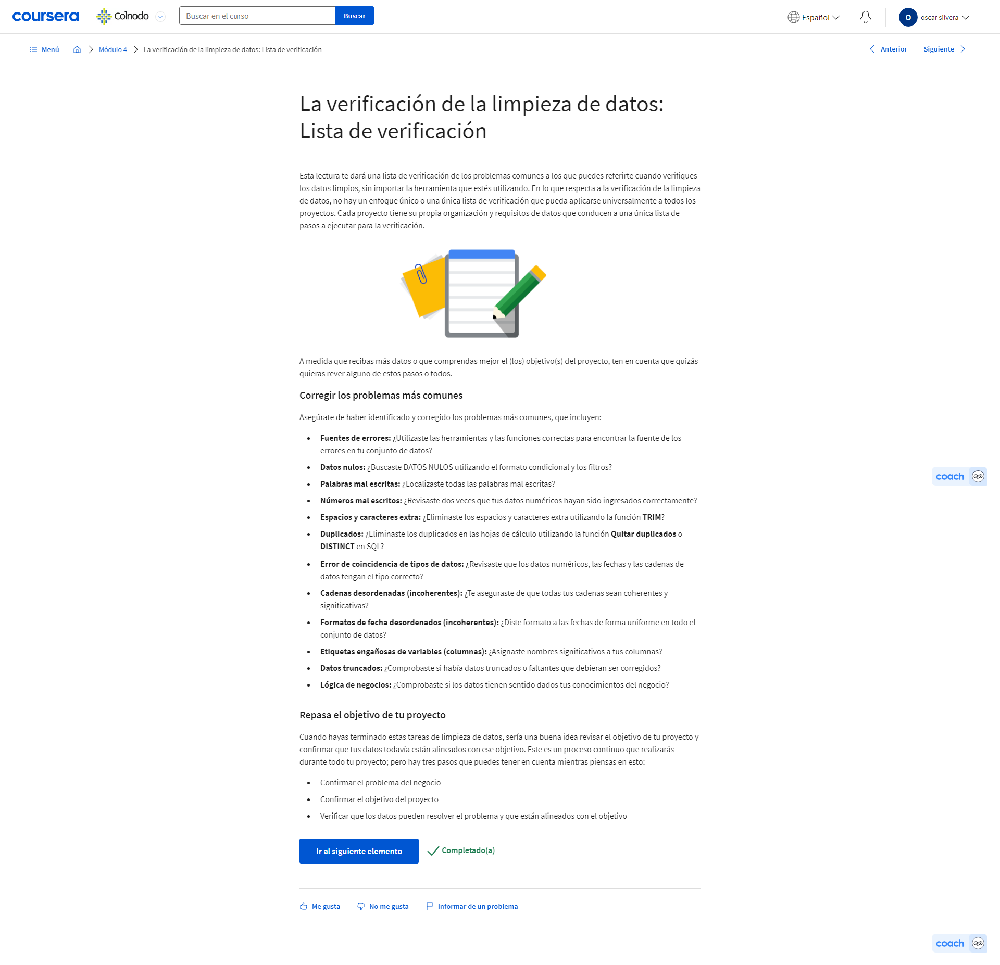
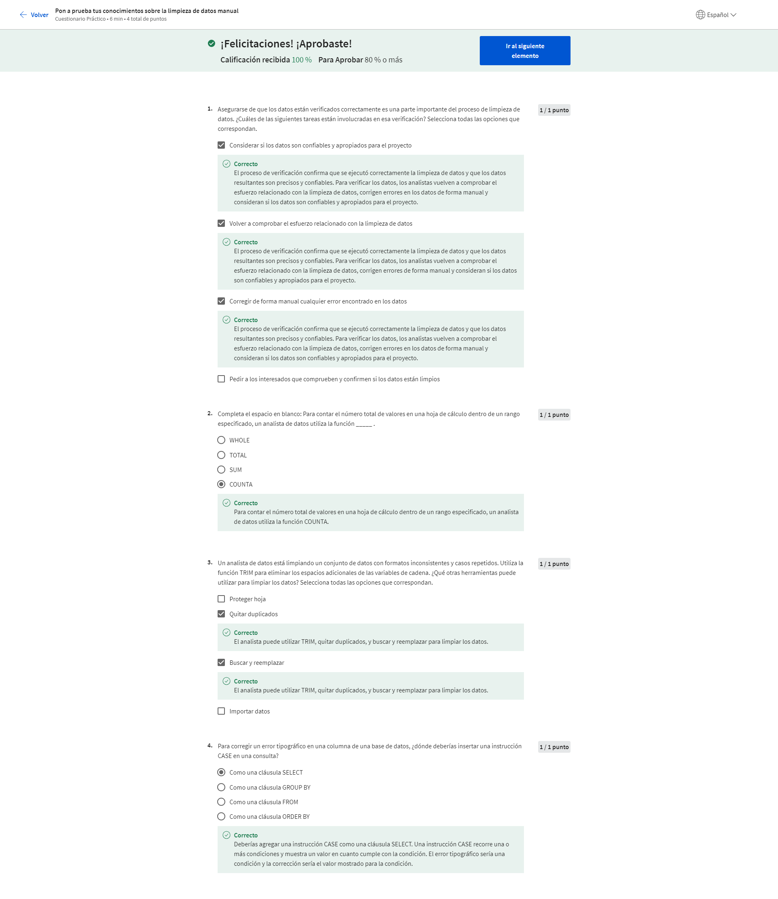
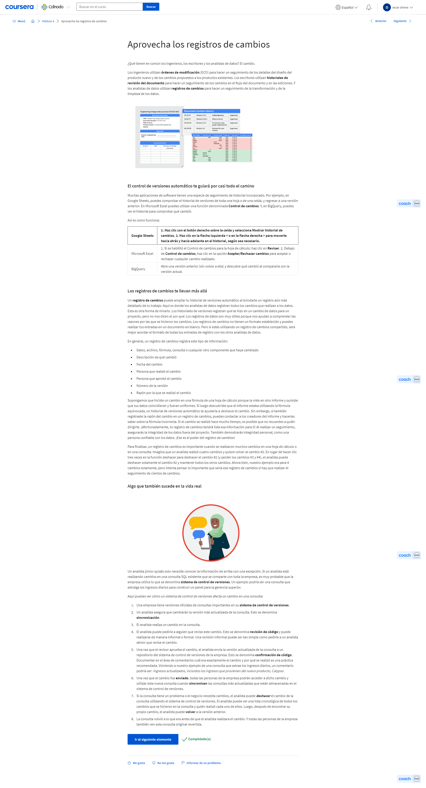
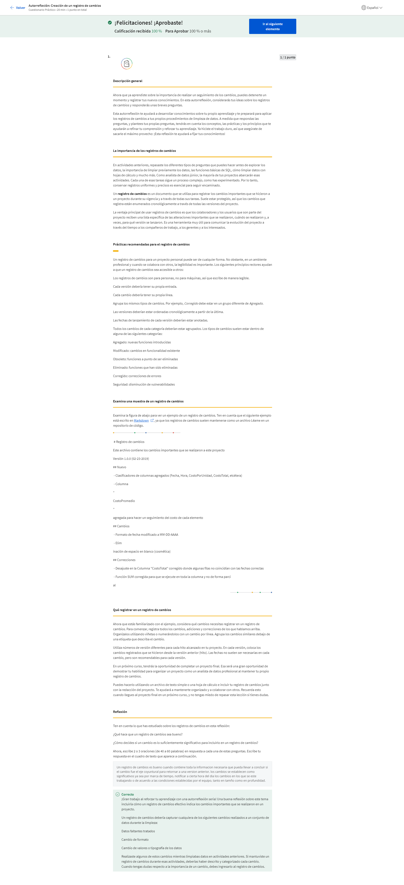
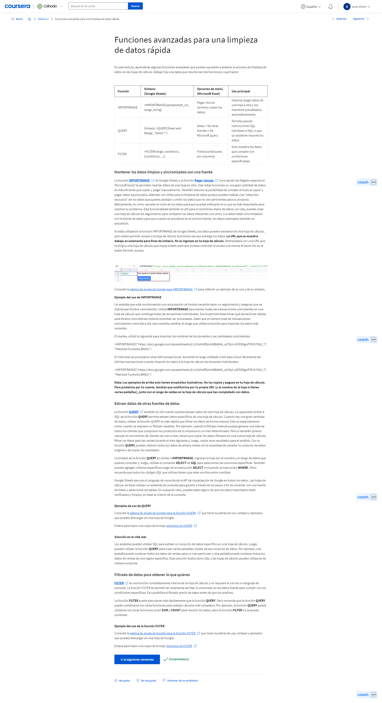
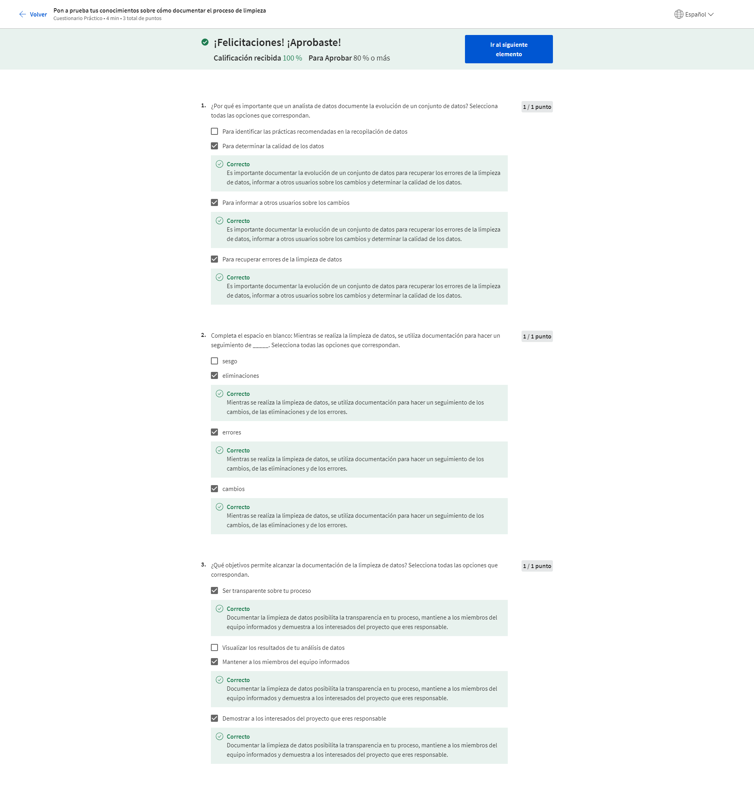
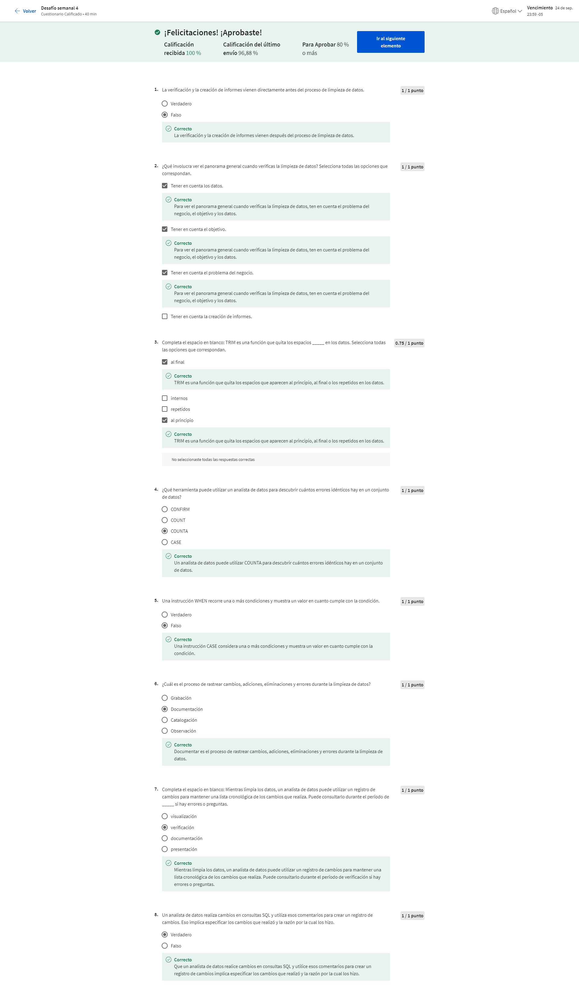
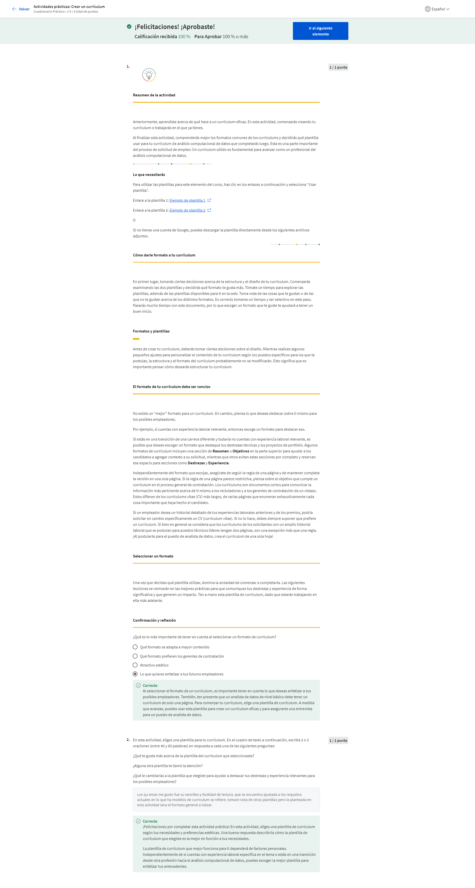

# Proceso de datos sucios a datos limpios

## La importancia de la integridad

### Enfoque en la integridad

#### Introducción al enfoque en la integridad

¡Hola! Qué bueno volver a encontrarnos. Mi nombre es Sally y estoy aquí para enseñarte todo sobre el procesamiento de datos. Soy directora de analítica y mediciones en Google. Mi trabajo es ayudar a agencias publicitarias y empresas a medir el éxito y analizar sus datos, de modo que me reúno con muchas personas diferentes para mostrarles cómo el análisis de datos los ayuda en la publicidad. Hablando de análisis, hiciste un gran trabajo antes al aprender cómo recopilar y organizar los datos para análisis. Definitivamente es un paso importante en el proceso de análisis de datos, ¡bien hecho! Ahora hablemos sobre cómo asegurarnos de que tus datos organizados estén completos y sean precisos. Los datos limpios son la clave para asegurarte de la integridad de tus datos antes de analizarlos. Te mostraremos cómo asegurarte de que tus datos estén limpios y ordenados. Limpiar y procesar datos es una parte de todo proceso de análisis de datos. Como recordatorio rápido, ese proceso consiste en preguntar, preparar, procesar, analizar, compartir y actuar. Esto significa que es momento para que exploremos la fase de procesar y estoy aquí para guiarte en todo el camino. Conozco bien el lugar adonde estás ahora. Nunca había escuchado sobre análisis computacional de datos hasta que hice un programa similar a este. Una vez que comencé a avanzar, me di cuenta de cuanto disfrutaba el análisis computacional de datos y las puertas que podría abrir. ¡Y ahora estoy entusiasmada en ayudarte a abrir esas mismas puertas! Algo que comprendí mientras trabajaba para distintas empresas, es que los datos limpios son importantes en todas las industrias. Por ejemplo, al inicio de mi carrera, aprendí a estar atentar para identificar datos duplicados, un problema común con el que los analistas se encuentran al limpiar datos. Solía trabajar para una empresa que tenía distintos tipos de suscripciones. En nuestro conjunto de datos, cada usuario tendría una nueva fila para cada tipo de suscripción contratada, lo que significa que los usuarios aparecerían más de una vez en mis datos. De modo que si hubiera contado el número de usos en una tabla sin percatarme de los duplicados como este, habría contado a algunos usuarios dos veces en lugar de una. Como resultado, mi análisis habría resultado erróneo, lo que habría llevado a problemas en mis informes y para los interesados que confían en mis análisis. ¡Imagina si le contase al director general que tengo dos veces más clientes de los que realmente hay! Es por eso por lo que los datos limpios son tan importantes. De modo que el primer paso en el procesamiento de datos es aprender sobre la integridad de los datos. Descubrirás qué es la integridad de los datos y porqué es importante mantenerla durante todo el proceso de análisis de datos. Algunas veces puede que ni siquiera tengas los datos que necesitas, de modo que deberás crearlos. Esto te ayudará a aprender cómo el tamaño de la muestra y el muestreo aleatorio pueden ahorrarte tiempo y esfuerzo. Las pruebas de datos son otro paso importante al procesar datos. Compartiremos algunas pautas sobre cómo realizar pruebas de datos antes de que tus análisis comiencen oficialmente. Del mismo modo en que lavas tu ropa y tus platos en la vida diaria, los analistas limpian todos sus datos todo el tiempo, también. La importancia de los datos limpios será definitivamente el punto de atención aquí. Aprenderás técnicas de limpieza de datos para todos los escenarios, junto con algunas trampas para tener en cuenta durante el proceso. Explorarás la limpieza de datos en hojas de cálculo y bases de datos, a partir de lo que has aprendido sobre las hojas de cálculo. Hablaremos más sobre SQL y cómo puedes usarlo para limpiar datos y hacer otras cosas útiles, también. Cuando los analistas limpian sus datos, hacen mucho más que un control puntual para asegurarse de que la limpieza de datos está bien. Aprenderás formas de verificar e informar los resultados de tu tarea de limpieza. Esto incluye documentar tu proceso de limpieza, que tiene muchos beneficios que exploraremos. Es importante recordar que el procesamiento de datos es solo una de las tareas que completarás como analista de datos. Realmente, tus habilidades de limpieza de datos podrían ser algo que luego terminarás destacando en tu currículum cuando comiences a buscar trabajo. Hablando de tu currículum, podrás comenzar a pensar en cómo hacerlo desde la perspectiva de un analista de datos. Una vez que termines, tendrás una sólida apreciación de los datos limpios y de cuán importantes son en el proceso de análisis de datos. ¡Empecemos!

### Objetivos de la integridad de datos y del análisis de datos

#### Motivos por los cuales la integridad de datos es importante

¡Hola de nuevo! En este vídeo, vamos a hablar sobre la integridad de los datos y algunos riesgos que podrías correr al trabajar como analista de datos. Un análisis robusto depende de la integridad de los datos. Si los datos que estás usando están comprometidos de alguna manera, tu análisis no será tan sólido como debería. La integridad de los datos consiste en la exactitud, integridad, consistencia y confiabilidad de los datos a lo largo de su ciclo de vida. Esto puedo sonar como muchas cualidades para que los datos estén a la altura de las circunstancias. Pero créeme, vale la pena verificar todas estas cualidades por completo antes de proceder con tu análisis. De lo contrario, tu análisis podría ser erróneo. No porque hayas hecho algo mal, sino porque los datos con los cuales estabas trabajando eran erróneos desde el principio. Cuando la integridad de los datos es baja, puede causar cualquier inconveniente desde la pérdida de un píxel en una imagen hasta una decisión médica incorrecta. En algunos casos, una pieza faltante puede hacer que todos tus datos se tornen inservibles. La integridad de los datos puede estar comprometida de muchas formas diferentes. Existe la posibilidad de que los datos puedan estar comprometidos cada vez que se replican, transfieren o manipulan de cualquier forma. La replicación de datos es el proceso de almacenar datos en varios sitios. Si estás replicando datos en distintos momentos en distintos lugares, existe la posibilidad de que tus datos no estén sincronizados. Esos datos carecen de integridad porque distintas personas pueden no utilizar los mismos datos para sus conclusiones, lo cual puede causar inconsistencias. También está el tema de la transferencia de datos, que es el proceso de copiar datos desde un dispositivo de almacenamiento a la memoria o de una computadora a otra. Si tu transferencia de datos se interrumpe, podrías terminar con un conjunto de datos incompletos, lo cual podría no ser útil para tus necesidades. El proceso de manipulación de datos implica modificar los datos para que estén más organizados y sean más fáciles de leer. La manipulación de datos tiene como objetivo hacer que el proceso de análisis de datos sea más eficiente, pero un error durante el proceso puede comprometer la eficacia. Por último, los datos también pueden estar comprometidos por un error humano, virus, malware, piratería informática y fallas del sistema, que pueden llevar a más dolores de cabeza. Voy a parar aquí. Estas son suficientes potenciales malas noticias para digerir. Pasemos a algunas potenciales buenas noticias. En muchas empresas, el almacén de datos o el equipo de ingeniería de datos se encarga de garantizar la integridad de los datos. Próximamente, aprenderemos sobre cómo verificar la integridad de los datos como analista de datos. Pero quédate tranquilo, alguien más por lo general te cubrirá la espalda. Luego de averiguar con qué datos estás trabajando, es importante que compruebes dos veces que tus datos están completos y son válidos antes de analizarlos. Esto te ayudará a asegurar que tu análisis y conclusiones son precisas. Verificar la integridad de los datos es un paso crucial en el procesamiento de tus datos para tenerlos listos para el análisis, ya sea que tú u otra persona en la empresa lo hagan. Luego, aprenderás más sobre integridad de datos ¡Hasta pronto!

#### Más información sobre la integridad de datos y el cumplimiento normativo


#### Equilibrio entre los objetivos y la integridad de datos

Hola, recordemos comprobar la integridad de los datos. También es importante comprobar que los datos que uses estén alineados con el objetivo comercial. Esto agrega otra capa al mantenimiento de la integridad de tus datos porque los datos que estás usando podrían tener limitaciones con las que deberías lidiar. El proceso de hacer coincidir los datos con los objetivos comerciales puede ser bastante directo. Aquí te presentamos un ejemplo rápido. Digamos que eres un analista para una empresa que produce y vende autopartes.
Reproduce el video desde ::29 y sigue la transcripción0:29
Si necesitas responder una pregunta sobre la ganancia generada por la venta de una pieza determinada, entonces deberías utilizar la tabla de ganancias del conjunto de datos.
Reproduce el video desde ::37 y sigue la transcripción0:37
Si la pregunta es sobre opiniones de los clientes, deberías utilizar la tabla de opiniones para analizar los puntajes promedio. Pero antes de ahondar en cualquier análisis, debes considerar unas pocas limitaciones que pueden afectarlo. Si los datos no se limpiaron adecuadamente, no podrás usarlos. Deberás esperar hasta que se realice una limpieza exhaustiva. Ahora, digamos que estás intentando saber cuánto gasta el cliente promedio. Observas que los datos del mismo cliente aparecen en más de una línea. Eso se denomina dato duplicado. Para corregirlo, quizá debas cambiar el formato de los datos o quizá debas cambiar la forma en la que calculas el promedio. De lo contrario, parecerá que los datos corresponden a dos personas distintas y estarás atascado en cálculos engañosos. Puedes darte cuenta también de que no hay suficientes datos para completar un análisis preciso. Quizá tengas datos de ventas equivalentes a tan solo un par de meses. Existe una pequeña posibilidad de que podrías esperar a obtener más datos, pero es más probable que debas cambiar tu proceso o encontrar fuentes alternativas de datos mientras cumples con tu objetivo. Me gusta pensar en un conjunto de datos como en una fotografía. Toma esta fotografía. ¿Qué estás mirando?
Reproduce el video desde :1:48 y sigue la transcripción1:48
A menos que seas un viajero experto o conozcas el área, puede ser difícil elegir entre estas dos imágenes.
Reproduce el video desde :1:55 y sigue la transcripción1:55
Visualmente, es muy claro cuando no estamos viendo toda la imagen. Cuando obtienes el panorama completo, te das cuenta de que....¡estás en Londres!
Reproduce el video desde :2:4 y sigue la transcripción2:04
Con datos incompletos, es difícil ver el panorama completo para obtener un sentido real de qué sucede. A veces, confiamos en los datos porque si aparecen en filas y columnas, parecería que todo lo que necesitamos está ahí con solo realizar una consulta. Pero eso no es cierto. Recuerdo un momento cuando comprendí que no tenía suficientes datos y debía encontrar una solución.
Reproduce el video desde :2:26 y sigue la transcripción2:26
Estaba trabajando para una empresa minorista en línea y me pidieron que resolviera cómo acortar el plazo de entrega de las compras. Por lo general, una entrega más rápida hace que los clientes estén más felices. Cuando comprobé el conjunto de datos, encontré muy poca información sobre el seguimiento. Estábamos perdiendo algunos detalles importantes. De modo que, junto con los ingenieros de datos, creamos nuevos procesos para rastrear información adicional, como la cantidad de paradas en un viaje. Con esos datos, redujimos el tiempo que se tardaba desde la compra hasta la entrega y vimos una mejora en la satisfacción del cliente. ¡Eso se sintió genial! Aprender cómo resolver problemas con los datos mientras no pierdes de vista tu objetivo te ayudará a tener éxito en tu carrera como analista de datos. Y tu camino hacia el éxito continúa. Próximo paso: aprenderás más sobre cómo alinear los datos con los objetivos. Sigue así.

#### Objetivos y datos alineados

<https://support.microsoft.com/en-us/office/datedif-function-25dba1a4-2812-480b-84dd-8b32a451b35c>

<https://support.microsoft.com/en-us/office/days360-function-b9a509fd-49ef-407e-94df-0cbda5718c2a>

<https://support.google.com/docs/answer/6055612?hl=en>


#### Cuestionario práctico: Pon a prueba tus conocimientos sobre integridad de datos y objetivos analíticos


### Supera los desafíos de datos insuficientes

#### Qué hacer en caso de datos insuficientes

Todos los analistas estuvieron en la situación en la que los datos son insuficientes para el objetivo comercial. Considerando la cantidad de datos que se generan diariamente, puede ser difícil de creer, pero es verdad. Entonces, veamos qué puedes hacer cuando tus datos no son suficientes. Veremos cómo establecer límites para el alcance de tu análisis y qué datos deberías incluir.
Reproduce el video desde ::21 y sigue la transcripción0:21
En un momento, fui analista de datos en un centro de soporte. Todos los días recibíamos preguntas de los clientes, que se registraban como tickets de soporte.
Reproduce el video desde ::29 y sigue la transcripción0:29
Me pidieron una proyección del número de tickets de soporte entrantes por mes para determinar cuántas personas adicionales necesitábamos contratar. Era muy importante tener una cantidad suficiente de datos que se remontasen como mínimo a un par de años atrás porque debía informar cambios interanuales y estacionales. Si solo hubiera tenido disponibles los datos del año en curso, no hubiera sabido que es normal un pico en enero y tiene que ver con las personas que piden reembolsos después de las fiestas. Como tenía una cantidad suficiente de datos, pude sugerir la contratación de más personal en enero para estar preparados. Es inevitable que aparezcan desafíos, pero las buenas noticias son que una vez que conoces tu objetivo comercial, podrás reconocer si tienes suficientes datos. Y si no los tienes, podrás resolverlo antes de comenzar tu análisis. Ahora, veamos algunas de esas limitaciones con las que puedes encontrarte y cómo puedes manejar distintos tipos de datos insuficientes.
Reproduce el video desde :1:22 y sigue la transcripción1:22
Digamos que estás trabajando en la industria del turismo y necesitas saber cuáles son los planes de viaje buscados con más frecuencia. Si solamente usas datos de un sitio de reservas, te estás limitando a los datos de una fuente únicamente. Otros sitios de reservas pueden mostrar distintas tendencias que quisieras considerar para tu análisis. Si una limitación como esta afecta tu análisis, puedes detenerte aquí y consultar nuevamente con los interesados para trazar un plan. Si tu conjunto de datos se sigue actualizando, significa que todavía hay ingreso de datos y pueden no estar completos. Por lo tanto, si hay una atracción turística nueva y estás analizando el interés y la concurrencia, probablemente no haya suficientes datos para que determines las tendencias. Por ejemplo, podrías querer esperar un mes para recolectar más datos. También puedes comprobar con los interesados y pedirles ajustar el objetivo. Por ejemplo, podrías analizar tendencias semana por semana en lugar de mes a mes. También podrías basar tu análisis en tendencias de los últimos tres meses y decir: "Así es como se vería la concurrencia a la atracción para el mes cuatro".
Reproduce el video desde :2:22 y sigue la transcripción2:22
Puedes no tener suficientes datos para saber si este número es demasiado alto o demasiado bajo. Pero le dirías a los interesados que es tu mejor cálculo basado en los datos que tienes actualmente. Por otra parte, tus datos podrían ser más antiguos y ya no ser pertinentes. Los datos desactualizados sobre la satisfacción al cliente no incluirán las respuestas más recientes. De modo que estarás confiando en las calificaciones para hoteles o alquileres de verano que podrían ya no ser precisos. En este caso, tu mejor opción sería encontrar un nuevo conjunto de datos para trabajar. Los datos limitados geográficamente también pueden ser poco confiables. Si tu empresa es global, no querrías usar datos limitados a viajes en solo un país. Querrías un conjunto de datos que incluyera a todos los países. De modo que esa es una de las limitaciones más comunes que encontrarás y algunas de las formas de resolverlas. Puedes identificar las tendencias con los datos disponibles o esperar más datos si el tiempo lo permite; también puedes hablar con los interesados y ajustar tu objetivo; o puedes buscar un conjunto de datos nuevo.
Reproduce el video desde :3:22 y sigue la transcripción3:22
La necesidad de tomar esas decisiones dependerá de tu rol en la empresa y posiblemente de las necesidades de la industria en general. Pero aprender cómo abordar los datos insuficientes siempre es una forma genial de prepararte para el éxito. Tus facultades como analista de datos están fortaleciéndose. Y justo a tiempo. Después de aprender más sobre limitaciones y soluciones, también aprenderás sobre poder estadístico, otra herramienta fantástica para que uses. ¡Hasta pronto!

#### Qué hacer cuando encuentras un problema en tus datos


#### La importancia del tamaño de la muestra

Bien, antes hablamos de tener el tipo correcto de datos para cumplir con tus objetivos comerciales y la importancia de tener la cantidad correcta de datos para asegurarte de que tu análisis sea lo más preciso posible. Quizás recuerdes que para los analistas de datos, una población representa a todos los valores de datos posibles de un conjunto de datos determinado. Si puedes usar el 100% de una población en tu análisis, ¡es genial! Pero a veces recabar información sobre una población entera no es posible. Consume mucho tiempo o es muy caro. Por ejemplo, digamos que una organización internacional quiere saber más sobre dueños de mascotas que tienen gatos. Tu tarea es determinar qué tipo de juguetes prefieren los dueños de gatos en Canadá. Pero hay millones de dueños de gatos en Canadá, de manera que obtener datos de todos ellos sería un desafío enorme. Pues bien, ¡no temas! Permíteme presentarte..... ¡al tamaño de la muestra! Cuando utilizas un tamaño de muestra o una muestra, usas una parte de una población que es representativa de la población. El objetivo es obtener suficiente información de un grupo pequeño dentro de una población para formular predicciones o conclusiones sobre la población total. El tamaño de la muestra ayuda a asegurar el grado respecto del cual puedes estar confiado en que tus conclusiones representan con precisión a la población. Para los datos sobre dueños de gatos, un tamaño de la muestra podría incluir datos sobre cientos o miles de personas en lugar de millones. Usar una muestra para análisis es más rentable y lleva menos tiempo. Si se hace con cuidado y a conciencia, puedes obtener los mismos resultados usando un tamaño de muestra en lugar de intentar encontrar a cada uno de los dueños de los gatos para averiguar cuáles son sus juguetes favoritos. Sin embargo, existe una desventaja potencial. Cuando utilizas únicamente una muestra pequeña de una población, puede llevar a la incertidumbre. No puedes estar el 100% seguro de que tus estadísticas son una representación precisa y completa de la población. Esto lleva a un sesgo del muestreo, que se trató anteriormente en el programa. El sesgo del muestreo ocurre cuando una muestra no es representativa de la población en su conjunto. Esto significa que algunos miembros de la población están siendo sobre o subrepresentados. Por ejemplo, si la encuesta usada para recoger datos de los dueños de gatos solamente incluyó a personas con teléfonos inteligentes; entonces, los dueños de gatos que no tienen un teléfono inteligente no estarían representados en los datos. Utilizar un muestreo aleatorio puede ayudar a resolver algunos de esos problemas relacionados con el sesgo del muestreo. El muestreo aleatorio es una forma de seleccionar una muestra de una población de manera que cada tipo posible de la muestra tenga una posibilidad igual de ser elegido. Volviendo a los dueños de gatos, usar una muestra aleatoria de dueños de gatos significa que los dueños de gatos de cada tipo tienen una posibilidad igual de ser elegidos. Los dueños de gatos que viven en departamentos en Ontario tendrían la misma posibilidad de ser representados que aquellos que viven en casas en Alberta. Como analista de datos, encontrarás que crear tamaños de muestras usualmente se hace aún antes de recibir los datos. Pero aun así es bueno que sepas que los datos que vas a analizar son representativos de una población y sirven para tu objetivo. También es bueno saber con qué te encontrarás a continuación en tu recorrido por los datos. En el próximo vídeo, tendrás la opción de sentirte aún más cómodo con los tamaños de las muestras. ¡Nos vemos!

#### Cómo calcular el tamaño de la muestra

<https://www.investopedia.com/terms/c/central_limit_theorem.asp>

<https://www.statisticssolutions.com/dissertation-resources/sample-size-calculation-and-sample-size-justification/sample-size-formula/>

<https://www.coursera.org/learn/process-data/lecture/mSj5A/determine-the-best-sample-size>

<https://www.coursera.org/learn/process-data/supplement/ZqcDw/sample-size-calculator>


#### Cuestionario práctico: Autorreflexión: ¿Por qué son importantes las actividades previas a la limpieza?


#### Cuestionario práctico: Pon a prueba tus conocimientos sobre datos insuficientes


### Cómo usar el poder estadístico

#### Cómo usar el poder de la estadística

0:01
¡Hola! Probablemente todos hemos soñado con tener un superpoder al menos una vez en nuestras vidas. Yo sé cuál. Me encantaría poder volar. Pero hay otro superpoder del cual quizá no hayas oído hablar: el poder estadístico.
Reproduce el video desde ::14 y sigue la transcripción0:14
El poder estadístico es la probabilidad de obtener resultados significativos de una prueba. Creo que este no es un superpoder con el cual hayan soñado. Aun así, es un poder bastante genial. Para los analistas de datos, tus proyectos pueden comenzar con la prueba o el estudio. La prueba de hipótesis es una forma de ver si una encuesta o experimento tiene resultados significativos. Aquí hay un ejemplo: Digamos que trabajas en una cadena de restaurantes que está planificando una campaña de marketing para sus nuevos batidos. Debes realizar una prueba de publicidad en un grupo de clientes antes de realizarla a nivel nacional.
Reproduce el video desde ::50 y sigue la transcripción0:50
En la prueba, quieres verificar si a los clientes les gusta o no la campaña. También quieres descartar cualquier factor externo a la publicidad que pueda llevarlos a indicar que no les gusta ese aviso.
Reproduce el video desde :1:1 y sigue la transcripción1:01
Utilizar a todos tus clientes llevaría mucho tiempo y sería muy caro. Por lo tanto, necesitas saber cuántos clientes necesitarás para demostrar que la publicidad es efectiva. Cincuenta probablemente no serían suficientes. Incluso si eligieras 50 clientes al azar, podrías terminar con clientes a quienes no les gustan para nada los batidos. Y si eso sucede, no podrás medir la efectividad de tu publicidad para obtener más pedidos de batidos dado que ninguno de los que están en el tamaño de la muestra los pediría. Es por eso por lo que necesitas un tamaño mayor de muestra: para que puedas asegurarte de obtener un buen número de todos los tipos de personas para tu prueba. Usualmente, cuanto más grande es el tamaño de la muestra, mayor será la posibilidad de obtener resultados estadísticamente significativos con tu prueba. Y ese es el poder estadístico.
Reproduce el video desde :1:46 y sigue la transcripción1:46
En este caso, usar tantos clientes como sea posible mostrará las diferencias reales entre los grupos a quienes les gusta o no versus las personas cuya decisión no estaba basada en absoluto en la publicidad.
Reproduce el video desde :1:58 y sigue la transcripción1:58
Existen formas de calcular con precisión el poder estadístico, pero no vamos a verlas ahora. Puede que necesites hacer ese cálculo por ti mismo como analista de datos.
Reproduce el video desde :2:8 y sigue la transcripción2:08
Por ahora, debes saber que el poder estadístico generalmente se muestra como un valor de uno. De manera que si tu poder estadístico es 0.6; es lo mismo que decir 60%. En la prueba de la publicidad del batido, si calculaste un poder estadístico de 60%, eso significa que existe un 60% de posibilidades de que obtengas un resultado estadísticamente significativo en la eficacia de la publicidad.
Reproduce el video desde :2:32 y sigue la transcripción2:32
"Estadísticamente significativo" es un término utilizado en estadísticas. Si quieres aprender más sobre el significado técnico, puedes buscar en línea. Pero en términos básicos, si una prueba es estadísticamente significativa, eso significa que los resultados de la prueba son reales y no un error causado por factores aleatorios.
Reproduce el video desde :2:52 y sigue la transcripción2:52
De manera que hay 60% de chances de que los resultados de la prueba de publicidad del batido sean confiables y reales y un 40% de chances de que el resultado de la prueba sea incorrecto.
Reproduce el video desde :3:2 y sigue la transcripción3:02
Usualmente, se necesita un poder estadístico de al menos 0.8 u 80% para considerar que tus resultados son estadísticamente significativos.
Reproduce el video desde :3:11 y sigue la transcripción3:11
Consideremos un escenario más. Quedémonos con los batidos porque, bueno, porque me gustan los batidos. Imagina que trabajas en una cadena de restaurantes que quiere lanzar un nuevo batido con sabor a torta de cumpleaños con sabor a batido.
Reproduce el video desde :3:24 y sigue la transcripción3:24
El costo de producción de este batido será más caro que el de tus otros batidos. Tu empresa espera que el entusiasmo por el nuevo sabor atraiga a más clientes y dinero para compensar el costo. Quieren probarlo primero en algunos restaurantes. Entonces, pensemos cuántos locales deberías usar para que tus resultados sean confiables.
Reproduce el video desde :3:44 y sigue la transcripción3:44
Primero, deberías pensar qué es lo que evita que consigas resultados estadísticamente significativos. ¿Hay otros restaurantes que estén ofreciendo otras promociones que puedan atraer a nuevos clientes? ¿Algunos de esos restaurantes tienen clientes que siempre compran el producto más nuevo, sin importar qué es? ¿Algunos de esos restaurantes comenzaron algunas construcciones que evitarían que los clientes fueran al restaurante?
Reproduce el video desde :4:7 y sigue la transcripción4:07
Para lograr un poder estadístico más alto, deberías considerar todos estos factores antes de decidir cuántos locales incluir en el tamaño de la muestra para tu estudio.
Reproduce el video desde :4:16 y sigue la transcripción4:16
Quieres asegurarte de que cualquier efecto se deba, más probablemente, al nuevo sabor del batido, no a otros factores.
Reproduce el video desde :4:23 y sigue la transcripción4:23
Los efectos mensurables serían un incremento en las ventas o el número de clientes en los locales en el tamaño de tu muestra. Muy bien, eso es todo por ahora. Próximamente, vamos a explorar los tamaños de las muestras en detalle, para obtener una mejor idea de cómo impactan en tus pruebas y estudios.
Reproduce el video desde :4:39 y sigue la transcripción4:39
Mientras tanto, has aprendido un poco más sobre los batidos y los superpoderes. Y, por supuesto, sobre el poder estadístico. Lamentablemente, solo el poder estadístico puede ser realmente útil para los analistas de datos. Sin embargo, ponerme mi capa y volar a comprar un batido justo ahora suena bastante bien.

#### Qué hacer cuando no hay datos

<https://towardsdatascience.com/is-there-a-difference-between-open-data-and-public-data-6261cd7b5389>
<https://www.kaggle.com/>
<https://www.kaggle.com/sakshigoyal7/credit-card-customers>
<https://www.kaggle.com/datasnaek/youtube-new>
<https://www.kaggle.com/rtatman/188-million-us-wildfires>
<https://www.kaggle.com/bigquery/google-analytics-sample>
<https://www.kaggle.com/docs/datasets>
<https://www.kaggle.com/datasets>


#### Cómo determinar el mejor tamaño de la muestra

¡Qué bueno volver a verte! En este vídeo, vamos a ver en más detalle los tamaños de las muestras y la integridad de los datos. Si alguna vez estuviste en una tienda donde entregan muestras, sabes que ese es uno de los pequeños placeres de la vida. ¡Al menos para mí! Esas pequeñas muestras también son una forma muy inteligente de parte de las empresas para conocer más sobre sus productos a través de los clientes sin tener que entregar a todos una muestra gratis. Muchas empresas usan el tamaño de las muestras de manera similar. Toman una parte de algo más grande. En este caso, una muestra de una población. Algunas veces, realizarán pruebas complejas en sus datos para ver si cumplen con sus objetivos comerciales. Nosotros no profundizaremos en todos los cálculos que se necesitan para hacer todas estas pruebas de manera efectiva. En cambio, nos enfocaremos en la "idea general": ver el proceso y qué comprende. A modo de recordatorio, el tamaño de la muestra es una parte de una población que es representativa de toda la población. Para las empresas, es una herramienta muy importante. Puede resultar caro y llevar mucho tiempo analizar una población entera de datos. Utilizar un tamaño de muestra generalmente es lo más lógico e, incluso, puede derivar en conclusiones válidas y útiles. Existen calculadoras disponibles en línea que pueden ayudarte a calcular el tamaño de la muestra. Debes ingresar el nivel de confianza, el tamaño de la población y el margen de error. Ya hemos hablado antes sobre el tamaño de la población. Para avanzar, aprenderemos sobre el nivel de confianza y el margen de error. Conocer estos conceptos te ayudará a entender por qué los necesitas para calcular el tamaño de la muestra. El nivel de confianza es la probabilidad de que tu muestra refleje de manera precisa la mayor parte de la población. Puedes considerarlo como si se tratase de la confianza en cualquier otra cosa. Es la intensidad que sientes y te permite saber si puedes confiar en algo o en alguien. Tener el 99% de confianza es lo ideal. Pero la mayoría de las industrias esperan como mínimo tener un 90 o 95% de nivel de confianza. Las industrias como la farmacéutica generalmente quieren un nivel de confianza que sea lo más alto posible cuando utilizan un tamaño de muestra. Esto tiene sentido porque se realizan pruebas en medicamentos y es necesario tener certeza de que funcionan y son seguros para el uso masivo. Para otros estudios, las organizaciones quizá solo deben saber que los resultados de las pruebas o las encuestas los están llevando por la dirección correcta. Por ejemplo, si una empresa de pintura está realizando pruebas en colores nuevos, está bien un nivel de confianza menor. También debes considerar el margen de error de tu estudio. Aprenderás más acerca de este tema pronto, pero básicamente indica si los resultados del tamaño de tu muestra se aproximan o no a lo que serían tus resultados si usaras toda la población que está representada en el tamaño de tu muestra. Piénsalo de esta manera. Digamos que el director de una escuela secundaria te pide un estudio sobre las preferencias de dulces de los estudiantes. Necesitan conocer un tamaño de muestra apropiado y lo necesitan ahora. La escuela tiene una población de 500 estudiantes, y están pidiendo un nivel de confianza del 95% y un margen de error del 5%. Incluimos una calculadora en la hoja de cálculo, pero también puedes encontrar fácilmente este tipo de calculadora buscando "calculadora de tamaño de muestras" en Internet. Del mismo modo que en esas calculadoras, nuestra hoja de cálculo no muestra ningún tipo de cálculos más complejos para determinar el tamaño de la muestra. Todo lo que debemos hacer es ingresar los números de nuestra población, el nivel de confianza y el margen de error. Y cuando escribimos 500 para el tamaño de la población, 95 para nuestro porcentaje de nivel de confianza, 5 para nuestro porcentaje de margen de error el resultado es aproximadamente 218. Para este estudio, eso significa que un tamaño apropiado de muestra sería 218. Si encuestáramos a 218 estudiantes y encontráramos que el 55% de ellos prefiere el chocolate, entonces podríamos estar bastante seguros de que esto sería verdad para los 500 estudiantes. 218 es el número mínimo de personas que necesitamos encuestar con base en nuestro criterio de 95% como nivel de confianza y 5% como margen de error. En caso de que te preguntes, el nivel de confianza y el margen de error no deben sumar 100%. Son independientes uno de otro. Entonces, digamos que cambiamos nuestro margen de error de 5% a 3%. Por lo tanto, nuestro tamaño de muestra debería ser más grande, aproximadamente 341 en lugar de 218, para hacer que los resultados del estudio sean más representativos de la población. Practica libremente con la calculadora en línea. Conocer el tamaño de muestra y cómo calcularlo te ayudará cuando trabajes con datos. Tenemos más conocimientos útiles para ofrecerte, incluso sobre el margen de error. ¡Hasta pronto!

#### Calculadora de tamaño de muestra

<https://www.surveymonkey.com/mp/sample-size-calculator/>
<http://www.raosoft.com/samplesize.html>


#### Cuestionario práctico: Pon a prueba tus conocimientos sobre cómo probar tus datos


### Considerar el margen de error

#### Evaluar la confiabilidad de tus datos

0:01
¡Hola! Anteriormente hablamos sobre el margen de error sin explicarlo del todo. Bien, vamos a ver qué está bien o mal en este vídeo, ya que explicaremos mejor qué es el margen de error. Incluso incluiremos un ejemplo de cómo calcularlo.
Reproduce el video desde ::14 y sigue la transcripción0:14
Como analista de datos, es importante que calcules el tamaño de las muestras y las variables como el nivel de confianza y el margen de error antes de comenzar a realizar cualquier tipo de pruebas o encuestas. Es la mejor forma de asegurar la objetividad de tus resultados y te brinda una mayor posibilidad de obtener resultados estadísticamente importantes. Pero si ya conoces el tamaño de la muestra, como, por ejemplo, cuando recibes resultados de encuestas para analizar; entonces, puedes calcular el margen de error tú mismo. De ese modo tendrás una mejor idea de cuál es la diferencia entre tu muestra y tu población. Empezaremos por el principio con una definición más completa. El margen de error es el máximo que se espera que difieran los resultados de la muestra de los de la población real.
Reproduce el video desde :1: y sigue la transcripción1:00
Pensemos en un ejemplo de margen de error.
Reproduce el video desde :1:3 y sigue la transcripción1:03
Sería genial encuestar o realizar una prueba sobre una población entera, pero generalmente es imposible o poco práctico. Entonces, en cambio, se toma una muestra de la población más grande.
Reproduce el video desde :1:15 y sigue la transcripción1:15
Basado en el tamaño de la muestra, el margen de error resultante nos mostrará lo distinto que pueden ser los resultados comparados con los resultados si hubiéramos encuestado a toda la población.
Reproduce el video desde :1:27 y sigue la transcripción1:27
El margen de error te ayuda a entender lo confiable que son los datos de la prueba de tu hipótesis.
Reproduce el video desde :1:33 y sigue la transcripción1:33
Cuanto más cerca a cero esté el margen de error, más cerca los resultados de tu muestra coincidirán con los resultados de la población total.
Reproduce el video desde :1:43 y sigue la transcripción1:43
Por ejemplo, digamos que realizaste una encuesta nacional utilizando una muestra de la población. Le preguntaste a personas que trabajan cinco días a la semana si les gustaría la idea de trabajar cuatro días a la semana. De modo que tu encuesta dice que el 60% prefiere una semana de cuatro días. El margen de error fue del 10%, lo cual indica que entre el 50 y 70% de las personas les gustó la idea. De esta manera, si tuviéramos que encuestar a todos los trabajadores de cinco días en toda la nación, entre el 50 y el 70% estaría de acuerdo con nuestros resultados.
Reproduce el video desde :2:18 y sigue la transcripción2:18
Ten en cuenta que nuestro rango es entre el 50 y el 70%. Esto es así porque el margen de error se cuenta en ambas direcciones de los resultados de la encuesta de 60%. Si estableces un nivel de confianza de 95% para tu encuesta, habrá una posibilidad del 95% de que las respuestas de toda la población estén entre el 50 y el 70% que dirán que sí, que quieren una semana laboral de cuatro días.
Reproduce el video desde :2:46 y sigue la transcripción2:46
Dado que tu margen de error se superpone con la marca de 50%, no puedes asegurar que al público le agrada la idea de una semana laboral de cuatro días. En ese caso, tendrás que decir que tu encuesta fue no concluyente.
Reproduce el video desde :3: y sigue la transcripción3:00
Ahora, si querías un margen de error más bajo, por ejemplo, 5% con un rango entre 55 y 65%, podrías incrementar el tamaño de la muestra. Pero si te indicaron el tamaño de la muestra, puedes calcular el margen de error tú mismo.
Reproduce el video desde :3:18 y sigue la transcripción3:18
De ese modo, puedes decidir por ti mismo el nivel de probabilidad de que tus resultados sean estadísticamente significativos con base en tu margen de error. En general, a mayor cantidad de personas que incluyas en tu encuesta, será más probable que tu muestra sea representativa de toda la población.
Reproduce el video desde :3:34 y sigue la transcripción3:34
Disminuir el nivel de confianza también tendría el mismo efecto, pero eso haría menos probable que tu encuesta sea precisa.
Reproduce el video desde :3:43 y sigue la transcripción3:43
Es decir que, para calcular el margen de error, necesitas tres cosas: el tamaño de la población, el tamaño de la muestra, y el nivel de confianza.
Reproduce el video desde :3:52 y sigue la transcripción3:52
Y del mismo modo que con el tamaño de la muestra, puedes encontrar muchas calculadoras en línea si buscas "calculadora de margen de error".
Reproduce el video desde :3:59 y sigue la transcripción3:59
Pero vamos a mostrarte en una hoja de cálculo del mismo modo que cuando calculamos el tamaño de la muestra.
Reproduce el video desde :4:5 y sigue la transcripción4:05
Digamos que estás realizando un estudio sobre la eficacia de un medicamento nuevo. Tienes un tamaño de muestra de 500 participantes cuya enfermedad afecta al 1% de la población mundial. Es decir, aproximadamente 80 millones de personas, que es la población para tu estudio.
Reproduce el video desde :4:23 y sigue la transcripción4:23
Dado que es un estudio sobre medicamentos, necesitas tener un nivel de confianza del 99%. También necesitas tener un margen de error bajo. Vamos a calcularlo. Vamos a escribir los números para la población, el nivel de confianza y el tamaño de la muestra, en las celdas correspondientes de la hoja de cálculo. Y nuestro resultado es un margen de error cercano a 6%, más o menos. Cuando el estudio del medicamento esté completo, aplicarás el margen de error a tus resultados para determinar su nivel de confiabilidad.
Reproduce el video desde :5:4 y sigue la transcripción5:04
Las calculadoras como esta en las hojas de cálculo son una de las muchas herramientas que puedes utilizar para asegurar la integridad de tus datos.
Reproduce el video desde :5:11 y sigue la transcripción5:11
Y también es bueno recordar que verificar la integridad de los datos y alinearlos con tus objetivos te pondrá en buena forma para completar tus análisis.
Reproduce el video desde :5:21 y sigue la transcripción5:21
Tener conocimientos sobre tamaño de muestras, poder estadístico, margen de error y otros temas que hemos tratado ayudará a que tus análisis se realicen sin problemas. Son muchos conceptos nuevos para asimilar. Si te gustaría revisarlos en cualquier momento, puedes encontrarlos todos en el glosario, ¡o puedes ver nuevamente el vídeo! Pronto explorarás los pros y los contras de los datos limpios. ¡La aventura de los datos continúa! ¡Y me alegra que avances con ellos! ¡Tú puedes!

#### Todo sobre el margen de error

<https://goodcalculators.com/margin-of-error-calculator/>
<https://www.checkmarket.com/sample-size-calculator/#sample-size-margin-of-error-calculator>


#### Cuestionario práctico: Pon a prueba tus conocimientos sobre el margen de error


### Desafío semanal 1 curso 4


## Datos impecables

### Limpiar los datos es imprescindible

#### A limpiarlos

¿Puedes adivinar cuánto cuestan los datos erróneos o imprecisos a las empresas cada año? ¿Miles de dólares? ¿Millones? ¿Miles de millones? De acuerdo con IBM, el costo anual por datos de baja calidad es de $3.1 billones en los Estados Unidos solamente. Son muchos ceros.
Reproduce el video desde ::20 y sigue la transcripción0:20
Ahora, ¿puedes adivinar la causa número uno de los datos de baja calidad?
Reproduce el video desde ::25 y sigue la transcripción0:25
No es la implementación de un nuevo sistema o un problema técnico informático. El factor más común es, en realidad, el error humano. Aquí hay una hoja de cálculo de una oficina de legales. Muestra los clientes, los servicios legales contratados, el número de orden de servicio, cuánto pagaron y el método de pago.
Reproduce el video desde ::49 y sigue la transcripción0:49
Los datos sucios pueden ser el resultado de que alguien escribió un dato incorrectamente;
Reproduce el video desde ::56 y sigue la transcripción0:56
en un formato desordenado;
Reproduce el video desde :1: y sigue la transcripción1:00
campos en blanco o el mismo dato que se ingresó más de una vez, lo cual crea duplicados.
Reproduce el video desde :1:12 y sigue la transcripción1:12
Los datos sucios son datos incompletos, incorrectos o irrelevantes para el problema que tratas de resolver.
Reproduce el video desde :1:19 y sigue la transcripción1:19
Cuando trabajas con datos sucios, no puedes estar seguro de que tus resultados sean correctos. En realidad, puedes apostar con gran seguridad que no lo serán. Ya aprendiste que la integridad de los datos es fundamental para obtener resultados confiables en el análisis computacional de datos y los datos limpios te ayudan a lograr esta integridad. Los datos limpios son datos completos, correctos y pertinentes para el problema que tratas de resolver. Cuando trabajas con datos limpios, te darás cuenta de que tus proyectos transcurren mejor.
Reproduce el video desde :1:47 y sigue la transcripción1:47
Recuerdo la primera vez que presencié de primera mano la importancia de los datos limpios. Había comenzado a utilizar SQL y pensé que funcionaba como si fuera magia. Podía hacer que la computadora sumara millones de números y ahorrándome mucho tiempo y esfuerzo. Sin embargo, pronto descubrí que solo funciona cuando los datos están limpios. Si en una columna que solo debe tener números aparece una letra accidentalmente, la computadora no sabrá qué hacer. Así pasó, arrojó un error y, de pronto, quedé estancada. Y no había manera de sumar esos millones de números por mí misma. No tuve otra opción más que limpiar los datos para que funcionaran. La buena noticia es que existen muchos procesos y herramientas efectivas para ayudarte con esta tarea. Pronto verás que adquirirás las destrezas y el conocimiento que necesitas para garantizar que siempre trabajes con datos limpios.
Reproduce el video desde :2:34 y sigue la transcripción2:34
A lo largo del camino, profundizaremos en la diferencia entre datos limpios y sucios y porqué los datos limpios son tan importantes. También hablaremos de los diferentes modos de limpiar los datos y de los problemas comunes a encarar durante el proceso.
Reproduce el video desde :2:47 y sigue la transcripción2:47
¿Estás listo para empezar? Manos a la obra.

#### Por qué es importante limpiar los datos

Limpiar datos es increíblemente importante para un análisis efectivo. Si un dato se ingresa en una hoja de cálculo o base de datos en forma incorrecta, si se encuentra repetido, si es un campo que quedó en blanco, o si los formatos de los datos no son uniformes, obtendrás datos sucios como resultado. Pequeños errores pueden llevar a consecuencias graves en el largo plazo. Seré completamente honesto contigo, limpiar datos es como cepillarte los dientes. Es algo que debes hacer y hacerlo adecuadamente porque, de otro modo, te causará serios problemas. Para los dientes, pueden ser caries o problemas de encías. En cuanto a los datos, pueden costarle a tu empresa mucho dinero o hacer enojar a tu jefe. Pero hay buenas noticias. Si sigues cepillándote los dientes dos veces al día, cada día, se convierte en un hábito. Pronto, ni siquiera pensarás en ello. Es lo mismo con los datos. Confía en mí, te hará ver muy bien cuando te tomes el tiempo de limpiar los datos sucios. Para repasar rápidamente, los datos sucios pueden estar incompletos, ser incorrectos o irrelevantes para el problema que estás tratando de resolver. No se pueden usar de forma que tengan sentido, lo que puede causar que el análisis sea muy difícil, sino imposible. Por otra parte, los datos limpios están completos son correctos y pertinentes para el problema que estás tratando de resolver. Esto te permite comprender y analizar la información e identificar patrones importantes, conectar información relacionada y sacar conclusiones útiles. Luego, puedes aplicar lo aprendido para tomar decisiones efectivas. En algunos casos, no tendrás que hacer mucho trabajo para limpiar los datos. Por ejemplo, cuando utilizas los datos internos que ya fueron verificados y trabajados por los ingenieros de datos de tu empresa y el grupo de almacenamiento de datos, es más probable que estén limpios. Hablemos acerca de algunas personas con las que trabajarás como analista de datos. Los ingenieros de datos transforman los datos a un formato útil para su análisis y le brindan una infraestructura confiable. Esto significa que desarrollan, mantienen y prueban las bases de datos, los procesadores de datos y los sistemas relacionados. Los especialistas en almacenamiento de datos desarrollan procesos y procedimientos para almacenar y organizar los datos en forma efectiva. Se aseguran de que los datos se encuentren disponibles, sean seguros y existan copias de seguridad para evitar pérdidas. Cuando te conviertes en analista de datos, puedes aprender mucho al trabajar con la persona que mantiene tus bases de datos observando sus sistemas. Si los datos pasan por las manos del ingeniero de datos o de un especialista en almacenamiento de datos primero, sabes que tu proyecto arranca con el pie derecho. Existen muchas grandes oportunidades de carreras como ingeniero de datos o especialista en almacenamiento de datos. Si este tipo de trabajo te parece interesante, puede ser que tu carrera involucre ayudar a las organizaciones a ahorrar mucho tiempo, esfuerzo y dinero al garantizar que sus datos estén impecablemente limpios. Pero aun si eliges otra dirección en tu carrera dentro del análisis computacional de datos y tienes la ventaja de trabajar con ingenieros de datos y especialistas en almacenamiento, todavía podrás tener que limpiar tus propios datos. Es importante recordar: ningún conjunto de datos es perfecto. Siempre es una buena idea examinar y limpiar los datos antes de comenzar el análisis. Aquí hay un ejemplo: Digamos que te encuentras trabajando en un proyecto donde debes averiguar cuántas personas utilizan el programa de software de tu empresa. Tienes una hoja de cálculo que fue creada internamente y verificada por un ingeniero de datos y un especialista en almacenamiento de datos. Comprueba la columna llamada “Nombre de usuario”. Puede parecer lógico que solo puedas deslizarte hacia abajo y contar las filas para saber cuántos usuarios tienes.
Reproduce el video desde :3:40 y sigue la transcripción3:40
Sin embargo, eso no funcionará porque una persona algunas veces tiene más de un nombre de usuario.
Reproduce el video desde :3:49 y sigue la transcripción3:49
Puede ser que esté registrada desde diferentes direcciones de correo electrónico o puede ser que tenga una cuenta laboral y una personal. En situaciones como esta, necesitarás limpiar los datos eliminando las filas duplicadas.
Reproduce el video desde :4:6 y sigue la transcripción4:06
Una vez que hayas hecho esto, no habrá más entradas duplicadas. Entonces, tu hoja de cálculos estará lista para que empieces a trabajar. Hasta ahora, hemos hablado de los datos internos. Pero limpiar datos se torna aún más importante cuando trabajas con datos externos, especialmente si provienen de varias fuentes. Digamos que la empresa de software de nuestro ejemplo hizo una encuesta entre sus clientes para saber el nivel de satisfacción con el software. Pero cuando revisas los datos de la encuesta, encuentras que tienes varios valores nulos.
Reproduce el video desde :4:40 y sigue la transcripción4:40
Un valor nulo indica que un valor no existe en el conjunto de datos. Toma en cuenta que no es lo mismo que cero. En caso de una encuesta, un valor nulo puede significar que los clientes se saltearon la pregunta. Cero significaría que su respuesta fue esa. Para hacer tu análisis, primero necesitarás limpiar esos datos. El primer paso debería ser decidir qué hacer con esos valores nulos. Entonces, puedes filtrarlos y comunicar que ahora tienes una muestra más pequeña o puedes guardarlos y aprender del hecho de que los clientes no brindaron respuestas. Hay muchas razones por las que esto pudo suceder. Puede que las preguntas de la encuesta no se hayan formulado tan bien como se debería. Puede ser que sean confusas o estén sesgadas, un concepto que aprendiste previamente. Hemos abordado lo básico de la limpieza de datos internos y externos. Pero hay mucho más por venir. Pronto aprenderemos acerca de los errores más comunes que hay que tener en cuenta para garantizar que los datos estén completos, sean correctos y pertinentes. ¡Hasta pronto!

#### Angie: Por qué me encanta limpiar datos

Soy Angie. Soy gerente del programa de ingeniería en Google. Realmente creo que la limpieza de datos es el alma y el corazón de los datos. Así es como logras conocer los datos, sus peculiaridades, sus defectos, sus misterios. Me encanta un buen misterio. Recuerdo una vez, cuando encontré a alguien que había comprado, creo que era por un millón de dólares, sándwiches de pollo en una sola operación. Este misterio me volvió loca. Tenía tantas preguntas. ¿Podía esto haber sucedido en verdad? ¿O era quizás una fiesta enorme de cumpleaños? ¿Cómo se generó ese millón de dólares en sándwiches de pollo? Estaba limpiando mis datos y tratando de entender dónde estaba el error. Finalmente encontramos que habíamos estado cuadrando y multiplicando todas nuestras operaciones de un caso muy específico. Nos llevó aproximadamente tres días darnos cuenta. Nunca olvidaré el momento en el que dije: ¡ajá! Llegamos al fondo del asunto. El resultado fue la limpieza de nuestros datos, y logramos tener este gran conjunto de datos que podíamos usar para el análisis. Pero lo que más me gustó fue el misterio de todo esto y conocer todas estas extrañas complejidades de mi conjunto de datos. Sentí como si casi se tratara de un superpoder, como el de un detective, que había investigado ese caso y que había resuelto algo. ¡Me encanta limpiar datos!

#### ¿Qué son los datos sucios?

<https://sloanreview.mit.edu/article/seizing-opportunity-in-data-quality/>

<https://www.demandgen.com/dirty-data-what-is-it-costing-you/>

<https://www.dqglobal.com/2011/05/04/obsolete-or-dirty-data/>

<https://searchhealthit.techtarget.com/feature/Hospitals-battle-duplicate-medical-records-with-technology>


#### Reconocer y subsanar los datos sucios

¡Hola! En este vídeo nos concentraremos en algunos problemas asociados con los datos sucios. Entre los que se incluyen ortografía y otros errores de texto, etiquetas desordenadas, formatos y longitud de campos, datos faltantes y duplicados. Esto te ayudará a reconocer los problemas más rápido y te dará la información necesaria para corregirla cuando encuentras algo similar durante tu propio análisis. Es algo increíblemente importante en el análisis computacional de datos. Pues bien, volvamos a nuestra hoja de cálculo de la oficina de legales. Para repasar rápidamente, empezaremos por observar los diferentes tipos de datos sucios que muestra.
Reproduce el video desde ::34 y sigue la transcripción0:34
Algunas veces, alguien puede ingresar un dato con errores.
Reproduce el video desde ::40 y sigue la transcripción0:40
Otras veces, pueden no conservar los formatos de los datos en forma uniforme.
Reproduce el video desde ::46 y sigue la transcripción0:46
Es también común dejar un campo en blanco.
Reproduce el video desde ::51 y sigue la transcripción0:51
También se llama valor nulo, como aprendimos antes. Y si alguien agrega el mismo dato más de una vez, se crea un duplicado.
Reproduce el video desde :1:4 y sigue la transcripción1:04
Desglosemos eso. Luego, aprenderemos sobre algunos otros tipos de datos sucios y estrategias para limpiarlos. Errores ortográficos, variaciones en la ortografía, letras mezcladas, puntuación incoherente y errores de tipeo en general suceden cuando alguien ingresa incorrectamente un dato. Como analista de datos, también trabajarás con diferentes monedas. Por ejemplo, un conjunto de datos podría estar expresado en dólares estadounidenses y otro en euros y no queremos que se mezclen. Queremos encontrar ese tipo de error y corregirlo de esta manera.
Reproduce el video desde :1:38 y sigue la transcripción1:38
Aprenderás más acerca de esto pronto. Los datos limpios dependen mayormente de las reglas de integridad de datos que sigue una organización, tales como pautas sobre ortografía y puntuación. Por ejemplo, una empresa de bebidas puede pedir a todos los que trabajan en una base de datos que ingresen datos sobre el volumen en onzas en lugar de en tazas. Es excelente cuando una organización aplica este tipo de reglas, realmente ayuda a minimizar el esfuerzo que se necesita para limpiar los datos. No obstante, puedes eliminarlos completamente, como dijimos antes, siempre hay posibilidad de que exista el error humano. El siguiente tipo de dato sucio que muestra nuestra hoja de cálculo como inconsistencia es el formato; algo que debería estar en formato de moneda se visualiza como porcentaje. Hasta que no se corrija ese error, la oficina de legales no tendrá idea de cuánto dinero pagó ese cliente por sus servicios. Aprenderemos diferentes formas de resolver este y otros problemas muy pronto. Ya hablamos previamente de los valores nulos, pero como recordatorio, los valores nulos son campos en blanco.
Reproduce el video desde :2:40 y sigue la transcripción2:40
Este tipo de dato sucio requiere un poco más de trabajo que solo corregir un error de ortografía o cambiar un formato. En este ejemplo, el analista de datos deberá investigar qué cliente hizo una consulta el 4 de julio de 2020.
Reproduce el video desde :2:54 y sigue la transcripción2:54
Luego, cuando encuentre la información correcta, la agregará a la hoja de cálculo.
Reproduce el video desde :3:3 y sigue la transcripción3:03
Otro tipo común de dato sucio es el duplicado. Puede que dos personas diferentes hayan agregado esta cita el 13 de agosto sin reparar en que alguien más ya lo había hecho. O puede ser que la persona que ingresó los datos haya copiado y pegado por accidente. Cualquiera sea la razón, es el trabajo del analista de datos identificar el error y corregirlo borrando uno de los duplicados. Pues bien, ahora sigamos con otros tipos de datos sucios. El primero tiene que ver con el etiquetado. Para entender el etiquetado, imagina tratar que una computadora identifique correctamente a los osos panda entre imágenes de diferentes tipos de animales. Debes mostrarle a la computadora miles de imágenes de osos panda, todas etiquetadas como osos panda. Cualquier imagen etiquetada incorrectamente por ejemplo, una que diga solo "oso" causará problemas. La siguiente causa de los datos sucios es tener una longitud de campo inconsistente. Ya aprendiste que un campo es un único dato en una fila o columna de una hoja de cálculo. La longitud de campo es una herramienta para determinar cuántos caracteres pueden incluirse en un campo, asignar una cierta longitud a estos campos en tu hoja de cálculo es una gran manera de evitar errores. Por ejemplo, si tienes una columna para el año de nacimiento de una persona, sabes que la longitud del campo es cuatro porque todos los años tienen una longitud de cuatro dígitos. Algunas aplicaciones de la hoja de cálculo tienen un modo simple de especificar las longitudes de campo y asegurarse de que los usuarios solo puedan ingresar un cierto número de caracteres en un campo. Esto es parte de la validación de datos. La validación de datos es una herramienta para corroborar la exactitud y la calidad de los datos antes de agregarlos o importarlos. La validación de datos es una forma de limpiar datos, de la cual pronto aprenderás más. Pero primero debes familiarizarte con más técnicas para limpiar los datos. Es una parte muy importante de los datos en este trabajo y espero compartir contigo estas estrategias de limpieza de datos.

#### Cuestionario práctico: Poner a prueba tus conocimientos sobre datos limpios versus sucios


### Empezar a limpiar datos

#### Herramientas y técnicas para la limpieza de datos

Hola. Ahora que estás familiarizado con algunos de los tipos de datos sucios más comunes, es hora de limpiarlos. Como ya aprendiste, los datos limpios son esenciales no solo para la integridad de los datos, sino también para arribar a soluciones y tomar decisiones confiables. La buena noticia es que las hojas de cálculo tienen todo tipo de herramientas que puedes usar para dejar tus datos listos para analizar. Las técnicas para limpiar datos serán diferentes dependiendo de los datos específicos con los que estás trabajando. No cubriremos todo con lo que te podrías encontrar, pero esto te dará un gran punto de partida para corregir los tipos de datos sucios que los analistas de datos encuentran a menudo. Piensa en todo lo que te llega como un adelanto de las herramientas de limpieza de datos. Te daré un panorama básico de algunas de las herramientas y técnicas; luego, las practicaremos nuevamente. Aquí, abordaremos cómo eliminar los datos no deseados, limpiar texto para quitar espacios en blanco y espacios extra, corregir problemas de escritura y dar formato en forma uniforme. Sin embargo, antes de quitar los datos no deseados, siempre es una buena práctica hacer una copia del conjunto de datos. De ese modo, si quitas algo que puedes necesitar en el futuro, lo tienes a mano y puedes insertarlo nuevamente en el conjunto de datos. Una vez hecho esto, puedes seguir eliminando duplicados o datos que no son pertinentes para el problema que tratas de resolver. Por lo general, los duplicados aparecen cuando combinas conjuntos de datos de más de una fuente o usas datos de varios departamentos de la misma empresa. Ya has aprendido un poco acerca de los duplicados, pero practiquemos una vez más eliminarlos utilizando esta hoja de cálculo con una lista de los miembros de la asociación profesional de logística. Los duplicados pueden ser un gran problema para los analistas de datos. Así que es realmente importante que puedas encontrarlos y quitarlos antes de comenzar el análisis. Aquí hay un ejemplo de lo que estoy mencionando.
Reproduce el video desde :2: y sigue la transcripción2:00
Digamos que la asociación tiene duplicados de una persona con una cuota de afiliación de $500 en la base de datos.
Reproduce el video desde :2:8 y sigue la transcripción2:08
Cuando se resumen los datos, los analistas podrían pensar que ese miembro paga $1,000 y la toma de decisiones se haría sobre datos incorrectos. Pero, en realidad, ese miembro paga solo $500. Este problema se puede corregir manualmente, pero la mayoría de las aplicaciones de las hojas de cálculo también ofrecen muchas herramientas para ayudarte a quitar duplicados.
Reproduce el video desde :2:35 y sigue la transcripción2:35
Ahora, los datos irrelevantes, que son datos que no encajan en el problema específico que tratas de resolver, también hay que eliminarlos. Volviendo al ejemplo de la lista de afiliación a la asociación profesional, digamos que un analista de datos estuvo trabajando en un proyecto que se enfocaba solo en los miembros actuales. Para empezar, no quería incluir información sobre personas que ya no son socios
Reproduce el video desde :3:2 y sigue la transcripción3:02
o que nunca se afiliaron.
Reproduce el video desde :3:11 y sigue la transcripción3:11
Eliminar los datos irrelevantes lleva un poco más de tiempo y esfuerzo porque debes entender la diferencia entre los datos que necesitas y los que no. Pero, créeme, tomar esas decisiones te ahorrará mucho esfuerzo a lo largo del camino.
Reproduce el video desde :3:25 y sigue la transcripción3:25
El próximo paso sería quitar los espacios extra y en blanco. Los espacios extra pueden causar resultados inesperados cuando ordenas o filtras los datos, o realizas una búsqueda. Y debido a que esos caracteres son fáciles de pasar por alto, pueden conducir a resultados inesperados y confusos. Por ejemplo, si hay un espacio extra en el número de identificación de un socio, cuando ordenas la columna del valor más bajo al más alto, la fila quedará fuera de lugar.
Reproduce el video desde :3:57 y sigue la transcripción3:57
Para quitar esos espacios no deseados o celdas en blanco, puedes borrarlos tú mismo.
Reproduce el video desde :4:7 y sigue la transcripción4:07
De lo contrario, una vez más, puedes confiar en las hojas de cálculo que ofrecen múltiples funciones geniales para quitar espacios extra o en blanco automáticamente. El siguiente paso en la limpieza de datos involucra corregir los errores de ortografía, las mayúsculas que no corresponden, la puntuación incorrecta y otros errores de tipeo. Estos errores pueden conducir a algunos grandes problemas. Digamos que tienes una base de datos de correos electrónicos que usas para contactar a tus clientes. Si algunos correos no están bien transcriptos, hay un punto en el lugar equivocado o cualquier otro error de esa clase, no solo corres el riesgo de enviar un correo a la persona equivocada, sino que también corres el riesgo de enviar correos no deseados a personas al azar. Piensa en el ejemplo de los afiliados a la asociación nuevamente. Un error de ortografía puede hacer que el analista de datos cuente mal la cantidad de miembros profesionales si ordenó este tipo de afiliación
Reproduce el video desde :5: y sigue la transcripción5:00
y, luego, contó el número de filas.
Reproduce el video desde :5:6 y sigue la transcripción5:06
Al igual que los otros problemas con los que te encontraste, también puedes solucionar este manualmente.
Reproduce el video desde :5:16 y sigue la transcripción5:16
O puedes utilizar las herramientas de la hoja de cálculo como el corrector de ortografía, el corrector automático y el formato condicional para simplificarte la vida. También hay modos sencillos de convertir texto a minúscula, mayúscula o a la letra adecuada, que es uno de los temas que abordaremos más adelante. Bien, estamos llegando. El próximo paso consiste en borrar el formato. Esto es muy importante cuando obtienes datos de muchas fuentes diferentes. Cada base de datos tiene su propio formato, lo que puede causar que los datos parezcan desordenados. Crear una apariencia prolija y uniforme visualmente para tus hojas de cálculo te ayudará a convertirla en una herramienta valiosa para ti y tu equipo cuando deban tomar decisiones. Muchas aplicaciones de las hojas de cálculo cuentan con herramientas para “borrar formatos” que ahorran mucho tiempo. Limpiar los datos es un paso esencial para incrementar la calidad de tus datos. Ahora sabes mucho sobre las diferentes maneras de hacerlo. En el próximo vídeo, seguiremos aprendiendo y sabrás cómo limpiar datos que provienen de más de una fuente.

#### Limpieza de datos de múltiples fuentes

¡Bienvenido nuevamente! Hasta ahora has aprendido mucho acerca de los datos sucios y cómo limpiar los errores más comunes en un conjunto de datos. Ahora vamos a dar otro paso y hablaremos de cómo limpiar múltiples conjuntos de datos. Limpiar los datos que provienen de dos o más fuentes es muy común para los analista de datos. Sin embargo, esto trae aparejados desafíos interesantes. Un buen ejemplo es una fusión, un acuerdo que une a dos organizaciones en una nueva. En el campo de la logística, recientemente ocurrieron muchos cambios, en su mayoría, por el furor del comercio electrónico. Con tantas personas comprando en línea, tiene sentido que las empresas responsables de llevar esos productos a sus casas estén en medio de un gran terremoto. Cuando las grandes cosas suceden en una industria, es común que dos organizaciones se unan y se conviertan en una más fuerte a través de una fusión. Hablemos de cómo eso afectará nuestra asociación de logística. A modo de recordatorio, esta hoja de cálculo contiene la lista de los números de identificación de los miembros de la asociación, nombre y apellido, dirección, cuánto paga cada miembro por la cuota, cuándo vence la membresía y los tipos de membresías. Ahora pensemos qué pasaría si la Asociación Internacional de Logística decidiera unirse con la Asociación de Logística Global a fin de ayudar a sus miembros a manejar la increíble demanda del comercio electrónico. Primero, todos los datos de cada organización deben combinarse utilizando la fusión de datos. Fusionar datos es el proceso de combinar dos o más conjuntos de datos en un único conjunto de datos. Esto presenta un desafío único porque, cuando se combinan dos conjuntos de datos totalmente distintos, está casi garantizado que la información estará mal alineada y no será uniforme. Por ejemplo, la hoja de cálculo de la Asociación de Logística Global tiene una columna separada para el departamento, la oficina o el número de unidad de una persona, pero la Asociación Internacional de Logística combina esa información con la dirección postal. Esto se debe corregir para que el número de columnas con la dirección sea uniforme. A continuación, observemos cómo la Asociación de Logística Global utiliza el correo electrónico como identificación de los miembros, mientras que la Asociación Internacional de Logística utiliza números. Esto es un gran problema porque las personas en determinadas industrias, como en la logística, en general, se unen a múltiples asociaciones profesionales. Existe una gran posibilidad de que esos conjuntos de datos incluyan información de la membresía sobre exactamente la misma persona, pero de maneras diferentes. Es muy importante eliminar esos duplicados. También, la Asociación de Logística Global tiene más tipos de miembros que la otra organización.
Reproduce el video desde :2:59 y sigue la transcripción2:59
Además, utiliza el término "Joven profesional" en lugar de "Estudiante asociado".
Reproduce el video desde :3:8 y sigue la transcripción3:08
Pero ambos describen a los miembros que aún están estudiando o que se encuentran comenzando su carrera. Si estuviste fusionando esos dos conjuntos de datos, debes trabajar con tu equipo para corregir el hecho de que dos asociaciones describen a sus afiliados de manera diferente. Ahora entenderás porqué la fusión de las organizaciones también requiere fusionar los datos, lo cual puede ser delicado. Pero hay muchas otras razones por las que los analistas de datos fusionan los conjuntos de datos. Por ejemplo, en uno de mis últimos trabajos, fusioné muchos datos de múltiples fuentes para obtener información sobre las compras de los clientes. Este tipo de datos me ayudó a identificar los patrones de compra de los clientes. Al fusionar conjuntos de datos, siempre comienzo formulándome algunas preguntas clave para evitar caer en la redundancia y confirmar que los conjuntos de datos son compatibles. En el análisis computacional de datos, la compatibilidad describe si dos o más conjuntos de datos pueden trabajar juntos o no. La primera pregunta que puedes hacerte es: ¿tengo todos los datos que necesito? Para obtener información sobre las compras de los clientes, quise asegurarme de tener los datos de los clientes, sus compras y dónde las realizaron. Luego, me preguntaría: ¿los datos que necesito están en estos conjuntos de datos? Como aprendiste antes en este programa, esto implica considerar todo el conjunto de datos analíticamente. Mirar todos los datos antes de empezar a usarlos me permite intuir de qué se trata el trabajo, cómo se ve el esquema, si es relevante para mi conocimiento de las compras de los clientes y si son datos limpios. Eso nos lleva a la siguiente pregunta. ¿Deben limpiarse los conjuntos de datos o están listos para ser utilizados? Debido a que estoy trabajando con más de una fuente, también me pregunto: ¿los conjuntos de datos se limpiaron según los mismos estándares? Por ejemplo, ¿qué campos se repiten regularmente? ¿Cómo se manejan los valores faltantes? ¿Hace cuánto se actualizaron los datos? Encontrar las respuestas a estas preguntas y entender si necesito solucionar algún problema al inicio de un proyecto es un paso muy importante para la fusión de los datos. En ambos ejemplos que abordamos aquí, los analistas de datos podrían utilizar cualquiera de las herramientas de la hoja de cálculo o las consultas de SQL para limpiar, fusionar y preparar un conjunto de datos para su análisis. Dependiendo de la herramienta que decidas utilizar, la limpieza de datos puede tornarse un proceso simple o muy complejo. Pronto aprenderás a elegir lo mejor para cada situación. Como comentario final, programar lenguajes como el lenguaje R también es muy útil para limpiar datos. Aprenderás a utilizar el lenguaje R y otros conceptos que pronto cubriremos.

#### Dificultades comunes en la limpieza de datos

<https://support.microsoft.com/en-us/office/top-ten-ways-to-clean-your-data-2844b620-677c-47a7-ac3e-c2e157d1db19>

<https://support.google.com/a/users/answer/9604139?hl=en#zippy=>


#### Cuestionario práctico: Actividades prácticas: Limpieza de datos con hojas de cálculo

<https://support.microsoft.com/en-us/office/change-the-case-of-text-in-excel-adc65f5b-958f-46a2-4d23-ab4d5faf48a8>


#### Cuestionario práctico: Pon a prueba tus conocimientos sobre las técnicas de limpieza de datos


### Limpieza de datos en hojas de cálculo

#### Características de la limpieza de datos en las hojas de cálculo

Hola de nuevo. Como ya aprendiste, existen muchos modos diferentes de limpiar datos. Ya te mostré algunos ejemplos de cómo se pueden limpiar los datos manualmente, por ejemplo, buscar y corregir errores de escritura o eliminar espacios vacíos o duplicados. También aprendimos que muchas aplicaciones de las hojas de cálculo tienen herramientas que ayudan a simplificar y acelerar el proceso de limpieza de datos. Existen muchas herramientas eficientes que el analista de datos utiliza todo el tiempo, por ejemplo, formato condicional, eliminación de duplicados, formato de fechas, ajuste de cadenas y subcadenas de texto, y división de texto en columnas. Ahora, exploraremos este tema en mayor detalle. Lo primero que veremos es algo denominado formato condicional. El formato condicional se trata de una herramienta de la hoja de cálculo que cambia la forma en que se ven las celdas cuando los valores cumplen ciertas condiciones. Del mismo modo, puede indicarte cuándo una celda no cumple con las condiciones establecidas. Las indicaciones visuales como esta son muy útiles para los analistas de datos, especialmente cuando se trabaja con una hoja de cálculo grande con muchos datos. Asegurarte de resaltar algunos puntos específicos hace que la información sea más fácil de comprender y analizar. Para limpiar datos, saber cuándo esos datos no siguen la condición es muy útil. Volvamos a la hoja de cálculo de la asociación de logística para comprobar el formato condicional en acción. Utilizaremos el formato condicional para resaltar celdas en blanco. De ese modo, sabemos dónde falta información para que podamos agregarla a la hoja de cálculo. Para esto, comenzaremos por seleccionar el rango que queremos buscar. En este ejemplo no nos enfocaremos en la dirección 3 ni en la dirección 5. Estos campos incluirán todas las columnas en nuestra hoja de cálculo, excepto por F y H. Luego, iremos a Formato y elegiremos Formato condicional.
Reproduce el video desde :2:2 y sigue la transcripción2:02
Excelente. Nuestro rango queda indicado automáticamente en el campo. La regla de formato se aplicará para dar formato a las celdas si la celda está vacía.
Reproduce el video desde :2:15 y sigue la transcripción2:15
Por último, elegiremos el estilo de formato. Elegiré un color rosado fuerte para que mis espacios en blanco se destaquen.
Reproduce el video desde :2:26 y sigue la transcripción2:26
Luego, haz clic en "Hecho" y las celdas en blanco quedarán destacadas inmediatamente. La siguiente herramienta de la hoja de cálculo elimina los duplicados. Como ya aprendiste, siempre es inteligente hacer una copia del conjunto de datos antes de eliminar algo. Hagamos eso ahora.
Reproduce el video desde :2:48 y sigue la transcripción2:48
Excelente, ahora podemos continuar. Recordarás que uno de los miembros de la asociación aparece dos veces en la lista de nuestra hoja de cálculo de ejemplo.
Reproduce el video desde :3:1 y sigue la transcripción3:01
Para solucionar este problema, vayamos a Datos y seleccionemos "Quitar duplicados". "Quitar duplicados" es una herramienta que busca automáticamente y elimina entradas duplicadas de una hoja de cálculo. Elige "Los datos tienen una fila de encabezado" porque nuestra hoja de cálculo tiene una fila arriba de todo que describe el contenido de cada columna. Luego, selecciona "Todo" porque queremos inspeccionar la totalidad de nuestra hoja de cálculo. Por último, "Quitar duplicados".
Reproduce el video desde :3:37 y sigue la transcripción3:37
Notarás que se encontró y eliminó la fila duplicada de inmediato.
Reproduce el video desde :3:45 y sigue la transcripción3:45
Otras herramientas útiles de la hoja de cálculo te permiten lograr formatos uniformes. Por ejemplo, algunos de los datos en esta hoja de cálculo están en un formato de fecha estándar.
Reproduce el video desde :3:59 y sigue la transcripción3:59
Esto puede ser confuso si quieres analizar cuándo se asociaron ciertas personas, la frecuencia en que renuevan sus afiliaciones o cuánto tiempo han sido socios. Para hacer que los datos sean uniformes, primero, selecciona la columna J, luego dirígete a "Formato", selecciona "Número" y, luego, "Fecha". Ahora todas nuestras fechas tienen un formato uniforme. Antes de pasar a la siguiente herramienta, quiero explicar qué es una cadena de texto. En análisis computacional de datos, una cadena de texto es un grupo de caracteres dentro de una celda, más frecuentemente compuesto por letras. Una característica importante de una cadena de texto es su longitud, que es el número de caracteres en ella. Aprenderemos más al respecto muy pronto. Por ahora, es útil saber también que una subcadena es un subconjunto más pequeño de una cadena de texto. Ahora, hablemos de SPLIT. SPLIT es una herramienta que divide una cadena de texto en un carácter especificado y ubica cada fragmento en una celda nueva y separada. SPLIT es útil cuando tienes más de un dato en una celda y quieres separarlos. Puede ser el nombre y apellido de una persona juntos en la lista o puede ser una celda que contiene la ciudad, el estado, el país y el código postal de una determinada persona, pero que, en realidad, quieres que cada uno de esos datos esté en una columna independiente. Digamos que esta asociación quiere analizar todas las diferentes certificaciones profesionales de sus miembros. Para hacerlo, quieres que cada certificación esté separada en su propia columna. En este momento, las certificaciones están separadas por una coma. Este es el texto específico que separa a cada elemento, también denominado delimitador. Separemos los datos. Resalta la columna y, luego, selecciona "Datos" y "Dividir texto en columnas".
Reproduce el video desde :6:2 y sigue la transcripción6:02
Esta aplicación de la hoja de cálculo sabrá automáticamente que la coma es el delimitador y separará cada certificación. Pero, algunas veces, puedes necesitar especificar cuál sería el delimitador. Puedes hacerlo aquí.
Reproduce el video desde :6:18 y sigue la transcripción6:18
Dividir el texto en columnas también es útil para corregir instancias en que los números se guardaron como texto. Algunos valores en tu hoja de cálculo pueden verse como números, pero están formateados como texto. Esto puede ocurrir cuando se copia y pega desde un lugar a otro o si el formato es incorrecto. Para este ejemplo, observemos nuestra nueva hoja de cálculo de un fabricante de cosméticos. Si el analista de datos quiere determinar las ganancias totales, puede sumar todo en la columna F. Pero hay un problema, una de las celdas tiene un error. Si la controlas, verás que el número "707" en esta celda es texto y no se puede cambiar a número. Cuando la hoja de cálculo trata de multiplicar el costo del producto por el número de unidades vendidas, no logras realizar ese cálculo. Pero si seleccionamos ordenar por columna y "Dividir texto en columna"
Reproduce el video desde :7:26 y sigue la transcripción7:26
el error se resuelve porque ahora se lo puede tratar como número. Luego, aprenderás sobre una herramienta que hace exactamente lo opuesto. CONCATENATE es una función que une múltiples cadenas de texto para formar una sola. Las hojas de cálculo son una parte muy importante del análisis computacional de datos. Ahorran tiempo y esfuerzo a los analistas de datos y ayudan a eliminar los errores todos los días. Pues bien, ya aprendiste algunas cosas sobre las herramientas de uso más comunes. Pero hay mucho más por venir. Después aprenderemos más sobre la limpieza de datos con las herramientas de las hojas de cálculo. ¡Hasta pronto!

#### Optimización del proceso de limpieza de datos

¡Bienvenido nuevamente! Ya conoces algunas herramientas muy útiles para limpiar datos incluidas en las aplicaciones de las hojas de cálculo. Ahora exploraremos cómo las funciones pueden optimizar tus esfuerzos para garantizar la integridad de los datos. Como recordatorio, una función es un conjunto de instrucciones que realizan un cálculo específico usando los datos de una hoja de cálculo. La primera función que abordaremos se denomina COUNTIF. COUNTIF es la función que devuelve un número de celdas que coinciden con un valor específico. Básicamente, cuenta el número de veces que aparece un valor en un rango de celdas. Volvamos a nuestra hoja de cálculo de una asociación profesional. En este ejemplo, queremos asegurarnos de que los precios de la membresía a la asociación en la lista sean precisos. Utilizaremos COUNTIF para controlar algunos de los problemas comunes, como números negativos o valores muy inferiores o superiores a lo esperado. Para comenzar, encontremos el valor de afiliación más bajo: $100 por asociado. Ese será el número más bajo que existe en esa columna. Si una celda tiene un valor inferior a 100, COUNTIF nos dará el alerta. Agregaremos unas filas más al final de nuestra hoja de cálculo,
Reproduce el video desde :1:22 y sigue la transcripción1:22
luego, debajo de la columna H, escribe "valor de afiliación menor a $100". A continuación, escribe la función en la celda contigua. Cada función tiene una cierta sintaxis que hay que seguir para que funcione. La sintaxis es una estructura predeterminada que incluye toda la información necesaria y su lugar exacto. La sintaxis de la función COUNTIF debería ser la siguiente: Signo igual COUNTIF, abrir paréntesis, rango, coma, el valor especificado entre comillas y cerrar paréntesis. Se verá así.
Reproduce el video desde :2:5 y sigue la transcripción2:05
Donde de I2 hasta I72 es el rango, y el valor es inferior a 100. Esto le indica a la función que atraviese la columna I y devuelva un conteo de todas las celdas que contienen un número inferior a 100. ¡Y resulta que solo hay uno! Al revisar los datos, encontramos que un dato se ingresó por error como número negativo. Corrijamos eso. Ahora usaremos COUNTIF para buscar cualquier valor mayor a lo esperado. El tipo más costoso de membresía es de $500 para socios corporativos. Escribe la función en la celda.
Reproduce el video desde :3:5 y sigue la transcripción3:05
Esta vez aparecerá de esta forma: de I2 hasta I72 es todavía el rango, pero el valor es superior a 500.
Reproduce el video desde :3:21 y sigue la transcripción3:21
También hay uno. Vamos a analizarlo.
Reproduce el video desde :3:28 y sigue la transcripción3:28
Esta entrada tiene un cero extra. Debería ser $100.
Reproduce el video desde :3:36 y sigue la transcripción3:36
La próxima función que abordaremos se llama LEN LEN es una función que indica la longitud de una cadena de texto al contar el número de caracteres en una cadena de texto. Esto es útil cuando se limpian datos, si tienes un determinado dato en tu hoja de cálculo que sabes que debe tener una cierta longitud. Por ejemplo, esta asociación utiliza códigos de seis dígitos para identificar a sus afiliados. Si solo importamos esos datos y queremos asegurarnos de que nuestros códigos contengan la cantidad de dígitos correcta, utilizamos LEN. La sintaxis de LEN es signo igual LEN, abrir paréntesis, el rango, y cerrar paréntesis. Insertaremos una nueva columna después del número de ID de socio.
Reproduce el video desde :4:25 y sigue la transcripción4:25
Luego, el signo igual y LEN. Abre paréntesis. El rango es el primer número de ID de socio en A2. Finaliza la función cerrando paréntesis. Esto nos indica que hay seis caracteres en la celda A2. Continuemos con la función en toda la columna y veamos si hay algún resultado que no sea seis. Pero, en lugar de hacerlo manualmente recorriendo toda la hoja de cálculo para buscar estas instancias, utilizaremos el formato condicional. Hablamos del formato condicional anteriormente. Se trata de una herramienta de la hoja de cálculo que cambia cómo aparecen las celdas cuando los valores cumplen condiciones específicas. Practiquemos ahora. Selecciona toda la columna B, excepto el encabezado. Luego dirígete a Formato y elige Formato condicional. La regla de formato está para dar formato a celdas que no arrojen seis como resultado.
Reproduce el video desde :5:38 y sigue la transcripción5:38
Haz clic en "Hecho". La celda que contiene el siete queda resaltada.
Reproduce el video desde :5:47 y sigue la transcripción5:47
Ahora, vamos a hablar de LEFT y RIGHT. LEFT es la función que te brinda un cierto número de caracteres a la izquierda de una cadena de texto. RIGHT es la función que te brinda un cierto número de caracteres a la derecha de una cadena de texto. Como recordatorio rápido, una cadena de texto es un grupo de caracteres dentro de una celda, compuesta comúnmente por letras, números o ambos. Para ver estas funciones en acción, volvamos a la hoja de cálculo del fabricante de cosméticos que ya usamos. Esta hoja de cálculo contiene códigos de productos. Cada producto tiene un código numérico de cinco dígitos y un identificador de texto de cuatro letras.
Reproduce el video desde :6:35 y sigue la transcripción6:35
Pero digamos que solo queremos trabajar con uno o el otro. Puedes usar LEFT o RIGHT para obtener el conjunto específico de caracteres o números que necesitas. Practicaremos limpiar nuestro datos usando la función LEFT primero. La sintaxis de LEFT es signo igual LEFT, abrir paréntesis, el rango, una coma y el número de caracteres de la izquierda de la cadena de texto deseada. Luego, finalizamos cerrando el paréntesis. Aquí, nuestro proyecto requiere solo los código numéricos de cinco dígitos. En una columna separada,
Reproduce el video desde :7:16 y sigue la transcripción7:16
escribe signo igual LEFT, abre paréntesis e indica el rango. Nuestro rango es A2. Luego, agrega una coma y, a continuación, el número 5 para el código de producto de cinco dígitos. Para terminar, finaliza la función cerrando paréntesis. Nuestra función se debe ver así. Presiona "Enter". Ahora, tenemos una subcadena que es la parte numérica del código de producto solamente.
Reproduce el video desde :7:50 y sigue la transcripción7:50
Haz clic y arrastra esta función por toda la columna para separar el resto de los códigos de producto solo por número.
Reproduce el video desde :8:2 y sigue la transcripción8:02
Bien, ahora, digamos que nuestro proyecto solo necesita el identificador de texto de cuatro caracteres.
Reproduce el video desde :8:9 y sigue la transcripción8:09
Para eso, usaremos la función RIGHT y la función comenzará en la siguiente columna. La sintaxis es signo igual RIGHT, abrir paréntesis, el rango, una coma y el número de caracteres deseado. Luego, finalizamos con un cierre de paréntesis. Escribamos eso ahora. Signo igual RIGHT, abrir paréntesis, y el rango es aún A2. Agregas una coma. Esta vez diremos que queremos los cuatro primeros caracteres de la derecha. Cierra el paréntesis y pulsa "Enter". Luego, arrastra la función por toda la columna.
Reproduce el video desde :8:58 y sigue la transcripción8:58
Ahora podemos analizar el producto en nuestra hoja de cálculo de acuerdo con alguna de las subcadenas. El código numérico de cinco dígitos o el identificador de texto de cuatro caracteres. Espero que esto clarifique cómo utilizar LEFT y RIGHT para extraer subcadenas de la izquierda y derecha de una cadena. Ahora, aprendamos a extraer datos que se encuentran en el medio. Aquí usaremos algo llamado MID. MID es la función que te brinda un segmento desde la mitad de una cadena de texto. La lista de la empresa de cosméticos incluye a todos los clientes utilizando un código de cliente. Este código está compuesto por las tres primeras letras de la ciudad donde está ubicado el cliente, la abreviatura del estado, y un código identificador de tres dígitos. Pero digamos que un analista de datos necesita trabajar solo con los estados que están en el medio de los datos. La sintaxis para MID es: signo igual MID, abrir paréntesis, el rango y, luego, la coma. Al utilizar MID, siempre necesitas colocar un punto de referencia. En otras palabras, puedes establecer dónde debería comenzar la función. Después de eso, escribes otra coma y cuántos caracteres quieres en el medio. En este caso, nuestro rango es D2. Comencemos la función en una nueva columna.
Reproduce el video desde :10:21 y sigue la transcripción10:21
Escribe signo igual MID, abre paréntesis, D2. Luego, los tres primero caracteres representan el nombre de la ciudad, es decir, que el punto de partida es el cuarto. Agrega una coma y cuatro. También hay que indicarle a la función cuántos caracteres quieres en el medio. Agrega otra coma, y dos, porque las abreviaturas de estado son de dos caracteres. Presiona "Enter" y ¡eureka!, solo obtenemos la abreviatura del estado. Continúa utilizando la función MID en el resto de la columna.
Reproduce el video desde :11:2 y sigue la transcripción11:02
Hemos aprendido algunas funciones que ayudan a separar cadenas de texto específicas. Pero, ¿qué pasa si queremos combinarlas? Para eso, utilizaremos CONCATENATE, que es una función que une dos o más cadenas de texto. La sintaxis es signo igual CONCATENATE, luego, abrir paréntesis interno que indica cada cadena de texto que quieres unir separadas por comas. Luego, finaliza la función cerrando paréntesis. Solo para practicar, digamos que necesitamos volver a unir las cadenas de texto de la izquierda y de la derecha para volver a formar códigos completos de producto. En una nueva columna, comencemos nuestra función.
Reproduce el video desde :11:47 y sigue la transcripción11:47
Escribe signo igual CONCATENATE, luego, abre paréntesis. La primera cadena de texto que queremos unir está en H2. Luego, agrega una coma. La segunda parte está en I2. Agrega un paréntesis de cierre y presiona "Enter". Arrastra eso por toda la columna.
Reproduce el video desde :12:16 y sigue la transcripción12:16
y, así de sencillo, nuestros códigos de producto vuelven a unirse.
Reproduce el video desde :12:24 y sigue la transcripción12:24
La última función que abordaremos es TRIM. TRIM es una función que quita los espacios de más al principio, al final o repetidos en los datos. Algunas veces, cuando importas datos, tus celdas tienen espacios extra que pueden interferir en tu análisis.
Reproduce el video desde :12:44 y sigue la transcripción12:44
Por ejemplo, si este fabricante de cosméticos quisiera buscar un número de cliente específico, no aparecerá en la búsqueda si contiene espacios extra. Puedes utilizar TRIM para solucionar el problema. La sintaxis para TRIM es: signo igual TRIM, abrir paréntesis, colocar el rango y cerrar paréntesis. En una columna separada,
Reproduce el video desde :13:11 y sigue la transcripción13:11
escribe signo igual TRIM y abre paréntesis. El rango es C2, ya que quieres comprobar los nombres de los clientes. Cierra el paréntesis y presiona "Enter". Para terminar, continúa con la función hacia abajo en la columna.
Reproduce el video desde :13:32 y sigue la transcripción13:32
TRIM corregirá los espacios extra.
Reproduce el video desde :13:42 y sigue la transcripción13:42
Ahora conocemos algunas funciones útiles que pueden hacer de tu limpieza de datos un éxito. Es mucha información. Como siempre, siéntete libre de volver a ver este vídeo y practicar por tu cuenta. Continuaremos agregando conocimientos sobre estas herramientas en breve y también tendrás la oportunidad de practicar. Muy pronto, estos pasos para limpiar datos serán algo totalmente natural, como cepillarte los dientes.

#### Automatización del flujo de trabajo

<https://towardsdatascience.com/automating-scientific-data-analysis-part-1-c9979cd0817e>
<https://news.mit.edu/2016/automating-big-data-analysis-1021>
<https://technologyadvice.com/blog/information-technology/top-10-workflow-automation-software/>


#### Diferentes perspectivas de los datos

Hola, comencemos. El orador motivacional Wayne Dyer dijo una vez: "Si cambias la forma en que miras las cosas las cosas que miras cambian". Esto es muy cierto en el análisis computacional de datos. No hay dos proyectos de análisis exactamente iguales. De modo que solo tiene sentido que proyectos diferentes requieran que nos enfoquemos de forma diferente respecto de informaciones diferentes.
Reproduce el video desde ::26 y sigue la transcripción0:26
En este video, exploraremos los diferentes métodos usados por los analistas de datos para ver los datos de otro modo y cómo eso los lleva a una limpieza más eficiente y efectiva de los datos.
Reproduce el video desde ::36 y sigue la transcripción0:36
Algunos de estos métodos incluyen ordenar y filtrar tablas dinámicas, una función llamada VLOOKUP y realizar trazados para encontrar valores atípicos.
Reproduce el video desde ::47 y sigue la transcripción0:47
Comencemos con el ordenamiento y el filtrado. Como ya aprendiste, ordenar y filtrar datos ayuda a los analistas de datos a personalizar y organizar la información del modo que necesitan para un proyecto en particular. Pero esas herramientas también son muy útiles para limpiar datos.
Reproduce el video desde :1:3 y sigue la transcripción1:03
Quizás recuerdes que ordenar implica organizar datos en un orden significativo para que sea más fácil comprenderlos, analizarlos y visualizarlos.
Reproduce el video desde :1:13 y sigue la transcripción1:13
Para la limpieza de datos, puedes utilizar la ordenación para colocar elementos en orden alfabético o numérico, de modo que puedas encontrar fácilmente un dato.
Reproduce el video desde :1:22 y sigue la transcripción1:22
Ordenar puede acercar entradas duplicadas para que puedas identificarlas más rápidamente.
Reproduce el video desde :1:29 y sigue la transcripción1:29
Los filtros, por otro lado, son muy útiles para limpiar datos cuando quieres encontrar un dato particular.
Reproduce el video desde :1:36 y sigue la transcripción1:36
Ya aprendiste que filtrar significa mostrar datos que solo cumplen con un criterio específico mientras escondes el resto.
Reproduce el video desde :1:44 y sigue la transcripción1:44
Esto permite que veas solamente la información que necesitas.
Reproduce el video desde :1:48 y sigue la transcripción1:48
Al limpiar los datos, puedes utilizar un filtro para solo encontrar valores por encima de un cierto número o solo valores pares o impares. Nuevamente, esto te ayuda a encontrar lo que necesitas rápidamente y separar la información buscada de todo el resto.
Reproduce el video desde :2:5 y sigue la transcripción2:05
De ese modo, puedes ser más eficiente al limpiar los datos.
Reproduce el video desde :2:10 y sigue la transcripción2:10
Otro modo de cambiar la forma de ver los datos es mediante tablas dinámicas.
Reproduce el video desde :2:15 y sigue la transcripción2:15
Has aprendido que una tabla dinámica es una herramienta de resumen de datos que se usa en el procesamiento de datos.
Reproduce el video desde :2:21 y sigue la transcripción2:21
Las tablas dinámicas ordenan, reorganizan, agrupan, cuentan, totalizan o promedian datos guardados en una base de datos. En la limpieza de datos, las tablas dinámicas se utilizan para brindar una visión rápida y sin desorden de tus datos. También puedes elegir mirar partes específicas del conjunto de datos que necesitas para obtener una visión en forma de tabla dinámica.
Reproduce el video desde :2:44 y sigue la transcripción2:44
Creemos una ahora utilizando la hoja de cálculo de los fabricantes de cosméticos nuevamente.
Reproduce el video desde :2:49 y sigue la transcripción2:49
Para comenzar, selecciona los datos que quieres usar. Aquí elegiremos toda la hoja de cálculo. Selecciona "Datos" y, luego, "Tabla dinámica".
Reproduce el video desde :3:5 y sigue la transcripción3:05
Elige "Nueva hoja" y "Crear".
Reproduce el video desde :3:11 y sigue la transcripción3:11
Ahora digamos que estamos en un proyecto que requiere que miremos solo los productos más redituables. Artículos que hacen que los fabricantes de cosméticos ganen al menos $10,000 en órdenes de compra. De modo que la fila que incluiremos es "Total" para las ganancias totales.
Reproduce el video desde :3:31 y sigue la transcripción3:31
Ordenaremos en forma descendente para que los elementos más redituables queden arriba.
Reproduce el video desde :3:38 y sigue la transcripción3:38
Y mostraremos los totales.
Reproduce el video desde :3:41 y sigue la transcripción3:41
Luego, agregaremos otra fila para productos
Reproduce el video desde :3:49 y sigue la transcripción3:49
de modo que sepamos qué representan esos números, Podemos determinar claramente que los productos más redituables tienen los códigos de producto 15143 E-X-F-O y 32729 M-A-S-C.
Reproduce el video desde :4:6 y sigue la transcripción4:06
Podemos ignorar el resto para este proyecto en particular porque quedan fuera de los $10,000 en órdenes de compra.
Reproduce el video desde :4:17 y sigue la transcripción4:17
Ahora, podemos utilizar pistas del contexto para asumir que estamos hablando de exfoliantes y máscara para pestañas. Pero no sabemos cuáles, o si nuestra presunción es correcta.
Reproduce el video desde :4:30 y sigue la transcripción4:30
De modo que necesitamos confirmar a qué corresponden los códigos de producto.
Reproduce el video desde :4:34 y sigue la transcripción4:34
Y esto nos lleva a la próxima herramienta. Se llama VLOOKUP.
Reproduce el video desde :4:39 y sigue la transcripción4:39
VLOOKUP quiere decir búsqueda vertical. Su función consiste en buscar un cierto valor en una columna para obtener la información correspondiente. Cuando un analista de datos busca información para un proyecto, es raro que todos los datos que necesita estén en el mismo lugar. En general, debes buscar en múltiples hojas o incluso en diferentes base de datos.
Reproduce el video desde :5:5 y sigue la transcripción5:05
La sintaxis de VLOOKUP es signo igual VLOOKUP, abrir paréntesis, y el dato que quieres encontrar. Luego una coma y dónde quieres buscar ese dato.
Reproduce el video desde :5:19 y sigue la transcripción5:19
En nuestro ejemplo, esto será el nombre de una hoja de cálculo seguido de un signo de exclamación.
Reproduce el video desde :5:25 y sigue la transcripción5:25
El signo de exclamación indica que hacemos referencia a una celda en una hoja de cálculo diferente de la que estamos utilizando en el momento.
Reproduce el video desde :5:32 y sigue la transcripción5:32
Nuevamente, es algo muy común en el análisis computacional de datos.
Reproduce el video desde :5:35 y sigue la transcripción5:35
Ahora bien, lo próximo en el rango en el lugar en el que estás buscando los datos indicaba que había que usar la primera y la última celda separadas por dos puntos. Luego, otra coma más que es la columna en el rango que contiene el valor de devolución.
Reproduce el video desde :5:50 y sigue la transcripción5:50
A continuación, otra coma y la palabra "false", que significa que se busca una coincidencia exacta.
Reproduce el video desde :5:59 y sigue la transcripción5:59
Para finalizar, completas la función cerrando el paréntesis. Para simplificar, VLOOKUP busca el valor en el primer argumento en la columna más a la izquierda de la ubicación especificada.
Reproduce el video desde :6:12 y sigue la transcripción6:12
Luego, el valor del tercer argumento le indica a VLOOKUP que devuelva el valor en la misma fila de la columna especificada.
Reproduce el video desde :6:20 y sigue la transcripción6:20
La palabra "false" le indica a VLOOKUP que queremos una coincidencia exacta.
Reproduce el video desde :6:25 y sigue la transcripción6:25
Pronto aprenderás la diferencia entre coincidencias exactas y aproximadas. Pero, por ahora, solo ten en cuenta que VLOOKUP toma el valor en una celda y busca una coincidencia en otro lado.
Reproduce el video desde :6:38 y sigue la transcripción6:38
Comencemos.
Reproduce el video desde :6:41 y sigue la transcripción6:41
Vamos a escribir signo igual VLOOKUP.
Reproduce el video desde :6:49 y sigue la transcripción6:49
Luego, agregarás el dato que estás buscando, que es la información del producto.
Reproduce el video desde :6:56 y sigue la transcripción6:56
El signo de dólar garantiza que la parte correspondiente de la referencia quede igual.
Reproduce el video desde :7:3 y sigue la transcripción7:03
Puedes bloquear solo la columna, solo la fila o ambas al mismo tiempo.
Reproduce el video desde :7:19 y sigue la transcripción7:19
Luego, le pediremos que mire la Hoja 2 en ambas columnas.
Reproduce el video desde :7:33 y sigue la transcripción7:33
Agregamos 2 para representar la segunda columna.
Reproduce el video desde :7:37 y sigue la transcripción7:37
El último término, "false", indica que queremos una coincidencia exacta.
Reproduce el video desde :7:47 y sigue la transcripción7:47
Con esta información, podemos ahora analizar los datos de solo los productos más redituables.
Reproduce el video desde :8:1 y sigue la transcripción8:01
Volviendo a los dos productos más redituables, podemos buscar 15143 E-X-F-O y 32729 M-A-S-C. Dirígete a Editar y, luego, Buscar. Escribe los códigos de producto y búscalos.
Reproduce el video desde :8:31 y sigue la transcripción8:31
Ahora podemos saber qué productos utilizaremos para este proyecto en particular.
Reproduce el video desde :8:36 y sigue la transcripción8:36
La herramienta final de la cual hablaremos es algo llamado trazado. Cuando trazas datos, los colocas en un gráfico, tabla u otro formato visual que te ayude a encontrar rápidamente cómo se ve.
Reproduce el video desde :8:49 y sigue la transcripción8:49
Trazado es muy útil cuando estamos tratando de identificar datos sesgados y valores atípicos. Por ejemplo, si queremos asegurarnos de que el precio de cada producto es correcto, podríamos crear un gráfico. Esto nos daría una ayuda visual que colabora con la identificación rápida si algo aparece como un error.
Reproduce el video desde :9:10 y sigue la transcripción9:10
De modo que seleccionemos la columna con nuestros precios.
Reproduce el video desde :9:15 y sigue la transcripción9:15
Luego, iremos a Insertar y elegiremos Gráfico.
Reproduce el video desde :9:24 y sigue la transcripción9:24
Elige un gráfico de columnas como tipo de gráfico. Uno de esos precios parece extremadamente bajo.
Reproduce el video desde :9:31 y sigue la transcripción9:31
Si lo analizamos, descubriremos que este artículo tiene el punto decimal en el lugar equivocado.
Reproduce el video desde :9:41 y sigue la transcripción9:41
Debería decir $7.30 y no .73 centavos.
Reproduce el video desde :9:51 y sigue la transcripción9:51
Esto puede tener un gran impacto en el total de nuestras ganancias. Por lo tanto, es algo bueno que detectemos estos errores mientras limpiamos los datos.
Reproduce el video desde :9:58 y sigue la transcripción9:58
Ver los datos de modos nuevos y creativos ayuda a los analistas de datos a identificar todo tipo de datos sucios.
Reproduce el video desde :10:5 y sigue la transcripción10:05
A continuación, seguirás practicando esos nuevos conceptos, de modo que te sientas más cómodo con ellos. También aprenderás otras estrategias para garantizar que los datos que usas estén limpios y te brindaremos conocimientos efectivos. Gran trabajo hasta aquí.

#### Incluso más técnicas de limpieza de datos


¡Hola! Hasta aquí has aprendido mucho sobre las diferentes herramientas y funciones que utilizan los analistas para limpiar los datos para su análisis. Retrocedamos un paso y hablemos acerca de los aspectos generales relacionados con la limpieza de datos. Conocer cómo solucionar problemas específicos, ya sea en forma manual con herramientas especiales o con funciones, es extremadamente valioso. Pero también es importante pensar en cómo tus datos se trasladaron de un sistema a otro, y cómo evolucionaron a lo largo de tu proyecto de análisis de datos. Para ello, los analistas de datos utilizan algo llamado mapeo de datos. El mapeo de datos es el proceso de hacer coincidir campos entre una base de datos y otra. Esto es muy importante para el éxito en la migración de datos, la integración de los datos y muchas otras actividades de administración de datos. Como ya aprendiste, los diferentes sistemas almacenan datos de diferentes formas. Por ejemplo, en el campo de estado en una hoja de cálculo puede estar escrito Maryland en su totalidad. Pero, en otra hoja de cálculo, puede guardarse como MD.
Reproduce el video desde :1:8 y sigue la transcripción1:08
El mapeo de datos nos ayuda a notar ese tipo de diferencias de modo que sepamos que cuando los datos se trasladen y combinen serán compatibles. A modo de recordatorio, la compatibilidad describe el nivel en que dos o más conjuntos de datos pueden trabajar juntos. El primer paso para el mapeo de datos consiste en identificar qué datos deben moverse. Esto incluye las tablas y los campos dentro de ellas. También necesitamos definir el formato que queremos para los datos una vez que lleguen a destino. Para descubrir cómo funciona esto, volvamos a la fusión entre nuestras dos asociaciones de logística.
Reproduce el video desde :1:48 y sigue la transcripción1:48
Comencemos con el primer campo de datos. Hemos identificado que necesitamos mover ambos conjuntos de ID de socios. Para definir el formato deseado, elegiremos si utilizar números como en esta hoja de cálculo o direcciones de correo electrónico como en la otra hoja de cálculo. Luego, viene el mapeo de datos. Dependiendo del esquema y el número de claves primarias y externas en la fuente de datos, el mapeo de datos puede tornarse simple o muy complejo. Para recordar, un esquema es una manera de describir cómo se organiza algo. Una<b> </b>clave primaria hace referencia a una columna en la que cada valor es único y una clave externa es un campo dentro de una tabla que es la clave primaria en otra tabla. Para proyectos más desafiantes existen todo tipo de programas de software para mapeo de datos que puedes utilizar. Estas herramientas para el mapeo de datos analizarán campo por campo para mover datos de un lugar a otro y, luego, limpiarán, harán coincidir, inspeccionarán y validarán los datos automáticamente. También crean convenciones de nomenclatura uniformes para garantizar la compatibilidad cuando los datos se transfieren de una fuente a la otra. Al seleccionar un programa de software para mapear tus datos, querrás asegurarte de que soporte el tipo de archivo con el que estás trabajando, por ejemplo, Excel, SQL, Tableau y otros. Más adelante, aprenderás más sobre cómo seleccionar la herramienta correcta para una tarea en particular. Por ahora, practiquemos el mapeo manual de datos. Primero, necesitamos determinar el contenido de cada sección para garantizar que los datos terminen en el lugar correcto. Por ejemplo, los datos sobre el vencimiento de las membresías deben ser consolidados en una sola columna. Este paso garantiza que cada dato se ubique en el lugar más apropiado en la fuente de datos fusionada. Quizás recuerdes que algunos de los datos no eran uniformes entre las dos organizaciones, como el hecho de que una utiliza una columna separada para el departamento, la oficina o el número de unidad, pero la otra no lo hace.
Reproduce el video desde :4:11 y sigue la transcripción4:11
Esto nos lleva al próximo paso: transformar los datos a un formato uniforme. Es un gran momento para utilizar la concatenación. Como ya aprendiste, concatenar es una función que une dos o más cadenas de texto, que es lo que hicimos anteriormente con nuestro ejemplo de la empresa de cosméticos. Insertaremos una nueva columna
Reproduce el video desde :4:43 y sigue la transcripción4:43
y, luego, escribiremos signo igual CONCATENATE,
Reproduce el video desde :4:50 y sigue la transcripción4:50
luego, las dos cadenas de texto que queremos convertir en una.
Reproduce el video desde :4:58 y sigue la transcripción4:58
Arrastraremos eso por toda la columna.
Reproduce el video desde :5:8 y sigue la transcripción5:08
De este modo, tenemos coherencia en las nuevas listas de asociación combinadas con las direcciones de los socios.
Reproduce el video desde :5:20 y sigue la transcripción5:20
Ahora que todo es compatible, es momento de transferir los datos a su destino. Hay muchas maneras distintas de mover datos de un lugar a otro, incluyendo consultas, asistentes de importación y hasta el simple arrastrar y soltar. Aquí está nuestra hoja de cálculo combinada.
Reproduce el video desde :5:41 y sigue la transcripción5:41
Se ve bien, pero todavía queremos asegurarnos de que se transfiera adecuadamente. Iremos a la fase de ensayo del mapeo de datos. Para ello, inspeccionarás un dato de muestra para confirmar que esté limpio y tenga el formato adecuado.
Reproduce el video desde :6: y sigue la transcripción6:00
También conviene realizar controles puntuales en cuestiones tales como el número de valores nulos. Para la prueba, puedes utilizar muchas de las herramientas para la limpieza de datos que hemos visto, por ejemplo, la validación de datos, el formato condicional, COUNTIF, ordenamiento y filtrado. Por último, una vez que decides que los datos están limpios y son compatibles, puedes comenzar a usarlos para tu análisis. El mapeo de datos es muy importante porque hasta un solo error en la fusión de datos puede repercutir en toda la organización causando que el mismo error aparezca una y otra vez. Esto conduce a malos resultados. Por otro lado, el mapeo de los datos puede salvarte el día al brindarte una hoja de ruta clara que puedes seguir para asegurarte de que tus datos lleguen seguros a su destino. Para eso es que aprendes cómo hacerlo.

#### Cuestionario práctico: Actividades prácticas: Limpiar datos con funciones de la hoja de cálculo


#### Registro de aprendizaje: Desarrolla tu enfoque para la limpieza de datos


#### Cuestionario práctico: Pon a prueba tus conocimientos sobre la limpieza de datos en hojas de cálculo


### Desafío semanal 2 curso 4


## Limpieza de datos con SQL

### Uso de SQL para limpiar los datos

#### Uso de SQL para limpiar los datos curso 4

Bienvenido de nuevo y gran trabajo en el último desafío semanal. Ahora que sabemos la diferencia entre limpiar datos sucios y algunas técnicas generales de limpieza de datos, vamos a centrarnos en la limpieza de datos mediante SQL. A continuación aprenderemos sobre las diferentes funciones de limpieza de datos en hojas de cálculo y SQL y cómo se puede utilizar SQL para limpiar grandes conjuntos de datos. También te mostraré cómo desarrollar algunas consultas de búsqueda básicas para bases de datos y cómo aplicar funciones básicas de SQL para transformar datos y limpiar cadenas. La limpieza de los datos es el último paso en el proceso de análisis de datos antes de pasar al análisis propiamente dicho, y SQL tiene muchas herramientas excelentes que pueden ayudarte a hacerlo.
Reproduce el video desde ::39 y sigue la transcripción0:39
Pero antes de empezar a limpiar las bases de datos, vamos a echar un vistazo más de cerca a SQL y cuándo utilizarlo. Nos vemos luego.

#### Sally: Por el amor de SQL

Las agencias publicitarias reciben pagos de sus clientes para que publiciten sus marcas. Esas agencias usan nuestros productos, usan ciertas plataformas de Google, plataformas de publicidad, y yo ayudo a esas agencias a que aprovechen al máximo las plataformas, que pongan en práctica distintas estrategias para ser las mejores de su clase. Muchas personas que trabajan en las agencias publicitarias tienen que hacer informes para mandarles a sus clientes. Lleva mucho tiempo hacer y visualizar esos informes. Lo que yo hago es ayudar a los equipos de practicantes y de analítica a usar cierto producto que les permita crear esos informes con más rapidez y sencillez. Si recién empiezas como analista de datos, esto abre muchas puertas, porque todo el mundo está haciendo un seguimiento de los datos, todos usan datos o necesitan usarlos, no importa la industria. En todos los sectores, desde cuidado de la salud, hasta publicidad, pasando por comercio electrónico y entretenimiento, todo y todos usan datos. Así que todo el mundo te necesita como de analista de datos. SQL nos facilita la vida cuando tenemos que analizar muchísimos datos distintos. Hace relativamente poco que los programas de SQL que usamos ahora nos brindan resultados instantáneos respecto de millones o miles de millones de datos. Hace años, quizá cinco años más o menos, aunque podíamos analizar esas millones de filas, teníamos que esperar quince o treinta minutos para obtener el resultado de la consulta. Ahora es instantáneo, y eso es increíble. Podemos hacer muchas más cosas con todo ese poder. SQL me ayudó muchísimo en mi carrera porque es una de esas cosas fundamentales que tienes que saber como analista de datos. Hace un tiempo, no todo el mundo sabía usar SQL, así que saber usar SQL te daba una ventaja competitiva. Hoy en día, diría que más personas, quizá la mayoría sabe cómo usarlo. Es una habilidad básica que todo el mundo quiere tener. Así que si sabes usar SQL y eres analista de datos, seguramente te llamarán muchos reclutadores. Y eso me parece muy bueno. Yo aprendí a usar SQL sola. Así que mi conocimiento sobre SQL es algo muy, muy valioso para mí, porque es algo que casi creé sola. Y me da muchísima satisfacción. Esa es la razón por la que me gusta tanto SQL. Una de las cosas más divertidas de SQL y otra razón por la que me gusta tanto usarlo es que cuando escribes algo en una consulta, y presionas Control+Shift+Enter, o una vez que haces la consulta, obtienes resultados casi al instante, según la plataforma que estés usando. Lo fascinante es pensar conceptualmente en todo el análisis que está haciendo la computadora por ti según ese pequeño comando o ese código breve que escribiste. Es tan poderoso si piensas en lo que pasa tras bambalinas. Creo que es divertido examinarlo. Vivimos en un mundo de macrodatos. Y cada vez son más y más grandes. El poder de la computadora está creciendo exponencialmente también. Con todos los datos que podemos monitorear, cuantos más datos monitoreemos, más analistas de datos necesitaremos. En pocas palabras: el futuro de nuestra carrera es realmente prometedor. Mi nombre es Sally y trabajo como directora de analítica y mediciones de Google.

#### Comprender las capacidades de SQL

Hola de nuevo. Bien, antes de repasar todas las formas en que los analistas de datos usan SQL para limpiar los datos, quiero presentarte formalmente a SQL. Ya hemos hablado mucho de SQL. Has visto algunas bases de datos y algunas funciones básicas en SQL e incluso has visto cómo se puede usar SQL para procesar datos. Pero ahora vamos a definir SQL. SQL es un lenguaje de consulta estructurado que los analistas utilizan para trabajar con bases de datos. Los analistas de datos suelen usar SQL para tratar conjuntos de datos muy grandes porque puede manejar grandes cantidades de datos. Y me refiero a billones de filas. Eso es un montón de filas que hay que manejar. Así que déjame darte una idea de cuántos datos son realmente.
Reproduce el video desde ::41 y sigue la transcripción0:41
Imagina un conjunto de datos que contenga los nombres de los 8,000 millones de personas del mundo. Una persona media tardaría 101 años en leer los 8,000 millones de nombres. SQL lo puede procesar en segundos. Personalmente, creo que eso es genial. Otras herramientas, como las hojas de cálculo, podrían tardar mucho tiempo en procesar esa cantidad de datos, una de las principales razones por las que los analistas de datos eligen usar SQL cuando se trata de grandes conjuntos de datos. Déjame contarte un poco de la historia de SQL. El desarrollo de SQL comenzó a principios de los años 70.
Reproduce el video desde :1:15 y sigue la transcripción1:15
En 1970, Edgar F. Codd desarrolló la teoría sobre las bases de datos relacionales. Puede que recuerdes haber aprendido sobre las bases de datos relacionales hace tiempo. Se trata de una base de datos que contiene una serie de tablas que pueden conectarse para formar relaciones. En aquella época, IBM usaba un sistema de gestión de bases de datos relacionales llamado System R. Pues bien, los informáticos de IBM estaban tratando de encontrar una forma de manipular y recuperar datos de IBM System R. Su primer lenguaje de consulta era difícil de usar. Así que rápidamente pasaron a la siguiente versión, SEQUEL. En 1979, después de numerosas pruebas, SEQUEL, que ahora se escribe simplemente S-Q-L, se hizo público. En 1986, SQL se había convertido en el lenguaje estándar para la comunicación de bases de datos relacionales, y todavía lo es. Esta es otra razón por la que los analistas de datos eligen SQL. Es un estándar bien conocido dentro de la comunidad. La primera vez que usé SQL para extraer datos de una base de datos real fue para mi primer trabajo como analista de datos. Antes de eso no tenía ningún conocimiento previo sobre SQL. Solo lo descubrí porque era un requisito para ese trabajo. El responsable de la contratación para ese puesto me dio una semana para aprenderlo. Así que me puse a investigar en Internet y acabé aprendiendo SQL por mi cuenta. De hecho, me hicieron una prueba escrita como parte del proceso de solicitud de empleo. Tuve que escribir consultas y funciones SQL en una pizarra. Desde entonces utilizo SQL. Y me gusta mucho. Y al igual que aprendí SQL por mi cuenta, quería recordarte que tú también puedes descubrir las cosas por ti mismo. Hay montones de recursos en línea para aprender. Así que no dejes que un requisito de trabajo se interponga en tu camino sin investigar primero. Ahora que sabemos un poco más sobre por qué los analistas eligen trabajar con SQL cuando manejan muchos datos y un poco sobre la historia de SQL, seguiremos adelante y aprenderemos algunas aplicaciones prácticas. A continuación, revisaremos algunas de las herramientas que aprendimos en las hojas de cálculo y descubriremos si alguna de ellas se aplica al trabajo con SQL. Y, te adelanto, sí que se pueden aplicar. Nos vemos pronto.

#### Usar SQL como analista de datos júnior


#### Hojas de cálculo vs. SQL

¡Hola! Hasta ahora, hemos aprendido sobre las hojas de cálculo y SQL. Aunque hay muchas diferencias entre las hojas de cálculo y SQL, también encontrarás algunas similitudes. Veamos qué tienen en común y en qué se diferencian las hojas de cálculo y SQL. En verdad, las hojas de cálculo y el SQL tienen mucho en común. Específicamente, hay herramientas que puedes usar tanto en las hojas de cálculo y en SQL para obtener resultados similares. Ya hemos aprendido sobre algunas herramientas para limpiar datos en las hojas de cálculo, lo que significa que ya conoces algunas herramientas que puedes utilizar en SQL. Por ejemplo, puedes seguir realizando operaciones aritméticas, usar fórmulas y unir datos cuando utilizas SQL, por lo que vamos a aprovechar las habilidades que hemos aprendido en las hojas de cálculo y las usaremos para hacer trabajos aún más complejos en SQL. He aquí un ejemplo de lo que quiero decir con trabajo más complejo. Si estuviéramos trabajando con datos sanitarios para un hospital, tendríamos que ser capaces de acceder y procesar muchos datos. Podríamos necesitar datos demográficos, como nombres, fechas de nacimiento y direcciones de los pacientes, información sobre su seguro o sus consultas anteriores, datos de salud pública o incluso datos generados por los usuarios para añadirlos a sus historias clínicas. Todos estos datos se almacenan en diferentes lugares, quizás incluso en diferentes formatos, y cada lugar puede tener millones de filas y cientos de tablas relacionadas. Son demasiados datos para introducirlos manualmente, incluso para un solo hospital. Ahí es donde SQL resulta útil. En lugar de tener que buscar en cada fuente de datos individual y registrarla en nuestra hoja de cálculo, podemos usar SQL para extraer toda esta información de diferentes ubicaciones en nuestra base de datos. Ahora, digamos que queremos encontrar algo específico en todos estos datos, como cuántos pacientes con un determinado diagnóstico han llegado hoy. En una hoja de cálculo podemos usar la función COUNTIF para averiguarlo, o podemos combinar las consultas COUNT y WHERE en SQL para averiguar cuántas filas coinciden con nuestros criterios de búsqueda. Esto nos dará resultados similares, pero funciona con un conjunto de datos mucho más grande y complejo. Ahora, hablemos de las diferencias entre las hojas de cálculo y SQL. Primero, es importante entender que las hojas de cálculo y SQL son cosas diferentes. Las hojas de cálculo se generan con un programa como Excel o Google Sheets. Estos programas están diseñados para ejecutar ciertas funciones incorporadas. Por otra parte, SQL es un lenguaje que se puede utilizar para interactuar con los programas de bases de datos, como Oracle MySQL o Microsoft SQL Server. Las diferencias entre ambos están principalmente en cómo se utilizan. Si un analista de datos recibe datos en forma de hoja de cálculo, probablemente hará su limpieza de datos y el análisis dentro de esa hoja de cálculo, pero si está trabajando con un gran conjunto de datos con más de un millón de filas o múltiples archivos dentro de una base de datos, es más fácil, más rápido y más replicable utilizar SQL. SQL puede acceder y utilizar muchos más datos porque puede extraer información de diferentes fuentes de la base de datos de forma automática, a diferencia de las hojas de cálculo, que solo tienen acceso a los datos que se introducen. Esto también significa que los datos se almacenan en varios lugares. Un analista de datos puede utilizar hojas de cálculo almacenadas localmente en su disco duro o en su nube personal cuando está trabajando solo, pero si está en un equipo más grande con múltiples analistas que necesitan acceder y utilizar datos almacenados en una base de datos, SQL podría ser una herramienta más útil. Debido a estas diferencias, las hojas de cálculo y SQL se utilizan para cosas diferentes. Como ya sabes, las hojas de cálculo son buenas para conjuntos de datos más pequeños y cuando se trabaja de forma independiente. Además, las hojas de cálculo tienen funcionalidades incorporadas, como el corrector ortográfico, que puede ser muy útil. SQL es genial para trabajar con conjuntos de datos más grandes, incluso billones de filas de datos. Como SQL ha sido el lenguaje estándar para comunicarse con las bases de datos durante tanto tiempo, puede ser adaptado y usado por múltiples programas de bases de datos. SQL también registra los cambios en las consultas, lo que facilita el seguimiento de los cambios en todo el equipo si se trabaja en colaboración. A continuación, aprenderemos más consultas y funciones en SQL que te darán nuevas herramientas para trabajar. Incluso podrás aprender a usar las herramientas de la hoja de cálculo en formas totalmente nuevas. Hasta la próxima.

#### Dialectos de SQL y sus usos

<https://learnsql.com/blog/what-sql-dialect-to-learn/>
<https://www.softwaretestinghelp.com/sql-vs-mysql-vs-sql-server/>
<https://www.datacamp.com/community/blog/sql-differences>
<https://sqlite.org/windowfunctions.html>
<https://www.sqltutorial.org/what-is-sql/>


#### Cuestionario práctico: Actividad práctica: Tiempo de procesamiento con SQL

<https://cloud.google.com/bigquery/docs/sandbox>


#### Cuestionario práctico: Pon a prueba tus conocimientos sobre SQL


### Aprende sobre consultas básicas de SQL

#### Opcional: Cargar el conjunto de datos del cliente en BigQuery


#### Consultas SQL más utilizadas

Hola de nuevo. Hasta ahora aprendimos que SQL tiene algunas de las mismas herramientas que las hojas de cálculo, pero a una escala mucho mayor. En este video, aprenderemos algunas de las consultas SQL más utilizadas que puedes empezar a usar para tu propia limpieza de datos y su posterior análisis. ¡Empecemos! Hemos hablado de las consultas como solicitudes que se hacen a la base de datos para pedirle que haga cosas por ti. Las consultas son una parte importante del uso de SQL. Después de todo, es un lenguaje de consulta estructurado. Las consultas pueden ayudarte a hacer muchas cosas, pero hay algunas comunes que los analistas de datos usan todo el tiempo. Así que vamos a empezar por ahí. Primero, te mostraré cómo usar la consulta SELECT. He mencionado esta antes, pero ahora añadiré algunas cosas nuevas para que las probemos. Ahora mismo, el visor de la tabla está en blanco porque todavía no hemos extraído nada de la base de datos. Para este ejemplo, la tienda con la que estamos trabajando está organizando un sorteo para los clientes de ciertas ciudades. Tenemos una base de datos que contiene información de los clientes que podemos usar para determinar qué clientes pueden participar en el sorteo. Hagamos eso ahora. Podemos usar SELECT para especificar exactamente con qué datos queremos interactuar en una tabla. Si combinamos SELECT con FROM, podemos extraer datos de cualquier tabla en esta base de datos siempre que sepamos cómo se llaman las columnas y las filas. Podríamos querer sacar los datos sobre nombres de clientes y ciudades de una de las tablas. Para ello, podemos introducir SELECT nombre, coma, ciudad FROM cliente guión bajo datos punto cliente guión bajo dirección. Para obtener esta información de la tabla cliente guión bajo domicilio, que se encuentra en el conjunto de datos cliente guión bajo datos. SELECT y FROM ayudan a especificar qué datos queremos extraer de la base de datos y utilizar. También podemos insertar nuevos datos en una base de datos o actualizar los datos existentes. Por ejemplo, tal vez tengamos un nuevo cliente que queremos insertar en esta tabla. Podemos usar la consulta INSERT INTO para introducir esa información. Comencemos con el lugar donde estamos tratando de insertar estos datos, la tabla cliente guión bajo domicilio.
Reproduce el video desde :2:26 y sigue la transcripción2:26
También queremos especificar a qué columnas estamos añadiendo estos datos escribiendo sus nombres en los paréntesis.
Reproduce el video desde :2:38 y sigue la transcripción2:38
De esta manera, SQL puede decirle a la base de datos exactamente dónde estamos introduciendo nueva información. Luego le diremos qué valores estamos introduciendo.
Reproduce el video desde :3:8 y sigue la transcripción3:08
Ejecutamos la consulta, y como si nada, lo agrega a nuestra tabla por nosotros. Ahora, digamos que solo necesitamos cambiar la dirección de un cliente. Bien, podemos decirle a la base de datos que la actualice por nosotros. Para ello, tenemos que decirle que estamos tratando de actualizar la tabla cliente guión bajo domicilio.
Reproduce el video desde :3:32 y sigue la transcripción3:32
Luego tenemos que decirle qué valor estamos tratando de cambiar.
Reproduce el video desde :3:45 y sigue la transcripción3:45
Pero también hay que indicarle dónde estamos haciendo ese cambio específicamente para que no cambie cada dirección en la tabla.
Reproduce el video desde :3:57 y sigue la transcripción3:57
Ahí está. Ahora la dirección de este cliente fue actualizada. Si queremos crear una nueva tabla para esta base de datos, podemos usar la instrucción CREATE TABLE IF NOT EXISTS. Recuerda que el hecho de ejecutar una consulta SQL no crea realmente una tabla para los datos que extraemos. Solo los almacena en nuestra memoria local. Para guardarla, tendremos que descargarla como una hoja de cálculo o guardar el resultado en una nueva tabla. Como analista de datos, hay algunas situaciones en las que podrías necesitar hacer eso. Realmente depende de qué tipo de datos estés extrayendo y con qué frecuencia. Si solo estás usando un número total de clientes, probablemente no necesites un archivo CSV o una nueva tabla en tu base de datos. Si estás usando el número total de clientes por día para hacer algo como el seguimiento de una promoción de fin de semana en una tienda, podrías descargar esos datos como un archivo CSV para poder visualizarlo en una hoja de cálculo. Pero si se te pide que extraigas esta tendencia de forma regular, puedes crear una tabla que se actualiza automáticamente con la consulta que hayas escrito. De este modo, puedes descargar directamente los resultados cuando los necesites para un informe. Otra cosa positiva a tener en cuenta, si estás creando muchas tablas dentro de una base de datos, es que querrás usar la instrucción DROP TABLE IF EXISTS para limpiarla después. Es una buena limpieza. Es probable que no elimines tablas existentes muy a menudo. Después de todo, son los datos de la empresa, y no querrás borrar datos importantes de su base de datos. Pero puedes asegurarte de limpiar las tablas que has hecho personalmente para que no haya tablas viejas o sin usar con información redundante desordenando la base de datos. Ahí está. Ahora viste algunas de las consultas SQL más usadas en acción. Definitivamente hay más palabras clave de consulta para que puedas aprender y combinaciones únicas que te ayudarán a trabajar con las bases de datos. Pero este es un buen lugar para comenzar. Próximamente, aprenderemos aún más sobre las consultas en SQL y cómo usarlas para limpiar nuestros datos. Hasta la próxima.

#### Evan: Divirtiéndose con SQL

Hola, soy Evan. Soy gerente de portfolio de aprendizaje en Google. Creo que no soy el típico empleado de ciencias informáticas ni me interesa demasiado la ingeniería, pero sí me gusta muchísimo trabajar con números, entonces me decidí por la contabilidad. Y, después de dos años estudiando contabilidad, me dije: "La verdad, no quiero hacer todo esto a mano". Así que fui a mi primera clase de sistemas de información, donde aprendí el lenguaje SQL, o lenguaje de consulta estructurada, y me abrió por completo la cabeza. El curso ofrecía dos cosas: conocimiento sobre hojas de cálculo, donde por ejemplo, cambiabas el valor de una celda y toda la hoja de cálculo cambiaba porque estaban todos esos campos de cálculo increíbles, y también ofrecía SQL, donde podía consultar millones y millones de filas de datos en cuestión de segundos. Fue amor a primera vista por los datos. He dedicado mi vida y mi carrera a comunicar esa pasión y a invitar a otros a saber lo que pueden hacer con sus datos. ¿Por qué SQL es un lenguaje tan increíble para aprender primero? Por empezar, hay mucho que puedes hacer con él. Pero, primero, una salvedad: No soy especialista en ciencias informáticas. No conozco en profundidad ni Java ni Python, y dudaba un poco acerca de aprender un lenguaje informático. Es casi como un lenguaje de programación pero, en realidad, verás que puedes escribir tu primer enunciado en SQL en cinco minutos o menos. Créanme cuando les digo que SQL es uno de esos lenguajes de fácil aprendizaje y es muy divertido conocerlo a fondo. Hace 15 años que estudio SQL. Hace 10 que lo enseño. Como ya van a ver en algunos de estos laboratorios prácticos, es muy fácil obtener datos de una base de datos o un conjunto de datos. Solo tienes que seleccionar columnas de la base de datos que quieras analizar, y en un abrir y cerrar de ojos, obtienes los datos que necesitas. Ahora bien, la parte más divertida es ponerse a explorar un poco más y decir: ¿Podré modificar mi consulta, agregar estas columnas, filtrar este conjunto de datos de otra forma, compartir esto con mis colegas? Se supone que es un lenguaje de consulta interactivo, y "consultar" significa "hacer una pregunta". La verdad es que la sintaxis para aprender SQL se parece mucho a las reglas de un juego de ajedrez: es muy fácil de aprender. La parte difícil no es escribir la sintaxis, eso es así con cualquier lenguaje de programación, sino pensar cuál es la pregunta que quieres responder con tus datos. Lo que yo te recomendaría es que explores a fondo cualquier conjunto de datos que tengas. Incluso antes de ponerte a tipear, dedica mucho tiempo a pensar en qué conjuntos de datos o qué información puedes obtener de tus datos. Y, luego, comienza a divertirte. Hay muchas formas de escribir la misma fórmula correcta en SQL. ¿Por qué no pruebas alguna, la compartes con tus colegas, y ves qué tipo de datos obtienes para analizar? Buena suerte.

#### Limpieza de cadenas de variables con SQL

Es genial tenerte de vuelta. Ahora que sabemos algunas consultas básicas de SQL y dedicamos algo de tiempo a trabajar en una base de datos, apliquemos ese conocimiento a algo más de lo que hemos estado hablando: preparar y limpiar los datos. Ya sabes que limpiar y completar los datos antes de analizarlos es un paso importante. Así que en este video, te mostraré algunas formas en las que SQL puede ayudarte a hacer precisamente eso, incluyendo cómo eliminar duplicados, así como cuatro funciones que te ayudarán a limpiar las variables de cadena. Anteriormente, cubrimos cómo eliminar los duplicados en las hojas de cálculo usando la herramienta Quitar duplicados. En SQL podemos hacer lo mismo incluyendo DISTINCT en nuestra instrucción SELECT. Por ejemplo, digamos que la empresa para la que trabajamos tiene una promoción especial para los clientes de Ohio. Queremos obtener los ID de cliente de los clientes que viven en Ohio. Pero algunos datos de los clientes se han introducido varias veces. Podemos obtener estos ID de cliente escribiendo SELECT customer_id FROM customer_data.customer_address. Esta consulta nos dará los duplicados si existen en la tabla. Si el ID de cliente 9080 aparece tres veces en nuestra tabla, nuestros resultados tendrán tres de ese ID de cliente. Pero no queremos eso. Queremos una lista de todos los ID de clientes únicos. Para ello, añadimos DISTINCT a nuestra instrucción SELECT escribiendo SELECT DISTINCT customer_id FROM customer_data.customer_address.
Reproduce el video desde :1:52 y sigue la transcripción1:52
Ahora, el ID de cliente 9080 aparecerá solo una vez en nuestros resultados. Tal vez recuerdes que hemos hablado antes de las cadenas de texto como un grupo de caracteres dentro de una celda, comúnmente compuesta por letras, números o ambos.
Reproduce el video desde :2:7 y sigue la transcripción2:07
Estas cadenas de texto a veces deben limpiarse. Tal vez se hayan introducido de forma diferente en distintos lugares de tu base de datos, y ahora no coinciden.
Reproduce el video desde :2:17 y sigue la transcripción2:17
En esos casos, tendrás que limpiarlas antes de poder analizarlas. Así que aquí hay algunas funciones que puedes usar en SQL para manejar variables de cadena. Es posible que reconozcas algunas de estas funciones de cuando hablamos de hojas de cálculo. Ahora es el momento de verlas trabajar de una nueva manera. Extrae el conjunto de datos que compartimos justo antes de este video. Y puedes seguirme paso a paso durante el resto de este video.
Reproduce el video desde :2:42 y sigue la transcripción2:42
La primera función que quiero mostrarte es LENGTH, que ya hemos encontrado antes. Si ya sabemos la longitud que deben tener nuestras variables de cadena, podemos usar LENGTH para comprobar que nuestras variables de cadena son consistentes. En algunas bases de datos, esta consulta se escribe LEN, pero hace lo mismo. Digamos que estamos trabajando con la tabla customer_address de nuestro ejemplo anterior. Podemos asegurarnos de que todos los códigos de país tienen la misma longitud usando LENGTH en cada una de estas cadenas. Así que para escribir nuestra consulta SQL, vamos a empezar con SELECT y FROM. Sabemos que nuestros datos provienen de la tabla customer_address dentro del conjunto de datos customer_data. Así que añadimos customer_data.customer_address después de la cláusula FROM. Luego, bajo SELECT, escribiremos LENGTH, y luego la columna que queremos comprobar, país. Para recordarnos qué es esto, podemos etiquetar esta columna en nuestros resultados como letters_in_country. Así que añadimos AS letters_in_country, después de LENGTH(country). El resultado que obtenemos es una lista del número de letras de cada país que aparece para cada uno de nuestros clientes. Parece que casi todos son 2, lo que significa que el campo país contiene solo dos letras. Pero observamos uno que tiene 3. Eso no es bueno. Queremos que nuestros datos sean coherentes.
Reproduce el video desde :4:32 y sigue la transcripción4:32
Así que vamos a comprobar qué países aparecen incorrectamente en nuestra tabla. Podemos hacerlo poniendo la función LENGTH(country) que creamos en la cláusula WHERE. Porque le estamos diciendo a SQL que filtre los datos para mostrar solo clientes cuyo país contenga más de dos letras. Así que ahora escribiremos SELECT country FROM customer_data.customer_address WHERE LENGTH(country) greater than 2.
Reproduce el video desde :5:8 y sigue la transcripción5:08
Cuando ejecutamos esta consulta, ahora obtenemos los dos países cuyo número de letras es mayor que el 2 que esperamos encontrar.
Reproduce el video desde :5:17 y sigue la transcripción5:17
Los países listados incorrectamente aparecen como USA en lugar de US. Si creáramos esta tabla, podríamos actualizarla para que esta entrada aparezca como US en lugar de USA. Pero en este caso, no hemos creado esta tabla, por lo que no debemos actualizarla. Aún tenemos que arreglar este problema para poder sacar una lista de todos los clientes en los Estados Unidos, incluidos los dos que tienen USA en lugar de US. La buena noticia es que podemos tener en cuenta este error en nuestros resultados usando la función de subcadena en nuestra consulta SQL. Para escribir nuestra consulta SQL, empecemos por escribir la estructura básica, SELECT, FROM, WHERE. Sabemos que nuestros datos provienen de la tabla customer_address del conjunto de datos customer_data. Así que escribimos customer_data.customer_address, después de FROM. A continuación, le decimos a SQL qué datos queremos que nos dé. Queremos todos los clientes de los Estados Unidos por sus identificaciones. Así que escribimos customer_id después de SELECT. Por último, queremos que SQL filtre solo los clientes estadounidenses. Así que usamos la función de subcadena después de la cláusula WHERE. Vamos a utilizar la función de subcadena para sacar las dos primeras letras de cada país para que todos sean coherentes y solo contengan dos letras. Para usar la función de subcadena, primero tenemos que indicarle a SQL la columna en la que encontramos este error, país. A continuación, especificamos con qué letra debe empezar. Queremos que SQL saque las dos primeras letras, así que empezaremos por la primera letra, entonces escribimos 1. A continuación, tenemos que decirle a SQL cuántas letras, incluida la primera, debe extraer. Como queremos las dos primeras letras, necesitamos que SQL extraiga dos letras en total, así que escribimos 2. Esto nos dará las dos primeras letras de cada país. Queremos solo US, por lo que estableceremos esta función como igual a US. Cuando ejecutamos esta consulta, obtenemos una lista de todos los ID de clientes cuyo país es US, incluidos los clientes que tenían USA en lugar de US. Revisando los resultados, parece que tenemos un par de duplicados en los que el ID del cliente aparece varias veces. ¿Recuerdas cómo nos deshacemos de los duplicados? Añadimos DISTINCT antes de customer_id.
Reproduce el video desde :8:5 y sigue la transcripción8:05
Así que ahora cuando ejecutamos esta consulta, tenemos nuestra lista final de ID de clientes que viven en los Estados Unidos. Por último, veamos la función TRIM, que ya has visto antes. Es muy útil si encuentras entradas con espacios extra y necesitas eliminar esos espacios adicionales para mantener la coherencia.
Reproduce el video desde :8:26 y sigue la transcripción8:26
Por ejemplo, vamos a comprobar la columna de estado en nuestra tabla customer_address. Al igual que hicimos con la columna de país, queremos asegurarnos de que la columna de estado tiene el mismo número de letras. Vamos a volver a usar la función LENGTH para saber si tenemos algún estado que tenga más de dos letras, que es lo que esperamos encontrar en nuestra tabla de datos.
Reproduce el video desde :8:49 y sigue la transcripción8:49
Comenzamos a escribir nuestra consulta SQL escribiendo la estructura SQL básica de SELECT, FROM, WHERE. Estamos trabajando con la tabla customer_address en el conjunto de datos customer_data. Así que escribimos customer_data.customer_address después de FROM. A continuación, le decimos a SQL qué queremos que extraiga. Queremos que nos dé cualquier estado que tenga más de dos letras, así que escribimos state, después de SELECT. Por último, queremos que SQL filtre los estados que tengan más de dos letras. Esta condición se escribe en la cláusula WHERE. Así que escribimos LENGTH(state), y que debe ser mayor que 2 porque queremos los estados que tienen más de dos letras.
Reproduce el video desde :9:49 y sigue la transcripción9:49
Queremos averiguar cómo son los estados que aparecen incorrectamente, si tenemos alguno. Cuando ejecutamos esta consulta, obtenemos un resultado. Tenemos un estado que tiene más de dos letras. Pero espera, ¿cómo puede este estado que parece tener dos letras, O y H de Ohio, tener más de dos letras? Sabemos que hay más de dos caracteres porque usamos la instrucción LENGTH(state) > 2 en la cláusula WHERE al filtrar los resultados. Eso significa que los caracteres extra que SQL está contando deben ser entonces un espacio. Debe haber un espacio después de la H. Aquí es donde usaríamos la función TRIM. La función TRIM elimina los espacios. Así que escribamos una consulta SQL que tenga en cuenta este error. Digamos que queremos una lista de todas los ID de los clientes que viven en "OH" para Ohio. Comenzaremos con la estructura básica SQL: FROM, SELECT, WHERE. Sabemos que nuestros datos provienen de la tabla customer_address del conjunto de datos customer_data, entonces escribimos en customer_data.customer_address después de FROM. Después, le decimos a SQL qué datos queremos. Queremos que SQL nos dé los ID de los clientes que viven en Ohio, así que escribimos customer_id después de SELECT. Como sabemos que tenemos algunas entradas de clientes duplicadas, seguiremos adelante y escribiremos DISTINCT antes de customer_id para eliminar cualquier ID de cliente duplicado que aparezca en nuestros resultados. Por último, queremos que SQL nos proporcione los ID de cliente de los clientes que viven en Ohio. Estamos pidiendo a SQL que filtre los datos, por lo que esto pertenece a la cláusula WHERE. Aquí es donde usaremos la función TRIM. Para usar la función TRIM, le decimos a SQL la columna de la que queremos eliminar los espacios, que es el estado en nuestro caso. Y queremos solo los clientes de Ohio, así que escribimos = 'OH'. Eso es todo. Tenemos los ID de cliente de los clientes que viven en Ohio, incluyendo ese cliente con el espacio extra después de la H.
Reproduce el video desde :12:14 y sigue la transcripción12:14
Asegurarte de que tus variables de cadena son completas y coherentes te ahorrará mucho tiempo más tarde al evitar errores o cálculos erróneos. Por eso limpiamos los datos en primer lugar. Esperemos que funciones como longitud, subcadena y recorte te den las herramientas que necesitas para empezar a trabajar con variables de cadena en tus propios conjuntos de datos. A continuación, veremos otras formas de trabajar con cadenas y funciones de limpieza más avanzadas. Entonces estarás listo para empezar a trabajar en SQL por tu cuenta. Nos vemos pronto.

#### Cuestionario práctico: Actividad práctica: Limpieza de datos usando SQL

<https://archive.ics.uci.edu/ml/datasets/Automobile>


#### Cuestionario práctico: Pon a prueba tus conocimientos sobre las consultas SQL


### Transformación de datos

#### Opcional: Cargar el conjunto de datos de las transacciones de la tienda en BigQuery

```code
[
  {
    "description": "date",
    "mode": "NULLABLE",
    "name": "date",
    "type": "DATETIME"
  },
  {
    "description": "transaction id",
    "mode": "NULLABLE",
    "name": "transaction_id",
    "type": "INTEGER"
  },
  {
    "description": "customer id",
    "mode": "NULLABLE",
    "name": "customer_id",
    "type": "INTEGER"
  },
  {
    "description": "product name",
    "mode": "NULLABLE",
    "name": "product",
    "type": "STRING"
  },
  {
    "description": "product_code",
    "mode": "NULLABLE",
    "name": "product_code",
    "type": "STRING"
  },
  {
    "description": "product color",
    "mode": "NULLABLE",
    "name": "product_color",
    "type": "STRING"
  },
  {
    "description": "product price",
    "mode": "NULLABLE",
    "name": "product_price",
    "type": "FLOAT"
  },
  {
    "description": "quantity purchased",
    "mode": "NULLABLE",
    "name": "purchase_size",
    "type": "INTEGER"
  },
  {
    "description": "purchase price",
    "mode": "NULLABLE",
    "name": "purchase_price",
    "type": "STRING"
  },
  {
    "description": "revenue",
    "mode": "NULLABLE",
    "name": "revenue",
    "type": "FLOAT"
  }
]

// code
```


#### Funciones avanzadas de limpieza de datos, parte 1


Hola y bienvenido nuevamente. Hasta ahora hemos visto algunas consultas básicas de SQL y funciones que pueden ayudarte a limpiar tus datos. También hemos revisado algunas formas de tratar con variables de cadena en SQL para facilitar tu trabajo. Prepárate para aprender más funciones para tratar con cadenas en SQL. Créeme, estas funciones serán realmente útiles en tu trabajo como analista de datos. En este video, revisaremos nuevamente las cadenas y aprenderemos cómo usar la función CAST para formatear correctamente los datos. Cuando se importan datos que no existen en tus tablas SQL, los tipos de datos del nuevo conjunto de datos pueden no haber sido importados correctamente. Aquí es donde la función CAST resulta útil. Básicamente, CAST puede usarse para convertir cualquier cosa de un tipo de datos a otro. Veamos un ejemplo. Imaginemos que estamos trabajando con la tienda de muebles Lauren's. La propietaria ha estado recopilando datos de transacciones durante el último año, pero acaba de descubrir que en realidad no pueden organizar sus datos porque no habían sido formateados correctamente. Vamos a ayudarla convirtiendo nuestros datos para que vuelvan a ser útiles. Por ejemplo, digamos que queremos ordenar todas las compras por purchase_price en orden descendente. Eso significa que queremos que la compra más cara aparezca primero en los resultados. Para escribir la consulta SQL, comenzamos con la estructura básica de SQL. SELECT, FROM, WHERE. Sabemos que los datos se almacenan en la tabla customer_purchase en el conjunto de datos customer_data. Escribimos customer_data.customer_purchase después de FROM. Después, le decimos a SQL qué datos debe arrojarnos en la cláusula SELECT. Queremos ver los datos de purchase_price, así que escribimos purchase_price después de SELECT. Lo siguiente es la cláusula WHERE. No estamos filtrando ningún dato ya que queremos que se muestren todos los precios de compra de modo que podamos eliminar la cláusula WHERE. Finalmente, para ordenar purchase_price en orden descendente, escribimos ORDER BY purchase_price, DESC al final de nuestra consulta. Vamos a ejecutar esta consulta. Vemos que 89.85 aparece en la parte superior con 799.99 debajo. Pero sabemos que 799.99 es un número mayor que 89.85. La base de datos no reconoce que estos son números, por lo que no los ordenó de esa manera. Si volvemos a la tabla customer_purchase y echamos un vistazo a su esquema, podemos ver el tipo de datos que la base de datos piensa que es compra guión bajo precio. Aquí, la base de datos piensa que compra guión bajo precio es una cadena, cuando de hecho, es un flotante, que es un número que contiene un decimal. Por eso 89.85 aparece antes de 799.99. Cuando empezamos las letras, empezamos por la primera letra antes de pasar a la segunda. Si queremos ordenar las palabras manzana y naranja en orden descendente, empezamos por las primeras letras m y n. Como la n viene después de la m, naranja aparecerá primero, y luego manzana. La base de datos hizo lo mismo con 89.85 y 799.99. Empezó con la primera letra, que en este caso era un 8 y un 7 respectivamente. Como el 8 es mayor que el 7, la base de datos ordenó primero 89.85 y luego 799.99. Debido a que la base de datos trató estos como cadenas de texto, la base de datos no reconoce estas cadenas como flotantes porque aún no fueron convertidas para que coincidan con ese tipo de datos. Conversión de tipos significa convertir los datos de un tipo a otro, que es lo que haremos con la función CAST. Usamos la función CAST para reemplazar purchase_price por el nuevo purchase_price que la base de datos reconoce como flotante en vez de como cadena. Empezamos sustituyendo purchase_price con CAST. Luego le decimos a SQL el campo que queremos cambiar, que es el campo purchase_price. Después le decimos el tipo de datos al que queremos cambiar purchase_price, que es el tipo de datos flotante. BigQuery almacena los números en un sistema de 64 bits. El tipo de datos flotante se denomina como float64 en nuestra consulta. Esto puede ser ligeramente diferente en otras plataformas SQL, pero básicamente el 64 y float64 solo indican que estamos lanzando números en el sistema de 64 bits como flotantes. También necesitamos ordenar este nuevo campo, así que cambiamos purchase_price después de ORDER BY a CAST compra guión bajo precio como float64. Así es como usamos la función CAST para que SQL reconozca la columna purchase_price como flotante en lugar de cadenas de texto. Ahora podemos empezar nuestras compras por purchase_price. Así de fácil, la tienda de muebles Lauren's tiene datos que pueden usarse realmente para el análisis. Como analista de datos, se te pedirá que localices y organices los datos muchas veces, por lo que querrás asegurarte de convertir entre tipos de datos desde el principio. Las empresas como esta tienda de muebles están interesadas en datos de ventas oportunos, y hay que ser capaz de tenerlo en cuenta en su análisis. La función CAST también puede usarse para cambiar cadenas en otros tipos de datos, como fecha y hora. Como analista de datos, es posible que uses datos de varias fuentes. Parte de tu trabajo consiste en asegurarte de que los datos de esas fuentes sean reconocibles y utilizables en tu base de datos para que no tengas problemas con el análisis. Ahora ya sabes cómo hacerlo. La función CAST es una gran herramienta que puedes usar para limpiar los datos. Próximamente, veremos otras funciones avanzadas que puedes añadir a tu caja de herramientas. Nos vemos pronto.

#### Funciones avanzadas de limpieza de datos, parte 2


¡Hola! Qué bueno volver a verte. Hasta ahora, vimos algunas funciones SQL en acción. En este video, repasaremos más usos de CAST, y luego aprenderemos sobre CONCAT y COALESCE. ¡Empecemos! Antes hablamos de la función CAST, que nos permite convertir cadenas de texto en flotantes. Señalé que la función CAST puede usarse para cambiar a otros tipos de datos también. Veamos otro ejemplo de cómo puedes utilizar CAST en tu propio trabajo de datos. Tenemos los datos de la transacción con los que estábamos trabajando en nuestro ejemplo de la tienda de muebles Lauren's. Pero ahora, vamos a comprobar el campo de la fecha de compra. La dueña de la tienda de muebles nos ha pedido que miremos las compras que se produjeron durante su período de promoción de ventas en diciembre. Escribamos una consulta SQL que extraerá la fecha y purchase_price de todas las compras que ocurrieron entre el 1 de diciembre de 2020 y el 31 de diciembre de 2020. Comenzamos escribiendo la estructura básica de SQL: SELECT, FROM y WHERE. Sabemos que los datos provienen de la tabla customer_purchase en el conjunto de datos customer_data, entonces escribimos customer_data.customer_purchase después de FROM. Después, le decimos a SQL qué datos extraer. Como queremos la fecha y purchase_price, los añadimos en la instrucción SELECT.
Reproduce el video desde :1:38 y sigue la transcripción1:38
Finalmente, queremos que SQL filtre las compras que ocurrieron solamente en diciembre. Escribimos date BETWEEN '2020-12-01' AND '2020-12-31' en la cláusula WHERE. Vamos a ejecutar la consulta. Hubo cuatro compras en diciembre, pero el campo de la fecha parece extraño. Eso es porque la base de datos reconoce este campo de fecha como datetime, que consiste en la fecha y la hora. Nuestra consulta SQL aún funciona correctamente, incluso si el campo de la fecha es datetime en lugar de date. Pero podemos decirle a SQL que convierta el campo date en el tipo de datos date para ver solo el día y no la hora. Para hacerlo, otra vez usamos la función CAST(). Usaremos la función CAST() para reemplazar el campo fecha en nuestra instrucción SELECT con el nuevo campo date que mostrará la fecha y no la hora. Podemos hacerlo ingresando CAST() y agregando la fecha como el campo que queremos cambiar. Después, le decimos a SQL el tipo de datos que en cambio queremos, que es el tipo de datos date.
Reproduce el video desde :2:57 y sigue la transcripción2:57
Ahí está. Ahora podemos tener resultados más limpios para las compras que se produjeron durante el período de ventas de diciembre. CAST es una función súper útil para limpiar y ordenar los datos, por lo que quería que la vieras en acción otra vez. A continuación, vamos a ver la función CONCAT. CONCAT te permite sumar cadenas para crear nuevas cadenas de texto que se pueden usar como claves únicas. Volviendo a nuestra tabla customer_purchase, vemos que la tienda de muebles vende diferentes colores del mismo producto. La dueña quiere saber si los clientes prefieren determinados colores, para poder gestionar el inventario de la tienda en consecuencia. El problema es que product_code es el mismo, independientemente del color del producto. Tenemos que encontrar otra manera de separar los productos por colores, para poder saber si los clientes prefieren un color sobre los demás. Usaremos CONCAT para producir una clave única que nos ayude a distinguir los productos por color y así contarlos más fácilmente. Escribamos nuestra consulta SQL comenzando con la estructura básica: SELECT, FROM y WHERE. Sabemos que los datos provienen de la tabla customer_purchase y del conjunto de datos customer_data. Escribimos "customer_data.customer_purchase" después de FROM Después, le decimos a SQL qué datos extraer. Aquí utilizamos la función CONCAT() para obtener esa clave única de producto y color. Así es que escribimos CONCAT(), la primera columna que queremos, product_code, y la otra columna que queremos, product_color.
Reproduce el video desde :4:49 y sigue la transcripción4:49
Por último, digamos que queremos ver los sofás, por lo que filtramos por sofás escribiendo product = 'couch' en la cláusula WHERE. Ahora podemos contar cuántas veces se compró cada sofá y averiguar si los clientes prefieren un color sobre los demás.
Reproduce el video desde :5:14 y sigue la transcripción5:14
Con CONCAT, la tienda de muebles puede averiguar qué colores de sofás son los más populares y pedir más. Tengo una última función avanzada para mostrarte, COALESCE. COALESCE puede utilizarse para mostrar valores que no son nulos en una lista. Los valores nulos son los que faltan. Si tienes un campo que es opcional en tu tabla, tendrá un valor nulo en ese campo para las filas que no tienen valores apropiados para poner allí. Abramos la tabla customer_purchase para mostrarte a qué me refiero. En la tabla customer_purchase podemos ver un par de filas donde falta información sobre el producto. Esa es la razón por la que vemos valores nulos. Pero para las filas en las que el nombre del producto es nulo, vemos que hay datos de product_code que podemos usar en su lugar. Preferimos que SQL nos muestre el nombre del producto, como cama o sofá, porque es más fácil de leer. Pero si el nombre del producto no existe, podemos decirle a SQL que nos dé el product_code. Aquí es donde la función COALESCE entra en juego. Digamos que queremos una lista de todos los productos vendidos. Queremos usar la columna product_name para entender qué tipo de producto se vendió. Escribimos nuestra consulta SQL con la estructura básica de SQL: Select, From Y Where. Sabemos que los datos provienen de la tabla customer_purchase y el conjunto de datos customer_data. Escribimos "customer_data.customer_purchase" después de FROM. Después, le decimos a SQL qué datos queremos. Queremos una lista de nombres de productos, pero si los nombres no están disponibles, entonces queremos el código del producto. Aquí es donde escribimos "COALESCE". Entonces le decimos a SQL qué columna comprobar primero, el producto, y qué columna comprobar en segundo lugar si la primera columna es nula, product_code. Llamaremos a este nuevo campo product_info. Por último, no estamos filtrando ningún dato, de modo que podamos eliminar la cláusula WHERE. Esto nos da la información del producto de cada compra. Ahora tenemos una lista de todos los productos que se vendieron para que la dueña revise. COALESCE también puede ahorrarte tiempo cuando estás haciendo cálculos omitiendo los valores nulos y manteniendo las matemáticas correctas. Esas fueron solo algunas de las funciones avanzadas que puedes usar para limpiar tus datos y prepararlos para el siguiente paso en el proceso de análisis. Descubrirás más a medida que sigas trabajando en SQL. Pero este es el final de este video y de este módulo. ¡Excelente trabajo! Hemos cubierto mucho terreno. Aprendiste las diferentes funciones de limpieza de datos en hojas de cálculo y SQL y los beneficios de usar SQL para manejar grandes conjuntos de datos. También añadimos algunas fórmulas y funciones a tu caja de herramientas, y lo que es más importante, tuvimos la oportunidad de experimentar algunas de las formas en que SQL puede ayudarte a conseguir datos listos para analizar. Después de esto, podrás dedicar algo de tiempo a aprender cómo verificar e informar de los resultados de la limpieza para que tus datos estén limpios y los interesados lo sepan. Pero antes de eso, tienes otro desafío semanal que abordar. Puedes hacerlo. Al principio, algunos de estos conceptos pueden parecer difíciles, pero se convertirán en algo natural a medida que progreses en tu carrera. Solo se necesita tiempo y práctica. Hablando de práctica, no dudes en volver a mirar cualquiera de estos videos o incluso probar algunos de estos comandos por tu cuenta. Buena suerte. Te veré de nuevo cuando estés listo.

#### Cuadro de aviso de la discusión: Depuración del código SQL

Has aprendido a utilizar SQL para consultar bases de datos y limpiar tus datos. Al utilizar un lenguaje de programación, es común cometer errores de codificación. Por ejemplo, si utilizas una sintaxis incorrecta, la base de datos no sabrá lo que estás tratando de comunicar. Todo el mundo comete errores de codificación, desde los programadores experimentados hasta los principiantes. Por eso es útil conocer algunas estrategias para resolver los errores. 

Piensa en algunos de los errores que has encontrado al trabajar con SQL. A continuación, explica por qué has elegido estos errores. Después, anota tus tres consejos principales para resolverlos. No dudes en buscar más información en línea antes de empezar a escribir. 
Stack Overflow es un buen lugar para empezar, o puedes buscar otros recursos útiles en línea.

#### Cuestionario práctico: Autorreflexión: Desafíos con SQL


### Desafío semanal 3


## Verificar e informar los resultados de tu limpieza de datos

### Limpiar datos manualmente

#### Verificar e informar los resultados

Hola, es genial tenerte de vuelta. Has aprendido un montón sobre la importancia de la limpieza de datos y exploraste algunas herramientas y estrategias que te ayudarán en el proceso de limpieza. En estos videos, aprenderemos el siguiente paso en el proceso: verificar e informar la integridad de tus datos limpios. La verificación es un proceso para confirmar que el esfuerzo de limpieza de datos se ejecutó correctamente y que los datos resultantes son precisos y confiables. Implica volver a comprobar tu conjunto de datos limpio, realizar algunas limpiezas manuales, de ser necesario, y tomarte un momento para relajarte y pensar realmente en el propósito original del proyecto. De esa forma, puedes estar seguro de que los datos que recopilaste son confiables y apropiados para tus propósitos. Asegurarte de que tus datos estén verificados correctamente es muy importante porque te permite verificar dos veces si el trabajo que hiciste para limpiar tus datos fue exhaustivo y preciso. Por ejemplo, quizás hiciste referencia a un número de teléfono celular incorrecto o accidentalmente cometiste un error de tipeo. La verificación te permite descubrir los errores antes de que comiences el análisis. Sin ella, la información que obtienes del análisis no puede ser confiable para tomar decisiones. Puedes arriesgarte a representar erróneamente a las poblaciones o dañar el resultado de un producto que, en realidad, estás tratando de mejorar. Recuerdo estar trabajando en un proyecto donde pensaba que los datos que tenía estaban impecablemente limpios porque había utilizado todas las herramientas y los procesos correctos, pero cuando recorrí los pasos para verificar la integridad de los datos, descubrí un punto y coma que me había olvidado de quitar. Parece un error muy pequeño, lo sé, pero si no hubiera descubierto el punto y coma durante la verificación y no lo hubiera quitado, hubiera desencadenado algunos cambios importantes en mis resultados. Eso, por supuesto, hubiera llevado a diferentes decisiones comerciales. Ese es un ejemplo de por qué la verificación es tan crucial. Pero eso no es todo. La otra parte importante del proceso de verificación es crear informes sobre tus esfuerzos. La comunicación abierta es una cuerda de salvamento para cualquier proyecto de análisis computacional de datos. Los informes son una forma muy efectiva de mostrar a tu equipo que estás siendo 100 por ciento transparente sobre la limpieza de tus datos. La creación de informes también es una gran oportunidad para mostrarle a los interesados que eres responsable, que generas confianza en tu equipo, y que te aseguras de que estén todos atentos a los detalles importantes del proyecto. A continuación, aprenderás diferentes estrategias para la creación de informes, por ejemplo, crear informes sobre la limpieza de datos, documentar tu proceso de limpieza y utilizar algo llamado registro de cambios. Un registro de cambios es un archivo que contiene una lista ordenada cronológicamente de las modificaciones que se hicieron a un proyecto. En general, está organizado por versión e incluye la fecha seguida de una lista de funciones agregadas, mejoradas y eliminadas. Los registros de cambio son muy útiles para hacer un seguimiento de cómo evolucionó un conjunto de datos a lo largo de un proyecto. También son otra gran forma de comunicar e informar sobre los datos a otros. Sobre la marcha, también verás algunos ejemplos sobre cómo la verificación y la creación de informes puede ayudarte a evitar la repetición de errores y ahorrarte tiempo, a ti y a tu equipo. ¿Listo para empezar? Empecemos.

#### La limpieza y tus expectativas de datos

En este video, analizaremos cómo comenzar el proceso de verificación de tus esfuerzos de limpieza de datos.
Reproduce el video desde ::7 y sigue la transcripción0:07
La verificación es una parte crítica de cualquier proyecto de análisis. Sin ella, no tienes modo de saber si tu información es confiable para tomar decisiones basada en datos. Piensa en la verificación como un sello de aprobación.
Reproduce el video desde ::20 y sigue la transcripción0:20
Para refrescarte la memoria, la verificación es un proceso para confirmar que un esfuerzo de limpieza de datos se ejecutó correctamente y que los datos resultantes son precisos y confiables. También incluye la limpieza de datos manual para comparar tus expectativas con lo que se nos presenta en realidad. El primer paso en el proceso de verificación es regresar a tu conjunto de datos original sin depurar y compararlo con lo que tienes ahora. Revisa los datos sucios y trata de identificar cualquier problema común. Por ejemplo, quizás tuviste muchos datos nulos. En ese caso, échale un vistazo a tus datos limpios para asegurarte de que no haya nulos. Para hacer eso, puedes buscar en los datos de forma manual o utilizar herramientas como formato condicional o filtros.
Reproduce el video desde :1:6 y sigue la transcripción1:06
O quizás hubo un error ortográfico común, como alguien que escribió mal el nombre de un producto una y otra vez. En ese caso, ejecutarás FIND en tus datos limpios para asegurarte de que no haya instancias de la palabra mal escrita.
Reproduce el video desde :1:21 y sigue la transcripción1:21
Otra parte clave de la verificación incluye tener una visión general de tu proyecto. Esa es una oportunidad para confirmar que te estás enfocando en el problema del negocio que necesitas resolver y en los objetivos generales del proyecto, y para asegurarte de que los datos son realmente capaces de resolver ese problema y de alcanzar esos objetivos.
Reproduce el video desde :1:41 y sigue la transcripción1:41
Es importante que te tomes el tiempo para restablecer y enfocarte en el panorama general porque los proyectos a veces pueden evolucionar o transformarse con el tiempo sin que nos demos cuenta. Quizás una empresa de comercio electrónico decide encuestar a 1000 clientes para obtener información que se utilizará para mejorar el producto. Pero a medida que las respuestas comienzan a llegar, los analistas notan muchos comentarios sobre la disconformidad de los clientes con la plataforma del sitio web de comercio electrónico. Así que los analistas comienzan a enfocarse en eso. Aunque la experiencia de compra del cliente es muy importante para cualquier negocio de comercio electrónico, no fue el objetivo original del proyecto. En este caso, los analistas necesitan tomarse un momento para hacer una pausa, reenfocarse y volver a resolver el problema original.
Reproduce el video desde :2:32 y sigue la transcripción2:32
Obtener una visión general de tu proyecto implica hacer tres cosas. Primero, piensa en el problema del negocio que estás intentando resolver con los datos.
Reproduce el video desde :2:41 y sigue la transcripción2:41
Si has perdido de vista el problema, no tienes forma de saber qué datos corresponden a tu análisis. Adoptar un enfoque del análisis que priorice el problema es esencial en todas las etapas de cualquier proyecto. Necesitas estar seguro de que tus datos realmente harán posible la resolución de tu problema comercial. Segundo, debes considerar el objetivo del proyecto. No es suficiente con que sepas que la empresa solo quiere analizar los comentarios de los clientes sobre un producto. Lo que realmente necesitas saber es que el objetivo de haber recibido ese comentario es hacer mejoras a ese producto. Además de eso, también tienes que saber si los datos que recopilaste y limpiaste realmente ayudarán a tu empresa a alcanzar ese objetivo. Y, tercero, necesitas pensar si tus datos son capaces de resolver el problema y de cumplir con los objetivos del proyecto. Eso significa pensar de dónde vinieron los datos, y probar tu recopilación de datos y los procesos de limpieza.
Reproduce el video desde :3:35 y sigue la transcripción3:35
A veces, los analistas de datos pueden estar muy familiarizados con sus propios datos, lo que hace más fácil que se pierda algo o que se hagan suposiciones.
Reproduce el video desde :3:43 y sigue la transcripción3:43
Pedirle a un colega que revise tus datos desde una perspectiva fresca y recibir comentarios de otros es algo muy valioso en esta etapa.
Reproduce el video desde :3:51 y sigue la transcripción3:51
Este también es el momento de notar si algo te resulta sospechoso o potencialmente problemático en tus datos. Nuevamente, da un paso atrás, observa el panorama general y pregúntate a ti mismo: ¿tienen sentido estos números?
Reproduce el video desde :4:7 y sigue la transcripción4:07
Volvamos a nuestro ejemplo de la empresa de comercio electrónico. Imagina que un analista está revisando los datos limpios de la encuesta de satisfacción del cliente. Originalmente, se envió la encuesta a 1000 clientes, pero ¿qué sucede si el analista descubre que hay más de mil respuestas en los datos? Eso puede querer decir que un cliente descubrió una forma de completar la encuesta más de una vez. O también podría significar que algo salió mal en el proceso de limpieza de datos, y se duplicó un campo. De cualquier modo, es una señal de que es hora de regresar al proceso de limpieza de datos y corregir el problema.
Reproduce el video desde :4:42 y sigue la transcripción4:42
Verificar tus datos te asegura que la información que puedas obtener del análisis es confiable. Es una parte esencial de la limpieza de datos que ayuda a las empresas a evitar grandes errores. Ese es otro lugar en el que los analistas de datos pueden salvar el día.
Reproduce el video desde :4:55 y sigue la transcripción4:55
A continuación, analizaremos los siguientes pasos en el proceso de limpieza de datos. Nos vemos allí.

#### El paso final en la limpieza de datos


¡Hola! En este video, continuaremos aprendiendo sobre el proceso de verificación. A modo de recordatorio, el objetivo es asegurar que nuestro trabajo de limpieza de datos se haya realizado correctamente y que podemos confiar en los resultados. Quieres verificar tus datos para saber que están 100 por ciento listos. Como en las empresas automotrices, donde realizan cientos de pruebas para asegurarse de que un automóvil es seguro antes de que salga a la carretera. Has aprendido que el primer paso en la verificación es regresar a tu conjunto de datos original sin limpiar y compararlo con lo que tienes ahora. Esa es una oportunidad para buscar problemas comunes. Luego, corriges los problemas de forma manual. Por ejemplo, eliminas los espacios adicionales o quitas una comilla que no debería estar allí. Pero también hay algunas herramientas muy buenas para corregir errores comunes de manera automática, por ejemplo, TRIM y quitar duplicados. Anteriormente aprendiste que TRIM es una función que quita los espacios, al principio, al final o los repetidos en los datos. Quitar duplicados es una herramienta que busca automáticamente y elimina entradas duplicadas de una hoja de cálculo. A veces tienes un error que aparece repetidamente y no puedes resolverlo con una modificación manual rápida o una herramienta que corrija el problema automáticamente. En esos casos, es útil crear una tabla dinámica. Una tabla dinámica es una herramienta de resumen de datos que se usa en el procesamiento de datos. La tabla dinámica selecciona, reorganiza, agrupa y cuenta los datos totales o promedios almacenados en una base de datos. Practiquemos eso ahora utilizando la hoja de cálculo de una tienda que vende productos para fiestas. Digamos que esta empresa estaba interesada en aprender cuál de sus cuatro proveedores es más rentable. Un analista extrajo los datos sobre los productos que vende el negocio, cuántos se compraron, qué proveedor los proporcionó, el costo de los productos y los ingresos finales. Los datos se limpiaron. Pero durante la verificación, notamos que el nombre de uno de los proveedores estaba mal escrito.
Reproduce el video desde :2:16 y sigue la transcripción2:16
Podríamos corregir la palabra a "plus", pero eso podría no resolver el problema porque no sabemos si ocurrió una sola vez o si el problema se repitió en toda la hoja de cálculo. Hay dos formas de responder esa pregunta. La primera es utilizando Buscar y reemplazar. Buscar y reemplazar es una herramienta que busca un término específico en una hoja de cálculo y permite reemplazarlo por otra cosa. Elegiremos Editar. Luego Buscar y reemplazar. Estamos tratando de encontrar P-L-O-S, o sea, "plus" mal escrito, en el nombre del proveedor. En algunos casos puedes no querer reemplazar los datos. Solo quieres encontrar algo. No hay problema. Solo escribe el término que quieres buscar, deja el resto de las opciones como predeterminadas y haz clic en "Hecho". Pero ahora queremos reemplazarlo por P-L-U-S. Lo escribiremos aquí. Luego, haremos clic en "Reemplazar todo" y "Hecho".
Reproduce el video desde :3:20 y sigue la transcripción3:20
¡Aquí vamos! Hemos corregido nuestro error ortográfico. Ese era el objetivo. Pero por ahora deshagamos Buscar y reemplazar para poder practicar otra forma de determinar si los errores están repetidos en todo el conjunto de datos, como con la tabla dinámica. Comenzaremos por seleccionar los datos que queremos utilizar. Elige la columna C. Selecciona "Datos". Luego, "Tabla dinámica". Elige "Nueva hoja" y "Crear".
Reproduce el video desde :3:59 y sigue la transcripción3:59
Sabemos que esta empresa tiene cuatro proveedores. Si contamos los proveedores y el número no es igual a cuatro, sabemos que hay un problema. Primero, agregaremos una fila para proveedores.
Reproduce el video desde :4:13 y sigue la transcripción4:13
Luego, agregaremos un valor para nuestros proveedores y lo resumiremos con COUNTA. COUNTA cuenta el número total de valores dentro de un rango especificado. Aquí estamos contando el número de veces que aparece el nombre de un proveedor en la columna C. Ten en cuenta que también hay una función denominada COUNT, que solo cuenta los valores numéricos dentro de un rango específico. Si la utilizamos aquí, el resultado sería cero. No es lo que queremos averiguar. Pero en otras aplicaciones especiales, COUNT nos brindará la información que queremos en este ejemplo. A medida que sigas aprendiendo sobre fórmulas y funciones, descubrirás opciones más interesantes. Si quieres seguir aprendiendo, busca hojas de cálculo en línea sobre fórmulas y funciones. Hay mucha información muy buena allí afuera. Nuestra tabla dinámica contó el número de errores ortográficos y muestra claramente que el error solo ocurre una vez. De lo contrario, nuestros cuatro proveedores están bien escritos en nuestros datos. Ahora podemos corregir el error ortográfico y verificar que el resto de los datos de los proveedores estén limpios. Esta también es una práctica útil cuando consultas una base de datos. Si estás trabajando en SQL, puedes abordar errores ortográficos utilizando una instrucción CASE. La instrucción CASE analiza una o más condiciones y devuelve un valor en cuanto cumple con una condición. Veamos cómo funciona esto en la vida real utilizando nuestra tabla customer_name Observa cómo nuestro cliente, Tony Magnolia, aparece como Tony y como Tnoy. El nombre de Tony está mal escrito. Digamos que queremos una lista de las identificaciones de nuestros clientes y de los nombres de los clientes para poder escribirles notas de agradecimiento personalizadas a cada uno de ellos por la compra que realizaron. No queremos que la nota de Tony esté dirigida incorrectamente a "Tnoy". Y aquí es donde podemos utilizar: la instrucción CASE. Comenzaremos nuestra consulta con la estructura básica SQL. SELECT, FROM y WHERE. Sabemos que los datos vienen de la tabla customer_name en el conjunto de datos customer_data, así que podemos agregar customer guion bajo data punto customer guion bajo name después FROM. Luego, indicamos a SQL qué datos extraer en la cláusula SELECT. Queremos customer_id y first_name. Podemos avanzar y agregar customer guion bajo ID después de SELECT. Pero de los nombres de nuestros clientes, sabemos que Tony estaba mal escrito, así que lo corregiremos utilizando CASE. Agregaremos CASE y luego WHEN y escribiremos first guion bajo name igual "Tnoy". A continuación, usaremos el comando THEN y escribiremos "Tony" seguido por el comando ELSE. Aquí escribiremos first guion bajo name, seguido de End As y luego escribiremos cleaned guion bajo name. Finalmente, no estamos filtrando nuestros datos, así que podemos eliminar la cláusula WHERE. Como mencioné, una instrucción CASE puede usarse en muchos casos. Si queremos buscar otros nombres mal escritos, nuestra instrucción será parecida a la original, con algunos nombres adicionales como estos.
Reproduce el video desde :8:6 y sigue la transcripción8:06
Ahí lo tienes. Ahora que has aprendido cómo puedes utilizar las hojas de cálculo y SQL para corregir errores automáticamente, a continuación aprenderemos cómo realizar un seguimiento de nuestros cambios.

#### La verificación de la limpieza de datos: Lista de verificación



#### Cuestionario práctico: Pon a prueba tus conocimientos sobre la limpieza de datos manual



### Documenta los resultados y el proceso de limpieza

#### Captura los cambios de la limpieza

Hola de nuevo. Ahora que has aprendido cómo hacer para que tus datos se vean relucientes, es hora de dedicarnos a toda la suciedad que quedó atrás. Cuando limpias tus datos, toda la información incorrecta o desactualizada desaparece y te queda un contenido de la mejor calidad. Pero todos esos cambios que realizaste en los datos también son valiosos. En este video, hablaremos sobre la importancia de realizar un seguimiento de los cambios en cada proyecto de datos y sobre la manera de documentar todos tus cambios de limpieza para asegurarte de que todos se mantengan informados. Eso incluye la documentación que es el proceso de hacer un seguimiento de los cambios, las adiciones, las eliminaciones y los errores involucrados en tu esfuerzo de limpieza de datos. Puedes imaginar que se trata de una serie policial. Cuando se encuentra la evidencia en la escena del crimen, se la pasan al equipo forense. Analizan cada pulgada de la escena y documentan cada paso para poder contar una historia con la evidencia. Muchas veces, la corte llama a declarar al científico forense para que testifique sobre esa evidencia, y este cuenta con un informe detallado al cual consultar. Lo mismo ocurre con la limpieza de datos. Los errores de los datos son el crimen, limpiar los datos es reunir la evidencia y documentar es detallar exactamente qué ocurrió para una revisión entre pares o para la corte. Tener un registro de cómo evolucionaron los datos permite tres cosas muy importantes. En primer lugar, nos permite recuperar errores de la limpieza de datos. En lugar de rascarnos la cabeza para tratar de recordar lo que quizás hicimos tres meses atrás, contamos con una hoja de referencia en la que basarnos si nos volvemos a encontrar con los mismos errores más adelante. También sirve crear una tabla limpia en lugar de reemplazar tu tabla existente. De esta forma, todavía conservas los datos originales en caso de que necesites rehacer la tarea. En segundo lugar, documentar te permite informar a otros usuarios sobre los cambios que has hecho. Si te vas de vacaciones o te ascienden, el analista que te reemplace tendrá una hoja de referencia para consultar. En segundo lugar, la documentación te ayuda a determinar la calidad de los datos que se van a usar en el análisis. Los primeros dos beneficios asumen que los errores no pueden corregirse. Pero si es posible hacerlo, un informe le brinda al ingeniero de datos más información para consultar. También es una gran advertencia para nosotros mismos que el conjunto de datos esté lleno de errores y deba evitarse en el futuro. Si llevara mucho tiempo corregir los errores, sería mejor consultar otros conjuntos de datos que podamos utilizar en lugar de ese. Los analistas de datos suelen utilizar un registro de cambios para acceder a esa información. Como recordatorio, un registro de cambios es un archivo que contiene una lista ordenada cronológicamente de las modificaciones que se hicieron a un proyecto. Puedes utilizar y ver un registro de cambios en hojas de cálculo y en SQL para obtener resultados similares. Comencemos con la hoja de cálculo. Podemos utilizar el historial de versiones de la hoja, que permite rastrear en tiempo real todos los cambios y quiénes los hicieron tanto en celdas individuales como en toda la hoja de cálculo. Para encontrar esta función, haz clic en la pestaña Archivo y luego selecciona Historial de versiones.
Reproduce el video desde :3:19 y sigue la transcripción3:19
En el panel de la derecha, elige una versión anterior.
Reproduce el video desde :3:26 y sigue la transcripción3:26
Podemos ver quién editó el archivo y los cambios que hizo en la columna que está al lado de su nombre.
Reproduce el video desde :3:34 y sigue la transcripción3:34
Para regresar a la versión actual, ve a la parte superior izquierda y haz clic en "Atrás". Si quieres consultar los cambios en una celda específica, puedes hacer clic con el botón derecho sobre la celda y seleccionar Mostrar historial de cambios.
Reproduce el video desde :3:58 y sigue la transcripción3:58
También, si quieres que otros puedan explorar el historial de versiones de una hoja, necesitas darles permiso.
Reproduce el video desde :4:9 y sigue la transcripción4:09
Ahora cambiemos la marcha y hablemos sobre SQL. La forma en que creas y visualizas un registro de cambios con SQL depende del programa de software que utilices. Algunas empresas incluso tienen su propio software que realiza un seguimiento del registro de cambios y de consultas SQL importantes. Esto es un poco avanzado. Básicamente, lo único que tienes que hacer es especificar qué hiciste y por qué lo hiciste cuando envías una consulta al repositorio como una consulta nueva y mejorada. Esto le permite a la empresa volver a una versión anterior si algo de lo que has hecho hace colapsar el sistema, algo que me ha pasado. Otra opción es solo agregar comentarios a medida que avanzas en la limpieza de datos en SQL. Eso te ayudará a construir tu registro de cambios una vez finalizada la tarea. Por ahora, consultaremos el historial de consulta, que realiza un seguimiento de todas las consultas efectuadas.
Reproduce el video desde :5:7 y sigue la transcripción5:07
Puedes hacer clic en cualquiera de ellas para volver a la versión anterior de una consulta o para mostrar una versión anterior y descubrir qué cambiaste. Aquí puedes ver lo que obtuvimos. Estoy en la pestaña del historial de Consulta. En una lista en la parte inferior derecha están todas las consultas realizadas, ordenadas por fecha y hora. Puedes hacer clic en este ícono que aparece a la derecha de cada consulta individual para verla en el editor de Consulta. Los registros de cambios como estos son una gran forma de no desviarte del camino correcto. También le permiten a tu equipo obtener actualizaciones en tiempo real cuando las deseen. Pero hay otra manera de que la comunicación siga fluyendo, y es la creación de reportes. Quédate cerca y aprenderás algunas formas fáciles de compartir tu documentación y quizás impresionar a tus interesados en el proceso. Nos vemos en el siguiente video.

#### Aprovecha los registros de cambios



#### Cuestionario práctico: Autorreflexión: Creación de un registro de cambios

<https://docs.github.com/en/get-started/writing-on-github/getting-started-with-writing-and-formatting-on-github/basic-writing-and-formatting-syntax>



#### Por qué la documentación es importante

Excelente, volviste. Configuremos el escenario. El crimen son los datos sucios. Hemos reunido la evidencia. La hemos limpiado, verificado y vuelto a limpiar. Ahora es el momento de presentar nuestra evidencia. Volveremos sobre nuestros pasos y presentaremos el caso a nuestros compañeros. Como vimos anteriormente, la limpieza de datos, la verificación y la creación de informes se parecen mucho a una serie policial. Hoy es el día que vamos a la corte. Como un científico forense declara en el estrado sobre la evidencia, los analistas de datos son llamados para presentar sus averiguaciones luego del esfuerzo de limpieza de datos. Anteriormente aprendimos cómo documentar y hacer un seguimiento de cada paso del proceso de limpieza de datos, lo que significa que contamos con información sólida para aprovechar. Para repasar rápidamente, la documentación es el proceso de realizar un seguimiento de los cambios, adiciones, las las eliminaciones y los errores involucrados en un esfuerzo de limpieza datos. Los registros de cambios son un buen ejemplo de eso. Como está ordenado cronológicamente, proporciona una razón en tiempo real para cada modificación. La documentación supondrá un gran ahorro de tiempo para ti, como futuro analista de datos. Es básicamente una hoja de referencia que puedes consultar si estás trabajando con un conjunto de datos similar o si necesitas abordar errores similares. Mientras tu equipo puede ver los registros de cambios directamente, los interesados no pueden y tienen que confiar en tu informe para saber qué hiciste. Echemos un vistazo a cómo podemos documentar nuestro proceso de limpieza de datos utilizando el ejemplo con el que trabajamos antes. En ese ejemplo, descubrimos que esta asociación tenía dos instancias de la misma membresía por $500 en su base de datos.
Reproduce el video desde :1:48 y sigue la transcripción1:48
Decidimos corregir esto de forma manual y borramos la información duplicada.
Reproduce el video desde :1:57 y sigue la transcripción1:57
Hay muchas formas en las que podemos documentar nuestros pasos. Una forma común es crear un documento con la lista de los pasos que seguimos y el impacto que tuvieron. Por ejemplo, lo primero en tu lista sería que eliminaste la instancia duplicada,
Reproduce el video desde :2:17 y sigue la transcripción2:17
lo que redujo el número de filas de 33 a 32,
Reproduce el video desde :2:29 y sigue la transcripción2:29
y bajó la membresía total a $500.
Reproduce el video desde :2:39 y sigue la transcripción2:39
Si estuviéramos trabajando con SQL, podríamos incluir un comentario en la instrucción que describa la razón del cambio sin afectar la ejecución de la instrucción. Eso es algo un poco más avanzado sobre lo cual hablaremos pronto. Más allá de cómo capturamos y compartimos nuestros registros de cambios, nos estamos preparando para el éxito al ser 100 por ciento transparentes sobre la limpieza de datos. Eso nos mantiene a todos en la misma página y muestra a los interesados del proyecto que somos responsables de procesos efectivos. En otras palabras, eso ayuda a construir nuestra credibilidad como testigos en los que se puede confiar para presentar toda la evidencia de manera precisa durante el testimonio. Como verán, los datos sucios son un caso cerrado.

#### Comentarios y limpieza

Bienvenido de nuevo. Por ahora, podemos decir que la verificación, la documentación y la creación de informes son pasos valiosos en el proceso de limpieza de datos. Tienes pruebas para mostrar a los interesados que tus datos son precisos y confiables. Y el esfuerzo que realizaste estuvo bien ejecutado y documentado. El siguiente paso es obtener comentarios sobre la evidencia y utilizarlos correctamente, lo que trataremos en este video.
Reproduce el video desde ::25 y sigue la transcripción0:25
Los datos limpios son importantes para la tarea en cuestión. Pero el proceso de limpieza de datos puede revelar información útil para un negocio. Los comentarios que obtenemos cuando presentamos informes sobre los datos que limpiamos pueden transformar los procesos de recopilación de datos y, en última instancia, el desarrollo del negocio. Por ejemplo, uno de los mayores desafíos de trabajar con datos es lidiar con los errores. Algunos de los errores más comunes son errores humanos, como errores de escritura o errores ortográficos, procesos defectuosos como un diseño o un formulario de encuesta defectuosos, y problemas de sistema donde los sistemas más viejos integran los datos incorrectamente. Cualquiera sea la razón, la limpieza de datos puede arrojar luz sobre la naturaleza y la gravedad de los procesos que generan errores.
Reproduce el video desde :1:7 y sigue la transcripción1:07
Con la documentación uniforme y con la creación de informes, podemos descubrir patrones de errores en la recopilación de datos y en los procedimientos de entrada, y utilizar los comentarios que obtengamos para asegurarnos de no repetir errores comunes. Quizás necesitemos reprogramar la forma en la que recopilamos datos o cambiar preguntas específicas en el formulario de la encuesta.
Reproduce el video desde :1:26 y sigue la transcripción1:26
En casos más extremos, los comentarios que recibamos incluso pueden hacernos regresar al tablero de dibujo para repensar expectativas y posiblemente actualizar los procedimientos de control de calidad. Por ejemplo, a veces es útil programar una reunión con un ingeniero de datos o con el propietario de los datos para asegurarnos de que agregamos los datos correctamente y no necesitan una limpieza constante.
Reproduce el video desde :1:48 y sigue la transcripción1:48
Una vez que hemos identificado y corregido los errores, los interesados tienen datos en los que pueden confiar para tomar decisiones. Al reducir errores e ineficiencias en la recopilación de datos, la empresa podría descubrir grandes crecimientos de sus beneficios. ¡Felicidades! Ahora tienes los cimientos que necesitas para verificar con éxito un informe de los resultados de tus tareas de limpieza de datos. Mantente atento para seguir ampliando tus nuevas habilidades.

#### Lectura: LecturaFunciones avanzadas para una limpieza de datos rápida

<https://support.google.com/docs/answer/3093340?hl=en>
<https://professor-excel.com/how-to-paste-cell-links/>

<https://support.google.com/docs/answer/3093343?hl=en>
<https://docs.google.com/spreadsheets/d/1815H5TCe91LLT6tD6FmxMHmeJAAkr4o5Q6rNpV6xiFk/copy>

<https://support.google.com/docs/answer/3093197?hl=en>
<https://docs.google.com/spreadsheets/d/1caULJLQvQuzBnCN7rO9utg0xSKrYms7wM0Ph7A2JXY4/copy>



#### Cuestionario práctico: Pon a prueba tus conocimientos sobre cómo documentar el proceso de limpieza



### Desafío semanal 4



## Opcional: Agregar datos a tu currículum

### El proceso de contratación del analista de datos

#### Acerca del proceso de contratación del analista de datos

¡Hola! Gracias por pasar por aquí una vez más. Anteriormente revisamos algunas trayectorias profesionales que se te podrían presentar una vez que hayas completado el programa. También puede que hayas explorado las ventajas de las redes y creado tu presencia en línea. Y deseo comentarte que simplemente por estar aquí ahora, has demostrado que estás comprometido. Estás dando un gran paso en tu futura profesión. Próximamente, dedicaremos algo de tiempo a crear tu currículum. Es posible que ya tengas un currículum que has utilizado o conservado y eso está perfecto. Existe una gran oportunidad de que puedas utilizarlo incluso si planificas cambiar de profesión. Juntos descubriremos los tipos de cambios que podrías hacerle a tu currículum. Pero antes de eso, descubriremos de qué se trata todo el proceso de solicitud. Luego, exploraremos la mejor manera de escribir o adaptar tu currículum para que se vea lo más profesional posible y que esté preparado para tu puesto de analista de datos. También daremos un vistazo a algunos ejemplos de otros currículums. Luego de eso, dejaremos que hagas un mero autoanálisis a medida que revisamos los distintos tipos de trabajos de analista de datos que existen, para que puedas pensar sobre cuáles serían mejores para ti. Si bien definitivamente no soy asesora profesional, podemos de todas formas pensar que esto es una especie de sesión de asesoría profesional. Obtendrás una mejor idea de cómo crear tu currículum mientras, al mismo tiempo, piensas sobre el panorama mayor de tu profesión. ¡Empecemos!

#### El proceso de solicitud de trabajo del analista de datos

Hola de nuevo. Ahora, parece el momento perfecto para retroceder un paso y para aprender sobre el análisis computacional de datos, por lo que es posible que te emociones por lo que viene una vez que finalices con esto. El camino para encontrar trabajo puede ser desafiante, pero estás construyendo tus habilidades y aprendiendo lo que implica ser un analista de datos. En este video, incluiremos lo que puedes esperar de la búsqueda de trabajo, además de algunos consejos para utilizar tus nuevas destrezas y conocimiento para facilitar tu búsqueda. Recuerdo cuando empecé. Me comuniqué con toda la gente que podía para aprender sobre sus trayectorias profesionales, sus empresas y sus puestos. Quería tener una buena idea de mis expectativas. Y eso es lo que estamos haciendo ahora: dándote una idea de las expectativas que debes tener durante tu propia búsqueda de trabajo. Es importante recordar que la búsqueda de cada persona será diferente. Podría depender de dónde vives, de cuáles son tus intereses dentro del campo y de tus preferencias personales, como el tipo de entorno laboral en el que te sientes cómodo. Esto forma parte de hacer que este recorrido sea tuyo a medida que intentas encontrar un trabajo perfecto para ti. La manera más común de empezar es revisando los trabajos disponibles. Existen muchos sitios de empleos que se crean específicamente para personas que buscan empleo. También puedes ir a los sitios de las empresas donde generalmente publican ofertas de trabajo también.
Reproduce el video desde :1:13 y sigue la transcripción1:13
Estos sitios podrían incluso tener una opción para enviarte una alerta cuando una coincidencia para tu puesto que buscaste esté disponible. Una vez que encuentres algunas que te gusten, sigue investigando para aprender más sobre las empresas y sobre los detalles acerca de puestos específicos para los que te postularás.
Reproduce el video desde :1:28 y sigue la transcripción1:28
Luego, puedes actualizar tu currículum o crear uno nuevo. Desearás que sea específico y que refleje lo que busca cada empresa. Pero puedes definitivamente tener un currículum maestro que se ajuste para cada puesto.
Reproduce el video desde :1:40 y sigue la transcripción1:40
También puede ayudar crear una hoja de cálculo con todas tus experiencias y logros para que te ayude a decidir qué incluir en tu currículum para cada una.
Reproduce el video desde :1:49 y sigue la transcripción1:49
Si utilizas sitios de redes profesionales como LinkedIn, podrías ya tener contactos que pueden ayudarte en la búsqueda de trabajo. Tal vez, conoces a alguien que puede escribir una referencia para ti o que conoce un trabajo dentro de su empresa que podría ser de tu conveniencia. E incluso si no tienes suerte con tus contactos, también puedes comunicarte con los empleados de las empresas en las que estás interesado. Podrían darte alguna información sobre las mejores maneras en las que puedes destacar tus destrezas y experiencia al postularte. Y está bien si no responden. ¡Sigue intentándolo! Este es probablemente un buen momento para contarte sobre la parte más difícil de la búsqueda de trabajo: escuchar la palabra "no". Probablemente escucharás esta palabra muchas veces, y está bien en un 100%. Es parte de la experiencia de cada persona, especialmente cuando cambia de trayectoria profesional. Las personas con las que entras en contacto podrían no ser de gran ayuda. Las empresas con las que te encantaría trabajar podrían no tener vacantes disponibles. Los trabajos para los que te postulaste podrían ser ocupados por otras personas, y es todo parte del proceso. La clave es mantenerse enfocado. No te desalientes, y por sobre todas las cosas cree en ti mismo. Está bien, dejo de hablar, pero no lo olvides, o tendré que seguir dando discursos. Entonces, volvamos a tu investigación. Si la empresa para la que te estás postulando está interesada, tu principal punto de contacto podría ser un reclutador. Un reclutador podría comunicarse contigo según su propia investigación. Es posible que encuentre tu perfil profesional en línea y piense que eres una buena opción para un puesto. Por cierto, existe otro motivo para seguir creando y actualizando tu perfil en línea. Los reclutadores están allí para asegurarse de que eres un candidato válido para el trabajo publicado en la descripción. Por eso, cuando hables con el reclutador, ya sea por teléfono, en línea o personalmente, sé profesional y agradable. Es natural sentirse nervioso en este momento. Por ende, puede ser útil consultar nuevamente tu currículum para impresionarlos con tus conocimientos sobre la industria del análisis computacional de datos. Y recuerda que los reclutadores también buscan a una persona y esperan que seas tú. Aquí tienes otro ejemplo. Utilizar términos técnicos como "SQL" y "datos limpios" demostrará a los reclutadores que sabes lo que estás haciendo.
Reproduce el video desde :3:55 y sigue la transcripción3:55
Probablemente los reclutadores no entran en detalle acerca de los pormenores. Pero desean saber que tú sabes de lo que estás hablando. Podrían también proporcionarte materiales preparatorios u otras recomendaciones.
Reproduce el video desde :4:7 y sigue la transcripción4:07
Aprovecha estas cosas porque los reclutadores desean que te vaya bien. A un nivel más avanzado está generalmente el gerente de contratación. Este es el paso más importante. El trabajo del gerente de contratación es el de evaluar si tienes la capacidad para realizar el trabajo y si podrías ser una buena opción para su equipo. Tu trabajo es convencerlos de que sí, que tienes la capacidad, y que sí, serías una buena opción. Algo bueno que puedes hacer aquí es utilizar LinkedIn u otros sitios profesionales para investigar sobre los gerentes de contratación o incluso a otros analistas que tengan un puesto similar al que te estás postulando. Cuanto mayor información tengas sobre el trabajo, mayores serán las oportunidades de realmente obtenerlo. También deberías aprovechar esta oportunidad para hacer muchas preguntas que te ayuden a descubrir si la empresa es una buena opción para ti. Puedes hacer esto cuando hables con los reclutadores también.
Reproduce el video desde :4:55 y sigue la transcripción4:55
Ahora, si el gerente de contratación te considera una buena opción, es muy posible que tengas al menos una entrevista más. El punto de estas entrevistas es darles a tus futuros interesados y compañeros de equipo una oportunidad para que decidan si eres el mejor candidato para el puesto. El próximo paso es el mejor paso. Si todo va bien, te harán una oferta oficial. Generalmente, primero por teléfono y tal vez paso seguido te enviarán una carta oficial. En este momento, siéntete libre para celebrar. Llama a cualquier persona y celebra un poco más. Pero, incluso si se trata de tu trabajo soñado, asegúrate de que sea una oferta competitiva antes de firmar. Recuerda: si se pusieron en contacto contigo por la oferta, eso significa que están interesados en ti tanto como tú. Si estás teniendo entrevistas en otros lugares tienes que aprovechar esto para descubrir si es posible negociar por una oferta más competitiva. También deberías investigar sobre los salarios, los beneficios, el período de vacaciones y sobre otros factores que son importantes para ti para trabajos similares. Si puedes demostrar una investigación específica como por ejemplo la empresa x paga x cantidad más para el mismo puesto, hay generalmente más lugar para negociar tu salario, los días de vacaciones o algo más. Ten en cuenta que deberás encontrar un equilibrio entre lo que deseas, lo que ellos desean darte y lo que es justo. Conoce cuánto vales, pero también entiende que la empresa que te contrata ya determinó el valor de tu puesto. Está bien, digamos que todo funciona bien y estás contento con un acuerdo negociado y emocionado porque vas a unirte a un nuevo equipo. Aun así, haz una pausa y espera al menos dos semanas antes de comenzar oficialmente. ¿Por qué? Bueno, si ya estás empleado en otro lugar mientras realizas la búsqueda de trabajo, lo habitual y amable es dar un aviso de al menos dos semanas en tu empleo anterior antes de comenzar en el empleo nuevo. Además, es bueno darte un descanso antes de comenzar con la nueva y emocionante aventura. Te lo has ganado. Hasta ahora debes tener una muy buena idea de cuáles son las expectativas cuando empieces tu búsqueda de trabajo como analista de datos. Próximamente hablaremos más sobre cómo crear tu currículum. Nos vemos en el siguiente video.

#### Cómo crear un currículum

Excelente, volviste. Cuando tomas una fotografía, generalmente intentas capturar muchas cosas distintas en una imagen. Tal vez, estás tomando una fotografía del atardecer y deseas capturar las nubes, la línea de árboles y las montañas. Básicamente, deseas una vista panorámica de todo ese momento. Puedes pensar en crear un currículum de la misma manera. Deseas que tu currículum sea una vista panorámica de todo lo que hiciste en la escuela y a nivel profesional. En este video, revisaremos el proceso de creación de un currículum, en el que podrás agregar tus propios detalles también. Ten en cuenta que esto es una vista panorámica. Cuando los gerentes y los reclutadores ven lo que incluiste en el currículum, deberían poder decir al instante lo que puedes ofrecerle a la empresa. La clave aquí es ser breve. Intenta mantener todo en una página y cada descripción en solo unas pocas viñetas. Entre dos o cuatro viñetas será suficiente, pero recuerda mantener las viñetas concisas. Limitarte a una página te ayudará a mantenerte concentrado en los detalles que mejor reflejan quién eres o quién deseas ser como profesional. Una página también podría ser todo lo que los gerentes de contratación y los reclutadores tienen tiempo para ver. Son personas ocupadas, por lo que deseas que tu currículum les llame la atención lo antes posible. Ahora, vamos a hablar sobre cómo crear tu currículum. Aquí es donde debemos mencionar a las plantillas. Son una buena manera de crear un currículum de cero o reformular uno que ya tengas. Los programas como Microsoft Word o Google Docs y también algunos sitios web para buscar empleo todos cuentan con plantillas que puedes utilizar. Una plantilla tiene marcadores para la información que necesitarás introducir y sus propios elementos de diseño para que tu currículum quede atractivo. Tendrás la oportunidad de explorar esta opción un poco más adelante. Por ahora, repasaremos los pasos que puedes seguir para crear tu propio currículum profesional, fácil de leer y sin errores. Si ya tienes el documento de un currículum, puedes utilizar estos pasos para realizar algunos ajustes. Ahora, existe más de una manera de crear un currículum, pero la mayoría tienen información de contacto en la parte superior del documento. Esto incluye tu nombre, dirección, número de teléfono, y dirección de correo electrónico. Si tienes varias direcciones de correo electrónico o números de teléfono, utiliza los que sean más confiables y se vean profesionales. También es buena idea usar tu nombre y apellido en tu dirección de correo electrónico, como por ejemplo janedoe17@email.com. También debes asegurarte de que tu información de contacto coincida con los detalles que hayas incluido en los sitios web profesionales. Si bien la mayoría de los currículums tienen la información de contacto en el mismo lugar, tú decides cómo organizar esa información. Un formato que se centra más en las destrezas y calificaciones y menos en los antecedentes laborales es bueno para las personas que tienen déficits en sus antecedentes laborales. También es bueno para aquellas personas que están recién empezando su profesión o que están en un cambio de profesión, y ese podrías ser tú. Si deseas destacar tus antecedentes laborales, siéntete libre de incluir detalles de tu experiencia laboral comenzando por tu trabajo más reciente. Si has tenido muchos trabajos que se relacionan con el nuevo puesto para el que te estás postulando, este formato tiene sentido. Si estás editando un currículum que ya tenías, puedes mantener el mismo formato y ajustar los detalles. Si estás comenzando uno nuevo o estás creando un currículum por primera vez, elige el formato que más sentido tenga para ti. Hay muchos recursos para currículums en línea. Deberías explorar la gran cantidad de currículums para tener una idea de los formatos que piensas que son mejores para ti. Una vez que hayas decidido tu formato, puedes comenzar a agregar los detalles. Algunos currículums comienzan con el resumen, pero es opcional. Un resumen puede ser útil si tienes experiencia que no es tradicional para un analista de datos o si estás realizando una transición de profesión. Si decides incluir un resumen, redacta una o dos oraciones que destaquen cuáles son tus fortalezas y cómo puedes ayudar a la empresa a la que te estás postulando. También querrás asegurarte de que tu resumen incluya palabras positivas sobre ti, como dedicado o proactivo. Puedes respaldar estas palabras con datos, como el número de años que has trabajado o las herramientas en las que tienes experiencia, como por ejemplo SQL y hojas de cálculo. Un resumen podría comenzar con algo similar a esto: representante de servicio al cliente trabajador con más de cinco años de experiencia. Una vez que hayas completado este programa y obtengas el certificado, podrás incluir esto también, que podría ser de la siguiente manera: "profesional de análisis de datos de nivel básico que recientemente completó el certificado profesional de análisis computacional de datos de Google". Suena bastante bien, ¿no? Otra opción es dejar un marcador para tu resumen mientras creas el resto de tu currículum y luego lo escribes después de haber terminado las demás secciones. De este modo, puedes revisar las destrezas y experiencia que has mencionado y captar dos o tres de los aspectos más destacados para utilizar en tu resumen. También es bueno advertir que el resumen podría cambiar un poco a medida que te postules a los diferentes trabajos. Si estás incluyendo una sección de experiencia laboral, existen muchos tipos diferentes de experiencias que puedes agregar. Fuera de los trabajos en otras empresas, también podrías incluir puestos de voluntario que hayas tenido y cualquier trabajo independiente o trabajo adicional que hayas realizado. La clave aquí es la manera en que describes estas experiencias. Intenta describir el trabajo que hiciste de manera que se relacione con el nuevo puesto para el que te estás postulando. La mayoría de las descripciones de trabajo tienen calificaciones mínimas o requisitos incluidos. Estas son las experiencias, destrezas y educación que necesitarás para ser considerado para el trabajo. Es importante que establezcas esto con claridad en tu currículum. Si eres una buena opción, el siguiente paso es revisar las calificaciones preferidas, que también incluyen muchas descripciones de trabajos. Estas no son requeridas, pero toda calificación adicional con la que seas compatible te convierte en un candidato más competitivo para el puesto. Incluir cualquier parte de tus destrezas y experiencia que coincidan con una descripción de trabajo contribuirá a que tu currículum se ubique por encima del de la competencia. Si una oferta de empleo describe una responsabilidad de trabajo como "que gestiona de manera eficaz los recursos de datos", desearás tener tu propia descripción que refleje esa responsabilidad. Por ejemplo, si trabajaste como voluntario o trabajaste en una escuela local o centro comunitario, podrías decir "gestioné con eficacia los recursos para las actividades extracurriculares". Más adelante, aprenderás más maneras de hacer que tus antecedentes laborales te sean útiles. Es útil que describas tus destrezas y calificaciones del mismo modo. Por ejemplo, si una oferta de empleo menciona algo acerca de organización y asociación con otras personas, intenta pensar acerca de experiencias relevantes que hayas tenido. Tal vez, has ayudado a organizar la campaña de recolección de alimentos o te hayas asociado con alguien para iniciar un negocio en línea. En tus descripciones, deseas destacar el impacto que has tenido en tu puesto, además del impacto que tuvo el puesto en ti. Si colaboraste para iniciar un negocio o para que alcance nuevas metas, habla sobre esa experiencia y sobre cómo formaste parte de esta. O, si trabajaste en una tienda apenas abrió, puedes decir que ayudaste a lanzar el negocio exitoso garantizando un servicio al cliente de calidad. Si usaste el análisis computacional de datos en cualquiera de tus trabajos, definitivamente querrás incluir eso también. Abordaremos cómo agregar destrezas específicas de análisis de datos un poco más tarde. Una forma de hacer esto es seguir una fórmula en tus descripciones: Logrado X según la medición realizada por Y, mediante Z. Aquí presentamos un ejemplo de cómo eso podría leerse en un currículum: Seleccionado como uno entre 275 participantes a nivel nacional para este programa de desarrollo profesional de 12 meses para talentos que logran los mejores resultados basados en el potencial de liderazgo y el éxito académico. Si has obtenido destrezas nuevas en una de tus experiencias, asegúrate de destacarlas y de agregar en qué contribuyeron. Esto es probablemente un buen lugar como cualquier otro para presentar el análisis computacional de datos. Incluso si este programa es la primera vez que realmente pensaste acerca del análisis computacional de datos, ahora que has incorporado algo de conocimiento, querrás utilizarlo para tu beneficio. Si alguna vez has administrado dinero, tal vez eso significa que ayudaste a que el negocio analice futuras ganancias. O tal vez creaste un presupuesto basado en tu análisis de gastos anteriores. Incluso si fue para tu propio negocio pequeño o para el de un amigo, aun así son datos que has analizado. Ahora, puedes reflejar cuándo y cómo utilizarlo en tu currículum. Luego de haber agregado la experiencia laboral y las destrezas, deberías incluir una sección para el nivel de educación que hayas finalizado. Sí, este curso se debe considera absolutamente. Puedes agregar este curso como parte de tu educación, y también puedes mencionarlo en las secciones de resumen y destrezas. Dependiendo del formato de tu currículum, podrías desear agregar una sección para las destrezas técnicas que has adquirido en este curso y en otros. Además de las destrezas técnicas como SQL, podrías incluir también competencias de idiomas en esta sección. Tener algo de capacidad en un idioma aparte del español puede contribuir a tu búsqueda de trabajo. Ahora, cuentas con una idea de cómo hacer que tu currículum luzca profesional y atractivo. A medida que avanzas, aprenderás incluso más sobre cómo hacer que tu currículum se destaque. Al finalizar, tendrás un currículum del que vas a estar orgulloso. A continuación, hablaremos acerca de cómo hacer que tu currículum sea verdaderamente único. Nos vemos pronto.

#### Cuestionario práctico: Actividades prácticas: Crear un currículum

​

### Comprender los elementos del currículum de un analista de datos

### Cómo destacar experiencias en los currículums

### Explorar las áreas de interés

## Desafío del curso
