# Analizar datos para responder preguntas

## Organizar los datos para iniciar el análisis

### Organicémonos

#### Introducción para organizarse

¡Hola, futuro analista de datos! Has hecho un gran avance hasta el momento. No es un recorrido fácil, pero lo estás haciendo muy bien. Antes de empezar este programa, algo dentro tuyo te convenció para que obtuvieras tu certificado de análisis computacional de datos de Google. Tenías una idea, hiciste algunas averiguaciones y reservaste tiempo para empezar. Después tomaste la decisión de comprometerte con tu objetivo. ¡Mira ahora donde has llegado! Puedes sentirte orgulloso. Desde el principio, nos sumergimos de lleno en el mundo del análisis computacional de datos y vimos el rol que desempeñan los datos en nuestra vida cotidiana. Aprendiste a navegar por las hojas de cálculo y por qué el pensamiento estructurado era la clave para resolver problemas. También exploraste las mejores formas de recopilar y almacenar tus datos. A partir de allí, fuiste adquiriendo una comprensión de la limpieza y la integridad de los datos. Identificaste cómo formular las preguntas correctas y aprendiste a limpiar los datos. Ahora llevaremos tus destrezas al siguiente nivel. A continuación, aprenderás a encontrar respuestas claras y objetivas a cualquier cuestión de datos que enfrentes. Anteriormente, aprendimos sobre el proceso de análisis de datos. A modo de recordatorio, las fases de ese proceso son: preguntar, preparar, procesar, analizar, compartir y actuar. Aquí exploraremos más en detalle la fase de analizar, te concentrarás en cómo organizar y formatear los datos que tienes para que puedas hacer todo tipo de ordenaciones y cálculos. Saber cómo analizar los datos que has recopilado y limpiado es esencial para tu trabajo como analista. Antes de empezar, quiero presentarme. Mi nombre es Ayanna, y estoy encantada de ser tu instructora en este curso. Soy gerente de información global en Google, y también he enseñado en Google Analytics Academy, que es un recurso de capacitación para analistas de Google. Mi tarea es ayudar a los anunciantes a determinar el valor de invertir en los productos Google. Cuando buscas algo en línea, a menudo verás un aviso en la página. Esa es una inversión que hizo un anunciante. Uso el análisis de datos para mostrarles a los anunciantes el valor que podrían obtener por invertir en esos avisos. Eso es lo que me encanta de ser analista de datos: averiguar cómo crear valor cada vez que encaro una situación. La mejor manera de saber si estás creando valor es tener evidencia. Para mí, esa evidencia son los datos. Ahora que ya sabes sobre mi amor por los datos, hablemos un poco sobre lo que aprenderás aquí. Empezarás por conocer las prácticas recomendadas para organizar tus datos y las diferentes formas de ordenar los datos usando hojas de cálculo y SQL. También dedicaremos tiempo a aprender tres formas importantes de trabajar con datos que potenciarán tus destrezas analíticas. Luego, hablaremos sobre el ahorro de tiempo. Descubrirás consejos y trucos que ayudan a analizar los datos de manera más eficiente. Por último, pero no menos importante, trabajaremos juntos para identificar técnicas que te ayuden a ser lo más justo e imparcial posible. Bueno, eso es todo lo que necesitas saber por ahora. A continuación, desglosaremos los conceptos básicos del análisis de datos y te acercaremos un paso más al futuro de los datos.

#### Registro de aprendizaje: Procesa y organiza tus datos

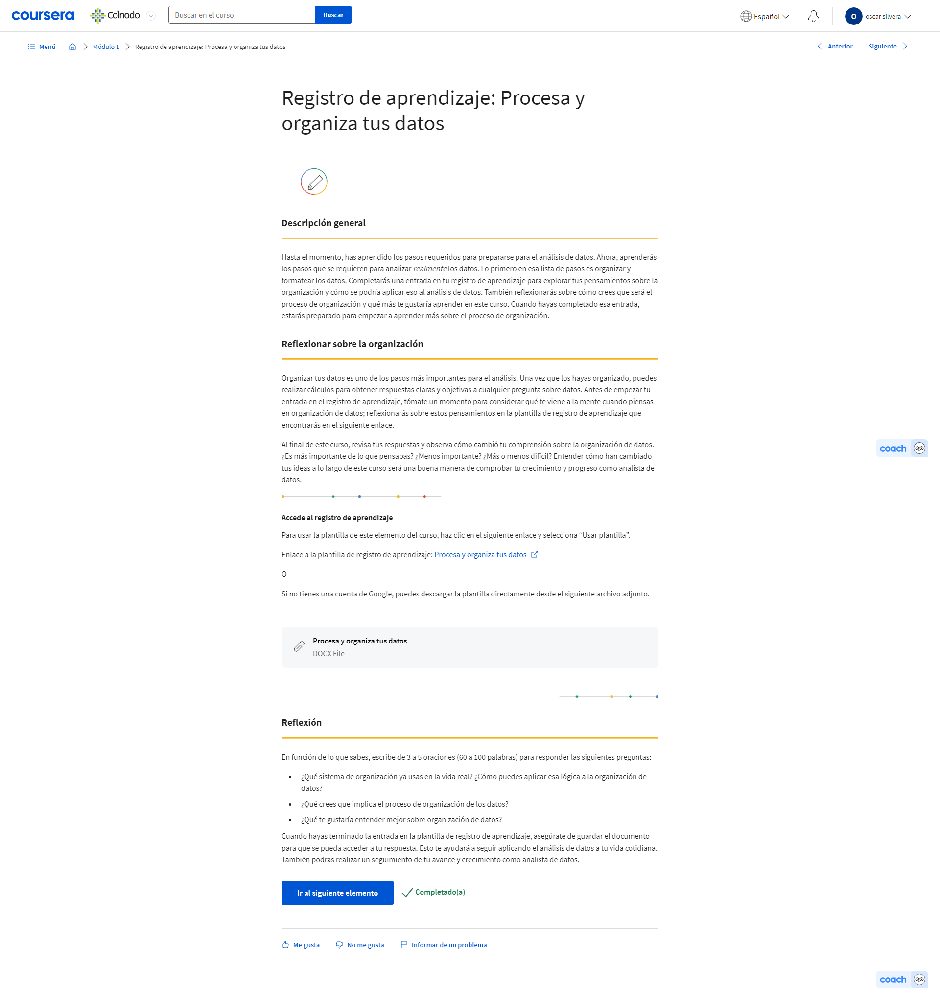

### Conceptos básicos del análisis de datos

#### El proceso de análisis

Bienvenido de nuevo. Es bueno volver a verte. Hablemos de análisis. Aprendimos cómo hacer las preguntas correctas, preparar datos para la exploración, y luego procesar esos datos para asegurarnos de que estén super limpios. Llegó el momento de ir al corazón del proceso: ¡el análisis real! Era hora, ¿verdad? Pero ¿qué es el análisis? Básicamente, el análisis es el proceso que se usa para dar sentido a los datos recopilados. Significa adoptar los pasos correctos para avanzar y pensar en tus datos de diferentes maneras. El objetivo del análisis es identificar tendencias y relaciones entre los datos para que puedas responder con precisión la pregunta que te haces. Para hacer esto, debes cumplir las cuatro fases del análisis: organizar los datos, formatear y ajustar los datos, obtener comentarios de los demás, y transformar los datos observando las relaciones entre los puntos de datos y hacer cálculos. Apliquemos las cuatro fases del análisis a un escenario del mundo real. Imagínate que quieres comprar un regalo para la boda de tu amiga Zara. El problema es que no estás seguro de qué regalarle. Afortunadamente, hay toneladas de datos en el sitio web de la boda. Pero en lugar de leer todos los datos del sitio web y recorrer el álbum de fotos de ella o de su pareja, vas directo al registro en línea, una lista de regalos que les gustaría recibir. El registro es como un conjunto de datos que puedes analizar para tomar una decisión. Ya revisaste los datos organizados en el registro, quieres asegurarte de que la lista de datos, o los regalos, en este caso, esté formateada de una manera que sea fácil de consultar. Formatear los datos optimiza las cosas y ahorra tiempo. Revisar cientos de regalos puede llevar mucho tiempo. En cambio, puedes ajustar los datos de manera que sean fáciles de digerir mediante el filtrado y la ordenación de tus datos. Tienes un presupuesto al que te debes ajustar, así que ordenas los precios de los regalos de menor a mayor. Luego filtras los precios para incluir regalos que estén dentro de tu presupuesto de $60. Estás trabajando con una lista de datos recién formateados. A esta altura, conviene recordar que la opinión de otras personas también puede ser realmente útil cuando se analiza información y se toman decisiones. Puedes chequear la lista de regalos para averiguar si alguien más compró alguno de los artículos. Descubres que algunos artículos de la lista ya han sido comprados, y esto informa tu decisión. Cuando analices datos, es importante conocer la opinión de los demás porque esto nos aporta un punto de vista que quizás no entiendas o al que no tengas acceso. Además de obtener la opinión de otras personas, también es importante conocer los puntos de vista de los demás desde el principio. Así, si ellos predicen obstáculos o desafíos, lo sabrás de antemano. Las personas a las que recurrirás para obtener su opinión no necesariamente tienen que ser expertos para ser de utilidad. A veces, todo lo que necesitas es alguien que esté familiarizado con el tema o con los datos que estás considerando. En nuestro ejemplo, serían los invitados a la boda de Zara que compran regalos en el mismo registro en línea. Quizás no sean expertos en regalos de boda, pero su colaboración al marcar los artículos que compran, puede ayudarte a averiguar qué no comprar, lo cual le evitará a Zara recibir dos veces el mismo regalo. En definitiva, obtener esa opinión es valioso para tu análisis. Esto nos lleva al próximo paso del análisis: la transformación de los datos. Transformar datos significa identificar relaciones y patrones entre los datos, y hacer cálculos en base a los datos que tienes. Regresemos a nuestro ejemplo. Pudiste encontrar un regalo que sabías que a Zara le gustaría, y uno que coincidiera con tu presupuesto. También pudiste elegir un regalo que ya no lo hubiera comprado otra persona. Encontrar la relación entre estos puntos de datos, te permitió elegir, comprar y enviar un regalo que responda al problema que querías resolver. El atractivo del proceso de análisis es que probablemente ya analices situaciones en tu vida cotidiana. Ya sea que analices datos en tu vida personal o profesional, estas cuatro tareas pueden ayudarte a tomar mejores decisiones. Cuanto más lo apliques, más cómodo te sentirás con el proceso. Espero que esto te permita comprender mejor los conceptos básicos del análisis. A medida que avancemos, analizaremos cómo ubicar datos para realizar el análisis, tanto en hojas de cálculo, como con SQL. Cuando estés listo, puedes avanzar. ¡Hasta pronto!

#### Ayanna: Comprometerte a eso

[MÚSICA] Creo que una de las cosas más fascinantes de trabajar con datos en Google es que tenemos uno de los conjuntos de datos más valiosos del mundo. La gente considera a los datos de Google como una ventana a la curiosidad humana. Vemos a Google como un verdadero representante de lo que ocurre en el mundo. Por eso, la mayoría de nuestros auspiciantes valoran muchísimo los datos y las conclusiones que podemos darles en Google porque creen que Google representa o refleja lo que ocurre en su empresa o en su sector económico. Y por eso creo que el valor de los datos con los que podemos trabajar en Google mantiene mi interés y entusiasmo en el trabajo que hago. Llegué a Google hace tres años, después de dedicarme algunos años a la consultoría. Me interesaba mucho cambiar a un rol que se focalizara en ventas y marketing. Pero al mismo tiempo, quería seguir aprovechando las destrezas analíticas que había adquirido antes. Este puesto fue un complemento ideal para el conjunto de destrezas que ya tenía y mi interés en pasar a la función de ventas y marketing. Creo que es importante que todos los alumnos se den cuenta de que nadie aprende este material de la noche a la mañana. Es muy probable que muchos de tus colegas a los que consideras expertos hayan adquirido ese nivel de experiencia a lo largo de años en el área. Creo que uno de los atributos más grandes que los alumnos deberían tener presente es que lo más importante a lo largo de este proceso de aprendizaje es tener determinación. Determinación para entender que puede ser una lucha, un desafío, pero si le dedicas trabajo y tiempo, estos conceptos terminarán fluyendo con facilidad, y estarás bien encaminado para convertirte en analista de datos. Hola, mi nombre es Ayanna y soy gerente de información global aquí en Google.

#### Cuestionario práctico: Pon a prueba tus conocimientos sobre la comprensión del análisis de datos

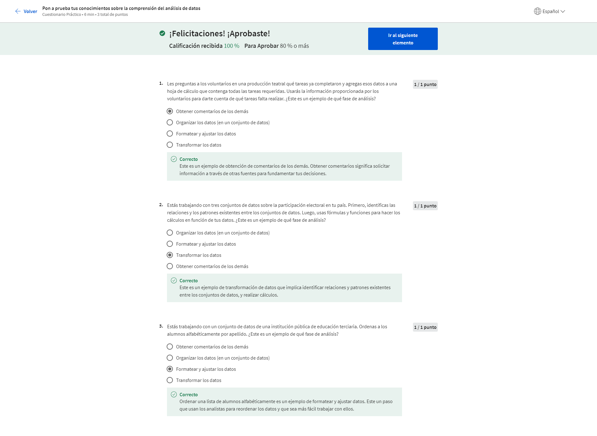

### Organizar los datos para el análisis

#### Siempre es necesario organizar

Hola de nuevo. Retomemos el tema. En este preciso momento estamos en la fase Analizar del proceso de análisis de datos. Y aunque cada fase es única, los analistas de datos toman decisiones sobre la organización en todas las fases.
Reproduce el video desde ::15 y sigue la transcripción0:15
De eso hablaremos aquí: la organización. Es super importante que mantengas tus datos organizados en todo tu análisis. La forma en que estén clasificados y estructurados tus datos afectará tus hallazgos, ya sea que trabajes en una hoja de cálculo o en una base de datos. Y una vez que sabes cómo están organizados tus datos, podrás capturar o recopilar la información que necesitas. La mayor parte de los datos que usarás en tu análisis se organizará en tablas. Las tablas te ayudan a organizar clases de datos similares por categorías y áreas temáticas de tu interés cuando analizas. Por ejemplo, esta base de datos básica tiene tablas para concesionarias de autos, detalles de los productos y de los repuestos. Cada tabla tiene entonces varios campos de datos, como el propietario de la sucursal y el costo de los repuestos. Puedes usar estas tablas y campos para que te ayuden a decidir cómo avanzar con tu análisis. La estructura de esta base de datos puede ayudarte a decidir qué datos necesitas obtener para cumplir tus objetivos. Por ejemplo, el número total de ventas de autos de una marca en particular, o un repuesto para un determinado modelo de auto en cierta sucursal.
Reproduce el video desde :1:24 y sigue la transcripción1:24
Las tablas te permiten tomar decisiones sobre los tipos de datos. Te ayudan a averiguar qué variables necesitas y los tipos de datos que deberían tener esas variables. Así que si tienes una base de datos en la cual necesitas convertir un tipo de datos durante tu análisis, puedes hacer eso con el comando CAST en SQL o cualquier otro método que aprendas en tu trabajo o a partir de tu propia investigación. Como en este ejemplo, en donde convertimos la columna de precio de compra para que sea FLOAT en lugar de STRING y nos ofrezca un formato numérico que podamos usar para los cálculos. Si realizas tu análisis en una hoja de cálculo, quieres asegurarte de que las columnas y las filas se organicen correctamente. Incluso puedes ocultar columnas que no necesitas para el análisis o que muestran información duplicada. Una vez que hayas organizado y formateado los datos, estarás listo para ordenarlos y filtrarlos para encontrar los datos que necesitas. Pronto nos abocaremos a la ordenación y el filtrado. Por ahora, solo debes saber que ambos, los filtros y las ordenaciones, varían según el tipo de datos con los que trabajamos. La conclusión es que es importante tener tus datos en el formato correcto. Así que siempre hay que estar preparado para ajustar, no importa cuánto hayamos avanzado en el análisis. Eso es todo por ahora. Próximamente te mostraremos en qué consisten los filtros. ¡Adiós!

#### Mantener los datos organizados con ordenación y filtros

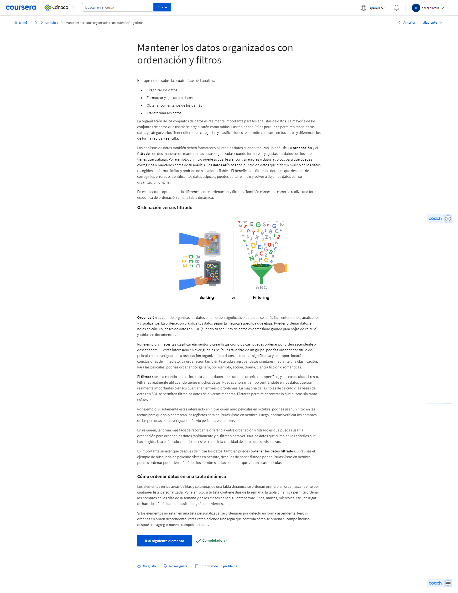

#### Opcional: Cargar el conjunto de datos de películas en BigQuery

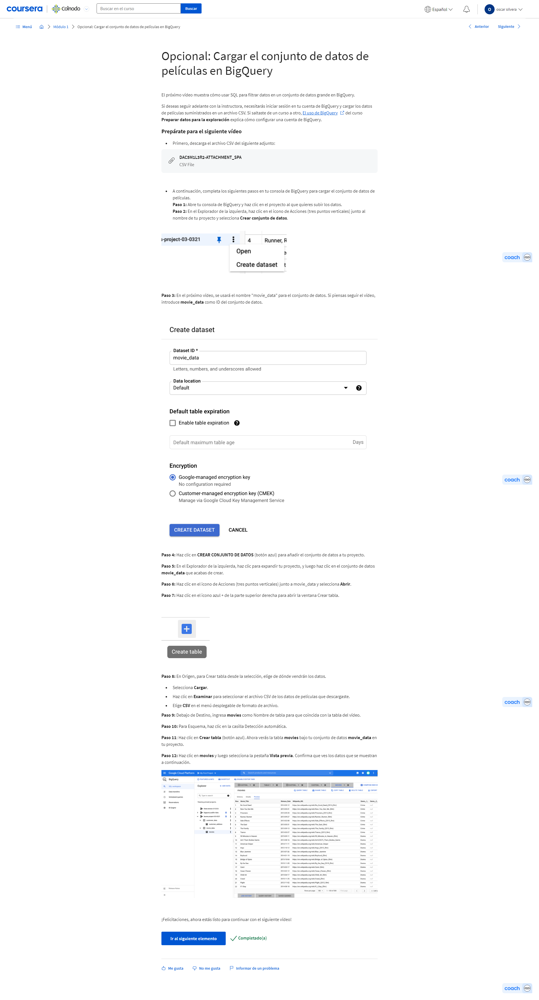

#### Más sobre ordenación y filtrado

Hola, ¡qué bueno volver a verte! Anteriormente comentamos por qué debes organizar tus datos, sin importar en qué parte de su ciclo de vida estén. Como cualquier colección, es más fácil gestionar y cuidar un grupo de cosas cuando hay una estructura que las contiene.
Reproduce el video desde ::15 y sigue la transcripción0:15
Ahora deberíamos tener en cuenta que la organización no es tan solo hacer que las cosas se vean ordenadas. También implica facilitar la búsqueda y ubicar los datos que necesitas de manera rápida y fácil. Como analista de datos, te tocará reorganizar y depurar las bases de datos muy a menudo. Dos de las maneras más comunes de hacer esto es con la ordenación y el filtrado. Ya hemos hablado brevemente de la ordenación y el filtrado, y es importante que sepas exactamente qué es cada uno. Ordenación es cuando organizas los datos en un orden significativo para que sea más fácil entenderlos, analizarlos y visualizarlos. La ordenación clasifica los datos según una métrica específica que tú seleccionas. Puedes ordenar datos en hojas de cálculo y en bases de datos que usen SQL. En breve nos abocaremos a todas las funciones geniales que puedes usar en ambos casos. Una forma común de ordenar los elementos cuando compras en un sitio web es por el precio más bajo al más alto, pero también puedes ordenar por orden alfabético, como los libros en una biblioteca, o de lo más reciente a lo más antiguo, como el orden de los mensajes de texto en un teléfono. O del más cercano al más lejano, como cuando buscas restaurantes en línea. Otra forma de organizar la información es con un filtro. Filtrar es mostrar solo los datos que cumplen con un criterio específico, mientras se oculta el resto. En general, puedes usar filtros cuando quieras acotar la cantidad de datos que deseas depurar. Por ejemplo, estás buscando zapatillas verdes en línea. Para ahorrar tiempo, filtras solo por zapatillas verdes. Usar un filtro reduce los conjuntos de datos más grandes a subconjuntos más pequeños que son relevantes para lo que tú necesitas. Ordenar y filtrar son dos acciones que probablemente realices mucho en línea. Ya sea que ordenes los horarios de una película desde el primero al último, o filtres los resultados de tu búsqueda solo por imágenes, es probable que ya estés familiarizado con lo útil que puede ser para darles sentido a los datos. Bien, aprovechemos ese conocimiento y apliquémoslo. Cuando se trata de depurar grandes pilas de datos desorganizados, los filtros te serán útiles. Tal vez recuerdes de un vídeo anterior que puedes usar filtros y programas de hojas de cálculo, como Excel y Sheets, para mostrar solo los datos de las filas que coincidan con el rango o la condición que hayas establecido. También puedes filtrar datos en SQL usando la cláusula WHERE. La cláusula WHERE funciona de manera similar al filtrado en una hoja de cálculo porque muestra filas según una condición que tú indiques. Aprendamos cómo puedes usar la cláusula WHERE en una base de datos. Usaremos BigQuery para acceder a la base de datos y ejecutar nuestra consulta. Si te unes a nosotros, abre tu herramienta preferida para usar SQL y consulta el recurso anterior sobre cómo acceder al conjunto de datos. De lo contrario, observa cómo la cláusula WHERE hace lo suyo. Aquí está la base de datos.
Reproduce el video desde :3:5 y sigue la transcripción3:05
Es probable que la reconozcas de vídeos anteriores. Básicamente, es una larga lista de películas. Cada fila incluye una entrada para las columnas denominadas: Movie_Title, Release_Date, Genre, Director, Cast_Members, Budget y Total_Revenue. También incluye un enlace a la página de Wikipedia de las películas. Si te desplazas por la lista, verás que continúa durante mucho tiempo. Por supuesto, no necesitamos recorrerla toda para encontrar los datos que necesitamos. ¡Eso es lo maravilloso del filtro! En este caso, usaremos la cláusula WHERE para filtrar la base de datos y reducir la lista de las películas al género comedia. Para empezar, usaremos el comando SELECT seguido por un asterisco. En SQL, el asterisco selecciona todos los datos. En una línea nueva, escribiremos FROM y el nombre de la base de datos: movie_data.movies. Para filtrar las películas por comedia, vamos a escribir WHERE, luego enumeraremos la condición, que es Género.
Reproduce el video desde :4:5 y sigue la transcripción4:05
Género es una columna en el conjunto de datos, y solo queremos seleccionar las filas en donde la columna Género coincide exactamente con "Comedia". Luego escribiremos el signo igual y el género específico que vamos a filtrar, que es "comedia". Como los datos de la columna Género están en formato de cadena, tenemos que usar comillas simples o inglesas cuando lo escribimos. Y recordemos que el uso de mayúsculas importa aquí, por eso verifiquemos que el uso de mayúsculas y minúsculas coincida exactamente con el nombre de la columna. Y ahora podemos hacer clic en Ejecutar para observar los resultados. Nos queda una lista más pequeña de películas de comedia. Suena genial, ¿verdad? Esto es algo más que debes saber. Puedes aplicar múltiples filtros a una base de datos. Incluso puedes ordenar y filtrar datos al mismo tiempo para obtener resultados aún más precisos. Saber cómo ordenar y filtrar datos te convertirá en un excelente analista de datos. Eso es todo por ahora. Próximamente, conoceremos los detalles de las funciones de ordenación en hojas de cálculo. Nos vemos ahí.

#### Cuestionario práctico: Pon a prueba tus conocimientos sobre la organización de datos

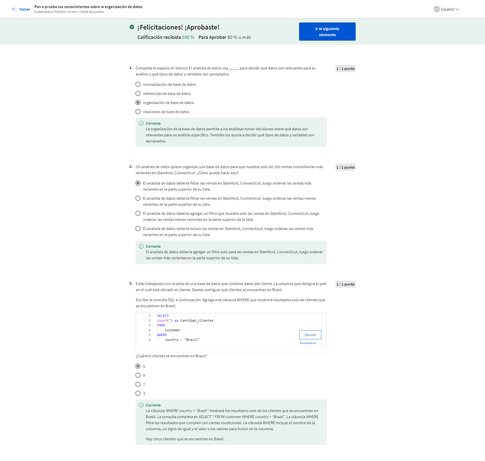

### Ordenar datos en hojas de cálculo

#### Ordenación de conjuntos de datos

¡Hola, profesional de los datos! Qué alegría volver a verte, y preparado para conocer más sobre el aspecto organizacional del análisis de datos. En este vídeo, aprenderemos cómo ordenar datos en hojas de cálculo. Ya vimos algo de ordenación en hojas de cálculo, anteriormente en el programa. Llegó el momento de aprovechar lo que hemos visto e introducir algunas técnicas de ordenación más avanzadas. La ordenación es maravillosa. No solo aporta orden y significado a tus hojas de cálculo, sino que también te empodera para recrear los datos por completo. Cuando ordenas los datos según una métrica específica, puedes descubrir nuevos patrones y relaciones entre los conjuntos de datos que de otra forma no hubieras percibido. Esto aplica especialmente a las hojas de cálculo, que usarás un montón en tu trabajo como analista de datos. Saber cómo ordenar datos en hojas de cálculo puede convertirte en un analista más fuerte y seguro. En muchos casos, ordenar depende de tu creatividad para reformular la información que tienes frente a ti. En las hojas de cálculo, puedes ordenar datos en orden ascendente o descendente mediante número o letras. Si las celdas están etiquetadas con color, puedes ordenarlas también por color. Cuando ordenes datos en una hoja de cálculo, puedes elegir "Ordenar hoja" u "Ordenar rango". Si usas "Ordenar hoja", todos los datos de la hoja de cálculo se ordenarán por las condiciones de una única columna, pero la información relacionada en otras filas, permanece junta. En cambio, "Ordenar rango" no mantiene junta la información de las distintas filas. Cuando ordenas un rango, seleccionas un conjunto específico de celdas o el rango al que quieres que se limite la ordenación. No se reorganizará ningún otro dato de las hojas de cálculo, solo las celdas especificadas. Hay dos métodos para ordenar datos en hojas de cálculo: uno involucra el uso del menú; el otro implica escribir la función de ordenar. Por ahora, nos concentraremos en la ordenación con el menú. Nos abocaremos a escribir funciones, más adelante. Ahora bien, según el programa que uses, podría variar levemente el proceso, pero las instrucciones y los conceptos que analizamos serán básicamente los mismos. Volvamos a la ordenación con el menú de datos. Para darte una idea de cómo hacerlo, usaremos la hoja de cálculo de las películas. Vamos a comprobarlo. En este ejemplo, ordenaremos las películas por la fecha de estreno. Nos dirigiremos a la columna B, que aparece con el nombre "Fecha de estreno". Haz clic en el botón "B" para resaltar todas las celdas de la columna. A partir de ahí, nos dirigiremos a la pestaña Datos del menú. Ahora tienes dos opciones: ordenar una hoja o un rango de datos. Notarás que hemos seleccionado solo las fechas de estreno, pero estas fechas de estreno se relacionan específicamente con las películas de su fila.
Reproduce el video desde :2:46 y sigue la transcripción2:46
En este caso, quieres que la fecha de estreno y el título de las películas permanezcan en la misma fila, cuando ordenes, porque esos datos están relacionados. Para hacer esto, querrás "Ordenar hoja". Esto mantendrá todos los datos juntos por fila, sin importar cómo los ordenes. Según el orden que desees que tengan las fechas, puedes ordenar de la A a la Z, lo cual también clasificará las fechas en forma numérica. O puedes ordenar de la Z a la A, que ordenará los datos en sentido contrario. Como queremos que las fechas de estreno estén en orden, haremos clic en "Ordenar hoja por columna B" de la A a la Z. Y allá vamos. Acabas de ordenar una hoja de datos desde el menú. Ahora las películas están distribuidas por orden cronológico según la fecha de estreno. Supongamos que quieres ordenar los datos en una columna específica, pero no necesitas que las celdas de esa columna se vinculen con una fila de información específica. En realidad, quieres separar los datos de la columna y ordenarlos en forma independiente sin que afecte la organización del resto de la hoja. Para divertirnos, usaremos la columna "Título de la película" de este ejemplo. Primero, seleccionaremos la columna que queremos ordenar: columna A. Hacer clic en la columna A, ilumina todas las celdas de la columna que contiene los títulos de las películas. Luego iremos al menú y haremos clic en Datos porque estamos separando la columna del resto de la hoja. Esta vez, cuando ordenemos, haremos clic en "Ordenar rango por columna A". Para este ejemplo, ordenaremos los títulos de las películas alfabéticamente de la A a la Z. ¡Y listo! Verás que "Ordenar rango" no mantiene las filas unidas, así que los datos quedan un poco mezclados. Es muy probable que termines usando "Ordenar hoja" más a menudo, pero es importante entender ambas opciones para que no las confundas accidentalmente. Acabas de ordenar los datos en una hoja de cálculo usando el menú, y has aprendido cómo ordenar datos en toda una hoja o en un rango de celdas. Podrás llevar este conocimiento contigo dondequiera que te desempeñes como analista de datos. Próximamente, aprenderemos la segunda forma de ordenar en una hoja de cálculo: escribir una función. También llevaremos la ordenación a un próximo nivel al ordenar tus datos de manera personalizada. Nos vemos ahí.

#### La función SORT

Felices de tenerte de vuelta. Anteriormente en el programa, vimos algunos conceptos básicos de la ordenación en hojas de cálculo. Aprendimos las diferencias entre ordenar un rango y una hoja entera, y cómo ordenar una hoja de cálculo usando el menú. Ya sentamos las bases, es hora de pasar a formas más avanzadas de ordenar la información. Hablamos sobre los dos métodos que existen para ordenar los datos en las hojas de cálculo. El primer método usa la pestaña Datos del menú de tu programa de hoja de cálculos. El segundo método para almacenar información en una hoja de cálculo es escribir la función SORT. En las hojas de cálculo, las funciones son comandos preestablecidos que realizan un proceso específico. Así que en este caso, la función SORT, como te imaginarás, ordena tus datos.
Reproduce el video desde ::43 y sigue la transcripción0:43
Echemos un vistazo a esta hoja de cálculo de planes de ventas por demostración para ver a la función SORT en acción. Es bueno recordar que cuando usas la función SORT, en realidad estás cambiando el conjunto de datos existente, a diferencia de la pestaña Datos del menú que reorganiza los datos en el conjunto de datos original. El primer conjunto de datos organizado es nuestro conjunto de datos original de invitados y cierta información sobre ellos. Así que supongamos que quieres ordenar a los invitados de esta reunión de ventas por mesa para tener una idea de quién se sentará en cada lugar. Para hacer esto, empieza por escribir una función en una celda vacía. Como con cualquier función, haces esto escribiendo el signo igual, y luego escribes SORT después del signo.
Reproduce el video desde :1:28 y sigue la transcripción1:28
Después del primer paréntesis de apertura, indica la primera celda en la cual se recogen los datos. En este caso, es A2.
Reproduce el video desde :1:41 y sigue la transcripción1:41
Luego incluirás dos puntos y escribirás la última celda que quieres que se incluya en la función, que es la D6.
Reproduce el video desde :1:54 y sigue la transcripción1:54
A2 dos puntos D6 es el rango para esta función. Después, escribe una coma para separar el rango de lo que estás ordenando, que es la columna B.
Reproduce el video desde :2:10 y sigue la transcripción2:10
Debes tener presente que esta parte de la función no reconoce letras de columna. Así que en este caso, usaremos el número correspondiente, que es el 2, ya que la columna B es la segunda columna de nuestro rango.
Reproduce el video desde :2:28 y sigue la transcripción2:28
Ahora agrega otra coma.
Reproduce el video desde :2:32 y sigue la transcripción2:32
En esta próxima parte deberás decidir si quieres que los datos de esta columna aparezcan en orden ascendente o descendente, La instrucción TRUE indica el orden ascendente, y FALSE es descendente. Como queremos que las mesas se enumeren a partir de la mesa número uno, escribiremos TRUE para el orden ascendente, y luego terminaremos la función con un paréntesis de cierre. Ahora, veamos cómo actúa nuestra función.
Reproduce el video desde :2:59 y sigue la transcripción2:59
Los invitados de la reunión de ventas ahora están ordenados por la mesa en la cual se sentarán.
Reproduce el video desde :3:3 y sigue la transcripción3:03
Cuando ya tienes una idea de los datos que quieres ordenar y cómo quieres hacerlo, aplicar las funciones a tus datos es algo simple. Ahora ya tienes dos herramientas diferentes en tu cinturón de herramientas para ordenar los datos. Después de haber aprendido a escribir funciones SORT, también querrás personalizar los criterios de ordenación. El criterio de ordenación personalizada es aquel que ordena los datos en una hoja de cálculo usando múltiples condiciones. Esto significa que la ordenación se basará en el orden de las condiciones que selecciones. Volvamos a la hoja de cálculo de la reunión de ventas. Imagínate que quieres que se ordenen los invitados según se les haya enviado o no invitación. En función de eso, queremos que los nombres de esos invitados se orden alfabéticamente. Puedes hacer eso fácilmente con la opción "Ordenar rango" en la pestaña Datos.
Reproduce el video desde :3:46 y sigue la transcripción3:46
Primero, resalta todos los datos en el conjunto de celdas de la A1 a la D6. Luego debajo de la pestaña Datos del menú, haz clic en "Ordenar rango".
Reproduce el video desde :3:59 y sigue la transcripción3:59
En este caso, marca "Los datos tienen una fila de encabezado", que te asegura que el título de la columna no se mezcle en la ordenación. Luego, nos aseguraremos que se ordene por "Invitación enviada".
Reproduce el video desde :4:13 y sigue la transcripción4:13
Aquí, queremos que primero aparezcan las respuestas que dicen "No" y después las que dicen "Sí", así que verificaremos que esté marcado de la A a la Z para ordenar las respuestas en ese orden. Como queremos agregar una condición de ordenación adicional, ahora haremos clic en "Agregar otra columna de ordenación". Los nombres de los invitados deberían estar en orden alfabético. Así que seleccionemos "Nombre del invitado" y ordenemos de la A a la Z.
Reproduce el video desde :4:40 y sigue la transcripción4:40
Luego haremos clic en Ordenar. Y, ¡listo! Has aplicado oficialmente un criterio de ordenación personalizada como un campeón.
Reproduce el video desde :4:50 y sigue la transcripción4:50
Bien, has aprendido a ordenar hojas de cálculo por hoja, por rango, mediante el menú y usando una función. No solo eso, has sumado destrezas de organización al aprender cómo crear criterios de ordenación personalizada. Muy pronto aprenderás otra herramienta poderosa: cómo ordenar datos usando SQL. Aunque a veces el tema de las bases de datos puede ser muy amplio, el aprendizaje de estas habilidades te da el poder de reorganizar los datos de manera que cobren sentido para ti. Una vez que hayas ordenado los datos de una forma que realmente encaje, entenderás por qué es algo tan valioso para ti como analista de datos. ¡Hasta pronto!
Felices de tenerte de vuelta. Anteriormente en el programa, vimos algunos conceptos básicos de la ordenación en hojas de cálculo. Aprendimos las diferencias entre ordenar un rango y una hoja entera, y cómo ordenar una hoja de cálculo usando el menú. Ya sentamos las bases, es hora de pasar a formas más avanzadas de ordenar la información. Hablamos sobre los dos métodos que existen para ordenar los datos en las hojas de cálculo. El primer método usa la pestaña Datos del menú de tu programa de hoja de cálculos. El segundo método para almacenar información en una hoja de cálculo es escribir la función SORT. En las hojas de cálculo, las funciones son comandos preestablecidos que realizan un proceso específico. Así que en este caso, la función SORT, como te imaginarás, ordena tus datos. Reproduce el video desde ::43 y sigue la transcripción0:43 : agregado a la selección Presiona [CTRL + S] para guardar como nota.
es

#### Ordenación y filtrado en Sheets y Excel

<https://support.google.com/docs/answer/3540681>
<https://www.youtube.com/watch?v=VcRBHXBMKBU>
<https://blog.sheetgo.com/google-sheets-formulas/sort-formula-google-sheets/>
<https://support.google.com/docs/answer/3093150?hl=en>
<https://support.google.com/docs/answer/3093197?hl=en>
<https://support.microsoft.com/en-us/office/sort-data-in-a-range-or-table-62d0b95d-2a90-4610-a6ae-2e545c4a4654>
<https://support.microsoft.com/en-us/office/video-sort-data-in-a-range-or-table-ffb9fcb0-b9cb-48bf-a15c-8bec9fd3a472#ID0EAABAAA=Transcript>
<https://www.youtube.com/watch?v=Ep5q1cUhQas>
<https://support.microsoft.com/en-us/office/sort-function-22f63bd0-ccc8-492f-953d-c20e8e44b86c>
<https://support.microsoft.com/en-us/office/sortby-function-cd2d7a62-1b93-435c-b561-d6a35134f28f>
<https://support.microsoft.com/en-us/office/filter-function-f4f7cb66-82eb-4767-8f7c-4877ad80c759>

#### Emma: El recorrido hacia una carrera significativa

Soy Emma, analista de productos en Google Health. El producto para el que estoy ayudando a analizar los datos es una herramienta destinada a los médicos, que les permitirá encontrar los datos de salud de sus pacientes con tanta facilidad como cuando buscamos algo en Google Search. Específicamente me focalizo en la estandarización de los datos de atención médica, los analizo para detectar anomalías o problemas en la calidad de los datos, y hablo con los gerentes de producto sobre qué características deberíamos lanzar y por qué. He trabajado en temas que abarcan desde resolución de fallas en locomotoras para prevenirlas antes de que ocurran, hasta proyecciones de ventas para carteras, incluso antes de su lanzamiento al mercado, y ahora estoy trabajando con datos de atención médica para intentar que los médicos puedan tener los datos de sus pacientes al alcance de la mano. Realmente me interesaba trabajar en análisis computacional de datos, pero quería darme cuenta de con qué tipo de datos quería trabajar o en qué área del análisis computacional de datos quería concentrarme, porque es algo tan vasto. Finalmente me atrajo trabajar con datos de atención médica. Me fascinó el tema, todos los problemas que tenemos hoy en día en el área de atención médica y cómo podría mejorarse esta gran cantidad de datos disponibles en el área de salud con el fin de ayudar a los pacientes y a los médicos, para mejorar la salud de la población. Trabajar con conjuntos de datos significativos es lo que realmente me estimula a venir a trabajar cada día y me fascina resolver estos problemas. En mi profesión aprendí que seguir los conjuntos de datos que me interesan, los tipos de problemas que me interesan, siempre me dio los mejores resultados porque es lo que más me impulsa cada día a venir a trabajar y dar lo mejor de mí para resolver estas cuestiones tan atrapantes que es justo lo que yo quería. Lo sorprendente es que hay datos por todas partes, hay problemas de datos en todas las empresas, en todos los rubros, y llegas al punto de dejarte llevar por lo que te apasiona.

#### Cuestionario práctico: Pon a prueba tus conocimientos sobre ordenación y filtrado

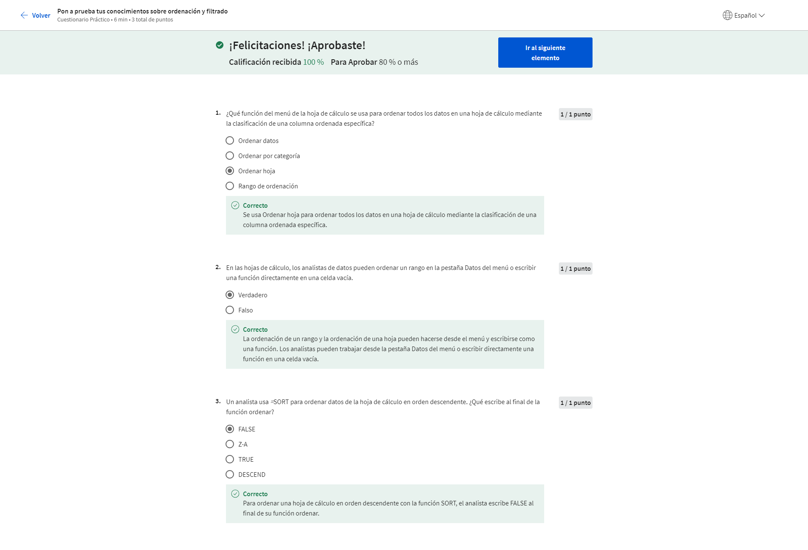

### Ordenar datos usando SQL

#### Ordenación de consultas en SQL

¡Hola! Si deseabas aprender sobre ordenación en SQL decididamente estás en el lugar indicado. Hasta ahora hemos ordenado hojas de cálculo a través del menú y con una función escrita. Esto nos conduce a la siguiente parte de nuestro aprendizaje: más funciones de ordenación, pero esta vez en SQL. Los analistas de datos aman jugar con la forma en que se presentan los datos. La ordenación es una manera útil de reorganizar los datos porque puede ayudarte a comprender los datos que tienes, desde una perspectiva diferente. Como te habrás dado cuenta, muchas de las cosas que puedes hacer en las hojas de cálculo, también las puedes hacer en SQL. La ordenación es una de ellas. Ya hablamos sobre el uso de SQL con grandes conjuntos de datos. Cuando una hoja de cálculo tiene demasiados datos, quizás recibas mensajes de error, o puede hacer colapsar tu programa. Eso es algo que definitivamente queremos evitar. SQL reduce los procesos que de otra forma llevarían mucho más tiempo o serían imposibles de completar en una hoja de cálculo. Personalmente, uso SQL para extraer y combinar diferentes tablas de datos. Es mucho más rápido que una hoja de cálculo, y eso suele ser muy práctico. Aquí hay algo bastante útil que puedes hacer con SQL. Puedes usar la cláusula ORDER BY para ordenar los resultados que arroja una consulta. Volvamos a nuestra hoja de cálculo de películas para entender mejor cómo funciona esto. Siéntete libre de seguirlo en la herramienta SQL que prefieras, a medida que avanzamos. Para repasar rápidamente, tenemos una base de datos de películas que incluye datos como fecha de estreno, director, etc. Podemos ordenar esta tabla de muchas maneras diferentes usando la función ORDER BY. Para este ejemplo, vamos a ordenar por fecha de estreno. Primero, tenemos la función SELECT y un asterisco.
Reproduce el video desde :1:51 y sigue la transcripción1:51
Ten en cuenta que el asterisco significa que se seleccionan todas las columnas. Luego tenemos FROM y el nombre de la base de datos y la tabla en la que estamos justo ahora. Ahora vamos a verificar la línea siguiente. Está vacía, pero ahí es donde escribiremos nuestra función ORDER BY. El comando ORDER BY<i> </i>suele ser la última cláusula de la consulta. Volvamos a la ordenación real. Escribiremos ORDER BY<i> </i>con el espacio. Con esta cláusula, puedes ordenar los datos por campos en una columna determinada. Como queremos ordenar por fecha de estreno, escribiremos fecha_de_estreno. En forma predeterminada, la cláusula<i> </i>ORDER BY ordena los datos en forma ascendente. Si ejecutas la consulta así como está ahora, las películas se ordenarán de la fecha de estreno más antigua a la más reciente. Ejecutemos esta consulta y veamos qué sale. También puedes ordenar las fechas de estreno en sentido inverso, de la fecha más reciente a la más antigua. Para hacer esto, simplemente especifica el orden descendente en el comando ORDER BY escrito como DESC, D-E-S-C. Vamos a ejecutar esta consulta.
Reproduce el video desde :3:6 y sigue la transcripción3:06
Como observarás, las películas más recientes ahora aparecen en la parte superior de la base de datos. En las hojas de cálculo, puedes combinar ordenaciones y filtros para visualizar la información de manera diferente. También puedes hacer algo similar en SQL. Tal vez recuerdes que si bien la ordenación ubica los datos en un orden específico, los filtros acotan los datos, por eso solo ves los datos que se ajustan al filtro. Por ejemplo, supongamos que queremos filtrar las películas por género de manera tal que solo trabajemos con las comedias. Pero queremos seguir manteniendo las fechas de estreno ordenadas en orden descendente, de las películas más recientes a las más antiguas. Podemos hacer esto con la cláusula WHERE. Probemos eso ahora. Primero, verificaremos que la cláusula ORDER BY siempre sea la última línea. Eso nos asegura que todos los resultados de la consulta que estás ejecutando se ordenen por esa cláusula. Luego, agregaremos una nueva línea para la cláusula WHERE después de FROM y antes de ORDER BY.
Reproduce el video desde :4:9 y sigue la transcripción4:09
Esto es lo que tenemos hasta ahora. A partir de aquí, queremos escribir la columna que estamos filtrando. En este caso, queremos filtrar la base de datos para comedias. Después de la cláusula WHERE, escribiremos la palabra Género<i> </i>para la columna de la lista. Ahora, agregaremos un signo igual después de Género porque solo queremos incluir los géneros que coincidan con el dato que estamos filtrando. En este caso, estamos filtrando las comedias, así que escribiremos Comedia<i> </i>entre comillas. Ahora, si revisas la consulta completa, observarás que estamos seleccionando todas las columnas, y sabemos que son todas las columnas porque eso significa el asterisco. La cláusula FROM especifica el nombre de la base de datos de películas que estamos usando, y la cláusula WHERE filtra los datos para incluir las entradas cuyo género se especifica como comedia. Luego, en la última línea, tenemos la cláusula ORDER BY, que ordenará los datos que hemos elegido filtrar por fecha de estreno, en orden descendente. Esto significa que cuando ejecutemos la consulta, solo veremos la lista de las películas que son comedias desde los estrenos más recientes a los más antiguos. Ejecutémoslo y veamos si es así.
Reproduce el video desde :5:25 y sigue la transcripción5:25
Genial. Corroboremos todas las películas que son comedias y la forma en que se ordenaron las fechas.
Reproduce el video desde :5:33 y sigue la transcripción5:33
Ahora, avancemos un poco más con esta consulta. Filtraremos por dos condiciones a la vez usando el filtro AND. Sigamos trabajando en la consulta que hemos usado y agreguemos unasegunda condición en la cláusula WHERE. Mantendremos la misma ordenación. Supongamos que quieres filtrar las películas por comedias y aquellas que recaudaron más de 300 millones. En este caso, después de la función AND, agregarás la condición de la recaudación escribiendo la palabra Ingresos. A partir de ahí, especificarás que solo quieres que muestre las películas con una recaudación superior a los $300 millones. Para hacer eso, escribe el signo mayor que y luego el número completo de 300 millones, sin comas. Vamos a ejecutar la consulta.
Reproduce el video desde :6:23 y sigue la transcripción6:23
Aquí, los datos solo muestran las películas que son comedias con recaudación superior a los $300 millones, y se ordenan por fecha de estreno, en orden descendente. Se ve realmente muy bien. Acabas de filtrar y ordenar una base de datos como si fuera en tu trabajo. Y con práctica, un día lo lograrás. Así de fácil, has completado otro paso en tu trayectoria de analista de datos. A estas alturas, realmente has profundizado y aprendido sobre el proceso de análisis con especial énfasis en la forma en que la organización puede cambiar cómo examinas tus datos. También has aprendido sobre hojas de cálculo y SQL, y cómo ordenar y filtrar datos en estos dos tipos de programas. Para que te sientas más cómodo con el uso de las funciones de las hojas de cálculo y de SQL, recibirás algunos materiales que puedes usar como recurso. A continuación, aprenderemos cómo la mentalidad organizativa puede potenciar aún más tus destrezas analíticas. También abordaremos la conversión, el formateo y el ajuste de datos para combinar información de una manera que tenga sentido. Aprender esas destrezas precozmente puede hacer que tu trabajo como analista de datos sea mucho más eficaz y efectivo a largo plazo. Nos vemos pronto.

#### Repaso opcional: Usar BigQuery

<https://cloud.google.com/bigquery/docs>
<https://www.coursera.org/learn/preparar-datos-para-la-exploracion/item/DYOQK>

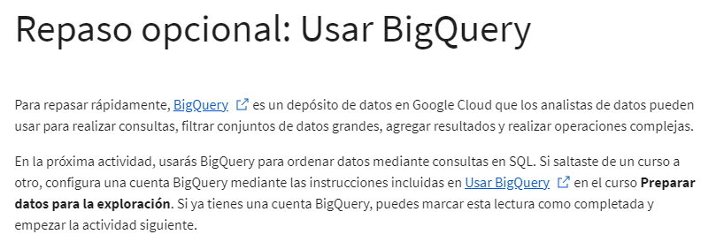

#### Actividad práctica: Ordenación de consultas en SQL

<https://cloud.google.com/bigquery/docs/sandbox>
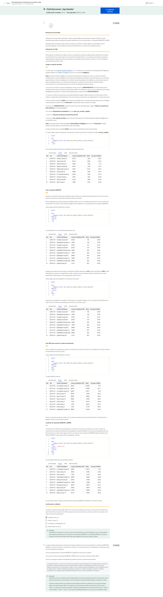

#### Actividad práctica: Analizar datos meteorológicos en BigQuery

#### Pon a prueba tus conocimientos sobre ordenación en SQL

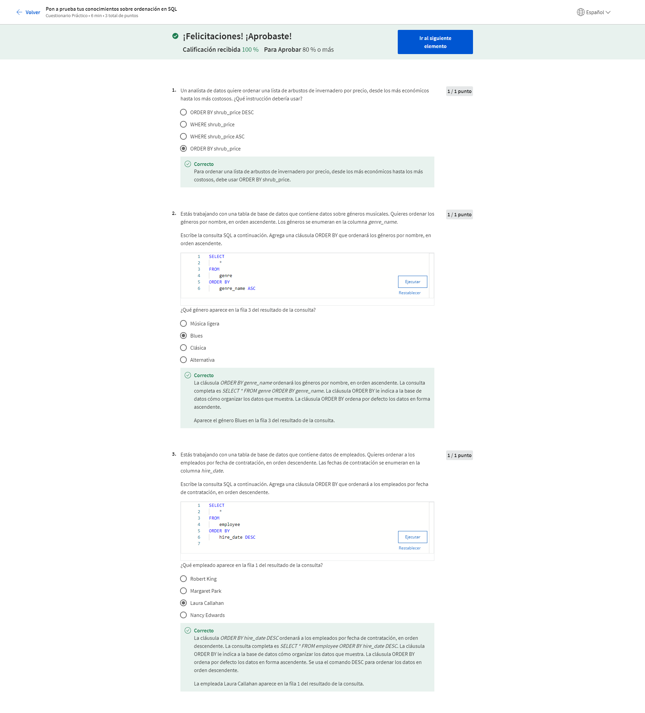

### Desafío semanal 1 curso 5

#### Cuestionario: Desafío semanal 1

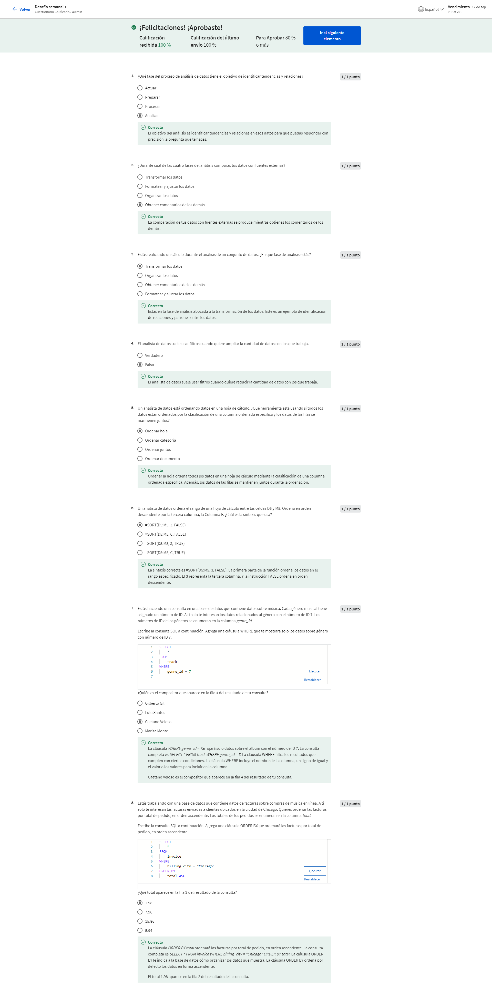

## Formatear y ajustar datos

### Convertir y formatear datos

#### Primeros pasos con el formateo de datos

Hola, es genial tenerte de vuelta. Ya aprendiste mucho. Ahora puedes empezar a analizar datos. A continuación, vamos a repasar algunas últimas cosas que necesitas hacer en tu análisis, así te aseguras de que tus datos estén bien formateados y adaptados.
Reproduce el video desde ::16 y sigue la transcripción0:16
Vamos a empezar a convertir y formatear tus datos, y vamos a usar validación de datos y también formato condicional en las hojas de cálculo. También aprenderás a combinar distintos tipos de datos. Por último, hablaremos sobre cómo recibir apoyo durante el análisis y cómo encontrar recursos cuando sientes que no avanzas.
Reproduce el video desde ::33 y sigue la transcripción0:33
Esas destrezas sirven para garantizar que el proceso de análisis de datos sea lo más fluido posible. Y aunque no lo sea, sabrás cómo enfrentar cualquier problema que surja.
Reproduce el video desde ::44 y sigue la transcripción0:44
Una parte importante de ser analista tiene que ver con resolver problemas. Cuando eres buen analista, haces las preguntas correctas, por eso dedicaremos algo de tiempo a aprender sobre estrategias para resolver problemas durante el análisis de datos. ¿Quieres empezar a aprender sobre formateo de datos y resolución de problemas? Pasa al siguiente vídeo para empezar.
Hola, es genial tenerte de vuelta. Ya aprendiste mucho. Ahora puedes empezar a analizar datos. A continuación, vamos a repasar algunas últimas cosas que necesitas hacer en tu análisis, así te : agregado a la selección Presiona [CTRL + S] para guardar como nota.
es

#### De un tipo a otro

¡Hola! Hasta ahora, aprendimos sobre conversión de tipos de datos con SQL para pasar de un tipo de datos a otro en las bases de datos. Ahora, me gustaría explorar otra forma de formatear tipos de datos en hojas de cálculo. En este vídeo, hablaremos sobre por qué es tan importante garantizar que tus datos estén bien formateados y sobre cómo formatear números y convertir unidades de medición en tus hojas de cálculo. ¡Empecemos!
Reproduce el video desde ::29 y sigue la transcripción0:29
A veces, estás trabajando con tu hoja de cálculo y necesitas convertir datos. Eso significa cambiar ciertas cifras para que tengan el formato de fecha, cadena de texto, porcentaje o, incluso, moneda.
Reproduce el video desde ::39 y sigue la transcripción0:39
Es importante que te fijes que todos tus datos tengan el formato correcto para tu análisis. A veces, ya terminaste de limpiar y procesar los datos, pero notas que no están en el formato que necesitas.
Reproduce el video desde ::51 y sigue la transcripción0:51
Tomemos, por ejemplo, la tabla con los datos de películas que vimos antes. Había muchos tipos de datos distintos que incluían cifras, como fechas y presupuestos, y también cadenas de texto, como nombres de actores y actrices.
Reproduce el video desde :1:3 y sigue la transcripción1:03
Estos son todos valores distintos, pero la hoja de cálculo no siempre lo detecta automáticamente. Aquí hay un ejemplo. Digamos que, por ejemplo, quieres ordenar las películas según las más recientes. Si la hoja de cálculo toma los datos como cadenas de texto y no como fechas, es posible que las ordene alfabéticamente. Si no cambias el tipo de datos, no podrás ordenarlas de la forma que quieres. También puede pasar que tus conjuntos de datos contengan distintas unidades de medición que tienes que convertir. Por ejemplo, puede que tu tabla contenga cifras en dólares estadounidenses y libras esterlinas. Por eso, es importante que verifiques esos tipos de datos una vez más, así no tendrás problemas durante el análisis. Volvamos al ejemplo de las fechas incorrectas en la tabla de películas. Si tu jefa necesita una lista de las 20 películas más recientes, pero tu hoja de cálculo está ordenada alfabéticamente y no según las fechas más recientes, tu jefa no recibe la lista de películas que necesita. Si los datos no están bien formateados, pueden ocurrir errores graves en tu análisis, y eso podría afectar la toma de decisiones de los interesados.
Reproduce el video desde :2:10 y sigue la transcripción2:10
Pero si te tomas tu tiempo para convertir y formatear tus datos, puedes evitar esos errores.
Reproduce el video desde :2:16 y sigue la transcripción2:16
Ahora que ya sabes por qué necesitas convertir los tipos de datos mientras trabajas con las hojas de cálculo, veamos cómo hacerlo.
Reproduce el video desde :2:23 y sigue la transcripción2:23
Primero, te mostraré un menú muy útil para especificar distintos tipos de datos en las hojas de cálculo. Aquí está la tabla de películas que usamos antes, pero ahora la columna de moneda no tiene el tipo de formato de moneda. En la barra de herramientas en la parte superior de la hoja, verás un menú que te puede ayudar a convertir estos números en tipos de datos específicos. En el menú desplegable tienes muchas opciones, como cifra, moneda, fecha, porcentaje... Si haces clic y abres todo el menú, tienes aún más opciones, incluida una para formato personalizado de cifras. Sabemos que queremos que estas columnas tengan el formato de moneda, así que hagamos eso. Solo tengo que seleccionar esta columna y hacer clic en el atajo de moneda.
Reproduce el video desde :3:8 y sigue la transcripción3:08
Ahora está todo bien escrito. Y eso no es todo. Hasta puedes convertir la unidad de medición que estás usando. Para este ejemplo, veamos una tabla distinta. Imagina que trabajas para un canal que pronostica el tiempo y recopilas datos sobre la temperatura diaria. Tienes una tabla con algunos datos sobre observaciones diarias de temperatura, velocidad del viento y precipitaciones en la zona. En este momento, las temperaturas están en grados Fahrenheit, pero para el análisis las necesitas en grados Celsius. No hay problema. Solo tienes que usar la función CONVERT para cambiar la unidad de medición. Usemos esta columna vacía aquí. Esta es la primera temperatura de la tabla. Escribiremos la función CONVERT en nuestra nueva columna para pasar la temperatura a Celsius. Luego, tenemos que elegir la celda que queremos convertir. Por último, tenemos que convertirla.
Reproduce el video desde :4:2 y sigue la transcripción4:02
¡Listo! Ahora, esta celda tiene la unidad de medición correcta para el análisis. Ya puedes propagarla al resto de la columna. Ahora, estos datos de temperatura están todos en Celsius, y la unidad de medición es la misma en toda la tabla. ¿Quieres otro consejo? Cuando agregas datos a una tabla usando una fórmula, puedes pegar los datos como valores más tarde. Así, quedan bloqueados. Si no, la celda queda en formato de fórmula y podría ser un poco confuso cuando empiezas a trabajar con los datos. Hagamos eso ahora. Copiaremos los valores y, luego, haremos clic con el botón derecho en una nueva columna. Hay una opción que es "Pegado especial". También hay una opción que es "Pegar solo valores". Ahora, tenemos los valores estáticos en esta columna. Es muy importante que garantices que los datos están en el formato correcto antes de empezar el análisis. Si lo haces, tu análisis te devolverá el tipo de respuesta que necesitas. Ahora ya conoces algunas formas de convertir cifras y unidades de medición en hojas de cálculo, así que puedes saber a ciencia cierta que tus datos tienen el formato correcto.
Reproduce el video desde :5:13 y sigue la transcripción5:13
A continuación, hablaremos un poco más sobre cómo ajustar tus datos para el análisis y sobre la validación de datos. Nos vemos pronto.

#### Convertir datos en hojas de cálculo

<https://www.ablebits.com/office-addins-blog/2015/03/26/excel-convert-text-date/#:~:text=Excel%20DATEVALUE%20function%20%2D%20change%20text,Excel%20recognizes%20as%20a%20date.&text=So%2C%20the%20formula%20to%20convert,stored%20as%20a%20text%20string.>

<https://www.ablebits.com/office-addins-blog/2019/08/13/google-sheets-change-date-format/>

<https://www.ablebits.com/office-addins-blog/2018/07/18/excel-convert-text-to-number/>

<https://productivityspot.com/convert-text-to-numbers-google-sheets/>

<https://support.microsoft.com/en-us/office/combine-text-from-two-or-more-cells-into-one-cell-81ba0946-ce78-42ed-b3c3-21340eb164a6>

<https://www.techrepublic.com/article/how-to-split-or-combine-text-cells-with-google-sheets/>

<https://support.microsoft.com/en-us/office/format-numbers-as-percentages-de49167b-d603-4450-bcaa-31fba6c7b6b4>

<https://support.google.com/docs/answer/3094284?hl=en>

<https://support.microsoft.com/>

<https://support.google.com/docs/?hl=en#topic=1382883>

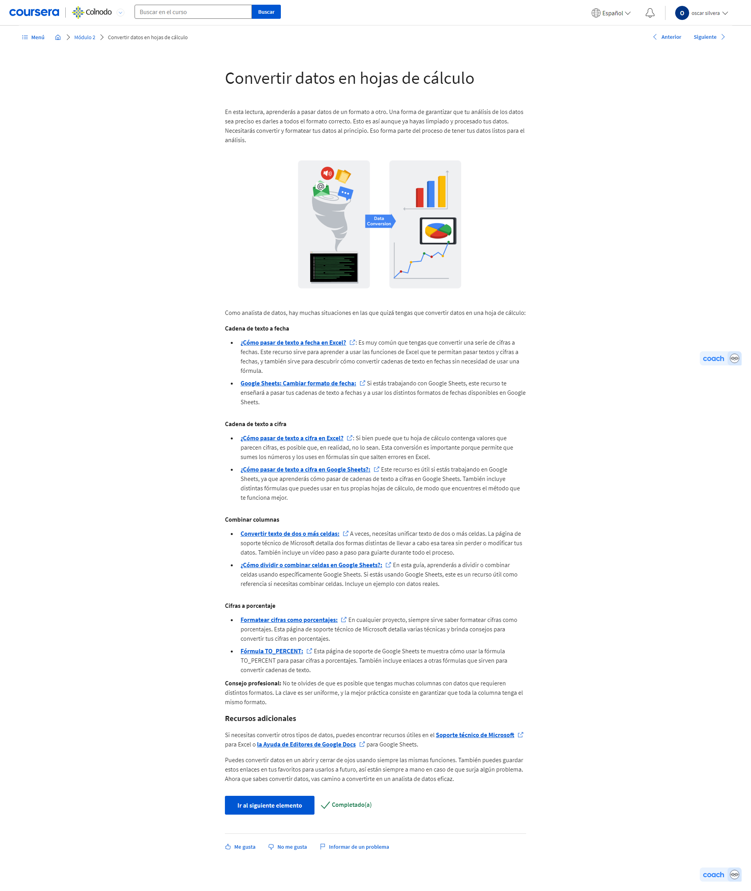

#### Actividad práctica: Combinar distintos tipos de datos

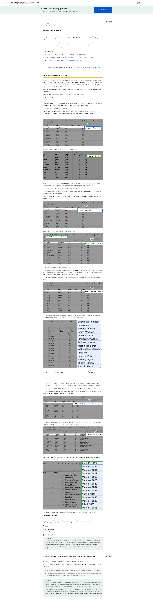

#### Validación de datos

¡Es bueno verte de nuevo! Aprovecho mientras aprendemos a formatear datos para contarte sobre otra función de la hoja de cálculo: la validación de datos. En este vídeo, te enseñaré un poco sobre la función de validación de datos y te mostraré cómo usarla. Por ahora, cuando hablo de validación de datos, me refiero a la función, que es distinta al proceso de validación de datos. Ya veremos eso también. Pero, primero, hablemos de qué hace la validación de datos en las hojas de cálculo. En pocas palabras, te permite controlar qué datos puedes o no ingresar en tu hoja de cálculo. Por lo general, se usa la validación de datos para agregar listas desplegables a las celdas con opciones predeterminadas para que los usuarios elijan. Si tu hoja de cálculo tiene muchos colaboradores, esta opción hace que sea más fácil para ellos interactuar con la tabla. Es algo así como una pregunta de respuestas múltiples en una evaluación. Como puedes controlar lo que se ingresa a la hoja de cálculo, limitas la cantidad de datos que tendrás que limpiar más adelante. Veamos cómo puedes hacerlo. Para este ejemplo, trabajaremos en un proyecto que tiene muchísimas metas y fechas de entrega que tienes que controlar. Imaginemos que nuestro equipo tiene una hoja de cálculo que realiza un seguimiento del progreso de todos. Pero, en lugar de pedirles a todos que escriban en qué etapa se encuentran de la tarea que tienen que hacer, les provees un menú desplegable con distintas opciones, como "Sin empezar", "En curso" y "Finalizada". Así que seleccionaremos la columna en la que queremos agregar los menús desplegables. En este caso, es la columna "Estado". Luego, vamos al menú desplegable de datos, aquí, en la parte superior, y hacemos clic en "Validación de datos". Allí verás un menú emergente con opciones para la validación de datos. En este caso, ya sabemos que queremos agregar una lista de elementos para que otros usuarios elijan el que quieran. Así que seleccionaremos la opción "lista de elementos" de los criterios posibles, y escribiremos las opciones que queremos crear. Luego, hacemos clic en Guardar para que todas las celdas tengan un menú desplegable que podamos usar para marcar el progreso de cada tarea fácilmente. También hay otras cosas que puedes hacer con la validación de datos y las hojas de cálculo, por ejemplo, crear casillas personalizadas. Para eso, seleccionamos las celdas de la columna "Revisar" y creamos una casilla que nos permita saber si se aprobaron o no las tareas. Entonces, volvemos al menú de validación de datos. Pero, en lugar de elegir "Lista a partir de un rango", vamos a seleccionar "Casilla". Hay una opción para usar valores personalizados para las celdas. Elijamos eso y escribamos "Aprobada" y "No aprobada". Ahora, la persona que revise las tareas, por ejemplo, el gerente de proyectos, podrá tildar la casilla que quiera. También puedes usar la validación de datos para proteger datos estructurados y fórmulas. Cuantas más personas trabajen juntas en una hoja de cálculo, más probable será que alguien modifique una fórmula sin querer. La buena noticia es que el menú de validación de datos tiene la opción de rechazar entradas inválidas. Así, garantizamos que nuestras herramientas personalizadas sigan funcionando correctamente aunque alguien ingrese datos incorrectos sin querer. Bien, ya sabes tres usos que le puedes dar a la validación de datos en tus hojas de cálculo: agregar listas desplegables, crear casillas personalizadas, y proteger datos estructurados y fórmulas. La validación de datos puede ayudar a tu equipo a controlar el progreso de un proyecto, proteger tus tablas para que no dejen de funcionar cuando tu equipo es muy grande, y personalizar las tablas según tus necesidades. A continuación, aprenderemos un poco más sobre el formato condicional y las distintas formas en que puedes usar el formato condicional y la validación de datos en conjunto. ¡Hasta pronto!

#### Formato condicional

Hola de nuevo. Anteriormente, hablamos sobre el formato condicional, una herramienta de la hoja de cálculo que cambia la forma en que aparecen las celdas cuando los valores cumplen con una condición específica. Esto te permite agregar distintas marcas visuales a tus hojas de cálculo para poder entender tus tablas con un solo vistazo, y también ayuda a que los interesados entiendan la información de la hoja de cálculo. En este vídeo, daremos un paso más: vamos a combinar el formato condicional y la validación de datos para crear herramientas personalizadas para nuestras hojas de cálculo. Hasta ahora, usamos el formato condicional para resaltar celdas vacías que necesitaban datos y, así, poder detectar rápidamente qué información faltaba en la tabla y agregarla. Ahora, iremos un poco más lejos: lo usaremos para que sea más fácil leer de un vistazo nuestra tabla de planificación.
Reproduce el video desde ::48 y sigue la transcripción0:48
Trabajamos con esta tabla cuando aprendimos sobre validación de datos. Sirve para controlar el estado de distintas tareas de nuestro proyecto para que el equipo las verifique. Pero, ahora, hay más tareas que la última vez que la usamos. Esta tabla tiene información útil, pero no se entiende a simple vista. En este momento, no tenemos ninguna marca visual que indique cuántas tareas están en curso o cuántas fechas de entrega se avecinan. Pero si les agregáramos códigos de color a esos elementos de la tabla, podríamos ver a simple vista los datos clave. Empecemos con la columna Estado, la columna C. En el último ejemplo, creamos menús desplegables con la herramienta de validación de datos. Ahora, podemos usar formato condicional para agregar algo de color. Nos dirigimos a la opción formato condicional en el menú Formato.
Reproduce el video desde :1:37 y sigue la transcripción1:37
Aparece una barra lateral en la que podemos seleccionar nuestra regla para el rango en el estilo de formato. Tenemos que decidir qué filas queremos formatear cuando coinciden con la condición que establecimos. Podemos hacer clic en este botón en las opciones de rango para seleccionar todas las filas en las que usaremos el formateo en lugar de escribirlas. Ahora que elegimos las celdas, podemos elegir la regla que queremos usar para esas celdas. Ya tenemos menús desplegables con texto específico. Así que podemos elegir "Formatear celdas si... el texto es exactamente" entre las reglas. Para nuestra primera regla, la condición de texto va a ser "Sin empezar". Luego, elegimos el color que van a tener esas celdas que contienen el texto "Sin empezar". Vamos a usar rojo. Ahora, todas las celdas en las que se seleccionó "Sin empezar" del menú desplegable van a ser rojas.
Reproduce el video desde :2:26 y sigue la transcripción2:26
Hacemos clic en el botón "Agregar otra regla" para darle formato condicional a las otras opciones de estado. Ahora, agreguemos la condición "En curso". Esa puede ser amarilla. Y agregamos una última regla para la condición "Finalizada". Verde podría ser, ¿no? Listo. Ahora, tenemos marcas visuales fáciles de entender que nos indican cuántas tareas están en curso y cuántas finalizaron. También podemos combinar validación de datos y formato condicional para realizar un seguimiento de las fechas de entrega venideras. Tenemos una columna de fechas que dice "Revisar para esta fecha". Primero, usamos la función de validación de datos para garantizar que los usuarios solo escriban fechas válidas. Volvemos al menú desplegable Datos, en la parte superior, elegimos Validación de datos y seleccionamos nuestro criterio: Fecha.
Reproduce el video desde :3:15 y sigue la transcripción3:15
Luego, vamos al menú Formato, ubicado en la parte superior. Bajamos hasta formato condicional y abrimos la barra lateral de nuevo. Hacemos clic en el ícono "Seleccionar rango" y seleccionamos la columna "Revisar para esta fecha". En la sección Reglas de formato, elegimos "Fecha es posterior", lo que nos brinda otra opción. Elegimos "hoy".
Reproduce el video desde :3:38 y sigue la transcripción3:38
Por último, elegimos el color de esas celdas. Así que si la fecha de las filas es posterior al día de hoy, se pintarán de naranja. Si necesitas, puedes elegir una fecha específica para bloquear. Por ahora, elegimos hoy y listo. Ahora, todas las fechas de revisión a futuro tienen una distinción simple por color, así que cualquier persona que use esta tabla podrá ver esas fechas de entrega rápidamente. Ya verás que algunos programas de hoja de cálculo, como Excel, tienen código de color integrados que también puedes usar. Listo. Ahora sabes usar validación de datos y formato condicional para crear herramientas personalizadas y marcas visuales que te permitan entender la información fácilmente. Existen muchos modos diferentes de usar estas herramientas, así que no dudes en experimentar en tu hoja de cálculo. A continuación, seguiremos aprendiendo sobre nuevas herramientas de la hoja de cálculo y de SQL. Hasta pronto.

#### Cuadro de aviso de la discusión: Detectar casos de uso para el formato condicional

Hace poco, aprendiste sobre distintos usos del formato condicional, como indicar el estado en que se encuentra una tarea resaltando la celda con color rojo, amarillo o verde. Ahora, es tu turno de pensar en otros ejemplos en los que podrías usar el formato condicional en el mundo real. Hasta puede que descubras cómo simplificar tu vida y tu trabajo con esta herramienta tan práctica y útil.

#### Transformar datos en SQL

<https://cloud.google.com/bigquery/docs/reference/standard-sql/conversion_rules>

<https://docs.microsoft.com/en-us/sql/t-sql/functions/cast-and-convert-transact-sql?view=sql-server-ver15>
<https://dev.mysql.com/doc/refman/8.0/en/cast-functions.html>
<https://www.blendo.co/blog/how-to-sql-type-casting/>

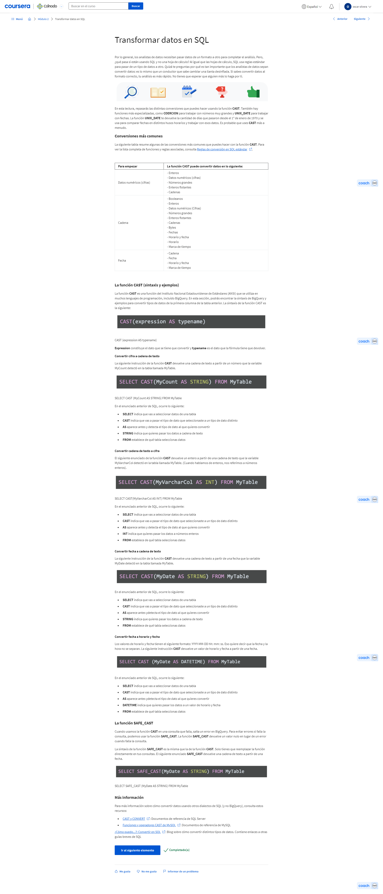

#### Pon a prueba tus conocimientos sobre cómo convertir y formatear datos

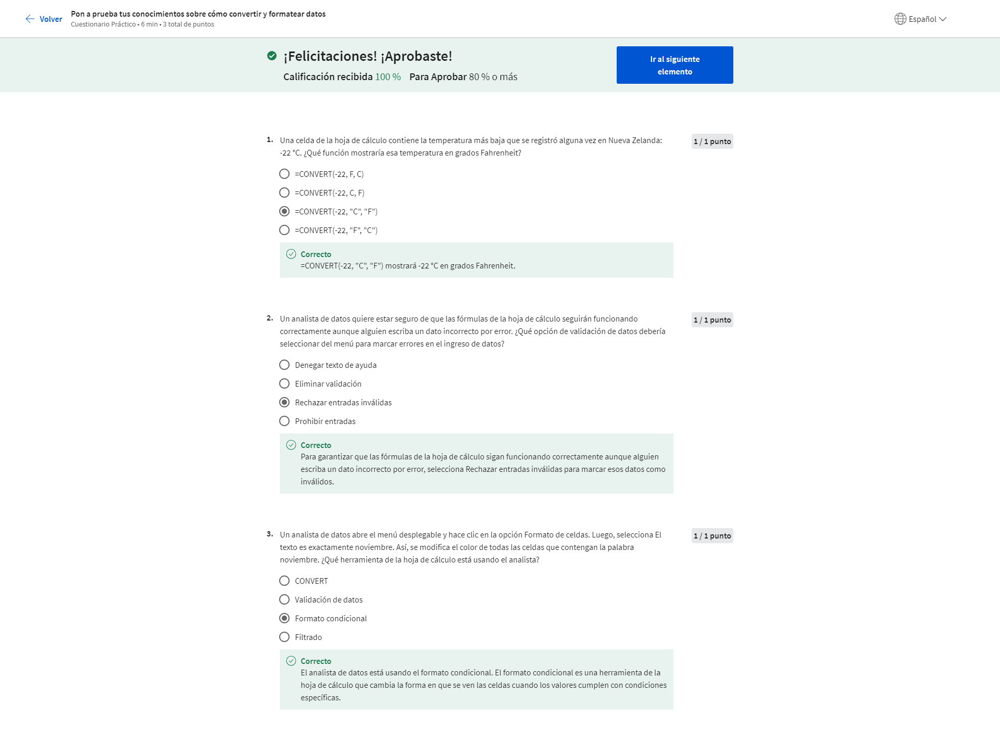

### Combinar distintos conjuntos de datos

#### Opcional: Prepárate para usar el conjunto de datos sobre bicicletas compartidas en BigQuery

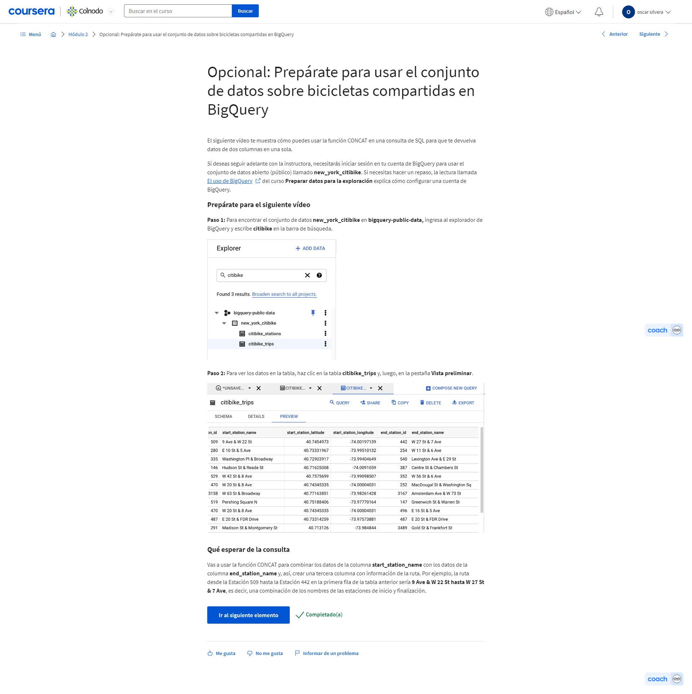

#### Unión y distintas fuentes

¡Qué bueno volver a verte! En este vídeo, ampliaremos lo que ya aprendimos sobre la función CONCATENATE e IMPORTRANGE explorando una nueva consulta de SQL: CONCAT. Puede que recuerdes que CONCATENATE es una función que te permite unir dos o más cadenas de texto. A modo de recordatorio, una cadena de texto es un grupo de caracteres dentro de una celda, casi siempre compuesta por letras. Ya viste cómo funciona en una hoja de cálculo. Pero hay una función similar en SQL que te permite unir distintas cadenas de texto de distintas fuentes: CONCAT. ¿Por qué no usamos CONCAT para combinar cadenas de texto de distintas tablas para crear nuevas cadenas? Para este ejemplo, usaremos datos abiertos de Citi Bike, un sistema público para compartir bicicletas en Nueva York. Como ya aprendiste, estas iniciativas de datos abiertos han generado muchísimos datos que los analistas pueden usar. Los datos abiertos implican acceso gratuito a los datos, así como uso e intercambio libre. Es un gran recurso si quieres practicar o experimentar con las herramientas de análisis de datos que aprendiste aquí. Tienes acceso abierto a los datos de bicicletas compartidas de la ciudad de Nueva York, y estos datos contienen información sobre el uso de las bicicletas compartidas en toda la ciudad. Ahora, podemos usar CONCAT para extraer y combinar datos de distintas columnas almacenadas allí. Lo primero que debemos hacer es decidir qué columnas necesitamos. Así podemos indicarle a SQL donde están las cadenas que queremos. Por ejemplo, la empresa de bicicletas de uso compartido tiene dos tipos distintos de clientes: los que pagan por vez y los que se suscriben. Imaginemos que queremos saber cuáles son las rutas más populares según los distintos tipos de usuario. Para eso, necesitamos crear cadenas de texto con nombres reconocibles de rutas que podamos contar y ordenar. Sabemos que la información que necesitamos está en la tabla de estaciones y viajes. Empezaremos a crear nuestra consulta desde ese punto. Primero, escribimos SELECT tipo de usuario para que SQL sepa que queremos el tipo de usuario en una columna. Luego usaremos CONCAT para combinar los nombres de las estaciones de inicio y finalización de cada viaje en una nueva columna. Así crearemos una columna según las rutas que toman las personas. También necesitamos darle un título a esta nueva columna. Escribimos Ruta AS para titular la columna de rutas usando los nombres de las estaciones de inicio y finalización que combinamos con CONCAT. Así, los nombres de las rutas serán más fáciles de leer y de comprender. Luego, queremos que SQL cuente la cantidad de viajes. Así que escribimos COUNT. Podemos usar un asterisco para indicarle que cuente la cantidad de filas en los datos que seleccionamos. En este caso, cada fila representa un viaje, por eso simplemente podemos contar todas las filas que seleccionamos. Ese resultado tendrá el siguiente nombre: cant_viajes.
Reproduce el video desde :2:46 y sigue la transcripción2:46
Ahora, calculemos el promedio de la duración de los viajes por ruta. En este caso, no necesitamos un promedio exacto, así que podemos usar la función ROUND para redondear. Escribimos primero eso y, después, entre paréntesis, usamos AVERAGE para obtener el promedio de duración de los viajes. También queremos que estos datos estén enteros para este cálculo, así que escribimos cast as int 64. BigQuery almacena los números en un sistema de memoria de 64 bits, por eso está el número 64 después de int en este caso. Ahora, lo dividiremos por la cantidad de filas y le indicaremos cuánto queremos redondear: a dos decimales. Ese resultado tendrá el siguiente nombre: duración. Tenemos que indicarle a SQL dónde se almacena esa información. Usaremos FROM y la ubicación de donde extraemos los datos.
Reproduce el video desde :3:42 y sigue la transcripción3:42
Como estamos usando las funciones COUNT y AVERAGE en nuestra cláusula SELECT, tenemos que usar GROUP BY para agrupar las filas de resumen. Agrupemos según estación de inicio, estación de finalización y el tipo de usuario para esta consulta. Por último, usamos ORDER BY para indicarle cómo queremos organizar estos datos. Para eso, queremos saber cuáles son los viajes más comunes, de modo que podamos escribir cuál es la columna con cantidad de viajes y usar DESC para que se ordene de forma descendente. Por último, solo queremos los primeros 10 viajes, así que agregamos LIMIT 10. Ahora, gracias a la función CONCAT, podemos leer fácilmente los nombres de estas rutas y asociarlos con lugares de la vida real. Podemos ver qué tipos de clientes toman tal o cual ruta, y así ayudar a la empresa de bicicletas de uso compartido a entender su base de usuarios en distintas partes de la ciudad y dónde poner más bicicletas para alquiler. Cuando sabes combinar distintos tipos de datos, descubres nuevas formas de organizarlos y analizarlos. Hay muchísimas herramientas que pueden ayudarte. Ahora vimos la función CONCAT en acción, y más adelante verás una consulta similar: JOIN. Pero, a continuación, hablaremos un poco más sobre cómo trabajar con cadenas de texto. Nos vemos pronto.

#### Cadenas de texto en hojas de cálculo

Hola de nuevo. Ya trabajamos con cadenas de texto en SQL y en hojas de cálculo, y aprendimos que, por lo general, tienen funciones similares. En este vídeo, repasaremos las funciones LEN, LEFT, RIGHT y FIND.
Reproduce el video desde ::16 y sigue la transcripción0:16
Ya usaste estas funciones en SQL, pero ahora verás cómo funcionan en hojas de cálculo. Volvamos al conjunto de datos sobre bicicletas de uso compartido. Veamos una de sus hojas de cálculo. Esta es una de las hojas de cálculo con Datos de viajes. En las columnas horadeinicio y horadefinalización, hay cadenas de texto con información sobre la fecha y el horario de cada viaje.
Reproduce el video desde ::38 y sigue la transcripción0:38
Estos datos son muy útiles, pero es probable que solo necesitemos una parte de la cadena de texto para hacer una fórmula o responder una pregunta. Por ejemplo, estas cadenas contienen múltiples puntos de datos, como fecha y hora. Pero si queremos saber el tiempo promedio entre los horarios de inicio, no vamos a necesitar la fecha. Así que podemos usar las funciones LEN, LEFT, RIGHT y FIND para dividir fecha y hora en columnas separadas. Generemos una fórmula simple para separar las fechas en estas cadenas de texto. Sabemos que, al usar LEN, podemos conocer la longitud de una cadena de texto. Veamos la longitud de las cadenas datetime. Para empezar, escribimos la primera parte de la fórmula.
Reproduce el video desde :1:19 y sigue la transcripción1:19
Luego, seleccionamos una de las celdas con la cadena datetime. Estas cadenas tienen 19 caracteres. Ahora, usamos la función FIND para ubicar ciertos caracteres específicos en una cadena. Acuérdate de que distingue entre mayúsculas y minúsculas. Así que si usas FIND para encontrar una subcadena, tienes que asegurarte de haberla escrito correctamente. Vemos que todas las cadenas datetime tienen un espacio que separa la fecha de la marca de tiempo. Así que podemos usar FIND para saber dónde termina la fecha. Bueno, parece que el espacio es el carácter número 11 en la cadena. Así que la subcadena de horario empieza en el carácter 12. Podemos usar las funciones LEFT y RIGHT para seleccionar qué partes de la cadena queremos separar en una nueva columna. Usaremos RIGHT en una de estas celdas para indicar que queremos recortar la parte derecha.
Reproduce el video desde :2:18 y sigue la transcripción2:18
Como ya hemos visto, LEFT funciona exactamente igual. Ahora, podemos usar lo mismo en el resto de la columna C para extraer esas marcas de tiempo.
Reproduce el video desde :2:29 y sigue la transcripción2:29
Como analista de datos, saber trabajar con cadenas de texto es una destreza clave, en especial cuando trabajas con datos de fuentes externas. Espero que te sientas más seguro usando las funciones LEN, RIGHT y LEFT, y también la función FIND, tanto en SQL como en hojas de cálculo. Más adelante, usaremos estas funciones para generar fórmulas más complicadas, así que no dudes en ir probándolas en algunos datos, quizá algunos datos abiertos como los que usamos hoy. Nos vemos más tarde.

#### Manipular cadenas de texto en SQL

<https://www.w3schools.com/sql/sql_ref_sqlserver.asp>
<https://www.w3schools.com/sql/sql_ref_keywords.asp>
<https://www.w3schools.com/sql/func_sqlserver_concat.asp>
<https://www.w3schools.com/sql/func_sqlserver_concat_ws.asp>
<https://www.w3schools.com/sql/func_sqlserver_concat_with_plus.asp>

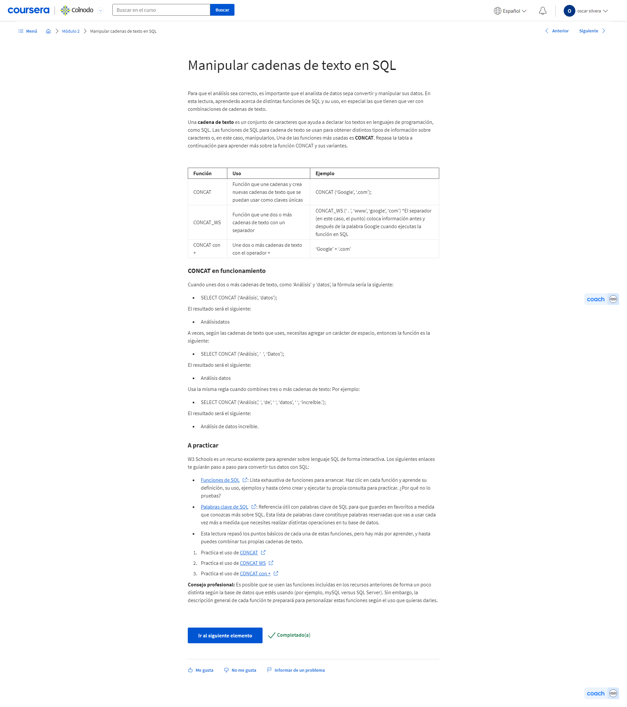

#### Registro de aprendizaje: Lista de verificación del análisis de datos

#### Pon a prueba tus conocimientos sobre combinar distintos conjuntos de datos

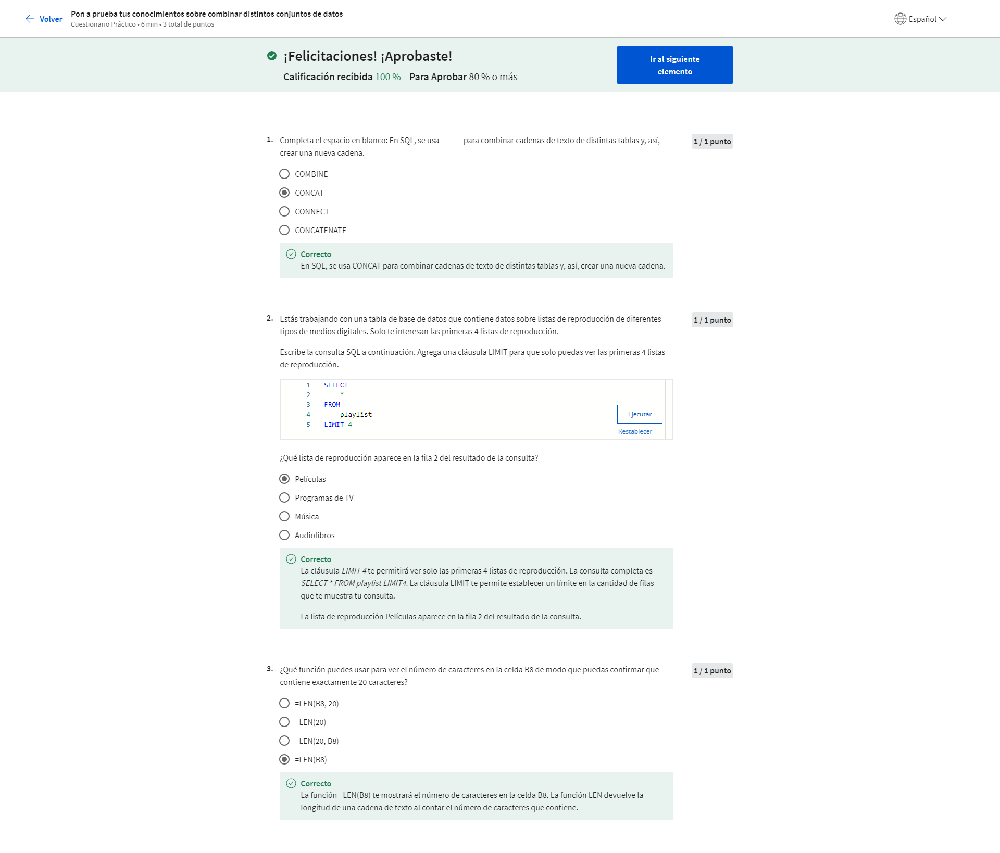

### Obtener ayuda durante el análisis

#### Qué hacer cuando no puedes avanzar

Hola. Los analistas de datos pasan mucho tiempo resolviendo problemas, y, por ende, es posible que alguna vez se queden atascados en alguna situación. El truco es saber qué hacer cuando pasa eso. En este vídeo, hablaremos sobre la importancia de saber cómo buscar ayuda, ya sea pidiéndole a alguien que nos dé una mano o buscando las respuestas en la Internet. Charlar con otros sobre un problema que tenemos puede ayudarnos a encontrar nuevas soluciones que nos permitan avanzar con el proyecto. Siempre es buena idea contactarnos con pares y mentores, en especial si están trabajando con nosotros en ese proyecto. Los miembros del equipo tienen conocimiento e información útiles que pueden ayudarnos a encontrar la solución para poder avanzar. A veces, pasamos mucho tiempo dándole vueltas al asunto, diciendo: "Yo puedo hacer esto por mi cuenta". Pero podemos ser mucho más productivos si nos contactamos con otras personas, buscamos nuevos recursos que nos ayuden e intentamos involucrar a todas las personas que podamos. Por ejemplo, digamos que estás trabajando con los datos de la duración de los viajes en bicicleta que vimos en vídeos anteriores. Quizá necesitas encontrar el tiempo promedio entre viajes en bicicleta durante cierto mes. Si tienes que calcular la diferencia entre viajes en bicicleta antes de medianoche no hay problema, pero puede que sí tengas problemas si el viaje empieza un día y termina al siguiente. Si alguien empezó un viaje en bicicleta a las 11 p.m., pero el próximo viaje no arrancó hasta las 6 a.m. del día siguiente, tu fórmula te devolverá un número negativo porque el horario de finalización es menor al horario de inicio. Ya sabes que puedes sumar uno menos el horario de inicio si dos viajes arrancan y finalizan en días distintos, pero esa fórmula no va a funcionar en horarios del mismo día, y no es muy eficaz tener que andar buscando en todos los viajes en bicicleta para detectar esos casos especiales. Tienes que encontrar la manera de generar una fórmula condicional, pero no sabes bien cómo. Entonces decides consultar con otros analistas de tu equipo para ver si tienen alguna idea. Podrías mandarles un mail breve, o pasar por su escritorio a ver si tienen un minuto para charlarlo contigo. Al parecer, ya tuvieron un problema similar en un proyecto anterior y te muestran una fórmula condicional que puedes usar para agilizar tus cálculos. ¡Excelente! Te sugieren usar una fórmula IF así. En pocas palabras, dice: "Si el horario de finalización es mayor al horario de inicio, reemplaza el horario estándar de finalización menos la fórmula de horario de inicio con uno menos horario de inicio más horario de finalización". Ahora, también puede pasar que los miembros del equipo no tengan una respuesta, pero no hay problema. Sin lugar a dudas, en la Internet, vas a encontrar a alguien que tenga el mismo problema y haga las mismas preguntas. Si sabes buscar soluciones en línea, cuentas con una herramienta invaluable para resolver problemas de análisis de datos. También hay muchos tipos de foros en los que usuarios de hojas de cálculo hacen preguntas, y nunca sabes lo que puedes encontrar con tan solo hacer una búsqueda básica. Por ejemplo, digamos que buscas "calcular cantidad de horas entre horarios" en hojas de cálculo y encuentras instrucciones útiles para redactar una fórmula más compleja usando MOD. Esa fórmula convierte valores negativos en valores positivos y resuelve tu problema de cálculo. No importa si le preguntas a alguien que conoces o buscas las respuestas en la Internet: buscar ayuda puede brindarte soluciones muy interesantes y nuevas formas de resolver problemas para tus análisis a futuro. Próximamente, aprenderemos aún más sobre buscar soluciones en línea. Nos vemos pronto.

#### Consejos y trucos avanzados para hojas de cálculo

<https://support.google.com/docs/answer/181110>
<https://support.google.com/docs/table/25273?hl=en>
<https://blog.golayer.io/google-sheets/google-sheets-formulas>
<https://www.benlcollins.com/spreadsheets/google-sheets-formulas-techniques/>
<https://support.microsoft.com/en-us/office/keyboard-shortcuts-in-excel-1798d9d5-842a-42b8-9c99-9b7213f0040f?ui=en-US&rs=en-US&ad=US>
<https://exceljet.net/keyboard-shortcuts>
<https://exceljet.net/excel-functions>
<https://exceljet.net/formulas>
<https://learntocodewith.me/posts/excel-skills/>
<https://www.slideshare.net/markjhonoxillo/advanced-spreadsheet-skills>
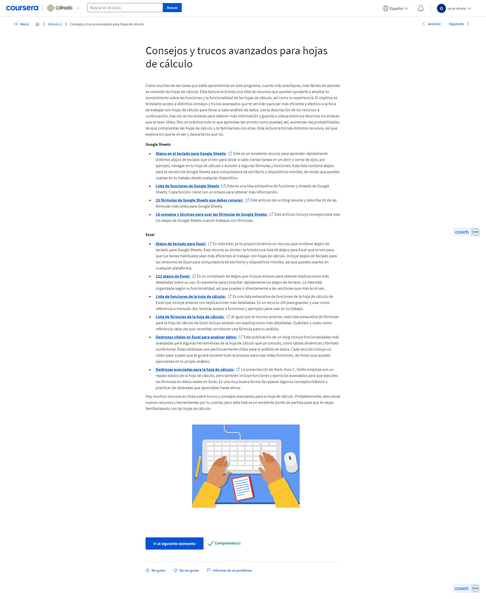

#### Layla: Todo sobre la etapa de análisis

Hola. Me llamo Layla y soy directora de análisis de datos en Google. Un director de análisis de datos ayuda a que los publicistas comprendan el valor del dinero que invierten en publicidad. También los ayuda a comprender dónde deberían invertir ese dinero extra que quizá tienen para publicidad y qué podrían obtener a cambio. Para este tipo de puesto, las habilidades que necesitas tienen muchísimo que ver con poder observar un conjunto de datos y darle sentido. Luego, se trata de contar una historia para las personas que quizá no tienen esa experiencia trabajando con datos. ¿Qué está pasando con los datos? ¿Qué impulsa el crecimiento de tu cliente o de tu empresa? ¿Qué podrían hacer más o qué podrían hacer menos para que pase lo que quieren que pase? La etapa de análisis se parece a preparar un plato delicioso. Ya limpiaste todo y preparaste los ingredientes y cocinaste y, finalmente, vas a poder probar tu comida para ver si lo que esperabas que pasara o lo que querías que pasara finalmente pasó. ¿Está rico? ¿Es exactamente lo que esperabas? ¿O está medio insulso y necesitas agregar un poco de sal? La etapa de análisis empieza una vez que preparaste y limpiaste tus datos. No quieres tener celdas en blanco que vayan a impedir el análisis o entradas duplicadas que hagan que tu conjunto de datos sea más grande de lo que es. En la etapa de análisis, te vuelves experto en tu conjunto de datos. Es allí donde vas a entender todos los campos. Vas a entender sus promedios, y quizá la mediana de los datos. Vas a comprender en qué se diferencian las distintas filas de tus datos. Y también ganarás la confianza que necesitas para explicar tus resultados ante una audiencia que quizá no tenga la misma experiencia con los datos que tú tienes. Cuando analizo datos, por lo general, me gusta usar SQL y hojas de cálculo. Puedes usar estas herramientas, por ejemplo, para ordenar tus datos y entender qué entradas son más largas que otras. También puedes ver cuántas veces pasa algo si seleccionas las distintas entradas. Aquí, también puedes filtrar datos que te interesan concretamente para el análisis o, en una hoja de cálculo, puedes usar el formato condicional para ver qué entradas tienen un resultado más positivo y cuáles quizá uno más negativo. Sin duda, es vital usar SQL y hojas de cálculo durante la etapa de análisis. Con estas herramientas, puedes formatear tu conjunto de datos de forma que sea asimilable y, luego, empezar a contar una historia con los datos. Lo que más me gusta de trabajar con una hoja de cálculo es, finalmente, tener limpios los datos que quieres y exportarlos de tu consulta de SQL. Entonces puedes convertirlos en una tabla dinámica y planificar específicamente qué datos que querías analizar tienen prioridad y cuáles son las tendencias que puedes ver allí. Cuando logras hacer eso, es como si desbloquearas todo un mundo de información y entonces puedes elegir qué historia quieres contar con tus datos sin decir cosas como: "Esta es la cifra máxima, esta es la cifra mínima". Aquí, puedes mostrar lo que podría pasar en el tiempo o lo que posiblemente pase en el futuro.

#### ¿Te encontraste con un desafío? No te preocupes

Bienvenido de nuevo. Anteriormente, hablamos un poco sobre buscar recursos en línea para encontrar soluciones a distintos problemas durante el análisis. En la Internet, podemos conseguir tanta información y tantos consejos... Pero tienes que saber cómo encontrarlos. En este vídeo, hablaremos un poco más sobre cómo encontrar respuestas en línea. Quizá creas que un buen analista de datos no suele buscar ayuda en recursos externos, pero eso no es verdad. Los mejores analistas de datos saben que buscar las respuestas a sus preguntas en línea puede ser inspirador y también puede brindarles conocimiento a futuro. Si encuentras nuevas ideas y las combinas con lo que ya sabes, puedes lograr cosas increíbles. No temas recurrir a la Internet para encontrar las respuestas que necesitas. Es un gran recurso que muchísimos analistas usan. Me incluyo. Pero hablemos un poco más sobre cómo puedes asegurarte de estar aprovechando al máximo los recursos en línea. Hay distintas mejores prácticas que puedes usar para guiarte en la búsqueda de respuestas en línea. Cuando pones en práctica las habilidades de razonamiento que aprendimos en este programa, usas los términos correctos para análisis de datos y utilizas tu conocimiento básico sobre herramientas de análisis, tienes todo lo que necesitas para encontrar respuestas y usarlas en tu propio trabajo. El punto de partida es cómo abordar un problema desde el pensamiento. Ya aprendiste distintas habilidades de razonamiento y también la forma de ponerlas en práctica en tu trabajo de análisis de datos. Hemos visto desde pensamiento analítico hasta matemático, pasando por razonamiento estructurado. Esto te ayuda a construir un modelo mental, en otras palabras, un proceso de razonamiento, y también a pensar la forma en que encaras un problema. Los analistas de datos usan estas habilidades de razonamiento para abordar un problema desde la lógica y dividirlo en partes más pequeñas. Si integras esto en tu propio proceso para resolver problemas, puedes detectar preguntas específicas que puedes usar para encontrar recursos con más facilidad. Por ejemplo, quizá te sigue apareciendo el mismo error durante tu análisis. Acotas el problema, y crees que hay dos posibles razones: tu fórmula o los datos en sí. Corroboras tu fórmula y ves que es correcta. Entonces tienes que asegurarte de haber ingresado los datos correctamente. Analizas el problema desde la lógica y llegas a la raíz usando tu modelo mental. Ahora, es importante usar los términos correctos para buscar soluciones. Si sabes cómo formular las preguntas de análisis computacional de datos y usas el mismo lenguaje que otros analistas, encontrarás más resultados de búsqueda, y podrás entender mejor qué dicen otros analistas. Por ejemplo, quizá necesitas los cuatro caracteres de una cadena de texto empezando desde la izquierda en una columna de SQL. ¿Cómo buscarías eso? Buscar "cuatro caracteres en una columna" es poco específico y quizá no surjan recursos específicos. Pero si escribes "consulta de cadena desde izquierda en SQL", estás usando algunas palabras clave que otros analistas de datos también usan para hablar sobre esto. Además de saber usar los términos correctos para la búsqueda en línea, también tienes que conocer las herramientas básicas. Así, cuando un recurso en línea te muestre una nueva función en una herramienta que ya usaste, sabrás cómo funciona. Por ejemplo, si encuentras en línea una fórmula para la hoja de cálculo, debes entender cómo funcionan las fórmulas para usarlas en tu propia hoja de cálculo, o quizá el conjunto de datos que estás usando es demasiado grande para una única hoja de cálculo y debes pasarte a SQL. Como analista de datos, es importante tener distintas herramientas en tu kit, pero también es importante saber cómo usarlas. Si sientes que no puedes avanzar porque tienes un problema, quizá sea buena idea retroceder un poco y volver a pensar cómo estás encarando la tarea. En este programa, aprendimos sobre muchísimas herramientas que puedes usar como analista de datos. Pronto, aprenderás sobre una más: R. Ya hablaremos sobre R, pero te voy a dar una pequeña introducción para que te entusiasmes. R es otro lenguaje de programación, pero no es un lenguaje de base de datos como SQL. Es un lenguaje de programación que suele usarse para análisis estadístico, visualización y otros tipos de análisis de datos. R no es igual a otras herramientas con las que hemos trabajado, pero es un complemento genial para las herramientas que ya usas. Y te dará algunas otras posibles soluciones cuando tengas problemas. Si usas las habilidades de razonamiento que aprendiste en este programa, los términos correctos y tu conocimiento sobre las distintas herramientas de análisis, estarás listo para los próximos pasos de este proceso: ponerte a buscar respuestas en línea. Hay muchísimos recursos, por ejemplo, sitios web y foros de ayuda para programación en los que otros analistas de datos hacen preguntas y las responden. En un vídeo anterior, tuvimos un problema cuando intentamos calcular el tiempo que pasa entre los recorridos en bicicleta y los datos de bicicletas de uso compartido. Quizá, nuestra primera búsqueda, "Calcular tiempo en hojas de cálculo", no nos brindó las respuestas que necesitábamos. Si pensamos en la pregunta específica que queremos responder y cómo otros analistas de datos hacen la misma pregunta, podemos cambiar la búsqueda: "Fórmula condicional para calcular tiempo transcurrido en hojas de cálculo". Ahora, tenemos soluciones más específicas para nuestro problema. Por último, es muy útil poder modificar el código de ejemplo según nuestras necesidades. Cuando entiendes la sintaxis de las fórmulas y las funciones de distintas herramientas, puedes usar lo que aprendiste en línea y hacer que funcione para ti. Quizá sigues avanzando por ese camino y creas una solución completamente nueva. Un buen ejemplo es la fórmula MOD que generamos para contabilizar los viajes que empezaron un día y terminaron al día siguiente para los datos de bicicletas de uso compartido. La fórmula MOD que encontramos en línea no se creó específicamente para los datos con los que trabajábamos. Pero como conocemos las herramientas de la hoja de cálculo, pudimos usarla con nuestros datos como solución a nuestro problema. Los buenos analistas de datos saben cómo buscar recursos en línea y usarlos para crear nuevas soluciones para los problemas que tienen. Cuando pones en práctica las habilidades de razonamiento que aprendiste en este programa y usas el conocimiento que tienes sobre herramientas de análisis computacional de datos y sobre términos, tú también puedes crear soluciones. Una vez que encuentres algunas respuestas a tus problemas, podrás desarrollarlas para tu trabajo de análisis y superar cualquier desafío que enfrentes.

#### Cuándo usar cada herramienta

Hola. En estos vídeos, te presentamos las hojas de cálculo, SQL y muchas otras herramientas. También hablamos sobre elegir la herramienta indicada antes de empezar un proyecto. Pero, a veces, sientes que algún problema te impide avanzar con el análisis de datos. Quizá es hora de repensar qué herramienta estás usando para tu trabajo. Por ejemplo, si trabajas con una hoja de cálculo simple, quizá de cinco a diez filas y unas pocas columnas, las tablas dinámicas sirven mucho para visualizar tus datos. Pero si tu hoja de cálculo tiene más de un millón de filas, se empezará a colgar, y es posible que la tabla dinámica no se complete. Cuando trabajas con una hoja de cálculo enorme que se sigue colgando, quizá es mejor pasar a SQL para extraer los datos que necesitas de diferentes ubicaciones en la base de datos y no de una sola hoja de cálculo. Quizá recuerdes que SQL puede manejar billones de filas de datos y, hoy por hoy, es uno de los lenguajes estándar para trabajar con programas de base de datos. SQL es una herramienta excelente de consulta, actualización y optimización de datos. Pero si intentas analizar tus datos solo con SQL, puede que se complique un poco todo. A medida que progreses como analista de datos, puede que pases muchísimo tiempo creando consultas largas y anidadas y, luego, depurándolas. Quizá sea momento de buscar otra herramienta, como R. R es una herramienta nueva que vamos a explorar más adelante, pero, por ahora, te contaré un poco sobre ella para despertar tu curiosidad. R es otro lenguaje de programación, pero no es un lenguaje de base de datos como SQL. Es un lenguaje de programación que suele usarse para análisis estadístico, visualización y otros tipos de análisis de datos. R no es igual a otras herramientas con las que hemos trabajado, pero es un complemento genial para las herramientas que ya usas. Con R, podrás analizar y visualizar datos de muchas formas innovadoras. Ya hablaremos sobre R, pero espero que esta sea una buena introducción para entusiasmarte. Como analista de datos, es importante tener distintas herramientas en tu kit, pero también es importante saber cómo usarlas. Si sientes que no puedes avanzar porque tienes un problema, una buena idea es retroceder un poco y volver a pensar cómo estás encarando la tarea. ¿Tienes demasiados datos en una sola hoja de cálculo? Pásate a SQL. ¿Pasas más tiempo depurando consultas que analizando datos? ¿Por qué no probar R? Ahora también sabes buscar respuestas en línea. Así que si alguna vez tienes un problema y necesitas una herramienta distinta, una búsqueda rápida puede ser muy útil. Quizá haya recursos en línea o alguien más ya tuvo ese problema y publicó algo al respecto. Es muy útil cuando sientes que te atascaste con un problema, y quizá hasta encuentres una nueva forma de usar una herramienta que ya conoces. Eso nos lleva al final de este módulo. Buen trabajo. Hemos cubierto muchísima información. Aprendimos a convertir y formatear datos, a combinar distintos tipos de datos, y a buscar ayuda cuando necesitamos una mano durante el análisis. A continuación, podrás hacer el desafío semanal. Como siempre, siéntete libre de volver a repasar lo que aprendimos en estos vídeos. Nos vemos en el próximo vídeo. Buena suerte.

#### Cuestionario práctico: Autorreflexión: Stack Overflow

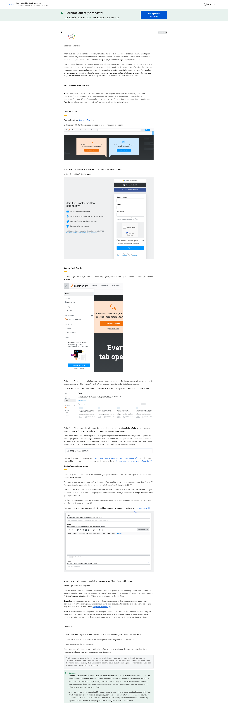

### Desafío semanal 2 curso 5

#### Cuestionario: Desafío semanal 2

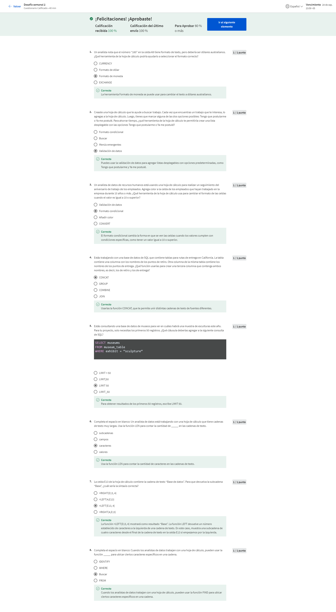

## Agregar datos para análisis

## Realizar cálculos de datos
