# Analizar datos para responder preguntas

## Visualización de datos

### Comunicación de tus conclusiones de datos

#### Introducción a la comunicación de las conclusiones obtenidas a partir de los datos

¡Hola! Es genial ver cuánto avanzaste en este Certificado de análisis computacional de datos de Google. Primero, quiero felicitarte por tu logro. Segundo, bienvenido a tu siguiente curso. Todo se trata del arte de la narración de datos a través de la visualización. Como analista de datos, puedes hacer todo el trabajo necesario de planificación, recolección, limpieza y análisis. Pero también necesitas mostrarles a los interesados qué significan tus datos de manera atractiva usando elementos visuales. Estamos aquí para mostrarte cómo se hace eso. Con mi experiencia como director de análisis en Google, espero ser un guía bastante bueno. Me llamo Kevin y seré tu instructor en este curso. Esta parte de tu capacitación es particularmente significativa para mí porque me encanta la narrativa de los datos. No se me ocurre ninguna otra cosa en el mundo de negocios actual que sea más vibrante, más excitante y más gratificante. Con la cantidad de datos que tenemos a nuestro alrededor, el análisis de datos tiene un rol clave en casi todas las partes del negocio. En mi opinión, no existe una destreza que sea más importante para ti como analista que poder comunicar con eficacia las historias que quieres transmitir a los interesados. Los interesados generalmente no tienen el tiempo, el acceso a los datos o los conocimientos necesarios para encontrar esas historias por sí mismos. Por eso nos enfocaremos en visualizar datos para ayudarte a compartir mejor sus historias. Lo que significa que ahora estamos en la fase compartir del proceso de análisis de datos. Comenzaremos con los conceptos básicos de la visualización y por qué la visualización de tu análisis es una parte tan importante del Análisis computacional de datos. A partir de allí, comentaremos cómo planificar y comenzar a crear visualizaciones efectivas que sean inclusivas, accesibles y analicen primero al público. Luego, exploraremos una posible herramienta que puedes usar para visualización de datos, Tableau. Tableau ayuda a crear visualizaciones a partir de nuestro análisis para que podamos compartir nuestros hallazgos con mayor eficacia. Te mostraremos cómo las visualizaciones de datos, entre ellas los paneles visuales, pueden ayudarte a darles vida a tus datos. Además, exploraremos cómo puedes usar visualizaciones en tus presentaciones y diapositivas para seguir narrando una historia con datos. Hablaremos del arte y la ciencia detrás de las presentaciones efectivas. Por último, aprenderás cómo anticipar y responder preguntas de interesados y responder a sus comentarios. Durante todo el curso, te guiaré por lo que creo que es la parte más emocionante del proceso de análisis de datos. Al final, tendrás todo lo que necesitas para planificar, crear y presentar una visualización de datos eficaz y convincente. Ahora que ya nos conocemos un poco, es el momento de poner manos a la obra. A continuación, hablaremos un poco sobre la historia de la visualización de datos y por qué las visualizaciones importan tanto hoy en día. También veremos los métodos para usar imágenes de manera eficaz y qué puedes hacer para aprovechar al máximo tus elementos visuales. Nos vemos allí.

#### Registro de aprendizaje: Reflexiona sobre la visualización de datos

#### Kevin: El poder se encuentra en la visualización de datos

[MÚSICA] El análisis computacional de datos es la recolección y el análisis y luego el uso de datos para contar historias mediante gráficos y visualizaciones, de modo que las empresas puedan tomar mejores decisiones. Siempre me encantaron los números y siempre disfruté la matemática y el cálculo y ese tipo de cosas. Entonces, los datos me resultaron muy fáciles. Trabajaba en una consultoría antes y usaba muchos números y, sin duda, lo disfrutaba. Pero recién cuando trabajé en una agencia publicitaria vi la expresión creativa de los números y cómo los datos podían impulsar esa creatividad. Entonces allí me cuadró todo y me di cuenta de que hacer analítica en un entorno de marketing y de publicidad era exactamente lo que quería hacer. Y me di cuenta de que realmente disfrutaba cuando esas dos cosas se unen. Creo que los elementos visuales que surgen del análisis de datos y el análisis computacional de datos son realmente bellos, pero algo que aún es más interesante para mí son las historias detrás de ellos. Si miras un gran bloque de texto o un gran bloque de números, esas historias están allí, pero realmente tienen que encontrarse. Y entonces hace falta cierta destreza para extraer esas cosas. Y esa destreza, ese análisis, me resulta realmente excitante e interesante. Pero luego finalmente termina en una visualización hermosa, que me resulta muy gratificante. Hay grandes pensadores en el campo de la visualización de datos, y ves estos elementos visuales por todos lados. Puedes encontrar inspiración mirando los medios de comunicación hoy y ver los elementos visuales que presentan y cómo cuentan historias de esa manera. Las visualizaciones se han hecho tan importantes que puedes encontrarlas en todos lados, y puedes obtener gran inspiración a partir de eso. Pero yo también me inspiro con fuentes menos probables como la fotografía y el arte y otras personas y viendo cómo se crea la composición, cómo se usa el color. Creo que eso es muy importante. Y me esfuerzo mucho en incorporar ese tipo de elementos y ese tipo de influencias a las visualizaciones que creo. Entonces, sé que este curso es bastante intenso. Les damos mucha información. Tu cerebro seguramente está sobrecargado. Seguramente estés exhausto. Pero no abandones. Todo comenzará a unirse y tomará sentido. Lo más importante que creo que puedes pensar es cuán importantes son realmente estas destrezas. Esta es la nueva manera de hacer negocios, involucrando datos, usando las herramientas y las técnicas analíticas que estamos comentando para tomar decisiones. ¡Una enorme recompensa te espera al final de este curso! Soy Kevin. Director de analítica aquí, en Google. [SONIDO]

### Comprende la visualización de datos

#### ¿Por qué la visualización de datos es importante?

Bienvenido, futuro analista de datos. Como analista incipiente, estarás expuesto a muchos datos. Las personas aprenden y absorben datos de muchas maneras diferentes y una de las maneras más eficaces de hacerlo es mediante la visualización. La visualización de datos es la representación y presentación gráfica de los datos. En realidad, solo es colocar información en una imagen para que sea más fácil que otras personas la entiendan. Si alguna vez viste cualquier tipo de mapa, ya sea impreso o en línea, sabes exactamente cuán útiles pueden ser las representaciones visuales. Las visualizaciones de datos sin dudas están teniendo un gran momento. En Internet, estamos rodeados de imágenes que muestran información de todo tipo, pero la historia de la visualización de datos se remonta mucho más allá de Internet. La visualización de datos comenzó hace mucho con los mapas, que son la representación visual de datos geográficos. Este mapa del mundo conocido es de 1502. Los cartógrafos siguieron mejorando sus visualizaciones a medida que se hacían cartas de navegación de nuevas tierras. Se recolectaban datos sobre esos lugares y se creaban nuevos métodos para visualizar los datos. Los científicos y matemáticos comenzaron a adoptar realmente la idea de organizar datos visualmente en los siglos XVII y XVIII. Este gráfico de barras es de 1821 y no luce muy diferente a los gráficos de barras que vemos hoy en día. Pero desde el principio de la era digital del análisis de datos en la década de 1990, el alcance y la magnitud de las visualizaciones creció junto con los datos que representan gráficamente. A medida que seguimos aprendiendo cómo comunicar con elementos visuales de manera más eficaz, la calidad de nuestras conclusiones también sigue creciendo. Hoy podemos cuantificar conductas humanas mediante datos y aprendimos a usar computadoras para recabar, analizar y visualizar esos datos. Como analista en el mundo actual, probablemente dividas tu tiempo con elementos visuales de datos de dos maneras: mirándolos para comprender y sacar conclusiones sobre datos o creándolos a partir de datos crudos para contar una historia. De todos modos, siempre es bueno tener en cuenta que las visualizaciones de datos serán tu llave al éxito. Esto es especialmente cierto una vez que llegas al punto en que estás listo para presentar los resultados de tu análisis de datos a un público. Lograr que las personas comprendan tu visión y proceso de razonamiento puede sentirse difícil. Pero una visualización de datos bien hecha tiene el poder de hacer que la gente cambie de opinión. Además, puede ayudar a alguien que no tiene la misma formación o experiencia técnica que tú a formar su propia opinión. Entonces, esta es una regla rápida para crear una visualización. Tu público debería saber exactamente qué está mirando en los primeros cinco segundos de verlo. Básicamente, esto significa que la representación visual debería ser clara y fácil de seguir. Y en los cinco segundos posteriores, tu público debería comprender la conclusión que está marcando tu visualización. Aunque no estén completamente familiarizados con la investigación que hiciste. Quizás no estén de acuerdo con tu conclusión, y eso está bien. Siempre puedes usar sus comentarios para ajustar tu visualización y volver a los datos para hacer análisis adicional. Entonces ahora hablemos de lo que tenemos que hacer para crear una visualización que sea comprensible, efectiva y, lo que es más importante, convincente. Empecemos por el principio. Las visualizaciones de datos son una herramienta útil para incluir mucha información en un espacio pequeño. Para hacerlo, primero necesitas estructurar y organizar tus ideas. Piensa en tus objetivos y en las conclusiones a las que llegaste después de ordenar los datos. Luego, piensa en los patrones que observaste en los datos, las cosas que te sorprendieron y, por supuesto, en cómo todo esto junto se incorpora a tu análisis. Identificar los elementos clave de tus hallazgos ayuda a sentar las bases de cómo deberías organizar tu presentación. Mira esta visualización de datos hecha por David McCandless, un periodista de datos muy conocido. Este gráfico incluye cuatro elementos clave: la información o los datos, la historia, el objetivo y el formato visual. Está organizado en un diagrama de Venn de cuatro partes, que nos indica que los cuatro elementos son necesarios para una visualización exitosa. Hasta ahora, aprendiste mucho sobre los datos usados en las visualizaciones. Eso es importante porque es uno de los principales cimientos de tu visualización. La historia o concepto agrega significado a los datos y los hace interesantes. Más adelante, hablaremos más sobre la importancia de la narración de datos, pero por ahora, simplemente recordemos que la historia y los datos combinados brindan un esbozo de lo que intentas mostrar. El objetivo o función hace que los datos sean útiles y utilizables, y el formato visual genera tanto belleza como estructura. Con solo dos elementos, puedes crear un esbozo de una representación visual. Esto podría funcionar si estás en una etapa temprana, pero no te dará una visualización completa, ya que te faltarían otros elementos clave. Hasta el uso de tres elementos te acerca, pero aún te falta. Por ejemplo, si combinas información, objetivo y formato visual sin una historia, tu visualización probablemente luciría bien, pero no sería interesante. Por su cuenta, cada elemento tiene valor, pero las visualizaciones solo se hacen verdaderamente poderosas y eficaces cuando combinas estos cuatro elementos de una manera que tenga sentido. Y cuando piensas en todos estos elementos juntos, puedes crear algo significativo para tu público. En Google, me aseguro de desarrollar visualizaciones para contar historias sobre datos que incluyen estos cuatro elementos y te aseguro que cada elemento es clave para el éxito de la visualización. Por eso es tan importante para ti, como analista, prestar mucha atención a cada elemento a medida que avancemos. Quizás otras personas no conozcan o comprendan los pasos exactos que realizaste para llegar a las conclusiones que sacaste, pero eso no debería detenerlas a la hora de comprender tu razonamiento. Básicamente, una visualización de datos eficaz debería llevar a los espectadores a que lleguen a la misma conclusión que tú, pero mucho más rápido. Debido a la era en la que vivimos, constantemente se nos muestran diferentes maneras de ver y absorber información. Esto significa que ya viste muchos elementos visuales que puedes consultar mientras diseñas tus propias visualizaciones. Tienes el poder de contar historias convincentes que podrían modificar opiniones y cambiar actitudes. Eso es genial. Pero también tienes la responsabilidad de prestarle atención a las perspectivas de los demás cuando creas estas historias. Es importante tener eso siempre en mente. A continuación, comenzaremos a hacer conexiones entre datos e imágenes para sentar cimientos firmes para tus obras maestras visuales. No veo la hora de arrancar.

#### Visualizaciones de datos efectivas

<https://www.informationisbeautiful.net/visualizations/what-makes-a-good-data-visualization/>
<https://junkcharts.typepad.com/junk_charts/junk-charts-trifecta-checkup-the-definitive-guide.html>
<https://www.ted.com/talks/david_mccandless_the_beauty_of_data_visualization?language=en#t-150183>
<https://artscience.blog/home/the-mccandless-method-of-data-presentation>
<https://informationisbeautiful.net/>
<https://informationisbeautiful.net/beautifulnews/>
<https://www.amazon.com/Street-Journal-Guide-Information-Graphics/dp/0393072959>

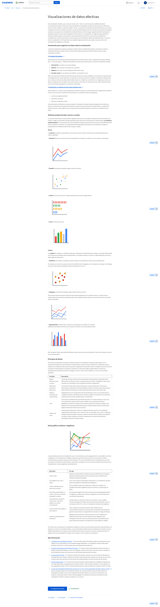

#### Conectar imágenes con datos

Hola de nuevo. Antes, hablamos sobre por qué las visualizaciones de datos son tan importantes tanto para los analistas como para los interesados. Ahora hablaremos de las conexiones que puedes hacer entre datos e imágenes en tus visualizaciones. La comunicación visual de datos es importante para quienes usan los datos como ayuda para tomar decisiones. Para entender mejor la conexión entre los datos y las imágenes, hablemos acerca de algunos ejemplos de visualizaciones de datos y cómo pueden comunicar datos con eficacia. Quizás te encuentres muchos de estos elementos en tu vida cotidiana. Los exploraremos un poco más aquí. Un buen lugar para empezar es un gráfico de barras. Los gráficos de barras usan contraste de tamaño para comparar dos o más valores. La línea horizontal de los gráficos de barras generalmente se coloca abajo, se denomina eje X, y en los gráficos de barras con barras verticales, el eje X se usa para representar categorías, períodos de tiempo u otras variables. La línea vertical de un gráfico de barras generalmente ubicado a la izquierda se llama eje Y. El eje Y generalmente tiene una escala de valores para las variables. En este ejemplo, la hora del día se compara con el nivel de motivación de alguien a lo largo de todo el día laboral. Los gráficos de barras son una manera excelente de aclarar tendencias. Aquí, queda claro que la motivación de esta persona es baja al principio del día y va subiendo cada vez más hacia el final del día laboral. Este tipo de visualización hace que sea muy fácil identificar patrones. Otro ejemplo es un gráfico de líneas. Los gráficos de líneas son un tipo de visualización que puede ayudar a tu público a comprender movimientos o cambios en tus datos. Generalmente se usan para hacer un seguimiento de los cambios a lo largo de un período, pero también pueden combinarse con otros factores. En este gráfico de líneas, usamos dos líneas para comparar la popularidad de los gatos y los perros a lo largo de un período. Con dos colores de línea diferentes, podemos darnos cuenta inmediatamente de que los perros son más populares que los gatos. Además, hablaremos más acerca del uso de colores y patrones para hacer que las visualizaciones sean más accesibles para el público más adelante. Aun cuando una línea sube y baja, existe una tendencia general hacia arriba y la línea de los perros siempre se mantiene más alta que la línea de los gatos. Ahora veamos otra visualización que probablemente reconozcas. Aquí llegó el gráfico circular. Los gráficos circulares muestran qué porcentaje del todo representa cada parte de algo. Este gráfico circular nos muestra todas las actividades que componen el día de alguien. La mitad se pasa trabajando, que se muestra en la cantidad de espacio que abarca la sección azul. Mirando rápidamente, puedes determinar fácilmente qué actividades conforman una buena parte del día en este gráfico circular y cuáles llevan menos tiempo. Anteriormente, aprendimos cómo los mapas ayudan a organizar datos geográficamente. Lo que es genial de los mapas es que pueden contener mucha información relacionada con la ubicación y son fáciles de interpretar para tu público. Este ejemplo muestra datos de una encuesta sobre la felicidad de las personas en Europa. Las fronteras están bien definidas y los colores agregados hacen que sea aún más fácil distinguir los países entre sí. La comprensión de los datos representados aquí, un tema al que volveremos luego, puede darse con bastante rapidez. Por lo que la visualización de datos es una herramienta excelente para hacer la conexión entre una imagen y la información que representa, pero a veces puede ser engañosa. Una de las maneras en que las visualizaciones pueden manipularse es con las escalas y las proporciones. Piensa en un gráfico circular. Los gráficos circulares muestran proporciones y porcentajes entre categorías. Cada parte del círculo o el pastel debería reflejar su porcentaje del entero, que equivale al 100 por ciento. Entonces si quieres visualizar tu análisis de ventas para que muestre el porcentaje de las ventas de tu empresa que provienen de transacciones en línea, podrías usar un gráfico circular. El tamaño de cada porción debería ser el porcentaje de ventas totales que representa. Entonces, si tus ventas en línea representaron el 60 por ciento, la porción sería 60 por ciento de todo el pastel. Ahora mira un gráfico circular engañoso. Supuestamente muestra opiniones sobre ingredientes adicionales para pizza, pero cada porción o segmento representa más de una opción. Todas las opciones suman mucho más que 100 por ciento. Hay muchos ingredientes que aparecen debajo de la imagen que ni siquiera se incluyen en los datos visuales. Todos los segmentos tienen el mismo tamaño, aunque se supone que deberían mostrar diferentes valores. Si una visualización luce confusa seguramente sea confusa. Exploremos otro ejemplo en el que el tamaño de los componentes gráficos entra en juego. Esta vez con un gráfico de barras. En un gráfico de barras truncado como este, los valores del eje Y no comienzan en cero. Los puntos de datos empiezan en 9,100 y en intervalos de 100. Esto hace que parezca que los datos, digamos, es para nuevos clics por día en diferentes enlaces del sitio web, es bastante abarcador. En esta vista, el sitio web E parece recibir claramente muchos más clics que el sitio web D, que recibe más clics que el sitio web C, etcétera. Si bien el gráfico es claro y los elementos son fáciles de entender, la manera en que están presentados los datos es engañosa. Intentemos arreglarlo cambiando el eje Y del gráfico para que empiece en cero. Ahora la diferencia entre los clics de los sitios web por día parece mucho menos drástica. Al hacer que el eje Y comience en cero, estamos modificando las proporciones visuales para que sean más precisas y honestas. Algunas plataformas siempre comienzan sus ejes Y en cero, pero otros programas como las hojas de cálculo quizás no acomoden el eje Y. Por lo que es importante tener esto en cuenta al crear visualizaciones. Al seguir las convenciones del análisis de datos, podrás evitar las visualizaciones engañosas. Tu visualización siempre debe ser clara y fácil de entender, pero nunca a costa de comunicar ideas que son verdad en los datos. Entonces hemos hablado sobre algunas visualizaciones basadas en datos como los gráficos de barras, los gráficos de líneas y los gráficos circulares, y cuándo usarlas. Además de eso, hemos comentado algunas cosas que se deben evitar en las visualizaciones para evitar que sean engañosas. A continuación, veremos cómo hacer que esas visualizaciones lleguen a tu público objetivo. Nos vemos pronto.

#### La belleza de la visualización

<https://datavizcatalogue.com/#google_vignette>
<https://visme.co/blog/best-data-visualizations/>
<https://www.tableau.com/learn/articles/best-data-visualization-blogs>
<https://informationisbeautiful.net/wdvp/gallery-2019/>
<https://datastudio.google.com/gallery?category=visualization>

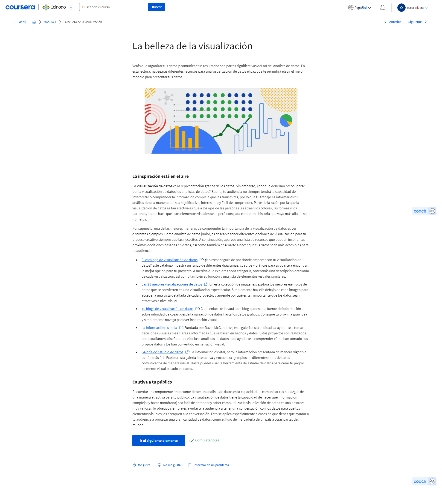

#### Una receta para una visualización poderosa

¡Hola! Volvimos y estamos listos para aprender cómo crear visualizaciones de datos poderosas. A continuación, exploraremos cómo convertir nuestros hallazgos en representaciones visuales cautivadoras. Anteriormente, hablamos de la relación entre los datos y las imágenes. Ahora, desarrollaremos más ese tema para explorar qué pueden revelar las visualizaciones a tu público y cómo hacer que tus gráficos sean lo más eficaces posible. Una de las principales consideraciones al crear una visualización de datos es dónde quieres que se enfoque tu público. Mostrar demasiado puede distraer y dejar confundido a tu público. En algunos casos, limitar los datos puede ser algo bueno. Por otra parte, mostrar demasiado poco puede hacer que tu visualización sea poco clara y menos significativa. Como regla general, siempre y cuando no sea engañoso, debes representar visualmente solo los datos que tu público necesita para comprender tus hallazgos. Ahora, hablemos de lo que puedes mostrar con visualizaciones. El cambio a lo largo del tiempo es una de las principales. Si tu análisis involucra cómo cambiaron los datos durante un período determinado, que podría ser de días, semanas, meses o años, puedes armar tu visualización para que muestre solo el período relevante a tu objetivo. Esta visualización muestra los intereses de búsqueda en temas de actualidad como el medio ambiente, la ciencia y las problemáticas sociales. La visualización está armada para que muestre cómo las búsquedas cambian día a día. Las burbujas representan el tema más popular en cada día en una determinada parte de los EE.UU. A medida que surgen noticias, los datos cambian para reflejar el tema de esas noticias. Si quisiéramos los datos para ciclos de noticias semanales o mensuales, modificamos la función interactiva para que muestre cambios por semana o mes. Otra situación es cuando necesitas mostrar cómo se distribuyen tus datos. Un histograma se parece a un gráfico de barras, pero es un gráfico que muestra con cuánta frecuencia los valores de datos caen dentro de determinados rangos. Este histograma muestra muchos datos y cómo se distribuyen en un rango estrecho, de uno negativo a uno positivo. Cada intervalo o rectángulo, como se denomina la barra, contiene un determinado número de valores que caen dentro de una pequeña parte del rango. Si no necesitas mostrar tantos datos, otros histogramas serían más efectivos, como este sobre la longitud de los dinosaurios. Aquí los intervalos o rectángulos de los valores de los datos están segmentados. Puedes mostrar cada valor que cae en cada parte del rango. Si tus datos necesitan clasificarse, como al ordenar el número de respuestas a preguntas de un sondeo, deberías pensar primero en qué quieres destacar en tu visualización. Los gráficos de barras con barras horizontales muestran eficazmente datos que están clasificados, con barras ordenadas en orden ascendente o descendente. Un gráfico de barras siempre debería estar clasificado por valor, salvo que exista un orden natural en los datos, como edad o tiempo, por ejemplo. Este sencillo gráfico de barras muestra metales como el oro y el platino clasificados por densidad. El público podría ver con claridad la clasificación y determinar rápidamente qué metales tienen la densidad más alta, aunque esta base de datos incluyera muchos otros metales. Los cuadros de correlación pueden mostrar relaciones entre datos, pero debería usarse con cautela porque podrían llevar a los espectadores a pensar que los datos muestran causalidad. La causalidad, o relación causa-efecto, se produce cando una acción lleva directamente a un resultado. La correlación y la causalidad a menudo se confunden porque a los seres humanos les gusta encontrar patrones aun cuando no existen. Si dos variables parecen estar asociadas de alguna manera, podríamos asumir que una depende de la otra. Eso implica causalidad, incluso si las variables son completamente independientes. Si ponemos esos datos en una visualización, sería engañoso. Pero los cuadros de correlación que sí muestran causalidad pueden ser efectivos. Por ejemplo, este cuadro de correlación tiene una línea de datos que muestra el tráfico promedio de búsquedas en Google los martes en Brasil. La otra línea es de una fecha específica de tráfico de búsqueda, el 15 de junio. Los datos están correlacionados automáticamente porque ambas líneas representan la misma información básica. Pero el gráfico también muestra una gran diferencia. Cuando un partido de fútbol o <i>soccer </i>para los estadounidenses comenzó el 15 de junio, el tráfico de búsqueda mostró una caída significativa. Eso implica causalidad. El fútbol es un deporte muy popular e importante para los brasileños, y los datos de este gráfico así lo verifican. Ya hablamos de gráficos de series temporales, histogramas, gráficos de barras clasificadas y cuadros de correlación. Cada uno de estos gráficos puede visualizar un tipo diferente de análisis. Tu objetivo de negocios y tu público te ayudarán a determinar cuál de estas visualizaciones comunes elegir. O quizás quieras consultar algunos otros tipos de visualizaciones que existen. Además, hay visualizaciones tipo glosario que podrás consultar más adelante. Esto engloba nuestra lección sobre la creación de visualizaciones. A continuación, agregaremos algunas capas más a tu planificación y ejecución de representaciones visuales. No te vayas.

#### Correlación y causalidad

<https://towardsdatascience.com/correlation-is-not-causation-ae05d03c1f53>
<https://www.khanacademy.org/test-prep/praxis-math/praxis-math-lessons/gtp--praxis-math--lessons--statistics-and-probability/a/gtp--praxis-math--article--correlation-and-causation--lesson>
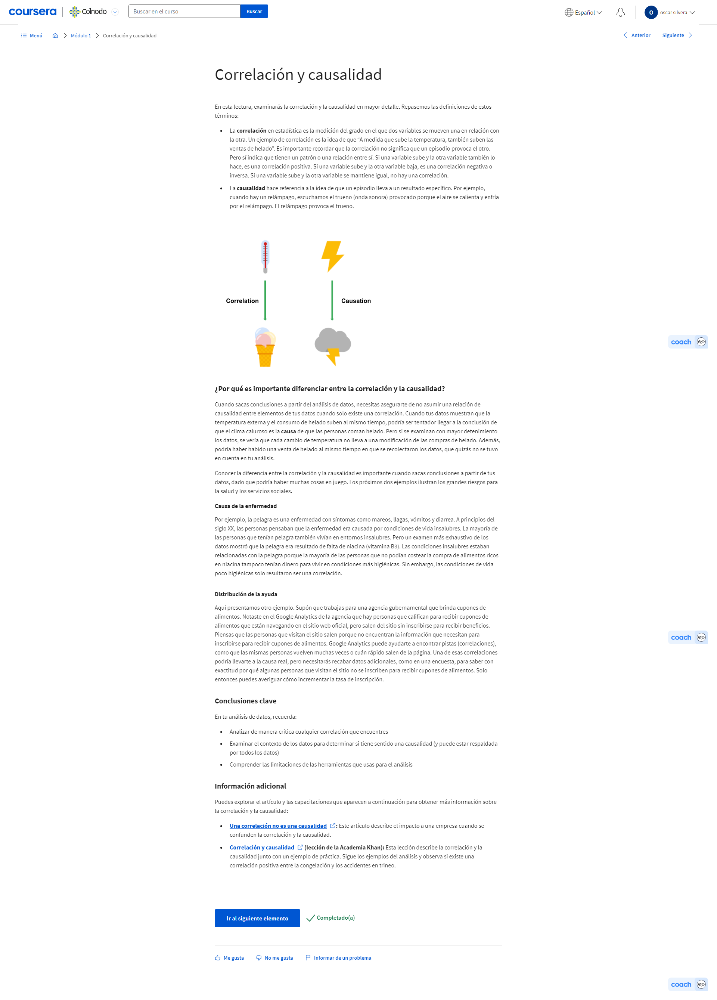

#### Visualizaciones dinámicas

Hola, ¡qué bueno volver a verte! Hasta ahora, mostramos que existen muchas opciones que elegirás como analista de datos al crear visualizaciones. Cada una de tus elecciones debería ayudar a garantizar que tus representaciones visuales sean significativas y eficaces. Otra elección que deberás hacer es si quieres que tus visualizaciones sean estáticas o dinámicas. Las visualizaciones estáticas no cambian con el tiempo salvo que se editen. Pueden ser útiles cuando quieres controlar tus datos y tu historia de datos. Cualquier visualización impresa en papel es automáticamente estática. Los cuadros y gráficos creados en hojas de cálculo también suelen ser estáticos. Por ejemplo, el propietario de esta hoja de cálculo podría tener que modificar los datos para que se actualice la visualización. Ahora bien, las visualizaciones dinámicas son interactivas y cambian a lo largo del tiempo. La naturaleza interactiva de estos gráficos significa que los usuarios tienen algo de control sobre lo que ven. Esto puede ser útil si los interesados quieren ajustar lo que pueden ver. Veamos una visualización sobre la felicidad que creamos en Tableau. Tableau es una plataforma de inteligencia empresarial y análisis computacional que ayuda a las personas a ver, comprender y tomar decisiones con datos. Las visualizaciones en Tableau son automáticamente interactivas. Entraremos en el panel para ver cómo el puntaje de felicidad ha cambiado de 2015 a 2017. Podemos ver esto en nuestra diapositiva 12, cambios anuales en la felicidad. A la izquierda, están los cambios a nivel del país en el puntaje de felicidad. Los países se clasifican por incremento más alto a disminución más marcada. A la derecha, hay un mapa con puntajes generales de felicidad. La escala de color va del azul para países con el puntaje de felicidad más alto, al rojo para los que tienen el puntaje más bajo. Si miras debajo del mapa, observarás un control deslizable de año a visualizar en el que las personas pueden elegir los puntajes de felicidad de qué año quieren que se muestren en el mapa. Actualmente está fijado en 2016, pero si alguien quiere saber los puntajes de 2015 o 2017, pueden ajustar el control deslizante. Entonces, podrían observar cómo los códigos de color y las etiquetas de puntaje cambian año a año. Otras visualizaciones dinámicas cargan nuevos datos automáticamente. Estos gráficos de barras actualizan constantemente los datos minuto a minuto y segundo a segundo. Otras representaciones visuales de datos pueden hacer lo mismo por día, semana o mes. Si así lo necesitas, puedes mostrar tendencias en tiempo real. Tener una visualización interactiva puede ser útil tanto para ti como para el público con el que la compartes. Pero es bueno recordar que cuanto más poder le des al usuario, menos control tienes sobre la historia que quieres contar con tus datos. Es algo para tener en cuenta mientras aprendes cómo crear tus propias visualizaciones. Lo recomendable es encontrar el equilibrio correcto entre la interactividad y el control. Otra cosa para tener en cuenta es que la elección de usar una visualización estática o dinámica generalmente dependerá de los datos que estés visualizando, el público ante el cual estás presentando, y cómo estás realizando tu presentación. Ahora que hemos tomado algunas decisiones sobre el tipo de visualización de datos que queremos crear, podemos empezar a pensar en el diseño, que es exactamente donde comenzaremos a hablar la próxima vez. Nos vemos allí.

#### El maravilloso mundo de las visualizaciones

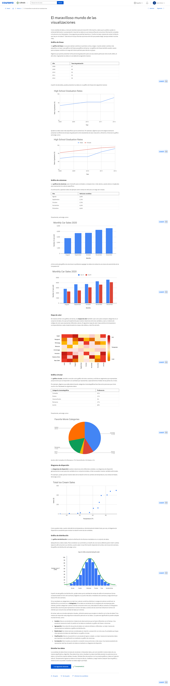

#### Los datos crecen en árboles de decisiones

<https://www.data-to-viz.com/>
<https://www.youtube.com/watch?v=C07k0euBpr8>
<https://www.youtube.com/watch?v=qGaIB-bRn-A>

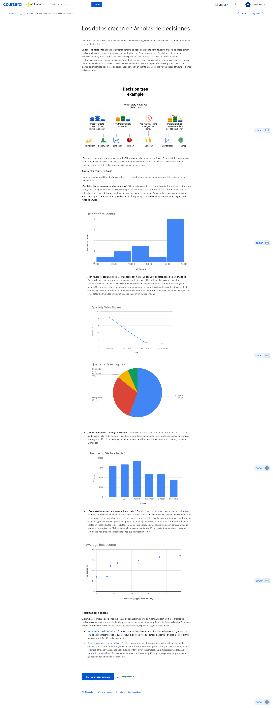

#### Cuestionario práctico: Autorreflexión: Elección de tu visualización

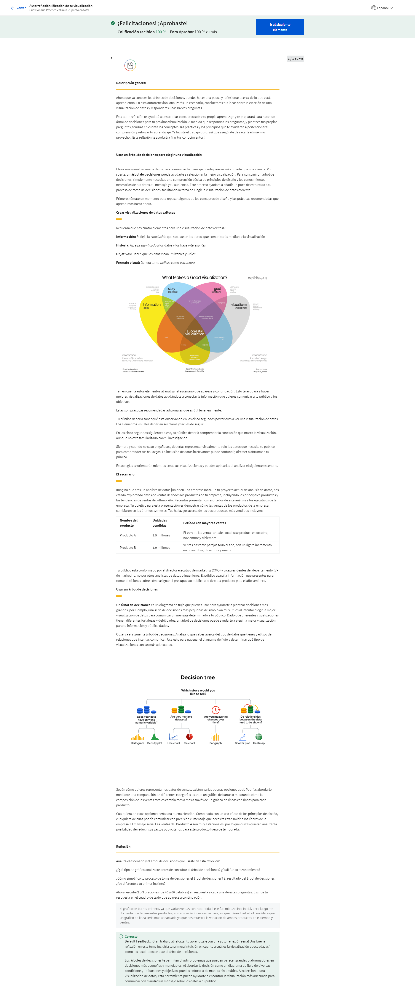

#### Cuestionario práctico: Pon a prueba tus conocimientos sobre la visualización de datos

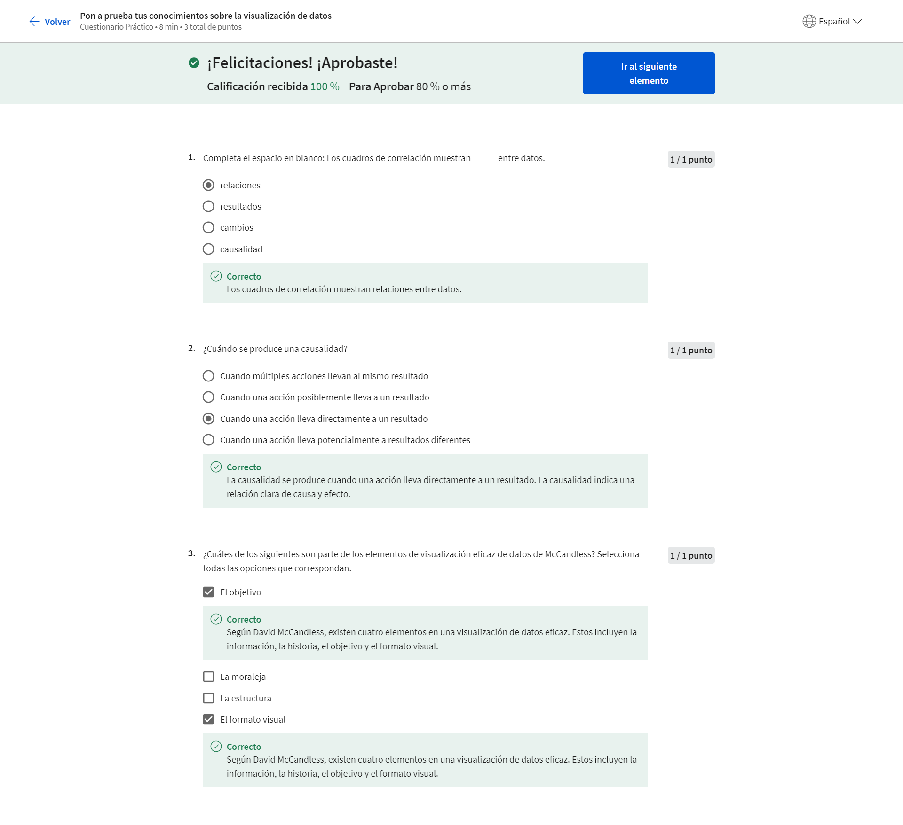

### Diseñar visualizaciones de datos

#### Elementos del arte

Hola. Bienvenido de nuevo. Probablemente no pensabas aprender sobre arte en un curso de análisis de datos, pero eso es exactamente lo que haremos. Tanto los analistas de datos como los artistas usan elementos de arte en su trabajo. Te presentaremos esos elementos aquí y te mostraremos cómo aplicarlos a visualizaciones más adelante. Los elementos que veremos son línea, forma, color, espacio y movimiento. Ahora bien, estos no son los únicos elementos a tener en cuenta, pero estos elementos en particular pueden sumar valor a tu visualización de datos haciéndolos más eficaces y atractivos a nivel visual. Las líneas y visualizaciones pueden ser curvas o rectas, gruesas o finas, verticales, horizontales o diagonales. Pueden sumar un formato visual a tus datos y ayudar a armar una estructura para tu visualización. Estos gráficos muestran parte de la variedad que pueden aportar las líneas a tu visualización de datos. El gráfico combinado muestra dos tipos diferentes de líneas y ambas brindan un gráfico para los datos. El gráfico de líneas hace lo mismo, pero usa líneas curvas. Las formas también son conocidas por ser variadas. Las formas y visualizaciones siempre deben ser bidimensionales. Esto se debe a que los objetos tridimensionales en una visualización pueden complicar la representación visual y confundir al público. Las formas también son una gran manera de sumar contraste que llame la atención, especialmente contraste de tamaño, a tu historia de datos. Este círculo usado para un gráfico circular permite a las personas entender los datos en un formato familiar. Las formas simétricas generalmente resultan más familiares, por lo que el público tiene que trabajar menos al mirar una visualización de datos simétrica. Sin embargo, las formas asimétricas en este mapa igualmente se reconocen de inmediato como países. Es bueno observar que los datos que compartes con tu público generalmente incidirán en los tipos de formas que deberías usar en tu visualización de datos. Luego tenemos los colores, y los colores son, bueno, colores. Por supuesto, desde la perspectiva de los artistas y analistas, los colores pueden ser algo mucho más complejo. Los colores se pueden describir por su matiz, intensidad y valor. El matiz de un color es básicamente su nombre, rojo, verde, azul, etc. La intensidad es cuán brillante u opaco es el color. Y, por último, está el valor. El valor es cuán claros u oscuros son los colores en una visualización. En términos más científicos, el valor indica cuánta luz se refleja. Los valores oscuros con un poco de negro agregado se llaman tonos de color, como estos tonos de verde. Los valores claros con blanco agregado se llaman tintes, como estos tintes de azul. En este mapa, hay tonos y tintes de gris. El valor de estos colores nos ayuda a comprender los datos demográficos en el mapa y variar el valor del color puede ser una manera muy eficaz de llamar la atención del público a zonas específicas. El espacio es la superficie en medio, alrededor y dentro de los objetos. Siempre debería haber espacio en las visualizaciones de datos, pero no excesivo ni escaso. Por ejemplo, el espacio entre las barras de un gráfico de barras como este debería ser menor al ancho de las propias barras. Esto hará que el espectador preste atención a la barra y los datos que representa en vez de al espacio vacío. Por último, está el movimiento. El movimiento se usa para crear una sensación de flujo o acción en una visualización. Uno de mis ejemplos favoritos es la visualización de datos "La riqueza y la salud de las naciones". Esta visualización presenta una correlación entre la salud financiera y la salud física de las naciones. Hace un seguimiento de estos elementos a lo largo del tiempo para que puedas ver cómo los dos efectos correlacionados evolucionan. El movimiento incorpora datos desde el siglo XIX hasta recientemente. La interactividad permite que se muestre un mayor volumen de datos y que revelemos múltiples historias de la misma visualización de datos. Recuerda, esto es algo que debería usarse con moderación. Hay una delgada línea entre atraer la atención y distraer al público. Una imagen estática te permite controlar todos los elementos de la historia que quieres contar. Cuando empiezas a incorporar movimiento e interactividad, la historia es controlada por quien controla la interactividad, ya seas tú o posiblemente tu público si le cediste el control. Comentaremos este delicado equilibrio más adelante en el curso. Cuando juntas muchos de estos elementos de arte en una visualización como esta sobre el nivel del mar, puede ser hermoso y provocador. Prueba que hay lugar para la expresión de creatividad en el análisis de datos. A continuación, seguiremos explorando maneras de sumar una expresión de creatividad significativa a tu visualización de datos. ¡Hasta luego!

#### Principios de diseño

<https://developers.google.com/chart/interactive/docs/gallery/columnchart>
<https://pudding.cool/2017/02/new-slang/>
<https://developers.google.com/chart/interactive/docs/gallery/combochart>
<https://developers.google.com/chart/interactive/docs/gallery/barchart>
<https://developers.google.com/chart/interactive/docs/gallery/controls>

#### Impacto de la visualización de datos

Bienvenidos nuevamente. Arranquemos.
Reproduce el video desde ::4 y sigue la transcripción0:04
Ojalá que a esta altura ya tengas una imagen clara de las visualizaciones de datos. Hemos explorado todo, desde principios de diseño hasta los tipos de gráficos que puedes usar en tus visualizaciones. La elección de la visualización adecuada para los resultados de tus datos a menudo puede reducirse a una pregunta: ¿Cuál hará que sea más fácil para el usuario entender el punto que intentas marcar?
Reproduce el video desde ::26 y sigue la transcripción0:26
Sin importar cuán complejo sea tu análisis, a tu público solo le importará lo que tiene delante y cuán fácilmente puede entenderlo. Mientras completes tu análisis, tendrás que decidir cuál visualización satisface tus necesidades y las de tu público para cada tarea. Por ejemplo, si quieres mostrar una comparación de los diferentes grupos etarios de visitantes a un sitio web, un gráfico de líneas con una línea para cada grupo etario, más una para los usuarios totales funcionaría bien. Digamos que quieres resaltar las diferencias entre los grupos etarios para compararlos directamente, para eso podrías usar un gráfico de barras positivo-negativo como este.
Reproduce el video desde :1:7 y sigue la transcripción1:07
Ya hablamos de esto, pero hagamos algunas conexiones más entre los datos que tendrás después del análisis y las visualizaciones que deberías usar para diferentes casos.
Reproduce el video desde :1:19 y sigue la transcripción1:19
Empezaremos con algunos gráficos.
Reproduce el video desde :1:21 y sigue la transcripción1:21
Ya trabajamos con algunos de ellos antes y luego hablaremos más acerca de gráficos con más ejemplos. Además, descubrirás que los mejores gráficos para adecuarse a tus propósitos podrían depender de las necesidades de tu industria y empresa, y los interesados que estarán en tu público. Para comparar datos en el tiempo te mostramos cómo los gráficos de líneas podían ser eficaces. Como en este caso, los gráficos de barras y los gráficos de barras apiladas, junto con los gráficos de áreas, también pueden ser buenas maneras de visualizar cómo los datos cambian a lo largo del tiempo. Por cierto, existen muchos gráficos en el mundo, te daremos la mayor cantidad de información posible sobre la mayor cantidad que podamos. Pero investigarlos por tu cuenta o practicar usarlos en visualizaciones también te resultará útil. Bueno, cuando estás comparando distintos objetos como en nuestro ejemplo sobre uso de móviles versus computadoras, son útiles los gráficos de barras ordenadas, los gráficos de barras agrupadas y los gráficos de columnas ordenadas.
Reproduce el video desde :2:16 y sigue la transcripción2:16
Después existen gráficos que muestran parte de un todo. Esto se conoce como composición de datos y se logra combinando las partes individuales de una visualización y mostrándolas juntas como un todo. Las barras apiladas, los anillos, las áreas apiladas, los gráficos circulares y los diagramas de árbol pueden hacer todo esto. Ahora, para mostrar relaciones en tus datos, quizás te convenga usar diagramas de dispersión y gráficos de burbujas, gráficos de columnas/líneas y mapas de calor. Volvamos a consultar la visualización de datos de felicidad para que veas un ejemplo de esto. Cada uno de estos diagramas de dispersión muestra la relación entre el puntaje de felicidad de un país y uno de los factores que contribuye a ese puntaje.
Reproduce el video desde :2:57 y sigue la transcripción2:57
Entonces, el diagrama de dispersión de salud versus felicidad muestra una fuerte relación entre la esperanza de vida de personas que viven en un país y cuán felices son esas personas. Básicamente, a medida que aumenta la esperanza de vida, también aumenta su puntaje de felicidad. Hablando de felicidad, una visualización de datos exitosa tiene como resultado un público feliz. Por eso, es importante comprender cómo tu público está viendo tus visualizaciones de datos, dado que siempre deberías tenerlo muy presente. Todo empieza en el cerebro: Al procesar información, nuestro cerebro intenta encontrar patrones y confía en el contexto visual. Como analistas de datos, podemos usar nuestra comprensión del sistema visual de las personas para producir mejores elementos visuales. Cuando creamos visualizaciones, podemos hacerlo de una manera que ayude al público a procesar la información y los ayude a recordar lo que están viendo. La periodista visual Dona Wong propone que las representaciones visuales exitosas, como la base de datos que hemos estado comentando aquí, tienen tres elementos esenciales. El primero es un significado claro. Las buenas visualizaciones comunican con claridad su conclusión prevista. El segundo es un uso sofisticado del contraste, que ayuda a separar los datos más importantes del resto usando el contexto visual que nuestro cerebro busca naturalmente. El tercer elemento esencial para las representaciones visuales eficaces es una ejecución elegante. Las representaciones visuales con una ejecución elegante incluyen una profunda atención a los detalles, usando elementos visuales como líneas, formas, colores, valor, espacio y movimiento. Es decir, los elementos del arte de los que hablamos anteriormente. La primera regla de la mayoría de los negocios es satisfacer al cliente: en el análisis de datos es lo mismo. Si bien tus clientes probablemente sean gerentes y otros interesados, siempre deberías pensar primero en ellos al crear visualizaciones de datos. Piensa en la regla de los cinco segundos que comentamos antes. Si haces que tu visualización de datos sea fácil de mirar y entender con rapidez, hiciste bien tu trabajo y estarás satisfecho, al igual que tus clientes. A continuación, hablaremos sobre la metodología <i>Design Thinking</i> y las visualizaciones de datos. Nos vemos pronto.

#### Los datos son bellos

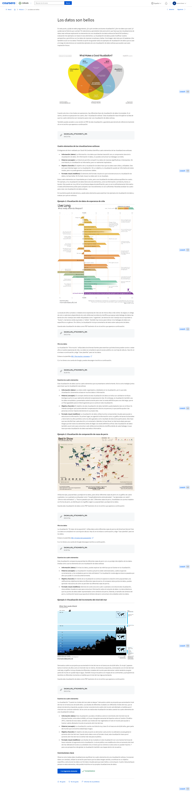

#### La metodología Design Thinking y las visualizaciones

Hola de nuevo. Abarcamos muchos temas en nuestra exploración de visualizaciones de datos. Hablamos mucho acerca de cómo tu público debería ser el foco cuando tomas decisiones sobre gráficos, colores, espacio, etiquetas y todos los otros elementos de las visualizaciones de datos. Ahora hablemos sobre <i>Design Thinking</i>. La metodología<i> Design Thinking</i> es un proceso que se usa para resolver problemas complejos de una manera centrada en el usuario.
Reproduce el video desde ::25 y sigue la transcripción0:25
Cuando aplicas <i>Design</i> <i>Thinking</i> a tu trabajo, intentas identificar estrategias alternativas para tus visualizaciones que quizás no resulten claras de inmediato. Tienes que desafiar tu propio razonamiento y explorar diferentes maneras de enfocar los problemas y encontrar soluciones. Airbnb es un ejemplo de una empresa que usa un enfoque de <i>Design Thinking</i> para ayudar a hacer crecer su negocio. Cuando la empresa, un mercado en línea de alquileres vacacionales, no generaba tantos ingresos como ellos querían, decidieron empezar a experimentar. Aunque los datos que recolectaron y analizaron eran valiosos, necesitaban mirar su producto desde la perspectiva del cliente. Se dieron cuenta de que las fotos de los lugares que los clientes veían simplemente no eran muy buenas, entonces decidieron ayudar a sus clientes a reemplazar las fotos no tan buenas por fotos más profesionales. Así fue como contrataron a un fotógrafo y fueron casa por casa a tomar fotos profesionales de sus anuncios en la ciudad de Nueva York. En una semana, los anuncios con estas fotos registraron el doble o el triple de reservas y sus ingresos casi se duplicaron, gracias a su nueva perspectiva de <i>Design Thinking</i> basada en el usuario. Si <i>Design Thinking</i> puede funcionar para empresas como Airbnb, también puede ayudar a los analistas de datos, y la visualización de datos es la etapa perfecta de tu análisis para aplicar un enfoque basado en el usuario.
Reproduce el video desde :1:45 y sigue la transcripción1:45
Si usas <i>Design Thinking</i> cuando planificas y creas tu visualización de datos, estarás tomando decisiones basadas en las necesidades de las personas que la verán. De esta manera, tu público estará involucrado y aprenderá a partir de la manera en que visualizas tus resultados. Si bien el proceso de <i>Design Thinking</i> viene en muchas formas diferentes, todos tienen etapas o fases. Hablaremos de las cinco fases que puedes usar al crear visualizaciones de datos: empatizar, definir, idear, crear prototipos y probar. Siguiendo la línea del <i>Design Thinking</i>, estas fases no tienen que seguir un orden fijo, sino que puedes pensar en ellas como una descripción general de acciones que pueden ayudarte a producir un diseño centrado en el usuario en tus visualizaciones. En la fase de empatizar piensas en las emociones y necesidades del público objetivo de tu visualización de datos, ya sea sus interesados, miembros del equipo o el público general. En este punto, deberías evitar áreas en las que las personas podrían enfrentar obstáculos al interactuar con tus visualizaciones. Por ejemplo, digamos que estás trabajando en un análisis para una empresa farmacéutica sobre cómo los pacientes han estado respondiendo a un nuevo tratamiento. Te estás preparando para visualizar los datos, entonces, deberías pensar en el público, que incluirá a interesados como farmacéuticos, médicos y otros profesionales médicos. Quizás estés pensando en usar un esquema de color que te gusta, pero te das cuenta de que estos colores podrían ser un desafío para algunas personas. Los colores podrían ser demasiado brillantes o dramáticos, lo que podría no ser una opción correcta para la seriedad de los datos. O los colores podrían no tener suficiente contraste para personas con deficiencias en la percepción del color.
Reproduce el video desde :3:23 y sigue la transcripción3:23
Al ajustar los colores, empatizarás con las necesidades de tu público. Si hay alguien en tu equipo que tenga problemas de vista, es recomendable que también encuentres una manera de explicar los datos verbalmente. La fase de definir te ayuda a encontrar las necesidades de tu público, sus problemas y tus conclusiones. Esto va de la mano con la fase de empatizar, ya que usarás lo que aprendiste en esa fase para ayudarte a explicar con lujo de detalles exactamente qué necesita tu público de tu visualización. Podrías usar esta fase para pensar en qué datos mostrar en tu visualización. Quizás esta visualización de datos también se presente a pacientes que forman parte del estudio de tu empresa.
Reproduce el video desde :4:1 y sigue la transcripción4:01
Si bien necesitarás cumplir con tus objetivos, quizás haya datos que pongan incómodas a estas personas.
Reproduce el video desde :4:8 y sigue la transcripción4:08
Puedes pensar maneras de posicionar los datos para hacer que sean más digeribles. O si presentas ante diferentes públicos, puedes ajustar tus visualizaciones para satisfacer las necesidades de cada grupo pidiéndole su opinión a miembros del grupo o colegas que trabajaron antes con ese grupo.
Reproduce el video desde :4:25 y sigue la transcripción4:25
En la fase de ideación, empiezas a generar tus ideas de visualización de datos. Usarás todos tus resultados de las fases de empatizar y definir para hacer una lluvia de ideas sobre potenciales soluciones de visualización de datos.
Reproduce el video desde :4:37 y sigue la transcripción4:37
Esto podría involucrar la creación de borradores de tu visualización con diferentes combinaciones de color o quizás experimentar con diferentes formas. Crear la mayor cantidad de ejemplos posibles te ayudará a refinar tus ideas. La clave en este punto es siempre recordar a tu público cuando generas ideas y estrategias. Es recomendable que pienses en cómo puedes posicionar tus visualizaciones para satisfacer las necesidades y expectativas de tu público. Las dos fases finales son crear prototipos y probar. Aquí empezarás a juntar tus gráficos, paneles u otras visualizaciones.
Reproduce el video desde :5:10 y sigue la transcripción5:10
Si mantuviste en mente a tu público durante todas las fases hasta este momento, tu visualización de datos será informativa y accesible.
Reproduce el video desde :5:18 y sigue la transcripción5:18
Quizás quieras crear muchas visualizaciones para elegir la que mejor cumpla con tu objetivo.
Reproduce el video desde :5:24 y sigue la transcripción5:24
Podrías probar tus visualizaciones mostrándoselas a miembros del equipo antes de presentárselas a interesados. Si creaste más de una para los mismos datos o para diferentes públicos como los profesionales médicos y los pacientes de nuestro ejemplo anterior, puedes compartirles todas tus opciones. Como siempre, escucha cualquier comentario que recibas. Tus propias críticas y las de terceros son claves para el proceso de <i>Design Thinking</i>. Te ayudan a mantenerte enfocado en el público al integrar nuevas ideas en tu producto final. Se usa mucho la frase “salirse del molde”, pero sin dudas se aplica a este caso. El molde en este caso es tu propia manera habitual de enfocar los datos, y su visualización. Si adoptas la metodología <i>Design Thinking</i>, podrás crear visualizaciones de datos muy eficaces para cualquier público. A continuación, analizaremos más cosas que necesitas analizar dentro de tu visualización de datos. Nos vemos allí.

#### La metodología Design Thinking para la mejora de la visualización

<https://dataconomy.com/2019/05/three-critical-aspects-of-design-thinking-for-big-data-solutions/>
<https://www.enginess.io/insights/data-and-design-thinking>
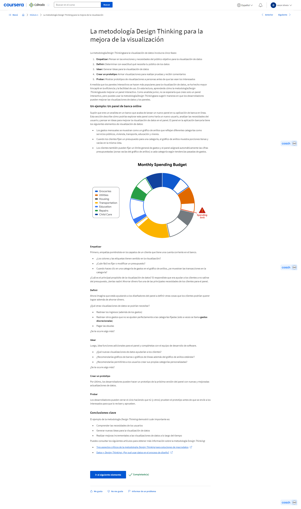

#### Cuadro de aviso de la discusión: Identificar visualizaciones de datos en tu vida

Las visualizaciones de datos son una herramienta potente para los analistas de datos, ya que comunican mediante datos. Hasta el momento, has aprendido cuán importante puede ser la visualización de datos al narrar historias con datos o tomar decisiones basadas en datos. Con base en lo aprendido, ¿hay áreas en tu vida en la que la visualización de datos te haya ayudado a contar una historia o tomar una decisión? Esto podría incluir usar estadísticas de equipos deportivos, gráficos de tendencias del mercado bursátil o anuncios que usaban visualización de datos para ayudarte a tomar una decisión.

#### Cuestionario práctico: Pon a prueba tus conocimientos sobre cómo diseñar las visualizaciones de datos

### Explora consideraciones de visualización

#### Títulos, subtítulos y etiquetas

Hola de nuevo. Hemos aprendido que las visualizaciones de datos están diseñadas para ayudar al público a procesar información de manera fácil y memorable. Quizás recuerdes la regla de los 5 segundos que comentamos anteriormente. Dentro de los primeros cinco segundos de ver una visualización de datos tu público debería comprender exactamente qué estás intentando transmitir. Cinco segundos puede parecer un relámpago, pero agregar palabras descriptivas realmente puede ayudar a que tu público interprete y comprenda los datos correctamente. Es menos probable que tu público tenga preguntas sobre lo que estás compartiendo si agregas títulos, subtítulos y etiquetas. Una de las maneras más fáciles de resaltar datos clave en tu visualización de datos es mediante títulos. Un título es una línea de palabras impresas en letras grandes en la parte superior de una visualización para comunicar qué datos se están presentando. Es lo que capta la atención y hace que tu público quiera leer más. Tomemos el ejemplo de los gráficos. Un gráfico sin título es como un informe sin título. El objetivo es hacer que sea fácil comprender de qué se trata tu gráfico. Asegúrate de usar frases claras y concisas que expliquen toda la información con la mayor sencillez. Intenta evitar el uso de abreviaturas o siglas, aun si crees que todos las conocen. La tipografía y ubicación del título también es importante. Lo mejor es mantener la sencillez. Ponle negrita o hazle unos puntos más grande que el resto del texto y ubícalo directamente por encima del gráfico, alineado a la izquierda. Luego, explica aún más tu visualización de datos con un subtítulo. Un subtítulo refuerza el título al agregar más contexto y descripciones. Usa un estilo de fuente que combine con el resto de los elementos del gráfico y ubica el subtítulo justo debajo del título. Ahora, hablemos de las etiquetas. Anteriormente, mencionamos a Dona Wong, una periodista visual que es conocida por compartir pautas para hacer que las visualizaciones de datos sean más eficaces. Ella hace mucho hincapié en el uso de etiquetas directamente sobre los datos en vez de depender de las leyendas. Esto se debe a que los gráficos usan diferentes propiedades visuales como colores o formas para representar diferentes valores de datos. Una leyenda o llave identifica el significado de diversos elementos en una visualización de datos y puede usarse como alternativa a etiquetar los datos directamente. El etiquetado directo mantiene la atención de tu público fija en tu gráfico y le ayuda a identificar datos on rapidez, mientras que las leyendas fuerzan al público a trabajar más, porque las leyendas están colocadas fuera de los datos del gráfico. Lo cierto es que cuanto más apoyo brindemos a nuestro público, menos trabajo tiene que hacer para intentar comprender qué intentan decir los datos y más rápido tendrá impacto nuestra historia. Ahora que hemos hablado de cómo hacer que una visualización de datos sea lo más eficaz posible, a continuación, averiguaremos cómo hacer que sea accesible para todos. Te veo en un rato.

#### Consejos profesionales para destacar información clave

<https://i.redd.it/rw0vrjakuoc61.png>
<https://www.reddit.com/r/dataisbeautiful/comments/l1yly6/oc_which_generation_controls_the_senate/>
<https://ichef.bbci.co.uk/news/976/cpsprodpb/65D8/production/_100827062_chart-globalcoffeeproduction-iskhe-nc.png>
<https://www.bbc.com/news/business-43742686>

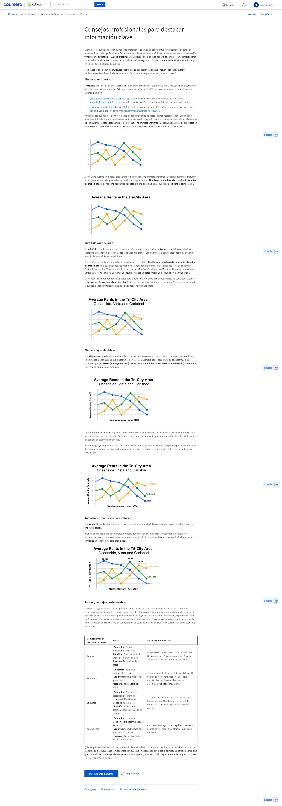

#### Visualizaciones accesibles

Hola, me alegra verte de nuevo. Arranquemos. Más de mil millones de personas en el mundo tienen una discapacidad. Eso es más que la población combinada de Estados Unidos, Canadá, Francia, Italia, Japón, México y Brasil. Antes de diseñar una visualización de datos, es importante que tengas ese hecho en mente. No todos tienen las mismas capacidades y las personas absorben información de diversas maneras. Quizás tengas un espectador que es sordo o tiene problemas de audición y depende de los subtítulos, o alguien daltónico podría buscar más descripciones en un etiquetado específico. Hemos hablado de muchas maneras de hacer que una visualización de datos sea bella e informativa. Y ahora es momento de tomar esos conocimientos y hacer que sean accesibles a todos, incluyendo a personas con discapacidades. La accesibilidad puede definirse de diversas maneras. Desde el comienzo, existen algunas maneras de incorporar accesibilidad en tu visualización de datos. Simplemente tendrás que pensar de manera un poco diferente. Ayuda etiquetar los datos directamente en vez de depender exclusivamente de leyendas, que requieren la interpretación de colores y más esfuerzo por parte del espectador para comprender. Esto también puede hacerla más rápida de leer para las personas con o sin discapacidades. Observa esta visualización de datos: los colores hacen que sea difícil de leer y la leyenda es confusa. Ahora, si simplemente eliminamos la leyenda y agregamos etiquetas de datos, listo, la presentación es más clara. Otra manera de hacer que tus visualizaciones sean más accesibles es ofrecer alternativas de texto, para que pueda modificarse en otros formatos que las personas necesiten, como letra grande, braille o texto a voz. El texto alternativo ofrece una alternativa de texto a contenido sin texto. Permite que el contenido y la función de la imagen sean accesibles para quienes tienen discapacidades visuales o determinadas discapacidades cognitivas. Este es un ejemplo que muestra texto adicional para describir el gráfico. Y, hablando de texto, puedes hacer que los datos de los gráficos y diagramas estén disponibles en un formato de texto a través de una exportación a Sheets o Excel. Además, puedes hacer que sea más fácil para las personas ver y escuchar contenido separando el primer plano y el fondo. El uso de colores brillantes que contrasten contra el fondo puede ayudar a quienes tienen mala visibilidad, ya sea de manera permanente o temporal, a ver con claridad la información transmitida. Otra opción es evitar confiar solamente en el color para transmitir información y marcar distinciones con diferentes texturas y formas. Otra regla general es evitar complicar en exceso las visualizaciones de datos. Las visualizaciones de datos demasiado complicadas hacen que la mayoría de los públicos pierdan interés porque no pueden descifrar en dónde y en qué enfocarse. Es por eso que desglosar datos en visualizaciones sencillas es clave. Un error común es incluir demasiada información en una sola visualización o incluir largos fragmentos de texto o un exceso de información, gráficos y cuadros. Esto niega el propósito de tu visualización, haciendo que sea imposible de comprender a primera vista. En última instancia, diseñar con una perspectiva de accesibilidad significa pensar en tu público anticipadamente. Enfocarse en elementos visuales simples y fáciles de entender, y lo que es aún más importante, crear maneras alternativas de que tu público acceda a tus datos e interactúe con ellos. Y, cuando prestas atención a estos detalles, podemos encontrar soluciones para hacer que las visualizaciones de datos sean más eficaces para todos. Entonces ahora completaste tu primer curso de exploración de las visualizaciones de datos. Descubriste la importancia de crear visualizaciones de datos que satisfagan a tu público y de mantener al mismo tiempo el enfoque en el objetivo. Aprendiste diferentes maneras de hacer lluvias de ideas y planificar tus visualizaciones y cómo elegir los mejores gráficos para cumplir con ese objetivo. Y también aprendiste cómo incorporar elementos de la ciencia e incluso de la filosofía a tus visualizaciones. A continuación, veremos cómo tomar todos esos aprendizajes y aplicarlos en Tableau. Verás cómo esta herramienta de visualización de datos hace que tus visualizaciones de datos funcionen de manera más eficaz y efectiva. Nos vemos pronto.

#### Andrew: Hacer que los datos sean accesibles

[MÚSICA] Me llamo Andrew y soy gerente de datos y perspectiva del equipo de perspectiva de investigación de anuncios. ¿Qué significa eso realmente? Ayudo a mi empresa, Google, a tomar mejores decisiones a través de los datos y también trabajo con nuestros datos para contar historias para los comercializadores. Básicamente narración de datos a escala. La accesibilidad debería estar integrada en todo lo que hacemos. La accesibilidad en realidad se trata de asegurarse de crear visualizaciones de datos, gráficos, cuadros, tablas con los que cualquier persona pueda interactuar, tengan o no una discapacidad a largo plazo o incluso una discapacidad temporal. Podría ser auditiva, podría ser visual, podría ser sensorial de cualquier modo. Típicamente, las que comentamos en la visualización de datos tienen que ver con el color y el contraste. O quizás no pueden ver. Entonces existen diversas cosas que se pueden hacer a cualquier visualización mientras la estás preparando para mostrársela a personas y presentarla al mundo. Para que sea más fácil para ellas comprender tu gráfico y entender los puntos que intentas marcar, y simplemente para ser más inclusivo, vas a crearla y ya no vas a ser el encargado de presentarla. Va a aparecer en un lugar donde no podrás ser el que explora los datos para otros ni los enmarca para los demás. Y eso está bien. Pero a medida que se aleja más de ti tampoco podrás estar allí para explicársela a las personas y decir algo como, bueno, este es el punto, o como quizás no puedes leerla o verla o quizás estos colores son confusos, déjame asegurarme de que hayas entendido claramente. Solo es una manera de garantizar que todos en la sala puedan experimentar eso en lo que trabajaste tanto y puedan extraer el sentido de una manera clara, para que ellos también puedan aprovechar los datos que pasaste tanto tiempo trabajando y haciendo presentables para los demás. Entonces todas estas cosas son geniales para la accesibilidad y son más inclusivas, pero también te hacen mejor analista de datos y mejor narrador de historias, porque te fuerzan a ser más empático con tu público y con quien recibe tus datos. Lo estás haciendo para conmover y hacer pensar a otras personas, para convencer a alguien de que estos datos son significativos para él y de que debe aprovecharlos. O debe conocerlos y debe usarlos para la empresa o para su vida o para lo que sea. Entonces, enfocándote en la accesibilidad, enfocándote en el público, haciéndolo más inclusivo, estás haciendo que tus datos sean más claros y tengan más impacto para todos.

#### Diseñar un gráfico en 60 minutos

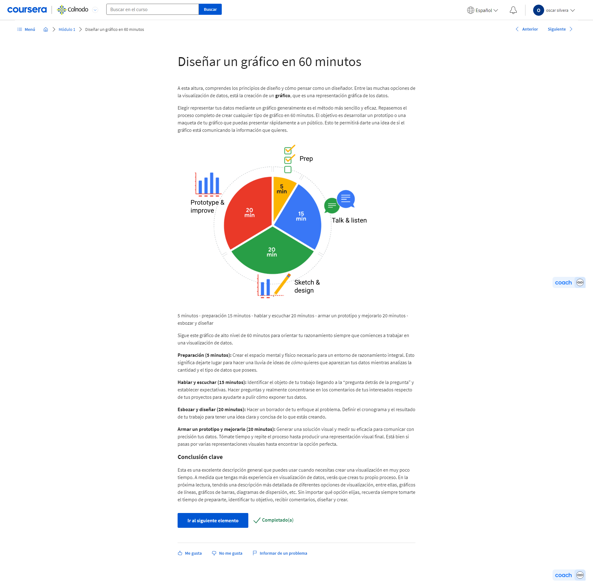

#### Actividad práctica: Armar tu propia visualización

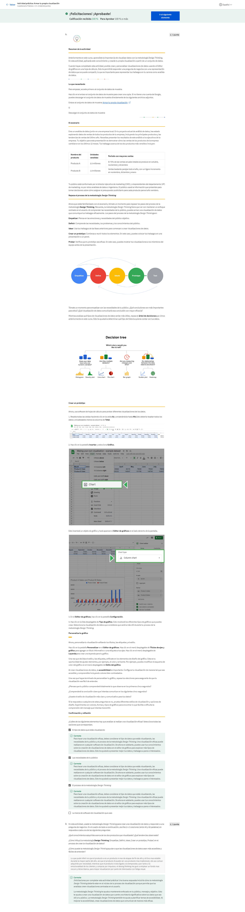

#### Pon a prueba tus conocimientos sobre exploración de visualización de datos

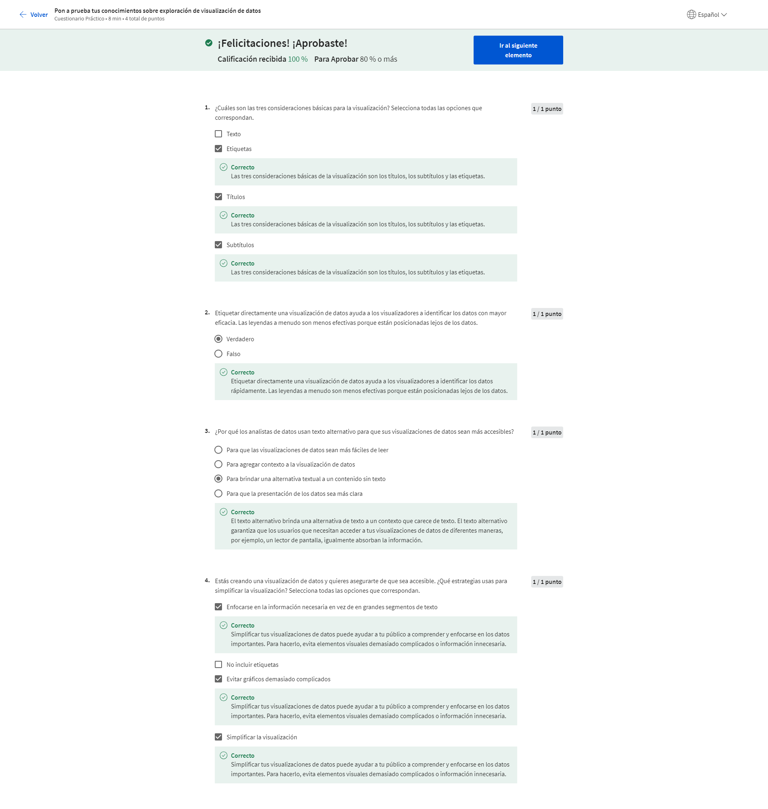

### Desafío semanal 1

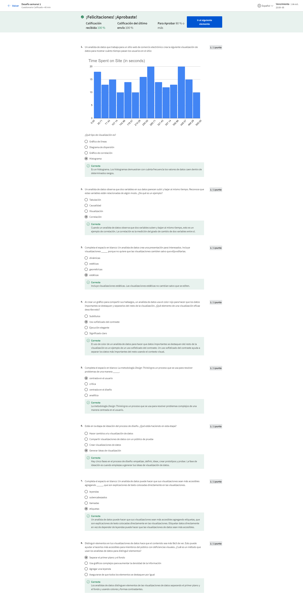

## Crear visualizaciones de datos con Tableau

### Empezar a usar Tableau

#### Visualizaciones de datos con Tableau

Hola de nuevo. Ya hemos debatido la utilidad de las visualizaciones de datos cuando queremos ubicar muchos conceptos en un espacio pequeño. Ahora es momento de explorar una herramienta muy potente que te puede ayudar a crear esas visualizaciones y darles vida a tus datos. Se llama Tableau, una plataforma de análisis visual de datos que simplifica mucho la exploración y el manejo de datos. Quizá recuerdes haber escuchado algo acerca de Tableau en algunos de nuestros debates previos, pero estás a punto de descubrir mucho más. Además, cuando te familiarices con Tableau, encontrarás todavía más fácil utilizar herramientas similares, lo que te proporcionará otras destrezas que te ayudarán a destacarte en tu búsqueda de empleo. A continuación, hablaremos de algunas características que hacen de Tableau una herramienta efectiva para visualizaciones y porqué se utiliza en todas las industrias. Luego, comenzará la verdadera diversión. Nos internaremos y exploraremos la interfaz de Tableau, para identificar y aplicar las diferentes herramientas que ofrece. Aquí, te mostraré cómo agregar fuentes de datos, elementos visuales de control y cómo trabajar con una variedad de características que harán que tu visualización sea realmente potente. Como toda plataforma de software, hay algunas buenas prácticas para tener en cuenta. Así que te mostraré algunos ejemplos de lo bueno y lo malo cuando de visualizaciones se trata. También nos pondremos creativos al utilizar paletas para deficiencia de visión del color, a fin de que nuestras visualizaciones sean más accesibles, y te mostraremos cómo fuentes de datos múltiples pueden combinarse para brindar una historia más abarcadora. Para el momento del cierre serás capaz de publicar tus propias visualizaciones en Tableau. Estoy muy contento de acompañarte en este paseo por Tableau. Es otra herramienta útil a la que podrás recurrir como futuro analista de datos a fin de visualizar y publicar datos que te interesan. Después de todo, los datos tienen una historia y esta es nuestra oportunidad de compartirla con otros. Entonces bien, vayamos a descubrir de qué se trata.

#### Tableau Public otras herramientas en línea

Es bueno verte de nuevo. Un buen manejo de herramientas en línea como Tableau hará más sencillo para tu público entender conceptos difíciles o identificar nuevos patrones en tus datos. ¿Necesitas ayudar en una presentación de medios de comunicación a cambiar los precios de las propiedades en mercados regionales? Sí. ¿Quieres ayudar a una organización sin fines de lucro a utilizar sus datos para mejorar la agilidad de sus operaciones? Sí.
Reproduce el video desde ::23 y sigue la transcripción0:23
¿Necesitas explorar cómo fueron las ventas de videojuegos durante las últimas décadas? Sí, por partida doble. Muchas diferentes clases de empresas están utilizando Tableau en este momento para realizar todo esto y más. Esto significa que existen buenas posibilidades de que termines utilizándolo en alguna ocasión. Tu carrera. Pero me estoy adelantando un poco. Hablemos de qué es en realidad Tableau. Quizá recuerdes haber aprendido que Tableau es una plataforma de inteligencia comercial y de análisis de datos que se puede utilizar en línea para ayudar a otras personas a ver y comprender los datos, y a tomar decisiones con ellos. Pero no todo son negocios todo el tiempo. Tomemos esta visualización de datos, por ejemplo, creada por un usuario frecuente de Tableau, Steve Thomas, para registrar avistamientos de Pie Grande en los Estados Unidos. Está disponible en Tableau Public, y lo estaremos utilizando juntos en nuestras actividades para este curso. Tableau te puede ayudar a crear y compartir de forma sencilla paneles, mapas y gráficos interactivos con tus datos. Sin ninguna codificación, puedes conectarte a datos y a muchos formatos como Excel, CSV y Google Sheets. Puede también que estés trabajando con una empresa que utiliza otra opción, como Looker o Google Data Studio, por ejemplo, igual que Tableau, Looker y Google Data Studio ayudan a procesar los datos crudos y transformarlos en imágenes. Pero cada uno lo hace de manera diferente. Por ejemplo, mientras Tableau te ofrece una variedad de formatos, como navegador y versión de escritorio, Looker y Google Data Studio se basan totalmente en navegadores. Pero hay buenas noticias. Una vez que aprendas los fundamentos de Tableau, verás que es muy fácil transferirlos a otras herramientas de visualización. Si estás listo para comenzar a utilizarlo, entonces, sin más preámbulos, te presento a Tableau.

#### Iniciar sesión en Tableau Public

<https://public.tableau.com/en-us/s/>

<https://public.tableau.com/en-us/s/viz-gallery>
<https://public.tableau.com/en-us/gallery/?tab=featured&type=featured>
<https://public.tableau.com/en-us/gallery/?tab=viz-of-the-day&type=viz-of-the-day>
<https://public.tableau.com/profile/grow.with.google#!/>
<https://public.tableau.com/en-us/s/resources>
<https://community.tableau.com/s/>

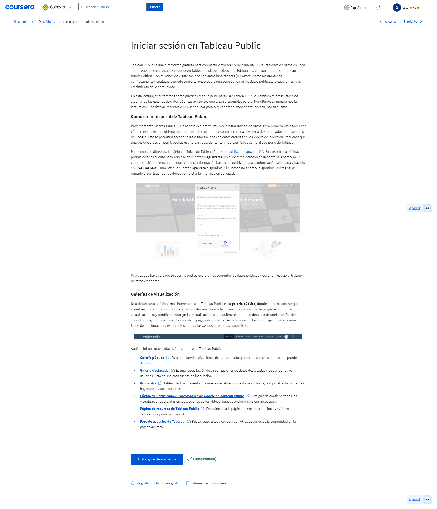

#### Conoce a Tableau

Hola y bienvenido a la intersección entre el análisis de datos y el arte. El lugar donde los analistas de datos, como yo, damos rienda suelta al potencial de los datos con imágenes significativas y el lugar al que los analistas de datos futuros, como tú, también pueden recurrir para aprender cómo hacerlo.
Reproduce el video desde ::17 y sigue la transcripción0:17
Bienvenido a Tableau, una de las plataformas de visualización que te ayudará a sacar más provecho de tus datos.
Reproduce el video desde ::25 y sigue la transcripción0:25
Cuando conviertes datos en una visualización, podrás ver cómo se transforman delante de tus ojos en una historia significativa con la que la gente pueda conectarse e interesarse. Las visualizaciones en Tableau son dinámicas, no estáticas. Como un recordatorio rápido, las visualizaciones dinámicas son interactivas o cambian con el tiempo. La naturaleza interactiva de esos gráficos significa que tu público tiene algo de control sobre lo que ve y tú tienes una flexibilidad increíble al momento de crearlos. De modo que, creemos nuestra propia visualización utilizando una tabla precargada en Tableau Public.
Reproduce el video desde :1:2 y sigue la transcripción1:02
Es importante destacar que hay diferentes maneras de crear visualizaciones en Tableau.
Reproduce el video desde :1:8 y sigue la transcripción1:08
Tableau tiene algunas opciones diferentes, pero para este curso, utilizaremos Tableau Public en el navegador, que es gratuito.
Reproduce el video desde :1:17 y sigue la transcripción1:17
Un detalle destacable acerca de Tableau Public es la galería pública de ejemplos de visualizaciones de datos de toda la web.
Reproduce el video desde :1:24 y sigue la transcripción1:24
Por ahora, estarás trabajando con uno de estos ejemplos de la galería. Copiarás de libros de datos a tu propio perfil para comenzar a crear y publicar visualizaciones. Para empezar, inicia sesión en tu cuenta de Tableau Public, puedes consultar una lectura previa para obtener más detalles. Luego, para acceder al libro, abre la página de certificados de Google Career en Tableau Public, haciendo clic en el enlace que se incluye en este vídeo y en la lectura anterior. Esto abrirá una nueva pestaña que está todavía enlazada con tu cuenta.
Reproduce el video desde :2: y sigue la transcripción2:00
Así es como se debería ver la página.
Reproduce el video desde :2:4 y sigue la transcripción2:04
Hay varios libros cargados con diferentes conjuntos de datos que puedes guardar en tu propio perfil.
Reproduce el video desde :2:10 y sigue la transcripción2:10
He aquí un buen punto de partida para crear tus propias visualizaciones.
Reproduce el video desde :2:15 y sigue la transcripción2:15
También verás otros recursos a continuación de este vídeo que abarcan cómo descargar Tableau y cargar tus propios datos. Pero por ahora utilizaremos esta galería para comenzar. Ahora haz clic para ver el libro titulado Solo los datos sobre felicidad mundial.
Reproduce el video desde :2:33 y sigue la transcripción2:33
Esto traerá una tabla de datos que usaremos para crear la visualización de datos sobre Felicidad mundial que está en la galería.
Reproduce el video desde :2:40 y sigue la transcripción2:40
Luego, ve al menú en la esquina superior derecha y haz clic en hacer una copia. En este punto, Tableau guardará una copia en de este libro en tu propio perfil para que puedas crear tus propias visualizaciones. Ahora que ya estás trabajando en tu propia copia, crea una nueva hoja de cálculo de modo que puedas crear una visualización de datos desde cero. Harás clic en Hoja de cálculo en el menú superior y luego en Nueva hoja de cálculo. Para comenzar a crear tu visualización de datos, añadir País como detalle en el estante de marcas. Puedes hacerlo arrastrando la tabla País hacia el ícono de detalle.
Reproduce el video desde :3:19 y sigue la transcripción3:19
Esto configura tu visualización como un mapa mundial para representar los datos en la tabla.
Reproduce el video desde :3:25 y sigue la transcripción3:25
A continuación, añade el puntaje de felicidad al color en el estante de marca. Esto aplica un esquema de color a la visualización; en este caso serán tonos de azul.
Reproduce el video desde :3:35 y sigue la transcripción3:35
Este rango de colores no ofrece grandes contrastes, especialmente para personas con dificultades en la percepción del color. De modo que, para ajustar los colores, harás clic en el menú Color y luego en Editar colores. Cambiarás el esquema de colores a verde, azul, divergente y pondrás una tilde en la caja de colores escalonados, que muestra una clara diferencia entre los puntajes de felicidad más altos y los más bajos. Un azul más oscuro significa un puntaje de felicidad más alto, mientras que el verde más oscuro implica un puntaje de felicidad menor. Puedes verlo desglosado en la escala en la esquina superior derecha. Así que, con solo un par de pasos creamos una visualización interesante que muestra los datos de felicidad en un modo sencillo de procesar. Los países y colores en el mapa son legibles y ofrecen algunas informaciones interesantes. Bien, sigamos adelante. Podemos explorar más de las características de Tableau para refinar tu visualización de datos. Debido a que hay tres años de datos en la tabla que estamos utilizando, puedes filtrar los datos para que solo incluyan el 2016.
Reproduce el video desde :4:37 y sigue la transcripción4:37
Puede ser útil utilizar múltiples años dependiendo de tu objetivo. Independientemente de ello, tienes muchas opciones para filtrar.
Reproduce el video desde :4:45 y sigue la transcripción4:45
De modo que añadiremos Año al estante de filtros.
Reproduce el video desde :4:49 y sigue la transcripción4:49
Luego elegiremos Filtrar por año y seleccionaremos el año 2016.
Reproduce el video desde :4:56 y sigue la transcripción4:56
Enfoquémonos ahora en la visualización de una región, la región europea.
Reproduce el video desde :5:2 y sigue la transcripción5:02
Para ello, mueve tu cursor a la parte izquierda del mapa para hallar la barra de herramientas de vista.
Reproduce el video desde :5:8 y sigue la transcripción5:08
Utiliza las herramientas en esta barra para desplazarte hacia la región europea y realizar un acercamiento.
Reproduce el video desde :5:15 y sigue la transcripción5:15
Esto requiere tiempo y práctica. Una vez que obtengas una buena vista de Europa y sus zonas aledañas, utiliza las herramientas de forma en la misma barra de herramientas para seleccionar todo lo que puedas de Europa. Como estamos practicando, haz tu mejor selección si no estás seguro de qué países quieres incluir. Si estuvieras trabajando en una visualización para compartir con otras personas, querrías realizar un doble control para asegurarte de la precisión.
Reproduce el video desde :5:40 y sigue la transcripción5:40
Lleva el cursor sobre uno de los países y te mostrará los datos acerca de ese país específico así como de todos los países de la región que has seleccionado.
Reproduce el video desde :5:50 y sigue la transcripción5:50
Luego, utiliza la herramienta de selección Lasso para seleccionar solo algunos países como este. Conservar solo, esto aplica otro filtro, esta vez al país que estás incluyendo en tu visualización. Notarás que el esquema de color de estos países se encuentra actualizado. Esto refleja que el rango de colores no solo ya se está aplicando a esos países.
Reproduce el video desde :6:15 y sigue la transcripción6:15
Los países en esta región pueden haber estado en la misma parte del rango cuando se los comparó con el resto del mundo, pero ahora están en partes diferentes porque los datos que se miden son específicos a esta región.
Reproduce el video desde :6:27 y sigue la transcripción6:27
Para mejorar aún más tu visualización, añade el puntaje de felicidad como etiqueta en el mapa. Ahora puedes ver el puntaje de felicidad para cada país en el mapa.
Reproduce el video desde :6:37 y sigue la transcripción6:37
Esto agrega otra capa de detalle a la visualización que ayuda a realizar una conexión con los datos reales.
Reproduce el video desde :6:44 y sigue la transcripción6:44
Existe una opción para cambiar el tipo de datos del puntaje de felicidad de números decimales a números enteros. Pero cuando hagas esto perderás el contraste entre los valores que brindan los decimales. De modo que volverás atrás para mostrar el puntaje de felicidad como número decimal.
Reproduce el video desde :7: y sigue la transcripción7:00
Ahora, para hacer tu visualización más interactiva aún, agreguemos un filtro con un regulador. Esto le permitirá al público filtrar por puntaje de felicidad y así podrán concentrarse en menos países. Pero primero, veamos más del mapa con el que comenzamos. Para ello, desplázate sobre el mapa y selecciona el ícono de inicio de zoom en la barra de herramientas para revelar más países en el mapa. A continuación, agregaremos el puntaje de felicidad al estante de filtros. Seleccionaremos todos los valores y haremos clic en Siguiente. Luego, para el rango de valores, haremos clic en OK para aceptar los valores predeterminados. En el estante de filtros, haz clic sobre desplegar para abrir el menú para puntaje de felicidad y selecciona Mostrar filtro.
Reproduce el video desde :7:46 y sigue la transcripción7:46
Si seleccionamos nuevamente el desplegable para el menú, podremos confirmar que Mostrar filtro muestra que ha sido seleccionado.
Reproduce el video desde :7:53 y sigue la transcripción7:53
Puedes alternar la marca de selección para mostrar o no mostrar el filtro.
Reproduce el video desde :7:59 y sigue la transcripción7:59
Cuando marcas Mostrar filtro, aparece un regulador en el lado derecho del mapa. Ahora, intentemos filtrando para mostrar un puntaje de felicidad de 6.0 o inferior.
Reproduce el video desde :8:9 y sigue la transcripción8:09
Puedes ver cómo el filtro cambia qué países están ahora destacados en tu visualización. Ahí lo tienes, nuestra primera visualización basada en datos que importamos de una fuente externa. Esto es bastante poderoso, ¿verdad?
Reproduce el video desde :8:22 y sigue la transcripción8:22
Guardaremos nuestra visualización para que podamos admirarla cada vez que queramos y hasta para practicar con nuevas herramientas de Tableau. Siempre es importante guardar tu trabajo, pero asegúrate de no incluir información personal en el nombre de tu archivo. Todas las visualizaciones de datos creadas en Tableau Public son visibles, precisamente, para el público.
Reproduce el video desde :8:42 y sigue la transcripción8:42
Puedes mantener tus visualizaciones ocultas si en la página de tu perfil eliges el ícono del ojo en la esquina superior derecha de la visualización. Si seleccionas el ícono, verás el ojo atravesado por una barra inclinada en tu visualización. Eso indica que tu visualización permanece oculta. Queda a tu criterio, pero muchas visualizaciones de datos creadas por usuarios como tú son visibles. En realidad, puedes consultarlas buscando en Tableau Public.
Reproduce el video desde :9:8 y sigue la transcripción9:08
Luego puedes buscar por cualquier tipo de visualización de datos, incluyendo las visualizaciones de la felicidad mundial.
Reproduce el video desde :9:14 y sigue la transcripción9:14
Te encontrarás con todo tipo de visualizaciones de datos, muchas que utilizan configuraciones avanzadas. Algunos de los ejemplos que encontrarás en la galería son más potentes que otros. Más tarde, hablaremos acerca de visualizaciones efectivas de datos y algunos modos en que puedes mejorar la potencia de tus visualizaciones de datos. Nos vemos pronto.

#### Visualizaciones en hojas de cálculo y Tableau

<https://support.google.com/docs/answer/190718?hl=en>
<https://www.tutorialspoint.com/excel_charts/excel_charts_types.htm>
<http://www.tableau.com/sites/default/files/media/which_chart_v6_final_0.pdf>
<https://towardsdatascience.com/the-ultimate-cheat-sheet-on-tableau-charts-642bca94dde5>
<https://help.tableau.com/current/pro/desktop/en-us/buildexamples_highlight.htm>
<https://help.tableau.com/current/pro/desktop/en-us/buildexamples_highlight.htm>
<https://help.tableau.com/current/pro/desktop/en-us/maps_howto_heatmap.htm>
<https://help.tableau.com/current/pro/desktop/en-us/buildexamples_gantt.htm>
<https://interworks.com/blog/ccapitula/2014/08/18/tableau-essentials-chart-types-symbol-map/>
<https://interworks.com/blog/ccapitula/2014/09/23/tableau-essentials-chart-types-filled-map/>
<https://interworks.com/blog/ccapitula/2014/10/17/tableau-essentials-chart-types-circle-view/>
<https://help.tableau.com/current/pro/desktop/en-us/buildexamples_boxplot.htm>
<https://help.tableau.com/current/pro/desktop/en-us/qs_bullet_graphs.htm>
<https://help.tableau.com/current/pro/desktop/en-us/buildexamples_bubbles.htm>
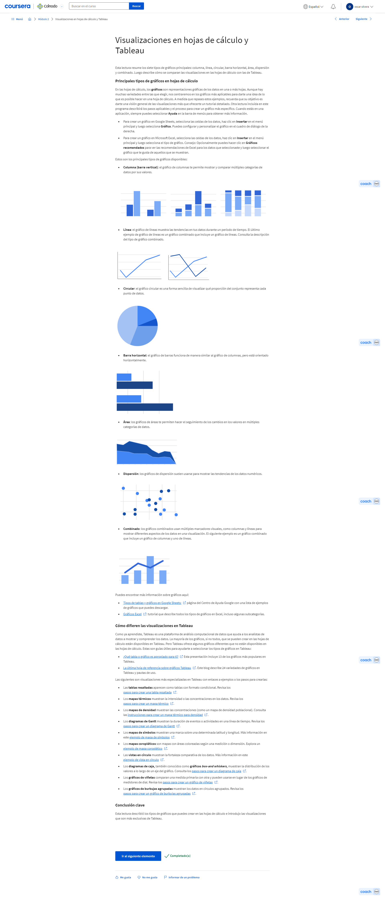

#### Crear una visualización de datos en Tableau

¡Hola y bienvenido nuevamente! En este vídeo, vamos a utilizar Tableau para crear una visualización de datos, una gran manera de compartir información con otras personas. Para comenzar, necesitas descargar el conjunto de datos que utilizaremos para esta actividad. Haz clic en el enlace para crear una copia del conjunto de datos y descargarlo. Si no tienes una cuenta de Google, descarga el conjunto de datos directamente desde el adjunto. A medida que avanzamos, puedes colocar el vídeo en un lado de la pantalla y seguirlo desde otra ventana. Es posible que notes que tu pantalla se ve levemente diferente de lo que ves aquí, Tableau puede haber actualizado la interfaz, pero los pasos deberían ser casi los mismos. Primero, inicia sesión en Tableau Public. Si no has creado una cuenta, consulta lo leído anteriormente acerca de cómo ingresar en Tableau Public.
Reproduce el video desde ::47 y sigue la transcripción0:47
Bien, ahora ve al círculo en la esquina superior derecha de la ventana y selecciona mi perfil. Desde aquí, selecciona Crear una visualización. Esto abrirá la interfaz de Tableau Public. Desde la ventana conectar con datos ve a la pestaña de archivos y carga el conjunto de datos de CO2 que descargamos antes.
Reproduce el video desde :1:10 y sigue la transcripción1:10
También puedes ir a la pestaña de datos en la parte superior de la interfaz de Tableau Public. Desde el menú desplegable, haz clic en nueva fuente de datos. Luego abre el conjunto de datos CO2.
Reproduce el video desde :1:24 y sigue la transcripción1:24
Luego de que se carguen los datos, la pantalla mostrará la interfaz de la fuente de datos. Debajo de conexiones, haz doble clic sobre los datos limpios de CO2 de la hoja para cargar los datos en la parte principal de la pantalla. También puedes arrastrar y soltar la hoja en el área donde dice arrastrar tablas aquí. Haz clic en actualizar ahora y podrás hacer una vista previa de los datos abiertos en la parte inferior de de la pantalla. Por defecto, Tableau solo mostrará las primeras 1000 filas en la tabla, pero puedes incrementar el número de filas en la configuración que se encuentra sobre la vista de los datos. Cada fila corresponde a un solo punto de datos y cada columna representa una característica diferente. Tableau interpreta el tipo de datos en cada columna. Cada ícono representa un tipo diferente de datos. Por ejemplo: un signo de número representa datos numéricos, mientras que un ícono abc representa datos en cadena. Un globo terráqueo representa datos geográficos y así. Tableau interpreta las primeras dos columnas como datos geográficos. La tercera columna es una cadena de datos y las tres últimas columnas son datos numéricos. Bien, creemos una base de datos que demuestre la cantidad de emisiones de CO2 provenientes de cada país.
Reproduce el video desde :2:37 y sigue la transcripción2:37
Para ello, haz clic en la pestaña hoja 1 en la parte inferior izquierda de la pantalla.
Reproduce el video desde :2:43 y sigue la transcripción2:43
En el extremo izquierdo de la pantalla hay un banner con los nombres de las columnas sobre una línea gris. En Tableau, estas se llaman las dimensiones de los datos.
Reproduce el video desde :2:53 y sigue la transcripción2:53
Debajo de esta línea están las diferentes medidas que puedes seguir para estas dimensiones. Ahora, crea un gráfico que muestre las emisiones de CO2 por país, vamos a comenzar haciendo doble clic sobre la dimensión del nombre del país.
Reproduce el video desde :3:8 y sigue la transcripción3:08
La pantalla principal presentará un mapa de los países del planeta con puntos que indican qué países están representados en los datos.
Reproduce el video desde :3:16 y sigue la transcripción3:16
Los puntos son del mismo tamaño porque no se han seleccionado medidas. Tableau por defecto pone a todos en escala con la misma medida.
Reproduce el video desde :3:25 y sigue la transcripción3:25
Si quieres dimensionar las emisiones de CO2 necesitarás incluir una medida específica. Haz doble clic, o arrastra y suelta en la hoja las medidas de kilo toneladas de CO2. Esto cambiará el tamaño de los puntos para que sean proporcionales a la cantidad de CO2 emitido.
Reproduce el video desde :3:44 y sigue la transcripción3:44
Tableau tiene una amplia selección de opciones para representar las medidas de una dimensión determinada. La mayoría de estas opciones están contenidas en la columna central entre la pantalla principal y las columnas con las dimensiones y medidas. Ahora, personalicemos el aspecto de nuestro gráfico para comunicar mejor las tendencias en los datos. Si arrastramos y soltamos una medida sobre una de las marcas, como ser el color, tamaño y etiqueta, podremos cambiar el aspecto de la visualización de las medidas en el gráfico. Por ejemplo, digamos que queremos cambiar el color de la medida de CO2. Arrastraríamos la medida de kilo toneladas de CO2 a la caja con la etiqueta de color. Luego podremos seleccionar esta caja para obtener una lista de opciones de colores. No te inhibas de pausar este vídeo y experimentar con las diferentes opciones. Sé creativo. Si alguna vez deseas revertir un cambio que hayas hecho a la hoja de Tableau, solo utiliza la flecha de retroceso. Listo. Acabas de crear tu primer gráfico con Tableau. ¿Pero qué pasaría si quisiéramos cambiar las dimensiones o medidas? En lugar de visualizar el CO2 por país, puede que queramos hacer un gráfico sobre el CO2 per cápita en la región. Para ello, podríamos hacer doble clic sobre la región de la dimensión y luego hacer lo mismo para la medida de CO2 per cápita. Esto creará un nuevo gráfico.
Reproduce el video desde :5:2 y sigue la transcripción5:02
Podemos editar el título colocando el cursor sobre la pequeña caja del título y haciendo clic sobre la flecha para desplegar el menú. Luego, elegiremos editar el título.
Reproduce el video desde :5:13 y sigue la transcripción5:13
Le daremos el nombre de Emisiones globales de CO2. O si queremos borrar un gráfico, seleccionaremos el botón de borrar hoja en la barra de herramientas. Esto borrará completamente el gráfico y te regresará a una hoja vacía. No te preocupes si lo haces por accidente o cambias de opinión. El botón reversa que mencionamos antes te llevará de vuelta al gráfico. Para borrar una hoja completamente, haz clic derecho en la pestaña de las hojas al final de la pantalla y selecciona borrar. No podremos borrar una hoja si es la única hoja en el archivo, pero ten cuidado. A diferencia de borrar una hoja, eliminar una hoja en forma definitiva no se puede deshacer.
Reproduce el video desde :5:52 y sigue la transcripción5:52
Asegúrate de guardar tu progreso haciendo clic en el ícono de guardado o pasando sobre la pestaña de archivo y eligiendo guardar.
Reproduce el video desde :6: y sigue la transcripción6:00
Si te piden crear un extracto, regresa a la pestaña de fuente de datos y haz clic sobre crear extracto, luego nuevamente clic en guardar. ¡Felicidades! Estás listo ya para comenzar a visualizar tus datos. Sin embargo, todavía estás lejos del final de la historia. Pronto exploraremos herramientas más avanzadas en Tableau.

#### Cuestionario práctico: Actividad práctica: Cómo trabajar con Tableau

<https://www.coursera.org/learn/visualize-data/supplement/HyqLQ/logging-into-tableau-public>

Data from <http://data.worldbank.org/indicator/EN.ATM.CO2E.PC> and <http://data.worldbank.org/indicator/EN.ATM.CO2E.KT> both last updated 02/05/2016

#### Opcional: Cómo usar Tableau Desktop

<https://help.tableau.com/current/guides/get-started-tutorial/en-us/get-started-tutorial-connect.htm>
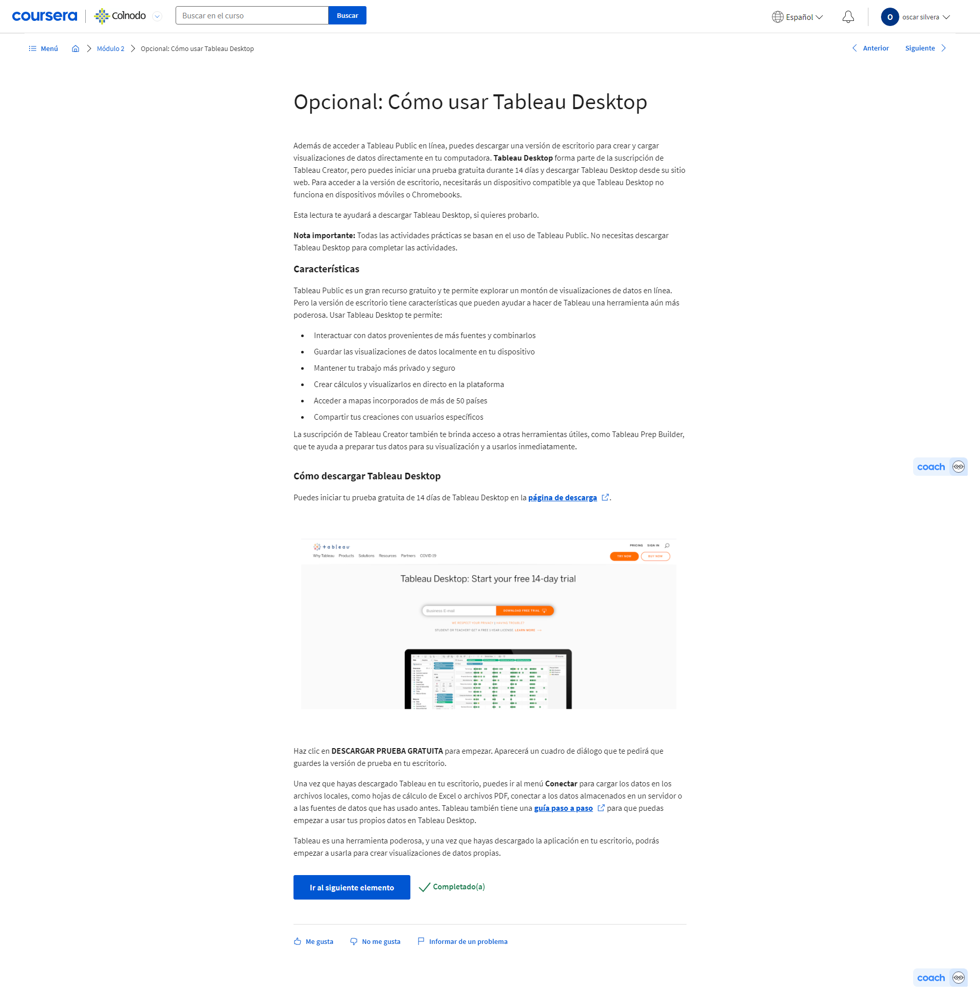
<https://www.tableau.com/products/trial>

#### Cuestionario práctico: Pon a prueba tus conocimientos sobre los primeros pasos en Tableau

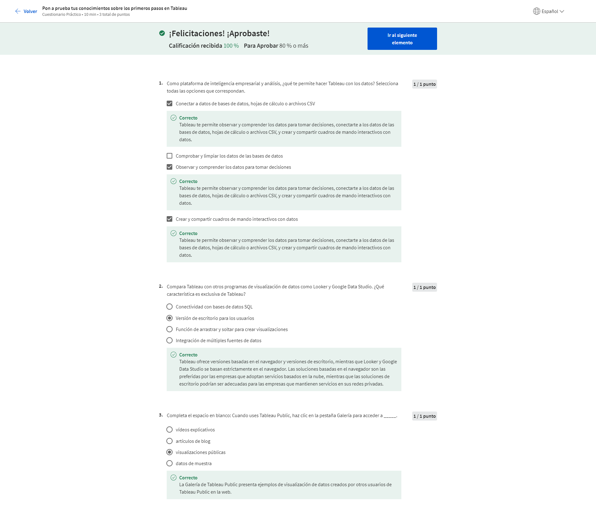

### Crear visualizaciones en Tableau

#### Lo bueno, lo malo y lo feo

Hola. En este vídeo profundizaremos sobre las visualizaciones de datos efectivas e inefectivas utilizando Tableau. Así es. Aunque esta plataforma puede ayudarte a crear algunas imágenes realmente bellas, todas esas características y funciones pueden derivar en algo que no es justamente demasiado útil. Quizá recuerdes la regla de los cinco segundos de la que hablamos anteriormente. Una señal de buena visualización de datos es que una vez que los muestras al público se debería entender lo que estás tratando de explicar en cinco segundos. Esto significa que está claro, es efectivo y, lo que es más importante, es convincente. Si recuerdas esta regla simple antes de comenzar con una visualización de Tableau, estarás en la senda correcta para crear buenas imágenes. Veamos este ejemplo de buen uso de una paleta de color divergente. Una paleta de color divergente muestra dos rangos de valores utilizando la intensidad del color para mostrar la magnitud del número y el color real para mostrar de qué rango provienen los números. Es una buena manera de mostrar la diferencia entre los números. Aquí el verde se relaciona con los números más altos y el rojo con los números más bajos. Puedes encontrar tablas como esta, ya que se relacionan con las métricas comerciales y los indicadores claves de rendimiento (KPI). Los colores que elijas deben encajar dentro del espectro de las expectativas del público. Si bien puede no ser siempre aplicable globalmente, muchas personas asocian el verde con algo positivo y el rojo con algo negativo. Esto hace que todo esté más claro y bonito. Aquí hay un ejemplo de visualización inefectiva de datos. Hay muchos elementos de esta visualización que no funcionan bien y los colores son difíciles de leer. Este gráfico utiliza verde y naranja y los puntos de datos están realmente muy juntos. Estos colores no muestran claramente la diferencia entre puntos de datos bajos y altos. La visualización de datos nos permite compartir historias significativas acerca de los datos, pero no podemos hacerlo si el público tiene dificultades para entender las visualizaciones de datos que estamos compartiendo. Utilizar pares de colores que no encajan con las expectativas del público puede agregar otra capa de complejidad innecesaria. Prepárate porque hay otra manera de empeorar una visualización de datos ya de por sí inefectiva. Si agregas muchas etiquetas, terminarás con una visualización de datos realmente difícil de procesar. Esto lleva a una visualización demasiado abarrotada. Consume mucho espacio y evita que las etiquetas se muestren claramente. Y todo esto es aún peor cuando se usan tipos de letras diferentes en las etiquetas. Aquí tenemos buenos datos que se arruinaron debido a las imágenes. Una visualización interactiva puede ser útil tanto para el público como para ti como analista. Pero como sucede comúnmente, cuanto mayor sea tu poder, mayor será tu responsabilidad. Perder de vista las cualidades de una buena visualización puede derivar en una pérdida de control sobre la historia que quieres contar con tus datos. Ahora, aprendiste a usar las mejores imágenes para tu provecho. Luego, veremos los modos en que puedes ser más creativo con ellas. Mantente atento.

#### Cuadro de aviso de la discusión: Visualizaciones engañosas

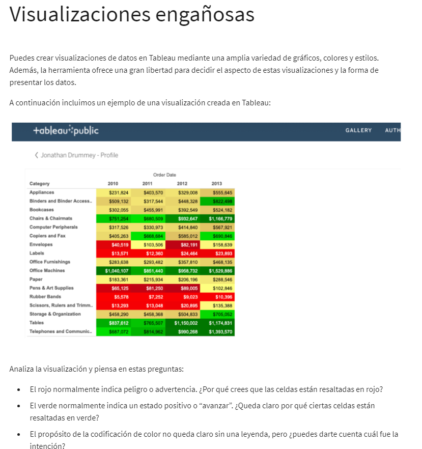

#### Guía complementaria: Conclusiones adicionales sobre la selección de la visualización de datos correcta

#### Cuestionario práctico: Autorreflexión: Selección de visualizaciones y gráficos

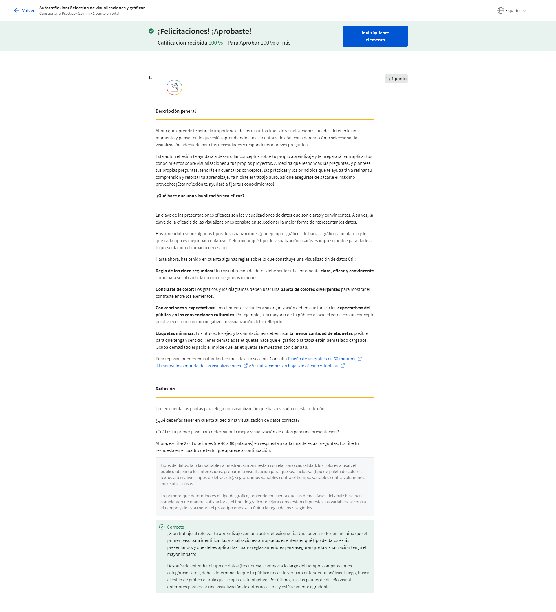

#### Ser creativo

Qué bueno volver a encontrarnos. Uno de mis aspectos preferidos de la visualización de datos es que permite ser muy creativo. Seguro recuerdas que anteriormente dije que la visualización de datos es la intersección entre el arte y el análisis computacional de datos, y realmente lo es. Estoy aquí para ayudarte a encontrar tu niño interior, crayón en mano, para convertir gráficos poco claros en gráficos efectivos para que tus imágenes sean más accesibles a las personas que tienen deficiencias en la percepción del color. Es momento de explorar cómo la creatividad te puede ayudar a sacar el mayor provecho de tus datos. Sumérgete ya ingresando en tu cuenta de Tableau y volveremos a nuestros Datos sobre felicidad mundial en la página de certificados de Google Career. Haz clic en el vínculo incluido en este vídeo para abrir la galería, ahora haz clic para ver el libro titulado: Solo los datos: Felicidad mundial. Utilizamos el mismo libro en el vídeo anterior acerca de cómo comenzar a utilizar Tableau. Haremos clic aquí para comenzar. Digamos que queremos utilizar estos datos en esta tabla para descubrir cuáles son los factores principales que determinan el puntaje de la felicidad de un país. Comenzaremos indagando en la relación entre los puntajes de felicidad y las otras medidas del país para ver qué podemos encontrar. Para comenzar, crea una nueva planilla de cálculo para formar tu propia base de datos desde cero y luego haz clic en hoja de cálculo y luego en nueva hoja de cálculo. Ya que los datos contienen valores de tres años, filtraremos los de 2016.
Reproduce el video desde :1:26 y sigue la transcripción1:26
Para ello, hay que añadir Año al estante Filtro y elegir 2016.
Reproduce el video desde :1:35 y sigue la transcripción1:35
Añade Puntuación de felicidad al estante Líneas.
Reproduce el video desde :1:45 y sigue la transcripción1:45
Luego, añade PBI de la economía per cápita al estante Columna.
Reproduce el video desde :1:54 y sigue la transcripción1:54
A continuación, arrastra y suelta País en la sección Detalles, esto crea un círculo o punto de datos separado para cada país.
Reproduce el video desde :2:5 y sigue la transcripción2:05
Seguramente notarás que donde el puntaje de la economía es mayor, el puntaje de la felicidad también lo es.
Reproduce el video desde :2:14 y sigue la transcripción2:14
Para que sea más sencillo ver esta tendencia, agregaremos una línea de tendencia.
Reproduce el video desde :2:21 y sigue la transcripción2:21
Ahora duplica esta hoja de modo que todo tu formato permanezca igual. En la hoja duplicada reemplaza PBI de la economía per cápita con otra medida, como puede ser Familia. Arrastra la tabla Familia al estante Columna para reemplazar Economía.
Reproduce el video desde :2:41 y sigue la transcripción2:41
Renombraremos a nuestra pestaña original Economía.
Reproduce el video desde :2:48 y sigue la transcripción2:48
Y a esta nueva pestaña Familia, de modo que podamos reconocer fácilmente qué muestran y encontrar lo que necesitamos. Trata de hacer esto con otras de las medidas. Ahora veremos qué aspecto tienen las visualizaciones múltiples en un solo panel, de modo que puedas ver más fácilmente la relación entre ellas. Arrastra tus visualizaciones, que ahora están en una lista en la columna de tablas de la izquierda de a una por vez para completar el panel. Pueden estar organizadas de diferentes modos, toma nota de cuáles son las líneas de tendencia con la inclinación más empinada. Son aquellas cuya relación es más fuerte: el puntaje de felicidad. Cada gráfico debería contar con un propósito sencillo de entender que rápidamente quede claro para tu público y eso es justamente lo que sucede. También puedes agregar una tabla auxiliar que muestre los mismos datos de una manera diferente en caso de que los miembros del público prefieran tablas. En mi experiencia, algunos interesados prefieren ver sus datos en hojas de cálculo. Hemos pasado mucho tiempo utilizando una fuente de datos, pero como analista seguramente deberás manejar más de un conjunto de datos a la vez.
Reproduce el video desde :3:52 y sigue la transcripción3:52
A continuación, tendrás la opción de aprender más acerca de la combinación de fuentes múltiples de datos en Tableau. Por ahora, esto es todo.

#### Pon a prueba tus conocimientos sobre creación de visualizaciones en Tableau

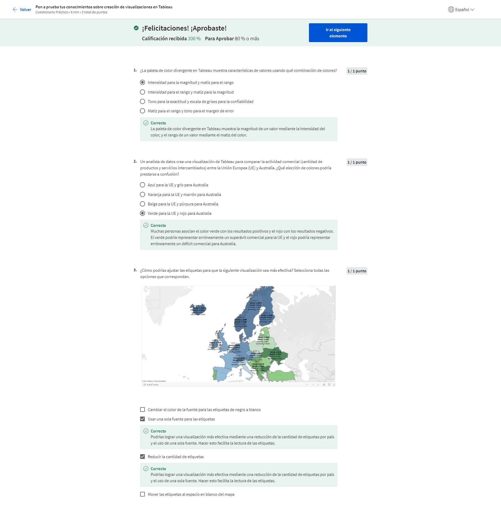

### Opcional: Trabajar con múltiples fuentes de datos

#### Vincular datos en Tableau

¡Hola y bienvenido nuevamente! En este vídeo, vamos a utilizar Tableau para unir múltiples conjuntos de datos. Esto permite que los analistas comparen todos los conjuntos de datos en la misma visualización, visualicen comparaciones y combinaciones de datos y compartan proyectos más complejos. Puedes colocar el vídeo en un lado de la pantalla y seguirlo desde otra ventana. Es posible que notes que tu pantalla se ve levemente diferente al vídeo. Está bien. Tableau actualiza su interfaz cada tanto, pero los pasos generales permanecerán intactos. No te inhibas de pausar este vídeo mientras trabajas en tu propio espacio de trabajo Tableau antes de continuar al próximo paso. Para comenzar, vamos a necesitar que descargues los cuatro conjuntos de datos que usaremos para esta actividad, que hagas clic en el enlace para crear una copia de los conjuntos de datos y descargarlos. Si no tienes una cuenta de Google, descarga los conjuntos de datos directamente desde los adjuntos. Ahora, imagina este escenario: estás trabajando como analista de datos para un instituto de investigación política para tu proyecto en curso. Necesitas crear una visualización que muestre las emisiones de CO2 per cápita para cada país de 2000 a 2011. También brindarás información acerca del PBI de la población de cada país y el uso de la energía. Bien, entonces, empecemos. Primero ingresa a Tableau Public. Si no has creado una cuenta, consulta lo leído anteriormente acerca de cómo ingresar en Tableau Public. Ve al círculo en la esquina superior de la ventana, luego selecciona Mi perfil. Desde aquí, selecciona Crear una visualización. Esto abrirá la interfaz de Tableau Public.
Reproduce el video desde :1:44 y sigue la transcripción1:44
Aparecerá la ventana Conectar con los datos. Desde aquí, puedes ir a las pestañas de los archivos y cargar el conjunto de datos de CO2. Ahora ve a la pestaña de Fuente de datos, luego a la columna Conexiones. Desde aquí, elige el símbolo del signo más para añadir otro conjunto de datos.
Reproduce el video desde :2:5 y sigue la transcripción2:05
Primero, añade energía, luego el total del PBI y población total. Ahora, deberías tener los cuatro conjuntos de datos cargados en Tableau. Puedes proceder a enlazarlos con cláusulas Join. Tableau ya añadió energía al área de conexiones múltiples. Lo podemos quitar arrastrándolo nuevamente hacia la columna Conexiones.
Reproduce el video desde :2:31 y sigue la transcripción2:31
Ahora podemos crear cláusulas Join. Como recordatorio: las cláusulas Inner y Outer Join son tipos de relaciones que se pueden utilizar para combinar datos basados en columnas comunes de información.
Reproduce el video desde :2:43 y sigue la transcripción2:43
Para establecer nuestra primera cláusula Join, seleccionaremos CO2 debajo de Conexiones. Más abajo, en la sección Hojas, haz clic y arrastra Datos limpios de CO2 a la sección Conexiones múltiples. Luego, haz clic en la caja creada por el conjunto de datos. Esto abrirá una tabla física y nos permitirá crear cláusulas Join. Para establecer la primera cláusula Join, elige el conjunto de datos Energía debajo de bajo Conexiones y arrastra la hoja Energía debajo de él hacia el lado derecho de la caja Datos limpios de CO2. Emergerá una ventana para realizar la instrucción Join. Automáticamente, se completará con Año desde Datos limpios de CO2 y con Año uno desde Energía. De lo contrario, deberás colocar Año en el lado izquierdo del gráfico y Año uno en la parte derecha.
Reproduce el video desde :3:33 y sigue la transcripción3:33
Luego, elegirás Añadir desde la cláusula Join debajo de bajo Año. Selecciona Nombre del país desde el menú desplegable sobre el lado izquierdo y País sobre el lado derecho. Después, utiliza la X para cerrar el menú desplegable. Debemos solucionar algo en nuestro conjunto de datos. Año y Año uno tienen un signo de número sobre ellos. Podemos hacer clic sobre los signos de esos números y seleccionar Fecha para cambiar el tipo de dato para cada columna.
Reproduce el video desde :4:3 y sigue la transcripción4:03
Ahora para utilizar la cláusula Join con otros conjuntos de datos, elige PBI total debajo de Conexiones. Luego, debajo de Hojas, arrastra la hoja de PBI total hacia el espacio en blanco debajo de la caja Energía.
Reproduce el video desde :4:18 y sigue la transcripción4:18
La ventana emergente debería estar ya completa con Año uno. Bajo Fuente de datos y Año, el PBI total; debajo de PBI total, antes de añadir una cláusula Join adicional, se deberá cambiar el tipo de dato para Año PBI total. Esto hará con el tipo de dato Fecha lo que hicimos con las otras columnas de Año.
Reproduce el video desde :4:41 y sigue la transcripción4:41
Ahora continúa estableciendo la cláusula Join. Elige el diagrama de Venn entre Energía y PBI total. Luego, añade la cláusula Join debajo de Año uno.
Reproduce el video desde :4:53 y sigue la transcripción4:53
Aparecerá un menú desplegable. Debajo de CO2 hasta Datos limpios, selecciona Nombre del país. Luego el campo vacío bajo PBI total a lo largo desde Nombre de país. Configura el lado derecho de la cláusula Join hasta País uno. Luego, cierra la ventana emergente de la cláusula Join.
Reproduce el video desde :5:11 y sigue la transcripción5:11
Repetiremos este proceso para la población total. El último conjunto de datos que descargamos. Cuando arrastramos la hoja para crear la cláusula Join, la ventana debería estar ya completa con Año debajo de Fuente de datos. Y Año Población total, debajo de Población total cambia Año Población total al tipo de dato Fecha para que coincida con las otras columnas Año. Luego selecciona el diagrama de Venn para editar la cláusula Join y haz clic en Añadir nueva cláusula Join debajo de Año. Debajo de Datos limpios de CO2, elige Nombre del país y luego, sobre el lado derecho de la fila, Población total del país. Cierra la ventana emergente.
Reproduce el video desde :5:52 y sigue la transcripción5:52
Si no lo has hecho aún, asegúrate de actualizar tus datos haciendo clic en el botón Actualizar ahora. Muy bien. Has combinado cuatro diferentes fuentes de datos. Revisa tu nuevo conjunto de datos. Mientras tu conjunto de datos de CO2 va de 1960 a 2011, tus otros conjuntos de datos van de 2000 a 2015. La intersección de años que tienen en común incluye solo de 2000 a 2011. Este período de tiempo es el que necesitamos. Sin embargo, todavía debemos realizar algunos cambios. Algunos tipos de datos deben ser convertidos. Es similar a cambiar las columnas Año y convertirlas en datos tipo Fecha. Necesitarás cambiar las columnas Uso de energía y PBI actuales. Sobre la columna Uso de energía hay un ícono que dice ABC. Esto significa que es un tipo de cadena. Selecciónalo para abrir un menú desplegable y cambiarlo a números decimales. El PBI actual también es de tipo cadena, pero precisa ser un número entero. Elige el ícono ABC para convertirlo en un número entero. Perfecto. Ahora podemos hacer nuestra visualización. Para comenzar, elige la pestaña Hoja uno. Notarás una columna sobre el lado izquierdo de la pantalla. Debajo de Datos limpios de CO2, arrastra Nombre del país al cuadrado Detalles, arrastra el CO2 per cápita al cuadrado Color, luego elige el cuadrado y edita los colores. Selecciona la paleta desplegable y cambia de automático a rojo, y verde divergente y selecciona las cajas de color escalonado. Y vuelves atrás porque el verde es generalmente visto como algo bueno cuando se trata de emisiones de CO2. Tú quieres que los colores se muevan hacia el rojo a medida que empeoran las emisiones, entonces haz clic en la opción avanzada del menú desplegable y luego en las cajas Inicio y Final. Coloca cero en la columna Inicio y 62 en la columna Final, luego cierra la ventana. Arrastra Año desde debajo de Datos limpios de CO2 al área de filtros. Elige Años, Siguiente, Todo y luego OK. En la caja de filtros, haz clic derecho sobre Año Año. Selecciona mostrar filtro. El filtro aparecerá en el lado derecho de la pantalla. Del extremo derecho de la pantalla, elige la flecha a la derecha de Año y elige un solo valor. Ahora las áreas se colorearán solo para los valores de cada año. Selecciona cualquier año entre el 2000 y el 2011 para ver las emisiones CO2 del año.
Reproduce el video desde :8:40 y sigue la transcripción8:40
Asegúrate de guardar tu progreso haciendo clic en el ícono de guardado o pasando sobre la pestaña Archivo y eligiendo Guardar. Si te piden crear un extracto, regresa a la pestaña Fuente de datos y haz clic sobre Crear extracto, luego nuevamente clic en Guardar.
Reproduce el video desde :8:58 y sigue la transcripción8:58
Felicidades, ya has enlazado tus datos y realizado una visualización integral de datos en Tableau. Cuántas más visualizaciones hagas, mayor será la posibilidad de compartir análisis e informaciones complejas.

#### Actividad práctica: Practica vincular datos en Tableau

#### Recursos de Tableau para combinar múltiples fuentes de datos

Recursos de Tableau para combinar múltiples fuentes de datos
Ahora que ya tienes algo de experiencia con datos en Tableau, estás preparado para empezar a hacer algo más, incluso combinar múltiples fuentes de datos. Esta lectura te proporcionará ciertas guías explicativas para hacer eso, y otros recursos útiles que puedes usar para practicar usando Tableau por tu cuenta.

<https://help.tableau.com/current/pro/desktop/en-us/datasource_prepare.htm>

Esta página se vincula a otros recursos que explican cómo configurar tus fuentes de datos y prepararlas para el análisis una vez que las has conectado a tu cuenta Tableau. Incluye específicamente artículos que explican cómo unir o combinar datos y qué es una unión y cómo funciona. Es un buen punto de partida para empezar a utilizar y combinar fuentes de datos.

<https://help.tableau.com/current/pro/desktop/en-us/joining_tables.htm>

Unir se refiere al proceso de combinar fuentes de datos según campos en común. Este artículo brinda una explicación más detallada de las diferentes uniones, cómo usarlas en Tableau, y un ejemplo de unión con una guía paso a paso.

<https://help.tableau.com/v2020.2/pro/desktop/en-us/datasource_dont_be_scared.htm>

Las relaciones te permiten combinar múltiples fuentes de datos en Tableau. Esta es una alternativa más flexible que las instrucciones Join, y no te obliga a crear una tabla única con tus múltiples fuentes de datos. Este artículo te permitirá conocer mejor cómo funcionan las relaciones.

<https://help.tableau.com/current/online/en-us/datasource_relationships_learnmorepage.htm>

Este artículo profundiza en las diferencias entre el uso de las relaciones y las instrucciones Join, y te guía a través del proceso de uso de las relaciones para combinar datos.

<https://help.tableau.com/current/pro/desktop/en-us/multiple_connections.htm>

La combinación de datos es otro método que puedes usar para combinar múltiples fuentes de datos. En lugar de combinar realmente los datos, las combinaciones permiten consultar y agregar datos de múltiples fuentes. Este recurso profundiza en la combinación e incluye un tutorial.

<https://kb.tableau.com/articles/howto/combining-start-and-end-dates-into-a-single-axis>

Este recurso te proporciona ejemplos que explican cómo combinar campos de fechas cuando se usan diferentes métodos de combinación de datos en Tableau.

<https://community.tableau.com/s/>

### Desafío semanal 2

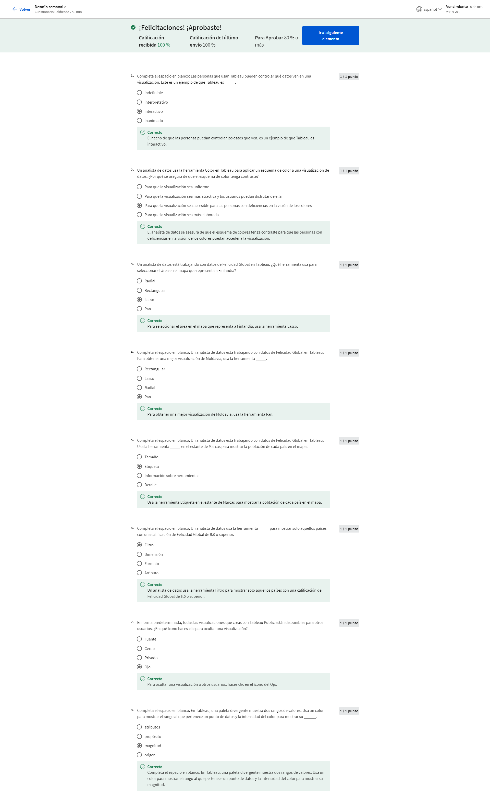

## Cómo crear historias de datos

### Utilizar los datos para desarrollar historias

#### Contar historias con datos

#### Dar vida a las ideas

#### Historias de datos eficaces

#### Hablarle a tu público

#### Carolyn: Periodismo de datos

#### Registro de aprendizaje: Contar una historia con datos

### Cuestionario práctico: Pon a prueba tus conocimientos sobre historias basadas en datos

### Uso de los paneles de Tableau

#### Fundamentos de los paneles de Tableau

#### Paneles e información estática

#### De los filtros a los gráficos

#### Cuestionario práctico: Actividad práctica: Crear, filtrar y personalizar gráficos

#### Cuadro de aviso de la discusión: Identificar cuándo se debe configurar un panel

#### Crea tu primer panel en Tableau

#### Cuestionario práctico: Actividad práctica: Construir un panel en Tableau

#### Cuestionario práctico: Pon a prueba tus conocimientos sobre cómo utilizar los paneles

### Compartir historias de datos

#### Consejos para una presentación convincente

#### Compartir una narrativa

#### Cuestionario práctico: Actividad práctica: Practicar la presentación

#### Sundas: Cómo gestionar el síndrome del impostor

#### Cuestionario práctico: Pon a prueba tus conocimientos sobre la comunicación de historias de datos

### Desafío semanal 3

#### Cuestionario: Desafío semanal 3

## Crear presentaciones y diapositivas
