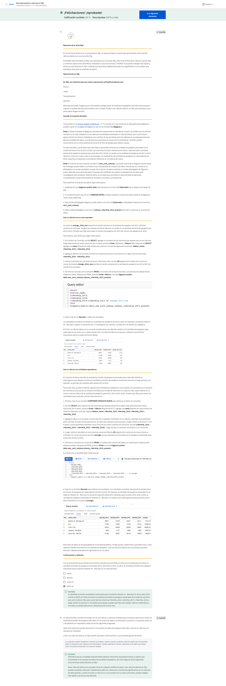
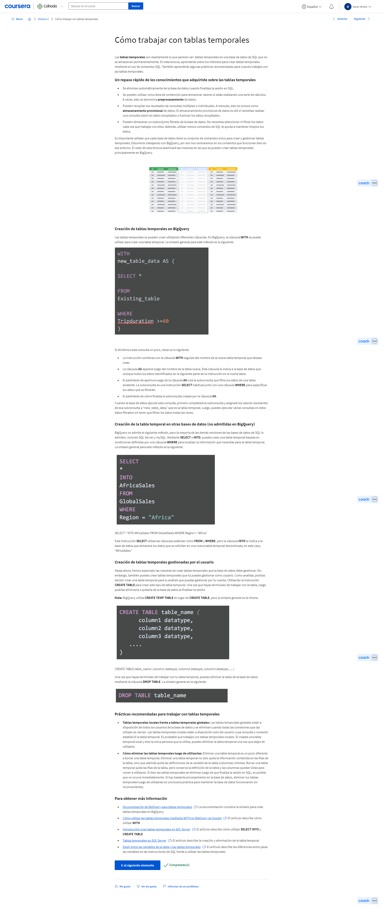

# Analizar datos para responder preguntas

## Organizar los datos para iniciar el análisis

### Organicémonos

#### Introducción para organizarse

¡Hola, futuro analista de datos! Has hecho un gran avance hasta el momento. No es un recorrido fácil, pero lo estás haciendo muy bien. Antes de empezar este programa, algo dentro tuyo te convenció para que obtuvieras tu certificado de análisis computacional de datos de Google. Tenías una idea, hiciste algunas averiguaciones y reservaste tiempo para empezar. Después tomaste la decisión de comprometerte con tu objetivo. ¡Mira ahora donde has llegado! Puedes sentirte orgulloso. Desde el principio, nos sumergimos de lleno en el mundo del análisis computacional de datos y vimos el rol que desempeñan los datos en nuestra vida cotidiana. Aprendiste a navegar por las hojas de cálculo y por qué el pensamiento estructurado era la clave para resolver problemas. También exploraste las mejores formas de recopilar y almacenar tus datos. A partir de allí, fuiste adquiriendo una comprensión de la limpieza y la integridad de los datos. Identificaste cómo formular las preguntas correctas y aprendiste a limpiar los datos. Ahora llevaremos tus destrezas al siguiente nivel. A continuación, aprenderás a encontrar respuestas claras y objetivas a cualquier cuestión de datos que enfrentes. Anteriormente, aprendimos sobre el proceso de análisis de datos. A modo de recordatorio, las fases de ese proceso son: preguntar, preparar, procesar, analizar, compartir y actuar. Aquí exploraremos más en detalle la fase de analizar, te concentrarás en cómo organizar y formatear los datos que tienes para que puedas hacer todo tipo de ordenaciones y cálculos. Saber cómo analizar los datos que has recopilado y limpiado es esencial para tu trabajo como analista. Antes de empezar, quiero presentarme. Mi nombre es Ayanna, y estoy encantada de ser tu instructora en este curso. Soy gerente de información global en Google, y también he enseñado en Google Analytics Academy, que es un recurso de capacitación para analistas de Google. Mi tarea es ayudar a los anunciantes a determinar el valor de invertir en los productos Google. Cuando buscas algo en línea, a menudo verás un aviso en la página. Esa es una inversión que hizo un anunciante. Uso el análisis de datos para mostrarles a los anunciantes el valor que podrían obtener por invertir en esos avisos. Eso es lo que me encanta de ser analista de datos: averiguar cómo crear valor cada vez que encaro una situación. La mejor manera de saber si estás creando valor es tener evidencia. Para mí, esa evidencia son los datos. Ahora que ya sabes sobre mi amor por los datos, hablemos un poco sobre lo que aprenderás aquí. Empezarás por conocer las prácticas recomendadas para organizar tus datos y las diferentes formas de ordenar los datos usando hojas de cálculo y SQL. También dedicaremos tiempo a aprender tres formas importantes de trabajar con datos que potenciarán tus destrezas analíticas. Luego, hablaremos sobre el ahorro de tiempo. Descubrirás consejos y trucos que ayudan a analizar los datos de manera más eficiente. Por último, pero no menos importante, trabajaremos juntos para identificar técnicas que te ayuden a ser lo más justo e imparcial posible. Bueno, eso es todo lo que necesitas saber por ahora. A continuación, desglosaremos los conceptos básicos del análisis de datos y te acercaremos un paso más al futuro de los datos.

#### Registro de aprendizaje: Procesa y organiza tus datos

### Conceptos básicos del análisis de datos

#### El proceso de análisis

Bienvenido de nuevo. Es bueno volver a verte. Hablemos de análisis. Aprendimos cómo hacer las preguntas correctas, preparar datos para la exploración, y luego procesar esos datos para asegurarnos de que estén super limpios. Llegó el momento de ir al corazón del proceso: ¡el análisis real! Era hora, ¿verdad? Pero ¿qué es el análisis? Básicamente, el análisis es el proceso que se usa para dar sentido a los datos recopilados. Significa adoptar los pasos correctos para avanzar y pensar en tus datos de diferentes maneras. El objetivo del análisis es identificar tendencias y relaciones entre los datos para que puedas responder con precisión la pregunta que te haces. Para hacer esto, debes cumplir las cuatro fases del análisis: organizar los datos, formatear y ajustar los datos, obtener comentarios de los demás, y transformar los datos observando las relaciones entre los puntos de datos y hacer cálculos. Apliquemos las cuatro fases del análisis a un escenario del mundo real. Imagínate que quieres comprar un regalo para la boda de tu amiga Zara. El problema es que no estás seguro de qué regalarle. Afortunadamente, hay toneladas de datos en el sitio web de la boda. Pero en lugar de leer todos los datos del sitio web y recorrer el álbum de fotos de ella o de su pareja, vas directo al registro en línea, una lista de regalos que les gustaría recibir. El registro es como un conjunto de datos que puedes analizar para tomar una decisión. Ya revisaste los datos organizados en el registro, quieres asegurarte de que la lista de datos, o los regalos, en este caso, esté formateada de una manera que sea fácil de consultar. Formatear los datos optimiza las cosas y ahorra tiempo. Revisar cientos de regalos puede llevar mucho tiempo. En cambio, puedes ajustar los datos de manera que sean fáciles de digerir mediante el filtrado y la ordenación de tus datos. Tienes un presupuesto al que te debes ajustar, así que ordenas los precios de los regalos de menor a mayor. Luego filtras los precios para incluir regalos que estén dentro de tu presupuesto de $60. Estás trabajando con una lista de datos recién formateados. A esta altura, conviene recordar que la opinión de otras personas también puede ser realmente útil cuando se analiza información y se toman decisiones. Puedes chequear la lista de regalos para averiguar si alguien más compró alguno de los artículos. Descubres que algunos artículos de la lista ya han sido comprados, y esto informa tu decisión. Cuando analices datos, es importante conocer la opinión de los demás porque esto nos aporta un punto de vista que quizás no entiendas o al que no tengas acceso. Además de obtener la opinión de otras personas, también es importante conocer los puntos de vista de los demás desde el principio. Así, si ellos predicen obstáculos o desafíos, lo sabrás de antemano. Las personas a las que recurrirás para obtener su opinión no necesariamente tienen que ser expertos para ser de utilidad. A veces, todo lo que necesitas es alguien que esté familiarizado con el tema o con los datos que estás considerando. En nuestro ejemplo, serían los invitados a la boda de Zara que compran regalos en el mismo registro en línea. Quizás no sean expertos en regalos de boda, pero su colaboración al marcar los artículos que compran, puede ayudarte a averiguar qué no comprar, lo cual le evitará a Zara recibir dos veces el mismo regalo. En definitiva, obtener esa opinión es valioso para tu análisis. Esto nos lleva al próximo paso del análisis: la transformación de los datos. Transformar datos significa identificar relaciones y patrones entre los datos, y hacer cálculos en base a los datos que tienes. Regresemos a nuestro ejemplo. Pudiste encontrar un regalo que sabías que a Zara le gustaría, y uno que coincidiera con tu presupuesto. También pudiste elegir un regalo que ya no lo hubiera comprado otra persona. Encontrar la relación entre estos puntos de datos, te permitió elegir, comprar y enviar un regalo que responda al problema que querías resolver. El atractivo del proceso de análisis es que probablemente ya analices situaciones en tu vida cotidiana. Ya sea que analices datos en tu vida personal o profesional, estas cuatro tareas pueden ayudarte a tomar mejores decisiones. Cuanto más lo apliques, más cómodo te sentirás con el proceso. Espero que esto te permita comprender mejor los conceptos básicos del análisis. A medida que avancemos, analizaremos cómo ubicar datos para realizar el análisis, tanto en hojas de cálculo, como con SQL. Cuando estés listo, puedes avanzar. ¡Hasta pronto!

#### Ayanna: Comprometerte a eso

[MÚSICA] Creo que una de las cosas más fascinantes de trabajar con datos en Google es que tenemos uno de los conjuntos de datos más valiosos del mundo. La gente considera a los datos de Google como una ventana a la curiosidad humana. Vemos a Google como un verdadero representante de lo que ocurre en el mundo. Por eso, la mayoría de nuestros auspiciantes valoran muchísimo los datos y las conclusiones que podemos darles en Google porque creen que Google representa o refleja lo que ocurre en su empresa o en su sector económico. Y por eso creo que el valor de los datos con los que podemos trabajar en Google mantiene mi interés y entusiasmo en el trabajo que hago. Llegué a Google hace tres años, después de dedicarme algunos años a la consultoría. Me interesaba mucho cambiar a un rol que se focalizara en ventas y marketing. Pero al mismo tiempo, quería seguir aprovechando las destrezas analíticas que había adquirido antes. Este puesto fue un complemento ideal para el conjunto de destrezas que ya tenía y mi interés en pasar a la función de ventas y marketing. Creo que es importante que todos los alumnos se den cuenta de que nadie aprende este material de la noche a la mañana. Es muy probable que muchos de tus colegas a los que consideras expertos hayan adquirido ese nivel de experiencia a lo largo de años en el área. Creo que uno de los atributos más grandes que los alumnos deberían tener presente es que lo más importante a lo largo de este proceso de aprendizaje es tener determinación. Determinación para entender que puede ser una lucha, un desafío, pero si le dedicas trabajo y tiempo, estos conceptos terminarán fluyendo con facilidad, y estarás bien encaminado para convertirte en analista de datos. Hola, mi nombre es Ayanna y soy gerente de información global aquí en Google.

#### Cuestionario práctico: Pon a prueba tus conocimientos sobre la comprensión del análisis de datos

### Organizar los datos para el análisis

#### Siempre es necesario organizar

Hola de nuevo. Retomemos el tema. En este preciso momento estamos en la fase Analizar del proceso de análisis de datos. Y aunque cada fase es única, los analistas de datos toman decisiones sobre la organización en todas las fases.
Reproduce el video desde ::15 y sigue la transcripción0:15
De eso hablaremos aquí: la organización. Es super importante que mantengas tus datos organizados en todo tu análisis. La forma en que estén clasificados y estructurados tus datos afectará tus hallazgos, ya sea que trabajes en una hoja de cálculo o en una base de datos. Y una vez que sabes cómo están organizados tus datos, podrás capturar o recopilar la información que necesitas. La mayor parte de los datos que usarás en tu análisis se organizará en tablas. Las tablas te ayudan a organizar clases de datos similares por categorías y áreas temáticas de tu interés cuando analizas. Por ejemplo, esta base de datos básica tiene tablas para concesionarias de autos, detalles de los productos y de los repuestos. Cada tabla tiene entonces varios campos de datos, como el propietario de la sucursal y el costo de los repuestos. Puedes usar estas tablas y campos para que te ayuden a decidir cómo avanzar con tu análisis. La estructura de esta base de datos puede ayudarte a decidir qué datos necesitas obtener para cumplir tus objetivos. Por ejemplo, el número total de ventas de autos de una marca en particular, o un repuesto para un determinado modelo de auto en cierta sucursal.
Reproduce el video desde :1:24 y sigue la transcripción1:24
Las tablas te permiten tomar decisiones sobre los tipos de datos. Te ayudan a averiguar qué variables necesitas y los tipos de datos que deberían tener esas variables. Así que si tienes una base de datos en la cual necesitas convertir un tipo de datos durante tu análisis, puedes hacer eso con el comando CAST en SQL o cualquier otro método que aprendas en tu trabajo o a partir de tu propia investigación. Como en este ejemplo, en donde convertimos la columna de precio de compra para que sea FLOAT en lugar de STRING y nos ofrezca un formato numérico que podamos usar para los cálculos. Si realizas tu análisis en una hoja de cálculo, quieres asegurarte de que las columnas y las filas se organicen correctamente. Incluso puedes ocultar columnas que no necesitas para el análisis o que muestran información duplicada. Una vez que hayas organizado y formateado los datos, estarás listo para ordenarlos y filtrarlos para encontrar los datos que necesitas. Pronto nos abocaremos a la ordenación y el filtrado. Por ahora, solo debes saber que ambos, los filtros y las ordenaciones, varían según el tipo de datos con los que trabajamos. La conclusión es que es importante tener tus datos en el formato correcto. Así que siempre hay que estar preparado para ajustar, no importa cuánto hayamos avanzado en el análisis. Eso es todo por ahora. Próximamente te mostraremos en qué consisten los filtros. ¡Adiós!

#### Mantener los datos organizados con ordenación y filtros

#### Opcional: Cargar el conjunto de datos de películas en BigQuery

#### Más sobre ordenación y filtrado

Hola, ¡qué bueno volver a verte! Anteriormente comentamos por qué debes organizar tus datos, sin importar en qué parte de su ciclo de vida estén. Como cualquier colección, es más fácil gestionar y cuidar un grupo de cosas cuando hay una estructura que las contiene.
Reproduce el video desde ::15 y sigue la transcripción0:15
Ahora deberíamos tener en cuenta que la organización no es tan solo hacer que las cosas se vean ordenadas. También implica facilitar la búsqueda y ubicar los datos que necesitas de manera rápida y fácil. Como analista de datos, te tocará reorganizar y depurar las bases de datos muy a menudo. Dos de las maneras más comunes de hacer esto es con la ordenación y el filtrado. Ya hemos hablado brevemente de la ordenación y el filtrado, y es importante que sepas exactamente qué es cada uno. Ordenación es cuando organizas los datos en un orden significativo para que sea más fácil entenderlos, analizarlos y visualizarlos. La ordenación clasifica los datos según una métrica específica que tú seleccionas. Puedes ordenar datos en hojas de cálculo y en bases de datos que usen SQL. En breve nos abocaremos a todas las funciones geniales que puedes usar en ambos casos. Una forma común de ordenar los elementos cuando compras en un sitio web es por el precio más bajo al más alto, pero también puedes ordenar por orden alfabético, como los libros en una biblioteca, o de lo más reciente a lo más antiguo, como el orden de los mensajes de texto en un teléfono. O del más cercano al más lejano, como cuando buscas restaurantes en línea. Otra forma de organizar la información es con un filtro. Filtrar es mostrar solo los datos que cumplen con un criterio específico, mientras se oculta el resto. En general, puedes usar filtros cuando quieras acotar la cantidad de datos que deseas depurar. Por ejemplo, estás buscando zapatillas verdes en línea. Para ahorrar tiempo, filtras solo por zapatillas verdes. Usar un filtro reduce los conjuntos de datos más grandes a subconjuntos más pequeños que son relevantes para lo que tú necesitas. Ordenar y filtrar son dos acciones que probablemente realices mucho en línea. Ya sea que ordenes los horarios de una película desde el primero al último, o filtres los resultados de tu búsqueda solo por imágenes, es probable que ya estés familiarizado con lo útil que puede ser para darles sentido a los datos. Bien, aprovechemos ese conocimiento y apliquémoslo. Cuando se trata de depurar grandes pilas de datos desorganizados, los filtros te serán útiles. Tal vez recuerdes de un vídeo anterior que puedes usar filtros y programas de hojas de cálculo, como Excel y Sheets, para mostrar solo los datos de las filas que coincidan con el rango o la condición que hayas establecido. También puedes filtrar datos en SQL usando la cláusula WHERE. La cláusula WHERE funciona de manera similar al filtrado en una hoja de cálculo porque muestra filas según una condición que tú indiques. Aprendamos cómo puedes usar la cláusula WHERE en una base de datos. Usaremos BigQuery para acceder a la base de datos y ejecutar nuestra consulta. Si te unes a nosotros, abre tu herramienta preferida para usar SQL y consulta el recurso anterior sobre cómo acceder al conjunto de datos. De lo contrario, observa cómo la cláusula WHERE hace lo suyo. Aquí está la base de datos.
Reproduce el video desde :3:5 y sigue la transcripción3:05
Es probable que la reconozcas de vídeos anteriores. Básicamente, es una larga lista de películas. Cada fila incluye una entrada para las columnas denominadas: Movie_Title, Release_Date, Genre, Director, Cast_Members, Budget y Total_Revenue. También incluye un enlace a la página de Wikipedia de las películas. Si te desplazas por la lista, verás que continúa durante mucho tiempo. Por supuesto, no necesitamos recorrerla toda para encontrar los datos que necesitamos. ¡Eso es lo maravilloso del filtro! En este caso, usaremos la cláusula WHERE para filtrar la base de datos y reducir la lista de las películas al género comedia. Para empezar, usaremos el comando SELECT seguido por un asterisco. En SQL, el asterisco selecciona todos los datos. En una línea nueva, escribiremos FROM y el nombre de la base de datos: movie_data.movies. Para filtrar las películas por comedia, vamos a escribir WHERE, luego enumeraremos la condición, que es Género.
Reproduce el video desde :4:5 y sigue la transcripción4:05
Género es una columna en el conjunto de datos, y solo queremos seleccionar las filas en donde la columna Género coincide exactamente con "Comedia". Luego escribiremos el signo igual y el género específico que vamos a filtrar, que es "comedia". Como los datos de la columna Género están en formato de cadena, tenemos que usar comillas simples o inglesas cuando lo escribimos. Y recordemos que el uso de mayúsculas importa aquí, por eso verifiquemos que el uso de mayúsculas y minúsculas coincida exactamente con el nombre de la columna. Y ahora podemos hacer clic en Ejecutar para observar los resultados. Nos queda una lista más pequeña de películas de comedia. Suena genial, ¿verdad? Esto es algo más que debes saber. Puedes aplicar múltiples filtros a una base de datos. Incluso puedes ordenar y filtrar datos al mismo tiempo para obtener resultados aún más precisos. Saber cómo ordenar y filtrar datos te convertirá en un excelente analista de datos. Eso es todo por ahora. Próximamente, conoceremos los detalles de las funciones de ordenación en hojas de cálculo. Nos vemos ahí.

#### Cuestionario práctico: Pon a prueba tus conocimientos sobre la organización de datos

### Ordenar datos en hojas de cálculo

#### Ordenación de conjuntos de datos

¡Hola, profesional de los datos! Qué alegría volver a verte, y preparado para conocer más sobre el aspecto organizacional del análisis de datos. En este vídeo, aprenderemos cómo ordenar datos en hojas de cálculo. Ya vimos algo de ordenación en hojas de cálculo, anteriormente en el programa. Llegó el momento de aprovechar lo que hemos visto e introducir algunas técnicas de ordenación más avanzadas. La ordenación es maravillosa. No solo aporta orden y significado a tus hojas de cálculo, sino que también te empodera para recrear los datos por completo. Cuando ordenas los datos según una métrica específica, puedes descubrir nuevos patrones y relaciones entre los conjuntos de datos que de otra forma no hubieras percibido. Esto aplica especialmente a las hojas de cálculo, que usarás un montón en tu trabajo como analista de datos. Saber cómo ordenar datos en hojas de cálculo puede convertirte en un analista más fuerte y seguro. En muchos casos, ordenar depende de tu creatividad para reformular la información que tienes frente a ti. En las hojas de cálculo, puedes ordenar datos en orden ascendente o descendente mediante número o letras. Si las celdas están etiquetadas con color, puedes ordenarlas también por color. Cuando ordenes datos en una hoja de cálculo, puedes elegir "Ordenar hoja" u "Ordenar rango". Si usas "Ordenar hoja", todos los datos de la hoja de cálculo se ordenarán por las condiciones de una única columna, pero la información relacionada en otras filas, permanece junta. En cambio, "Ordenar rango" no mantiene junta la información de las distintas filas. Cuando ordenas un rango, seleccionas un conjunto específico de celdas o el rango al que quieres que se limite la ordenación. No se reorganizará ningún otro dato de las hojas de cálculo, solo las celdas especificadas. Hay dos métodos para ordenar datos en hojas de cálculo: uno involucra el uso del menú; el otro implica escribir la función de ordenar. Por ahora, nos concentraremos en la ordenación con el menú. Nos abocaremos a escribir funciones, más adelante. Ahora bien, según el programa que uses, podría variar levemente el proceso, pero las instrucciones y los conceptos que analizamos serán básicamente los mismos. Volvamos a la ordenación con el menú de datos. Para darte una idea de cómo hacerlo, usaremos la hoja de cálculo de las películas. Vamos a comprobarlo. En este ejemplo, ordenaremos las películas por la fecha de estreno. Nos dirigiremos a la columna B, que aparece con el nombre "Fecha de estreno". Haz clic en el botón "B" para resaltar todas las celdas de la columna. A partir de ahí, nos dirigiremos a la pestaña Datos del menú. Ahora tienes dos opciones: ordenar una hoja o un rango de datos. Notarás que hemos seleccionado solo las fechas de estreno, pero estas fechas de estreno se relacionan específicamente con las películas de su fila.
Reproduce el video desde :2:46 y sigue la transcripción2:46
En este caso, quieres que la fecha de estreno y el título de las películas permanezcan en la misma fila, cuando ordenes, porque esos datos están relacionados. Para hacer esto, querrás "Ordenar hoja". Esto mantendrá todos los datos juntos por fila, sin importar cómo los ordenes. Según el orden que desees que tengan las fechas, puedes ordenar de la A a la Z, lo cual también clasificará las fechas en forma numérica. O puedes ordenar de la Z a la A, que ordenará los datos en sentido contrario. Como queremos que las fechas de estreno estén en orden, haremos clic en "Ordenar hoja por columna B" de la A a la Z. Y allá vamos. Acabas de ordenar una hoja de datos desde el menú. Ahora las películas están distribuidas por orden cronológico según la fecha de estreno. Supongamos que quieres ordenar los datos en una columna específica, pero no necesitas que las celdas de esa columna se vinculen con una fila de información específica. En realidad, quieres separar los datos de la columna y ordenarlos en forma independiente sin que afecte la organización del resto de la hoja. Para divertirnos, usaremos la columna "Título de la película" de este ejemplo. Primero, seleccionaremos la columna que queremos ordenar: columna A. Hacer clic en la columna A, ilumina todas las celdas de la columna que contiene los títulos de las películas. Luego iremos al menú y haremos clic en Datos porque estamos separando la columna del resto de la hoja. Esta vez, cuando ordenemos, haremos clic en "Ordenar rango por columna A". Para este ejemplo, ordenaremos los títulos de las películas alfabéticamente de la A a la Z. ¡Y listo! Verás que "Ordenar rango" no mantiene las filas unidas, así que los datos quedan un poco mezclados. Es muy probable que termines usando "Ordenar hoja" más a menudo, pero es importante entender ambas opciones para que no las confundas accidentalmente. Acabas de ordenar los datos en una hoja de cálculo usando el menú, y has aprendido cómo ordenar datos en toda una hoja o en un rango de celdas. Podrás llevar este conocimiento contigo dondequiera que te desempeñes como analista de datos. Próximamente, aprenderemos la segunda forma de ordenar en una hoja de cálculo: escribir una función. También llevaremos la ordenación a un próximo nivel al ordenar tus datos de manera personalizada. Nos vemos ahí.

#### La función SORT

Felices de tenerte de vuelta. Anteriormente en el programa, vimos algunos conceptos básicos de la ordenación en hojas de cálculo. Aprendimos las diferencias entre ordenar un rango y una hoja entera, y cómo ordenar una hoja de cálculo usando el menú. Ya sentamos las bases, es hora de pasar a formas más avanzadas de ordenar la información. Hablamos sobre los dos métodos que existen para ordenar los datos en las hojas de cálculo. El primer método usa la pestaña Datos del menú de tu programa de hoja de cálculos. El segundo método para almacenar información en una hoja de cálculo es escribir la función SORT. En las hojas de cálculo, las funciones son comandos preestablecidos que realizan un proceso específico. Así que en este caso, la función SORT, como te imaginarás, ordena tus datos.
Reproduce el video desde ::43 y sigue la transcripción0:43
Echemos un vistazo a esta hoja de cálculo de planes de ventas por demostración para ver a la función SORT en acción. Es bueno recordar que cuando usas la función SORT, en realidad estás cambiando el conjunto de datos existente, a diferencia de la pestaña Datos del menú que reorganiza los datos en el conjunto de datos original. El primer conjunto de datos organizado es nuestro conjunto de datos original de invitados y cierta información sobre ellos. Así que supongamos que quieres ordenar a los invitados de esta reunión de ventas por mesa para tener una idea de quién se sentará en cada lugar. Para hacer esto, empieza por escribir una función en una celda vacía. Como con cualquier función, haces esto escribiendo el signo igual, y luego escribes SORT después del signo.
Reproduce el video desde :1:28 y sigue la transcripción1:28
Después del primer paréntesis de apertura, indica la primera celda en la cual se recogen los datos. En este caso, es A2.
Reproduce el video desde :1:41 y sigue la transcripción1:41
Luego incluirás dos puntos y escribirás la última celda que quieres que se incluya en la función, que es la D6.
Reproduce el video desde :1:54 y sigue la transcripción1:54
A2 dos puntos D6 es el rango para esta función. Después, escribe una coma para separar el rango de lo que estás ordenando, que es la columna B.
Reproduce el video desde :2:10 y sigue la transcripción2:10
Debes tener presente que esta parte de la función no reconoce letras de columna. Así que en este caso, usaremos el número correspondiente, que es el 2, ya que la columna B es la segunda columna de nuestro rango.
Reproduce el video desde :2:28 y sigue la transcripción2:28
Ahora agrega otra coma.
Reproduce el video desde :2:32 y sigue la transcripción2:32
En esta próxima parte deberás decidir si quieres que los datos de esta columna aparezcan en orden ascendente o descendente, La instrucción TRUE indica el orden ascendente, y FALSE es descendente. Como queremos que las mesas se enumeren a partir de la mesa número uno, escribiremos TRUE para el orden ascendente, y luego terminaremos la función con un paréntesis de cierre. Ahora, veamos cómo actúa nuestra función.
Reproduce el video desde :2:59 y sigue la transcripción2:59
Los invitados de la reunión de ventas ahora están ordenados por la mesa en la cual se sentarán.
Reproduce el video desde :3:3 y sigue la transcripción3:03
Cuando ya tienes una idea de los datos que quieres ordenar y cómo quieres hacerlo, aplicar las funciones a tus datos es algo simple. Ahora ya tienes dos herramientas diferentes en tu cinturón de herramientas para ordenar los datos. Después de haber aprendido a escribir funciones SORT, también querrás personalizar los criterios de ordenación. El criterio de ordenación personalizada es aquel que ordena los datos en una hoja de cálculo usando múltiples condiciones. Esto significa que la ordenación se basará en el orden de las condiciones que selecciones. Volvamos a la hoja de cálculo de la reunión de ventas. Imagínate que quieres que se ordenen los invitados según se les haya enviado o no invitación. En función de eso, queremos que los nombres de esos invitados se orden alfabéticamente. Puedes hacer eso fácilmente con la opción "Ordenar rango" en la pestaña Datos.
Reproduce el video desde :3:46 y sigue la transcripción3:46
Primero, resalta todos los datos en el conjunto de celdas de la A1 a la D6. Luego debajo de la pestaña Datos del menú, haz clic en "Ordenar rango".
Reproduce el video desde :3:59 y sigue la transcripción3:59
En este caso, marca "Los datos tienen una fila de encabezado", que te asegura que el título de la columna no se mezcle en la ordenación. Luego, nos aseguraremos que se ordene por "Invitación enviada".
Reproduce el video desde :4:13 y sigue la transcripción4:13
Aquí, queremos que primero aparezcan las respuestas que dicen "No" y después las que dicen "Sí", así que verificaremos que esté marcado de la A a la Z para ordenar las respuestas en ese orden. Como queremos agregar una condición de ordenación adicional, ahora haremos clic en "Agregar otra columna de ordenación". Los nombres de los invitados deberían estar en orden alfabético. Así que seleccionemos "Nombre del invitado" y ordenemos de la A a la Z.
Reproduce el video desde :4:40 y sigue la transcripción4:40
Luego haremos clic en Ordenar. Y, ¡listo! Has aplicado oficialmente un criterio de ordenación personalizada como un campeón.
Reproduce el video desde :4:50 y sigue la transcripción4:50
Bien, has aprendido a ordenar hojas de cálculo por hoja, por rango, mediante el menú y usando una función. No solo eso, has sumado destrezas de organización al aprender cómo crear criterios de ordenación personalizada. Muy pronto aprenderás otra herramienta poderosa: cómo ordenar datos usando SQL. Aunque a veces el tema de las bases de datos puede ser muy amplio, el aprendizaje de estas habilidades te da el poder de reorganizar los datos de manera que cobren sentido para ti. Una vez que hayas ordenado los datos de una forma que realmente encaje, entenderás por qué es algo tan valioso para ti como analista de datos. ¡Hasta pronto!
Felices de tenerte de vuelta. Anteriormente en el programa, vimos algunos conceptos básicos de la ordenación en hojas de cálculo. Aprendimos las diferencias entre ordenar un rango y una hoja entera, y cómo ordenar una hoja de cálculo usando el menú. Ya sentamos las bases, es hora de pasar a formas más avanzadas de ordenar la información. Hablamos sobre los dos métodos que existen para ordenar los datos en las hojas de cálculo. El primer método usa la pestaña Datos del menú de tu programa de hoja de cálculos. El segundo método para almacenar información en una hoja de cálculo es escribir la función SORT. En las hojas de cálculo, las funciones son comandos preestablecidos que realizan un proceso específico. Así que en este caso, la función SORT, como te imaginarás, ordena tus datos. Reproduce el video desde ::43 y sigue la transcripción0:43 : agregado a la selección Presiona [CTRL + S] para guardar como nota.
es

#### Ordenación y filtrado en Sheets y Excel

<https://support.google.com/docs/answer/3540681>
<https://www.youtube.com/watch?v=VcRBHXBMKBU>
<https://blog.sheetgo.com/google-sheets-formulas/sort-formula-google-sheets/>
<https://support.google.com/docs/answer/3093150?hl=en>
<https://support.google.com/docs/answer/3093197?hl=en>
<https://support.microsoft.com/en-us/office/sort-data-in-a-range-or-table-62d0b95d-2a90-4610-a6ae-2e545c4a4654>
<https://support.microsoft.com/en-us/office/video-sort-data-in-a-range-or-table-ffb9fcb0-b9cb-48bf-a15c-8bec9fd3a472#ID0EAABAAA=Transcript>
<https://www.youtube.com/watch?v=Ep5q1cUhQas>
<https://support.microsoft.com/en-us/office/sort-function-22f63bd0-ccc8-492f-953d-c20e8e44b86c>
<https://support.microsoft.com/en-us/office/sortby-function-cd2d7a62-1b93-435c-b561-d6a35134f28f>
<https://support.microsoft.com/en-us/office/filter-function-f4f7cb66-82eb-4767-8f7c-4877ad80c759>

#### Emma: El recorrido hacia una carrera significativa

Soy Emma, analista de productos en Google Health. El producto para el que estoy ayudando a analizar los datos es una herramienta destinada a los médicos, que les permitirá encontrar los datos de salud de sus pacientes con tanta facilidad como cuando buscamos algo en Google Search. Específicamente me focalizo en la estandarización de los datos de atención médica, los analizo para detectar anomalías o problemas en la calidad de los datos, y hablo con los gerentes de producto sobre qué características deberíamos lanzar y por qué. He trabajado en temas que abarcan desde resolución de fallas en locomotoras para prevenirlas antes de que ocurran, hasta proyecciones de ventas para carteras, incluso antes de su lanzamiento al mercado, y ahora estoy trabajando con datos de atención médica para intentar que los médicos puedan tener los datos de sus pacientes al alcance de la mano. Realmente me interesaba trabajar en análisis computacional de datos, pero quería darme cuenta de con qué tipo de datos quería trabajar o en qué área del análisis computacional de datos quería concentrarme, porque es algo tan vasto. Finalmente me atrajo trabajar con datos de atención médica. Me fascinó el tema, todos los problemas que tenemos hoy en día en el área de atención médica y cómo podría mejorarse esta gran cantidad de datos disponibles en el área de salud con el fin de ayudar a los pacientes y a los médicos, para mejorar la salud de la población. Trabajar con conjuntos de datos significativos es lo que realmente me estimula a venir a trabajar cada día y me fascina resolver estos problemas. En mi profesión aprendí que seguir los conjuntos de datos que me interesan, los tipos de problemas que me interesan, siempre me dio los mejores resultados porque es lo que más me impulsa cada día a venir a trabajar y dar lo mejor de mí para resolver estas cuestiones tan atrapantes que es justo lo que yo quería. Lo sorprendente es que hay datos por todas partes, hay problemas de datos en todas las empresas, en todos los rubros, y llegas al punto de dejarte llevar por lo que te apasiona.

#### Cuestionario práctico: Pon a prueba tus conocimientos sobre ordenación y filtrado

### Ordenar datos usando SQL

#### Ordenación de consultas en SQL

¡Hola! Si deseabas aprender sobre ordenación en SQL decididamente estás en el lugar indicado. Hasta ahora hemos ordenado hojas de cálculo a través del menú y con una función escrita. Esto nos conduce a la siguiente parte de nuestro aprendizaje: más funciones de ordenación, pero esta vez en SQL. Los analistas de datos aman jugar con la forma en que se presentan los datos. La ordenación es una manera útil de reorganizar los datos porque puede ayudarte a comprender los datos que tienes, desde una perspectiva diferente. Como te habrás dado cuenta, muchas de las cosas que puedes hacer en las hojas de cálculo, también las puedes hacer en SQL. La ordenación es una de ellas. Ya hablamos sobre el uso de SQL con grandes conjuntos de datos. Cuando una hoja de cálculo tiene demasiados datos, quizás recibas mensajes de error, o puede hacer colapsar tu programa. Eso es algo que definitivamente queremos evitar. SQL reduce los procesos que de otra forma llevarían mucho más tiempo o serían imposibles de completar en una hoja de cálculo. Personalmente, uso SQL para extraer y combinar diferentes tablas de datos. Es mucho más rápido que una hoja de cálculo, y eso suele ser muy práctico. Aquí hay algo bastante útil que puedes hacer con SQL. Puedes usar la cláusula ORDER BY para ordenar los resultados que arroja una consulta. Volvamos a nuestra hoja de cálculo de películas para entender mejor cómo funciona esto. Siéntete libre de seguirlo en la herramienta SQL que prefieras, a medida que avanzamos. Para repasar rápidamente, tenemos una base de datos de películas que incluye datos como fecha de estreno, director, etc. Podemos ordenar esta tabla de muchas maneras diferentes usando la función ORDER BY. Para este ejemplo, vamos a ordenar por fecha de estreno. Primero, tenemos la función SELECT y un asterisco.
Reproduce el video desde :1:51 y sigue la transcripción1:51
Ten en cuenta que el asterisco significa que se seleccionan todas las columnas. Luego tenemos FROM y el nombre de la base de datos y la tabla en la que estamos justo ahora. Ahora vamos a verificar la línea siguiente. Está vacía, pero ahí es donde escribiremos nuestra función ORDER BY. El comando ORDER BY<i> </i>suele ser la última cláusula de la consulta. Volvamos a la ordenación real. Escribiremos ORDER BY<i> </i>con el espacio. Con esta cláusula, puedes ordenar los datos por campos en una columna determinada. Como queremos ordenar por fecha de estreno, escribiremos fecha_de_estreno. En forma predeterminada, la cláusula<i> </i>ORDER BY ordena los datos en forma ascendente. Si ejecutas la consulta así como está ahora, las películas se ordenarán de la fecha de estreno más antigua a la más reciente. Ejecutemos esta consulta y veamos qué sale. También puedes ordenar las fechas de estreno en sentido inverso, de la fecha más reciente a la más antigua. Para hacer esto, simplemente especifica el orden descendente en el comando ORDER BY escrito como DESC, D-E-S-C. Vamos a ejecutar esta consulta.
Reproduce el video desde :3:6 y sigue la transcripción3:06
Como observarás, las películas más recientes ahora aparecen en la parte superior de la base de datos. En las hojas de cálculo, puedes combinar ordenaciones y filtros para visualizar la información de manera diferente. También puedes hacer algo similar en SQL. Tal vez recuerdes que si bien la ordenación ubica los datos en un orden específico, los filtros acotan los datos, por eso solo ves los datos que se ajustan al filtro. Por ejemplo, supongamos que queremos filtrar las películas por género de manera tal que solo trabajemos con las comedias. Pero queremos seguir manteniendo las fechas de estreno ordenadas en orden descendente, de las películas más recientes a las más antiguas. Podemos hacer esto con la cláusula WHERE. Probemos eso ahora. Primero, verificaremos que la cláusula ORDER BY siempre sea la última línea. Eso nos asegura que todos los resultados de la consulta que estás ejecutando se ordenen por esa cláusula. Luego, agregaremos una nueva línea para la cláusula WHERE después de FROM y antes de ORDER BY.
Reproduce el video desde :4:9 y sigue la transcripción4:09
Esto es lo que tenemos hasta ahora. A partir de aquí, queremos escribir la columna que estamos filtrando. En este caso, queremos filtrar la base de datos para comedias. Después de la cláusula WHERE, escribiremos la palabra Género<i> </i>para la columna de la lista. Ahora, agregaremos un signo igual después de Género porque solo queremos incluir los géneros que coincidan con el dato que estamos filtrando. En este caso, estamos filtrando las comedias, así que escribiremos Comedia<i> </i>entre comillas. Ahora, si revisas la consulta completa, observarás que estamos seleccionando todas las columnas, y sabemos que son todas las columnas porque eso significa el asterisco. La cláusula FROM especifica el nombre de la base de datos de películas que estamos usando, y la cláusula WHERE filtra los datos para incluir las entradas cuyo género se especifica como comedia. Luego, en la última línea, tenemos la cláusula ORDER BY, que ordenará los datos que hemos elegido filtrar por fecha de estreno, en orden descendente. Esto significa que cuando ejecutemos la consulta, solo veremos la lista de las películas que son comedias desde los estrenos más recientes a los más antiguos. Ejecutémoslo y veamos si es así.
Reproduce el video desde :5:25 y sigue la transcripción5:25
Genial. Corroboremos todas las películas que son comedias y la forma en que se ordenaron las fechas.
Reproduce el video desde :5:33 y sigue la transcripción5:33
Ahora, avancemos un poco más con esta consulta. Filtraremos por dos condiciones a la vez usando el filtro AND. Sigamos trabajando en la consulta que hemos usado y agreguemos unasegunda condición en la cláusula WHERE. Mantendremos la misma ordenación. Supongamos que quieres filtrar las películas por comedias y aquellas que recaudaron más de 300 millones. En este caso, después de la función AND, agregarás la condición de la recaudación escribiendo la palabra Ingresos. A partir de ahí, especificarás que solo quieres que muestre las películas con una recaudación superior a los $300 millones. Para hacer eso, escribe el signo mayor que y luego el número completo de 300 millones, sin comas. Vamos a ejecutar la consulta.
Reproduce el video desde :6:23 y sigue la transcripción6:23
Aquí, los datos solo muestran las películas que son comedias con recaudación superior a los $300 millones, y se ordenan por fecha de estreno, en orden descendente. Se ve realmente muy bien. Acabas de filtrar y ordenar una base de datos como si fuera en tu trabajo. Y con práctica, un día lo lograrás. Así de fácil, has completado otro paso en tu trayectoria de analista de datos. A estas alturas, realmente has profundizado y aprendido sobre el proceso de análisis con especial énfasis en la forma en que la organización puede cambiar cómo examinas tus datos. También has aprendido sobre hojas de cálculo y SQL, y cómo ordenar y filtrar datos en estos dos tipos de programas. Para que te sientas más cómodo con el uso de las funciones de las hojas de cálculo y de SQL, recibirás algunos materiales que puedes usar como recurso. A continuación, aprenderemos cómo la mentalidad organizativa puede potenciar aún más tus destrezas analíticas. También abordaremos la conversión, el formateo y el ajuste de datos para combinar información de una manera que tenga sentido. Aprender esas destrezas precozmente puede hacer que tu trabajo como analista de datos sea mucho más eficaz y efectivo a largo plazo. Nos vemos pronto.

#### Repaso opcional: Usar BigQuery

<https://cloud.google.com/bigquery/docs>
<https://www.coursera.org/learn/preparar-datos-para-la-exploracion/item/DYOQK>

#### Actividad práctica: Ordenación de consultas en SQL

<https://cloud.google.com/bigquery/docs/sandbox>

#### Actividad práctica: Analizar datos meteorológicos en BigQuery

#### Pon a prueba tus conocimientos sobre ordenación en SQL

### Desafío semanal 1 curso 5

#### Cuestionario: Desafío semanal 1

## Formatear y ajustar datos

### Convertir y formatear datos

#### Primeros pasos con el formateo de datos

Hola, es genial tenerte de vuelta. Ya aprendiste mucho. Ahora puedes empezar a analizar datos. A continuación, vamos a repasar algunas últimas cosas que necesitas hacer en tu análisis, así te aseguras de que tus datos estén bien formateados y adaptados.
Reproduce el video desde ::16 y sigue la transcripción0:16
Vamos a empezar a convertir y formatear tus datos, y vamos a usar validación de datos y también formato condicional en las hojas de cálculo. También aprenderás a combinar distintos tipos de datos. Por último, hablaremos sobre cómo recibir apoyo durante el análisis y cómo encontrar recursos cuando sientes que no avanzas.
Reproduce el video desde ::33 y sigue la transcripción0:33
Esas destrezas sirven para garantizar que el proceso de análisis de datos sea lo más fluido posible. Y aunque no lo sea, sabrás cómo enfrentar cualquier problema que surja.
Reproduce el video desde ::44 y sigue la transcripción0:44
Una parte importante de ser analista tiene que ver con resolver problemas. Cuando eres buen analista, haces las preguntas correctas, por eso dedicaremos algo de tiempo a aprender sobre estrategias para resolver problemas durante el análisis de datos. ¿Quieres empezar a aprender sobre formateo de datos y resolución de problemas? Pasa al siguiente vídeo para empezar.
Hola, es genial tenerte de vuelta. Ya aprendiste mucho. Ahora puedes empezar a analizar datos. A continuación, vamos a repasar algunas últimas cosas que necesitas hacer en tu análisis, así te : agregado a la selección Presiona [CTRL + S] para guardar como nota.
es

#### De un tipo a otro

¡Hola! Hasta ahora, aprendimos sobre conversión de tipos de datos con SQL para pasar de un tipo de datos a otro en las bases de datos. Ahora, me gustaría explorar otra forma de formatear tipos de datos en hojas de cálculo. En este vídeo, hablaremos sobre por qué es tan importante garantizar que tus datos estén bien formateados y sobre cómo formatear números y convertir unidades de medición en tus hojas de cálculo. ¡Empecemos!
Reproduce el video desde ::29 y sigue la transcripción0:29
A veces, estás trabajando con tu hoja de cálculo y necesitas convertir datos. Eso significa cambiar ciertas cifras para que tengan el formato de fecha, cadena de texto, porcentaje o, incluso, moneda.
Reproduce el video desde ::39 y sigue la transcripción0:39
Es importante que te fijes que todos tus datos tengan el formato correcto para tu análisis. A veces, ya terminaste de limpiar y procesar los datos, pero notas que no están en el formato que necesitas.
Reproduce el video desde ::51 y sigue la transcripción0:51
Tomemos, por ejemplo, la tabla con los datos de películas que vimos antes. Había muchos tipos de datos distintos que incluían cifras, como fechas y presupuestos, y también cadenas de texto, como nombres de actores y actrices.
Reproduce el video desde :1:3 y sigue la transcripción1:03
Estos son todos valores distintos, pero la hoja de cálculo no siempre lo detecta automáticamente. Aquí hay un ejemplo. Digamos que, por ejemplo, quieres ordenar las películas según las más recientes. Si la hoja de cálculo toma los datos como cadenas de texto y no como fechas, es posible que las ordene alfabéticamente. Si no cambias el tipo de datos, no podrás ordenarlas de la forma que quieres. También puede pasar que tus conjuntos de datos contengan distintas unidades de medición que tienes que convertir. Por ejemplo, puede que tu tabla contenga cifras en dólares estadounidenses y libras esterlinas. Por eso, es importante que verifiques esos tipos de datos una vez más, así no tendrás problemas durante el análisis. Volvamos al ejemplo de las fechas incorrectas en la tabla de películas. Si tu jefa necesita una lista de las 20 películas más recientes, pero tu hoja de cálculo está ordenada alfabéticamente y no según las fechas más recientes, tu jefa no recibe la lista de películas que necesita. Si los datos no están bien formateados, pueden ocurrir errores graves en tu análisis, y eso podría afectar la toma de decisiones de los interesados.
Reproduce el video desde :2:10 y sigue la transcripción2:10
Pero si te tomas tu tiempo para convertir y formatear tus datos, puedes evitar esos errores.
Reproduce el video desde :2:16 y sigue la transcripción2:16
Ahora que ya sabes por qué necesitas convertir los tipos de datos mientras trabajas con las hojas de cálculo, veamos cómo hacerlo.
Reproduce el video desde :2:23 y sigue la transcripción2:23
Primero, te mostraré un menú muy útil para especificar distintos tipos de datos en las hojas de cálculo. Aquí está la tabla de películas que usamos antes, pero ahora la columna de moneda no tiene el tipo de formato de moneda. En la barra de herramientas en la parte superior de la hoja, verás un menú que te puede ayudar a convertir estos números en tipos de datos específicos. En el menú desplegable tienes muchas opciones, como cifra, moneda, fecha, porcentaje... Si haces clic y abres todo el menú, tienes aún más opciones, incluida una para formato personalizado de cifras. Sabemos que queremos que estas columnas tengan el formato de moneda, así que hagamos eso. Solo tengo que seleccionar esta columna y hacer clic en el atajo de moneda.
Reproduce el video desde :3:8 y sigue la transcripción3:08
Ahora está todo bien escrito. Y eso no es todo. Hasta puedes convertir la unidad de medición que estás usando. Para este ejemplo, veamos una tabla distinta. Imagina que trabajas para un canal que pronostica el tiempo y recopilas datos sobre la temperatura diaria. Tienes una tabla con algunos datos sobre observaciones diarias de temperatura, velocidad del viento y precipitaciones en la zona. En este momento, las temperaturas están en grados Fahrenheit, pero para el análisis las necesitas en grados Celsius. No hay problema. Solo tienes que usar la función CONVERT para cambiar la unidad de medición. Usemos esta columna vacía aquí. Esta es la primera temperatura de la tabla. Escribiremos la función CONVERT en nuestra nueva columna para pasar la temperatura a Celsius. Luego, tenemos que elegir la celda que queremos convertir. Por último, tenemos que convertirla.
Reproduce el video desde :4:2 y sigue la transcripción4:02
¡Listo! Ahora, esta celda tiene la unidad de medición correcta para el análisis. Ya puedes propagarla al resto de la columna. Ahora, estos datos de temperatura están todos en Celsius, y la unidad de medición es la misma en toda la tabla. ¿Quieres otro consejo? Cuando agregas datos a una tabla usando una fórmula, puedes pegar los datos como valores más tarde. Así, quedan bloqueados. Si no, la celda queda en formato de fórmula y podría ser un poco confuso cuando empiezas a trabajar con los datos. Hagamos eso ahora. Copiaremos los valores y, luego, haremos clic con el botón derecho en una nueva columna. Hay una opción que es "Pegado especial". También hay una opción que es "Pegar solo valores". Ahora, tenemos los valores estáticos en esta columna. Es muy importante que garantices que los datos están en el formato correcto antes de empezar el análisis. Si lo haces, tu análisis te devolverá el tipo de respuesta que necesitas. Ahora ya conoces algunas formas de convertir cifras y unidades de medición en hojas de cálculo, así que puedes saber a ciencia cierta que tus datos tienen el formato correcto.
Reproduce el video desde :5:13 y sigue la transcripción5:13
A continuación, hablaremos un poco más sobre cómo ajustar tus datos para el análisis y sobre la validación de datos. Nos vemos pronto.

#### Convertir datos en hojas de cálculo

<https://www.ablebits.com/office-addins-blog/2015/03/26/excel-convert-text-date/#:~:text=Excel%20DATEVALUE%20function%20%2D%20change%20text,Excel%20recognizes%20as%20a%20date.&text=So%2C%20the%20formula%20to%20convert,stored%20as%20a%20text%20string.>

<https://www.ablebits.com/office-addins-blog/2019/08/13/google-sheets-change-date-format/>

<https://www.ablebits.com/office-addins-blog/2018/07/18/excel-convert-text-to-number/>

<https://productivityspot.com/convert-text-to-numbers-google-sheets/>

<https://support.microsoft.com/en-us/office/combine-text-from-two-or-more-cells-into-one-cell-81ba0946-ce78-42ed-b3c3-21340eb164a6>

<https://www.techrepublic.com/article/how-to-split-or-combine-text-cells-with-google-sheets/>

<https://support.microsoft.com/en-us/office/format-numbers-as-percentages-de49167b-d603-4450-bcaa-31fba6c7b6b4>

<https://support.google.com/docs/answer/3094284?hl=en>

<https://support.microsoft.com/>

<https://support.google.com/docs/?hl=en#topic=1382883>

#### Actividad práctica: Combinar distintos tipos de datos

#### Validación de datos

¡Es bueno verte de nuevo! Aprovecho mientras aprendemos a formatear datos para contarte sobre otra función de la hoja de cálculo: la validación de datos. En este vídeo, te enseñaré un poco sobre la función de validación de datos y te mostraré cómo usarla. Por ahora, cuando hablo de validación de datos, me refiero a la función, que es distinta al proceso de validación de datos. Ya veremos eso también. Pero, primero, hablemos de qué hace la validación de datos en las hojas de cálculo. En pocas palabras, te permite controlar qué datos puedes o no ingresar en tu hoja de cálculo. Por lo general, se usa la validación de datos para agregar listas desplegables a las celdas con opciones predeterminadas para que los usuarios elijan. Si tu hoja de cálculo tiene muchos colaboradores, esta opción hace que sea más fácil para ellos interactuar con la tabla. Es algo así como una pregunta de respuestas múltiples en una evaluación. Como puedes controlar lo que se ingresa a la hoja de cálculo, limitas la cantidad de datos que tendrás que limpiar más adelante. Veamos cómo puedes hacerlo. Para este ejemplo, trabajaremos en un proyecto que tiene muchísimas metas y fechas de entrega que tienes que controlar. Imaginemos que nuestro equipo tiene una hoja de cálculo que realiza un seguimiento del progreso de todos. Pero, en lugar de pedirles a todos que escriban en qué etapa se encuentran de la tarea que tienen que hacer, les provees un menú desplegable con distintas opciones, como "Sin empezar", "En curso" y "Finalizada". Así que seleccionaremos la columna en la que queremos agregar los menús desplegables. En este caso, es la columna "Estado". Luego, vamos al menú desplegable de datos, aquí, en la parte superior, y hacemos clic en "Validación de datos". Allí verás un menú emergente con opciones para la validación de datos. En este caso, ya sabemos que queremos agregar una lista de elementos para que otros usuarios elijan el que quieran. Así que seleccionaremos la opción "lista de elementos" de los criterios posibles, y escribiremos las opciones que queremos crear. Luego, hacemos clic en Guardar para que todas las celdas tengan un menú desplegable que podamos usar para marcar el progreso de cada tarea fácilmente. También hay otras cosas que puedes hacer con la validación de datos y las hojas de cálculo, por ejemplo, crear casillas personalizadas. Para eso, seleccionamos las celdas de la columna "Revisar" y creamos una casilla que nos permita saber si se aprobaron o no las tareas. Entonces, volvemos al menú de validación de datos. Pero, en lugar de elegir "Lista a partir de un rango", vamos a seleccionar "Casilla". Hay una opción para usar valores personalizados para las celdas. Elijamos eso y escribamos "Aprobada" y "No aprobada". Ahora, la persona que revise las tareas, por ejemplo, el gerente de proyectos, podrá tildar la casilla que quiera. También puedes usar la validación de datos para proteger datos estructurados y fórmulas. Cuantas más personas trabajen juntas en una hoja de cálculo, más probable será que alguien modifique una fórmula sin querer. La buena noticia es que el menú de validación de datos tiene la opción de rechazar entradas inválidas. Así, garantizamos que nuestras herramientas personalizadas sigan funcionando correctamente aunque alguien ingrese datos incorrectos sin querer. Bien, ya sabes tres usos que le puedes dar a la validación de datos en tus hojas de cálculo: agregar listas desplegables, crear casillas personalizadas, y proteger datos estructurados y fórmulas. La validación de datos puede ayudar a tu equipo a controlar el progreso de un proyecto, proteger tus tablas para que no dejen de funcionar cuando tu equipo es muy grande, y personalizar las tablas según tus necesidades. A continuación, aprenderemos un poco más sobre el formato condicional y las distintas formas en que puedes usar el formato condicional y la validación de datos en conjunto. ¡Hasta pronto!

#### Formato condicional

Hola de nuevo. Anteriormente, hablamos sobre el formato condicional, una herramienta de la hoja de cálculo que cambia la forma en que aparecen las celdas cuando los valores cumplen con una condición específica. Esto te permite agregar distintas marcas visuales a tus hojas de cálculo para poder entender tus tablas con un solo vistazo, y también ayuda a que los interesados entiendan la información de la hoja de cálculo. En este vídeo, daremos un paso más: vamos a combinar el formato condicional y la validación de datos para crear herramientas personalizadas para nuestras hojas de cálculo. Hasta ahora, usamos el formato condicional para resaltar celdas vacías que necesitaban datos y, así, poder detectar rápidamente qué información faltaba en la tabla y agregarla. Ahora, iremos un poco más lejos: lo usaremos para que sea más fácil leer de un vistazo nuestra tabla de planificación.
Reproduce el video desde ::48 y sigue la transcripción0:48
Trabajamos con esta tabla cuando aprendimos sobre validación de datos. Sirve para controlar el estado de distintas tareas de nuestro proyecto para que el equipo las verifique. Pero, ahora, hay más tareas que la última vez que la usamos. Esta tabla tiene información útil, pero no se entiende a simple vista. En este momento, no tenemos ninguna marca visual que indique cuántas tareas están en curso o cuántas fechas de entrega se avecinan. Pero si les agregáramos códigos de color a esos elementos de la tabla, podríamos ver a simple vista los datos clave. Empecemos con la columna Estado, la columna C. En el último ejemplo, creamos menús desplegables con la herramienta de validación de datos. Ahora, podemos usar formato condicional para agregar algo de color. Nos dirigimos a la opción formato condicional en el menú Formato.
Reproduce el video desde :1:37 y sigue la transcripción1:37
Aparece una barra lateral en la que podemos seleccionar nuestra regla para el rango en el estilo de formato. Tenemos que decidir qué filas queremos formatear cuando coinciden con la condición que establecimos. Podemos hacer clic en este botón en las opciones de rango para seleccionar todas las filas en las que usaremos el formateo en lugar de escribirlas. Ahora que elegimos las celdas, podemos elegir la regla que queremos usar para esas celdas. Ya tenemos menús desplegables con texto específico. Así que podemos elegir "Formatear celdas si... el texto es exactamente" entre las reglas. Para nuestra primera regla, la condición de texto va a ser "Sin empezar". Luego, elegimos el color que van a tener esas celdas que contienen el texto "Sin empezar". Vamos a usar rojo. Ahora, todas las celdas en las que se seleccionó "Sin empezar" del menú desplegable van a ser rojas.
Reproduce el video desde :2:26 y sigue la transcripción2:26
Hacemos clic en el botón "Agregar otra regla" para darle formato condicional a las otras opciones de estado. Ahora, agreguemos la condición "En curso". Esa puede ser amarilla. Y agregamos una última regla para la condición "Finalizada". Verde podría ser, ¿no? Listo. Ahora, tenemos marcas visuales fáciles de entender que nos indican cuántas tareas están en curso y cuántas finalizaron. También podemos combinar validación de datos y formato condicional para realizar un seguimiento de las fechas de entrega venideras. Tenemos una columna de fechas que dice "Revisar para esta fecha". Primero, usamos la función de validación de datos para garantizar que los usuarios solo escriban fechas válidas. Volvemos al menú desplegable Datos, en la parte superior, elegimos Validación de datos y seleccionamos nuestro criterio: Fecha.
Reproduce el video desde :3:15 y sigue la transcripción3:15
Luego, vamos al menú Formato, ubicado en la parte superior. Bajamos hasta formato condicional y abrimos la barra lateral de nuevo. Hacemos clic en el ícono "Seleccionar rango" y seleccionamos la columna "Revisar para esta fecha". En la sección Reglas de formato, elegimos "Fecha es posterior", lo que nos brinda otra opción. Elegimos "hoy".
Reproduce el video desde :3:38 y sigue la transcripción3:38
Por último, elegimos el color de esas celdas. Así que si la fecha de las filas es posterior al día de hoy, se pintarán de naranja. Si necesitas, puedes elegir una fecha específica para bloquear. Por ahora, elegimos hoy y listo. Ahora, todas las fechas de revisión a futuro tienen una distinción simple por color, así que cualquier persona que use esta tabla podrá ver esas fechas de entrega rápidamente. Ya verás que algunos programas de hoja de cálculo, como Excel, tienen código de color integrados que también puedes usar. Listo. Ahora sabes usar validación de datos y formato condicional para crear herramientas personalizadas y marcas visuales que te permitan entender la información fácilmente. Existen muchos modos diferentes de usar estas herramientas, así que no dudes en experimentar en tu hoja de cálculo. A continuación, seguiremos aprendiendo sobre nuevas herramientas de la hoja de cálculo y de SQL. Hasta pronto.

#### Cuadro de aviso de la discusión: Detectar casos de uso para el formato condicional

Hace poco, aprendiste sobre distintos usos del formato condicional, como indicar el estado en que se encuentra una tarea resaltando la celda con color rojo, amarillo o verde. Ahora, es tu turno de pensar en otros ejemplos en los que podrías usar el formato condicional en el mundo real. Hasta puede que descubras cómo simplificar tu vida y tu trabajo con esta herramienta tan práctica y útil.

#### Transformar datos en SQL

<https://cloud.google.com/bigquery/docs/reference/standard-sql/conversion_rules>

<https://docs.microsoft.com/en-us/sql/t-sql/functions/cast-and-convert-transact-sql?view=sql-server-ver15>
<https://dev.mysql.com/doc/refman/8.0/en/cast-functions.html>
<https://www.blendo.co/blog/how-to-sql-type-casting/>

#### Pon a prueba tus conocimientos sobre cómo convertir y formatear datos

### Combinar distintos conjuntos de datos

#### Opcional: Prepárate para usar el conjunto de datos sobre bicicletas compartidas en BigQuery

#### Unión y distintas fuentes

¡Qué bueno volver a verte! En este vídeo, ampliaremos lo que ya aprendimos sobre la función CONCATENATE e IMPORTRANGE explorando una nueva consulta de SQL: CONCAT. Puede que recuerdes que CONCATENATE es una función que te permite unir dos o más cadenas de texto. A modo de recordatorio, una cadena de texto es un grupo de caracteres dentro de una celda, casi siempre compuesta por letras. Ya viste cómo funciona en una hoja de cálculo. Pero hay una función similar en SQL que te permite unir distintas cadenas de texto de distintas fuentes: CONCAT. ¿Por qué no usamos CONCAT para combinar cadenas de texto de distintas tablas para crear nuevas cadenas? Para este ejemplo, usaremos datos abiertos de Citi Bike, un sistema público para compartir bicicletas en Nueva York. Como ya aprendiste, estas iniciativas de datos abiertos han generado muchísimos datos que los analistas pueden usar. Los datos abiertos implican acceso gratuito a los datos, así como uso e intercambio libre. Es un gran recurso si quieres practicar o experimentar con las herramientas de análisis de datos que aprendiste aquí. Tienes acceso abierto a los datos de bicicletas compartidas de la ciudad de Nueva York, y estos datos contienen información sobre el uso de las bicicletas compartidas en toda la ciudad. Ahora, podemos usar CONCAT para extraer y combinar datos de distintas columnas almacenadas allí. Lo primero que debemos hacer es decidir qué columnas necesitamos. Así podemos indicarle a SQL donde están las cadenas que queremos. Por ejemplo, la empresa de bicicletas de uso compartido tiene dos tipos distintos de clientes: los que pagan por vez y los que se suscriben. Imaginemos que queremos saber cuáles son las rutas más populares según los distintos tipos de usuario. Para eso, necesitamos crear cadenas de texto con nombres reconocibles de rutas que podamos contar y ordenar. Sabemos que la información que necesitamos está en la tabla de estaciones y viajes. Empezaremos a crear nuestra consulta desde ese punto. Primero, escribimos SELECT tipo de usuario para que SQL sepa que queremos el tipo de usuario en una columna. Luego usaremos CONCAT para combinar los nombres de las estaciones de inicio y finalización de cada viaje en una nueva columna. Así crearemos una columna según las rutas que toman las personas. También necesitamos darle un título a esta nueva columna. Escribimos Ruta AS para titular la columna de rutas usando los nombres de las estaciones de inicio y finalización que combinamos con CONCAT. Así, los nombres de las rutas serán más fáciles de leer y de comprender. Luego, queremos que SQL cuente la cantidad de viajes. Así que escribimos COUNT. Podemos usar un asterisco para indicarle que cuente la cantidad de filas en los datos que seleccionamos. En este caso, cada fila representa un viaje, por eso simplemente podemos contar todas las filas que seleccionamos. Ese resultado tendrá el siguiente nombre: cant_viajes.
Reproduce el video desde :2:46 y sigue la transcripción2:46
Ahora, calculemos el promedio de la duración de los viajes por ruta. En este caso, no necesitamos un promedio exacto, así que podemos usar la función ROUND para redondear. Escribimos primero eso y, después, entre paréntesis, usamos AVERAGE para obtener el promedio de duración de los viajes. También queremos que estos datos estén enteros para este cálculo, así que escribimos cast as int 64. BigQuery almacena los números en un sistema de memoria de 64 bits, por eso está el número 64 después de int en este caso. Ahora, lo dividiremos por la cantidad de filas y le indicaremos cuánto queremos redondear: a dos decimales. Ese resultado tendrá el siguiente nombre: duración. Tenemos que indicarle a SQL dónde se almacena esa información. Usaremos FROM y la ubicación de donde extraemos los datos.
Reproduce el video desde :3:42 y sigue la transcripción3:42
Como estamos usando las funciones COUNT y AVERAGE en nuestra cláusula SELECT, tenemos que usar GROUP BY para agrupar las filas de resumen. Agrupemos según estación de inicio, estación de finalización y el tipo de usuario para esta consulta. Por último, usamos ORDER BY para indicarle cómo queremos organizar estos datos. Para eso, queremos saber cuáles son los viajes más comunes, de modo que podamos escribir cuál es la columna con cantidad de viajes y usar DESC para que se ordene de forma descendente. Por último, solo queremos los primeros 10 viajes, así que agregamos LIMIT 10. Ahora, gracias a la función CONCAT, podemos leer fácilmente los nombres de estas rutas y asociarlos con lugares de la vida real. Podemos ver qué tipos de clientes toman tal o cual ruta, y así ayudar a la empresa de bicicletas de uso compartido a entender su base de usuarios en distintas partes de la ciudad y dónde poner más bicicletas para alquiler. Cuando sabes combinar distintos tipos de datos, descubres nuevas formas de organizarlos y analizarlos. Hay muchísimas herramientas que pueden ayudarte. Ahora vimos la función CONCAT en acción, y más adelante verás una consulta similar: JOIN. Pero, a continuación, hablaremos un poco más sobre cómo trabajar con cadenas de texto. Nos vemos pronto.

#### Cadenas de texto en hojas de cálculo

Hola de nuevo. Ya trabajamos con cadenas de texto en SQL y en hojas de cálculo, y aprendimos que, por lo general, tienen funciones similares. En este vídeo, repasaremos las funciones LEN, LEFT, RIGHT y FIND.
Reproduce el video desde ::16 y sigue la transcripción0:16
Ya usaste estas funciones en SQL, pero ahora verás cómo funcionan en hojas de cálculo. Volvamos al conjunto de datos sobre bicicletas de uso compartido. Veamos una de sus hojas de cálculo. Esta es una de las hojas de cálculo con Datos de viajes. En las columnas horadeinicio y horadefinalización, hay cadenas de texto con información sobre la fecha y el horario de cada viaje.
Reproduce el video desde ::38 y sigue la transcripción0:38
Estos datos son muy útiles, pero es probable que solo necesitemos una parte de la cadena de texto para hacer una fórmula o responder una pregunta. Por ejemplo, estas cadenas contienen múltiples puntos de datos, como fecha y hora. Pero si queremos saber el tiempo promedio entre los horarios de inicio, no vamos a necesitar la fecha. Así que podemos usar las funciones LEN, LEFT, RIGHT y FIND para dividir fecha y hora en columnas separadas. Generemos una fórmula simple para separar las fechas en estas cadenas de texto. Sabemos que, al usar LEN, podemos conocer la longitud de una cadena de texto. Veamos la longitud de las cadenas datetime. Para empezar, escribimos la primera parte de la fórmula.
Reproduce el video desde :1:19 y sigue la transcripción1:19
Luego, seleccionamos una de las celdas con la cadena datetime. Estas cadenas tienen 19 caracteres. Ahora, usamos la función FIND para ubicar ciertos caracteres específicos en una cadena. Acuérdate de que distingue entre mayúsculas y minúsculas. Así que si usas FIND para encontrar una subcadena, tienes que asegurarte de haberla escrito correctamente. Vemos que todas las cadenas datetime tienen un espacio que separa la fecha de la marca de tiempo. Así que podemos usar FIND para saber dónde termina la fecha. Bueno, parece que el espacio es el carácter número 11 en la cadena. Así que la subcadena de horario empieza en el carácter 12. Podemos usar las funciones LEFT y RIGHT para seleccionar qué partes de la cadena queremos separar en una nueva columna. Usaremos RIGHT en una de estas celdas para indicar que queremos recortar la parte derecha.
Reproduce el video desde :2:18 y sigue la transcripción2:18
Como ya hemos visto, LEFT funciona exactamente igual. Ahora, podemos usar lo mismo en el resto de la columna C para extraer esas marcas de tiempo.
Reproduce el video desde :2:29 y sigue la transcripción2:29
Como analista de datos, saber trabajar con cadenas de texto es una destreza clave, en especial cuando trabajas con datos de fuentes externas. Espero que te sientas más seguro usando las funciones LEN, RIGHT y LEFT, y también la función FIND, tanto en SQL como en hojas de cálculo. Más adelante, usaremos estas funciones para generar fórmulas más complicadas, así que no dudes en ir probándolas en algunos datos, quizá algunos datos abiertos como los que usamos hoy. Nos vemos más tarde.

#### Manipular cadenas de texto en SQL

<https://www.w3schools.com/sql/sql_ref_sqlserver.asp>
<https://www.w3schools.com/sql/sql_ref_keywords.asp>
<https://www.w3schools.com/sql/func_sqlserver_concat.asp>
<https://www.w3schools.com/sql/func_sqlserver_concat_ws.asp>
<https://www.w3schools.com/sql/func_sqlserver_concat_with_plus.asp>

#### Registro de aprendizaje: Lista de verificación del análisis de datos

#### Pon a prueba tus conocimientos sobre combinar distintos conjuntos de datos

### Obtener ayuda durante el análisis

#### Qué hacer cuando no puedes avanzar

Hola. Los analistas de datos pasan mucho tiempo resolviendo problemas, y, por ende, es posible que alguna vez se queden atascados en alguna situación. El truco es saber qué hacer cuando pasa eso. En este vídeo, hablaremos sobre la importancia de saber cómo buscar ayuda, ya sea pidiéndole a alguien que nos dé una mano o buscando las respuestas en la Internet. Charlar con otros sobre un problema que tenemos puede ayudarnos a encontrar nuevas soluciones que nos permitan avanzar con el proyecto. Siempre es buena idea contactarnos con pares y mentores, en especial si están trabajando con nosotros en ese proyecto. Los miembros del equipo tienen conocimiento e información útiles que pueden ayudarnos a encontrar la solución para poder avanzar. A veces, pasamos mucho tiempo dándole vueltas al asunto, diciendo: "Yo puedo hacer esto por mi cuenta". Pero podemos ser mucho más productivos si nos contactamos con otras personas, buscamos nuevos recursos que nos ayuden e intentamos involucrar a todas las personas que podamos. Por ejemplo, digamos que estás trabajando con los datos de la duración de los viajes en bicicleta que vimos en vídeos anteriores. Quizá necesitas encontrar el tiempo promedio entre viajes en bicicleta durante cierto mes. Si tienes que calcular la diferencia entre viajes en bicicleta antes de medianoche no hay problema, pero puede que sí tengas problemas si el viaje empieza un día y termina al siguiente. Si alguien empezó un viaje en bicicleta a las 11 p.m., pero el próximo viaje no arrancó hasta las 6 a.m. del día siguiente, tu fórmula te devolverá un número negativo porque el horario de finalización es menor al horario de inicio. Ya sabes que puedes sumar uno menos el horario de inicio si dos viajes arrancan y finalizan en días distintos, pero esa fórmula no va a funcionar en horarios del mismo día, y no es muy eficaz tener que andar buscando en todos los viajes en bicicleta para detectar esos casos especiales. Tienes que encontrar la manera de generar una fórmula condicional, pero no sabes bien cómo. Entonces decides consultar con otros analistas de tu equipo para ver si tienen alguna idea. Podrías mandarles un mail breve, o pasar por su escritorio a ver si tienen un minuto para charlarlo contigo. Al parecer, ya tuvieron un problema similar en un proyecto anterior y te muestran una fórmula condicional que puedes usar para agilizar tus cálculos. ¡Excelente! Te sugieren usar una fórmula IF así. En pocas palabras, dice: "Si el horario de finalización es mayor al horario de inicio, reemplaza el horario estándar de finalización menos la fórmula de horario de inicio con uno menos horario de inicio más horario de finalización". Ahora, también puede pasar que los miembros del equipo no tengan una respuesta, pero no hay problema. Sin lugar a dudas, en la Internet, vas a encontrar a alguien que tenga el mismo problema y haga las mismas preguntas. Si sabes buscar soluciones en línea, cuentas con una herramienta invaluable para resolver problemas de análisis de datos. También hay muchos tipos de foros en los que usuarios de hojas de cálculo hacen preguntas, y nunca sabes lo que puedes encontrar con tan solo hacer una búsqueda básica. Por ejemplo, digamos que buscas "calcular cantidad de horas entre horarios" en hojas de cálculo y encuentras instrucciones útiles para redactar una fórmula más compleja usando MOD. Esa fórmula convierte valores negativos en valores positivos y resuelve tu problema de cálculo. No importa si le preguntas a alguien que conoces o buscas las respuestas en la Internet: buscar ayuda puede brindarte soluciones muy interesantes y nuevas formas de resolver problemas para tus análisis a futuro. Próximamente, aprenderemos aún más sobre buscar soluciones en línea. Nos vemos pronto.

#### Consejos y trucos avanzados para hojas de cálculo

<https://support.google.com/docs/answer/181110>
<https://support.google.com/docs/table/25273?hl=en>
<https://blog.golayer.io/google-sheets/google-sheets-formulas>
<https://www.benlcollins.com/spreadsheets/google-sheets-formulas-techniques/>
<https://support.microsoft.com/en-us/office/keyboard-shortcuts-in-excel-1798d9d5-842a-42b8-9c99-9b7213f0040f?ui=en-US&rs=en-US&ad=US>
<https://exceljet.net/keyboard-shortcuts>
<https://exceljet.net/excel-functions>
<https://exceljet.net/formulas>
<https://learntocodewith.me/posts/excel-skills/>
<https://www.slideshare.net/markjhonoxillo/advanced-spreadsheet-skills>

#### Layla: Todo sobre la etapa de análisis

Hola. Me llamo Layla y soy directora de análisis de datos en Google. Un director de análisis de datos ayuda a que los publicistas comprendan el valor del dinero que invierten en publicidad. También los ayuda a comprender dónde deberían invertir ese dinero extra que quizá tienen para publicidad y qué podrían obtener a cambio. Para este tipo de puesto, las habilidades que necesitas tienen muchísimo que ver con poder observar un conjunto de datos y darle sentido. Luego, se trata de contar una historia para las personas que quizá no tienen esa experiencia trabajando con datos. ¿Qué está pasando con los datos? ¿Qué impulsa el crecimiento de tu cliente o de tu empresa? ¿Qué podrían hacer más o qué podrían hacer menos para que pase lo que quieren que pase? La etapa de análisis se parece a preparar un plato delicioso. Ya limpiaste todo y preparaste los ingredientes y cocinaste y, finalmente, vas a poder probar tu comida para ver si lo que esperabas que pasara o lo que querías que pasara finalmente pasó. ¿Está rico? ¿Es exactamente lo que esperabas? ¿O está medio insulso y necesitas agregar un poco de sal? La etapa de análisis empieza una vez que preparaste y limpiaste tus datos. No quieres tener celdas en blanco que vayan a impedir el análisis o entradas duplicadas que hagan que tu conjunto de datos sea más grande de lo que es. En la etapa de análisis, te vuelves experto en tu conjunto de datos. Es allí donde vas a entender todos los campos. Vas a entender sus promedios, y quizá la mediana de los datos. Vas a comprender en qué se diferencian las distintas filas de tus datos. Y también ganarás la confianza que necesitas para explicar tus resultados ante una audiencia que quizá no tenga la misma experiencia con los datos que tú tienes. Cuando analizo datos, por lo general, me gusta usar SQL y hojas de cálculo. Puedes usar estas herramientas, por ejemplo, para ordenar tus datos y entender qué entradas son más largas que otras. También puedes ver cuántas veces pasa algo si seleccionas las distintas entradas. Aquí, también puedes filtrar datos que te interesan concretamente para el análisis o, en una hoja de cálculo, puedes usar el formato condicional para ver qué entradas tienen un resultado más positivo y cuáles quizá uno más negativo. Sin duda, es vital usar SQL y hojas de cálculo durante la etapa de análisis. Con estas herramientas, puedes formatear tu conjunto de datos de forma que sea asimilable y, luego, empezar a contar una historia con los datos. Lo que más me gusta de trabajar con una hoja de cálculo es, finalmente, tener limpios los datos que quieres y exportarlos de tu consulta de SQL. Entonces puedes convertirlos en una tabla dinámica y planificar específicamente qué datos que querías analizar tienen prioridad y cuáles son las tendencias que puedes ver allí. Cuando logras hacer eso, es como si desbloquearas todo un mundo de información y entonces puedes elegir qué historia quieres contar con tus datos sin decir cosas como: "Esta es la cifra máxima, esta es la cifra mínima". Aquí, puedes mostrar lo que podría pasar en el tiempo o lo que posiblemente pase en el futuro.

#### ¿Te encontraste con un desafío? No te preocupes

Bienvenido de nuevo. Anteriormente, hablamos un poco sobre buscar recursos en línea para encontrar soluciones a distintos problemas durante el análisis. En la Internet, podemos conseguir tanta información y tantos consejos... Pero tienes que saber cómo encontrarlos. En este vídeo, hablaremos un poco más sobre cómo encontrar respuestas en línea. Quizá creas que un buen analista de datos no suele buscar ayuda en recursos externos, pero eso no es verdad. Los mejores analistas de datos saben que buscar las respuestas a sus preguntas en línea puede ser inspirador y también puede brindarles conocimiento a futuro. Si encuentras nuevas ideas y las combinas con lo que ya sabes, puedes lograr cosas increíbles. No temas recurrir a la Internet para encontrar las respuestas que necesitas. Es un gran recurso que muchísimos analistas usan. Me incluyo. Pero hablemos un poco más sobre cómo puedes asegurarte de estar aprovechando al máximo los recursos en línea. Hay distintas mejores prácticas que puedes usar para guiarte en la búsqueda de respuestas en línea. Cuando pones en práctica las habilidades de razonamiento que aprendimos en este programa, usas los términos correctos para análisis de datos y utilizas tu conocimiento básico sobre herramientas de análisis, tienes todo lo que necesitas para encontrar respuestas y usarlas en tu propio trabajo. El punto de partida es cómo abordar un problema desde el pensamiento. Ya aprendiste distintas habilidades de razonamiento y también la forma de ponerlas en práctica en tu trabajo de análisis de datos. Hemos visto desde pensamiento analítico hasta matemático, pasando por razonamiento estructurado. Esto te ayuda a construir un modelo mental, en otras palabras, un proceso de razonamiento, y también a pensar la forma en que encaras un problema. Los analistas de datos usan estas habilidades de razonamiento para abordar un problema desde la lógica y dividirlo en partes más pequeñas. Si integras esto en tu propio proceso para resolver problemas, puedes detectar preguntas específicas que puedes usar para encontrar recursos con más facilidad. Por ejemplo, quizá te sigue apareciendo el mismo error durante tu análisis. Acotas el problema, y crees que hay dos posibles razones: tu fórmula o los datos en sí. Corroboras tu fórmula y ves que es correcta. Entonces tienes que asegurarte de haber ingresado los datos correctamente. Analizas el problema desde la lógica y llegas a la raíz usando tu modelo mental. Ahora, es importante usar los términos correctos para buscar soluciones. Si sabes cómo formular las preguntas de análisis computacional de datos y usas el mismo lenguaje que otros analistas, encontrarás más resultados de búsqueda, y podrás entender mejor qué dicen otros analistas. Por ejemplo, quizá necesitas los cuatro caracteres de una cadena de texto empezando desde la izquierda en una columna de SQL. ¿Cómo buscarías eso? Buscar "cuatro caracteres en una columna" es poco específico y quizá no surjan recursos específicos. Pero si escribes "consulta de cadena desde izquierda en SQL", estás usando algunas palabras clave que otros analistas de datos también usan para hablar sobre esto. Además de saber usar los términos correctos para la búsqueda en línea, también tienes que conocer las herramientas básicas. Así, cuando un recurso en línea te muestre una nueva función en una herramienta que ya usaste, sabrás cómo funciona. Por ejemplo, si encuentras en línea una fórmula para la hoja de cálculo, debes entender cómo funcionan las fórmulas para usarlas en tu propia hoja de cálculo, o quizá el conjunto de datos que estás usando es demasiado grande para una única hoja de cálculo y debes pasarte a SQL. Como analista de datos, es importante tener distintas herramientas en tu kit, pero también es importante saber cómo usarlas. Si sientes que no puedes avanzar porque tienes un problema, quizá sea buena idea retroceder un poco y volver a pensar cómo estás encarando la tarea. En este programa, aprendimos sobre muchísimas herramientas que puedes usar como analista de datos. Pronto, aprenderás sobre una más: R. Ya hablaremos sobre R, pero te voy a dar una pequeña introducción para que te entusiasmes. R es otro lenguaje de programación, pero no es un lenguaje de base de datos como SQL. Es un lenguaje de programación que suele usarse para análisis estadístico, visualización y otros tipos de análisis de datos. R no es igual a otras herramientas con las que hemos trabajado, pero es un complemento genial para las herramientas que ya usas. Y te dará algunas otras posibles soluciones cuando tengas problemas. Si usas las habilidades de razonamiento que aprendiste en este programa, los términos correctos y tu conocimiento sobre las distintas herramientas de análisis, estarás listo para los próximos pasos de este proceso: ponerte a buscar respuestas en línea. Hay muchísimos recursos, por ejemplo, sitios web y foros de ayuda para programación en los que otros analistas de datos hacen preguntas y las responden. En un vídeo anterior, tuvimos un problema cuando intentamos calcular el tiempo que pasa entre los recorridos en bicicleta y los datos de bicicletas de uso compartido. Quizá, nuestra primera búsqueda, "Calcular tiempo en hojas de cálculo", no nos brindó las respuestas que necesitábamos. Si pensamos en la pregunta específica que queremos responder y cómo otros analistas de datos hacen la misma pregunta, podemos cambiar la búsqueda: "Fórmula condicional para calcular tiempo transcurrido en hojas de cálculo". Ahora, tenemos soluciones más específicas para nuestro problema. Por último, es muy útil poder modificar el código de ejemplo según nuestras necesidades. Cuando entiendes la sintaxis de las fórmulas y las funciones de distintas herramientas, puedes usar lo que aprendiste en línea y hacer que funcione para ti. Quizá sigues avanzando por ese camino y creas una solución completamente nueva. Un buen ejemplo es la fórmula MOD que generamos para contabilizar los viajes que empezaron un día y terminaron al día siguiente para los datos de bicicletas de uso compartido. La fórmula MOD que encontramos en línea no se creó específicamente para los datos con los que trabajábamos. Pero como conocemos las herramientas de la hoja de cálculo, pudimos usarla con nuestros datos como solución a nuestro problema. Los buenos analistas de datos saben cómo buscar recursos en línea y usarlos para crear nuevas soluciones para los problemas que tienen. Cuando pones en práctica las habilidades de razonamiento que aprendiste en este programa y usas el conocimiento que tienes sobre herramientas de análisis computacional de datos y sobre términos, tú también puedes crear soluciones. Una vez que encuentres algunas respuestas a tus problemas, podrás desarrollarlas para tu trabajo de análisis y superar cualquier desafío que enfrentes.

#### Cuándo usar cada herramienta

Hola. En estos vídeos, te presentamos las hojas de cálculo, SQL y muchas otras herramientas. También hablamos sobre elegir la herramienta indicada antes de empezar un proyecto. Pero, a veces, sientes que algún problema te impide avanzar con el análisis de datos. Quizá es hora de repensar qué herramienta estás usando para tu trabajo. Por ejemplo, si trabajas con una hoja de cálculo simple, quizá de cinco a diez filas y unas pocas columnas, las tablas dinámicas sirven mucho para visualizar tus datos. Pero si tu hoja de cálculo tiene más de un millón de filas, se empezará a colgar, y es posible que la tabla dinámica no se complete. Cuando trabajas con una hoja de cálculo enorme que se sigue colgando, quizá es mejor pasar a SQL para extraer los datos que necesitas de diferentes ubicaciones en la base de datos y no de una sola hoja de cálculo. Quizá recuerdes que SQL puede manejar billones de filas de datos y, hoy por hoy, es uno de los lenguajes estándar para trabajar con programas de base de datos. SQL es una herramienta excelente de consulta, actualización y optimización de datos. Pero si intentas analizar tus datos solo con SQL, puede que se complique un poco todo. A medida que progreses como analista de datos, puede que pases muchísimo tiempo creando consultas largas y anidadas y, luego, depurándolas. Quizá sea momento de buscar otra herramienta, como R. R es una herramienta nueva que vamos a explorar más adelante, pero, por ahora, te contaré un poco sobre ella para despertar tu curiosidad. R es otro lenguaje de programación, pero no es un lenguaje de base de datos como SQL. Es un lenguaje de programación que suele usarse para análisis estadístico, visualización y otros tipos de análisis de datos. R no es igual a otras herramientas con las que hemos trabajado, pero es un complemento genial para las herramientas que ya usas. Con R, podrás analizar y visualizar datos de muchas formas innovadoras. Ya hablaremos sobre R, pero espero que esta sea una buena introducción para entusiasmarte. Como analista de datos, es importante tener distintas herramientas en tu kit, pero también es importante saber cómo usarlas. Si sientes que no puedes avanzar porque tienes un problema, una buena idea es retroceder un poco y volver a pensar cómo estás encarando la tarea. ¿Tienes demasiados datos en una sola hoja de cálculo? Pásate a SQL. ¿Pasas más tiempo depurando consultas que analizando datos? ¿Por qué no probar R? Ahora también sabes buscar respuestas en línea. Así que si alguna vez tienes un problema y necesitas una herramienta distinta, una búsqueda rápida puede ser muy útil. Quizá haya recursos en línea o alguien más ya tuvo ese problema y publicó algo al respecto. Es muy útil cuando sientes que te atascaste con un problema, y quizá hasta encuentres una nueva forma de usar una herramienta que ya conoces. Eso nos lleva al final de este módulo. Buen trabajo. Hemos cubierto muchísima información. Aprendimos a convertir y formatear datos, a combinar distintos tipos de datos, y a buscar ayuda cuando necesitamos una mano durante el análisis. A continuación, podrás hacer el desafío semanal. Como siempre, siéntete libre de volver a repasar lo que aprendimos en estos vídeos. Nos vemos en el próximo vídeo. Buena suerte.

#### Cuestionario práctico: Autorreflexión: Stack Overflow

### Desafío semanal 2 curso 5

#### Cuestionario: Desafío semanal 2

## Agregar datos para análisis curso 5

### VLOOKUP para agregación de datos

#### Agregar datos para análisis

[MÚSICA] ¡Bienvenido nuevamente! En los próximos vídeos, exploraremos algo que se llama agregación de datos. Agregación significa recolectar o juntar muchas partes separadas en un todo. Por ejemplo, la Vía Láctea es una agregación de estrellas, polvo y gases. Y la agregación de datos es el proceso de recolectar datos de múltiples fuentes para combinarlos en una sola colección resumida. En el análisis computacional de datos, una colección resumida, o resumen, es identificar los datos que necesitas y reunirlos todos en un lugar. Por ejemplo, digamos que tienes un armario lleno de rompecabezas. Un día, una repisa se rompe y todas las cajas se caen, desperdigando las piezas de los rompecabezas por todos lados. Para volver a organizar cada rompecabezas, necesitas identificar las piezas que corresponden a cada rompecabezas, juntarlas y volverlas a poner en las cajas correctas. Solo entonces puedes trabajar con esas piezas y crear una imagen completa. Por eso es que en el análisis de datos, las piezas del rompecabezas representan los datos contenidos en conjuntos de datos diferentes. Organizarlos es el proceso de agregación. Luego las pilas de piezas que completan un solo rompecabezas se convierten en tu resumen. Y, por último, volver a juntar esas piezas es como analizarlas para sacar conclusiones importantes. La agregación de datos ayuda a los analistas de datos a identificar tendencias, hacer comparaciones y sacar conclusiones que no serían posibles analizando cada uno de los elementos de los datos por separado. Por ejemplo, los datos sobre graduaciones de secundaria para estudiantes individuales se pueden agregar a una sola tasa de graduación para toda una clase. Los datos también se pueden agregar en un período determinado para brindar estadísticas, como promedios, mínimos, máximos y sumas. Por ejemplo, esos mismos datos de tasa anual de graduación pueden volver a agregarse en un resumen que nos muestre las tasas de graduación por distrito, estado y país. Aquí tienes otro ejemplo. Digamos que tienes datos sobre ventas inmobiliarias anuales en un vecindario puntual durante los últimos 10 años. Si agregaras todos esos datos, podrías descubrir el precio promedio de una casa en esa zona y cómo los valores aumentaron o disminuyeron con el tiempo. Las funciones ayudan mucho a posibilitar la agregación de datos. Pronto aprenderás a usar algunas de las más comunes para crear resúmenes. Además, hablaremos sobre agregar datos usando algo que se llama subconsulta. Ya has visto el SQL en acción y comprendes que una consulta es una solicitud de información proveniente de una base de datos. Por lo tanto, una subconsulta, también llamada consulta interna o anidada, es una consulta dentro de otra consulta. Después de los próximos vídeos, sabrás cómo agregar datos y comprenderás las herramientas que usarás en el camino. ¡Empecemos!

#### Preparar para VLOOKUP

Hola de nuevo. En este vídeo, prepararemos nuestros datos para VLOOKUP, una herramienta de agregación de datos. Como ya aprendiste, la agregación de datos es el proceso de recolectar datos de múltiples fuentes para combinarlos en una sola colección resumida. La agregación de datos puede darte todo tipo de información sobre los datos que estás mirando. Por ejemplo, en marketing, puedes agregar datos de una campaña publicitaria para ver cómo le fue a lo largo del tiempo y con clientes particulares. Las agencias de viajes usan agregación de datos para averiguar cuánto cobran sus competidores por un determinado vuelo, habitación de hotel o tipo de auto de alquiler. Luego, pueden asegurarse de ponerle un precio lo más competitivo posible a sus propios productos. Una cosa que todas estas empresas tienen en común es que pueden usar VLOOKUP para ayudarles a alcanzar estos objetivos. A modo de recordatorio, VLOOKUP quiere decir búsqueda vertical. Básicamente es una función que busca un determinado valor en una columna para devolver la información correspondiente. Previamente, usamos VLOOKUP para tomar el valor de una celda y buscar una coincidencia en otra. Pudimos hacer coincidir un código de producto con números y letras que había en una hoja de cálculo con el nombre real del producto que estaba en otra hoja. Pero antes de que pueda hacerse todo eso, necesitamos asegurarnos de que nuestros datos estén bien preparados. Como escuchaste muchas veces, los datos limpios tienen muchas más probabilidades de darte resultados precisos. Empecemos con la primera tarea común de limpieza de datos: los diferentes tipos de datos. Por ejemplo, las fechas de un conjunto de datos podrían formatearse como números o los números podrían representarse como cadenas de texto en vez de valores numéricos. Cuando los datos no están en un formato uniforme o en un formato que la aplicación de hoja de cálculo reconoce, VLOOKUP no sabrá qué hacer con esos datos, y dará error. Anteriormente, aprendiste cómo convertir números a fechas usando la herramienta de Formato. Ahora, enfoquémonos en convertir texto a valores numéricos. Para hacerlo, podrías usar el menú de Formato para seleccionar un tipo de número, pero también podrías usar la función VALUE. VALUE es una función que convierte una cadena de texto que representa un número en un valor numérico. Aquí hay un ejemplo. En esta hoja de cálculo, los números en la columna A actualmente son cadenas de texto. Podemos confirmarlo ejecutando una función simple de SUM. La sintaxis es signo igual SUM, abre paréntesis, y luego los ítems que quieres sumar. Aquí, es de la A2 a la A4. Los dos puntos dicen que incluimos todo entre estas dos referencias. Ahora puedes agregar un paréntesis de cierre y presionar Enter o puedes hacer clic y arrastrar las celdas que quieres dentro del paréntesis para ahorrar un poco de tiempo. El resultado es cero. Eso es porque la función no funciona en cadenas de texto. Pero si aplicamos la función VALUE, convierte automáticamente ese texto en un valor numérico. Para hacerlo, escribiremos signo igual VALUE, luego un paréntesis abierto. Dentro, hacemos referencia a la celda cuyo valor queremos convertir, en este caso A2. Ahora, si cerramos el paréntesis y presionamos Enter, verás que el 1, 2, 3 es numérico. Si lo arrastramos por la columna, el 4, 5, 6 y 7, 8, 9 también se hacen numéricos. Ahora podemos ponerlo a prueba ejecutando otra función SUM. Escribiremos signo igual SUM y un paréntesis abierto, luego B2, dos puntos y B4. B2, B3 y B4 están incluidos en la suma. Cierra el paréntesis y presiona Enter. Ahora muestra que el total es 1,368. El siguiente error común se origina en tener espacios adicionales en tu hoja de cálculo. Como aprendiste, cuando los datos se copian de una fuente a la otra, a veces se acoplan algunos espacios al principio o al final. Estos espacios pueden causar problemas al usar VLOOKUP. Debemos asegurarnos de usar TRIM durante el proceso de limpieza de datos. TRIM borra automáticamente cualquier espacio adicional agregado a la celda. Otro error típico en VLOOKUP, que se puede detectar fácilmente en la limpieza de datos, son los duplicados. Si existen filas duplicadas en la búsqueda, devolverá solo la primera coincidencia que encuentre. Como ya aprendiste, Quitar duplicados es una herramienta que automáticamente busca y elimina entradas duplicadas de una hoja de cálculo. El uso de Quitar duplicados, como viste en un vídeo hace un rato, es una manera excelente de eliminar duplicados y ayudar a asegurarte de encontrar el registro correcto durante la búsqueda. Siempre es bueno recordar que los datos limpios son la base sobre la que se construye todo lo demás. VLOOKUP puede ser una herramienta muy útil para limpiar datos. En el siguiente vídeo, seguiremos explorando más maneras en que puedes usar VLOOKUP. Nos vemos ahí.
Hola de nuevo. En este vídeo, prepararemos nuestros datos para VLOOKUP, una herramienta de agregación de datos. Como ya aprendiste, la agregación de datos es el proceso de recolectar datos de múltiples fuentes para combinarlos en una sola colección resumida. La agregación de datos puede darte todo tipo de información sobre los datos que estás mirando. Por ejemplo, en marketing, puedes agregar datos de una campaña publicitaria para ver cómo le fue a lo largo del tiempo y con clientes particulares. Las agencias de viajes usan agregación de datos para averiguar cuánto cobran sus competidores por un determinado vuelo, habitación de hotel o tipo de auto de alquiler. Luego, pueden asegurarse de ponerle un precio lo más competitivo posible a sus propios productos. Una cosa que todas estas empresas tienen en común es que pueden usar : agregado a la selección Presiona [CTRL + S] para guardar como nota.

#### VLOOKUP en acción

¡Hola y bienvenido nuevamente! En un vídeo anterior, hablamos de VLOOKUP para limpieza de datos. También analizamos la importancia de preparar nuestra hoja de cálculo antes de usar VLOOKUP. Ahora vamos a verla en acción. A modo de recordatorio, VLOOKUP es una función de hoja de cálculo que busca verticalmente un valor determinado en una columna para devolver la información correspondiente. Empecemos con la sintaxis de VLOOKUP. En este ejemplo, 103 es un valor a buscar. A2:B26 es el rango en que se buscará. Quizás recuerdes que VLOOKUP no reconoce nombres de columna como A, B, o C. Usamos un número para indicar la columna. Por último, FALSE le indica a VLOOKUP que encuentre una coincidencia exacta. Si esto dijera <i>true</i>, la función devolvería solo una coincidencia cercana, que podría no ser lo que queremos. Ahora usemos VLOOKUP. Una de las cosas más comunes que hacen los analistas de datos con VLOOKUP es rellenar datos en una hoja de cálculo proveniente de otra. Aquí hay un ejemplo. Digamos que trabajamos con datos que están en dos hojas de cálculo diferentes, pero necesitamos información de ambas para responder a nuestra pregunta de negocios. VLOOKUP puede conectar dos hojas entre sí en una columna coincidente para rellenar una sola hoja. Vamos a analizarlo. En esta hoja de cálculo, tenemos números de ID de empleados y sus tarifas. En esta hoja de cálculo, tenemos los mismos números de ID de empleados y cuántas horas trabajó cada persona. Podemos usar VLOOKUP para buscar su tarifa en la hoja de cálculo de tarifas de empleados y agregarla a la hoja de cálculo de horas de los empleados. La fórmula es signo de igual VLOOKUP abro paréntesis, después A2, que es el primer número de ID de empleado y la hoja de cálculo de horas de los empleados. Luego agregamos una coma y el nombre de la hoja de cálculo en la que queremos buscar: tarifas de los empleados. Asegúrate de colocar comillas simples alrededor del nombre de la hoja de cálculo y agregar un signo de exclamación después del nombre. Esta es la manera de hacer referencia a la otra hoja de cálculo. Ahora, añadimos el rango, que es de A2 a B5. Como viste en un vídeo anterior, también podemos optar por agregar signos de dólar para bloquear el rango con referencias a celdas absolutas. Esto evita que cambien al copiar la fórmula a otras celdas. Agrega otra coma, luego un dos. El dos indica que queremos buscar una coincidencia en la segunda columna, la columna B, para la tarifa. Por último, una coma más y agregamos <i>false</i> para buscar una coincidencia exacta. Arrastra la fórmula hacia abajo en la columna y ahora podemos usar una fórmula de multiplicación simple para calcular el sueldo de cada persona multiplicando las horas trabajadas por nuestra columna recién creada de tarifa. ¡Excelente trabajo! En una próxima lectura, aprenderás aún más sobre VLOOKUP y accederás a recordatorios y recursos útiles sobre VLOOKUP. VLOOKUP es una de las funciones más complicadas, así que sigue practicando.
¡Hola y bienvenido nuevamente! En un vídeo anterior, hablamos de VLOOKUP para limpieza de datos. También analizamos la importancia de preparar nuestra hoja de cálculo antes de usar VLOOKUP. Ahora vamos a verla en acción. A modo de recordatorio, VLOOKUP es una función de hoja de cálculo que busca verticalmente un valor determinado en una columna para devolver la información correspondiente. Empecemos con la sintaxis de VLOOKUP. En este ejemplo, 103 es un valor a buscar. A2:B26 es el rango en que se buscará. Quizás recuerdes que VLOOKUP no reconoce nombres de columna como A, B, o C. Usamos un número para indicar la columna. Por último, FALSE le indica a VLOOKUP que encuentre una coincidencia exacta. Si esto dijera : agregado a la selección Presiona [CTRL + S] para guardar como nota.
es

#### Identificación de errores comunes en VLOOKUP

Cuando las personas empiezan a trabajar en análisis computacional de datos, a menudo piensan que quienes estamos en el campo hace un tiempo sabemos todo. Pero, créanme, todos seguimos aprendiendo cosas. Y gran parte del tiempo eso significa resolver problemas. La resolución de problemas se refiere a hacer la preguntas correctas, y en esto nos centraremos en el este vídeo. Aprenderemos a usar la resolución de problemas para resolver todo tipo de problemas. Para hacerlo, necesitaremos hablar de algunas de las limitaciones de VLOOKUP y luego practicar cómo resolver los problemas más comunes que enfrentan los analistas de datos. Algunas de las preguntas de resolución de problemas que me gusta hacerme: ¿Cómo debería priorizar estos temas? Intentar resolver muchos problemas juntos puede ser algo abrumador. Siento que es útil abordar de a un tema a la vez Luego pregunto: En una sola oración, ¿qué problema enfrento? Esto ayuda a aclarar qué es lo que pasa realmente, entonces no me enredo con detalles adicionales. A fin de cuentas, si no tienes una meta clara antes de analizar los datos, puedes encontrar cualquier cosa. Siempre es mejor empezar entendiendo bien la situación uno mismo. Luego dejar que los datos te indiquen si estás o no en el camino correcto. La siguiente pregunta que me hago es, ¿Qué recursos me pueden ayudar a resolver el problema? Internet es uno de los mejores recursos que existen. Si tienes una pregunta, probablemente miles de otras personas se toparon con lo mismo. Por eso, puede ser muy útil hacer una búsqueda rápida. Y es bueno recordar que las personas también son recursos. No tengas miedo a hacer preguntas. No solo es una gran manera de aprender, sino que también puede ayudarte a desarrollar grandes relaciones con tus colegas. Y una pregunta final importante que me hago: ¿Cómo puedo evitar que este problema se produzca en el futuro? Si un nuevo procedimiento o directriz puede evitar que vuelva a surgir el mismo problema, eso ahorra mucho tiempo. Muy bien. Comencemos observando que VLOOKUP solo devuelve la primera coincidencia que encuentra, aun si existen muchas coincidencias posibles. Otra cosa a tener en cuenta es que VLOOKUP solo puede devolver un valor de los datos a la derecha. No puede ver lo de la izquierda.
Reproduce el video desde :2:8 y sigue la transcripción2:08
Buenas noticias. Existe una solución simple. Los analistas de datos generalmente resuelven el problema copiando y pegando una columna a la izquierda de los datos que quieren analizar. De esa manera, el valor de búsqueda está en la columna más a la izquierda y los datos que quieren están a la derecha.
Reproduce el video desde :2:24 y sigue la transcripción2:24
Este es otro problema que veo mucho. Digamos que las primeras filas de una VLOOKUP devolvieron el resultado correcto. Pero cuando vas bajando la función por la columna, empiezan a surgir problemas.
Reproduce el video desde :2:36 y sigue la transcripción2:36
Esto probablemente se deba a que la parte de matriz de tabla de la función no se ha bloqueado o hecho absoluta.
Reproduce el video desde :2:43 y sigue la transcripción2:43
Una referencia absoluta es una referencia que está bloqueada para que las filas y columnas no cambien al copiarse. Puedes resolver este problema encapsulando la matriz de tabla en signos de dolar. Como aprendiste antes, el signo de dólar controla cómo se actualizará la referencia. Garantiza que la parte correspondiente de la referencia no cambie. Otra cosa que puede afectar tus resultados VLOOKUP son los problemas de control de versión. Es decir, una función al principio funcionaba perfectamente, pero después algo cambió en la hoja de cálculo a la que hacía referencia. Por ejemplo, quizás un usuario insertó una columna. Entonces ahora las columnas en tu función ya no dirigen a VLOOKUP al lugar correcto. Cuando sucede algo así, devolverá un valor incorrecto. Existen algunas cosas que los analistas de datos pueden hacer para asegurarse de que esto no suceda. Primero, bloquear la hoja de cálculo. Esto evita que otras personas hagan cambios.
Reproduce el video desde :3:35 y sigue la transcripción3:35
Para hacerlo en Sheets, selecciona Datos, luego Hojas protegidas y rangos. En otras aplicaciones de hojas de cálculo, existen herramientas que hacen lo mismo. Luego, elige qué quieres proteger. En este caso, queremos proteger toda la hoja. Luego puedes fijar permisos para mostrar una advertencia o restringir quién puede editar. Elige que solo tú, y después Aceptar.
Reproduce el video desde :3:58 y sigue la transcripción3:58
Pero ten en cuenta que habrá veces en que otras personas necesiten trabajar en la hoja de cálculo, entonces bloquearlos podría traerte problemas con tus colegas. En ese caso, puedes usar MATCH, que es una función usada para ubicar la posición de un valor de búsqueda específico y puede ayudarte con el control de versiones. Ahora no entraremos en ese tema, pero solo quiero que sepas que esa es una opción, en caso de que alguna vez la necesites. El problema final que abordaremos tiene que ver con las coincidencias exactas y aproximadas. Al usar VLOOKUP, probablemente obtengas diferentes resultados, dependiendo de si escribes la palabra TRUE o FALSE dentro de tu función. TRUE le indica a VLOOKUP que busque coincidencias aproximadas, y FALSE le indica a VLOOKUP que busque coincidencias exactas. Entonces si una función luce así, le dice a VLOOKUP que busque la coincidencia más cercana al texto o número que buscamos. Es importante saber que VLOOKUP comienza en la parte superior de un rango especificado y busca hacia abajo verticalmente en cada celda para encontrar el valor correcto. Deja de buscar cuando encuentra cualquier valor superior o igual al valor de búsqueda. Es por eso que los analistas de datos generalmente usan FALSE, así. De esa manera, VLOOKUP solo devuelve la coincidencia exacta con lo que escribiste en el valor de búsqueda. VLOOKUP es una de las funciones de búsqueda y referencia más populares en las hojas de cálculo. También es una de las más complicadas. A continuación, aprenderás sobre otros de estos desafíos comunes. Todo lo que aprenderás te ayudará a tener menos problemas cuando comiences a usar VLOOKUP como futuro analista de datos.

#### Conceptos centrales de VLOOKUP

<https://support.microsoft.com/en-us/office/vlookup-function-0bbc8083-26fe-4963-8ab8-93a18ad188a1>
<https://www.youtube.com/watch?v=d3BYVQ6xIE4>
<https://exceljet.net/things-you-should-know-about-vlookup>
<https://edu.gcfglobal.org/en/excel-tips/how-to-use-excels-vlookup-function/1/>
<https://infoinspired.com/sheets-vs-excel-formula/vlookup-formula-in-excel-and-google-sheets/>

#### Cuestionario práctico: Actividad práctica: Uso de la función VLOOKUP

<https://support.microsoft.com/en-us/office/create-a-pivottable-to-analyze-worksheet-data-a9a84538-bfe9-40a9-a8e9-f99134456576>

#### Cuestionario práctico: Pon a prueba tu conocimiento sobre VLOOKUP

### Usa JOINS para agregar datos en SQL

#### Opcional: Cargar el conjunto de datos de empleados en BigQuery

#### Comprender JOIN

Hola de nuevo. Hasta ahora, hemos visto algunas herramientas que puedes usar para agregar datos dentro de hojas de cálculo. En este vídeo, hablaremos acerca de cómo usar JOIN en SQL para agregar datos en bases de datos. Primero, te contaré un poco sobre qué es una JOIN, y luego exploraremos algunos de las JOIN más comunes en acción. ¡Empecemos! JOIN es una cláusula SQL que se usa para combinar filas de dos o más tablas basadas en una columna relacionada. Básicamente, una JOIN puede entenderse como la versión SQL de VLOOKUP que acabamos de analizar. Existen cuatro JOIN comunes que usan los analistas de datos: inner, left, right y outer. Esta es una visualización útil de lo que hace en realidad cada JOIN. Los usaremos para ayudarnos a comprender estas funciones. Las JOIN te ayudan a combinar columnas coincidentes o relacionadas de diferentes tablas. Cuando aprendimos sobre bases de datos relacionales, nos referimos a estos valores como claves primarias y externas. Las claves primarias hacen referencia a columnas en las que cada valor es único a esa tabla. Pero esa tabla puede tener muchas claves externas que son claves primarias en otras tablas. Por ejemplo, en una tabla sobre empleados, la ID de empleado es una clave primaria y la ID de la oficina es una clave externa. Las JOIN usan estas claves para identificar relaciones y valores correspondientes. Una inner JOIN es una función que devuelve registros con valores coincidentes en ambas tablas. Si pensamos en las tablas como círculos de este diagrama de Venn, una inner JOIN devolvería los registros que existen donde se superponen las tablas. Para que los registros aparezcan en la tabla de resultados, tienen que ser valores clave en ambas tablas. Los registros solo se fusionarán si son coincidencias en ambas tablas. Cuando ingresamos JOIN en SQL, generalmente toma inner JOIN como predeterminado. Muchos analistas usan JOIN como abreviatura en vez de escribir toda la consulta. LEFT JOIN es una función que devuelve todos los registros de la tabla izquierda y solo los registros coincidentes de la tabla derecha. Así puedes darte cuenta de qué tabla es izquierda o derecha. En inglés y en SQL leemos de izquierda a derecha. La tabla mencionada primero es izquierda y la tabla mencionada segundo es derecha. También puedes pensar en izquierda como un nombre de tabla a la izquierda de la instrucción JOIN y en derecha como un nombre de tabla a la derecha de la instrucción JOIN. En este diagrama, verás que toda la tabla izquierda está coloreada, y esa es la superposición con la tabla derecha, que nos muestra que la tabla izquierda y los registros que comparte con la derecha están siendo seleccionados. Cada fila en la tabla izquierda aparece en los resultados aun si no hay coincidencias en la tabla derecha. RIGHT JOIN hace lo opuesto. Devuelve todos los registros de la tabla derecha y solo los registros coincidentes de la izquierda. Puedes obtener los mismos resultados si inviertes el orden de las tablas y usas una LEFT JOIN. Por ejemplo, SELECT from table A, LEFT JOIN table B es lo mismo que SELECT from table B, RIGHT JOIN table A. Por último, está OUTER JOIN. OUTER JOIN combina RIGHT y LEFT JOIN para devolver todos los registros coincidentes en ambas tablas. Esto significa que devolverá todos los registros en ambas tablas. Si hay registros en una tabla sin coincidencias, creará un registro sin valores para la otra tabla. El uso de las JOIN puede facilitar mucho el trabajo con múltiples fuentes de datos y puede hacer que las relaciones entre las tablas sean más claras. Aquí hay un ejemplo. Digamos que trabajamos con datos de empleados de múltiples departamentos. Tenemos una tabla de empleados y una tabla de departamentos, y ambas tienen algunas columnas como ID de departamento. Podemos usar diferentes cláusulas JOIN para ayudarnos a colocar diferentes datos de nuestras tablas y agregarlos. Quizás queremos obtener una lista de empleados con su nombre de departamento, excluyendo a empleados sin ID de departamento. Dado que el registro de ID de departamento se usa en ambas tablas, podemos usar una INNER JOIN para que devuelva una lista únicamente con esos empleados. A modo de recordatorio, los analistas a veces solo ingresan JOIN para una INNER JOIN, pero para este ejemplo, lo escribiremos completo. Para armar esta consulta, comenzaremos con SELECT y AS para decirle a SQL cómo queremos que se titulen las columnas.
Reproduce el video desde :4:43 y sigue la transcripción4:43
Luego usaremos FROM para decirle de dónde obtenemos estos datos, en este caso, la tabla de empleados. Luego ingresaremos INNER JOIN y la otra tabla que usamos, que es departamentos.
Reproduce el video desde :4:58 y sigue la transcripción4:58
Podemos especificar qué columna y cada tabla contendrá la clave JOIN coincidente escribiendo ON employees.department_id equals departments.departments_id. Ahora, ejecutémoslo. Ahora tenemos una lista de nombres de empleados e ID de departamento para los empleados que tienen esas ID. Pero podríamos usar LEFT o RIGHT join para obtener una lista de todos los nombres de empleados y sus departamentos cuando estén disponibles. Probemos ambas opciones rápidamente. Esto comenzará de manera similar a la última consulta, escribiremos SELECT AS y FROM nuevamente. Pero esta vez escribiremos LEFT JOIN y usaremos ON como hicimos en la última consulta. Cuando ejecutamos la consulta, volvemos a esta nueva lista con los nombres de empleados y departamentos. Pero notarás que hay valores nulos. Estos son los lugares en los que la tabla derecha, que es departamentos en este caso, no tenía valores correspondientes. Probemos RIGHT JOIN solo a modo de ensayo. Esta consulta será casi igual. La única diferencia es que usaremos la cláusula RIGHT JOIN para devolver todas las filas de la tabla derecha, ya sea que tengan valores coincidentes en una tabla a la izquierda de la instrucción JOIN o no. En este caso, la tabla derecha es departamentos.
Reproduce el video desde :6:28 y sigue la transcripción6:28
Ahora probemos una última JOIN: OUTER. OUTER JOIN recuperará todos los nombres de empleados y departamentos. Nuevamente, esta consulta comenzará de manera muy similar a las otras que hicimos, usaremos SELECT AS y FROM para elegir qué datos queremos y cómo. Captaremos esto de la tabla de empleados y colocaremos FULL OUTER JOIN en la tabla de departamentos para obtener todos los registros de ambas. También volveremos a usar ON aquí. Ahora podemos ejecutarlo,
Reproduce el video desde :7:1 y sigue la transcripción7:01
y obtenemos todos los nombres de los empleados y los departamentos de estas tablas. Habrá valores nulos en las columnas nombre de departamento, nombre de empleado y puesto porque unimos columnas que no tienen valores coincidentes. Ahora ya sabes cómo funcionan las JOIN. Las JOIN son súper útiles cuando necesitas trabajar con datos de múltiples tablas relacionadas. Te dan mucha flexibilidad en cuanto a cómo combinar y visualizar esos datos. Si alguna vez tienes problemas para recordar qué hacen INNER, RIGHT, LEFT o OUTER JOIN, piensa en nuestro diagrama de Venn. Seguiremos aprendiendo sobre agregación de datos en SQL la próxima. Nos vemos pronto.

#### Identidades secretas: La importancia de los alias

<https://www.w3schools.com/sql/sql_alias.asp>
<https://www.sqltutorial.org/sql-alias/>
<https://documentation.sas.com/?cdcId=pgmsascdc&cdcVersion=9.4_3.5&docsetId=sqlproc&docsetTarget=p0aymxwsvbt5wcn1lncugwjtf758.htm&locale=en>

#### Uso efectivo de JOIN

<https://www.w3schools.com/sql/sql_join.asp>
<https://www.essentialsql.com/introduction-database-joins/>
<https://dataschool.com/how-to-teach-people-sql/sql-join-types-explained-visually/>
<https://towardsdatascience.com/sql-join-8212e3eb9fde>
<https://www.dofactory.com/sql/join>

#### Actividad práctica: Consultas para JOIN

<https://cloud.google.com/bigquery/docs/sandbox>

#### Opcional: Cargar el conjunto de datos del depósito en BigQuery

#### COUNT y COUNT DISTINCT

Hola, es genial tenerte de vuelta. Hasta ahora hemos descubierto que las hojas de cálculo y SQL tienen muchas herramientas en común. Antes en este programa, aprendimos sobre COUNT en las hojas de cálculo. Ahora es momento de analizar herramientas similares en SQL: COUNT y COUNT DISTINCT. En este vídeo, hablaremos sobre cuándo usarías estas consultas y veremos un ejemplo. ¡Empecemos! COUNT puede usarse para contar el número total de valores numéricos dentro de un rango específico en las hojas de cálculo. COUNT en SQL hace lo mismo. COUNT es una consulta que devuelve el número de filas en un rango especificado, pero COUNT DISTINCT es un poco diferente. COUNT DISTINCT es una consulta que solo devuelve los valores distintos en ese rango. Básicamente, esto significa que COUNT DISTINCT no cuenta valores repetidos. Como analista de datos, usarás COUNT y COUNT DISTINCT cada vez que quieras responder preguntas sobre cantidad. Como, ¿cuántos clientes hicieron esto? O, ¿cuántas transacciones hubo este mes? O, ¿cuántas fechas hay en este conjunto de datos? Y los usarás a lo largo del proceso de análisis de datos en diferentes etapas. Por ejemplo, quizás los necesites cuando estés limpiando datos para verificar cuántas filas quedan en tu conjunto de datos. O podrías usar COUNT y COUNT DISTINCT durante el análisis en sí para responder una pregunta de cantidad. Te toparás mucho con este tipo de preguntas. Por eso es muy útil conocer COUNT y COUNT DISTINCT. Pero veamos un ejemplo para ver a COUNT y COUNT DISTINCT en acción. Para este ejemplo, estamos trabajando con una empresa que fabrica calcetines. Tenemos dos tablas: Depósito y Pedidos. Miremos rápidamente estas tablas antes de comenzar a hacer consultas. Primero, analicemos la tabla de Depósito.
Reproduce el video desde :1:46 y sigue la transcripción1:46
Puedes ver las columnas aquí: ID de depósito, alias de depósito, capacidad máxima, número total de empleados y estado en que está ubicado el depósito. Luego veamos las 100 filas superiores de la tabla de Pedidos. Aquí podemos usar LIMIT para limitar el número de filas devueltas. Esto es útil si trabajas con grandes conjuntos de datos, especialmente si solo quieres explorar una pequeña muestra de ese conjunto de datos. A partir de esta consulta, vamos a comenzar con una instrucción FROM para poder asignar alias a nuestras tablas. La asignación de alias es cuando nombras temporalmente una tabla o columna en tu consulta para que sea más fácil de leer y escribir. Dado que estos nombres son temporarios, solo se mantienen por la consulta dada. Podemos usar nuestra instrucción FROM para escribir cuáles serán nuestros alias para las tablas para ahorrarnos tiempo en otras partes de la consulta. Comenzaremos con FROM y usaremos alias para nombrar simplemente como "pedidos" a los pedidos de depósito. Digamos que necesitamos tanto los detalles del depósito como los detalles del pedido porque queremos informar sobre la distribución de pedidos por estado. Juntaremos con JOIN estas dos tablas porque queremos datos de ambas y asignaremos un alias a nuestra tabla de depósito en el proceso. En este caso, usamos JOIN como abreviatura de INNER JOIN porque queremos datos correspondientes de ambas tablas.
Reproduce el video desde :3:14 y sigue la transcripción3:14
Y ahora que asignamos alias, desarrollemos la instrucción SELECT que viene antes de FROM.
Reproduce el video desde :3:23 y sigue la transcripción3:23
Ejecutemos eso. Y listo. Ahora ya juntamos los datos de ambas tablas, y sabemos cómo crear estos alias tan útiles. Ahora queremos contar cuántos estados hay en nuestros datos ordenados. Para hacerlo, usaremos COUNT y COUNT DISTINCT ahora. Podemos probar primero una consulta simple de COUNT. Juntaremos con JOIN las tablas de Pedidos y Depósito en nuestra instrucción FROM. Y en este caso, empezaremos seleccionando con SELECT y contando con COUNT el número de estados. Ejecutemos esta consulta y veamos qué sale. Esperen, algo falló. Esta consulta devolvió más de 9,000 estados porque contamos cada fila que incluía un estado. Pero lo que queremos en realidad es contar los estados distintos. Volvamos a probar con COUNT DISTINCT. Esta consulta será similar a la última, pero usaremos DISTINCT para eliminar los casos repetidos que obtuvimos la última vez. Usaremos la consulta que acabamos de armar, pero reemplazaremos COUNT por COUNT DISTINCT en nuestra instrucción SELECT. Probemos esta consulta. Ahora sí. Según estos resultados, tenemos tres estados distintos en nuestros datos de Pedidos. Veamos qué pasa cuando agrupamos según la columna de estados en nuestra tabla de depósito, que llamaremos depósito punto estado. Usaremos JOIN y GROUP BY en nuestra instrucción FROM. Empecemos nuevamente por ahí. Luego GROUP BY estado del depósito.
Reproduce el video desde :4:58 y sigue la transcripción4:58
Ahora desarrollemos nuestra instrucción SELECT a partir de eso. Usaremos COUNT DISTINCT. Ejecutemos eso. Ahora tenemos tres filas, una por cada estado representado en los datos de Pedidos. Y nuestro COUNT DISTINCT en el número de pedidos resume el recuento que ejecutamos antes: 9,999. Verás que usas COUNT y COUNT DISTINCT en cada etapa del proceso de análisis de datos. Comprender qué son estas consultas y en qué se diferencian es clave. ¡Excelente trabajo y nos vemos pronto!

#### Pon a prueba tus conocimientos sobre el uso de JOINS para agregar datos

### Funcionan con subconsultas

#### Consultas dentro de consultas

Hola, es genial tenerte de vuelta. En este vídeo, te voy a presentar otra consulta SQL: las subconsultas. Una subconsulta es una consulta SQL que está anidada dentro de una consulta más grande. ¿Alguna vez viste una de esas muñecas que van una adentro de otra? También se las conoce como muñecas rusas mamushkas o matrioshkas. Las subconsultas se parecen mucho a estas muñecas rusas. No, en serio. Tu consulta más grande puede tener una subconsulta en su interior y luego esa subconsulta podría tener una subconsulta, y después esa subconsulta podría tener otra subconsulta. Pero después cuando las apilas todas juntas forman una consulta. Con las subconsultas puedes combinar distintas piezas de lógica entre sí. Dado que la lógica de tu consulta externa depende de la consulta interna, puedes hacer más cosas con una sola consulta. Esto significa que toda la lógica está en un solo lugar, lo que hace que sea más eficiente y fácil de leer. La instrucción que contiene la subconsulta también puede llamarse consulta externa o selección externa. Esto convierte a la subconsulta en la consulta interna o selección interna. La consulta interna se ejecuta primero para que los resultados puedan pasarse a la consulta externa para que los use. Las subconsultas pueden ser un poco confusas porque hay muchas capas. Pero si tienes en cuenta que la consulta más interna se ejecuta primero, será más fácil ordenar tus subconsultas cuando quieres ejecutarlas. Las subconsultas también pueden anidarse dentro de todo tipo de otras consultas. Generalmente encontrarás subconsultas anidadas en cláusulas FROM o WHERE. Probemos algunas subconsultas comunes. Empecemos con una subconsulta en una instrucción SELECT usando los datos de bicicletas compartidas de un ejemplo anterior. Para la primera instrucción, digamos que queremos comparar el número de bicicletas disponibles en una estación con el número promedio de bicicletas disponibles. Usaremos esta consulta para obtener el número promedio de bicicletas disponibles. Después vamos a incorporarlo como subconsulta.
Reproduce el video desde :2:2 y sigue la transcripción2:02
Ahora desarrollemos nuestra consulta externa de SELECT. Queremos seleccionar la ID de la estación y el número de bicicletas disponibles. Luego pondremos la consulta SELECT que extrae el número promedio de bicicletas dentro de esa consulta externa usando paréntesis. También incorporaremos FROM a la subconsulta antes de cerrarla con otro paréntesis y completar la consulta externa.
Reproduce el video desde :2:31 y sigue la transcripción2:31
El final de la consulta OUTER JOIN tiene AS para mostrar qué nombre le queremos poner a esta columna y una última instrucción FROM para indicar a qué tabla nos referimos.
Reproduce el video desde :2:45 y sigue la transcripción2:45
Ahora ejecutemos eso. ¡Listo! Tenemos una tabla con el número de bicicletas disponibles y el número promedio de bicicletas disponibles en diferentes estaciones. Es muy común ver subconsultas anidadas en instrucciones FROM y WHERE. Así que probemos ahora esas. Podríamos usar una instrucción FROM para calcular el número de viajes que comenzaron en cada estación en un período. Empezaremos con nuestra consulta externa y escribiremos SELECT station_id, name y number_of_rides. Usaremos AS para indicarle qué etiqueta queremos para la tabla, y FROM para indicarle de dónde sacamos los datos. Pero antes de terminar esa consulta, agregaremos una subconsulta. Pondremos nuestros paréntesis aquí y luego SELECT start_station_id. Después podemos decirle que COUNT number_of_rides FROM los datos del viaje y lo agrupe por start_station_id.
Reproduce el video desde :3:50 y sigue la transcripción3:50
Después de eso, cerraremos la subconsulta con un paréntesis para poder seguir desarrollando la consulta externa. Volveremos a usar AS y después usaremos INNER JOIN y ON para juntarlos con los datos de la ID de la estación.
Reproduce el video desde :4:12 y sigue la transcripción4:12
Por último, le indicaremos que los coloque en orden descendente. Veamos qué pasa cuando ejecutamos eso. Ahora tenemos el número de viajes iniciados en cada estación.
Reproduce el video desde :4:27 y sigue la transcripción4:27
Un último ejemplo. Usemos una instrucción WHERE. La empresa de bicicletas compartidas tiene dos tipos de usuarios: suscriptores y clientes ocasionales. Supongamos que queremos una lista de las estaciones que usaron los suscriptores. Como siempre, empezamos con la consulta externa. SELECT station_ id y el nombre FROM el conjunto de datos público que estamos usando. Esta vez, usaremos una instrucción WHERE. Además, usaremos IN para poder especificar múltiples valores y esta instrucción WHERE. Después pondremos nuestra subconsulta entre paréntesis. Volveremos a agregar SELECT, FROM y WHERE. Pero esta vez diremos que solo queremos datos sobre clientes específicos.
Reproduce el video desde :5:21 y sigue la transcripción5:21
Es bueno observar que puedes usar operadores de comparación en las subconsultas, incluso operadores de filas múltiples como IN, ANY o ALL. En este caso, usaremos el signo igual para indicar que solo queremos los datos de los usuarios suscriptores. Ahora ejecutamos la consulta y tenemos la ID y el nombre de las estaciones que cumplen con nuestros criterios. Así son las subconsultas en acción. Las subconsultas pueden ser complicadas. Hay muchas capas para analizar y es posible que te surjan errores cuando practiques. No tiene nada de malo. Atravesar ese desafío significa que estás creciendo. Si todo fuera fácil, no encontraríamos nuevas maneras de crecer. Para mí, se trata de cuánto trabajo y cuánto tiempo necesito invertir para hacerlo. Date tiempo para practicar este nuevo concepto. Próximamente tendrás la oportunidad de usar las subconsultas para agregar datos o poder avanzar al desafío semanal. Tomarás todo lo que aprendiste, usando VLOOKUP, diferentes JOINS y subconsultas, y lo aplicarás a esta próxima evaluación. Hicimos muchos trabajos complejos. Si quieres tomarte un momento para repasar estos vídeos antes de avanzar, siéntete libre de hacerlo. Una vez que termines un desafío, te volveré a ver para nuestra próxima gran aventura. Nos vemos pronto.

#### Uso de subconsultas para agregar datos

¡Hola! Tenemos algo de experiencia anidando subconsultas en nuestras instrucciones SQL para realizar consultas más complicadas. Ahora es momento de hablar sobre cómo agregar datos con subconsultas. A continuación, aprenderemos acerca de algunas nuevas instrucciones de subconsultas y las usaremos para agregar datos. La consulta que construiremos en este vídeo es bastante avanzada. Va a ser un poco complicada, pero sé que puedes hacerlo. ¡Empecemos! Ya usamos funciones como WHERE para filtrar nuestros datos, pero la función WHERE no puede usarse con funciones de agregado. Por ejemplo, puedes usar WHERE en una instrucción y luego acompañarla de GROUP BY. Pero cuando quieres usar GROUP BY primero y después usar WHERE sobre esos resultados, necesitarás una función diferente. En este punto, aparece HAVING. HAVING básicamente te permite agregar un filtro a tu consulta en vez de a la tabla subyacente cuando trabajas con funciones de agregado. De esa manera, solo devuelve registros que cumplen tus condiciones específicas. Asimismo, CASE devuelve registros dentro de tus condiciones permitiéndote incluir instrucciones IF/THEN en tu consulta. Intentemos agregar nuestros datos con subconsultas y probar estas nuevas funciones. Digamos que trabajamos con una compañía que fabrica calcetines como comentamos antes. Se nos pidió que calculáramos qué porcentaje de los pedidos son completados por cada depósito. Básicamente, nos interesa saber qué depósitos entregan más pedidos. Ya hemos visto estas tablas, pero para repasar rápidamente, esta es nuestra tabla de Pedidos.
Reproduce el video desde :1:38 y sigue la transcripción1:38
Puedes ver las columnas aquí: id_pedido, id_cliente, id_depósito, fecha_pedido y fecha_envío. Si mostramos la tabla de depósito, podemos ver sus columnas. Tenemos id_depósito, alias_depósito, capacidad_máxima, el número total de empleados y el estado en que está ubicado el depósito. Antes de comenzar a armar el resto de nuestra consulta, deberíamos asignarles un alias a nuestros nombres de tabla. Como repaso, la asignación de alias es cuando nombras temporalmente una tabla o columna en tu consulta para que sea más fácil de leer y escribir. Esta consulta de ejemplo es un poco más complicada que las que vimos antes. La asignación de alias nos ayudará a ahorrar tiempo. Comenzaremos por asignarle un alias a la tabla de Depósito en nuestra instrucción FROM. La instrucción FROM en esta consulta está cerca del final, pero armaremos esto primero para que podamos usar el alias en el resto. Lo simplificaremos a Depósito para el resto de esta consulta. Sabemos que juntaremos estas tablas con JOIN. Agreguemos eso ya que estamos mientras trabajamos en esta parte de la consulta. Aquí usamos una LEFT JOIN porque queremos toda la información de nuestros datos de Depósito, aun si no aparece en la tabla de Pedidos. Luego asignaremos un alias a la tabla de Pedidos como parte de esta instrucción.
Reproduce el video desde :3: y sigue la transcripción3:00
Ahora nuestras dos tablas tienen nombres temporales que podemos usar. Ya terminamos una instrucción JOIN. Pero antes de que podamos desarrollar el principio de esta consulta, avancemos y agreguemos nuestra instrucción GROUP BY después de esta JOIN. Los agruparemos por id_depósito y nombre. Ahora volveremos al principio de la consulta. Seleccionaremos la id_depósito. Usaremos CONCAT para combinar las cadenas con el estado del depósito y alias AS (como) el nombre del depósito. Luego usaremos COUNT para obtener el número de pedidos por depósito.
Reproduce el video desde :3:49 y sigue la transcripción3:49
Luego incorporaremos una subconsulta para sacar el número total de pedidos hechos en todos los depósitos. Escribiremos SELECT nuevamente y luego escribiremos la subconsulta entre paréntesis. Colocaremos un asterisco después de COUNT para indicar que queremos incluir todo de la tabla de Pedidos. Por último, cerraremos la subconsulta y usaremos AS para nombrar pedidos_totales a esta columna.
Reproduce el video desde :4:19 y sigue la transcripción4:19
Ahora que completamos la lógica de nuestra subconsulta, podemos usar una instrucción CASE para crear categorías para nuestros depósitos según cuántos pedidos completarán. Los representaremos como porcentajes. Observa que aparece COUNT en la instrucción varias veces. Comenzaremos diciendo que WHEN (cuando) el número de pedidos FROM (de) nuestra tabla de Pedidos sea inferior o igual a 0.2, THEN (entonces) la tabla dirá "Completó 0-20% de los pedidos". Luego usaremos WHEN de nuevo para indicar que cuando el número de pedidos sea superior a 0.2 e inferior o igual a 0.6,
Reproduce el video desde :5:9 y sigue la transcripción5:09
dirá, "completó 21-60% de los Pedidos". Después de eso, podemos usar ELSE para que todo lo que no cumpla con los criterios de nuestra instrucción CASE diga, "Completó más del 60% de los Pedidos". Luego usaremos END AS para nombrar esta columna resumen_de_cumplimiento. Eso nos trae de vuelta a la parte de la consulta que ya escribimos. Pero vamos a agregar una instrucción HAVING al final de esta consulta. Nuestra tabla de Depósito tiene depósitos que actualmente están en construcción, y queremos excluirlos porque aún no completan pedidos. Podemos usar HAVING para solo incluir depósitos que tengan al menos un pedido.
Reproduce el video desde :5:56 y sigue la transcripción5:56
Ahora, antes de ejecutar esta consulta, tomemos un momento para observar todo. Tenemos una SELECT externa, una subconsulta COUNT, una instrucción CASE, una JOIN y una HAVING, todo incluido en una consulta. Armamos una consulta realmente compleja. Así que ejecutemos la consulta para ver la nueva tabla. Ahí está. Ahora podemos identificar con facilidad qué porcentaje de los pedidos totales de nuestra empresa son completados por cada depósito. Estos depósitos cumplen con nuestros criterios. Y podemos ver aquí en la columna resumen_de_cumplimiento las categorías de porcentajes que indicamos en nuestra instrucción CASE. Evidentemente, como incluimos una instrucción HAVING para especificar solo depósitos con al menos un pedido, no hay ningún depósito que actualmente esté en construcción en esta tabla. Esa consulta tan complicada que escribimos creó esta tabla específica de datos que podemos usar para comparar fácilmente el desempeño que están teniendo estos depósitos. Ahí lo tienes. Esa es una pequeña muestra de cómo es trabajar con subconsultas y agregación de datos. Cláusulas como HAVING y CASE emparejadas con subconsultas te ayudarán a crear consultas cada vez más complejas, lo que te permite hacer cosas cada vez más complejas en SQL.

#### Funciones y subconsultas SQL: Una amistad funcional

<http://www-db.deis.unibo.it/courses/TW/DOCS/w3schools/sql/sql_having.asp.html>
<https://www.w3schools.com/sql/sql_case.asp>
<https://www.w3schools.com/sql/func_mysql_if.asp>
<http://www-db.deis.unibo.it/courses/TW/DOCS/w3schools/sql/sql_func_count.asp.html>

<https://www.w3resource.com/sql/subqueries/understanding-sql-subqueries.php>
<https://mode.com/sql-tutorial/sql-sub-queries/>

#### Justin: A dónde te lleva el análisis de datos

Hola, soy Justin. Trabajo aquí en Google en el espacio de Google Cloud. Lidero un pequeño equipo de analistas de datos que responden a problemas de negocios para nuestro equipo ejecutivo. Lo primero que les diría sobre mi camino hasta el análisis de datos es que no fue directo. Llegué a Google hace tres años y hago análisis computacional de datos y realmente disfruto ese rol. Está todo unido por el entusiasmo por los datos y por responder preguntas que tienen un impacto. Tu trayectoria profesional no siempre es directa. Quizás el análisis computacional de datos no sea mi destino final. Pero lo que diría es: sigue cambiando poco a poco, descubre qué te entusiasma de tu rol actual. En mi caso era que me encantaba evitar la política y la formación de coaliciones y simplemente quería aportar mejores hechos y mejores conocimientos para realmente motivar decisiones. Entonces descubre qué te gusta sobre tu rol actual, tu trabajo actual y luego descubre qué rol diferente podrías desempeñar para basarte en eso, pero quizás obtener más de lo que te gusta. Sé curioso. La principal destreza realmente es solo preguntar por qué y luego intentar responder esa pregunta. Te marcará el camino, ya sea Wikipedia para comprender este modelo... Generalmente hay alguien que dice: "¿Por qué usaron ese modelo?". Busca ese modelo y sigue ese hilo. O existen tantos recursos excelentes para diferentes lenguajes. Si quieres entender SQL, existen tantas herramientas excelentes. Pero creo que lo principal es simplemente seguir tu curiosidad. Cuando reviso currículums, lo primero que busco obviamente son esas destrezas centrales, la capacidad de analizar datos, demostrarlos, experiencia con algunas de las herramientas que usamos. Pero también busco pasión real por responder preguntas. Un ejemplo es cuando alguien realmente se plantó e intentó comprender el porqué y siguió preguntando: "¿Por qué pasa esto, por qué pasa esto?" y realmente se planta.

#### Pon a prueba tus conocimientos sobre cómo trabajar con subconsultas

### Desafío semanal 3 curso 5

#### Cuestionario: Desafío semanal 3 curso 5

## Realizar cálculos de datos

### Empecemos con los cálculos de datos

#### Cálculos de datos

Hola. Es genial tenerte de vuelta. A continuación, haremos un repaso de algunos conceptos familiares y, luego, los utilizaremos para explorar conceptos nuevos. Como analista de datos, utilizarás herramientas y procesos clave una y otra vez, pero también aprenderás cosas nuevas a medida que crezcas en tu trabajo. Podría ser cualquier cosa, desde crear un nuevo tipo de análisis hasta inventar un atajo que ahorre tiempo. Cuando llegué a Google, confiaba en muy pocos programas y herramientas para acceder a los datos y hacer mi análisis. Pero pronto me di cuenta de que no estaba trabajando tan eficientemente como quería. Cuando me sentí más cómodo extrayendo datos y analizándolos con SQL, pude ser mucho más eficiente que antes. Y a medida que mejoraba utilizando SQL y extrayendo los datos de las tablas de datos, completaba mi análisis con mayor rapidez. Me enganché. En los próximos videos, te mostraré algunas maneras de ser lo más eficiente posible a la hora de realizar cálculos durante tu análisis. Comenzaremos por revisar las hojas de cálculo, donde observaremos las fórmulas de los cálculos básicos. Luego, pasaremos a las fórmulas condicionales que utilizan la función IF para verificar si se cumple una condición a través de un cálculo. Después exploraremos la función multifuncional SUMPRODUCT. ¡Intenta decir esa función rápidamente cinco veces! SUMPRODUCT suma y multiplica todo en un solo paso, así que es muy útil. Luego, echaremos otro vistazo a las tablas dinámicas. Si te has salteado una parte y es la primera vez que escuchas hablar de ellas, aprenderás todo sobre las tablas dinámicas. Tienen un montón de usos, que incluyen la organización de tus cálculos. Y pasaremos dinámicamente a SQL (un juego de palabras). Te mostraremos cómo las consultas y los cálculos van de la mano en SQL. También echaremos un vistazo a las tablas temporales en SQL, que son útiles para almacenar temporalmente tus datos durante el análisis. Cubriremos un montón de conceptos nuevos en estos videos, así que siéntete libre de presionar el botón de pausa en cualquier momento para analizar el problema o probar los pasos por tu cuenta. Y siempre puedes volver a ver los videos la cantidad de veces que necesites.
Reproduce el video desde :2:9 y sigue la transcripción2:09
Entonces, para recapitular, haremos una breve revisión y, luego, aprenderemos conceptos totalmente nuevos relacionados con los cálculos. ¿Estás listo? Bien. Yo también.

#### Fórmulas de cálculos comunes

¡Hola! Quizás hagas muchos cálculos en tu vida cotidiana. Para calcular cuánta propina le das a alguien o para realizar un balance de tu presupuesto. Quizás realices algunos de estos cálculos mentalmente, con papel y lápiz, o con la calculadora de tu teléfono. Es posible que incluso utilices atajos para realizar los cálculos de manera más sencilla. También realizarás muchos cálculos como analista de datos. Pero involucrarán más números en un rango más amplio de cálculos. Allí es donde pondrás en práctica tus herramientas como analista de datos. Te mostraremos cómo puedes utilizar fórmulas en una hoja de cálculo para realizar algunos de los cálculos más básicos. Las fórmulas son uno de los muchos atajos que utilizan los analistas de datos. Pero quédate tranquilo, que aunque sean atajos realizan los cálculos con una precisión absoluta. Hemos cubierto muchos de estos cálculos anteriormente en el programa. Pero si te salteaste esa parte y quieres un recordatorio, los repasaremos aquí. Estos cálculos también serán más avanzados que los que hemos cubierto hasta ahora. Pero también se acercarán más a los que utilizarás en el trabajo. En este video usaremos Google Sheets, pero también puedes usar Excel. Los pasos pueden verse un poco diferentes en Excel, pero los resultados serán los mismos. Probemos algunos cálculos con datos de ventas de una cadena de tiendas de descuento. Observaremos los datos de una de las tiendas de la cadena. Nuestro objetivo: utilizar los datos de ventas existentes para encontrar cualquier tendencia. Esta es una excelente manera de ver muchas de las formas en que puedes usar las fórmulas en tu análisis. Comenzaremos por buscar las ventas anuales a lo largo de los años 2011-2020. Estos datos ya están organizados en columnas por mes y en filas por año. Pero todavía no tenemos las ventas totales para cada año. Podemos usar la función SUM para ayudarnos a averiguarlo. Primero sumaremos las ventas de 2011. Agregaremos un encabezado en la columna de ventas anuales, y, luego, podemos escribir nuestra función SUM y una fórmula. Todas las fórmulas comienzan con el signo igual. Lo escribiremos primero, seguido de SUM, y luego abriremos paréntesis. Después de abrir paréntesis, necesitamos indicarle a la fórmula qué ventas estamos sumando. En este caso, necesitamos datos de toda la fila que empieza en la celda B2. B2 es la referencia de celda que utilizaremos. En lugar de escribir cada celda, una por una, podemos agregarlas rápidamente a la fórmula seleccionando la celda B2 y arrastrando el controlador de relleno por toda la fila hasta la última celda con datos de ventas, M2.
Reproduce el video desde :2:28 y sigue la transcripción2:28
Ahora completaremos la fórmula cerrando el paréntesis y presionando Enter.
Reproduce el video desde :2:37 y sigue la transcripción2:37
Así, hemos calculado las ventas totales de 2011. Este es otro atajo con el que trabajamos en un video anterior. El controlador de relleno es una pequeña casilla en la esquina de cada venta. Puedes utilizarla para muchas cosas, por ejemplo, para seleccionar muchas ventas para una fórmula o para continuar un patrón a lo largo de muchas ventas; el controlador de relleno definitivamente califica como un atajo. Podemos usar la fórmula que creamos para calcular las ventas totales de los otros años del conjunto de datos. Lo único que tenemos que hacer es arrastrar el controlador de relleno hacia abajo, por todas las otras ventas de la columna de ventas anuales y obtendremos los datos de las ventas totales para el resto de los años del conjunto de datos. Digamos que también necesitamos averiguar el crecimiento de las ventas anuales de un año a otro. Este sería un buen momento para pensar en el problema antes de intentar resolverlo. ¿Tenemos los datos que necesitamos para resolverlo? Todavía no. Pensar en retrospectiva, como ahora, nos ayuda a planificar los pasos para avanzar. Lo primero que necesitamos hacer es calcular las ventas totales por año. Después mediremos la tasa de cambio entre los años. Empezaremos por etiquetar una nueva columna.
Reproduce el video desde :3:55 y sigue la transcripción3:55
En este caso, no necesitaremos usar una función o un paréntesis, ya que solo estamos utilizando datos de dos ventas. Podemos usar el nombre de esas ventas, escribir un signo igual y luego hacer clic en la "Celda N3", que automáticamente rellena la venta en la fórmula. Luego, agregaremos un signo menos a la fórmula porque estamos restando para averiguar la diferencia entre dos años consecutivos. Hacer clic en la "Celda N2" nos da el total desde 2011, que luego podemos restar del total de 2012. Luego presionamos Enter y obtenemos el crecimiento de ventas de 2011-2012. Definitivamente estamos obteniendo datos muy útiles aquí. Sigamos adelante. También podemos utilizar nuestro crecimiento de ventas para calcular la tasa de crecimiento entre los dos años. La mostraremos como un porcentaje. Encabezaremos nuestra columna con el signo de porcentaje y el crecimiento. Para hacer esto, dividiremos el total de la celda O3 por las ventas anuales de 2011 de la celda N2. La barra es el símbolo que una fórmula reconoce como división, así que la colocaremos entre las dos referencias de celda y listo, allí está la tasa de crecimiento. Las tasas de crecimiento suelen aparecer como porcentajes, que pueden ser más fáciles de leer y de comprender que un decimal. Cambiemos este número por un porcentaje. Es hora de otro atajo. Lo único que tenemos que hacer es hacer clic en el botón de estilo porcentual y nuestra tasa de crecimiento se convertirá en un porcentaje. Podemos seleccionar las ventas del crecimiento total y de la tasa de crecimiento para rellenar el resto de las dos columnas.
Reproduce el video desde :5:37 y sigue la transcripción5:37
Hay algunos números negativos, pero eso solo significa que hubo un crecimiento negativo de un año al siguiente. Solo nos queda calcular algunas cosas para nuestros interesados. El siguiente paso es calcular el promedio de ventas. Queremos comparar las ventas entre los meses para averiguar si hay una tendencia. Agregaremos esto en una fila en lugar de una columna. Esto alineará nuestros promedios debajo de cada mes.
Reproduce el video desde :6:9 y sigue la transcripción6:09
Para averiguar nuestros promedios, calcularemos el total y, luego, dividiremos el total por el número de valores agregados para obtenerlo. Podemos hacerlo usando la función AVERAGE.
Reproduce el video desde :6:24 y sigue la transcripción6:24
Entre paréntesis, seleccionaremos las celdas que contengan los datos de ventas para enero, de B2 a B11.
Reproduce el video desde :6:38 y sigue la transcripción6:38
Duplicaremos esa fórmula por toda la fila de diciembre para buscar tendencias.
Reproduce el video desde :6:50 y sigue la transcripción6:50
De inmediato, sabemos que los meses de verano y diciembre tienen los mayores promedios de ventas.
Reproduce el video desde :6:59 y sigue la transcripción6:59
Dado que los interesados querrán comprender nuestros hallazgos de forma rápida y sencilla, agregaremos una pequeña visualización a los datos con un formato condicional. Pronto aprenderás más sobre la visualización de datos, como el formato condicional. Pero aquí tienes un adelanto. El formato condicional es una herramienta de la hoja de cálculo que cambia la forma en que aparecen las celdas cuando los valores cumplen ciertas condiciones. Apliquemos el formato condicional a las celdas con los promedios de ventas por mes.
Reproduce el video desde :7:41 y sigue la transcripción7:41
Utilizaremos una escala de colores para mostrar el rango de promedios. Bueno, dejaremos el mes con el promedio más bajo de color blanco y aplicaremos tonalidades de verde al resto de los valores.
Reproduce el video desde :8:1 y sigue la transcripción8:01
Cuanto más brillante sea el verde, más alto será el promedio. Cuando compartamos nuestro análisis con los interesados, podrán ver de inmediato qué meses tienen los mayores promedios de ventas. Solo nos quedan unos pasos para terminar nuestro análisis. Ahora necesitamos encontrar el promedio mínimo y máximo de las ventas mensuales. Con un conjunto de datos tan pequeño, tendría que ser fácil calcular los valores mínimo y máximo sin una fórmula, pero también es bueno poner una en práctica. Además, una fórmula nos ayuda a evitar errores humanos. Confiaremos de nuevo en las fórmulas con Funciones para realizar estos cálculos; comenzaremos con el mes con el promedio mensual más bajo.
Reproduce el video desde :8:51 y sigue la transcripción8:51
Aquí nuestra función es MIN, seguida de las celdas con el promedio mensual B2 a M2.
Reproduce el video desde :9:3 y sigue la transcripción9:03
Después de presionar Enter, aparece el cálculo del promedio mensual más bajo. Podemos repetir los mismos pasos para calcular el promedio mensual más alto;
Reproduce el video desde :9:17 y sigue la transcripción9:17
en esta fórmula, usaremos los mismos datos, pero reemplazaremos MIN por MAX, por máximo.
Reproduce el video desde :9:28 y sigue la transcripción9:28
Para la ubicación de esta tienda, las ventas son mayores en diciembre y menores en enero. Podremos compartir estos resultados con los interesados si cumplen con los objetivos. Si no lo hacen, tendremos que continuar con nuestro análisis. De todas formas, espero que hayas aprendido que las fórmulas de las hojas de cálculo pueden ser herramientas valiosas cuando realizas cálculos. A continuación, aprenderemos más fórmulas. Nos vemos pronto.

#### Funciones y condiciones

¡Es bueno verte de nuevo! Uno de los primeros cálculos que la mayoría de los niños aprende a hacer es contar. Luego, aprenden a sumar y nunca lo olvidan. Sin importar la edad que tengamos, siempre estamos contando o sumando algo, ya sea el cambio en una tienda de comestibles o las medidas en una receta. Los analistas de datos también cuentan y suman mucho. Y con la cantidad de datos con la que te cruzarás como analista de datos, estarás agradecido de tener funciones que puedan contar y sumar por ti. Aprendamos cómo las funciones COUNTIF y SUMIF pueden ayudarte a realizar los cálculos de tu análisis de manera más simple y exacta. Comenzaremos con la función COUNTIF. Quizás recuerdes COUNTIF de algunos videos anteriores sobre limpieza de datos. COUNTIF muestra el número de celdas que coinciden con un valor específico. Ya hemos visto cómo COUNTIF puede utilizarse para encontrar y contar errores en un conjunto de datos.
Reproduce el video desde ::55 y sigue la transcripción0:55
Aquí solamente contaremos. A modo de recordatorio, aunque no buscaremos activamente errores en este video, de todas maneras tendremos cuidado con cualquier dato que no parezca correcto mientras realizamos nuestro análisis. Como analista de datos, buscarás y corregirás errores a cada paso del camino.
Reproduce el video desde :1:13 y sigue la transcripción1:13
En este ejemplo, observaremos una muestra de datos de un minorista en línea de suministros para cocina.
Reproduce el video desde :1:19 y sigue la transcripción1:19
Nuestros interesados nos pidieron respuestas a algunas preguntas sobre los datos para comprender mejor las transacciones de los clientes, incluso los ingresos que están aportando. Hemos añadido las preguntas que debemos responder a la hoja de cálculo.
Reproduce el video desde :1:34 y sigue la transcripción1:34
Configuraremos una tabla de resumen simple, que es una tabla que se utiliza para resumir información estadística sobre los datos. Utilizaremos las preguntas para crear los atributos de la columna de nuestra tabla: recuento, ingreso total e ingresos promedio por transacción.
Reproduce el video desde :1:52 y sigue la transcripción1:52
Cada pregunta pide información sobre transacciones con un ítem o transacciones con más de un ítem, así que esas serán las observaciones para nuestras filas.
Reproduce el video desde :2:6 y sigue la transcripción2:06
Le pondremos Cantidad al encabezado de nuestras observaciones.
Reproduce el video desde :2:14 y sigue la transcripción2:14
También agregaremos bordes para que nuestra tabla de resumen se vea bien y sea clara.
Reproduce el video desde :2:22 y sigue la transcripción2:22
La primera pregunta dice: ¿Cuántas transacciones incluyen exactamente un ítem? Para responderla, agregaremos una fórmula con la función COUNTIF en la celda G11.
Reproduce el video desde :2:33 y sigue la transcripción2:33
Comenzaremos con un signo igual, COUNTIF y abriremos paréntesis.
Reproduce el video desde :2:40 y sigue la transcripción2:40
La columna B tiene datos sobre cantidad. Así que seleccionaremos desde la celda B3 hasta la B50 y, luego, pondremos una coma.
Reproduce el video desde :2:53 y sigue la transcripción2:53
Luego, tenemos que decirle a la fórmula el valor que estamos buscando en las celdas que seleccionamos. Queremos que los datos cuenten el número de transacciones si son iguales a 1. En este caso, entre comillas, escribiremos un signo igual y el número 1 porque ese es el valor exacto que necesitamos contar. Cuando cerremos el paréntesis y presionemos Enter, obtendremos el recuento total de las transacciones con un solo ítem, que es 25. Podemos seguir los mismos pasos para contar valores mayores que uno.
Reproduce el video desde :3:40 y sigue la transcripción3:40
Pero esta vez, ya que solo queremos valores mayores que 1, escribiremos el signo mayor que en nuestra fórmula dentro de un signo igual.
Reproduce el video desde :3:48 y sigue la transcripción3:48
Esta información nos ayuda a comparar los datos sobre la cantidad.
Reproduce el video desde :3:54 y sigue la transcripción3:54
De acuerdo, ahora necesitamos averiguar el ingreso total que cada tipo de transacción generó. Dado que los datos no están organizados por cantidad, utilizaremos la función SUMIF para que nos ayude a sumar los ingresos de las transacciones con un ítem y con más de un ítem, por separado. SUMIF es una función que suma datos numéricos basados en una condición. Crear una fórmula con SUMIF es un poco diferente que crear una con COUNTIF. Ambas empiezan de la misma manera, con un signo igual y la función, pero una fórmula SUMIF contiene el rango de celdas que van a ser evaluadas por tus criterios, y los criterios. Es decir, SUMIF tiene una lista de celdas para verificar en base a los criterios que configuraste en la fórmula. Luego, colocamos el rango donde queremos sumar los números en la fórmula, en caso de que ese rango sea diferente del rango que estamos evaluando. Hay comas entre cada una de estas partes. Agregar un espacio luego de cada coma es opcional. Hagamos una prueba. Escribiremos nuestra fórmula en la celda H11.
Reproduce el video desde :5:1 y sigue la transcripción5:01
El rango que vamos a evaluar está en la columna B, así que seleccionaremos esas celdas.
Reproduce el video desde :5:14 y sigue la transcripción5:14
La condición que queremos que los datos cumplan es que los valores de la columna sean igual a uno. Entonces, escribiremos una coma y luego, entre comillas, un signo igual y el número uno.
Reproduce el video desde :5:24 y sigue la transcripción5:24
Luego, seleccionaremos el rango a sumar si los datos de nuestro primer rango son iguales a uno. Este rango está en la columna C, que contiene los ingresos de cada transacción.
Reproduce el video desde :5:46 y sigue la transcripción5:46
Así, cada cantidad de ingresos recaudados de una transacción con un solo ítem será sumada de forma conjunta. Y así obtendremos el total. Como estos son ingresos, cambiaremos el formato de números a moneda, para que nos muestre dólares y centavos.
Reproduce el video desde :6: y sigue la transcripción6:00
Entonces, las transacciones con exactamente un ítem recaudaron ingresos por USD 1,555.00. Veamos cuánto recaudaron las transacciones con más de un ítem.
Reproduce el video desde :6:38 y sigue la transcripción6:38
Echemos un vistazo a los resultados. Al igual que en nuestros ejemplos con COUNTIF, la segunda fórmula SUMIF será igual a la primera, excepto por la condición, que será mayor que uno.
Reproduce el video desde :6:51 y sigue la transcripción6:51
Cuando ejecutamos la fórmula, descubrimos que el ingreso total es mucho mayor: USD 4,735.00. Eso tiene sentido porque los ingresos vienen de transacciones con más de un ítem. Buenas noticias. Para completar nuestro objetivo, haremos dos cálculos rápidos más. Primero, averiguaremos los ingresos promedio por transacción dividiendo cada total por su recuento. Esto mostrará a nuestros interesados la diferencia de ingresos que hay por transacción entre transacciones con un ítem y transacciones con muchos ítems. Esa información puede ser útil por muchas razones. Por ejemplo, para averiguar si es conveniente agregar un descuento en compras de más de un ítem para alentar a los clientes a comprar más. Pondremos estos cálculos en la última columna de nuestra tabla de resumen. Quizás recuerdes que utilizamos una barra en una fórmula como operador para los cálculos de divisiones.
Reproduce el video desde :7:44 y sigue la transcripción7:44
Los ingresos promedio de las transacciones con un ítem son USD 62.20.
Reproduce el video desde :7:55 y sigue la transcripción7:55
Y los ingresos promedio de las transacciones con más de un ítem son USD 205.87. Y así termina nuestro análisis. Ahora nuestra tabla de resumen ofrece a los interesados y a los miembros del equipo una instantánea del análisis que es fácil de comprender. Las funciones COUNTIF y SUMIF tuvieron un papel importante. El uso de estas funciones para realizar cálculos, sobre todo en conjuntos de datos grandes, puede ayudarnos a acelerar nuestro análisis. También pueden hacer que sea más interesante contar y sumar. No hay nada malo en eso. Y a continuación, exploraremos más funciones para que realices tus cálculos sin problemas. Hasta pronto.

#### Funciones con varias condiciones

<https://exceljet.net/excel-functions/excel-ifs-function>
<https://exceljet.net/formula/vlookup-with-multiple-criteria>
<https://exceljet.net/formula/index-and-match-with-multiple-criteria>
<https://support.microsoft.com/en-us/office/using-if-with-and-or-and-not-functions-d895f58c-b36c-419e-b1f2-5c193a236d97>

#### Actividad práctica: Cómo trabajar con condiciones

#### Funciones compuestas

Hola de nuevo. A los analistas de datos les encanta descubrir nuevas formas de trabajar en su análisis, en especial, cuando esas nuevas formas simplifican su trabajo. Sé que soy una gran fanática de aprender nuevos trucos para realizar tareas complicadas. En lugar de intentar encontrar una nueva manera de hacer algo cada vez que realizo un análisis, intento aprender de otras personas, haciéndoles preguntas y pidiéndoles ayuda cuando la necesito. A las personas con las que trabajo les gusta usar la expresión "robar con orgullo". Esto quiere decir que no deberías avergonzarte de utilizar un proceso en tu análisis que hayas aprendido de otra persona o en otro lugar. Otros miembros del equipo, publicaciones en foros, búsquedas en línea; utilicé todos estos recursos para obtener ideas. ¡Con orgullo! Por supuesto, siempre cito mis fuentes cuando las utilizo. Ese es un paso muy importante para recordar. La función SUMPRODUCT también es uno de esos trucos que los analistas descubren por su cuenta o por otro lado. También puedes considerarla un atajo para hacer cálculos más complejos. Te mostraremos cómo funciona SUMPRODUCT y cuándo podrías utilizarla para facilitar tu vida laboral. SUMPRODUCT es una función que multiplica las matrices y muestra el resultado de la suma de esos productos. Así se ve la fórmula SUMPRODUCT: signo igual, SUMPRODUCT seguido de un paréntesis abierto, y las matrices multiplicadas y luego sumadas. Cada matriz está separada por una coma. Una matriz es como un rango en una hoja de cálculo. Pero recuerda que una matriz es una recolección de los valores de las celdas, no las celdas en sí. Cuando se la agrega a una fórmula, la función SUMPRODUCT multiplica cada valor en dos o más matrices. Por ejemplo, cada valor en la matriz de las celdas B3 a B7 puede multiplicarse por su valor correspondiente en la matriz de las celdas C3 a C7. B3 por C3, B4 por C4, y así sucesivamente. Luego, dará como resultado la suma de todas esas multiplicaciones. Veamos un ejemplo utilizando los datos de una empresa de suministros para cocina. Quizás recuerdes este ejemplo del video de COUNTIF y SUMIF. Nos han brindado algunos datos sobre el pedido de productos, que incluyen la cantidad de cada producto que se vendió en el pedido y el precio por unidad, que indica cuánto cuesta cada uno de los productos. Nuestro trabajo es utilizar los datos de estas dos columnas para averiguar el ingreso total de este pedido. Y aquí es donde aparece SUMPRODUCT. Para averiguar el ingreso total, necesitamos realizar cálculos de suma y multiplicación. Primero, necesitamos calcular los ingresos que cada ítem generó por separado. Si hiciéramos esto sin SUMPRODUCT, tendríamos que multiplicar cada cantidad por su precio unitario: 50 por USD 1.25, 25 por USD 5, y así sucesivamente. Luego, tendríamos que sumar todos esos ingresos para obtener el ingreso total. Afortunadamente, la función SUMPRODUCT hace todo eso por nosotros. Agreguemos la etiqueta Ingreso Total en la celda G5 y, luego, hagamos clic en G6 para ingresar la fórmula. Luego, comenzaremos nuestra fórmula con un signo igual y la función seguida de un paréntesis abierto. Es bueno recordar que las matrices que agreguemos a nuestra fórmula siempre deben ir entre paréntesis. A continuación, seleccionaremos las celdas B3 a B7 para la primera matriz y, luego, escribiremos una coma. La coma funciona como un separador entre las dos matrices y la fórmula. Después, seleccionaremos las celdas C3 a C7 para la segunda matriz y cerraremos el paréntesis para completar nuestra fórmula. No tendremos que incluir corchetes en esta fórmula. Los incluimos en el ejemplo de sintaxis para definir con claridad cada matriz. Luego presionamos Enter para obtener el ingreso total. Como estamos trabajando con ingresos, aplicaremos a los números el formato de moneda. Así, averiguamos que el ingreso total es USD 655. Pero esa no es la ganancia real de las ventas de estos suministros para cocina porque no hemos incluido el margen de beneficio en estos cálculos. El margen de beneficio es un porcentaje que indica cuántos centavos de beneficio se generaron por cada dólar de venta. En nuestro conjunto de datos, el producto número 789 tiene un margen de beneficio del 20%, lo que quiere decir que cada producto vendido obtiene un beneficio total de USD 0.20 por cada dólar. Y como ocurrió con el cálculo para los ingresos, podemos ahorrar tiempo si averiguamos el margen de beneficio con la función SUMPRODUCT. Solo hay una diferencia entre la fórmula para el margen de beneficio y los ingresos en esta hoja de cálculo. Pero es una diferencia importante. Para comenzar, en la celda G7 escribimos la misma primera parte de la fórmula. Luego, incluimos las dos matrices de la misma manera.
Reproduce el video desde :4:54 y sigue la transcripción4:54
Pero en lugar de terminar nuestra fórmula, agregamos otra coma seguida de otra matriz. Esta vez seleccionaremos las celdas con un margen de beneficio, D3 a D7. Terminaremos nuestra fórmula y nuestro cálculo estará listo.
Reproduce el video desde :5:15 y sigue la transcripción5:15
La función SUMPRODUCT nos ahorra tener que multiplicar cada cantidad de ingresos individual por cada porcentaje de margen de beneficio, y, luego, sumar cada cantidad de margen de beneficio. Utilizar SUMPRODUCT para realizar cálculos nos ahorra tiempo y nos ayuda a evitar errores. Definitivamente, es un truco que vale la pena recordar, y, a continuación, verás que hay mucho más que vale la pena tener en mente a la hora de realizar cálculos.

#### Pon a prueba tus conocimientos sobre los cálculos de datos

### Tabla dinámica

#### Comienza a trabajar con tablas dinámicas

¡Hola! Ahora ya sabes mucho sobre funciones y fórmulas. Son herramientas muy útiles para tu caja de herramientas y son geniales para encontrar atajos para realizar cálculos. Pero hay otra herramienta que hace las mismas cosas en una hoja de cálculo: la tabla dinámica. A modo de recordatorio, las tablas dinámicas<b> </b>te permiten ver los datos de varias formas para hallar conclusiones y tendencias. Ya hemos visto cómo las tablas dinámicas te ayudan a limpiar y organizar datos, incluso a ordenar y agrupar los datos. Pero las tablas dinámicas también ayudan a realizar cálculos. Por ejemplo, son geniales para calcular rápidamente sumas y promedios. Regresemos a nuestro conjunto de datos sobre películas para ver cómo las tablas dinámicas y los cálculos fueron de la mano. Anteriormente, resumimos y organizamos los datos en tablas dinámicas. También lo haremos aquí. Pero en este caso, la organización es algo más que logras cuando usas las tablas dinámicas para realizar cálculos. También puedes seguir estos pasos en Excel, aunque algunos podrían verse diferentes. Si estás utilizando Excel, puedes revisar la lectura luego de este video para ver más detalles sobre las tablas dinámicas y las hojas de cálculo de Excel. En este ejemplo, tu superior te pide que encuentres algunas tendencias para ayudarle a pensar nuevas ideas para una película, utilizando los cálculos de ingresos. Esta hoja de cálculo tiene datos sobre películas de hace algunos años. Así que posiblemente no sea tan útil en este momento. No obstante, los pasos que seguiremos para analizar los datos aplican tanto entonces como ahora. Comencemos. Primero, necesitamos averiguar cuántos ingresos se generaron cada año. Una tabla dinámica es una buena manera de organizar esto. Crearemos una tabla dinámica para ilustrarlo. En nuestra tabla dinámica también podemos encontrar los ingresos promedio por película. Luego, podemos verificar nuestros hallazgos en busca de posibles tendencias. Comenzaremos por buscar los ingresos generados cada año. Esto nos brinda la fecha de estreno de cada película en la columna B y los ingresos de taquilla en la columna N. En lugar de organizar la tabla por año y crear una fórmula para calcular los ingresos por año, crearemos una tabla dinámica. En la tabla dinámica, en una nueva hoja, mantendremos el rango de datos de la celda A1 hasta la celda N509.
Reproduce el video desde :2:27 y sigue la transcripción2:27
Agregar una nueva hoja es muy útil en especial cuando trabajas con un conjunto de datos grande, como este. Te ayuda a mantener tus cálculos juntos en un mismo lugar, y separados del resto de tus datos. Le cambiaremos el nombre a esta hoja por el de ingresos para destacar dónde están nuestros cálculos, en caso de que nosotros o cualquier persona del equipo necesite nuestro análisis. Ahora podemos crear nuestra tabla dinámica, comenzando por las filas. Ordenaremos las filas por fecha de estreno para averiguar los ingresos de cada año. Puedes ver que esto crea una fila para cada fecha en que una o más películas de este conjunto de datos se estrenaron. Como solo necesitamos los años, haremos clic con el botón derecho del mouse en una de las celdas de la columna de las fechas de estreno para crear un grupo de fechas dinámico agrupado por año. Ahora tenemos una fila por cada año en que estas películas se estrenaron. A continuación, queremos trabajar con los valores. Colocaremos los datos de los ingresos de taquilla aquí. Esto completa las columnas que están al lado de las fechas de estreno con los ingresos totales de taquilla y de cada año. Estos cálculos son automáticos porque la tabla dinámica ya está configurada para resumir los datos utilizando la función SUM. Así que no es necesario cambiar esta configuración. Aunque hay otras funciones y las resumidas en el menú, como MIN para la cantidad mínima de ingresos de cada año y contar para el número de películas que generaron ingresos cada año. De acuerdo, veamos qué obtuvimos aquí. Estos datos muestran que los ingresos más altos ocurrieron en 2014, mientras que los más bajos en 2016. Esta información podría ser útil, pero sería mucho más probable que fuera más útil encontrar los ingresos promedio por película, ya que hubo un número diferente de películas que se estrenaron cada año. Así que agregaremos otra columna para los ingresos promedio obtenidos por película en cada año. Podemos hacerlo en la misma tabla dinámica. Agregaremos otro valor y cambiaremos la función que usamos para resumir de SUM a AVERAGE.
Reproduce el video desde :4:40 y sigue la transcripción4:40
La función AVERAGE nos da los ingresos promedio por año para las películas del conjunto de datos. Podemos ver que los ingresos promedio en 2015 fueron mucho más bajos que en otros años. Como estos datos se destacan demasiado, sigamos explorando para encontrar la razón. Llevar tu análisis a otro nivel, como estamos haciendo, es un signo de que eres un gran analista. Cuando estás haciendo tu trabajo, quieres responder las preguntas que tu superior y los interesados formulan. Pero también quieres responder aquellas preguntas que surgen mientras estás realizando tu análisis. Así que tratemos de averiguar esto. Primero, averiguaremos cuántas películas de cada año se incluyeron en el conjunto de datos, agregaremos un nuevo valor y utilizaremos la función COUNT esta vez.
Reproduce el video desde :5:28 y sigue la transcripción5:28
Esto nos muestra que hay más películas en el conjunto de datos de 2015 que en cualquier otro año. Pero 2015 está en el segundo lugar de los ingresos totales de taquilla más bajos. Esto puede querer decir algunas cosas. Es probable que muchas de las películas de 2015 no hayan generado muchos ingresos en comparación con otros años, lo que bajaría los ingresos promedio totales. Incluso si los ingresos totales permanecieran equitativos con los de los otros años. Aquí solo exploraremos esta posibilidad. Pero siempre puedes seguir explorando cuando analices los datos en tu propio trabajo. Dependerá de tus objetivos y de las respuestas que necesites responder. Por ahora, copiaremos y pegaremos nuestra tabla dinámica para poder probar nuestra hipótesis.
Reproduce el video desde :6:23 y sigue la transcripción6:23
Cambiaremos los nombres de las columnas y de nuestra tabla copiada para diferenciarla de la tabla original. Le pondremos nombre en base a los datos que estamos buscando, que explicaré en el siguiente video.
Reproduce el video desde :6:48 y sigue la transcripción6:48
Ahora nuestra tabla dinámica copiada está lista para que probemos nuestra hipótesis. A continuación, utilizaremos filtros para averiguar cómo muchas películas generaron ingresos por menos de 10 millones de dólares en 2015. Luego crearemos un campo calculado para determinar qué porcentaje del total de películas de ese año representan. Estaré aquí cuando estés listo para aprender más sobre tablas dinámicas.

#### Tablas dinámicas (continuación)

Bienvenido de nuevo. En el último video, creamos una tabla dinámica sobre los datos de una película y sobre los cálculos de los ingresos para ayudar a que nuestro gerente piense nuevas ideas para una película. Utilizamos nuestra tabla dinámica para hacer algunas observaciones iniciales sobre los ingresos anuales. También descubrimos que los ingresos promedio de 2015 fueron más bajos que los de otros años, aunque se estrenaron más películas durante ese año. Nuestra hipótesis fue que esto se debió a que la mayoría de las películas que recaudaron menos de 10 millones de dólares de ingresos se estrenaron en 2015. Para probar esta teoría, creamos una copia de nuestra tabla dinámica original. Ahora aplicaremos filtros en los campos calculados para explorar más a fondo estos datos. ¡Empecemos! Recordarán que la opción de filtrado nos permite ver solamente los valores que necesitamos. Seleccionaremos una celda en nuestra copia de la tabla dinámica y agregaremos un filtro en la columna de los ingresos de taquilla. Luego aplicaremos el filtro a toda la tabla. Cuando abrimos el menú de estado, podemos elegir filtrar los datos para que muestren valores específicos.
Reproduce el video desde :1:11 y sigue la transcripción1:11
Sin embargo, en nuestro caso, queremos filtrar por condición, para poder averiguar cuántas películas recaudaron menos de 10 millones de dólares en cada año. La condición que utilizaremos en nuestro filtro es menor que y el valor será 10 millones de dólares, por eso ya habíamos cambiado el nombre de estas columnas previamente. Escribiremos el número en un formato de dólares y centavos para que la condición coincida con los datos de nuestra tabla dinámica. Quizás esto no sea necesario, pero evita que sucedan posibles errores. Ahora sabemos que 20 películas que se estrenaron en 2015 recaudaron menos de 10 millones de dólares. Parece un número enorme en comparación a otros años. Pero ten en cuenta que había más películas en nuestro conjunto de datos que se estrenaron en 2015. Antes de continuar, utilicemos un campo calculado para verificar nuestro promedio porque lo habíamos copiado de otra tabla dinámica antes de filtrarlo. De esa forma podemos verificar que es correcto. Crearemos una columna personalizada denominada campo calculado, utilizando nuestro menú de valores. Un campo calculado es un campo nuevo en una tabla dinámica que realiza ciertos cálculos en base a los valores de otros campos. También puedes realizarlo en Excel, utilizando las configuraciones de campo y el menú para crear fórmulas. Para la fórmula en nuestro campo calculado, utilizaremos la función de suma y dividiremos la suma de los datos de los ingresos de taquilla de nuestra tabla original por el recuento de los mismos datos. Como ya habíamos aplicado nuestro filtro a esta tabla dinámica, esta fórmula solo nos brindará los ingresos promedio de películas por debajo de 10 millones de dólares. Eso funcionó. Pudimos verificar la exactitud de algunos datos antes de analizarlos. Eso siempre es bueno. Pero todavía es difícil saber el impacto que tuvieron estas películas de pocas ganancias en los ingresos promedio. Ejecutaremos una fórmula rápida para averiguar el porcentaje de películas para cada año en que la recaudación fue inferior a 10 millones de dólares. Esto hará que sea más fácil comparar un año con otro. En lugar de agregar un campo calculado, agregaremos esto como una fórmula en una columna nueva; de ese modo, podemos extraer datos de ambas tablas dinámicas. Pondremos un encabezado en nuestra tabla, en la celda G10, y lo denominaremos porcentaje de películas totales. Luego, agregaremos nuestra fórmula a la siguiente celda de la columna. Dividiremos el número de películas de la tabla que copiamos por el número de películas de la tabla original. Luego, utilizaremos el controlador de relleno en la celda con la fórmula y la arrastraremos para aplicar la fórmula al resto de los años. Finalmente, formatearemos estos números como porcentajes. Ahora nuestro análisis muestra que el 16% de las películas estrenadas en 2015 recaudó menos que 10 millones de dólares de ingresos. Los otros años están cerca del 10%. Esa es una posible explicación de por qué los ingresos promedio son comparativamente bajos en 2015. En la vida real, es posible que tengamos que hacer un análisis más exhaustivo, según nuestros objetivos. Pero, por ahora, estamos listos. Has aprendido cómo puedes utilizar las tablas dinámicas para hacer cálculos de datos. Requiere práctica, pero las tablas dinámicas lo valen porque hacen mucho más que calcular. También organizan y filtran los datos. Juntos hemos cubierto funciones, fórmulas y tablas dinámicas. Herramientas geniales para usar en el análisis. Con práctica y experiencia, sentirás que las has utilizado siempre. Solo tómate tu tiempo para conocer cómo funcionan. Sigue explorando estos videos y las lecturas. ¡Excelente trabajo!

#### Elementos de una tabla dinámica

<https://www.coursera.org/learn/analyze-data/lecture/Jl8cZ/working-with-pivot-tables>

#### Cómo utilizar las tablas dinámicas para el análisis

Cómo realizar cálculos

excel
<https://support.microsoft.com/en-us/office/calculate-values-in-a-pivottable-11f41417-da80-435c-a5c6-b0185e59da77>
<https://exceljet.net/pivot-table/pivot-table-calculated-field-example>
<https://powerspreadsheets.com/pivottable-calculated-fields/>

googlesheet
<https://support.google.com/docs/answer/1272900?co=GENIE.Platform%3DDesktop&hl=en>
<https://infoinspired.com/google-docs/spreadsheet/all-about-calculated-field-in-pivot-table-in-google-sheets/>
<https://www.benlcollins.com/spreadsheets/pivot-tables-google-sheets/>

Ordena tus datos

Excel
<https://support.microsoft.com/en-us/office/sort-data-in-a-pivottable-or-pivotchart-e41f7107-b92d-44ef-861f-24430830450a>
<https://www.tutorialspoint.com/excel_pivot_tables/excel_pivot_tables_sorting_data.htm>
<https://exceljet.net/lessons/how-to-sort-a-pivot-table-by-value>

googlesheet
<https://support.google.com/docs/answer/7572895?co=GENIE.Platform%3DDesktop&hl=en>
<https://infoinspired.com/google-docs/spreadsheet/pivot-table-columns-in-custom-order-in-google-sheets/>
<https://medium.com/actiondesk/pivot-table-ascending-descending-order-in-google-sheets-and-excel-1-minute-ultimate-beginners-8f9f4c560492>

Cómo filtrar tus datos

excel
<https://support.microsoft.com/en-us/office/filter-data-in-a-pivottable-cc1ed287-3a97-4e95-b377-ddfafe79fa8f>
<https://www.dummies.com/software/microsoft-office/excel/how-to-filter-excel-pivot-table-data/>

googlesheet
<https://support.google.com/docs/answer/7572895?co=GENIE.Platform%3DDesktop&hl=en>
<https://infoinspired.com/google-docs/spreadsheet/filter-multiple-values-in-pivot-table-sheets/>

Cómo darles formato a tus datos

excel
<https://support.microsoft.com/en-us/office/design-the-layout-and-format-of-a-pivottable-a9600265-95bf-4900-868e-641133c05a80>

googlesheet
<https://support.google.com/a/users/answer/9308944#group_data_in_a_pivot_table>

#### Actividad práctica: Explora datos de películas con las tablas dinámicas

#### Pon a prueba tus conocimientos sobre cómo utilizar las tablas dinámicas

### Aprende más sobre los cálculos de SQL

#### Consultas y cálculos

Ya debes saber que hay más de una manera de hacer la tarea diaria de un analista de datos. Los cálculos no son una excepción. Como hemos visto en videos anteriores, puedes realizar los mismos cálculos de muchas formas diferentes en las hojas de cálculo. También puedes realizarlos utilizando SQL. En este video, te daremos una descripción general de cómo difieren los cálculos en SQL de los cálculos en hojas de cálculo. Echemos un vistazo a los operadores aritméticos que se utilizan tanto en las hojas de cálculo como en SQL. Un operador es un símbolo que designa el tipo de operación o cálculo a realizarse en una fórmula. Como ya aprendiste antes, los cuatro operadores aritméticos básicos en las fórmulas de las hojas de cálculo son el signo más para la suma, el menos o el guion para la resta, el asterisco para la multiplicación y la barra inclinada para la división. Estos operadores calculan los datos de la misma manera cuando escribimos consultas en SQL. Los operadores están integrados en las consultas cuando extraes datos de una base de datos. Al igual que en las fórmulas de las hojas de cálculo, hay algunas formas diferentes para realizar cálculos utilizando consultas. Echemos un vistazo a la sintaxis de una posible consulta. La sintaxis de una consulta es su estructura. Debería incluir todos los detalles específicos de los datos que quieres extraer a una nueva tabla donde esos detalles deben colocarse. Si quieres sumar valores de dos columnas de una tabla, comienzas con el comando SELECT, seguido del nombre de la primera columna y, luego, el nombre de la segunda columna. Luego agregas los nombres de ambas columnas con un signo más entre ellas. Luego, escribirás AS seguido del nombre que te gustaría darle a la columna con los totales sumados. Finalmente, realizas tu consulta escribiendo FROM y, luego, el nombre de la tabla de la que estás extrayendo los datos. Realizar esta consulta dará como resultado una tabla en la que se verán las dos columnas con sus valores sumados y, además, una nueva columna con las sumas de esos valores. El operador en esta consulta es un signo más, dado que los valores se están sumando. Si necesitaras restar, multiplicar o dividir, seguirías los mismos pasos y utilizarías los operadores correspondientes. Si necesitas utilizar más de un operador aritmético en un cálculo, usarás paréntesis para controlar el orden de los cálculos. Si incluyéramos la columna C en nuestra consulta, podríamos colocar paréntesis que encierren la columna A más la columna B. Si estamos multiplicando, agregamos un asterisco seguido de la columna C. Esta consulta dará como resultado una nueva columna con la suma de los valores de las columnas A y B, multiplicados por los valores de la columna C. Ahora bien, digamos que solo querías el resto de un cálculo de división. Necesitas un operador diferente para esto, el operador de módulo. El operador de módulo está representado por el símbolo de porcentaje. Este es un operador que da como resultado el resto cuando se divide un número por otro. En una hoja de cálculo, puedes realizar el mismo cálculo con la función MOD. Esto muestra otra similitud entre los cálculos en hojas de cálculo y en SQL. Muchas veces puedes utilizar funciones en lugar de operadores para realizar cálculos. Por ejemplo, la función SUM puede resolver problemas de suma en hojas de cálculo y en SQL. La función AVERAGE de una hoja de cálculo es igual a la función AVG en SQL. Ambas dan como resultado el valor promedio de un conjunto de números. En SQL, estas funciones son consideradas funciones de agregado porque realizan un cálculo con uno o más valores y dan como resultado un único valor. Pronto aprenderás más sobre cómo se utilizan con el comando GROUP BY en una consulta. Esos son los conceptos básicos sobre los cálculos en SQL. Saber cómo escribir una consulta para un cálculo es un buen primer paso. Sigue con nosotros y aprenderás más sobre los cálculos en SQL. Hasta pronto.

#### Opcional: Cargar el conjunto de datos de aguacate en BigQuery

<https://www.coursera.org/learn/preparar-datos-para-la-exploracion/supplement/DYOQK/utilizar-bigquery>
<https://www.kaggle.com/neuromusic/avocado-prices>
<https://www.kaggle.com/neuromusic>
<https://opendatacommons.org/licenses/odbl/1-0/>

<https://cloud.google.com/bigquery>
<https://cloud.google.com/bigquery/docs/loading-data>

#### Cómo insertar cálculos simples en SQL

Hola de nuevo. Anteriormente hemos visto cómo realizar cálculos en SQL. Aunque existen diferentes modos de realizarlos, uno muy útil es incluirlos en las consultas. Cuando incluyes un cálculo en una consulta con otros comandos, puedes realizar más trabajo de manera más rápida. Aquí hay una sintaxis de consulta básica de la que ya hemos hablado. Comenzamos con SELECT y los nombres de las columnas que queremos utilizar en nuestros cálculos. Luego, agregamos los detalles del cálculo, incluso un operador, como una barra inclinada para la división. A continuación, escribimos AS seguido del nombre de la nueva columna para etiquetar la columna con los valores calculados. Por último, terminamos nuestra consulta con el comando FROM y el nombre de la tabla de la que estamos extrayendo los datos. Ahora, pasemos al siguiente nivel con algunos cálculos integrados que utilizan una sintaxis como esta. O, aún mejor, haremos esto con algunos datos sobre aguacates. Lo lamento por aquellos que no aman los aguacates como yo. ¡Empecemos! Siéntete libre de seguir mirando mientras te mostramos los pasos en BigQuery. Si te estás sumando ahora, abre tu herramienta preferida para usar SQL. Asegúrate de leer las instrucciones de la lectura antes de ver el video para que te ayuden a empezar. Los datos siempre están cargados, así que podemos empezar ya mismo. Nuestro objetivo es encontrar el número total de bolsas de aguacates que se vendieron cada día en cada ubicación con estos datos. Ya hay una columna que nos muestra el total, pero queremos asegurarnos de que comprendemos cómo se calculó ese total. Queremos asegurarnos de que la columna del total es la suma de las bolsas pequeñas, grandes y extragrandes. Sumaremos los valores de esas tres columnas juntas en nuestra consulta y, luego, los compararemos con la columna de las bolsas totales del conjunto de datos. Comenzaremos con el comando SELECT, que utilizaremos para extraer ciertas columnas de la tabla. Estamos seleccionando varias columnas, así que presionaremos Enter luego de SELECT y, luego, agregaremos una coma después de cada nombre de columna. A continuación, escribiremos esos nombres de columnas: Date, Region,
Reproduce el video desde :2:11 y sigue la transcripción2:11
Small_bags, Large_bags, XLarge_Bags y Total_Bags. Los guiones bajos son las líneas que se usan para subrayar palabras y conectar caracteres de texto. No utilizamos espacios porque pueden ser confusos para algunos servidores y aplicaciones. En cambio, los guiones bajos ayudan a evitar posibles problemas y permiten leer correctamente los nombres. Ahora agregaremos el cálculo a la consulta con los nombres de las tres columnas con signos más entre ellas: bolsas pequeñas más bolsas grandes más bolsas extragrandes.
Reproduce el video desde :2:57 y sigue la transcripción2:57
Como queremos este cálculo en una nueva columna, utilizaremos el comando AS para nombrar la columna Total_Bags_Calc.
Reproduce el video desde :3:8 y sigue la transcripción3:08
Agregamos la palabra "Calc" para poder comparar las columnas una vez que hayamos obtenido los resultados. Ahora, terminaremos nuestra consulta con FROM y el nombre del conjunto de datos y del subconjunto del que estamos extrayendo los datos: avocado_data.avocado_prices.
Reproduce el video desde :3:33 y sigue la transcripción3:33
Vamos a ejecutar la consulta.
Reproduce el video desde :3:37 y sigue la transcripción3:37
En la columna "Total Bags Calc", los datos muestran la suma de cada fecha para el número de bolsas pequeñas, grandes y extragrandes de aguacates que se vendieron en cada ubicación. Si comparamos rápidamente las dos columnas con el número total de bolsas, veremos que los valores son los mismos.
Reproduce el video desde :4: y sigue la transcripción4:00
Esto nos permite saber que los datos que queremos usar son los correctos. Ahora que hemos verificado el número total de bolsas, podemos utilizar esos valores en otra consulta. Necesitamos averiguar qué porcentaje del número total de bolsas era de bolsas pequeñas. Averiguar esto podría ayudar a los interesados a tomar decisiones sobre cómo empaquetar los aguacates o en qué tamaño de bolsa organizar la venta. Nuestro trabajo es obtener esa información para los interesados. Así que configuraremos una nueva consulta. Seleccionaremos las columnas de Date, Region, Total Bags y Small Bags para esta consulta.
Reproduce el video desde :4:49 y sigue la transcripción4:49
A continuación, configuraremos una nueva columna para comenzar con nuestro cálculo. Para averiguar el porcentaje de bolsas pequeñas, primero necesitamos dividir el número de bolsas pequeñas por el número de bolsas totales utilizando una barra como operador. Pondremos esta parte del cálculo entre paréntesis para indicarle al servidor que este cálculo debe realizarse primero. Luego, multiplicaremos este total por 100, utilizando un asterisco como operador. Multiplicar por 100 nos da un valor que es un porcentaje en lugar de un decimal. Los porcentajes suelen facilitar y agilizar la comprensión cuando compartes los resultados con otras personas. Utilizaremos el comando AS para nombrar esta nueva columna "Small Bags Percent".
Reproduce el video desde :5:38 y sigue la transcripción5:38
Luego, agregaremos FROM y el nombre del conjunto del que estamos extrayendo,
Reproduce el video desde :5:49 y sigue la transcripción5:49
y ejecutaremos nuestra consulta.
Reproduce el video desde :5:57 y sigue la transcripción5:57
Obtuvimos un error en nuestros resultados. Dice que no podemos dividir por cero. Como estamos buscando porcentajes, dividir por cero no funcionará. Esto quiere decir que en algún lugar del conjunto de datos hay un total de bolsas igual a cero. Tendremos que arreglar esto en nuestra consulta. Podemos hacerlo utilizando el comando WHERE. WHERE nos permite agregar una condición a nuestro cálculo. Luego de escribir WHERE; escribiremos Total_Bags seguido por un signo menor que y, luego, un signo mayor que. Estos símbolos le indican al servidor que los valores que estamos calculando no deben ser iguales al valor que especificamos. En este caso, ese valor es cero. Así que agregaremos un cero a nuestra consulta. Ahora, cuando ejecutemos la consulta, notaremos que nuestra nueva columna muestra el porcentaje de bolsas pequeñas en el recuento de bolsas totales.
Reproduce el video desde :6:50 y sigue la transcripción6:50
Obtendremos el mismo resultado si usamos un signo de exclamación seguido de un signo igual en lugar de los signos menor que y mayor que.
Reproduce el video desde :7:7 y sigue la transcripción7:07
Esta es una manera de hacerlo. Pero hay funciones como SAFE_DIVIDE que también te permiten evitar este error. Estos son solo algunos ejemplos para que vayas comenzando. Con SQL, puedes realizar casi cualquier cálculo que quieras durante tu análisis. Incluir los cálculos en tus consultas te ayudará a mantenerte organizado mientras obtienes tus resultados. Los métodos de cálculo que te mostramos aquí son solo el comienzo. Así que hay más a continuación. Nos vemos pronto.

#### Cálculos con otras instrucciones

Qué bueno volver a encontrarnos. Como analista de datos, verás que tus cálculos aparecen en distintas formas y tamaños. Anteriormente te mostramos como hacer algunos de los cálculos más básicos en SQL. Aunque los cálculos básicos son fantásticos, algunas veces necesitarás agrupar los datos antes de completar los cálculos. Los comandos GROUP BY y ORDER BY te ayudarán a hacerlo. Generalmente estos comandos están combinados con funciones agregadas como SUM o COUNT. Te mostraremos cómo usar estos comandos y funciones para calcular y resumir datos de grupos de filas de una tabla. Exploremos primero el comando GROUP BY. GROUP BY es un comando que agrupa filas que tienen los mismos valores de una tabla en filas de resumen. El comando GROUP BY se usa con instrucciones SELECT. En una consulta básica SELECT FROM o SELECT-FROM-WHERE, GROUP BY aparece al final de la consulta. Muy bien, probemos usar GROUP BY. Trabajaremos con una base de datos, con datos de un sistema de bicicletas compartidas. Queremos averiguar cuántos paseos se realizaron en esas bicicletas por año.
Reproduce el video desde :1:14 y sigue la transcripción1:14
Estos datos contienen varias columnas, pero, para esta tarea, solo necesitamos la columna de la hora de inicio.
Reproduce el video desde :1:20 y sigue la transcripción1:20
Dado que estos datos no están organizados por fecha, y la columna de la hora de inicio no está organizada por año, tendremos que incluir pasos en nuestro código para organizarlo. También queremos obtener el total de paseos de cada año. De modo que tendremos que incluir un cálculo en nuestra consulta para esto. Y dependiendo de las preguntas que debemos responder, esto podría ser el primer paso de muchos otros en nuestro análisis.
Reproduce el video desde :1:44 y sigue la transcripción1:44
Comenzaremos nuestra consulta con el comando SELECT. Luego, agregaremos EXTRACT a nuestra consulta.
Reproduce el video desde :1:54 y sigue la transcripción1:54
El comando EXTRACT nos permite extraer una parte de una fecha dada para usar. Extraeremos el año de la columna de la hora de inicio. Para ello, agregaremos un paréntesis abierto, seguido por YEAR, que le permite al servidor saber qué parte de la fecha necesitamos. Luego agregaremos el comando FROM y STARTIME de modo que podemos obtener el año de todas las horas de inicio en esa columna. Cerraremos el paréntesis y, luego, usaremos AS y la palabra año para nombrar la columna que estamos creando.
Reproduce el video desde :2:24 y sigue la transcripción2:24
En la línea siguiente de la consulta, usaremos la función de agregado COUNT seguida por un asterisco entre paréntesis. Esto contará los paseos en bicicleta en la columna de la hora de inicio. Usar el asterisco asegura que todas las horas de inicio se cuenten en los datos. Luego, nombraremos nuestra columna número de paseos con un guion bajo entre cada palabra en lugar de espacios.
Reproduce el video desde :2:45 y sigue la transcripción2:45
Agregaremos FROM en la base de datos que extraemos en la línea siguiente. En este caso, es bigquery-public-data.new_york.citybike_trips.
Reproduce el video desde :3:1 y sigue la transcripción3:01
Y aquí está nuestro comando GROUP BY. Lo usaremos para agrupar los datos por año. De esta manera, escribiremos GROUP BY seguido del año.
Reproduce el video desde :3:10 y sigue la transcripción3:10
Podemos seguir organizando nuestros resultados mediante el uso del comando ORDER BY. Agregar esto después de GROUP BY ordena los resultados.
Reproduce el video desde :3:18 y sigue la transcripción3:18
Agregaremos el año para ordenar los datos por año. Es bueno tener en cuenta que, de manera predeterminada, ORDER BY organiza los datos en orden ascendente.
Reproduce el video desde :3:27 y sigue la transcripción3:27
Ahora podemos ejecutar nuestra consulta para obtener los resultados.
Reproduce el video desde :3:31 y sigue la transcripción3:31
Los años se ordenan con inicio en 2013 y finalización en 2016. Si deseamos cambiar a orden descendente, podemos agregar la palabra clave DESC al final de la consulta y volver a ejecutar.
Reproduce el video desde :3:49 y sigue la transcripción3:49
Pero independientemente del orden usado, los comandos GROUP BY y ORDER BY son fantásticos para ayudarnos a completar y organizar los cálculos para nuestro análisis. Esta es una forma de incluir cálculos cuando agregamos datos. Y es solo una de las muchas maneras en que SQL ayuda a que su análisis funcione sin problemas y siga adelante. Aún hay más por venir sobre cálculos y SQL. Próximamente, aprenderemos más sobre validación de datos. Nos vemos pronto.

#### Actividad práctica: Cálculos en SQL

#### Cuadro de aviso de la discusión: Cálculos y consultas

Aprendiste acerca del análisis de datos para responder preguntas y abordar objetivos empresariales. Como analista de datos, organizarás, darás formato, agregarás y calcularás datos a fin de buscar tendencias y patrones o responder preguntas específicas. A menudo te proporcionarán los conjuntos de datos que necesitas para el análisis.

<Kaggle.com/datasets> contiene una cantidad de conjuntos de datos públicos, además de tareas para completar para muchos de ellos. Usa el enlace para practicar. Aquí presentamos algunas actividades a tener en cuenta:

Observa la barra lateral Abrir tareas. Haz clic en una que te interese e intenta completar la(s) tarea(s) para el conjunto de datos. 

Explora uno de los conjuntos de datos por tu cuenta. Realiza observaciones tales como motivos para una tendencia ascendente o descendente en los datos, otras tendencias que adviertas y posibles motivos y por qué ciertos valores son significativamente diferentes a otros valores en un conjunto de datos.

#### Pon a prueba tus conocimientos sobre los cálculos de SQL

### El proceso de validación de datos

#### Vídeo: VídeoComprueba una y otra vez

Hola de nuevo. Anteriormente hemos visto la validación de datos, una función de la hoja de cálculo que agrega listas desplegables a las celdas. Usar la validación de datos te permite controlar lo que se puede o no ingresar en tu hoja de cálculo. Uno de sus usos es proteger datos y fórmulas estructurados en las hojas de cálculo. Pero por más útil que sea, la función de validación de datos es solo una parte de un proceso más grande de validación de datos. Este proceso implica comprobar y volver a comprobar la calidad de tus datos para que sean completos, precisos, seguros y coherentes. Aunque el proceso de validación de datos es una forma de limpieza de datos deberías usarlo a lo largo de tu análisis. Si todo esto te resulta familiar, es bueno. Asegurarte de tener buenos datos es sumamente importante. Y, en mi opinión, es bastante divertido porque puedes combinar tu conocimiento del negocio con tus habilidades técnicas. Esto te ayudará a entender tus datos, a verificar que estén limpios y a asegurarte de que los estás alineando con tus objetivos comerciales. En otras palabras, es lo que haces para asegurarte de que tus datos tengan sentido.
Reproduce el video desde :1:6 y sigue la transcripción1:06
Ten en cuenta que construirás tu conocimiento sobre tu negocio con tiempo y experiencia. Aquí tienes un consejo profesional. Hacer tantas preguntas como sea posible siempre que lo necesites hará que esto sea mucho más fácil. Muy bien, digamos que estamos analizando datos para un minorista de muebles. Queremos verificar que los valores en la columna de precio de compra sean siempre iguales al número de artículos vendidos por el precio del producto. De modo que agregaremos una fórmula en una columna nueva para recalcular los precios de compra mediante el uso de una fórmula de multiplicación.
Reproduce el video desde :1:46 y sigue la transcripción1:46
Ahora, al comparar los totales, hay al menos un valor que no coincide con el valor de la columna de precio de compra. Tenemos que encontrar una respuesta para ayudarnos a continuar con nuestro análisis.
Reproduce el video desde :1:58 y sigue la transcripción1:58
Investigando un poco y haciendo preguntas, descubrimos que hay un descuento del 30% cuando los clientes compran cinco o más artículos determinados.
Reproduce el video desde :2:6 y sigue la transcripción2:06
Si no hubiésemos hecho esta comprobación, podríamos haberlo pasado por alto completamente.
Reproduce el video desde :2:11 y sigue la transcripción2:11
Como analista, has aprendido que los cálculos son una gran parte de tu trabajo. De modo que es importante que siempre que hagas cálculos, compruebes que los has hecho de la forma correcta. Algunas veces se realizan comprobaciones de validación de datos que son comprobaciones de sentido común. Por ejemplo, digamos que estás trabajando en un análisis para averiguar la eficacia de las promociones en las tiendas para un negocio que está abierto únicamente los días de semana.
Reproduce el video desde :2:36 y sigue la transcripción2:36
Compruebas para asegurarte de que no hay datos de ventas para el sábado y el domingo. Si tus datos muestran ventas durante el fin de semana, podría no ser un problema con los datos en sí. Podría ni siquiera ser un problema. Tiene que haber una buena razón. Tal vez la empresa organice eventos especiales los sábados y domingos. Entonces, tendrías ventas en esos fines de semana. Aun así, es posible que quieras dejar de lado las ventas del fin de semana en tu análisis si tu objetivo es únicamente ver los días de semana. Pero hacer esta validación de datos podría salvarte de los errores de cálculo y de otros errores en tu análisis. Siempre debes hacer una validación de los datos independientemente de la herramienta de análisis que utilices. En un video anterior, usamos SQL para analizar algunos datos sobre aguacates. Una de las consultas era una comprobación para asegurar que los datos que mostraban la cantidad total de bolsas correspondía a la suma de las bolsas pequeñas, grandes y extragrandes. Al ejecutar esa consulta, pudimos determinar que la columna de la cantidad total era exacta. Comparamos nuestras dos columnas brevemente en ese video. Pero para estar absolutamente seguros de que no hay problemas con los valores de los datos en esas columnas, también podríamos haber ejecutado otra consulta. En esta consulta, seleccionaríamos todo mediante el uso del asterisco, y FROM el conjunto de datos de los precios del aguacate.
Reproduce el video desde :3:58 y sigue la transcripción3:58
En nuestra cláusula WHERE, escribiríamos dónde nuestro total calculado no es igual a la columna de total de bolsas. Si no se devuelve ningún valor, podemos estar seguros de que los valores en la columna del total de bolsas son precisos. Y eso nos lleva a continuar con nuestro análisis.
Reproduce el video desde :4:48 y sigue la transcripción4:48
Pero cuando intentamos averiguar qué porcentaje del número total de bolsas era pequeño, nos encontramos con un pequeño problema. Recibimos un mensaje de error sobre la división por cero. Corregimos ese error al ajustar nuestra consulta. Si hubiéramos vinculado esa consulta a la presentación que enviamos a nuestros interesados, nos mostraría el error de dividir por cero en lugar de las cifras que queríamos. Al incorporar este tipo de comprobaciones como parte de tu proceso de validación de datos, puedes evitar errores en tus análisis y completar tus objetivos empresariales para dejar a todos felices. Y créeme. Se siente muy bien cuando lo haces. Y otra gran sensación es saber que completaste otro video y aprendiste algo nuevo. Y tenemos más material de donde vino eso para mostrarte pronto. Nos vemos.

#### Lectura: LecturaTipos de validación de datos

#### Cuestionario práctico: Actividad práctica: De las hojas de cálculo a BigQuery

#### Lectura: LecturaRegistro de aprendizaje: Completa la lista de verificación del análisis de datos

#### Cuestionario práctico: Pon a prueba tus conocimientos sobre la validación de datos

### Cómo utilizar SQL con tablas temporales

#### Vídeo: VídeoTablas temporales

Hola de nuevo. Ahora, si eres como yo, siempre tienes notas adhesivas cerca para escribir un recordatorio o resolver un problema matemático rápido. Las notas adhesivas son útiles e importantes, pero también son desechables ya que generalmente solo se necesitan por un corto período antes de reciclarlas. Los analistas de datos tienen su propia versión de las notas adhesivas cuando trabajan en SQL. Se llaman tablas temporales y estamos aquí para averiguar qué son. Una tabla temporal es una tabla de una base de datos que se crea y existe de manera temporal en el servidor de la base de datos. Las tablas temporales, como las llamamos, almacenan subconjuntos de datos de tablas de datos estándar durante un período determinado. Luego, se eliminan automáticamente cuando finalizas la sesión de la base de datos en SQL. Dado que las tablas temporales no están almacenadas de manera permanente, son útiles solo cuando necesitas una tabla por poco tiempo para completar tareas de análisis, como los cálculos. Por ejemplo, puedes tener muchas tablas sobre las cuales estás haciendo cálculos al mismo tiempo. Si tienes una consulta que necesita unir siete u ocho tablas, podrías unir las dos o tres tablas que contengan la menor cantidad de filas y almacenar su resultado en una tabla temporal. Luego, podrías unir esta tabla temporal con una de las tablas más grandes. Otro ejemplo es cuando tienes muchas bases de datos diferentes en las cuales estás ejecutando consultas. Puedes ejecutar esas consultas iniciales en cada base de datos por separado y, luego, usar una tabla temporal para recopilar los resultados de todas esas consultas. La consulta del informe final se ejecutaría en la tabla temporal. Es posible que no puedas hacer uso de esta estructura de información sin las tablas temporales. También son útiles si tienes una gran cantidad de registros en una tabla y necesitas trabajar con un pequeño subconjunto de esos registros repetidamente para completar algunos cálculos u otros análisis. De modo que, en lugar de filtrar los datos una y otra vez para devolver el subconjunto, puedes filtrar los datos una vez y almacenarlos en una tabla temporal. Luego, puedes ejecutar tus consultas por medio del uso de la tabla temporal que creaste. Imagina que te pidieron que analices datos sobre el sistema de bicicletas compartidas que vimos anteriormente. Solo debes analizar los datos para paseos en bicicleta que tuvieron una duración de 60 minutos o más, pero tienes varias preguntas por responder sobre los datos específicos.
Reproduce el video desde :2:11 y sigue la transcripción2:11
Usar una tabla temporal te permitirá ejecutar varias consultas sobre estos datos sin tener que seguir filtrándolos. Hay distintas formas de crear tablas temporales en SQL, lo que dependerá de la base de datos relacional que estés utilizando. Pronto veremos más de estas opciones. Para este caso, usaremos BigQuery. Aplicaremos una cláusula WITH a nuestra consulta. La cláusula WITH es un tipo de cláusula temporal que puedes consultar varias veces. La cláusula WITH se aproxima a una tabla temporal. Básicamente, significa que crea algo que hace lo mismo que una tabla temporal. Incluso si no agrega una tabla a la base de datos en la cual estás trabajando para que otros la vean, aún puedes ver los resultados y cualquiera que necesite revisar tu trabajo puede ver el código que lleva a tus resultados.
Reproduce el video desde :2:59 y sigue la transcripción2:59
Empecemos con la consulta. Comenzaremos esta consulta con el comando WITH.
Reproduce el video desde :3:5 y sigue la transcripción3:05
Entonces nombraremos nuestra tabla temporal trips, guion bajo, over, guion bajo, 1, guion bajo, hr. Luego, escribiremos el comando AS y un paréntesis abierto. En una nueva línea, utilizaremos la estructura SELECT-FROM-WHERE para nuestra subconsulta. Escribiremos SELECT seguido por un asterisco. Quizá recuerdes que el asterisco significa que estás seleccionando todas las columnas de la tabla.
Reproduce el video desde :3:33 y sigue la transcripción3:33
Ahora escribiremos el comando FROM y nombraremos la base de datos que estamos extrayendo de bigquery, guion, public, guion, data, punto, new, guion bajo, york, punto, citibike, guion bajo, trips.
Reproduce el video desde :3:55 y sigue la transcripción3:55
A continuación, agregaremos una cláusula WHERE con la condición de que la longitud de los paseos en bicicleta que necesitamos en nuestra tabla temporal sean mayores o iguales a 60 minutos. En la consulta queda así: trip duration, espacio, signo mayor que, signo igual, espacio, 60. Por último, agregaremos un paréntesis de cierre en una nueva línea para terminar nuestra subconsulta. Y eso configura nuestra tabla temporal. Ahora podemos ejecutar consultas que devolverán solo resultados para paseos que duraron 60 minutos o más. Probemos una más. Dado que estamos trabajando en nuestra versión de una tabla temporal, no necesitamos abrir una consulta nueva. En cambio, etiquetaremos nuestras consultas antes de agregar nuestro código para describir lo que estamos haciendo. Para esta consulta, escribiremos dos hashtags.
Reproduce el video desde :4:42 y sigue la transcripción4:42
Eso le indica al servidor que esta es una descripción y no parte del código. Luego, agregaremos la descripción de la consulta.
Reproduce el video desde :4:49 y sigue la transcripción4:49
Cuenta cuántos paseos exceden los 60 minutos.
Reproduce el video desde :4:59 y sigue la transcripción4:59
Luego, agregaremos nuestra consulta. SELECT, luego en una línea nueva COUNT con un asterisco entre paréntesis. As seguido de cnt para nombrar la columna con nuestro COUNT.
Reproduce el video desde :5:12 y sigue la transcripción5:12
Luego, agregaremos FROM y el nombre que estamos usando para nuestra versión de una tabla temporal: paseos de más de una hora.
Reproduce el video desde :5:21 y sigue la transcripción5:21
Cuando ejecutamos nuestra consulta, los resultados muestran el número total de paseos en bicicleta del conjunto de datos que duraron 60 minutos o más,
Reproduce el video desde :5:35 y sigue la transcripción5:35
Podemos continuar ejecutando consultas en esta tabla temporal una y otra vez siempre que busquemos analizar los paseos en bicicleta de 60 minutos o más. Y si necesitas terminar tu sesión e iniciar un nuevo tiempo de ejecución más tarde, la mayoría de los servidores almacenan el código usado en tablas temporales. Solo necesitas volver a crear la tabla ejecutando el código.
Reproduce el video desde :5:55 y sigue la transcripción5:55
Cuando usas tablas temporales, haces que tu trabajo sea más eficiente. Asignar nombres y usar tablas temporales puede ayudarte a manejar muchos datos de forma más ágil para que no te pierdas repitiendo consulta tras consulta con el mismo código que podrías incluir en una tabla temporal. Y aquí hay otra ventaja de usar tablas temporales: pueden ayudar también a los miembros de tu equipo. Con las tablas temporales tu código suele ser menos complicado y más fácil de leer y entender, ¡lo que tu equipo apreciará!
Reproduce el video desde :6:24 y sigue la transcripción6:24
Una vez que comiences a explorar las tablas temporales por ti mismo, es probable que no puedas parar. No digas que no te lo advertí. A continuación, exploraremos aún más cosas que puedes hacer con las tablas temporales. Nos vemos pronto.

#### Cuestionario práctico: Actividad práctica: Crear tablas temporales

<https://console.cloud.google.com/bigquery>

#### Variaciones de varias tablas

Hola. Anteriormente, te presentamos las tablas temporales. Son un gran recurso para usar durante tu análisis porque te ayudarán a mantener tu código SQL organizado y eficiente. Aprendiste a usar una cláusula WITH para crear un tipo de tabla temporal. Ahora veremos otros modos para que puedas crear tablas temporales con los pros y contras que presentan. Esta es una de las grandes cosas acerca del análisis de datos. Casi siempre existe más de una forma de hacer tu análisis. La instrucción SELECT INTO es un buen ejemplo de cómo hacer una tabla temporal. Esta instrucción copia datos de una tabla en una tabla nueva, pero no agrega la tabla nueva a la base de datos. Es útil si quieres hacer una copia de una tabla con una condición específica, como una consulta con una cláusula WHERE. Hasta ahora, estuvimos usando BigQuery para mostrarte cómo funciona SQL. Pero BigQuery actualmente no reconoce el comando SELECT INTO. En cambio, aquí hay un ejemplo de cómo una instrucción SELECT INTO podría verse en otra RDBMS. En la instrucción, se crea una nueva tabla denominada Ventas de África usando datos de la base de datos de ventas globales sobre la región africana. Usar SELECT INTO es una buena práctica cuando quieres conservar la base de datos despejada y no necesitas que otras personas usen la tabla. Ahora bien, si muchas personas van a usar la misma tabla, entonces, la instrucción CREATE TABLE podría ser una mejor opción. Esta instrucción agrega la tabla a la base de datos. Si todo el mundo necesita acceso a la tabla de Ventas de África, tu consulta comenzará con CREATE TABLE, seguida por la misma consulta SELECT-FROM-WHERE que en la instrucción SELECT INTO. En la mayoría de las bases de datos relacionales o RDBMS, puedes agregar metadatos para describir los datos contenidos en la tabla que creaste. Esto puede ayudar a hacer la tabla más fácil de entender para cualquier usuario. La instrucción CREATE TABLE también es útil para tablas que son más complejas. Por ejemplo, si es difícil replicar el código, hacer una tabla temporal de esta manera significa que será más seguro para ti para acceder más tarde. La forma en que creas una tabla temporal usando la cláusula WITH o una instrucción SELECT INTO o CREATE TABLE suele depender de ti y de tus necesidades. Cuanto más trabajes en SQL, más puedes tener preferencias también, especialmente dado que existe más de una forma de crear tablas temporales. También puedes darte cuenta de que estás trabajando en una RDBMS que usa una sintaxis diferente. Por ejemplo, podrías necesitar usar una instrucción CREATE TEMP TABLE en lugar de CREATE TABLE. Aquí hay buenas noticias. La sintaxis que necesitas para cada RDBMS única es generalmente bastante fácil de encontrar con una búsqueda rápida en línea. Pero no importa cómo o dónde crees tablas temporales, no presentan muchos problemas. Sin embargo, es bueno destacar que a veces crear una tabla temporal puede interrumpir tu flujo de trabajo. De nuevo, eso dependerá de tus objetivos y tus preferencias. Puedes repetir tu código una y otra vez en lugar de hacer una tabla temporal pero eso generalmente deja tus consultas menos legibles y más vulnerables a los errores ortográficos. A medida que continúas explorando el mundo del análisis computacional de datos, verás que las tablas temporales son solo uno de los muchos recursos que podrás usar. Cuanto más los uses, más fácil te resultará navegar por ese mundo.

#### Cómo trabajar con tablas temporales

<https://cloud.google.com/bigquery/docs/reference/standard-sql/data-definition-language#temporary_tables>
<https://www.pascallandau.com/bigquery-snippets/use-temporary-tables-with-named-subquery/?utm_source=blog&utm_medium=rss&utm_campaign=development-feed>
<https://codingsight.com/introduction-to-temporary-tables-in-sql-server/>
<https://www.sqlservertutorial.net/sql-server-basics/sql-server-temporary-tables/>
<https://www.red-gate.com/hub/product-learning/sql-prompt/choosing-table-variables-temporary-tables>

#### Tu guía intermedia para SQL

A medida que te sientas más a gusto con SQL, podrás realizar consultas incluso más avanzadas.

Esta guía detallada te proporcionará una introducción más minuciosa sobre algunas de las funciones de SQL que ya aprendiste y te brindará algunas herramientas nuevas con las que puedas trabajar. Asegúrate de tener la guía a mano a medida que avanzas en el recorrido de aprendizaje de SQL.

#### Pon a prueba tus conocimientos sobre el uso de SQL con tablas temporales

### Desafío semanal 4

#### Cuestionario: Desafío semanal 4 curso 5

### Desafío del curso

#### Cuestionario: Desafío del curso curso 5

