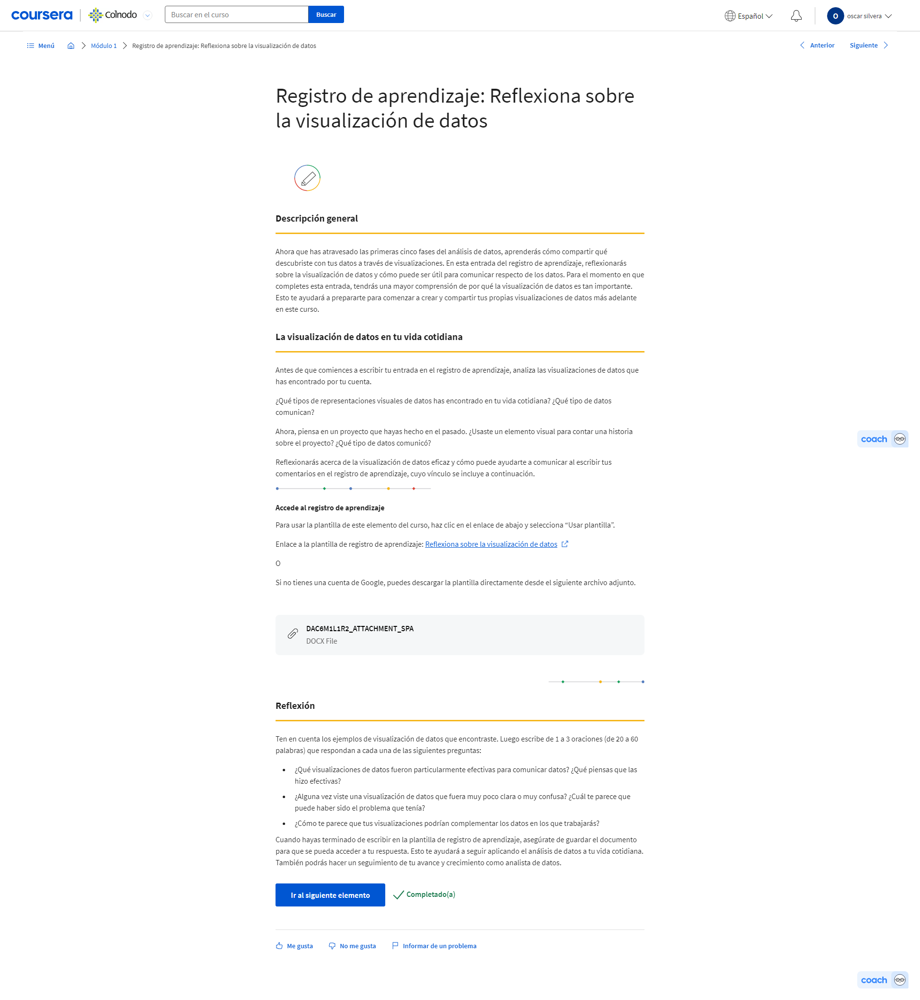
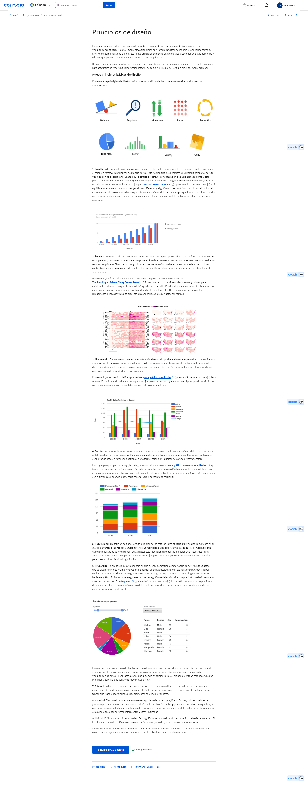
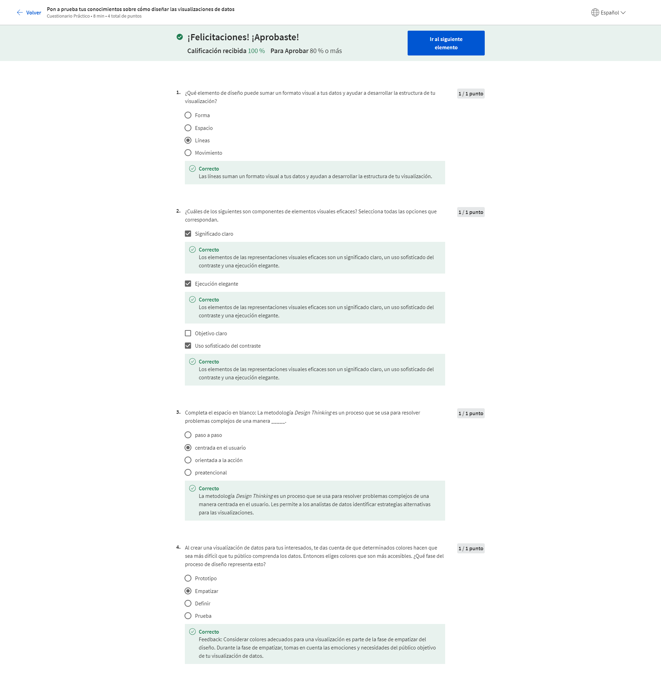
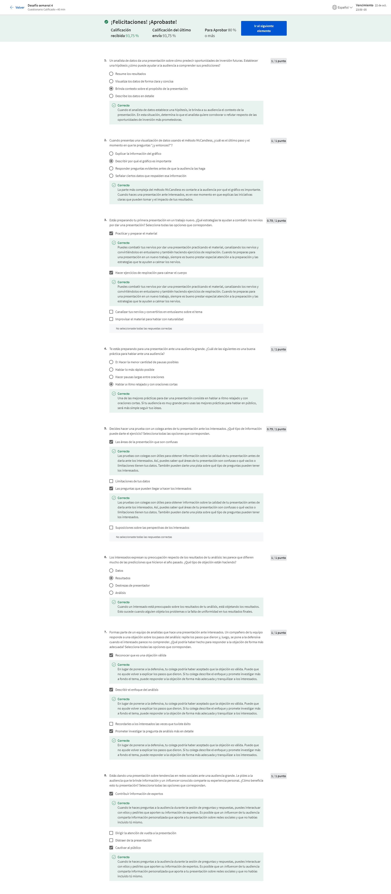

# Analizar datos para responder preguntas

## Visualización de datos

### Comunicación de tus conclusiones de datos

#### Introducción a la comunicación de las conclusiones obtenidas a partir de los datos

¡Hola! Es genial ver cuánto avanzaste en este Certificado de análisis computacional de datos de Google. Primero, quiero felicitarte por tu logro. Segundo, bienvenido a tu siguiente curso. Todo se trata del arte de la narración de datos a través de la visualización. Como analista de datos, puedes hacer todo el trabajo necesario de planificación, recolección, limpieza y análisis. Pero también necesitas mostrarles a los interesados qué significan tus datos de manera atractiva usando elementos visuales. Estamos aquí para mostrarte cómo se hace eso. Con mi experiencia como director de análisis en Google, espero ser un guía bastante bueno. Me llamo Kevin y seré tu instructor en este curso. Esta parte de tu capacitación es particularmente significativa para mí porque me encanta la narrativa de los datos. No se me ocurre ninguna otra cosa en el mundo de negocios actual que sea más vibrante, más excitante y más gratificante. Con la cantidad de datos que tenemos a nuestro alrededor, el análisis de datos tiene un rol clave en casi todas las partes del negocio. En mi opinión, no existe una destreza que sea más importante para ti como analista que poder comunicar con eficacia las historias que quieres transmitir a los interesados. Los interesados generalmente no tienen el tiempo, el acceso a los datos o los conocimientos necesarios para encontrar esas historias por sí mismos. Por eso nos enfocaremos en visualizar datos para ayudarte a compartir mejor sus historias. Lo que significa que ahora estamos en la fase compartir del proceso de análisis de datos. Comenzaremos con los conceptos básicos de la visualización y por qué la visualización de tu análisis es una parte tan importante del Análisis computacional de datos. A partir de allí, comentaremos cómo planificar y comenzar a crear visualizaciones efectivas que sean inclusivas, accesibles y analicen primero al público. Luego, exploraremos una posible herramienta que puedes usar para visualización de datos, Tableau. Tableau ayuda a crear visualizaciones a partir de nuestro análisis para que podamos compartir nuestros hallazgos con mayor eficacia. Te mostraremos cómo las visualizaciones de datos, entre ellas los paneles visuales, pueden ayudarte a darles vida a tus datos. Además, exploraremos cómo puedes usar visualizaciones en tus presentaciones y diapositivas para seguir narrando una historia con datos. Hablaremos del arte y la ciencia detrás de las presentaciones efectivas. Por último, aprenderás cómo anticipar y responder preguntas de interesados y responder a sus comentarios. Durante todo el curso, te guiaré por lo que creo que es la parte más emocionante del proceso de análisis de datos. Al final, tendrás todo lo que necesitas para planificar, crear y presentar una visualización de datos eficaz y convincente. Ahora que ya nos conocemos un poco, es el momento de poner manos a la obra. A continuación, hablaremos un poco sobre la historia de la visualización de datos y por qué las visualizaciones importan tanto hoy en día. También veremos los métodos para usar imágenes de manera eficaz y qué puedes hacer para aprovechar al máximo tus elementos visuales. Nos vemos allí.

#### Registro de aprendizaje: Reflexiona sobre la visualización de datos

#### Kevin: El poder se encuentra en la visualización de datos

[MÚSICA] El análisis computacional de datos es la recolección y el análisis y luego el uso de datos para contar historias mediante gráficos y visualizaciones, de modo que las empresas puedan tomar mejores decisiones. Siempre me encantaron los números y siempre disfruté la matemática y el cálculo y ese tipo de cosas. Entonces, los datos me resultaron muy fáciles. Trabajaba en una consultoría antes y usaba muchos números y, sin duda, lo disfrutaba. Pero recién cuando trabajé en una agencia publicitaria vi la expresión creativa de los números y cómo los datos podían impulsar esa creatividad. Entonces allí me cuadró todo y me di cuenta de que hacer analítica en un entorno de marketing y de publicidad era exactamente lo que quería hacer. Y me di cuenta de que realmente disfrutaba cuando esas dos cosas se unen. Creo que los elementos visuales que surgen del análisis de datos y el análisis computacional de datos son realmente bellos, pero algo que aún es más interesante para mí son las historias detrás de ellos. Si miras un gran bloque de texto o un gran bloque de números, esas historias están allí, pero realmente tienen que encontrarse. Y entonces hace falta cierta destreza para extraer esas cosas. Y esa destreza, ese análisis, me resulta realmente excitante e interesante. Pero luego finalmente termina en una visualización hermosa, que me resulta muy gratificante. Hay grandes pensadores en el campo de la visualización de datos, y ves estos elementos visuales por todos lados. Puedes encontrar inspiración mirando los medios de comunicación hoy y ver los elementos visuales que presentan y cómo cuentan historias de esa manera. Las visualizaciones se han hecho tan importantes que puedes encontrarlas en todos lados, y puedes obtener gran inspiración a partir de eso. Pero yo también me inspiro con fuentes menos probables como la fotografía y el arte y otras personas y viendo cómo se crea la composición, cómo se usa el color. Creo que eso es muy importante. Y me esfuerzo mucho en incorporar ese tipo de elementos y ese tipo de influencias a las visualizaciones que creo. Entonces, sé que este curso es bastante intenso. Les damos mucha información. Tu cerebro seguramente está sobrecargado. Seguramente estés exhausto. Pero no abandones. Todo comenzará a unirse y tomará sentido. Lo más importante que creo que puedes pensar es cuán importantes son realmente estas destrezas. Esta es la nueva manera de hacer negocios, involucrando datos, usando las herramientas y las técnicas analíticas que estamos comentando para tomar decisiones. ¡Una enorme recompensa te espera al final de este curso! Soy Kevin. Director de analítica aquí, en Google. [SONIDO]

### Comprende la visualización de datos

#### ¿Por qué la visualización de datos es importante?

Bienvenido, futuro analista de datos. Como analista incipiente, estarás expuesto a muchos datos. Las personas aprenden y absorben datos de muchas maneras diferentes y una de las maneras más eficaces de hacerlo es mediante la visualización. La visualización de datos es la representación y presentación gráfica de los datos. En realidad, solo es colocar información en una imagen para que sea más fácil que otras personas la entiendan. Si alguna vez viste cualquier tipo de mapa, ya sea impreso o en línea, sabes exactamente cuán útiles pueden ser las representaciones visuales. Las visualizaciones de datos sin dudas están teniendo un gran momento. En Internet, estamos rodeados de imágenes que muestran información de todo tipo, pero la historia de la visualización de datos se remonta mucho más allá de Internet. La visualización de datos comenzó hace mucho con los mapas, que son la representación visual de datos geográficos. Este mapa del mundo conocido es de 1502. Los cartógrafos siguieron mejorando sus visualizaciones a medida que se hacían cartas de navegación de nuevas tierras. Se recolectaban datos sobre esos lugares y se creaban nuevos métodos para visualizar los datos. Los científicos y matemáticos comenzaron a adoptar realmente la idea de organizar datos visualmente en los siglos XVII y XVIII. Este gráfico de barras es de 1821 y no luce muy diferente a los gráficos de barras que vemos hoy en día. Pero desde el principio de la era digital del análisis de datos en la década de 1990, el alcance y la magnitud de las visualizaciones creció junto con los datos que representan gráficamente. A medida que seguimos aprendiendo cómo comunicar con elementos visuales de manera más eficaz, la calidad de nuestras conclusiones también sigue creciendo. Hoy podemos cuantificar conductas humanas mediante datos y aprendimos a usar computadoras para recabar, analizar y visualizar esos datos. Como analista en el mundo actual, probablemente dividas tu tiempo con elementos visuales de datos de dos maneras: mirándolos para comprender y sacar conclusiones sobre datos o creándolos a partir de datos crudos para contar una historia. De todos modos, siempre es bueno tener en cuenta que las visualizaciones de datos serán tu llave al éxito. Esto es especialmente cierto una vez que llegas al punto en que estás listo para presentar los resultados de tu análisis de datos a un público. Lograr que las personas comprendan tu visión y proceso de razonamiento puede sentirse difícil. Pero una visualización de datos bien hecha tiene el poder de hacer que la gente cambie de opinión. Además, puede ayudar a alguien que no tiene la misma formación o experiencia técnica que tú a formar su propia opinión. Entonces, esta es una regla rápida para crear una visualización. Tu público debería saber exactamente qué está mirando en los primeros cinco segundos de verlo. Básicamente, esto significa que la representación visual debería ser clara y fácil de seguir. Y en los cinco segundos posteriores, tu público debería comprender la conclusión que está marcando tu visualización. Aunque no estén completamente familiarizados con la investigación que hiciste. Quizás no estén de acuerdo con tu conclusión, y eso está bien. Siempre puedes usar sus comentarios para ajustar tu visualización y volver a los datos para hacer análisis adicional. Entonces ahora hablemos de lo que tenemos que hacer para crear una visualización que sea comprensible, efectiva y, lo que es más importante, convincente. Empecemos por el principio. Las visualizaciones de datos son una herramienta útil para incluir mucha información en un espacio pequeño. Para hacerlo, primero necesitas estructurar y organizar tus ideas. Piensa en tus objetivos y en las conclusiones a las que llegaste después de ordenar los datos. Luego, piensa en los patrones que observaste en los datos, las cosas que te sorprendieron y, por supuesto, en cómo todo esto junto se incorpora a tu análisis. Identificar los elementos clave de tus hallazgos ayuda a sentar las bases de cómo deberías organizar tu presentación. Mira esta visualización de datos hecha por David McCandless, un periodista de datos muy conocido. Este gráfico incluye cuatro elementos clave: la información o los datos, la historia, el objetivo y el formato visual. Está organizado en un diagrama de Venn de cuatro partes, que nos indica que los cuatro elementos son necesarios para una visualización exitosa. Hasta ahora, aprendiste mucho sobre los datos usados en las visualizaciones. Eso es importante porque es uno de los principales cimientos de tu visualización. La historia o concepto agrega significado a los datos y los hace interesantes. Más adelante, hablaremos más sobre la importancia de la narración de datos, pero por ahora, simplemente recordemos que la historia y los datos combinados brindan un esbozo de lo que intentas mostrar. El objetivo o función hace que los datos sean útiles y utilizables, y el formato visual genera tanto belleza como estructura. Con solo dos elementos, puedes crear un esbozo de una representación visual. Esto podría funcionar si estás en una etapa temprana, pero no te dará una visualización completa, ya que te faltarían otros elementos clave. Hasta el uso de tres elementos te acerca, pero aún te falta. Por ejemplo, si combinas información, objetivo y formato visual sin una historia, tu visualización probablemente luciría bien, pero no sería interesante. Por su cuenta, cada elemento tiene valor, pero las visualizaciones solo se hacen verdaderamente poderosas y eficaces cuando combinas estos cuatro elementos de una manera que tenga sentido. Y cuando piensas en todos estos elementos juntos, puedes crear algo significativo para tu público. En Google, me aseguro de desarrollar visualizaciones para contar historias sobre datos que incluyen estos cuatro elementos y te aseguro que cada elemento es clave para el éxito de la visualización. Por eso es tan importante para ti, como analista, prestar mucha atención a cada elemento a medida que avancemos. Quizás otras personas no conozcan o comprendan los pasos exactos que realizaste para llegar a las conclusiones que sacaste, pero eso no debería detenerlas a la hora de comprender tu razonamiento. Básicamente, una visualización de datos eficaz debería llevar a los espectadores a que lleguen a la misma conclusión que tú, pero mucho más rápido. Debido a la era en la que vivimos, constantemente se nos muestran diferentes maneras de ver y absorber información. Esto significa que ya viste muchos elementos visuales que puedes consultar mientras diseñas tus propias visualizaciones. Tienes el poder de contar historias convincentes que podrían modificar opiniones y cambiar actitudes. Eso es genial. Pero también tienes la responsabilidad de prestarle atención a las perspectivas de los demás cuando creas estas historias. Es importante tener eso siempre en mente. A continuación, comenzaremos a hacer conexiones entre datos e imágenes para sentar cimientos firmes para tus obras maestras visuales. No veo la hora de arrancar.

#### Visualizaciones de datos efectivas

<https://www.informationisbeautiful.net/visualizations/what-makes-a-good-data-visualization/>
<https://junkcharts.typepad.com/junk_charts/junk-charts-trifecta-checkup-the-definitive-guide.html>
<https://www.ted.com/talks/david_mccandless_the_beauty_of_data_visualization?language=en#t-150183>
<https://artscience.blog/home/the-mccandless-method-of-data-presentation>
<https://informationisbeautiful.net/>
<https://informationisbeautiful.net/beautifulnews/>
<https://www.amazon.com/Street-Journal-Guide-Information-Graphics/dp/0393072959>

#### Conectar imágenes con datos

Hola de nuevo. Antes, hablamos sobre por qué las visualizaciones de datos son tan importantes tanto para los analistas como para los interesados. Ahora hablaremos de las conexiones que puedes hacer entre datos e imágenes en tus visualizaciones. La comunicación visual de datos es importante para quienes usan los datos como ayuda para tomar decisiones. Para entender mejor la conexión entre los datos y las imágenes, hablemos acerca de algunos ejemplos de visualizaciones de datos y cómo pueden comunicar datos con eficacia. Quizás te encuentres muchos de estos elementos en tu vida cotidiana. Los exploraremos un poco más aquí. Un buen lugar para empezar es un gráfico de barras. Los gráficos de barras usan contraste de tamaño para comparar dos o más valores. La línea horizontal de los gráficos de barras generalmente se coloca abajo, se denomina eje X, y en los gráficos de barras con barras verticales, el eje X se usa para representar categorías, períodos de tiempo u otras variables. La línea vertical de un gráfico de barras generalmente ubicado a la izquierda se llama eje Y. El eje Y generalmente tiene una escala de valores para las variables. En este ejemplo, la hora del día se compara con el nivel de motivación de alguien a lo largo de todo el día laboral. Los gráficos de barras son una manera excelente de aclarar tendencias. Aquí, queda claro que la motivación de esta persona es baja al principio del día y va subiendo cada vez más hacia el final del día laboral. Este tipo de visualización hace que sea muy fácil identificar patrones. Otro ejemplo es un gráfico de líneas. Los gráficos de líneas son un tipo de visualización que puede ayudar a tu público a comprender movimientos o cambios en tus datos. Generalmente se usan para hacer un seguimiento de los cambios a lo largo de un período, pero también pueden combinarse con otros factores. En este gráfico de líneas, usamos dos líneas para comparar la popularidad de los gatos y los perros a lo largo de un período. Con dos colores de línea diferentes, podemos darnos cuenta inmediatamente de que los perros son más populares que los gatos. Además, hablaremos más acerca del uso de colores y patrones para hacer que las visualizaciones sean más accesibles para el público más adelante. Aun cuando una línea sube y baja, existe una tendencia general hacia arriba y la línea de los perros siempre se mantiene más alta que la línea de los gatos. Ahora veamos otra visualización que probablemente reconozcas. Aquí llegó el gráfico circular. Los gráficos circulares muestran qué porcentaje del todo representa cada parte de algo. Este gráfico circular nos muestra todas las actividades que componen el día de alguien. La mitad se pasa trabajando, que se muestra en la cantidad de espacio que abarca la sección azul. Mirando rápidamente, puedes determinar fácilmente qué actividades conforman una buena parte del día en este gráfico circular y cuáles llevan menos tiempo. Anteriormente, aprendimos cómo los mapas ayudan a organizar datos geográficamente. Lo que es genial de los mapas es que pueden contener mucha información relacionada con la ubicación y son fáciles de interpretar para tu público. Este ejemplo muestra datos de una encuesta sobre la felicidad de las personas en Europa. Las fronteras están bien definidas y los colores agregados hacen que sea aún más fácil distinguir los países entre sí. La comprensión de los datos representados aquí, un tema al que volveremos luego, puede darse con bastante rapidez. Por lo que la visualización de datos es una herramienta excelente para hacer la conexión entre una imagen y la información que representa, pero a veces puede ser engañosa. Una de las maneras en que las visualizaciones pueden manipularse es con las escalas y las proporciones. Piensa en un gráfico circular. Los gráficos circulares muestran proporciones y porcentajes entre categorías. Cada parte del círculo o el pastel debería reflejar su porcentaje del entero, que equivale al 100 por ciento. Entonces si quieres visualizar tu análisis de ventas para que muestre el porcentaje de las ventas de tu empresa que provienen de transacciones en línea, podrías usar un gráfico circular. El tamaño de cada porción debería ser el porcentaje de ventas totales que representa. Entonces, si tus ventas en línea representaron el 60 por ciento, la porción sería 60 por ciento de todo el pastel. Ahora mira un gráfico circular engañoso. Supuestamente muestra opiniones sobre ingredientes adicionales para pizza, pero cada porción o segmento representa más de una opción. Todas las opciones suman mucho más que 100 por ciento. Hay muchos ingredientes que aparecen debajo de la imagen que ni siquiera se incluyen en los datos visuales. Todos los segmentos tienen el mismo tamaño, aunque se supone que deberían mostrar diferentes valores. Si una visualización luce confusa seguramente sea confusa. Exploremos otro ejemplo en el que el tamaño de los componentes gráficos entra en juego. Esta vez con un gráfico de barras. En un gráfico de barras truncado como este, los valores del eje Y no comienzan en cero. Los puntos de datos empiezan en 9,100 y en intervalos de 100. Esto hace que parezca que los datos, digamos, es para nuevos clics por día en diferentes enlaces del sitio web, es bastante abarcador. En esta vista, el sitio web E parece recibir claramente muchos más clics que el sitio web D, que recibe más clics que el sitio web C, etcétera. Si bien el gráfico es claro y los elementos son fáciles de entender, la manera en que están presentados los datos es engañosa. Intentemos arreglarlo cambiando el eje Y del gráfico para que empiece en cero. Ahora la diferencia entre los clics de los sitios web por día parece mucho menos drástica. Al hacer que el eje Y comience en cero, estamos modificando las proporciones visuales para que sean más precisas y honestas. Algunas plataformas siempre comienzan sus ejes Y en cero, pero otros programas como las hojas de cálculo quizás no acomoden el eje Y. Por lo que es importante tener esto en cuenta al crear visualizaciones. Al seguir las convenciones del análisis de datos, podrás evitar las visualizaciones engañosas. Tu visualización siempre debe ser clara y fácil de entender, pero nunca a costa de comunicar ideas que son verdad en los datos. Entonces hemos hablado sobre algunas visualizaciones basadas en datos como los gráficos de barras, los gráficos de líneas y los gráficos circulares, y cuándo usarlas. Además de eso, hemos comentado algunas cosas que se deben evitar en las visualizaciones para evitar que sean engañosas. A continuación, veremos cómo hacer que esas visualizaciones lleguen a tu público objetivo. Nos vemos pronto.

#### La belleza de la visualización

<https://datavizcatalogue.com/#google_vignette>
<https://visme.co/blog/best-data-visualizations/>
<https://www.tableau.com/learn/articles/best-data-visualization-blogs>
<https://informationisbeautiful.net/wdvp/gallery-2019/>
<https://datastudio.google.com/gallery?category=visualization>

#### Una receta para una visualización poderosa

¡Hola! Volvimos y estamos listos para aprender cómo crear visualizaciones de datos poderosas. A continuación, exploraremos cómo convertir nuestros hallazgos en representaciones visuales cautivadoras. Anteriormente, hablamos de la relación entre los datos y las imágenes. Ahora, desarrollaremos más ese tema para explorar qué pueden revelar las visualizaciones a tu público y cómo hacer que tus gráficos sean lo más eficaces posible. Una de las principales consideraciones al crear una visualización de datos es dónde quieres que se enfoque tu público. Mostrar demasiado puede distraer y dejar confundido a tu público. En algunos casos, limitar los datos puede ser algo bueno. Por otra parte, mostrar demasiado poco puede hacer que tu visualización sea poco clara y menos significativa. Como regla general, siempre y cuando no sea engañoso, debes representar visualmente solo los datos que tu público necesita para comprender tus hallazgos. Ahora, hablemos de lo que puedes mostrar con visualizaciones. El cambio a lo largo del tiempo es una de las principales. Si tu análisis involucra cómo cambiaron los datos durante un período determinado, que podría ser de días, semanas, meses o años, puedes armar tu visualización para que muestre solo el período relevante a tu objetivo. Esta visualización muestra los intereses de búsqueda en temas de actualidad como el medio ambiente, la ciencia y las problemáticas sociales. La visualización está armada para que muestre cómo las búsquedas cambian día a día. Las burbujas representan el tema más popular en cada día en una determinada parte de los EE.UU. A medida que surgen noticias, los datos cambian para reflejar el tema de esas noticias. Si quisiéramos los datos para ciclos de noticias semanales o mensuales, modificamos la función interactiva para que muestre cambios por semana o mes. Otra situación es cuando necesitas mostrar cómo se distribuyen tus datos. Un histograma se parece a un gráfico de barras, pero es un gráfico que muestra con cuánta frecuencia los valores de datos caen dentro de determinados rangos. Este histograma muestra muchos datos y cómo se distribuyen en un rango estrecho, de uno negativo a uno positivo. Cada intervalo o rectángulo, como se denomina la barra, contiene un determinado número de valores que caen dentro de una pequeña parte del rango. Si no necesitas mostrar tantos datos, otros histogramas serían más efectivos, como este sobre la longitud de los dinosaurios. Aquí los intervalos o rectángulos de los valores de los datos están segmentados. Puedes mostrar cada valor que cae en cada parte del rango. Si tus datos necesitan clasificarse, como al ordenar el número de respuestas a preguntas de un sondeo, deberías pensar primero en qué quieres destacar en tu visualización. Los gráficos de barras con barras horizontales muestran eficazmente datos que están clasificados, con barras ordenadas en orden ascendente o descendente. Un gráfico de barras siempre debería estar clasificado por valor, salvo que exista un orden natural en los datos, como edad o tiempo, por ejemplo. Este sencillo gráfico de barras muestra metales como el oro y el platino clasificados por densidad. El público podría ver con claridad la clasificación y determinar rápidamente qué metales tienen la densidad más alta, aunque esta base de datos incluyera muchos otros metales. Los cuadros de correlación pueden mostrar relaciones entre datos, pero debería usarse con cautela porque podrían llevar a los espectadores a pensar que los datos muestran causalidad. La causalidad, o relación causa-efecto, se produce cando una acción lleva directamente a un resultado. La correlación y la causalidad a menudo se confunden porque a los seres humanos les gusta encontrar patrones aun cuando no existen. Si dos variables parecen estar asociadas de alguna manera, podríamos asumir que una depende de la otra. Eso implica causalidad, incluso si las variables son completamente independientes. Si ponemos esos datos en una visualización, sería engañoso. Pero los cuadros de correlación que sí muestran causalidad pueden ser efectivos. Por ejemplo, este cuadro de correlación tiene una línea de datos que muestra el tráfico promedio de búsquedas en Google los martes en Brasil. La otra línea es de una fecha específica de tráfico de búsqueda, el 15 de junio. Los datos están correlacionados automáticamente porque ambas líneas representan la misma información básica. Pero el gráfico también muestra una gran diferencia. Cuando un partido de fútbol o <i>soccer </i>para los estadounidenses comenzó el 15 de junio, el tráfico de búsqueda mostró una caída significativa. Eso implica causalidad. El fútbol es un deporte muy popular e importante para los brasileños, y los datos de este gráfico así lo verifican. Ya hablamos de gráficos de series temporales, histogramas, gráficos de barras clasificadas y cuadros de correlación. Cada uno de estos gráficos puede visualizar un tipo diferente de análisis. Tu objetivo de negocios y tu público te ayudarán a determinar cuál de estas visualizaciones comunes elegir. O quizás quieras consultar algunos otros tipos de visualizaciones que existen. Además, hay visualizaciones tipo glosario que podrás consultar más adelante. Esto engloba nuestra lección sobre la creación de visualizaciones. A continuación, agregaremos algunas capas más a tu planificación y ejecución de representaciones visuales. No te vayas.

#### Correlación y causalidad

<https://towardsdatascience.com/correlation-is-not-causation-ae05d03c1f53>
<https://www.khanacademy.org/test-prep/praxis-math/praxis-math-lessons/gtp--praxis-math--lessons--statistics-and-probability/a/gtp--praxis-math--article--correlation-and-causation--lesson>

#### Visualizaciones dinámicas

Hola, ¡qué bueno volver a verte! Hasta ahora, mostramos que existen muchas opciones que elegirás como analista de datos al crear visualizaciones. Cada una de tus elecciones debería ayudar a garantizar que tus representaciones visuales sean significativas y eficaces. Otra elección que deberás hacer es si quieres que tus visualizaciones sean estáticas o dinámicas. Las visualizaciones estáticas no cambian con el tiempo salvo que se editen. Pueden ser útiles cuando quieres controlar tus datos y tu historia de datos. Cualquier visualización impresa en papel es automáticamente estática. Los cuadros y gráficos creados en hojas de cálculo también suelen ser estáticos. Por ejemplo, el propietario de esta hoja de cálculo podría tener que modificar los datos para que se actualice la visualización. Ahora bien, las visualizaciones dinámicas son interactivas y cambian a lo largo del tiempo. La naturaleza interactiva de estos gráficos significa que los usuarios tienen algo de control sobre lo que ven. Esto puede ser útil si los interesados quieren ajustar lo que pueden ver. Veamos una visualización sobre la felicidad que creamos en Tableau. Tableau es una plataforma de inteligencia empresarial y análisis computacional que ayuda a las personas a ver, comprender y tomar decisiones con datos. Las visualizaciones en Tableau son automáticamente interactivas. Entraremos en el panel para ver cómo el puntaje de felicidad ha cambiado de 2015 a 2017. Podemos ver esto en nuestra diapositiva 12, cambios anuales en la felicidad. A la izquierda, están los cambios a nivel del país en el puntaje de felicidad. Los países se clasifican por incremento más alto a disminución más marcada. A la derecha, hay un mapa con puntajes generales de felicidad. La escala de color va del azul para países con el puntaje de felicidad más alto, al rojo para los que tienen el puntaje más bajo. Si miras debajo del mapa, observarás un control deslizable de año a visualizar en el que las personas pueden elegir los puntajes de felicidad de qué año quieren que se muestren en el mapa. Actualmente está fijado en 2016, pero si alguien quiere saber los puntajes de 2015 o 2017, pueden ajustar el control deslizante. Entonces, podrían observar cómo los códigos de color y las etiquetas de puntaje cambian año a año. Otras visualizaciones dinámicas cargan nuevos datos automáticamente. Estos gráficos de barras actualizan constantemente los datos minuto a minuto y segundo a segundo. Otras representaciones visuales de datos pueden hacer lo mismo por día, semana o mes. Si así lo necesitas, puedes mostrar tendencias en tiempo real. Tener una visualización interactiva puede ser útil tanto para ti como para el público con el que la compartes. Pero es bueno recordar que cuanto más poder le des al usuario, menos control tienes sobre la historia que quieres contar con tus datos. Es algo para tener en cuenta mientras aprendes cómo crear tus propias visualizaciones. Lo recomendable es encontrar el equilibrio correcto entre la interactividad y el control. Otra cosa para tener en cuenta es que la elección de usar una visualización estática o dinámica generalmente dependerá de los datos que estés visualizando, el público ante el cual estás presentando, y cómo estás realizando tu presentación. Ahora que hemos tomado algunas decisiones sobre el tipo de visualización de datos que queremos crear, podemos empezar a pensar en el diseño, que es exactamente donde comenzaremos a hablar la próxima vez. Nos vemos allí.

#### El maravilloso mundo de las visualizaciones

#### Los datos crecen en árboles de decisiones

<https://www.data-to-viz.com/>
<https://www.youtube.com/watch?v=C07k0euBpr8>
<https://www.youtube.com/watch?v=qGaIB-bRn-A>

#### Cuestionario práctico: Autorreflexión: Elección de tu visualización

#### Cuestionario práctico: Pon a prueba tus conocimientos sobre la visualización de datos

### Diseñar visualizaciones de datos

#### Elementos del arte

Hola. Bienvenido de nuevo. Probablemente no pensabas aprender sobre arte en un curso de análisis de datos, pero eso es exactamente lo que haremos. Tanto los analistas de datos como los artistas usan elementos de arte en su trabajo. Te presentaremos esos elementos aquí y te mostraremos cómo aplicarlos a visualizaciones más adelante. Los elementos que veremos son línea, forma, color, espacio y movimiento. Ahora bien, estos no son los únicos elementos a tener en cuenta, pero estos elementos en particular pueden sumar valor a tu visualización de datos haciéndolos más eficaces y atractivos a nivel visual. Las líneas y visualizaciones pueden ser curvas o rectas, gruesas o finas, verticales, horizontales o diagonales. Pueden sumar un formato visual a tus datos y ayudar a armar una estructura para tu visualización. Estos gráficos muestran parte de la variedad que pueden aportar las líneas a tu visualización de datos. El gráfico combinado muestra dos tipos diferentes de líneas y ambas brindan un gráfico para los datos. El gráfico de líneas hace lo mismo, pero usa líneas curvas. Las formas también son conocidas por ser variadas. Las formas y visualizaciones siempre deben ser bidimensionales. Esto se debe a que los objetos tridimensionales en una visualización pueden complicar la representación visual y confundir al público. Las formas también son una gran manera de sumar contraste que llame la atención, especialmente contraste de tamaño, a tu historia de datos. Este círculo usado para un gráfico circular permite a las personas entender los datos en un formato familiar. Las formas simétricas generalmente resultan más familiares, por lo que el público tiene que trabajar menos al mirar una visualización de datos simétrica. Sin embargo, las formas asimétricas en este mapa igualmente se reconocen de inmediato como países. Es bueno observar que los datos que compartes con tu público generalmente incidirán en los tipos de formas que deberías usar en tu visualización de datos. Luego tenemos los colores, y los colores son, bueno, colores. Por supuesto, desde la perspectiva de los artistas y analistas, los colores pueden ser algo mucho más complejo. Los colores se pueden describir por su matiz, intensidad y valor. El matiz de un color es básicamente su nombre, rojo, verde, azul, etc. La intensidad es cuán brillante u opaco es el color. Y, por último, está el valor. El valor es cuán claros u oscuros son los colores en una visualización. En términos más científicos, el valor indica cuánta luz se refleja. Los valores oscuros con un poco de negro agregado se llaman tonos de color, como estos tonos de verde. Los valores claros con blanco agregado se llaman tintes, como estos tintes de azul. En este mapa, hay tonos y tintes de gris. El valor de estos colores nos ayuda a comprender los datos demográficos en el mapa y variar el valor del color puede ser una manera muy eficaz de llamar la atención del público a zonas específicas. El espacio es la superficie en medio, alrededor y dentro de los objetos. Siempre debería haber espacio en las visualizaciones de datos, pero no excesivo ni escaso. Por ejemplo, el espacio entre las barras de un gráfico de barras como este debería ser menor al ancho de las propias barras. Esto hará que el espectador preste atención a la barra y los datos que representa en vez de al espacio vacío. Por último, está el movimiento. El movimiento se usa para crear una sensación de flujo o acción en una visualización. Uno de mis ejemplos favoritos es la visualización de datos "La riqueza y la salud de las naciones". Esta visualización presenta una correlación entre la salud financiera y la salud física de las naciones. Hace un seguimiento de estos elementos a lo largo del tiempo para que puedas ver cómo los dos efectos correlacionados evolucionan. El movimiento incorpora datos desde el siglo XIX hasta recientemente. La interactividad permite que se muestre un mayor volumen de datos y que revelemos múltiples historias de la misma visualización de datos. Recuerda, esto es algo que debería usarse con moderación. Hay una delgada línea entre atraer la atención y distraer al público. Una imagen estática te permite controlar todos los elementos de la historia que quieres contar. Cuando empiezas a incorporar movimiento e interactividad, la historia es controlada por quien controla la interactividad, ya seas tú o posiblemente tu público si le cediste el control. Comentaremos este delicado equilibrio más adelante en el curso. Cuando juntas muchos de estos elementos de arte en una visualización como esta sobre el nivel del mar, puede ser hermoso y provocador. Prueba que hay lugar para la expresión de creatividad en el análisis de datos. A continuación, seguiremos explorando maneras de sumar una expresión de creatividad significativa a tu visualización de datos. ¡Hasta luego!

#### Principios de diseño

<https://developers.google.com/chart/interactive/docs/gallery/columnchart>
<https://pudding.cool/2017/02/new-slang/>
<https://developers.google.com/chart/interactive/docs/gallery/combochart>
<https://developers.google.com/chart/interactive/docs/gallery/barchart>
<https://developers.google.com/chart/interactive/docs/gallery/controls>

#### Impacto de la visualización de datos

Bienvenidos nuevamente. Arranquemos.
Reproduce el video desde ::4 y sigue la transcripción0:04
Ojalá que a esta altura ya tengas una imagen clara de las visualizaciones de datos. Hemos explorado todo, desde principios de diseño hasta los tipos de gráficos que puedes usar en tus visualizaciones. La elección de la visualización adecuada para los resultados de tus datos a menudo puede reducirse a una pregunta: ¿Cuál hará que sea más fácil para el usuario entender el punto que intentas marcar?
Reproduce el video desde ::26 y sigue la transcripción0:26
Sin importar cuán complejo sea tu análisis, a tu público solo le importará lo que tiene delante y cuán fácilmente puede entenderlo. Mientras completes tu análisis, tendrás que decidir cuál visualización satisface tus necesidades y las de tu público para cada tarea. Por ejemplo, si quieres mostrar una comparación de los diferentes grupos etarios de visitantes a un sitio web, un gráfico de líneas con una línea para cada grupo etario, más una para los usuarios totales funcionaría bien. Digamos que quieres resaltar las diferencias entre los grupos etarios para compararlos directamente, para eso podrías usar un gráfico de barras positivo-negativo como este.
Reproduce el video desde :1:7 y sigue la transcripción1:07
Ya hablamos de esto, pero hagamos algunas conexiones más entre los datos que tendrás después del análisis y las visualizaciones que deberías usar para diferentes casos.
Reproduce el video desde :1:19 y sigue la transcripción1:19
Empezaremos con algunos gráficos.
Reproduce el video desde :1:21 y sigue la transcripción1:21
Ya trabajamos con algunos de ellos antes y luego hablaremos más acerca de gráficos con más ejemplos. Además, descubrirás que los mejores gráficos para adecuarse a tus propósitos podrían depender de las necesidades de tu industria y empresa, y los interesados que estarán en tu público. Para comparar datos en el tiempo te mostramos cómo los gráficos de líneas podían ser eficaces. Como en este caso, los gráficos de barras y los gráficos de barras apiladas, junto con los gráficos de áreas, también pueden ser buenas maneras de visualizar cómo los datos cambian a lo largo del tiempo. Por cierto, existen muchos gráficos en el mundo, te daremos la mayor cantidad de información posible sobre la mayor cantidad que podamos. Pero investigarlos por tu cuenta o practicar usarlos en visualizaciones también te resultará útil. Bueno, cuando estás comparando distintos objetos como en nuestro ejemplo sobre uso de móviles versus computadoras, son útiles los gráficos de barras ordenadas, los gráficos de barras agrupadas y los gráficos de columnas ordenadas.
Reproduce el video desde :2:16 y sigue la transcripción2:16
Después existen gráficos que muestran parte de un todo. Esto se conoce como composición de datos y se logra combinando las partes individuales de una visualización y mostrándolas juntas como un todo. Las barras apiladas, los anillos, las áreas apiladas, los gráficos circulares y los diagramas de árbol pueden hacer todo esto. Ahora, para mostrar relaciones en tus datos, quizás te convenga usar diagramas de dispersión y gráficos de burbujas, gráficos de columnas/líneas y mapas de calor. Volvamos a consultar la visualización de datos de felicidad para que veas un ejemplo de esto. Cada uno de estos diagramas de dispersión muestra la relación entre el puntaje de felicidad de un país y uno de los factores que contribuye a ese puntaje.
Reproduce el video desde :2:57 y sigue la transcripción2:57
Entonces, el diagrama de dispersión de salud versus felicidad muestra una fuerte relación entre la esperanza de vida de personas que viven en un país y cuán felices son esas personas. Básicamente, a medida que aumenta la esperanza de vida, también aumenta su puntaje de felicidad. Hablando de felicidad, una visualización de datos exitosa tiene como resultado un público feliz. Por eso, es importante comprender cómo tu público está viendo tus visualizaciones de datos, dado que siempre deberías tenerlo muy presente. Todo empieza en el cerebro: Al procesar información, nuestro cerebro intenta encontrar patrones y confía en el contexto visual. Como analistas de datos, podemos usar nuestra comprensión del sistema visual de las personas para producir mejores elementos visuales. Cuando creamos visualizaciones, podemos hacerlo de una manera que ayude al público a procesar la información y los ayude a recordar lo que están viendo. La periodista visual Dona Wong propone que las representaciones visuales exitosas, como la base de datos que hemos estado comentando aquí, tienen tres elementos esenciales. El primero es un significado claro. Las buenas visualizaciones comunican con claridad su conclusión prevista. El segundo es un uso sofisticado del contraste, que ayuda a separar los datos más importantes del resto usando el contexto visual que nuestro cerebro busca naturalmente. El tercer elemento esencial para las representaciones visuales eficaces es una ejecución elegante. Las representaciones visuales con una ejecución elegante incluyen una profunda atención a los detalles, usando elementos visuales como líneas, formas, colores, valor, espacio y movimiento. Es decir, los elementos del arte de los que hablamos anteriormente. La primera regla de la mayoría de los negocios es satisfacer al cliente: en el análisis de datos es lo mismo. Si bien tus clientes probablemente sean gerentes y otros interesados, siempre deberías pensar primero en ellos al crear visualizaciones de datos. Piensa en la regla de los cinco segundos que comentamos antes. Si haces que tu visualización de datos sea fácil de mirar y entender con rapidez, hiciste bien tu trabajo y estarás satisfecho, al igual que tus clientes. A continuación, hablaremos sobre la metodología <i>Design Thinking</i> y las visualizaciones de datos. Nos vemos pronto.

#### Los datos son bellos

#### La metodología Design Thinking y las visualizaciones

Hola de nuevo. Abarcamos muchos temas en nuestra exploración de visualizaciones de datos. Hablamos mucho acerca de cómo tu público debería ser el foco cuando tomas decisiones sobre gráficos, colores, espacio, etiquetas y todos los otros elementos de las visualizaciones de datos. Ahora hablemos sobre <i>Design Thinking</i>. La metodología<i> Design Thinking</i> es un proceso que se usa para resolver problemas complejos de una manera centrada en el usuario.
Reproduce el video desde ::25 y sigue la transcripción0:25
Cuando aplicas <i>Design</i> <i>Thinking</i> a tu trabajo, intentas identificar estrategias alternativas para tus visualizaciones que quizás no resulten claras de inmediato. Tienes que desafiar tu propio razonamiento y explorar diferentes maneras de enfocar los problemas y encontrar soluciones. Airbnb es un ejemplo de una empresa que usa un enfoque de <i>Design Thinking</i> para ayudar a hacer crecer su negocio. Cuando la empresa, un mercado en línea de alquileres vacacionales, no generaba tantos ingresos como ellos querían, decidieron empezar a experimentar. Aunque los datos que recolectaron y analizaron eran valiosos, necesitaban mirar su producto desde la perspectiva del cliente. Se dieron cuenta de que las fotos de los lugares que los clientes veían simplemente no eran muy buenas, entonces decidieron ayudar a sus clientes a reemplazar las fotos no tan buenas por fotos más profesionales. Así fue como contrataron a un fotógrafo y fueron casa por casa a tomar fotos profesionales de sus anuncios en la ciudad de Nueva York. En una semana, los anuncios con estas fotos registraron el doble o el triple de reservas y sus ingresos casi se duplicaron, gracias a su nueva perspectiva de <i>Design Thinking</i> basada en el usuario. Si <i>Design Thinking</i> puede funcionar para empresas como Airbnb, también puede ayudar a los analistas de datos, y la visualización de datos es la etapa perfecta de tu análisis para aplicar un enfoque basado en el usuario.
Reproduce el video desde :1:45 y sigue la transcripción1:45
Si usas <i>Design Thinking</i> cuando planificas y creas tu visualización de datos, estarás tomando decisiones basadas en las necesidades de las personas que la verán. De esta manera, tu público estará involucrado y aprenderá a partir de la manera en que visualizas tus resultados. Si bien el proceso de <i>Design Thinking</i> viene en muchas formas diferentes, todos tienen etapas o fases. Hablaremos de las cinco fases que puedes usar al crear visualizaciones de datos: empatizar, definir, idear, crear prototipos y probar. Siguiendo la línea del <i>Design Thinking</i>, estas fases no tienen que seguir un orden fijo, sino que puedes pensar en ellas como una descripción general de acciones que pueden ayudarte a producir un diseño centrado en el usuario en tus visualizaciones. En la fase de empatizar piensas en las emociones y necesidades del público objetivo de tu visualización de datos, ya sea sus interesados, miembros del equipo o el público general. En este punto, deberías evitar áreas en las que las personas podrían enfrentar obstáculos al interactuar con tus visualizaciones. Por ejemplo, digamos que estás trabajando en un análisis para una empresa farmacéutica sobre cómo los pacientes han estado respondiendo a un nuevo tratamiento. Te estás preparando para visualizar los datos, entonces, deberías pensar en el público, que incluirá a interesados como farmacéuticos, médicos y otros profesionales médicos. Quizás estés pensando en usar un esquema de color que te gusta, pero te das cuenta de que estos colores podrían ser un desafío para algunas personas. Los colores podrían ser demasiado brillantes o dramáticos, lo que podría no ser una opción correcta para la seriedad de los datos. O los colores podrían no tener suficiente contraste para personas con deficiencias en la percepción del color.
Reproduce el video desde :3:23 y sigue la transcripción3:23
Al ajustar los colores, empatizarás con las necesidades de tu público. Si hay alguien en tu equipo que tenga problemas de vista, es recomendable que también encuentres una manera de explicar los datos verbalmente. La fase de definir te ayuda a encontrar las necesidades de tu público, sus problemas y tus conclusiones. Esto va de la mano con la fase de empatizar, ya que usarás lo que aprendiste en esa fase para ayudarte a explicar con lujo de detalles exactamente qué necesita tu público de tu visualización. Podrías usar esta fase para pensar en qué datos mostrar en tu visualización. Quizás esta visualización de datos también se presente a pacientes que forman parte del estudio de tu empresa.
Reproduce el video desde :4:1 y sigue la transcripción4:01
Si bien necesitarás cumplir con tus objetivos, quizás haya datos que pongan incómodas a estas personas.
Reproduce el video desde :4:8 y sigue la transcripción4:08
Puedes pensar maneras de posicionar los datos para hacer que sean más digeribles. O si presentas ante diferentes públicos, puedes ajustar tus visualizaciones para satisfacer las necesidades de cada grupo pidiéndole su opinión a miembros del grupo o colegas que trabajaron antes con ese grupo.
Reproduce el video desde :4:25 y sigue la transcripción4:25
En la fase de ideación, empiezas a generar tus ideas de visualización de datos. Usarás todos tus resultados de las fases de empatizar y definir para hacer una lluvia de ideas sobre potenciales soluciones de visualización de datos.
Reproduce el video desde :4:37 y sigue la transcripción4:37
Esto podría involucrar la creación de borradores de tu visualización con diferentes combinaciones de color o quizás experimentar con diferentes formas. Crear la mayor cantidad de ejemplos posibles te ayudará a refinar tus ideas. La clave en este punto es siempre recordar a tu público cuando generas ideas y estrategias. Es recomendable que pienses en cómo puedes posicionar tus visualizaciones para satisfacer las necesidades y expectativas de tu público. Las dos fases finales son crear prototipos y probar. Aquí empezarás a juntar tus gráficos, paneles u otras visualizaciones.
Reproduce el video desde :5:10 y sigue la transcripción5:10
Si mantuviste en mente a tu público durante todas las fases hasta este momento, tu visualización de datos será informativa y accesible.
Reproduce el video desde :5:18 y sigue la transcripción5:18
Quizás quieras crear muchas visualizaciones para elegir la que mejor cumpla con tu objetivo.
Reproduce el video desde :5:24 y sigue la transcripción5:24
Podrías probar tus visualizaciones mostrándoselas a miembros del equipo antes de presentárselas a interesados. Si creaste más de una para los mismos datos o para diferentes públicos como los profesionales médicos y los pacientes de nuestro ejemplo anterior, puedes compartirles todas tus opciones. Como siempre, escucha cualquier comentario que recibas. Tus propias críticas y las de terceros son claves para el proceso de <i>Design Thinking</i>. Te ayudan a mantenerte enfocado en el público al integrar nuevas ideas en tu producto final. Se usa mucho la frase “salirse del molde”, pero sin dudas se aplica a este caso. El molde en este caso es tu propia manera habitual de enfocar los datos, y su visualización. Si adoptas la metodología <i>Design Thinking</i>, podrás crear visualizaciones de datos muy eficaces para cualquier público. A continuación, analizaremos más cosas que necesitas analizar dentro de tu visualización de datos. Nos vemos allí.

#### La metodología Design Thinking para la mejora de la visualización

<https://dataconomy.com/2019/05/three-critical-aspects-of-design-thinking-for-big-data-solutions/>
<https://www.enginess.io/insights/data-and-design-thinking>

#### Cuadro de aviso de la discusión: Identificar visualizaciones de datos en tu vida

Las visualizaciones de datos son una herramienta potente para los analistas de datos, ya que comunican mediante datos. Hasta el momento, has aprendido cuán importante puede ser la visualización de datos al narrar historias con datos o tomar decisiones basadas en datos. Con base en lo aprendido, ¿hay áreas en tu vida en la que la visualización de datos te haya ayudado a contar una historia o tomar una decisión? Esto podría incluir usar estadísticas de equipos deportivos, gráficos de tendencias del mercado bursátil o anuncios que usaban visualización de datos para ayudarte a tomar una decisión.

#### Cuestionario práctico: Pon a prueba tus conocimientos sobre cómo diseñar las visualizaciones de datos

### Explora consideraciones de visualización

#### Títulos, subtítulos y etiquetas

Hola de nuevo. Hemos aprendido que las visualizaciones de datos están diseñadas para ayudar al público a procesar información de manera fácil y memorable. Quizás recuerdes la regla de los 5 segundos que comentamos anteriormente. Dentro de los primeros cinco segundos de ver una visualización de datos tu público debería comprender exactamente qué estás intentando transmitir. Cinco segundos puede parecer un relámpago, pero agregar palabras descriptivas realmente puede ayudar a que tu público interprete y comprenda los datos correctamente. Es menos probable que tu público tenga preguntas sobre lo que estás compartiendo si agregas títulos, subtítulos y etiquetas. Una de las maneras más fáciles de resaltar datos clave en tu visualización de datos es mediante títulos. Un título es una línea de palabras impresas en letras grandes en la parte superior de una visualización para comunicar qué datos se están presentando. Es lo que capta la atención y hace que tu público quiera leer más. Tomemos el ejemplo de los gráficos. Un gráfico sin título es como un informe sin título. El objetivo es hacer que sea fácil comprender de qué se trata tu gráfico. Asegúrate de usar frases claras y concisas que expliquen toda la información con la mayor sencillez. Intenta evitar el uso de abreviaturas o siglas, aun si crees que todos las conocen. La tipografía y ubicación del título también es importante. Lo mejor es mantener la sencillez. Ponle negrita o hazle unos puntos más grande que el resto del texto y ubícalo directamente por encima del gráfico, alineado a la izquierda. Luego, explica aún más tu visualización de datos con un subtítulo. Un subtítulo refuerza el título al agregar más contexto y descripciones. Usa un estilo de fuente que combine con el resto de los elementos del gráfico y ubica el subtítulo justo debajo del título. Ahora, hablemos de las etiquetas. Anteriormente, mencionamos a Dona Wong, una periodista visual que es conocida por compartir pautas para hacer que las visualizaciones de datos sean más eficaces. Ella hace mucho hincapié en el uso de etiquetas directamente sobre los datos en vez de depender de las leyendas. Esto se debe a que los gráficos usan diferentes propiedades visuales como colores o formas para representar diferentes valores de datos. Una leyenda o llave identifica el significado de diversos elementos en una visualización de datos y puede usarse como alternativa a etiquetar los datos directamente. El etiquetado directo mantiene la atención de tu público fija en tu gráfico y le ayuda a identificar datos on rapidez, mientras que las leyendas fuerzan al público a trabajar más, porque las leyendas están colocadas fuera de los datos del gráfico. Lo cierto es que cuanto más apoyo brindemos a nuestro público, menos trabajo tiene que hacer para intentar comprender qué intentan decir los datos y más rápido tendrá impacto nuestra historia. Ahora que hemos hablado de cómo hacer que una visualización de datos sea lo más eficaz posible, a continuación, averiguaremos cómo hacer que sea accesible para todos. Te veo en un rato.

#### Consejos profesionales para destacar información clave

<https://i.redd.it/rw0vrjakuoc61.png>
<https://www.reddit.com/r/dataisbeautiful/comments/l1yly6/oc_which_generation_controls_the_senate/>
<https://ichef.bbci.co.uk/news/976/cpsprodpb/65D8/production/_100827062_chart-globalcoffeeproduction-iskhe-nc.png>
<https://www.bbc.com/news/business-43742686>

#### Visualizaciones accesibles

Hola, me alegra verte de nuevo. Arranquemos. Más de mil millones de personas en el mundo tienen una discapacidad. Eso es más que la población combinada de Estados Unidos, Canadá, Francia, Italia, Japón, México y Brasil. Antes de diseñar una visualización de datos, es importante que tengas ese hecho en mente. No todos tienen las mismas capacidades y las personas absorben información de diversas maneras. Quizás tengas un espectador que es sordo o tiene problemas de audición y depende de los subtítulos, o alguien daltónico podría buscar más descripciones en un etiquetado específico. Hemos hablado de muchas maneras de hacer que una visualización de datos sea bella e informativa. Y ahora es momento de tomar esos conocimientos y hacer que sean accesibles a todos, incluyendo a personas con discapacidades. La accesibilidad puede definirse de diversas maneras. Desde el comienzo, existen algunas maneras de incorporar accesibilidad en tu visualización de datos. Simplemente tendrás que pensar de manera un poco diferente. Ayuda etiquetar los datos directamente en vez de depender exclusivamente de leyendas, que requieren la interpretación de colores y más esfuerzo por parte del espectador para comprender. Esto también puede hacerla más rápida de leer para las personas con o sin discapacidades. Observa esta visualización de datos: los colores hacen que sea difícil de leer y la leyenda es confusa. Ahora, si simplemente eliminamos la leyenda y agregamos etiquetas de datos, listo, la presentación es más clara. Otra manera de hacer que tus visualizaciones sean más accesibles es ofrecer alternativas de texto, para que pueda modificarse en otros formatos que las personas necesiten, como letra grande, braille o texto a voz. El texto alternativo ofrece una alternativa de texto a contenido sin texto. Permite que el contenido y la función de la imagen sean accesibles para quienes tienen discapacidades visuales o determinadas discapacidades cognitivas. Este es un ejemplo que muestra texto adicional para describir el gráfico. Y, hablando de texto, puedes hacer que los datos de los gráficos y diagramas estén disponibles en un formato de texto a través de una exportación a Sheets o Excel. Además, puedes hacer que sea más fácil para las personas ver y escuchar contenido separando el primer plano y el fondo. El uso de colores brillantes que contrasten contra el fondo puede ayudar a quienes tienen mala visibilidad, ya sea de manera permanente o temporal, a ver con claridad la información transmitida. Otra opción es evitar confiar solamente en el color para transmitir información y marcar distinciones con diferentes texturas y formas. Otra regla general es evitar complicar en exceso las visualizaciones de datos. Las visualizaciones de datos demasiado complicadas hacen que la mayoría de los públicos pierdan interés porque no pueden descifrar en dónde y en qué enfocarse. Es por eso que desglosar datos en visualizaciones sencillas es clave. Un error común es incluir demasiada información en una sola visualización o incluir largos fragmentos de texto o un exceso de información, gráficos y cuadros. Esto niega el propósito de tu visualización, haciendo que sea imposible de comprender a primera vista. En última instancia, diseñar con una perspectiva de accesibilidad significa pensar en tu público anticipadamente. Enfocarse en elementos visuales simples y fáciles de entender, y lo que es aún más importante, crear maneras alternativas de que tu público acceda a tus datos e interactúe con ellos. Y, cuando prestas atención a estos detalles, podemos encontrar soluciones para hacer que las visualizaciones de datos sean más eficaces para todos. Entonces ahora completaste tu primer curso de exploración de las visualizaciones de datos. Descubriste la importancia de crear visualizaciones de datos que satisfagan a tu público y de mantener al mismo tiempo el enfoque en el objetivo. Aprendiste diferentes maneras de hacer lluvias de ideas y planificar tus visualizaciones y cómo elegir los mejores gráficos para cumplir con ese objetivo. Y también aprendiste cómo incorporar elementos de la ciencia e incluso de la filosofía a tus visualizaciones. A continuación, veremos cómo tomar todos esos aprendizajes y aplicarlos en Tableau. Verás cómo esta herramienta de visualización de datos hace que tus visualizaciones de datos funcionen de manera más eficaz y efectiva. Nos vemos pronto.

#### Andrew: Hacer que los datos sean accesibles

[MÚSICA] Me llamo Andrew y soy gerente de datos y perspectiva del equipo de perspectiva de investigación de anuncios. ¿Qué significa eso realmente? Ayudo a mi empresa, Google, a tomar mejores decisiones a través de los datos y también trabajo con nuestros datos para contar historias para los comercializadores. Básicamente narración de datos a escala. La accesibilidad debería estar integrada en todo lo que hacemos. La accesibilidad en realidad se trata de asegurarse de crear visualizaciones de datos, gráficos, cuadros, tablas con los que cualquier persona pueda interactuar, tengan o no una discapacidad a largo plazo o incluso una discapacidad temporal. Podría ser auditiva, podría ser visual, podría ser sensorial de cualquier modo. Típicamente, las que comentamos en la visualización de datos tienen que ver con el color y el contraste. O quizás no pueden ver. Entonces existen diversas cosas que se pueden hacer a cualquier visualización mientras la estás preparando para mostrársela a personas y presentarla al mundo. Para que sea más fácil para ellas comprender tu gráfico y entender los puntos que intentas marcar, y simplemente para ser más inclusivo, vas a crearla y ya no vas a ser el encargado de presentarla. Va a aparecer en un lugar donde no podrás ser el que explora los datos para otros ni los enmarca para los demás. Y eso está bien. Pero a medida que se aleja más de ti tampoco podrás estar allí para explicársela a las personas y decir algo como, bueno, este es el punto, o como quizás no puedes leerla o verla o quizás estos colores son confusos, déjame asegurarme de que hayas entendido claramente. Solo es una manera de garantizar que todos en la sala puedan experimentar eso en lo que trabajaste tanto y puedan extraer el sentido de una manera clara, para que ellos también puedan aprovechar los datos que pasaste tanto tiempo trabajando y haciendo presentables para los demás. Entonces todas estas cosas son geniales para la accesibilidad y son más inclusivas, pero también te hacen mejor analista de datos y mejor narrador de historias, porque te fuerzan a ser más empático con tu público y con quien recibe tus datos. Lo estás haciendo para conmover y hacer pensar a otras personas, para convencer a alguien de que estos datos son significativos para él y de que debe aprovecharlos. O debe conocerlos y debe usarlos para la empresa o para su vida o para lo que sea. Entonces, enfocándote en la accesibilidad, enfocándote en el público, haciéndolo más inclusivo, estás haciendo que tus datos sean más claros y tengan más impacto para todos.

#### Diseñar un gráfico en 60 minutos

#### Actividad práctica: Armar tu propia visualización

#### Pon a prueba tus conocimientos sobre exploración de visualización de datos

### Desafío semanal 1

## Crear visualizaciones de datos con Tableau

### Empezar a usar Tableau

#### Visualizaciones de datos con Tableau

Hola de nuevo. Ya hemos debatido la utilidad de las visualizaciones de datos cuando queremos ubicar muchos conceptos en un espacio pequeño. Ahora es momento de explorar una herramienta muy potente que te puede ayudar a crear esas visualizaciones y darles vida a tus datos. Se llama Tableau, una plataforma de análisis visual de datos que simplifica mucho la exploración y el manejo de datos. Quizá recuerdes haber escuchado algo acerca de Tableau en algunos de nuestros debates previos, pero estás a punto de descubrir mucho más. Además, cuando te familiarices con Tableau, encontrarás todavía más fácil utilizar herramientas similares, lo que te proporcionará otras destrezas que te ayudarán a destacarte en tu búsqueda de empleo. A continuación, hablaremos de algunas características que hacen de Tableau una herramienta efectiva para visualizaciones y porqué se utiliza en todas las industrias. Luego, comenzará la verdadera diversión. Nos internaremos y exploraremos la interfaz de Tableau, para identificar y aplicar las diferentes herramientas que ofrece. Aquí, te mostraré cómo agregar fuentes de datos, elementos visuales de control y cómo trabajar con una variedad de características que harán que tu visualización sea realmente potente. Como toda plataforma de software, hay algunas buenas prácticas para tener en cuenta. Así que te mostraré algunos ejemplos de lo bueno y lo malo cuando de visualizaciones se trata. También nos pondremos creativos al utilizar paletas para deficiencia de visión del color, a fin de que nuestras visualizaciones sean más accesibles, y te mostraremos cómo fuentes de datos múltiples pueden combinarse para brindar una historia más abarcadora. Para el momento del cierre serás capaz de publicar tus propias visualizaciones en Tableau. Estoy muy contento de acompañarte en este paseo por Tableau. Es otra herramienta útil a la que podrás recurrir como futuro analista de datos a fin de visualizar y publicar datos que te interesan. Después de todo, los datos tienen una historia y esta es nuestra oportunidad de compartirla con otros. Entonces bien, vayamos a descubrir de qué se trata.

#### Tableau Public otras herramientas en línea

Es bueno verte de nuevo. Un buen manejo de herramientas en línea como Tableau hará más sencillo para tu público entender conceptos difíciles o identificar nuevos patrones en tus datos. ¿Necesitas ayudar en una presentación de medios de comunicación a cambiar los precios de las propiedades en mercados regionales? Sí. ¿Quieres ayudar a una organización sin fines de lucro a utilizar sus datos para mejorar la agilidad de sus operaciones? Sí.
Reproduce el video desde ::23 y sigue la transcripción0:23
¿Necesitas explorar cómo fueron las ventas de videojuegos durante las últimas décadas? Sí, por partida doble. Muchas diferentes clases de empresas están utilizando Tableau en este momento para realizar todo esto y más. Esto significa que existen buenas posibilidades de que termines utilizándolo en alguna ocasión. Tu carrera. Pero me estoy adelantando un poco. Hablemos de qué es en realidad Tableau. Quizá recuerdes haber aprendido que Tableau es una plataforma de inteligencia comercial y de análisis de datos que se puede utilizar en línea para ayudar a otras personas a ver y comprender los datos, y a tomar decisiones con ellos. Pero no todo son negocios todo el tiempo. Tomemos esta visualización de datos, por ejemplo, creada por un usuario frecuente de Tableau, Steve Thomas, para registrar avistamientos de Pie Grande en los Estados Unidos. Está disponible en Tableau Public, y lo estaremos utilizando juntos en nuestras actividades para este curso. Tableau te puede ayudar a crear y compartir de forma sencilla paneles, mapas y gráficos interactivos con tus datos. Sin ninguna codificación, puedes conectarte a datos y a muchos formatos como Excel, CSV y Google Sheets. Puede también que estés trabajando con una empresa que utiliza otra opción, como Looker o Google Data Studio, por ejemplo, igual que Tableau, Looker y Google Data Studio ayudan a procesar los datos crudos y transformarlos en imágenes. Pero cada uno lo hace de manera diferente. Por ejemplo, mientras Tableau te ofrece una variedad de formatos, como navegador y versión de escritorio, Looker y Google Data Studio se basan totalmente en navegadores. Pero hay buenas noticias. Una vez que aprendas los fundamentos de Tableau, verás que es muy fácil transferirlos a otras herramientas de visualización. Si estás listo para comenzar a utilizarlo, entonces, sin más preámbulos, te presento a Tableau.

#### Iniciar sesión en Tableau Public

<https://public.tableau.com/en-us/s/>

<https://public.tableau.com/en-us/s/viz-gallery>
<https://public.tableau.com/en-us/gallery/?tab=featured&type=featured>
<https://public.tableau.com/en-us/gallery/?tab=viz-of-the-day&type=viz-of-the-day>
<https://public.tableau.com/profile/grow.with.google#!/>
<https://public.tableau.com/en-us/s/resources>
<https://community.tableau.com/s/>

#### Conoce a Tableau

Hola y bienvenido a la intersección entre el análisis de datos y el arte. El lugar donde los analistas de datos, como yo, damos rienda suelta al potencial de los datos con imágenes significativas y el lugar al que los analistas de datos futuros, como tú, también pueden recurrir para aprender cómo hacerlo.
Reproduce el video desde ::17 y sigue la transcripción0:17
Bienvenido a Tableau, una de las plataformas de visualización que te ayudará a sacar más provecho de tus datos.
Reproduce el video desde ::25 y sigue la transcripción0:25
Cuando conviertes datos en una visualización, podrás ver cómo se transforman delante de tus ojos en una historia significativa con la que la gente pueda conectarse e interesarse. Las visualizaciones en Tableau son dinámicas, no estáticas. Como un recordatorio rápido, las visualizaciones dinámicas son interactivas o cambian con el tiempo. La naturaleza interactiva de esos gráficos significa que tu público tiene algo de control sobre lo que ve y tú tienes una flexibilidad increíble al momento de crearlos. De modo que, creemos nuestra propia visualización utilizando una tabla precargada en Tableau Public.
Reproduce el video desde :1:2 y sigue la transcripción1:02
Es importante destacar que hay diferentes maneras de crear visualizaciones en Tableau.
Reproduce el video desde :1:8 y sigue la transcripción1:08
Tableau tiene algunas opciones diferentes, pero para este curso, utilizaremos Tableau Public en el navegador, que es gratuito.
Reproduce el video desde :1:17 y sigue la transcripción1:17
Un detalle destacable acerca de Tableau Public es la galería pública de ejemplos de visualizaciones de datos de toda la web.
Reproduce el video desde :1:24 y sigue la transcripción1:24
Por ahora, estarás trabajando con uno de estos ejemplos de la galería. Copiarás de libros de datos a tu propio perfil para comenzar a crear y publicar visualizaciones. Para empezar, inicia sesión en tu cuenta de Tableau Public, puedes consultar una lectura previa para obtener más detalles. Luego, para acceder al libro, abre la página de certificados de Google Career en Tableau Public, haciendo clic en el enlace que se incluye en este vídeo y en la lectura anterior. Esto abrirá una nueva pestaña que está todavía enlazada con tu cuenta.
Reproduce el video desde :2: y sigue la transcripción2:00
Así es como se debería ver la página.
Reproduce el video desde :2:4 y sigue la transcripción2:04
Hay varios libros cargados con diferentes conjuntos de datos que puedes guardar en tu propio perfil.
Reproduce el video desde :2:10 y sigue la transcripción2:10
He aquí un buen punto de partida para crear tus propias visualizaciones.
Reproduce el video desde :2:15 y sigue la transcripción2:15
También verás otros recursos a continuación de este vídeo que abarcan cómo descargar Tableau y cargar tus propios datos. Pero por ahora utilizaremos esta galería para comenzar. Ahora haz clic para ver el libro titulado Solo los datos sobre felicidad mundial.
Reproduce el video desde :2:33 y sigue la transcripción2:33
Esto traerá una tabla de datos que usaremos para crear la visualización de datos sobre Felicidad mundial que está en la galería.
Reproduce el video desde :2:40 y sigue la transcripción2:40
Luego, ve al menú en la esquina superior derecha y haz clic en hacer una copia. En este punto, Tableau guardará una copia en de este libro en tu propio perfil para que puedas crear tus propias visualizaciones. Ahora que ya estás trabajando en tu propia copia, crea una nueva hoja de cálculo de modo que puedas crear una visualización de datos desde cero. Harás clic en Hoja de cálculo en el menú superior y luego en Nueva hoja de cálculo. Para comenzar a crear tu visualización de datos, añadir País como detalle en el estante de marcas. Puedes hacerlo arrastrando la tabla País hacia el ícono de detalle.
Reproduce el video desde :3:19 y sigue la transcripción3:19
Esto configura tu visualización como un mapa mundial para representar los datos en la tabla.
Reproduce el video desde :3:25 y sigue la transcripción3:25
A continuación, añade el puntaje de felicidad al color en el estante de marca. Esto aplica un esquema de color a la visualización; en este caso serán tonos de azul.
Reproduce el video desde :3:35 y sigue la transcripción3:35
Este rango de colores no ofrece grandes contrastes, especialmente para personas con dificultades en la percepción del color. De modo que, para ajustar los colores, harás clic en el menú Color y luego en Editar colores. Cambiarás el esquema de colores a verde, azul, divergente y pondrás una tilde en la caja de colores escalonados, que muestra una clara diferencia entre los puntajes de felicidad más altos y los más bajos. Un azul más oscuro significa un puntaje de felicidad más alto, mientras que el verde más oscuro implica un puntaje de felicidad menor. Puedes verlo desglosado en la escala en la esquina superior derecha. Así que, con solo un par de pasos creamos una visualización interesante que muestra los datos de felicidad en un modo sencillo de procesar. Los países y colores en el mapa son legibles y ofrecen algunas informaciones interesantes. Bien, sigamos adelante. Podemos explorar más de las características de Tableau para refinar tu visualización de datos. Debido a que hay tres años de datos en la tabla que estamos utilizando, puedes filtrar los datos para que solo incluyan el 2016.
Reproduce el video desde :4:37 y sigue la transcripción4:37
Puede ser útil utilizar múltiples años dependiendo de tu objetivo. Independientemente de ello, tienes muchas opciones para filtrar.
Reproduce el video desde :4:45 y sigue la transcripción4:45
De modo que añadiremos Año al estante de filtros.
Reproduce el video desde :4:49 y sigue la transcripción4:49
Luego elegiremos Filtrar por año y seleccionaremos el año 2016.
Reproduce el video desde :4:56 y sigue la transcripción4:56
Enfoquémonos ahora en la visualización de una región, la región europea.
Reproduce el video desde :5:2 y sigue la transcripción5:02
Para ello, mueve tu cursor a la parte izquierda del mapa para hallar la barra de herramientas de vista.
Reproduce el video desde :5:8 y sigue la transcripción5:08
Utiliza las herramientas en esta barra para desplazarte hacia la región europea y realizar un acercamiento.
Reproduce el video desde :5:15 y sigue la transcripción5:15
Esto requiere tiempo y práctica. Una vez que obtengas una buena vista de Europa y sus zonas aledañas, utiliza las herramientas de forma en la misma barra de herramientas para seleccionar todo lo que puedas de Europa. Como estamos practicando, haz tu mejor selección si no estás seguro de qué países quieres incluir. Si estuvieras trabajando en una visualización para compartir con otras personas, querrías realizar un doble control para asegurarte de la precisión.
Reproduce el video desde :5:40 y sigue la transcripción5:40
Lleva el cursor sobre uno de los países y te mostrará los datos acerca de ese país específico así como de todos los países de la región que has seleccionado.
Reproduce el video desde :5:50 y sigue la transcripción5:50
Luego, utiliza la herramienta de selección Lasso para seleccionar solo algunos países como este. Conservar solo, esto aplica otro filtro, esta vez al país que estás incluyendo en tu visualización. Notarás que el esquema de color de estos países se encuentra actualizado. Esto refleja que el rango de colores no solo ya se está aplicando a esos países.
Reproduce el video desde :6:15 y sigue la transcripción6:15
Los países en esta región pueden haber estado en la misma parte del rango cuando se los comparó con el resto del mundo, pero ahora están en partes diferentes porque los datos que se miden son específicos a esta región.
Reproduce el video desde :6:27 y sigue la transcripción6:27
Para mejorar aún más tu visualización, añade el puntaje de felicidad como etiqueta en el mapa. Ahora puedes ver el puntaje de felicidad para cada país en el mapa.
Reproduce el video desde :6:37 y sigue la transcripción6:37
Esto agrega otra capa de detalle a la visualización que ayuda a realizar una conexión con los datos reales.
Reproduce el video desde :6:44 y sigue la transcripción6:44
Existe una opción para cambiar el tipo de datos del puntaje de felicidad de números decimales a números enteros. Pero cuando hagas esto perderás el contraste entre los valores que brindan los decimales. De modo que volverás atrás para mostrar el puntaje de felicidad como número decimal.
Reproduce el video desde :7: y sigue la transcripción7:00
Ahora, para hacer tu visualización más interactiva aún, agreguemos un filtro con un regulador. Esto le permitirá al público filtrar por puntaje de felicidad y así podrán concentrarse en menos países. Pero primero, veamos más del mapa con el que comenzamos. Para ello, desplázate sobre el mapa y selecciona el ícono de inicio de zoom en la barra de herramientas para revelar más países en el mapa. A continuación, agregaremos el puntaje de felicidad al estante de filtros. Seleccionaremos todos los valores y haremos clic en Siguiente. Luego, para el rango de valores, haremos clic en OK para aceptar los valores predeterminados. En el estante de filtros, haz clic sobre desplegar para abrir el menú para puntaje de felicidad y selecciona Mostrar filtro.
Reproduce el video desde :7:46 y sigue la transcripción7:46
Si seleccionamos nuevamente el desplegable para el menú, podremos confirmar que Mostrar filtro muestra que ha sido seleccionado.
Reproduce el video desde :7:53 y sigue la transcripción7:53
Puedes alternar la marca de selección para mostrar o no mostrar el filtro.
Reproduce el video desde :7:59 y sigue la transcripción7:59
Cuando marcas Mostrar filtro, aparece un regulador en el lado derecho del mapa. Ahora, intentemos filtrando para mostrar un puntaje de felicidad de 6.0 o inferior.
Reproduce el video desde :8:9 y sigue la transcripción8:09
Puedes ver cómo el filtro cambia qué países están ahora destacados en tu visualización. Ahí lo tienes, nuestra primera visualización basada en datos que importamos de una fuente externa. Esto es bastante poderoso, ¿verdad?
Reproduce el video desde :8:22 y sigue la transcripción8:22
Guardaremos nuestra visualización para que podamos admirarla cada vez que queramos y hasta para practicar con nuevas herramientas de Tableau. Siempre es importante guardar tu trabajo, pero asegúrate de no incluir información personal en el nombre de tu archivo. Todas las visualizaciones de datos creadas en Tableau Public son visibles, precisamente, para el público.
Reproduce el video desde :8:42 y sigue la transcripción8:42
Puedes mantener tus visualizaciones ocultas si en la página de tu perfil eliges el ícono del ojo en la esquina superior derecha de la visualización. Si seleccionas el ícono, verás el ojo atravesado por una barra inclinada en tu visualización. Eso indica que tu visualización permanece oculta. Queda a tu criterio, pero muchas visualizaciones de datos creadas por usuarios como tú son visibles. En realidad, puedes consultarlas buscando en Tableau Public.
Reproduce el video desde :9:8 y sigue la transcripción9:08
Luego puedes buscar por cualquier tipo de visualización de datos, incluyendo las visualizaciones de la felicidad mundial.
Reproduce el video desde :9:14 y sigue la transcripción9:14
Te encontrarás con todo tipo de visualizaciones de datos, muchas que utilizan configuraciones avanzadas. Algunos de los ejemplos que encontrarás en la galería son más potentes que otros. Más tarde, hablaremos acerca de visualizaciones efectivas de datos y algunos modos en que puedes mejorar la potencia de tus visualizaciones de datos. Nos vemos pronto.

#### Visualizaciones en hojas de cálculo y Tableau

<https://support.google.com/docs/answer/190718?hl=en>
<https://www.tutorialspoint.com/excel_charts/excel_charts_types.htm>
<http://www.tableau.com/sites/default/files/media/which_chart_v6_final_0.pdf>
<https://towardsdatascience.com/the-ultimate-cheat-sheet-on-tableau-charts-642bca94dde5>
<https://help.tableau.com/current/pro/desktop/en-us/buildexamples_highlight.htm>
<https://help.tableau.com/current/pro/desktop/en-us/buildexamples_highlight.htm>
<https://help.tableau.com/current/pro/desktop/en-us/maps_howto_heatmap.htm>
<https://help.tableau.com/current/pro/desktop/en-us/buildexamples_gantt.htm>
<https://interworks.com/blog/ccapitula/2014/08/18/tableau-essentials-chart-types-symbol-map/>
<https://interworks.com/blog/ccapitula/2014/09/23/tableau-essentials-chart-types-filled-map/>
<https://interworks.com/blog/ccapitula/2014/10/17/tableau-essentials-chart-types-circle-view/>
<https://help.tableau.com/current/pro/desktop/en-us/buildexamples_boxplot.htm>
<https://help.tableau.com/current/pro/desktop/en-us/qs_bullet_graphs.htm>
<https://help.tableau.com/current/pro/desktop/en-us/buildexamples_bubbles.htm>

#### Crear una visualización de datos en Tableau

¡Hola y bienvenido nuevamente! En este vídeo, vamos a utilizar Tableau para crear una visualización de datos, una gran manera de compartir información con otras personas. Para comenzar, necesitas descargar el conjunto de datos que utilizaremos para esta actividad. Haz clic en el enlace para crear una copia del conjunto de datos y descargarlo. Si no tienes una cuenta de Google, descarga el conjunto de datos directamente desde el adjunto. A medida que avanzamos, puedes colocar el vídeo en un lado de la pantalla y seguirlo desde otra ventana. Es posible que notes que tu pantalla se ve levemente diferente de lo que ves aquí, Tableau puede haber actualizado la interfaz, pero los pasos deberían ser casi los mismos. Primero, inicia sesión en Tableau Public. Si no has creado una cuenta, consulta lo leído anteriormente acerca de cómo ingresar en Tableau Public.
Reproduce el video desde ::47 y sigue la transcripción0:47
Bien, ahora ve al círculo en la esquina superior derecha de la ventana y selecciona mi perfil. Desde aquí, selecciona Crear una visualización. Esto abrirá la interfaz de Tableau Public. Desde la ventana conectar con datos ve a la pestaña de archivos y carga el conjunto de datos de CO2 que descargamos antes.
Reproduce el video desde :1:10 y sigue la transcripción1:10
También puedes ir a la pestaña de datos en la parte superior de la interfaz de Tableau Public. Desde el menú desplegable, haz clic en nueva fuente de datos. Luego abre el conjunto de datos CO2.
Reproduce el video desde :1:24 y sigue la transcripción1:24
Luego de que se carguen los datos, la pantalla mostrará la interfaz de la fuente de datos. Debajo de conexiones, haz doble clic sobre los datos limpios de CO2 de la hoja para cargar los datos en la parte principal de la pantalla. También puedes arrastrar y soltar la hoja en el área donde dice arrastrar tablas aquí. Haz clic en actualizar ahora y podrás hacer una vista previa de los datos abiertos en la parte inferior de de la pantalla. Por defecto, Tableau solo mostrará las primeras 1000 filas en la tabla, pero puedes incrementar el número de filas en la configuración que se encuentra sobre la vista de los datos. Cada fila corresponde a un solo punto de datos y cada columna representa una característica diferente. Tableau interpreta el tipo de datos en cada columna. Cada ícono representa un tipo diferente de datos. Por ejemplo: un signo de número representa datos numéricos, mientras que un ícono abc representa datos en cadena. Un globo terráqueo representa datos geográficos y así. Tableau interpreta las primeras dos columnas como datos geográficos. La tercera columna es una cadena de datos y las tres últimas columnas son datos numéricos. Bien, creemos una base de datos que demuestre la cantidad de emisiones de CO2 provenientes de cada país.
Reproduce el video desde :2:37 y sigue la transcripción2:37
Para ello, haz clic en la pestaña hoja 1 en la parte inferior izquierda de la pantalla.
Reproduce el video desde :2:43 y sigue la transcripción2:43
En el extremo izquierdo de la pantalla hay un banner con los nombres de las columnas sobre una línea gris. En Tableau, estas se llaman las dimensiones de los datos.
Reproduce el video desde :2:53 y sigue la transcripción2:53
Debajo de esta línea están las diferentes medidas que puedes seguir para estas dimensiones. Ahora, crea un gráfico que muestre las emisiones de CO2 por país, vamos a comenzar haciendo doble clic sobre la dimensión del nombre del país.
Reproduce el video desde :3:8 y sigue la transcripción3:08
La pantalla principal presentará un mapa de los países del planeta con puntos que indican qué países están representados en los datos.
Reproduce el video desde :3:16 y sigue la transcripción3:16
Los puntos son del mismo tamaño porque no se han seleccionado medidas. Tableau por defecto pone a todos en escala con la misma medida.
Reproduce el video desde :3:25 y sigue la transcripción3:25
Si quieres dimensionar las emisiones de CO2 necesitarás incluir una medida específica. Haz doble clic, o arrastra y suelta en la hoja las medidas de kilo toneladas de CO2. Esto cambiará el tamaño de los puntos para que sean proporcionales a la cantidad de CO2 emitido.
Reproduce el video desde :3:44 y sigue la transcripción3:44
Tableau tiene una amplia selección de opciones para representar las medidas de una dimensión determinada. La mayoría de estas opciones están contenidas en la columna central entre la pantalla principal y las columnas con las dimensiones y medidas. Ahora, personalicemos el aspecto de nuestro gráfico para comunicar mejor las tendencias en los datos. Si arrastramos y soltamos una medida sobre una de las marcas, como ser el color, tamaño y etiqueta, podremos cambiar el aspecto de la visualización de las medidas en el gráfico. Por ejemplo, digamos que queremos cambiar el color de la medida de CO2. Arrastraríamos la medida de kilo toneladas de CO2 a la caja con la etiqueta de color. Luego podremos seleccionar esta caja para obtener una lista de opciones de colores. No te inhibas de pausar este vídeo y experimentar con las diferentes opciones. Sé creativo. Si alguna vez deseas revertir un cambio que hayas hecho a la hoja de Tableau, solo utiliza la flecha de retroceso. Listo. Acabas de crear tu primer gráfico con Tableau. ¿Pero qué pasaría si quisiéramos cambiar las dimensiones o medidas? En lugar de visualizar el CO2 por país, puede que queramos hacer un gráfico sobre el CO2 per cápita en la región. Para ello, podríamos hacer doble clic sobre la región de la dimensión y luego hacer lo mismo para la medida de CO2 per cápita. Esto creará un nuevo gráfico.
Reproduce el video desde :5:2 y sigue la transcripción5:02
Podemos editar el título colocando el cursor sobre la pequeña caja del título y haciendo clic sobre la flecha para desplegar el menú. Luego, elegiremos editar el título.
Reproduce el video desde :5:13 y sigue la transcripción5:13
Le daremos el nombre de Emisiones globales de CO2. O si queremos borrar un gráfico, seleccionaremos el botón de borrar hoja en la barra de herramientas. Esto borrará completamente el gráfico y te regresará a una hoja vacía. No te preocupes si lo haces por accidente o cambias de opinión. El botón reversa que mencionamos antes te llevará de vuelta al gráfico. Para borrar una hoja completamente, haz clic derecho en la pestaña de las hojas al final de la pantalla y selecciona borrar. No podremos borrar una hoja si es la única hoja en el archivo, pero ten cuidado. A diferencia de borrar una hoja, eliminar una hoja en forma definitiva no se puede deshacer.
Reproduce el video desde :5:52 y sigue la transcripción5:52
Asegúrate de guardar tu progreso haciendo clic en el ícono de guardado o pasando sobre la pestaña de archivo y eligiendo guardar.
Reproduce el video desde :6: y sigue la transcripción6:00
Si te piden crear un extracto, regresa a la pestaña de fuente de datos y haz clic sobre crear extracto, luego nuevamente clic en guardar. ¡Felicidades! Estás listo ya para comenzar a visualizar tus datos. Sin embargo, todavía estás lejos del final de la historia. Pronto exploraremos herramientas más avanzadas en Tableau.

#### Cuestionario práctico: Actividad práctica: Cómo trabajar con Tableau

<https://www.coursera.org/learn/visualize-data/supplement/HyqLQ/logging-into-tableau-public>

Data from <http://data.worldbank.org/indicator/EN.ATM.CO2E.PC> and <http://data.worldbank.org/indicator/EN.ATM.CO2E.KT> both last updated 02/05/2016

#### Opcional: Cómo usar Tableau Desktop

<https://help.tableau.com/current/guides/get-started-tutorial/en-us/get-started-tutorial-connect.htm>

<https://www.tableau.com/products/trial>

#### Cuestionario práctico: Pon a prueba tus conocimientos sobre los primeros pasos en Tableau

### Crear visualizaciones en Tableau

#### Lo bueno, lo malo y lo feo

Hola. En este vídeo profundizaremos sobre las visualizaciones de datos efectivas e inefectivas utilizando Tableau. Así es. Aunque esta plataforma puede ayudarte a crear algunas imágenes realmente bellas, todas esas características y funciones pueden derivar en algo que no es justamente demasiado útil. Quizá recuerdes la regla de los cinco segundos de la que hablamos anteriormente. Una señal de buena visualización de datos es que una vez que los muestras al público se debería entender lo que estás tratando de explicar en cinco segundos. Esto significa que está claro, es efectivo y, lo que es más importante, es convincente. Si recuerdas esta regla simple antes de comenzar con una visualización de Tableau, estarás en la senda correcta para crear buenas imágenes. Veamos este ejemplo de buen uso de una paleta de color divergente. Una paleta de color divergente muestra dos rangos de valores utilizando la intensidad del color para mostrar la magnitud del número y el color real para mostrar de qué rango provienen los números. Es una buena manera de mostrar la diferencia entre los números. Aquí el verde se relaciona con los números más altos y el rojo con los números más bajos. Puedes encontrar tablas como esta, ya que se relacionan con las métricas comerciales y los indicadores claves de rendimiento (KPI). Los colores que elijas deben encajar dentro del espectro de las expectativas del público. Si bien puede no ser siempre aplicable globalmente, muchas personas asocian el verde con algo positivo y el rojo con algo negativo. Esto hace que todo esté más claro y bonito. Aquí hay un ejemplo de visualización inefectiva de datos. Hay muchos elementos de esta visualización que no funcionan bien y los colores son difíciles de leer. Este gráfico utiliza verde y naranja y los puntos de datos están realmente muy juntos. Estos colores no muestran claramente la diferencia entre puntos de datos bajos y altos. La visualización de datos nos permite compartir historias significativas acerca de los datos, pero no podemos hacerlo si el público tiene dificultades para entender las visualizaciones de datos que estamos compartiendo. Utilizar pares de colores que no encajan con las expectativas del público puede agregar otra capa de complejidad innecesaria. Prepárate porque hay otra manera de empeorar una visualización de datos ya de por sí inefectiva. Si agregas muchas etiquetas, terminarás con una visualización de datos realmente difícil de procesar. Esto lleva a una visualización demasiado abarrotada. Consume mucho espacio y evita que las etiquetas se muestren claramente. Y todo esto es aún peor cuando se usan tipos de letras diferentes en las etiquetas. Aquí tenemos buenos datos que se arruinaron debido a las imágenes. Una visualización interactiva puede ser útil tanto para el público como para ti como analista. Pero como sucede comúnmente, cuanto mayor sea tu poder, mayor será tu responsabilidad. Perder de vista las cualidades de una buena visualización puede derivar en una pérdida de control sobre la historia que quieres contar con tus datos. Ahora, aprendiste a usar las mejores imágenes para tu provecho. Luego, veremos los modos en que puedes ser más creativo con ellas. Mantente atento.

#### Cuadro de aviso de la discusión: Visualizaciones engañosas

#### Guía complementaria: Conclusiones adicionales sobre la selección de la visualización de datos correcta

#### Cuestionario práctico: Autorreflexión: Selección de visualizaciones y gráficos

#### Ser creativo

Qué bueno volver a encontrarnos. Uno de mis aspectos preferidos de la visualización de datos es que permite ser muy creativo. Seguro recuerdas que anteriormente dije que la visualización de datos es la intersección entre el arte y el análisis computacional de datos, y realmente lo es. Estoy aquí para ayudarte a encontrar tu niño interior, crayón en mano, para convertir gráficos poco claros en gráficos efectivos para que tus imágenes sean más accesibles a las personas que tienen deficiencias en la percepción del color. Es momento de explorar cómo la creatividad te puede ayudar a sacar el mayor provecho de tus datos. Sumérgete ya ingresando en tu cuenta de Tableau y volveremos a nuestros Datos sobre felicidad mundial en la página de certificados de Google Career. Haz clic en el vínculo incluido en este vídeo para abrir la galería, ahora haz clic para ver el libro titulado: Solo los datos: Felicidad mundial. Utilizamos el mismo libro en el vídeo anterior acerca de cómo comenzar a utilizar Tableau. Haremos clic aquí para comenzar. Digamos que queremos utilizar estos datos en esta tabla para descubrir cuáles son los factores principales que determinan el puntaje de la felicidad de un país. Comenzaremos indagando en la relación entre los puntajes de felicidad y las otras medidas del país para ver qué podemos encontrar. Para comenzar, crea una nueva planilla de cálculo para formar tu propia base de datos desde cero y luego haz clic en hoja de cálculo y luego en nueva hoja de cálculo. Ya que los datos contienen valores de tres años, filtraremos los de 2016.
Reproduce el video desde :1:26 y sigue la transcripción1:26
Para ello, hay que añadir Año al estante Filtro y elegir 2016.
Reproduce el video desde :1:35 y sigue la transcripción1:35
Añade Puntuación de felicidad al estante Líneas.
Reproduce el video desde :1:45 y sigue la transcripción1:45
Luego, añade PBI de la economía per cápita al estante Columna.
Reproduce el video desde :1:54 y sigue la transcripción1:54
A continuación, arrastra y suelta País en la sección Detalles, esto crea un círculo o punto de datos separado para cada país.
Reproduce el video desde :2:5 y sigue la transcripción2:05
Seguramente notarás que donde el puntaje de la economía es mayor, el puntaje de la felicidad también lo es.
Reproduce el video desde :2:14 y sigue la transcripción2:14
Para que sea más sencillo ver esta tendencia, agregaremos una línea de tendencia.
Reproduce el video desde :2:21 y sigue la transcripción2:21
Ahora duplica esta hoja de modo que todo tu formato permanezca igual. En la hoja duplicada reemplaza PBI de la economía per cápita con otra medida, como puede ser Familia. Arrastra la tabla Familia al estante Columna para reemplazar Economía.
Reproduce el video desde :2:41 y sigue la transcripción2:41
Renombraremos a nuestra pestaña original Economía.
Reproduce el video desde :2:48 y sigue la transcripción2:48
Y a esta nueva pestaña Familia, de modo que podamos reconocer fácilmente qué muestran y encontrar lo que necesitamos. Trata de hacer esto con otras de las medidas. Ahora veremos qué aspecto tienen las visualizaciones múltiples en un solo panel, de modo que puedas ver más fácilmente la relación entre ellas. Arrastra tus visualizaciones, que ahora están en una lista en la columna de tablas de la izquierda de a una por vez para completar el panel. Pueden estar organizadas de diferentes modos, toma nota de cuáles son las líneas de tendencia con la inclinación más empinada. Son aquellas cuya relación es más fuerte: el puntaje de felicidad. Cada gráfico debería contar con un propósito sencillo de entender que rápidamente quede claro para tu público y eso es justamente lo que sucede. También puedes agregar una tabla auxiliar que muestre los mismos datos de una manera diferente en caso de que los miembros del público prefieran tablas. En mi experiencia, algunos interesados prefieren ver sus datos en hojas de cálculo. Hemos pasado mucho tiempo utilizando una fuente de datos, pero como analista seguramente deberás manejar más de un conjunto de datos a la vez.
Reproduce el video desde :3:52 y sigue la transcripción3:52
A continuación, tendrás la opción de aprender más acerca de la combinación de fuentes múltiples de datos en Tableau. Por ahora, esto es todo.

#### Pon a prueba tus conocimientos sobre creación de visualizaciones en Tableau

### Opcional: Trabajar con múltiples fuentes de datos

#### Vincular datos en Tableau

¡Hola y bienvenido nuevamente! En este vídeo, vamos a utilizar Tableau para unir múltiples conjuntos de datos. Esto permite que los analistas comparen todos los conjuntos de datos en la misma visualización, visualicen comparaciones y combinaciones de datos y compartan proyectos más complejos. Puedes colocar el vídeo en un lado de la pantalla y seguirlo desde otra ventana. Es posible que notes que tu pantalla se ve levemente diferente al vídeo. Está bien. Tableau actualiza su interfaz cada tanto, pero los pasos generales permanecerán intactos. No te inhibas de pausar este vídeo mientras trabajas en tu propio espacio de trabajo Tableau antes de continuar al próximo paso. Para comenzar, vamos a necesitar que descargues los cuatro conjuntos de datos que usaremos para esta actividad, que hagas clic en el enlace para crear una copia de los conjuntos de datos y descargarlos. Si no tienes una cuenta de Google, descarga los conjuntos de datos directamente desde los adjuntos. Ahora, imagina este escenario: estás trabajando como analista de datos para un instituto de investigación política para tu proyecto en curso. Necesitas crear una visualización que muestre las emisiones de CO2 per cápita para cada país de 2000 a 2011. También brindarás información acerca del PBI de la población de cada país y el uso de la energía. Bien, entonces, empecemos. Primero ingresa a Tableau Public. Si no has creado una cuenta, consulta lo leído anteriormente acerca de cómo ingresar en Tableau Public. Ve al círculo en la esquina superior de la ventana, luego selecciona Mi perfil. Desde aquí, selecciona Crear una visualización. Esto abrirá la interfaz de Tableau Public.
Reproduce el video desde :1:44 y sigue la transcripción1:44
Aparecerá la ventana Conectar con los datos. Desde aquí, puedes ir a las pestañas de los archivos y cargar el conjunto de datos de CO2. Ahora ve a la pestaña de Fuente de datos, luego a la columna Conexiones. Desde aquí, elige el símbolo del signo más para añadir otro conjunto de datos.
Reproduce el video desde :2:5 y sigue la transcripción2:05
Primero, añade energía, luego el total del PBI y población total. Ahora, deberías tener los cuatro conjuntos de datos cargados en Tableau. Puedes proceder a enlazarlos con cláusulas Join. Tableau ya añadió energía al área de conexiones múltiples. Lo podemos quitar arrastrándolo nuevamente hacia la columna Conexiones.
Reproduce el video desde :2:31 y sigue la transcripción2:31
Ahora podemos crear cláusulas Join. Como recordatorio: las cláusulas Inner y Outer Join son tipos de relaciones que se pueden utilizar para combinar datos basados en columnas comunes de información.
Reproduce el video desde :2:43 y sigue la transcripción2:43
Para establecer nuestra primera cláusula Join, seleccionaremos CO2 debajo de Conexiones. Más abajo, en la sección Hojas, haz clic y arrastra Datos limpios de CO2 a la sección Conexiones múltiples. Luego, haz clic en la caja creada por el conjunto de datos. Esto abrirá una tabla física y nos permitirá crear cláusulas Join. Para establecer la primera cláusula Join, elige el conjunto de datos Energía debajo de bajo Conexiones y arrastra la hoja Energía debajo de él hacia el lado derecho de la caja Datos limpios de CO2. Emergerá una ventana para realizar la instrucción Join. Automáticamente, se completará con Año desde Datos limpios de CO2 y con Año uno desde Energía. De lo contrario, deberás colocar Año en el lado izquierdo del gráfico y Año uno en la parte derecha.
Reproduce el video desde :3:33 y sigue la transcripción3:33
Luego, elegirás Añadir desde la cláusula Join debajo de bajo Año. Selecciona Nombre del país desde el menú desplegable sobre el lado izquierdo y País sobre el lado derecho. Después, utiliza la X para cerrar el menú desplegable. Debemos solucionar algo en nuestro conjunto de datos. Año y Año uno tienen un signo de número sobre ellos. Podemos hacer clic sobre los signos de esos números y seleccionar Fecha para cambiar el tipo de dato para cada columna.
Reproduce el video desde :4:3 y sigue la transcripción4:03
Ahora para utilizar la cláusula Join con otros conjuntos de datos, elige PBI total debajo de Conexiones. Luego, debajo de Hojas, arrastra la hoja de PBI total hacia el espacio en blanco debajo de la caja Energía.
Reproduce el video desde :4:18 y sigue la transcripción4:18
La ventana emergente debería estar ya completa con Año uno. Bajo Fuente de datos y Año, el PBI total; debajo de PBI total, antes de añadir una cláusula Join adicional, se deberá cambiar el tipo de dato para Año PBI total. Esto hará con el tipo de dato Fecha lo que hicimos con las otras columnas de Año.
Reproduce el video desde :4:41 y sigue la transcripción4:41
Ahora continúa estableciendo la cláusula Join. Elige el diagrama de Venn entre Energía y PBI total. Luego, añade la cláusula Join debajo de Año uno.
Reproduce el video desde :4:53 y sigue la transcripción4:53
Aparecerá un menú desplegable. Debajo de CO2 hasta Datos limpios, selecciona Nombre del país. Luego el campo vacío bajo PBI total a lo largo desde Nombre de país. Configura el lado derecho de la cláusula Join hasta País uno. Luego, cierra la ventana emergente de la cláusula Join.
Reproduce el video desde :5:11 y sigue la transcripción5:11
Repetiremos este proceso para la población total. El último conjunto de datos que descargamos. Cuando arrastramos la hoja para crear la cláusula Join, la ventana debería estar ya completa con Año debajo de Fuente de datos. Y Año Población total, debajo de Población total cambia Año Población total al tipo de dato Fecha para que coincida con las otras columnas Año. Luego selecciona el diagrama de Venn para editar la cláusula Join y haz clic en Añadir nueva cláusula Join debajo de Año. Debajo de Datos limpios de CO2, elige Nombre del país y luego, sobre el lado derecho de la fila, Población total del país. Cierra la ventana emergente.
Reproduce el video desde :5:52 y sigue la transcripción5:52
Si no lo has hecho aún, asegúrate de actualizar tus datos haciendo clic en el botón Actualizar ahora. Muy bien. Has combinado cuatro diferentes fuentes de datos. Revisa tu nuevo conjunto de datos. Mientras tu conjunto de datos de CO2 va de 1960 a 2011, tus otros conjuntos de datos van de 2000 a 2015. La intersección de años que tienen en común incluye solo de 2000 a 2011. Este período de tiempo es el que necesitamos. Sin embargo, todavía debemos realizar algunos cambios. Algunos tipos de datos deben ser convertidos. Es similar a cambiar las columnas Año y convertirlas en datos tipo Fecha. Necesitarás cambiar las columnas Uso de energía y PBI actuales. Sobre la columna Uso de energía hay un ícono que dice ABC. Esto significa que es un tipo de cadena. Selecciónalo para abrir un menú desplegable y cambiarlo a números decimales. El PBI actual también es de tipo cadena, pero precisa ser un número entero. Elige el ícono ABC para convertirlo en un número entero. Perfecto. Ahora podemos hacer nuestra visualización. Para comenzar, elige la pestaña Hoja uno. Notarás una columna sobre el lado izquierdo de la pantalla. Debajo de Datos limpios de CO2, arrastra Nombre del país al cuadrado Detalles, arrastra el CO2 per cápita al cuadrado Color, luego elige el cuadrado y edita los colores. Selecciona la paleta desplegable y cambia de automático a rojo, y verde divergente y selecciona las cajas de color escalonado. Y vuelves atrás porque el verde es generalmente visto como algo bueno cuando se trata de emisiones de CO2. Tú quieres que los colores se muevan hacia el rojo a medida que empeoran las emisiones, entonces haz clic en la opción avanzada del menú desplegable y luego en las cajas Inicio y Final. Coloca cero en la columna Inicio y 62 en la columna Final, luego cierra la ventana. Arrastra Año desde debajo de Datos limpios de CO2 al área de filtros. Elige Años, Siguiente, Todo y luego OK. En la caja de filtros, haz clic derecho sobre Año Año. Selecciona mostrar filtro. El filtro aparecerá en el lado derecho de la pantalla. Del extremo derecho de la pantalla, elige la flecha a la derecha de Año y elige un solo valor. Ahora las áreas se colorearán solo para los valores de cada año. Selecciona cualquier año entre el 2000 y el 2011 para ver las emisiones CO2 del año.
Reproduce el video desde :8:40 y sigue la transcripción8:40
Asegúrate de guardar tu progreso haciendo clic en el ícono de guardado o pasando sobre la pestaña Archivo y eligiendo Guardar. Si te piden crear un extracto, regresa a la pestaña Fuente de datos y haz clic sobre Crear extracto, luego nuevamente clic en Guardar.
Reproduce el video desde :8:58 y sigue la transcripción8:58
Felicidades, ya has enlazado tus datos y realizado una visualización integral de datos en Tableau. Cuántas más visualizaciones hagas, mayor será la posibilidad de compartir análisis e informaciones complejas.

#### Actividad práctica: Practica vincular datos en Tableau

#### Recursos de Tableau para combinar múltiples fuentes de datos

Recursos de Tableau para combinar múltiples fuentes de datos
Ahora que ya tienes algo de experiencia con datos en Tableau, estás preparado para empezar a hacer algo más, incluso combinar múltiples fuentes de datos. Esta lectura te proporcionará ciertas guías explicativas para hacer eso, y otros recursos útiles que puedes usar para practicar usando Tableau por tu cuenta.

<https://help.tableau.com/current/pro/desktop/en-us/datasource_prepare.htm>

Esta página se vincula a otros recursos que explican cómo configurar tus fuentes de datos y prepararlas para el análisis una vez que las has conectado a tu cuenta Tableau. Incluye específicamente artículos que explican cómo unir o combinar datos y qué es una unión y cómo funciona. Es un buen punto de partida para empezar a utilizar y combinar fuentes de datos.

<https://help.tableau.com/current/pro/desktop/en-us/joining_tables.htm>

Unir se refiere al proceso de combinar fuentes de datos según campos en común. Este artículo brinda una explicación más detallada de las diferentes uniones, cómo usarlas en Tableau, y un ejemplo de unión con una guía paso a paso.

<https://help.tableau.com/v2020.2/pro/desktop/en-us/datasource_dont_be_scared.htm>

Las relaciones te permiten combinar múltiples fuentes de datos en Tableau. Esta es una alternativa más flexible que las instrucciones Join, y no te obliga a crear una tabla única con tus múltiples fuentes de datos. Este artículo te permitirá conocer mejor cómo funcionan las relaciones.

<https://help.tableau.com/current/online/en-us/datasource_relationships_learnmorepage.htm>

Este artículo profundiza en las diferencias entre el uso de las relaciones y las instrucciones Join, y te guía a través del proceso de uso de las relaciones para combinar datos.

<https://help.tableau.com/current/pro/desktop/en-us/multiple_connections.htm>

La combinación de datos es otro método que puedes usar para combinar múltiples fuentes de datos. En lugar de combinar realmente los datos, las combinaciones permiten consultar y agregar datos de múltiples fuentes. Este recurso profundiza en la combinación e incluye un tutorial.

<https://kb.tableau.com/articles/howto/combining-start-and-end-dates-into-a-single-axis>

Este recurso te proporciona ejemplos que explican cómo combinar campos de fechas cuando se usan diferentes métodos de combinación de datos en Tableau.

<https://community.tableau.com/s/>

### Desafío semanal 2

## Cómo crear historias de datos

### Utilizar los datos para desarrollar historias

#### Contar historias con datos

La narrativa es la forma más antigua de enseñar. Los seres humanos han compartido conocimiento por medio de historias durante decenas de miles de años, allá por los tiempos cuando los televisores y las computadoras eran las paredes de una cueva. De hecho, los científicos confirmaron que las pinturas en las cuevas fueron creadas por seres humanos que utilizaban el arte para transmitir las historias de su imaginación. Actualmente, la narrativa es aún la forma más natural de educar. Eso es porque las historias facilitan el aprendizaje al ayudarnos a procesar y recordar la información. Cada persona cuenta una historia, incluso si solo compartimos con un amigo cómo nos fue en el día. Muchos expertos creen que el cerebro del ser humano organiza los eventos automáticamente con un comienzo, un desarrollo y un desenlace. Si pensamos las cosas de esta forma, como historias, nos ayuda a encontrarle sentido al pasado, al presente y al futuro. Como si eso fuera poco, las historias nos ayudan a relacionarnos con otras personas y a crear conexiones humanas importantes. No es de extrañarse que las personas se sientan cautivadas por las historias.
Reproduce el video desde :1:6 y sigue la transcripción1:06
A lo largo de la historia, muchos inventos importantes han modificado las maneras de contar las historias. Por ejemplo, el invento de la imprenta dio lugar a periódicos, revistas y libros. El invento de la cámara con imágenes en movimiento hizo posible las películas, y pronto aparecieron la televisión, los vídeos, el formato a pedido y los servicios de streaming, que nos permiten disfrutar todo tipo de historias en cualquier lugar y momento. El invento de las herramientas de visualización de datos cambió nuevamente la forma en la que las personas cuentan las historias. Como aprendiste, la visualización de datos es la representación y presentación de datos para contribuir a la comprensión. Próximamente, descubrirás cómo utilizar la visualización de datos para transformar los datos en una historia significativa que no solo se relacione con las personas sino que también les importe. También comenzarás a trabajar con paneles y filtros para paneles. Un panel es una herramienta que organiza la información, generalmente a partir de varios conjuntos de datos, en una ubicación central para realizar un seguimiento, análisis y simple visualización mediante gráficos y mapas. Y al igual que los filtros, las hojas de cálculo y las consultas. Un filtro para panel es una herramienta que muestra solo los datos que cumplen con un criterio específico mientras se oculta el resto.
Reproduce el video desde :2:23 y sigue la transcripción2:23
Pronto sabrás cómo utilizar estas herramientas para narrar historias que motiven y persuadan a las personas a tomar medidas basadas en los datos que presentes. Finalmente, comprenderás los atributos clave de las historias basadas en datos y las maneras efectivas de comunicarlas y todas las clases de situaciones empresariales. ¿Listo para convertirte en un narrador experto? Pasemos al siguiente capítulo de tu historia del análisis computacional de datos.

#### Dar vida a las ideas

Stephen Few, innovador, autor, maestro, y experto en visualización de datos, dijo una vez: "Los números tienen una importante historia que contar. Dependen de ti para que les des una participación clara y convincente". Los hechos y las cifras son muy importantes en el mundo de los negocios, pero rara vez dejan una impresión duradera. Para crear comunicaciones sólidas que convenzan y hagan que las personas piensen en tomar medidas, necesitas la narrativa de datos. La narrativa de datos significa comunicar el significado de un conjunto de datos con elementos visuales y narración que se personalizan para cada público en particular. Una narrativa es otro término para una historia. En este vídeo, aprenderás acerca de los pasos de la narrativa de datos. Los pasos son los siguientes: cautivar a tu público, crear elementos visuales atractivos y contar la historia de manera interesante. Aquí presentamos un ejemplo de la industria del streaming musical. Algunas empresas envían a sus clientes una revisión anual por correo electrónico. Este correo destaca las canciones que más escucharon los usuarios y, a veces, los felicita por ser uno de los principales fanáticos de un artista en particular. Esta es una manera mucho más emocionante de compartir datos más que simplemente una copia impresa de la actividad del cliente. También le recuerda al oyente acerca del tiempo que pasa disfrutando del servicio, una buena manera de generar lealtad del cliente. Aquí tienes otro ejemplo, algunas empresas que comparten viajes utilizan la narrativa de datos para mostrar a sus clientes cuántas millas recorrieron y cómo eso equivale a gastar menos dinero en combustible, reducir las emisiones de carbono y ahorrar tiempo que, de lo contrario, podrían haber perdido por el tránsito. Para el pasajero es realmente fácil ver con claridad el valor del servicio mediante un elemento visual simple y divertido. Las historias de datos como estas mantienen al cliente cautivado y le hacen pensar que sus elecciones son importantes porque las empresas se toman el tiempo para crear algo solo para ellos, y, lo más importante, las historias son interesantes. Saber cómo llegar a las personas de esta manera es una parte esencial de la narrativa de datos. Las imágenes nos pueden transportar a un nivel del subconsciente. Este es el concepto de cautivar a las personas mediante la visualización de datos. Hasta ahora aprendiste sobre la importancia de centrarte en tu público. A continuación, seguirás avanzando a partir de ese conocimiento, descubrirás que existen tres pasos en la narrativa de datos, y el primero es saber cómo captar la atención de tu público. Esto consiste en captar y mantener el interés y la atención de una persona. Cuando tu público está comprometido, es mucho más probable que te conectes con él y que lo convenzas de ver la misma historia que ves tú. Toda historia de datos debe comenzar captando la atención del público, todos los narradores exitosos tienen en cuenta a la persona que escucha primero. Por ejemplo, cuando una maestra de jardín de infantes elige libros para su clase, elegirá los que sean adecuados para niños de cinco años. Si eligiéramos novelas para nivel secundario, el tema complejo probablemente confundiría a los niños, se aburrirían y no prestarían atención. El segundo paso es crear elementos visuales atractivos. En otras palabras, deseas mostrar la historia de tus datos, no simplemente contarla. Los elementos visuales deben llevar a tu público a un recorrido sobre cómo cambian los datos con el tiempo o destacar el significado oculto de los números. Aquí presentamos un ejemplo, supongamos que una empresa de cosméticos realiza un seguimiento de tiendas que compran su producto y de la cantidad que compran. Podrías comunicar los datos a las demás personas en una hoja de cálculo como esta, o podrías crear un elemento visual colorido como un gráfico circular, que facilita ver qué tiendas son más o menos rentables como socios empresariales. Ese es un enfoque mucho más claro y visualmente interesante. Ahora, el tercer y último paso es contar la historia mediante una narrativa interesante. Una narrativa tiene un comienzo, un desarrollo y un desenlace. Debe conectar los datos que recopilaste con el objetivo del proyecto y explicar con claridad las conclusiones importantes provenientes de tu análisis. Para hacer esto, es importante que tu narrativa de los datos sea organizada y concisa. Pronto aprenderás cómo lograrlo utilizando diapositivas para el análisis durante una reunión y una presentación formal. Analizaremos cómo el contenido, los elementos visuales y el tono de tu mensaje cambian dependiendo de la manera en la que lo comunicas. Y, hablando de comunicaciones empresariales, una de las varias maneras en las que las empresas utilizan la visualización para contar historias de datos, es mediante nubes de palabras. Las nubes de palabras son una visualización de datos muy simple. Estas palabras se presentan en distintos tamaños según la frecuencia de aparición en tu conjunto de datos. Esta es una excelente manera de captar la atención de una persona y de desbloquear las historias a partir de bloques grandes de texto donde no podría verse nunca cada palabra sola. Las nubes de palabras se pueden utilizar de muchas maneras. En las redes sociales, pueden mostrarte qué temas aparecen en las publicaciones con mayor frecuencia, o puedes utilizarlas en blogs para destacar las ideas que más interesan a los lectores. Esta nube de palabras se creó utilizando texto del programa de este curso. Cuenta una historia cautivante donde el análisis computacional de datos, el análisis, SQL y las hojas de cálculo son, naturalmente, algunos de los personajes principales. Sigamos dando vuelta a las páginas de tu historia sobre el análisis computacional de datos. Hay mucha acción y aventura por delante.

#### Historias de datos eficaces

<https://www.newyorker.com/contributors/ben-wellington>
<https://nycopendata.socrata.com/Social-Services/311-Service-Requests-from-2010-to-Present/erm2-nwe9?>
<https://www.newyorker.com/tech/annals-of-technology/mapping-new-york-noise-complaints>
<https://media.newyorker.com/photos/590965cfebe912338a3758c4/master/w_1600%2Cc_limit/Wellington-noise-ComplaintCounts.jpg>
<https://www.coursera.org/learn/visualize-data/lecture/Eytgs/getting-creative>
<https://media.newyorker.com/photos/590965cd1c7a8e33fb38d4ac/master/w_1600%2Cc_limit/Wellington-noise-ComplaintsHours.jpg>
<https://media.newyorker.com/photos/590965ceebe912338a3758c2/master/w_1600%2Cc_limit/Wellington-noise-ComplaintsNeighborhoods.jpg>
<https://media.newyorker.com/photos/590965cfc14b3c606c1067b0/master/w_1600%2Cc_limit/Wellington-noise-complete.jpg>
<https://media.newyorker.com/photos/590965d0ebe912338a3758c8/master/w_1600%2Cc_limit/Wellington-noise-WilliamsburgDetail.jpg>
<https://www.nugit.co/what-is-data-storytelling/>
<https://www.analyticsvidhya.com/blog/2020/05/art-storytelling-analytics-data-science/>
<https://www.gartner.com/smarterwithgartner/use-data-and-analytics-to-tell-a-story/>
<https://www.thinkwithgoogle.com/marketing-resources/data-measurement/tell-meaningful-stories-with-data/>

#### Hablarle a tu público

Es bueno verte de nuevo. Cuando deseas comunicar algo a las demás personas, una gran historia puede ayudarte a llegar a su corazón y mente y a que se abran más a lo que tienes para decirles. En otras palabras, las historias hacen que las personas se involucren. Como ya aprendiste, el primero de los tres pasos de la narrativa de datos nos enseña que para que una historia sea exitosa, debes enfocarte en la persona que está escuchando. Los analistas de datos hacen esto asegurándose de que están cautivando a su público. Eso es lo que exploraremos juntos ahora. Primero, debes conocer a tu público. Piensa en el ejemplo de contarle a una persona un chiste que escuchó muchas veces antes y esperar que se ría en el remate. No es probable. Para obtener la respuesta que estás buscando, debes comprender el punto de vista de tu público. Eso significa pensar en cómo tu proyecto de datos podría afectarlo. Es de ayuda que te hagas unas preguntas. ¿Qué papel juega este público? ¿Cuál es su interés en este proyecto? ¿Qué esperan obtener de las conclusiones de datos que presento? Supongamos que estás analizando datos de lectores de clientes para ayudar a un editor de una revista a decidir si debería cambiar de ediciones trimestrales a ediciones mensuales. Si tu público de interesados incluye personas de una empresa de impresiones, se verán afectadas porque el cambio significa que deben realizar un pedido de papel y tinta con mayor frecuencia. También es posible que deban asignar más miembros del personal al proyecto. O, si los interesados incluyen a los autores y editores de la revista, es posible que quieras tener en cuenta que tus recomendaciones podrían cambiar la manera en la que trabajan. Por ejemplo, es posible que necesiten escribir y editar historias más rápido de lo que están acostumbrados. Una vez que hayas considerado las respuestas a esas preguntas, es hora de elegir tu mensaje principal. Cada parte de tu historia fluye desde este punto clave, por lo que debe ser claro y directo. Con eso en mente, pensemos en el mensaje clave para el proyecto de datos sobre nuestra revista simbólica. Tal vez los datos de los lectores de los clientes muestran que las suscripciones a la revista impresa se redujeron recientemente. Descubres en los datos de una encuesta que esto ocurre principalmente porque los lectores piensan que la información está desactualizada, por eso, este hallazgo sugiere que los lectores probablemente apreciarían un ciclo de publicación que les haga llegar la información en sus manos más a menudo. Pero eso no es todo. Los datos de tu encuesta de lectores muestran que los lectores prefieren artículos más cortos con conclusiones rápidas. Los datos generan muchos puntos de decisión posibles. El volumen y la variedad de información que tienes frente a ti parecen un desafío. Para obtener el mensaje clave, deberás tomar distancia y detectar solo las partes más útiles. No todos los datos son relevantes para las preguntas que intentas responder. Una gran parte de ser analista de datos es saber cómo eliminar los datos menos importantes. Una manera de hacer esto es con algo que se denomina "poner de relieve". Poner de relieve significa explorar los datos para identificar rápidamente las conclusiones más importantes. Hay muchas maneras de poner algo de relieve, pero a muchos analistas de datos les gusta utilizar notas adhesivas en una pizarra, cómo la manera en la que los arqueólogos le encontraban sentido a los utensilios que descubrían en una excavación. Para hacerlo, escribes cada conclusión de tu análisis en un trozo de papel, las distribuyes y las muestras en una pizarra. Luego, las examinas. Es importante que no te enredes en cada mínimo detalle. Por el contrario, busca ideas y mensajes conocidos universalmente. Intenta encontrar ideas o conceptos que surjan una y otra vez o números y palabras que se repitan con frecuencia. Tal vez, buscas cosas que aparentemente estén relacionadas o que formen patrones. Destaca estos elementos o agrúpalos en tu pizarra. Luego, explora tus descubrimientos. Halla el significado oculto de los números. La idea es identificar qué conclusiones probablemente ayuden más a resolver tu problema empresarial o te den las respuestas que estuviste buscando. Esto es cómo "poner de relieve" puede conducirte hacia tu mensaje clave. Recuerda mantener tu mensaje clave claro y conciso, ya que un mensaje demasiado largo como este que se ve en la pantalla es menos probable que transmita la conclusión más importante. Aquí hay un mensaje claro y conciso que probablemente cautive a tu público porque es breve y directo. Por supuesto, independientemente del tiempo y del esfuerzo que hayas invertido en analizar a tu público, puedes predecir con exactitud cómo reaccionarán a tus recomendaciones. Pero si sigues los pasos que analizamos, es mucho más probable que obtengas buenos resultados. En un próximo vídeo, aprenderás cómo lidiar con situaciones que no se dan de acuerdo con el plan. Está bien. Esto nos pasa a todos.

#### Carolyn: Periodismo de datos

Me llamo Carolyn y soy directora de mediciones en Google. Y eso significa que mido la inversión en publicidad de los clientes y descubro maneras en las que pueda funcionar mejor para ellos en el futuro. En el transcurso de mi profesión, trabajé en cuatro campos distintos, pero lo que tienen en común todos es mi habilidad para comprender los datos a fin de obtener la información que necesito extraer y transmitirla de manera simple y convincente. Un ejemplo realmente anterior de esto proviene de un hombre que se llama John Snow. Fue médico en Londres en la década de 1850 y vivió durante un brote de cólera, y, en ese momento, la teoría era que el cólera se diseminaba por el aire o por el "mal humor". La gente realmente no sabía qué causaba la enfermedad, pero él creía que la enfermedad era provocada por beber agua realmente contaminada y repugnante del Támesis. Por lo tanto, se dedicó a entrevistar a personas que estaban enfermas y les preguntaba de dónde habían obtenido el agua, y descubrió que, al mapear los datos, todas las personas habían obtenido agua de la misma bomba. Por ese motivo habló con las autoridades y les pidió que desmantelaran la bomba; extrajeron la bomba y el brote finalizó. Esto inició un campo de la epidemiología realmente sólido, pero también es un gran ejemplo del periodismo de datos. Más recientemente, antes de Google, trabajé como periodista de datos, y eso significaba utilizar los datos para contar historias. Trabajé en el Chicago Tribune durante tres años. Trabajaba mucho durante la temporada de elecciones y en momentos gráficos importantes de Olympics donde hay muchos datos interesantes y una necesidad de comprenderlos. El campo del periodismo de datos cambió mucho con el tiempo, pero no tanto como posiblemente pienses. Tenemos mucho más acceso a los datos y datos de los que realmente nunca habíamos hecho un seguimiento antes, pero aún el trabajo de los periodistas de datos consiste en entender realmente qué significan estos datos. Cada vez contamos con más datos. No es realmente útil para un lector solo decir: "Aquí hay un enlace a una base de datos". Todavía tienes que descubrir el significado oculto y comprender realmente cuál es la perspectiva de los datos. Las herramientas que un periodista utilizaría para comprender algo, por ejemplo, "consultar a un experto, compenetrarse a fondo con una historia" son muy similares a las herramientas que necesito en Google para comprender de verdad la inversión de los medios de comunicación y hacer una recomendación verdaderamente clara sobre qué debería hacer una persona en el futuro. Mi consejo es comprender las herramientas que tienes disponibles y saber cómo funcionan, pero nunca para dejar que esas herramientas abrumen tu historia. Como nunca miro solo a un dato, sé que esto se creó utilizando Data Studio o Microsoft Excel. Quiero saber qué dicen los datos y cuál es el punto de vista de un periodista de datos detrás de esa historia. No dejes que la manera en la que creas algo influya en lo que realmente dice. Las personas simplemente desean saber qué extrajiste y qué información nueva hallaste en todo el trabajo arduo que hiciste. Me encanta el campo del periodismo de datos porque es justo cómo funciona mi cerebro. Soy siempre ese tipo de persona que hace un garabato en los márgenes o un gráfico rápido para comprender verdaderamente los datos subyacentes, y eso me obliga a encontrar un punto de vista y compartirlo con otras personas. Me encanta el hecho de que a través de los datos puedo comunicarme con un gran público y puedo ayudarlos a comprender el mundo que los rodea.
Me llamo Carolyn y soy directora de mediciones en Google. Y eso significa que mido la inversión en publicidad de los clientes y descubro maneras en las que pueda funcionar mejor para ellos en el futuro. En el transcurso de mi profesión, trabajé en cuatro campos distintos, pero lo que tienen en común todos es mi habilidad para comprender los datos a fin de obtener la información que necesito extraer y transmitirla de manera simple y convincente. Un ejemplo realmente anterior de esto proviene de un hombre que se llama John Snow. Fue médico en Londres en la década de 1850 y vivió durante un brote de cólera, y, en ese momento, la teoría era que el cólera se diseminaba por el aire o por el "mal humor". La gente realmente no sabía qué causaba la enfermedad, pero él creía que la enfermedad era provocada por beber agua realmente contaminada y repugnante del Támesis. Por lo tanto, se dedicó a entrevistar a personas que estaban enfermas y les preguntaba de dónde habían obtenido el agua, y descubrió : agregado a la selección Presiona [CTRL + S] para guardar como nota.

#### Registro de aprendizaje: Contar una historia con datos

### Cuestionario práctico: Pon a prueba tus conocimientos sobre historias basadas en datos

### Uso de los paneles de Tableau

#### Fundamentos de los paneles de Tableau

¿Alguna vez condujiste un automóvil cuando una de las luces de advertencia del panel se encendió repentinamente? Tal vez el medidor de combustible comenzó a parpadear porque tenías poco combustible. Es útil tener ese tipo de alertas frente a ti, claramente te indican que debes prestar atención al nivel de combustible. ¿Podrías imaginarte si los automóviles no tuvieran paneles? Nunca sabríamos si nos estamos quedando sin combustible. No tendríamos idea si la presión de los neumáticos es baja o si es hora de hacer un cambio de aceite. Sin paneles, si nuestros automóviles comienzan a mostrar cambios, tendríamos que utilizar el manual del usuario, examinar toda la información incluida e intentar descubrir el problema nosotros mismos. Los paneles de los automóviles le facilitan a los conductores el hecho de comprender y responder ante cualquier problema con sus vehículos porque constantemente realizan un seguimiento y análisis del estado de su automóvil. Pero tal como aprendiste, los paneles no son solo para los automóviles. Las empresas también los utilizan para compartir información, para involucrar a las personas con planes y objetivos empresariales, y para descubrir posibles problemas. Al igual que el panel de un automóvil, los paneles del análisis computacional de datos contienen muchísima información y la hacen realidad de manera clara y visualmente interesante. Esto es extremadamente importante cuando se narra una historia con datos, que es el motivo por el que es una parte importante del número dos de nuestros tres pasos en la narrativa de datos. Aprendiste que un panel es una herramienta que organiza la información desde varios conjuntos de datos en una ubicación central para realizar un seguimiento, análisis y simple visualización mediante tablas, cuadros y gráficos. Los paneles lo hacen monitoreando constantemente los datos entrantes en vivo. Como analizamos, puedes crear paneles que están diseñados específicamente para hablar con tus interesados. Puedes pensar en la persona que analizará los datos, qué necesita obtener y cómo los utilizará. Luego, puedes crear un panel con la información perfecta solo para ellos. Esto es útil porque las personas pueden confundirse y distraerse cuando se les presentan muchos datos. Un panel mantiene las cosas en orden, prolijas y fáciles de entender. Al diseñar un panel, es mejor comenzar solo con los puntos de datos más importantes, y, si luego descubres que falta algo, siempre puedes volver y mejorar el panel o crear uno nuevo. Una parte importante del diseño del panel es la ubicación o disposición de los cuadros, gráficos u otros elementos visuales. Estos elementos deben ser cohesivos, es decir, deben estar equilibrados y hacer un buen uso del espacio en el panel. Luego de decidir qué información debe aparecer en tu panel, es posible que necesites cambiarle el tamaño y reorganizarlo para que funcione mejor para tus usuarios. Una opción en Tableau es elegir entre un diseño vertical o un diseño horizontal. Un diseño vertical ajusta la altura. Un diseño horizontal cambia el tamaño del ancho de las vistas y de los objetos que contiene. Además, como puedes ver aquí, distribuir uniformemente los elementos dentro del diseño te ayudará a crear un gráfico de datos claro y organizado. Puedes seleccionar los diseños en mosaico o flotante. Los elementos en mosaico son parte de la cuadrícula de una sola capa que automáticamente cambia de tamaño en función del tamaño general del panel. Los elementos flotantes pueden superponerse a otros objetos. En este ejemplo, el mapa y los diagramas de dispersión están en mosaico, no se superponen. Esto realmente ayuda a aclarar de qué se tratan los datos, lo cual es valioso debido a que la mayoría de las personas en el mundo aprenden mediante elementos visuales, procesan información en función de lo que observan. Es por eso por lo que compartir tus paneles con los interesados es una práctica muy valiosa. Ahora, hay algo muy importante que hay que tener en cuenta con respecto a eso. Compartir los paneles con las demás personas probablemente significa que perderás el control de la narrativa; es decir, no estarás allí para contar la historia de tus datos ni compartir tus mensajes clave. Los paneles colocan el poder de la narrativa en manos del espectador. Eso significa que los espectadores elaborarán su propia narrativa y sacarán sus propias conclusiones, pero no permitas que eso te impida ser colaborador y abierto. Simplemente, comprende los riesgos que implica compartir tus paneles. Después de todo, compartir información y recursos significa que habrá más personas trabajando para solucionar un problema importante o que presenten la siguiente buena idea. Esto conlleva más conexiones, que pueden resultar en prácticas nuevas e innovaciones verdaderamente emocionantes.

#### Paneles e información estática

#### De los filtros a los gráficos

Hasta ahora, nos centramos mucho en comprender a nuestro público. Ya sea que intentes cautivar a la gente con la narrativa de datos o crear paneles diseñados para una cierta persona o grupo, comprender a tu público es fundamental. Como aprendiste, puedes crear paneles que se personalicen para cumplir con los distintos requisitos de los interesados. Para hacer esto, es importante pensar en qué persona será la que analice los datos y qué necesita de ellos. En este vídeo, seguiremos explorando cómo crear elementos visuales atractivos para contar una historia de datos interesante y persuasiva. Un filtro es una buena herramienta para hacerlo. Aprendiste sobre filtros, hojas de cálculo y consultas, pero a modo de recordatorio, "filtrar" significa mostrar solo los datos que cumplen con criterios específicos mientras se oculta el resto.
Reproduce el video desde ::50 y sigue la transcripción0:50
El filtrado funciona de la misma manera con los paneles, puedes aplicar distintos filtros para los diferentes usuarios en función de sus necesidades.
Reproduce el video desde ::59 y sigue la transcripción0:59
Tableau te permite limitar los datos que ves en función de los criterios que especifiques. Tal vez, deseas filtrar datos y los datos se configuran para mostrar solo los últimos seis meses, o tal vez deseas ver información de un cliente en particular. Puedes incluso limitar el número de filas o columnas en una vista. Para explorar estas opciones, veamos nuestro ejemplo de felicidad mundial. Supongamos que tus interesados estaban interesados solo en algunos de los temas que afectan la felicidad general. Filtrar solo el producto interno bruto, la familia, la generosidad, la libertad, la confianza y la salud, y luego crear diagramas de dispersión individuales para cada uno permitiría conocer este dato.
Reproduce el video desde :1:42 y sigue la transcripción1:42
También puedes utilizar filtros para destacar u ocultar los puntos de datos individuales. Por ejemplo, si tienes un diagrama de dispersión con valores atípicos, es posible que desees explorar cómo se vería tu diagrama sin esos valores. No obstante, ten en cuenta que esto es simplemente un ejemplo para mostrarte cómo funcionan los filtros; no es correcto anular un punto de datos simplemente porque es un valor atípico. Los valores atípicos podrían ser observaciones importantes, a veces incluso las más interesantes, así que asegúrate de colocarte el sombrero de detective de datos e investigar ese valor atípico antes de decidir si lo eliminas de tu panel. Aquí mostramos cómo hacerlo. Para filtrar puntos de datos de la vista, podemos elegir un solo punto de datos o hacer clic y arrastrarlo en la vista para seleccionar varios puntos. Elijamos solo uno. Luego, en el consejo emergente de la herramienta, seleccionaremos "excluir" para ocultarlo o podríamos haber elegido hacerlo de otra manera, manteniendo solo los puntos de datos seleccionados.
Reproduce el video desde :2:36 y sigue la transcripción2:36
Aquí tienes otro ejemplo. Si tus datos están en una tabla, puedes filtrar filas o columnas enteras desde tu vista. Para hacerlo, seleccionaremos las filas que queremos en la vista. Luego, en el consejo emergente de la herramienta, elegiremos mantener solo esos países. Nuevamente, podrías haber seleccionado también los puntos de datos que queríamos excluir y elegir esa opción en cambio.
Reproduce el video desde :3: y sigue la transcripción3:00
O, si lo deseas, podemos incluso filtrar previamente un panel de Tableau. Esto significa que tus interesados no deben filtrar los datos por su cuenta. Básicamente, al realizar el filtrado para ellos, puedes ahorrarles tiempo y esfuerzo y orientarlos hacia los datos importantes en los que deseas que se enfoquen. Personalmente, creo que lo mejor acerca de los filtros es que te permiten enfocarte en lo que es importante. A veces, trabajo con un conjunto de datos enorme, y deseo concentrarme solo en un área específica, por eso agrego un filtro para limitar los datos que se visualizan en mi panel. Esto elimina el desorden y me proporciona un elemento visual simple y claro. Utilizo mucho los filtros cuando trabajo con datos sobre el rendimiento de una campaña publicitaria. Los filtros me ayudan a aislar tácticas específicas, tales como una búsqueda o avisos de YouTube, para analizar cuáles funcionan mejor y cuáles podrían mejorarse. El hecho de limitar y personalizar la información que estoy observando me permite ver con más facilidad la historia que los números ocultan. Y, como seguramente ya habrás notado, ¡me encanta una buena historia de datos! Como analista de datos, a menudo dependerás de las hojas de cálculo para crear visualizaciones rápidas de tus datos a fin de contar una historia. Vamos a practicar cómo crear un gráfico en una hoja de cálculo. Para continuar, utiliza el enlace de la hoja de cálculo de la lectura anterior, también incluida en el vídeo. Utilizaremos Google Sheets, por lo que esto podría verse un poco diferente en otras plataformas de hojas de cálculo, como Excel. Bien, comencemos filtrando solo los datos sobre cuántos clientes compran paquetes de software básico, plus o premium. Para comenzar, selecciona la columna para el paquete de software e inserta un gráfico. La hoja de cálculo sugiere el tipo de gráfico que crees mejor para nuestros datos, pero podemos elegir cualquier tipo de gráfico que te guste. Los gráficos de la hoja de cálculo también te permiten asignar diferentes estilos, títulos de acceso, una leyenda y muchas otras opciones. Siéntete libre de explorar las distintas funcionalidades más adelante. También abordaremos esto en una lectura. Existen muchas opciones distintas entre las cuales elegir. Digamos que también contamos con datos sobre el país de origen de nuestros clientes y el puntaje de satisfacción general del software que compraron. En primer lugar, resalta las columnas A y B, luego haz clic en "Insertar" y luego, nuevamente, en "Gráfico" en "Tipo de gráfico". Deseas seleccionar la opción del primer mapa. ¡Ya está! Ahora, tenemos un mapa que resume los puntajes de la encuesta para clientes por país. También podemos personalizar este gráfico si hacemos clic en "personalizar" en la esquina superior derecha. Digamos que quisimos cambiar nuestros colores de rojo y verde a un gradiente, de modo que sea más accesible. Podemos hacerlo mediante un clic en "geo" y luego cambiamos el color mínimo a una gama más clara de azul, el color intermedio a la gama intermedia de azul y el color máximo a la gama más oscura de azul para mostrar el espectro de puntuaciones de bajo a alto. Ahora, tenemos un mapa que muestra donde los encuestados están más satisfechos con su software en azul oscuro y menos satisfechos con el software en celeste. Y esto será más fácil de entender para cualquier persona de nuestro público que tenga problemas para distinguir los colores. Tableau y las hojas de cálculo son herramientas comunes para crear visualizaciones de datos. Si utilizas sus funcionalidades integradas, como los filtros y los gráficos, puedes concentrarte en la información que sea más importante y crear elementos visuales atractivos para tu público. Y ahora que hemos explorado algunas maneras de crear elementos visuales, es hora de comenzar a preparar nuestra narrativa de datos. A continuación, vamos a hablar más sobre cómo narrar historias con datos y sobre cómo organizar las presentaciones. Nos vemos pronto.

#### Cuestionario práctico: Actividad práctica: Crear, filtrar y personalizar gráficos

<http://web-accessibility.carnegiemuseums.org/design/color/>
<https://www.datacamp.com/community/tutorials/graphs-in-spreadsheets>
<https://support.google.com/docs/answer/63824>
<https://support.microsoft.com/en-us/office/create-a-chart-from-start-to-finish-0baf399e-dd61-4e18-8a73-b3fd5d5680c2>
<https://guides.lib.umich.edu/c.php?g=283162&p=1886446>

#### Cuadro de aviso de la discusión: Identificar cuándo se debe configurar un panel

En los últimos días aprendiste sobre los paneles para el análisis computacional de datos, sus beneficios y sus desafíos. Como analista, será importante saber cuándo un panel es una herramienta adecuada y cuándo no.

¿En qué circunstancias crees que los paneles serán útiles en tu futura carrera? ¿Cómo pueden ahorrarte tiempo? ¿Cuáles son algunas consideraciones o escollos para tener en cuenta? Considera también por qué elegirías empezar con paneles básicos para un conjunto central de usuarios en lugar de implementar un diseño de panel con todas las funciones desde el principio.

#### Crea tu primer panel en Tableau

<https://public.tableau.com/app/discover>
<https://www.coursera.org/teach/compartir-datos-a-traves-del-arte-de-la-visualizacion/Xtshcyq8EeyxgAr51Gjbpw/content/item/supplement/bMjvq>
<https://docs.google.com/spreadsheets/u/1/d/1LwGHDgJkXSm8b0ziSDyC8pQGqjYVGpX9mAEVPs2KQgY/copy>
<https://help.tableau.com/current/pro/desktop/en-us/dashboards_create.htm>

#### Cuestionario práctico: Actividad práctica: Construir un panel en Tableau

#### Cuestionario práctico: Pon a prueba tus conocimientos sobre cómo utilizar los paneles

### Compartir historias de datos

#### Consejos para una presentación convincente

Los negocios en todas partes conocen el poder de utilizar datos para resolver problemas y lograr objetivos. Sin embargo, todos los datos del mundo no te llevarán a ningún lado si los interesados no pueden comprenderlos o si no pueden centrarse en lo que les estás contando. Es por eso por lo que deseas crear presentaciones que estén organizadas lógicamente, que sean interesantes y que comuniquen tus mensajes clave con claridad. Una presentación efectiva respalda tu narrativa haciéndola más interesante que las palabras sueltas.
Reproduce el video desde ::28 y sigue la transcripción0:28
Comienza con cómo deseas organizar las conclusiones de tus datos. La narrativa que compartes con los interesados necesita personajes, un entorno, una trama, una gran revelación y un "momento eureka", simplemente como cualquier historia. Los personajes son aquellas personas afectadas por tu historia. Podrían ser los interesados, los clientes y otras personas. Al agregar información sobre tus personajes en tu historia, tienes una gran oportunidad para incluir un relato personal y aportar más contexto humano a los hechos que los datos revelaron y de pensar por qué importan. A continuación, está el entorno, que describe qué ocurre, la frecuencia con la que ocurre, las tareas involucradas y otro tipo de información de contexto acerca del proyecto de datos que describe la situación actual.
Reproduce el video desde :1:17 y sigue la transcripción1:17
La trama, a veces denominada conflicto, es lo que crea tensión en la situación actual. Podría ser un desafío de la competencia, un proceso poco eficaz que debe solucionarse o una nueva oportunidad que la empresa no puede desaprovechar. Esta complicación de la situación actual debe revelar el problema que está resolviendo tu análisis y debe obligar a los personajes a actuar. La gran revelación, o resolución, es la manera en que los datos demostraron que puedes resolver el problema que están enfrentando los personajes al ser más competitivos, mejorando un proceso, inventando un sistema nuevo, o cualquiera sea la meta fundamental de tu proyecto de datos. Finalmente, tu "momento eureka" se da cuando compartes tus recomendaciones y explicas el motivo por el que piensas que ayudarán a que tu empresa sea exitosa. Cuando trabajo en una presentación, aquí es por donde me gusta comenzar, también. Utilizar los elementos básicos para describir tu presentación podría ser un buen lugar para comenzar y puede ayudarte a organizar tus hallazgos en una historia clara. Y una vez que decides sobre estas cinco partes clave de tu historia, es hora de pensar en cómo sincronizar tu narrativa con los elementos visuales interesantes porque a medida que continúas aprendiendo, una historia de datos interesante y persuasiva necesita elementos visuales atractivos y persuasivos. A continuación, aprenderás más sobre cómo ser un narrador de datos experto.

#### Compartir una narrativa

Es bueno verte de nuevo. Ahora que conoces lo básico sobre cómo preparar las partes clave de tu historia de datos, el personaje, el entorno, la trama, la gran revelación y el "momento eureka", es hora de pensar en los elementos visuales y sobre cómo debe ser tu presentación con diapositivas. Siempre es bueno recordar que tu presentación se refleja en ti. Si es desprolija, desorganizada, o está llena de imágenes que no respaldan tu historia, tu público podría perder fácilmente la confianza en tus resultados y recomendaciones. Por otro lado, si tu presentación con diapositivas se ve profesional y atractiva, tienes una mejor oportunidad de captar la atención de tu público y de que se mantengan enfocados en tus puntos principales. Los temas son una buena herramienta para esto. Controlan el color, los tipos y tamaños de fuente, el formato y la ubicación de los textos y los elementos visuales. Algunos temas son divertidos y creativos, mientras que otros tienen un aspecto más profesional. Al elegir un tema que coincida con el tono y la información que estás comunicando, tu presentación tendrá un aspecto coherente y podrá respaldar el argumento que intentas llevar a cabo. Luego, viene el título. Es bueno incluir un título y un subtítulo que describan lo que vas a presentar. Debes incluir la fecha de tu presentación también, especialmente si incluyes datos que probablemente cambien con el tiempo. Especificar una fecha, por ejemplo, una "fecha de elaboración" o "fecha de la última actualización" le proporciona a la persona que ve tu presentación un contexto importante. Una buena presentación con diapositivas guía al público a través de tus puntos de comunicación principales, pero no repite cada palabra que pronuncias ni proporciona mucha información escrita. Parte de tu trabajo es elegir qué información incluir. Esto podría ser una descripción de lo que se muestra en el gráfico, el primer paso en un proceso, un conjunto de indicaciones, o un mensaje importante que quieres estar seguro de que tu público entienda y recuerde. Además, asegúrate de ajustar el tamaño de la fuente para que el público pueda leer fácilmente lo que escribiste. Una buena regla es mantener los textos en menos de cinco líneas y 25 palabras por diapositiva. Básicamente, deseas que tu público se centre en lo que estás diciendo, no que esté ocupado leyendo las diapositivas. Además, elige tus palabras con cuidado. Siempre es inteligente evitar términos coloquiales, abreviaturas que las personas podrían no conocer, y palabras o frases que son específicas de una región en particular. Ahora hablemos de los elementos visuales. Estos elementos ayudan a que el público comprenda rápidamente el contenido de cada diapositiva. Pueden ayudarte a exponer un punto de vista de una manera que las palabras no podrían hacerlo por sí mismas. Los buenos elementos visuales no dan lugar a ningún tipo de interpretación porque el significado se comprende al instante. Cuando incluyas elementos visuales en una diapositiva, intenta no compartir muchos detalles a la vez. Elige solo los puntos de datos que respaldan tus propósitos, en especial, tu mensaje clave. Me gustaría preguntarme: "¿Qué es lo más importante que deseo que mi público aprenda de mi análisis?" Eso me ayuda a decidir con qué elementos visuales probablemente me haré entender más. Si tienes varias cosas importantes que necesitas incluir, no las comprimas en una sola diapositiva, por el contrario, crea un elemento visual nuevo para cada punto. Luego, añade una flecha, una llamada u otro elemento etiquetado claramente para guiar la atención de tu público hacia lo que deseas que observe. Por último, cuando obtienes tu gran revelación y momento eureka, tus elementos visuales deben comunicar estos mensajes con claridad y entusiasmo. Estos son los descubrimientos más poderosos de tu análisis, haz que se sienta así. Antes de que te vayas, hay una última cosa que me gustaría compartir. Es un consejo rápido para saber cuándo copiar y pegar, vincular o incrustar un elemento visual en una presentación con diapositivas. Esto puede presentar un desafío para los analistas de datos nuevos, pero existen algunos puntos simples que hay que tener en cuenta. Cuando copias y pegas un elemento visual en tu presentación, puedes editarlo directamente dentro de la presentación con diapositivas. Si tu gráfico o los puntos de datos existen en otros lugares, por ejemplo, en un panel de Tableau, los cambios que realices no los afectará. Ahora, esto también significa que tus elementos visuales no se actualizarán si cambia el conjunto de datos original. Es decir, tu elemento visual posiblemente no refleja la información más reciente, pero si lo vinculas dentro de la presentación, el elemento visual se aloja dentro de su propio archivo original, y la presentación con diapositivas se conecta a dicho archivo con la URL del elemento visual. Dado que los dos archivos ahora están vinculados, cuando realices cambios en el archivo original, por ejemplo, en una hoja de cálculo, los cambios aparecerán automáticamente en tu presentación. Esto puede ser útil si los datos probablemente cambian con el tiempo. Tu presentación con diapositivas siempre estará actualizada. Por último, un objeto incrustado también se aloja en el archivo fuente original, pero la diferencia es que no se actualiza automáticamente si el archivo fuente cambia. La copia incrustada es completamente independiente. De manera similar, puedes realizar cambios en ella en tu presentación sin que esto afecte el gráfico o los puntos de datos del archivo fuente original. La principal diferencia entre pegar, vincular e incrustar objetos tiene que ver con el lugar donde los guardas y con la manera en la que los actualizas luego de colocarlos en tu presentación con diapositivas. Ahora, que comienzas a comprender cómo crear buenas presentaciones con diapositivas, dedica unos minutos a practicar lo que aprendiste. Crea una nueva presentación con diapositivas y selecciona un tema adecuado. Añade el texto, los elementos visuales y una revelación emocionante al final. Intenta pegar, vincular e incrustar elementos visuales de diferentes fuentes para ver cómo se comportan de manera distinta. Puedes diseñar una presentación sobre cualquier conjunto de datos que te interese. No debe ser larga ni estar llena de información. Simplemente, sigue los primeros pasos y diviértete contando tu propia historia de datos.

#### Cuestionario práctico: Actividad práctica: Practicar la presentación

#### Sundas: Cómo gestionar el síndrome del impostor

Hola, me llamo Sundas y soy directora de análisis de datos en Google, mi función es convertir los datos en historias poderosas que influyan en las decisiones empresariales. Cuento con antecedentes poco tradicionales, ya que hay un hueco de seis años entre la escuela secundaria y mi carrera universitaria. Por ende, para mí, cuando intentaba empezar todo nuevamente comencé a asistir a un instituto de enseñanza superior, esa fue la primera vez que me expuse al aprendizaje en línea, y fue perfecto porque me las arreglaba con los niños en casa. En Google, hablamos mucho acerca del síndrome del impostor, y personalmente, lo relaciono bastante conmigo, al ser la primera mujer de mi familia que se graduó de la universidad y, también, por ser inmigrante muchas veces estoy rodeada de personas que no se me parecen físicamente. Por ejemplo, en una oportunidad estaba realizando una presentación a líderes sénior de mi organización y estuve muy nerviosa durante mi exposición, me parecía que iba a echar todo a perder, y que se iban a dar cuenta de que era un fraude y una impostora. Una de las cosas que cambié es esa, si bien era la única mujer en mi equipo, comencé a establecer contactos en las redes y a ampliar mi red. Y encontré muchas mujeres que vienen de mi país y que también fueron inmigrantes, también tuvieron dificultad con el inglés y se parecen físicamente a mí, y les estaba yendo muy bien en su profesión, estaban siendo exitosas. Por eso, cuando las vi, pensé: "bien, si ellas lo lograron, yo también puedo". Para mí, esto me generó mayor confianza como para superar ese sentimiento del síndrome del impostor. Sin embargo, lucho con eso todos los días, ahora mismo, estando parada frente a ustedes ¿merezco estar hablando sobre mi trayectoria y mis habilidades? Pero es completamente normal, son pocas las cosas que me gusta hacer, una es que me gusta darme un discurso motivacional, eso definitivamente funciona, simplemente decir que lo que haces vale realmente la pena, que lo mereces, ¡funciona de maravillas para mí, especialmente! La segunda cosa que me gusta hacer es que me gusta llevar un registro de mis aciertos y de mis errores. Entonces, cuando me encuentro en un momento negativo, me siento deprimida o siento que no pertenezco a este lugar, pienso en todas las cosas que logré a partir de ese registro, y eso me ayuda. Es un buen recordatorio del trabajo arduo que hice para llegar al lugar donde estoy, por ende, no estoy aquí debido a la suerte, estoy aquí porque trabajé arduamente y me lo gané. Mi familia está verdadera y realmente orgullosa de mí, porque fui a la escuela y me gradué, tuve dos hijos. Mi hermano más chico también fue a la escuela y también se graduó con dos hijos, terminó su programa de maestría. Y mi cuñada, que también tenía dos hijos e intentaba arreglárselas, luego de ver que yo pude lograrlo... tuvieron a alguien como ejemplo. Eso hizo que mi cuñada regresara a la escuela y también obtuviera su título. Por eso pienso que ser la primera en mi familia fue realmente difícil porque no tenía a nadie para tomar como ejemplo. Pero ahora soy la persona que mi familia puede tomar de ejemplo, especialmente las mujeres que pueden perseguir el sueño de aquello que deseen.

#### Cuestionario práctico: Pon a prueba tus conocimientos sobre la comunicación de historias de datos

### Desafío semanal 3

#### Cuestionario: Desafío semanal 3

## Crear presentaciones y diapositivas

### El arte y la ciencia de una presentación efectiva

#### Reunir todos los elementos

Es bueno verte de nuevo. Ahora que nos encontramos en la fase compartir del proceso de análisis de datos, es momento de mostrar lo que descubrimos a otras personas.
Reproduce el video desde ::9 y sigue la transcripción0:09
Ya aprendiste a crear visualizaciones de datos y a utilizar la narración basada en datos. Este es el momento de hablar sobre la presentación real de los datos. Quizás la idea de presentar tus resultados a los interesados te ponga nervioso, o quizás te entusiasmas de solo pensar en eso. De cualquier manera, los vídeos que siguen te prepararán para hacer presentaciones como un profesional. A continuación, aprenderemos acerca del arte y la ciencia de las presentaciones, sobre algunas prácticas recomendadas que puedes utilizar en futuras presentaciones y acerca de cómo reunir muchas fuentes de datos para narrar toda la historia. Como analista de datos, es importante encontrar respuestas y hacer descubrimientos durante tu análisis de datos, pero también es importante compartir esos resultados con otras personas. Así que cuando estés listo, podemos comenzar.

#### Dar la presentación dentro de un marco

Hola de nuevo. Antes, en este programa, aprendiste cómo tener en cuenta a tu público a la hora de comunicar los datos que hallaste. Si te aseguras de estar pensando en quién es tu público y en lo que necesita saber, podrás contar tu relato de una manera más efectiva. En este vídeo aprenderemos a utilizar un <i>framework</i> estratégico que ayudará a tu público a comprender las conclusiones más importantes de tu presentación. Para que tu público pueda acceder a los datos que hallaste, necesitarás un <i>framework</i> que guíe tu presentación.
Reproduce el video desde ::34 y sigue la transcripción0:34
Esto ayuda a crear conexiones lógicas que se relacionan con las tareas empresariales y las métricas. A modo de recordatorio, una tarea empresarial es la pregunta o el problema que responde tu análisis de datos. El <i>framework</i> que elijas le brinda a tu público el contexto para que pueda comprender mejor tus datos.
Reproduce el video desde ::53 y sigue la transcripción0:53
Además de eso, te ayuda a mantenerte enfocado en la información más importante durante tu presentación.
Reproduce el video desde :1:1 y sigue la transcripción1:01
El <i>framework</i> para tu presentación comienza cuando comprendes la tarea empresarial. Los datos sin procesar no significan demasiado para la mayoría de las personas, pero si presentas tus datos en el contexto de la tarea empresarial, a tu público le será más fácil conectar con ellos. Esto hace que tu presentación sea más informativa y y te ayuda a capacitar a tu público con conocimientos. Por eso es fundamental comprender la tarea empresarial previamente.
Reproduce el video desde :1:29 y sigue la transcripción1:29
Aquí hay un ejemplo.
Reproduce el video desde :1:31 y sigue la transcripción1:31
Digamos que trabajamos con una cadena de supermercados. Nos pidieron que identificáramos tendencias y búsquedas en línea de aguacates para ayudarles a tomar decisiones sobre el abastecimiento estacional.
Reproduce el video desde :1:43 y sigue la transcripción1:43
Durante nuestra presentación, queremos asegurarnos de que seguimos enfocándonos en esta tarea y que enmarcamos nuestra información con ella. Echemos un vistazo a esta presentación de diapositivas de ejemplo. Podemos comenzar nuestra presentación enmarcándola con la tarea empresarial que está aquí. En esta segunda diapositiva, agregué objetivos para el debate. Comienza así: "Compartir una descripción general de las búsquedas en línea históricas de aguacates".
Reproduce el video desde :2:13 y sigue la transcripción2:13
Debajo, hay una explicación más detallada: "Veremos cómo crecieron las búsquedas de aguacates año tras año y lo que eso significa para tu empresa". Luego, "examinaremos las tendencias estacionales en las búsquedas en línea de aguacates utilizando los datos históricos". Esto es importante porque "comprender las tendencias estacionales puede ayudarnos a proyectar las necesidades de abastecimiento y a informar las planificaciones". Y finalmente, "debatiremos sobre las posibles áreas para seguir explorando".
Reproduce el video desde :2:43 y sigue la transcripción2:43
Aquí es donde abordaremos los pasos siguientes de la presentación. Este esquema claro de la presentación le permite al público saber qué esperar.
Reproduce el video desde :2:53 y sigue la transcripción2:53
También le permite saber cómo conectaremos la información que compartimos con la tarea empresarial. Como quizás recuerden, ya hemos hablado sobre narrar una historia con datos. Pueden pensar en esto como una esquematización de la narrativa. Podemos seguir los mismos pasos con nuestros ejemplos de visualización de datos. Si mostramos este gráfico visual de búsquedas anuales de aguacates, quizás queramos enmarcarlo diciendo que este gráfico muestra los meses con más búsquedas en línea de aguacates durante el año pasado, así que podemos esperar que este interés en los aguacates caiga en los mismos meses durante este año. Incluso podemos utilizar eso en nuestras notas del orador para la diapositiva. Ese es un gran lugar para agregar puntos importantes que quieras recordar durante tu presentación con anticipación. Tu público no puede ver esas notas en el modo presentación, así que son grandes recordatorios que puedes consultar mientras presentas. Además, incluso puedes compartir tu presentación con las notas del orador anticipadamente para que el contenido sea más accesible para tu público.
Reproduce el video desde :3:56 y sigue la transcripción3:56
En base a los datos, el supermercado puede anticipar la demanda y realizar un plan para abastecerse de los aguacates suficientes para cumplir con los intereses de los clientes. Esa es una de las formas en que podemos usar la tarea empresarial para enmarcar nuestros datos y hacerlos más fáciles de comprender.
Reproduce el video desde :4:12 y sigue la transcripción4:12
También querrás asegurarte de que estás esquematizando y conectando con las métricas de tu empresa al mostrar las métricas empresariales que utilizas. Puedes ayudar a tu público a comprender el impacto que tendrán tus hallazgos.
Reproduce el video desde :4:26 y sigue la transcripción4:26
Piensa en las métricas que utilizamos para nuestra presentación de aguacates. Hicimos un seguimiento del número de búsquedas en línea de aguacates durante distintos meses y algunos años para anticipar las tendencias y la demanda. Si explicas esto en tu presentación, será más fácil para tu público comprender cómo usamos nuestros datos. Estos puntos de datos por sí solos (las fechas o el número de búsquedas) no son útiles para tu público, pero cuando explicamos cómo se combinan como métricas, los datos que compartimos tienen mucho más sentido. Aquí hay otra visualización de datos potencial que queremos utilizar. Podemos enmarcarla para nuestro público si incluimos algunas de nuestras métricas. Hay una explicación sobre el período de tiempo que cubren estos datos: "Nuestros datos muestran consultas de búsqueda en Google desde 2004 hasta 2018". También se explica de dónde recolectamos estos datos: "Las consultas de búsqueda solo están limitadas a Estados Unidos". Y una rápida explicación sobre cómo medimos las tendencias:
Reproduce el video desde :5:25 y sigue la transcripción5:25
"Los puntajes de tendencias de Google están normalizados en 100". Entonces, una vez que nuestro público comprende las métricas que usamos para organizar estos datos, podrán entender el gráfico con mayor claridad. Utilizar un <i>framework</i> estratégico para guiar tu presentación puede ayudar a tu público a comprender tus hallazgos, y de eso se trata la fase compartir del proceso de análisis de datos. A continuación, aprenderemos más sobre cómo entrelazar datos en tus presentaciones.

#### Incorporar datos en tu presentación

Hola, es genial tenerte de vuelta. Ya sabemos cómo utilizar nuestras tareas empresariales y las métricas para enmarcar nuestros hallazgos de datos durante una presentación. Ahora hablemos sobre cómo colocar los datos en tu presentación para ayudarle al público a comprender y a interpretar mejor tus hallazgos. En primer lugar, es útil para el público comprender los datos que estaban disponibles durante la recolección de datos. También puedes decirles si han aparecido algunos datos relevantes nuevos, o si descubriste que necesitabas datos diferentes.
Reproduce el video desde ::32 y sigue la transcripción0:32
Para nuestro análisis, usamos datos sobre búsquedas en línea de aguacates durante varios años. Los datos que recolectamos incluyen todas las búsquedas con la palabra "aguacate", así que incluyen muchos tipos diferentes de búsquedas. Esto le ayuda al público a comprender qué datos está viendo en realidad y qué preguntas podrían responder. Con los datos que recolectamos en las búsquedas que contenían la palabra aguacate podemos responder preguntas sobre el interés general en los aguacates. Pero si queremos saber más sobre algo específico, como el guacamole, es probable que necesitemos recolectar datos diferentes para entender mejor esa parte de nuestra búsqueda de datos. A continuación, vamos a establecer la hipótesis inicial. La hipótesis inicial es una teoría que intentas comprobar o refutar con datos. En este ejemplo, nuestra tarea empresarial era recopilar precios mensuales promedio. Nuestra hipótesis es que esto mostrará tendencias claras que pueden ayudar a la cadena de supermercados a planificar la demanda de aguacates el próximo año. Lo ideal es definir la hipótesis al comienzo de la presentación. Así, cuando presentes tus datos, el público podrá ponerlos en el contexto adecuado. A continuación, explicarás la solución de tus tareas empresariales con ejemplos y visualizaciones. Un buen ejemplo es el gráfico que utilizamos la vez pasada, en el que se podía visualizar claramente la búsqueda del puntaje de tendencia para la palabra aguacate año tras año. Puede llevar tiempo ahondar en los datos sin procesar, pero un buen ejemplo o visualización puede facilitar la comprensión de tu público durante una presentación.
Reproduce el video desde :2:7 y sigue la transcripción2:07
Recuerda que presentar tus visualizaciones eficazmente es tan importante como el contenido, si no más. Y ahí es donde el método McCandless que vimos anteriormente puede ser de ayuda. Entonces, repasemos los pasos de ese método y luego los aplicaremos a nuestra propia visualización de datos. El método McCandless va de lo general a lo particular, como si construyéramos una pirámide.
Reproduce el video desde :2:30 y sigue la transcripción2:30
Comenzamos con la información más básica: el nombre del gráfico que estás presentando. Esto dirige la atención del público. Abramos la presentación de diapositivas con la que estuvimos trabajando antes. Tenemos el <i>framework</i> que exploramos la vez pasada y nuestros dos ejemplos de visualización de datos. Si seguimos el método McCandless, presentaremos el nombre de nuestro gráfico. Aquí podemos ver con claridad el nombre de este gráfico, "tendencias de búsqueda anuales de aguacates". Cuando lo presentemos, nos aseguraremos de compartir el título con el público para que sepa dónde enfocarse y de qué trata el gráfico. Luego, debemos responder las preguntas obvias que el público podría tener antes de que las haga. Comenzamos con la información de alto nivel y continuamos hasta el mínimo nivel de detalle que pueda ser útil para el público. De esta forma, el público no se distraerá tratando de entender algo que podría haberse explicado cuando se presentó el gráfico. Agregamos información sobre cuándo, dónde y cómo se recopilaron estos datos para enmarcar esta visualización de datos. Pero también respondemos la primera pregunta que muchos interesados harán: "¿De dónde vienen estos datos y qué abordan?" Entonces, si regresamos al segundo gráfico de nuestra presentación, podemos pensar algunas preguntas obvias que nuestro público podría tener cuando ve este gráfico por primera vez. Esta visualización de datos es muy interesante, pero puede ser difícil de entender a primera vista, entonces el público podría tener preguntas acerca de cómo leerla. Si sabemos eso, podemos agregar una explicación en nuestras notas del orador para responder estas preguntas cuando presentamos el gráfico. "Aquí puede verse el tiempo circular, con los meses de invierno arriba y los de verano debajo. Cuanto más lejos del centro están los elementos, más consultas sobre 'aguacates' se hicieron en esa época". Algunas de las respuestas a estas preguntas se encuentran en la presentación. Una vez que hayamos respondido cualquier pregunta posible que el público pueda tener, explicaremos la información que proporciona tu visualización de datos. Es importante que todos estén en la misma página antes de pasar a los detalles de apoyo. Podemos agregar algunas conclusiones clave en esta diapositiva para ayudarle al público a comprender la información más importante del gráfico. Aquí, le informamos al público que estos datos muestran una tendencia estacional consistente año tras año. También podemos ver que hay poco interés en aguacates en internet desde octubre hasta diciembre. Esta información es importante y definitivamente queremos compartirla.
Reproduce el video desde :4:56 y sigue la transcripción4:56
Aunque los aguacates son una fruta estacional de verano, el pico de búsquedas se encuentra en enero y febrero. A muchas personas en Estados Unidos les gusta mirar el Super Bowl y comer papas fritas con guacamole en esta época del año. Ahora el público sabe qué conclusiones queremos que tenga antes de continuar. El cuarto paso del método McCandless es señalar ciertos datos que respalden esa información. Esta es tu oportunidad de sorprender realmente al público, así que brinda tantos ejemplos como puedas. Con nuestros gráficos de aguacates, sería conveniente señalar ejemplos específicos. En nuestro gráfico de tendencias mensuales podemos señalar las semanas específicas que tenemos aquí. "Durante la semana del 25 de noviembre de 2018, el puntaje de búsqueda fue de aproximadamente 49, pero durante la semana del 4 de febrero el puntaje de búsqueda fue de 90. Aquí puede verse el ascenso y el descenso del interés de búsqueda en línea, con la ayuda de algunos datos muy geniales que hay en nuestros gráficos". Finalmente, es hora de contarle al público por qué es importante. Este es el momento "¿y ahora qué?". ¿Por qué esta información es interesante o importante para el público? Este es un buen momento de presentar el posible impacto empresarial de la solución y las medidas claras que los interesados pueden tomar.
Reproduce el video desde :6:12 y sigue la transcripción6:12
Quizás recuerdes que esquematizamos esto en nuestro <i>framework</i> al principio de nuestra presentación.
Reproduce el video desde :6:18 y sigue la transcripción6:18
Entonces, expliquemos en qué ayudan estos datos a los interesados del supermercado. En primer lugar, pueden tener en cuenta que hay un menor interés en aguacates entre los meses de octubre y diciembre. También pueden prepararse para el aumento de interés en aguacates durante el Super Bowl, a fines de enero/principios de febrero. Y podrán pensar cómo optimizar las prácticas de abastecimiento en verano y primavera. Hay algunos detalles más a partir de estos puntos, pero este es el desglose básico del impacto. Y así es como utilizamos el método McCandless para mostrar las visualizaciones de datos durante nuestras presentaciones. Tengo un consejo más para darte. Tómate un segundo para comprobar y preguntarte "¿este punto de datos o este gráfico respalda la información que quiero que las personas se lleven?" Es un buen recordatorio pensar en tu público cada vez que agregues datos a una presentación. Ahora ya sabes cómo presentar datos utilizando un <i>framework</i> y cómo incorporar datos en la presentación para tu público. Y aprendiste el método McCandless de presentación de datos. A continuación, aprenderemos algunas prácticas recomendadas para crear presentaciones. Nos vemos pronto.

#### Registro de aprendizaje: Revisar una presentación de diapositivas

#### Brittany: Habilidades para dar presentaciones dirigidas a los nuevos analistas de datos

Mi nombre es Brittany y soy directora de análisis de datos en Google. Uno de los consejos que tengo es tratar de que las cosas sean "lo más simples posibles". Y lo que quiero decir con eso es que presentes los conceptos de la forma más simple y clara que puedas. Cuando entres a una sala, habrá muchas personas allí que tendrán distintos niveles de interés y de conocimiento. Ellos cuentan con niveles diferentes de experiencia en la materia. Nadie quiere hacer una presentación en una sala donde las personas se queden perplejas. Lo más molesto de algunas presentaciones con datos es que suelen incluir lo que yo llamo "gráficos desagradables". Y un gráfico desagradable tiene demasiados datos, demasiados colores; está muy lleno y no hay forma de saber qué está tratando de decir el presentador. Otro consejo que tengo para ti es que hagas tu presentación divertida. Nadie quiere estar en una sala donde estés hablando durante toda una hora y donde la única voz que escuches sea la tuya. Una de las cosas que intento hacer para evitar eso es pensar juegos divertidos o cuestionarios, reproducir un vídeo, o hacer preguntas al público para asegurarme de que está participando plenamente y de que me está respondiendo. Otro consejo que intento incorporar en mis presentaciones es la narración. A todos nos gusta una buena historia, y cuando la narras bien, puedes conectar con tu público y captar su atención de una forma en la que probablemente no lo harías si no estuvieras narrando la historia. El último consejo que tengo es que te asegures de tener un aliado en la sala. A menudo, antes de dar una presentación importante sobre datos, busco una o dos personas que sé que van a estar en la sala y les presento mi contenido con antelación. Y eso no solo me permite recibir comentarios sobre la presentación, sino también asegurarme de que alguien más está asintiendo y comprendiendo los números que estoy por presentar. Y no podría decirte cuántas veces he estado en presentaciones donde esos aliados me han rescatado. Cuando los participantes hacen muchas preguntas o quizás intentan buscar deficiencias en el análisis, esos aliados están listos para hablar y para apoyarte y darle credibilidad a lo que sea que estés presentando. La parte más desafiante de mi trabajo es el hecho de estar allí para convencer a las personas de hacer algo que quizás no tengan la confianza para hacer. Y a menudo es necesario tener muchas conversaciones y muchas rondas de convencimiento para que alguien realmente se acerque a lo que yo estaba tratando de decir o para que lo haga. Cuando ya hayas pasado alrededor de seis meses o un año creando un análisis, una historia y una narración para que alguien aplique a sus estrategias, y verdaderamente lo comprendan y lo hagan, el desafío habrá valido la pena.

#### Crítica detallada de una presentación

<https://www.coursera.org/learn/compartir-datos-a-traves-del-arte-de-la-visualizacion/item/SYW63>

#### Connor: Ejemplo de una presentación de datos desordenada

Entonces, analizaremos ejemplos específicos que tenemos. Hemos creado lo que llamamos un ejemplo desordenado de una presentación de datos. Repasaremos cada diapositiva y la presentación en su conjunto para comprender por qué en realidad no sirve para explicar un análisis específico. Tenemos una diapositiva de título: "La relación entre la salud y la felicidad en todo el mundo". De inmediato, podemos ver una imagen genérica del mundo. Es un título muy extenso. Sabemos de lo que vamos a hablar, pero aquí no hay nada realmente convincente sobre la presentación. En la primera diapositiva, cuando estamos mirando una presentación de datos, inmediatamente hay un montón de datos que se ofrecen a los asistentes, así como un montón de texto. En este momento, no saben lo que están viendo. No hubo ninguna declaración de propósitos. No tenemos una diapositiva introductoria. No saben quién soy. No saben por qué están aquí. ¿De qué estamos hablando? ¿Por qué estamos hablando sobre esto? ¿Qué deben aprender? No hay nada de eso; hemos saltado inmediatamente a los gráficos de datos específicos que les estamos mostrando. Ahora bien, un aspecto importante de toda diapositiva es que también tenga un título. Los títulos, los subtítulos y esas cosas ayudan a las personas a comprender exactamente de qué tratará la diapositiva, para que puedan saber lo que están intentando comprender mientras hablas. Si inmediatamente llegamos aquí, el público estará perdido. Las personas intentarán leer la diapositiva. Estarán intentando descifrar qué quieren decir los elementos gráficos. Es importante que te asegures de que no haya demasiada información. Ahora, si pasamos a la siguiente diapositiva, lo que vemos aquí es que los gráficos son mejores, son más fáciles de comprender. No hay más de uno. Tenemos un mapa. Tenemos elementos gráficos a colores para representar los valores numéricos en ellos. Pero, de nuevo, no hay nada que el público pueda comprender realmente. Aquí es donde puedes explicar con tus notas del orador. Pero, nuevamente, también tienes muchas palabras y ningún título. ¿Qué es lo que en realidad están tratando de obtener de esta diapositiva? Parte de una buena presentación también tiene que ver con el tema que vas a tratar o con un tema consistente. Ahora has cambiado el lugar del elemento gráfico específico. El texto está del otro lado. No significa que no puedas hacerlo, pero lo que realmente intentamos hacer en la presentación es crear cierta familiaridad, en especial con el análisis computacional de datos. Estás familiarizando a tu público con los elementos gráficos que le estás mostrando: los datos. Al final de la presentación, debería comprender los conceptos tanto como tú. Por último, tenemos la diapositiva de conclusión. Tiene título: "La risa es la mejor medicina". De nuevo, sabemos lo que estamos viendo, pero no hay un flujo lógico que muestre cómo llegamos aquí. ¿Esta presentación general fue convincente? Pusimos dos diapositivas allí. Había demasiado texto. En realidad, no explicamos nada sobre eso. De nuevo, el lugar que ocupan en la diapositiva todas estas cosas es raro. Cuando estés pensando en hacer una presentación, tienes que pensarla desde el punto de vista de tu público. En lo único en lo que esas personas estarán pensando será "¿en qué debería enfocarme? Mientras intento escuchar, mientras intento comprender, ¿dónde debería mirar?" Si tienes diapositivas como las que acabamos de mostrar, no sabrán dónde deberían estar mirando o estarán todo el tiempo leyendo y tratando de comprender, mientras tú estás hablando. Es muy importante que dirijas su mirada y te dirijas a las personas del público para que sepan exactamente qué deberían estar escuchando, qué deberían estar tratando de comprender y que sepan que tú los estás guiando hacia la conclusión general. Entonces, para resumir, lo que está mal con la presentación en general, y no con respecto a lo que vas a hablar o a lo que estás intentando llegar, sino en cuanto a la ubicación de los gráficos de datos y de los elementos gráficos que elegiste. Lo principal es que no había una narración, un flujo lógico. Comenzaste con un montón de argumentos dispersos y mucho texto para pasar luego al mapa de calor de los puntajes de felicidad, pero sin que alguien presente algo, sin proporcionar ninguna idea del concepto que está detrás de lo que intentas demostrar. No incluiste títulos, hay demasiado texto, es muy difícil de entender y no hay igualdad ni consistencia. Incluso si proporcionaste una muy buena explicación en cada diapositiva, quizás hayas perdido la atención de los asistentes porque lo que estarían intentando hacer, lo que estarían tratando de comprender es qué estaría tratando de decirles la diapositiva. Para finalizar, la parte más importante de cualquier presentación de análisis computacional de datos es la diapositiva de recomendación o de conclusión. La tenías, pero no tenía título. Los asistentes no sabían que ese era el final de la presentación, que allí era donde deberían intentar unir todas las piezas. A continuación, hablaremos sobre cómo podemos mejorar esta presentación y analizaremos cómo se vería esta presentación cuando estamos intentando explicar la correlación entre la salud y la felicidad.

#### Connor: Ejemplo de una buena presentación de datos

Ahora que sabes lo que no hay que hacer, te mostraré cómo yo abordaría una presentación. Para comenzar, puedes ver que la diapositiva de título es mucho más sencilla. Podemos ver el título, el nombre del presentador y la fecha de la presentación. Ahora quiero hablar un poco sobre la fecha que está en la parte inferior, que es un factor importante que no debes olvidar incluir. Podrías volver a esta presentación unos meses después, o incluso un año después, o puedes difundirla por toda tu empresa. Es importante saber cuándo se realizó este análisis, por qué y cuáles fueron sus circunstancias. Y lo más importante de eso es conocer las circunstancias de la empresa en el momento en que se realizó esa presentación. Así que la próxima diapositiva dará una idea lo que vas a presentar y cuándo. Comienzas con la descripción de tu propósito. ¿Qué temas vas a tratar, de qué estamos hablando? El siguiente aspecto es dónde narras la historia en realidad. Y ese es un concepto importante si esta presentación general es un relato con datos. Para finalizar, tienes tu diapositiva de conclusión. Dejarás en claro que esta es la conclusión. Aquí es donde agregarás recomendaciones si estás en un contexto comercial. Y luego tendrás un apéndice, donde puedes incluir información adicional sobre datos, gráficos de datos, así como el contexto general para la presentación que podría obstaculizar el flujo general. Entonces, ¿de qué hablamos en nuestra diapositiva de transición? Aquí es donde le haces saber al público sobre qué estamos hablando, qué estamos tratando de decirle. Hacia dónde nos dirigiremos con todas las diapositivas que siguen. Cuando observamos esta diapositiva, intento identificar factores geográficos, demográficos y/o económicos que contribuyen a tener una vida más feliz. Ese es el propósito de toda la presentación. Así que todos los que están ahora en la reunión lo saben y pensarán en esto a medida que les presentes todos los datos. La próxima sección en nuestro índice es presentar los datos. Es importante mencionar que quizás tengan títulos diferentes a medida que los vayas creando, pero ese es el tema que vamos a tratar. Reconocerás este elemento gráfico de la diapositiva desordenada, pero tiene un contexto de color diferente. Eso no es demasiado importante, pero lo que sí es importante es que cuando llegas aquí tienes un título y un elemento gráfico en la diapositiva, pero no hay texto. Y este es un aspecto importante, ya que lo que estamos tratando de hacer es conducir al público y presentarle los datos generales que estarás utilizando.
Reproduce el video desde :2:46 y sigue la transcripción2:46
Ahora bien, esta es la primera diapositiva que tiene algún tipo de contenido, así que es importante que presentes los datos subyacentes.
Reproduce el video desde :2:54 y sigue la transcripción2:54
Y ya que los datos son sobre puntos de datos geográficos, demográficos y económicos en cada país, es importante que el elemento gráfico represente eso. Si yo fuera a presentar una diapositiva como esta, comenzaría por presentarla y explicar el proceso y los datos que estamos observando. Analizamos el conjunto de datos, que consiste en datos recolectados de residentes de países europeos entre 2015 y 2017. Los datos contienen información demográfica y económica de individuos de cada país, incluyendo la población, el PBI o producto bruto interno, y el puntaje de felicidad por persona.
Reproduce el video desde :3:38 y sigue la transcripción3:38
Así, les he presentado el conjunto de datos.
Reproduce el video desde :3:42 y sigue la transcripción3:42
Todavía no hay texto, así que saben que tendrían que mirar el elemento gráfico y escucharme a mí. El siguiente aspecto, que puede ser muy utilizado pero que también vi poco utilizado, es usar animaciones en tu presentación. Las animaciones pueden utilizarse como una forma de dirigir la atención de tu público mientras hablas. Son una manera de decirles que miren hacia aquí, hacia esta parte de la diapositiva, mientras estoy hablando.
Reproduce el video desde :4:6 y sigue la transcripción4:06
También evita que se enreden demasiado o que se distraigan mientras les presentas conceptos nuevos. Recuerda que cuando presentas datos, los componentes técnicos pueden ser nuevos para muchas personas. Y, finalmente, otra forma de hacer esto es a través de anotaciones arriba de los elementos gráficos que puedan utilizarse como otra forma de dirigir su mirada y su atención general. Entonces, para reunir todos los elementos, podemos hacer que algo como una anotación aparezca cuando estás hablando acerca de ella. Si estuviéramos tratando de explicar lo que muestra el elemento gráfico, tenemos una anotación emergente que dice "puntaje de felicidad" y puntos para el puntaje en un país específico, y podemos explicar exactamente lo que muestra el elemento gráfico. De esta forma, podemos decir algo como que empezamos creando un mapa térmico del puntaje de felicidad para cada país. El número de cada país representa el puntaje general y los colores representan qué tan alto o qué tan bajo es el puntaje según la escala. Así, el país que tenga el color azul más oscuro será el país con el puntaje de felicidad más alto. El país que tenga el color rojo más oscuro, será el que tenga el puntaje de felicidad y el valor numérico general más bajos. Lo que hicimos antes de que apareciera texto en la pantalla es explicar el elemento gráfico y los datos generales que los asistentes observarán durante la presentación, para que ahora puedan comprender cuando profundicemos en este análisis específico. Así que es importante que solo utilices texto en la pantalla de manera breve y concisa, para resaltar los puntos principales de lo que estás hablando. Entonces, luego de presentar el elemento gráfico, ahora puedo profundizar el análisis. Tenemos nuestra primera viñeta: Los niveles de felicidad varían ampliamente por país. Así como se ve, mis notas del orador pueden ser algo como lo siguiente: "De todas formas, como los puntajes altos y bajos se extienden esporádicamente por el mapa, encontramos poca correlación entre la ubicación geográfica y la felicidad. Finalmente, concluimos que la ubicación geográfica por sí sola no fue un indicador sólido de felicidad". Así, como puedes ver mientras estoy hablando y explicando lo que estamos observando en los datos, el texto general se fue completando en la pantalla cuando comenzaba a hablar, y, así, el público supo exactamente dónde tenía que mirar y qué escuchar cuando yo estaba hablando. Un aspecto muy importante del flujo de toda la presentación es la transición de una diapositiva a la siguiente. Así, mientras estoy hablando de esto, puedes utilizar una viñeta, puedes utilizar tus notas del orador. De cualquier manera, debería haber alguna transición entre una diapositiva y la siguiente para que el público sepa que esta parte ha terminado y lo que viene a continuación. Para esta diapositiva utilicé mis notas del orador. Explicaré la transición, que es algo así: "Nuestro siguiente paso fue identificar las diferencias demográficas y económicas entre los países con más y menos puntaje para aislar las características correlativas entre ellos". Así que pasaremos a la próxima diapositiva. Un tema muy común podría ser un elemento gráfico diferente, pero el título general y la ubicación del texto que aparecerá estarán en el mismo lugar. Así, familiarizamos al público con el tema general de la presentación en tres diapositivas. El título nos dice inmediatamente qué temas vamos a tratar. El tema anterior fue geográfico; este tema está basado en la población. A medida que recorremos esta diapositiva y luego de ver el ejemplo desordenado, usamos muchos diagramas de dispersión, y los diagramas de dispersión no siempre son la mejor opción, ya que son un poco difíciles para que las personas sigan las presentaciones. Pero si se los explicaste una vez y los comprendieron, puedes utilizarlos en toda la presentación porque ya están familiarizadas con ellos. Como es la primera vez que aparece, es importante explicar el elemento gráfico en profundidad, así como todas sus características, de las que hablarás luego, durante la presentación. Utilizamos animaciones de nuevo. Hablamos sobre los ejes en el diagrama de dispersión. Creamos un diagrama de dispersión en el que representamos países en base a su puntaje de felicidad y a la población para ver si había una correlación entre ambos. Cuanto mayor es algo en el diagrama de dispersión, más feliz es el país.
Reproduce el video desde :8:14 y sigue la transcripción8:14
Cuanto más a la derecha esté representado el país, más grande es su población.
Reproduce el video desde :8:20 y sigue la transcripción8:20
Y la línea que aparece entre los dos prueba la correlación o si estos dos puntos diferentes están relacionados entre sí.
Reproduce el video desde :8:30 y sigue la transcripción8:30
Entonces, estas anotaciones y estas animaciones están allí para aclarar lo que el gráfico representa.
Reproduce el video desde :8:37 y sigue la transcripción8:37
Ahora, el propósito general es que estamos tratando de identificar si hay una relación entre el tamaño de la población del país y el puntaje general de felicidad.
Reproduce el video desde :8:46 y sigue la transcripción8:46
Entonces, ahora que ya explicaste este elemento gráfico, puedes analizar sus resultados.
Reproduce el video desde :8:53 y sigue la transcripción8:53
Esta diapositiva tiene una viñeta. Consiste en los resultados del análisis general que puedes encontrar en base al gráfico de datos. Descubrimos que hubo poca o ninguna correlación entre la felicidad y la población en base al análisis que realizamos. Así que todo el debate y la explicación en profundidad del elemento gráfico quedarán en las notas del orador, junto con las anotaciones generales.
Reproduce el video desde :9:20 y sigue la transcripción9:20
Nuevamente, la transición es muy importante para la próxima diapositiva. Puedes decir algo como: "A continuación, analizamos en profundidad la demografía específica de cada país, para ver si podemos identificar las características que la separan o la correlacionan con el puntaje general de felicidad del país". De nuevo, lo mismo. Tenemos el título, sabemos qué temas vamos a tratar ahora. Esa es la salud de cada país y cómo se correlaciona con la felicidad.
Reproduce el video desde :9:45 y sigue la transcripción9:45
Otra vez, tenemos un diagrama de dispersión, pero la buena noticia es que ya explicaste lo que es un diagrama de dispersión y lo que estás comparando en él. Ahora el público está familiarizado con el conjunto de datos. No tienes que revisar el elemento gráfico y explicar lo que representa. Puedes analizar las diferencias generales o el análisis que presentarás en esta diapositiva. Puedes tener algo que explique que encontramos una correlación positiva entre la felicidad y la salud o la esperanza de vida general del país.
Reproduce el video desde :10:18 y sigue la transcripción10:18
Ahora descubrimos esto porque el coeficiente de correlación entre los dos factores diferentes, felicidad y salud, era de 0.50. Acabas de presentar un nuevo concepto. Este es el momento de explicar el nuevo concepto porque; de lo contrario, podrías perder parte del público de la reunión. Este es un componente técnico de tu análisis general y es un componente importante, así que es fundamental que expliques lo que es de una manera sencilla para que todos comprendan.
Reproduce el video desde :10:51 y sigue la transcripción10:51
Puedes decir algo como lo siguiente: "Un coeficiente de correlación es una medida de fuerza y dirección de la relación lineal entre dos variables. En otras palabras, cuanto más cercano al uno se encuentra el número, más positivamente correlacionados están. Lo que significa que cuando una de las variables sube, la otra también sube. Cuanto más cerca del menos uno se encuentra el número, más negativamente correlacionados están. Lo que significa que, mientras una de las variables, como la felicidad, sube, la otra variable, como la salud, bajaría. Y cuanto más cerca del cero esté, significa que no están correlacionadas en absoluto, que es lo que vimos entre la población y la felicidad, y quiere decir que no tienen relación entre sí". Hemos explicado exactamente qué es lo que usamos como un análisis en esta diapositiva específica. Y es importante, nuevamente, que presentemos la transición a la siguiente. Entonces: "Descubrimos que hay una correlación positiva entre la felicidad y la salud, pero todavía nos preguntamos si las personas felices son saludables o si las personas saludables son felices. Sabemos que ambos factores están relacionados, pero no sabemos cuál es el causante del otro. Y, finalmente, ¿qué contribuye a una mayor esperanza de vida? Si sabemos que la mayor esperanza de vida está relacionada con la felicidad, ¿qué es lo que ayuda a crear una mayor esperanza de vida en un país?" Esas son las dos preguntas que debemos responder de aquí en adelante, antes de que termine la presentación. De nuevo, estamos creando un flujo lógico a medida que nos movemos por esta presentación.
Reproduce el video desde :12:32 y sigue la transcripción12:32
Ahora estamos observando un concepto nuevo: la riqueza en cada país.
Reproduce el video desde :12:37 y sigue la transcripción12:37
Ahora que estás usando un diagrama de dispersión y que el público está familiarizado con él, puedes agregar algunos adicionales. Puedes decir algo como lo siguiente: "Luego, analizamos cómo el PBI o el estado económico general del país se relaciona con la salud general de sus habitantes. Porque si sabemos que el PBI está relacionado con la salud y sabemos que la salud está relacionada con la felicidad, podemos inferir información adicional a partir de eso. Descubrimos que hubo una gran correlación entre el producto bruto interno y la salud general de un país específico con un coeficiente de correlación de 0.7, que es más alto que el coeficiente de correlación general para la salud y la felicidad. Luego encontramos una correlación aún mayor entre el PBI y la felicidad. Entonces, aunque al principio consideramos la salud y la felicidad, y luego el PBI y la salud, ahora estamos considerando el PBI y la felicidad, y descubrimos que posee el coeficiente de correlación más alto de las tres comparaciones.
Reproduce el video desde :13:44 y sigue la transcripción13:44
Entonces tenemos una conclusión en esta misma diapositiva, que es que descubrimos que los países más ricos tienen un nivel más alto de felicidad promedio".
Reproduce el video desde :13:55 y sigue la transcripción13:55
Esa es una buena transición hacia la conclusión general de toda la presentación.
Reproduce el video desde :14: y sigue la transcripción14:00
De nuevo, estás dirigiendo a tu público a través de la presentación del texto que deseas que observe. Tu primera conclusión de la presentación general. Los países más ricos y los que tienen un crecimiento económico sostenido tienden a tener un nivel más alto de felicidad promedio.
Reproduce el video desde :14:18 y sigue la transcripción14:18
Tu segunda conclusión: los países más saludables también tienden a tener una población más feliz. Sin embargo, los países más saludables también tienden a ser ricos.
Reproduce el video desde :14:28 y sigue la transcripción14:28
Y finalmente, aquí es donde vuelves al inicio.
Reproduce el video desde :14:31 y sigue la transcripción14:31
Nuestra evidencia sugiere que la riqueza, la salud y la felicidad van de la mano. También es importante hablar sobre alguna advertencia o análisis a futuro que sea necesario para responder las preguntas que puedan surgir en base a este análisis. "Hemos dicho que la evidencia sugiere que la riqueza, la salud y la felicidad van de la mano, pero eso no quiere decir que una sea la causante de la otra. Entonces, es necesario un análisis a futuro para comprender cualquier efecto causal entre ellas".
Reproduce el video desde :15: y sigue la transcripción15:00
Y luego tienes tu diapositiva final, y aquí es donde pueden surgir preguntas.
Reproduce el video desde :15:6 y sigue la transcripción15:06
Es importante recordar que la narración de datos es un arte. Te hemos brindado una descripción general de primer nivel, ejemplos de lo que no hay que hacer y una versión mejorada, pero no tengas miedo de ponerte en ese lugar. El estilo general de la presentación vendrá de tu personalidad y de tu conjunto de destrezas en el análisis computacional de datos. Puedes utilizar las herramientas que nosotros usamos como ayuda para crear el diseño de tu presentación, pero dependerá de ti poner todo el esfuerzo de tu parte y todas tus habilidades para ayudar a las personas a comprender el análisis computacional general que has realizado. 

#### Cuadro de aviso de la discusión: Poner en práctica el análisis de las presentaciones

Ya pasaste algo de tiempo con Connor analizando las presentaciones de datos buenas y las desorganizadas. Él señaló los problemas que tiene la presentación desorganizada y demostró cómo una buena presentación cuenta una historia más clara y le ofrece a la audiencia un orden más lógico.

Tómate un momento para reflexionar sobre todo lo que compartió Connor contigo y, si te es útil, repasa las notas que tomaste mientras mirabas los vídeos.

¿Cómo se modificó tu pensamiento sobre cómo crear una buena presentación de datos después de haberlos analizado?

#### Cuestionario práctico: Pon a prueba tus conocimientos sobre presentaciones efectivas

### Detecta habilidades y prácticas para dar presentaciones

#### Consejos comprobados para dar una presentación

¡Hola! Hasta ahora aprendimos a utilizar un <i>framework</i> para guiar al público a través de tu presentación y a incorporar datos en ella. Ahora vamos a hablar de por qué estas destrezas de presentador son tan importantes y te daré algunos consejos simples que podrás utilizar en tus propias presentaciones. Como analista de datos, tienes dos responsabilidades clave: analizar los datos y presentar tus conclusiones con eficacia. Que tengas que analizar datos puede ser bastante obvio. Después de todo, está en el título de "analista de datos". Pero el análisis de datos tiene que ver con convertir la información sin procesar en conocimiento. Si en realidad no puedes comunicar lo que aprendiste durante tu análisis, entonces ese conocimiento no puede ayudar a nadie. Hay muchas maneras en las que los analistas de datos se comunican: correos electrónicos, notas, paneles y, por supuesto, presentaciones. Las presentaciones efectivas comienzan con los temas de los que ya hemos hablado, como crear visualizaciones efectivas y organizar tus diapositivas, pero la forma en que comuniques esos temas puede hacer una gran diferencia en qué tan bien tu público los entienda. Quieres asegurarte de que el público se retire de tu presentación sintiéndose empoderado gracias al conocimiento adquirido, y listo para tomar decisiones en base a tu análisis. Por eso es tan importante tener destrezas de presentador sólidas si eres un analista de datos. Si la idea de dar una presentación te pone nervioso, no te preocupes porque muchas personas se sienten así. Te digo un secreto: se vuelve más fácil a medida que practicas. Ahora veamos algunos consejos y trucos que podrás utilizar en tus propias presentaciones. Luego aprenderemos otros más avanzados, pero, por ahora, comencemos con lo básico. Es normal sentir que tus niveles de adrenalina aumentan antes de dar una presentación. Eso es porque estás entusiasmado de estar allí. Para mantener ese entusiasmo bajo control, intenta respirar hondo y de forma controlada para calmar tu cuerpo. Además, eso te ayudará a canalizar todo ese entusiasmo en un estilo de presentación que muestre tu pasión por el trabajo que has hecho. Es posible que recuerdes que ya hablamos sobre utilizar el método McCandless para presentar visualizaciones de datos. Bueno, también es una buena regla general para aplicar a todas las presentaciones. Comienza con las ideas más generales, las preguntas obvias que el público podría tener y lo que tiene que comprender para poner tus hallazgos en contexto. Luego puedes ser más específico sobre tu análisis y las conclusiones a las que llegaste. Volvamos al ejemplo de los aguacates e imaginemos cómo empezaríamos esa presentación. Luego de presentarnos y de decir el título de nuestra presentación, tenemos una diapositiva con nuestros objetivos para debatir. Comenzamos con los objetivos más generales y luego pasamos a los más específicos. Podemos decir que nuestro primer objetivo para hoy es proporcionar una noción del estado global de las búsquedas en línea de aguacates. Luego examinaremos las oportunidades y los riesgos de las tendencias estacionales en las búsquedas en línea de aguacates. Luego analizaremos pasos más viables que pueden ser de ayuda para comenzar a sacar provecho de estas oportunidades, así como a mitigar los riesgos. Para finalizar, nos encantaría que la tercera parte fuera un debate con el público sobre lo que piensan acerca de estos siguientes pasos. Lo que querrás descubrir con esto es cómo nuestra presentación se centra en el interés general por los aguacates en línea antes de ser más específicos sobre lo que eso significa para nuestros interesados. También aprendimos la regla de los cinco segundos. Para repasar rápidamente, cuando presentas una visualización de datos, tendrías que utilizar la regla de los cinco segundos y hacer dos preguntas. Primero, espera cinco segundos luego de mostrar una visualización de datos para permitirle al público que la procese, luego pregúntale si la comprende. Si no, tómate el tiempo para explicarla, y luego dale a tu público otros cinco minutos para que la comprenda antes de decirle la conclusión que quieres que entienda. Trata de no apresurarte cuando presentas visualizaciones de datos. Esta será la primera vez que algunas de las personas de tu público se encuentren con tus datos, y es preferible darles tiempo en tus presentaciones. Esta es nuestra primera visualización de datos en la presentación de los aguacates. Cuando lleguemos a esta diapositiva queremos presentar nuestro gráfico anual de tendencias de búsqueda de aguacates y explicar los antecedentes básicos que incluimos aquí. Tras esperar cinco segundos, podemos preguntar: "¿tienen alguna pregunta sobre este gráfico?" Digamos que uno de nuestros interesados pregunta: "¿Podrías explicar las tendencias de búsqueda de Google?" Excelente. Luego de explicarlas, esperamos otros cinco segundos, y luego podemos plantear nuestra conclusión: Las búsquedas de aguacates han aumentado cada año. Aprenderás más acerca de estos conceptos pronto, pero estos son algunos buenos consejos para comenzar. Para finalizar, cuando se trata de presentar datos, la preparación es clave. Para algunas personas, eso significa hacer ensayos generales. Para otras, significa escribir un guion y repetirlo mentalmente. Otras descubren que verse a sí mismas dando la presentación les ayuda. Trata de encontrar un método que te sirva. Lo más importante que hay que recordar es que cuanto más preparado estés, mejor será tu desempeño cuando las luces se enciendan y sea tu turno de presentar. A continuación, hablaremos de otras prácticas recomendadas para presentaciones y también veremos algunos ejemplos. Lo espero con ansias.

#### Autorreflexión: Ejemplos de grandes presentaciones

<https://www.youtube.com/watch?v=4OTPJZnBP8s>
<https://www.youtube.com/watch?v=H14bBuluwB8>
<https://www.youtube.com/watch?v=guXxy8LH2QM>

<https://docs.google.com/presentation/d/1jyZeBt2PizsVU4KdODvzAnUbcz7CIOq6Udvp0d5_jKs/template/preview?resourcekey=0-2M-Yk3_73NwAVg-PaLfvVA>
<https://www.slideshare.net/ryangum/airbnb-pitch-deck-from-2008>

#### Guía: Compartir resultados que surgieron de tus datos en una presentación

#### Registro de aprendizaje: Examina tu presentación

#### Presenta como un profesional

Qué bueno volver a encontrarnos. Ahora ya conoces algunas formas de organizar e incorporar datos en tus presentaciones. También viste por qué son tan importantes las destrezas de presentación efectivas si eres un analista de datos. Ahora puedes comenzar a hacer presentaciones como un profesional. A continuación, compartiré contigo algunos consejos profesionales y las prácticas recomendadas. ¡Empecemos! Hemos hablado acerca de lo importante que es tu público a lo largo de este programa, y es especialmente importante para las presentaciones. También es importante recordar que no todas las personas pueden experimentar tus presentaciones de la misma manera. Enviar tu presentación por correo electrónico y reflexionar sobre qué tan accesible es tu visualización de datos antes de que empiece tu presentación, puede garantizarte que tu trabajo es accesible y comprensible. Pero durante la presentación real puede ser tentador concentrarse en lo que nos resulta más interesante y emocionante, y no en lo que el público en realidad necesita escuchar. A veces, incluso los mejores públicos pueden perder la atención y distraerse, pero estos son algunos pasos que puedes seguir durante tu presentación final para ayudarte a seguir enfocado en tu público y a mantener su atención. Primero, intenta tener en cuenta que tu público no siempre entenderá los pasos que seguiste para llegar a la conclusión. El trabajo tiene sentido para ti porque tú lo realizaste; a eso se le llama la maldición del conocimiento. Básicamente, significa que el hecho de que tú sepas algo puede dificultar que pienses que tu público no lo sabe. Es importante recordar que tu público no tiene el mismo contexto que tú, así que debes centrarte en la información que necesita para llegar a la misma conclusión a la que tú llegaste. Anteriormente, vimos algunas herramientas útiles que puedes agregar a tus presentaciones para que te ayuden con esto. En primer lugar, responder preguntas básicas sobre el origen de los datos y qué abarcan: ¿Cómo se recolectaron? ¿Se centran en un momento o lugar específico? También puedes incluir tu hipótesis orientativa y los objetivos que impulsaron tu análisis. También puede ser útil que incluyas cualquier suposición o método que hayas utilizado para llegar a tus conclusiones. Por ejemplo, en nuestra presentación de aguacates agrupamos los meses por temporadas y observamos las tendencias generales. Para finalizar, explica tu conclusión y cómo llegaste a ella. Tu público ya tiene demasiada información también. Quizás los asistentes estén pensando en sus propios proyectos laborales o en lo que quieren almorzar. No quieren ser irrespetuosos y no quiere decir que no están interesados, solo son personas ocupadas con mucho que hacer. Trata de que tu presentación se mantenga centrada y vaya al grano para evitar que se distraigan. Evita narrar historias que lleven a tu público hacia otra línea de pensamiento, y trata de no dar demasiados detalles sobre cosas que no le interesan a tu público. Quizás hayas encontrado una nueva base de datos SQL muy interesante, pero a menos que tu presentación sea sobre bases de datos deberías dejar esa información de lado. Tu público también podría distraerse fácilmente con la información de tu presentación. Por ejemplo, si incluyes muchas cosas en un gráfico, el público necesitará más tiempo para analizarlo. Evita incluir información en tus presentaciones que piensas que no será productiva para debatir con tu público; comparte la cantidad adecuada de contenido para que tu público siga concentrado y esté listo para actuar. También es bueno observar que la forma en que presentas la información es tan importante como lo que estás presentando, y tengo algunas prácticas recomendadas para dar presentaciones. Primero, presta atención a cómo hablas. Tus oraciones deben ser cortas. No uses palabras largas si puedes usar palabras cortas. Haz pausas intencionales para darle tiempo a tu público para pensar en lo que acabas de decir. Trata de que el tono de tus oraciones sea uniforme para que no confundan tus frases con preguntas. También trata de ser consciente de cualquier hábito nervioso que tengas. Quizás hablas más rápido, mueves los dedos de los pies o te tocas el cabello cuando estás nervioso. Es completamente normal, y todos lo hacemos, pero esos hábitos pueden distraer a tu público. Cuando estás hablando, trata de quedarte quieto y de moverte con un propósito. Mantén una buena postura y haz contacto visual con las personas que integran tu público. Finalmente, recuerda que puedes practicar y mejorar estas habilidades con cada presentación. Acepta y pide retroalimentación de las personas en quienes confías. La retroalimentación es un regalo y una oportunidad para crecer. Con eso, has completado otro módulo. Las destrezas para realizar presentaciones que aprendiste aquí, como utilizar <i>frameworks</i>, incorporar datos en tu presentación y las prácticas recomendadas que puedes utilizar durante tus presentaciones reales te ayudarán a comunicar tus resultados al público de manera mucho más efectiva.

#### Cuadro de aviso de la discusión: Informe sobre la presentación

Las presentaciones son vitales para comunicar tus datos de forma efectiva. Si practicas de antemano tus habilidades para dar presentaciones, puedes relajarte más cuando hablas en público y perfeccionar una parte crucial del rol del analista de datos.

Una forma de practicar tus presentaciones es aprender de tus experiencias. Piensa sobre alguna presentación que hayas dado antes. Puede ser una presentación formal en un entorno profesional o una experiencia de tu vida personal, como un brindis en una boda. Reflexiona sobre cómo se fue dando esa presentación y piensa sobre las siguientes preguntas:

¿Qué salió bien durante la presentación? Según lo que aprendiste sobre dar presentaciones, ¿qué consejos ya pones en práctica?

¿En qué áreas necesitas mejorar tus habilidades para dar presentaciones?

¿Qué habilidades para dar presentaciones quieres aprender más en detalle? ¿Qué áreas quieres mejorar?

#### Cuestionario práctico: Evalúa tus conocimientos sobre habilidades y prácticas para dar presentaciones

### Reservas y limitaciones de los datos

#### Anticípate a las preguntas

¡Hola! Ahora, hablemos sobre cómo puedes estar seguro de estar preparado para las preguntas y las respuestas. Para los principiantes, conocer las preguntas de antemano puede marcar una gran diferencia. No tienes que saber leer las mentes, pero hay ciertas cosas que puedes hacer para estar preparado. Para este ejemplo, regresaremos a la presentación que creamos sobre salud y felicidad en el mundo. Reunimos estas diapositivas, las limpiamos un poco y ya estamos listos para la presentación real. Ahora veamos algunas formas en las que podemos anticipar preguntas posibles antes del momento de las preguntas y respuestas, para tener más tiempo para pensar en las respuestas. Comprender las expectativas de los interesados te ayudará a predecir las preguntas que podrían hacer. Como dijimos anteriormente, es importante establecer las expectativas de los interesados al principio del proyecto. Recuerda sus expectativas mientras estés planificando presentaciones y sesiones de preguntas y respuestas. Asegúrate de comprender con claridad el objetivo y lo que los interesados querían cuando te pidieron que asumieras este proyecto. Para este proyecto, nuestros interesados querían saber cuáles eran los factores que contribuían a tener una vida feliz en todo el mundo. Nuestro objetivo era identificar si había factores geográficos, demográficos y/o económicos que contribuyeran a llevar una vida más feliz. Si sabemos eso, podemos empezar a pensar en las posibles preguntas sobre ese objetivo que podrían tener. Al final del día, si no comprendiste correctamente las expectativas de los interesados o los objetivos del proyecto, no podrás anticipar o responder correctamente sus preguntas. Piensa en estas cosas al principio y cuando planifiques la sesión de preguntas y respuestas. Una vez que estés seguro de comprender correctamente las expectativas de los interesados y los objetivos del proyecto, puedes comenzar a identificar preguntas posibles. Una buena manera de identificar las preguntas del público es hacer una prueba de tu presentación. Me gusta llamarla "la prueba con un colega". Muéstrale tu presentación o tu visualización de datos a un colega que todavía no conoce tu trabajo y fíjate qué preguntas te hace. Podría tener las mismas dudas que tu público real. Dijimos que la retroalimentación era un regalo, así que no tengas miedo de buscarla y pedirles a tus colegas que te brinden sus opiniones. Digamos que expusimos nuestra presentación a un colega, le mostramos nuestras visualizaciones de datos y le preguntamos qué dudas tenía. Nos dijo que no estaba seguro de cómo medíamos la salud y la felicidad con nuestros datos en esta diapositiva. Es una buena pregunta. Podríamos agregar esa información en nuestra presentación sin problema. A veces, las dudas que surgen durante las pruebas con colegas nos pueden ayudar a revisar nuestra presentación. Otras veces, nos ayudan a anticipar preguntas que podrían surgir durante la presentación, incluso si originalmente no queríamos incluir esa información en la presentación. Te ayuda a estar preparado para dar más detalles sobre tu proceso, pero solo si alguien pregunta. De cualquier forma, sus comentarios pueden ayudarte a llevar tu presentación al siguiente nivel. Luego, es útil comenzar sin hacer suposiciones. No asumas que tu público ya está familiarizado con la jerga, los acrónimos, los eventos anteriores o cualquier otra información de contexto necesaria. Intenta explicar eso en la presentación y prepárate para dar más explicaciones si te lo piden. Cuando le mostramos la presentación a nuestro colega, accidentalmente asumimos que ya sabía cómo se medían la salud y la felicidad, y dejamos eso fuera de nuestra presentación original. Ahora, miremos nuestra segunda visualización de datos. El gráfico muestra la relación entre la salud, la riqueza y la felicidad, pero incluye el PBI para medir la economía. No queremos asumir que nuestro público sabe lo que eso significa, así que durante la presentación incluiremos una definición del PBI. En las notas del orador hemos agregado producto bruto interno: valor monetario o de mercado total de todos los bienes y servicios terminados que se producen dentro de las fronteras de un país durante un plazo específico. Explicaremos lo que significa PBI en cuanto aparezca este gráfico; así, ningún integrante del público se confundirá con ese acrónimo. Trabajar con tu equipo te ayuda a anticipar preguntas y ensayar respuestas. Juntos, podrán incluir sus perspectivas y coordinar respuestas para que todos los integrantes de tu equipo estén preparados y listos para compartir sus conocimientos únicos con los interesados. El equipo que trabaja en el proyecto de felicidad mundial contigo probablemente tenga muchos conocimientos geniales sobre los datos, como la forma en que se recopilaron o lo que puede estar faltando. Ponte en contacto con ellos para no perderte su perspectiva. Finalmente, prepárate para considerar y describir a los interesados cualquier limitación que puedan tener tus datos. Puedes hacerlo analizando críticamente los patrones que has descubierto en tus datos para la integridad. Por ejemplo, las correlaciones que encontraste, ¿pueden explicarse como una coincidencia? Además de eso, utiliza tu comprensión sobre las fortalezas y las debilidades de las herramientas que utilizas en tu análisis para detectar cualquier limitación que podrían haber introducido. Aunque probablemente no tengas el poder de predecir el futuro, puedes acercarte bastante a predecir las preguntas de los interesados y del público si haces unas pocas cosas clave. Recuerda centrarte en las expectativas de los interesados y en los objetivos del proyecto, identificar posibles preguntas con tu equipo, revisar tu presentación sin suposiciones y tener en cuenta las limitaciones de tus datos. Sin embargo, a veces, el público puede formular objeciones a los datos antes y después de tu presentación. A continuación, hablaremos sobre el tipo de objeciones que pueden tener y cómo puedes responder. Hasta la próxima.

#### Prepárate para la sección de preguntas y respuestas

#### Manejar las objeciones

Es bueno verte de nuevo. En este vídeo, hablaremos sobre cómo puedes manejar las objeciones a los datos que estás presentando. Los interesados pueden formular objeciones durante o luego de tu presentación. A menudo, esas objeciones son sobre los datos, tu análisis o tus resultados. Comenzaremos por pensar qué preguntas están haciendo estas objeciones y luego hablaremos sobre cómo responder. Las objeciones a los datos pueden querer decir cosas distintas. A veces, los interesados podrían preguntar de dónde obtuviste los datos y de qué sistemas provinieron, o quizás quieran conocer las transformaciones que sufrieron antes de que trabajaras con ellos, o qué tan actualizados están y qué tan precisos son. Puedes incluir toda esta información al principio de tu presentación para configurar el contexto de datos. Puedes agregar un desglose más detallado en el apéndice, en caso de que haya más preguntas. Cuando hablamos sobre limpieza de datos, dijimos que era útil mantener un registro detallado de las transformaciones de los datos. Ese registro te puede ayudar a responder las preguntas de las que estamos hablando aquí y, si lo tienes en el apéndice de la presentación, será fácil hacer referencia a él si alguno de los interesados quiere más detalles durante las preguntas y respuestas. Ahora bien, el público también podría tener preguntas u objeciones a tu análisis. Quizás quieran saber si tu análisis es reproducible, así que es útil tener un registro de cambio que documente los pasos que diste. De esa forma, otra persona podría continuar y reproducir tu proceso. Incluso puedes agregar una diapositiva en la sección apéndice de tu presentación donde expliques estos pasos, si crees que sería necesario. Y puede ser útil tener una versión en limpio de tu guion si estás trabajando con un lenguaje de programación como SQL o R, que aprenderemos más adelante. También es bueno estar bien preparado para responder preguntas como "¿quién te brindó retroalimentación durante este proceso?" Esto es muy importante cuando tu análisis revela conocimientos que son opuestos a los presentimientos de tu público sobre los datos. Si te aseguras de incluir muchas perspectivas en tu proceso de análisis, podrás respaldar tus resultados durante la presentación. Finalmente, puedes encontrarte con objeciones a los resultados mismos.
Reproduce el video desde :2:12 y sigue la transcripción2:12
Muchas veces serán preguntas como "¿estos resultados también se encuentran en períodos anteriores o controlaste las diferencias en tus datos?" El público quiere asegurarse de que tus resultados finales tienen en cuenta cualquier inconsistencia posible y de que son precisos y útiles. Ahora que conoces algunos tipos de objeciones posibles que tu público podría formular, pasemos a cómo puedes pensar en responder. Primero, puede ser útil comunicar cualquier suposición sobre los datos, tu análisis o tus resultados que podría ayudar a responder sus preguntas. Por ejemplo, ¿tu equipo limpió y formateó los datos antes del análisis? Dile al público que puedes despejar cualquier duda que podrían tener. Segundo, explica por qué tu análisis podría ser diferente a lo esperado. Recorre con tu público las variables que cambiaron los resultados para ayudarles a comprender cómo llegaste allí. Y tercero, algunas objeciones tienen su mérito, en especial si muestran algo en lo que no habías pensado antes. Si eso es cierto, puedes reconocer que esas objeciones son válidas y dar los pasos necesarios para investigar más a fondo. También es genial hacer un seguimiento más detallado luego. Y ahora conoces las objeciones básicas con las que podrías encontrarte. Saber que el público podría tener preguntas acerca de tus datos, tu análisis o tus resultados puede ayudarte a preparar respuestas con anticipación, y recorrer con el público las posibles suposiciones sobre los datos o los resultados inesperados son excelentes enfoques para responder.
Reproduce el video desde :3:43 y sigue la transcripción3:43
A continuación, conoceremos más prácticas recomendadas para responder preguntas durante la sesión de preguntas y respuestas. Hasta pronto.

#### Cuestionario práctico: Autorreflexión: Objeciones del mundo real

#### Cuestionario práctico: Pon a prueba tus conocimientos sobre las reservas y limitaciones de los datos

### Escucha, responde e incluye

#### Mejores prácticas para la sección de preguntas y respuestas

Hola de nuevo. Anteriormente hablamos acerca de algunas formas en las que puedes responder a las objeciones durante o después de tus presentaciones. En este vídeo, quiero compartir algunas prácticas recomendadas más sobre las sesiones de preguntas y respuestas. Volvamos a nuestro ejemplo de la presentación sobre la felicidad mundial. Imagina que terminamos de prepararnos para una sesión de preguntas y respuestas, y llegó el momento de responder realmente algunas de las preguntas del público. Veamos algunas formas en las que podemos estar seguros de que estamos respondiendo las preguntas de manera eficaz. Comenzaremos por algo muy simple: escucha toda la pregunta. Sé que esto suena obvio, pero puede ser muy tentador comenzar a pensar en la respuesta antes de que la persona a la que le estás hablando haya terminado de hacer la pregunta. En la diapositiva 11 de la presentación esbozamos nuestras conclusiones. Luego de explicarlas, uno de los interesados pregunta: "¿Cómo se midió la felicidad en este proyecto?" Es importante escuchar toda la pregunta y esperar a que haya terminado de hablar para responder. Tómate un momento para repetir la pregunta. Repetir la pregunta resulta útil por una serie de razones. En primer lugar, te ayuda a estar seguro de que entendiste la pregunta. En segundo lugar, le permite a la persona que hizo la pregunta corregirte, si no era eso lo que quería preguntar. Si alguien no había escuchado la pregunta ahora ya sabe lo que se preguntó. Además, te da un tiempo para que pienses qué responder. Luego de escuchar la pregunta y de repetirla para asegurarte de que la entendiste, puedes explicar que se les dio a los participantes de diferentes países una encuesta en la que se les pedía que evaluaran su felicidad, y, así de fácil, el público tiene una mejor comprensión del proyecto porque te tomaste el tiempo de escuchar con atención. Ahora que saben de la encuesta, están interesados en saber más. En este punto, podemos dar más detalles sobre los datos. Aquí tenemos una diapositiva denominada apéndice. Este es un buen lugar para guardar la información extra que quizás no sea necesaria en nuestra presentación pero que podría ser útil para responder preguntas más adelante. Este también es un buen lugar en donde tener información más detallada sobre los datos de la encuesta, así podemos hacer referencia a ellos de forma más simple. Como siempre, asegúrate de entender el contexto en el que se hacen las preguntas. Piensa en quiénes integran tu público y en qué tipo de inquietudes o de antecedentes podrían tener. Recuerda los objetivos del proyecto y lo que buscan en ellos los interesados, y trata de que tus respuestas sean relevantes para ese contexto específico, así como te aseguraste de que tu presentación fuera relevante para los interesados. Tenemos esta diapositiva con datos acerca de la esperanza de vida como una métrica para la salud. Si estás presentando para un grupo de interesados que se encuentran en la industria del cuidado de la salud, quizás estarán más interesados en los datos médicos y en la relación entre la salud en general y la felicidad. Si sabes esto, puedes adaptar tus respuestas para que estén enfocadas en sus intereses y, así, la presentación sea relevante y útil para ellos. Cuando respondes, trata de hacer participar a todo el público. No estás teniendo una conversación individual con la persona que hizo la pregunta; estás presentando para un grupo de personas que quizás también tienen la misma pregunta o necesitan saber cuál es la respuesta. Es importante evitar excluir accidentalmente a otros miembros del público. También puedes incluir otras voces. Si hay alguien de tu público o de tu equipo que podría saber la respuesta, pídele su opinión. Mantén tus respuestas cortas y específicas. Comienza con una respuesta de una línea que les dé la respuesta básica a los interesados. Luego, si tienen más preguntas, puedes brindarles más detalles. Esto puede ser difícil para un analista de datos. Tienes toda la información previa y quieres compartir tu arduo trabajo, pero no quieres perder a tu público con una respuesta larga y posiblemente confusa. Mantente enfocado en la pregunta misma. Por eso es tan importante escuchar toda la pregunta. Para mantener el foco en esa pregunta específica. Responde la pregunta de la manera más directa posible y utiliza la menor cantidad de palabras que puedas. A partir de allí, puedes expandir tu respuesta o agregarle los colores, los contextos y los detalles que sean necesarios. Como cuando uno de nuestros interesados preguntó cómo se recopilaron los datos que medían la felicidad. Comenzamos por decirles que se utilizó una encuesta para medir la felicidad de un individuo, y solo cuando estén interesados en escuchar más acerca de la encuesta, les brindaremos más detalles. Para recapitular, cuando estés respondiendo preguntas durante una sesión de preguntas y respuestas en una presentación, recuerda escuchar toda la pregunta, repetir la pregunta si es necesario, entender el contexto, involucrar a todo el público y mantener tus respuestas cortas. Recuerda que no es necesario responder cada pregunta en el acto. Si es una pregunta difícil que requerirá un análisis o una investigación adicional, está bien hacerle saber a tu público que luego le darás una respuesta; solo recuerda responder de manera oportuna. Estos consejos te facilitarán las respuestas de preguntas y harán que te veas preparado y profesional. Ahora que estás listo para presentar, es el momento del cierre. Ya sabes mucho sobre cómo tener en cuenta las preguntas antes de una sesión de preguntas y respuestas, sobre cómo manejar distintos tipos de objeciones, y sobre algunas prácticas recomendadas que puedes utilizar en tu próxima presentación. Muy bien, eso es todo por ahora. Nos vemos en el siguiente vídeo.

#### Cuadro de aviso de la discusión: Pide comentarios

Durante una presentación, deberías prestar especial atención a las necesidades de tu audiencia. En el entorno del análisis de datos, es probable que, entre la audiencia, haya interesados y supervisores. Tienen especial interés en el trabajo que has hecho, así que es importante que comuniques tus resultados con la mayor claridad posible.

Al final de tu presentación, siempre tienes que pasar a la sección de preguntas y respuestas. Durante esta sección, tu audiencia puede pedir que clarifiques algún punto que hayas presentado o des consejos sobre cómo proceder.

En algunos casos, verás que los interesados no pueden formular la pregunta con total claridad. Imagina que, por ejemplo, a un interesado no le quedó del todo claro lo que presentaste, pero no está pudiendo formular la pregunta en el entorno grupal. Con esta situación en mente, piensa sobre las siguientes preguntas:

¿De qué otras formas puedes recibir opiniones de la audiencia y los interesados?

¿Cómo puedes ser lo más inclusivo posible? ¿Cómo puedes hacer sentir cómoda a la audiencia cuando te piden que clarifiques algún tema?

¿Qué métodos creativos puedes usar para cautivar a tu público?

#### Connor: Convertirse en un traductor experto de datos

En mi recorrido he descubierto algo que quizás tú también descubras a medida que avances en tu carrera en el análisis computacional de datos, y es que los datos en sí no son realmente importantes para la empresa, sino que la comprensión de los datos y el impacto que puedan tener lo son. Muchos líderes empresariales no tienen la experiencia técnica para comprender los datos sin procesar, así que tú, como analista, eres el traductor. Entonces, la parte más importante de los datos eres tú, ya que traduces los datos para los líderes empresariales. Y a lo largo de mi carrera he descubierto que presentar los datos es probablemente el aspecto más importante de ser un analista de datos, porque no importa qué tan convincente o preciso sea el análisis; si las personas no lo entienden, entonces no tiene valor para la empresa y no le ofrece valor a nadie. He dedicado mucho tiempo y gran parte de mi trabajo actual es ayudar a los líderes empresariales a comprender sus datos y simplificar aquello que es demasiado técnico para que las personas puedan comprender lo que significa y cómo pueden utilizarlo para que impacte en su empresa. Es una forma de arte, es una destreza poder tomar algo que es muy técnico y simplificarlo para que todos los asistentes de la reunión comprendan lo que se está diciendo y cómo utilizarlo. Muchas veces, cuando estoy mirando la presentación de alguien o haciendo la mía, un aspecto muy importante para incluir en una presentación es la definición del propósito. Definir exactamente sobre qué tema vas a hablar y por qué es importante. ¿Por qué están todas esas personas en la sala y qué van a aprender de esta presentación? El siguiente aspecto de una presentación realmente buena es que sea concisa. No es bueno utilizar demasiadas palabras. Tampoco que haya demasiado texto en la pantalla ni que la presentación sea demasiado larga. Esto no quiere decir que los asistentes estén demasiado ocupados como para estar en la reunión, sino que quieres asegurarte de que estás presentando tu argumento sin perder la atención de las personas. Otro aspecto a tener en cuenta es que tu presentación debe tener un flujo lógico. No es bueno que la atención de los oyentes salte de una idea a otra mientras estás intentando exponer tu argumento. Es mejor que el flujo sea conciso y lógico para que los asistentes sepan lo que viene a continuación y lo que estás diciendo en ese momento. El siguiente aspecto a tener en cuenta es que la presentación sea visualmente convincente. Es importante que las personas sepan lo que están viendo y lo comprendan. Así que los elementos gráficos que elijas y el tema que vas a tratar en la presentación general tienen que ser atractivos, y deben llamar la atención de las personas para que sepan exactamente qué van a aprender en esta presentación. Todas estas cosas se resumen en el concepto principal que deberías tener en cuenta a la hora de hacer una presentación, que es ¿qué tan fácil es de comprender? Estás intentando hacer de un análisis de datos muy técnico algo más simple, de manera que no importen los conocimientos técnicos, o incluso los conocimientos de negocios que tenga una persona, sino que comprenda lo que estás intentando explicarle.

#### Cuestionario práctico: Pon a prueba tus conocimientos sobre escuchar, responder e incluir

### Cuestionario: Desafío semanal 4

#### Cuestionario: Desafío del curso

