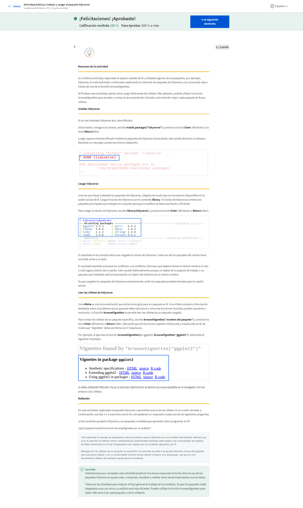
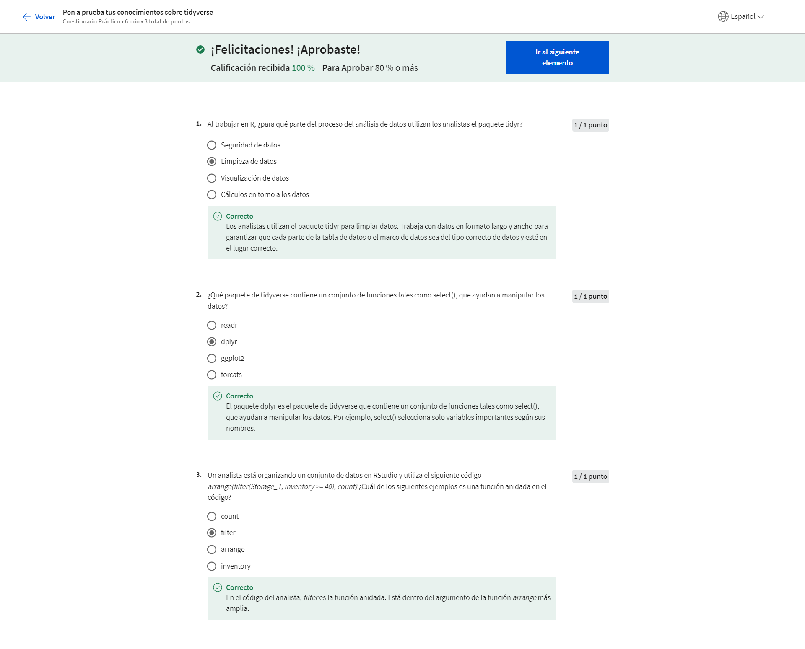

# Análisis de datos con programación en R

## Programación y análisis de datos

### El emocionante mundo de la programación

#### Introducción al emocionante mundo de la programación

¡Hola, profesional de los datos! Has recorrido un largo camino desde el comienzo de tu proceso de aprendizaje. Felicitaciones por tus logros. Piensa en todas las habilidades que aprendiste en tu camino. Ahora sabes cómo utilizar el pensamiento estructurado para definir un problema y hacer las preguntas correctas; trabajar con hojas de cálculo, bases de datos y herramientas como SQL para organizar y transformar los datos; limpiar tus datos para asegurarte de su integridad antes de analizarlos; crear elementos visuales para ilustrar puntos clave; y elaborar una historia convincente para comunicar las conclusiones a los interesados. Esa es una lista impresionante de habilidades, pero aún no terminamos. Tu conjunto de habilidades está a punto de crecer. En este curso, aprenderás sobre un concepto nuevo denominado programación y cómo puedes usar el lenguaje de programación R para analizar tus datos. Por ahora, sabes que el proceso de análisis de datos incluye seis etapas: preguntar, preparar, procesar, analizar, compartir y actuar. Ahora aprenderemos todo sobre el lenguaje de programación R y cómo puede ayudarte en cada etapa del proceso. Cuando termines, se te presentará un caso práctico opcional. Ese caso práctico te dará la oportunidad de resolver un problema de análisis de datos y poner en práctica todas las habilidades que aprendiste en el programa. Más adelante tendrás más información sobre ese proyecto. Hablemos sobre programación informática. La programación informática consiste en darle instrucciones a una computadora para que realice una acción o un conjunto de acciones. Puedes usar diferentes lenguajes de programación para escribir esas instrucciones. Podrías elegir un lenguaje específico según el proyecto que quieras llevar a cabo o el problema que quieras resolver. El lenguaje de programación R es muy útil para organizar, limpiar y analizar datos. Si esta es tu primera experiencia en programación informática, bienvenido. Cuando comencé a aprender sobre análisis de datos, tampoco tenía antecedentes en programación. De hecho, antes de enamorarme de los datos, había estudiado para ser cantante de ópera. También tengo un montón de amigos que se pasaron a este campo desde las artes y aprendieron sobre programación mucho más tarde en sus carreras. R es un excelente lugar para comenzar. Aprender R por primera vez puede ser desafiante e incluso más inspirador. Muchas de las habilidades que aprendiste en el programa te ayudarán a aprender los conceptos básicos de programación. Tómate tu tiempo y avanza a tu propio ritmo. Al igual que en los vídeos anteriores, comenzarás por lo básico y avanzarás a partir de allí. Ya te enfrentaste a desafíos difíciles y siempre triunfaste. Puedes hacerlo. Permíteme presentarme. Mi nombre es Carrie. Trabajo como directora de investigación de Google. Lidero un equipo que investiga la mejor manera de mejorar el rendimiento de las personas en las organizaciones. Es decir, ayudo a las personas a trabajar mejor y de manera más inteligente, y ayudo a las organizaciones a funcionar de manera más saludable y productiva. Aprendí R por primera vez cuando era analista de datos júnior, mientras estaba trabajando en un proyecto de varios años sobre trabajo virtual. Estábamos mirando datos sobre las experiencias de trabajo virtual de las personas y estábamos intentando comprender cómo trabajar de manera remota impacta en el rendimiento. Era un proyecto complejo con muchos datos para examinar. Siempre había problemas y yo buscaba la forma de hacer las cosas mejor y más rápido. Fue entonces cuando descubrí el poder de R. Cuando me atascaba, aprendía un poco más sobre R y descubría la solución a mi problema. Pronto entendí que R podía ayudarme a hacer casi cualquier cosa que involucrara datos mucho mejor y más rápido de lo que yo creía posible. Por suerte, hay muchos recursos excelentes en línea para R, así como una comunidad en línea muy solidaria. Cuando tenía una pregunta, me conectaba y encontraba la respuesta. A medida que el proyecto avanzaba, pude aprender cada vez más y convertirme en una analista de datos mucho más efectiva. Incluso mis compañeros de equipo comenzaron a pedirme consejos sobre R. Darme cuenta de que podía continuar aprendiendo mis habilidades en cualquier etapa de mi carrera fue una experiencia motivadora. Aprender R desbloqueó mi capacidad para analizar datos al máximo nivel. En tu futura carrera como analista de datos, tendrás la oportunidad de seguir aprendiendo y creciendo de modo continuo. Para mí, ese sería uno de los aspectos más geniales del trabajo. Aprender R es una de las partes más gratificantes de ese proceso de crecimiento. Todavía sigo aprendiendo nuevas formas de usar R. Además, puedes aplicar esas habilidades en otros lenguajes de programación, por ejemplo, Python, Julia o JavaScript. No hay límites respecto a qué tan lejos puedes llegar con la programación. Incluso va más allá del análisis de datos. Después de aprender R, comencé a pensar en todos los tipos de proyectos para los que podría usar la programación, tanto en el trabajo como por diversión. Te abre un nuevo mundo de posibilidades. Ahora hablemos sobre lo que vas a aprender. Comenzaremos con una introducción a los lenguajes de programación. Luego, analizaremos R más en detalle y exploraremos sus características y funciones principales. También veremos algunos conceptos básicos de programación y aprenderemos a utilizarlos de manera efectiva en R. A continuación, aprenderemos a trabajar con los datos en R. Descubrirás cómo R puede revolucionar tus habilidades de análisis de datos y permitirte limpiar, transformar, visualizar e informar tus datos de maneras nuevas y más poderosas. Aprender R te ayudará a llevar tu análisis de datos al siguiente nivel. También se verá muy bien en tu currículum. R está ampliamente reconocido como una credencial clave en puestos laborales de nivel básico. Saber cómo utilizar R te dará un gran impulso en tu búsqueda laboral y te ayudará a destacar como un analista nuevo. A continuación, hablaremos más sobre lenguajes de programación en general y cómo pueden ayudarte a analizar tus datos. Luego, pasaremos directamente a R. Y, antes de que te des cuenta, estarás usando R para impulsar tu análisis de datos.

#### Debate: R versus Python

<https://medium.com/analytics-and-data/r-vs-python-a-comprehensive-guide-for-data-professionals-321e8dead598>
<https://www.dataquest.io/blog/python-vs-r/>
<https://blog.rstudio.com/2019/12/17/r-vs-python-what-s-the-best-for-language-for-data-science/>
<https://www.coursera.org/learn/analisis-de-datos-con-programacion-en-r/supplement/y8zTf/formas-de-aprender-a-programar>

#### Registro de aprendizaje: ¿Estás preparado para explorar R?

#### Diviértete con R

¡Qué bueno volver a verte! Cuando comencé a aprender R, sus elementos visuales realmente me fascinaban. Todavía considero que es genial poder escribir un pequeño código, presionar un botón y listo, que aparezca una visualización de datos increíble. Antes de adentrarnos en los detalles, pensé que sería divertido que vieras un adelanto rápido de todo lo que R puede hacer. Lo que sigue será una vista previa de lo que aprenderás. Hacia el final de este curso, no solo comprenderás todo el código, sino que también podrás escribirlo y ejecutarlo. Por ahora, siéntate, relájate y disfruta del espectáculo. Comencemos por cargar una biblioteca y obtener un conjunto de datos para trabajar. Podemos utilizar el conjunto de datos de los pingüinos de Palmer, que incluye las mediciones de los tamaños de tres especies de pingüinos que viven en el archipiélago Palmer en la Antártida. Incluye datos sobre cuestiones como la masa corporal y la longitud de las aletas y del pico. Ese conjunto de datos tiene 344 filas de información ordenadas en ocho columnas. Los datos de los pingüinos de Palmer son populares entre los analistas y son geniales para explorar, visualizar y ver conceptos de enseñanza de manera divertida. Veremos más sobre este conjunto de datos más adelante en el curso. Digamos que queremos visualizar la relación entre la masa corporal y la longitud de las aletas. Quizás adivines que cuanto más grande es el pingüino, más largas son las aletas. Podemos comprobarlo si creamos un diagrama. Hagamos un diagrama de dispersión. Un diagrama de dispersión utiliza puntos para mostrar la relación entre dos variables. Entonces, las dos variables iban a comparar la masa corporal y la longitud de las aletas. No necesitas memorizar todos estos detalles en este momento. Más adelante tendrás tiempo de aprenderlos en más detalle.
Reproduce el video desde :1:54 y sigue la transcripción1:54
Echemos un vistazo a las partes de este código y a cómo se ajustan. La primera función comienza el diagrama. Si ejecutamos el código en este punto, lo único que obtendremos será un diagrama en blanco.
Reproduce el video desde :2:9 y sigue la transcripción2:09
Si agregamos una parte más del código, R pondrá etiquetas en cada acceso de nuestro diagrama y agregará líneas para los datos. La masa corporal está en el eje Y y la longitud de las aletas en el eje X, pero los puntos de datos aún no son visibles.
Reproduce el video desde :2:26 y sigue la transcripción2:26
Para obtener el diagrama completo, podemos agregar otra parte del código que le diga a R cómo representar nuestros datos. Por ejemplo, podríamos usar puntos, barras o líneas. Utilizaremos puntos para crear un diagrama de dispersión.
Reproduce el video desde :2:42 y sigue la transcripción2:42
Podemos avanzar más. Por ejemplo, podemos cambiar la forma en que se ve el diagrama. Cambiemos el color de todos los puntos a púrpura. Puedes presionar la flecha hacia arriba para buscar la última pieza del código que ejecutaste, así que haremos eso ahora. Y, luego, agregaremos color igual púrpura dentro de la función <i>geom point</i>. Ahora podemos presionar Enter para ejecutar el código.
Reproduce el video desde :3:16 y sigue la transcripción3:16
También podemos agregar nueva información al diagrama y usar color para destacarla. Pidámosle a R que asigne un color diferente a cada especie de pingüino. De esa forma, podemos vincular los puntos de datos con cada grupo de pingüinos.
Reproduce el video desde :3:34 y sigue la transcripción3:34
Los Papúa son los más grandes. La leyenda que se encuentra a la derecha del gráfico nos muestra que los puntos azules se refieren a los pingüinos de Papúa. R crea automáticamente una leyenda para el diagrama con el fin de ayudarnos a comprender el código de colores. R hace todo lo que le pides e, incluso, otras cosas que no le pediste. Es muy útil. También podemos usar formas para resaltar las diferentes especies de pingüinos.
Reproduce el video desde :4:7 y sigue la transcripción4:07
O podemos usar colores y formas.
Reproduce el video desde :4:16 y sigue la transcripción4:16
Además, para resaltar nuestros datos, también podemos reorganizarlos. Podemos desglosar nuestros datos en grupos más pequeños o en subconjuntos y crear un gráfico para cada subconjunto. Supongamos que queremos enfocarnos en los datos para cada especie. Las funciones de facetas nos permiten crear un diagrama separado para cada especie. Mira esto. Las facetas son geniales. Incluso podemos escribir texto en nuestro gráfico para señalar datos específicos o comunicar un mensaje. Pongámosle un título a nuestro gráfico para indicar su propósito con claridad.
Reproduce el video desde :4:56 y sigue la transcripción4:56
Por último, podemos guardar nuestro gráfico para que podamos acceder a él o compartirlo más adelante.
Reproduce el video desde :5:6 y sigue la transcripción5:06
Ahora, si hacemos clic en la pestaña Archivos, encontraremos nuestro archivo en la lista.
Reproduce el video desde :5:13 y sigue la transcripción5:13
Abrámoslo.
Reproduce el video desde :5:17 y sigue la transcripción5:17
Bueno, aquí finalizó el espectáculo. Espero que lo hayas disfrutado tanto como yo. Pudimos tomar un conjunto de datos grande y visualizar algunos patrones significativos de manera rápida. Esas son algunas de las funciones básicas en R. Es decir, es solo el comienzo. Es emocionante pensar en todas las formas en las que R puede ayudarte a descubrir todo el poder del análisis de datos. A medida que avanzas, aprenderás más sobre cada una de las funciones que usamos para crear nuestros diagramas. Al final de este curso, tú serás quien escriba y ejecute todos estos códigos. A continuación, aprenderemos un poco más sobre programación informática y cómo puede ayudarte a analizar tus datos. Nos vemos pronto.

#### Carrie: Primeros pasos con R

El consejo que le daría a alguien que está aprendiendo R es que los errores son parte del proceso. Los errores y los mensajes de error son parte del proceso. Cuando pienso en las personas que son mejores que yo en R, pude darme cuenta de que no son necesariamente más inteligentes que yo, pero es probable que sean un poco más persistentes y que profundicen más en los temas. Desde luego, en comparación a cuando comencé; al principio veía un mensaje de error y pensaba: "Lo hice mal, listo, se acabó el juego". Ahora pienso: "Eso solo es parte del juego". Cuando comencé a exponerme un poco más a cómo se veía R, pensaba: "Se ve demasiado sofisticado. Si se ve así posiblemente sea muy difícil". Pero las personas que conocía y que lo utilizaban siempre eran muy entusiastas cuando hablaban de él y sentían que tenía muchas más ventajas que otro software que puedes utilizar para ejecutar análisis. Durante mucho tiempo antes de que utilizara R, solía usar hojas de cálculo o alguna otra herramienta, e intentaba hacerle modificaciones para lograr lo que necesitaba. A veces, usaba muchas herramientas porque una sola no podía hacer todo lo que yo quería que hiciera. Pero sentía que ya sabía cómo ejecutarlo y, no obstante, no tenía la suficiente fluidez. Cuanto más tiempo me expuse a R, más me di cuenta de todo lo que podría hacer de esa manera; puedo resolver todo con un solo programa que puede realizar interbloqueos con mucha fluidez. Al principio, no tenía demasiada confianza. Tuve un par de <i>scripts</i> donde algunos amigos eran mejores en R, personas con las que trabajaba, y que se sentaban y me ayudaban a avanzar y entender el código, y me sentía muy tonta si les hacía preguntas básicas del estilo "¿Por qué hay un corchete allí?" o "¿Por qué hacemos esto?". Pero, por suerte, tuvieron mucha paciencia conmigo. En algún momento, todo el departamento dijo que todos necesitábamos utilizar esta herramienta porque debíamos estar en la misma plataforma. Necesitamos coherencia en nuestros análisis. También necesitamos poder revisar en conjunto los análisis de los otros. Así que todos juntos tomamos un curso en línea y eso me ayudó a ganar mucha más confianza, porque estaba recorriendo paso a paso todo lo que necesitaba aprender, tenía una oportunidad para practicar y, luego, dije: "De acuerdo, incluso si hay cosas que no sé, ya he logrado pasar la introducción, y luego logré pasar el siguiente módulo, así que algo sé". Después, cuando empecé a utilizarlo en mi trabajo, todavía había situaciones en las que pensaba: "Un momento, no sé cómo resolver este problema". Y luego hablaba con un amigo, buscaba algo en Google y, en general, sabía mucho más de lo que pensaba que sabía, y así, de repente, desbloqueé mi capacidad para hacer un montón de análisis de manera rápida con un gran conjunto de datos, y también para realizar muchas visualizaciones de datos realmente rápido con ggplot2. Hola, mi nombre es Carrie y soy Directora de investigación en Operaciones de personal en Google.

#### Cuadro de aviso de la discusión: Queremos conocerte

En este curso, aprenderás a usar R para revolucionar tu análisis de datos. Estás por embarcarte en una experiencia de aprendizaje emocionante y gratificante. 

Escribe 2 o 3 oraciones (entre 20 y 60 palabras) para contactarte con otros estudiantes, compartir ideas y presentarte si eres nuevo en el curso. Puedes crear tu propia respuesta de cero o usar las siguientes preguntas como disparadores:

¿Cuál es tu experiencia profesional?

¿Qué te impulsó a inscribirte en este curso?

Luego, agrega entre 3 y 5 oraciones (entre 60 y 100 palabras en total) para compartir lo que piensas sobre la programación. Puedes crear tu propia respuesta de cero o usar las siguientes preguntas como disparadores:

Experiencia en programación:

¿Con qué lenguajes de programación trabajaste?

¿En qué proyectos personales o profesionales usaste la programación?

¿Qué es lo que más disfrutas de programar?

Si es tu primera experiencia programando, ¿qué sientes respecto de aprender a programar usando R? ¿Emoción, nervios, ambos? 

### Programar como analista de datos

#### Lenguajes de programación

Hola. Es genial tenerte de vuelta. Anteriormente, aprendiste que programar significa darle instrucciones a una computadora para que realice una acción o un conjunto de acciones. Incluso si esta es tu primera vez programando, ya tienes mucha experiencia diciéndole a una computadora qué hacer. Por ejemplo, quizás usaste una función de la hoja de cálculo para ordenar tus datos o realizar cálculos, o quizás utilizaste SQL para decirle a una computadora cómo extraer datos de una base de datos o unir dos tablas de datos diferentes. La programación va todavía más lejos. Tienes el mayor nivel de control sobre tus datos. SQL te permite comunicarte con bases de datos, pero un lenguaje de programación de uso general te permite crear tus propias aplicaciones y construir tus propias funciones desde cero. Para programar, primero necesitas conocer un lenguaje de programación. En este vídeo, aprenderemos los conceptos básicos sobre los lenguajes de programación y cómo pueden ayudarte a trabajar con tus datos. Los lenguajes de programación son las palabras y los símbolos que utilizamos para escribir instrucciones para que sigan las computadoras. Piensa en un lenguaje de programación como si fuera un puente que conecta a los humanos con las computadoras, y que les permite comunicarse. Los lenguajes de programación tienen su propio conjunto de reglas sobre cómo deben usarse esas palabras y esos símbolos, y se llama sintaxis. La sintaxis te muestra cómo organizar las palabras y los símbolos que ingreses para que tengan sentido para la computadora. Codificar es escribir instrucciones para la computadora utilizando la sintaxis de un lenguaje de programación específico. Así como hay varios lenguajes humanos en el mundo, hay muchos lenguajes de programación diferentes que están disponibles para comunicarse con las computadoras. Hay un lenguaje para casi cualquier cosa que quieras hacer, desde diseñar sitios web o desarrollar videojuegos, hasta trabajar con datos. Por ejemplo, Python es un lenguaje de uso general que sirve para todo tipo de cosas, desde trabajar con inteligencia artificial hasta crear experiencias de realidad virtual. Javascript funciona bien para desarrollar aplicaciones en línea y es una parte esencial de los navegadores web. Otros lenguajes de programación populares para el análisis de datos son SAS, Scala y Julia. A nivel personal, R es mi lenguaje preferido para el análisis de datos, pero es posible que quieras también explorar otros lenguajes. Aunque los lenguajes de programación puedan verse diferentes a primera vista, todos comparten estructuras y conceptos de codificación similares. Una vez que hayas aprendido tu primer lenguaje, te será más fácil aprender otros. A continuación, veremos todas las capacidades de R. Antes de pasar a eso, hablemos sobre algunos beneficios de utilizar cualquier lenguaje de programación para trabajar con datos. Destacaré tres. La programación te ayuda a aclarar los pasos de tu análisis, a ahorrar tiempo y te permite reproducir y compartir tu trabajo con facilidad. Empecemos con la claridad. Los lenguajes de programación tienen reglas y pautas específicas para dar instrucciones a una computadora. Cuando le indicas a una computadora qué hacer, tus instrucciones tienen que ser muy claras. No puede haber ninguna incoherencia en la forma en que escribes el código. Si la hay, el código no funcionará. Traducir tus pensamientos en códigos te obliga a determinar exactamente cómo escribir cada paso de tu análisis y cómo hacer para que los pasos encajen. Le da a tu análisis un nivel de precisión que lo hace realmente poderoso. Utilizar un lenguaje de programación para analizar datos también te ahorra un montón de tiempo. Por ejemplo, tomemos el proceso de limpieza y transformación de datos. Con una línea de código puedes crear un conjunto de datos separado sin perder ningún valor. Con otra línea, puedes aplicar varios filtros a tus datos. Eso te permite emplear menos tiempo para preparar tus datos y más tiempo para el análisis en sí. Por último, los lenguajes de programación facilitan la reproducción de tus análisis. El análisis de datos es más útil cuando puedes reproducir tu trabajo y compartirlo con otras personas. Ellas pueden volver a revisarlo y ayudarte a resolver problemas. El código almacena automáticamente todos los pasos de tu análisis para que puedas reproducirlo y compartir tu trabajo en cualquier momento a futuro, ya sean semanas, meses o incluso años después. Aquí hay un ejemplo. Supongamos que estás trabajando en un proyecto. Ya recopilaste y limpiaste tus datos y comenzaste con el análisis, pero los resultados no se suman. Sospechas que hubo un error durante el proceso. Te gustaría hablar sobre el problema con un compañero de equipo y escuchar sus comentarios. Si utilizaste una hoja de cálculo, es posible que ambos tengan que rehacer todo el análisis para descubrir el error. No hay una forma fácil de registrar y reproducir tus pasos en una hoja de cálculo; pero si utilizas un lenguaje de programación, puedes reproducir y compartir todo tu trabajo en un momento, desde la carga de datos y la elaboración de visualizaciones, hasta la creación de los informes con los resultados. Además, puedes actualizar tu análisis con facilidad y arreglar cualquier error fácilmente al cambiar el código. Espero que eso te permita comprender mejor de qué se tratan los lenguajes de programación. A continuación, vamos a centrarnos detalladamente en R. Nos vemos pronto.

#### Formas de aprender a programar

https://learner.coursera.help/hc/es
https://www.r-project.org/
https://cran.r-project.org/manuals.html
https://ourcodingclub.github.io/tutorials.html
https://cran.r-project.org/doc/contrib/Paradis-rdebuts_en.pdf
https://www.python.org/about/gettingstarted/
https://docs.python.org/3/tutorial/
https://www.tutorialrepublic.com/html-tutorial/
https://www.wpkube.com/html5-cheat-sheet/
https://www.edx.org/course/html5-and-css-fundamentals
https://htmlcheatsheet.com/css/
https://sharethis.com/best-practices/2020/02/best-html-and-css-cheat-sheets/
https://swift.org/about/
https://developer.apple.com/swift/
https://developer.apple.com/swift/resources/
https://www.androidauthority.com/develop-android-apps-languages-learn-391008/
https://developer.android.com/studio
https://developer.android.com/codelabs/build-your-first-android-app#1
https://www.androidauthority.com/java-tutorial-for-beginners-write-a-simple-app-with-no-previous-experience-1121975/
https://dotnet.microsoft.com/learn/csharp
https://dotnet.microsoft.com/learn/xamarin
https://dotnet.microsoft.com/learn/xamarin/hello-world-tutorial/intro
https://www.codecademy.com/learn/learn-c-sharp
https://docs.oracle.com/javase/tutorial/
https://www.homeandlearn.co.uk/java/java.html
http://ruby-doc.org/
http://www.ruby-lang.org/en/documentation/
http://ruby-doc.com/docs/ProgrammingRuby/
https://www.codecademy.com/learn/learn-ruby
https://www.php.net/
https://phptherightway.com/
https://www.learn-php.org/
https://docs.microsoft.com/en-us/cpp/?view=msvc-160
https://docs.microsoft.com/en-us/samples/browse/?languages=cpp&terms=gaming
<https://www.learn-cpp.org/>

#### De las hojas de cálculo a SQL y, luego, a R

#### Autorreflexión: Haz una pregunta

#### Introducción a R

Hola de nuevo. Ahora que ya hemos hablado sobre lenguajes de programación en general, vamos a conocer R. ¿Qué es R? R es un lenguaje de programación que se usa con frecuencia para análisis estadísticos, visualización y análisis de datos. Más adelante, realizarás un recorrido por RStudio, que es un entorno de software popular para el lenguaje R. En este vídeo, analizaremos las características y las funciones principales de R, y sus ventajas para el análisis de datos. R es genial. Me alegra que vayas a conocerlo. R está basado en otro lenguaje de programación denominado S. En la década de 1970, John Chambers creó S para uso interno en Bell Labs, una famosa planta de investigación científica. En la década de 1990, Ross Oaxaca y Robert Gentleman desarrollaron R en la Universidad de Auckland, Nueva Zelanda. Lo llamaron R porque con esa letra empiezan los nombres de sus dos autores y para jugar con el nombre de una sola letra, como el de su predecesor, S. A partir de entonces, R se ha convertido en el lenguaje de programación preferido de los científicos, los estadísticos y los analistas de datos en todo el mundo. Hay muchas razones por las que las personas que trabajan con datos aman R. Quiero compartir cuatro de ellas contigo. R es accesible, está centrado en los datos, es de código abierto y tiene una comunidad activa de usuarios. En primer lugar, R es un lenguaje accesible para principiantes. Muchas personas que no tienen un lenguaje de programación específico aprenden R. Yo debería saberlo. Soy una de ellas. R realmente atrae a cualquiera que quiera resolver problemas relacionados con los datos. Y ese es uno de los aspectos tan geniales sobre R. Todo se relaciona con los datos. R es lo que se conoce como un lenguaje de programación centrado en los datos. Se diseñó específicamente para facilitar el análisis de datos, y hacerlo más eficiente y más poderoso. Otro aspecto increíble de R es que es de código abierto. Eso significa que el código está libremente disponible y puede ser modificado y compartido por las personas que lo usan. Hagamos una pausa y veamos lo increíble que es esto. En primer lugar, cualquiera puede usar R gratis. En segundo lugar, cualquiera puede modificar el código, arreglar errores y mejorarlo. De hecho, con el correr de los años, muchos programadores excelentes hicieron mejoras y arreglos al código de R. Por ejemplo, cualquiera que conozca el lenguaje R puede crear lo que se conoce como paquete complementario. Más adelante, profundizaremos en los paquetes de R. Por ahora, solo debes saber que literalmente existen cientos de paquetes de R, y todos fueron creados por personas que querían resolver problemas específicos. Muchos de esos paquetes son muy útiles para los analistas de datos. Como usuario de R, ahora disfrutas el beneficio del conocimiento compartido. Y déjame agregar que la comunidad de R es la mejor. Esa comunidad dinámica, diversa y accesible es muy solidaria con los nuevos estudiantes. Puedes conectarte en cualquier momento para buscar respuestas a todas tus preguntas relacionadas con R. Visita sitios web como R for Data Science Online Learning Community y RStudio Community. Además de eso, los usuarios de R están en Twitter y en otras redes sociales. Descubrirás muchos recursos para hacer contactos profesionales, asesorar y aprender. Ahora que sabemos más sobre los beneficios generales de R, hablemos de algunas situaciones específicas en las que podrías utilizarlo para el análisis de datos. Aquí tenemos tres escenarios: reproducir tu análisis, procesar muchos datos y crear visualizaciones de datos. En primer lugar, R puede guardar y reproducir cada paso de tu análisis. Antes vimos que el análisis de datos es más útil cuando puedes reproducir tu trabajo con facilidad y compartirlo con otros. En R, reproducir tu análisis es tan fácil como presionar un botón en tu teclado. Tu código lo guarda para siempre. Y puedes compartirlo con cualquiera en cualquier momento. Procesar muchos datos también es algo que R hace muy bien, al igual que SQL. Como ya aprendiste antes, las hojas de cálculo organizan proyectos en hojas o pestañas. Si alguna vez tuviste que lidiar con archivos en hojas de cálculo que tienen muchas hojas o muchos datos en cada hoja, sabes que las cosas pueden comenzar a funcionar muy lentamente. Trabajar con muchos datos en una hoja de cálculo incluso puede causar colapsos. R puede manejar muchas cantidades de datos de manera más rápida y eficiente. Por último, R puede crear elementos visuales poderosos y tiene capacidades gráficas de última generación. Como has visto en este programa, las herramientas como las hojas de cálculo y Tableau ofrecen muchas opciones para visualizar tus datos. R está a otro nivel. Con solo un código breve puedes crear histogramas, diagramas de dispersión, diagramas de línea y mucho más. Y ese es solo el comienzo. Si trabajas con paquetes más avanzados, puedes realizar visualizaciones de datos realmente impresionantes. Aprender R es un gran beneficio para cualquiera que esté interesado en convertirse en analista de datos. Como mencioné anteriormente, saber R te ayudará a resaltar como candidato para un trabajo. A medida que sigas avanzando, R te ayudará a encontrar soluciones para problemas más complejos relacionados con datos. Puedes seguir aprendiendo sobre R a lo largo de tu carrera profesional como analista de datos. No hay límites cuando se trata de desarrollar tus habilidades de análisis de datos. Eso es todo por ahora. A continuación, veremos el entorno de RStudio juntos. Antes de utilizar RStudio, tienes que descargar e instalar la interfaz básica de R. Aprenderás cómo hacerlo en una próxima lectura. La mayoría de los analistas que trabajan con lenguaje R utilizan el entorno RStudio para interactuar con R, y no la interfaz básica. Por eso, nos estamos enfocando en RStudio en este programa. A continuación de este vídeo, encontrarás los recursos para descargar R y RStudio en caso de que estés interesado en aprender más. Hasta pronto.

#### Actividad práctica Descargar e instalar R

https://learner.coursera.help/hc/es
https://blog.sellorm.com/2018/12/20/installing-r-and-rstudio-on-a-chromebook/
https://cran.r-project.org/mirrors.html

#### Actividad práctica La consola de R

#### Pon a prueba tu conocimiento sobre lenguajes de programación

### Aprende programación en RStudio

#### Introducción a RStudio

¡Hola! Es hora de hacer el recorrido por RStudio. Los ejemplos que veremos son de RStudio Cloud, pero RStudio funciona de manera similar en todas las plataformas. Así que siéntete libre de usar la plataforma con la que estés más cómodo. Más adelante, si quieres aprender más, encontrarás los recursos para descargar e instalar RStudio en tu dispositivo. RStudio es un IDE o entorno de desarrollo integrado. Eso significa que RStudio reúne todas las herramientas que podrías querer usar en un solo lugar. La consola de R que vimos anteriormente forma parte de este entorno. RStudio también incluye un editor para escribir códigos y herramientas para gestionar tus datos y crear elementos visuales. RStudio se creó específicamente para utilizarse con R. Te ayudará a maximizar tu productividad como analista de datos. Analizar datos es como conducir un automóvil. Puedes imaginar que R y RStudio son partes diferentes del automóvil. R sería el motor. RStudio sería el acelerador, el volante y el tablero, todo en uno. Te permite decirle al motor qué hacer y te ayuda a llegar al lugar que quieres. Así como un velocímetro y un sistema de navegación facilitan la conducción, el entorno de RStudio facilita el uso de R. En una lectura anterior aprendiste a acceder a RStudio. Así que iniciemos sesión en RStudio y exploremos. El entorno de RStudio tiene cuatro ventanas principales denominadas paneles. Cada panel te ayuda a realizar distintas funciones. La primera vez que abres RStudio verás tres paneles. El cuarto panel está oculto por defecto, pero puedes abrirlo con facilidad. Solo haz clic en Archivo, dentro de menú, y luego selecciona Archivo Nuevo y R Script. RStudio tiene muchos atajos de teclado. Para aprender más, echa un vistazo a Ayuda de atajos de teclado.
Reproduce el video desde :2:11 y sigue la transcripción2:11
Puedes hacer que los paneles se vean más pequeños o más grandes si haces clic en los botones para minimizar o maximizar que se encuentran en la parte superior derecha de cada panel.
Reproduce el video desde :2:20 y sigue la transcripción2:20
También puedes hacer clic y arrastrar los bordes de los paneles para ajustar sus tamaños.
Reproduce el video desde :2:26 y sigue la transcripción2:26
Haz clic en el botón Paneles para ver más opciones de funciones.
Reproduce el video desde :2:33 y sigue la transcripción2:33
Ahora que tenemos los cuatro paneles abiertos exploremos cada uno de ellos. Comenzaremos en la esquina inferior izquierda y nos moveremos en el sentido de las agujas del reloj. Quizás reconozcas la consola de R de una lectura anterior. Para repasar rápidamente, la consola es el lugar desde donde le das órdenes a R. Por ejemplo, podemos pedirle a R que nos muestre un resumen de los datos de los pingüinos que utilizamos en un vídeo anterior para crear elementos visuales. Tendrás que instalar y cargar el conjunto de datos de los pingüinos de Palmer si todavía no lo has hecho.
Reproduce el video desde :3:16 y sigue la transcripción3:16
Arriba de la consola, en la parte superior izquierda, se encuentra el panel de editor de código fuente. Utilizarás el editor de código fuente cuando trabajes con R Scripts. Hay dos maneras principales de escribir códigos en RStudio: utilizando la consola o utilizando el editor de código fuente. Puedes escribir comandos directamente en la consola, pero desaparecerán cuando cierres la sesión en curso. Como hemos comentado, es importante poder reproducir y compartir todos los pasos de tu análisis. Si guardas tu script en el editor, puedes volver a acceder a tu trabajo en cualquier momento y mostrar a otros cómo lo hiciste.
Reproduce el video desde :3:53 y sigue la transcripción3:53
El editor de código fuente y la consola también trabajan en conjunto en RStudio. Cuando ejecutas el código en el editor, el código automáticamente aparece en la consola. Si estás trabajando en un análisis largo, eso facilita la ejecución de todo el código al mismo tiempo o de algunas secciones específicas a medida que avanzas. Ejecutemos una parte del código en el editor para verificarlo.
Reproduce el video desde :4:25 y sigue la transcripción4:25
Consejo profesional: Recuerda que R distingue mayúsculas y minúsculas. Aquí utilizamos una V mayúscula para la función View.
Reproduce el video desde :4:36 y sigue la transcripción4:36
Luego, vamos al panel Entorno, en la parte superior derecha. Aquí encontrarás todos los datos que has cargado en este momento y podrás organizarlos y guardarlos. Por ejemplo, si importas datos de una hoja de cálculo, estará visible en el panel Entorno. Puedes ver cada objeto en el panel Entorno si haces clic sobre él. También puedes alternar entre una vista de Lista y una vista de Cuadrícula.
Reproduce el video desde :5:7 y sigue la transcripción5:07
A la derecha de la pestaña Entorno encontrarás la pestaña Historial. Todos tus comandos anteriores están guardados aquí, y es fácil encontrarlos y volver a ejecutarlos. Encontrarás la línea de código más reciente al final de la lista. Puedes copiar cualquier línea a la consola de comando si haces doble clic sobre ella. En la parte inferior derecha, verás un panel que tiene las pestañas Archivos, Diagramas, Paquetes y Ayuda. La pestaña Archivos te permite acceder a tu directorio de archivos y muestra los contenidos de la carpeta de trabajo en uso. Puedes encontrar y gestionar todos tus archivos con facilidad y crear nuevas carpetas de proyectos. Luego está la pestaña de Diagramas. Si creamos un diagrama, los resultados aparecen aquí. Por ejemplo, podemos crear un diagrama de dispersión con el conjunto de datos de los pingüinos que usamos antes.
Reproduce el video desde :6:18 y sigue la transcripción6:18
Más adelante aprenderás más sobre cómo crear diagramas en RStudio. Anteriormente hablamos sobre los paquetes de R, que son soluciones personalizadas a problemas de datos que tuvieron los usuarios de R. RStudio te permite acceder a la biblioteca de los paquetes de R, conocida como Tidyverse. Puedes actualizar, instalar y gestionar tu biblioteca desde el panel Paquetes. Los paquetes cargados en tu sesión actual tienen marcas de verificación. Más adelante, exploraremos el paquete tidyverse en más detalle. Por último, haz clic en la pestaña Ayuda. Aquí puedes encontrar recursos útiles para R y RStudio. Hay muchos recursos allí que te ayudarán a responder todas tus preguntas. Asegúrate de aprovecharlos. Ese fue nuestro recorrido por RStudio. Pero este es solo el comienzo de lo que RStudio puede hacer. Pronto explorarás RStudio en más detalle. Hablando como profesional de los datos, me encanta trabajar en RStudio. Hace que mi trabajo sea mucho más fácil, más rápido y mejor. Felicitaciones por finalizar otro paso en tu proceso de aprendizaje para convertirte en un analista de datos. A continuación, veremos algunos conceptos básicos de programación. Luego, empezaremos a trabajar con R. Para aquellos que son nuevos en programación, están a punto de escribir sus primeras líneas de código. Nos vemos pronto.

#### Actividad práctica: Acceso a RStudio en la nube

<https://rstudio.cloud/plans/free>

#### Actividad práctica Primeros pasos en RStudio Desktop

https://rstudio.com/
https://cran.rstudio.com/
https://rstudio.com/products/rstudio/download/#download
https://rdrr.io/r/base/library.html
https://lubridate.tidyverse.org/

#### Cuándo usar RStudio

https://learner.coursera.help/hc/es
https://www.theanalysisfactor.com/the-advantages-of-rstudio/
https://lgatto.github.io/2017_11_09_Rcourse_Jena/before-we-start.html

#### Cuadro de aviso de la discusión: R&R...Studio

RStudio es un entorno de desarrollo integrado (IDE) específicamente diseñado para usar con el lenguaje de programación R. RStudio te ofrece un espacio de trabajo individual para usar R en todas las etapas del proceso de análisis de datos. En este curso, aprenderás más sobre RStudio y lo que puede hacer. 

Por ahora, envía una respuesta escrita de dos o más párrafos (entre 150 y 200 palabras) que describan tus primeras impresiones sobre RStudio. Responde las preguntas siguientes:

¿Cómo crees que RStudio puede ayudarte a futuro en tu rol como analista de datos?

¿Cuáles son tus funciones favoritas de RStudio?

Si estás dando tus primeros pasos con R y RStudio, ¿qué funciones crees que serán las más útiles para ti como principiante? 

#### Conectarte con otros analistas de datos en la comunidad R

https://learner.coursera.help/hc/es
https://community.rstudio.com/
https://www.reddit.com/r/Rlanguage/
https://discuss.ropensci.org/
https://www.rfordatasci.com/
https://twitter.com/hashtag/rstats?lang=en
https://www.meetup.com/topics/data-analytics/
https://jumpingrivers.github.io/meetingsR/r-user-groups.html
https://www.meetup.com/pro/rladies

#### Pon a prueba tu conocimiento sobre programación con RStudio

### Desafío semanal 1

#### Cuestionario: Desafío semanal 1 curso 7

## Programar con RStudio

### Comprender los conceptos básicos de programación

#### Programar con R-Studio

Hola y bienvenido nuevamente. Te dimos una descripción general de R y RStudio. Ahora nos enfocaremos en la programación y codificación real que harás usando RStudio. Llegué muy lejos en mi profesión sin saber nada de programación antes de darme cuenta de que necesitaba aprender sobre eso. Conocer R fue una experiencia de aprendizaje valiosa. Tomó algo de tiempo, y acudí a los usuarios de R más experimentados con muchas preguntas. Finalmente, todo confluyó a mi favor. Estar abierto a aprender nuevas destrezas es una parte muy importante de tu carrera profesional. Ahora también puedo ayudarte a aprender algunas nuevas destrezas. Comenzaré por compartir los fundamentos de la programación usando R y RStudio. Anteriormente, explicamos cómo R es como el motor de un automóvil y RStudio es como el acelerador, el volante y el tablero todo en uno. Conocer los fundamentos te ayudará a mantener tu automóvil R funcionando sin problemas. Estos fundamentos se parecen y, a la vez, difieren de las otras plataformas de análisis que conociste bien: hojas de cálculo y SQL. Luego pasaremos a la codificación en RStudio. Hablaremos sobre la sintaxis para hacer cálculos, además de los estándares y las convenciones de nomenclatura para todo código. También exploraremos la herramienta R conocida como una canalización, que usaremos para hacer una secuencia de código que sea más fácil para trabajar y de leer. Luego, analizaremos los paquetes en R. Si bien no recibirás estos paquetes directamente en la puerta de tu casa, son entregados por la comunidad R. Estos paquetes contienen funciones reutilizables y más, y generalmente son creados por usuarios para usuarios como tú. Conoceremos un conjunto de paquetes llamados Tidyverse. Aprenderás cómo instalar Tidyverse para que puedas comenzar a usarlo en RStudio. También trabajaremos con algunos de los paquetes Tidyverse más populares como ggplot2 para visualización. Podrás poner en práctica lo que aprendiste sobre RStudio en la próxima parte del programa, donde empezarás a trabajar con datos. Como explicamos antes, en este programa, usaremos la versión en el navegador de RStudio: RStudio Cloud. Pero RStudio también está disponible para descarga. Manos a la obra. Nos vemos pronto.

#### Conceptos fundamentales de programación

¡Hola! Cada vez que aprendas una nueva habilidad, ya sea desde cocinar hasta conducir o bailar, deberías siempre empezar por los fundamentos. Programar en R no es diferente. Para sentar esta base, debes familiarizarte con los conceptos básicos de R, entre ellos, funciones, comentarios, variables, tipos de datos, vectores y canalizaciones. Algunos de estos términos podrían sonar familiares. Por ejemplo, nos encontramos con funciones en hojas de cálculo y SQL. Para repasar rápidamente, las funciones son un cuerpo de código reutilizable para realizar tareas específicas en R. Las funciones comienzan con nombres de funciones como <i>print</i> o <i>paste</i> y, por lo general, van seguidos de uno o más argumentos entre paréntesis. Un argumento es información que una función en R necesita para ejecutarse. Esta es una función simple en acción. Siéntete libre de unirte e inténtalo en RStudio usando tu cuenta en la nube. Echa un vistazo a la lectura para más detalles sobre cómo empezar.
Reproduce el video desde :1:10 y sigue la transcripción1:10
Puedes poner en pausa el vídeo cada vez que lo necesites. Abriremos RStudio Cloud para empezar. Iniciaremos nuestra función en la consola con <i>print</i> como nombre de la función. Este nombre de la función mostrará lo que sea que incluyamos en los valores entre paréntesis. Escribiremos un paréntesis de apertura seguido de una comilla. Tanto el paréntesis de cierre como la comilla de cierre emergen automáticamente porque RStudio reconoce esta sintaxis. Ahora tenemos que agregar la siguiente cadena de texto. Escribiremos "Coding in R".
Reproduce el video desde :1:45 y sigue la transcripción1:45
Luego presionaremos Enter.
Reproduce el video desde :1:48 y sigue la transcripción1:48
¡Éxito! El código muestra las palabras "Coding in R". Si deseas descubrir más sobre la función <i>print</i> o cualquier función, todo lo que tienes que hacer es escribir un signo de pregunta, el nombre de la función y un paréntesis de apertura y otro de cierre.
Reproduce el video desde :2:5 y sigue la transcripción2:05
Esto muestra una página en la ventana Ayuda, que te ayuda a aprender más sobre las funciones con las que estás trabajando. Recuerda que las funciones distinguen mayúsculas y minúsculas, por lo tanto, al escribir <i>Print</i> con un P mayúscula se muestra un mensaje de error.
Reproduce el video desde :2:24 y sigue la transcripción2:24
Las funciones son geniales, pero escribir muchos valores puede llevar bastante tiempo. Para ahorrar tiempo, podemos usar variables para representar los valores. Esto nos permite señalar los valores cada vez que lo necesitemos con solo la variable. Anteriormente, aprendimos sobre las variables en SQL. Una variable es una representación de un valor en R que puede almacenarse para su uso posterior durante la programación. Las variables también pueden llamarse objetos. Como analista de datos, encontrarás que las variables son muy útiles en el momento de programar. Por ejemplo, si quieres filtrar un conjunto de datos, asigna una variable a la función que usaste para filtrar los datos. De esa manera, todo lo que tendrás que hacer es usar esa variable para filtrar los datos más tarde. Al nombrar una variable en R, puedes usar una frase corta. El nombre de una variable debe comenzar con una letra y también puede contener números y guiones bajos. Por lo tanto, la variable 5penguin no funcionaría bien porque empieza con un número. También, al igual que las funciones, los nombres de las variables distinguen mayúsculas y minúsculas. Usar todas letras minúsculas es una buena práctica cuando sea posible. Ahora, antes de codificar una variable, agreguemos un comentario. Los comentarios son útiles cuando quieres describir o explicar qué pasa en tu código. Úsalos tanto como sea posible para que tú y todos puedan comprender el razonamiento detrás del código. Los comentarios deben usarse para hacer un script de R más legible. Un comentario no debe tratarse como un código, por lo tanto, pondremos # por delante. Luego, agregaremos nuestro comentario. Este es un ejemplo de una variable.
Reproduce el video desde :4:16 y sigue la transcripción4:16
Ahora, sigamos con nuestro ejemplo. Tiene sentido usar un nombre de variable para conectar con lo que la variable está representando. Por lo tanto, escribiremos el nombre de la variable primera_variable.
Reproduce el video desde :4:30 y sigue la transcripción4:30
Luego, después del nombre de la variable, escribiremos un signo <, seguido de -.
Reproduce el video desde :4:36 y sigue la transcripción4:36
Esto es un operador de asignación. Asigna el valor a la variable. Parece una flecha, lo que tiene sentido, ya que señala desde el valor hacia la variable. Hay otros operadores de asignación que también funcionan, pero siempre es bueno usar solo un tipo en tu código. Luego, agregaremos el valor que nuestra variable representará. Usaremos el texto, "Esta es mi variable".
Reproduce el video desde :5:5 y sigue la transcripción5:05
Si escribimos la variable y presionamos Ejecutar, se ejecutará el valor que la variable representa. Esta es una manera muy básica de usar una variable. Pronto, aprenderás más maneras de usar variables en tu código. Por ahora, asignemos una variable a un tipo de datos diferentes, numérico. Nombraremos a esto segunda_variable, y escribiremos nuestro operador de asignación.
Reproduce el video desde :5:30 y sigue la transcripción5:30
Le daremos el valor numérico 12.5.
Reproduce el video desde :5:35 y sigue la transcripción5:35
El panel Entorno arriba, a la derecha, de nuestro espacio de trabajo ahora muestra nuestras dos variables y sus valores. Hay otros dos tipos de datos en R, por ejemplo, valores lógicos, fecha y hora y fecha. R tiene algunas opciones para tratar con estos tipos de datos. Más adelante las exploraremos. Con funciones, comentarios, variables y tipos de datos, tienes una buena base para trabajar con R. Los revisaremos a lo largo del programa, y te mostraremos cómo se usan de diferentes maneras durante el análisis. Finalizaremos con dos conceptos, vectores y canalizaciones fundamentales más. En pocas palabras, un vector es un grupo de elementos de datos del mismo tipo almacenados en una secuencia en R. Puedes crear un vector usando la función combinada. En R, esta función es solo la letra c seguida de los valores que quieres en tu vector dentro de los paréntesis. Muy bien, creemos un vector. Imagina que este vector es para datos de medición que necesitamos analizar. Empezaremos nuestro código con la variable vec_1 para asignar al vector.
Reproduce el video desde :6:52 y sigue la transcripción6:52
Luego, escribiremos c y el paréntesis de apertura.
Reproduce el video desde :6:57 y sigue la transcripción6:57
Luego, escribiremos nuestra lista de números separados por comas.
Reproduce el video desde :7:4 y sigue la transcripción7:04
Luego, cerraremos el paréntesis y presionamos Enter.
Reproduce el video desde :7:11 y sigue la transcripción7:11
Esta vez, cuando escribimos nuestra variable y presionamos Enter, muestra nuestro vector. Podemos usar este vector en cualquier lugar en nuestro análisis con solo su nombre de variable vec_1. Los valores en el vector se aplicarán automáticamente a nuestro análisis. Esto nos lleva al último de nuestros fundamentos: canalizaciones. Una canalización es una herramienta en R para expresar una secuencia de varias operaciones. Una canalización está representada por un signo %, seguido de un signo > y otro signo %. Se usa para aplicar el resultado de una función en otra función. Las canalizaciones pueden hacer que tu código sea más fácil de leer y comprender. Por ejemplo, esta canalización filtra y ordena los datos. Más tarde, aprenderemos cómo funciona cada parte de la canalización. Por lo tanto, estos son los seis súper fundamentos: funciones, comentarios, variables, tipos de datos, vectores y canalizaciones. Todos juntos trabajan como una base para el uso de R. Es suficiente por ahora, por lo tanto, siéntete libre de volver a mirar cualquiera de estos vídeos si necesitas repasar algo. Cuando estés listo, hay mucho más que aprender sobre R y RStudio. Manos a la obra.

#### Vectores y listas en R

<https://r4ds.had.co.nz/vectors.html#vectors>

#### Fechas y horas en R

<https://lubridate.tidyverse.org/index.html>
<https://rawgit.com/rstudio/cheatsheets/master/lubridate.pdf>

#### Otras estructuras comunes de datos

https://learner.coursera.help/hc/es
https://www.rdocumentation.org/packages/base/versions/3.6.2/topics/files

#### Pon a prueba tu conocimiento sobre los conceptos de programación

### Explora la codificación en R

#### Operaciones y cálculos

Hola de nuevo. Te mostramos cómo tu trabajo como analista de datos se puede hacer de diferentes maneras con distintas herramientas. Eso es así en este programa, y será así cuando comiences tu trabajo. Operaciones y cálculos son dos conceptos que vimos antes. A continuación, volveremos a ellos y aprenderemos cómo usar operadores en R para un rango de tareas, incluidos los cálculos. Un operador es uno de de los componentes clave de un cálculo. Cuando hablamos por primera vez sobre los operadores, los definimos como un símbolo que designa el tipo de operación o cálculo a realizar en una fórmula. Esto sucede cuando usamos operadores en código R. Así que veamos algunos de estos operadores en R. Imagina que tenemos en nuestras manos algunos datos de ventas en comercio electrónico que necesitamos analizar. Hemos aprendido cómo usar operadores para completar cálculos sobre los datos de ventas y para algunas otras tareas también. Durante nuestro análisis, usaremos variables que R almacenará para que podamos consultarlos cuando necesitemos hacerlo. Usaremos operadores de asignación, con los que trabajamos antes para hacer esto. Los operadores de asignación se usan para asignar valores a las variables y los vectores. Si tenemos un conjunto de cifras de ventas que queremos incluir en un vector, podemos usar un operador de asignación para asignarlas a una variable. Aquí hay un ejemplo. Ahora, cuando queremos usar las cifras de ventas, escribimos el tipo de variable que asignamos. A continuación, veamos los operadores aritméticos. Estos operadores se usan para completar cálculos matemáticos y podrían parecer familiares. Los signos más hacen sumas en las variables, y los signos menos hacen restas. Usamos un asterisco para hacer multiplicaciones y una barra inclinada para hacer una división. Hay otros operadores aritméticos también, pero estos son suficientes para empezar. Tratemos de hacer un cálculo para nuestros datos de ventas en RStudio. Siéntete libre de continuar por tu cuenta a medida que avanzamos en estos pasos. Completaremos nuestro trabajo en un script para asegurarnos de que nuestros cálculos queden guardados. Como analista que desarrolla un código en R, pasarás la mayoría de tu tiempo en scripts. Cuando guardas un script, tendrás un registro completo de tu trabajo. Usarás la consola principalmente para mostrar los resultados de tu programación. También, aunque no estamos haciendo un análisis profundo aquí, sigue siendo una buena idea guardar nuestro trabajo para un fácil acceso más adelante si lo necesitamos. Primero, agreguemos un comentario. Después del numeral, escribiremos "nuestros primeros cálculos". Comenzaremos por asignar las cifras de ventas de los primeros dos trimestres del año a las variables.
Reproduce el video desde :3:7 y sigue la transcripción3:07
Antes de completar nuestro primer cálculo, lo asignaremos a una nueva variable, mitaddeaño_ventas. Luego, agregaremos nuestras cifras trimestrales usaremos el signo más como nuestro operador de suma. Ejecutémoslo y obtengamos el total de nuestros datos de ventas. Cuando ejecutamos el código en un script, el resultado aparece en la consola. Este total ahora se asigna a la variable mitaddeaño_ventas. Podemos revisar esto escribiendo mitaddeaño_ventas en la consola y presionando Enter. Notarás que los cálculos en R funcionan de de manera similar a los cálculos en las hojas de cálculo y SQL. Es útil para crear contactos en las herramientas con las que estás trabajando. Hagamos un cálculo más usando nuestras ventas totales de los dos primeros trimestres, representados por mitaddeaño_ventas. Lo multiplicaremos por dos, para tener una idea general de las ventas totales del año. Usaremos un asterisco como nuestro operador aritmético.
Reproduce el video desde :4:21 y sigue la transcripción4:21
Encontrarás que hay otras maneras de realizar estos tipos de cálculos. Pero estos son excelentes ejemplos de cómo funcionan los operadores, tanto para los cálculos como para otras operaciones. Por ahora, guardemos nuestro script para que podamos volver a usar estas mismas variables si necesitamos continuar trabajando con nuestros datos de ventas. Al igual que en otros formatos, simplemente hacemos clic en "Guardar como" y luego escribimos un nombre de archivo.
Reproduce el video desde :4:53 y sigue la transcripción4:53
La extensión de nuestro archivo se aplica automáticamente al nombre de nuestro archivo. Cerraremos nuestro script. Cuando estemos listos para seguir analizando los datos de las ventas, podemos volver a abrirlo usando el menú Archivo. Hay otras categorías de operadores que aprenderás más adelante. Pero saber cómo los operadores de asignación y aritméticos te ayudan a programar cálculos es un buen punto para empezar. Estamos avanzando sin dudas en R y RStudio. Sigamos aprendiendo más sobre canalizaciones, otra excelente herramienta en R. Nos vemos pronto.

#### Operadores lógicos e instrucciones condicionales

https://learner.coursera.help/hc/es
https://www.datacamp.com/community/tutorials/conditionals-and-control-flow-in-r

#### Guía: Mantén tu código legible

#### Actividad práctica: Espacio aislado en R

https://learner.coursera.help/hc/es
https://posit.cloud/content/6128450
https://scribehow.com/shared/Access_and_Install_Course_Material_for_Lesson_3__JGhlL8PLSxuqtK2KRWZkJw

#### Cuadro de aviso de la discusión: Consultas y programación

Ahora que ya escribiste consultas con SQL y utilizaste el código para programar en R, quizás hayas notado algunas similitudes entre ambos. Envía una respuesta de dos párrafos o más (de 100 a 150 palabras en total) en la que comentes las similitudes que puedas haber encontrado.

#### Pon a prueba tu conocimiento sobre codificación en R

### Aprende acerca de los paquetes R

#### El regalo que no acaba

Hola. Debo decir, que recibir un paquete es uno de los placeres de la vida. No importa si es un paquete sorpresa o algo que tú mismo ordenaste. Es emocionante abrir tu paquete para descubrir qué hay dentro. No es de extrañar que esos vídeos de desempaque en YouTube sean tan populares. Bien, R tiene una clase diferente de paquete que los usuarios de R pueden abrir. Estos paquetes son unidades de código R reproducible y hacen que sea más fácil hacer un seguimiento del código. Fueron creados por miembros de la comunidad R para hacer un seguimiento de las funciones R que ellos escriben y vuelven a usar. Estos miembros de la comunidad podrían poner los paquetes a disposición de otros usuarios. Es una de las cosas maravillosas de formar parte de esta comunidad. Los paquetes en R incluyen funciones en R reutilizables y documentación sobre las funciones, incluido cómo usarlas. También contienen muestras de conjuntos de datos y pruebas para verificar tu código para asegurarte de que hace lo que quieres que haga. Por defecto, R incluye un conjunto de paquetes denominados Base R que están disponibles para su uso en RStudio cuando empiezas tu primera sesión de programación. También hay paquetes recomendados que están cargados, pero no instalados. Antes de usar las funciones de uno de estos paquetes, tuviste que cargarlo con un comando <i>library</i> como <i>library boot</i>, por ejemplo. Descubramos con qué paquetes que ya tenemos en RStudio trabajaremos en nuestra consola en lugar de, por ahora, un script porque estamos practicando y no necesitamos guardar este código para más tarde. Para revisar nuestros paquetes, ejecutaremos el comando installed.packages y allí está nuestra lista. Concentrémonos en el paquete y en las columnas prioritarias. La columna del paquete da el nombre del paquete como grupo o gráficos. La columna prioritaria nos dice qué se necesita para usar funciones del paquete. Si te encuentras con la palabra "base" en la columna prioritaria, entonces, el paquete ya está instalado y cargado. Puedes usar todas las funciones de ese paquete tan pronto como abras RStudio. Si encuentras la palabra "recommended", entonces el paquete está instalado, pero no cargado.
Reproduce el video desde :2:27 y sigue la transcripción2:27
También observarás una lista de paquetes en la parte inferior derecha de nuestro espacio de trabajo. Esta lista incluye una breve descripción de cada paquete. Para cargar el paquete <i>class</i> y otros paquetes no instalados, deberemos usar la función <i>library</i> seguida del nombre del paquete. Y ahora el paquete <i>class</i> tiene una marca de verificación junto a él, por lo tanto, ha sido cargado con éxito para su uso. Si deseas aprender incluso más sobre tus paquetes cargados, puedes hacer clic en sus nombres en la pestaña paquetes. Esto abre la pestaña Ayuda y muestra temas relacionados con el paquete que seleccionaste. También puedes usar la función <i>help</i> en tu programación para llamar a la pestaña Ayuda. Si bien los paquetes preinstalados te brindan muchas funciones útiles, hay incluso paquetes que expandirán más tus destrezas de programación. Puedes encontrar miles de paquetes R con solo hacer una búsqueda en línea. Una de las fuentes de paquetes más comúnmente usadas es CRAN. CRAN significa Comprehensive R Archives Network. Se trata de un archivo en línea con paquetes R, código fuente, manuales y documentación. Cuando empieces a trabajar con R, podrás hacer tus propias búsquedas para encontrar paquetes en CRAN o en cualquier otro lugar. Sin embargo, casi siempre es más fácil buscar con tu motor de búsqueda favorito. Por lo tanto, los paquetes son una parte bastante grande en el uso de R. Te dan la mayoría de lo que necesitas para completar tu programación durante el proceso de análisis de datos. ¡Quién sabe! Podrías incluso convertir tu propio código en paquetes para que otros los usen. A continuación, seguiremos desempaquetando paquetes R. Nos vemos pronto.

#### Paquetes R disponibles

https://learner.coursera.help/hc/es
http://bioconductor.org/
https://r-forge.r-project.org/
https://ropensci.org/
https://github.com/
https://cran.r-project.org/
https://kbroman.org/pkg_primer/
https://www.tidyverse.org/
https://support.rstudio.com/hc/en-us/articles/201057987-Quick-list-of-useful-R-packages
https://cran.r-project.org/web/views/

#### Bienvenido a tidyverse

Bienvenido de nuevo. Como vimos anteriormente, los paquetes son una gran parte de lo que hace que R sea excelente. Los paquetes ofrecen una combinación de código, funciones en R reutilizables, documentación descriptiva, pruebas para verificar la operabilidad y muestras de conjuntos de datos. Y para muchos analistas de datos, en la parte superior de la lista de paquetes útiles está tidyverse. Tidyverse es, en realidad, una colección de paquetes en R con una filosofía de diseño común para la manipulación, exploración y visualización de datos. Usar tidyverse puede ayudarte a trabajar a tu manera durante gran parte de todo el proceso de análisis de datos. Los paquetes en tidyverse trabajan juntos de manera natural. Empecé a aprender sobre tidyverse cuando trabajaba en un proyecto de encuestas. Sentí como si estuviera adentrándome en una zona R más avanzada. Comprendí los conceptos básicos, pero ahora estaba descubriendo cómo tidyverse mejora los conceptos básicos. Ahí fue cuando me entusiasmé más con trabajar en R. Me di cuenta de que cuanto más me ponía a aprender sobre tidyverse, más obtenía de él. Además de eso, el apoyo de la comunidad para tidyverse es también fuerte. Es una de las razones por las que la mayoría de los usuarios en R consideran a tidyverse una parte clave de la programación. Los principios asociados con tidyverse, que aprenderás aquí y en tu trabajo, fueron ampliamente adoptados por la comunidad R. Encontrarás muchos tutoriales y ejemplos relacionados con tidyverse en línea que te muestran estos principios y cómo se aplican al análisis computacional de datos. Bien, instalemos tidyverse. Puedes continuar por ti mismo, usando tu cuenta en la nube de RStudio. Echa un vistazo a la lectura para obtener más detalles. Anteriormente, aprendiste cómo encontrar paquetes de Base R usando la función <i>install packages</i>. Para instalar paquetes como tidyverse que no están en Base R, usaremos la función <i>install packages</i>. Como vimos anteriormente, esta función llama a tidyverse y a otros paquetes de CRAN. Hablamos sobre por qué se creó CRAN. Ya que los paquetes que no están en Base R en su mayoría son creados por usuarios de R, la gente necesita una manera confiable de revisar y validar el código enviado. CRAN se asegura de que cualquier contenido en R abierto al público cumpla con los estándares de calidad requeridos. Por lo tanto, si proviene de CRAN, puedes sentirte bien sabiendo que el paquete es auténtico y válido. Otra fuente importante de paquetes y otro contenido de R es GitHub. Ahora, regresaremos a la instalación de tidyverse. Primero escribiremos install.packages. Luego, entre paréntesis, escribiremos tidyverse entre comillas. Las comillas no siempre son necesarias, pero una práctica recomendada es usar comillas para asegurarnos de que estamos haciendo lo correcto. Presionaremos Enter y esperaremos a que RStudio instale tidyverse.
Reproduce el video desde :3:9 y sigue la transcripción3:09
Cuando hacemos clic en nuestra pestaña paquetes, nos encontramos con muchos paquetes nuevos en la lista. Eso es tidyverse. Posiblemente hayas observado que ninguno de los paquetes está marcado. Necesitaremos cargarlos primero antes de que podamos usarlos. Pero esa es una lista muy larga. Por lo tanto, carguemos el paquete llamado tidyverse ahora usando la función <i>library</i>.
Reproduce el video desde :3:37 y sigue la transcripción3:37
El resultado muestra que no solo se cargó el paquete tidyverse, sino también ocho paquetes más. También muestra una lista de conflictos. Los conflictos suceden cuando los paquetes tienen funciones con los mismos nombres que otras funciones. Básicamente, el último paquete cargado es aquel cuyas funciones se usarán, por lo que usaremos las funciones de tidyverse. Pero es importante tener en cuenta que estos mensajes solo aparecen una vez. A medida que te vayas acostumbrando a R, podrás averiguar si deseas usar ciertas funciones por sobre otras. Los paquetes cargados son ggplot2, tibble, tidyr, readr, purrr, dplyr, stringr y forcats. Estos paquetes son el núcleo de tidyverse porque los usarás en casi cada análisis. Todos trabajan juntos para hacer que tu análisis de datos sea eficiente y no presente problemas. Con estos paquetes, tidyverse te ayuda a hacer todo, desde importar y transformar datos hasta explorar y visualizarlos. Echaremos un vistazo a este núcleo de paquetes pronto, y los usaremos incluso más a medida que continuemos trabajando en RStudio. Si estás trabajando por tu cuenta en R, puedes echar un vistazo a algunos de los otros paquetes también. Los paquetes disponibles en tidyverse cambian mucho, pero siempre puedes comprobar las actualizaciones ejecutando tidyverse_update() en tu consola. Puedes, entonces, actualizar los paquetes en un par de maneras. Si usas la función <i>update packages</i>, actualizará todos tus paquetes. Eso puede llevar un tiempo. Por lo tanto, si solo deseas actualizar un paquete, puedes volver a usar la función <i>install</i> <i>packages</i> con el nombre del paquete como tu argumento entre paréntesis. Deberías actualizar los paquetes regularmente para asegurarte de que tienes la última versión en tu código. Las notificaciones de conflictos son solo un tipo de mensaje que puede aparecer en la consola. También podrías encontrar mensajes de advertencia y error. Una búsqueda rápida usando la pestaña Ayuda por lo general te dirá qué significa el mensaje y qué, si lo hay, necesitarás para abordarlo. A continuación, seguiremos moviéndonos por tidyverse. Descubrirás más sobre por qué tidyverse es una parte integral de R. Nos vemos.

#### Actividad práctica: Instalar y cargar el paquete tidyverse

#### Pon a prueba tu conocimiento sobre paquetes de R

### Explora tidyverse

#### Más sobre tidyverse

Excelente, volviste. ¿Alguna vez hiciste un recorrido de un punto de referencia famoso o una ciudad desconocida? Puede ser bastante interesante. Tienes que aprender todo sobre las características del punto de referencia o la ciudad. Al final, conoces todo sobre ellos bastante bien, y puedes compartir lo que aprendiste con otros. Estamos aquí para realizar una clase de recorrido diferente: un recorrido por tidyverse. Para este recorrido, no viajaremos a ningún lugar especial, pero te ayudaremos a aprender sobre las características interesantes de tidyverse. Y una vez que las conozcas un poco mejor, podrás sin duda compartir con otros lo que aprendiste. Para este recorrido nos enfocaremos en los paquetes núcleo de tidyverse que vimos anteriormente: ggplot2, tidyr, readr, dplyr, tibble, purrr, stringr y forcats. También aprendimos cómo instalarlos y cargarlos en RStudio. Una vez cargados, no necesitarás hacer nada más con sus paquetes reales. Ellos harán lo suyo a medida que programas. Y, ¿qué es lo suyo? Bien, depende, pero hay cuatro paquetes que son una parte esencial del flujo de trabajo para los analistas de datos: ggplot2, dplyr, tidyr y readr. Lo más probable es que uses estos con mayor frecuencia que los otros. Ggplot2 se usa para visualización de datos, especialmente diagramas. Con ggplot2, puedes crear una variedad de visualización de datos al aplicar propiedades visuales diferentes a las variables de datos. Aquí hay un ejemplo de ggplot2 en acción. Tendrás tu propia oportunidad de usar ggplot2 más adelante. Tidyr es un paquete que se usa para limpieza de datos para generar datos ordenados. Cubrimos datos ordenados o limpios anteriormente, pero, a modo de recordatorio, son datos donde cada parte de la tabla de datos o marco de datos es del tipo correcto en el lugar correcto. Tidyr funciona con datos en formato ancho y datos en formato largo para asegurarse de que esto funciona. Luego, tenemos readr, que se usa para importar datos. La función más común de readr es read_csv. Esto importará un archivo CSV en R. Un archivo CSV contiene datos separados por comas en un formato de tablas. Para leer correctamente un conjunto de datos con readr, combinas la función con una especificación de columna. La especificación de columna describe cómo debería cada columna convertirse en el tipo de datos más apropiado. Es bueno tener en cuenta que, en general, esto no es necesario porque readr lo averiguaría por ti automáticamente. Nos encontraremos con funciones readr a medida que continuemos explorando R. Ahora pasemos a dplyr. Dplyr ofrece un conjunto consistente de funciones que te ayudan a completar algunas tareas comunes de manipulación de datos. Por ejemplo, la función <i>select</i>, escoge variables según sus nombres, y la función <i>filter</i> encuentra casos donde determinadas condiciones son ciertas. Y, sí, dplyr es otro paquete que abordaremos más tarde. Hay mucho que esperar, por lo tanto, esos son los fabulosos cuatro del tidyverse. Todos ellos harán que tu programación en R sea más sencilla y eficiente. Los otros cuatro paquetes son definitivamente útiles también, pero podrías no usarlos tan a menudo. Tibble trabaja con marcos de datos. Purrr trabaja con funciones y vectores que ayudan a que tu código sea más fácil de escribir y más expresivo. Stringr incluye funciones que hacen que sea más fácil trabajar con cadenas.
Reproduce el video desde :4:3 y sigue la transcripción4:03
Forcats proporciona herramientas que resuelven problemas comunes con factores. A modo de recordatorio, los factores almacenan datos categóricos en R donde los valores de datos están limitados y generalmente se basan en un grupo finito como país o año. Usar tidyverse y sus paquetes te ayudará a ajustar tu análisis. Y, además de tidyverse, también aprendiste los fundamentos de R desde variables hasta vectores y más.
Reproduce el video desde :4:34 y sigue la transcripción4:34
Exploraste los diferentes operadores en R y viste cómo pueden ayudarte a completar cálculos. Tuviste la oportunidad de echar un vistazo a las canalizaciones y cómo pueden hacer que tu programación sea más eficiente. Y abriste paquetes para averiguar cómo son una parte importante de las cosas que puedes hacer en R.
Reproduce el video desde :4:54 y sigue la transcripción4:54
Cubrimos mucho material con solo algunos vídeos, por lo que este podría ser un buen momento para que hagas un pequeño repaso. Puedes volver a mirar videos y repasar cualquier otro recurso que pueda ayudarte a incluso comprender mejor todos los términos, conceptos y procesos que son parte de R. Más adelante, empezarás a trabajar con datos en R, que incluye una exploración más completa de cómo tidyverse impacta en tu proceso. Verás tibble, readr y otros paquetes tidyverse en acción. Y descubrirás cómo limpiar y organizar tus datos en R. Todo esto y más próximamente. Nos vemos pronto.

#### Trabajo con canalizaciones

Hola de nuevo. Anteriormente presentamos algo llamado canalizaciones. Una canalización es una herramienta en R que te ayuda a hacer que tu código sea más eficiente y más fácil de leer y comprender. En este vídeo, analizaremos las canalizaciones en más detalle. A modo de recordatorio, una canalización es una herramienta en R para expresar una secuencia de varias operaciones. En otras palabras, toma el resultado de una instrucción y lo convierte en la entrada de la siguiente instrucción. En lugar de escribir funciones dentro de otras funciones, podrías usar el operador de canalización para hacer el mismo trabajo. En programación, decimos que está anidado. Anidado describe código que realiza una función particular y está incluido dentro del código que realiza una función más amplia. Puedes pensar en una canalización como una manera de codificar la frase. Supongamos que tenemos datos de ventas y necesitas encontrar la media o el promedio. Puedes crear una canalización accediendo a los datos y luego agrupándolos y resumiendo los datos agrupados mediante una función <i>mean</i>. Veamos un ejemplo. Primero, abriremos RStudio. Luego, empezaremos con un nuevo script para que podamos guardar nuestro trabajo. Lo guardaremos como exploración ToothGrowth.
Reproduce el video desde :1:35 y sigue la transcripción1:35
Usaremos un conjunto de datos ToothGrowth, que ya está instalado en R. Este conjunto de datos contiene datos sobre el efecto de la vitamina C en el crecimiento de los dientes de los cerdos de guinea. Es un conjunto de datos conocido que nos ayuda a aprender sobre cómo funcionan las canalizaciones. Para cargar cualquier conjunto de datos ya instalado, usamos la función <i>data</i>. Luego, agregamos el nombre del conjunto de datos, ToothGrowth. Ahora los datos están cargados, podemos revisarlos con la función <i>View</i>. Observa cómo <i>View</i> comienza con una V mayúscula. Es un buen recordatorio de que las funciones y variables distinguen mayúsculas y minúsculas en R. En un script, usamos el botón Ejecutar para ejecutar nuestro código. El resultado generalmente aparece en la consola. Pero con <i>View</i>, aparece una nueva pestaña en el script que muestra el contenido del conjunto de datos. Ahora, digamos que necesitamos filtrar y ordenar estos datos para organizarlos para un análisis. Sin canalizaciones, podríamos hacer esto anidando los comandos o creando una secuencia de marcos de datos. Hablaremos más sobre los marcos de datos pronto. Empecemos por filtrar el conjunto de datos. Ten en cuenta que primero queremos instalar y cargar la función de filtro correcta, que viene como parte del paquete. Instalar un paquete puede llevar unos minutos. Esta función viene como parte del paquete dplyr. Asignarás un nombre al nuevo conjunto de datos y luego la función <i>filter</i>.
Reproduce el video desde :3:22 y sigue la transcripción3:22
Esto filtra los datos para que solo veamos las filas donde la dosis de vitamina C es exactamente 0.5. Esto incluye ambos tipos de vitamina C usada en el estudio. El jugo de naranja u OJ en nuestro conjunto de datos, y el ácido ascórbico o VC. Luego, lo clasificaremos con la función <i>arrange</i>. Incluiremos el nombre del conjunto de datos del filtro seguido del nombre de la columna que queremos ordenar. En este caso, <i>len</i> quiere decir longitud del diente. Cuando ejecutamos esta función, el resultado aparece en la consola.
Reproduce el video desde :4:3 y sigue la transcripción4:03
Los datos se organizan en orden ascendente por <i>len</i>. El resultado solo muestra filas donde la cantidad de dosis es 0.5.
Reproduce el video desde :4:17 y sigue la transcripción4:17
Los datos se filtraron y ordenaron según nuestro código. Intentemos otra manera de obtener el mismo resultado. Usaremos una función anidada, que es una función que está completamente contenida dentro de otra función. Así es la función anidada para filtrar y ordenar este conjunto de datos.
Reproduce el video desde :4:40 y sigue la transcripción4:40
Observa que la función <i>filter</i> de nuestro código es la función anidada. Con funciones anidadas, leemos de adentro hacia afuera. El código primero filtra los datos. Luego, los organiza u ordena. Ahora ejecutemos esto. Ajustamos el código, pero obtenemos el mismo resultado. Ahora, usaremos una canalización. A modo de recordatorio, el operador usado para señalar una canalización es un signo de porcentaje seguido por un signo mayor que y otro signo de porcentaje. También puedes usar atajos de teclado para insertar operadores de canalización. Control Shift M para PC y Chromebooks, y comando Shift M para Mac. Empezaremos con esta canalización asignándola a una variable.
Reproduce el video desde :5:34 y sigue la transcripción5:34
Luego, escribiremos el nombre del conjunto de datos de donde estamos extrayendo los datos, ToothGrowth. Usaremos nuestro atajo de teclado para agregar el operador de canalización después de eso. Ahora podemos presionar Enter para ir a la línea siguiente. RStudio automáticamente agrega sangría a la línea siguiente, reconociendo que es parte de la canalización. Luego, filtraremos los datos.
Reproduce el video desde :6:2 y sigue la transcripción6:02
No tenemos que señalar el conjunto de datos dentro del paréntesis, como lo hicimos en ejemplos anteriores, porque empezamos nuestra canalización con él. La canalización aplica automáticamente el conjunto de datos a cada paso. ¡Muy bien! Finalicemos nuestra canalización en una nueva línea con la función <i>arrange</i> y ordenemos los datos.
Reproduce el video desde :6:26 y sigue la transcripción6:26
Ya que esta es nuestra última línea del código, no necesitamos un operador de canalización. Por último, haz clic en "Ejecutar" y listo, obtenemos el mismo resultado que nuestros otros métodos. Nuestra canalización está configurada para llamar al conjunto de datos y, luego, filtrar el conjunto de datos y ordenarlo. Los tres métodos funcionan, pero puedes ver cómo las canalizaciones ayudan a hacer que tu programación sea más eficiente y esté menos desordenada. Esto significa menos posibilidades de errores y una mejor legibilidad para cualquiera que mire tu código, y debido a la estructura de una canalización, podemos agregar fácilmente o cambiar el código sin tener que volver a comenzar. Hagamos eso. Basándonos en nuestro ejemplo, digamos que también queríamos calcular la longitud promedio de los dientes o <i>len</i> para cada uno de los dos suplementos en el estudio: jugo de naranja u OJ y ácido ascórbico o VC. Reemplazaremos la función <i>arrange</i> por la función <i>group by</i>. Esta función agrupará nuestros resultados por los dos suplementos. Escribimos supp en el paréntesis y agregamos una canalización. Esta vez estamos agregando una canalización porque tenemos otra línea de código para agregar. Agrupamos por y, luego, resumimos. Nuestro argumento, que viene después de la función <i>summarize</i> parece bastante complejo, pero básicamente le indica a R qué hacer con los valores faltantes y para asegurarse que los datos sean agrupados correctamente cuando agregamos la función <i>summarize</i>. Ahora, ejecutaremos nuestra nueva canalización y tendremos la longitud promedio del diente cuando la dosis es igual a 0.5 para cada uno de nuestros suplementos.
Reproduce el video desde :8:20 y sigue la transcripción8:20
Muy bien. Ahora, hay un par de cosas para recordar cuando usamos canalizaciones. Primero, es importante agregar el operador de canalización al final de cada línea de la operación canalizada, excepto la última. Otra regla de oro es verificar tu código una vez que programaste tu canalización. Recuerda, RStudio agrega automáticamente las sangrías a las líneas de código que son parte de una canalización. Si una línea en tu código no tiene sangrías, probablemente no fue agregada a la canalización. Eso podría llevar a un error de instrucción. Luego, puedes revisar la operación canalizada para verificar partes de tu código a corregir. Con los otros métodos te mostramos que encontrar las partes confusas resultaría un mayor desafío. Otra razón para usar canalizaciones cada vez que puedas. Canalizaciones o canalización, y las funciones que son parte del proceso de canalización, crean componentes para reunir los análisis en R. En los próximos vídeos, aprenderás cómo usar estos componentes para limpiar, transformar y analizar tus datos. Por ahora, siéntete libre de tomarte tu tiempo para revisar e, incluso, practicar las funciones, las operaciones y otros elementos en R y RStudio que ya cubrimos.

#### Recursos R con más ayuda

https://learner.coursera.help/hc/es
https://posit.co/
https://posit.co/blog/
https://posit.co/blog/categories/
https://stackoverflow.blog/
https://www.r-bloggers.com/
https://www.r-bloggers.com/2015/12/how-to-learn-r-2/#h.y5b98o9o2h1r

#### Connor: Consejos para codificar

¡Hola! Mi nombre es Connor y soy gerente de Marketing Analítico en Google Cloud. Me encontré con obstáculos que me impedían hacer cierto análisis porque, con mi escaso conocimiento técnico, me llevaba una excesiva cantidad de tiempo. Así que comencé a aprender por mis propios medios algunas cosas como SQL para poder acceder a los datos a través de la base de datos actual de la empresa de la que disponía, de modo de poder manipular los datos para entenderlos mejor. Puedo decirte que, al principio, es un proceso muy frustrante para encarar porque lleva mucho tiempo y esfuerzo hacer algo que parece muy simple o algo que debería ser muy sencillo de hacer en las hojas de cálculo, pero puede ser muy difícil cuando recién estás aprendiendo a codificar. Pero es también una de las cosas más satisfactorias que hice porque una vez que logras entender algo, se abre un mundo completamente nuevo. Aprender a codificar fue una revolución en mi trabajo. Recuerdo cuando al principio comencé como analista, todos los datos que utilizaba estaban en hojas de cálculo y debía realizar un análisis y crear fórmulas para manipular, comprender y analizar los datos. Ahora que comenzamos a tener más y más datos, las fórmulas hubieran tardado horas en realizar su proceso y recuerdo que, en un momento, pasé varias horas creando una fórmula y luego ejecutándola, lo que llevó más de diez horas. Así que dejé mi computadora abierta y la dejé corriendo durante la noche, me desperté y todavía estaba corriendo. Adelantándonos en el tiempo, un año después, luego de aprender SQL y Python, puede ejecutar el mismo tipo de análisis en milisegundos. Así que, entender realmente de qué se trata es lo que estás intentando lograr. La codificación te ayuda a manipular y analizar datos a un ritmo que anteriormente o sin conocimientos de codificación sería muy difícil de hacer. Un aspecto importante de cualquier tipo de script, o cuando estás codificando, es estructurarlo para que sea legible en general. La mayoría de las veces, vas a trabajar en un equipo. Es importante que cuando escribas un script entiendas cómo funciona, pero también que algún colega pueda acercarse y comprender qué es lo que estás tratando de hacer con ese script. Ahora bien, es muy importante que no solo funcione y sea eficiente, sino que tampoco sobreabunden las palabras, es decir, que no sea extremadamente complicado. Ahora bien, un aspecto importante de la legibilidad es que si estás repasando tu código y te das cuenta de que escribiste lo mismo varias veces, o si estás usando la misma lógica o algoritmo muchas veces, ese es un momento donde realmente puedes consolidar tu código y hacerlo más conciso, lo cual ayuda mucho a la legibilidad, y también a cualquier persona que se acerca y trata de leer tu código; eso te demandará de aquí a dos semanas. Porque te aseguro que cuando empieces a codificar, lo que tiene sentido ahora para ti puede no tenerlo de acá a tres semanas. Un aspecto importante de la legibilidad y la comprensión en general de tu código es utilizar comentarios. Los comentarios son una forma de escribir algo en un lenguaje estandarizado, como el inglés, y una forma en que alguien pueda entenderlo, pero que la computadora no lo reconozca como un código real. Así que, explicar cada línea que escribas o explicar una sección completa de tu código en un comentario le permite a otra persona leer tu código y saber exactamente qué estás tratando de lograr con el código que has escrito. Ahora bien, sin comentarios dejas que las demás personas sigan tu código y lo interpreten, lo que no es una tarea fácil para otra persona porque puede tener una manera diferente de codificar lo mismo que estás haciendo tú. Documentar tu trabajo es un aspecto importante. La documentación explicará en profundidad qué es lo que exactamente trata de hacer tu código, por qué fue creado, cuál es su propósito y sus limitaciones. Este último concepto es un poco difícil de comprender mientras encaras por primera vez el aprendizaje de un lenguaje de codificación y tratas de crearlo para que permita la escalabilidad a la vez que le otorgas dinamismo. Bueno, cuando digo crear algo que admita escalabilidad, lo que quiero decir es, si estás creando un script de código específico para resolver una tarea en la que estés trabajando en este momento, querrás asegurarte y responder la siguiente pregunta: ¿Este código será o podrá ser utilizado en el futuro para algo más? Bien, si la respuesta es sí, es importante que tu código esté disponible para ser escalable. Esto significa que se ejecute de manera eficiente, de modo que si el tamaño de los datos sufre manipulaciones o incrementos, eso no complique demasiado tu código y pueda manejar cargas de datos grandes y pequeñas. Otro aspecto de esto es que tu código sea dinámico. Esto significa que no hay que rigidizar los valores en tu código, de modo que no cambien cuando sea necesario. Así que estas son solo algunas de las mejores prácticas, y a a medida que progreses como analista de datos, encontrarás muchas, muchas más. Siempre hay más que aprender, siempre hay más para entender, pero esto debería ayudarte al comienzo de tu camino para entender la codificación.

#### Pon a prueba tus conocimientos sobre tidyverse

### Desafío semanal 2 curso 7

#### Cuestionario: Desafío semanal 2 curso 7

## Trabajar con bases de datos en R

### Explorar datos y R

#### Datos en R

Hola, es genial tenerte de vuelta. Ahora que ya conoces R y has programado con este lenguaje, conozcamos otras formas de usar R durante nuestro proceso de análisis. Comenzaremos por aprender más sobre los marcos de datos y cómo usarlos, y, luego, exploraremos cómo trabajar con nuestros datos de diferentes maneras usando paquetes de tidyverse. Después, veremos cómo comprobar el sesgo en R. La comunidad de R me ha ayudado mucho a crecer como analista de datos, especialmente en materia de procesos, como la limpieza de datos. R ayuda a limpiar de manera más eficiente y puedo recurrir a una comunidad de usuarios para aprender cómo limpiaron datos similares. Poder compartir conocimientos de R y revisar códigos mejoró muchísimo mi trabajo. Me encanta poder mostrarte nuevas formas de trabajar con R y aprovechar más tus datos. Anteriormente, mencioné que aprender R iba a ser divertido. Llegó el momento de aprovechar todo lo que aprendimos hasta ahora y ponerlo en práctica. Cuando estés listo, puedes avanzar con el siguiente video. Nos vemos pronto

#### Marcos de datos de R

Hola, bienvenido nuevamente. Antes de que podamos empezar a limpiar y organizar nuestros datos o incluso comprobar el sesgo, necesitamos transformar nuestros datos en un formato utilizable. Aquí es donde aparecen los marcos de datos. Quizás recuerdes que ya hablamos un poco sobre los marcos de datos. En este video, aprenderemos más sobre qué son los marcos de datos y cómo puedes usarlos. ¡Empecemos! Pero, primero, hablemos de qué es un marco de datos. Un marco de datos es un conjunto de columnas. Se parece mucho a una hoja de cálculo o una tabla de SQL. Aquí hay un ejemplo de un marco de datos en R. Se parece mucho a otras tablas con las que hemos trabajado a lo largo de este programa. Hay nombres de columnas y filas y celdas con datos. Las columnas contienen una variable, y las filas tienen un conjunto de valores que coinciden con cada columna. Usamos los marcos de datos para muchas de las mismas razones por las que usamos las tablas. Ayudan a resumir los datos y ponerlos en un formato que sea fácil de leer y usar. Hay que conocer algunas cosas sobre los marcos de datos antes de trabajar con ello. Aprenderemos más acerca de los marcos de datos a lo largo de este programa, pero este es un excelente punto de partida. Primero, se debe asignar un nombre a las columnas. Usar columnas sin nombre puede ocasionar problemas con los resultados más adelante.
Reproduce el video desde :1:30 y sigue la transcripción1:30
Piensa en nuestro ejemplo anterior. A cada una de las columnas se les asigna un nombre según la variable que representan. Tenemos quilate, corte, color, claridad, profundidad. Todas estas columnas representan datos sobre los diamantes. Después, es importante saber que los datos almacenados en tu marco de datos pueden ser de diferentes tipos, por ejemplo, números, factores o caracteres. Los marcos de datos suelen contener fechas, marcas de tiempo y vectores lógicos. Por último, cada columna debe contener el mismo número de elementos de datos, aún si faltan algunos de esos elementos de datos. Los marcos de datos son fundamentales.
Reproduce el video desde :2:15 y sigue la transcripción2:15
Ahora, hablemos de los tibbles. En tidyverse, los tibbles son como marcos de datos optimizados. Facilitan el manejo con los datos, pero difieren un poco de los marcos de datos estándar. Primero, los tibbles nunca cambian los tipos de datos de las entradas. No cambiarán tus cadenas a factores ni a ninguna otra cosa. Puedes hacer más cambios en los marcos de datos básicos, pero los tibbles son más fáciles de usar. Esto ahorra tiempo porque ya no tendrás que hacer tanta limpieza o cambiar los tipos de datos en tibbles. Además, los tibbles nunca cambian los nombres de tus variables, y nunca crean nombres de filas.
Reproduce el video desde :2:55 y sigue la transcripción2:55
Por último, los tibbles facilitan la impresión en R. No sobrecargarán accidentalmente tu consola porque están configurados en forma automática para extraer solo las primeras 10 filas y tantas columnas como quepan en la pantalla. Son muy útiles cuando estás trabajando con grandes conjuntos de datos. Los marcos de datos y los tibbles son los componentes esenciales para el análisis en R, por eso es muy importante establecer estándares para la forma de crearlos y manejarlos. Si todos tenemos la misma comprensión sobre qué es un marco de datos, podemos comunicarnos más eficazmente. Es como si todos habláramos el mismo idioma. También es mucho más práctico. Necesitamos aprender a hacer cosas como definir columnas y revisar códigos fácilmente en R. Estas características facilitan el uso compartido de tus datos y la reproducción de tus análisis.
Reproduce el video desde :3:49 y sigue la transcripción3:49
Las estructuras de datos coherentes, como los marcos de datos, optimizan el manejo de todo un conjunto de datos. Los datos ordenados se refieren a los principios que hacen que las estructuras de datos tengan sentido y sean fáciles de entender. Es una forma de estandarizar la organización de los datos en R. Estos estándares son bastante directos. Las variables se organizan en columnas. Las observaciones se organizan en filas y cada valor debe tener su propia celda. Ahora que conoces un poco más acerca de los marcos de datos, empecemos a usarlos. Próximamente, te enseñaré cómo crear marcos de datos, agregarles datos y ampliarlos. Hasta pronto.

#### Trabajar con marcos de datos

¡Hola! Anteriormente, aprendimos sobre los marcos de datos y sus características principales. Ahora vamos a empezar a trabajar con ellos. Como analista de datos, gran parte de tu trabajo dependerá de los marcos de datos. Si no creas un marco de datos, tu capacidad de trabajar con datos será limitada. Piensa en las hojas de cálculo. Esa estructura básica de columnas y filas se traslada a R. Los marcos de datos son básicamente la forma predeterminada que usa el analista de datos para interactuar con los datos. Por eso es tan importante saber cómo crear y trabajar con marcos de datos. Veamos un ejemplo. Aquí usaremos los marcos de datos integrados de R. Una de las grandes ventajas de R y de los paquetes en R es que hay un montón de conjuntos de datos interesantes y de fácil acceso ya incorporados. Son los conjuntos de datos con los que practicas algunas de las herramientas que hemos estado aprendiendo.
Reproduce el video desde ::56 y sigue la transcripción0:56
Abramos RStudio y empecemos.
Reproduce el video desde :1: y sigue la transcripción1:00
Usaremos un conjunto de datos precargado con información sobre diamantes. Este conjunto de datos forma parte del paquete ggplot2 en tidyverse. Así que asegúrate de cargar primero ggplot2. Más adelante también aprenderemos cómo cargar nuestros conjuntos de datos. Pero los diamantes es un buen conjunto de datos para practicar.
Reproduce el video desde :1:36 y sigue la transcripción1:36
Podemos cargar estos datos ahora usando el paréntesis de apertura y de cierre. Quizás notes que cuando empiezas a escribir “<i>diamonds</i>”, RStudio te ofrece la opción de seleccionar desde un menú desplegable. Eso se debe a que este conjunto de datos ya existe en nuestra biblioteca. Bien, ahora agreguemos este marco de datos a nuestro visor de datos.
Reproduce el video desde :2:2 y sigue la transcripción2:02
Hay 10 columnas y 100 filas en este marco de datos, pero tal vez no queramos verlos todos. Podemos usar la función <i>head</i> para que nos muestre solo las primeras seis filas. Esta es una buena vista previa de todo el conjunto de datos. Imprimir accidentalmente todo el marco de datos a la consola puede ser molesto y llevar mucho tiempo para completar la operación. Puedes evitar imprimir el marco de datos completo usando funciones como <i>head</i> para obtener una vista previa rápida. También podemos obtener la estructura del marco de datos con funciones como <i>str()</i> y <i>colnames()</i>. Estas son solo dos funciones que puedes usar para corroborar tus datos. Más adelante exploraremos otras funciones, como <i>glimpse</i>. Por ejemplo, podríamos usar la función <i>structure </i>para resaltar la estructura de este marco de datos. Esto nos aporta información de alto nivel como los nombres de las columnas y el tipo de datos dentro de esas columnas. Pero si solo queremos saber los nombres de las columnas, podemos usar <i>colnames</i>, en su lugar.
Reproduce el video desde :3:11 y sigue la transcripción3:11
Aquí tenemos quilate, corte, color, claridad, profundidad: todas las columnas incluidas en este conjunto de datos. También podemos usar la función <i>mutate </i>para hacer cambios en nuestro marco de datos. La función <i>mutate</i> forma parte del paquete dplyr que está en tidyverse. Entonces, tendrás que cargar la biblioteca tidyverse antes de probar la función <i>mutate</i>. Primero agreguemos una nueva columna. Todo lo que tenemos que hacer es ingresar <i>mutate</i> y luego indicarle a R que queremos agregar una nueva columna al marco de datos de diamantes. Primero escribiremos <i>mutate </i>seguido por el nombre del marco de datos que queremos cambiar. Luego agregaremos una columna y el nombre de la nueva columna que queremos crear.
Reproduce el video desde :3:59 y sigue la transcripción3:59
Después queremos calcular esta nueva columna. En este caso, para facilitar la lectura de la columna <i>quilate</i>, lo multiplicaremos por 100 para crear una nueva columna <i>carat_2</i>. Y, luego, cuando ejecutemos esto, inmediatamente nuestro marco de datos tendrá una nueva columna. No perderás ninguna columna cuando crees la nueva. El resto del marco de datos seguirá igual. Los marcos de datos suelen ser el punto de partida para analizar datos en R. Por eso, es importante comprender las características de los marcos de datos y cómo crearlos. ¡Excelente trabajo y nos vemos pronto!

#### Actividad práctica: Crea tu propio marco de datos

https://learner.coursera.help/hc/es
https://posit.cloud/content/6128450
https://scribehow.com/shared/Access_and_Install_Course_Material_for_Lesson_3__JGhlL8PLSxuqtK2KRWZkJw

#### Más sobre los tibbles

https://learner.coursera.help/hc/es
https://tibble.tidyverse.org/
https://rstudio-education.github.io/tidyverse-cookbook/tidy.html

#### Conceptos básicos de la importación de datos

https://learner.coursera.help/hc/es
https://readxl.tidyverse.org/reference/excel_sheets.html
https://r4ds.had.co.nz/data-import.html
https://readxl.tidyverse.org/
https://stat.ethz.ch/R-manual/R-devel/library/datasets/html/00Index.html

#### Actividad práctica: Importar y trabajar con datos

https://learner.coursera.help/hc/es
https://posit.cloud/content/6128450
https://scribehow.com/shared/Access_and_Install_Course_Material_for_Lesson_3__JGhlL8PLSxuqtK2KRWZkJw

#### Cuadro de aviso de la discusión: Datos en R frente a SQL

Según lo que aprendiste hasta ahora, R es un lenguaje de programación que suele usarse para análisis estadísticos, visualización y demás análisis de datos. R es un poco diferente de las otras herramientas de análisis computacional de datos que descubriste hasta ahora. 

¿Qué opinas de la forma en que R gestiona los conjuntos de datos en comparación con SQL o las hojas de cálculo? ¿Cuáles son las ventajas y desventajas de cada una de estas herramientas?

#### Pon a prueba tu conocimiento sobre marcos de datos en R

### Limpiar datos

#### Limpieza con lo básico

Hola de nuevo. Ahora que ya tenemos un poco más de experiencia con los marcos de datos, podemos empezar a hacer algunas cosas interesantes como limpiar, estandarizar, manipular y visualizar datos. Repasaremos algunas tareas comunes que realizarás como analista de datos. Pero esto es solo el comienzo de todo lo que quizás quieras hacer en R. Empezaremos por los conceptos básicos y aprenderemos cómo limpiar nuestras columnas. Habrá una lectura con una lista práctica que puedes consultar después. Ahora instalemos los paquetes Here, Skimr y Janitor. Avancemos y abramos nuestra consola. Primero, añadiremos el paquete Here. Este paquete facilita la consulta de los archivos. Para instalarlo, simplemente escribiremos install.packages. Luego entre paréntesis, pondremos Here y RStudio lo instalará. Después de instalarlo, también tendremos que cargarlo usando la biblioteca. Después, instalaremos Skimr y Janitor. A modo de recordatorio, estos paquetes simplifican las tareas de limpieza de datos. Ambos son muy útiles y hacen cosas ligeramente diferentes. El paquete Skimr facilita mucho el resumen de los datos y te permite hojearlos más rápido. Lo instalaremos ahora.
Reproduce el video desde :1:32 y sigue la transcripción1:32
El paquete Janitor tiene funciones para la limpieza de datos.
Reproduce el video desde :1:39 y sigue la transcripción1:39
Después de terminar con la instalación, necesitaremos cargarlo. Por último, queremos asegurarnos de que el paquete dplyr esté cargado ya que vamos a usar algunas de sus funciones.
Reproduce el video desde :1:55 y sigue la transcripción1:55
Ya está, ahora tenemos todos los paquetes que necesitamos para la limpieza de datos básica. Ahora, carguemos algunos datos. Después, cuando practiques con tus propios datos, puedes usar <i>read</i> para tomar un archivo. Por ejemplo, si quisieras cargar un CSV podrías escribir, <i>read_CSV</i>, e ingresar el nombre del archivo entre paréntesis. Aquí es donde el paquete Here resulta útil. Asegúrate de instalar y cargar el paquete Here antes de intentar guardar archivos CSV. Por ahora, para practicar, cargaremos un paquete realmente divertido, el paquete de pingüinos de Palmer. Este es un conjunto de datos que ya usamos antes, pero a modo de recordatorio, los datos de los pingüinos de Palmer contienen mucha información alrededor de tres especies de pingüinos del Archipiélago de Palmer, que incluye mediciones de los tamaños, dimensiones de los nidos y las proporciones isotópicas de la sangre. ¿A quién no le encantan los pingüinos? Primero, instalaremos el paquete. Escribiremos <i>install.packages</i> e ingresaremos la palabra <i>palmerpenguins</i>.
Reproduce el video desde :3:9 y sigue la transcripción3:09
Después, recuerda cargarlo usando la función <i>library</i>. Ahora que ya tenemos estos datos cargados en nuestra biblioteca, podemos probar algunas funciones de limpieza en nuestras columnas. Hay unas cuantas funciones diferentes que podemos usar para obtener resúmenes de nuestro marco de datos. <i>Skim without charts</i>, <i>glimpse</i>, <i>head</i> y <i>select</i>. La función <i>skim without charts</i> nos ofrece un buen resumen completo de un conjunto de datos. Vamos a probarlo. Cuando ejecutamos esto, recibimos mucha información. Primero, nos da un resumen con el nombre del conjunto de datos y el número de filas y columnas. También nos proporciona los tipos de columnas y un resumen de los diferentes tipos de datos contenidos en el marco de datos. O podemos usar <i>Glimpse</i> para tener una idea muy rápida del contenido de ese conjunto de datos. Cuando ejecutamos este comando, nos muestra un resumen de los datos. Hay 344 filas y 8 columnas. Tenemos especies, isla, mediciones de las mandíbulas, que son básicamente los picos y las alas, la masa corporal de los pingüinos en gramos el sexo, y por último, el año en que se registraron los datos. También podemos usar la función <i>Head</i> para obtener una vista previa de los nombres de las columnas y las primeras filas de este conjunto de datos. Tener los nombres de las columnas resumidos así facilitará la limpieza de los datos. Podemos usar <i>select</i> para especificar ciertas columnas o para excluir columnas que no necesitemos justo ahora. Digamos que solo necesitamos comprobar la columna de especies. Podemos ingresar la palabra <i>penguins</i>, luego una canalización para indicar que añadiremos otro comando, y nuestra selección. Retomemos el tema de la cadena en R porque será más fácil para verlo.
Reproduce el video desde :5:3 y sigue la transcripción5:03
Ya tenemos la columna de especies, o quizás queramos todo excepto la columna de especies. Pondremos <i>minus species</i> en lugar de <i>species</i>, y ahora tenemos todas las columnas pero sin especies. La instrucción <i>select</i> es útil para obtener solo un subconjunto de variables de un conjunto de datos grande. Esto te permite concentrarte en grupos específicos de variables. Hay muchas otras funciones de selección que se basan en esto a las que nos abocaremos más adelante. Ahora que ya sabemos nuestros nombres de columnas, tenemos una mejor idea de lo que podríamos querer cambiar. La función <i>rename</i> facilita el cambio de los nombres de las columnas. Empecemos con los datos de los pingüinos, escribiremos <i>rename</i> y cambiará el nombre de nuestra columna <i>isla</i> a<i> island_new</i>.
Reproduce el video desde :5:57 y sigue la transcripción5:57
Si miramos ahora los nombres de las columnas, veremos que cambió el nombre de la columna. O supongamos que queremos cambiar nuestras columnas para que se escriban y formateen correctamente. En los programas de hojas de cálculo, siempre y cuando nuestros nombres de columnas sean significativos, está bien. Pero como tenemos que escribir los nombres de las columnas una y otra vez en R, necesitamos que sean coherentes. Lo mismo con la función <i>rename</i>, la función <i>rename_with()</i> puede cambiar los nombres de las columnas para que sean más coherentes. Por ejemplo, tal vez queramos que todos los nombres de nuestras columnas estén en mayúscula. Podemos usar la función <i>rename_with()</i> para hacer eso. Esto pasará automáticamente los nombres de nuestras columnas a letra mayúscula. Pero como los nombres de las variables suelen estar en minúscula, usaremos la opción <i>"Tolower"</i> para volver a cambiarlo.
Reproduce el video desde :6:54 y sigue la transcripción6:54
La función <i>clean names</i> en el paquete Janitor verificará automáticamente que los nombres de las columnas sean exclusivos y coherentes. Probemos la función <i>clean names</i> en nuestros datos de pingüinos.
Reproduce el video desde :7:15 y sigue la transcripción7:15
Esto garantiza que solo haya caracteres, números y guiones bajos en los nombres. Ahora conoces algunas funciones para limpiar columnas en tus conjuntos de datos. Intenta practicarlas por tu cuenta con los datos de los pingüinos de Palmer. Una vez que te familiarices con estas funciones aprenderemos incluso más sobre limpieza de datos en R. Nos vemos pronto.
Hola de nuevo. Ahora que ya tenemos un poco más de experiencia con los marcos de datos, podemos empezar a hacer algunas cosas interesantes como limpiar, estandarizar, manipular y visualizar datos. Repasaremos algunas tareas comunes que realizarás como analista de datos. Pero esto es solo el comienzo de todo lo que quizás quieras hacer en R. Empezaremos por los : agregado a la selección Presiona [CTRL + S] para guardar como nota.

#### Convenciones de nomenclatura de archivos

https://learner.coursera.help/hc/es
https://speakerdeck.com/jennybc/how-to-name-files
https://libguides.princeton.edu/c.php?g=102546&p=930626#:~:text=File%20naming%20best%20practices%3A&text=File%20names%20should%20be%20short,date%20format%20ISO%208601%3A%20YYYYMMDD

#### Más información sobre los operadores de R

https://learner.coursera.help/hc/es
https://r-coder.com/operators-r/#Assignment_operators_in_R

#### Organiza tus datos

Hola, es genial tenerte de vuelta. Ya aprendimos cómo crear marcos de datos y realizar algunas funciones de limpieza básicas. Ahora es el momento de empezar a organizarse en R. Próximamente te enseñaré algunas funciones que te ayudarán a organizar y filtrar tus datos. Estas funciones se ven algo diferentes en R que en otras herramientas que hemos usado hasta ahora. Pero el motivo para usarlas sigue siendo el mismo. Si no organizamos nuestros datos, no podemos transformar la información en conocimiento. Organizar nuestros datos y comparar diferentes métricas en esos datos nos ayuda a obtener nuevas conclusiones. En otras palabras, hace que nuestros datos sean útiles. Para lograr esto, usaremos las funciones <i>arrange</i>, <i>group by</i> y <i>filter</i>. Empecemos por ordenar nuestros datos. Seguiremos trabajando con los datos de los pingüinos de Palmer que ya hemos usado. En caso de que no lo recuerdes, consulta el siguiente enlace. También tendremos que cargar los paquetes correctos. Todos los paquetes que necesitaremos forman parte del núcleo de tidyverse. Así que carguemos ahora el núcleo de tidyverse.
Reproduce el video desde :1:11 y sigue la transcripción1:11
Podemos usar la función <i>arrange</i> para elegir mediante qué variable queremos ordenar, por ejemplo, digamos que quieres ordenar los datos de los pingüinos por longitud del pico. Escribiremos un rango y el nombre de la columna. Y cuando ejecutemos este comando arrojará un tibble con datos ordenados por longitudes de picos. Actualmente, está en orden ascendente. Si quieres ordenarlo en orden descendente solo agrega un signo menos antes del nombre de la columna.
Reproduce el video desde :1:48 y sigue la transcripción1:48
Ahora, el pico de pingüino más largo aparece primero. Es importante recordar que estos datos están solo en nuestra consola. Para guardarlos como marco de datos, empezaremos por nombrarlos. Luego, ingresaremos la función que usamos para ordenar la versión anterior de los datos de los pingüinos.
Reproduce el video desde :2:11 y sigue la transcripción2:11
Cuando ejecutemos esto, se guardará un nuevo marco de datos y podemos usar <i>view penguins2 </i>para agregarlo a nuestros datos. Esto te permite guardar datos limpios sin perder información del conjunto de datos original. También puedes ordenar por datos mediante la función <i>group by</i>. La función<i> </i><i>group by </i>suele combinarse con otras funciones. Por ejemplo, podríamos querer agrupar mediante una columna en particular y luego realizar una operación en esos grupos. Con nuestros datos de pingüinos, podemos agrupar por isla y luego usar la función <i>summarize</i> para obtener la longitud de pico promedio. Ya vimos la función <i>summarize</i> cuando presentamos la canalización. Básicamente, la función <i>summarize</i> nos permite obtener información de alto nivel sobre nuestros datos de pingüinos. Así que primero vamos a crear nuestro grupo mediante una instrucción.
Reproduce el video desde :3:8 y sigue la transcripción3:08
No nos interesan los valores NA, así que podemos excluirlos mediante el argumento <i>drop_NA</i>. Esto se aplica a cualquier valor faltante en nuestro conjunto de datos. Es importante tener cuidado cuando usamos <i>drop_na</i>. Es útil hacer una estadística de resumen a nivel grupal como esta, pero eliminará filas de los datos. Ahora usemos <i>summarize</i>. Nombraremos la columna de resumen como longitud media del pico en milímetros. Y, luego, crearemos la instrucción de valor medio.
Reproduce el video desde :3:49 y sigue la transcripción3:49
Y cuando ejecutamos esto, obtenemos un marco de datos con tres islas y la longitud media del pico de los pingüinos que viven allí. También podemos obtener otros resúmenes, por ejemplo, si queremos conocer la longitud máxima del pico, podemos escribir una función similar y reemplazar <i>mean </i>por <i>max</i>.
Reproduce el video desde :4:24 y sigue la transcripción4:24
Entonces, ahora sabemos que el pingüino con el pico más largo vivía en la isla Vesco. Tanto <i>group by</i>, como <i>summarize</i>, pueden realizar múltiples tareas. Por ejemplo, podríamos agrupar por isla y por especies y luego resumir para calcular el valor medio y el máximo. Para hacer eso, podemos escribir un comando similar. Pondremos especie e isla en nuestra función <i>group by</i> y anularemos los valores que faltan.
Reproduce el video desde :5:2 y sigue la transcripción5:02
Y luego podemos agregar una instrucción <i>summarize</i> con un cálculo de valor máximo y medio.
Reproduce el video desde :5:24 y sigue la transcripción5:24
Y cuando ejecutamos esto, tenemos ambas agrupaciones y
Reproduce el video desde :5:28 y sigue la transcripción5:28
el valor máximo y medio. Gracias a la canalización podemos combinar todas estas tareas de limpieza y transformación de datos en un bloque de código. Por último, podemos filtrar los resultados con la función <i>filter</i>. Supongamos que solo queremos datos sobre los pingüinos Adelia. Empezaremos con el conjunto de datos que estamos usando y, luego, agregaremos el filtro.
Reproduce el video desde :5:56 y sigue la transcripción5:56
Como habrás notado, estamos usando dos signos igual aquí; eso es adrede. El signo igual significa exactamente igual a en R. Y ahora tenemos un marco de datos que solo contiene datos sobre pingüinos Adelia. Esto nos permite acotar nuestro análisis si lo necesitamos. Poder limpiar y organizar los datos es un paso fundamental en el proceso de análisis de datos y conocer la herramienta correcta para hacerlo es una habilidad importante del analista de datos. R facilita el manejo de los datos y te ofrece muchas funcionalidades en las diferentes etapas del proceso de análisis de datos. Ahora que ya limpiamos nuestros datos, podemos prepararnos para transformarlos. A continuación, aprenderemos cómo usar las funciones <i>separate</i>, <i>unite</i> y <i>mutate</i> y cómo usarlas para transformar nuestros datos en R. Hasta la próxima.

#### Actividad práctica: Limpiar datos en R

https://learner.coursera.help/hc/es
https://posit.cloud/content/6128450
https://scribehow.com/shared/Access_and_Install_Course_Material_for_Lesson_3__JGhlL8PLSxuqtK2KRWZkJw

#### Crea manualmente un marco de datos

#### Transformación de datos

Bienvenido de nuevo. Hasta aquí, hemos empezado a limpiar y a trabajar con los datos en R. Ahora, vamos a hablar sobre cómo transformar los datos. A veces, necesitas fragmentar una variable entre múltiples columnas o combinar las columnas actuales, o incluso agregar nuevos valores a tu marco de datos. Próximamente, usaremos las funciones <i>separate</i>, <i>unite</i> y <i>mutate</i> para transformar nuestros datos en R. Por suerte, los paquetes ya descargados en nuestra biblioteca tienen algunas herramientas que podemos usar para hacer justo eso. Abramos RStudio Cloud y verifiquemos esto.
Reproduce el video desde ::43 y sigue la transcripción0:43
Para empezar, crearemos un marco de datos desde cero. Para este ejemplo, crearemos un marco de datos estándar, para que podamos probar otras funciones. Pero también puedes hacer un tribble aquí, ya que estamos ingresando los datos en forma manual. Aprenderás más sobre tribbles en una lectura. Para nuestro conjunto de datos, vamos a copiar y pegar algunos datos para crear nuestro propio marco de datos. Si quieres usar los mismos datos para continuar, consulta la lectura anterior. Nuestros datos contienen información de los empleados, incluso nombres y título del puesto. Puedes copiarlos.
Reproduce el video desde :1:25 y sigue la transcripción1:25
Luego, podemos asignar un nombre al empleado dentro del marco de datos, indicar los nombres de las columnas como ID, nombre y título del puesto e imprimir todo el marco de datos.
Reproduce el video desde :1:44 y sigue la transcripción1:44
Ahora mismo, el nombre y el apellido se combinan en una columna. Podemos usar la función <i>separate </i>para dividir esos datos en columnas separadas. Empezaremos con estos datos separados, y luego con el marco de datos que queremos trabajar y la columna que nos gustaría separar. Después agregaremos lo que nos gustaría separar en la columna de nombre.
Reproduce el video desde :2:7 y sigue la transcripción2:07
Simplemente nombraremos estas nuevas columnas <i>nombre</i> y <i>apellido</i>.
Reproduce el video desde :2:13 y sigue la transcripción2:13
Y, por último, le diremos a R que separe la columna de nombre en el primer espacio en blanco. Cuando ejecutemos esto, se crearán nuevas columnas para el nombre y el apellido.
Reproduce el video desde :2:27 y sigue la transcripción2:27
La función <i>separate</i> tiene un aliado, la función <i>unite</i>. La función <i>unite</i> nos permite fusionar columnas entre sí. Básicamente, hace lo opuesto a la función <i>separate</i>. Supongamos que estamos trabajando con la versión de este marco de datos con dos columnas de nombre, y queremos combinarlos. Copiaremos también estos datos.
Reproduce el video desde :2:53 y sigue la transcripción2:53
Nuestra instrucción <i>unite </i>es muy parecida a la instrucción <i>separate</i>. Empezaremos con <i>unite </i>e indicaremos el marco de datos al que nos estamos refiriendo. Luego, le pondremos nombre a la columna en la cual estamos combinando <i>nombre</i> y <i>apellido</i>. Y después indicaremos qué columnas estamos combinando. No se necesitan comillas aquí. Y, por último, podemos incluir un espacio que las separe. Y cuando ejecutamos eso, esas dos columnas se combinan.
Reproduce el video desde :3:22 y sigue la transcripción3:22
Además de separar y fusionar columnas, también podemos crear nuevas variables en nuestro marco de datos mediante la función <i>mutate</i>. Ya trabajamos un poco con la función<i> mutate</i> antes para limpiar y organizar nuestros datos. Pero <i>mutate</i> también se puede usar para añadir columnas con cálculos.
Reproduce el video desde :3:41 y sigue la transcripción3:41
Volvamos a nuestro conjunto de datos sobre los pingüinos.
Reproduce el video desde :3:47 y sigue la transcripción3:47
En este momento, la columna de masa corporal se mide en gramos. Quizás queramos añadir una columna con kilogramos. Para hacer eso, usaremos la función<i> mutate</i> para realizar la conversión y añadir una nueva columna.
Reproduce el video desde :4:14 y sigue la transcripción4:14
Y mostrará un tibble con nuestra nueva columna.
Reproduce el video desde :4:19 y sigue la transcripción4:19
Puedes hacer cálculos en múltiples variables nuevas agregando una coma. Agreguemos una columna que convierta también la longitud del ala. Ya hemos aprendido cómo transformar los datos existentes en nuestras tablas y cómo crear nuevas variables. <i>Separate</i>, <i>unite</i> y <i>mutate</i> son algunas funciones básicas que seguiremos desarrollando, y, tal vez, descubras nuevas formas de usarlas a medida que practiques. Próximamente, hablaremos más sobre cómo resumir marcos de datos y cómo abordar el sesgo. Nos vemos pronto.
Bienvenido de nuevo. Hasta aquí, hemos empezado a limpiar y a trabajar con los datos en R. Ahora, vamos a hablar sobre cómo transformar los datos. A veces, necesitas fragmentar una variable entre múltiples columnas o combinar las columnas actuales, o incluso agregar nuevos valores a tu marco de datos. Próximamente, usaremos las funciones <i>separate</i>, <i>unite</i> y <i>mutate</i> para transformar nuestros datos en R. Por suerte, los paquetes ya descargados en nuestra biblioteca tienen algunas herramientas que podemos usar para hacer ju: agregado a la selección Presiona [CTRL + S] para guardar como nota.

#### De formato ancho a formato largo con tidyr

https://learner.coursera.help/hc/es
https://tidyr.tidyverse.org/articles/pivot.html
https://www.tidyverse.org/
https://rladiessydney.org/courses/ryouwithme/02-cleanitup-5/
https://scc.ms.unimelb.edu.au/resources-list/simple-r-scripts-for-analysis/r-scripts
https://www.datamentor.io/r-programming/saving-plot/

#### Pon a prueba tus conocimientos sobre la limpieza de datos

### Observa los datos con más detalle

#### Mismos datos, diferente resultado

Hola, es genial tenerte de vuelta. Ya hablamos sobre cómo resumir los datos en R. Incluso usamos la función <i>summarize</i> para calcular la media para una de nuestras variables de datos de los pingüinos. Ahora trabajaremos con un ejemplo de datos muy famoso: El cuarteto de Anscombe. El cuarteto de Anscombe tiene cuatro conjuntos de datos con estadísticas de resumen casi idénticas. Pero esas estadísticas de resumen podrían ser engañosas. Las visualizaciones de datos, especialmente para conjuntos de datos como estos, son muy importantes. Ayudan a descubrir detalles en nuestros datos que de otra forma permanecerían ocultos. Además, descubrirás algunas de las formas en que R puede crear visualizaciones maravillosas. Instalemos los paquetes. Esto puede tardar unos pocos minutos en cargarse.
Reproduce el video desde ::56 y sigue la transcripción0:56
Ahora carguemos los datos del cuarteto de Anscombe.
Reproduce el video desde :1:13 y sigue la transcripción1:13
Cuando vemos estos datos, percibimos que hay cuatro conjuntos de ejes x e y en el marco de datos. Eso es el cuarteto. Los datos se pueden resumir a través de diferentes mediciones estadísticas. Obtendremos un resumen de cada conjunto de datos con la media, el desvío estándar y la correlación para cada uno de estos conjuntos de datos. Empezaremos por indicar que queremos agrupar nuestros datos por conjunto.
Reproduce el video desde :1:43 y sigue la transcripción1:43
Luego, escribiremos nuestra función <i>summarize</i>.
Reproduce el video desde :1:51 y sigue la transcripción1:51
Cuando ejecutamos esto, obtendremos un resumen de esas mediciones estadísticas. En nuestra tabla de resumen, podemos verificar la media. La media para x en cada conjunto de datos es nueve, y la media para y es 7.5. El desvío estándar nos puede ayudar a comprender el margen de los valores en un conjunto de datos y mostrarnos qué tan lejos está cada valor con respecto a la media. El desvío estándar para x e y en cada conjunto de datos en el cuarteto es el mismo, 3.32 y 2.03. Por último, tenemos nuestra correlación, que nos muestra qué tan sólida es la relación entre dos variables. Aquí, parece que la correlación entre x e y en todos los conjuntos de datos es alrededor de 0.816. En función de los resúmenes, que creamos con nuestras mediciones estadísticas, estos conjuntos de datos son idénticos, pero a veces mirar solamente los datos resumidos puede ser engañoso. Vamos a armar algunos gráficos simples que nos ayuden a visualizar estos datos y corroborar si los conjuntos de datos son realmente idénticos. Posteriormente aprenderás más acerca del trazado de datos en R. Por el momento, nos haremos una idea rápida de cómo aparecen estos datos.
Reproduce el video desde :3:20 y sigue la transcripción3:20
Vamos a analizarlo. Estos cuatro conjuntos de datos aparentan ser bastante diferentes cuando los visualizamos. Si no hubiéramos realizado resúmenes estadísticos, nunca hubiéramos sabido que estos datos son realmente muy diferentes. Quiero mostrarte algo realmente genial. El paquete datasauRus. DatasauRus crea diagramas con los datos Anscombe en diferentes formas. Pero vamos a ejecutarlo para comprobarlo nosotros mismos. Primero, empezarás por instalar y cargar el paquete.
Reproduce el video desde :4:9 y sigue la transcripción4:09
Luego, crearemos un gráfico nuevo.
Reproduce el video desde :4:21 y sigue la transcripción4:21
Es normal que estos comandos parezcan complicados. Pronto podrás crear tu propio diagrama Esto es solo un adelanto de cómo puede ayudarte R a crear visualizaciones de datos. Cuando ejecutamos esto, nos muestra diferentes tipos de diagramas. Está el famoso dinosaurio, un ojo de buey, una estrella. R es una herramienta de visualización muy poderosa. Podrías usar las relaciones entre puntos de datos para crear muchas otras formas. Como ves, puedes hacer un montón de cosas con R. Las visualizaciones de datos como las que acabamos de explorar ayudan a descubrir mucho más sobre los datos con los que estás trabajando. Es importante explorar tus datos de diferentes maneras para aprender un poco más sobre este tema. A continuación, aprenderemos a usar las funciones en R para corroborar el sesgo.

#### Función de sesgo

Hola, bienvenido nuevamente. Por ahora, ya aprendiste la importancia de los datos justos no sesgados en el análisis de datos. En R, en realidad podemos cuantificar el sesgo comparando el resultado real de nuestros datos con el resultado previsto. Hay una explicación estadística bastante compleja detrás de esto. Sin embargo, con la función <i>bias </i>en R, no tienes que hacer este cálculo en forma manual. Básicamente, la función <i>bias</i> calcula el monto promedio en que el resultado real supera al resultado previsto. Está incluido en el paquete de diseño Sim. Así que es útil instalarlo y practicar por tu cuenta. Si el modelo no tiene sesgo, el resultado debería ser bastante cercano a cero. Un resultado alto significa que tus datos podrían estar sesgados. Algo que es bueno saber antes de analizarlos. Supongamos que estás trabajando con un canal meteorológico local para determinar si las predicciones climáticas están sesgadas. Primero, necesitamos instalar y cargar un paquete llamado diseño Sim.
Reproduce el video desde :1:13 y sigue la transcripción1:13
Usaremos la función <i>bias</i> para comparar las temperaturas pronosticadas con las temperaturas reales. Para este ejemplo, solo tomaremos una pequeña muestra de nuestros datos meteorológicos y los cargaremos aquí. Etiquetaremos esto como la temperatura real.
Reproduce el video desde :1:39 y sigue la transcripción1:39
Luego, pondremos las predicciones.
Reproduce el video desde :1:54 y sigue la transcripción1:54
Y, luego, aplicaremos la función <i>bias</i>.
Reproduce el video desde :2:4 y sigue la transcripción2:04
Cuando ejecutamos esto, descubrimos que el resultado es 0.71. Una cifra muy cercana a cero, pero la predicción parecía sesgada hacia temperaturas más bajas, es decir, no son tan exactas como podrían ser. Y ahora que el canal meteorológico local sabe esto, pueden encontrar cuál es el problema que está causando las predicciones sesgadas en su sistema. Esto no significa que sus predicciones serán perfectas todo el tiempo, pero serán más exactas en general.
Reproduce el video desde :2:34 y sigue la transcripción2:34
Probemos con otro ejemplo, en este escenario trabajaremos para una tienda de juegos. La tienda viene llevando un registro de cuántas copias de juegos nuevos venden en la fecha de lanzamiento. Quieren comparar estas cifras con sus ventas reales para saber si los pedidos de stock coinciden con sus necesidades reales. Como con el ejemplo anterior, empezaremos por cargar nuestros datos de ventas, con la etiqueta <i>ventas_reales</i> y agregaremos los puntos de datos.
Reproduce el video desde :3:14 y sigue la transcripción3:14
A continuación, ingresaremos el monto de stock que se pidió como <i>ventas</i><i>_previstas</i> y luego ingresaremos esos puntos de datos.
Reproduce el video desde :3:29 y sigue la transcripción3:29
Y ya tenemos nuestros datos listos para avanzar. Como aprendimos con el primer ejemplo, la función <i>bias</i> compara el resultado real y el resultado previsto de los datos para determinar la cifra promedio en la cual el resultado real supera al resultado previsto. Un modelo sin sesgo debería ser cercano a cero. Ahora ejecutemos la función <i>bias</i> en nuestros datos de ventas, como antes, solo escribiremos <i>bias</i> para iniciar la función y luego <i>ventas_reales </i>y <i>ventas_previstas</i> entre paréntesis. Cuando presionamos Enter... ¡Guau!, el resultado es -35. Eso está muy lejos de cero. El resultado previsto es mayor que el resultado real, lo cual significa que la tienda tal vez esté pidiendo demasiado stock para las fechas de lanzamiento. Como ya han usado la función <i>bias</i> para comparar estos puntos de datos, pueden reevaluar sus prácticas de aprovisionamiento de stock para evitar comprar más stock que el que necesitan de una vez.
Reproduce el video desde :4:31 y sigue la transcripción4:31
Muy bien, eso es todo por ahora. Abarcamos mucho material juntos. Aprendimos cómo crear marcos de datos. Probamos algunas funciones básicas de limpieza de datos. Ya tenemos una pequeña noción sobre cómo la visualización de datos en R nos puede ayudar a comprender mejor nuestros datos. Y, por último, aprendimos cómo usar la función <i>bias</i>. Todavía me quedan muchas cosas que quiero contarte sobre R, y si las visualizaciones de datos que creamos en este módulo nos entusiasman, tengo excelentes noticias. A continuación, aprenderemos todo sobre visualización de datos en R, pero primero tienes que superar un desafío semanal. Sé que lo harás fantástico. Y si quieres repasar el material que hemos tratado en estos videos, siéntete libre de hacerlo. Quizás esta sea la primera vez que te encuentras con R, así que es una gran oportunidad para practicar algo nuevo. Al principio tu código podría arrojar algunos errores. Eso forma parte de la escritura de código. Aprender de nuestros errores nos permite crecer. Te veo más adelante para nuestra próxima aventura en R.

#### Trabajar con datos sesgados

https://learner.coursera.help/hc/es
https://www.rdocumentation.org/packages/SimDesign/versions/2.2/topics/bias
https://datasciencebox.org/ethics.html

#### Actividad práctica: Cambia tus datos

https://learner.coursera.help/hc/es
https://posit.cloud/content/6128450
https://scribehow.com/shared/Access_and_Install_Course_Material_for_Lesson_3__JGhlL8PLSxuqtK2KRWZkJw

#### Cuadro de aviso de la discusión: Compara la limpieza de datos en diferentes plataformas

En los últimos temas de debate, comparaste R con otras herramientas de análisis de datos. Ahora, es el momento de considerar las similitudes y diferencias de R y las hojas de cálculo para los procesos de limpieza de datos.

#### Pon a prueba tu conocimiento sobre funciones en R

### Desafío semanal 3

#### Cuestionario: Desafío semanal 3

## Más información sobre visualizaciones, estética y anotaciones

### Crear visualizaciones de datos en R

Visualizaciones en R
Elementos básicos de visualización en R y tidyverse
Actividad práctica: Visualización de datos con ggplot2
Introducción a ggplot()
Problemas comunes al visualizar en R
Actividad práctica: Uso de ggplot
Cuadro de aviso de la discusión: Visualizaciones en Tableau versus R
Joseph: Trayectoria profesional hacia el análisis de personas
Pon a prueba tus conocimientos sobre la visualización de datos en R

### Explora la estética en el análisis

Mejoras a visualizaciones en R
Atributos estéticos
Hacer más cosas con ggplot
Suavizado
Estética y facetas
Actividad práctica: Estética y visualizaciones
Filtrado y diagramas
Actividad práctica: Filtros y diagramas
Pon a prueba tus conocimientos sobre estética en el análisis

### Anota y guarda visualizaciones

Capa de anotaciones
Dibujar flechas y formas en R
Guardar tus visualizaciones
Guardado de imágenes sin ggsave()
Actividad práctica: Anotar y guardar visualizaciones
Pon a prueba tu conocimiento sobre cómo anotar y guardar visualizaciones

### Desafío semanal 4 curso 7

#### Cuestionario: Desafío semanal 4 curso 7

## Documentos e informes
