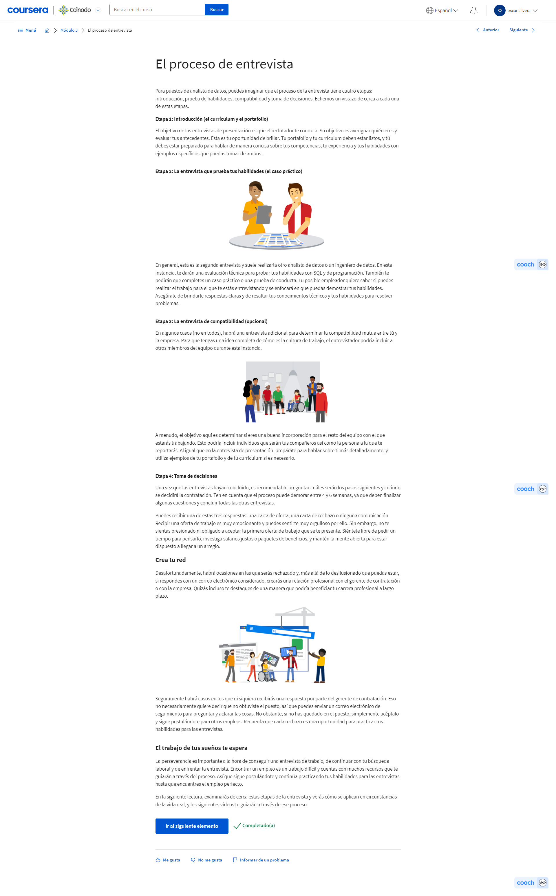
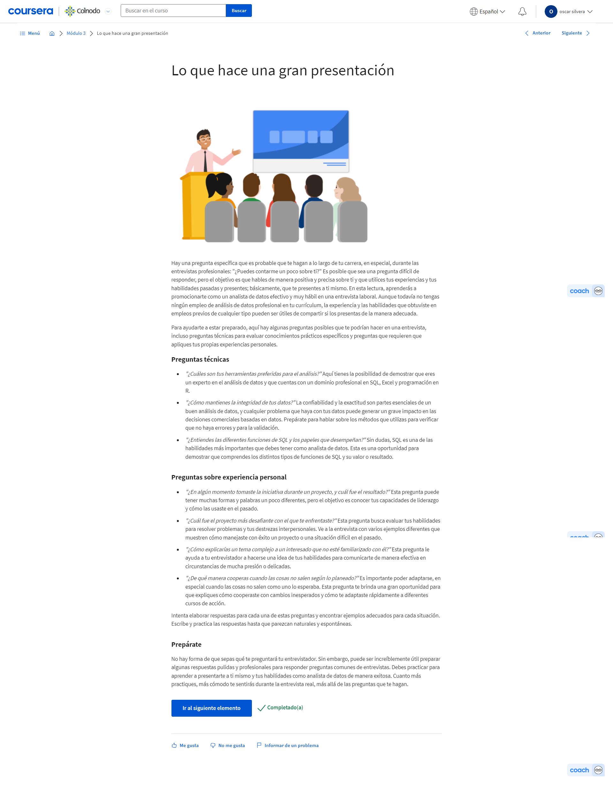

# Curso final de análisis computacional de datos de Google: completa un caso

## Aprender sobre los conceptos básicos del proyecto final

### Introducción al proyecto final

#### Introducción al proyecto final curso 8

Hola. Me alegra que estés conmigo en esta última parte del programa. Este es un proyecto de fin de certificado que tanto Coursera como otras plataformas de aprendizaje suelen llamar proyecto final. El proyecto final reúne todo lo que has aprendido. Tendrás la oportunidad de juntar todo tu conocimiento nuevo y ponerlo en práctica con un caso práctico de análisis computacional de datos. En este vídeo, hablaremos más sobre lo que esto conlleva y cómo puede ayudarte a que te destaques en una búsqueda laboral. Los casos prácticos son proyectos de práctica de análisis computacional de datos. Cuando buscas trabajo, te pueden pedir que realices un caso práctico después de la llamada de preselección o de la primera entrevista. El caso práctico es una forma usual en que los empleadores evalúan las destrezas laborales y llegan a conocer cómo abordas ciertos desafíos comunes relacionados con datos. Los distintos empleadores podrían enviarte diferentes tipos de casos prácticos. Por ejemplo, podrían pedirte que limpies y analices un conjunto de datos, que propongas cómo medir el éxito de un proyecto, o que resuelvas y definas métricas de éxito para un producto específico. Por lo general, hay un límite de tiempo para el caso práctico que te han asignado. Por ejemplo, un empleador potencial podría darte algunos datos de muestra y preguntas sobre el proyecto y pedirte que crees una presentación o una nota con tus recomendaciones en 24 o 48 horas. Este límite de tiempo puede resultar algo desafiante. Pero la buena noticia es que la respuesta de tu caso práctico no tiene que ser perfecta. Lo importante es que demuestres tu proceso de pensamiento de manera que los entrevistadores puedan comprender cómo abordaste el problema. Puedes usar el proceso de análisis de datos que hemos aprendido durante este programa para guiarte. Veamos un ejemplo y analicemos todas las partes. Este caso práctico tiene toda la información que necesitamos para realizar esta tarea. Comienza aquí, con el título y el enfoque de la industria: predecir la tasa de bajas de los empleados para recursos humanos. También incluye un planteamiento del problema que describe cuál es el objetivo general. En este caso, están solicitando un análisis profundo de conceptos clave de análisis computacional de datos para predecir la tasa de bajas de los empleados en la organización y qué factores influyen para que un empleado deje la organización. Básicamente, este caso práctico tiene interés en predecir la tasa a la que los empleados podrían dejar la organización y los motivos para hacerlo. Hay algunos objetivos más específicos en la próxima sección. Nos piden que calculemos la probabilidad de que un empleado deje la empresa en los próximos cinco años. Eso es bastante claro, pero también están interesados en conocer formas para mejorar la retención de los empleados. Esta próxima sección es realmente clave. Lo que realmente les daremos una vez que hayamos completado el caso práctico son los entregables. En este ejemplo, nos están pidiendo una presentación que describa nuestros descubrimientos y nuestras recomendaciones. Por último, han incluido algunas secciones sobre los datos que usaremos para esta tarea. Aquí hay un conjunto de datos que podemos descargar. Ahora sabemos más sobre los casos prácticos y cómo se nos podrían presentar en un proceso de solicitud de empleo. Pero las personas apasionadas por el análisis computacional de datos harán algunas veces casos prácticos a su propio ritmo y los agregarán a un portfolio personal. Un portfolio es una recopilación de casos prácticos que puede compartirse con empleadores potenciales. Se puede almacenar en sitios web públicos como GitHub, Kaggle o Tableau, o en tu blog. También puede haber un enlace a tu portfolio en tu currículum. Esto proporcionará ejemplos de cómo abordaste tareas con datos en el pasado de las que puedas hablar en la entrevista. Estos portafolios muestran tus destrezas y te ayudan a destacarte en solicitudes de empleo. Además del caso práctico, hablaremos sobre la creación de tu portfolio y de cómo compartirlo. Esto será como una muy buena base sobre la cual puedes ir armando tu currículum. A continuación, veremos algunos muy buenos ejemplos de casos prácticos y portfolios que seguramente te inspirarán mientras comienzas los tuyos.

#### Explorar algunos portafolios reales

https://learner.coursera.help/hc/es
https://www.billyost.net/
https://github.com/erikaduan/R-tips/blob/master/README.md
https://www.kaggle.com/jessemostipak
https://www.kaggle.com/mrisdal
https://www.youtube.com/watch?v=GJBOMWpLpTQ
https://www.kaggle.com/jessemostipak/notebooks
https://www.kaggle.com/mrisdal/notebooks

#### Diario de datos: Prepárate para tu proyecto final

#### Rishie: Qué buscan los empleadores en los analistas de datos

Google es una empresa construida sobre datos. Está basada en datos. Y la idea detrás de ello es que cada persona, ya sea un ingeniero, un comerciante, un vendedor, o incluso si estás trabajando en administración, si manejas logística, papeles o nóminas de personal, todos tratamos con datos de una manera u otra. Estamos tratando de reconocer el hecho de que en todas las ocupaciones del mundo, en diferentes industrias, tener una habilidad especial y comprensión de los datos será crucial para todos. En una entrevista, lo que personalmente busco, lo que incluso mis colegas buscan es cómo se piensa en esto de forma creativa. Cuando las personas escuchan las palabras "analista de datos", piensan en ingenieros o en alguien extremadamente técnico, y solo se trata de trabajar con datos y números. Pero les ruego a las personas que revean esta percepción de que un analista de datos no solo es un científico, sino que también es un artista. El mundo entero es tu lienzo. La forma en que lo abordas e, incluso, algunas veces desafías las normas tradicionales para resolver un problema, creo que eso es muy poderoso, y realmente te pone en ventaja cuando se te compara con otras personas en entrevistas para dichos puestos. Hay una idea equivocada o mito de que cuando estás solicitando un empleo debes saber todas las respuestas correctas. Debes responder cada pregunta que te hacen correctamente. Pero eso no es así. Lo que todo entrevistador busca es ver cómo piensas, cuál es tu proceso de pensamiento, de qué manera miras determinado problema y cómo abordas la solución de esos problemas. Cuando expresas eso, es decir, hablas un poco más acerca de cómo piensas sobre cierta perspectiva, por qué piensas de esa manera, esto dice mucho de ti como persona y de tu habilidad profesional para ocupar ese puesto. Una de las cosas más fascinantes de ser analista de datos es contar historias. Miras los datos y todos los datos señalan que tienen una historia que contar. Si eres capaz de perfeccionar esta destreza, puedes contar historias increíbles. Lo que las personas recordarán no son solo los datos sino cómo cuentas esas historias a las personas o a tu público. Si hablas de la esencia básica de la historia, en vez de “esto es lo que me dicen los datos o esto es lo que los datos te dicen que hagas”, tendrás mucho más éxito. Y te garantizo que progresarás como analista de datos y tu carrera prosperará indefinidamente. Soy Rishie, gerente del plan de estudios de habilidades analíticas globales.

#### Preséntate

Ahora que ya completaste los primeros siete cursos de este programa, es hora de que realices el Proyecto final de análisis computacional de datos. El proyecto final es una valiosa oportunidad para poner en práctica todas las destrezas que aprendiste. Lo usarás para crear un caso práctico original que podrás agregar a tu portafolio y compartir con potenciales empleadores.

### Casos de muestra para analistas de datos

#### El mejor de la clase

Bienvenido de nuevo. Ya hemos hablado sobre qué es un caso práctico y de por qué el hecho de agregar uno a tu portfolio podría ayudarte a que te destaques en una búsqueda laboral. Ahora, hablemos sobre algunas prácticas recomendadas para crear casos prácticos y portfolios y revisar algunos ejemplos muy buenos del trabajo de otros analistas. Cuando hablamos de casos prácticos, hay algunos consejos importantes para que tengas en cuenta. Primero, asegúrate de que tu caso práctico responda a la pregunta que se está haciendo. Veamos un caso práctico de muestra para una empresa que llamaremos Data Partners Real Estate. Les preguntaron a los candidatos: "¿Cómo calificarías el desempeño en reventa de Data Partners Real Estate durante 2020, qué está impulsando estas tendencias y cuál sería tu plan de acción?" La empresa entregó a los candidatos un conjunto de datos de mercado que incluye cosas como listados activos, visitas, contratos de reventa, puntos de precio y geolocalizaciones. Los candidatos tuvieron un día para revisar el proceso de análisis de datos y compartir una propuesta. Aquí está la presentación de un candidato. La diapositiva 2 expone la pregunta. El candidato identificó un rendimiento pobre en una banda de precio de vivienda específica que la empresa podría mejorar. Incluir aquí una rápida descripción general de las conclusiones ayuda a que el caso práctico mantenga el foco en la tarea en cuestión. Además de responder la pregunta, también debes asegurarte de que estás comunicando los pasos que has seguido y las suposiciones que hiciste sobre los datos. Una de las razones por la que los potenciales empleadores están interesados en los casos prácticos es que muestran el proceso de pensamiento y las destrezas para solucionar problemas. El hecho de que muestres los pasos que tomaste para arribar a tu conclusión puede ayudarlos a tener una buena idea de cómo trabajas. Aquí tenemos una explicación de las métricas que usan para realizar el análisis. Y, en cada diapositiva posterior, usan el título para contar su historia y explicar los pasos de su análisis. Establecen que la porción de mercado global de los contratos de reventa de esta empresa se mantuvo estable y explican que esto es el resultado de un alto crecimiento en un área y de pérdidas en otra. Luego, explican esta brecha y describen algunas causas potenciales. Y, en las notas del orador, agregaron algunas de sus suposiciones clave. Para resumir, brindaron recomendaciones a la empresa de acuerdo con la información de la base de los datos. Definieron las métricas con claridad, las conclusiones de los datos se organizaron en un orden lógico y detallado, y se aseguraron de explicar toda información previa sobre los datos que el público pudiera desconocer. En este caso, el candidato también compartió documentación de su análisis, incluidas sus consultas de SQL y hojas de cálculo. Este es un muy buen ejemplo de cómo un caso práctico puede mostrar el proceso de pensamiento de un analista. Ahora bien, todo caso práctico que completes durante una solicitud de empleo debe –por lo general– mantenerse en confidencialidad. Pero también puedes completar casos prácticos a tu propio ritmo y agregarlos a tu portfolio personal. Como hablamos anteriormente, tu portfolio es una recopilación de casos prácticos que quieres mostrar y también existen algunas prácticas recomendadas que puedes usar para crear tu portfolio. Los mejores portfolios son personales, únicos y simples. Aprendiste diferentes formas en que puedes publicar y compartir tu portfolio, por ejemplo, un blog, GitHub o Kaggle. Exploremos algunos portfolios para que podamos entender qué significa realmente personal, único y simple. Como quizás recuerdes, estos ejemplos también se presentaron en una lectura, así que siéntete libre de hacer un repaso y verificar esto por tu cuenta. Tu portafolio es una oportunidad para mostrarles a las personas quién eres, qué te interesa y qué es importante para ti. Aquí hay un ejemplo de un portfolio. De inmediato podemos decir que es muy personal con solo mirar el título: Compartiendo mi historia con el cáncer con visualizaciones de datos. Esta visualización de datos muestra la historia de salud de este analista a medida que se preparaba para una maratón mientras, al mismo tiempo, sobrellevaba un tratamiento contra el cáncer. Se trata de una historia muy personal y poderosa y habla más de su proyecto en la publicación de su blog. No obstante, también muestra su personalidad en la visualización de datos propiamente dicha. Leamos algunas de estas notas: "Mamá, si estás leyendo, envíame más galletas". "Fitbit murió; no me preocupé por alimentarlo durante nueve días". Además de la historia personal que cuentan estos datos, también obtenemos estas conclusiones sobre la personalidad del analista. El hecho de que tu portfolio cuente algo personal no significa que el foco tiene que estar por completo puesto en ti, sino que es una oportunidad para que otras personas te conozcan mejor. Es bueno agregar a tu portfolio cosas que te importen, cosas que sean interesantes para ti y cosas que te gustaría compartir. Esto destacará tus destrezas técnicas y también cómo abordas los problemas técnicos. El hecho de que tu portfolio cuente algo personal también ayuda a que sea único. Al resaltar las cosas que te interesan puedes distinguirte del resto. Veamos otro ejemplo. Este es un perfil de una usuaria de Kaggle con algunos de los <i>notebooks</i> que creó. Cada uno es básicamente un caso práctico que completó por puro placer. Tiene algunos <i>notebooks</i> en los que trabajó con los datos de los pingüinos de Palmer que usamos en R. Pero también tiene <i>notebooks</i> en los que hizo un análisis sobre un videojuego que le gusta. El uso de ejemplos comunes puede ser una gran práctica y puede demostrar destrezas prácticas para el puesto, pero agregar casos prácticos únicos e interesantes a tu portfolio lo hacen genial y memorable. Como regla general, haz que tu portfolio sea bastante simple. Nuestro objetivo es destacar nuestras destrezas como analistas de datos, de manera que no queremos distraer a nadie que esté visitando nuestro portfolio con un desorden innecesario. Aquí hay un ejemplo de un portfolio en GitHub. Este usuario creó una lista maestra de tutoriales en R que desarrolló. Es simple y directo. Hay una tabla de contenidos que lleva a diferentes páginas, lo que permite mantener la página de destino del portfolio simple y fácil de navegar. Esto no quiere decir que esta página sea aburrida. Le agregaron este arte divertido en la tapa y, aquí, hablan sobre sus propias experiencias con R. Pero incluso con todo eso, no nos distraemos con una página web desordenada. Por último, debes asegurarte de que tu portfolio sea relevante y presentable. Si sabes que te interesa cierto tipo de puesto de analista de datos, puedes adaptar tu portfolio para destacar esas destrezas. Asegúrate de mantenerlo actualizado, listo para que lo vea un empleador y, lo más importante, siéntete orgulloso de tu producto. Cuando hablamos de casos prácticos, debes asegurarte de que respondes la pregunta y comunicas los pasos que seguiste. A medida que creas tu portfolio, recuerda mantenerlo personal, único y simple. Ahora que tenemos algunas ideas de cómo crear grandes casos prácticos y portfolios, estás listo para empezar a trabajar por tu cuenta. A continuación, tomaremos el primer paso hacia la creación de nuestro propio caso práctico. Nos vemos pronto.

#### Lista de verificación de tu portafolio y caso práctico

https://learner.coursera.help/hc/es
https://www.holistics.io/blog/startup-data-analyst-interview-case-studies/

#### Revisar trayectorias profesionales en datos

https://learner.coursera.help/hc/es
https://www.springboard.com/blog/sql-what-you-need-to-know/
https://medium.com/ds3ucsd/career-paths-within-data-science-4243679c04b9

#### Pon a prueba tus conocimientos sobre casos prácticos profesionales

## Opcional: Crear tu portafolio

### Primeros pasos

#### Introducción a la creación de tu portafolio

Introducción a la creación de tu portafolio
En esta parte del curso, prepararás un caso práctico que podrás incluir en tu portafolio en línea. Todos los recursos proporcionados te ayudarán a lograr este objetivo (denominado el Proyecto final del análisis computacional de datos de Google).

Como dice un viejo refrán: se aprende haciendo. Ya has aprendido la importancia de cada fase en el proceso de análisis de datos cuando trabajas con un conjunto de datos. Pronto aprenderás la importancia de tener un portafolio en línea. El Proyecto final de análisis computacional de datos de Google te permitirá efectivamente aunar ambos conocimientos en un conjunto de datos que has elegido a lo largo del proceso de análisis de datos para tu portafolio. 

Completar tu proyecto final te permitirá practicar lo siguiente:

Recorrer las fases del proceso de análisis de datos: Preguntar, Preparar, Procesar, Analizar y Compartir

Establecer una tarea empresarial de manera clara

Importar datos desde un conjunto de datos existente

Documentar la limpieza de datos que realizas en el conjunto de datos

Analizar los datos 

Crear visualizaciones de datos en tus análisis

Resumir los hallazgos clave detectados en tus análisis

Documentar tus conclusiones y recomendaciones

Crear y publicar tu caso práctico 

Tu caso práctico mostrará estas habilidades fundamentales a los posibles empleadores y también lo que aprendiste a través del Certificado de análisis computacional de datos de Google. Representará tus conocimientos y capacidades en tu portafolio.

#### Los primeros pasos en tu caso práctico

¡Hola! ¡Qué bueno volver a verte! Ahora que ya analizaste algunos ejemplos de casos prácticos y portafolios, es hora de empezar a crear los tuyos propios. A continuación, harás una actividad que te ayudará a comenzar. Pero antes de eso, quiero contarte un poco más sobre los diferentes enfoques que puedes usar para empezar tu proyecto. Hay dos pistas posibles que puedes usar para dar forma a tu caso práctico y que te ayuden a empezar. En la Pista 1, podrás elegir una pregunta empresarial similar a la que podrían preguntarte los entrevistadores. Tienes varias opciones diferentes para elegir, con tareas empresariales específicas y distintos conjuntos de datos para usar. En la Pista 2, se te pedirá que encuentres un conjunto de datos públicos para explorar algo que te interese personalmente. Esto podría ser cualquier cosa. Desde analizar un videojuego que te guste, hasta un estudio sobre la población de fauna silvestre que te interese. Esta es la opción más flexible, y tendrás más libertad para crear algo que sea realmente personal para ti. Según lo que quieras hacer con tu caso práctico, podrías elegir una u otra opción. Por ejemplo, si quieres crear un caso práctico que puedas usar para demostrar tus habilidades laborales para futuras entrevistas, entonces, la Pista 1 podría ser más útil para ti, pero si hay algo que te interese personalmente, algo que te gustaría explorar más, la Pista 2 puede ser útil para crear un portfolio flexible. O si te interesan la Pista 1 y la 2, puedes usar ambas. Una vez que hayas decidido la pista que más te interesa, usarás el esquema del caso práctico para que te ayude a comenzar tu proyecto. El esquema sigue las fases del ciclo de vida del análisis de datos que hemos usado a lo largo de este programa. Completarás cada fase, desde formular las preguntas correctas hasta preparar, procesar y analizar tus datos, y finalmente crear tu presentación y compartirla en tu portfolio. Cada fase tendrá preguntas clave y actividades que pueden guiarte a lo largo del proceso. Si en algún momento necesitas revisar algo, siempre puedes volver a cualquier parte del programa como ayuda. A modo de recordatorio rápido, los datos con los que trabajarás en este proyecto serán públicos y de código abierto. Estos datos son maravillosos para demostrar tus habilidades como analista de datos, pero es esencial evitar el plagio, así que debes citar las fuentes. Los datos públicos, de código abierto se pueden buscar con facilidad y no queremos hacerlo pasar como nuestro propio trabajo. El plagio puede tener graves consecuencias negativas, tanto legales como personales. El atractivo de nuestro trabajo como analistas de datos es que podemos compartir y colaborar entre nosotros. Así que recordemos reconocer el mérito de nuestras fuentes. Espero que te entusiasme empezar tu caso práctico. Realmente me encanta ver el potencial de tus logros. Después de esto, podrás empezar a trabajar en el esquema. Luego, tenemos algunas otras actividades que te guiarán. Después, hablaremos sobre cómo compartir tu portfolio. ¡Mucha suerte!

#### Próximos pasos, elegir tu pista

### Pista 1 del caso práctico: Trabaja con las preguntas y los conjuntos de datos existentes

#### Detalles de la Pista 1

En el trabajo
La primera pista involucra un caso práctico similar al que podrían pedirte en una entrevista laboral. Te asignarán una tarea empresarial, un conjunto de datos y una lista de entregables específicos que debes presentar a los interesados. La primera pista te ayudará a crear un caso práctico que podrías incluir en tu portafolio para demostrar destrezas laborales en futuras entrevistas. Puedes elegir entre dos casos. Una vez que decides qué paquete de caso práctico usarás, leerás los detalles, completarás el análisis y crearás tu caso práctico ya terminado. 

Si esta pista te interesa, explora las opciones de casos prácticos y decide cuál quieres realizar. Los paquetes de casos prácticos disponibles para descargar tienen todo lo que necesitas para completar tu caso práctico. Después, estarás listo para cargar y compartir tu caso práctico con posibles empleadores.

#### Caso práctico 1: ¿Cómo lograr el éxito rápido de un negocio de bicicletas compartidas?

#### Caso práctico 2: ¿Cómo puede hacer una empresa de bienestar para tomar decisiones inteligentes?

#### Caso práctico 1: ¿Cómo lograr el éxito rápido de un negocio de bicicletas compartidas? pt2

Una vez que hayas empezado a trabajar en tu caso práctico, quizás encuentres algunos obstáculos. Usa el foro de debate para hablar con otras personas que, en este momento, estén trabajando en el caso. Es una oportunidad para compartir tus ideas y hacer preguntas. Intenta concentrar tus preguntas en el soporte técnico; evita preguntar sobre pasos específicos que están adoptando otras personas para analizar este caso. El objetivo es crear un entorno solidario, pero a la vez evitar posibles plagios.

#### Caso práctico 2: ¿Cómo puede hacer una empresa de bienestar para tomar decisiones inteligentes? pt2

Una vez que hayas empezado a trabajar en tu caso práctico, quizás encuentres algunos obstáculos. Usa el foro de debate para hablar con otras personas que, en este momento, estén trabajando en el caso. Es una oportunidad para compartir tus ideas y hacer preguntas. Intenta concentrar tus preguntas en el soporte técnico; evita preguntar sobre pasos específicos que están adoptando otras personas para analizar este caso. El objetivo es crear un entorno solidario, pero a la vez evitar posibles plagios.

### Pista 2 del caso práctico: Elige tus propias preguntas y conjunto de datos

#### Detalles de la Pista 2

Elige tu propia aventura

La segunda pista implica encontrar un conjunto de datos públicos que se focalice en algo que sea de tu interés. Podrías elegir cualquier tema sobre el que quieras analizar datos, por ejemplo, el uso de bicicletas públicas en tu barrio, la migración de la fauna local, las ventas de consolas de videojuegos o cualquier otra cosa que te apasione. Puedes seguir los pasos en el paquete de casos prácticos para guiarte en este proceso. El paquete de casos prácticos proporciona recomendaciones sobre conjuntos de datos públicos, ejemplos de tareas empresariales y pasos para completar tu análisis. Esta pista es la más flexible, pero esa flexibilidad significa que puede ser más desafiante. Tendrás que usar todo lo que has aprendido hasta ahora para completar este caso práctico.

Si esta pista te interesa, explora el paquete de casos prácticos para conocer más detalles, encontrar el conjunto de datos públicos que quieres usar y completar tu análisis. Después, estarás listo para cargar y compartir tu caso práctico ya completo.

#### Caso práctico 3: Recorre tu propio camino en relación con los casos prácticos

#### Recursos para explorar otros casos prácticos

https://learner.coursera.help/hc/es
https://medium.com/search
https://github.com/search
http://public.tableau.com/
https://www.kaggle.com/

#### Caso práctico 3: Recorre tu propio camino en relación con los casos prácticos pt2

Una vez que hayas empezado a trabajar en tu caso práctico, quizás encuentres algunos obstáculos. Usa el foro de debate para hablar con otras personas que, en este momento, estén trabajando en el caso. Es una oportunidad para compartir tus ideas y hacer preguntas. El objetivo es crear un entorno solidario, pero a la vez evitar posibles plagios. Sin embargo, como usas datos diferentes a los de los demás, tienes más flexibilidad en el tipo de preguntas que formulas.

### Compartir tu caso práctico y portafolio

#### Potencial ilimitado con casos prácticos de análisis computacional de datos

Felicitaciones, has completado oficialmente tu caso práctico personal y empezaste a crear tu portafolio. Es un logro maravilloso. Y todo es producto del arduo trabajo que dedicaste para practicar tus habilidades como analista de datos. Si realmente disfrutaste este proceso, siéntete libre para probar un camino diferente o elegir otro escenario de negocio. Puedes usar una y otra vez la guía que aplicaste para terminar tu primer caso práctico. Y cuanto más la uses, más mejorarás de maneras inesperadas. Además, sumar otros casos prácticos a tu portafolio lo fortalecerá aún más. Próximamente vamos a cambiar un poco la marcha. Ahora que tienes un portafolio sobre el caso práctico completado, podemos empezar a hablar sobre cómo analizar tu portafolio con los reclutadores, y algunas formas de resaltar tus habilidades. Aquí es donde realmente empezamos a darle un buen uso al portafolio. Y tendrás muchas más oportunidades para practicar esto. ¡Excelente trabajo! Nos vemos pronto.

#### Compartir tu portafolio

Hola. Bienvenido de nuevo. Terminar el caso práctico es un gran paso, pero todavía debemos crear un portafolio y compartir nuestro análisis en línea. Cuentas con muchas opciones para tener tu propio portafolio en línea. Así que hablemos sobre los lugares donde puedes publicar tu caso práctico y cómo adoptar esa decisión. Cuando pienses en dónde quieres compartir tu portafolio, hay dos preguntas que pueden ayudarte a tomar una decisión. Primero, ¿qué plataformas coinciden con tus intereses y pasiones? Y segundo, ¿a quieres dedicar más tiempo después de este programa? Tienes algunas opciones. Podrías usar Kaggle, GitHub, un blog o Tableau para compartir tu trabajo. Ahora hablemos sobre qué puede ofrecerte cada una de estas opciones.
Reproduce el video desde ::48 y sigue la transcripción0:48
Kaggle te ofrece una amplia comunidad de ciencia de datos a la que puedes sumarte. Organiza muchos concursos para que los usuarios participen y ofrece toda clase de oportunidades de aprendizaje. Esta es una gran opción si te gusta conectar con otros analistas de datos.
Reproduce el video desde :1:4 y sigue la transcripción1:04
GitHub se usa principalmente para lenguajes de programación como R o Python. Tiene una configuración más técnica que otras plataformas. De todos modos, es un excelente lugar para compartir con otros usuarios tu código y el fundamento que sustenta tu análisis. Y si quieres conocer el trabajo de otros analistas de datos, GitHub es un excelente lugar para estar.
Reproduce el video desde :1:23 y sigue la transcripción1:23
Las plataformas de blogs como Medium, WordPress y Google Sites son personalizadas y las puedes adquirir. Los blogs no están tan focalizados en el código como Kaggle y GitHub, así que tendrás que almacenar tu código en algún otro lugar. Y es posible que haya algunos pasos adicionales para mostrar el código en los blogs. Pero puedes exhibir tu experiencia, escribir sobre tu propio proceso y mostrar el liderazgo de pensamiento en tu área. Por último, podrías elegir Tableau para alojar tu trabajo. Ya tienes cierta experiencia con Tableau por el trabajo que hiciste aquí. Es una gran opción si te focalizas en la visualización de los datos. Además, puedes crear paneles interactivos con las herramientas de Tableau que se pueden compartir con facilidad. Elegir dónde alojar tu portafolio es una decisión importante, pero por suerte ahora tienes algunas ideas sobre cómo podría ayudarte cada plataforma. Y, con el tiempo, podrías terminar usando varias plataformas que se adapten a tus necesidades específicas. Lo importante es recordar las dos preguntas que comentamos antes. ¿Qué plataformas coinciden con tus intereses y pasiones? Y ¿a qué quieres dedicar más tiempo después de este programa? Crear tu plataforma en línea para compartirla es uno de los últimos pasos en este proyecto final. A continuación, tenemos algunas actividades para ayudarte a recorrer ese proceso. Después nos volveremos a encontrar aquí para empezar a hablar sobre tus próximos pasos.

#### Crear tu portafolio en línea

https://learner.coursera.help/hc/es
https://docs.github.com/en/github/getting-started-with-github/signing-up-for-a-new-github-account
https://www.kaggle.com/questions-and-answers/122858
https://public.tableau.com/s/
https://help.medium.com/hc/en-us/articles/115004915268-Sign-in-or-sign-up-to-Medium
https://wordpress.com/start/user
https://support.google.com/sites/answer/6372878?hl=en&ref_topic=7184580
https://medium.com/tunapanda-institute/8-steps-to-publish-your-portfolio-on-github-9d6e6e3d2e84
https://towardsdatascience.com/kaggle-kernels-for-beginners-a-step-by-step-guide-3db6b1cd7606
https://medium.com/analytics-vidhya/publishing-your-first-dataset-on-kaggle-6be8c37e59e8
https://help.medium.com/hc/en-us/articles/115004681607-Getting-started-with-a-Medium-publication
https://wordpress.com/learn/get-published/
https://support.google.com/sites/answer/6372880
https://support.google.com/sites/answer/9068867

#### Actividad práctica: Agregar tu portafolio a Kaggle

https://learner.coursera.help/hc/es
https://www.kaggle.com/code
https://www.kaggle.com/tags

#### Opcional: Compartir tu portafolio con otros

¡Felicitaciones! Has completado un caso práctico y creaste un portafolio que te permitirá compartir tu trabajo en el futuro. Para celebrarlo, puedes usar la posibilidad que te ofrece el tablero de debate para compartir el enlace a tu portafolio con otras personas que también están realizando el curso para obtener el certificado.

Esto es completamente opcional, puedes elegir compartirlo o no, según te sientas cómodo. Recuerda indicar la fuente de tus datos y acreditar adecuadamente a otros creadores.

#### Pon a prueba tus conocimientos y completa un caso práctico

## Opcional: Usar tu portafolio

### Compartir tu trabajo con los reclutadores

#### Introducción a cómo compartir tu trabajo

#### Debatir sobre tu portafolio

Bienvenido de nuevo. Ahora que ya creaste con éxito tu primer caso práctico y lo agregaste a tu portafolio, es momento de hablar sobre utilizar ese portafolio para sorprender a los posibles empleadores en tu próxima búsqueda laboral. En este vídeo, aprenderemos cómo desarrollar una presentación concisa. Incluir tu portafolio en tu currículum te ayudará a destacar, pero si puedes utilizar tu portafolio para resaltar tus habilidades de manera efectiva, tendrá mucho más poder. Cuando estés hablando sobre los casos prácticos de tu portafolio, tienes que dar una presentación concisa a los entrevistadores para que logren un nivel de comprensión alto sobre tu trabajo de manera rápida. Básicamente, una presentación concisa es una declaración breve que describe una idea o un concepto. Solo debe tener un par de oraciones; tiene que ser lo suficientemente corta para que puedas explicársela a alguien en un ascensor. Siempre es buena idea preparar tu presentación concisa de antemano. Luego, una vez que los entrevistadores hayan alcanzado ese alto grado de comprensión de tu caso práctico, puedes proporcionar ejemplos concretos de tu proceso y de cómo resolviste problemas en tu análisis de datos anteriormente. Por ejemplo, si el entrevistador te pide que hables sobre cómo abordas la limpieza de datos, puedes destacar tu caso práctico para explicar cómo limpiaste los datos anteriormente. Luego de explicarles rápidamente el caso práctico, puedes describir tu proceso y mostrarles cómo completaste tu análisis con éxito. Veamos nuestro ejemplo, el caso práctico de Data Partners Real Estate, y pensemos una presentación concisa para él. Antes vimos cómo el resumen ejecutivo de la presentación se enfocaba en responder la pregunta empresarial. Ese resumen también puede ayudarnos a desarrollar nuestra presentación concisa. Solo tenemos que hacer un resumen de un par de oraciones. También podemos volver a pensar en las tareas empresariales en las que basaste tu caso práctico para que puedas decidir qué contexto es más importante. Por ejemplo, podrías decir lo siguiente: "En este caso práctico, utilicé datos de una empresa de bienes raíces para evaluar el rendimiento de reventa, determinar tendencias y crear teorías para explicar qué las causaron. Luego, pude desarrollar un plan de acción basado en esos resultados". Si después están interesados en debatir esos resultados más detalladamente, puedes hacerlo. En este punto, puedes contarles más sobre cómo llegaste a tu conclusión y sobre las recomendaciones que le diste a la empresa. O quizás la presentación concisa era todo lo que necesitabas para comenzar a explicarle tu proceso a la persona que lleva adelante esta entrevista. La mejor forma de demostrar tus habilidades de manera efectiva es recordar cuál es tu público y cuáles son sus intereses. Los potenciales empleadores y reclutadores quieren conocer tu línea de pensamiento y tu enfoque para la resolución de problemas. Esto significa que cuando estés explicando los casos prácticos de tu portafolio, es útil que te centres en tu proceso y no solamente en los resultados. Piensa en nuestro ejemplo anterior. El entrevistador nos pidió que hablemos sobre nuestro enfoque respecto de la limpieza de datos. Es probable que no necesiten saber las funciones exactas que realizamos en nuestro conjunto de datos, pero posiblemente estén interesados en saber cómo elegimos las herramientas correctas y qué pasos seguimos para asegurarnos de que nuestros datos estuvieran limpios y fueran útiles. Eso les brinda más información sobre nuestro proceso de limpieza y sobre qué pensamos de la limpieza de datos en general. Tus casos prácticos son una herramienta poderosa que puedes utilizar para mejorar tu currículum, pero también puedes aprovecharlos como ayuda para definir tu línea de pensamiento y la forma en que realizas tu análisis. Desarrollar una presentación concisa y utilizar casos prácticos para destacar tus habilidades como analista de datos frente a potenciales empleadores y reclutadores puede ser útil para hablar sobre tu trabajo de manera más efectiva con los entrevistadores. Como todo lo demás que aprendimos, esto es algo que se vuelve más fácil a medida que practicas. Es una buena idea practicarlo de antemano. Intenta contarle tu presentación concisa a un amigo o practica hablarle a un colega de confianza sobre tu proceso. Lo dominarás en poco tiempo. A continuación, tendrás la oportunidad de practicar cómo mostrar tu portafolio en entrevistas. Nos vemos pronto.

#### Autorreflexión: Pulir tu portafolio

### En la entrevista

#### El proceso de entrevista

#### Vídeo de situación - serie de presentación

https://learner.coursera.help/hc/es
https://docs.google.com/document/d/1wJh2mlh-baGQw0i6Uh_up-yQmq9EvibyFSK3mTmb0JE/template/preview
https://docs.google.com/presentation/d/1sGM5w0zbf_5HS2aiTLFZEaVfIfn0Yea8zkQ5O5eTIfc/template/preview

#### Vídeo de situación: Presentaciones

Hola, Jordan, ¿cómo estás? Hola, Sally. Es un placer conocerte. ¿Puedes oírme? Sí. Perfectamente. Excelente. Bueno, gracias por tomarte el tiempo para reunirte conmigo. Gracias a ti; estoy emocionada por esta reunión, pero también estoy un poco nerviosa. No tienes por qué estar nerviosa. Esta será una oportunidad para que yo te conozca y para que tú sepas un poco más sobre el puesto de analista de datos júnior y en qué consiste. Para comenzar, ¿podrías contarme un poco sobre ti? Por supuesto. Pensaba que iba a ser maestra, pero la vida tenía otros planes para mí y decidí que no era lo que realmente quería hacer con mi vida. Me tomé un tiempo libre y trabajé en el sector de ventas minoristas. Luego, alguien me comentó sobre el programa de certificación de análisis computacional de datos de Google. Decidí darle una oportunidad a algo diferente. Resulta que, en realidad, me gustó lo que aprendí y resulté ser bastante buena en ello. Entonces decidí postularme para el puesto de analista júnior. ¿Qué fue lo que te atrajo del análisis computacional de datos? Me gusta mucho que esté centrado en profundizar en cosas, aprender más sobre ellas y mejorarlas. Es como trabajar con rompecabezas, pero cuando los terminas, ayudas a las empresas a tomar decisiones comerciales más inteligentes. Y eso me parece genial. Excelente. A mí también me encantan los rompecabezas. Pero, ya que hablamos de ellos, no todos tienen una solución directa y, a veces, las cosas pueden complicarse. ¿En algún momento tuviste que lidiar con un problema muy importante sobre el que tenías toda la responsabilidad? Sin duda. Cuando era maestra, solíamos tener problemas relacionados con el presupuesto para cosas como materiales escolares y programas después de la escuela. Parecía que siempre nos quedábamos sin dinero porque trabajábamos con un presupuesto para todo. Reuní a los otros maestros y creamos presupuestos para cada categoría y eso funcionó mucho mejor. Puedo imaginarme que eso fue verdaderamente frustrante. Por supuesto. Tuvimos que resolverlo por nuestra cuenta porque nadie iba a solucionarlo por nosotros. Como nadie tomaba la iniciativa, decidí encargarme de eso como proyecto paralelo. Bueno, me dijiste que trabajaste con otros maestros y como vendedora minorista previamente. En este puesto, habrá momentos en que trabajarás con otros miembros del equipo y momentos en los que trabajarás sola. ¿Tienes alguna preferencia o cómo prefieres trabajar? Tengo experiencia trabajando en ambas situaciones. Me encanta trabajar con personas y colaborar como lo hice en el proyecto del presupuesto y en las ventas minoristas. También soy muy buena trabajando por mi cuenta y realizando ciertas tareas. Después de todo, cuando era maestra, realizaba mis propias planificaciones docentes y me encargaba de mis alumnos. Intento mantener la mente abierta e incluir a las personas cuando es necesario. Muy bien. Alguien como tú, que está haciendo una transición desde un campo completamente diferente hacia el de analista de datos, ¿cómo crees que te adaptarías al cambio si fueras contratada? Bueno, aunque son campos muy diferentes, pienso que mi experiencia anterior encontraría una buena correlación en el análisis. Mi habilidad como maestra para filtrar mucha información y sintetizar lo más importante y fácil de comprender. Eso sería muy beneficioso como analista de datos a la hora de explicar los datos y los números a alguien que quizás no le guste la matemática. Mi trabajo como vendedora minorista me convirtió en una persona buena para comunicarme y el trato con los estudiantes y con los clientes difíciles también me capacitó para manejar a las personas. Creo que esas habilidades serían realmente útiles como analista de datos. Excelente. Una última pregunta, ¿cómo te mantienes motivada cuando estás trabajando en un proyecto? Buena pregunta. Por las personas con las que trabajo. Me gusta conocer a las personas con las que trabajo porque eso me motivará a invertir ese tiempo extra y ese esfuerzo extra. Porque sé que mi trabajo significa algo para alguien que conozco. Eso es lo que me motiva y lo que me hace seguir para adelante. ¡Excelente! Bueno, esas son todas las preguntas que tenía. ¿Tienes alguna pregunta que hacerme? Sí. ¿Cómo es una semana laboral típica en este puesto? Buena pregunta. En este puesto, trabajarías principalmente con nuestros equipos de tecnología y con un par de científicos de datos. Nos reunimos todos los lunes para hablar sobre tareas importantes, ponernos de acuerdo sobre los objetivos y verificar el proceso de cada uno. En esta empresa, es muy importante la comunicación abierta. Te incluirán en distintas reuniones y descubrirás que hablas constantemente con tus colegas sobre cualquier tema, en especial si se acerca una fecha límite. Es bueno escuchar eso. La comunicación abierta siempre es importante. ¿Puedes contarme un poco más del día a día? Sí. Por supuesto. Creo que tu trabajo consistiría principalmente en analizar conjuntos de datos grandes, como datos administrativos, seguros, reclamos de facturación; básicamente un montón de información diferente. Todo depende del proyecto específico. Excelente. Gracias. Me gusta que haya variedad según el proyecto. Una pregunta más. ¿Qué es lo que más te gusta de trabajar en esta empresa? A veces es una pregunta difícil, pero me gusta mucho mi equipo. Es un grupo de personas muy inteligentes y comprometidas que realmente aman lo que hacen. Todos somos muy colaboradores y respetuosos con el otro, algo que resulta muy importante cuando estamos lidiando con situaciones estresantes o con un problema que surgió de la nada. Me gusta lo cómoda que me siento cuando me comunico con otros, incluso con los interesados. Eso facilita mucho las cosas. Excelente. Creo que es muy importante que el ambiente laboral sea accesible. Sí, por supuesto. Cuando descubres que todos tienen más o menos el mismo objetivo final, no hay razón para no ser cooperativo y comunicativo. De acuerdo. Sé que dije que esa era mi última pregunta, pero tengo una más. ¿Puedo preguntarte cuáles son los siguientes pasos del proceso? Sí, por supuesto, de todas maneras eso te iba a contar a continuación. Gracias por haber preguntado. Nos pondremos en contacto con los candidatos durante la semana y les enviaremos por correo electrónico un caso práctico para resolver. Acordaremos una segunda entrevista para que lo presentes. Analizaremos la forma en que realices el trabajo, las habilidades que utilices y las capacidades técnicas que demuestres a lo largo de la asignación. Encontrarás todos los detalles en el correo electrónico que te envíe, así que, por favor, te pido que estés atenta al respecto, y espero con ansias nuestra próxima reunión. ¿Te parece bien? Perfecto. Muchas gracias, Jordan; fue genial poder hablar contigo y te agradezco por haberme dado todos los detalles del trabajo. Por supuesto. Muchas gracias por tu tiempo, Sally. Fue genial poder conocerte. Estaré en contacto y espero que volvamos a hablar pronto. Fue una excelente reunión para mí también. Que tengas una buena semana. Tú también. Adiós.

#### Lo que hace una gran presentación

#### Vídeo de situación: Caso práctico

Bien, entremos en tema. Te enviamos un caso práctico de una situación hipotética en la que una escuela necesita mejorar la comunicación con las familias, y te pedimos tus conclusiones principales sobre cómo podríamos resolver este asunto. ¿Puedes explicarme tu línea de pensamiento? Por supuesto. Quiero decirles que fue una gran situación. Disfruté mucho trabajar con ella, y creo que es algo con lo que muchas escuelas tienen que lidiar. Se me ocurrió lo siguiente. Aquí está la presentación que armé. "Salvar las barreras de comunicación entre docentes y familias" para la escuela secundaria Creekside. El problema subyacente era que la comunicación entre docentes y familias era esporádica o inexistente. La solución que estamos tratando de encontrar tiene que ver con ayudar a la escuela secundaria a diseñar una aplicación para que las familias estén al tanto de las novedades de la escuela, así como de las clases y actividades de sus hijos. Tenemos dos objetivos analíticos. Primero, necesitamos encontrar el por qué. ¿Por qué queremos crear la aplicación en primer lugar? ¿Y por qué nos interesa mantener a las familias informadas? Queremos cuantificar los impactos que tendría hacer eso, fomentar la participación de las familias, en las calificaciones de los estudiantes. Y, luego, evaluamos el cómo. Una vez que decidimos crear la aplicación, ¿qué les interesa a las familias? ¿Sobre qué temas quieren estar mejor informadas? Si primero profundizamos en el por qué, encontramos lo siguiente. Descubrimos que había una tendencia descendente y que las calificaciones de los exámenes de los estudiantes han estado cayendo desde 2004, y allí está el problema. El motivo es que la participación de las familias también cayó en 2004 aunque haya habido un aumento de 14 puntos porcentuales si hay familias involucradas a diferencia de cuando las familias no se involucran. Básicamente, pensamos en el descenso de las calificaciones de los exámenes de los estudiantes porque se correlacionan muy bien con la participación de las familias, y que la falta de participación de las familias es la razón que explica el descenso de las calificaciones; y, por eso, es muy importante que aumentemos la participación de las familias para mejorar las calificaciones de los estudiantes. Eso es el por qué. Ahora tenemos que pasar al cómo. ¿Cuáles son las cosas que las familias querrían saber? Estos datos vienen de una encuesta en la que preguntamos a los estudiantes qué tipo de actividades realizan, y la mayoría de las actividades de los estudiantes pueden agruparse en estas tres categorías: deportes, actividades escolares y actividades extracurriculares. Y lo que resulta interesante es que, si observamos los avisos de novedades que se envían, actualmente a las familias se le notifican estas cosas, y si analizamos por separado a los estudiantes de sexto grado, a los de séptimo y a los de octavo, descubrimos que los estudiantes de séptimo grado recibían la menor atención. Tenían el menor número de avisos de novedades publicados. Lo que estos dos puntos de datos quieren decir es que, en primer lugar, deberíamos crear tres pestañas para las categorías, o pensar una forma en la que podamos agrupar fácilmente las actividades en tres categorías: escolar, deportes y actividades extracurriculares. En segundo lugar, como los estudiantes de séptimo grado tuvieron la menor cantidad de atención, obtendremos el mayor impacto si le damos prioridad a ellos en el lanzamiento de prueba. En resumen, en base al análisis que realizamos, la razón principal por la que queremos crear una aplicación es porque la participación de las familias está muy relacionada con calificaciones más altas. Y en relación con el cómo, cómo lograr el mejor diseño de la aplicación, cuando creemos esta aplicación, queremos asegurarnos de que tiene tres categorías o tres pestañas para cada categoría de actividad, y deberíamos priorizar a las familias de los estudiantes de séptimo grado en el lanzamiento de la primera versión. Así es como se vería un cronograma de los eventos. Las primeras dos semanas están dedicadas al análisis y después a su presentación, que es lo que estamos haciendo ahora; luego, tenemos bastante tiempo reservado para crear la aplicación, y, durante las pruebas y la iteración, queremos poner el foco en los estudiantes de séptimo grado para que nos dejen sus comentarios; y luego, finalmente, podemos lanzar la aplicación para todos los otros grados. Así es como podemos crear una v1 o primera versión de la aplicación. Pero siempre queremos mejorar. Realizaremos más investigaciones o buscaremos la manera de poder mejorar la aplicación y lanzar una segunda versión; podemos realizar otras preguntas como ¿cuál es el impacto de tener varios niños en la misma escuela? ¿Eso ayuda a que las calificaciones sean aún mejores? ¿Cuál es el impacto de tener una persona que cuide a los niños o varias?
Reproduce el video desde :4:35 y sigue la transcripción4:35
Muchas gracias. Eso es todo lo que tengo para decir. Bueno, Sally, hiciste un excelente trabajo. Tuviste en cuenta muchísimos temas para el poco tiempo que tuviste y, en base a lo que analizaste, entendiste el objetivo, captaste muy bien al cliente y lo que quería, y utilizaste datos y elementos visuales que respaldaron tu hipótesis. ¿Puedes contarme un poco más sobre los pasos que recomendarías seguir a continuación? Por supuesto. Mis recomendaciones para los próximos pasos se dividen en dos. Por un lado, tenemos que compartir los resultados con la persona o el equipo que cree la aplicación para que puedan crear una aplicación para las familias donde se puedan recorrer las tres pestañas, es decir, las tres categorías, con facilidad y, por otro lado, una vez que entremos en la fase de prueba y de iteración, deberíamos priorizar una aplicación para los estudiantes de séptimo grado para lograr el mayor impacto. Genial, muy buen trabajo. Te agradezco el tiempo que te tomaste para realizarlo. Volveré a mirar tu presentación y mis notas, y me pondré en contacto pronto para comunicarte mis reflexiones finales. Gracias, Jordan. Lo espero con ansias.

#### Vídeo de situación: Resolución de problemas

Bueno, Sally, ¿podrías contarme sobre alguna oportunidad en la que hayas tenido que lidiar con un desafío inesperado en el trabajo? Por supuesto. En las ventas minoristas, pueden aparecer todo tipo de problemas de la nada, algo que seguramente también sucede en muchas otras industrias. Una vez estaba trabajando en un local como vendedora y entró una clienta muy disconforme. No estaba satisfecha con la compra reciente de una bicicleta estática, y quería que alguien se acercara a su automóvil para sacar la bicicleta y devolverle el dinero. Le expliqué que le devolvería el dinero sin problema, pero quería saber qué había sucedido para ver si podíamos remediar la situación. Le pregunté si había algún problema con la bicicleta y me respondió que no podía ajustar ni desajustar las correas de los pedales alrededor de sus zapatillas de ciclismo. Estaba enojada porque había gastado mucho dinero en una bicicleta que no le permitía realizar todos los ejercicios que se pueden hacer en una bicicleta estática. Sin embargo, luego de investigar un poco más descubrimos que el tamaño de sus zapatillas no era el correcto. Sí, ese era el problema. Totalmente. Le trajimos un nuevo par de zapatillas del número correcto, y para verificar que ese fuera el problema le pedí que me acompañara hasta una de las bicicletas que había en exhibición, que era del mismo modelo que ella había comprado. Le pedí que se subiera y que la probara. Pero seguía sin poder ajustarse ni desajustarse las correas de los pedales de la bicicleta como esperábamos, y, luego, me di cuenta de cuál era el problema. Las correas no eran compatibles con sus zapatillas. Ese era un problema de fabricación y no un error del usuario. Le pedí disculpas a la clienta. Le informé el problema a mi gerente. Luego, llamé a la fábrica de bicicletas para informarles el defecto de inmediato. Gestionaron el retiro del producto enseguida y pidieron hablar con la clienta. Le ofrecí dos opciones. Le dije que podíamos pedirle disculpas y devolverle el dinero de inmediato. Pero el problema con esa opción era que se quedaría sin una bicicleta, que era lo que ella quería en un principio. Y la segunda opción era que le ofreceríamos un <i>voucher</i> que podría canjear por cualquier bicicleta del local, así como un par de zapatillas de ciclista gratis que fueran compatibles con las correas de los pedales de la bicicleta. Luego de debatir esas soluciones posibles con el gerente y con la clienta, ella se decidió por la segunda opción. Esa vez, el resultado fue una clienta feliz que pese a haber entrado al local muy enojada se fue extremadamente satisfecha. El gerente también estaba muy satisfecho porque un cliente feliz es un cliente que regresará. Increíble, ¿y cómo fue tu línea de pensamiento mientras tratabas de resolver ese problema? Bueno, primero tuve que evaluar cuál era el problema real. ¿A la cliente simplemente no le gustó el producto o había un problema mayor que tenía una solución posible? Una vez que descubrí que el problema eran sus zapatillas, tenía que encontrar la razón. ¿Por qué sus zapatillas no encajaban en algo para lo que fueron diseñadas? Una vez que resolví eso, era cuestión de encontrar soluciones que hicieran feliz a la clienta. ¿Así es como sueles enfrentar los problemas en general? Sí. Así suele ser, pero claro que cada problema es diferente. Así que ajusto mi enfoque según la situación. En general, me gusta usar la empatía cuando es posible para entender el contexto. Luego, busco la causa raíz y trazo algunas soluciones para elegir. Bueno, ese fue un excelente trabajo, Sally. Usaste tanto el pensamiento crítico como las habilidades para resolver problemas, que es lo que necesitarías para tener éxito siempre como analista de datos.

#### Los mejores consejos para tener éxito en entrevistas

#### Pon a prueba tus conocimientos sobre técnicas efectivas de entrevistas

### Antes de que te vayas

#### Antes de aceptar, negocia el contrato

#### Vídeo de situación: Términos de la negociación

Bueno, Sally, nos impresionaste mucho a lo largo de este proceso. Aunque no tienes mucha experiencia laboral como analista de datos, estoy realmente convencida de tus habilidades y creo que tu experiencia previa, junto con tu certificado actual, te convertirán en una analista de datos júnior excelente. Por lo tanto, me gustaría ofrecerte de manera oficial trabajar con nosotros. Oh, Dios mío. Muchas gracias, Jordan. ¡Es una noticia fantástica! Bueno, como acordamos antes, este puesto tiene un salario inicial de USD 50,000 y, por supuesto, tendrás beneficios de cobertura médica, la posibilidad de comprar acciones en la empresa, tiempo libre pago; todo eso como parte de nuestro paquete de contratación. Eso suena bien. ¿Puedo tomarme un tiempo para pensar la oferta? Por supuesto. Voy a enviarte todo para que puedas verlo de manera completa, y siéntete libre de enviarme un correo electrónico o de llamarme si tienes alguna pregunta. Asombroso. Muchas gracias por la oferta, Jordan, prometo contactarte pronto para informarte mi respuesta. Gracias, Sally, quedo a la espera de tu respuesta.
Reproduce el video desde :1:11 y sigue la transcripción1:11
Hola, Jordan. Hola, Sally, qué bueno tener noticias tuyas. ¿Has pensado un poco más en la oferta? Sí, así es. Sé que este es un puesto de nivel básico, pero dado que tengo una experiencia anterior transferible con la que podría contribuir, creo que mi remuneración debería ser superior a USD 50,000. Comprendo, ¿podrías recordarme cuál fue tu remuneración pretendida inicial? Pedí un salario de base que se encontrara entre USD 58,000 y USD 60,000. El salario que estás pidiendo se encuentra un poco por encima del salario promedio. ¿Puedes contarme un poco más sobre las habilidades y la experiencia que tienes y que ayudarían a llegar a ese rango? De acuerdo, me encantaría poder llegar a un acuerdo sobre un salario competitivo sobre la base de las habilidades y la experiencia que te comentaré a continuación. En cuanto a mi experiencia, cuento con una capacidad de comunicación excelente, tras haber lidiado con clientes difíciles y niños revoltosos. Además, ya que mis antecedentes son tan diversos, podría convertir temas complicados en fragmentos comprensibles para aquellas personas que quizás no entiendan los números tan bien como yo. Esas son las habilidades interpersonales con las que podría contribuir. En cuanto a las destrezas técnicas, obtuve el certificado de análisis computacional de datos, donde aprendí a usar las herramientas técnicas del oficio, como SQL y visualización de datos. Por eso pienso que mi experiencia muestra que tengo destrezas valiosas y transferibles con las que puedo contribuir, y es mucho más de lo que podría brindar un analista con un nivel básico sin ningún tipo de experiencia. Bueno, creo que eso es impresionante, y, como ya dije, creo que encajarías muy bien en este equipo. Así que podríamos llegar a un punto intermedio y ofrecerte USD 56,000 con un margen obvio de crecimiento. Aprecio mucho la oferta y tu voluntad para ser flexible. Creo que eso es justo. Así que me gustaría aceptar oficialmente el puesto de analista de datos júnior en tu empresa. Maravilloso. Bueno, te enviaré todo el papeleo pertinente para poder comenzar con la incorporación lo antes posible. Serás una incorporación excelente. Sally, estamos muy felices de que te sumes al equipo. Gracias, Jordan, y yo estoy muy entusiasmada por empezar.

#### Nathan: VetNet y brindarles consejos a los veteranos

Hola, soy Nathan. Soy analista de datos principal en una organización de confianza y seguridad de Google. En Google, soy miembro de una organización llamada VetNet, que es un grupo de recursos de empleados para veteranos y empleados de Google que quieren apoyar a los veteranos. Una de mis formas preferidas de colaborar cada año es mediante un taller anual de revisión de currículums. En el taller de currículums, ya sea virtual o presencial, nos encontramos con veteranos o con parejas de veteranos que vienen a la oficina o que se reúnen con nosotros a través de chats de vídeo para que leamos sus currículums y nos enfoquemos en cosas impactantes que hayan hecho con el fin de hacer que sus logros se destaquen en la página y realmente muestren lo increíbles que son. En particular, los veteranos pueden tener algunos desafíos únicos a la hora de trasladar su experiencia militar a un currículum civil que sea realmente efectivo. Lo primero es quitar toda la jerga específicamente miliar. Luego, hay que estar dispuesto a atribuir el mérito correcto por los logros que alcanzaron porque, muchas veces, los veteranos van a decir que lo hicieron en equipo, y, por último, tenemos que pensar en una buena medición del impacto de las actividades que muestran en su currículum. Los miembros del servicio tienen que comunicarse de manera muy clara, trabajar bien en equipo y prestar mucha atención a los detalles. Y lo mismo debes hacer cuando trabajas como analista de datos. No puedes saberlo todo, así que es importante que puedas trabajar con interesados multidisciplinarios en un escenario muy colaborativo. El mejor análisis del mundo no tendrá sentido si no puedes comunicar claramente tus recomendaciones e influir para que los interesados las adopten, y, por supuesto, tampoco lo tendrá si pasas por alto detalles importantes que también puedan entorpecer tu análisis y tu credibilidad frente a los ojos de esos interesados. La atención a los detalles es fundamental. Es importante capacitarse un poco. Por supuesto, el Certificado de analista de datos equivale a una gran capacitación, pero también lo son otros cursos, que pueden ser sobre herramientas que te resulten interesantes. Es importante pensar en los problemas que te resulten más interesantes y, luego, buscar datos para esos problemas y realizar un análisis por tu cuenta. Esa es una excelente forma de obtener mucha experiencia por tu cuenta, para luego poder hablar sobre ella en entrevistas e incluso en conversaciones informales con la gente de tu entorno. La razón por la que los veteranos deberían pensar en hacer una carrera de análisis de datos es que ellos ya tienen cimientos sólidos que les permiten ser realmente persistentes y humildes a la vez, y eso es algo muy importante si eres un analista de datos porque si tu ego está fuera de control, tendrás enormes puntos ciegos que te llevarán a cometer errores en tu análisis. Uno de los mejores consejos que todavía recuerdo es que es preferible recibir multas por exceso de velocidad que por estacionar mal. Eso quiere decir que, como analista de datos, a veces tienes que lanzarte a situaciones que no te resultan demasiado cómodas, y tienes que aprender a salir de ellas y a colaborar para hacerlo.

## Aprovecha tu certificado

### Lectura: LecturaExhibe tu trabajo

https://learner.coursera.help/hc/es
https://app.enhancv.com/industry-examples
https://googlecerts.biginterview.com/
https://applieddigitalskills.withgoogle.com/c/middle-and-high-school/en/create-a-resume-in-google-docs/overview.html
https://support.microsoft.com/en-us/office/use-a-template-to-create-a-resume-6053fbbb-94d8-471e-9957-49f4e7ab6fb8
https://www.linkedin.com/help/linkedin/answer/44644
https://www.linkedin.com/help/linkedin/answer/4976
https://www.linkedin.com/help/linkedin/answer/92157

