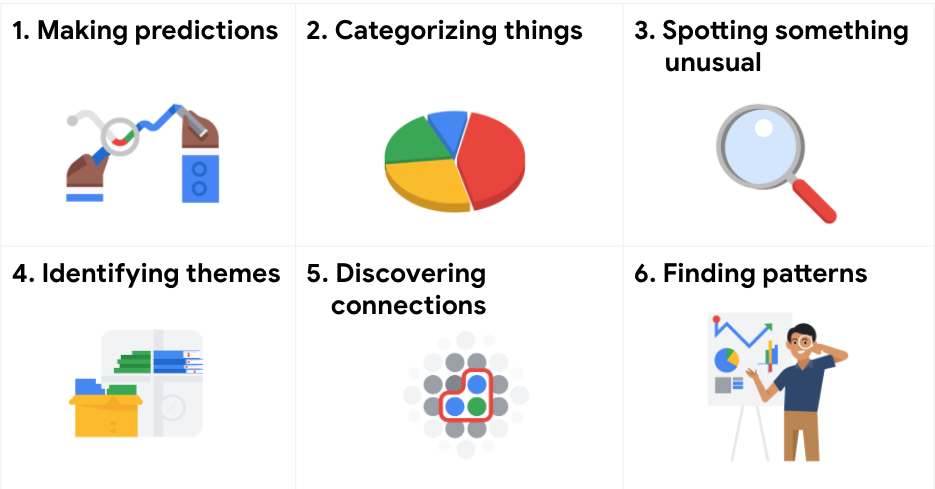

# Resolver problemas con datos

## Tipos de problemas comunes

Como analista de datos, aprenderás que los problemas están en el centro de lo que haces todos los días

Los problemas son oportunidades para practicar tus habilidades y buscar soluciones creativas y perspicaces. Los proble-
mas pueden ser pequeños o grandes, simples o complejos.
Ningún problema es como otro y todos requieren un enfoque ligeramente diferente, pero el primer paso es siempre el
mismo: entender qué tipo de problema tratas de resolver, y de eso vamos a hablar ahora. Los analistas de datos trabajan
con una variedad de problemas.

Estos incluyen hacer predicciones, categorizar cosas, detectar algo inusual, identificar temas, descubrir conexiones y
buscar patrones.

-**hacer predicciones:**Este tipo de problema implica el usar datos para tomar una decisión informada sobre cómo pueden
ser las cosas en el futuro.

-**categorizar cosas:**Esto significa asignar información a diferentes grupos según sus características comunes.
  
-**detectar algo inusual:**En este tipo de problema, los analistas de datos identifican datos que son diferente de lo
  normal.
  
-**identificar temas:**toma la categorización y va un paso más allá agrupando los datos en conceptos más amplios.
  
-**descubrir conexiones:**permite a los analistas de datos encontrar desafíos similares enfrentados por entidades dife-
  rentes y luego combinar datos e información para abordarlos.

-**buscar patrones:**Los analistas de datos usan datos para buscar patrones mediante datos históricos para entender lo
 que pasó en el pasado y que, por lo tanto, es probable que vuelva a suceder.

Los 6 tipos de problemas ejemplificados

Hacer predicciones

Una empresa que quiere conocer el mejor método publicitario para atraer nuevos clientes es un ejemplo de un problema que
requiere que los analistas hagan predicciones. Los analistas con datos sobre la ubicación, el tipo de medio y la canti-
dad de nuevos clientes adquiridos como resultado de anuncios anteriores no pueden garantizar resultados futuros, pero
pueden ayudar a predecir la mejor ubicación de la publicidad para llegar al público objetivo.

Categorizar cosas

Un ejemplo de un problema que requiere que los analistas categoricen cosas es el objetivo de una empresa de mejorar la
satisfacción del cliente. Los analistas pueden clasificar las llamadas de servicio de atención al cliente en función de
determinadas palabras clave o puntuaciones. Esto podría ayudar a identificar a los representantes de servicio de aten-
ción al cliente con mejor desempeño o ayudar a correlacionar ciertas acciones tomadas con puntajes más altos de satis-
facción del cliente.

Detectar algo inusual

Una empresa que vende relojes inteligentes que ayudan a las personas a controlar su salud estaría interesada en diseñar
su software para detectar algo inusual. Los analistas que analizaron datos de salud agregados pueden ayudar a los desa-
rrolladores de productos a determinar los algoritmos correctos para detectar y activar alarmas cuando ciertos datos no
muestren una tendencia normal.

Identificar temas

Los diseñadores de experiencia del usuario (UX) pueden confiar en los analistas para analizar los datos de interacción
del usuario. De manera similar a los problemas que requieren que los analistas categoricen las cosas, los proyectos de
mejora de la usabilidad pueden requerir que los analistas identifiquen temas para ayudar a priorizar las características
correctas del producto para mejorarlas. Los temas se utilizan con mayor frecuencia para ayudar a los investigadores a
explorar ciertos aspectos de los datos. En un estudio de usuarios, las creencias, las prácticas y las necesidades de los
usuarios son ejemplos de temas.

A estas alturas, es probable que te estés preguntando si existe una diferencia entre categorizar cosas e identificar
temas. La mejor manera de pensarlo es la siguiente: categorizar cosas implica asignar elementos a categorías, mientras
que identificar temas lleva esas categorías un paso más allá agrupándolas en temas más amplios.

Descubrir conexiones

Una empresa de logística de terceros que trabaja con otra empresa para que los envíos se entreguen a tiempo a los clien-
tes es un problema que requiere que los analistas descubran conexiones. Al analizar los tiempos de espera en los centros
de envío, los analistas pueden determinar los cambios de programación apropiados para aumentar la cantidad de entregas
a tiempo.

Buscar patrones

Minimizar el tiempo de inactividad causado por fallas en las máquinas es un ejemplo de un problema que requiere que los
analistas busquen patrones en los datos. Por ejemplo, al analizar los datos de mantenimiento, es probable que descubran
que la mayoría de las fallas ocurren si el mantenimiento regular se retrasa más de 15 días.

Conclusión clave

A medida que avanzas en este programa, desarrollarás un ojo más agudo para los problemas y practicarás pensar detenida-
mente en los tipos de problemas cuando comiences tu análisis. Este método de resolución de problemas te ayudará a encon-
trar soluciones que satisfagan las necesidades de todos los interesados.
