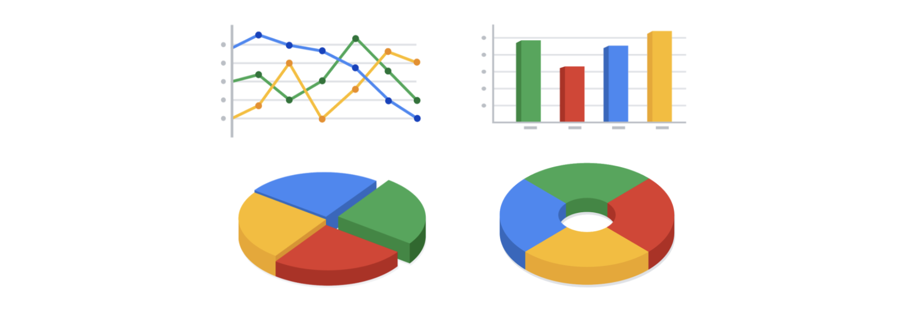

# Seguir la evidencia

## La gran revelación: compartir tus hallazgos

Dos herramientas de presentación de datos: informes y paneles.

### Informes

Un**informe** es una recopilación estática de datos que se entrega periódicamente a los interesados, son excelentes para
brindar imágenes de los datos históricos de alto nivel para una organización.

Caracteristicas de los informes:

    - Se pueden diseñar y enviar periódicamente, a menudo de forma semanal o mensual, como información organizada y de
      fácil referencia.

    - Son rápidos de diseñar y fáciles de usar siempre que los mantengas continuamente.

    - Usan datos estáticos o datos que no cambian una vez registrados, reflejan datos que ya se han limpiado y ordenado.

Desventajas de los informes:

    - Los informes necesitan un mantenimiento regular

    - no son visualmente atractivos.

    - Dado que no son automáticos ni dinámicos, los informes no muestran datos en vivo ni en evolución.

### Paneles

**Un panel**, monitorea los datos entrantes en vivo.

Caracteristicas de los paneles:

    - Le dan a tu equipo más acceso a la información registrada,

    - Puedes interactuar a través de los datos jugando con los filtros.

    - Son dinámicos, tienen un valor a largo plazo.

    - Si los interesados necesitan acceder continuamente a la información, un panel puede ser más eficiente que tener
      que generar informes una y otra vez, lo cual hace que ahorres mucho tiempo.

    - Son agradables a la vista.

Desventajas de los paneles:

    - Se requiere mucho tiempo para diseñarlos y, de hecho.

    - Pueden ser menos eficientes que los informes si no se usan con mucha frecuencia.

    - Si la tabla base se rompe en algún momento, necesita mucho mantenimiento para volver a funcionar.

    - En ocasiones, los paneles también pueden abrumar a las personas con información.

    - Si no sueles buscar datos en un panel, es posible que te pierdas en él.

#### Creación de un panel

Aquí hay un proceso que puedes seguir para crear un panel:

1. Identificar a los interesados que necesitan ver los datos y cómo los usarán

    Para empezar con esto, debes hacer preguntas efectivas. Consulta esta hoja de trabajo para la recopilación de requi-
    sitos [https://s3.amazonaws.com/looker-elearning-resources/Requirements+Gathering+Worksheet.pdf] para explorar una
    amplia gama de buenas preguntas que puedes hacer para identificar a los interesados relevantes y sus necesidades de
    datos. Este es un gran recurso para guiarte a través de este proceso una y otra vez.

2. Diseñar el panel (lo que se debe mostrar)

    Sigue estos consejos para que el diseño de tu panel sea claro, fácil de seguir y simple:

        - Usa un encabezado claro para etiquetar la información

        - Agrega descripciones de texto cortas a cada visualización

        - Muestra la información más importante en la parte superior

3. Crea prototipos si lo deseas

    Esto es opcional, pero a muchos analistas de datos les gusta esbozar sus paneles antes de crearlos.

4. Selecciona las visualizaciones que utilizarás en el panel

    Aquí tienes muchas opciones y todo depende de la historia de datos que cuentes. Si necesitas mostrar un cambio de
    valores a lo largo del tiempo, los gráficos de líneas o gráficos de barras podrían ser la mejor opción. Si tu obje-
    tivo es mostrar cómo cada parte contribuye a la cantidad total que se informa, un gráfico circular o de torta proba-
    blemente sea la mejor opción.

    

5. Crea filtros según sea necesario

    Los filtros muestran ciertos datos mientras ocultan el resto de los datos de un panel. Esto puede ser de gran ayuda
    para identificar patrones mientras se mantienen intactos los datos originales. Es común que los analistas de datos
    usen y compartan el mismo panel, pero administren su parte con un filtro.

### Tablas dinamicas

Una tabla dinámica es una herramienta de resumen de datos utilizada en el procesamiento de datos. Las tablas dinámicas
se usan para resumir, ordenar, reorganizar, agrupar, contabilizar, totalizar o promediar los datos almacenados en una
base de datos. Permite que los usuarios transformen las columnas en filas y las filas en columnas.

crear tabla dinamica en google sheet:

    1. Seleccionaremos el menú Datos y haremos clic en el botón Tabla dinámica.

    2. Eso te permite extraer los datos de esta tabla. Podemos simplemente presionar Crear, lo cual generará una nueva
    hoja de cálculo.

    3. nos muestra los campos de la tabla dinámica que podemos elegir. Haremos clic en seleccionar, vendedor e ingresos.

## Datos versus métricas

### Las metricas

Una métrica es un tipo único y cuantificable de datos que pueden utilizarse para la medición, cuando los datos son orga-
nizados en métricas individuales representan un único tipo de datos.

Las métricas también se pueden combinar en fórmulas en las que puedes conectar tus datos numéricos, tambien suelen im-
plicar matemáticas simples.

Ejemplos de metricas:

- el ROI(Rotorno sobre inversion):

   es esencialmente una fórmula diseñada usando métricas que permiten que una empresa sepa qué tan bien funciona una in-
   versión. El ROI se compone de dos métricas: el beneficio neto durante un período de tiempo y el costo de la inversión.
   Al comparar estas dos métricas, beneficio y costo de la inversión, la empresa puede analizar los datos que tiene para
   ver qué tan bien funciona su inversión. Esto puede ayudarles a decidir cómo invertir en el futuro y qué inversiones
   priorizar.

Las diferentes industrias usan todo tipo de métricas diferentes, pero hay una cosa que todas tienen en común:

        **todas intentan alcanzar un objetivo específico midiendo datos.**

Este objetivo métrico es un conjunto de objetivos medibles establecido por una empresa y evaluado mediante métricas.
Y así como existen muchas métricas posibles, también existen muchos objetivos posibles.

### Los datos

Cabe recordar que los datos empiezan como una colección de hechos sin procesar, y contienen muchos detalles sin procesar
sobre el problema que exploramos.
