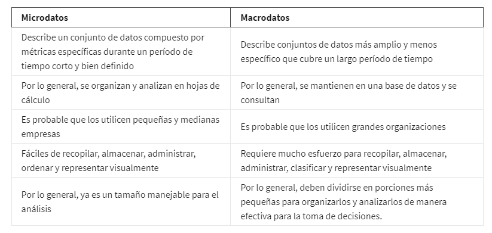
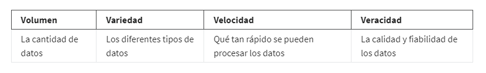

# Conecta los puntos de datos

## Pensamiento matematico

El pensamiento matemático es una habilidad poderosa que puedes usar para ayudarte a resolver problemas y crear nuevas
soluciones.

## Macro datos y Micro datos

Trabajar con el enfoque de pensamiento matematico Significa mirar un problema y desglosarlo lógicamente paso a paso,
para que puedas ver la relación de los patrones en tus datos y usar eso para analizar tu problema.

Este tipo de pensamiento también puede ayudarte a encontrar las mejores herramientas para el análisis porque nos permite
ver los diferentes aspectos de un problema y elegir el mejor enfoque lógico. Una forma de decidir qué herramienta usar
es según el tamaño de tu conjunto de datos. Cuando trabajes con datos, encontrarás que hay datos grandes y pequeños.

Los datos pequeños pueden ser realmente pequeños. Estos tipos de datos tienden a estar compuestos por conjuntos de datos
relacionados con métricas específicas durante un período de tiempo corto y bien definido

**Los datos pequeños** pueden ser útiles para tomar decisiones diarias, Puedes utilizar hojas de cálculo para organizar
y analizar conjuntos de datos más pequeños

**los macrodatos o grandes conjuntos de datos** tienen conjuntos de datos menos específicos que abarcan un período de
tiempo más largo. Por lo general, es necesario desglosarlos para analizarlos. Los macrodatos son útiles para analizar
cuestiones y problemas a gran  escala, y ayudan a las empresas a tomar decisiones importantes. Cuando trabajas con datos
a mayor escala, puedes cambiar a SQL.

cuadro comparativo Micro datos vs Macro datos

### Desafíos y beneficios de los Macro datos

Estos son algunos de los desafíos que puedes enfrentar al trabajar con macrodatos:

    - Muchas organizaciones se enfrentan a la sobrecarga de muchos datos e información sin importancia o irrelevante.

    - Los datos importantes se pueden ocultar en el fondo con todos los datos no importantes, lo que hace que sea más
      difícil encontrarlos y usarlos. Esto puede provocar plazos de toma de decisiones más lentos e ineficientes.

    - Los datos que necesitas no siempre son fácilmente accesibles.

    - Las herramientas y soluciones tecnológicas actuales todavía luchan por proporcionar datos medibles que se puedan
      informar. Esto puede conducir a un sesgo algorítmico injusto.

    - Hay brechas en muchas soluciones empresariales de macrodatos.

Beneficios que vienen con los macrodatos:

    - Cuando se pueden almacenar y analizar grandes cantidades de datos, esto puede ayudar a las empresas a identificar
      formas más eficientes de hacer negocios y ahorrar mucho tiempo y dinero.

    - Los macrodatos ayudan a las organizaciones a detectar las tendencias de los patrones de compra de los clientes y
      los niveles de satisfacción, lo cual puede ayudarlas a crear nuevos productos y soluciones que harán felices a los
      clientes.

    - Al analizar los macrodatos, las empresas obtienen una comprensión mucho mejor de las condiciones actuales del mer-
      cado, lo cual puede ayudarlas a mantenerse por delante de la competencia.

Los macrodatos ayudan a las empresas a realizar un seguimiento de su presencia en línea, en especial de los comentarios,
tanto buenos como malos, de los clientes. Esto les da la información que necesitan para mejorar y proteger su marca.

Las tres (o cuatro) palabras V para los macrodatos:

Los analistas tienen en cuenta las siguientes caracteristicas en cuanto ha datos de gran tamaño:

    volumen, variedad, velocidad y veracidad.

    volumen   -> cantidad de datos.
    variedad  -> los diferentes de tipos de datos.
    velocidad -> se refiere a la velocidad de procesamiento de los datos
    veracidad -> se refiere a la calidad y fiabilidad de los datos

