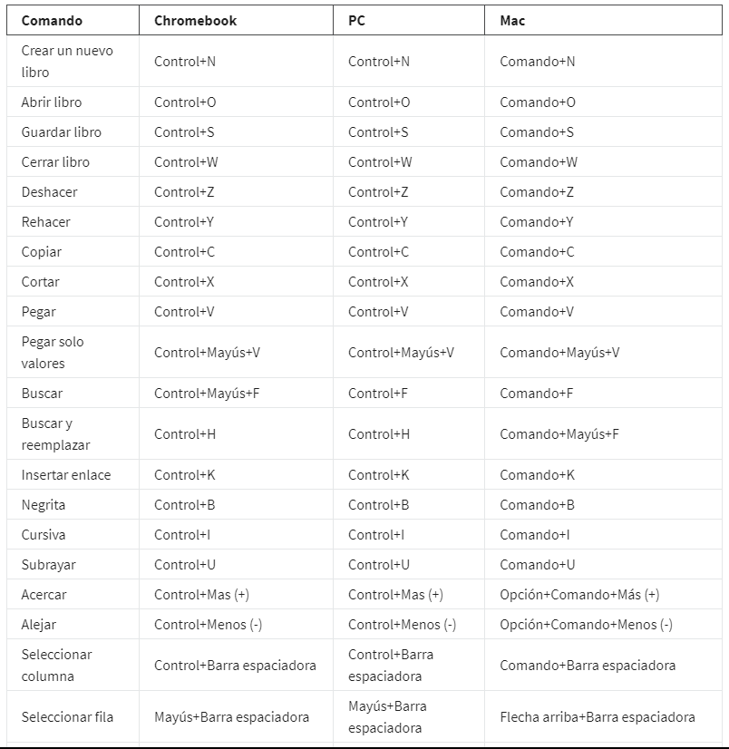
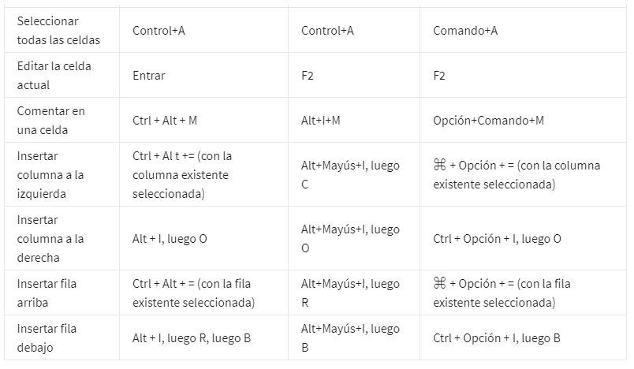

# Funciones en hojas de cálculo

## Funciones

Una función es un comando preestablecido que realiza automáticamente un proceso o tarea específicos usando datos y al
igual que las fórmulas, inicia todas tus funciones con un signo igual; por ejemplo, =SUMA. El signo igual le dice a la
hoja de cálculo que lo que sigue es parte de una función, no solo una palabra o un número en una celda.

Las hojas de cálculo tienen algo llamado controlador de relleno. Es una pequeña caja que aparece en la esquina inferior
derecha cuando haces clic en una celda, este copiara la formula o funcion en la celdas a donde arrastremos el cursor.

Entre las funciones mas usadas tenemos:

- Sum/Suma -> =SUMA(AQUI EL RANGO DE CELDAS QUE DESEAS SUMAR) suma los valores de un rango
- AVERAGE/PROMEDIO -> =PROMEDIO(AQUI EL EL RANGO DE CELDAS QUE DESEAMOS PROMEDIAR) extrae el promedio de un rango
- MIN/MINIMO -> =MIN(AQUI EL EL RANGO DE CELDAS EN LAS QUE SE DESEA OBTENER EL VALOR MINIMO)
- MAX/MAXIMO -> =MIN(AQUI EL EL RANGO DE CELDAS EN LAS QUE SE DESEA OBTENER EL VALOR MAXIMO)

Para usar una funcion iniciamos por  escribir el signo igual, la mayoría de las aplicaciones de hoja de cálculo muestran
un menú de autocompletar que enumera funciones, nombres y cadenas de texto válidos. Esta es una excelente manera de
crear y editar funciones, al tiempo que se evitan errores de escritura y sintaxis.

Una manera entretenida de aprender nuevas fórmulas consiste, simplemente, en escribir un signo igual y una sola letra
del alfabeto. Elige una de las opciones que aparecen para saber lo que hace esa función.

## Diferencia entre fórmulas y funciones

    - Una fórmula es un conjunto de instrucciones que se usa para hacer un cálculo usando los datos
      de una hoja de cálculo.

    - Una función es un comando preestablecido que ejecuta automáticamente un proceso o tarea espe-
      cíficos mediante el uso de los datos de una hoja de cálculo.

## Funciones populares

Muchas personas no se dan cuenta de que los atajos de teclado, como cortar, guardar y buscar, son, en realidad, funcio-
nes. Estas funciones están integradas en una aplicación y ahorran tiempo de una manera increíble. El uso de atajos te
permite hacer más trabajo con menos esfuerzo. Pueden hacerte más eficiente y productivo porque no estás buscando el
mouse y navegando por los menús de manera continua. En la siguiente tabla, se muestran algunos de los accesos directos
más populares para Chromebook, PC y Mac:

para referencias rapidas sobre las funciones consultar:

[Referencia Rapida_I](funciones%20referencia%20rapida.docx)
[Referencia Rapida_II](funciones%20referencia%20rapida_II.docx)
