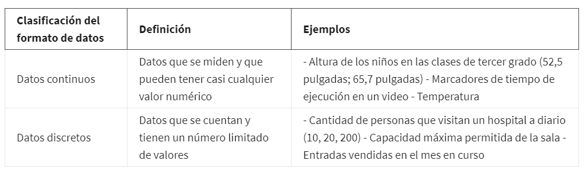
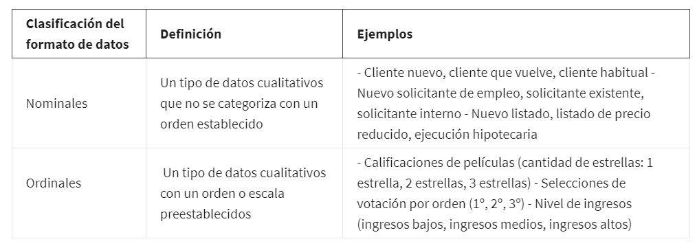
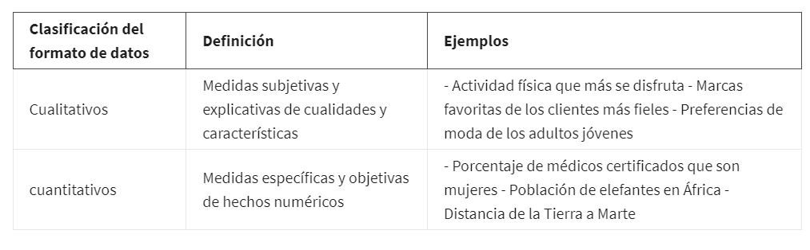
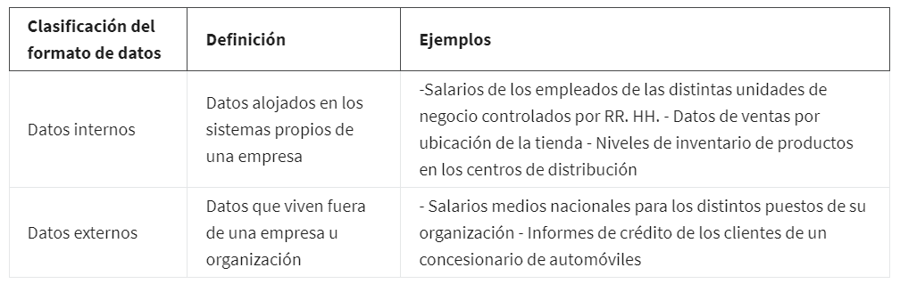
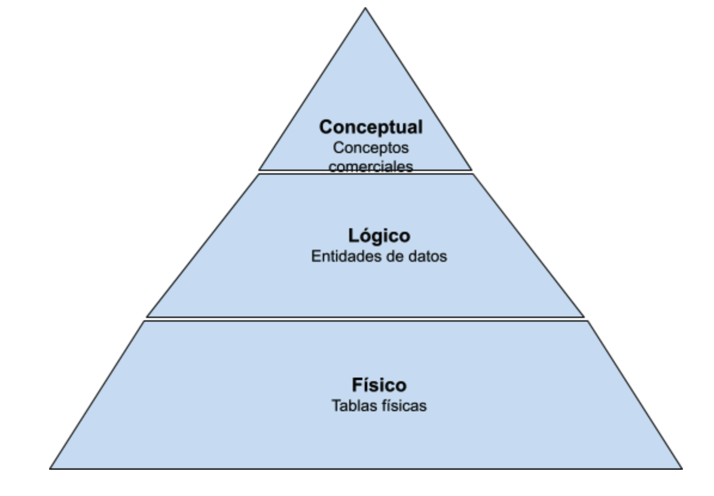
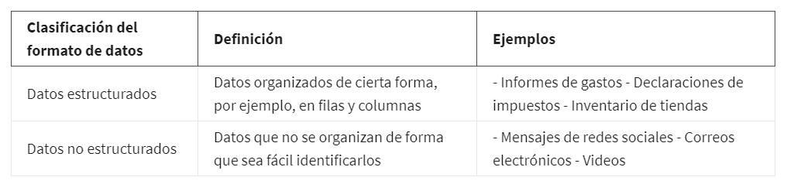
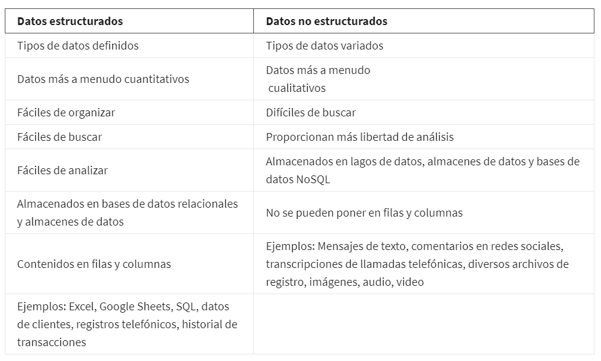
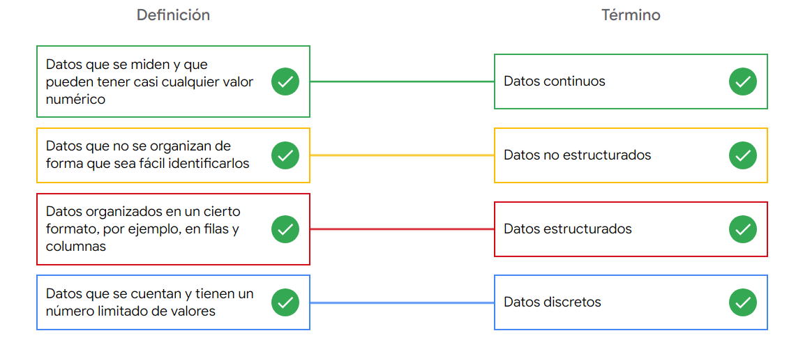
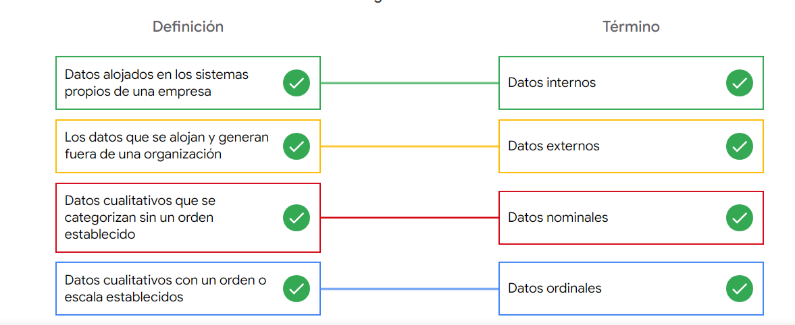

# Diferenciar entre formatos y estructuras de datos

## Datos son cuantitaivos

Son cuantitaivos porque se pueden contar, medir o expresarse fácilmente con números, Este dato cuenta con una
cierta cantidad, monto o rango.

Los datos cuantitativos los subdividimos en *datos discretos y continuoss*:

    Los datos discretos: Estos son datos que se cuentan y tienen una cantidad de valores limitada.

    Los datos continuos: pueden medirse utilizando un cronómetro y su valor se puede mostrar como un decimal con varias
    posiciones, en consecuencia pueden tener casi cualquier valor numerico.

### Diferencia entre datos discretos y continuos

## Los datos cualitativos

Son colocados normalmente listados como un nombre, una categoría o una descripción.

    Los datos nominales: son un tipo de datos cualitativos que se categorizan sin ningún orden establecido. En otras
    palabras, estos datos no tienen una secuencia, tambien s se utilizan para etiquetar variables sin ningún valor cuan-
    titativo. Los ejemplos comunes incluyen hombre/mujer (aunque algo anticuado), color de cabello, nacionalidades,
    nombres de personas, etc.
    
    Los datos ordinales: son un conjunto de datos cualitativos con un orden o escala preestablecidos.

### Diferencia entre datos nominales y ordinales

### Diferencia entre datos cualitativos y cuantitativos

## Los datos internos

Son los datos que viven dentro de los propios sistemas de una empresa. Sí una organizacion ha
compilado todos los datos en la hoja de cálculo utilizando su propio método de recolección, entonces serían sus datos
internos.la principal cracteristica de los datos internos es que por lo general son más confiables y fáciles de recolectar.

## Los datos externos

son datos alojados y generados fuera de una organización, son especialmente valiosos cuando tus análisis dependen de to-
das las fuentes disponibles posibles.

Diferencias entre datos internos y externos:

    Todos los anteriores son del tipo estrcuturado.

## Los datos estructurados

Son datos que se organizan en un formato determinado, como filas y columnas. Las hojas de cálculo y las bases de datos
relacionales son dos ejemplos de software que pueden almacenar datos de modo estructurado.

Este tipo se basa en el pensamiento estructurado que brinda un framework para resolver problemas o preguntas de manera
logica y ordenada, de la misma manera Puedes pensar en los datos estructurados del mismo modo. Con un framework para los
datos, los datos son fácilmente rastreables y están más preparados para el análisis.

Los datos estructurados trabajan muy bien dentro de un modelo de datos, que es un modelo utilizado para organizar los
elementos de datos y la forma en que se relacionan entre ellos.

*los elementos de datos* Son piezas de información, tales como nombres de personas, números de cuentas y direcciones.

*Los modelos de datos* contribuyen a mantener la coherencia de los datos y brindan un mapa de cómo se organizan esos datos.
Esto hace que sea más fácil para los analistas y otros interesados encontrar sentido a sus datos y utilizarlos con pro-
pósitos empresariales.

### Modelado de datos

El modelado de datos es el proceso de creación de diagramas que representan visualmente cómo se organizan y estructuran
los datos.  Estas representaciones visuales se llaman modelos de datos. los distintos usuarios pueden tener necesidades
de datos diferentes, pero el modelo de datos les permite comprender la estructura en su conjunto.

#### Niveles de modelado de datos

Cada nivel de modelado de datos tiene un nivel de detalle diferente.

*El modelado conceptual de datos* ofrece una visión de alto nivel de la estructura de datos, como la forma en que los
datos interactúan en una organización. Por ejemplo, un modelo de datos conceptual puede utilizarse para definir los
requisitos comerciales de una nueva base de datos. Un modelo de datos conceptual no contiene detalles técnicos.

*El modelo de datos lógico* se centra en los detalles técnicos de una base de datos, como las relaciones, los atributos
y las entidades. Por ejemplo, un modelo de datos lógico define cómo se identifican los registros individuales en una base
de datos. Pero no detalla los nombres reales de las tablas de la base de datos. Ese es el trabajo de un modelo de datos
físico.

*El modelo de datos físico* describe el funcionamiento de una base de datos. Un modelo de datos físico define todas las
entidades y atributos utilizados; por ejemplo, incluye los nombres de las tablas, los nombres de las columnas y los tipos
de datos de la base de datos.

Mayor informacion en: [https://www.1keydata.com/datawarehousing/data-modeling-levels.html]

### Técnicas de modelado de datos

Hay muchos enfoques a la hora de desarrollar modelos de datos, pero dos métodos comunes son el Diagrama de Relación de
Entidades (ERD) y el diagrama del Lenguaje Unificado de Modelado (UML).

Los ERD son una forma visual de entender la relación entre las entidades del modelo de datos.

Los diagramas UML son diagramas muy detallados que describen la estructura de un sistema mostrando las entidades,
los atributos, las operaciones y las relaciones del sistema

Mayor informacion en: [https://dataedo.com/blog/basic-data-modeling-techniques]

#### Análisis de datos y modelado de datos

El modelado de datos puede ayudarte a explorar los detalles de alto nivel de tus datos y cómo se relacionan en los
sistemas de información de la organización. El modelado de datos a veces requiere un análisis de datos para entender
cómo se reúnen los datos; de esta manera, se sabe cómo mapear los datos. Por último, los modelos de datos facilitan la
comprensión de los datos por parte de todos los miembros de la organización y la colaboración con ellos.

#### Utilidad de los datos estructurados

los datos estructurados son útiles para las bases de datos. Esto facilita la tarea de los analistas de ingresar, consultar
y analizar los datos dondequiera que lo necesiten.

Contribuye a la visualización de los datos en forma más sencilla, ya que los datos estructurados pueden aplicarse
directamente a las tablas, los gráficos, mapas térmicos, paneles y la mayoría de las representaciones visuales de los
datos.

Las hojas de cálculo y las bases de datos que almacenan los conjuntos de datos son fuentes frecuentes de datos estructu-
rados

## Los datos no estructurados

Estos datos no están organizados de una forma fácilmente identificable. Los archivos de audio y video son ejemplos de
datos no estructurados porque no hay un modo claro para identificar y organizar el contenido. Los datos no estructurados
pueden contar con una estructura interna, pero los datos no se ubican prolijamente en filas y columnas como los datos
estructurados.

### diferencia entre datos estructurados y no estructurados

### Caracteristicas de los datos estructurados vs los no estructurados

## El problema de la equidad

La falta de estructura hace que los datos no estructurados sean difíciles de buscar, gestionar y analizar. Pero los re-
cientes avances en inteligencia artificial y algoritmos de aprendizaje automático están empezando a cambiar esta situa-
ción. Ahora, el nuevo reto al que se enfrentan los científicos de datos es asegurarse de que estas herramientas sean
inclusivas e imparciales. De lo contrario, ciertos elementos de un conjunto de datos estarán más ponderados y/o represen-
tados que otros. Un conjunto de datos no equitativo no representa con exactitud a la población, causando resultados ses-
gados, bajos niveles de precisión y análisis poco fiables.

## tablas resumen de los tipos de datos

