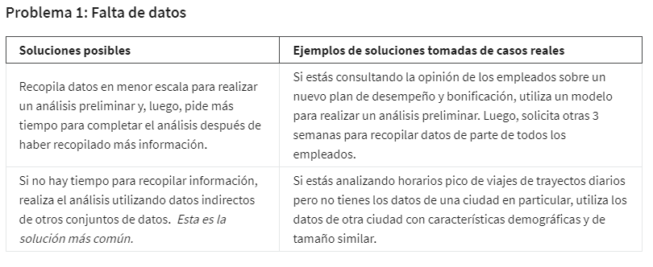
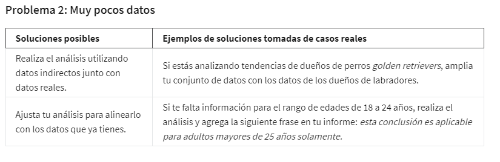
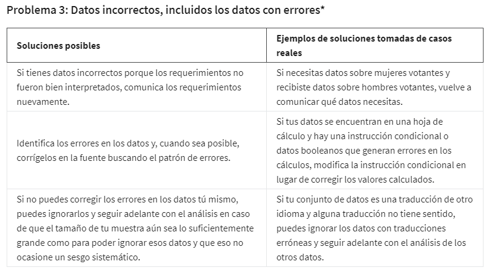
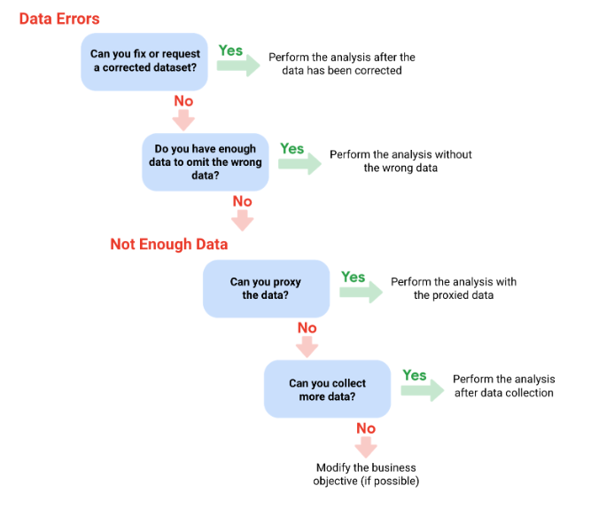
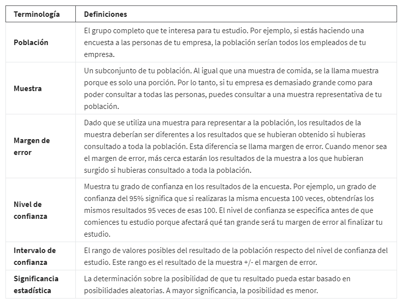
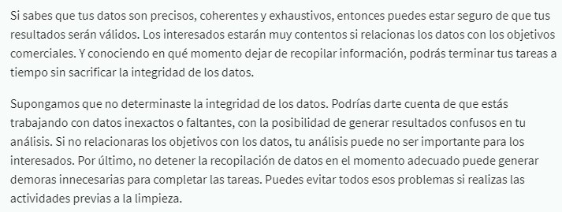

# Supera los desafíos de datos insuficientes

## Qué hacer en caso de datos insuficientes

- Establecer si el marco de tiempo que representa el set de datos es suficiente para el analisis o por el contrario es
  preferible ajustar el objetivo de los interesados o esperar algun tiempo para obtener mas datos.

- Establecer si la antiguedad de los datos los hace aun validos para el analisis, puede que no incluyan los datos mas actuales
  y deban ser actualizados para trabajar con un nuevo set de datos.

- Los datos limitados geográficamente también pueden ser poco confiables, en solo un país. Querrías un conjunto de datos
  que incluyera a todos los países.

En sintesis es posible lidiar con los datos insuficientes al  identificar las tendencias con los datos disponibles o es-
perar más datos si el tiempo lo permite; también puedes hablar con los interesados y ajustar tu objetivo; o puedes buscar
un conjunto de datos nuevo.

## Qué hacer cuando encuentras un problema en tus datos

Cuando te preparas para realizar un análisis de datos, podrías darte cuenta de que no tienes los datos que necesitas o
que no son suficientes. En algunos casos, puedes usar lo que se conoce como datos indirectos en lugar de datos reales. En
otros casos, puede no haber un sustituto razonable y tu única opción será recopilar más datos.

Ejemplos de problemas y posibles soluciones a considerar:

*Nota importante:* a veces los datos con errores pueden ser una señal de advertencia sobre la falta de confiabilidad de los
datos.

El siguiente diagrama de flujo puede ayudar a tomar la decision correcta:

## La importancia del tamaño de la muestra

Para los analistas de datos, una población representa a todos los valores de datos posibles de un conjunto de datos determinado.

Cuando utilizas un tamaño de muestra o una muestra representativa, usas una parte de una población que es representativa
de la población. El objetivo es obtener suficiente información de un grupo pequeño dentro de una población para formular
predicciones o conclusiones sobre la población total.

El tamaño de la muestra ayuda a asegurar el grado respecto del cual puedes estar confiado en que tus conclusiones repre-
sentan con precisión a la población,  es más rentable y lleva menos tiempo. Si se hace con cuidado y a conciencia, puedes
obtener los mismos resultados usando un tamaño de muestra en lugar de intentar trabajar con todo el 100% del conjunto.

Cuando utilizas únicamente una muestra pequeña de una población, puede llevar a la incertidumbre. No puedes estar el 100%
seguro de que tus estadísticas son una representación precisa y completa de la población. Esto lleva a un sesgo del muestreo.

*El sesgo del muestreo* ocurre cuando una muestra no es representativa de toda la población en su conjunto. Esto significa que
algunos miembros de la población están siendo sobre o subrepresentados.

Lo anterior puede ser mitigado al Utilizar un*muestreo aleatorio*puede ayudar a resolver algunos de esos problemas rela-
cionados con el sesgo del muestreo.*El muestreo aleatorio* es una forma de seleccionar una muestra de una población de
manera que cada tipo posible de la muestra tenga una posibilidad igual de ser elegido.

## Cómo calcular el tamaño de la muestra

terminos a tener en cuenta:

### Puntos para recordar al momento de determinar el tamaño de tu muestra

Al planificar el tamaño de una muestra, hay algunos puntos para tener en cuenta:

- No utilizar muestras menores de 30. Está probado estadísticamente que 30 es el tamaño mínimo de muestra a partir del
  cual el resultado promedio de la muestra comienza a representar el resultado promedio de la población.

  ¿Por qué un tamaño mínimo de muestra de 30? Esta recomendación está basada en el*Teorema del límite central (TLC)*del
  campo de probabilidades y estadísticas. A medida que aumenta el tamaño de la muestra, los resultados se asemejan más a
  la distribución normal (en forma de campana) de una gran cantidad de muestras. El mínimo de la muestra es 30 para que
  el teorema TLC sea válido. Los investigadores que se basan en el análisis de regresión (métodos estadísticos para de-
  terminar las relaciones entre variables controladas y dependientes) también prefieren un mínimo de muestra de 30.

- El nivel de confianza comúnmente utilizado es 95%, pero 90% puede funcionar en algunos casos.

Aumentar el tamaño de la muestra para cumplir con ciertas necesidades del proyecto:

- Para un mayor nivel de confianza, utilizar un tamaño de muestra más grande

- Para disminuir el margen de error, utilizar un tamaño de muestra más grande

- Para una mayor significancia estadística, utilizar un tamaño de muestra más grande

Los tamaños de muestras varían según el problema del negocio

- El tamaño de la muestra variará con base al tipo de problema del negocio que estés intentando resolver.

Los tamaños de encuestas más grandes son más costosos

Evaluar el costo frente al beneficio de obtener resultados más precisos con un tamaño de muestra más grande. No es lo mismo
alguien que intenta conocer las preferencias de los consumidores sobre una nueva línea de productos no necesitaría un tamaño
de muestra tan grande como alguien que intenta conocer los efectos de una nueva droga. En el caso de la seguridad de los
medicamentos, los beneficios superan el costo adicional de utilizar un tamaño de muestra más grande. Pero para las pre-
ferencias de los consumidores, una muestra más pequeña podría brindar resultados aceptables a menor costo.

Referencias:

[https://www.investopedia.com/terms/c/central_limit_theorem.asp]

[https://www.statisticssolutions.com/dissertation-resources/sample-size-calculation-and-sample-size-justification/sample-size-formula/]

es posible con luir que:

