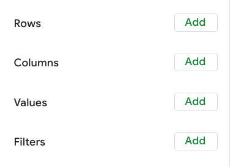

# tablas dinamicas

Las tablas dinámicas te permiten ver los datos de varias formas para hallar conclusiones y tendencias.

El menú desplegable Resumir por cambia la función aplicada a los valores. La función SUM es la función predeterminada,
pero existen otras opciones, tales como COUNT.

Un campo nuevo en una tabla dinámica que realiza ciertos cálculos en base a los valores de otros campos. Un campo calculado
dentro de una tabla dinámica se utiliza para realizar cálculos basados en los valores de otros campos. El campo calculado
se añade como una fila o columna adicional en una tabla dinámica.

Las tablas dinámicas posibilitan el hecho de ver los datos de varias maneras a fin de identificar las conclusiones y las
tendencias. Ayudan a que rápidamente encontremos sentido a conjuntos de datos más grandes comparando la métrica, realizando
cálculos y generando informes. También son útiles para responder preguntas específicas sobre tus datos.

Una tabla dinámica tiene cuatro partes básicas: filas, columnas, valores y filtros.

Las filas de una tabla dinámica organizan y agrupan los datos que seleccionas horizontalmente.

Las columnas organizan y muestran verticalmente los valores de tus datos. Al igual que las filas, las columnas se pueden
extraer directamente del conjunto de datos o se pueden crear utilizando valores.

Los valores se utilizan para calcular y contar datos. Aquí es donde ingresamos las variables que deseamos medir. Esto es
también cómo creamos los campos calculados en las tablas dinámicas. teniendo en cuenta que un campo calculado es un campo
nuevo dentro de una tabla dinámica que realiza ciertos cálculos en función de los valores de otros campos.

la sección de filtros de una tabla dinámica te permite aplicar filtros en función de criterios específicos; simplemente
como filtros en hojas de cálculo habituales.

Poder utilizar las cuatro partes del editor de la tabla dinámica te permitirá comparar las diferentes métricas de tus datos
y realizar cálculos, que te ayudarán a obtener conclusiones valiosas.
