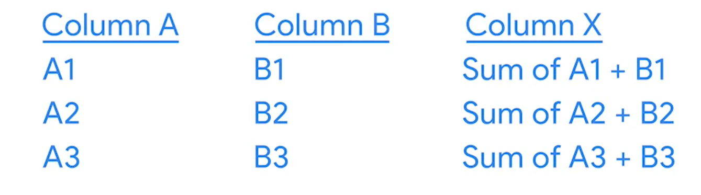
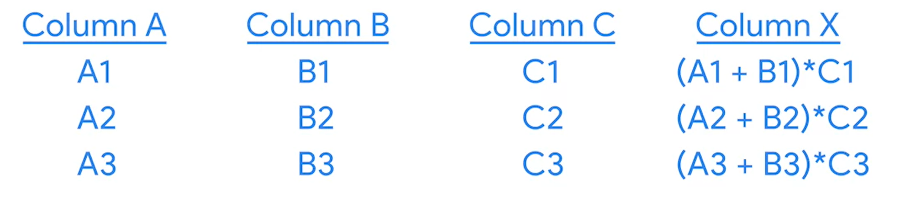

# Aprende más sobre los cálculos de SQL

Un operador es un símbolo que designa el tipo de operación o cálculo a realizarse en una fórmula. Como ya aprendiste antes,
los cuatro operadores aritméticos básicos en las fórmulas de las hojas de cálculo son:

- Signo más para la suma
- Menos o el guion para la resta
- Asterisco para la multiplicación
- Barra inclinada para la división.

Estos operadores calculan los datos de la misma manera cuando escribimos consultas en SQL. Los operadores están integrados
en las consultas cuando extraes datos de una base de datos. Al igual que en las fórmulas de las hojas de cálculo, hay
algunas formas diferentes para realizar cálculos utilizando consultas.

La sintaxis de una consulta es su estructura. Debería incluir todos los detalles específicos de los datos que quieres
extraer a una nueva tabla donde esos detalles deben colocarse.

Para sumar en sql tendiamos que, seleccionar las dos columnas que deseamos sumas, luego sumarlas y presentarlas como una
nueva columna la sintaxis seria la siguiente:

        SELECT

            columnaA,
            columnaB,
            columnaA + columnaB AS columnaC

        FROM

            tabla

Vista simbolica de la consulta anterior:

Es posible utilizar los parentecis para controlar el oreden de multiples operaciones:

        SELECT

            columnaA,
            columnaB,
            columnaC,
            (columnaA + columnaB) * columnaC AS columnaD

        FROM

            tabla

Vista simbolica de la consulta anterior:

El operador de módulo está representado por el símbolo de porcentaje. Este es un operador que da como resultado el resto
cuando se divide un número por otro. En una hoja de cálculo, puedes realizar el mismo cálculo con la función MOD.

Funciones como MOD(%), SUM, AVG, son llamadas funciones de agragado, las cuales realizan una operacion con uno o mas valores
y dan como resultado un valor unico.

## Cómo insertar cálculos simples en SQL

Los guiones bajos son las líneas que se usan para subrayar palabras y conectar caracteres de texto. No utilizamos espacios
porque pueden ser confusos para algunos servidores y aplicaciones. En cambio, los guiones bajos ayudan a evitar posibles
problemas y permiten leer correctamente los nombres.

Calcular el monto total de aguates totales vendidos por fecha, en todas las presentaciones

SELECT

    date,
    region,
    small_bags,
    large_bags,
    xlarge_bags,
    small_bags + large_bags + xlarge_bags AS toal_calc

FROM

    avocado_dat.avocado_prices

Obtener el porcentaje total de bolsas pequeñas de aguates por dia y region

SELECT

    date,
    region,
    small_bags,
    total_bags,
    (small_bags / total_bags) * 100 AS toal_samll_bags

FROM

    avocado_dat.avocado_prices

La consulta anterior puede marcar error de division por cer, asi que lo solucionamos filtrando para solo tener los totales
de bosas diferentes de 0:

SELECT

    date,
    region,
    small_bags,
    total_bags,
    (small_bags / total_bags) * 100 AS toal_samll_bags

FROM

    avocado_dat.avocado_prices

WHERE

    TOTAL_BAGS <> 0

*GROUP BY* es un comando que agrupa filas que tienen los mismos valores de una tabla en filas de resumen. El comando
GROUP BY se usa con instrucciones SELECT. En una consulta básica SELECT FROM o SELECT-FROM-WHERE, GROUP BY aparece al
final de la consulta.

    GROUP BY
        LA_COLUMNA_QUE_AGRUPA_EL_RESULTADO_DE_LA_CONSULTA

El comando *EXTRACT* nos permite extraer una parte de una fecha dada.

    EXTRACT(lo_que_queremos FORM la_columna_donde_esta)
