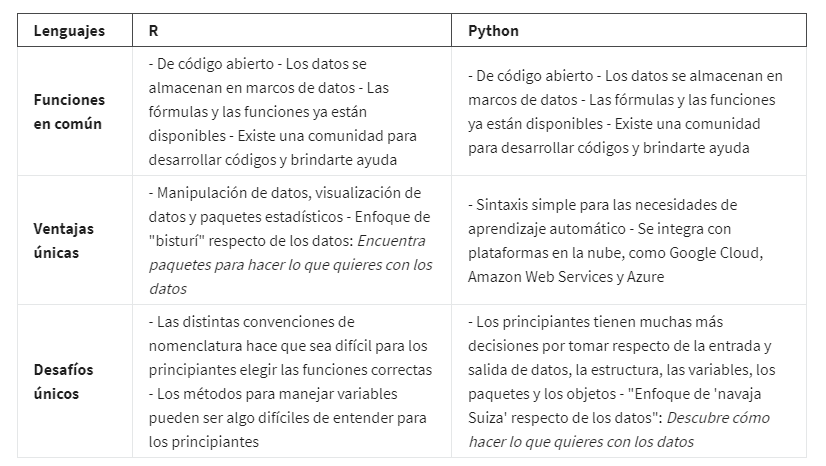

# Programacion en R

## El emocionante mundo de la programación

Introducción al emocionante mundo de la programación

sabes que el proceso de análisis de datos incluye seis etapas: preguntar, preparar, procesar, analizar, compartir y ac-
tuar. Ahora aprenderemos todo sobre el lenguaje de programación R y cómo puede ayudarte en cada etapa del proceso.

*Recordando el proceso de analisi y sus pasos:*

- Preguntar
- Preparar
- Procesar
- Anlaizar
- Compartir
- Actuar

La programación informática consiste en darle instrucciones a una computadora para que realice una acción o un conjunto
de acciones. Puedes usar diferentes lenguajes de programación para escribir esas instrucciones. Podrías elegir un lenguaje
específico según el proyecto que quieras llevar a cabo o el problema que quieras resolver.

El lenguaje de programación R es muy útil para organizar, limpiar y analizar datos.

## Debate: R versus Python

Para un principiante, todo lenguaje tiene algunas ventajas y, también, algunos desafíos. Pongámoslo en contexto: examinemos
R y Python.

