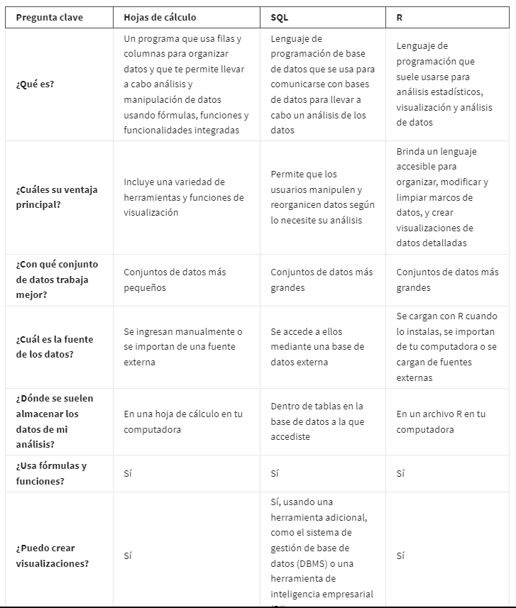

# Programar como analista de datos

## lenguajes de programacion

Un lenguaje de programación de uso general te permite crear tus propias aplicaciones y construir tus propias funciones
desde cero.

*Los lenguajes de programación* son las palabras y los símbolos que utilizamos para escribir instrucciones para que sigan
las computadoras.

Los lenguajes de programación tienen su propio conjunto de reglas sobre cómo deben usarse esas palabras y esos símbolos,
y se llama *sintaxis*. La sintaxis te muestra cómo organizar las palabras y los símbolos que ingreses para que tengan sen-
tido para la computadora.

*Codificar* es escribir instrucciones para la computadora utilizando la sintaxis de un lenguaje de programación
específico.

*Lenguajes para analisis de datos*:

R
Phyton
SAS
Scala
Julia

### Benefisios de los lenguajes de programacion en el area de analisis de datos

Aclarar los pasos de tu análisis:

    Los lenguajes de programación tienen reglas y pautas específicas para dar instrucciones a una computadora. Cuando le
    indicas a una computadora qué hacer, tus instrucciones tienen que ser muy claras. No puede haber ninguna incoherencia
    en la forma en que escribes el código. Si la hay, el código no funcionará. Traducir tus pensamientos en códigos te obliga
    a determinar exactamente cómo escribir cada paso de tu análisis y cómo hacer para que los pasos encajen. Le da a tu
    análisis un nivel de precisión que lo hace realmente poderoso.

Ahorrar tiempo

    tomemos el proceso de limpieza y transformación de datos. Con una línea de código puedes crear un conjunto de datos
    separado sin perder ningún valor. Con otra línea, puedes aplicar varios filtros a tus datos. Eso te permite emplear
    menos tiempo para preparar tus datos y más tiempo para el análisis en sí.

Reproducir y compartir tu trabajo con facilidad.

    El análisis de datos es más útil cuando puedes reproducir tu trabajo y compartirlo con otras personas. Ellas pueden
    volver a revisarlo y ayudarte a resolver problemas. El código almacena automáticamente todos los pasos de tu análisis
    para que puedas reproducirlo y compartir tu trabajo en cualquier momento a futuro, ya sean semanas, meses o incluso
    años después.

## hojas de calculo, SQl, R

Aqui un cuadro comparativo de las tres herramientas y cuando usarlas:

## ¿Qué es R?

R es un lenguaje de programación que se usa con frecuencia para análisis estadísticos, visualización y análisis de datos.

R es lo que se conoce como un lenguaje de programación centrado en los datos. Se diseñó específicamente para facilitar el
análisis de datos, y hacerlo más eficiente y más poderoso.

### Razones para elejir R

R es *accesible*, está centrado en los datos, es de código abierto y tiene una comunidad activa de usuarios. En primer lugar,
R es un lenguaje accesible para principiantes. Muchas personas que no tienen un lenguaje de programación específico apren-
den R.

R es que es de *código abierto*. Eso significa que el código está libremente disponible y puede ser modificado y compartido
por las personas que lo usan. Hagamos una pausa y veamos lo increíble que es esto. En primer lugar, cualquiera puede usar R
gratis. En segundo lugar, cualquiera puede modificar el código, arreglar errores y mejorarlo. De hecho, con el correr de
los años, muchos programadores excelentes hicieron mejoras y arreglos al código de R.

*La comunidad* de R es la mejor. Esa comunidad dinámica, diversa y accesible es muy solidaria con los nuevos estudiantes.
Puedes conectarte en cualquier momento para buscar respuestas a todas tus preguntas relacionadas con R. Visita sitios web
como R for Data Science Online Learning Community y RStudio Community.

### Usos de R

Reproducir tu análisis

        R puede guardar y reproducir cada paso de tu análisis. Antes vimos que el análisis de datos es más útil cuando
        puedes reproducir tu trabajo con facilidad y compartirlo con otros. En R, reproducir tu análisis es tan fácil
        como presionar un botón en tu teclado. Tu código lo guarda para siempre. Y puedes compartirlo con cualquiera en
        cualquier momento.

Procesar muchos datos

        Procesar muchos datos también es algo que R hace muy bien, al igual que SQL. Como ya aprendiste antes, las hojas
        de cálculo organizan proyectos en hojas o pestañas. Si alguna vez tuviste que lidiar con archivos en hojas de
        cálculo que tienen muchas hojas o muchos datos en cada hoja, sabes que las cosas pueden comenzar a funcionar
        muy lentamente. Trabajar con muchos datos en una hoja de cálculo incluso puede causar colapsos. R puede manejar
        muchas cantidades de datos de manera más rápida y eficiente.

Crear visualizaciones de datos

        R puede crear elementos visuales poderosos y tiene capacidades gráficas de última generación. Como has visto en
        este programa, las herramientas como las hojas de cálculo y Tableau ofrecen muchas opciones para visualizar tus
        datos. R está a otro nivel. Con solo un código breve puedes crear histogramas, diagramas de dispersión, diagramas
        de línea y mucho más. Y ese es solo el comienzo. Si trabajas con paquetes más avanzados, puedes realizar visua-
        lizaciones de datos realmente impresionantes.
