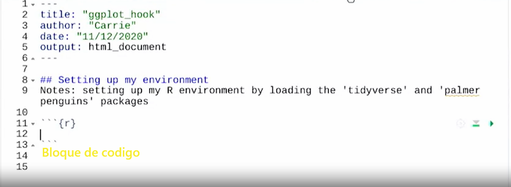
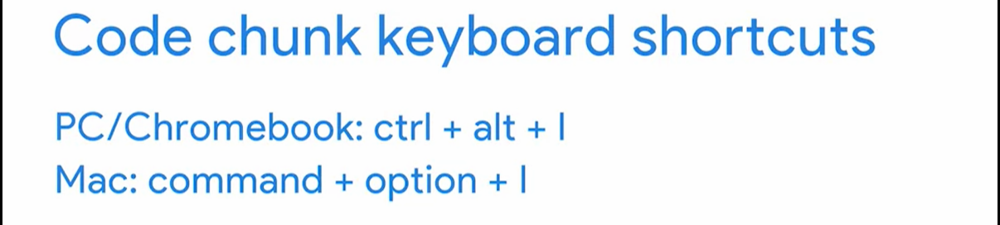

# Comprender bloques de códigos y exportaciones

## Bloques de códigos

El código que se agrega a un archivo R-MarkDown suele denominarse bloque de código.

Un delimitador es un carácter que indica el principio o el fin de un elemento de datos. También puedes escribir los de-
limitadores directamente en el archivo: tres comillas simples seguidas de la letra r entre llaves para comenzar el bloque
de código y tres comillas simples para finalizarlo.

Atajo de teclado para insertar bloque de codigo:

Entre las llaves se agrega un texto descriptivo para el bloque de codigo que nos permitira tener un path en la parte inferior
de la pantalla y con eso situarnos en el bloque de codigo que se este buscando, luego de las llaves y entre los delimitadores
ubicamos el codigo ejecutable, tal cual lo hariamos en un script de R, como se muestra en la siguiente imagen:

