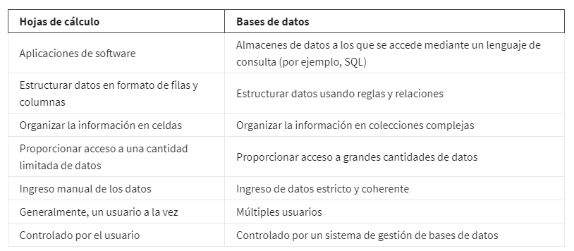

# kit de herramientas de analisis de datos

## Exploración de las herramientas del analista de datos

En el proceso del analisis de datos existen muchas herramientas utilizadas, pero las más comunnes son las hojas de cál-
culo, los lenguajes de consulta y las herramientas de visualización.

### Hojas de calculo

Una hoja de cálculo es una hoja de trabajo digital. Almacena, organiza y ordena los datos. Esto es
importante porque la utilidad de tus datos depende de qué tan bien estructurados estén. ejemplos muy conocidos de estas
herramientas son Excel y Google sheet, al ordenar tus datos puedes detectar patrones, agrupar información y encontrar
fácilmente la información que necesitas.

Las hojas de cálculo estructuran los datos de una manera comprensible y te permiten hacer lo siguiente:

    - Recopilar, almacenar, organizar y ordenar información

    - Identificar patrones y reunir los datos de una manera que se adapte a cada proyecto de datos específico

    - Crear excelentes visualizaciones de datos, como gráficos y tablas.

Las hojas de cálculo también tienen algunas características muy útiles llamadas **fórmulas y funciones,**
Una **fórmula** es un conjunto de instrucciones que realiza un cálculo específico con los datos de una hoja de cálculo.
También puedes usar fórmulas para encontrar el promedio de un conjunto de números, buscar un valor determinado, encon-
trar la suma de un conjunto de valores que cumplen con una regla en particular y mucho más.

Una**función**es un comando preestablecido que realiza automáticamente un proceso o tarea específicos con los datos de
una hoja de cálculo.

### Lenguaje de consulta

Es un idioma de programación informático que te permite encontrar y manipular datos en una base de datos. Aprenderás so-
bre algo llamado lenguaje de consulta estructurado, mayormente conocido como SQL.

El**SQL**es un lenguaje que permite que los analistas de datos se comuniquen con una base de datos. Una base de datos es
una colección de datos almacenados en un sistema informático, siendo este el lenguaje de consulta estructurado más utili-
zado por dos razones: es fácil de entender y funciona muy bien con todo tipo de bases de datos. Con el SQL, los analis-
tas de datos pueden acceder a los datos que necesitan al realizar una consulta.

Funciones de los lenguajes de consulta:

    - Hacen que los analistas puedan aislar información específica de unas bases de datos

    - Facilitan el aprendizaje y la comprensión de las solicitudes realizadas a las bases de datos

    - Permiten que los analistas seleccionen, creen, agreguen o descarguen datos de una base de datos para su análisis

### La visualización de datos

Es la representación gráfica de la información. Algunos ejemplos incluyen gráficos, mapas y tablas. La mayoría de las
personas procesan las imágenes con mayor facilidad que las palabras solas. Por eso, las visualizaciones son tan impor-
tantes. Ayudan a los analistas de datos a comunicar su conocimiento a los demás de una manera efectiva y convincente.
Cuando piensas en el proceso de análisis de datos, después de que los datos se preparan, procesan y analizan, el conoci-
miento se visualiza de una manera que se pueda entender y compartir. Algunas herramientas de visualización populares son
Power BI, Tableau y Looker.

Funciones de estas herramientas:

    - Convierten los números complejos en una historia que las personas pueden entender

    - Ayudan a los interesados a sacar conclusiones que permiten tomar decisiones informadas y elaborar estrategias em-
      presariales eficaces

    - Tienen múltiples características

**Tableau** ayuda a crear elementos visuales muy fáciles de entender. Looker también es popular entre los analistas de datos
porque les proporciona una manera fácil de crear imágenes basadas en los resultados de una consulta.

**Looker**, puedes darles a los interesados una imagen completa de tu trabajo, con los datos de visualización y los da-
tos reales relacionados con ella.

Hojas de calculo vs Bases de datos

