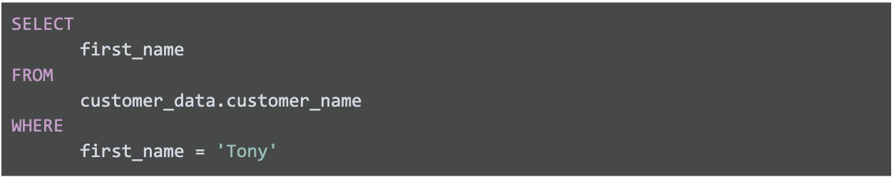
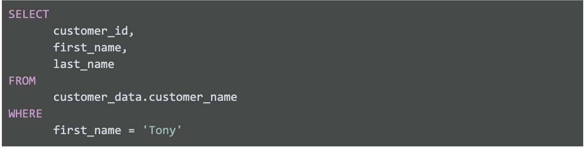

# Lenguaje de consulta estructurado (SQL)

## SQL en accion

Una consulta es una solicitud de datos o información proveniente de una base de datos. Esta es la estructura de una con-
sulta básica. Puedes ver que con esta consulta podemos seleccionar datos específicos de una tabla agregando dónde pode-
mos filtrar los datos en función de ciertas condiciones.

Cada lenguaje de programación, incluido SQL, sigue un conjunto de pautas único que se conoce como sintaxis. La sintaxis
es la estructura predeterminada de un lenguaje, que incluye todas las palabras, los símbolos y la puntuación requeridos,
así como su correcta colocación. Cuando escribes tus criterios de búsqueda con la sintaxis correcta, la consulta empieza
a trabajar en extraer los datos que solicitaste de la base de datos de destino.

Usos de SQL

    - Almacenar
    - Organizar
    - Anlyzar

Una**consulta es una solicictud de datos o informacion desde una base de datos**

La estructura de una consulta(Query) standar es:

    SELECT
        [Choose your columns you want]

    FROM
        [from appropiated table]

    WHERE
        [certain conditions met]

con * seleccionamos todos los datos

un ejemplo de consulta seria

SELECT * FROM movie_data.movies // el resultado seria todos los datos almacenados en la tabla peliculas

SELECT * FROM movie_data.movies WHERE Gebre__1_ = 'Action' // Solo trae las peliculas con genero de acccion

En la imagen anterior lo que sucede es lo siguiente:

ELEGIR (SELECT) la columna denominada nombre (first_name)

DESDE (FROM) una tabla denominada nombre_del_cliente (customer_data) (en un conjunto de datos denominado
nombre_del_cliente [customer_data]) (el nombre del conjunto de datos siempre va seguido de un punto y, a continuación,
del nombre de la tabla).

Pero solo se devuelven los datos DONDE (WHERE) el primer_nombre (first_name) es Tony

Es posible resumer la consulta basi como:

    SELECT (lo que quiere)s FROM (desde donde lo vas a buscar) WHERE (el filtro a usar si es necesario)

otro caso seria**Varias columnas en una consulta**

En la vida real, tendrás que trabajar con más datos, además de los clientes llamados Tony. El mismo comando SELECT
elige varias columnas que se pueden sangrar y agrupar.

Si solicitas varios campos de datos de una tabla, debes incluir estas columnas en el comando SELECT. Cada columna está
separada por una coma, como se muestra a continuación:

SELECT Column A, Column B, Column C FROM Table where the data lives WHERE certain condition is met

Este es un ejemplo de cómo aparecería en BigQuery:

SELECT customer_id, first_name, last_name FROM customer_data.customer_name WHERE first_name = 'Tony'

La consulta anterior usa tres comandos para localizar clientes que se llaman Tony:

ELEGIR (SELECT) las columnas denominadas id_del_cliente (customer_id), nombre (first_name) y apellido (last_name)

DESDE (FROM) una tabla denominada nombre_del_cliente (customer_data) (en un conjunto de datos denominado
nombre_del_cliente [customer_data]) (el nombre del conjunto de datos siempre va seguido de un punto y, a continuación,
del nombre de la tabla)3. Pero solo se devuelven los datos DONDE (WHERE) el nombre (first_name) es Tony”

Pero solo se devuelven los datos DONDE (WHERE) el nombre (first_name) es Tony
