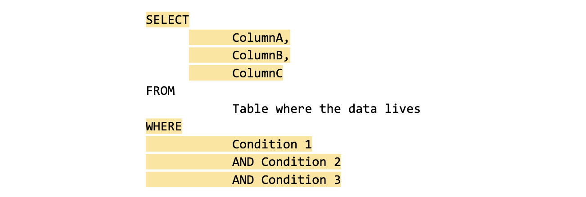
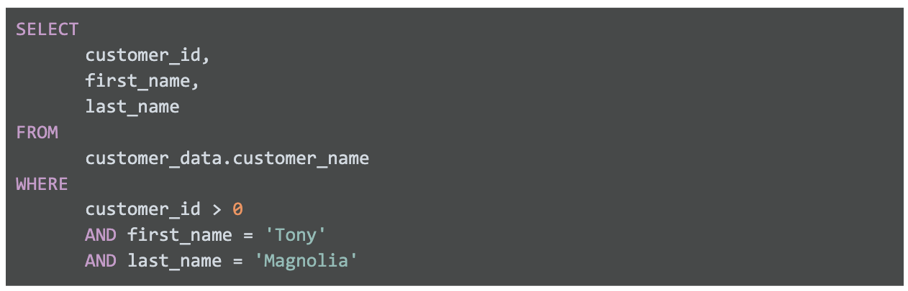
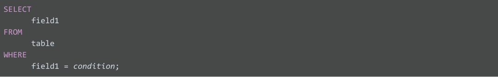
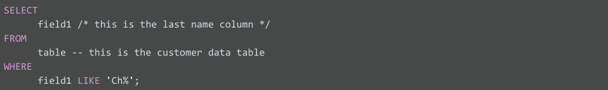
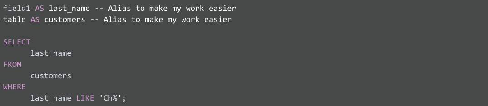

# Lenguaje de consulta estructurado (SQL)

## SQL en accion

Una consulta es una solicitud de datos o información proveniente de una base de datos. Esta es la estructura de una con-
sulta básica. Puedes ver que con esta consulta podemos seleccionar datos específicos de una tabla agregando dónde pode-
mos filtrar los datos en función de ciertas condiciones.

Cada lenguaje de programación, incluido SQL, sigue un conjunto de pautas único que se conoce como sintaxis. La sintaxis
es la estructura predeterminada de un lenguaje, que incluye todas las palabras, los símbolos y la puntuación requeridos,
así como su correcta colocación. Cuando escribes tus criterios de búsqueda con la sintaxis correcta, la consulta empieza
a trabajar en extraer los datos que solicitaste de la base de datos de destino.

Usos de SQL

    - Almacenar
    - Organizar
    - Anlyzar

Una**consulta es una solicictud de datos o informacion desde una base de datos**

La estructura de una consulta(Query) standar es:

    SELECT
        [Choose your columns you want]

    FROM
        [from appropiated table]

    WHERE
        [certain conditions met]

con * seleccionamos todos los datos

un ejemplo de consulta seria

SELECT * FROM movie_data.movies // el resultado seria todos los datos almacenados en la tabla peliculas

SELECT * FROM movie_data.movies WHERE Gebre__1_ = 'Action' // Solo trae las peliculas con genero de acccion

En la imagen anterior lo que sucede es lo siguiente:

ELEGIR (SELECT) la columna denominada nombre (first_name)

DESDE (FROM) una tabla denominada nombre_del_cliente (customer_data) (en un conjunto de datos denominado
nombre_del_cliente [customer_data]) (el nombre del conjunto de datos siempre va seguido de un punto y, a continuación,
del nombre de la tabla).

Pero solo se devuelven los datos DONDE (WHERE) el primer_nombre (first_name) es Tony

Es posible resumer la consulta basi como:

    SELECT (lo que quiere)s FROM (desde donde lo vas a buscar) WHERE (el filtro a usar si es necesario)

otro caso seria**Varias columnas en una consulta**

En la vida real, tendrás que trabajar con más datos, además de los clientes llamados Tony. El mismo comando SELECT
elige varias columnas que se pueden sangrar y agrupar.

Si solicitas varios campos de datos de una tabla, debes incluir estas columnas en el comando SELECT. Cada columna está
separada por una coma, como se muestra a continuación:

SELECT Column A, Column B, Column C FROM Table where the data lives WHERE certain condition is met

Este es un ejemplo de cómo aparecería en BigQuery:

SELECT customer_id, first_name, last_name FROM customer_data.customer_name WHERE first_name = 'Tony'

La consulta anterior usa tres comandos para localizar clientes que se llaman Tony:

ELEGIR (SELECT) las columnas denominadas id_del_cliente (customer_id), nombre (first_name) y apellido (last_name)

DESDE (FROM) una tabla denominada nombre_del_cliente (customer_data) (en un conjunto de datos denominado
nombre_del_cliente [customer_data]) (el nombre del conjunto de datos siempre va seguido de un punto y, a continuación,
del nombre de la tabla)3. Pero solo se devuelven los datos DONDE (WHERE) el nombre (first_name) es Tony”

Pero solo se devuelven los datos DONDE (WHERE) el nombre (first_name) es Tony

Ejemplo de**Multiples filtros where**

La consulta anterior usa tres comandos para localizar clientes con un ID de cliente válido (mayor que 0) cuyo nombre es
Tony, y su apellido es Magnolia.

ELEGIR (SELECT) las columnas denominadas id_del_cliente (customer_id), nombre (first_name) y apellido (last_name)

DESDE (FROM) una tabla denominada nombre_del_cliente (customer_data) (en un conjunto de datos denominado
nombre_del_cliente [customer_data]) (el nombre del conjunto de datos siempre va seguido de un punto y, a continuación,
del nombre de la tabla).

Pero solo devuelve los datos DONDE (WHERE) el ID_del_cliente (customer_id) es mayor que 0, el nombre (first_name) es
Tony y el apellido (last_name) es Magnolia.

Ten en cuenta que una de las condiciones es una condición lógica que comprueba si el ID_del_cliente (customer_id) es
mayor que cero.

## Con SQL podemos

Con lenguaje estructurado de consultas podemos estructurar las consultas, usar condiciones WHERE, elegir todas las colu-
mnas en una tabla, agregar comentarios y usar alias.

### Uso de mayúsculas, sangría y punto y coma

Para el lenguajes el usos de mayusculas y minusculas asi como las sangrias es indistinto, pero mantener una estructura
como la mostrada en la imagen anterior permite que el codigo sea mas legible, ya que no escribimos codigo para nosotros
sino para aquellos que deben ajustarlo al pasar el tiempo.

El punto y coma (;) se utiliza como un delimitador en SQL para separar sentencias individuales. En SQL, una sentencia e
 una instrucción que le indica a la base de datos qué operación debe realizar.

### Condiciones WHERE

la cláusula WHERE restringe la consulta para que la base de datos devuelva solo los datos con una coincidencia de valor
exacta, o los datos que coincidan con una determinada condición que deseas satisfacer.

La cláusula LIKE es muy poderosa porque te permite decirle a la base de datos que busque un patrón determinado.

    WHERE field1 LIKE 'Ch%'

El signo de porcentaje (%) se usa como comodín para que coincida con uno o más caracteres. Ten en cuenta que en algunas
bases de datos se usa un asterisco (*) como comodín en lugar de un signo de porcentaje (%).

### ELEGIR (SELECT) todas las columnas

En el ejemplo, si reemplazaras SELECT field1 por SELECT '*', elegirías todas las columnas de la tabla en lugar de la
columna field1 sola. Desde el punto de vista de la sintaxis, es una instrucción SQL correcta, pero debes usar el aste-
risco (*) con moderación y precaución. Según cuántas columnas tenga una tabla, es posible que elijas una enorme cantidad
de datos. Si eliges demasiados datos, es posible que la consulta se ejecute muy lentamente.

### Comentarios

Agregar comentarios junto a tu SQL para ayudarte a recordar qué representa el nombre. Los comentarios son textos coloca-
dos entre ciertos caracteres, (/*) y (*/), o después de dos guiones (--), como se muestra a continuación.

### Alias(AS)

uedes asignar un nuevo nombre o alias a los nombres de columna o tabla para que sea más fácil trabajar con ellos (y evi-
tar la necesidad de agregar comentarios). Esto se hace con una cláusula SQL AS.

En el ejemplo anterior se asigna el alias last_name a field1 y el alias customers a table.Estos alias son válidos solo
para la duración de la consulta. Un alias no cambia el nombre real de una columna o tabla de la base de datos.

### Ejemplo de aplicacion

#### El requerimiento

Gerencia requiere establecer el rango salarial de los empleados del area de TI y de esa manera establecer un reajuste
salarial a quienes lo requieran, estos empleados son aquellos que tiene el codigo de dependecia SFI y deben ser exclui-
dos los pasantes ya que estos tiene un regimen salarial distinto, estos son los que tienen codigo de dependencia INT.
El rango salarial no debe ser inferior a 30K y todos con menos de eso debe ser reajusados.

#### Desarrollo de la solucion

- Datos requerido por empleado, nombre, apellido, cod de dependencia, salario, ID empleado
- Traducido al nombre de las tablas d ela base de datos: extraer todas las columnas: empID, firstName, lastName, jobCode
y salary
- empleados  que tiene el codigo de dependecia SFI

        SELECT
            empID,
            firstName,
            lastName,
            jobCode,
            salary

        FROM
            Employee

        WHERE
            jobcode = 'SFI'

- Excluir a los pasantes, poseen el codigo INT

        SELECT
            empID,
            firstName,
            lastName,
            jobCode,
            salary

        FROM
            Employee

        WHERE
            jobcode = 'SFI'
            AND
            jobcode <> 'INT'

- Filtar los salarios y solo mostrar aquellos por debajo de 30000 para reajuste

        SELECT
            empID,
            firstName,
            lastName,
            jobCode,
            salary

        FROM
            Employee

        WHERE
            jobcode = 'SFI'
            AND
            jobcode <> 'INT'
            AND
            salary < 30000

Este ultimo sera el que le muestre a gerencia quienes ganan menos de 30K, con codigo SFI y que no son pasantes, por lo
cual deben ser reajustados sus salarios
