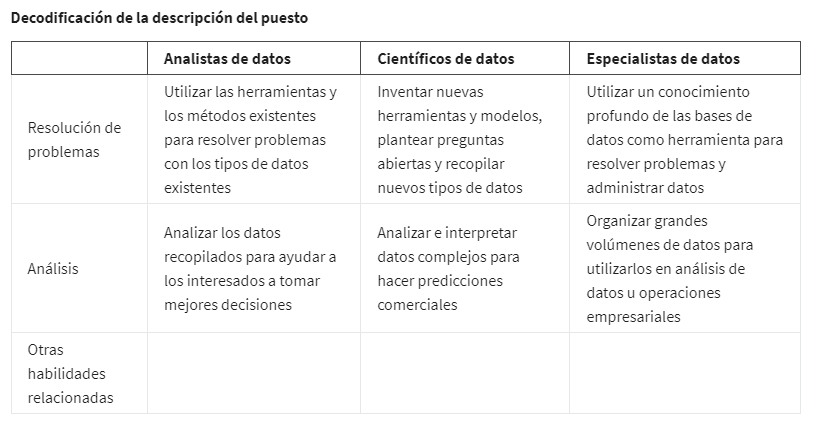

# Opcional: Explora tu próximo trabajo

## Funciones y descripciones del puesto del analista de datos

Nombraré algunos otros que suenan similares, pero que pueden no tener la misma función:

- Analista de negocios: analiza los datos para ayudar a las empresas a mejorar los procesos, productos o servicios
- Analista de inteligencia empresarial: analiza los datos para obtener información financiera o del mercado
- Consultor en análisis de datos: analiza los sistemas y modelos para el uso de datos
- Ingeniero de datos: prepara e integra datos de diferentes fuentes para uso analítico
- Científico de datos: utiliza habilidades expertas en tecnología y ciencias sociales para encontrar tendencias a través
del análisis de datos
- Especialista en datos: organiza o convierte los datos para utilizarlos en bases de datos o sistemas de software
- Analista de operaciones: analiza los datos para evaluar el rendimiento de las operaciones y los flujos de trabajo del
negocio

Analista de datos, científico de datos y especialista en datos suenan muy similares, pero se centran en tareas diferen-
tes.

## Especializaciones laborales por industria

Otros puestos de especialistas específicos de la industria que puedes encontrar en la búsqueda de empleo de analista de
datos incluyen los siguientes:

    - Analista de marketing: analiza las condiciones del mercado para evaluar las ventas potenciales de productos y
      servicios.
    - Analista de recursos humanos y nóminas: analiza los datos de nómina en busca de ineficiencias y errores
    - Analista financiero: analiza el estado financiero mediante la recopilación, el monitoreo y la revisión de datos
    - Analista de riesgos: analiza documentos financieros, condiciones económicas y datos de clientes para ayudar a las
      empresas a determinar el nivel de riesgo que implica tomar una decisión empresarial concreta
    - Analista sanitario: analiza los datos médicos para mejorar el aspecto empresarial de los hospitales y las instala-
      ciones médicas.
