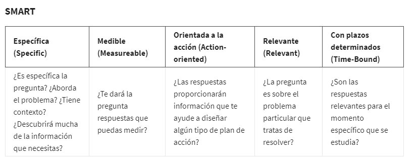

# Elabora preguntas efectivas

## Preguntas SMART

Estas preguntas son:

     **específicas, medibles, orientadas a la acción, relevantes y con plazos determinados**.

### Tipos de preguntas no SMART

pregunta cerrada: preguntas que se caracterisaporque es posible responder con un sí o un no. Este tipo de preguntas rara
vez conducen a conocimientos valiosos.ejemplo de estes tipo seria: Digamos que le preguntas a tu tío,

- ¿te gustó crecer en Malasia? Él puede responder: "Sí", Pero, no has aprendido mucho sobre sus experiencias allí.
- ¿quedó satisfecho con la prueba gratis del software?

Preguntas sugestivas: Esa pregunta realmente no te da la oportunidad de compartir tu propia opinión, en especial si no es-
tás de acuerdo.

- Digamos que estás almorzando con un amigo y te dice: "Estos son los mejores sándwiches del mundo, ¿no es
así?", Esa es un ejemplo pregunta sugestiva.
- este producto es demasiado caro, ¿no?

preguntas imprecisas y carentes de contexto: este tipo de pregunta abarca gran cantidad de categorias o posibles varia-
ciones que es imposible responderla en si misma por ejemplo,

- si alguien te pregunta ¿prefieres chocolate o vainilla?¿De qué está hablando específicamente? ¿Helado, pudín, sabori-
  zante de café o alguna otra cosa? ¿Qué pasa si te gusta el helado de chocolate pero la vainilla en el café? ¿Y si no
  te gusta ninguno de los dos sabores? Ese es el problema con esta pregunta. Es demasiado imprecisa y carece de contexto.
- ¿la herramienta funciona para usted?

Conocer la diferencia entre preguntas efectivas e inefectivas es esencial para tu futura carrera como analista de datos.
Después de todo, el proceso del analista de datos comienza con las preguntas.

### Las prguntas SMART

para realizar preguntas efectivas y que aporten al objetivo de los interesados, exite una metodología de apoyo que es la
metodologia SMART, en estalas preguntas son:

     **específicas, medibles, orientadas a la acción, relevantes y con plazos determinados**.

- Preguntas simples vs preguntas generales:

Las preguntas específicas son simples y significativas, y se centran en un solo tema o en algunas ideas estrechamente
relacionadas. Esto nos ayuda a recopilar información relevante para la investigación.

Si una pregunta es demasiado general, trata de acotarla enfocándote en un solo elemento.

    **pregunta demasiado general:** en lugar de hacer una pregunta cerrada, como ¿los niños realizan suficientes activi-
    dades físicasen estos días?
    
    **Pregunta SMART**¿qué porcentaje de niños hacen lo recomendado, 60 minutos de actividad física, al menos cinco
    días a la semana? Esa pregunta es mucho más específica y puede brindarte información más útil.

- Preguntas medibles:

Las preguntas medibles se pueden cuantificar y evaluar. Ejemplo de esto seria:

     **pregunta no medible:**¿por qué un video se volvió viral?
     
     **Pregunta SMART** ¿cuántas veces se compartió el video en las redes la primera semana que se publicó?

la pregunta anterior es medible porque nos permite contar cuántas veces se compartió y llegar a un número concreto.

- Orientadas a la accion:

Las preguntas orientadas a la acción fomentan el cambio. La resolución de problemas consiste en ver el estado actual y
averiguar cómo transformarlo en el estado futuro ideal. ejemplo de esto seria:

     **pregunta no orientada a la accion:**¿cómo podemos conseguir que los clientes reciclen el embalaje de nuestro pro-
     ducto?
     
     **Pregunta SMART** ¿Qué detalles harán que el embalaje sea más fácil de reciclar?

- Preguntas relevantes:

Las preguntas relevantes importan y son cruciales para el problema que tratas de resolver. un ejemplo seria:
ejemplo de esto seria:

     **pregunta no orientada a la accion:**¿por qué es importante que las ranas hayan comenzado a desaparecer?
     
     **Pregunta SMART**¿Qué factores ambientales cambiaron en Durham, Carolina del Norte entre 1983 y 2004 que podrían
     causar que las ranas desaparecieran de las regiones de Sandhills?

- Plazos determinados:

Las preguntas con plazos determinados especifican el tiempo que se estudia. ejemplo de esto seria:

     **pregunta no orientada a la accion:**¿en el pasado que factores influyeron en la desaparicion?
     
     **Pregunta SMART**¿El período de tiempo de 1983 a 2004, que factores ambientales influyeron en la desaparicion ma-
     siva de las ranas?

Un factor adicional a tener en cuenta a la hora de realizar pregunta esla  equidad lo significa garantizar que las pre-
guntas no creen ni refuercen el sesgo, la preguntas cerrardas y sugestivas, son ejemplos de preguntas carentes de equi-
dad.

En general La equidad también significa formular preguntas con sentido para todos. Es importante que las preguntas sean
claras y tengan una redacción sencilla que cualquiera pueda entender fácilmente. Las preguntas injustas también pueden
dificultar tu trabajo como analista de datos. Dan lugar a una retroalimentación poco fiable y oportunidades perdidas de
obtener información realmente valiosa.

una tabla resumen sobre las caracteristicas de las preguntas SMART:

### Ejemplo de uso del proceso de las preguntas SMART

Objetivo: responder a la siguente pregunta:

          ¿Qué características busca la gente al comprar un automóvil nuevo?

- Específica:

          **¿la pregunta se centra en una característica particular del automóvil?**

- Medible:
  
          **¿la pregunta incluye un sistema de clasificación de características?**

- Orientada a la acción:
  
          **¿la pregunta influye en la creación de paquetes de características nuevos o diferentes?**

- Relevante:

          **¿la pregunta identifica qué características constituyen un punto de inflexión en una posible compra de un**
          **automóvil?**

- Con plazos determinados:

           **¿la pregunta valida los datos sobre las características más populares de los últimos tres años?**

Las preguntas deben ser abiertas. Esta es la mejor manera de obtener respuestas que te ayudarán a calificar o descali-
ficar con precisión las posibles soluciones al problema específico. Entonces, según el proceso de pensamiento,
las siguientes preguntas podrían ser SMART:

- En una escala del 1 al 10 (siendo 10 lo más importante), ¿qué importancia tiene que su automóvil cuente con tracción
  en las cuatro ruedas?

- ¿Cuáles son las cinco características principales que le gustaría ver en un paquete de automóvil?

- ¿Qué características, si se incluyen con la tracción en las cuatro ruedas, lo acercarían más a comprar el automóvil?

- ¿Cuánto más pagaría por un automóvil con tracción en las cuatro ruedas?

- ¿Se ha vuelto más o menos popular la tracción en las cuatro ruedas en los últimos tres años?
