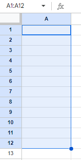
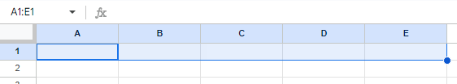

# Fórmulas en hojas de cálculo

## Formulas

**una fórmula** es un conjunto de instrucciones que realizan un cálculo específico. Básicamente, las fórmulas pueden
hacer los cálculos en si mismos. Las fórmulas se basan en operadores que son símbolos que nombran el tipo de operación o
cálculo a realizar.

 Cuando creas una fórmula usando una expresión en una hoja de cálculo, empieza la fórmula con un signo igual.

Estos son los operadores que usarás para completar las fórmulas:

    - El signo más para la suma. (+)
    
    - el menos o el guión para la resta. (-)
    
    - el asterisco para la multiplicación. (*)
    
    - la barra inclinada para la división. (/)

## Expresiones

**las expresiones** o ecuaciones matemáticas. Estas pueden tomar varias formas diferentes. por ejemplo: 3 menos 1,
15 más 8 dividido entre 2, 846 veces 513.

## Referencias de celda

**Una referencia de celda** es una celda única o un rango de celdas en una hoja de trabajo que se puede usar en una fór-
mula.

### Nomenclatura de referencias

**Las referencias de celda** contienen la letra de la columna y el número de la fila donde están los datos, por ejemplo:
La primera celda de la hoja tendria la referencia: A1 -> columna A, Fila 1.

Un **rango de celdas** es una colección de dos o más celdas. Un rango puede incluir celdas de la misma fila o columna,
o de diferentes columnas y filas juntas.

por ejemplo:

        Rango en la misma Columna:

        A1:A12 -> Ranqgo comprendido entre la primera celda de la hoja, hasta la celda en la fila 12, ambas referencias
        sobre la columna A

        

        Rango en la misma Fila:

        A1:E1 -> Ranqgo comprendido entre la primera celda de la hoja, hasta la celda en la columna E, ambas referencias
        sobre la Fila 1

        

Nota -> en los rangos la nomenclatura de exprecion seria Ref_1:Ref_2, notece los dos punto (:) que separan ambas refe-
rencias
