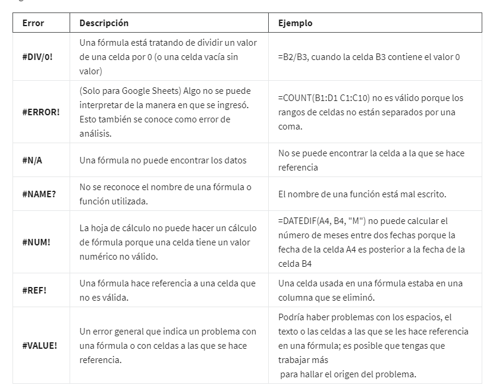
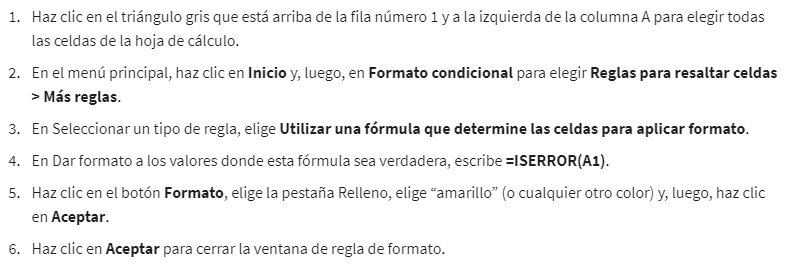
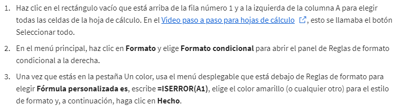

# Fórmulas en hojas de cálculo

## Formulas

**una fórmula** es un conjunto de instrucciones que realizan un cálculo específico. Básicamente, las fórmulas pueden
hacer los cálculos en si mismos. Las fórmulas se basan en operadores que son símbolos que nombran el tipo de operación o
cálculo a realizar.

Cuando creas una fórmula usando una expresión en una hoja de cálculo, empieza la fórmula con un signo igual.

Estos son los operadores que usarás para completar las fórmulas:

    - El signo más para la suma. (+)
    
    - el menos o el guión para la resta. (-)
    
    - el asterisco para la multiplicación. (*)
    
    - la barra inclinada para la división. (/)

## Expresiones

**las expresiones** o ecuaciones matemáticas. Estas pueden tomar varias formas diferentes. por ejemplo: 3 menos 1,
15 más 8 dividido entre 2, 846 veces 513.

## Referencias de celda

**Una referencia de celda** es una celda única o un rango de celdas en una hoja de trabajo que se puede usar en una fór-
mula.

### Nomenclatura de referencias

**Las referencias de celda** contienen la letra de la columna y el número de la fila donde están los datos, por ejemplo:
La primera celda de la hoja tendria la referencia: A1 -> columna_AFila_1.

Un **rango de celdas** es una colección de dos o más celdas. Un rango puede incluir celdas de la misma fila o columna,
o de diferentes columnas y filas juntas.

por ejemplo:

        Rango en la misma Columna:

        A1:A12 -> Ranqgo comprendido entre la primera celda de la hoja, hasta la celda en la fila 12, ambas referencias
        sobre la columna A

        

        Rango en la misma Fila:

        A1:E1 -> Ranqgo comprendido entre la primera celda de la hoja, hasta la celda en la columna E, ambas referencias
        sobre la Fila 1

        

Nota -> en los rangos la nomenclatura de exprecion seria Ref_1:Ref_2, notece los dos punto (:) que separan ambas refe-
rencias

Lo mejor de usar referencias de celda es que también se actualizan automáticamente cuando se copia una fórmula en una
nueva celda.

**La referencia absoluta** está marcada por un signo de dólar ($). Por ejemplo, =$A$10 tiene referencia absoluta tanto
para la columna como para el valor de la fila.

Las referencias relativas (que es lo que normalmente se hace, p. ej., “=A10”) cambiarán cada vez que se copie y pegué
la fórmula. Están relacionadas con el lugar donde se encuentra la celda a la que se hace referencia. Por ejemplo, si
copias "=A10" en la celda de la derecha, se convertirá en “=B10”. Si se copia la referencia absoluta “=$A$10” en la
celda de la derecha, quedará “=$A$10”. Pero si copias $A10 en la celda de abajo, cambiará a $A11 porque el valor de la
fila no es una referencia absoluta.

Las referencias absolutas no cambiarán al copiar y pegar la fórmula en una celda diferente. La celda a la que se hace
referencia es siempre la misma.

Para cambiar fácilmente entre referencias absolutas y relativas en la barra de fórmulas, resalta la referencia que de-
seas cambiar y presiona la tecla F4; por ejemplo, si deseas cambiar la referencia absoluta, $A$10, en tu fórmula a una
referencia relativa, A10, resalta $A$10 en la barra de fórmulas y, luego, presiona la tecla F4 para hacer el cambio.

Para agrupar valores en una fórmula, usas el paréntesis. Esto permite que tu hoja de cálculo sepa qué valores calcular
juntos y el orden de las operaciones a realizar.

En sisntesis:

        Las referencias relativas (celdas a las que se hace referencia sin un signo de dólar, como
        A2) cambiarán cuando copies y pegues la función en una celda diferente. Con las referencias
        relativas, la ubicación de la celda que contiene la función determina las celdas usadas por
        la función.

        Las referencias absolutas (celdas a las que se hace referencia por completo con un signo de
        dólar, como $A$2) no cambiarán cuando copies y pegues la función en otra celda. Con las re-
        ferencias absolutas, siempre se hace referencia a las mismas celdas.

        Las referencias mixtas (celdas a las que se hace referencia parcialmente con un signo de dó-
        lar, como $A2 o A$2) cambiarán cuando copies y pegues la función en otra celda. Con las re-
        ferencias mixtas, la ubicación de la celda que contiene la función determina las celdas usa-
        das por la función; pero solo puede ser relativa la fila o la columna (no ambas).

En las hojas de cálculo, puedes presionar la tecla F4 para alternar entre las referencias relativas, absolutas y mixtas
en una función. Haz clic en la celda que contiene la función, resalta las celdas a las que se hace referencia en la
barra de fórmulas y, luego, presiona F4 para alternar y elegir referencias relativas, absolutas o mixtas.

### Intervalo de datos

Al hacer clic en tu fórmula, los intervalos de colores te permiten ver qué celdas se están usando en tu hoja de cálculo.
Hay diferentes colores para cada intervalo individual en tu fórmula.

Los intervalos de datos de colores evitan que te pierdas en funciones complejas.

En muchas aplicaciones de hojas de cálculo, puedes presionar la tecla F2 (o Enter) para resaltar el intervalo de datos
de la hoja de cálculo al que se hace referencia en una fórmula. Haz clic en la celda con la fórmula y, luego, presiona
la tecla F2 (o Enter) para resaltar los datos de la hoja de cálculo.

### Intervalos de datos evaluados para una condición

CONTAR.SI es un ejemplo de una función que devuelve un valor basado en una condición para la que se evalúa el intervalo
de datos. La función cuenta el número de celdas que cumplen los criterios. Por ejemplo, en una hoja de cálculo de gastos,
usa CONTAR.SI para contar el número de celdas que contienen un reembolso por “pasaje aéreo”.

## Errores y correcciones de hojas de cálculo

### DIV

Para evitar este errores, podemos hacer que esta hoja de cálculo ingrese automáticamente no aplicable siempre que una
celda en la columna A contenga un cero, lo cual causaría el error. Para ello, usaremos la función SI.ERROR. Si encuentra
un error DIV causado por una celda que contiene cero, se insertará la frase "No aplicable".

        =IFERROR(OPERACION,"MENSAJE DE SALIDA")

### Error

ERROR. En Google Sheets, ERROR nos dice que la fórmula no se puede interpretar tal como se ingresa. Esto también se co-
noce como un error de análisis, normalmente es una falla en la sintaxys o la forma incorrecta de escribir los valores de
una formula o funcion, se soluciona completando bien el formato, por ejemplo:

        =SUM(A2:A12 B2:B12) -> esta funcion arrojara error, ya que le falta una coma, que es un delimitador y separa los
        dos rangos.

        =SUM(A2:A12, B2:B12) -> esta seria la manera correcta de escribirlo

### N/A

El error N/A te indica que la hoja de cálculo no puede encontrar los datos de tu fórmula. Generalmente, esto significa
que los datos no existen. Este error ocurre con mayor frecuencia cuando se utilizan funciones como BUSCARV, que busca un
determinado valor en una columna para devolver la información correspondiente.

### Errore NOMBRE

Un error tipográfico puede causar el error NOMBRE. Un error NOMBRE puede ocurrir cuando el nombre de una fórmula no se
reconoce o no se entiende.

### Error "#NUM!"

El error NUM nos dice que el cálculo de una fórmula no se puede realizar según lo especificado por los datos. Los datos
no tienen sentido para ese cálculo o no cumplen el requerimiento de entrada de la funcio o formula, por ejemplo para cal-
cular la fecha de terminacion de un proyecto, teniendo la fecha inicial y final, simepre la fecha final debe ser poste-
rior a la inicial, sino formulas como DATEDIF(FECHA_FIN, FECHA_INICIAL, "FORMATO DE SALID M o D o Y") daran error #NUM!

### Error "#VALUE"

El error VALOR puede indicar un problema con una fórmula o con las celdas a las que se hace referencia. A menudo, no
está claro cuál es el problema inmediatamente, por lo que este error puede requerir un poco más de esfuerzo para solu-
cionarlo, tipos de datos errorenoes, por ejemplo escribir letra en una celda referenciada que requiere un datos numerico
o de fecha.

### Error #REF

El **error REF**, que a menudo aparece cuando las celdas a las que se hace referencia en una fórmula se han eliminado,
lo que hace que la fórmula no pueda realizar el cálculo. una forma de lidiar con este error seria utilizar funciones en
lugar de referencias directas a celdas o rangos, por ejemplo:

        En vez de: =B2+B3+B4
        utilizamos: =SUM(B2:B4) asi al eliminar B3 la funcion calculara el valor correcto.

### Tabla Resumen de los errores en google sheet

### Consejo experto: detección de errores en hojas de cálculo con formato condicional

Se puede usar el formato condicional para resaltar celdas con colores diferentes en función de su contenido. Esta cara-
cterística puede ser extremadamente útil cuando quieres buscar todos los errores en una hoja de cálculo grande. Por
ejemplo, con el formato condicional, puedes resaltar en amarillo todas las celdas que contienen un error y, luego, tra-
bajar en corregirlas.

#### Formato condicional en Microsoft Excel

Si deseas configurar el formato condicional en Microsoft Excel para resaltar todas las celdas que contienen errores en
una hoja de cálculo, sigue estos pasos:

Para quitar el formato condicional, haz clic en Inicio y elige Formato condicional; luego, haz clic en Administrar re-
glas. Busca la regla de formato en la lista, haz clic en Eliminar regla y, a continuación, haz clic en Aceptar.

#### Formato condicional en Google sheet

Si deseas configurar el formato condicional en Google Sheets para resaltar todas las celdas que contienen errores en una
hoja de cálculo, sigue estos pasos:

Para eliminar el formato condicional, haz clic en Formato y elige Formato condicional; luego, haz clic en el ícono Pape-
lera de la regla de formato.
