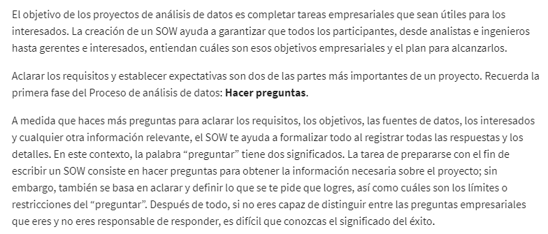
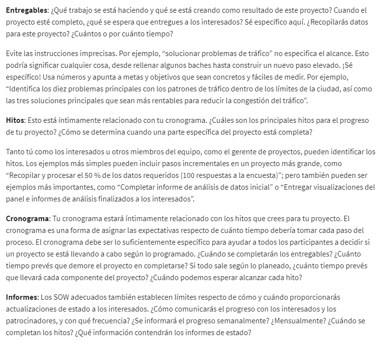
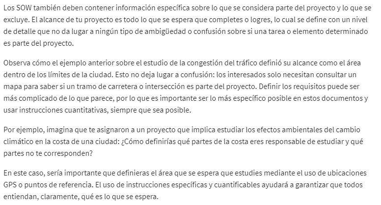
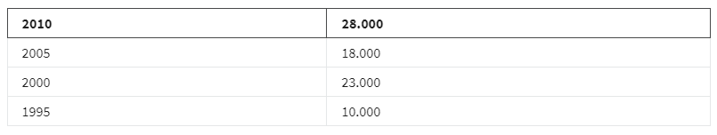
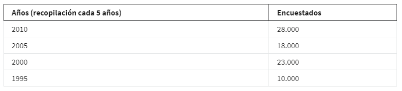

# Ahorra tiempo con el pensamiento estructurado

## Dominio del problema

el dominio del problema: el área específica de análisis que abarca todas las actividades que afectan o se ven afectadas
por el problema. Antes de hacer cualquier otra cosa, necesitamos comprender el dominio del problema y todas sus partes y
relaciones para poder descubrir la historia completa.

Por lo tanto definir cuidadosamente un problema empresarial puede, en última instancia, ahorrar tiempo, dinero y recur-
sos.

## El pensamiento estructurado

El pensamiento estructurado es el proceso de reconocer el problema o la situación actual, organizar la información
disponible, revelar las brechas y oportunidades e identificar las opciones. En otras palabras, es una forma de estar
súper preparado. Es tener una lista clara de dónde se espera que entregues, un cronograma para las principales tareas y
actividades, y puntos de control para que el equipo sepa que estás progresando.

### Elementos claves del pensamiento estructurado

    - Organizar la información disponible
    - Reconocer el problema o la situación actuales
    - Revelar los déficits y las oportunidades para identificar las opciones

### ventajas y desventajas de no usarlo

- desventajas de no usarlo

        - No resuelve el problema inicial.
        - Pasamos horas sin resolverlo.
        - Afectar negativamente a ti, a tu equipo y a la organización en su conjunto.

- Ventajas
  
        - Ahorrar tiempo y esfuerzo
        - Facilita nuestro trabajo como analistas de datos porque nos permite comprender mejor el trabajo que estamos
          haciendo.
        - Ayudará a comprender los problemas a un alto nivel para que puedas
        - Identificar las áreas que necesitan una investigación y comprensión más profundas.

El punto de partida para el pensamiento estructurado es el dominio del problema, Una vez que conozcas el área específica
de análisis, puedes establecer tu base y plantear todos tus requisitos e hipótesis antes de empezar a investigar.
Con una base sólida establecida, estarás listo para enfrentar cualquier obstáculo que surja.

*las variables faltantes pueden conducir a conclusiones inexactas*.

Una forma de practicar el pensamiento estructurado y evitar errores es utilizando un **alcance del trabajo**.

*El alcance del trabajo es un esquema acordado del trabajo que vas a realizar en un proyecto.* Esto incluye:

    - Detalles del trabajo
    - Cronogramas
    - Informes que el cliente puede necesitar.

Ahora, como analista de datos, tu alcance del trabajo será un poco más técnico e incluirá los ítems básicos que acabamos
de mencionar, pero también:

    - La preparación de datos.
    - La validación.
    - El análisis de conjuntos de datos cuantitativos y cualitativos.
    - Los resultados iniciales.
    - Imágenes para que realmente se entienda el punto.

### Porque necesitas el Sow

### Actividades Generales del SOW

### Formato del alcance del trabajo

[Formato del SOW](Scope-Of-Work%20Template.docx)

### Dentro y fuera del alcance

### Ejemplo de alcance de trabajo

Una pareja ha contratado a una organizadora de bodas.

- primero Nos enfocamos en una sola tarea: las invitaciones de boda,

- Esto genera un posible alcance del trabajo: entregables, cronograma, hitos e informes.

        Analizando uno de estos: entregables.

        La planificadora de bodas y la pareja deberán decidir sobre la invitación:

            - Entregar una lista de personas a invitar
            - recopilar sus direcciones
            - imprimir las invitaciones
            - dirigir los sobres
            - colocarles estampillas
            - enviarlos por correo.

- Verificamos las líneas de tiempo. Notarás que las fechas y los hitos nos mantienen en el camino correcto.

- Generamos los informes, que le dan a nuestra pareja un poco de tranquilidad diciéndoles cuándo se completó cada paso.

Como conclusion podemos decir que un Un alcance del trabajo puede ser una herramienta sencilla pero potente. Con un
alcance del trabajo sólido, podriamos abordar cualquier confusión, contradicción o pregunta sobre los datos desde el
principio y asegurarte de que estos contratiempos sorpresivos no se interpongan en tu camino.

### La objetividad

Los datos no residen en un vacío, necesitan un contexto. El contexto es la condición en la que algo existe o sucede.
Las acciones pueden ser apropiadas en algunos contextos, pero inapropiadas en otros. En el mundo de los datos, los núme-
ros no significan mucho sin contexto.

Podemos aprovechar los datos de formas cada vez más sofisticadas y generar información más poderosa a partir de ellos.
Usamos datos en muchos niveles diferentes. A veces nuestros datos son descriptivos y responden preguntas, Los datos se
vuelven más valiosos a medida que generamos conocimientos de diagnóstico y predictivos.

No existe un conjunto universal de interpretaciones contextuales. Cada uno aborda los datos a su manera. Incluso si el
proceso de recopilación de datos es correcto, el análisis puede malinterpretarse. Las conclusiones pueden verse influen-
ciadas por tus propios prejuicios conscientes y subconscientes, que se basan en normas culturales, sociales y
de mercado.

Si el análisis no es objetivo, las conclusiones pueden ser engañosas. Para comprender realmente de qué se tratan los
datos, debes pensar en quién, qué, dónde, cuándo, cómo y por qué. Es bueno hacerse preguntas como: ¿Quién recopiló los
datos? ¿Y de qué se tratan? ¿Qué representan los datos en el mundo y cómo se relacionan con otros datos? ¿Cuándo se re-
copilaron los datos? Los datos fueron recopilados hace un tiempo.

Lo mejor que puedes hacer por la equidad y precisión de tus datos es asegurarte de empezar con una representación pre-
cisa de la población y recopilar los datos de la manera más apropiada y objetiva. Luego, tendrás los hechos y podrás
transmitirlos a tu equipo.

## La importancia del contexto

El contexto es la condición en la que algo existe o sucede. El contexto es importante en el análisis de datos porque te
ayuda a examinar enormes cantidades de datos desorganizados, y a convertirlos en algo significativo. La realidad es que
los datos tienen poco valor si no tienen relación con el contexto.

Comprender el contexto detrás de los datos puede ayudarnos a hacerlos más significativos en cada etapa del proceso de
análisis de datos. Por ejemplo, es posible que puedas hacer algunas conjeturas sobre lo que ves en la siguiente tabla,
pero no estarás lo suficientemente seguro sin más contexto.

Por otro lado, si la primera columna se etiquetó para representar los años en que se realizó una encuesta y, en la
segunda columna, se mostró el número de personas que respondieron a esa encuesta, la tabla comenzaría a tener mucho más
sentido. Lleva esto al siguiente paso y te darás cuenta de que la encuesta se realiza cada 5 años. Este contexto adi-
cional te ayudará a entender por qué hay brechas de cinco años en la tabla.

El contexto puede convertir los datos sin procesar en información significativa. Es muy importante que los analistas de
datos contextualicen sus datos. Esto significa dar la perspectiva de los datos al definirlos. Para lograr esto, debes
identificar:

    Quién: La persona u organización que creó, recopiló y/o financió la recopilación de datos.

    Qué: Las circunstancias en las cuales los datos podrían tener un impacto en cualquier parte del mundo.

    Dónde: El origen de los datos.

    Cuándo: El momento en que se crearon o recopilaron los datos.

    ¿Por qué? La motivación detrás de la creación o recopilación.

    Cómo: El método que se usó para crearlos o recopilarlos.

La comprensión e inclusión del contexto es importante durante cada paso de tu proceso de análisis, por lo que es impor-
tante que te familiarices con él desde el inicio de tu carrera.

Cuando recopiles los datos, querrás hacer preguntas sobre el contexto para asegurarte de que entiendes el negocio y el
proceso empresarial.

Durante la organización, el contexto es importante para tus convenciones de nomenclatura, cómo eliges mostrar las rela-
ciones entre las variables y lo que eliges conservar u omitir.

Cuando presentes, es importante que incluyas información contextual para que tus interesados entiendan tu análisis.

### Estrategias para garantizar que tus datos sean precisos y justos

    Recopilar los datos de forma objetiva
    Asegurarse de empezar con una representación precisa de la población de la muestra
    Pensar en el «quién, qué, dónde, cuándo, cómo y por qué» de tus datos
