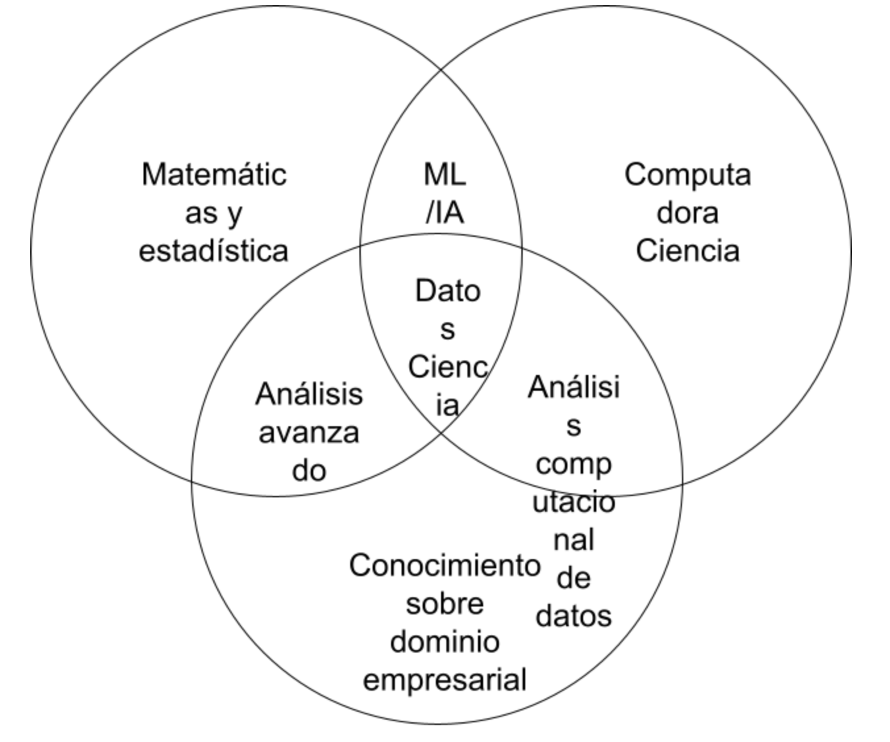

# Equilibrar las necesidades del equipo y de los interesados

## Como comunicarte con tu equipo

## Cómo equilibrar las necesidades y expectativas de todo tu equipo

Los interesados son personas que han invertido tiempo, interés y recursos en proyectos en los que trabajarás como
analista de datos. En otras palabras, tienen interés en lo que haces.

Es muy probable que necesiten el trabajo que haces para satisfacer sus propias necesidades. Por eso es tan importante
asegurarte de que tu trabajo esté alineado con sus necesidades y es el motivo por el que necesitas comunicarte de manera
eficaz con todos los interesados en tu equipo.

Los interesados querrán debatir cosas como el objetivo del proyecto, lo que necesitas para lograr ese objetivo y cual-
quier desafío o inquietud que tengas.

Es muy importante que sepas quiénes son los interesados y los otros miembros del equipo que están en el proyecto para
poder comunicarte con ellos eficazmente y brindarles lo que necesitan para avanzar en sus propias funciones en el
proyecto.

Enfocarse en las expectativas de los interesados te ayudará a comprender el objetivo de un proyecto, comunicarte de
forma más eficaz con todo tu equipo y generar confianza en tu trabajo.

## Cómo trabajar con los interesados

Tu proyecto de análisis de datos debe responder a la tarea empresarial y crear oportunidades para la toma de decisiones
basada en datos. Es por eso que es tan importante centrarse en los interesados del proyecto. Como analista de datos, es
tu responsabilidad comprender y administrar las expectativas de los interesados mientras mantienes los objetivos del
proyecto en primer plano.

hay tres grupos de interesados comunes con los que puedes trabajar: el equipo ejecutivo, el equipo orientado al cliente
y el equipo de ciencia de datos.

### Recomendaciones para trabajar con los interesados

**Analiza las metas**. Las solicitudes de los interesados suelen estar vinculadas a un proyecto u objetivo más grande.
Cuando te pidan algo, aprovecha para aprender más. Inicia un debate. Pregunta sobre el tipo de resultados que quieren
los interesados. A veces, una conversación rápida sobre los objetivos puede ayudar a establecer expectativas y plani-
ficar los próximos pasos.

**Siéntete empoderado para decir “no”**. Digamos que se te acerca un director de marketing que tiene un proyecto de
“prioridad alta” y necesita datos para respaldar su hipótesis. Te piden que elabores el análisis y los gráficos para una
presentación y la entregues antes de mañana por la mañana. Tal vez te des cuenta de que su hipótesis no está completa-
mente formada y tienes ideas útiles sobre una mejor manera de abordar el análisis o quizás te des cuenta de que realizar
el análisis tomará más tiempo y esfuerzo de lo estimado. Cualquiera sea el caso, no tengas miedo de retroceder cuando lo
necesites.

Los interesados no siempre se dan cuenta del tiempo y el esfuerzo que se requiere para recopilar y analizar datos.
También es posible que no sepan lo que realmente necesitan. Para ayudar a los interesados, puedes preguntar acerca de
sus objetivos y determinar si puedes brindar lo que necesitan. Si no puedes hacerlo, ten la confianza para decir “no” y
proporciona una explicación respetuosa. Si existiera una opción más útil, indica estos recursos a los interesados. Si
consideras que primero debes priorizar otros proyectos, habla sobre lo que puedes priorizar y cuándo puedes hacerlo.

Cuando los interesados comprenden lo que se debe hacer y lo que se puede lograr en un plazo determinado, generalmente
consideran adecuado modificar sus expectativas. Debes sentirte empoderado para decir que no, solo recuerda dar un con-
texto para que los otros entiendan el motivo.

**Planifica lo inesperado**. Antes de comenzar un proyecto, elabora una lista de posibles obstáculos. Luego, cuando
hables sobre las expectativas y los plazos del proyecto con los interesados, date un tiempo adicional para la resolución
de problemas en cada etapa del proceso.

**Conoce tu proyecto**. Realiza un seguimiento de tus conversaciones por correo electrónico o informes sobre el proyecto
y prepárate para responder preguntas sobre cómo determinados aspectos son importantes para tu organización. Conoce cómo
se conecta tu proyecto con el resto de la empresa e involúcrate en proporcionar la mayor cantidad de información posible.

Comprender bien el motivo por el que haces un análisis puede ayudarte a conectar tu trabajo con otros objetivos y a ser
más eficaz para resolver problemas más grandes.

**Comienza con palabras e imágenes**. Es común que los analistas de datos y los interesados interpreten las cosas de
diferentes maneras y que asuman que el otro está de acuerdo. Esta ilusión de acuerdo*se ha identificado históricamente
como una causa de que los proyectos vayan y vengan varias veces antes de que finalmente se concreten. Para ayudar a evitar
esto, comienza con una descripción y una imagen rápida de lo que intentas transmitir. Los interesados tienen muchos pun-
tos de vista y pueden preferir absorber la información en palabras o imágenes. Trabaja con ellos para hacer cambios y
mejoras a partir de ahí. Cuanto más rápido todos estén de acuerdo, más rápido podrás realizar el primer análisis para
probar la utilidad del proyecto, medir los comentarios, aprender de los datos e implementar cambios.

**Comunícate con frecuencia**. Los interesados querrán actualizaciones periódicas sobre sus proyectos. Comparte notas
sobre los hitos, contratiempos y cambios del proyecto. A continuación, utiliza tus notas para elaborar un informe que se
pueda compartir. Otro gran recurso que puedes usar es un registro de cambios, del que aprenderás más a lo largo del
programa. Por ahora, solo debes saber que un registro de cambios es un archivo que contiene una lista ordenada cronoló-
gicamente de las modificaciones realizadas en un proyecto. Según la forma en que lo organices, los interesados incluso
pueden darse una vuelta y ver las actualizaciones cuando lo deseen.

## Conozcamos más sobre los diferentes interesados y sus objetivos

### el equipo ejecutivo

El equipo ejecutivo proporciona liderazgo estratégico y operativo a la empresa. Establece metas, desarrolla estrategias
y se asegura de que la estrategia se ejecute de manera eficaz. El equipo ejecutivo puede incluir vicepresidentes, al
director de marketing y profesionales de alto nivel que ayudan a planificar y dirigir el trabajo de la empresa.

Estos interesados piensan en las decisiones a un nivel muy alto y primero buscan la información importante sobre su
proyecto.  Les dan menos importancia a los detalles. El tiempo con ellos es muy limitado, así que aprovéchalo al máximo;
para ello, guía tus presentaciones con las respuestas a sus preguntas.

Puedes tener a mano la información más detallada en el apéndice de tu presentación o en la documentación de tu proyecto
para que puedan profundizar cuando tengan más tiempo.

Pero no tienes que abordar eso tú solo. Tu gerente de proyecto supervisará el progreso de todo el equipo y tú le propor-
cionarás actualizaciones con más regularidad que a alguien como el vicepresidente de Recursos Humanos. Este puede darte
lo que necesitas para avanzar en un proyecto, incluida la obtención de aprobaciones del atareado equipo ejecutivo.

Trabajar en estrecha colaboración con tu gerente de proyecto puede ayudarte a identificar las necesidades de los intere-
sados ejecutivos para tu proyecto, así que no tengas miedo de pedirle orientación.

### el equipo orientado al cliente

El equipo orientado al cliente incluye a cualquier persona en una organización que tenga algún nivel de interacción con
los clientes y clientes potenciales. Por lo general, recopilan información, establecen expectativas y comunican los
comentarios de los clientes a otras partes de la organización interna. Estos interesados tienen sus propios objetivos y
pueden acudir a ti con preguntas específicas. Es importante dejar que los datos hablen por sí solos y no dejarse
influenciar por las preguntas de los interesados para buscar determinados patrones que podrían no existir.

Digamos que un equipo orientado al cliente trabaja contigo para construir una nueva versión del producto más popular de
una empresa. Parte de tu trabajo puede implicar la recopilación y el intercambio de datos sobre el comportamiento de
compra de los consumidores para ayudar a informar las características del producto. Aquí, debes asegurarte de que tu
análisis y presentación se centren en lo que realmente hay en los datos, no en lo que los interesados esperan encontrar.

### el equipo de ciencia de datos

Organizar los datos dentro de una empresa requiere trabajo en equipo. Es muy probable que trabajes con otros analistas
de datos, científicos de datos e ingenieros de datos. Por ejemplo, tal vez te asocies con el equipo de ciencia de datos
de una empresa para trabajar en impulsar el compromiso de la empresa a fin de reducir las tasas de rotación de empleados,
En ese caso, puedes buscar en los datos sobre la productividad de los empleados, mientras que otro analista revisa los
datos de contratación. Luego, compartes esos hallazgos con el científico de datos de tu equipo, quien los usa para
predecir cómo los nuevos procesos podrían aumentar la productividad y el compromiso de los empleados.

Cuando compartes lo que encontraste en tus análisis individuales, develas la historia más grande. Una gran parte de tu
trabajo será colaborar con otros miembros del equipo de datos para buscar nuevos ángulos de los datos para explorar.

Aquí presentamos una vista de cómo los diferentes roles en un equipo típico de ciencia de datos admiten diferentes
funciones:

## Concéntrate en lo que importa

- Encontrar equilibrio entre interesados y miembros del equipo es crucial.

- Mantenerse enfocado en el objetivo es importante, especialmente en situaciones con distintas opiniones y necesidades.

- Hacer preguntas simples al inicio de cada tarea ayuda a mantener la concentración y equilibrar necesidades.

- Tres enfoques clave para mantenerse enfocado: identificar interesados principales y secundarios, determinar quién ges-
  tiona los datos y saber dónde pedir ayuda.

- Ejemplo de proyecto de rotación de empleados con múltiples interesados y roles.

- Identificar interesados: vicepresidente de RR. HH., gerente de proyectos, miembros del equipo y otros analistas.

- Quién gestiona los datos: colaboración con otros analistas para aprovechar datos existentes.

- Dónde pedir ayuda: gerentes de proyectos como recursos para superar obstáculos.

- Tres preguntas al inicio del proyecto: identificar interesados, entender quién maneja datos y conocer fuentes de ayuda.

- Mantener enfoque en objetivo final del proyecto.

- Importancia de trabajar eficazmente en equipo y mantener enfoque en necesidades de interesados.

Claro, puedo ampliar ese punto utilizando el formato de lista numerada. Aquí tienes:

## Ejemplo de proyecto de rotación de empleados con múltiples interesados y roles

- El proyecto se enfoca en la rotación de empleados, una tarea que involucra a varios actores clave.

- Diversos interesados: El vicepresidente de RR. HH. busca utilizar los resultados para decisiones políticas. El gerente
de proyectos requiere actualizaciones. Otros analistas de datos dependen de este análisis.

- Identificación de interesados principales y secundarios: Una tarea inicial es definir quiénes son estos actores y sus
objetivos específicos.

- Equilibrio de necesidades: La tarea implica manejar las demandas y expectativas de diferentes interesados, desde altos
directivos hasta analistas.
- Desafío del analista de datos: Equilibrar las múltiples perspectivas y opiniones, y mantenerse enfocado en el objetivo
final.

- Colaboración interdisciplinaria: Trabajar con otros analistas de datos que manejan diferentes conjuntos de datos en el
mismo proyecto.

- Importancia de la comunicación: Contacto con otros analistas para aprovechar su trabajo y enriquecer el análisis.

- Ejemplo específico: Un analista se enfoca en los datos de contratación, proporcionando información crucial para el
análisis completo.

- Maximización de la eficiencia: Al colaborar y comprender quién gestiona qué datos, se evita la duplicación de esfuerzos.

- Evitar la distracción: A pesar de la complejidad, mantener el enfoque en el objetivo y no perderse en detalles secundarios.

- Utilización de recursos internos: El conocimiento de quién gestiona los datos permite optimizar el uso del tiempo y las
habilidades del equipo.

- Resolución de obstáculos: Reconocer a quién acudir en caso de problemas, como el gerente de proyectos, para superar
desafíos.

- Importancia del enfoque en el objetivo: El ejemplo subraya la necesidad de mantener la mirada en el premio final del
proyecto.

- Lecciones aprendidas: El caso de estudio resalta cómo las tres preguntas clave pueden ayudar a abordar las necesidades
de los interesados y lograr los objetivos del proyecto.
