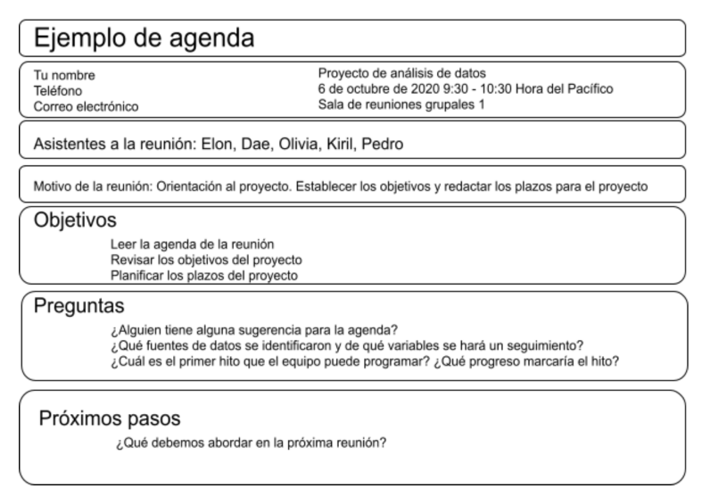

# Increíble trabajo en equipo

las reuniones te permiten a ti y a los miembros de tu equipo o los interesados analizar el progreso de un proyecto.

## Beneficios de las reuniones

- Las reuniones de equipo pueden generar confianza y espíritu de equipo.
- saber con quién estás trabajando puede darte una mejor perspectiva de dónde encaja tu trabajo en el proyecto más grande.
- facilitan la coordinación de las metas del equipo, lo que permite lograr más fácilmente tus objetivos.

## Prcaticas recomendadas al dirigir o asistir a una reunion y que esta sea un exito

*Ve preparado*:

    Si eres asistente:

      - lleva lo que necesites
      - donde y con que anotar
      - leer la agenda de la reunion con antelacion,
      - ten las actualizaciones de tu trabajo dsiponibles y está listo para presentarlas
    
    Sí lideras la reunion

      - prepara notas y presentaciones,
      - prepara el tema de la reunion y
      - está dispuesto a recibir preguntas.

- llega a horario.

- presta atención.

- haz preguntas.

- cada reunión debe enfocarse en tomar una decisión clara e incluir a la persona fundamental para tomar esa decisión.

- Trabaja con proactividad: si es necesario que haya una reunión para tomar una decisión, prográmala de inmediato.

- Limita el numero de asistentes:  si es posible, intenta que la cantidad de personas que asistan a tu reunión no sea
  superior a 10. Una cantidad mayor de personas dificulta tener un debate colaborativo.

- Cumple con los horarios pactados: Implica respetar el tiempo de los miembros de tu equipo.

- Intenta interactuar con todos los asistentes para no perderte ninguna idea de los miembros de tu equipo, haz preguntas,
  pídeles sus conocimientos y solicita sus comentarios.

- Intenta asegurarte de darles a los miembros del equipo la posibilidad de hablar y de siempre dejarlos que terminen su
  idea antes de comenzar a hablar.

## Lo que no se debe hacer al asistir a una reunion

- Llegar sin estar preparado, tarde o distraído a las reuniones.

- Tampoco se recomienda dominar la conversación, hablar por encima de los demás ni distraer a las personas con un debate
desenfocado.

. Todos los que asisten a tu reunión deben dar su opinión.

- teléfonos o computadoras en silencio cuando no estén hablando, incluido tú.

## Cómo liderar grandes reuniones

Cuando los participantes esperan una reunión bien ejecutada, pueden suceder grandes cosas. Los asistentes se presentan
a horario. No se distraen con sus computadoras portátiles ni teléfonos. Sienten que su tiempo se empleará bien. Todo se
reduce a una buena planificación y comunicación de las expectativas.

### Consejos al liderar reuniones

*Antes de la reunión:*

- Verifica que los elementos tecnologicos funcionen correctamente

- Identifica tu objetivo. Establece el propósito, las metas y los resultados deseados de la reunión, incluidas las
  preguntas o solicitudes que deban abordarse.

- Reconoce a los participantes y hazlos participar en los diferentes puntos de vista y experiencias con los datos, el
  proyecto o el negocio.

- Organiza los datos que se presentarán. Es posible que debas convertir datos sin procesar en formatos accesibles o
  crear visualizaciones de datos.

- Prepara y distribuye una agenda.

*Cómo elaborar una agenda convincente:*

Una agenda de reuniones sólida prepara tu reunión para el éxito. Estas son las partes básicas que debe incluir la
agenda:

    - Hora de inicio y finalización de la reunión

    - Lugar de la reunión (incluida la información para participar de forma remota, si esa opción está disponible)

    - Objetivos

    - Material o datos complementarios que los participantes deben revisar de antemano

Aquí presentamos un ejemplo de una agenda para un proyecto de análisis que recién comienza:

Una vez la agenda esta desarrollada, compartela con los mienbros que asitiran, asi podran estar a tiempo y proparados.

*Durante la reunión:*

al líder de la reunión, debes guiar el debate sobre los datos. Con todos bien informados sobre el plan y los objetivos
de la reunión, puedes seguir estos pasos para evitar distracciones:

    - Haz introducciones (si es necesario) y revisa los mensajes clave

    - Presenta los datos.

    - Habla sobre las observaciones, interpretaciones e implicaciones de los datos

    - Toma notas durante la reunión

    - Determina y resume los próximos pasos para el grupo

    - Solicita feedback y aclara las dudas expuestas por quienes asisten a la reunion

*Después de la reunión:*

Para mantener el proyecto y a todos alineados, prepara y distribuye un breve resumen de la reunión con los próximos
pasos que se acordaron en la reunión. Incluso puedes ir un paso más allá y pedir comentarios al equipo.

    - Distribuye notas o datos

    - Confirma los próximos pasos y el plazo de las medidas adicionales

    - Pide comentarios (esta es una forma eficaz de averiguar si omitiste algo en tu resumen)

## Del conflicto a la colaboracion

Un conflicto puede surgir por diversas razones:

    - Tal vez los interesados malinterpretaron los posibles resultados de tu proyecto,

    - tal vez tú y el miembro de tu equipo tienen estilos de trabajo muy diferentes.

    - tal vez se acerca una fecha límite importante y las personas están nerviosas.

    - Las expectativas incompatibles.

    - la falta de comunicación.

    - Tal vez no fuiste claro sobre quién se suponía que debía limpiar un conjunto de datos y nadie lo limpió, lo que provocó
      que un proyecto se retrasara.

    - tal vez un compañero de equipo envió un correo electrónico con toda la información incluida, pero no mencionó que era
      tu trabajo.

las anteriores razones son algunas de las razones más comunes por las que se producen conflictos.

## Consejos para manejar el conflicto

Si bien puede ser fácil tomar el conflicto como algo personal, es importante intentar se objetivo, y mantenerse enfocado
en las metas del equipo

Una de las mejores formas en las que puedes convertir una situación problemática en productiva es simplemente replantear
el problema, esto lo puedes realizar a traves de pregunats tales como:

- “¿Cómo puedo ayudarte a alcanzar tu objetivo?”. esto involucra a mabas partes en la solucion.
- “¿Hay otras cosas importantes que debo tener en cuenta?”
- Pregúntales cuál es su objetivo final, qué historia intentan contar con los datos o cuál es el panorama general.

Al convertir los momentos de posible conflicto en oportunidades para colaborar y avanzar, puedes resolver la tensión y
volver a encaminar tu proyecto.
