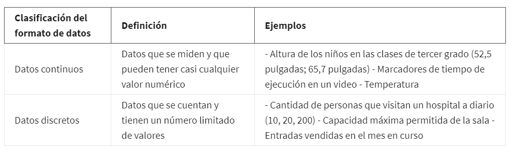
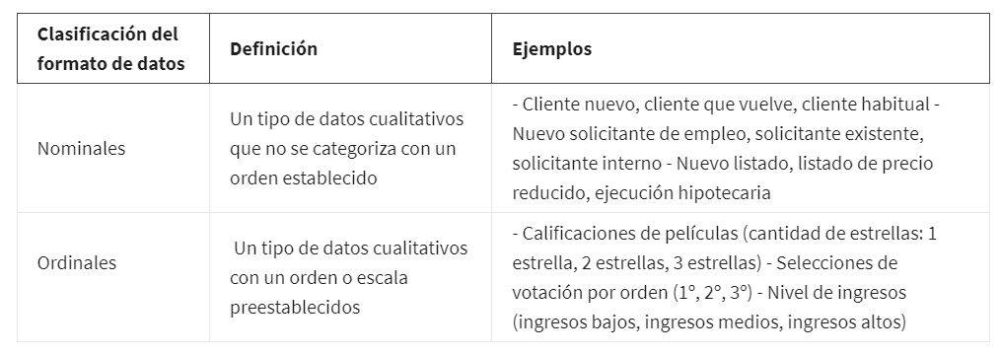
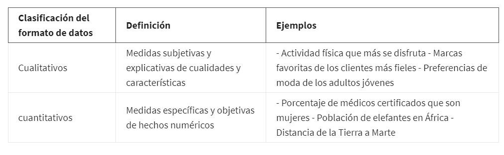
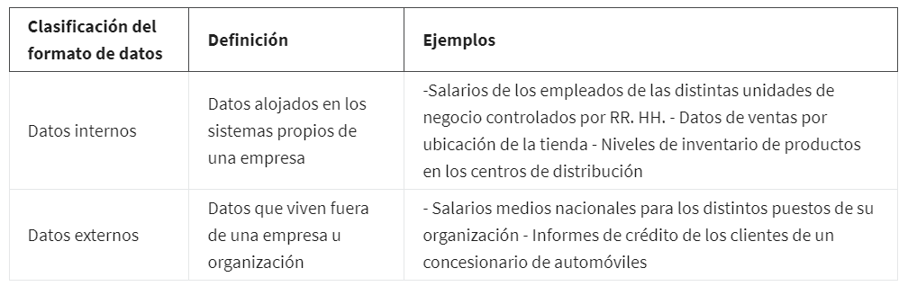
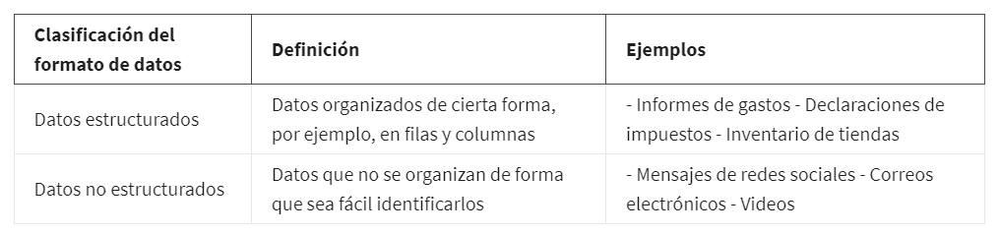

# Diferenciar entre formatos y estructuras de datos

## Datos son cuantitaivos

Son cuantitaivos porque se pueden contar, medir o expresarse fácilmente con números, Este dato cuenta con una
cierta cantidad, monto o rango.

Los datos cuantitativos los subdividimos en *datos discretos, continuos, datos nominales y ordinales*:

    Los datos discretos: Estos son datos que se cuentan y tienen una cantidad de valores limitada.

    Los datos continuos: pueden medirse utilizando un cronómetro y su valor se puede mostrar como un decimal con varias
    posiciones.

### Diferencia entre datos discretos y continuos

## Los datos cualitativos

Son colocados normalmente listados como un nombre, una categoría o una descripción.

    Los datos nominales: son un tipo de datos cualitativos que se categorizan sin ningún orden establecido. En otras
    palabras, estos datos no tienen una secuencia.
    
    Los datos ordinales: son un conjunto de datos cualitativos con un orden o escala preestablecidos.

### Diferencia entre datos nominales y ordinales

### Diferencia entre datos cualitativos y cuantitativos

## Los datos internos

Son los datos que viven dentro de los propios sistemas de una empresa. Sí una organizacion ha
compilado todos los datos en la hoja de cálculo utilizando su propio método de recolección, entonces serían sus datos
internos.la principal cracteristica de los datos internos es que por lo general son más confiables y fáciles de recolectar.

## Los datos externos

son datos alojados y generados fuera de una organización, son especialmente valiosos cuando tus análisis dependen de to-
das las fuentes disponibles posibles.

Diferencias entre datos internos y externos:

    Todos los anteriores son del tipo estrcuturado.

## Los datos estructurados

Son datos que se organizan en un formato determinado, como filas y columnas. Las hojas de cálculo y las bases de datos
relacionales son dos ejemplos de software que pueden almacenar datos de modo estructurado.

Este tipo se basa en el pensamiento estructurado que brinda un framework para resolver problemas o preguntas de manera
logica y ordenada, de la misma manera Puedes pensar en los datos estructurados del mismo modo. Con un framework para los
datos, los datos son fácilmente rastreables y están más preparados para el análisis.

## Los datos no estructurados

Estos datos no están organizados de una forma fácilmente identificable. Los archivos de audio y video son ejemplos de datos no estructurados porque no hay un modo claro para identificar y organizar el contenido. Los datos no estructurados pueden
contar con una estructura interna, pero los datos no se ubican prolijamente en filas y columnas como los datos estructurados.

### diferencia entre datos estructurados y no estructurados

