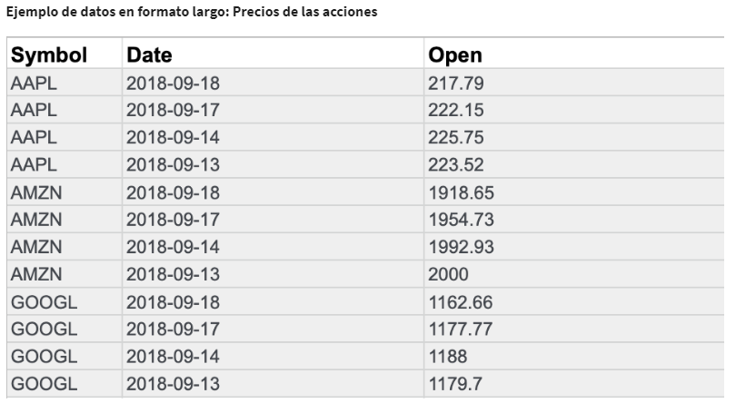
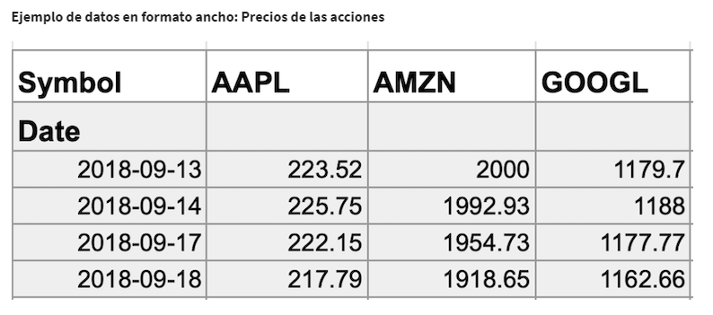
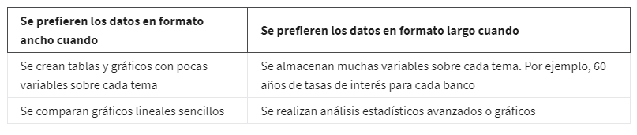

# Explorar los tipos de datos, campos y valores

## Conocer el tipo de datos con el que trabajas

Un tipo de dato es una clase específica de atributo de datos que nos dice qué tipo de valor tiene ese dato. En otras
palabras, un tipo de datos te indica con qué clase de datos estás trabajando.

Los tipos de datos pueden ser diferentes dependiendo del lenguaje de consulta que estás utilizando. Por ejemplo, SQL
permite tipos diferentes de datos dependiendo de la base de datos que utilices.

Un tipo de dato en una hoja de cálculo puede ser: un número, un texto o cadena, datos booleanos.

*Tipos de datos numéricos*, Cada número representa elformato del dato en ese momento.

*Tipo de dato de texto*, o un tipo de datos en cadena, que es una secuencia de caracteres y puntuación que contiene infor-
mación textual.

*Datos booleanos* los dos únicos valores posibles son verdadero o falso. Podríamos cambiar la fórmula de manera que apa-
rezcan otras palabras en esas celdas, pero aun así serían datos booleanos.

## Componentes de la tabla de datos

Tabla de datos, o datos tabulares, tiene una estructura muy simple. Está organizada en filas y columnas. Puedes llamar
a las filas "registros" y a las columnas "campos". Básicamente quieren decir lo mismo, pero los registros y campos se
pueden usar para cualquier tipo de tabla de datos, mientras que las filas y las columnas se reservan usualmente para las
hojas de cálculo.

Cuando hablamos de bases de datos estructuradas, las personas que realizan análisis computacional de datos suelen usar
"registros" y "campos". Algunas veces, un campo también se puede referir a un solo dato, como el valor en una celda, Cada
campo por separado tiene el mismo tipo de dato, pero diferentes campos pueden tener diferentes tipos.

Los registros en una hoja de cálculo pueden ser acerca de todo tipo de cosas: clientes, productos, facturas o cualquier
otra cosa. Cada registro tiene varios campos que revelan más acerca de los productos o facturas de los clientes. El valor
en cada celda contiene un dato específico, como la dirección de un cliente o el valor en dólares de una factura.

## Conocer los datos en formato ancho y largo

Los datos en formato ancho y los datos en formato largo.

Con los datos en formato ancho, cada interesado tiene una fila sola con múltiples columnas para albergar los valores de
varios atributos del interesado. Existen datos en formato ancho en una hoja de cálculo, Los datos anchos permiten una
fácil identificación y una rápida comparación de las diferentes columnas.

Con los datos en formato largo, los interesados van en las columnas y en las filas se albergaran los valores de varios
atributos del interesado, son una buena manera de almacenar datos organizados con variables múltiples para cada sujeto
en cada punto de tiempo que queremos observar. Con estos datos en formato largo, podemos almacenar y analizar todos estos
datos utilizando menos columnas.

*Transformación de datos* es el proceso de cambiar el formato, la estructura o los valores de los datos. Como analista de
datos, es muy probable que en algún momento necesites transformar los datos para que te resulte más fácil analizarlos.

La transformación de datos suele implicar:

    - Añadir, copiar o replicar datos

    - Eliminar campos o registros

    - Estandarizar los nombres de las variables

    - Cambiar el nombre, mover o combinar columnas en una base de datos

    - Unir un conjunto de datos con otro

    - Guardar un archivo en un formato diferente. Por ejemplo, guardar una hoja de cálculo como un archivo de valores
      separados por comas (CSV).

Los objetivos de la transformación de datos pueden ser:

    - Organización de los datos: los datos mejor organizados son más fáciles de utilizar

    - Compatibilidad de datos: diferentes aplicaciones o sistemas pueden entonces utilizar los mismos datos

    - Migración de datos: los datos con formatos coincidentes pueden trasladarse de un sistema a otro

    - Fusión de datos: los datos con la misma organización pueden fusionarse

    - Mejora de datos: los datos pueden mostrarse con campos más detallados

    - Comparación de datos: a continuación, se pueden realizar comparaciones de los datos entre sí

## transformación de datos: fusión de datos

    - Transformar el formato de los datos.
    
    - eliminar las filas duplicadas de los clientes que tenían en común.
    
    - Verificar que  los datos sean compatibles y estén juntos.

## transformación de datos: organización de datos (largo a ancho)

Para facilitar la creación de gráficos, también puede ser necesario transformar los datos en formato largo en datos en
formato ancho. Considera el siguiente ejemplo de transformación de los precios de las acciones (recogidos como datos en
formato largo) a datos en formato ancho.

Los datos en formato largo son datos en los que cada fila contiene un único punto de datos para un elemento concreto.
En el ejemplo de datos en formato largo que aparece a continuación, se han recogido los precios individuales de las
acciones (puntos de datos) de Apple (AAPL), Amazon (AMZN) y Google (GOOGL) (elementos concretos) en las fechas indicadas.

Los datos en formato ancho son datos en los que cada fila contiene múltiples puntos de datos para los elementos particu-
lares identificados en las columnas.

Con los datos transformados en datos en formato ancho, puedes crear un gráfico en el que se compara la evolución de las
acciones de cada empresa en el mismo periodo de tiempo.

La siguiente tabla resume cuándo se prefiere cada formato:

