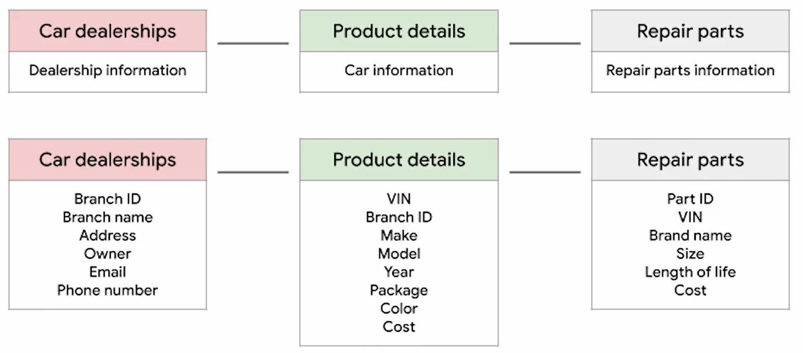
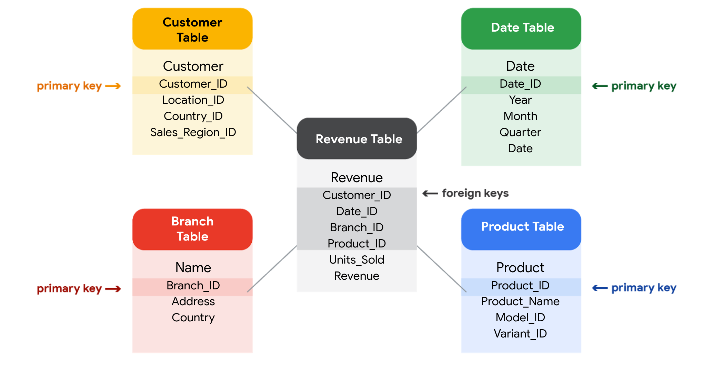

# Trabajar con bases de datos

## Recomendaciones antes de iniciar un analisis

Antes de comenzar un análisis, es importante examinar tus datos para determinar si contienen la información específica
que necesitas para responder las preguntas de tus interesados.

En cualquier conjunto de datos puede darse el caso de que:

    - Los datos no estén allí (tienes datos sobre sándwiches, pero necesitas datos sobre pizza).

    - Los datos no sean suficientes (tienes datos sobre pizza desde el 1 hasta el 7 de junio, pero necesitas
      datos de todo el mes de junio).

    - Los datos sean incorrectos (los datos sobre pizza cotizan una porción a $250, lo que te hace dudar de la validez
      del conjunto de datos).

Examinar el conjunto de datos te ayudará a identificar las preguntas que puedes responder y qué datos aún te faltan.
Podrás reponer esos datos de una fuente externa o, al menos, recomendarles a tus interesados que utilicen otra fuente de
datos.

## Todo sobre las bases de datos

Una base de datos es un conjunto de datos almacenados en un sistema informático, pero el almacenamiento es solo el
comienzo. Las bases de datos posibilitan encontrar la información exacta que necesitas para tu análisis, ordenar los datos
para acercar aquellos que necesite,s para generar informes perspicaces, entre otros, un aspecto mas profundo de estas
caracteristicas son los metadatos, se puede decir que son “autoconsciente” (en inglés, “meta”). En general, están hablando
de cuando algo que se refiere a sí mismo o que está siendo consciente de sí mismo.

Ser autoconciente en el analisis de datos implica que el trabajo cuenta con una revisión de calidad, para asegurar de
que los métodos son justos, se ha prestado atención a cualquier sesgo que pueda afectar el resultado. La clave es tomar
distancia y preguntarnos a nosotros mismos si nuestros procesos tienen sentido.

Los metadatosson datos sobre los datos, indican de dónde vienen los datos, cuándo y cómo se crearon, y de qué se tratan.
cobran mayor importancia cuando trabajas con bases de datos. se asemejan a  una guía de referencia. Sin esa guía lo único
que tienes es un montón de datos sin un contexto que explique lo que significan.

Es posible tomar datos de una base de datos u otra fuente y agregarlos a una hoja de cálculo. Podrás hacer esto importando
datos directamente o utilizando SQL para generar la solicitud, esto es importante en la fase de preparacion del proceso
de analisis de datos, permite identificar cuales datos son utiles, correctos y que posibiliten la solucion de un problema
o dar respuesta a una pregunta en la organizacion.

Por lo tanto Las bases de datos permiten a los analistas manipular, almacenar y procesar datos.

## Características de las bases de datos

Las bases de datos son herramientas esenciales para los analistas de datos, estas  almacenan y organizan datos, lo que
facilita la gestión y el acceso a la información por parte de los analistas de datos.

### Beneficios del uso de bases de datos relacionales

Algunos beneficios de las bases de datos relacionales son:

    - Nos ayudan a obtener información de forma más rápida
    - Nos ayudan a tomar decisiones basadas en datos
    - Nos ayudan a resolver problemas,
    - simplifican muchos procesos de análisis
    - hacen que los datos sean más fáciles de encontrar y de usar

A continuacion un ejemplo grafico de como se veria en esquema una base de datos relacional:

Base de datos relacional, estan conformadas por tablas, estas a su vez estan conformadas por campos que son el detalle de
las caracteristicas de cada una de las tablas y por sus relaciones.

de acuerdo a lo anterior una base de datos relacional es una base de datos que contiene una serie de tablas relacionadas
que pueden conectarse mediante sus relaciones. Para que dos tablas tengan una relación, debe haber uno o más campos iguales
dentro de ambas tablas.

Por ejemplo el campo Branch ID, se encuentra en las tablas CarDealerShips y ProductDetails, este campo comun establece la
relacion entre ambas tablas o lo que es lo mismo establece una conexion entre ambas tablas.

Ahora bien el campo branchId es conocido como campo clave y se utiliza  para conectar ambas tablas, Hay dos tipos de claves.
el primero es *la clave primaria* que es un identificador que referencia a una columna en la que cada valor es único. Una
clave primaria, debe ser única, lo que quiere decir que no puede haber dos filas con la misma clave primaria. Tampoco
puede tener un valor nulo o en blanco.

Otra tipo de campo *clave son las claves externas o secundarias*, esto es un campo en una tabla que es una clave primaria
en otra tabla. En otras palabras, una clave externa es cómo una tabla puede conectarse con otra.

Como aclaracion se considera un campo como clave primaria, cuando dicho campo se encuentra en su tabla origen y se considera
clave secundario o externa, cuando el campo se encuentra en una tabla diferente a su origen y cuya funcion principal es
relacionar ambas tablas, las claves primarias son conosidas tambien como llaves primaria y las llaves secundarias son conocidas
como llaves foraneas.

## clave primaria

Clave primaria se utiliza para asegurar que los datos de una columna específica son únicos y sus caracteristicas son:

    - Solamente identifica un registro en una tabla de base de datos relacional.
    - Solo se permite una clave primaria en una tabla
    - No puede contener valores nulos o en blanco.
    - Algunas tablas no requieren una clave primaria estando conformadas solo por claves secundarias

## Clave secundaria o foranea

Una clave externa es una columna o un grupo de columnas de una tabla de base de datos relacional que proporciona un
enlace entre los datos de las dos tablas.

    - Se refiere al campo de una tabla que es la clave primaria de otra tabla.
    - Puede haber más de una clave externa en una tabla.

## Clave compuesta

Una clave primaria también puede construirse a partir de varias columnas de una tabla. Este tipo de clave primaria se
denomina clave compuesta, este tipo de claves se forman de dos o mas claves primarias en campos diferentes y por lo tanto
la clave compuesta hereda el comportamiento de las claves primarias de ser unicas, no estar vacias o en blanco, ni con-
tener valores nulos.

## El lenguaje de consulta estructurado o SQL

Las bases de datos utilizan un lenguaje especial para comunicarse denominado lenguaje de consulta. El lenguaje de con-
sulta estructurado (SQL) es un tipo de lenguaje de consulta que permite a los analistas de datos comunicarse con la base
de datos. De este modo, un analista de datos usará SQL para crear una consulta con el fin de ver los datos específicos que
quiere visualizar en un conjunto más grande. En una base de datos relacional, los analistas de datos pueden escribir
consultas para obtener información de las tablas relacionadas.

## Los metadatos

Los metadatos son información que se utiliza para describir los datos que algo contiene, tamaño, fecha de creacion, fecha
de modificacion, tipo de archivo, velocidad de transmision, informacion de geolocalizacion, etc, esto se aplican tanto a
fotografía como un correo electrónico, en general cualquier archivo digital contiene informacion en sus metadatos.

Es comprencible entender que los metadatos son datos sobre datos. En el análisis computacional de datos, los metadatos
ayudan al analista de datos a interpretar el contenido de los datos de una base de datos, estos  garantizan que sea posible
encontrar, utilizar, preservar y reutilizar los datos en el futuro.

existen tres tipos comunes de metadatos: descriptivos, estructurales y administrativos.

### Los metadatos descriptivos

Son metadatos que describen una pieza de datos y pueden utilizarse para identificarla más adelante.

### Los metadatos estructurales

Son los metadatos que indican cómo se organiza un dato y si forma parte de una o más
recopilaciones de datos.  los metadatos estructurales también hacen un seguimiento de la relación entre dos cosas.

### Los metadatos administrativos

Son metadatos que indican la fuente técnica de un recurso digital.

## Elementos de los metadatos

Antes de mirar ejemplos de metadatos, es importante comprender qué tipo de información suelen proporcionar los metadatos.

### Título y descripción

¿Cuál es el nombre del archivo o del sitio web que estás examinando? ¿Qué tipo de contenido tiene?

## Etiquetas y categorías

¿Cuál es la descripción general de los datos que tienes? ¿Los datos están indexados o descritos de algún modo específico?

### Quién los creó y cuándo

¿De dónde vinieron los datos y cuándo se crearon? ¿Son recientes o existen desde hace mucho tiempo?

### Quién los modificó por última vez y cuándo

¿Se realizaron cambios en los datos?  De ser así, ¿las modificaciones eran recientes?

### Quién puede acceder a ellos o actualizarlos

¿Este conjunto de datos es público? ¿Se necesitan permisos especiales para personalizar o modificar el conjunto de datos?

## Beneficio del uso de los metadatos

Los datos necesitan ser identificados y descritos antes de que puedan ayudarte a resolver un problema o a tomar una deci-
sión efectiva para la empresa.

Entre los beneficos de los metadatos encontramos:

- Poner los datos en contexto es probablemente lo más valioso que hacen los metadatos.
- Los metadatos crean una única fuente de verdad al mantener las cosas coherentes y uniformes, Siempre buscamos este tipo
  de uniformidad en nuestros datos y en nuestras bases de datos. Los datos que son uniformes pueden organizarse, clasi-
  ficarse, almacenarse, accederse y utilizarse de manera efectiva. Cuando una base de datos es coherente, es mucho más
  fácil descubrir relaciones entre los datos que están dentro de ella y los datos que están en otro lugar.
- Los metadatos también permiten que los datos sean más confiables al asegurar que sean exactos, precisos, relevantes y
  oportunos. Eso hace que sea más fácil para los analistas de datos identificar las causas raíz de cualquier problema que
  pueda surgir.

Cuando los datos con los que trabajamos son de buena calidad, las cosas se vuelven más simples y mejoran los resultados,
Una de las formas en que se asegura de que sus datos sean coherentes y confiables es mediante el uso de algo llamado
repositorio de metadatos.

### Los repositorios de metadatos

El repositorio de metadatos es una base de datos creada específicamente para almacenar metadatos, estos pueden almacenarse
en una locación física o pueden ser virtuales, como los datos que existen en la nube.

Estos repositorios describen de dónde vienen los metadatos, los mantienen accesibles para que puedan ser utilizados de
forma rápida y simple, y los mantienen en una estructura común para quienes necesiten utilizarlos.

Los repositorios de metadatos hacen que sea más fácil y rápido reunir muchas fuentes para el análisis de datos. Para hacer
esto, describen el estado y la ubicación de los metadatos, la estructura de las tablas que están dentro y cómo fluyen los
datos por el repositorio. Incluso registran quién accede a los metadatos y cuándo.

Los metadatos de la base de datos externa. Nos permite confirmar que los datos están limpios, son precisos, relevantes y
oportunos. Eso es muy importante si los datos provienen de otra organización. Otro paso importante cuando uno trabaja con
datos externos es confirmar que estamos autorizados a utilizarlos. Solemos contactar al dueño para asegurarnos de que
podemos acceder a ellos o comprarlos.

Los metadatos se almacenan en una ubicación única, central y le brindan a la empresa información estandarizada sobre to-
dos sus datos. Eso se realiza de dos maneras:

En primer lugar, los metadatos incluyen información sobre dónde está localizado cada sistema y dónde se ubican los con-
juntos de datos dentro de esos sistemas.

En segundo lugar, los metadatos describen cómo se conectan todos esos datos entre varios sistemas.

Otro aspecto importante de los metadatos es algo llamado gobierno de datos(Gobernanza).

### Gobierno de datos(Gobernanza)

El gobierno de datos es un proceso para asegurar la gestión formal de los recursos de datos de una empresa. Eso le brin-
da a la organización un mejor control de sus datos y le ayuda a la empresa a gestionar problemas relacionados con la se-
guridad y privacidad de los datos, con la integridad y la facilidad de uso, y con los flujos de datos internos y externos.

Es importante señalar que el gobierno de datos es más que solo la estandarización de terminología y de procedimientos. Se
trata de las funciones y responsabilidades de las personas que trabajan todos los días con metadatos. Son especialistas en
metadatos, y organizan y mantienen los datos de la empresa para asegurar que sean de la mejor calidad posible. Esas per-
sonas crean identificación de metadatos e información de descubrimiento básicas, describen la forma en la que los conjun-
tos de datos trabajan juntos, y explican los variados y diferentes tipos de recursos de datos.

Los especialistas en metadatos también crean estándares muy importantes que todos siguen, y los modelos que se utilizan
para organizar los datos.

### Las fuentes de obtencion de datos

Datos de primera fuente, son datos recopilados y almacenados por la propia organizacion.

Datos de segunda fuente son datos que recopila un grupo directamente de su audiencia y que, luego, se venden.

Los datos de tercera fuente vienen de fuentes externas que no son las recopiladoras originales de los datos, se  obtienen
de páginas web o de programas que extraen los datos de distintas plataformas donde se generaron originalmente. Lo más
importante es recordar que los datos de terceras partes no provienen del interior de tu propia empresa.
