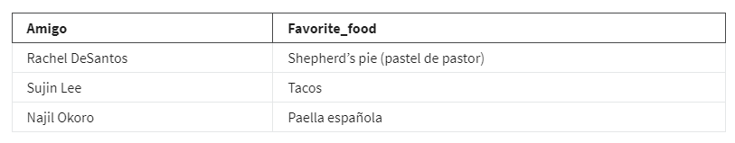
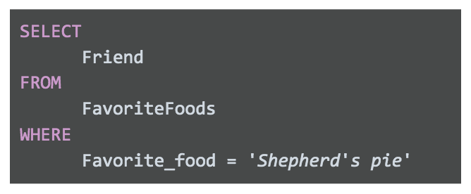
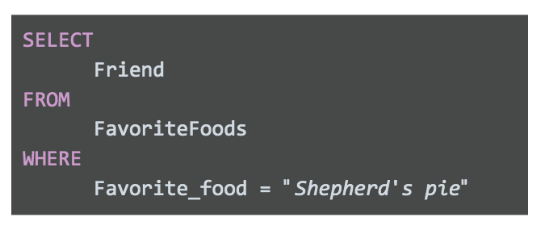
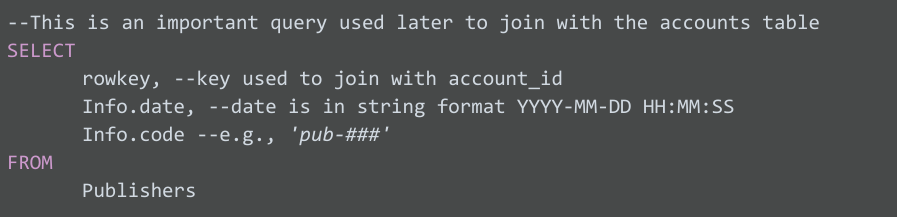
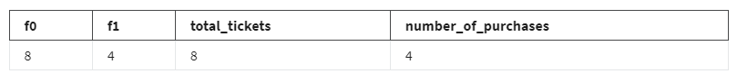
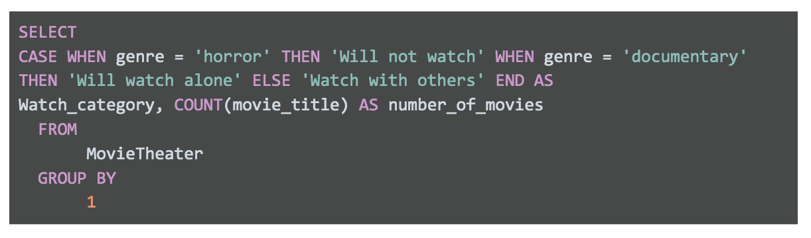
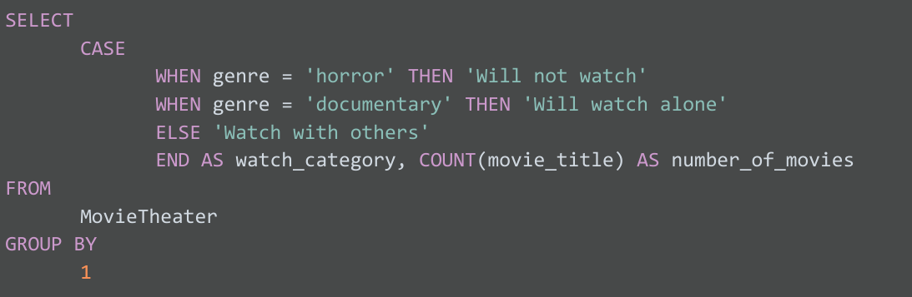
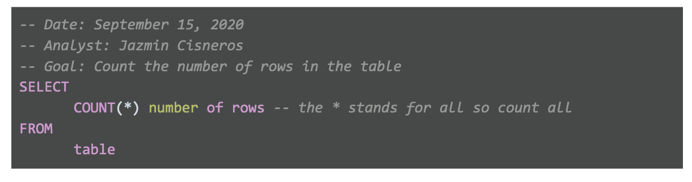
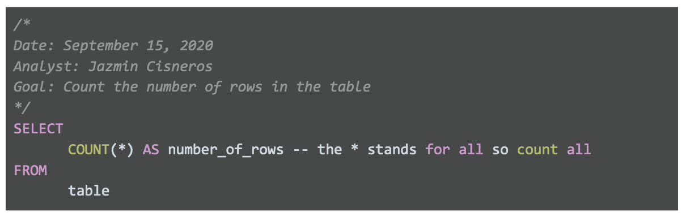

# Guía detallada Prácticas recomendadas en SQL

Estas prácticas recomendadas incluyen pautas para escribir consultas SQL y desarrollar documentación, así como ejemplos
de estas prácticas. Es un buen recurso para tener a mano cuando estés utilizando SQL por tu cuenta, así puedes dirigirte
a la sección que necesites para revisar esas prácticas. ¡Es como una guía práctica de SQL!

## Uso de mayúsculas y distinción entre mayúsculas y minúsculas

Con SQL, el uso de mayúsculas no suele importar. Puedes escribir SELECT, seleccionar o SeLeCT. ¡Todas las opciones funcionan!
Pero si utilizas mayúsculas como parte de un estilo coherente, tus consultas se verán más profesionales.

Para escribir consultas SQL como un profesional, siempre es bueno usar mayúsculas en los iniciadores de cláusulas (por
ejemplo, SELECT, FROM, WHERE, etcétera). Las funciones también deberían estar escritas con mayúsculas (por ejemplo, SUM()).

Los nombres de las columnas deberían estar escritos en minúscula (consulta la sección sobre snake_case que se encuentra
más adelante en esta guía).

Los nombres de las columnas deberían estar escritos en CamelCase (consulta la sección sobre CamelCase que se encuentra
más adelante en esta guía). Esto ayuda a que tus consultas sean coherentes y fáciles de leer, y no impactarán en los datos
que extraigas cuando las realices. En el único momento en que es importante el uso de mayúsculas es cuando se encuentran
dentro de citas (podrás leer más sobre citas más adelante).

Los proveedores de bases de datos SQL pueden utilizar variaciones ligeramente diferentes de SQL. Estas variaciones se
denominan dialectos SQL. Algunos dialectos SQL distinguen entre mayúsculas y minúsculas. BigQuery es uno de ellos. Vertica
es otro. Pero la mayoría, como MySQL, PostgreSQL y SQL Server no distinguen entre mayúsculas y minúsculas. Esto quiere decir
que si buscas country_code = ‘us’, te mostrará todas las entradas que contengan 'us', 'uS', 'Us' y 'US'. Esto no sucederá
con BigQuery. BigQuery distingue entre mayúsculas y minúsculas, de manera que esa misma búsqueda solo te mostrará entradas
en las que el country_code sea exactamente 'us'. Si el country_code es 'US', BigQuery no incluirá esas entradas en los
resultados.

Comillas simples o dobles: '' o " "

En la mayoría de los casos, tampoco es importante si utilizas comillas simples ' ' o comillas dobles " " cuando nos referimos
a las cadenas. Por ejemplo, SELECT es un iniciador de cláusula. Si escribes SELECT entre comillas, como 'SELECT' o "SELECT",
SQL lo tomará como una cadena de texto. Tu consulta será errónea porque necesita una cláusula SELECT.

Pero hay dos situaciones en las que sí importa qué tipo de comillas utilices:

Cuando quieres que las cadenas sean identificables en cualquier dialecto SQL

Cuando tu cadena contiene un apóstrofo o comillas

Dentro de cada dialecto SQL, hay reglas sobre lo que es aceptado y lo que no. Pero una regla general que comparten casi
todos los dialectos SQL es el uso de comillas simples para cadenas. Esto ayuda a evitar confusiones. Así que si queremos
referirnos a Estados Unidos en una cláusula WHERE (por ejemplo, country_code = 'US'), utiliza comillas simples para encerrar
la palabra 'US'.

La segunda situación es cuando tu cadena tiene comillas dentro. Imagina que tienes una columna de comidas favoritas en una
tabla denominada FavoriteFoods y otra columna que corresponde a cada amigo. Organizar y proteger tus datos

Puedes ver que la comida favorita de Rachel contiene un apóstrofo. Si usaras comillas simples en una cláusula WHERE para
encontrar al amigo que tiene esta comida favorita, el resultado sería:

Esto no funcionará. Si ejecutas esta consulta, obtendrás un error. Esto sucede porque SQL reconoce una cadena de texto
como algo que comienza con una comilla 'y termina con otra comilla '. Así, en la consulta errónea de arriba, SQL piensa
que la comida favorita (Favorite_food) que estás buscando es 'Shepherd'. Solo 'Shepherd' porque el apóstrofo de Shepherd’s
finaliza la cadena.

En términos generales, este debería ser el único momento en el que deberías utilizar comillas dobles en lugar de comillas
simples. Entonces, tu consulta debería verse así:

SQL entiende cadenas de texto que comienzan con una comilla simple ' o con una comilla doble ". Dado que esta cadena
comienza con comillas dobles, SQL esperará que otra comilla doble marque el final de la cadena. Esto asegurará el apóstrofo,
así que volverá a "Shepherd’s pie" y no a 'Shepherd'.

## Comentarios como recordatorios

A medida que te sientas más cómodo con SQL, podrás leer y comprender las consultas de un vistazo. Pero nunca está de más
que tengas comentarios en la consulta para recordar lo que estás tratando de hacer. Y si compartes tu consulta, eso ayudará
a que otros también puedan comprenderla.

Por ejemplo:

Puedes utilizar # en lugar de dos guiones, --, en la consulta de arriba, pero recuerda que no todos los dialectos SQL
reconocen # (MySQL no reconoce #). Por lo tanto, se recomienda usar -- de manera coherente. Cuando agregas un comentario
a una consulta utilizando --, el motor de consulta de la base de datos ignorará todo lo que esté en la misma línea luego
de --. Continuará procesando la consulta a partir de la próxima línea.

## Nombres en snake_case para columnas

Siempre es importante que te asegures que el rendimiento de tu consulta tiene nombres fáciles de entender. Si creas una
nueva columna (ya sea desde un cálculo o desde nuevos campos concatenados), la nueva columna recibirá un nombre genérico
predeterminado (por ejemplo, f0). Por ejemplo:

La siguiente tabla muestra los resultados de esta consulta: f0: 8 f1: 4 total_tickets: 8 Number_of_purchases: 4

Los resultados son:

Las primeras dos columnas se denominan f0 y f1 porque no recibieron un nombre en la consulta anterior. Los nombres SQL
predeterminados son f0, f1, f2, f3 y así sucesivamente. Denominamos las últimas dos columnas total_tickets y number_of_purchases,
así que los nombres de estas columnas aparecen en los resultados de la consulta. Por eso siempre es bueno ponerles nombres
útiles a las columnas, en especial cuando utilizamos funciones. Luego de realizar la consulta, quieres tener la capacidad
de comprender rápidamente tus resultados, como las dos columnas que describimos en el ejemplo.

Además de eso, notarás que los nombres de las columnas tienen guiones bajos entre las palabras. Los nombres nunca deben
tener espacios. Si 'total_tickets' tuviera un espacio y fuera 'total tickets', SQL cambiaría el nombre SUM(tickets) por
'total'. Debido al espacio, SQL utilizará 'total' como el nombre y no comprenderá lo que quieres decir con 'tickets'.
Entonces, los espacios son malos para los nombres en SQL. Nunca utilices espacios.

Lo mejor es utilizar snake_case. Eso quiere decir que 'total tickets', que tiene un espacio en el medio de las dos palabras,
debe escribirse como 'total_tickets', con un guion bajo en lugar de un espacio.

## CamelCase para los nombres de las tablas

También puedes utilizar CamelCase cuando le pongas nombre a tu tabla. CamelCase significa que escribes con mayúscula la
primera letra de cada palabra, como si fueran las dos jorobas de un camello bactriano. La tabla TicketsByOccasion utiliza
CamelCase.

Es opcional escribir con mayúscula la primera letra de la primera palabra en CamelCase; también se utiliza camelCase. Algunas
personas diferencian los dos estilos y los llaman CamelCase y PascalCase, y utilizan camelCase para indicar que la primera
letra no va en mayúscula, como si fuera un dromedario; por ejemplo, ticketsByOccasion

En resumen, CamelCase es una elección de estilo. También puedes denominar tus tablas de las siguientes maneras:

Todas las letras en minúscula o todas las letras en mayúscula, como ticketsbyoccasion o TICKETSBYOCCASION.

Con snake_case, como tickets_by_occasion.

Recuerda que la opción de escribir todas las letras en minúscula o todas las letras en mayúscula puede dificultar la lectura
del nombre de tu tabla, por eso no es recomendable para uso profesional.

La segunda opción, snake_case, es técnicamente correcta. Si las palabras están separadas por guiones bajos, el nombre de
tu tabla es fácil de leer, pero puede ser bastante largo porque estás agregando los guiones bajos. Además, lleva más tiempo
escribirlo. Si utilizas mucho esa tabla, puede convertirse en un fastidio.

En resumen, depende de ti utilizar snake_case o CamelCase a la hora de ponerle nombre a tus tablas. Solo asegúrate de que
el nombre de tu tabla sea fácil de leer y coherente. También asegúrate de averiguar si tu empresa prefiere nombrar las tablas
de una manera específica. Si es así, siempre sigue su convención de nomenclatura para ser coherente.

## Sangría

Como regla general, es preferible mantener la longitud de cada línea en una consulta <= 100 caracteres. Esto hará que tus
consultas sean fáciles de leer. Por ejemplo, observa esta consulta con una línea de >100 caracteres.

Esa consulta es difícil de leer e igual de complicada para solucionar o editar. Por otro lado, aquí hay una consulta en
la que nos limitamos a la regla de <= 100 caracteres:

Ahora es más fácil comprender lo que estás tratando de hacer en la cláusula SELECT. Ambas consultas se desarrollarán sin
problema porque la sangría no tiene importancia en SQL. No obstante, una sangría adecuada sigue siendo importante para que
las líneas sean cortas. Y cualquiera que lea tu consulta la valorará, ¡incluso tú mismo!

## Comentarios de muchas líneas

Si realizas comentarios que ocupan muchas líneas, puedes utilizar -- para cada línea. O si tienes más de dos líneas de
comentarios, sería más prolijo y fácil utilizar (/*) para comenzar el comentario y (*/) para cerrarlo. Por ejemplo, puedes
utilizar el método -- como se muestra debajo:

-- Fecha: 15 de septiembre de 2020 -- Analista: Jazmin Cisneros -- Objetivo: Cuenta el número de filas de la tabla
SELECT COUNT(*) cantidad de filas -- el * representa todo, así que cuenta todo FROM tabla

O puedes utilizar el método /* */ como se muestra debajo:

En SQL no importa el método que utilices. SQL ignora los comentarios independientemente de si utilizas: #, -- o /* y */.
Así que depende de ti y de tu preferencia personal. El método /* y */ para realizar comentarios de muchas líneas suele verse
más prolijo y ayuda a separar los comentarios de la consulta. Pero no hay un método correcto o uno incorrecto.

## Editores de texto SQL

Cuando te unes a una empresa, puedes esperar que cada una use su propia plataforma SQL y su propio dialecto SQL. La pla-
taforma SQL que utilicen (por ejemplo, BigQuery, MySQL o SQL Server) será donde escribas y realices tus consultas SQL.

Pero recuerda que no todas las plataformas SQL tienen editores de texto nativos para escribir en código SQL. Los editores
de texto SQL te proporcionan una interfaz donde puedes escribir tus consultas SQL de manera más sencilla y con códigos
coloridos. De hecho, ¡escribimos con un editor de texto SQL todos los códigos con los que hemos estado trabajando hasta ahora!
