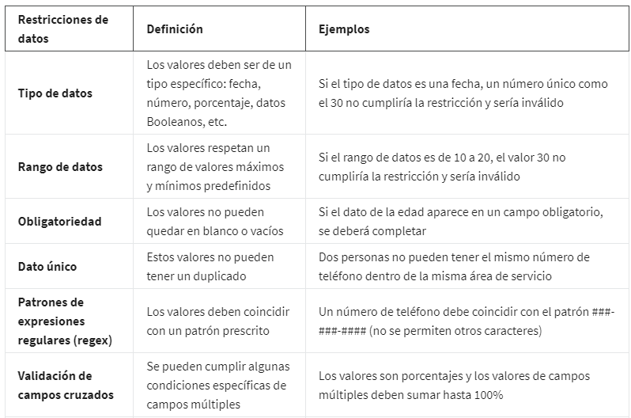
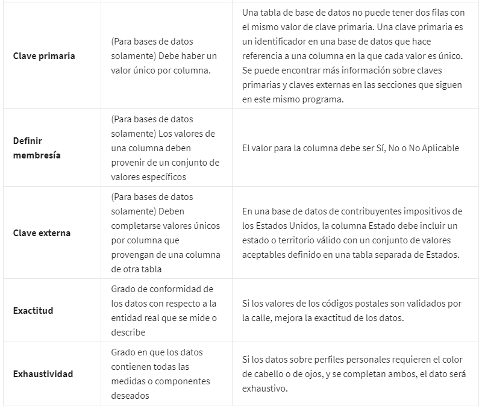

# Proceso de datos sucios a datos limpios

## Motivos por los cuales la integridad de datos es importante

La integridad de los datos consiste en la exactitud, integridad, consistencia y confiabilidad de los datos a lo largo de
su ciclo de vida.

Cuando la integridad de los datos es baja, nNo porque hayas hecho algo mal, sino porque los datos con los cuales estabas
trabajando eran erróneos desde el principio, puede causar cualquier inconveniente desde la pérdida de un píxel en una imagen
hasta una decisión médica incorrecta.

La integridad de los datos puede estar comprometida de muchas formas diferentes, Existe la posibilidad de que los datos
puedan estar comprometidos cada vez que se replican, transfieren o manipulan de cualquier forma:

*La replicación de datos* es el proceso de almacenar datos en varios sitios. Si estás replicando datos en distintos momentos
en distintos lugares, existe la posibilidad de que tus datos no estén sincronizados. Esos datos carecen de integridad porque
distintas personas pueden no utilizar los mismos datos para sus conclusiones, lo cual puede causar inconsistencias.

Dos versiones de un mismo conjunto de datos pueden provocar resultados inconsistentes.

*La transferencia de datos*, que es el proceso de copiar datos desde un dispositivo de almacenamiento a la memoria o de
una computadora a otra. Si tu transferencia de datos se interrumpe, podrías terminar con un conjunto de datos incompletos,
lo cual podría no ser útil para tus necesidades.

*El proceso de manipulación de datos* implica modificar los datos para que estén más organizados y sean más fáciles de leer. La
manipulación de datos tiene como objetivo hacer que el proceso de análisis de datos sea más eficiente, pero un error
durante el proceso puede comprometer la eficacia.

Los datos también pueden estar comprometidos por un error humano, virus, malware, piratería informática y fallas del sistema,
que pueden llevar a más dolores de cabeza.

En muchas empresas, el almacén de datos o el equipo de ingeniería de datos se encarga de garantizar la integridad de los
datos.

Entre las buenas practicas para garantizar la integridad de los datos por parte de los analistas de datos, estan:

- Comprobar dos veces que tus datos están completos y son válidos antes de analizarlos.
- Establecer un  formato único.

## Referencias: Restricciones de datos y ejemplos

Si los datos no se limpiaron adecuadamente, no podrás usarlos. Deberás esperar hasta que se realice una limpieza exhaustiva.

## Equilibrio entre los objetivos y la integridad de datos

Es importante comprobar que los datos que uses estén alineados con el objetivo comercial, Esto agrega otra capa al man-
tenimiento de la integridad de tus datos porque los datos que estás usando podrían tener limitaciones con las que deberías
lidiar. El proceso de hacer coincidir los datos con los objetivos comerciales puede ser bastante directo.

- no hay suficientes datos para completar un análisis preciso.
- datos duplicados
- limpieza adecuada de los datos
