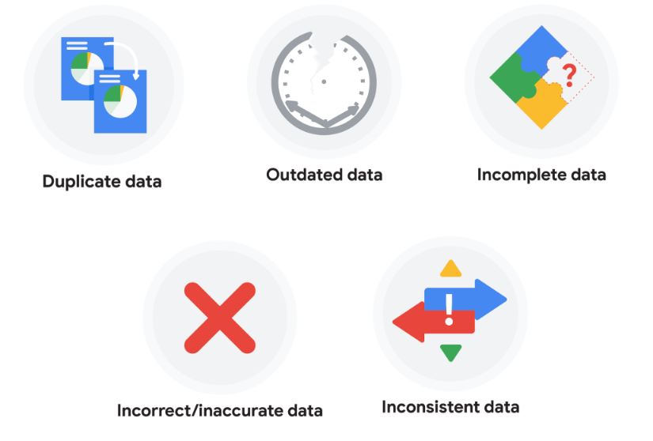
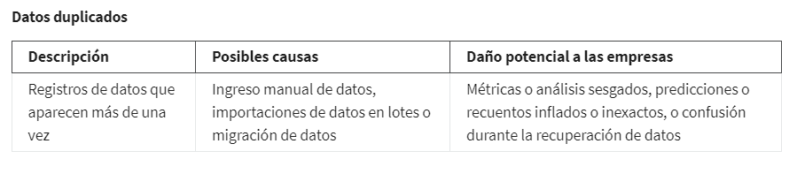
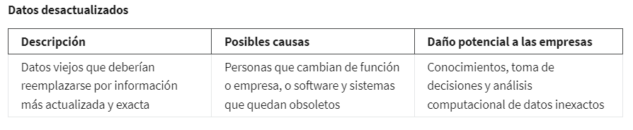
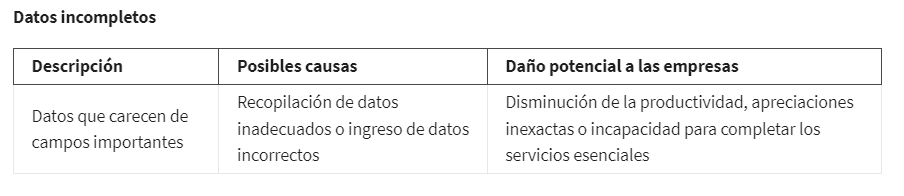
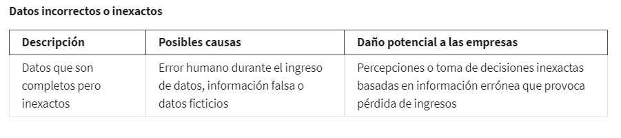
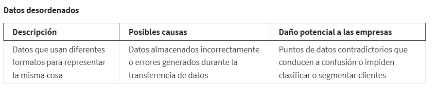

# Limpiar los datos es imprescindible

## Los datos sucios

Los datos sucios son datos incompletos, incorrectos o irrelevantes para el problema que tratas de resolver. Cuando trabajas
con datos sucios, no puedes estar seguro de que tus resultados sean correctos, No se pueden usar de forma que tengan sentido,
lo que puede causar que el análisis sea muy difícil, sino imposible. En realidad, puedes apostar con gran seguridad que
no lo serán, algunas caracteristicas ha tener en cuenta d elos datos sucios son:

    - pueden ser el resultado de que alguien escribió un dato incorrectamente.
    
    - Reproduce en un formato desordenado.
    
    - campos en blanco.
    
    - el mismo dato que se ingresó más de una vez, lo cual crea duplicados.

### Tipos de datos sucios que puedes encontrar

### Qué puede haber hecho que los datos se ensuciaran

### Cuánto afectan los datos sucios a las empresas

Segun el sector el impacto de los datos sucios pueden ser variados y mas criticos, aqui algunos ejemplos:

    - Bancos: Las inexactitudes cuestan a las empresas entre un 15% y un 25% de sus ingresos.

    - Comercio electrónico: Hasta el 25% de las bases de datos B2B (compartidas entre empresas) contienen inexactitudes.

    - Marketing y ventas: 8 de cada 10 empresas manifestaron que los datos sucios dificultan las campañas de ventas.

    - Cuidado de la salud: Los registros duplicados pueden representar el 10% e incluso hasta el 20% de los registros mé-
      dicos electrónicos de un hospital.

## Reconocer y subsanar los datos sucios

## Los datos limpios

Los datos limpios son datos completos, correctos y pertinentes para el problema que tratas de resolver. Cuando trabajas
con datos limpios, te darás cuenta de que tus proyectos transcurren mejor, Esto te permite comprender y analizar la infor-
mación e identificar patrones importantes, conectar información relacionada y sacar conclusiones útiles. Luego, puedes
aplicar lo aprendido para tomar decisiones efectivas.

## Por qué es importante limpiar los datos

Limpiar datos es increíblemente importante para un análisis efectivo. Si un dato se ingresa en una hoja de cálculo o
base de datos en forma incorrecta, si se encuentra repetido, si es un campo que quedó en blanco, o si los formatos de los
datos no son uniformes, obtendrás datos sucios como resultado. Pequeños errores pueden llevar a consecuencias graves en
el largo plazo.

Siempre es una buena idea examinar y limpiar los datos antes de comenzar el análisis.

## otros integrantes del equipo de datos

Los ingenieros de datos transforman los datos a un formato útil para su análisis y le brindan una infraestructura con-
fiable. Esto significa que desarrollan, mantienen y prueban las bases de datos, los procesadores de datos y los sistemas
relacionados.

Los especialistas en almacenamiento de datos desarrollan procesos y procedimientos para almacenar y organizar los datos
en forma efectiva. Se aseguran de que los datos se encuentren disponibles, sean seguros y existan copias de seguridad para
evitar pérdidas.

