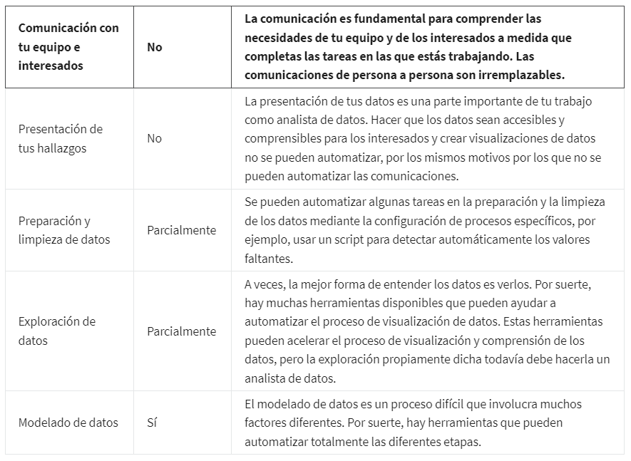

# Limpieza de datos en hojas de cálculo

## Características de la limpieza de datos en las hojas de cálculo

Las hojas de cálculo tienen herramientas que ayudan a simplificar y acelerar el proceso de limpieza de datos. Existen
muchas herramientas eficientes que el analista de datos utiliza todo el tiempo, entre otras:

- *Formato condicional:* se trata de una herramienta de la hoja de cálculo que cambia la forma en que se ven las celdas
  cuando los valores cumplen ciertas condiciones. Del mismo modo, puede indicarte cuándo una celda no cumple con las con-
  diciones establecidas. Las indicaciones visuales como esta son muy útiles para los analistas de datos, especialmente
  cuando se trabaja con una hoja de cálculo grande con muchos datos. Asegurarte de resaltar algunos puntos específicos
  hace que la información sea más fácil de comprender y analizar. Para limpiar datos, saber cuándo esos datos no siguen
  la condición es muy útil.

- *Eliminación de duplicados:* es una herramienta que busca automáticamente y elimina entradas duplicadas de una hoja de
  cálculo. Se utiliza la herramienta "Remover duplicados", la cual es una herramienta que automaticamente  busca y elimina
  entradas duplicadas de una hoja de calculo.

- *Formato de fechas:* genera un formato uniforme entre las fechas que comforman el set, permitiendonos estblacer analisis
  mas uniformes e inteligibles.

- *Ajuste de cadenas y subcadenas de texto a traves de División de texto en columnas:* En análisis computacional de datos,
  una cadena de texto es un grupo de carac teres dentro de una celda, más frecuentemente compuesto por letras. Una carac-
  terística importante de una cadena de   texto es su longitud, que es el número de caracteres en ella.
  
  Una subcadena es un subconjunto más pequeño de una cadena de texto.

  *SPLIT:* es una herramienta que divide una cadena de texto en un carácter especificado y ubica cada fragmento en una
  celda nueva y separada. SPLIT es útil cuando tienes más de un dato en una celda y quieres separarlos. Puede ser el nombre
  y apellido de una persona juntos en la lista o puede ser una celda que contiene la ciudad, el estado, el país y el
  código postal de una determinada persona, pero que, en realidad, quieres que cada uno de esos datos esté en una columna
  independiente.

  delimitador: caracter que separa los datos dentro de una cadena de texto, pueden ser, espacio en blanco, comas, millas
  simples, tabulaciones, guion bajo, guiones al medio, entre otros

  Dividir el texto en columnas también es útil para corregir instancias en que los números se guardaron como texto.

## Optimización del proceso de limpieza de datos

*las funciones*: una función es un conjunto de instrucciones que realizan un cálculo específico usando los datos de una
hoja de cálculo,e stas pueden optimizar los esfuerzos para garantizar la integridad de los datos.

*La sintaxis* es una estructura predeterminada que incluye toda la información necesaria y su lugar exacto.

*COUNTIF* es la función que devuelve un número de celdas que coinciden con un valor específico. Básicamente, cuenta el
número de veces que aparece un valor en un rango de celdas.

Sintaxys: =COUNTIF(RANGO_DE_BUSQUEDA;"OPERACION_DE_COMPARACION_Y_VALOR_HA_SER_CONTADO")

EJEMPLO: =COUNTIF(I2:I72;"<100"), contar el nuemero de ocurrencias para numeros inferiores a 100, en el rango I2:I72

*LEN* es una función que indica la longitud de una cadena de texto al contar el número de caracteres en una cadena de tex-
to. Esto es útil cuando se limpian datos, si tienes un determinado dato en tu hoja de cálculo que sabes que debe tener una
cierta longitud.

Sintaxis de =LEN(el rango).

Usar LEFT o RIGHT para obtener el conjunto específico de caracteres o números que necesitas.

*RIGHT* es la función que te brinda un cierto número de caracteres a la derecha de una cadena de texto.

Sintaxis =RIGHT(RABGO,#_CARACTERES).

*LEFT* es la función que te brinda un cierto número de caracteres a la izquierda de una cadena de texto.

Sintaxis =LEFT(RABGO,#_CARACTERES).

*MID* es la función que te brinda un segmento desde la mitad de una cadena de texto.

Sintaxis =MID(cadena, carácter_inicio, número_caracteres)

*CONCATENATE* es una función que une múltiples cadenas de texto para formar una sola.

Sintaxis =CONCATENAR(cadena1, [cadena2, …])

*TRIM* es una función que quita los espacios de más al principio, al final o repetidos en los datos.

Sintaxis =ESPACIOS(RANGO)

## Automatización del flujo de trabajo

La automatización de los flujos de trabajo y puede ayudar a trabajar más rápido y de manera más eficiente. Básicamente, la
automatización del flujo de trabajo es el proceso de automatizar las partes de tu trabajo.

### ¿Qué se puede automatizar?

## Diferentes perspectivas de los datos

Wayne Dyer dijo una vez: "Si cambias la forma en que miras las cosas las cosas que miras cambian". En el análisis compu-
tacional de datos. No hay dos proyectos exactamente iguales. De modo que solo tiene sentido que proyectos diferentes requieran que
nos enfoquemos de forma diferente respecto de informaciones diferentes.

Algunos métodos incluyen:

### Ordenar y filtrar

Ordenar y filtrar datos ayuda a los analistas de datos a personalizar y organizar la información del modo que necesitan
para un proyecto en particular. Pero esas herramientas también son muy útiles para limpiar datos.

*Ordenar* implica organizar datos en un orden significativo para que sea más fácil comprenderlos, analizarlos y visualizarlos.

Para la limpieza de datos, puedes utilizar la ordenación para:

- Colocar elementos en orden alfabético o numérico, de modo que puedas encontrar fácilmente un dato.

- Acercar entradas duplicadas para que puedas identificarlas más rápidamente.

*Los filtros*, por otro lado, son muy útiles para limpiar datos cuando quieres encontrar un dato particular. filtrar sig-
nifica mostrar datos que solo cumplen con un criterio específico mientras escondes el resto. Esto permite que veas solamente
la información que necesitas.

Al limpiar los datos, puedes utilizar un filtro para:

- Solo encontrar valores por encima de un cierto número o solo valores pares o impares.

- Ayudar a encontrar lo que necesitas rápidamente y separar la información buscada de todo el resto. De ese
  modo, puedes ser más eficiente al limpiar los datos.

### Tablas dinámicas

Una tabla dinámica es una herramienta de resumen de datos que se usa en el procesamiento de datos.
Las tablas dinámicas ordenan, reorganizan, agrupan, cuentan, totalizan o promedian datos guardados en una base de datos.
En la limpieza de datos, las tablas dinámicas se utilizan para brindar una visión rápida y sin desorden de tus datos.
También puedes elegir mirar partes específicas del conjunto de datos que necesitas para obtener una visión en forma de
tabla dinámica.

### Función VLOOKUP

VLOOKUP quiere decir búsqueda vertical. Su función consiste en buscar un cierto valor en una columna para obtener
la información correspondiente. Cuando un analista de datos busca información para un proyecto, es raro que todos los
datos que necesita estén en el mismo lugar. En general, debes buscar en múltiples hojas o incluso en diferentes base de datos.

La sintaxis de VLOOKUP es =BUSCARV(valor_búsqueda, rango_busqueda, índice_columna_devolucion, "nivel_coincidencia")

ejemplo: =BUSCARV(A2,'Sheet 2'!A2:B31,2,"FALSE")

A2 -> valor buscado
'Sheet 2'!A2:B31 ->  rango de busqueda en otra hoja
2 -> columna de respuesta una vez se encuentre el valor de busqueda, esto esta en el rango de busqueda.
"FALSE" -> nivel de coincidencia

El signo de dólar($) garantiza que la parte correspondiente de la referencia quede igual. Puedes bloquear solo la columna,
solo la fila o ambas al mismo tiempo.

### Realizar trazados para encontrar valores atípicos
