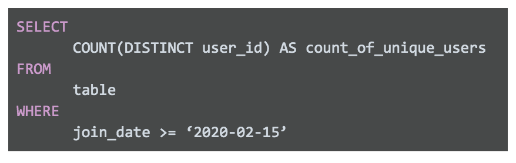
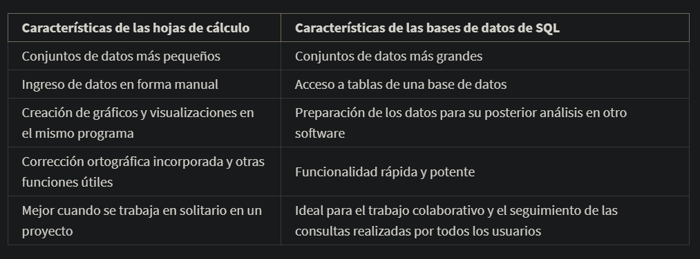

# Uso de SQL para limpiar los datos

## Comprender las capacidades de SQL

SQL es un lenguaje de consulta estructurado que los analistas utilizan para trabajar con bases de datos. Los analistas de
datos suelen usar SQL para tratar conjuntos de datos muy grandes porque puede manejar grandes cantidades de datos.

El desarrollo de SQL comenzó a principios de los años 70. En 1970, Edgar F. Codd desarrolló la teoría sobre las bases de
datos relacionales(Se trata de una base de datos que contiene una serie de tablas que pueden conectarse para formar rela-
ciones.) System R( sistema de gestión de bases de datos relacionales usado por IBM), SEQUEL. En 1979, después de numerosas
pruebas, SEQUEL, que ahora se escribe simplemente S-Q-L, se hizo público. En 1986, SQL se había convertido en el lenguaje
estándar para la comunicación de bases de datos relacionales, y todavía lo es.

## Usar SQL como analista de datos júnior

sintaxis de ejemplo de una consulta sql, donde se solicita un listado de los usuarios que se unieron a la firma, desde una
fecha en especifico hasta la fecha

Hojas de calculo vs SQL

