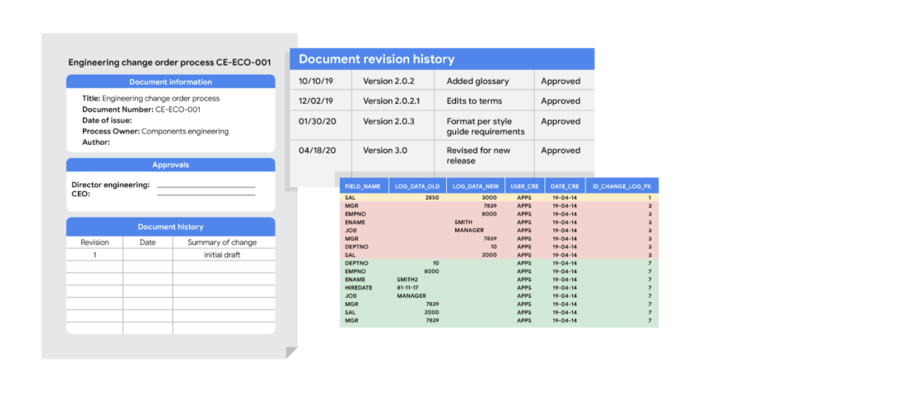
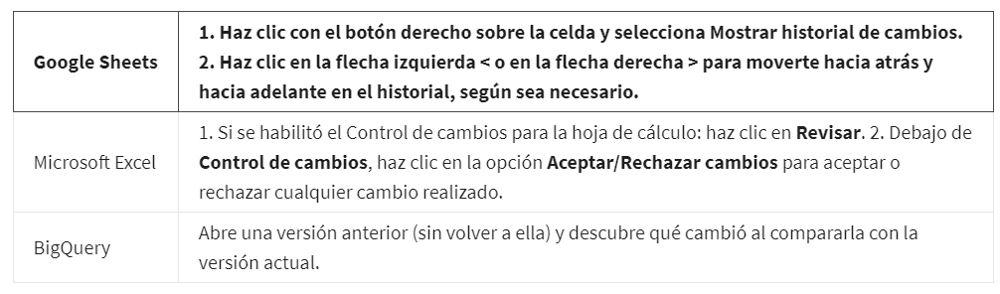

# Documenta los resultados y el proceso de limpieza

## Captura los cambios de la limpieza

la documentación es el proceso de hacer un seguimiento de los cambios, las adiciones, las eliminaciones y los errores
involucrados en tu esfuerzo de limpieza de datos.

Tener un registro de cómo evolucionaron los datos permite tres cosas muy importantes.

En primer lugar, nos permite recuperar errores de la limpieza de datos. En lugar de rascarnos la cabeza para tratar de
recordar lo que quizás hicimos tres meses atrás, contamos con una hoja de referencia en la que basarnos si nos volvemos a
encontrar con los mismos errores más adelante. También sirve crear una tabla limpia en lugar de reemplazar tu tabla existente.
De esta forma, todavía conservas los datos originales en caso de que necesites rehacer la tarea.

En segundo lugar, documentar te permite informar a otros usuarios sobre los cambios que has hecho. Si te vas de vacaciones
o te ascienden, el analista que te reemplace tendrá una hoja de referencia para consultar. La documentación te ayuda a
determinar la calidad de los datos que se van a usar en el análisis.

Los primeros dos beneficios asumen que los errores no pueden corregirse. Pero si es posible hacerlo, un informe le brinda
al ingeniero de datos más información para consultar. También es una gran advertencia para nosotros mismos que el conjunto
de datos esté lleno de errores y deba evitarse en el futuro. Si llevara mucho tiempo corregir los errores, sería mejor
consultar otros conjuntos de datos que podamos utilizar en lugar de ese.

Los analistas de datos suelen utilizar un registro de cambios para acceder a esa información. un registro de cambios es
un archivo que contiene una lista ordenada cronológicamente de las modificaciones que se hicieron a un proyecto. Puedes
utilizar y ver un registro de cambios en hojas de cálculo y en SQL para obtener resultados similares.

Podemos utilizar el *historial de versiones de la hoja*, que permite rastrear en tiempo real todos los cambios y quiénes
los hicieron tanto en celdas individuales como en toda la hoja de cálculo. Para encontrar esta función, haz clic en la
pestaña Archivo y luego selecciona Historial de versiones o al hacer click derecho sobre una celda y escoger historial de
versiones en el menu emergente.

En SQL La forma en que creas y visualizas un registro de cambios con SQL depende del programa de software que utilices.
Algunas empresas incluso tienen su propio software que realiza un seguimiento del registro de cambios y de consultas SQL
importantes. Otra opción es solo agregar comentarios a medida que avanzas en la limpieza de datos en SQL. Eso te ayudará
a construir tu registro de cambios una vez finalizada la tarea.

## Aprovecha los registros de cambios

Los analistas de datos utilizan registros de cambios para hacer un seguimiento de la transformación y de la limpieza de
los datos.

### El control de versiones automático te guiará por casi todo el camino

Muchas aplicaciones de software tienen una especie de seguimiento de historial incorporado. Por ejemplo, en Google Sheets,
puedes comprobar el historial de versiones de toda una hoja o de una celda, y regresar a una versión anterior. En Microsoft
Excel puedes utilizar una función denominada Control de cambios. Y, en BigQuery, puedes ver el historial para comprobar
qué cambió.

### Los registros de cambios te llevan más allá

Un registro de cambios puede ampliar tu historial de versiones automático al brindarte un registro aún más detallado de
tu trabajo. Aquí es donde los analistas de datos registran todos los cambios que realizan a los datos.

Los historiales de versiones registran qué se hizo en un cambio de datos para un proyecto, pero no nos dicen el por qué.
Los registros de datos son muy útiles porque nos ayudan a comprender las razones por las que se hicieron los cambios. Los
registros de cambios no tienen un formato establecido y puedes realizar tus entradas en un documento en blanco. Pero si
estás utilizando un registro de cambios compartido, será mejor acordar el formato de todas tus entradas de registro con
los otros analistas de datos.

En general, un registro de cambios registra este tipo de información:

- Datos, archivo, fórmula, consulta o cualquier otro componente que haya cambiado

- Descripción de qué cambió

- Fecha del cambio

- Persona que realizó el cambio

- Persona que aprobó el cambio

- Número de la versión

- Razón por la que se realizó el cambio

### Aquí puedes ver cómo un sistema de control de versiones afecta un cambio en una consulta

- Una empresa tiene versiones oficiales de consultas importantes en su *sistema de control de versiones.*

- Un analista asegura que cambiarán la versión más actualizada de la consulta. Esto se denomina *sincronización.*

- El analista realiza un cambio en la consulta.

- El analista puede pedirle a alguien que revise este cambio. Esto se denomina *revisión de código* y puede realizarse de
  manera informal o formal. Una revisión informal puede ser tan simple como pedirle a un analista sénior que revise el cambio.

- Una vez que el revisor aprueba el cambio, el analista envía la versión actualizada de la consulta a un repositorio del
  sistema de control de versiones de la empresa. Esto se denomina *confirmación de código*. Documentar en el área de
  comentarios cuál era exactamente el cambio y por qué se realizó es una práctica recomendada.

- Una vez que el cambio fue *enviado*, todas las personas de la empresa podrán acceder a dicho cambio y utilizar esta nueva
  consulta cuando sincronicen las consultas más actualizadas que están almacenadas en el sistema de control de versiones.

- Si la consulta tiene un problema o el negocio necesita cambios, el analista puede *deshacer* el cambio de la consulta
  utilizando el sistema de control de versiones. El analista puede ver una lista   cronológica de todos los cambios que se
  hicieron en la consulta y quién realizó cada uno de ellos. Luego, después de encontrar su propio cambio, el analista
  puede *volver* a la versión anterior.

- La consulta volvió a lo que era antes de que el analista realizara el cambio. Y todas las personas de la empresa también
  ven esta consulta original revertida.
