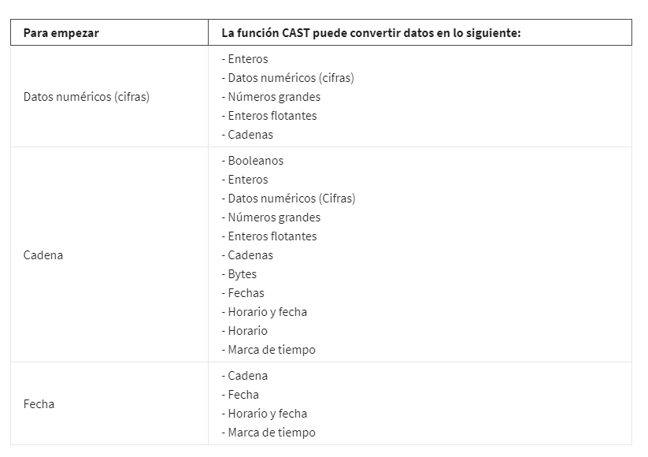
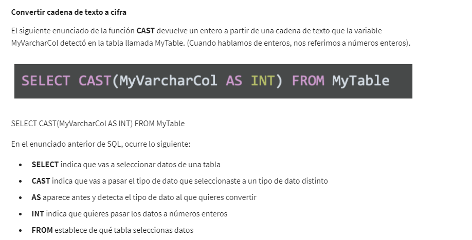
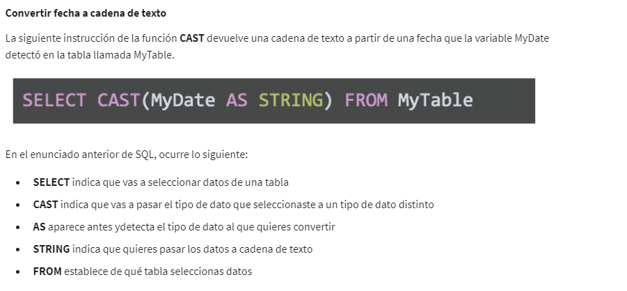
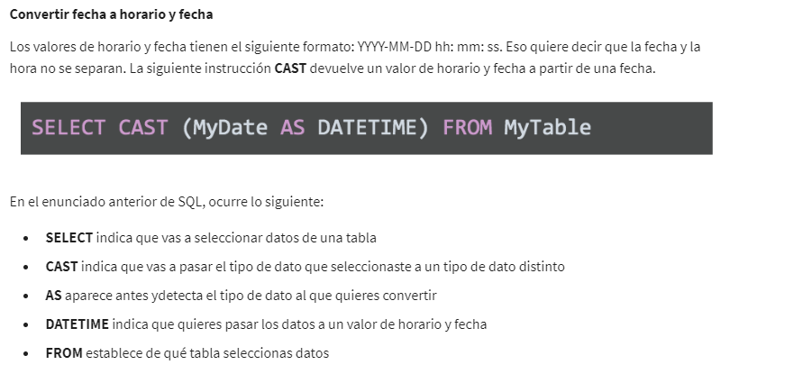
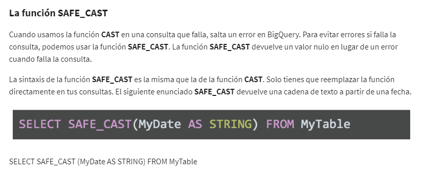

# Convertir y formatear datos

## De un tipo a otro

La forma de formatear tipos de datos en hojas de cálculo; Convertir datos. Eso significa cambiar ciertas cifras para que
tengan el formato de fecha, cadena de texto, porcentaje o, incluso, moneda.

El primer paso inclusive antes de la limpieza, es la estandarizacion de los formatos del conjuntos de datos, segun el
campo en el que se encuentren, ya sea, textos, tiempo, monedas, distancia, etc, esto ayudara a que una vez en el proceso
de limpieza y posterior el de analisis evitemos errores que nos retracen o invaliden las conclusiones que sacamaos del
conjunto.

En las hojas de caluclo, tenemos la barra de herramientas en la parte superior de la hoja, verás un menú que te puede
ayudar a convertir estos números en tipos de datos específicos. En el menú desplegable tienes muchas opciones, como cifra,
moneda, fecha, porcentaje... Si haces clic y abres todo el menú, tienes aún más opciones, incluida una para formato per-
sonalizado de cifras. Seleccionamos la columna y hacer clic en el atajo de moneda.

Con la funcion CONVERT podemos convertir una unidad de medida a otra, por ejemplo la sintaxis para fraengeith a celcius
seria:

    = convert(Celda_origen,"F","C")

Donde Celda_origen es donde tenemos el dat a convertir, luego la unidad en la que se encuentra el dato y por ultimo la
unidad en la que se requiere el dato realmente.

Es posible pegar solo los valores y no la formula como tal, seleccionamos los datos, vamos al menu pegar y elejimos pegado
especial, luego pegar solo valores y asi pegara la salida de la formula y no la formula en si misma.

## Validación de datos

La validación de datos en las hojas de cálculo. En pocas palabras, te permite controlar qué datos puedes o no ingresar en
tu hoja de cálculo. Se usa la validación de datos para agregar listas desplegables a las celdas con opciones predeterminadas
para que los usuarios elijan.

Si tu hoja de cálculo tiene muchos colaboradores, esta opción hace que sea más fácil para ellos interactuar con la tabla.
Como puedes controlar lo que se ingresa a la hoja de cálculo, limitas la cantidad de datos que tendrás que limpiar más
adelante. Veamos cómo puedes hacerlo.

Para crear un lista desplegable en google sheet, nos ubicamos en la celda donde queremos ubicarla, no dirigimos al menu
datos y validacion de datos, en el menu emergente elegimos lista de elementos desplrgable en el cuadro de criterio y en
la casilla contigua colocamos los elementos de la lista separados por comas, estos seran los elementos que posteriorment
podremos elejir durante el flujo de trabajo.

También hay otras cosas que puedes hacer con la validación de datos y las hojas de cálculo, por ejemplo, crear casillas,
para ellos, nos ubicamos en la celda donde queremos ubicarla, no dirigimos al menu datos y validacion de datos, en el menu
emergente elegimos casilla de verificacion o check box en el cuadro de criterio y en la casilla podemos elejir check por defecto
o que nos muestre un mensaje personalizado que guie la accion, por ejemplo si esta chequeado, coloque la palabra "terminado" y
sino coloque "por iniciar", estos seran los elementos que posteriormente podremos elejir durante el flujo de trabajo.

Es posible tambien proteger datos estructurados y formulas a traves del menu de validacion de datos, para ello, seleccionamos
el menu de rechazar entrada de datos para nuestra lista o nuestros checks, esto evitara que se pueda escribir y se enviara
una alerta para esta violacion de seguridad.

## Formato condicional

El formato condicional permite agregar distintas marcas visuales a tus hojas de cálculo para poder entender tus tablas con
un solo vistazo, y también ayuda a que los interesados entiendan la información de la hoja de cálculo.

Para el uso del formato condicional, primero seleccionamos el rango sobre el cual queremos aplicar marcas de color distintivas
que nos permitan interpretar a simple vista la estructura y objetivo de los datos, nos dirijimos al meno formato, luego
a formato condicional, en la casilla de rango especificamos el rango donde aplicaremos el nuevo formato, posteriormente elejimos
la regal que desencadenara el cambio de formato, puede ser un texto, para lo cual elejimos, coincidir con el texto de manera exacta y debajo
digitamos el texto que esperamos terner en la celda para que se ejecute el cambio de formato, luego especificamos el cambio de formato
como, cambiando el color, tipo de letra, etc.

Si es necesario aplicar otra regla al mismo rango, creamos una nueva regla y especificamos cual sera el detonante del cambio
y el cambio que generar tanto en color como tipo de letra entre otros.

## Transformar datos en SQL

### Posibles conversiones con CAST

### Cifra a cadena de texto

### cadena de texto a cifra

### fecha a cadena de texto

### Fecha a horario y fecha

### SafeCast

Devolvera un valor nulo ern vez de un error.

