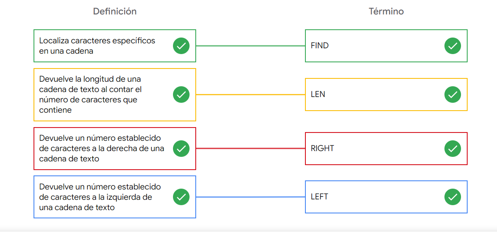
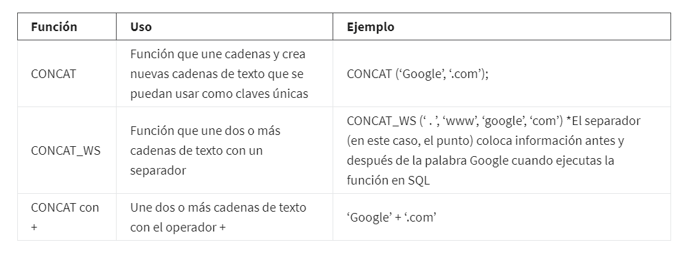
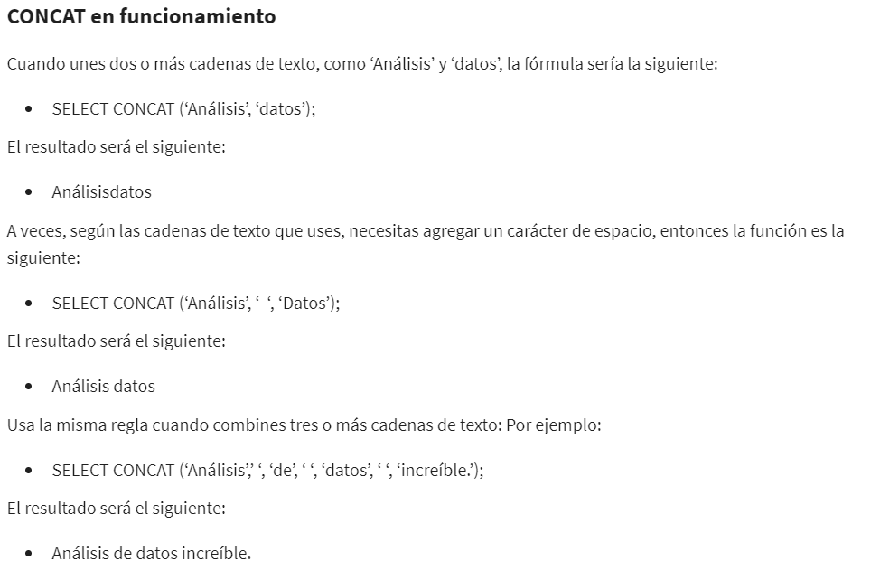

# Combinar distintos conjuntos de datos

## Unión y distintas fuentes

Para un conjunto de datos que contiene datos en dos campos separados del tipo string o texto, utilizamos la funcion
CONCAT(), la cual nos permitira concatenar dos o mas cadenas de texto si le especificamos el campo de la tabla en el
cual se enccuentran ubicados, su sintaxis seria:

    CONCAT(campo1, campo2) o CONCAT(campo1, " texto separador ", campo2)

ejemplo de consulta que obtiene la ruta de un pasajero concatenando el inicio del recorrido y su destino, el umero de viajes
realizados ,ordenando por tipo de usuario, inicio ruta, final ruta y ordenado por numero de viajes de manera descendente

SELECT
    usertype,
    CONCAT(start_sations_name, " to ", "end_sations_name") AS Route,
    COUNT(*) AS num_trips,
    ROUND(AVG(cast(tripduration as int64/60,2))) AS Duration

FROM
    ´basedatos.tabla´

GROUP BY
    start_sations_name, end_sations_name, usertype

ORDER BY
    num_trips DESC

## Cadenas de texto en hojas de cálculo

Las funciones LEN, LEFT, RIGHT, FIND Y EXTRACT

LEN ->  entre la longitud de una cadena de texto, = LEN(celda).
LEFT->  Toma un numero de caracteres desde el extremo izquierdo, = LEFT(celda, #caracteres), salida texto.
RIGHT-> Toma un numero de caracteres desde el extremo derecho, = RIGHT(celda, #caracteres), salida texto.
FIND->  Encuentra un caracter dentro de una ubicacion, = FIND(""caracter, ubicacion), salida es un etro.
EXTRACT-> Extrae una cadena de texto desde un punto inicial y un numero de caracteres determinado, contando desde el
        inicio de la cadena,  = EXTRACT(cadena, inicio, #nemrodecaracteres)

## manipulando cadenas de texto SQL

Una cadena de texto es un conjunto de caracteres que ayuda a declarar los textos en lenguajes de programación, como SQL.
Las funciones de SQL para cadena de texto se usan para obtener distintos tipos de información sobre caracteres o, en este
caso, manipularlos. Una de las funciones más usadas es CONCAT. Repasa la tabla a continuación para aprender más sobre la
función CONCAT y sus variantes.

SELECT CONCAT(campo1, campo2,...., campoN)

## consultas en SQL

