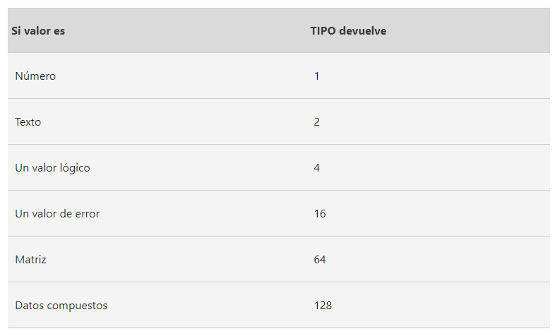

# Agregar datos para análisis

## VLOOKUP para agregación de datos

La agregación significa recolectar o juntar muchas partes separadas en un todo. La agregación de datos es el proceso de
recolectar datos de múltiples fuentes para combinarlos en una sola colección resumida. En el análisis computacional de
datos, una colección resumida, o resumen, es identificar los datos que necesitas y reunirlos todos en un lugar.

La agregación de datos ayuda a los analistas de datos a identificar tendencias, hacer comparaciones y sacar conclusiones
que no serían posibles analizando cada uno de los elementos de los datos por separado.

Los datos también se pueden agregar en un período determinado para brindar estadísticas, como promedios, mínimos, máximos
y sumas.

## Preparar para VLOOKUP

la agregación de datos es el proceso de recolectar datos de múltiples fuentes para combinarlos en una sola colección re-
sumida. La agregación de datos puede darte todo tipo de información sobre los datos que estás mirando.

VLOOKUP quiere decir búsqueda vertical. Básicamente es una función que busca un determinado valor en una columna para de-
volver la información correspondiente.

VALUE es una función que convierte una cadena de texto que representa un número en un valor numérico.

Antes de usar vlookup, verifica:

El formato de tus datos es el correcto? =TIPO(TYPE)(celda) devuelve un codigo de acuerdo al tipo de dato

los espacions al final o al principio se encuentran precentes? TRIM ayudara con esto

existen datos ducplicados? eliminar con la herramienta duplicados de la hoja de calculo

Sintaxis:

    = VLOOKUP(valor_buscado, rango_en_el_que_buscar, numero_de_la_ columna_de_retorno, coincidencia)

## Identificación de errores comunes en VLOOKUP

### limitaciones de VLOOKUP

- solo devuelve a primera coincidencia que encuentra.
- solo devuelve el valor de la dechra, por lo tanto se busca en la izquierda de la columna respuesta el valor que coincide
  con nuestra busqueda.
  
    Una solucion muy comun es que generalmente Los analistas de datos resuelven el problema copiando y pegando una columna
    a la izquierda de los datos que quieren analizar. De esa manera, el valor de búsqueda está en la columna más a la izquierda
    y los datos que quieren están a la derecha.
- bloquear la referencia del rango e busqueda para que no cambie y desborde el rango conforme avanzamos la formula celdas
  mas a la parte inferior del dataset.
