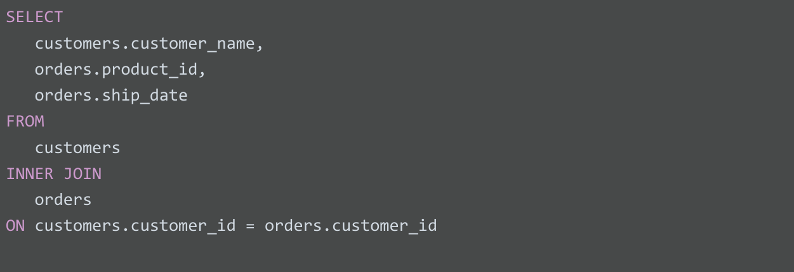
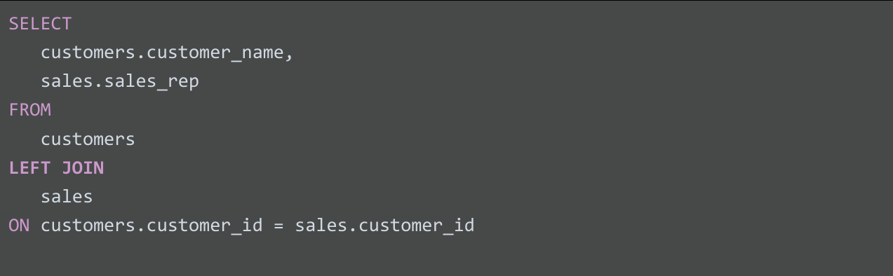
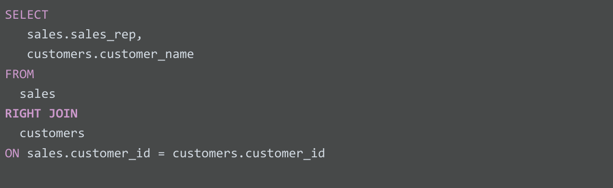
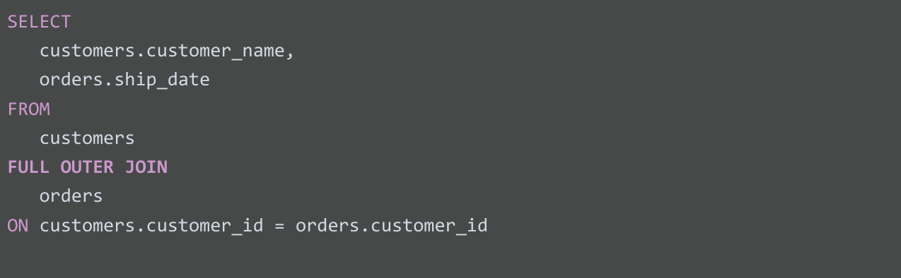

# Usa JOINS para agregar datos en SQL

## comprender el join

JOIN es una cláusula SQL que se usa para combinar filas de dos o más tablas basadas en una columna relacionada. Básicamente,
una JOIN puede entenderse como la versión SQL de VLOOKUP que acabamos de analizar.

JOIN te ayudan a combinar columnas coincidentes o relacionadas de diferentes tablas, esto lo hace a traves de las claves
primarias y secundarias, JOIN usa estas claves para identificar relaciones y valores correspondientes.

JOIN comunes que usan los analistas de datos: inner, left, right y outer.

*Inner JOIN* es una función que devuelve registros con valores coincidentes en ambas tablas, para que los registros aparezcan
en la tabla de resultados, tienen que ser valores clave en ambas tablas. Los registros solo se fusionarán si son coincidencias
en ambas tablas. Cuando ingresamos JOIN en SQL, generalmente toma inner JOIN como predeterminado.

SELECT

    *

FROM
    table_a *JOIN* table_b *ON*  keyPrimary_A *=* keySecundary_B

    -- todos los registros comunes entre la TABLA_A y la tabla_b , sobre la llaves primarias de la a que son las secundarias en la b

Ejemplo de sintaxis entre dos tablas, clientes y ordenes:

*LEFT(izquierda) JOIN* es una función que devuelve todos los registros de la tabla izquierda y solo los registros coincidentes de la
tabla derecha. Así puedes darte cuenta de qué tabla es izquierda o derecha. En inglés y en SQL leemos de izquierda a de-
recha. La tabla mencionada primero es izquierda y la tabla mencionada segundo es derecha. También puedes pensar en izquierda
como un nombre de tabla a la izquierda de la instrucción JOIN y en derecha como un nombre de tabla a la derecha de la
instrucción JOIN.

SELECT

    *

FROM
    table_a *LEFT JOIN* table_b *ON* keyPrimary_A *=* keySecundary_B

    -- todos los registros de a y los que son comunes de la tabla_b con la tabla_a, sobre la llaves primarias de la a
    -- que son las secundarias en la b

Ejemplo de sintaxis entre dos tablas, clientes y vemtas:

*RIGHT(derecha) JOIN* hace lo opuesto. Devuelve todos los registros de la tabla derecha y solo los registros coincidentes
de la izquierda.

SELECT

    *

FROM
    table_a *RIGHT JOIN* table_b *ON* keyPrimary_A *=* keySecundary_B

    -- todos los registros de a y los que son comunes de la tabla_b con la tabla_a, sobre la llaves primarias de la a
    -- que son las secundarias en la b

*OUTER JOIN* combina RIGHT y LEFT JOIN para devolver todos los registros coincidentes en ambas tablas. Esto significa que
devolverá todos los registros en ambas tablas. Si hay registros en una tabla sin coincidencias, creará un registro sin
valores para la otra tabla, en sisntesis devulve todos los registros coincidan o no coincidan.

## Alias

El alias nos permite colocar nombres mas intuitivos a nuestras columnas de salida de manera temporal, con lo cual podemos
entender a que hace referecia la salida de nuestra consulta.

Se pueden renombrar tablas

Spuede renombrar columnas

