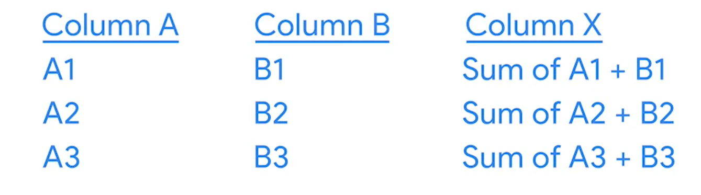

# Aprende más sobre los cálculos de SQL

Un operador es un símbolo que designa el tipo de operación o cálculo a realizarse en una fórmula. Como ya aprendiste antes,
los cuatro operadores aritméticos básicos en las fórmulas de las hojas de cálculo son:

- Signo más para la suma
- Menos o el guion para la resta
- Asterisco para la multiplicación
- Barra inclinada para la división.

Estos operadores calculan los datos de la misma manera cuando escribimos consultas en SQL. Los operadores están integrados
en las consultas cuando extraes datos de una base de datos. Al igual que en las fórmulas de las hojas de cálculo, hay
algunas formas diferentes para realizar cálculos utilizando consultas.

La sintaxis de una consulta es su estructura. Debería incluir todos los detalles específicos de los datos que quieres
extraer a una nueva tabla donde esos detalles deben colocarse.

Para sumar en sql tendiamos que, seleccionar las dos columnas que deseamos sumas, luego sumarlas y presentarlas como una
nueva columna la sintaxis seria la siguiente:

SELECT

    columnaA,
    columnaB,
    columnaA + columnaB AS columnaC

FROM

    tabla

Vista simbolica de la consulta anterior:

