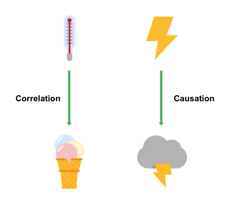
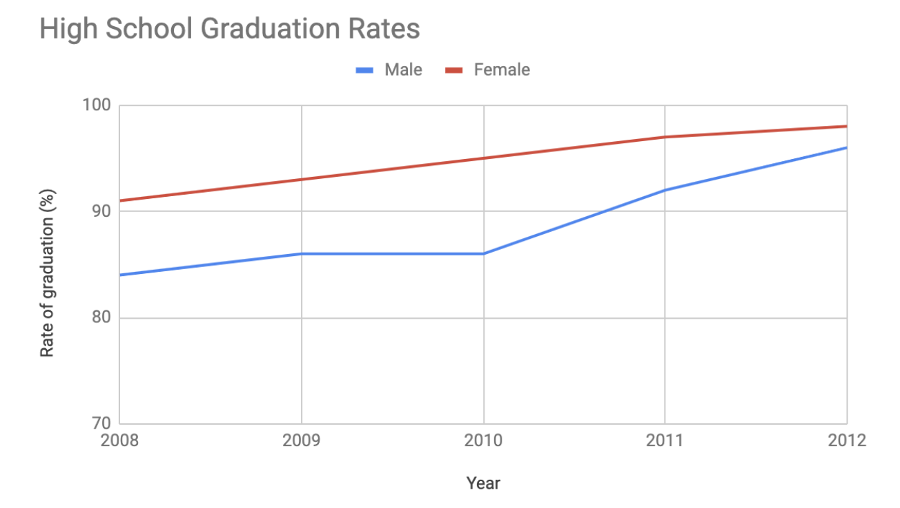
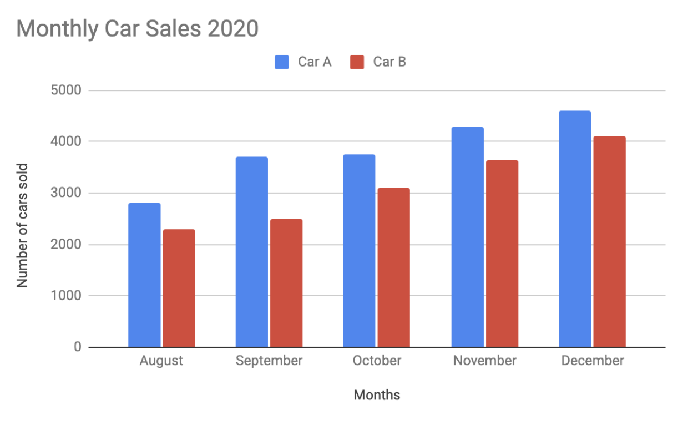
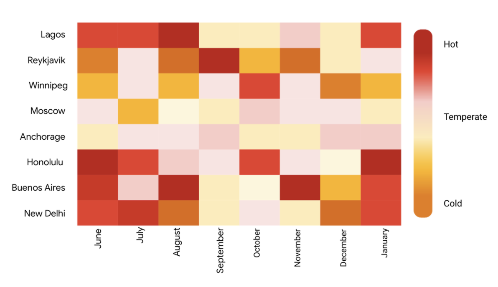
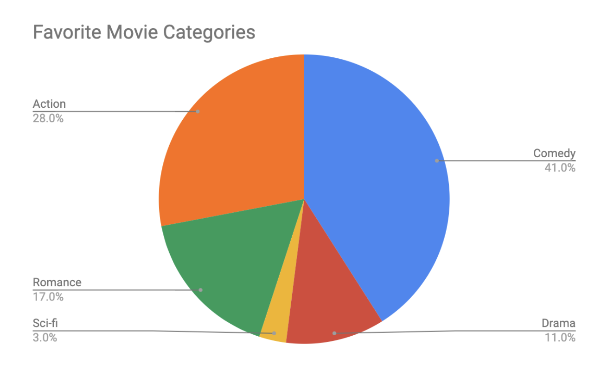
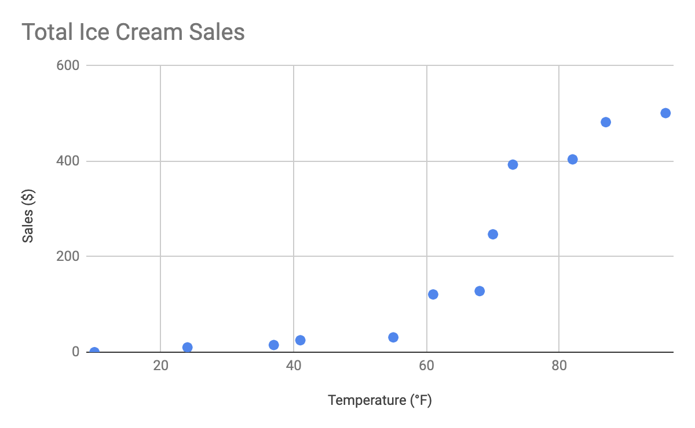
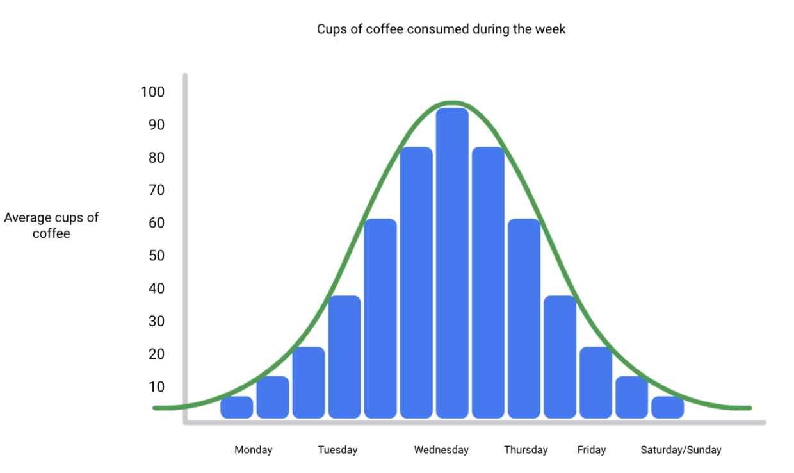
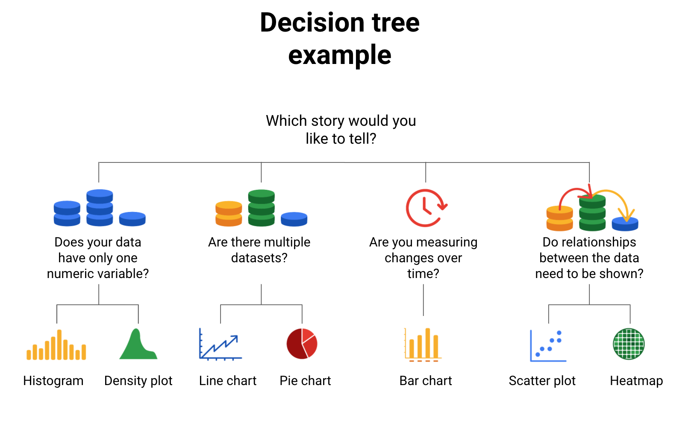

# visualizacion de datos

## Comprende la visualización de datos

Una visualización de datos, que a veces se conoce como “data viz” es la representación y presentación gráfica de los
datos. En realidad, solo es colocar información en una imagen para que sea más fácil que otras personas la entiendan.

Los científicos y matemáticos comenzaron a adoptar realmente la idea de organizar datos visualmente en los siglos XVII y XVIII.

Como analista en el mundo actual, probablemente dividas tu tiempo con elementos visuales de datos de dos maneras: mirándolos
para comprender y sacar conclusiones sobre datos o creándolos a partir de datos crudos para contar una historia.

Una regla rápida para crear una visualización. Tu público debería saber exactamente qué está mirando en los primeros cinco
segundos de verlo. Básicamente, esto significa que la representación visual debería ser clara y fácil de seguir. Y en los
cinco segundos posteriores, tu público debería comprender la conclusión que está marcando tu visualización. Aunque no estén
completamente familiarizados con la investigación que hiciste. Quizás no estén de acuerdo con tu conclusión, y eso está
bien.

Para crear una visualización que sea comprensible, efectiva y, lo que es más importante, convincente debemos tener en
cuenta que:

Las visualizaciones de datos son una herramienta útil para incluir mucha información en un espacio pequeño. Para hacerlo,
primero necesitas estructurar y organizar tus ideas. Piensa en tus objetivos y en las conclusiones a las que llegaste después
de ordenar los datos. Luego, piensa en los patrones que observaste en los datos, las cosas que te sorprendieron y, por
supuesto, en cómo todo esto junto se incorpora a tu análisis. Identificar los elementos clave de tus hallazgos ayuda a
sentar las bases de cómo deberías organizar tu presentación.

Los elementos clave de toda visualizacion serian: la información o los datos, la historia, el objetivo y el formato visua,
estos cuatro elementos son necesarios para una visualización exitosa.

    Los datos usados en las visualizaciones, son importante porque es uno de los principales cimientos de tu visualización.

    La historia o concepto agrega significado a los datos y los hace interesantes.

    El objetivo o función hace que los datos sean útiles y utilizables.

    El formato visual genera tanto belleza como estructura.

Los cuatro elementos de una visualización de datos eficaz son la información (datos), la historia (concepto), el objetivo (función)
y el formato visual (metáfora); una visualización de datos exitosa debe tener los cuatro elementos.

## Frameworks para organizar tus ideas sobre la visualización

### El método de David McCandless

En la primera lección sobre visualizaciones de datos eficaces, el Método McCandless enumera cuatro elementos de una buena
visualización de datos:

    Información: Los datos con los que trabajas

    Historia: Una narrativa o concepto claro y atractivo

    Objetivo: Una meta o función objetiva del elemento visual

    Formato visual: Un uso eficaz de la metáfora o la expresión visual

Nota: Una manera útil de abordar este framework es observar las partes del gráfico en que existe una superposición incompleta
entre los cuatro elementos.

    Un formato visual sin un objetivo, una historia o datos podría ser un esbozo o incluso arte.

    Datos más formato visual sin un objetivo o una función es un regalo para la vista.

    Los datos con objetivo, pero sin historia ni formato visual, son aburridos.

Es necesario que los cuatro elementos estén en funcionamiento para generar un elemento visual eficaz.

### Verificación con trifecta de Junk Charts de Kaiser Fung

Este enfoque es un conjunto útil de preguntas que pueden ayudar a los consumidores de visualizaciones de datos a criticar
lo que consumen y determinar cuán eficaz es. La verificación tiene tres preguntas:

    ¿Cuál es la pregunta práctica?

    ¿Qué dicen los datos?

    ¿Qué dice el elemento visual?

Nota: Esta lista de verificación te ayuda a analizar tu visualización de datos desde la perspectiva de tu público y decidir
si tu elemento visual está comunicando tus datos de una manera que les resulta eficaz o no. Además de estosframeworks, existen
algunos otros componentes que pueden ayudarte a construir tus visualizaciones de datos.

## Atributos preatencionales: marcas y canales

La creación de elementos visuales eficaces significa aprovechar lo que sabemos respecto del funcionamiento del cerebro y
luego usar elementos visuales específicos para comunicar la información de manera eficaz.

Los atributos preatencionales son los elementos de una visualización de datos que las personas reconocen automáticamente
sin hacer un esfuerzo consciente.

Los componentes esenciales básicos que hacen que los elementos visuales se comprendan de inmediato se denominan marcas y
canales.

### Marcas

Las marcas son objetos visuales básicos como puntos, líneas y formas. Cada marca se puede descomponer en cuatro cualidades:

1. *Posición*: Dónde se encuentra una marca específica en el espacio en relación con una escala u otras marcas.
2. *Tamaño*: Cuán grande, pequeña, larga o alta es una marca.
3. *Forma*: Si se da una forma a un objeto específico que comunica algo sobre él.
4. *Color*: El color de la marca.

### Canales

Los canales son aspectos o variables visuales que representan características de los datos. Los canales básicamente son
marcas que se utilizaron para visualizar datos. Los canales variarán en cuanto a su efectividad para comunicar datos según
tres elementos:

1. Exactitud: ¿Son útiles los canales en cuanto a estimar con exactitud los valores que se representan?

   Por ejemplo, el color es muy exacto al comunicar diferencias de categoría, como manzanas y naranjas. Sin embargo, es
   mucho menos eficaz al distinguir datos de cantidad como 5 y 5.5.

2. Destaque: ¿Cuán fácil es distinguir determinados valores de otros?

   Hay diversas maneras de llevar la atención hacia partes específicas de un elemento visual, y muchas de esas maneras
   aprovechan atributos preatencionales como longitud de línea, tamaño, ancho de línea, forma, encuadre, matiz e
   intensidad.

3.Agrupamiento: ¿Qué tan bien comunica un canal grupos que existen en los datos?

   Analiza la proximidad, la similitud, el encuadre, la conexión y la continuidad del canal.

Pero recuerda: Cuanto más enfatices diferentes cosas, menos peso tiene ese énfasis. Cuanto más enfatices una sola cosa,
más peso tiene.

## Principios de diseño

Una vez que comprendes los atributos preatencionales de la visualización de datos, puedes seguir con los principios de
diseño para crear elementos visuales eficaces. Estos principios de diseño son importantes para tu trabajo como analista
de datos porque te ayudan a asegurarte de que estás creando visualizaciones que comunican tus datos de manera eficaz a tu
audiencia. Teniendo en cuenta estas reglas, puedes planear y evaluar tus visualizaciones de datos para decidir si trabajan
a tu favor y a favor de tus objetivos. Y, de no ser así, ¡puedes ajustarlas!

## Evitar gráficos confusos o engañosos

Cuando analizas qué tipo de visualización crear y cómo diseñarla, querrás asegurarte de no crear gráficos confusos o
engañosos.

Como aprendiste, el análisis de datos les permite a las personas sacar conclusiones y obtener conocimientos que pueden
usar para tomar decisiones. Por eso es importante que las visualizaciones que crees comuniquen tus datos de manera exacta
y veraz.

Estos son algunos errores comunes que debes evitar para que tus visualizaciones no sean engañosas accidentalmente:

## Conectar imágenes con datos

las visualizaciones de datos son tan importantes tanto para los analistas como para los interesados. La comunicación visual
de datos es importante para quienes usan los datos como ayuda para tomar decisiones.

*Los gráficos de barras* usan contraste de tamaño para comparar dos o más valores.

La línea horizontal de los gráficos de barras generalmente se coloca abajo, se denomina eje X, y en los gráficos de barras
con barras verticales, el eje X se  usa para representar categorías, períodos de tiempo u otras variables.

La línea vertical de un gráfico de barras generalmente ubicado a la izquierda se llama eje Y. El eje Y generalmente tiene
una escala de valores para las variables.

Los gráficos de barras son una manera excelente de aclarar tendencias.

Este tipo de visualización hace que sea muy fácil identificar patrones.

*Los gráfico de líneas* son un tipo de visualización que puede ayudar a tu público a comprender movimientos o cambios en
tus datos. Generalmente se usan para hacer un seguimiento de los cambios a lo largo de un período, pero también pueden
combinarse con otros factores.

El gráfico circular. Los gráficos circulares muestran qué porcentaje del todo representa cada parte de algo. Mirando
rápidamente, es posible determinar que variable sobresaleen mayor porporcion en el grafico, cual es su distribucion con
respecto a las demas variables, etc.

*Los mapas* ayudan a organizar datos geográficamente. Lo que es genial de los mapas es que pueden contener mucha información
relacionada con la ubicación y son fáciles de interpretar para tu público.

Una de las maneras en que las visualizaciones pueden manipularse es con las escalas y las proporciones.

## La belleza de la visualización

¿por qué deberían preocuparse por la visualización de datos los analistas de datos? La audiencia no siempre tendrá la ca-
pacidad de interpretar o comprender la información compleja que les transmites, por lo que tu trabajo es informarles tu
análisis de una manera que sea significativo, interesante y fácil de comprender.

Parte de la razón por la que la visualización de datos es tan efectiva es que a los ojos de las personas les atraen los
colores, las formas y los patrones, lo que hace que esos elementos visuales sean perfectos para contar una historia que
vaya más allá de solo números.

A continuación, aparece una lista de recursos que pueden inspirar tus próximas decisiones basadas en datos, así como
también enseñarte a hacer que tus datos sean más accesibles para tu audiencia.

### El catálogo de visualización de datos [https://datavizcatalogue.com/#google_vignette]

Este catálogo muestra un rango de diferentes diagramas, cuadros y gráficos para ayudarte a encontrar la mejor opción para
tu proyecto.

### Las 25 mejores visualizaciones de datos [https://visme.co/blog/best-data-visualizations/]

En esta colección de imágenes, explora los mejores ejemplos de datos que se convierten en una visualización espectacular.

### 10 blogs de visualización de datos [https://www.tableau.com/learn/articles/best-data-visualization-blogs]

Cada enlace te llevará a un blog que es una fuente de información sobre infinidad de cosas, desde la narración de datos
hasta los datos gráficos.

### La información es bella [https://informationisbeautiful.net/wdvp/gallery-2019/]

Fundada por David McCandless, esta galería está dedicada a ayudarte a tomar decisiones visuales más claras e informadas
que se basen en hechos y datos.

### Galería de estudio de datos[https://datastudio.google.com/gallery?category=visualization]

La información es vital, pero la información presentada de manera digerible es aún más útil. Explora esta galería interactiva
y encuentra ejemplos de diferentes tipos de datos comunicados de manera visual.

## Una receta para una visualización poderosa

Una de las principales consideraciones al crear una visualización de datos es dónde quieres que se enfoque tu público.

Mostrar demasiado puede distraer y dejar confundido a tu público. En algunos casos, limitar los datos puede ser algo bueno,
pero, mostrar poco puede hacer que tu visualización sea poco clara y menos significativa.

Como regla general, siempre y cuando no sea engañoso, debes representar visualmente solo los datos que tu público necesita
para comprender tus hallazgos.

Puedes mostrar con visualizaciones:

El cambio a lo largo del tiempo es una de las principales. Si tu análisis involucra cómo cambiaron los datos durante un
período determinado, que podría ser de días, semanas, meses o años, puedes armar tu visualización para que muestre solo
el período relevante a tu objetivo.

Necesitas mostrar cómo se distribuyen tus datos, uas un histograma el cual se parece a un gráfico de barras, pero es un
gráfico que muestra con cuánta frecuencia los valores de datos caen dentro de determinados rangos. Cada intervalo o rectángulo,
como se denomina la barra, contiene un determinado número de valores que caen dentro de una pequeña parte del rango.

Los gráficos de barras con barras horizontales muestran eficazmente datos que están clasificados, con barras ordenadas en
orden ascendente o descendente. Un gráfico de barras siempre debería estar clasificado por valor, salvo que exista un orden
natural en los datos, como edad o tiempo.

Los cuadros de correlación pueden mostrar relaciones entre datos, pero debería usarse con cautela porque podrían llevar
a los espectadores a pensar que los datos muestran causalidad. La causalidad, o relación causa-efecto, se produce cando
una acción lleva directamente a un resultado.

La correlación y la causalidad a menudo se confunden porque a los seres humanos les gusta encontrar patrones aun cuando
no existen.

Si dos variables parecen estar asociadas de alguna manera, podríamos asumir que una depende de la otra. Eso implica
causalidad, incluso si las variables son completamente independientes. Si ponemos esos datos en una visualización, sería
engañoso. Pero los cuadros de correlación que sí muestran causalidad pueden ser efectivos.

## Correlación y causalidad

En esta lectura, examinarás la correlación y la causalidad en mayor detalle. Repasemos las definiciones de estos términos:

*La correlación* en estadística es la medición del grado en el que dos variables se mueven una en relación con la otra.

Un ejemplo de correlación es la idea de que “A medida que sube la temperatura, también suben las ventas de helado”. Es
importante recordar que la correlación no significa que un episodio provoca el otro. Pero sí indica que tienen un patrón
o una relación entre sí.

Si una variable sube y la otra variable también lo hace, es una correlación positiva.
Si una variable sube y la otra variable baja, es una correlación negativa o inversa.
Si una variable sube y la otra variable se mantiene igual, no hay una correlación.

*La causalidad* hace referencia a la idea de que un episodio lleva a un resultado específico. Por ejemplo, cuando hay un
relámpago, escuchamos el trueno (onda sonora) provocado porque el aire se calienta y enfría por el relámpago. El relámpago
provoca el trueno.

### ¿Por qué es importante diferenciar entre la correlación y la causalidad?

Conocer la diferencia entre la correlación y la causalidad es importante cuando sacas conclusiones a partir de tus datos,
dado que podría haber muchas cosas en juego, Cuando sacas conclusiones a partir del análisis de datos, necesitas asegurarte
de no asumir una relación de causalidad entre elementos de tus datos cuando solo existe una correlación.

### Conclusiones clave

En tu análisis de datos, recuerda:

   1. Analizar de manera crítica cualquier correlación que encuentres

   2. Examinar el contexto de los datos para determinar si tiene sentido una causalidad (y puede estar respaldada por todos los datos)

   3. Comprender las limitaciones de las herramientas que usas para el análisis

## Recursos Adicionales

Una correlación no es una causalidad: [https://towardsdatascience.com/correlation-is-not-causation-ae05d03c1f53]

Correlación y causalidad:
[https://www.khanacademy.org/test-prep/praxis-math/praxis-math-lessons/gtp--praxis-math--lessons--statistics-and-probability/a/gtp--praxis-math--article--correlation-and-causation--lesson]

## Visualizaciones dinámicas

Las visualizaciones estáticas no cambian con el tiempo salvo que se editen. Pueden ser útiles cuando quieres controlar tus
datos y tu historia de datos. Cualquier visualización impresa en papel es automáticamente estática. Los cuadros y gráficos
creados en hojas de cálculo también suelen ser estáticos.

Las visualizaciones dinámicas son interactivas y cambian a lo largo del tiempo. La naturaleza interactiva de estos gráficos
significa que los usuarios tienen algo de control sobre lo que ven. Esto puede ser útil si los interesados quieren ajustar
lo que pueden ver.

Tableau es una plataforma de inteligencia empresarial y análisis computacional que ayuda a las personas a ver, comprender
y tomar decisiones con datos. Las visualizaciones en Tableau son automáticamente interactivas.

Tener una visualización interactiva puede ser útil tanto para ti como para el público con el que la compartes. Pero es
bueno recordar que cuanto más poder le des al usuario, menos control tienes sobre la historia que quieres contar con tus
datos.

Es algo para tener en cuenta mientras aprendes cómo crear tus propias visualizaciones. Lo recomendable es encontrar el
equilibrio correcto entre la interactividad y el control. Otra cosa para tener en cuenta es que la elección de usar una
visualización estática o dinámica generalmente dependerá de los datos que estés visualizando, el público ante el cual estás
presentando, y cómo estás realizando tu presentación.

## El maravilloso mundo de las visualizaciones

La presentación visual de tus datos es una manera eficaz de comunicar información completa e involucrar a tus interesados.

Una pregunta que podrías hacerte es: “¿Cuál es la mejor manera de contar la historia que hay en mis datos?”, a continuacion
algunos ejemplos que es posible utilizar.

### Gráfico de líneas

*Un gráfico de líneas se usa para rastrear cambios en períodos cortos y largos.* Cuando existen cambios más pequeños, es mejor
usar gráficos de líneas que gráficos de barras. Los gráficos de líneas también pueden usarse para comparar cambios a lo
largo del mismo período para más de un grupo.

### Gráfico de columnas

Los gráficos de columnas usan el tamaño para contrastar y comparar dos o más valores, usando altura o longitudes para
representar los valores específicos.

### Mapa de calor

De manera similar a los gráficos de barras, los mapas de calor también usan color para comparar categorías en un conjunto
de datos. Se usan principalmente para mostrar relaciones entre dos variables y usan un sistema de códigos de color para
representar diferentes valores.

### Gráfico circular

Un gráfico circular, también conocido como gráfico de torta o sectores, se divide en segmentos que representan proporciones
que corresponden a la cantidad que representan, especialmente al hablar de las partes de un todo.

### Diagrama de dispersión

Losdiagramas de dispersiónmuestran relaciones entre diferentes variables. Los diagramas de dispersión generalmente se usan
para dos variables de un conjunto de datos, si bien se pueden mostrar variables adicionales.

### Gráfico de distribución

Un gráfico de distribución muestra la distribución de diversos resultados en un conjunto de datos.

## Los datos crecen en árboles de decisiones

Un árbol de decisiones es una herramienta de toma de decisiones que te permite, como analista de datos, tomar decisiones
basadas en preguntas clave que puedes hacerte. Cada pregunta en el árbol de decisiones sobre visualización te ayudará a
tomar una decisión respecto de características cruciales de tu visualización. A continuación, se incluye un ejemplo de
un árbol de decisiones básico para guiarte a tomar una decisión basada en datos sobre qué visualización es la mejor
manera de contar tu historia

¿Tus datos tienen solo una variable numérica?

    Histograma o diagrama de densidad

¿Existen múltiples conjuntos de datos?

    Gráfico de líneas o circular

¿Mides cambios en el tiempo?

    Gráfico de barras

¿Es necesario mostrar relaciones entre los datos?

    Diagrama de dispersión o mapa de calor
