# Diseñar visualizaciones de datos

## Elementos del arte

Tanto los analistas de datos como los artistas usan elementos de arte en su trabajo, Los elementos son línea, forma, color,
espacio y movimiento, estos elementos en particular pueden sumar valor a tu visualización de datos haciéndolos más eficaces
y atractivos a nivel visual.

### Lineas

Las líneas y visualizaciones pueden ser curvas o rectas, gruesas o finas, verticales, horizontales o diagonales

Pueden sumar un formato visual a tus datos y ayudar a armar una estructura para tu visualización.

El gráfico combinado muestra dos tipos diferentes de líneas y ambas brindan un gráfico para los datos.

El gráfico de líneas hace lo mismo, pero usa líneas curvas.

### Las formas

Las formas también son conocidas por ser variadas. Las formas y visualizaciones siempre deben ser bidimensionales.

Esto se debe a que los objetos tridimensionales en una visualización pueden complicar la representación visual y confundir
al público.

Las formas también son una gran manera de sumar contraste que llame la atención, especialmente contraste de tamaño, a tu
historia de datos.

Las formas simétricas generalmente resultan más familiares, por lo que el público tiene que trabajar menos al mirar una
visualización de datos simétrica.

las formas asimétricas igualmente se reconocen de inmediato.

Es bueno observar que los datos que compartes con tu público generalmente incidirán en los tipos de formas que deberías
usar en tu visualización de datos.

### Color

Colores, desde la perspectiva de los artistas y analistas, los colores pueden ser algo mucho más complejo. Los colores se
pueden describir por su matiz, intensidad y valor.

El matiz de un color es básicamente su nombre, rojo, verde, azul, etc.

La intensidad es cuán brillante u opaco es el color.

El valor es cuán claros u oscuros son los colores en una visualización. En términos más científicos, el valor indica cuánta
luz se refleja.

    Los valores oscuros con un poco de negro agregado se llaman tonos de color.

    Los valores claros con blanco agregado se llaman tintes.

    Variar el valor del color puede ser una manera muy eficaz de llamar la atención del público a zonas específicas.

### El espacio

El espacio es la superficie en medio, alrededor y dentro de los objetos. Siempre debería haber espacio en las visualizaciones
de datos, pero no excesivo ni escaso. el espacio entre las barras de un gráfico de barras debería ser menor al ancho de
las propias barras. Esto hará que el espectador preste atención a la barra y los datos que representa en vez de al espacio
vacío.

### movimiento

El movimiento se usa para crear una sensación de flujo o acción en una visualización.

La interactividad permite muestra un mayor volumen de datos y que revelemos múltiples historias de la misma visualización
de datos. esto es algo que debería usarse con moderación. Hay una delgada línea entre atraer la atención y distraer al público.

Una imagen estática te permite controlar todos los elementos de la historia que quieres contar. Cuando empiezas a incorporar
movimiento e interactividad, la historia es controlada por quien controla la interactividad, ya seas tú o posiblemente
tu público si le cediste el control.

Cuando juntas muchos de estos elementos de arte en una visualización como esta sobre el nivel del mar, puede ser hermoso
y provocador. Prueba que hay lugar para la expresión de creatividad en el análisis de datos.

## Principios de diseño Caracteristicas

En esta lectura, aprenderás más acerca del uso de elementos de arte y principios de diseño para crear visualizaciones eficaces.
Hasta el momento, aprendimos que comunicar datos de manera visual es una forma de arte. Ahora es momento de explorar los
nueve principios de diseño para crear visualizaciones de datos hermosas y eficaces que pueden ser informativas y atraer
a todos los públicos.

Después de que veamos los diversos principios de diseño, tómate un tiempo para examinar los ejemplos visuales para asegurarte
de tener una comprensión integral de cómo el principio se lleva a la práctica. ¡Comencemos!

Nueve principios básicos de diseño

Existen nueve principios de diseño básicos que los analistas de datos deberían considerar al armar sus visualizaciones.

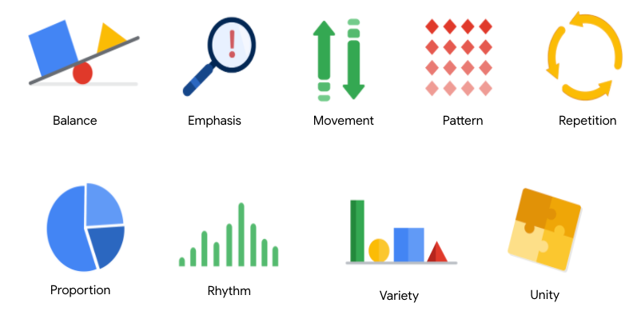

### Equilibrio

El diseño de las visualizaciones de datos está equilibrado cuando los elementos visuales clave, como el color y la forma,
se distribuyen de manera pareja. Esto no significa que necesites una simetría completa, pero tu visualización no debería
tener un lado que distraiga del otro. Si tu visualización de datos está equilibrada, esto podría significar que las líneas
usadas para crear los gráficos tienen una longitud similar en ambos lados, o que el espacio entre los objetos es igual.

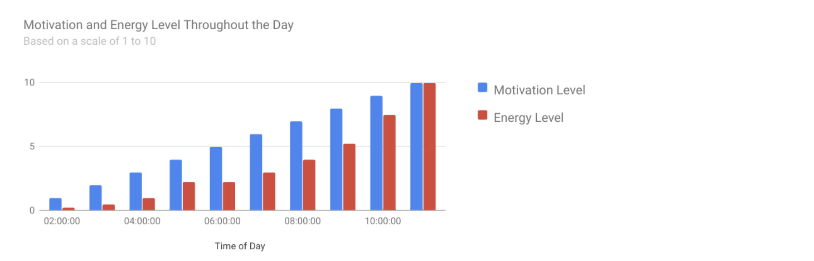

Por ejemplo, este gráfico de columnas  (que también se muestra debajo) está equilibrado; aunque las columnas tengan alturas
diferentes y el gráfico no sea simétrico. Los colores, el ancho y el espaciamiento de las columnas hacen que esta visua-
lización de datos se mantenga equilibrada. Los colores brindan un contraste suficiente entre sí para que uno pueda prestar
atención al nivel de motivación y el nivel de energía mostrado.

### Énfasis

Tu visualización de datos debería tener un punto focal para que tu público sepa dónde concentrarse. En otras palabras,
tus visualizaciones deberían poner el énfasis en los datos más importantes para que los usuarios los reconozcan primero.
El uso de colores y valores es una manera eficaz de hacer que esto suceda. Al usar colores contrastantes, puedes asegurarte
de que los elementos gráficos –y los datos que se muestran en estos elementos– se destaquen.

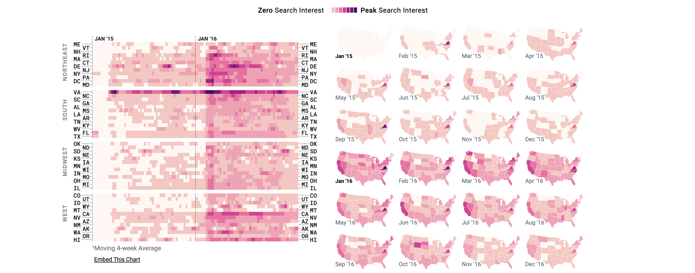

Por ejemplo, verás una visualización de datos en un mapa de calor debajo del artículo The Pudding’s “Where Slang Comes From".
Este mapa de calor usa intensidad de color y valores para enfatizar los estados en lo que el interés de búsqueda es el más
alto. Puedes identificar visualmente el incremento en la búsqueda en el tiempo desde un interés bajo hasta un interés alto.
De esta manera, puedes captar rápidamente la idea clave que se presenta sin conocer los valores de datos específicos.

### Movimiento

El movimiento puede hacer referencia al recorrido que hace el ojo del espectador cuando mira una visualización de datos o
el movimiento literal creado por animaciones. El movimiento en las visualizaciones de datos debería imitar la manera en
la que las personas normalmente leen. Puedes usar líneas y colores para hacer que la atención del espectador recorra la
página.

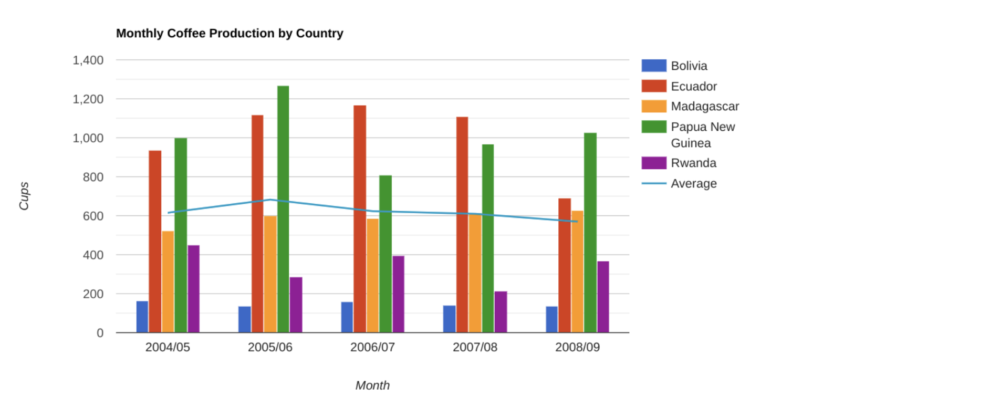

Por ejemplo, observa cómo la línea promedio en este gráfico combinado (que también se muestra debajo) lleva tu atención
de izquierda a derecha. Aunque este ejemplo no se mueve, igualmente usa el principio de movimiento para guiar la compren-
sión de los datos por parte de los espectadores.

### Patrón

Puedes usar formas y colores similares para crear patrones en tu visualización de datos. Esto puede ser útil de muchas y
diversas maneras. Por ejemplo, puedes usar patrones para destacar similitudes entre diferentes conjuntos de datos, o romper
un patrón con una forma, color o línea únicos para generar mayor énfasis.

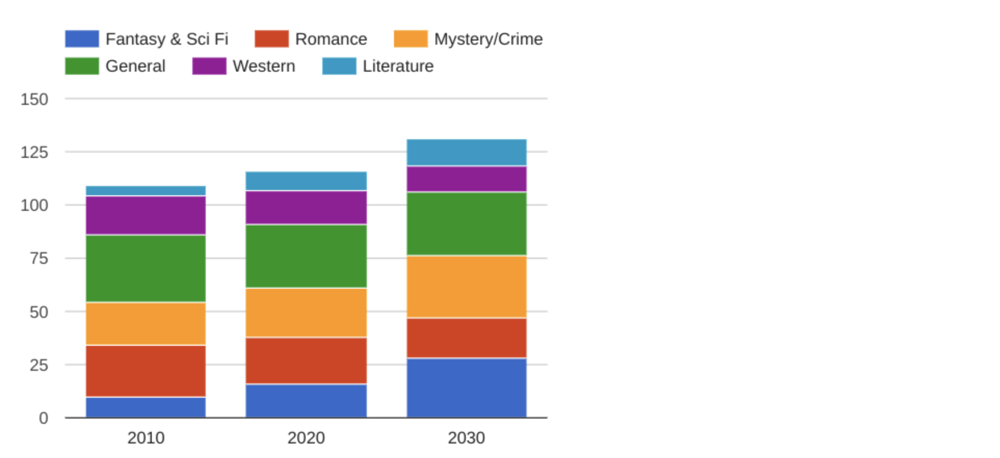

En el ejemplo que aparece debajo, las categorías con diferente color de este gráfico de columnas apiladas  (que también
se muestra debajo) son un patrón uniforme que hace que sea más fácil comparar las ventas de libros por género en cada
columna. Observa en el gráfico que la categoría de Fantasía y ciencia ficción (azul rey) se incrementa con el tiempo aun
cuando la categoría general (verde) se mantiene casi igual.

### Repetición

La repetición de tipos, formas o colores de los gráficos suma eficacia a tu visualización. Piensa en el gráfico de ventas
de libros del ejemplo anterior: La repetición de los colores ayuda al público a comprender que existen conjuntos de datos
distintos. Quizás notes esta repetición en todos los ejemplos que repasamos hasta ahora. Tómate el tiempo de repasar cada
uno de los ejemplos anteriores y observa los elementos que se repiten para crear una historia visual significativa.

### Proporción

La proporción es otra manera en que puedes demostrar la importancia de determinados datos. El uso de diversos colores y
tamaños ayuda a demostrar que estás destacando un elemento visual específico por encima de los demás. Si realizas un gráfico
en un panel más grande que los demás, estás dirigiendo la atención hacia ese gráfico. Es importante asegurarse de que cada
gráfico refleje y visualice con precisión la relación entre los valores en su interior.

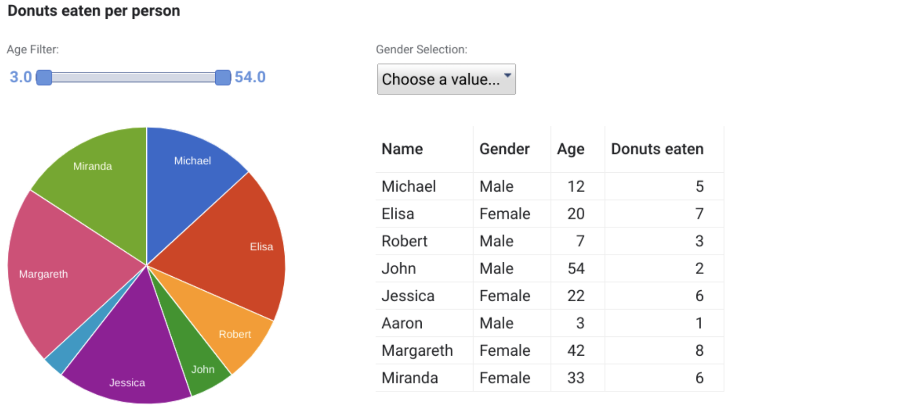

En este panel  (que también se muestra debajo), los tamaños y colores de las porciones del gráfico circular en comparación
con los datos en la tabla ayudan a que el número de rosquillas comidas por cada persona sea el punto focal.

Estos primeros seis principios de diseño son consideraciones clave que puedes tener en cuenta mientras creas tu visualización
de datos.

Los siguientes tres principios son verificaciones útiles una vez que completas tu visualización de datos. Si
aplicaste a consciencia los seis principios iniciales, probablemente ya reconocerás estos próximos tres principios dentro
de tus visualizaciones.

### Ritmo

Esto hace referencia a crear una sensación de movimiento o flujo en tu visualización. El ritmo está estrechamente unido
al principio de movimiento. Si tu diseño terminado no crea exitosamente un flujo, quizás tengas que reacomodar algunos
de los elementos para mejorar el ritmo.

### Variedad

Tus visualizaciones deberían tener algo de variedad en tipos, líneas, formas, colores y valores de gráficos que usas. La
variedad mantiene el interés de tu público. Sin embargo, es bueno encontrar un equilibrio, ya que demasiada variedad puede
confundir a las personas. La variedad que incluyas debería hacer que tus paneles y otras visualizaciones parezcan interesantes
y estén unificadas.

### Unidad

El último principio es la unidad. Esto significa que tu visualización de datos final debería ser cohesiva. Si los elementos
visuales están inconexos o no están bien organizados, serán confusas y abrumadoras.

## Impacto de la visualización de datos

Mostrar una comparación de los diferentes grupos etarios de visitantes a un sitio web, un gráfico de líneas con una línea
para cada grupo etario, más una para los usuarios totales funcionaría bien. Digamos que quieres resaltar las diferencias
entre los grupos etarios para compararlos directamente, para eso podrías usar un gráfico de barras positivo-negativo.

Para comparar datos en el tiempo utilizamos los gráficos de líneas podían ser eficaces, tambien los gráficos de barras y
los gráficos de barras apiladas, junto con los gráficos de áreas, también pueden ser buenas maneras de visualizar cómo
los datos cambian a lo largo del tiempo.

La composición de datos y se logra combinando las partes individuales de una visualización y mostrándolas juntas como un
todo. Las barras apiladas, los anillos, las áreas apiladas, los gráficos circulares y los diagramas de árbol pueden hacer
todo esto.

Para mostrar relaciones en tus datos, quizás te convenga usar diagramas de dispersión y gráficos de burbujas, gráficos de
columnas/líneas y mapas de calor.

Todo empieza en el cerebro: Al procesar información, nuestro cerebro intenta encontrar patrones y confía en el contexto
visual.

La periodista visual Dona Wong propone que las representaciones visuales exitosas, tienen tres elementos esenciales:

*El primero un significado claro*: Las buenas visualizaciones comunican con claridad su conclusión prevista.

*El segundo es un uso sofisticado del contraste*, que ayuda a separar los datos más importantes del resto usando el con-
texto visual que nuestro cerebro busca naturalmente.

*El tercer elemento esencial para las representaciones visuales eficaces es una ejecución elegante*. Las representaciones
visuales con una ejecución elegante incluyen una profunda atención a los detalles, usando elementos visuales como líneas,
formas, colores, valor, espacio y movimiento.

## Los datos son bellos

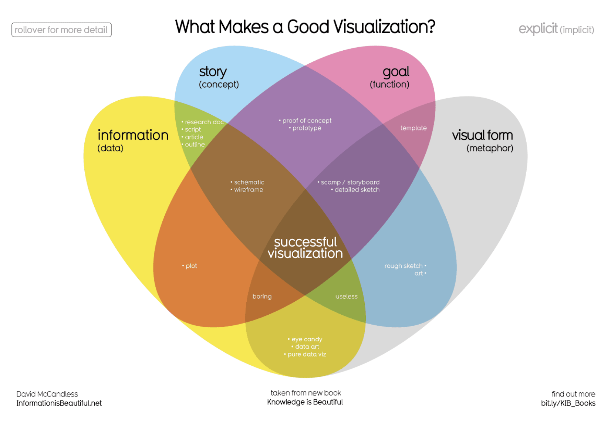

Cuatro elementos de las visualizaciones exitosas:

El diagrama de Venn realizado por David McCandless identifica cuatro elementos de las visualizaciones exitosas:

Información (datos): La información o los datos que intentas transmitir son un componente clave de tu visualización de
datos. Sin información ni datos, no puedes comunicar tus hallazgos con éxito.

Historia (concepto): La historia te permite compartir tus datos de maneras significativas e interesantes. Sin una historia,
tu visualización es informativa, pero no realmente inspiradora.

Objetivo (función): El objetivo de tu visualización de datos hace que los datos sean útiles y utilizables. Esto es lo que
intentas lograr con tu visualización. Sin un objetivo, tu visualización puede ser informativa de todos modos, pero no puede
generar conclusiones viables.

Formato visual (metáfora): El elemento del formato visual es lo que le da estructura a tu visualización de datos y la hace
bella. Sin formato visual, tus datos aún no se visualizan.

### Ejemplo 1

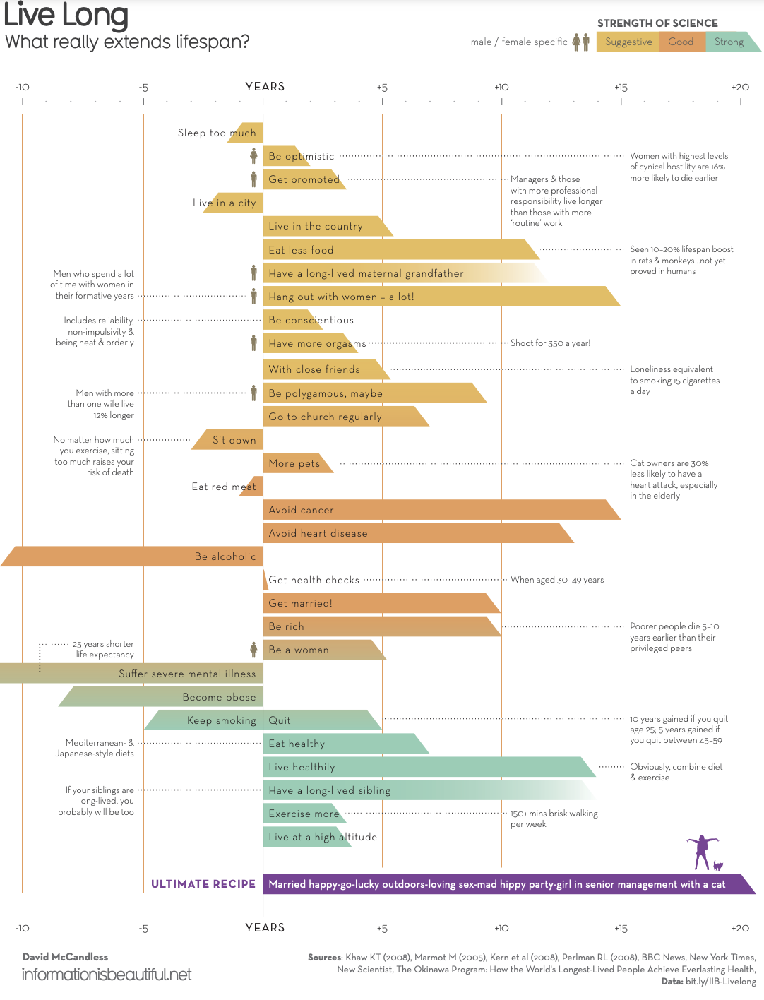

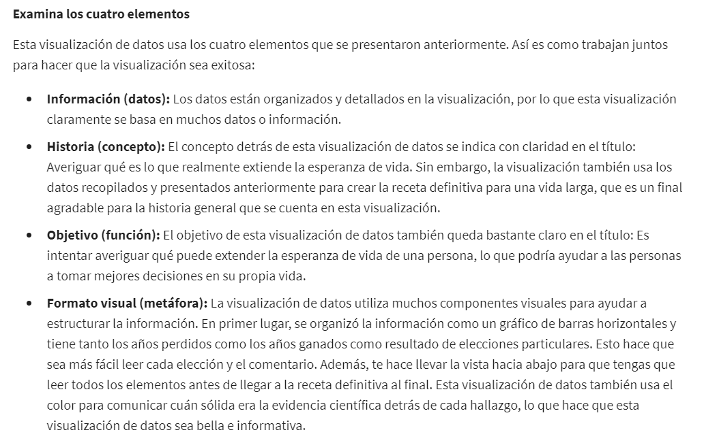

### Ejemplo 2

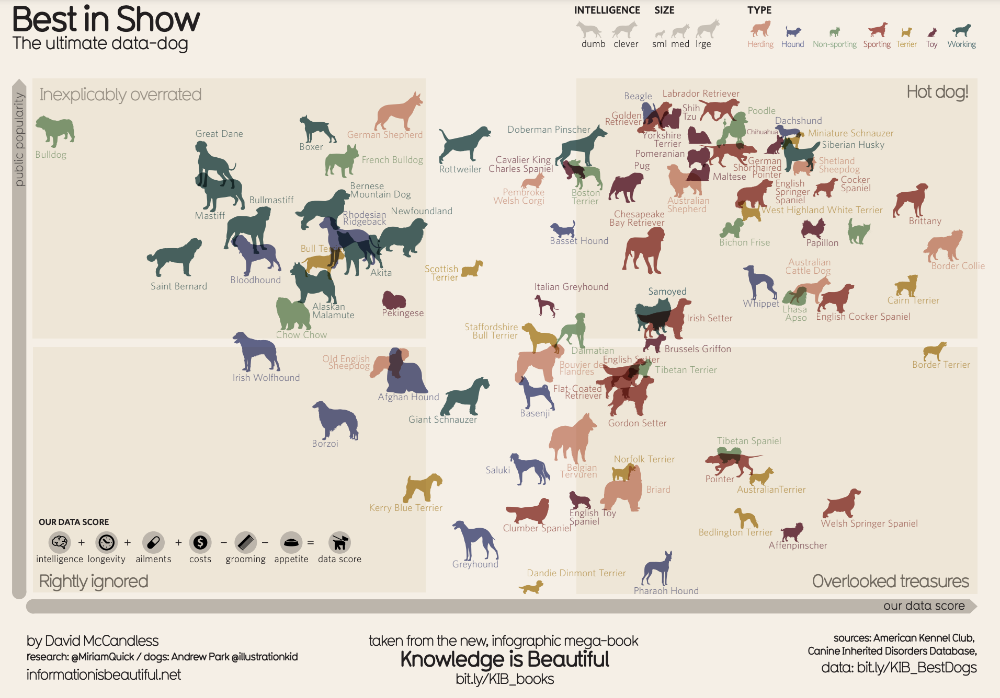

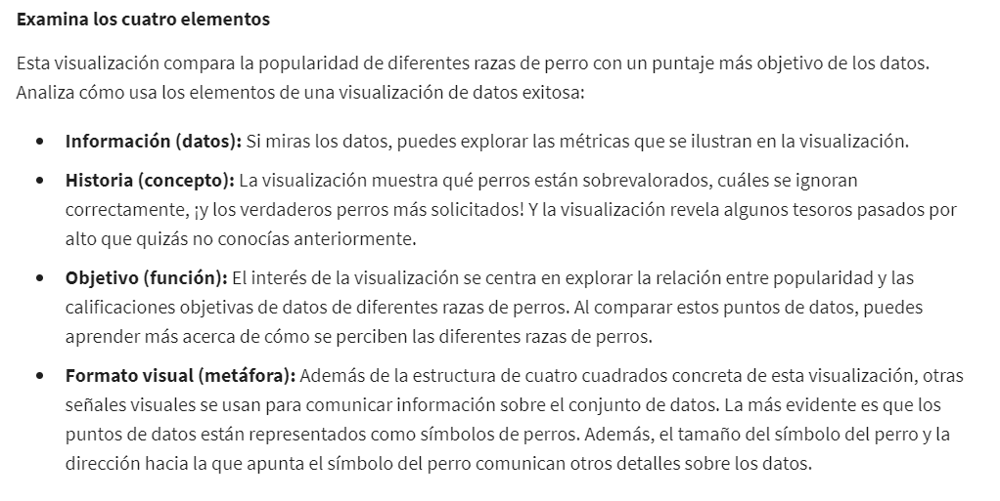

### Ejemplo 3

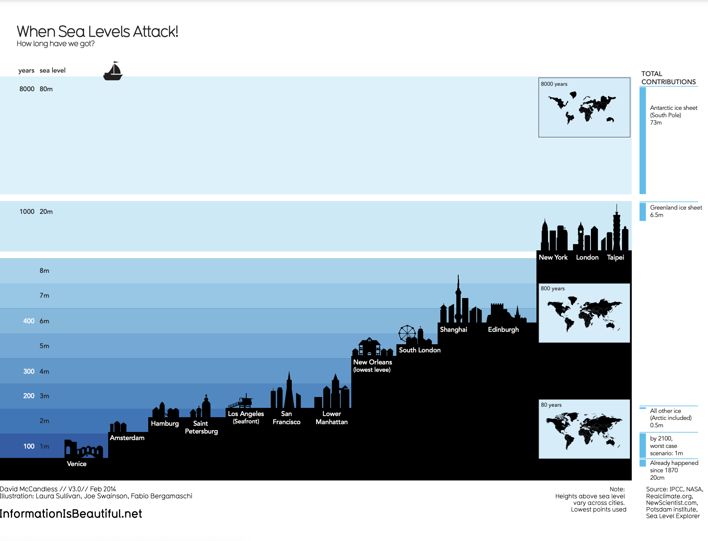

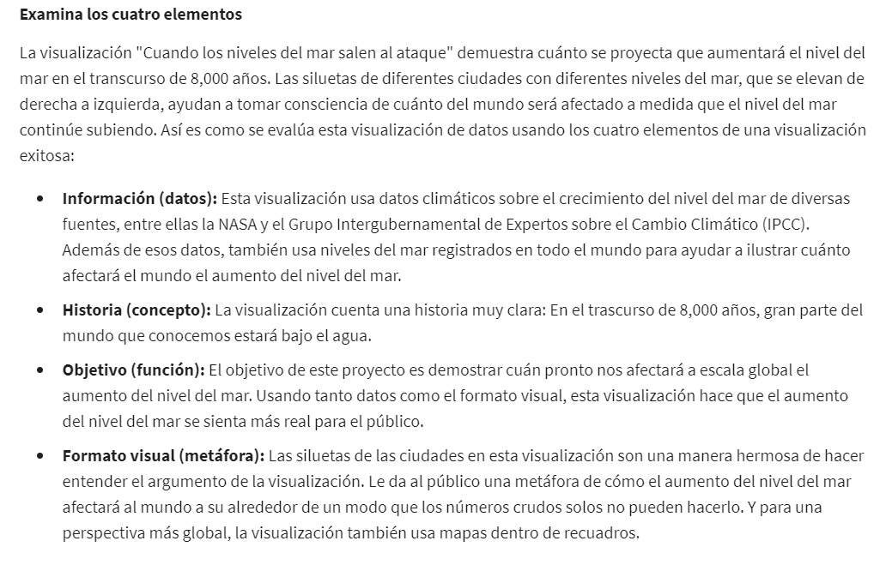

## La metodología Design Thinking y las visualizaciones

La metodología*Design Thinking*es un proceso que se usa para resolver problemas complejos de una manera centrada en el
usuario, esto es una descripción general de acciones que pueden ayudarte a producir un diseño centrado en el usuario en
tus visualizaciones.

las cinco fases que puedes usar al crear visualizaciones de datos: empatizar, definir, idear, crear prototipos y probar,
estas fases no tienen que seguir un orden fijo, sino que puedes pensar en ellas como una descripción general de acciones
que pueden ayudarte a producir un diseño centrado en el usuario en tus visualizaciones.

Empatizar piensas en las emociones y necesidades del público objetivo de tu visualización de datos, ya sea sus interesados,
miembros del equipo o el público general. En este punto, deberías evitar áreas en las que las personas podrían enfrentar
obstáculos al interactuar con tus visualizaciones.

Definir te ayuda a encontrar las necesidades de tu público, sus problemas y tus conclusiones. Esto va de la mano con la
fase de empatizar, ya que usarás lo que aprendiste en esa fase para ayudarte a explicar con lujo de detalles exactamente
qué necesita tu público de tu visualización. Podrías usar esta fase para pensar en qué datos mostrar en tu visualización.
Quizás esta visualización de datos también se presente a pacientes que forman parte del estudio de tu empresa. Si bien
necesitarás cumplir con tus objetivos, quizás haya datos que pongan incómodas a estas personas. Puedes pensar maneras de
posicionar los datos para hacer que sean más digeribles. O si presentas ante diferentes públicos, puedes ajustar tus vi-
sualizaciones para satisfacer las necesidades de cada grupo pidiéndole su opinión a miembros del grupo o colegas que tra-
bajaron antes con ese grupo.

Idear, empiezas a generar tus ideas de visualización de datos. Usarás todos tus resultados de las fases de empatizar y
definir para hacer una lluvia de ideas sobre potenciales soluciones de visualización de datos. Esto podría involucrar la
creación de borradores de tu visualización con diferentes combinaciones de color o quizás experimentar con diferentes
formas. Crear la mayor cantidad de ejemplos posibles te ayudará a refinar tus ideas. La clave en este punto es siempre
recordar a tu público cuando generas ideas y estrategias. Es recomendable que pienses en cómo puedes posicionar tus vi-
sualizaciones para satisfacer las necesidades y expectativas de tu público.
