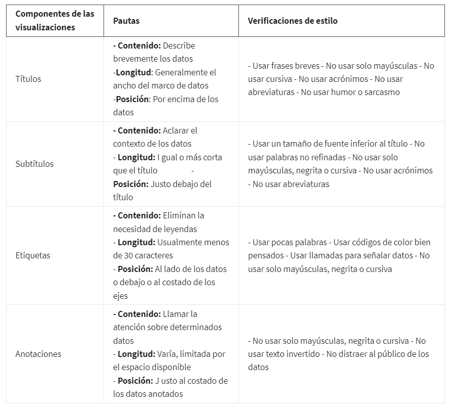
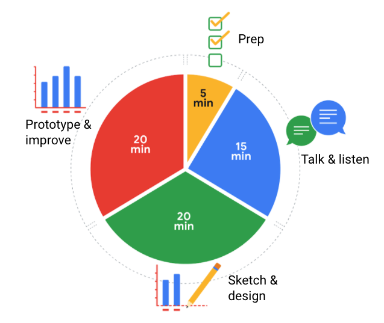

# Explora consideraciones de visualizacion

## Titulos subtitulos y etiquetas

La regla de los 5 concidera que,  Dentro de los primeros cinco segundos de ver una visualización de datos tu público de-
bería comprender exactamente qué estás intentando transmitir.

Es menos probable que tu público tenga preguntas sobre lo que estás compartiendo si agregas títulos, subtítulos y etique-
tas. Una de las maneras más fáciles de resaltar datos clave en tu visualización de datos es mediante títulos.

*Un título* es una línea de palabras impresas en letras grandes en la parte superior de una visualización para comunicar qué
datos se están presentando. Es lo que capta la atención y hace que tu público quiera leer más.

### Recomendaciones para los titulos

- Rrases claras y concisas que expliquen toda la información con la mayor sencillez.
- Evitar el uso de abreviaturas o siglas, aun si crees que todos las conocen.
- La tipografía y ubicación del título también es importante.
- Mantener la sencillez.
- Negrita o hazle unos puntos más grande que el resto del texto y ubícalo directamente por encima del gráfico, alineado
  a la izquierda.

*El subtítulo* Un subtítulo complementa al título al agregar más contexto y descripciones. Agregar un subtítulo ayudará
a tu audiencia a entender mejor los detalles asociados a tu gráfico. Generalmente, el texto de los subtítulos tiene un
tamaño de fuente inferior que el título.  refuerza el título al agregar más contexto y descripciones. Usa un estilo de
fuente que combine con el resto de los elementos del gráfico y ubica el subtítulo justo debajo del título.

*Las etiquetas* son palabras que agragan descripcion y claridad a los elementos graficos, usan diferentes propiedades vi-
suales como colores o formas para representar diferentes valores de datos. Las etiquetas osn recomendadas por encima de las
leyendas ya que, Una leyenda o llave identifica el significado de diversos elementos en una visualización de datos y puede
usarse como alternativa a etiquetar los datos directamente, mientras que la etiqueta mantiene la atención de tu público
fija en tu gráfico y le ayuda a identificar datos on rapidez.

## Consejos profesionales para destacar información clave

Quieres que sea informativo sin ser demasiado detallado. Para comunicar los resultados de tu análisis de datos de manera
significativa, usa los componentes de visualización adecuados con el estilo correcto. En otras palabras, deja que la sim-
plicidad y la elegancia trabajen en conjunto para ayudar a tu público a procesar los datos que compartes en cinco segundos
o menos.

## Visualizaciones accesibles

Aqui recomendaciones para que las visualizaciones sean accesibles e inclusivas:

- Etiquetar los datos directamente en vez de depender exclusivamente de leyendas.
- Ofrecer alternativas de texto, para que pueda modificarse en otros formatos que las personas necesiten, como letra
  grande, braille o texto a voz.
- El texto alternativo ofrece una alternativa de texto a contenido sin texto. Permite que el contenido y la función de la
  imagen sean accesibles para quienes tienen discapacidades visuales o determinadas discapacidades cognitivas.
- Hacer que los datos de los gráficos y diagramas estén disponibles en un formato de texto a través de una exportación a
  Sheets o Excel.
- Hacer que sea más fácil para las personas ver y escuchar contenido separando el primer plano y el fondo.
- El uso de colores brillantes que contrasten contra el fondo puede ayudar a quienes tienen mala visibilidad, ya sea de
  manera permanente o temporal, a ver con claridad la información transmitida.
- Evitar confiar solamente en el color para transmitir información y marcar distinciones con diferentes texturas y formas.
- evitar complicar en exceso las visualizaciones de datos. Las visualizaciones de datos demasiado complicadas hacen que
  la mayoría de los públicos pierdan interés porque no pueden descifrar en dónde y en qué enfocarse. Es por eso que des-
  glosar datos en visualizaciones sencillas es clave. Un error común es incluir demasiada información en una sola visua-
  lización o incluir largos fragmentos de texto o un exceso de información, gráficos y cuadros. Esto niega el propósito
  de tu visualización, haciendo que sea imposible de comprender a primera vista.

En sintesis, diseñar con una perspectiva de accesibilidad significa pensar en tu público anticipadamente. Enfocarse en
elementos visuales simples y fáciles de entender, y lo que es aún más importante, crear maneras alternativas de que tu
público acceda a tus datos e interactúe con ellos.

## Diseñar un gráfico en 60 minutos

A esta altura, comprendes los principios de diseño y cómo pensar como un diseñador. Entre las muchas opciones de la visu-
alización de datos, está la creación de un gráfico, que es una representación gráfica de los datos.

Elegir representar tus datos mediante un gráfico generalmente es el método más sencillo y eficaz. Repasemos el proceso
completo de crear cualquier tipo de gráfico en 60 minutos. El objetivo es desarrollar un prototipo o una maqueta de tu
gráfico que puedas presentar rápidamente a un público. Esto te permitirá darte una idea de si el gráfico está comunicando
la información que quieres.

5 minutos - preparación
15 minutos - hablar y escuchar
20 minutos - armar un prototipo y mejorarlo
20 minutos - esbozar y diseñar

Sigue este gráfico de alto nivel de 60 minutos para orientar tu razonamiento siempre que comiences a trabajar en una vi-
sualización de datos.

*Preparación (5 minutos):* Crear el espacio mental y físico necesario para un entorno de razonamiento integral. Esto sig-
nifica dejarte lugar para hacer una lluvia de ideas de cómo quieres que aparezcan tus datos mientras analizas la cantidad
y el tipo de datos que posees.

*Hablar y escuchar (15 minutos):* Identificar el objeto de tu trabajo llegando a la “pregunta detrás de la pregunta” y
establecer expectativas. Hacer preguntas y realmente concentrarse en los comentarios de tus interesados respecto de tus
proyectos para ayudarte a pulir cómo exponer tus datos.

*Esbozar y diseñar (20 minutos):* Hacer un borrador de tu enfoque al problema. Definir el cronograma y el resultado de tu
trabajo para tener una idea clara y concisa de lo que estás creando.

*Armar un prototipo y mejorarlo (20 minutos):* Generar una solución visual y medir su eficacia para comunicar con precisión
tus datos. Tómate tiempo y repite el proceso hasta producir una representación visual final. Está bien si pasas por varias
representaciones visuales hasta encontrar la opción perfecta.
